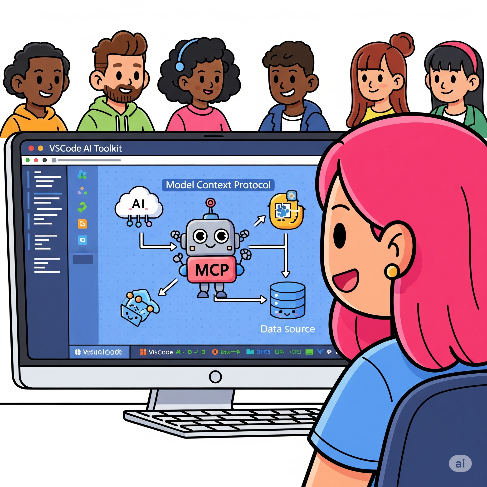
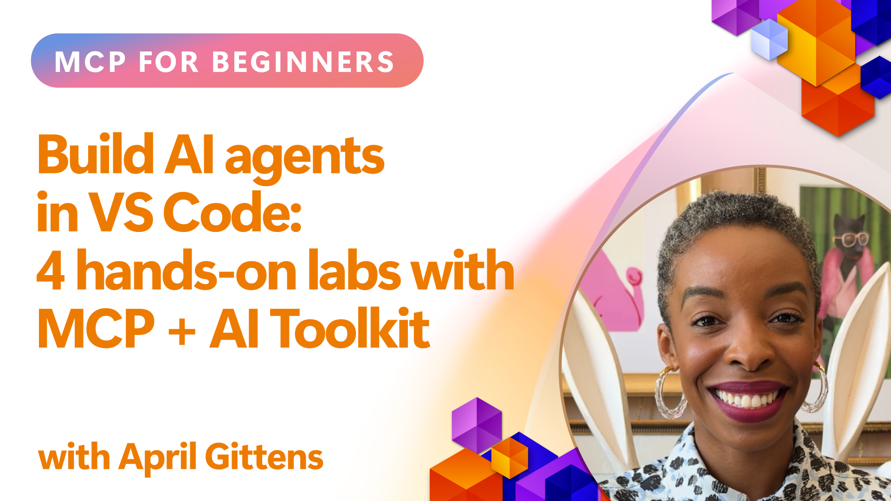

<!--
CO_OP_TRANSLATOR_METADATA:
{
  "original_hash": "1b000fd6e1b04c047578bfc5d07d54eb",
  "translation_date": "2025-08-26T16:59:51+00:00",
  "source_file": "10-StreamliningAIWorkflowsBuildingAnMCPServerWithAIToolkit/README.md",
  "language_code": "lt"
}
-->
# Optimizuojame AI darbo eigas: MCP serverio kūrimas su AI Toolkit

## 🎯 Apžvalga

_(Spustelėkite paveikslėlį aukščiau, kad peržiūrėtumėte šios pamokos vaizdo įrašą)_

Sveiki atvykę į **Model Context Protocol (MCP) dirbtuves**! Šios išsamios praktinės dirbtuvės sujungia dvi pažangiausias technologijas, kurios pakeis AI programų kūrimą:

- **🔗 Model Context Protocol (MCP)**: Atviras standartas, skirtas sklandžiai integruoti AI įrankius
- **🛠️ AI Toolkit for Visual Studio Code (AITK)**: Galingas Microsoft AI kūrimo plėtinys

### 🎓 Ko išmoksite

Baigę šias dirbtuves, įgysite įgūdžių kurti pažangias programas, kurios sujungia AI modelius su realaus pasaulio įrankiais ir paslaugomis. Nuo automatizuoto testavimo iki individualizuotų API integracijų – įgysite praktinių įgūdžių spręsti sudėtingus verslo iššūkius.

## 🏗️ Technologijų rinkinys

### 🔌 Model Context Protocol (MCP)

MCP yra **"USB-C AI pasauliui"** – universalus standartas, jungiantis AI modelius su išoriniais įrankiais ir duomenų šaltiniais.

**✨ Pagrindinės savybės:**

- 🔄 **Standartizuota integracija**: Universalus sąsajos sprendimas AI įrankių jungimui
- 🏛️ **Lanksti architektūra**: Vietiniai ir nuotoliniai serveriai per stdio/SSE transportą
- 🧰 **Turtinga ekosistema**: Įrankiai, užklausos ir resursai viename protokole
- 🔒 **Paruošta verslui**: Integruotas saugumas ir patikimumas

**🎯 Kodėl MCP svarbus:**
Kaip USB-C pašalino kabelių chaosą, MCP pašalina AI integracijų sudėtingumą. Vienas protokolas, begalės galimybių.

### 🤖 AI Toolkit for Visual Studio Code (AITK)

Microsoft flagmaninis AI kūrimo plėtinys, kuris paverčia VS Code į AI kūrimo centrą.

**🚀 Pagrindinės galimybės:**

- 📦 **Modelių katalogas**: Prieiga prie modelių iš Azure AI, GitHub, Hugging Face, Ollama
- ⚡ **Vietinė inferencija**: ONNX optimizuotas CPU/GPU/NPU vykdymas
- 🏗️ **Agentų kūrėjas**: Vizualinis AI agentų kūrimas su MCP integracija
- 🎭 **Daugiarūšis palaikymas**: Tekstas, vaizdai ir struktūrizuotas išvestis

**💡 Kūrimo privalumai:**

- Modelių diegimas be konfigūracijos
- Vizualinis užklausų kūrimas
- Realaus laiko testavimo aplinka
- Sklandi MCP serverio integracija

## 📚 Mokymosi kelionė

### [🚀 Modulis 1: AI Toolkit pagrindai](./lab1/README.md)

**Trukmė**: 15 minučių

- 🛠️ Įdiegti ir sukonfigūruoti AI Toolkit VS Code
- 🗂️ Ištyrinėti modelių katalogą (100+ modelių iš GitHub, ONNX, OpenAI, Anthropic, Google)
- 🎮 Įvaldyti interaktyvią testavimo aplinką
- 🤖 Sukurti pirmąjį AI agentą su Agentų kūrėju
- 📊 Įvertinti modelio našumą naudojant integruotus metrikos įrankius (F1, aktualumas, panašumas, nuoseklumas)
- ⚡ Išmokti paketinio apdorojimo ir daugiarūšio palaikymo galimybes

**🎯 Mokymosi rezultatas**: Sukurti funkcionalų AI agentą ir išsamiai suprasti AITK galimybes

### [🌐 Modulis 2: MCP su AI Toolkit pagrindai](./lab2/README.md)

**Trukmė**: 20 minučių

- 🧠 Įvaldyti Model Context Protocol (MCP) architektūrą ir koncepcijas
- 🌐 Ištyrinėti Microsoft MCP serverių ekosistemą
- 🤖 Sukurti naršyklės automatizavimo agentą naudojant Playwright MCP serverį
- 🔧 Integruoti MCP serverius su AI Toolkit Agentų kūrėju
- 📊 Konfigūruoti ir testuoti MCP įrankius savo agentuose
- 🚀 Eksportuoti ir diegti MCP pagrindu veikiančius agentus gamybai

**🎯 Mokymosi rezultatas**: Diegti AI agentą, sustiprintą išoriniais įrankiais per MCP

### [🔧 Modulis 3: Pažangus MCP kūrimas su AI Toolkit](./lab3/README.md)

**Trukmė**: 20 minučių

- 💻 Kurti individualius MCP serverius naudojant AI Toolkit
- 🐍 Konfigūruoti ir naudoti naujausią MCP Python SDK (v1.9.3)
- 🔍 Nustatyti ir naudoti MCP Inspector debuggingui
- 🛠️ Sukurti orų MCP serverį su profesionaliais debugging darbo eigomis
- 🧪 Debug MCP serverius Agentų kūrėjo ir Inspector aplinkose

**🎯 Mokymosi rezultatas**: Kurti ir debug individualius MCP serverius naudojant modernius įrankius

### [🐙 Modulis 4: Praktinis MCP kūrimas - individualus GitHub Clone serveris](./lab4/README.md)

**Trukmė**: 30 minučių

- 🏗️ Sukurti realaus pasaulio GitHub Clone MCP serverį kūrimo darbo eigoms
- 🔄 Įgyvendinti išmanųjį repozitorijų klonavimą su validacija ir klaidų valdymu
- 📁 Sukurti išmanųjį katalogų valdymą ir VS Code integraciją
- 🤖 Naudoti GitHub Copilot Agentų režimą su individualiais MCP įrankiais
- 🛡️ Taikyti gamybai paruoštą patikimumą ir suderinamumą tarp platformų

**🎯 Mokymosi rezultatas**: Diegti gamybai paruoštą MCP serverį, kuris optimizuoja realias kūrimo darbo eigas

## 💡 Realūs pritaikymai ir poveikis

### 🏢 Verslo panaudojimo atvejai

#### 🔄 DevOps automatizavimas

Transformuokite savo kūrimo darbo eigą su išmaniąja automatizacija:

- **Išmanus repozitorijų valdymas**: AI pagrindu veikiantis kodo peržiūros ir sujungimo sprendimai
- **Išmanus CI/CD**: Automatinė pipeline optimizacija pagal kodo pakeitimus
- **Problemos sprendimas**: Automatinė klaidų klasifikacija ir priskyrimas

#### 🧪 Kokybės užtikrinimo revoliucija

Pakelkite testavimą į naują lygį su AI automatizacija:

- **Išmanus testų generavimas**: Automatiškai sukurkite išsamius testų rinkinius
- **Vizualinis regresijos testavimas**: AI pagrindu veikiantis UI pokyčių aptikimas
- **Našumo stebėjimas**: Proaktyvus problemų identifikavimas ir sprendimas

#### 📊 Duomenų srautų intelektas

Kurti išmanesnius duomenų apdorojimo darbo eigas:

- **Adaptuojami ETL procesai**: Savarankiškai optimizuojami duomenų transformavimai
- **Anomalijų aptikimas**: Realaus laiko duomenų kokybės stebėjimas
- **Išmanus maršrutizavimas**: Išmanus duomenų srautų valdymas

#### 🎧 Klientų patirties gerinimas

Sukurti išskirtines klientų sąveikas:

- **Konteksto suvokimas**: AI agentai su prieiga prie klientų istorijos
- **Proaktyvus problemų sprendimas**: Prognozuojama klientų aptarnavimo sistema
- **Daugiakanalė integracija**: Vieninga AI patirtis visose platformose

## 🛠️ Reikalavimai ir nustatymai

### 💻 Sistemos reikalavimai

| Komponentas | Reikalavimas | Pastabos |
|-------------|-------------|---------|
| **Operacinė sistema** | Windows 10+, macOS 10.15+, Linux | Bet kuri moderni OS |
| **Visual Studio Code** | Naujausia stabili versija | Reikalinga AITK |
| **Node.js** | v18.0+ ir npm | MCP serverių kūrimui |
| **Python** | 3.10+ | Pasirinktinai Python MCP serveriams |
| **Atmintis** | Min. 8GB RAM | Rekomenduojama 16GB vietiniams modeliams |

### 🔧 Kūrimo aplinka

#### Rekomenduojami VS Code plėtiniai

- **AI Toolkit** (ms-windows-ai-studio.windows-ai-studio)
- **Python** (ms-python.python)
- **Python Debugger** (ms-python.debugpy)
- **GitHub Copilot** (GitHub.copilot) - Pasirinktinai, bet naudinga

#### Pasirinktiniai įrankiai

- **uv**: Modernus Python paketų valdymo įrankis
- **MCP Inspector**: Vizualinis debugging įrankis MCP serveriams
- **Playwright**: Naršyklės automatizavimo pavyzdžiams

## 🎖️ Mokymosi rezultatai ir sertifikavimo kelias

### 🏆 Įgūdžių įvaldymo kontrolinis sąrašas

Baigę šias dirbtuves, įgysite šiuos įgūdžius:

#### 🎯 Pagrindinės kompetencijos

- [ ] **MCP protokolo įvaldymas**: Gilus architektūros ir įgyvendinimo modelių supratimas
- [ ] **AITK įgūdžiai**: Ekspertinis AI Toolkit naudojimas greitam kūrimui
- [ ] **Individualių serverių kūrimas**: Kurti, diegti ir palaikyti gamybinius MCP serverius
- [ ] **Įrankių integracijos meistriškumas**: Sklandžiai sujungti AI su esamomis kūrimo darbo eigomis
- [ ] **Problemos sprendimo taikymas**: Taikyti įgytus įgūdžius realiems verslo iššūkiams

#### 🔧 Techniniai įgūdžiai

- [ ] Nustatyti ir konfigūruoti AI Toolkit VS Code
- [ ] Kurti ir įgyvendinti individualius MCP serverius
- [ ] Integruoti GitHub modelius su MCP architektūra
- [ ] Kurti automatizuotus testavimo darbo eigas su Playwright
- [ ] Diegti AI agentus gamybai
- [ ] Debug ir optimizuoti MCP serverių našumą

#### 🚀 Pažangios galimybės

- [ ] Architektūruoti verslo masto AI integracijas
- [ ] Įgyvendinti saugumo geriausias praktikas AI programoms
- [ ] Kurti mastelio MCP serverių architektūras
- [ ] Kurti individualias įrankių grandines specifinėms sritims
- [ ] Mentoruoti kitus AI kūrimo srityje

## 📖 Papildomi resursai

- [MCP specifikacija](https://modelcontextprotocol.io/docs)
- [AI Toolkit GitHub repozitorija](https://github.com/microsoft/vscode-ai-toolkit)
- [MCP serverių pavyzdžių kolekcija](https://github.com/modelcontextprotocol/servers)
- [Geriausių praktikų vadovas](https://modelcontextprotocol.io/docs/best-practices)

---

**🚀 Pasiruošę pakeisti savo AI kūrimo darbo eigą?**

Kurkime pažangių programų ateitį kartu su MCP ir AI Toolkit!

---

**Atsakomybės apribojimas**:  
Šis dokumentas buvo išverstas naudojant AI vertimo paslaugą [Co-op Translator](https://github.com/Azure/co-op-translator). Nors siekiame tikslumo, prašome atkreipti dėmesį, kad automatiniai vertimai gali turėti klaidų ar netikslumų. Originalus dokumentas jo gimtąja kalba turėtų būti laikomas autoritetingu šaltiniu. Kritinei informacijai rekomenduojama profesionali žmogaus vertimo paslauga. Mes neprisiimame atsakomybės už nesusipratimus ar klaidingus interpretavimus, atsiradusius naudojant šį vertimą.