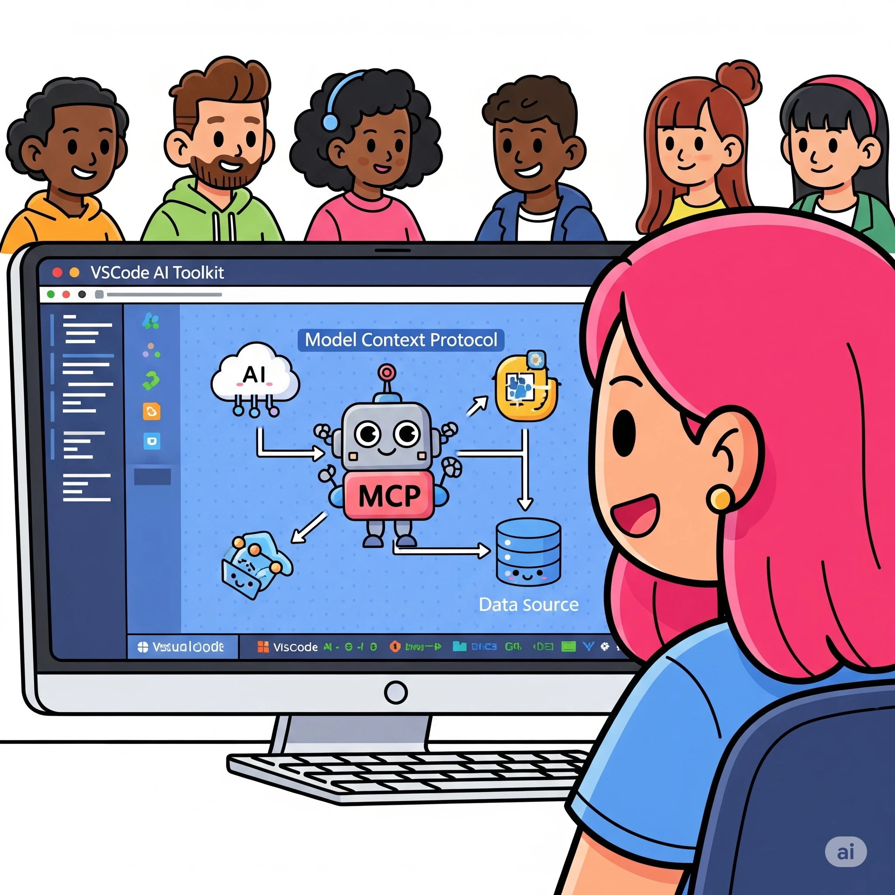
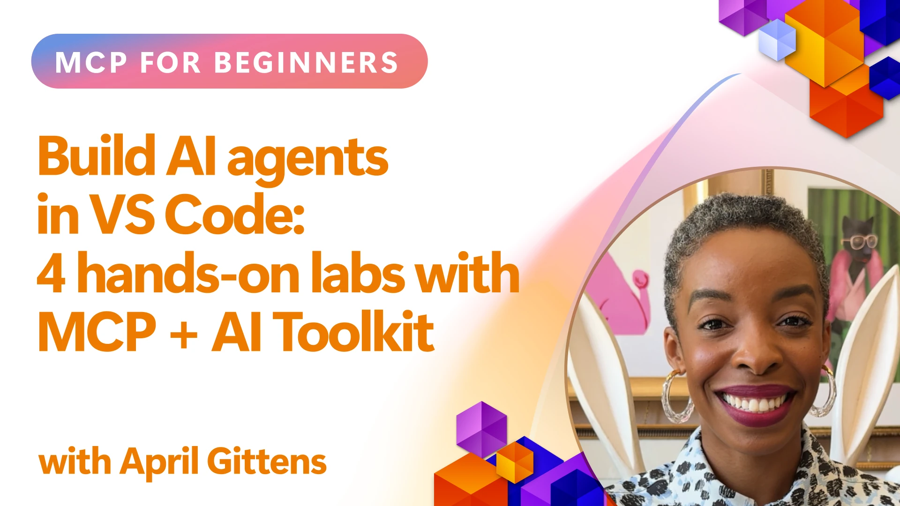

# AI darbo procesų optimizavimas: MCP serverio kūrimas su Microsoft Foundry Toolkit

## 🎯 Apžvalga

_(Paspauskite paveikslėlį, kad peržiūrėtumėte šios pamokos vaizdo įrašą)_

Sveiki atvykę į **Model Context Protocol (MCP) dirbtuves**! Šios išsamios praktinės dirbtuvės sujungia dvi pažangiausias technologijas, kad pakeistų AI programų kūrimą:

> **Suderinamumo pastaba:** dirbtuvių kodas buvo sukurtas ir išbandytas su MCP
> `2025-11-25`, kaip parodyta aukščiau esančiame ženklelyje. Naudokite
> [naujausią `2026-07-28` specifikaciją](https://modelcontextprotocol.io/specification/2026-07-28/)
> naujiems protokolo įgyvendinimams ir peržiūrėkite SDK leidimo pastabas prieš
> perkeliamas dirbtuves.

- **🔗 Model Context Protocol (MCP)**: atviras standartas sklandžiai AI įrankių integracijai
- **🛠️ Microsoft Foundry Toolkit papildinys VS Code**: galingas Microsoft AI kūrimo įrankis

### 🎓 Ko išmoksite

Baigę šias dirbtuves, įvaldysite išmaniosios programinės įrangos kūrimą, kuris jungia AI modelius su realaus pasaulio įrankiais ir paslaugomis. Nuo automatizuotų testavimų iki individualių API integracijų, įgysite praktinių įgūdžių spręsti sudėtingus verslo iššūkius.

## 🏗️ Technologijų rinkinys

### 🔌 Model Context Protocol (MCP)

MCP yra **„USB-C AI“** – universalus standartas, jungiantis AI modelius su išoriniais įrankiais ir duomenų šaltiniais.

**✨ Pagrindinės savybės:**

- 🔄 **Standartizuota integracija**: universali sąsaja AI įrankiams prijungti
- 🏛️ **Lanksti architektūra**: vietiniai ir nuotoliniai serveriai per stdio/SSE transportą
- 🧰 **Turtinga ekosistema**: įrankiai, užklausos ir ištekliai viename protokole
- 🔒 **Įmonių lygio paruošimas**: įmontuotas saugumas ir patikimumas

**🎯 Kodėl MCP svarbus:**
Kaip USB-C pašalino laidų painiavą, taip MCP pašalina AI integracijų sudėtingumą. Vienas protokolas – begalinės galimybės.

### 🤖 Microsoft Foundry Toolkit papildinys VS Code

Microsoft pagrindinis AI kūrimo papildinys, kuris paverčia VS Code galingu AI įrankiu.

**🚀 Pagrindinės galimybės:**

- 📦 **Modelių katalogas**: prieiga prie modelių iš Azure AI, GitHub, Hugging Face, Ollama
- ⚡ **Vietinė išvada**: ONNX optimizuotas CPU/GPU/NPU vykdymas
- 🏗️ **Agentų kūrėjas**: vizualus AI agentų kūrimas su MCP integracija
- 🎭 **Daugiakanalis**: palaiko tekstą, vaizdą ir struktūrizuotą išvestį

**💡 Kūrimo privalumai:**

- Be konfigūracijos modelių diegimas
- Vizualinė užklausų inžinerija
- Realaus laiko testavimo aplinka
- Sklandi MCP serverio integracija

## 📚 Mokymosi kelias

### [🚀 Modulis 1: Microsoft Foundry Toolkit pagrindai](./lab1/README.md)

**Trukmė**: 15 minučių

- 🛠️ Įdiekite ir sukonfigūruokite Microsoft Foundry Toolkit VS Code
- 🗂️ Tyrinėkite modelių katalogą (100+ modelių iš GitHub, ONNX, OpenAI, Anthropic, Google)
- 🎮 Įvaldykite Interaktyviąją žaidimų aikštelę realaus laiko modeliui testuoti
- 🤖 Sukurkite pirmąjį AI agentą su Agentų kūrėju
- 📊 Įvertinkite modelio našumą su įtaisytomis metrikomis (F1, aktualumas, panašumas, nuoseklumas)
- ⚡ Sužinokite apie partijų apdorojimą ir daugiakanalės palaikymą

**🎯 Mokymosi rezultatas**: Sukurkite funkcinį AI agentą su Microsoft Foundry Toolkit galimybių išmanymu

### [🌐 Modulis 2: MCP su Microsoft Foundry Toolkit pagrindais](./lab2/README.md)

**Trukmė**: 20 minučių

- 🧠 Įvaldykite Model Context Protocol (MCP) architektūrą ir koncepcijas
- 🌐 Tyrinėkite Microsoft MCP serverių ekosistemą
- 🤖 Sukurkite naršyklės automatizavimo agentą naudojant Playwright MCP serverį
- 🔧 Integruokite MCP serverius su Microsoft Foundry Toolkit Agentų kūrėju
- 📊 Konfigūruokite ir testuokite MCP įrankius savo agentuose
- 🚀 Eksportuokite ir diegkite MCP varomus agentus gamybiniam naudojimui

**🎯 Mokymosi rezultatas**: Diegti AI agentą, papildytą išoriniais įrankiais per MCP

### [🔧 Modulis 3: Pažangus MCP kūrimas su Microsoft Foundry Toolkit](./lab3/README.md)

**Trukmė**: 20 minučių

- 💻 Kurkite individualius MCP serverius naudojant Microsoft Foundry Toolkit
- 🐍 Konfigūruokite ir naudokite naujausią MCP Python SDK (v1.9.3)
- 🔍 Įdiekite ir naudokite MCP Inspector derinimui
- 🛠️ Sukurkite Orų MCP serverį su profesionaliomis derinimo darbo eigomis
- 🧪 Derinkite MCP serverius tiek Agentų kūrimo, tiek Inspector aplinkose

**🎯 Mokymosi rezultatas**: Kurti ir derinti individualius MCP serverius su moderniais įrankiais

### [🐙 Modulis 4: Praktinis MCP kūrimas - individualus GitHub klonavimo serveris](./lab4/README.md)

**Trukmė**: 30 minučių

- 🏗️ Kurkite realų GitHub klonavimo MCP serverį kūrimo darbo eigoms
- 🔄 Įgyvendinkite išmanų saugyklų klonavimą su validacija ir klaidų valdymu
- 📁 Kurkite išmanų katalogų valdymą ir VS Code integraciją
- 🤖 Naudokite GitHub Copilot agento režimą su individualiais MCP įrankiais
- 🛡️ Taikykite gamybai paruoštą patikimumą ir daugiaplatforminį suderinamumą

**🎯 Mokymosi rezultatas**: Diegti gamybai paruoštą MCP serverį, kuris supaprastina tikrąją kūrimo darbo eigą

## 💡 Realios taikymo sritys ir poveikis

### 🏢 Įmonių naudojimo atvejai

#### 🔄 DevOps automatizavimas

Transformuokite savo kūrimo darbo eigą su išmania automatizacija:

- **Išmanus saugyklų valdymas**: AI pagrįstas kodo peržiūra ir sujungimo sprendimai
- **Išmanus CI/CD**: Automatinis vamzdyno optimizavimas pagal kodo pakeitimus
- **Problemos triažas**: Automatinė klaidų klasifikacija ir priskyrimas

#### 🧪 Kokybės užtikrinimo revoliucija

Pakelkite testavimą su AI pagrįsta automatizacija:

- **Išmanus testų generavimas**: Automatiškai kurkite visapusiškus testų rinkinius
- **Vizualinis regresijos testavimas**: AI pagrįstas UI pakeitimų aptikimas
- **Veiklos stebėsena**: Proaktyvus problemų identifikavimas ir sprendimas

#### 📊 Duomenų srauto intelektas

Kurkite išmanesnes duomenų apdorojimo darbo eigas:

- **Adaptuojami ETL procesai**: Savęs optimizuojančios duomenų transformacijos
- **Anomalijų aptikimas**: Realaus laiko duomenų kokybės stebėsena
- **Išmanus maršrutavimas**: Išmanus duomenų srauto valdymas

#### 🎧 Klientų patirties gerinimas

Kurkite išskirtinius kliento bendravimo sprendimus:

- **Kontekstualiai jautri pagalba**: AI agentai su prieiga prie kliento istorijos
- **Proaktyvus problemų sprendimas**: Prognozuojamos klientų paslaugos
- **Daugiakanalė integracija**: Suvienyta AI patirtis visose platformose

## 🛠️ Reikalavimai ir paruošimas

### 💻 Sistemos reikalavimai

| Komponentas | Reikalavimas | Pastabos |
|-----------|-------------|-------|
| **Operacinė sistema** | Windows 10+, macOS 10.15+, Linux | Bet kuri šiuolaikinė OS |
| **Visual Studio Code** | Naujausia stabili versija | Reikalinga Microsoft Foundry Toolkit |
| **Node.js** | v18.0+ ir npm | MCP serverio kūrimui |
| **Python** | 3.10+ | Pasirinktinai Python MCP serveriams |
| **Atmintis** | Bent 8GB RAM | 16GB rekomenduojama vietiniams modeliams |

### 🔧 Kūrimo aplinka

#### Rekomenduojami VS Code papildiniai

- **Microsoft Foundry Toolkit** (ms-windows-ai-studio.windows-ai-studio)
- **Python** (ms-python.python)
- **Python derintuvas** (ms-python.debugpy)
- **GitHub Copilot** (GitHub.copilot) - pasirinktinai, bet naudinga

#### Pasirinktiniai įrankiai

- **uv**: modernus Python paketų tvarkyklė
- **MCP Inspector**: vizualinis MCP serverių derinimo įrankis
- **Playwright**: žiniatinklio automatizavimo pavyzdžiams

## 🎖️ Mokymosi rezultatai ir sertifikavimo kelias

### 🏆 Įgūdžių meistriškumo sąrašas

Baigę šias dirbtuves, pasieksite meistriškumą:

#### 🎯 Pagrindinės kompetencijos

- [ ] **MCP protokolo valdymas**: Gilus architektūros ir įgyvendinimo šablonų supratimas
- [ ] **Microsoft Foundry Toolkit įgūdžiai**: Ekspertinis Microsoft Foundry Toolkit naudojimas sparčiam vystymui
- [ ] **Individualių serverių kūrimas**: Kurti, diegti ir prižiūrėti MCP gamybos serverius
- [ ] **Įrankių integracijos meistriškumas**: Sklandžiai sujungti AI su esamomis kūrimo darbo eigomis
- [ ] **Problemų sprendimo pritaikymas**: Pritaikyti įgytus įgūdžius realiems verslo iššūkiams

#### 🔧 Techniniai įgūdžiai

- [ ] Įdiegti ir sukonfigūruoti Microsoft Foundry Toolkit VS Code
- [ ] Suplanuoti ir įgyvendinti individualius MCP serverius
- [ ] Integruoti GitHub modelius su MCP architektūra
- [ ] Kurti automatizuotų testavimo darbo eigas su Playwright
- [ ] Diegti AI agentus gamybiniam naudojimui
- [ ] Derinti ir optimizuoti MCP serverių našumą

#### 🚀 Pažangios galimybės

- [ ] Kurti įmonių lygmens AI integracijas
- [ ] Įgyvendinti saugumo geriausias praktikas AI programoms
- [ ] Projektuoti lengvai plečiamas MCP serverių architektūras
- [ ] Kurti individualius įrankių rinkinius specifinėms sritims
- [ ] Mentoruoti kitus AI gimtosios kūrimo srityje

## 📖 Papildomi ištekliai

- [MCP specifikacija (2026-07-28)](https://modelcontextprotocol.io/specification/2026-07-28/)
- [Microsoft Foundry Toolkit GitHub saugykla](https://github.com/microsoft/vscode-ai-toolkit)
- [Pavyzdinių MCP serverių rinkinys](https://github.com/modelcontextprotocol/servers)
- [Geriausių praktikų gidas](https://modelcontextprotocol.io/docs/best-practices)
- [OWASP MCP Top 10](https://microsoft.github.io/mcp-azure-security-guide/mcp/) - saugumo geriausios praktikos

---

**🚀 Pasiruošę revoliucionizuoti savo AI kūrimo procesą?**

Kurkime protingų programų ateitį kartu su MCP ir Microsoft Foundry Toolkit!

## Kas toliau

Tęskite: [Modulis 11: MCP serverio praktinės dirbtuvės](../11-MCPServerHandsOnLabs/README.md)

---

<!-- CO-OP TRANSLATOR DISCLAIMER START -->
**Atsakomybės apribojimas**:
Šis dokumentas buvo išverstas naudojant dirbtinio intelekto vertimo paslaugą [Co-op Translator](https://github.com/Azure/co-op-translator). Nors siekiame tikslumo, prašome atkreipti dėmesį, kad automatiniai vertimai gali turėti klaidų ar netikslumų. Originalus dokumentas jo gimtąja kalba laikomas autoritetingu šaltiniu. Svarbiai informacijai rekomenduojama naudoti profesionalų žmogiškąjį vertimą. Mes neatsakome už jokius nesusipratimus ar neteisingą interpretaciją, kilusią naudojantis šiuo vertimu.
<!-- CO-OP TRANSLATOR DISCLAIMER END -->