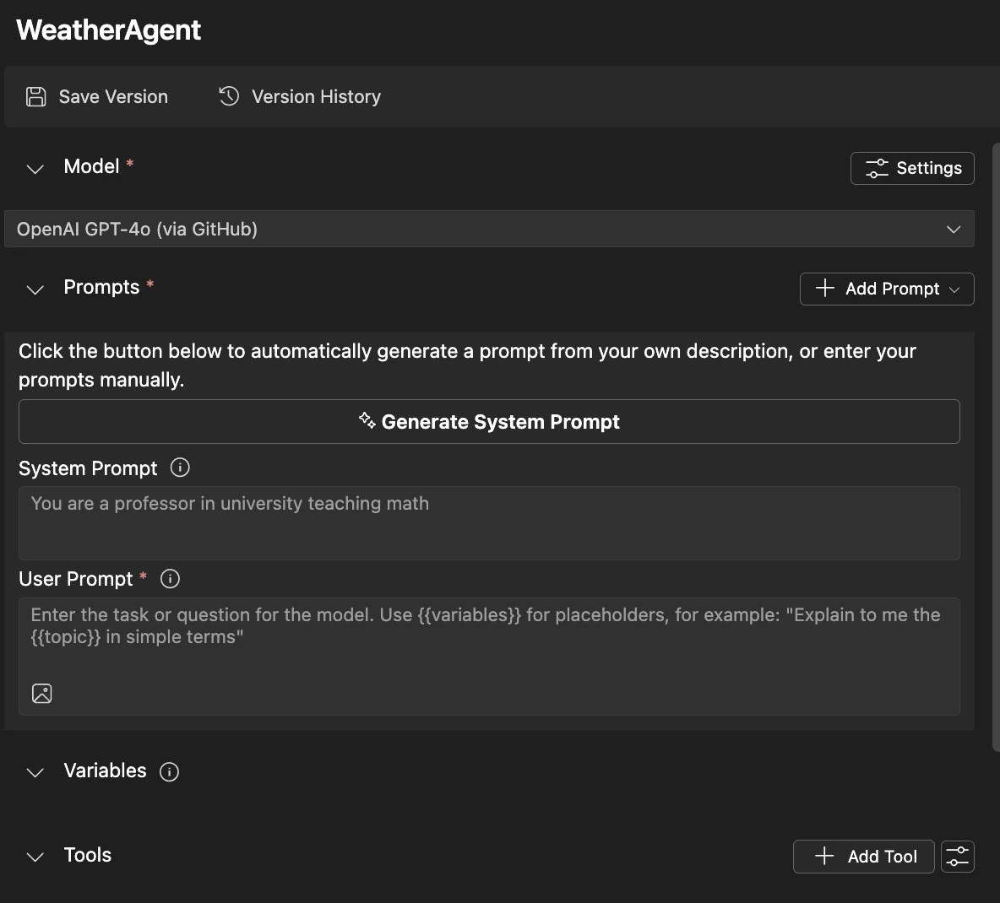
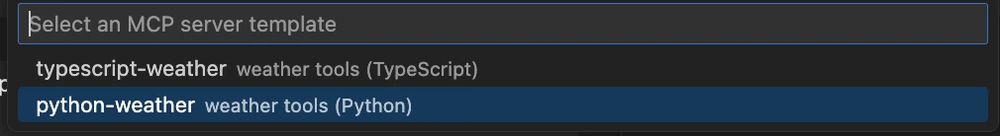
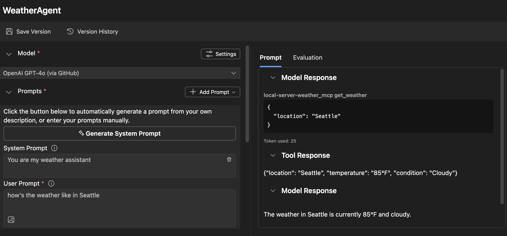
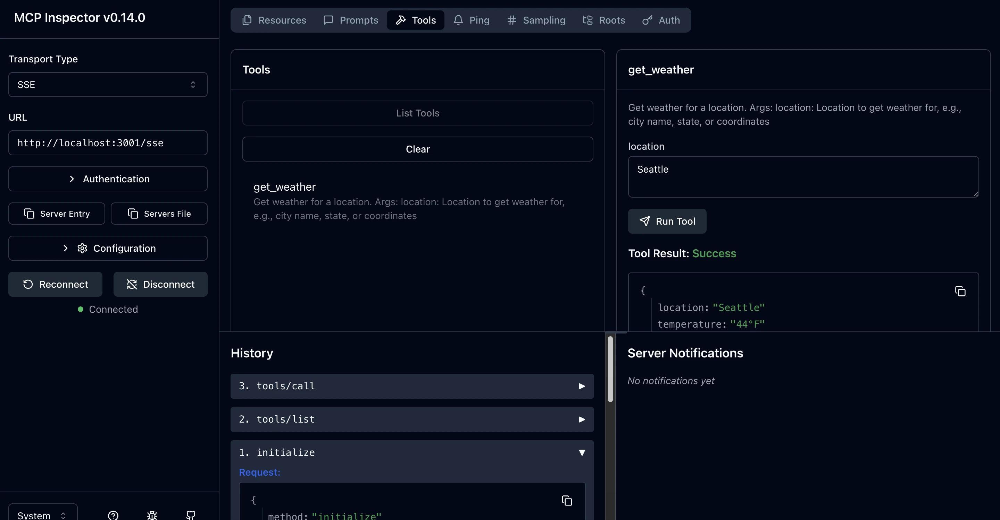

# 🔧 3 modulis: Pažengęs MCP kūrimas su Microsoft Foundry Toolkit įrankiais

> [!NOTE]
> Šioje laboratorijoje naudojami Inspector URL naudoja senesnį `/sse` galinį tašką ir taiko
> užfiksuotas MCP SDK `1.9.3` ir Inspector `0.14.0` priklausomybes. Tai nėra
> dabartiniai `2026-07-28` Streamable HTTP pavyzdžiai.


## 🎯 Mokymosi tikslai

Sukūrę šią laboratoriją sugebėsite:

- ✅ Kurti tinkintus MCP serverius naudojant Microsoft Foundry Toolkit
- ✅ Konfigūruoti ir naudoti naujausią MCP Python SDK (v1.9.3)
- ✅ Diegti ir naudoti MCP Inspector derinimui
- ✅ Derinti MCP serverius tiek Agent Builder, tiek Inspector aplinkose
- ✅ Suprasti pažangius MCP serverio kūrimo darbų srautus

## 📋 Išankstinės sąlygos

- Užbaigta laboratorija 2 (MCP pagrindai)
- VS Code su įdiegta Microsoft Foundry Toolkit plėtiniu
- Python 3.10+ aplinka
- Node.js ir npm Inspector diegimui

## 🏗️ Ką kursite

Šioje laboratorijoje sukursite **Weather MCP Server** (Orų MCP serverį), kuris demonstruoja:
- Tinkintą MCP serverio įgyvendinimą
- Integraciją su Microsoft Foundry Toolkit Agent Builder
- Profesionalius derinimo darbų srautus
- Modernius MCP SDK naudojimo modelius

---

## 🔧 Pagrindinių komponentų apžvalga

### 🐍 MCP Python SDK
Modelio konteksto protokolo Python SDK suteikia pagrindą kuriant tinkintus MCP serverius. Naudosite 1.9.3 versiją su išplėstiniais derinimo įrankiais.

### 🔍 MCP Inspector
Galingas derinimo įrankis, kuris suteikia:
- Realaus laiko serverio stebėjimą
- Įrankių vykdymo vizualizaciją
- Tinklo užklausų/atsakymų tikrinimą
- Interaktyvią testavimo aplinką

---

## 📖 Žingsnis po žingsnio įgyvendinimas

### 1 Žingsnis: Sukurkite WeatherAgent Agent Builder aplinkoje

1. **Paleiskite Agent Builder** VS Code per Microsoft Foundry Toolkit plėtinį
2. **Sukurkite naują agentą** su tokia konfigūracija:
   - Agentas: `WeatherAgent`



### 2 Žingsnis: Inicializuokite MCP serverio projektą

1. **Eikite į Tools** → **Add Tool** Agent Builder aplinkoje
2. **Pasirinkite „MCP Server“** iš galimų variantų
3. **Pasirinkite „Create A new MCP Server“**
4. **Pasirinkite `python-weather` šabloną**
5. **Pavadinkite savo serverį:** `weather_mcp`



### 3 Žingsnis: Atidarykite ir peržiūrėkite projektą

1. **Atidarykite sugeneruotą projektą** VS Code
2. **Peržiūrėkite projekto struktūrą:**
   ```
   weather_mcp/
   ├── src/
   │   ├── __init__.py
   │   └── server.py
   ├── inspector/
   │   ├── package.json
   │   └── package-lock.json
   ├── .vscode/
   │   ├── launch.json
   │   └── tasks.json
   ├── pyproject.toml
   └── README.md
   ```

### 4 Žingsnis: Atnaujinkite į naujausią MCP SDK versiją

> **🔍 Kodėl atnaujinti?** Norime naudoti naujausią MCP SDK (v1.9.3) ir Inspector versiją (0.14.0) geresnėms funkcijoms ir patobulintam derinimui.

#### 4a. Atnaujinkite Python priklausomybes

**Redaguokite `pyproject.toml`:** atnaujinkite [./code/weather_mcp/pyproject.toml](../../../../10-StreamliningAIWorkflowsBuildingAnMCPServerWithAIToolkit/lab3/code/weather_mcp/pyproject.toml)


#### 4b. Atnaujinkite Inspector konfigūraciją

**Redaguokite `inspector/package.json`:** atnaujinkite [./code/weather_mcp/inspector/package.json](../../../../10-StreamliningAIWorkflowsBuildingAnMCPServerWithAIToolkit/lab3/code/weather_mcp/inspector/package.json)

#### 4c. Atnaujinkite Inspector priklausomybes

**Redaguokite `inspector/package-lock.json`:** atnaujinkite [./code/weather_mcp/inspector/package-lock.json](../../../../10-StreamliningAIWorkflowsBuildingAnMCPServerWithAIToolkit/lab3/code/weather_mcp/inspector/package-lock.json)

> **📝 Pastaba:** Šis failas apima išsamią priklausomybių apibrėžtis. Žemiau pateikta esminė struktūra – visas turinys užtikrina tinkamą priklausomybių sprendimą.


> **⚡ Pilnas Package Lock:** Visas package-lock.json turi apie 3000 eilučių priklausomybių apibrėžimų. Aukščiau parodyta pagrindinė struktūra – naudokite pateiktą failą visam priklausomybių sprendimui.

### 5 Žingsnis: Konfigūruokite VS Code derinimą

*Pastaba: Nukopijuokite failą nurodytame kelyje, kad pakeistumėte atitinkamą vietinį failą*

#### 5a. Atnaujinti paleidimo konfigūraciją

**Redaguokite `.vscode/launch.json`:**

```json
{
  "version": "0.2.0",
  "configurations": [
    {
      "name": "Attach to Local MCP",
      "type": "debugpy",
      "request": "attach",
      "connect": {
        "host": "localhost",
        "port": 5678
      },
      "presentation": {
        "hidden": true
      },
      "internalConsoleOptions": "neverOpen",
      "postDebugTask": "Terminate All Tasks"
    },
    {
      "name": "Launch Inspector (Edge)",
      "type": "msedge",
      "request": "launch",
      "url": "http://localhost:6274?timeout=60000&serverUrl=http://localhost:3001/sse#tools",
      "cascadeTerminateToConfigurations": [
        "Attach to Local MCP"
      ],
      "presentation": {
        "hidden": true
      },
      "internalConsoleOptions": "neverOpen"
    },
    {
      "name": "Launch Inspector (Chrome)",
      "type": "chrome",
      "request": "launch",
      "url": "http://localhost:6274?timeout=60000&serverUrl=http://localhost:3001/sse#tools",
      "cascadeTerminateToConfigurations": [
        "Attach to Local MCP"
      ],
      "presentation": {
        "hidden": true
      },
      "internalConsoleOptions": "neverOpen"
    }
  ],
  "compounds": [
    {
      "name": "Debug in Agent Builder",
      "configurations": [
        "Attach to Local MCP"
      ],
      "preLaunchTask": "Open Agent Builder",
    },
    {
      "name": "Debug in Inspector (Edge)",
      "configurations": [
        "Launch Inspector (Edge)",
        "Attach to Local MCP"
      ],
      "preLaunchTask": "Start MCP Inspector",
      "stopAll": true
    },
    {
      "name": "Debug in Inspector (Chrome)",
      "configurations": [
        "Launch Inspector (Chrome)",
        "Attach to Local MCP"
      ],
      "preLaunchTask": "Start MCP Inspector",
      "stopAll": true
    }
  ]
}
```

**Redaguokite `.vscode/tasks.json`:**

```
{
  "version": "2.0.0",
  "tasks": [
    {
      "label": "Start MCP Server",
      "type": "shell",
      "command": "python -m debugpy --listen 127.0.0.1:5678 src/__init__.py sse",
      "isBackground": true,
      "options": {
        "cwd": "${workspaceFolder}",
        "env": {
          "PORT": "3001"
        }
      },
      "problemMatcher": {
        "pattern": [
          {
            "regexp": "^.*$",
            "file": 0,
            "location": 1,
            "message": 2
          }
        ],
        "background": {
          "activeOnStart": true,
          "beginsPattern": ".*",
          "endsPattern": "Application startup complete|running"
        }
      }
    },
    {
      "label": "Start MCP Inspector",
      "type": "shell",
      "command": "npm run dev:inspector",
      "isBackground": true,
      "options": {
        "cwd": "${workspaceFolder}/inspector",
        "env": {
          "CLIENT_PORT": "6274",
          "SERVER_PORT": "6277",
        }
      },
      "problemMatcher": {
        "pattern": [
          {
            "regexp": "^.*$",
            "file": 0,
            "location": 1,
            "message": 2
          }
        ],
        "background": {
          "activeOnStart": true,
          "beginsPattern": "Starting MCP inspector",
          "endsPattern": "Proxy server listening on port"
        }
      },
      "dependsOn": [
        "Start MCP Server"
      ]
    },
    {
      "label": "Open Agent Builder",
      "type": "shell",
      "command": "echo ${input:openAgentBuilder}",
      "presentation": {
        "reveal": "never"
      },
      "dependsOn": [
        "Start MCP Server"
      ],
    },
    {
      "label": "Terminate All Tasks",
      "command": "echo ${input:terminate}",
      "type": "shell",
      "problemMatcher": []
    }
  ],
  "inputs": [
    {
      "id": "openAgentBuilder",
      "type": "command",
      "command": "ai-mlstudio.agentBuilder",
      "args": {
        "initialMCPs": [ "local-server-weather_mcp" ],
        "triggeredFrom": "vsc-tasks"
      }
    },
    {
      "id": "terminate",
      "type": "command",
      "command": "workbench.action.tasks.terminate",
      "args": "terminateAll"
    }
  ]
}
```


---

## 🚀 Paleidimas ir testavimas

### 6 Žingsnis: Įdiekite priklausomybes

Padarius konfigūracijos pakeitimus, paleiskite šias komandas:

**Įdiekite Python priklausomybes:**
```bash
uv sync
```

**Įdiekite Inspector priklausomybes:**
```bash
cd inspector
npm install
```

### 7 Žingsnis: Derinkite su Agent Builder

1. **Paspauskite F5** arba naudokite **"Debug in Agent Builder"** konfigūraciją
2. **Pasirinkite jungtinę konfigūraciją** derinimo skydelyje
3. **Palaukite, kol serveris paleis ir Agent Builder atsidarys**
4. **Testuokite savo orų MCP serverį** naudodami natūralios kalbos užklausas

Įvesties pavyzdys:

SYSTEM_PROMPT

```
You are my weather assistant
```

USER_PROMPT

```
How's the weather like in Seattle
```



### 8 Žingsnis: Derinkite su MCP Inspector

1. **Naudokite „Debug in Inspector“ konfigūraciją** (Edge arba Chrome)
2. **Atidarykite Inspector sąsają** adresu `http://localhost:6274`
3. **Išnagrinėkite interaktyvią testavimo aplinką:**
   - Peržiūrėkite prieinamus įrankius
   - Išbandykite įrankių vykdymą
   - Stebėkite tinklo užklausas
   - Derinkite serverio atsakymus



---

## 🎯 Pagrindinės mokymosi išvados

Užbaigę šią laboratoriją jūs:

- [x] **Sukūrėte tinkintą MCP serverį** naudodami Microsoft Foundry Toolkit šablonus
- [x] **Atnaujinote MCP SDK** į naujausią versiją (v1.9.3) dėl išplėstinių funkcijų
- [x] **Konfigūravote profesionalius derinimo darbo procesus** tiek Agent Builder, tiek Inspector aplinkoms
- [x] **Įdiegėte MCP Inspector** interaktyviam serverio testavimui
- [x] **Įvaldėte VS Code derinimo konfigūracijas** MCP kūrimui

## 🔧 Išnagrinėtos pažangios funkcijos

| Funkcija | Aprašymas | Panaudojimo sritis |
|---------|-------------|----------|
| **MCP Python SDK v1.9.3** | Naujausias protokolo įgyvendinimas | Modernus serverio kūrimas |
| **MCP Inspector 0.14.0** | Interaktyvus derinimo įrankis | Realaus laiko serverio testavimas |
| **VS Code Derinimas** | Integruota kūrimo aplinka | Profesionalus derinimo darbų srautas |
| **Agent Builder integracija** | Tiesioginis Microsoft Foundry Toolkit ryšys | Visapusiškas agentų testavimas |

## 📚 Papildomi ištekliai

- [MCP Python SDK dokumentacija](https://modelcontextprotocol.io/docs/sdk/python)
- [Microsoft Foundry Toolkit plėtinių vadovas](https://code.visualstudio.com/docs/ai/ai-toolkit)
- [VS Code derinimo dokumentacija](https://code.visualstudio.com/docs/editor/debugging)
- [Model Context Protocol specifikacija](https://modelcontextprotocol.io/docs/concepts/architecture)

---

**🎉 Sveikiname!** Sėkmingai užbaigėte 3 laboratoriją ir dabar galite kurti, derinti bei diegti tinkintus MCP serverius naudojant profesionalius kūrimo darbo procesus.

### 🔜 Toliau – kitas modulis

Pasiruošę pritaikyti MCP įgūdžius realių projektų kūrimo darbo sraute? Tęskite į **[4 modulį: Praktinis MCP kūrimas - Tinkintas GitHub klono serveris](../lab4/README.md)**, kur:
- Kursite gamybai parengtą MCP serverį, automatiškai valdyti GitHub saugyklas
- Įgyvendinsite GitHub saugyklų klonavimą per MCP
- Integruosite tinkintus MCP serverius su VS Code ir GitHub Copilot Agent režimu
- Testuosite ir diegsite MCP serverius gamybinėse aplinkose
- Išmoksite praktišką automatizavimo darbo srautą kūrėjams

---

<!-- CO-OP TRANSLATOR DISCLAIMER START -->
**Atsakomybės apribojimas**:
Šis dokumentas buvo išverstas naudojant dirbtinio intelekto vertimo paslaugą [Co-op Translator](https://github.com/Azure/co-op-translator). Nors siekiame tikslumo, prašome atkreipti dėmesį, kad automatiniai vertimai gali turėti klaidų ar netikslumų. Originalus dokumentas jo gimtąja kalba laikomas autoritetingu šaltiniu. Svarbiai informacijai rekomenduojama naudoti profesionalų žmogiškąjį vertimą. Mes neatsakome už jokius nesusipratimus ar neteisingą interpretaciją, kilusią naudojantis šiuo vertimu.
<!-- CO-OP TRANSLATOR DISCLAIMER END -->