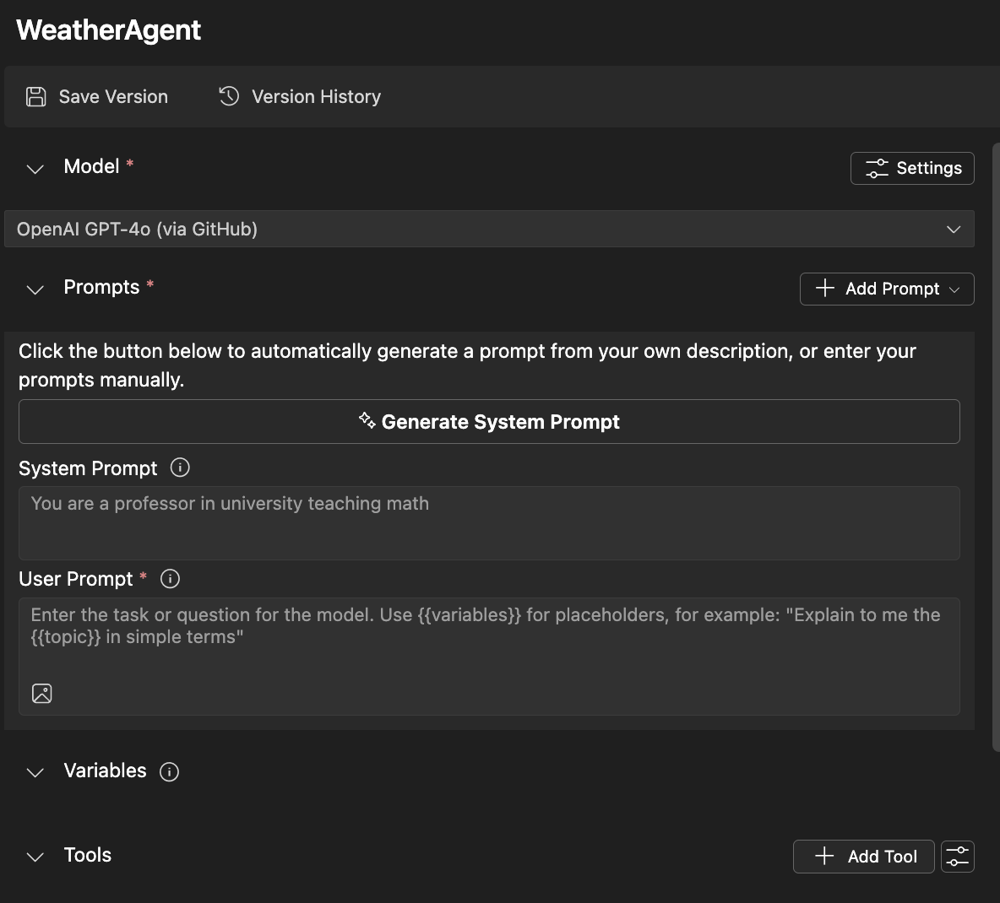
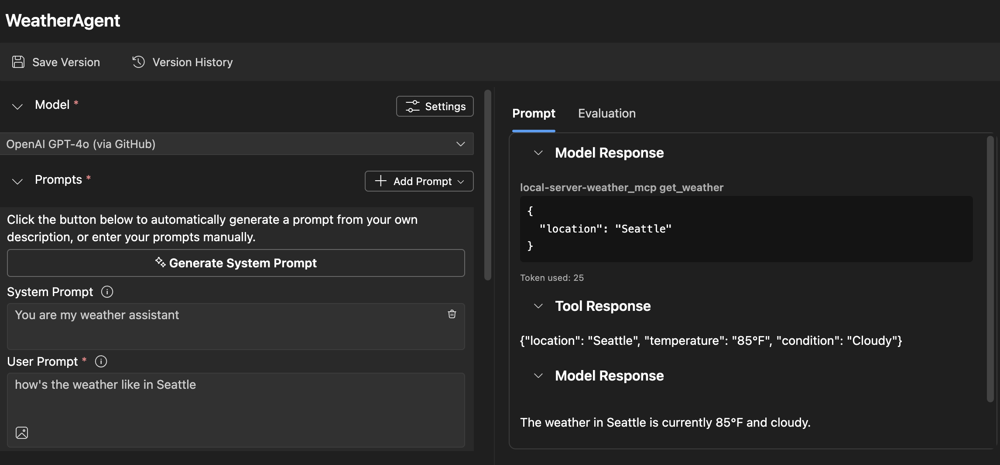
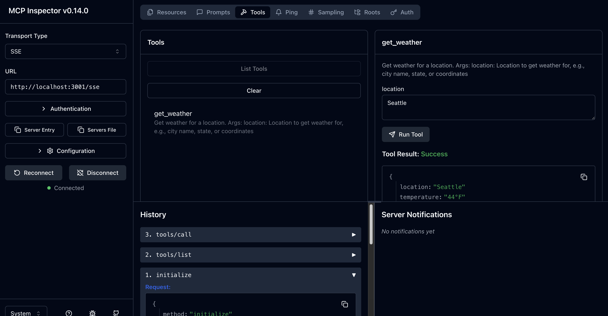

<!--
CO_OP_TRANSLATOR_METADATA:
{
  "original_hash": "dd8da3f75addcef453fe11f02a270217",
  "translation_date": "2025-08-26T17:00:23+00:00",
  "source_file": "10-StreamliningAIWorkflowsBuildingAnMCPServerWithAIToolkit/lab3/README.md",
  "language_code": "lt"
}
-->
# 🔧 Modulis 3: Pažangus MCP kūrimas su AI įrankių rinkiniu


## 🎯 Mokymosi tikslai

Baigę šį laboratorinį darbą, galėsite:

- ✅ Kurti individualius MCP serverius naudojant AI įrankių rinkinį
- ✅ Konfigūruoti ir naudoti naujausią MCP Python SDK (v1.9.3)
- ✅ Nustatyti ir naudoti MCP Inspector derinimui
- ✅ Derinti MCP serverius Agent Builder ir Inspector aplinkose
- ✅ Suprasti pažangius MCP serverių kūrimo procesus

## 📋 Reikalavimai

- 2 laboratorinio darbo (MCP pagrindai) užbaigimas
- VS Code su įdiegta AI Toolkit plėtra
- Python 3.10+ aplinka
- Node.js ir npm MCP Inspector nustatymui

## 🏗️ Ką sukursite

Šiame laboratoriniame darbe sukursite **Orų MCP serverį**, kuris demonstruos:
- Individualų MCP serverio įgyvendinimą
- Integraciją su AI Toolkit Agent Builder
- Profesionalius derinimo procesus
- Modernius MCP SDK naudojimo modelius

---

## 🔧 Pagrindinių komponentų apžvalga

### 🐍 MCP Python SDK
Model Context Protocol Python SDK suteikia pagrindą individualių MCP serverių kūrimui. Naudosite versiją 1.9.3 su patobulintomis derinimo galimybėmis.

### 🔍 MCP Inspector
Galingas derinimo įrankis, kuris siūlo:
- Serverio stebėjimą realiu laiku
- Įrankių vykdymo vizualizaciją
- Tinklo užklausų/atsakymų analizę
- Interaktyvią testavimo aplinką

---

## 📖 Žingsnis po žingsnio įgyvendinimas

### 1 žingsnis: Sukurkite WeatherAgent Agent Builder aplinkoje

1. **Paleiskite Agent Builder** VS Code per AI Toolkit plėtinį
2. **Sukurkite naują agentą** su šia konfigūracija:
   - Agento pavadinimas: `WeatherAgent`



### 2 žingsnis: Inicializuokite MCP serverio projektą

1. **Eikite į Tools** → **Add Tool** Agent Builder aplinkoje
2. **Pasirinkite "MCP Server"** iš galimų parinkčių
3. **Pasirinkite "Create A new MCP Server"**
4. **Pasirinkite `python-weather` šabloną**
5. **Pavadinkite savo serverį:** `weather_mcp`


### 3 žingsnis: Atidarykite ir peržiūrėkite projektą

1. **Atidarykite sugeneruotą projektą** VS Code
2. **Peržiūrėkite projekto struktūrą:**
   ```
   weather_mcp/
   ├── src/
   │   ├── __init__.py
   │   └── server.py
   ├── inspector/
   │   ├── package.json
   │   └── package-lock.json
   ├── .vscode/
   │   ├── launch.json
   │   └── tasks.json
   ├── pyproject.toml
   └── README.md
   ```

### 4 žingsnis: Atnaujinkite MCP SDK į naujausią versiją

> **🔍 Kodėl atnaujinti?** Norime naudoti naujausią MCP SDK (v1.9.3) ir Inspector paslaugą (0.14.0), kad gautume patobulintas funkcijas ir geresnes derinimo galimybes.

#### 4a. Atnaujinkite Python priklausomybes

**Redaguokite `pyproject.toml`:** atnaujinkite [./code/weather_mcp/pyproject.toml](../../../../10-StreamliningAIWorkflowsBuildingAnMCPServerWithAIToolkit/lab3/code/weather_mcp/pyproject.toml)

#### 4b. Atnaujinkite Inspector konfigūraciją

**Redaguokite `inspector/package.json`:** atnaujinkite [./code/weather_mcp/inspector/package.json](../../../../10-StreamliningAIWorkflowsBuildingAnMCPServerWithAIToolkit/lab3/code/weather_mcp/inspector/package.json)

#### 4c. Atnaujinkite Inspector priklausomybes

**Redaguokite `inspector/package-lock.json`:** atnaujinkite [./code/weather_mcp/inspector/package-lock.json](../../../../10-StreamliningAIWorkflowsBuildingAnMCPServerWithAIToolkit/lab3/code/weather_mcp/inspector/package-lock.json)

> **📝 Pastaba:** Šis failas turi išsamias priklausomybių apibrėžtis. Žemiau pateikiama esminė struktūra - pilnas turinys užtikrina tinkamą priklausomybių sprendimą.

> **⚡ Pilnas Package Lock:** Pilnas package-lock.json failas turi ~3000 eilučių priklausomybių apibrėžčių. Aukščiau pateikiama pagrindinė struktūra - naudokite pateiktą failą pilnam priklausomybių sprendimui.

### 5 žingsnis: Konfigūruokite VS Code derinimą

*Pastaba: Nukopijuokite failą nurodytu keliu, kad pakeistumėte atitinkamą vietinį failą*

#### 5a. Atnaujinkite paleidimo konfigūraciją

**Redaguokite `.vscode/launch.json`:**

```json
{
  "version": "0.2.0",
  "configurations": [
    {
      "name": "Attach to Local MCP",
      "type": "debugpy",
      "request": "attach",
      "connect": {
        "host": "localhost",
        "port": 5678
      },
      "presentation": {
        "hidden": true
      },
      "internalConsoleOptions": "neverOpen",
      "postDebugTask": "Terminate All Tasks"
    },
    {
      "name": "Launch Inspector (Edge)",
      "type": "msedge",
      "request": "launch",
      "url": "http://localhost:6274?timeout=60000&serverUrl=http://localhost:3001/sse#tools",
      "cascadeTerminateToConfigurations": [
        "Attach to Local MCP"
      ],
      "presentation": {
        "hidden": true
      },
      "internalConsoleOptions": "neverOpen"
    },
    {
      "name": "Launch Inspector (Chrome)",
      "type": "chrome",
      "request": "launch",
      "url": "http://localhost:6274?timeout=60000&serverUrl=http://localhost:3001/sse#tools",
      "cascadeTerminateToConfigurations": [
        "Attach to Local MCP"
      ],
      "presentation": {
        "hidden": true
      },
      "internalConsoleOptions": "neverOpen"
    }
  ],
  "compounds": [
    {
      "name": "Debug in Agent Builder",
      "configurations": [
        "Attach to Local MCP"
      ],
      "preLaunchTask": "Open Agent Builder",
    },
    {
      "name": "Debug in Inspector (Edge)",
      "configurations": [
        "Launch Inspector (Edge)",
        "Attach to Local MCP"
      ],
      "preLaunchTask": "Start MCP Inspector",
      "stopAll": true
    },
    {
      "name": "Debug in Inspector (Chrome)",
      "configurations": [
        "Launch Inspector (Chrome)",
        "Attach to Local MCP"
      ],
      "preLaunchTask": "Start MCP Inspector",
      "stopAll": true
    }
  ]
}
```

**Redaguokite `.vscode/tasks.json`:**

```
{
  "version": "2.0.0",
  "tasks": [
    {
      "label": "Start MCP Server",
      "type": "shell",
      "command": "python -m debugpy --listen 127.0.0.1:5678 src/__init__.py sse",
      "isBackground": true,
      "options": {
        "cwd": "${workspaceFolder}",
        "env": {
          "PORT": "3001"
        }
      },
      "problemMatcher": {
        "pattern": [
          {
            "regexp": "^.*$",
            "file": 0,
            "location": 1,
            "message": 2
          }
        ],
        "background": {
          "activeOnStart": true,
          "beginsPattern": ".*",
          "endsPattern": "Application startup complete|running"
        }
      }
    },
    {
      "label": "Start MCP Inspector",
      "type": "shell",
      "command": "npm run dev:inspector",
      "isBackground": true,
      "options": {
        "cwd": "${workspaceFolder}/inspector",
        "env": {
          "CLIENT_PORT": "6274",
          "SERVER_PORT": "6277",
        }
      },
      "problemMatcher": {
        "pattern": [
          {
            "regexp": "^.*$",
            "file": 0,
            "location": 1,
            "message": 2
          }
        ],
        "background": {
          "activeOnStart": true,
          "beginsPattern": "Starting MCP inspector",
          "endsPattern": "Proxy server listening on port"
        }
      },
      "dependsOn": [
        "Start MCP Server"
      ]
    },
    {
      "label": "Open Agent Builder",
      "type": "shell",
      "command": "echo ${input:openAgentBuilder}",
      "presentation": {
        "reveal": "never"
      },
      "dependsOn": [
        "Start MCP Server"
      ],
    },
    {
      "label": "Terminate All Tasks",
      "command": "echo ${input:terminate}",
      "type": "shell",
      "problemMatcher": []
    }
  ],
  "inputs": [
    {
      "id": "openAgentBuilder",
      "type": "command",
      "command": "ai-mlstudio.agentBuilder",
      "args": {
        "initialMCPs": [ "local-server-weather_mcp" ],
        "triggeredFrom": "vsc-tasks"
      }
    },
    {
      "id": "terminate",
      "type": "command",
      "command": "workbench.action.tasks.terminate",
      "args": "terminateAll"
    }
  ]
}
```

---

## 🚀 MCP serverio paleidimas ir testavimas

### 6 žingsnis: Įdiekite priklausomybes

Po konfigūracijos pakeitimų paleiskite šias komandas:

**Įdiekite Python priklausomybes:**
```bash
uv sync
```

**Įdiekite Inspector priklausomybes:**
```bash
cd inspector
npm install
```

### 7 žingsnis: Derinimas Agent Builder aplinkoje

1. **Paspauskite F5** arba naudokite **"Debug in Agent Builder"** konfigūraciją
2. **Pasirinkite sudėtinę konfigūraciją** iš derinimo panelės
3. **Palaukite, kol serveris paleis** ir Agent Builder atsidarys
4. **Testuokite savo orų MCP serverį** su natūralios kalbos užklausomis

Įveskite tokį užklausos tekstą:

SYSTEM_PROMPT

```
You are my weather assistant
```

USER_PROMPT

```
How's the weather like in Seattle
```



### 8 žingsnis: Derinimas MCP Inspector aplinkoje

1. **Naudokite "Debug in Inspector"** konfigūraciją (Edge arba Chrome)
2. **Atidarykite Inspector sąsają** adresu `http://localhost:6274`
3. **Išbandykite interaktyvią testavimo aplinką:**
   - Peržiūrėkite galimus įrankius
   - Testuokite įrankių vykdymą
   - Stebėkite tinklo užklausas
   - Derinkite serverio atsakymus



---

## 🎯 Pagrindiniai mokymosi rezultatai

Baigę šį laboratorinį darbą, jūs:

- [x] **Sukūrėte individualų MCP serverį** naudodami AI Toolkit šablonus
- [x] **Atnaujinote MCP SDK į naujausią versiją** (v1.9.3) dėl patobulintų funkcijų
- [x] **Konfigūravote profesionalius derinimo procesus** Agent Builder ir Inspector aplinkose
- [x] **Nustatėte MCP Inspector** interaktyviam serverio testavimui
- [x] **Įvaldėte VS Code derinimo konfigūracijas** MCP kūrimui

## 🔧 Išsamiai išnagrinėtos funkcijos

| Funkcija | Aprašymas | Naudojimo atvejis |
|----------|-----------|-------------------|
| **MCP Python SDK v1.9.3** | Naujausia protokolo įgyvendinimo versija | Modernus serverio kūrimas |
| **MCP Inspector 0.14.0** | Interaktyvus derinimo įrankis | Serverio testavimas realiu laiku |
| **VS Code derinimas** | Integruota kūrimo aplinka | Profesionalus derinimo procesas |
| **Agent Builder integracija** | Tiesioginis AI Toolkit ryšys | Pilnas agento testavimas |

## 📚 Papildomi ištekliai

- [MCP Python SDK dokumentacija](https://modelcontextprotocol.io/docs/sdk/python)
- [AI Toolkit plėtinio vadovas](https://code.visualstudio.com/docs/ai/ai-toolkit)
- [VS Code derinimo dokumentacija](https://code.visualstudio.com/docs/editor/debugging)
- [Model Context Protocol specifikacija](https://modelcontextprotocol.io/docs/concepts/architecture)

---

**🎉 Sveikiname!** Sėkmingai užbaigėte 3 laboratorinį darbą ir dabar galite kurti, derinti ir diegti individualius MCP serverius naudodami profesionalius kūrimo procesus.

### 🔜 Tęskite kitą modulį

Pasiruošę pritaikyti savo MCP įgūdžius realiame kūrimo procese? Tęskite **[Modulis 4: Praktinis MCP kūrimas - individualus GitHub klonavimo serveris](../lab4/README.md)**, kur sužinosite:
- Kaip sukurti gamybai paruoštą MCP serverį, automatizuojantį GitHub saugyklų operacijas
- Įgyvendinti GitHub saugyklų klonavimo funkcionalumą per MCP
- Integruoti individualius MCP serverius su VS Code ir GitHub Copilot Agent Mode
- Testuoti ir diegti MCP serverius gamybos aplinkose
- Išmokti praktinę kūrimo procesų automatizaciją programuotojams

---

**Atsakomybės apribojimas**:  
Šis dokumentas buvo išverstas naudojant AI vertimo paslaugą [Co-op Translator](https://github.com/Azure/co-op-translator). Nors siekiame tikslumo, prašome atkreipti dėmesį, kad automatiniai vertimai gali turėti klaidų ar netikslumų. Originalus dokumentas jo gimtąja kalba turėtų būti laikomas autoritetingu šaltiniu. Kritinei informacijai rekomenduojama naudoti profesionalų žmogaus vertimą. Mes neprisiimame atsakomybės už nesusipratimus ar klaidingus interpretavimus, atsiradusius naudojant šį vertimą.