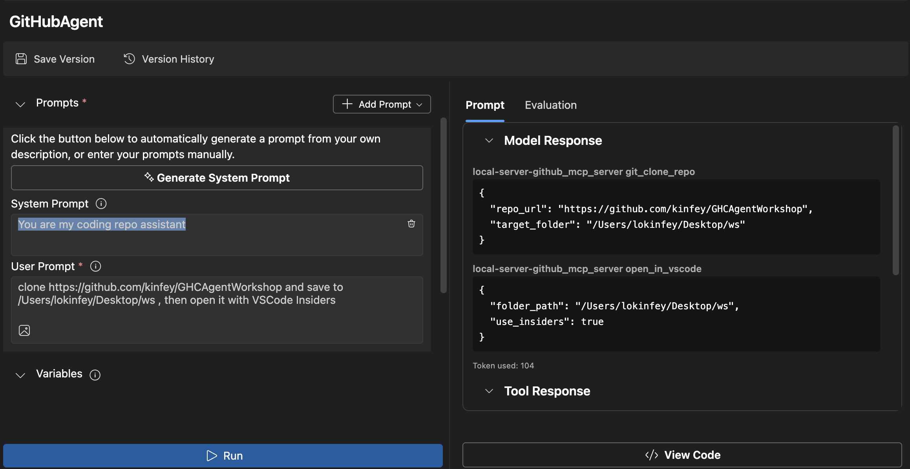
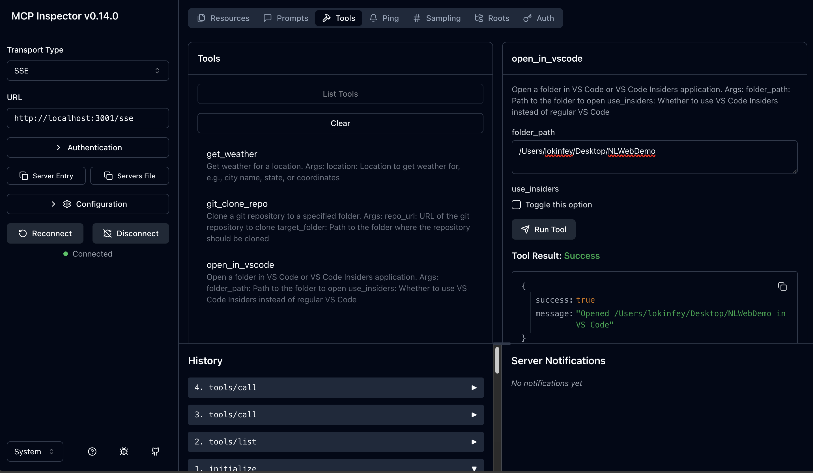

<!--
CO_OP_TRANSLATOR_METADATA:
{
  "original_hash": "f83bc722dc758efffd68667d6a1db470",
  "translation_date": "2025-08-26T17:01:18+00:00",
  "source_file": "10-StreamliningAIWorkflowsBuildingAnMCPServerWithAIToolkit/lab4/README.md",
  "language_code": "lt"
}
-->
# 🐙 Modulis 4: Praktinis MCP kūrimas - Individualus GitHub klonavimo serveris


> **⚡ Greitas startas:** Sukurkite gamybai paruoštą MCP serverį, kuris automatizuoja GitHub saugyklų klonavimą ir VS Code integraciją vos per 30 minučių!

## 🎯 Mokymosi tikslai

Baigę šį praktinį darbą, galėsite:

- ✅ Sukurti individualų MCP serverį realiems kūrimo procesams
- ✅ Įgyvendinti GitHub saugyklų klonavimo funkcionalumą per MCP
- ✅ Integruoti individualius MCP serverius su VS Code ir Agent Builder
- ✅ Naudoti GitHub Copilot Agent Mode su individualiais MCP įrankiais
- ✅ Testuoti ir diegti individualius MCP serverius gamybos aplinkoje

## 📋 Būtinos sąlygos

- Baigti 1–3 praktiniai darbai (MCP pagrindai ir pažangus kūrimas)
- GitHub Copilot prenumerata ([nemokama registracija](https://github.com/github-copilot/signup))
- VS Code su AI Toolkit ir GitHub Copilot plėtiniais
- Įdiegtas ir sukonfigūruotas Git CLI

## 🏗️ Projekto apžvalga

### **Realių kūrimo procesų iššūkis**
Kaip kūrėjai, dažnai naudojame GitHub saugyklų klonavimui ir jų atidarymui VS Code ar VS Code Insiders. Šis rankinis procesas apima:
1. Terminalo/komandų eilutės atidarymą
2. Naršymą į norimą katalogą
3. `git clone` komandos vykdymą
4. VS Code atidarymą klonuotame kataloge

**Mūsų MCP sprendimas supaprastina šį procesą į vieną išmanų komandą!**

### **Ką sukursite**
**GitHub Clone MCP Server** (`git_mcp_server`), kuris siūlo:

| Funkcija | Aprašymas | Privalumas |
|----------|-----------|------------|
| 🔄 **Išmanus saugyklų klonavimas** | Klonuokite GitHub saugyklas su validacija | Automatinis klaidų tikrinimas |
| 📁 **Išmanus katalogų valdymas** | Saugiai tikrinkite ir kurkite katalogus | Apsauga nuo perrašymo |
| 🚀 **Kryžminė VS Code integracija** | Atidarykite projektus VS Code/Insiders | Sklandus perėjimas |
| 🛡️ **Patikimas klaidų valdymas** | Spręskite tinklo, leidimų ir kelių problemas | Gamybai paruoštas patikimumas |

---

## 📖 Žingsnis po žingsnio įgyvendinimas

### 1 žingsnis: Sukurkite GitHub agentą Agent Builder įrankyje

1. **Paleiskite Agent Builder** per AI Toolkit plėtinį
2. **Sukurkite naują agentą** su šia konfigūracija:
   ```
   Agent Name: GitHubAgent
   ```

3. **Inicializuokite individualų MCP serverį:**
   - Eikite į **Tools** → **Add Tool** → **MCP Server**
   - Pasirinkite **"Create A new MCP Server"**
   - Pasirinkite **Python šabloną** dėl didžiausio lankstumo
   - **Serverio pavadinimas:** `git_mcp_server`

### 2 žingsnis: Konfigūruokite GitHub Copilot Agent Mode

1. **Atidarykite GitHub Copilot** VS Code (Ctrl/Cmd + Shift + P → "GitHub Copilot: Open")
2. **Pasirinkite Agent Model** Copilot sąsajoje
3. **Pasirinkite Claude 3.7 modelį** dėl geresnių loginio mąstymo galimybių
4. **Įjunkite MCP integraciją** įrankių prieigai

> **💡 Naudingas patarimas:** Claude 3.7 pasižymi puikiu kūrimo procesų ir klaidų valdymo modelių supratimu.

### 3 žingsnis: Įgyvendinkite pagrindinį MCP serverio funkcionalumą

**Naudokite šį detalų užklausos tekstą su GitHub Copilot Agent Mode:**

```
Create two MCP tools with the following comprehensive requirements:

🔧 TOOL A: clone_repository
Requirements:
- Clone any GitHub repository to a specified local folder
- Return the absolute path of the successfully cloned project
- Implement comprehensive validation:
  ✓ Check if target directory already exists (return error if exists)
  ✓ Validate GitHub URL format (https://github.com/user/repo)
  ✓ Verify git command availability (prompt installation if missing)
  ✓ Handle network connectivity issues
  ✓ Provide clear error messages for all failure scenarios

🚀 TOOL B: open_in_vscode
Requirements:
- Open specified folder in VS Code or VS Code Insiders
- Cross-platform compatibility (Windows/Linux/macOS)
- Use direct application launch (not terminal commands)
- Auto-detect available VS Code installations
- Handle cases where VS Code is not installed
- Provide user-friendly error messages

Additional Requirements:
- Follow MCP 1.9.3 best practices
- Include proper type hints and documentation
- Implement logging for debugging purposes
- Add input validation for all parameters
- Include comprehensive error handling
```

### 4 žingsnis: Testuokite savo MCP serverį

#### 4a. Testavimas Agent Builder įrankyje

1. **Paleiskite derinimo konfigūraciją** Agent Builder
2. **Konfigūruokite savo agentą su šia sistemos užklausa:**

```
SYSTEM_PROMPT:
You are my intelligent coding repository assistant. You help developers efficiently clone GitHub repositories and set up their development environment. Always provide clear feedback about operations and handle errors gracefully.
```

3. **Testuokite su realistiniais vartotojo scenarijais:**

```
USER_PROMPT EXAMPLES:

Scenario : Basic Clone and Open
"Clone {Your GitHub Repo link such as https://github.com/kinfey/GHCAgentWorkshop
 } and save to {The global path you specify}, then open it with VS Code Insiders"
```



**Tikėtini rezultatai:**
- ✅ Sėkmingas klonavimas su kelio patvirtinimu
- ✅ Automatinis VS Code paleidimas
- ✅ Aiškios klaidų žinutės neteisingais atvejais
- ✅ Tinkamas kraštinių atvejų valdymas

#### 4b. Testavimas MCP Inspector įrankyje



---

**🎉 Sveikiname!** Jūs sėkmingai sukūrėte praktišką, gamybai paruoštą MCP serverį, kuris sprendžia realius kūrimo procesų iššūkius. Jūsų individualus GitHub klonavimo serveris demonstruoja MCP galimybes automatizuoti ir pagerinti kūrėjų produktyvumą.

### 🏆 Pasiekimai:
- ✅ **MCP kūrėjas** - Sukurtas individualus MCP serveris
- ✅ **Procesų automatizatorius** - Supaprastinti kūrimo procesai  
- ✅ **Integracijos ekspertas** - Sujungti keli kūrimo įrankiai
- ✅ **Gamybai paruoštas** - Sukurtas diegiamas sprendimas

---

## 🎓 Seminaro pabaiga: Jūsų kelionė su Model Context Protocol

**Gerbiamas seminaro dalyvi,**

Sveikiname baigus visus keturis Model Context Protocol seminaro modulius! Jūs nuėjote ilgą kelią nuo AI Toolkit pagrindų supratimo iki gamybai paruoštų MCP serverių kūrimo, kurie sprendžia realius kūrimo procesų iššūkius.

### 🚀 Jūsų mokymosi kelio apžvalga:

**[Modulis 1](../lab1/README.md)**: Pradėjote tyrinėti AI Toolkit pagrindus, modelių testavimą ir sukūrėte savo pirmąjį AI agentą.

**[Modulis 2](../lab2/README.md)**: Sužinojote MCP architektūrą, integravote Playwright MCP ir sukūrėte pirmąjį naršyklės automatizavimo agentą.

**[Modulis 3](../lab3/README.md)**: Pažengėte iki individualių MCP serverių kūrimo su Weather MCP serveriu ir įvaldėte derinimo įrankius.

**[Modulis 4](../lab4/README.md)**: Pritaikėte viską, kad sukurtumėte praktinį GitHub saugyklų darbo eigos automatizavimo įrankį.

### 🌟 Ką įvaldėte:

- ✅ **AI Toolkit ekosistema**: Modeliai, agentai ir integracijos modeliai
- ✅ **MCP architektūra**: Kliento-serverio dizainas, transporto protokolai ir saugumas
- ✅ **Kūrėjo įrankiai**: Nuo Playground iki Inspector iki gamybos diegimo
- ✅ **Individualus kūrimas**: MCP serverių kūrimas, testavimas ir diegimas
- ✅ **Praktinės aplikacijos**: Realūs darbo eigos iššūkių sprendimai su AI

### 🔮 Jūsų tolimesni žingsniai:

1. **Sukurkite savo MCP serverį**: Taikykite šiuos įgūdžius automatizuoti savo unikalius procesus
2. **Prisijunkite prie MCP bendruomenės**: Dalinkitės savo kūriniais ir mokykitės iš kitų
3. **Tyrinėkite pažangią integraciją**: Sujunkite MCP serverius su įmonių sistemomis
4. **Prisidėkite prie atvirojo kodo**: Padėkite tobulinti MCP įrankius ir dokumentaciją

Atminkite, kad šis seminaras yra tik pradžia. Model Context Protocol ekosistema sparčiai vystosi, ir jūs dabar esate pasiruošę būti AI pagrįstų kūrimo įrankių priešakyje.

**Dėkojame už jūsų dalyvavimą ir atsidavimą mokymuisi!**

Linkime sėkmingo kodavimo!

---

**Atsakomybės apribojimas**:  
Šis dokumentas buvo išverstas naudojant AI vertimo paslaugą [Co-op Translator](https://github.com/Azure/co-op-translator). Nors siekiame tikslumo, prašome atkreipti dėmesį, kad automatiniai vertimai gali turėti klaidų ar netikslumų. Originalus dokumentas jo gimtąja kalba turėtų būti laikomas autoritetingu šaltiniu. Kritinei informacijai rekomenduojama profesionali žmogaus vertimo paslauga. Mes neprisiimame atsakomybės už nesusipratimus ar klaidingus interpretavimus, atsiradusius naudojant šį vertimą.