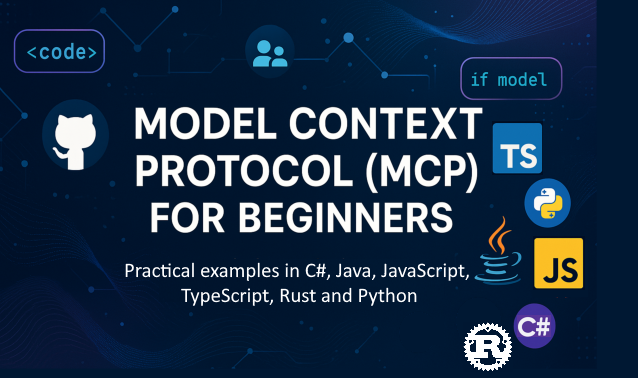

<!--
CO_OP_TRANSLATOR_METADATA:
{
  "original_hash": "c936339e9d03418ff40a547313355d6a",
  "translation_date": "2025-11-18T18:32:34+00:00",
  "source_file": "README.md",
  "language_code": "lt"
}
-->

Sekite šiuos žingsnius, kad pradėtumėte naudotis šiais ištekliais:
1. **Fork Repozitoriją**: Spustelėkite 
2. **Klonuokite Repozitoriją**: `git clone https://github.com/microsoft/mcp-for-beginners.git`
3. **Prisijunkite prie** 

### 🌐 Daugiakalbė Parama

#### Palaikoma per GitHub Action (Automatizuota ir visada atnaujinta)

[Arabic](../ar/README.md) | [Bengali](../bn/README.md) | [Bulgarian](../bg/README.md) | [Burmese (Myanmar)](../my/README.md) | [Chinese (Simplified)](../zh/README.md) | [Chinese (Traditional, Hong Kong)](../hk/README.md) | [Chinese (Traditional, Macau)](../mo/README.md) | [Chinese (Traditional, Taiwan)](../tw/README.md) | [Croatian](../hr/README.md) | [Czech](../cs/README.md) | [Danish](../da/README.md) | [Dutch](../nl/README.md) | [Estonian](../et/README.md) | [Finnish](../fi/README.md) | [French](../fr/README.md) | [German](../de/README.md) | [Greek](../el/README.md) | [Hebrew](../he/README.md) | [Hindi](../hi/README.md) | [Hungarian](../hu/README.md) | [Indonesian](../id/README.md) | [Italian](../it/README.md) | [Japanese](../ja/README.md) | [Korean](../ko/README.md) | [Lithuanian](./README.md) | [Malay](../ms/README.md) | [Marathi](../mr/README.md) | [Nepali](../ne/README.md) | [Nigerian Pidgin](../pcm/README.md) | [Norwegian](../no/README.md) | [Persian (Farsi)](../fa/README.md) | [Polish](../pl/README.md) | [Portuguese (Brazil)](../br/README.md) | [Portuguese (Portugal)](../pt/README.md) | [Punjabi (Gurmukhi)](../pa/README.md) | [Romanian](../ro/README.md) | [Russian](../ru/README.md) | [Serbian (Cyrillic)](../sr/README.md) | [Slovak](../sk/README.md) | [Slovenian](../sl/README.md) | [Spanish](../es/README.md) | [Swahili](../sw/README.md) | [Swedish](../sv/README.md) | [Tagalog (Filipino)](../tl/README.md) | [Tamil](../ta/README.md) | [Thai](../th/README.md) | [Turkish](../tr/README.md) | [Ukrainian](../uk/README.md) | [Urdu](../ur/README.md) | [Vietnamese](../vi/README.md)

# 🚀 Modelio Konteksto Protokolo (MCP) Mokymo Programa Pradedantiesiems

## **Išmokite MCP su praktiniais kodų pavyzdžiais C#, Java, JavaScript, Rust, Python ir TypeScript**

## 🧠 Modelio Konteksto Protokolo Mokymo Programos Apžvalga
Sveiki atvykę į kelionę po Modelio Konteksto Protokolą! Jei kada nors susimąstėte, kaip AI programos bendrauja su įvairiais įrankiais ir paslaugomis, tuoj sužinosite apie elegantišką sprendimą, kuris keičia tai, kaip kūrėjai kuria intelektualias sistemas.

Įsivaizduokite MCP kaip universalų vertėją AI programoms – kaip USB jungtys leidžia prijungti bet kokį įrenginį prie kompiuterio, MCP leidžia AI modeliams prisijungti prie bet kokio įrankio ar paslaugos standartizuotu būdu. Nesvarbu, ar kuriate savo pirmąjį pokalbių robotą, ar dirbate su sudėtingais AI procesais, MCP supratimas suteiks jums galimybę kurti galingesnes ir lankstesnes programas.

Ši mokymo programa sukurta su kantrybe ir rūpesčiu jūsų mokymosi kelionei. Pradėsime nuo paprastų sąvokų, kurias jau suprantate, ir palaipsniui ugdysime jūsų įgūdžius per praktinius užsiėmimus jūsų mėgstamiausia programavimo kalba. Kiekviename žingsnyje rasite aiškius paaiškinimus, praktinius pavyzdžius ir daug palaikymo.

Baigę šią kelionę, turėsite pasitikėjimo kurti savo MCP serverius, integruoti juos su populiariomis AI platformomis ir suprasti, kaip ši technologija keičia AI kūrimo ateitį. Pradėkime šią jaudinančią kelionę kartu!

### Oficialūs Dokumentai ir Specifikacijos

Šie ištekliai tampa vertingesni, kai jūsų supratimas auga, tačiau nesijaudinkite, jei iš karto visko nesuprasite. Pradėkite nuo sričių, kurios jus labiausiai domina!
- 📘 [MCP Dokumentacija](https://modelcontextprotocol.io/) – Tai jūsų pagrindinis šaltinis žingsnis po žingsnio pamokoms ir vartotojo vadovams. Dokumentacija parašyta pradedantiesiems, pateikiant aiškius pavyzdžius, kuriuos galite sekti savo tempu.
- 📜 [MCP Specifikacija](https://modelcontextprotocol.io/docs/) – Tai jūsų išsamus vadovas. Mokymo programos metu dažnai grįšite čia, kad ieškotumėte specifinių detalių ir tyrinėtumėte pažangias funkcijas.
- 📜 [Originali MCP Specifikacija](https://spec.modelcontextprotocol.io/) – Čia rasite papildomų techninių detalių, kurios gali būti naudingos pažangiems įgyvendinimams. Ji yra, kai jums jos prireiks, bet nesijaudinkite dėl jos pradžioje.
- 🧑‍💻 [MCP GitHub Repozitorija](https://github.com/modelcontextprotocol) – Čia rasite SDK, įrankius ir kodų pavyzdžius įvairiomis programavimo kalbomis. Tai tarsi lobynas praktinių pavyzdžių ir paruoštų komponentų.
- 🌐 [MCP Bendruomenė](https://github.com/orgs/modelcontextprotocol/discussions) – Prisijunkite prie kitų besimokančiųjų ir patyrusių kūrėjų diskusijų apie MCP. Tai palaikanti bendruomenė, kurioje klausimai yra laukiami, o žinios dalijamos laisvai.

## Mokymosi Tikslai

Baigę šią mokymo programą, jausitės pasitikintys ir entuziastingi dėl savo naujų gebėjimų. Štai ką pasieksite:

• **Suprasti MCP pagrindus**: Suprasite, kas yra Modelio Konteksto Protokolas ir kodėl jis revoliucionuoja AI programų bendradarbiavimą, naudojant analogijas ir pavyzdžius, kurie yra aiškūs.

• **Sukurti savo pirmąjį MCP serverį**: Sukursite veikiantį MCP serverį savo pasirinkta programavimo kalba, pradedant nuo paprastų pavyzdžių ir palaipsniui ugdant savo įgūdžius.

• **Prijungti AI modelius prie realių įrankių**: Išmoksite, kaip sujungti AI modelius su tikromis paslaugomis, suteikdami savo programoms naujų galingų galimybių.

• **Įgyvendinti saugumo geriausią praktiką**: Suprasite, kaip užtikrinti savo MCP įgyvendinimų saugumą, apsaugodami tiek savo programas, tiek vartotojus.

• **Pasitikėjimas diegimu**: Žinosite, kaip perkelti savo MCP projektus iš kūrimo į gamybą, naudojant praktines diegimo strategijas, kurios veikia realiame pasaulyje.

• **Prisijungti prie MCP bendruomenės**: Tapsite augančios kūrėjų bendruomenės, formuojančios AI programų kūrimo ateitį, dalimi.

## Esminės Žinios

Prieš pasinerdami į MCP specifiką, įsitikinkime, kad jaučiatės patogiai su kai kuriomis pagrindinėmis sąvokomis. Nesijaudinkite, jei nesate ekspertas šiose srityse – paaiškinsime viską, ką reikia žinoti!

### Protokolų Supratimas (Pagrindas)

Protokolas yra tarsi pokalbio taisyklės. Kai skambinate draugui, abu žinote, kad reikia pasakyti „labas“ atsakant, kalbėti paeiliui ir atsisveikinti, kai baigiate. Kompiuterinėms programoms reikia panašių taisyklių, kad galėtų efektyviai bendrauti.

MCP yra protokolas – sutartų taisyklių rinkinys, padedantis AI modeliams ir programoms produktyviai „kalbėtis“ su įrankiais ir paslaugomis. Kaip pokalbio taisyklės palengvina žmonių bendravimą, MCP palengvina AI programų bendravimą, padarydamas jį daug patikimesnį ir galingesnį.

### Kliento-Serverio Santykiai (Kaip Programos Bendradarbiauja)

Jūs jau kasdien naudojate kliento-serverio santykius! Kai naudojate interneto naršyklę (klientą) norėdami aplankyti svetainę, prisijungiate prie interneto serverio, kuris siunčia jums puslapio turinį. Naršyklė žino, kaip prašyti informacijos, o serveris žino, kaip atsakyti.

MCP veikia panašiai: AI modeliai veikia kaip klientai, kurie prašo informacijos ar veiksmų, o MCP serveriai teikia tas galimybes. Tai tarsi turėti naudingą asistentą (serverį), kurio AI gali paprašyti atlikti konkrečias užduotis.

### Kodėl Standartizacija Svarbi (Kad Viskas Veiktų Kartu)

Įsivaizduokite, jei kiekvienas automobilių gamintojas naudotų skirtingos formos degalų siurblius – jums reikėtų skirtingo adapterio kiekvienam automobiliui! Standartizacija reiškia susitarimą dėl bendrų metodų, kad viskas veiktų sklandžiai.

MCP suteikia šią standartizaciją AI programoms. Vietoj to, kad kiekvienam AI modeliui reikėtų specialaus kodo, kad jis veiktų su kiekvienu įrankiu, MCP sukuria universalų būdą jiems bendrauti. Tai reiškia, kad kūrėjai gali kurti įrankius vieną kartą ir jie veiks su daugeliu skirtingų AI sistemų.

## 🧭 Jūsų Mokymosi Kelionės Apžvalga

Jūsų MCP kelionė yra kruopščiai struktūrizuota, kad palaipsniui ugdytų jūsų pasitikėjimą ir įgūdžius. Kiekviena fazė pristato naujas sąvokas, tuo pačiu stiprinant tai, ką jau išmokote.

### 🌱 Pagrindų Fazė: Pagrindų Supratimas (Moduliai 0-2)

Čia prasideda jūsų nuotykis! Supažindinsime jus su MCP sąvokomis, naudodami pažįstamas analogijas ir paprastus pavyzdžius. Suprasite, kas yra MCP, kodėl jis egzistuoja ir kaip jis tinka platesniame AI kūrimo pasaulyje.

• **Modulis 0 - MCP Įvadas**: Pradėsime tyrinėti, kas yra MCP ir kodėl jis toks svarbus šiuolaikinėms AI programoms. Pamatysite realaus pasaulio MCP veikimo pavyzdžius ir suprasite, kaip jis sprendžia dažnas kūrėjų problemas.

• **Modulis 1 - Pagrindinės Sąvokos**: Čia sužinosite esminius MCP elementus. Naudosime daugybę analogijų ir vizualinių pavyzdžių, kad šios sąvokos jaustųsi natūralios ir suprantamos.

• **Modulis 2 - MCP Saugumas**: Saugumas gali atrodyti bauginantis, tačiau parodysime, kaip MCP turi įmontuotas saugumo funkcijas ir išmokysime geriausios praktikos, kuri apsaugo jūsų programas nuo pat pradžių.

### 🔨 Kūrimo Fazė: Pirmųjų Įgyvendinimų Kūrimas (Modulis 3)

Dabar prasideda tikrasis smagumas! Praktikuositės kurdami tikrus MCP serverius ir klientus. Nesijaudinkite – pradėsime paprastai ir vesime jus per kiekvieną žingsnį.

Šis modulis apima kelis praktinius vadovus, leidžiančius praktikuotis jūsų pasirinkta programavimo kalba. Sukursite savo pirmąjį serverį, sukursite klientą, kuris prie jo prisijungs, ir netgi integruosite su populiariais kūrimo įrankiais, tokiais kaip VS Code.

Kiekviename vadove rasite pilnus kodų pavyzdžius, trikčių šalinimo patarimus ir paaiškinimus, kodėl darome tam tikrus dizaino pasirinkimus. Baigę šią fazę, turėsite veikiančius MCP įgyvendinimus, kuriais galėsite didžiuotis!

### 🚀 Augimo Fazė: Pažangios Sąvokos ir Realus Pritaikymas (Moduliai 4-5)

Įvaldę pagrindus, esate pasiruošę tyrinėti sudėtingesnes MCP funkcijas. Aptarsime praktines įgyvendinimo strategijas, derinimo technikas ir pažangias temas, tokias kaip daugiarūšis AI integravimas.

Taip pat sužinosite, kaip išplėsti savo MCP įgyvendinimus gamybai ir integruoti su debesų platformomis, tokiomis kaip Azure. Šie moduliai paruošia jus kurti MCP sprendimus, kurie gali atlaikyti realaus pasaulio poreikius.

### 🌟 Meistriškumo Fazė: Bendruomenė ir Specializacija (Moduliai 6-11)
Paskutinis etapas orientuotas į prisijungimą prie MCP bendruomenės ir specializaciją srityse, kurios jus labiausiai domina. Jūs išmoksite, kaip prisidėti prie atvirojo kodo MCP projektų, įgyvendinti pažangius autentifikacijos modelius ir kurti išsamius sprendimus, integruotus su duomenų bazėmis.

11 modulis nusipelno ypatingo dėmesio – tai pilnas 13 laboratorijų praktinis mokymosi kelias, kuris moko kurti gamybai paruoštus MCP serverius su PostgreSQL integracija. Tai tarsi baigiamasis projektas, apjungiantis viską, ką išmokote!

### 📚 Pilna mokymo programos struktūra

| Modulis | Tema | Aprašymas | Nuoroda |
|--------|-------|-------------|------|
| **Moduliai 1-3: Pagrindai** | | | |
| 00 | Įvadas į MCP | Model Context Protocol apžvalga ir jo svarba AI procesuose | [Skaityti daugiau](./00-Introduction/README.md) |
| 01 | Pagrindinės sąvokos | Išsamus MCP pagrindinių sąvokų tyrimas | [Skaityti daugiau](./01-CoreConcepts/README.md) |
| 02 | MCP saugumas | Saugumo grėsmės ir geriausios praktikos | [Skaityti daugiau](./02-Security/README.md) |
| 03 | Pradžia su MCP | Aplinkos paruošimas, pagrindiniai serveriai/klientai, integracija | [Skaityti daugiau](./03-GettingStarted/README.md) |
| **Modulis 3: Pirmojo serverio ir kliento kūrimas** | | | |
| 3.1 | Pirmasis serveris | Sukurkite savo pirmąjį MCP serverį | [Vadovas](./03-GettingStarted/01-first-server/README.md) |
| 3.2 | Pirmasis klientas | Sukurkite pagrindinį MCP klientą | [Vadovas](./03-GettingStarted/02-client/README.md) |
| 3.3 | Klientas su LLM | Integruokite didelius kalbos modelius | [Vadovas](./03-GettingStarted/03-llm-client/README.md) |
| 3.4 | VS Code integracija | Naudokite MCP serverius VS Code | [Vadovas](./03-GettingStarted/04-vscode/README.md) |
| 3.5 | stdio serveris | Sukurkite serverius naudodami stdio transportą | [Vadovas](./03-GettingStarted/05-stdio-server/README.md) |
| 3.6 | HTTP transliacija | Įgyvendinkite HTTP transliaciją MCP | [Vadovas](./03-GettingStarted/06-http-streaming/README.md) |
| 3.7 | AI įrankių rinkinys | Naudokite AI Toolkit su MCP | [Vadovas](./03-GettingStarted/07-aitk/README.md) |
| 3.8 | Testavimas | Testuokite savo MCP serverio įgyvendinimą | [Vadovas](./03-GettingStarted/08-testing/README.md) |
| 3.9 | Diegimas | Diekite MCP serverius į gamybą | [Vadovas](./03-GettingStarted/09-deployment/README.md) |
| 3.10 | Pažangus serverio naudojimas | Naudokite pažangius serverius pažangioms funkcijoms ir geresnei architektūrai | [Vadovas](./03-GettingStarted/10-advanced/README.md) |
| 3.11 | Paprasta autentifikacija | Skyrius, rodantis autentifikaciją nuo pradžios ir RBAC | [Vadovas](./03-GettingStarted/11-simple-auth/README.md) |
| **Moduliai 4-5: Praktiniai ir pažangūs** | | | |
| 04 | Praktinis įgyvendinimas | SDK, derinimas, testavimas, pakartotinai naudojami šablonai | [Skaityti daugiau](./04-PracticalImplementation/README.md) |
| 05 | Pažangios MCP temos | Multimodalinis AI, mastelio keitimas, įmonių naudojimas | [Skaityti daugiau](./05-AdvancedTopics/README.md) |
| 5.1 | Azure integracija | MCP integracija su Azure | [Vadovas](./05-AdvancedTopics/mcp-integration/README.md) |
| 5.2 | Multimodalumas | Darbas su keliomis modalumais | [Vadovas](./05-AdvancedTopics/mcp-multi-modality/README.md) |
| 5.3 | OAuth2 demonstracija | Įgyvendinkite OAuth2 autentifikaciją | [Vadovas](./05-AdvancedTopics/mcp-oauth2-demo/README.md) |
| 5.4 | Pagrindiniai kontekstai | Supraskite ir įgyvendinkite pagrindinius kontekstus | [Vadovas](./05-AdvancedTopics/mcp-root-contexts/README.md) |
| 5.5 | Maršrutizavimas | MCP maršrutizavimo strategijos | [Vadovas](./05-AdvancedTopics/mcp-routing/README.md) |
| 5.6 | Imties metodai | Imties metodai MCP | [Vadovas](./05-AdvancedTopics/mcp-sampling/README.md) |
| 5.7 | Mastelio keitimas | MCP įgyvendinimų mastelio keitimas | [Vadovas](./05-AdvancedTopics/mcp-scaling/README.md) |
| 5.8 | Saugumas | Pažangūs saugumo aspektai | [Vadovas](./05-AdvancedTopics/mcp-security/README.md) |
| 5.9 | Interneto paieška | Įgyvendinkite interneto paieškos funkcijas | [Vadovas](./05-AdvancedTopics/web-search-mcp/README.md) |
| 5.10 | Realaus laiko transliacija | Sukurkite realaus laiko transliacijos funkcionalumą | [Vadovas](./05-AdvancedTopics/mcp-realtimestreaming/README.md) |
| 5.11 | Realaus laiko paieška | Įgyvendinkite realaus laiko paiešką | [Vadovas](./05-AdvancedTopics/mcp-realtimesearch/README.md) |
| 5.12 | Entra ID autentifikacija | Autentifikacija su Microsoft Entra ID | [Vadovas](./05-AdvancedTopics/mcp-security-entra/README.md) |
| 5.13 | Foundry integracija | Integracija su Azure AI Foundry | [Vadovas](./05-AdvancedTopics/mcp-foundry-agent-integration/README.md) |
| 5.14 | Konteksto inžinerija | Efektyvios konteksto inžinerijos technikos | [Vadovas](./05-AdvancedTopics/mcp-contextengineering/README.md) |
| 5.15 | MCP pritaikytas transportas | Pritaikyto transporto įgyvendinimai | [Vadovas](./05-AdvancedTopics/mcp-transport/README.md) |
| **Moduliai 6-10: Bendruomenė ir geriausios praktikos** | | | |
| 06 | Bendruomenės indėlis | Kaip prisidėti prie MCP ekosistemos | [Vadovas](./06-CommunityContributions/README.md) |
| 07 | Ankstyvojo pritaikymo įžvalgos | Realūs įgyvendinimo pavyzdžiai | [Vadovas](./07-LessonsFromEarlyAdoption/README.md) |
| 08 | Geriausios MCP praktikos | Našumas, gedimų tolerancija, atsparumas | [Vadovas](./08-BestPractices/README.md) |
| 09 | MCP atvejų analizės | Praktiniai įgyvendinimo pavyzdžiai | [Vadovas](./09-CaseStudy/README.md) |
| 10 | Praktinis seminaras | MCP serverio kūrimas su AI Toolkit | [Laboratorija](./10-StreamliningAIWorkflowsBuildingAnMCPServerWithAIToolkit/README.md) |
| **Modulis 11: MCP serverio praktinė laboratorija** | | | |
| 11 | MCP serverio duomenų bazės integracija | Išsamus 13 laboratorijų praktinis mokymosi kelias PostgreSQL integracijai | [Laboratorijos](./11-MCPServerHandsOnLabs/README.md) |
| 11.1 | Įvadas | MCP apžvalga su duomenų bazės integracija ir mažmeninės prekybos analitikos atvejo analize | [Laboratorija 00](./11-MCPServerHandsOnLabs/00-Introduction/README.md) |
| 11.2 | Pagrindinė architektūra | MCP serverio architektūros, duomenų bazės sluoksnių ir saugumo modelių supratimas | [Laboratorija 01](./11-MCPServerHandsOnLabs/01-Architecture/README.md) |
| 11.3 | Saugumas ir daugiaklientė aplinka | Eilutės lygio saugumas, autentifikacija ir daugiaklientė duomenų prieiga | [Laboratorija 02](./11-MCPServerHandsOnLabs/02-Security/README.md) |
| 11.4 | Aplinkos paruošimas | Vystymo aplinkos, Docker, Azure resursų paruošimas | [Laboratorija 03](./11-MCPServerHandsOnLabs/03-Setup/README.md) |
| 11.5 | Duomenų bazės dizainas | PostgreSQL paruošimas, mažmeninės prekybos schemos dizainas ir pavyzdiniai duomenys | [Laboratorija 04](./11-MCPServerHandsOnLabs/04-Database/README.md) |
| 11.6 | MCP serverio įgyvendinimas | FastMCP serverio kūrimas su duomenų bazės integracija | [Laboratorija 05](./11-MCPServerHandsOnLabs/05-MCP-Server/README.md) |
| 11.7 | Įrankių kūrimas | Duomenų bazės užklausų įrankių ir schemos introspekcijos kūrimas | [Laboratorija 06](./11-MCPServerHandsOnLabs/06-Tools/README.md) |
| 11.8 | Semantinė paieška | Vektorių įterpimų įgyvendinimas su Azure OpenAI ir pgvector | [Laboratorija 07](./11-MCPServerHandsOnLabs/07-Semantic-Search/README.md) |
| 11.9 | Testavimas ir derinimas | Testavimo strategijos, derinimo įrankiai ir validacijos metodai | [Laboratorija 08](./11-MCPServerHandsOnLabs/08-Testing/README.md) |
| 11.10 | VS Code integracija | VS Code MCP integracijos ir AI pokalbių naudojimo konfigūravimas | [Laboratorija 09](./11-MCPServerHandsOnLabs/09-VS-Code/README.md) |
| 11.11 | Diegimo strategijos | Docker diegimas, Azure Container Apps ir mastelio keitimo aspektai | [Laboratorija 10](./11-MCPServerHandsOnLabs/10-Deployment/README.md) |
| 11.12 | Stebėjimas | Application Insights, žurnalai, našumo stebėjimas | [Laboratorija 11](./11-MCPServerHandsOnLabs/11-Monitoring/README.md) |
| 11.13 | Geriausios praktikos | Našumo optimizavimas, saugumo stiprinimas ir gamybos patarimai | [Laboratorija 12](./11-MCPServerHandsOnLabs/12-Best-Practices/README.md) |

### 💻 Pavyzdiniai kodų projektai

Viena iš įdomiausių MCP mokymosi dalių yra stebėti, kaip jūsų programavimo įgūdžiai palaipsniui tobulėja. Mes sukūrėme kodų pavyzdžius, kurie prasideda paprastai ir tampa sudėtingesni, kai jūsų supratimas gilėja. Štai kaip mes pristatome koncepcijas – su kodu, kuris lengvai suprantamas, bet demonstruoja tikrus MCP principus. Jūs suprasite ne tik ką šis kodas daro, bet ir kodėl jis struktūrizuotas būtent taip ir kaip jis tinka didesnėms MCP aplikacijoms.

#### Pagrindiniai MCP skaičiuotuvo pavyzdžiai

| Kalba | Aprašymas | Nuoroda |
|----------|-------------|------|
| C# | MCP serverio pavyzdys | [Peržiūrėti kodą](./03-GettingStarted/samples/csharp/README.md) |
| Java | MCP skaičiuotuvas | [Peržiūrėti kodą](./03-GettingStarted/samples/java/calculator/README.md) |
| JavaScript | MCP demonstracija | [Peržiūrėti kodą](./03-GettingStarted/samples/javascript/README.md) |
| Python | MCP serveris | [Peržiūrėti kodą](../../03-GettingStarted/samples/python/mcp_calculator_server.py) |
| TypeScript | MCP pavyzdys | [Peržiūrėti kodą](./03-GettingStarted/samples/typescript/README.md) |
| Rust | MCP pavyzdys | [Peržiūrėti kodą](./03-GettingStarted/samples/rust/README.md) |

#### Pažangūs MCP įgyvendinimai

| Kalba | Aprašymas | Nuoroda |
|----------|-------------|------|
| C# | Pažangus pavyzdys | [Peržiūrėti kodą](./04-PracticalImplementation/samples/csharp/README.md) |
| Java su Spring | Konteinerio aplikacijos pavyzdys | [Peržiūrėti kodą](./04-PracticalImplementation/samples/java/containerapp/README.md) |
| JavaScript | Pažangus pavyzdys | [Peržiūrėti kodą](./04-PracticalImplementation/samples/javascript/README.md) |
| Python | Sudėtingas įgyvendinimas | [Peržiūrėti kodą](../../04-PracticalImplementation/samples/python/READMEmd) |
| TypeScript | Konteinerio pavyzdys | [Peržiūrėti kodą](./04-PracticalImplementation/samples/typescript/README.md) |

## 🎯 MCP mokymosi reikalavimai

Kad maksimaliai išnaudotumėte šią mokymo programą, turėtumėte:

- Pagrindines programavimo žinias bent viena iš šių kalbų: C#, Java, JavaScript, Python arba TypeScript
- Kliento-serverio modelio ir API supratimą
- REST ir HTTP koncepcijų išmanymą
- (Pasirinktinai) AI/ML koncepcijų pagrindus

- Prisijungti prie mūsų bendruomenės diskusijų pagalbai

## 📚 Mokymosi vadovas ir ištekliai

Šiame saugykloje yra keletas išteklių, kurie padės jums efektyviai mokytis:

### Mokymosi vadovas

Išsamus [Mokymosi vadovas](./study_guide.md) padės jums efektyviai naršyti šioje saugykloje. Šis vizualus mokymo programos žemėlapis parodo, kaip visos temos susijusios, ir pateikia rekomendacijas, kaip efektyviai naudoti pavyzdinius projektus. Tai ypač naudinga, jei esate vizualus mokinys, kuris mėgsta matyti bendrą vaizdą.

Vadovas apima:
- Vizualų mokymo programos žemėlapį, rodantį visas aptariamas temas
- Išsamų kiekvienos saugyklos dalies suskirstymą
- Rekomendacijas, kaip naudoti pavyzdinius projektus
- Rekomenduojamus mokymosi kelius skirtingiems įgūdžių lygiams
- Papildomus išteklius, papildančius jūsų mokymosi kelionę

### Pakeitimų žurnalas

Mes palaikome išsamų [Pakeitimų žurnalą](./changelog.md), kuris seka visus reikšmingus mokymo medžiagos atnaujinimus, kad galėtumėte būti informuoti apie naujausius patobulinimus ir papildymus.
- Nauji turinio papildymai
- Struktūriniai pakeitimai
- Funkcijų patobulinimai
- Dokumentacijos atnaujinimai

## 🛠️ Kaip efektyviai naudoti šią mokymo programą

Kiekviena pamoka šiame vadove apima:

1. Aiškius MCP koncepcijų paaiškinimus  
2. Gyvus kodų pavyzdžius keliomis kalbomis  
3. Pratimus realių MCP aplikacijų kūrimui  
4. Papildomus išteklius pažengusiems mokiniams

## Turinio pagal poreikį 

### [MCP Dev Days liepa 2025](https://developer.microsoft.com/en-us/reactor/series/S-1563/)
#### [➡️Žiūrėti pagal poreikį - MCP Dev Days](https://developer.microsoft.com/en-us/reactor/series/S-1563/)
Pasiruoškite dviem dienoms gilių techninių įžvalgų, bendruomenės ryšių ir praktinio mokymosi MCP Dev Days renginyje – virtualiame renginyje, skirtame Model Context Protocol (MCP) – naujam standartui, jungiančiam AI modelius ir įrankius, kuriais jie remiasi.
MCP Dev Days galite stebėti užsiregistravę mūsų renginio puslapyje: https://aka.ms/mcpdevdays.

#### [1 diena: MCP produktyvumas, kūrimo įrankiai ir bendruomenė:](https://developer.microsoft.com/en-us/reactor/series/S-1563/)

Pirmoji diena skirta suteikti kūrėjams galimybę naudoti MCP savo kūrimo procese ir švęsti nuostabią MCP bendruomenę. Prisijungsime prie bendruomenės narių ir partnerių, tokių kaip Arcade, Block, Okta ir Neon, kad pamatytume, kaip jie bendradarbiauja su Microsoft, kurdami atvirą ir išplečiamą MCP ekosistemą. 
- Realūs demonstraciniai pavyzdžiai su VS Code, Visual Studio, GitHub Copilot ir populiariais bendruomenės įrankiais
- Praktiniai, kontekstiniai kūrimo procesai
- Bendruomenės vedamos sesijos ir įžvalgos

Nesvarbu, ar tik pradedate dirbti su MCP, ar jau kuriate su juo, pirmoji diena suteiks įkvėpimo ir praktinių patarimų.

#### [2 diena: Kurkite MCP serverius užtikrintai](https://developer.microsoft.com/en-us/reactor/series/S-1563/)

Antroji diena skirta MCP kūrėjams. Gilinsimės į įgyvendinimo strategijas ir geriausią praktiką kuriant MCP serverius bei integruojant MCP į jūsų AI darbo procesus.

#### Temos apima:

- MCP serverių kūrimą ir jų integravimą į agentų patirtis
- Kūrimą, paremtą užklausomis
- Saugumo geriausią praktiką
- Naudojimą tokių komponentų kaip Functions, ACA ir API Management
- Registrų suderinimą ir įrankius (1P + 3P)

Jei esate kūrėjas, įrankių kūrėjas ar AI produktų strategas, ši diena suteiks jums įžvalgų, reikalingų kurti mastelio, saugius ir ateičiai pasiruošusius MCP sprendimus.

### MCP Boot Camp 2025 m. rugpjūtis
Intensyvių vaizdo sesijų metu sužinokite, kaip kurti MCP serverius, integruoti su VS Code ir profesionaliai diegti Azure platformoje, remiantis MCP pradedančiųjų mokymo programa. Išmokite praktinių įgūdžių technologijoje, kurią jau naudoja didelės įmonės.

#### [➡️Žiūrėti pagal poreikį MCP Bootcamp | Anglų](https://developer.microsoft.com/en-us/reactor/series/s-1568/)
#### [➡️Žiūrėti pagal poreikį MCP Bootcamp | Brazilų](https://developer.microsoft.com/en-us/reactor/series/S-1566/)
#### [➡️Žiūrėti pagal poreikį MCP Bootcamp | Ispanų](https://developer.microsoft.com/en-us/reactor/series/S-1567/)

### Mokykimės MCP su C# - Pamokų serija
Susipažinkime su Model Context Protocol (MCP), pažangia sistema, sukurta standartizuoti sąveiką tarp AI modelių ir klientų programų. Šioje pradedantiesiems skirtoje sesijoje pristatysime MCP ir padėsime sukurti jūsų pirmąjį MCP serverį.
#### C#: [https://aka.ms/letslearnmcp-csharp](https://aka.ms/letslearnmcp-csharp)
#### Java: [https://aka.ms/letslearnmcp-java](https://aka.ms/letslearnmcp-java)
#### JavaScript: [https://aka.ms/letslearnmcp-javascript](https://aka.ms/letslearnmcp-javascript)
#### Python: [https://aka.ms/letslearnmcp-python](https://aka.ms/letslearnmcp-python)

## 🎓 Jūsų MCP kelionė prasideda

Sveikiname! Jūs ką tik žengėte pirmąjį žingsnį įdomioje kelionėje, kuri išplės jūsų programavimo galimybes ir sujungs jus su pažangia AI kūrimo technologija.

### Ką jau pasiekėte

Perskaitę šią įžangą, jau pradėjote kurti savo MCP žinių pagrindą. Jūs suprantate, kas yra MCP, kodėl tai svarbu ir kaip ši mokymo programa palaikys jūsų mokymosi kelionę. Tai reikšmingas pasiekimas ir jūsų ekspertizės pradžia šioje svarbioje technologijoje.

### Laukianti nuotykių kelionė

Kai progresuosite per modulius, prisiminkite, kad kiekvienas ekspertas kažkada buvo pradedantysis. Konceptai, kurie dabar gali atrodyti sudėtingi, taps savaime suprantami, kai juos praktikuosite ir taikysite. Kiekvienas mažas žingsnis veda į galingas galimybes, kurios tarnaus jums visos jūsų kūrimo karjeros metu.

### Jūsų palaikymo tinklas

Jūs prisijungiate prie mokinių ir ekspertų bendruomenės, kurie yra aistringi MCP ir nori padėti kitiems pasiekti sėkmę. Nesvarbu, ar susiduriate su kodavimo iššūkiu, ar norite pasidalinti savo atradimu, bendruomenė yra čia, kad palaikytų jūsų kelionę.

Jei susiduriate su sunkumais ar turite klausimų apie AI programų kūrimą, prisijunkite prie kitų mokinių ir patyrusių kūrėjų diskusijose apie MCP. Tai palaikanti bendruomenė, kurioje klausimai yra laukiami, o žinios dalijamos laisvai.

Jei turite produktų atsiliepimų ar susiduriate su klaidomis kūrimo metu, apsilankykite:

### Pasiruošę pradėti?

Jūsų MCP nuotykis prasideda dabar! Pradėkite nuo 0 modulio, kad pasinertumėte į pirmąsias praktines MCP patirtis, arba tyrinėkite pavyzdinius projektus, kad pamatytumėte, ką kursite. Prisiminkite - kiekvienas ekspertas pradėjo būtent ten, kur esate dabar, ir su kantrybe bei praktika būsite nustebinti, ką galite pasiekti.

Sveiki atvykę į Model Context Protocol kūrimo pasaulį. Sukurkime kažką nuostabaus kartu!

## 🤝 Prisidėjimas prie mokymosi bendruomenės

Ši mokymo programa stiprėja su mokinių, tokių kaip jūs, indėliu! Nesvarbu, ar taisote klaidą, siūlote aiškesnį paaiškinimą, ar pridedate naują pavyzdį, jūsų indėlis padeda kitiems pradedantiesiems pasiekti sėkmę.

Dėkojame Microsoft Valued Professional [Shivam Goyal](https://www.linkedin.com/in/shivam2003/) už pateiktus kodų pavyzdžius.

Prisidėjimo procesas yra sukurtas būti draugiškas ir palaikantis. Dauguma indėlių reikalauja Contributor License Agreement (CLA), tačiau automatiniai įrankiai padės jums sklandžiai pereiti procesą.

## 📜 Atvirojo kodo mokymasis

Visa ši mokymo programa yra prieinama pagal MIT [LICENSE](../../LICENSE), tai reiškia, kad galite ją naudoti, modifikuoti ir dalintis laisvai. Tai palaiko mūsų misiją padaryti MCP žinias prieinamas kūrėjams visame pasaulyje.

## 🤝 Prisidėjimo gairės

Šis projektas sveikina indėlius ir pasiūlymus. Dauguma indėlių reikalauja, kad sutiktumėte su Contributor License Agreement (CLA), deklaruojančiu, kad turite teisę ir iš tikrųjų suteikiate mums teisę naudoti jūsų indėlį. Daugiau informacijos rasite <https://cla.opensource.microsoft.com>.

Kai pateikiate pull request, CLA bot automatiškai nustatys, ar jums reikia pateikti CLA, ir atitinkamai pažymės PR (pvz., statuso patikrinimas, komentaras). Tiesiog sekite bot pateiktas instrukcijas. Jums reikės tai padaryti tik vieną kartą visiems repo, naudojantiems mūsų CLA.

Šis projektas priėmė [Microsoft Open Source Code of Conduct](https://opensource.microsoft.com/codeofconduct/). Daugiau informacijos rasite [Code of Conduct FAQ](https://opensource.microsoft.com/codeofconduct/faq/) arba susisiekite [opencode@microsoft.com](mailto:opencode@microsoft.com) su papildomais klausimais ar komentarais.

---

*Pasiruošę pradėti savo MCP kelionę? Pradėkite nuo [0 modulio - Įvadas į MCP](./00-Introduction/README.md) ir ženkite pirmuosius žingsnius į Model Context Protocol kūrimo pasaulį!*

## 🎒 Kiti kursai
Mūsų komanda kuria ir kitus kursus! Peržiūrėkite:

### Azure / Edge / MCP / Agentai

---

### Generatyvinės AI serija

[-9333EA?style=for-the-badge&labelColor=E5E7EB&color=9333EA)](https://github.com/microsoft/Generative-AI-for-beginners-dotnet?WT.mc_id=academic-105485-koreyst)
[-C084FC?style=for-the-badge&labelColor=E5E7EB&color=C084FC)](https://github.com/microsoft/generative-ai-for-beginners-java?WT.mc_id=academic-105485-koreyst)
[-E879F9?style=for-the-badge&labelColor=E5E7EB&color=E879F9)](https://github.com/microsoft/generative-ai-with-javascript?WT.mc_id=academic-105485-koreyst)

---

### Pagrindinis mokymasis

---

### Copilot serija

  
  
<!-- KITI KURSAI APIE „COPILOT“ PABAIGA -->

---

<!-- CO-OP TRANSLATOR DISCLAIMER START -->
**Atsakomybės apribojimas**:  
Šis dokumentas buvo išverstas naudojant AI vertimo paslaugą [Co-op Translator](https://github.com/Azure/co-op-translator). Nors siekiame tikslumo, prašome atkreipti dėmesį, kad automatiniai vertimai gali turėti klaidų ar netikslumų. Originalus dokumentas jo gimtąja kalba turėtų būti laikomas autoritetingu šaltiniu. Dėl svarbios informacijos rekomenduojama profesionali žmogaus vertimo paslauga. Mes neprisiimame atsakomybės už nesusipratimus ar neteisingus aiškinimus, atsiradusius naudojant šį vertimą.
<!-- CO-OP TRANSLATOR DISCLAIMER END -->