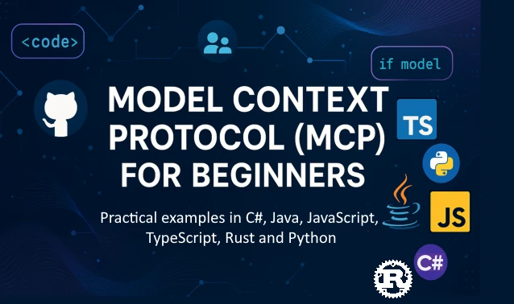

 

[](https://GitHub.com/microsoft/mcp-for-beginners/graphs/contributors)
[](https://GitHub.com/microsoft/mcp-for-beginners/issues)
[](https://GitHub.com/microsoft/mcp-for-beginners/pulls)
[](http://makeapullrequest.com)

[](https://GitHub.com/microsoft/mcp-for-beginners/watchers)
[](https://GitHub.com/microsoft/mcp-for-beginners/fork)
[](https://GitHub.com/microsoft/mcp-for-beginners/stargazers)


[](https://discord.gg/nTYy5BXMWG)

Sekite šiuos žingsnius, kad pradėtumėte naudotis šiais ištekliais:
1. **Padalykite repozitoriją (Fork the Repository)**: Spustelėkite [](https://GitHub.com/microsoft/mcp-for-beginners/fork)
2. **Klonuokite repozitoriją (Clone the Repository)**:   `git clone https://github.com/microsoft/mcp-for-beginners.git`
3. **Prisijunkite prie** [](https://discord.gg/nTYy5BXMWG)


### 🌐 Daugiakalbė palaikymas

#### Palaikoma per GitHub Action (Automatinė ir visada atnaujinama)

<!-- CO-OP TRANSLATOR LANGUAGES TABLE START -->
[Arabic](../ar/README.md) | [Bengali](../bn/README.md) | [Bulgarian](../bg/README.md) | [Burmese (Myanmar)](../my/README.md) | [Chinese (Simplified)](../zh-CN/README.md) | [Chinese (Traditional, Hong Kong)](../zh-HK/README.md) | [Chinese (Traditional, Macau)](../zh-MO/README.md) | [Chinese (Traditional, Taiwan)](../zh-TW/README.md) | [Croatian](../hr/README.md) | [Czech](../cs/README.md) | [Danish](../da/README.md) | [Dutch](../nl/README.md) | [Estonian](../et/README.md) | [Finnish](../fi/README.md) | [French](../fr/README.md) | [German](../de/README.md) | [Greek](../el/README.md) | [Hebrew](../he/README.md) | [Hindi](../hi/README.md) | [Hungarian](../hu/README.md) | [Indonesian](../id/README.md) | [Italian](../it/README.md) | [Japanese](../ja/README.md) | [Kannada](../kn/README.md) | [Korean](../ko/README.md) | [Lithuanian](./README.md) | [Malay](../ms/README.md) | [Malayalam](../ml/README.md) | [Marathi](../mr/README.md) | [Nepali](../ne/README.md) | [Nigerian Pidgin](../pcm/README.md) | [Norwegian](../no/README.md) | [Persian (Farsi)](../fa/README.md) | [Polish](../pl/README.md) | [Portuguese (Brazil)](../pt-BR/README.md) | [Portuguese (Portugal)](../pt-PT/README.md) | [Punjabi (Gurmukhi)](../pa/README.md) | [Romanian](../ro/README.md) | [Russian](../ru/README.md) | [Serbian (Cyrillic)](../sr/README.md) | [Slovak](../sk/README.md) | [Slovenian](../sl/README.md) | [Spanish](../es/README.md) | [Swahili](../sw/README.md) | [Swedish](../sv/README.md) | [Tagalog (Filipino)](../tl/README.md) | [Tamil](../ta/README.md) | [Telugu](../te/README.md) | [Thai](../th/README.md) | [Turkish](../tr/README.md) | [Ukrainian](../uk/README.md) | [Urdu](../ur/README.md) | [Vietnamese](../vi/README.md)

> **Norite klonuoti vietoje?**
>
> Ši repozitorija apima daugiau nei 50 kalbų vertimų, kas žymiai padidina atsisiuntimo dydį. Norėdami klonuoti be vertimų, naudokite sparse checkout:
>
> **Bash / macOS / Linux:**
> ```bash
> git clone --filter=blob:none --sparse https://github.com/microsoft/mcp-for-beginners.git
> cd mcp-for-beginners
> git sparse-checkout set --no-cone '/*' '!translations' '!translated_images'
> ```
>
> **CMD (Windows):**
> ```cmd
> git clone --filter=blob:none --sparse https://github.com/microsoft/mcp-for-beginners.git
> cd mcp-for-beginners
> git sparse-checkout set --no-cone "/*" "!translations" "!translated_images"
> ```
>
> Tai suteiks jums viską, ko reikia kursui baigti, su daug sparčiau vykstančiu atsisiuntimu.
<!-- CO-OP TRANSLATOR LANGUAGES TABLE END -->

# 🚀 Modelio Konteksto Protokolo (MCP) kursai pradedantiesiems

## **Mokykitės MCP su praktiniais kodo pavyzdžiais C#, Java, JavaScript, Rust, Python ir TypeScript kalbomis**

## 🧠 Modelio Konteksto Protokolo kursų apžvalga
Sveiki atvykę į savo kelią su Modelio Konteksto Protokolu! Jei kada nors susimąstėte, kaip DI (dirbtinio intelekto) programos bendrauja su skirtingais įrankiais ir paslaugomis, netrukus atrasite elegantišką sprendimą, kuris keičia tai, kaip kūrėjai kuria intelektualias sistemas.

Įsivaizduokite MCP kaip universalų vertėją DI programoms – taip, kaip USB prievadai leidžia prijungti bet kokį įrenginį prie jūsų kompiuterio, MCP leidžia DI modeliams standartizuotai prisijungti prie bet kurio įrankio ar paslaugos. Nesvarbu, ar kuriate pirmąjį savo pokalbių robotą, ar dirbate su sudėtingais DI darbo srautais, MCP supratimas suteiks jums galią kurti pajėgesnes ir lanksčias programas.

Šis kursas sukurtas kantriai ir rūpestingai jūsų mokymosi kelionei. Pradėsime nuo paprastų jau suprantamų sąvokų ir pamažu auginsime jūsų įgūdžius per praktinius pratimus pasirinktoje programavimo kalboje. Kiekviename etape yra aiškūs paaiškinimai, praktiški pavyzdžiai ir daug padrąsinimų.

Baigę šią kelionę, turėsite pasitikėjimo kurdami savo MCP serverius, integruodami juos su populiariomis DI platformomis ir suprasite, kaip ši technologija keičia DI vystymo ateitį. Pradėkime šią įdomią nuotykį kartu!

### Oficialūs dokumentai ir specifikacijos

Šis kursas suderintas su **MCP Specifikacija 2025-11-25** (naujausias stabilus leidimas). MCP specifikacija naudoja datos pagrindu versijavimą (YYYY-MM-DD formatu), kad aiškiai sekama protokolo versija.

Šie ištekliai tampa vertingesni su jūsų supratimo augimu, tačiau nesijauskite spaudžiami viską skaityti iš karto. Pradėkite nuo srities, kuri jus labiausiai domina!
- 📘 [MCP dokumentacija](https://modelcontextprotocol.io/) – Tai jūsų pagrindinis šaltinis žingsnis po žingsnio vadovams ir vartotojų gido. Dokumentacija parašyta pradedantiesiems draugišku stiliumi, pateikiant aiškius pavyzdžius, kuriuos galite sekti jums patogiu tempu.
- 📜 [MCP specifikacija](https://modelcontextprotocol.io/specification/2025-11-25) – Įsivaizduokite tai kaip išsamų nuorodų vadovą. Dirbdami per kursą, dažnai čia grįšite ieškoti konkrečių detalių ir nagrinėti pažangias funkcijas.
- 📜 [MCP specifikacijos versijavimas](https://modelcontextprotocol.io/specification/versioning) – Čia rasite informaciją apie protokolo versijų istoriją ir kaip MCP naudoja datos pagrindo versijavimą (YYYY-MM-DD formatu).
- 🧑‍💻 [MCP GitHub repozitorija](https://github.com/modelcontextprotocol) – Čia rasite SDK, įrankius ir kodo pavyzdžius įvairiomis programavimo kalbomis. Tai tarsi lobyno deimantas su praktiškais pavyzdžiais ir paruoštais komponentais.
- 🌐 [MCP bendruomenė](https://github.com/orgs/modelcontextprotocol/discussions) – Prisijunkite prie kitų besimokančių ir patyrusių kūrėjų diskusijose apie MCP. Tai palaikanti bendruomenė, kurioje klausimai yra laukiami ir žinios laisvai dalijamos.
  
## Mokymosi tikslai

Šio kurso pabaigoje jausitės pasitikintys ir džiaugsitės savo naujais gebėjimais. Štai ką pasieksite:

• **Suprasite MCP pagrindus**: Sužinosite, kas yra Modelio Konteksto Protokolas ir kodėl jis keičia tai, kaip DI programos veikia kartu, naudodamiesi prasmingomis analogijomis ir pavyzdžiais.

• **Sukursite savo pirmą MCP serverį**: Sukursite veikiantį MCP serverį pasirinktoje programavimo kalboje, pradedant nuo paprastų pavyzdžių ir žingsnis po žingsnio augindami savo įgūdžius.

• **Sujungsite DI modelius su tikrais įrankiais**: Sužinosite, kaip tiltu sujungti DI modelius ir tikras paslaugas, suteikdami savo programoms galingas naujas galimybes.

• **Įgyvendinsite saugumo geriausias praktikas**: Suprasite, kaip užtikrinti savo MCP įgyvendinimų saugumą, apsaugant tiek savo programas, tiek naudotojus.

• **Diegsite drąsiai**: Žinosite, kaip savo MCP projektus perkelti iš kūrimo į gamybą, naudodami praktiškas diegimo strategijas, veikiančias realiame pasaulyje.

• **Prisijungsite prie MCP bendruomenės**: Tapsite augančios kūrėjų bendruomenės dalimi, formuojančios DI programų vystymo ateitį.

## Būtinos žinios

Prieš neriant į MCP specifiką, įsitikinkime, kad jaučiatės patogiai su kai kuriomis pagrindinėmis sąvokomis. Nesijaudinkite, jei šiose srityse nesate ekspertas – mes paaiškinsime viską, ko jums reikės, eidami kartu!

### Protokolų supratimas (Pamatai)

Įsivaizduokite protokolą kaip pokalbio taisykles. Kai skambinate draugui, abu žinote, kad atsakius sakote „labas“, kalbatės po vieną ir baigę sakote „viso gero“. Kompiuterinės programos taip pat reikalingas panašus taisyklių rinkinys, kad jos galėtų efektyviai bendrauti.

MCP yra protokolas – sutartų taisyklių rinkinys, kuris padeda DI modeliams ir programoms produktyviai „kalbėtis“ su įrankiais ir paslaugomis. Kaip pokalbio taisyklės palengvina žmonių bendravimą, taip MCP padaro DI programų komunikaciją daug patikimesnę ir galingesnę.

### Kliento-serverio santykiai (Kaip programos veikia kartu)

Jūs jau kasdien naudojate kliento-serverio santykius! Kai naudojate interneto naršyklę (klientą) apsilankyti svetainėje, prisijungiate prie interneto serverio, kuris siunčia puslapio turinį. Naršyklė žino, kaip prašyti informacijos, o serveris žino, kaip atsakyti.

MCP yra panašus santykis: DI modeliai yra klientai, kurie prašo informacijos ar veiksmų, o MCP serveriai teikia tas galimybes. Tai tarsi turėti padedantį asistentą (serverį), kurį DI gali paprašyti atlikti specifines užduotis.

### Kodėl svarbi standartizacija (Kaip dalykai veikia kartu)

Įsivaizduokite, jei kiekvienas automobilių gamintojas naudotų skirtingo dydžio degalų piltuvus – jums reikėtų skirtingo adapterio kiekvienam automobiliui! Standartizacija reiškia susitarti dėl bendrų sprendimų, kad viskas veiktų be problemų.

MCP suteikia šią standartizaciją DI programoms. Vietoj to, kad kiekvienas DI modelis reikėtų rašyti specialų kodą darbui su kiekvienu įrankiu, MCP sukuria universalų būdą jiems bendrauti. Tai leidžia kūrėjams įrankius kurti vieną kartą ir naudoti daugelyje skirtingų DI sistemų.

## 🧭 Jūsų mokymosi kelio apžvalga

Jūsų MCP kelias yra kruopščiai struktūruotas, siekiant palaipsniui ugdyti jūsų pasitikėjimą ir įgūdžius. Kiekvienas etapas pristato naujas sąvokas ir stiprina jau įgytas žinias.

### 🌱 Pagrindų etapas: pagrindų supratimas (0–2 moduliai)

Čia prasideda jūsų nuotykis! Pateiksime jums MCP sąvokas naudodami pažįstamas analogijas ir paprastus pavyzdžius. Suprasite, kas yra MCP, kodėl jis egzistuoja ir kaip jis dera su platesniu DI pasauliu.

• **Modulis 0 – Įvadas į MCP**: Pradėsime tyrinėdami, kas yra MCP ir kodėl jis toks svarbus šiuolaikinėms DI programoms. Pamatysite realius MCP veikimo pavyzdžius ir suprasite, kaip jis sprendžia bendras problemas, su kuriomis susiduria kūrėjai.

• **Modulis 1 – Pagrindinės sąvokos paaiškintos**: Čia išmoksite pagrindinius MCP statybinius blokus. Naudosime daug analogijų ir vaizdinių pavyzdžių, kad šios sąvokos būtų natūralios ir suprantamos.

• **Modulis 2 – Saugumas MCP**: Saugumas gali atrodyti bauginantis, bet mes parodysime, kaip MCP turi integruotas saugumo priemones ir išmokysime geriausių praktikų, kurios apsaugos jūsų programas nuo pat pradžių.

### 🔨 Kūrimo etapas: pirmųjų įgyvendinimų kūrimas (3 modulis)

Dabar prasideda tikras linksmybių metas! Gaunate praktinės patirties kuriant tikrus MCP serverius ir klientus. Nesijaudinkite – pradėsime nuo paprasto ir vesime jus žingsnis po žingsnio.
Šis modulis apima kelis praktinius vadovus, leidžiančius praktikuotis jums patogiausia programavimo kalba. Sukursite savo pirmąjį serverį, sukursite klientą, kuris prisijungs prie jo, ir net integruositės su populiariomis kūrimo priemonėmis, tokiomis kaip VS Code.

Kiekvienas vadovas apima pilnus kodo pavyzdžius, trikčių šalinimo patarimus ir paaiškinimus, kodėl pasirenkame tam tikrus dizaino sprendimus. Šios fazės pabaigoje turėsite veikiančias MCP įgyvendinimo versijas, kurias galėsite didžiuotis!

### 🚀 Augimo fazė: pažangios sąvokos ir realaus pasaulio taikymas (4-5 moduliai)

Įvaldę pagrindus, esate pasiruošę tyrinėti sudėtingesnes MCP funkcijas. Aptarsime praktines įgyvendinimo strategijas, derinimo technikas ir pažangias temas, tokias kaip daugialypio režimo AI integracija.

Taip pat išmoksite keisti savo MCP įgyvendinimus gamybiniam naudojimui ir integruotis su debesų platformomis, tokiomis kaip Azure. Šie moduliai paruoš jus kurti MCP sprendimus, kurie atlaikytų realaus pasaulio reikalavimus.

### 🌟 Meistriškumo fazė: bendruomenė ir specializacija (6-11 moduliai)

Paskutinė fazė skirta prisijungti prie MCP bendruomenės ir specializuotis jums įdomiose srityse. Išmoksite prisidėti prie atvirojo kodo MCP projektų, įgyvendinti pažangias autentifikacijos schemas ir kurti išsamias sprendimų su duomenų bazės integracija.

11 modulis nusipelno ypatingo paminėjimo – tai pilnas 13 laboratorijų praktinis mokymosi kelias, kuris moko kurti gamybai paruoštus MCP serverius su PostgreSQL integracija. Tai kaip baigiamasis projektas, apjungiantis viską, ko išmokote!

### 📚 Pilnas mokymo planas

| Modulis | Tema | Aprašymas | Nuoroda |
|--------|-------|-------------|------|
| **Moduliai 0-3: Pagrindai** | | | |
| 00 | Įvadas į MCP | Modelio konteksto protokolo apžvalga ir jo svarba AI srautuose | [Skaityti daugiau](./00-Introduction/README.md) |
| 01 | Pagrindinių sąvokų paaiškinimas | Išsamus pagrindinių MCP sąvokų nagrinėjimas | [Skaityti daugiau](./01-CoreConcepts/README.md) |
| 02 | MCP saugumas | Saugumo grėsmės ir geriausios praktikos | [Skaityti daugiau](./02-Security/README.md) |
| 03 | Pirmieji žingsniai su MCP | Aplinkos nustatymas, pagrindiniai serveriai/klientai, integracija | [Skaityti daugiau](./03-GettingStarted/README.md) |
| **Modulis 3: Pirmojo serverio ir kliento kūrimas** | | | |
| 3.1 | Pirmasis serveris | Sukurkite savo pirmąjį MCP serverį | [Vadovas](./03-GettingStarted/01-first-server/README.md) |
| 3.2 | Pirmasis klientas | Sukurkite paprastą MCP klientą | [Vadovas](./03-GettingStarted/02-client/README.md) |
| 3.3 | Klientas su LLM | Integruokite didelius kalbos modelius | [Vadovas](./03-GettingStarted/03-llm-client/README.md) |
| 3.4 | VS Code integracija | Naudokite MCP serverius VS Code aplinkoje | [Vadovas](./03-GettingStarted/04-vscode/README.md) |
| 3.5 | stdio serveris | Kurkite serverius naudodami stdio transportą | [Vadovas](./03-GettingStarted/05-stdio-server/README.md) |
| 3.6 | HTTP srautas | Įgyvendinkite HTTP srautą MCP | [Vadovas](./03-GettingStarted/06-http-streaming/README.md) |
| 3.7 | AI įrankių rinkinys | Naudokite AI įrankių rinkinį su MCP | [Vadovas](./03-GettingStarted/07-aitk/README.md) |
| 3.8 | Testavimas | Testuokite savo MCP serverio įgyvendinimą | [Vadovas](./03-GettingStarted/08-testing/README.md) |
| 3.9 | Diegimas | Diegkite MCP serverius į gamybą | [Vadovas](./03-GettingStarted/09-deployment/README.md) |
| 3.10 | Pažangus serverio naudojimas | Naudokite pažangius serverius pažangioms funkcijoms ir patobulintai architektūrai | [Vadovas](./03-GettingStarted/10-advanced/README.md) |
| 3.11 | Paprasta autentifikacija | Skyrius, kuris nuo pradžių parodo autentifikaciją ir RBAC | [Vadovas](./03-GettingStarted/11-simple-auth/README.md) |
| 3.12 | MCP šeimininkai | Konfigūruokite Claude Desktop, Cursor, Cline ir kitus MCP šeimininkus | [Vadovas](./03-GettingStarted/12-mcp-hosts/README.md) |
| 3.13 | MCP inspektorius | Derinkite ir testuokite MCP serverius su Inspector įrankiu | [Vadovas](./03-GettingStarted/13-mcp-inspector/README.md) |
| 3.14 | Imbūdinimas | Naudokite imbūdinimą bendradarbiaudami su klientu | [Vadovas](./03-GettingStarted/14-sampling/README.md) |
| 3.15 | MCP programėlės | Kurkite MCP programėles | [Vadovas](./03-GettingStarted/15-mcp-apps/README.md) |
| **Moduliai 4-5: Praktika ir pažangi tema** | | | |
| 04 | Praktinis įgyvendinimas | SDK, derinimas, testavimas, pakartotinai naudojami užklausų šablonai | [Skaityti daugiau](./04-PracticalImplementation/README.md) |
| 4.1 | Puslapiavimas | Tvarkykite didelius rezultatų rinkinius su kursoriaus pagrindu sudarytu puslapiavimu | [Vadovas](./04-PracticalImplementation/pagination/README.md) |
| 05 | Pažangios MCP temos | Daugialypis AI, mastelio didinimas, įmonių naudojimas | [Skaityti daugiau](./05-AdvancedTopics/README.md) |
| 5.1 | Azure integracija | MCP integracija su Azure | [Vadovas](./05-AdvancedTopics/mcp-integration/README.md) |
| 5.2 | Daugialypėje erdvėje | Darbas su keliomis modalinėmis sritimis | [Vadovas](./05-AdvancedTopics/mcp-multi-modality/README.md) |
| 5.3 | OAuth2 demonstracija | Įgyvendinkite OAuth2 autentifikaciją | [Vadovas](./05-AdvancedTopics/mcp-oauth2-demo/README.md) |
| 5.4 | Root kontekstai | Supraskite ir įgyvendinkite root kontekstus | [Vadovas](./05-AdvancedTopics/mcp-root-contexts/README.md) |
| 5.5 | Maršrutizavimas | MCP maršrutizavimo strategijos | [Vadovas](./05-AdvancedTopics/mcp-routing/README.md) |
| 5.6 | Imbūdinimas | Imbūdinimo MCP technikos | [Vadovas](./05-AdvancedTopics/mcp-sampling/README.md) |
| 5.7 | Mastelio keitimas | MCP įgyvendinimų mastelio didinimas | [Vadovas](./05-AdvancedTopics/mcp-scaling/README.md) |
| 5.8 | Saugumas | Pažangūs saugumo aspektai | [Vadovas](./05-AdvancedTopics/mcp-security/README.md) |
| 5.9 | Tinklo paieška | Įgyvendinkite tinklo paieškos galimybes | [Vadovas](./05-AdvancedTopics/web-search-mcp/README.md) |
| 5.10 | Realaus laiko transliacija | Kurkite realaus laiko srauto funkcijas | [Vadovas](./05-AdvancedTopics/mcp-realtimestreaming/README.md) |
| 5.11 | Realaus laiko paieška | Įgyvendinkite realaus laiko paiešką | [Vadovas](./05-AdvancedTopics/mcp-realtimesearch/README.md) |
| 5.12 | Entra ID autentifikacija | Autentifikacija su Microsoft Entra ID | [Vadovas](./05-AdvancedTopics/mcp-security-entra/README.md) |
| 5.13 | Foundry integracija | Integracija su Azure AI Foundry | [Vadovas](./05-AdvancedTopics/mcp-foundry-agent-integration/README.md) |
| 5.14 | Konteksto inžinerija | Efektyvios konteksto inžinerijos technikos | [Vadovas](./05-AdvancedTopics/mcp-contextengineering/README.md) |
| 5.15 | MCP pasirinktinė transporto priemonė | Pasirinktinių transporto priemonių įgyvendinimai | [Vadovas](./05-AdvancedTopics/mcp-transport/README.md) |
| 5.16 | Protokolo funkcijos | Progreso pranešimai, atšaukimas, resursų šablonai | [Vadovas](./05-AdvancedTopics/mcp-protocol-features/README.md) |
| **Moduliai 6-10: Bendruomenė ir geriausios praktikos** | | | |
| 06 | Bendruomenės indėliai | Kaip prisidėti prie MCP ekosistemos | [Vadovas](./06-CommunityContributions/README.md) |
| 07 | Pirmosios patirties įžvalgos | Realūs įgyvendinimo pavyzdžiai | [Vadovas](./07-LessonsfromEarlyAdoption/README.md) |
| 08 | Geriausios MCP praktikos | Veikimas, klaidų tolerancija, atsparumas | [Vadovas](./08-BestPractices/README.md) |
| 09 | MCP atvejų analizės | Praktiniai įgyvendinimo pavyzdžiai | [Vadovas](./09-CaseStudy/README.md) |
| 10 | Praktinis seminaras | MCP serverio kūrimas su AI įrankių rinkiniu | [Laboratorija](./10-StreamliningAIWorkflowsBuildingAnMCPServerWithAIToolkit/README.md) |
| **Modulis 11: MCP serverio praktinės laboratorijos** | | | |
| 11 | MCP serverio duomenų bazės integracija | Išsamus 13 laboratorijų praktinis mokymo kelias PostgreSQL integracijai | [Laboratorijos](./11-MCPServerHandsOnLabs/README.md) |
| 11.1 | Įvadas | MCP apžvalga su duomenų bazės integracija ir mažmeninės prekybos analizės atveju | [Laboratorija 00](./11-MCPServerHandsOnLabs/00-Introduction/README.md) |
| 11.2 | Pagrindinė architektūra | MCP serverio architektūros, duomenų bazių sluoksnių ir saugumo modelių supratimas | [Laboratorija 01](./11-MCPServerHandsOnLabs/01-Architecture/README.md) |
| 11.3 | Saugumas ir multi-nuomininkų palaikymas | Eilučių lygio saugumas, autentifikacija ir daugiareikšmės prieigos prie duomenų valdymas | [Laboratorija 02](./11-MCPServerHandsOnLabs/02-Security/README.md) |
| 11.4 | Aplinkos nustatymas | Vystytojo aplinkos, Docker, Azure išteklių konfigūravimas | [Laboratorija 03](./11-MCPServerHandsOnLabs/03-Setup/README.md) |
| 11.5 | Duomenų bazės dizainas | PostgreSQL nustatymas, mažmeninės prekybos schemos kūrimas ir pavyzdiniai duomenys | [Laboratorija 04](./11-MCPServerHandsOnLabs/04-Database/README.md) |
| 11.6 | MCP serverio įgyvendinimas | FastMCP serverio kūrimas su duomenų bazės integracija | [Laboratorija 05](./11-MCPServerHandsOnLabs/05-MCP-Server/README.md) |
| 11.7 | Įrankių kūrimas | Duomenų užklausų įrankių ir schemos introspekcijos kūrimas | [Laboratorija 06](./11-MCPServerHandsOnLabs/06-Tools/README.md) |
| 11.8 | Semantinė paieška | Vektorių įterpimų įgyvendinimas su Azure OpenAI ir pgvector | [Laboratorija 07](./11-MCPServerHandsOnLabs/07-Semantic-Search/README.md) |
| 11.9 | Testavimas ir derinimas | Testavimo strategijos, derinimo įrankiai ir validavimo metodai | [Laboratorija 08](./11-MCPServerHandsOnLabs/08-Testing/README.md) |
| 11.10 | VS Code integracija | VS Code MCP integracijos ir AI pokalbių naudojimo konfigūracija | [Laboratorija 09](./11-MCPServerHandsOnLabs/09-VS-Code/README.md) |
| 11.11 | Diegimo strategijos | Docker diegimas, Azure Container Apps ir mastelio keitimo aspektai | [Laboratorija 10](./11-MCPServerHandsOnLabs/10-Deployment/README.md) |
| 11.12 | Stebėjimas | Application Insights, logų kaupimas, našumo stebėjimas | [Laboratorija 11](./11-MCPServerHandsOnLabs/11-Monitoring/README.md) |
| 11.13 | Geriausios praktikos | Veikimo optimizavimas, saugumo stiprinimas ir gamybos patarimai | [Laboratorija 12](./11-MCPServerHandsOnLabs/12-Best-Practices/README.md) |

### 💻 Pavyzdiniai kodo projektai

Vienas įdomiausių mokantis MCP yra matyti, kaip jūsų kodo įgūdžiai nuosekliai tobulėja. Kodo pavyzdžiai sukurti taip, kad prasidėtų paprastai ir augtų į sudėtingesnius, atsižvelgiant į jūsų supratimo gilumą. Štai kaip pateikiame sąvokas – su kodu, kuris lengvai suprantamas, bet demonstruoja tikrus MCP principus, jūs suprasite ne tik ką šis kodas daro, bet ir kodėl jis struktūruotas būtent taip ir kaip jis dera platesnėse MCP programose.

#### Pagrindiniai MCP skaičiuoklių pavyzdžiai

| Kalba | Aprašymas | Nuoroda |
|----------|-------------|------|
| C# | MCP serverio pavyzdys | [Peržiūrėti kodą](./03-GettingStarted/samples/csharp/README.md) |
| Java | MCP skaičiuoklė | [Peržiūrėti kodą](./03-GettingStarted/samples/java/calculator/README.md) |
| JavaScript | MCP demonstracija | [Peržiūrėti kodą](./03-GettingStarted/samples/javascript/README.md) |
| Python | MCP serveris | [Peržiūrėti kodą](../../03-GettingStarted/samples/python/mcp_calculator_server.py) |
| TypeScript | MCP pavyzdys | [Peržiūrėti kodą](./03-GettingStarted/samples/typescript/README.md) |
| Rust | MCP pavyzdys | [Peržiūrėti kodą](./03-GettingStarted/samples/rust/README.md) |

#### Pažangūs MCP įgyvendinimai

| Kalba | Aprašymas | Nuoroda |
|----------|-------------|------|
| C# | Pažangus pavyzdys | [Peržiūrėti kodą](./04-PracticalImplementation/samples/csharp/README.md) |
| Java su Spring | Container App pavyzdys | [Peržiūrėti kodą](./04-PracticalImplementation/samples/java/containerapp/README.md) |
| JavaScript | Pažangus pavyzdys | [Peržiūrėti kodą](./04-PracticalImplementation/samples/javascript/README.md) |
| Python | Kompleksinis įgyvendinimas | [Peržiūrėti kodą](./04-PracticalImplementation/samples/python/README.md) |
| TypeScript | Container pavyzdys | [Peržiūrėti kodą](./04-PracticalImplementation/samples/typescript/README.md) |


## 🎯 MCP mokymosi išankstiniai reikalavimai

Kad gautumėte kuo daugiau naudos iš šio mokymo plano, turėtumėte turėti:
- Pagrindinės programavimo žinios bent vienoje iš šių kalbų: C#, Java, JavaScript, Python arba TypeScript
- Kliento-serverio modelio ir API supratimas
- Supažindinimas su REST ir HTTP koncepcijomis
- (Pasirinktinai) AI / ML koncepcijų pagrindai

- Dalyvavimas mūsų bendruomenės diskusijose paramai gauti

## 📚 Studijų vadovas ir ištekliai

Šiame saugykloje yra keletas išteklių, kurie padės jums orientuotis ir efektyviai mokytis:

### Studijų vadovas

Išsamus [Studijų vadovas](./study_guide.md) padės jums efektyviai orientuotis šiame saugykloje. Ši vizualinė mokymo programos schema rodo, kaip visos temos susijusios, ir suteikia nurodymų, kaip veiksmingai naudoti pavyzdinius projektus. Tai ypač naudinga, jei esate vizualinis mokinys, mėgstantis matyti bendrą vaizdą.

Vadove yra:
- Vizualinė mokymo programos schema, rodanti visas temas
- Išsamus kiekvienos saugyklos skilties išskaidymas
- Nurodymai, kaip naudoti pavyzdinius projektus
- Rekomenduojami mokymosi keliai skirtingo lygio mokiniams
- Papildomi ištekliai jūsų mokymosi kelionei papildyti

### Keitimo žurnalas

Mes palaikome išsamų [Keitimo žurnalą](./changelog.md), kuriame sekami visi svarbūs mokymo medžiagos atnaujinimai, kad galėtumėte nuolat sekti naujausius patobulinimus ir papildymus.
- Naujo turinio įtraukimas
- Struktūriniai pokyčiai
- Funkcijų patobulinimai
- Dokumentacijos atnaujinimai

## 🛠️ Kaip efektyviai naudotis šia mokymo programa

Kiekviena šio vadovo pamoka apima:

1. Aiškius MCP koncepcijų paaiškinimus  
2. Gyvus kodo pavyzdžius keliomis kalbomis  
3. Užduotis tikrų MCP programų kūrimui  
4. Papildomus išteklius pažengusiems mokiniams

### Mokomės MCP su C# - pamokų serija  
Susipažinkime su Model Context Protocol (MCP) – pažangia sistema, skirta standartizuoti sąveikas tarp AI modelių ir klientų programų. Šiame pradedančiųjų lygiui skirtame kurse pristatysime MCP ir padėsime jums sukurti pirmą MCP serverį.  
#### C#: [https://aka.ms/letslearnmcp-csharp](https://aka.ms/letslearnmcp-csharp)  
#### Java: [https://aka.ms/letslearnmcp-java](https://aka.ms/letslearnmcp-java)  
#### JavaScript: [https://aka.ms/letslearnmcp-javascript](https://aka.ms/letslearnmcp-javascript)  
#### Python: [https://aka.ms/letslearnmcp-python](https://aka.ms/letslearnmcp-python)  

## 🎓 Jūsų MCP kelionė prasideda

Sveikiname! Jūs ką tik žengėte pirmą žingsnį į įdomią kelionę, kuri praplės jūsų programavimo galimybes ir sujungs jus su pažangiausiomis AI kūrimo sritimis.

### Ką jau pasiekėte

Perskaitę šį įvadą, jūs jau pradėjote kurti savo MCP žinių pagrindą. Suprantate, kas yra MCP, kodėl jis svarbus ir kaip ši programa padės jūsų mokymosi kelionėje. Tai svarbus pasiekimas ir jūsų ekspertizės pradžia šioje svarbioje technologijoje.

### Nuotykiai laukia

Judėdami toliau per modulius, prisiminkite, kad kiekvienas ekspertas kadaise buvo pradedantysis. Koncepcijos, kurios dabar gali atrodyti sudėtingos, taps antrąja prigimtimi, kai praktikuositės ir jas pritaikysite. Kiekvienas mažas žingsnis kuria galingas galimybes, kurios jums pasitarnaus visos karjeros metu.

### Jūsų pagalbos tinklas

Jūs prisijungiate prie bendruomenės, sudarytos iš mokinių ir ekspertų, kurie aistringai domisi MCP ir noriai padeda kitiems pasiekti sėkmę. Nesvarbu, ar užstrigote su programavimo iššūkiu, ar norite pasidalinti savo proveržiu, bendruomenė čia, kad palaikytų jūsų kelionę.

Jei turite klausimų ar užstrigote kurdami AI programas, prisijunkite prie diskusijų su kitais mokiniais ir patyrusiais kūrėjais apie MCP. Tai draugiška bendruomenė, kurioje klausimai laukiami, o žinios laisvai dalijamos.

[](https://discord.gg/nTYy5BXMWG)

Jei turite produkto atsiliepimų arba radote klaidų, apsilankykite:

[](https://aka.ms/foundry/forum)

### Pasiruošę pradėti?

Jūsų MCP nuotykis prasideda dabar! Pradėkite nuo 0 modulio, kad įgytumėte pirmųjų praktinių MCP įgūdžių, arba apžiūrėkite pavyzdinius projektus, kad pamatytumėte, ką kursite. Atminkite – kiekvienas ekspertas pradėjo būtent ten, kur esate jūs dabar, ir su kantrybe bei praktika būsite nustebinti, ką galite pasiekti.

Sveiki atvykę į Model Context Protocol kūrimo pasaulį. Kurkime kažką nuostabaus kartu!

## 🤝 Indėlis į mokymosi bendruomenę

Ši mokymo programa stiprėja su tokiais mokiniais kaip jūs! Nesvarbu, ar taisote rašybos klaidą, siūlote aiškesnį paaiškinimą, ar pridedate naują pavyzdį, jūsų indėlis padeda kitiems pradedantiesiems pasiekti sėkmę.

Dėkojame Microsoft Vertinamo Profesionalo [Shivam Goyal](https://www.linkedin.com/in/shivam2003/) už kodo pavyzdžių prisidėjimą.

Indėlio procesas yra draugiškas ir palaikantis. Daugumai indėlių reikalinga Pasirašančiojo licencijos sutartis (CLA), tačiau automatizuoti įrankiai sklandžiai jus tai praves.

## 📜 Atvirojo kodo mokymasis

Visa ši mokymo programa yra prieinama pagal MIT [LICENCIJĄ](../../LICENSE), reiškiančią, kad galite ją naudoti, keisti ir laisvai dalintis. Tai palaiko mūsų misiją - padaryti MCP žinias prieinamas programuotojams visur.
## 🤝 Indėlio taisyklės

Šis projektas kviečia prisidėti ir teikti pasiūlymus. Daugumai indėlių reikia sutikti su Pasirašančiojo licencijos sutartimi (CLA), kurioje patvirtinate, kad turite teisę ir iš tikrųjų suteikiate mums teisę naudoti jūsų indėlį. Išsamesnė informacija: <https://cla.opensource.microsoft.com>.

Pateikus pull request, CLA robotas automatiškai nustatys, ar reikia pateikti CLA, ir tinkamai paženklins PR (pvz., būsenos patikrinimai, komentarai). Tiesiog vykdykite roboto nurodymus. Tai reikės padaryti tik vieną kartą visose saugyklose, kurios naudoja mūsų CLA.

Šis projektas taiko [Microsoft atvirojo kodo elgesio taisykles](https://opensource.microsoft.com/codeofconduct/).
Daugiau informacijos ieškokite [Elgesio taisyklių DUK](https://opensource.microsoft.com/codeofconduct/faq/) arba susisiekite su [opencode@microsoft.com](mailto:opencode@microsoft.com) dėl papildomų klausimų ar pastabų.

---

*Pasiruošę pradėti savo MCP kelionę? Pradėkite nuo [Modulis 00 – Įvadas į MCP](./00-Introduction/README.md) ir ženkite pirmuosius žingsnius Model Context Protocol kūrimo pasaulyje!*


## 🎒 Kiti kursai  
Mūsų komanda kuria ir kitus kursus! Patikrinkite:

<!-- CO-OP TRANSLATOR OTHER COURSES START -->
### LangChain  
[](https://aka.ms/langchain4j-for-beginners)  
[](https://aka.ms/langchainjs-for-beginners?WT.mc_id=m365-94501-dwahlin)  
[](https://github.com/microsoft/langchain-for-beginners?WT.mc_id=m365-94501-dwahlin)  
---

### Azure / Edge / MCP / Agentai  
[](https://github.com/microsoft/AZD-for-beginners?WT.mc_id=academic-105485-koreyst)  
[](https://github.com/microsoft/edgeai-for-beginners?WT.mc_id=academic-105485-koreyst)  
[](https://github.com/microsoft/mcp-for-beginners?WT.mc_id=academic-105485-koreyst)  
[](https://github.com/microsoft/ai-agents-for-beginners?WT.mc_id=academic-105485-koreyst)  

---

### Generatyvinio AI serija  
[](https://github.com/microsoft/generative-ai-for-beginners?WT.mc_id=academic-105485-koreyst)  
[-9333EA?style=for-the-badge&labelColor=E5E7EB&color=9333EA)](https://github.com/microsoft/Generative-AI-for-beginners-dotnet?WT.mc_id=academic-105485-koreyst)  
[-C084FC?style=for-the-badge&labelColor=E5E7EB&color=C084FC)](https://github.com/microsoft/generative-ai-for-beginners-java?WT.mc_id=academic-105485-koreyst)  
[-E879F9?style=for-the-badge&labelColor=E5E7EB&color=E879F9)](https://github.com/microsoft/generative-ai-with-javascript?WT.mc_id=academic-105485-koreyst)  

---

### Pagrindinis mokymasis  
[](https://aka.ms/ml-beginners?WT.mc_id=academic-105485-koreyst)  
[](https://aka.ms/datascience-beginners?WT.mc_id=academic-105485-koreyst)  
[](https://aka.ms/ai-beginners?WT.mc_id=academic-105485-koreyst)  
[](https://github.com/microsoft/Security-101?WT.mc_id=academic-96948-sayoung)  
[](https://aka.ms/webdev-beginners?WT.mc_id=academic-105485-koreyst)  
[](https://aka.ms/iot-beginners?WT.mc_id=academic-105485-koreyst)  
[](https://github.com/microsoft/xr-development-for-beginners?WT.mc_id=academic-105485-koreyst)  

---

### Copilot serija  

[](https://aka.ms/GitHubCopilotAI?WT.mc_id=academic-105485-koreyst)
[](https://github.com/microsoft/mastering-github-copilot-for-dotnet-csharp-developers?WT.mc_id=academic-105485-koreyst)
[](https://github.com/microsoft/CopilotAdventures?WT.mc_id=academic-105485-koreyst)
<!-- CO-OP TRANSLATOR OTHER COURSES END -->

---

<!-- CO-OP TRANSLATOR DISCLAIMER START -->
**Atsakomybės apribojimas**:
Šis dokumentas buvo išverstas naudojant dirbtinio intelekto vertimo paslaugą [Co-op Translator](https://github.com/Azure/co-op-translator). Nors siekiame tikslumo, prašome atkreipti dėmesį, kad automatiniai vertimai gali turėti klaidų ar netikslumų. Originalus dokumentas gimtąja kalba laikomas autoritetingu šaltiniu. Kritinei informacijai rekomenduojame naudoti profesionalų žmogaus atliktą vertimą. Mes neatsakome už galimus nesusipratimus ar neteisingus interpretavimus, kilusius naudojantis šiuo vertimu.
<!-- CO-OP TRANSLATOR DISCLAIMER END -->