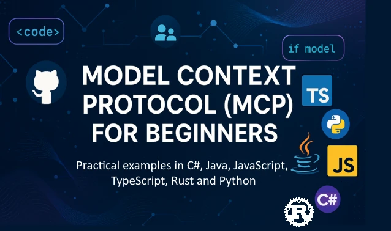

 

[](https://GitHub.com/microsoft/mcp-for-beginners/graphs/contributors)
[](https://GitHub.com/microsoft/mcp-for-beginners/issues)
[](https://GitHub.com/microsoft/mcp-for-beginners/pulls)
[](http://makeapullrequest.com)
[](https://mcptoplist.com/server/mcp.so%2Fmcp-for-beginners%2Fmicrosoft)

[](https://GitHub.com/microsoft/mcp-for-beginners/watchers)
[](https://GitHub.com/microsoft/mcp-for-beginners/fork)
[](https://GitHub.com/microsoft/mcp-for-beginners/stargazers)


[](https://discord.gg/nTYy5BXMWG)

Sekite šiuos veiksmus, kad pradėtumėte naudotis šiomis priemonėmis:
1. **Padarykite šaką (fork) saugykloje**: Spauskite [](https://GitHub.com/microsoft/mcp-for-beginners/fork)
2. **Klonuokite saugyklą**:   `git clone https://github.com/microsoft/mcp-for-beginners.git`
3. **Prisijunkite prie** [](https://discord.gg/nTYy5BXMWG)


### 🌐 Daugiakalbė parama

#### Palaikoma per GitHub Action (Automatizuota ir visada atnaujinta)

<!-- CO-OP TRANSLATOR LANGUAGES TABLE START -->
[Arabų](../ar/README.md) | [Bengalų](../bn/README.md) | [Bulgarų](../bg/README.md) | [Birmos (Mianmaro)](../my/README.md) | [Kinų (supaprastinta)](../zh-CN/README.md) | [Kinų (tradicinė, Honkongas)](../zh-HK/README.md) | [Kinų (tradicinė, Makao)](../zh-MO/README.md) | [Kinų (tradicinė, Taivanas)](../zh-TW/README.md) | [Kroatų](../hr/README.md) | [Čekų](../cs/README.md) | [Danų](../da/README.md) | [Olandų](../nl/README.md) | [Estų](../et/README.md) | [Suomių](../fi/README.md) | [Prancūzų](../fr/README.md) | [Vokiečių](../de/README.md) | [Graikų](../el/README.md) | [Hebrajų](../he/README.md) | [Hindi](../hi/README.md) | [Vengrų](../hu/README.md) | [Indoneziečių](../id/README.md) | [Italų](../it/README.md) | [Japonų](../ja/README.md) | [Kannadų](../kn/README.md) | [Chmerų](../km/README.md) | [Korėjiečių](../ko/README.md) | [Lietuvių](./README.md) | [Malajų](../ms/README.md) | [Malajalų](../ml/README.md) | [Maratų](../mr/README.md) | [Nepaliečių](../ne/README.md) | [Nigerijos pidžinas](../pcm/README.md) | [Norvegų](../no/README.md) | [Persų (Farsi)](../fa/README.md) | [Lenkų](../pl/README.md) | [Brazilijos portugalų](../pt-BR/README.md) | [Portugalų (Portugalijos)](../pt-PT/README.md) | [Pandžabų (Gurmukhi)](../pa/README.md) | [Rumunų](../ro/README.md) | [Rusų](../ru/README.md) | [Serbų (kirilica)](../sr/README.md) | [Slovakų](../sk/README.md) | [Slovėnų](../sl/README.md) | [Ispanų](../es/README.md) | [Suahelio](../sw/README.md) | [Švedų](../sv/README.md) | [Tagalo (Filipinų)](../tl/README.md) | [Tamilų](../ta/README.md) | [Telugų](../te/README.md) | [Tailando](../th/README.md) | [Turkų](../tr/README.md) | [Ukrainiečių](../uk/README.md) | [Urdu](../ur/README.md) | [Vietnamiečių](../vi/README.md)

> **Pageidaujate klonuoti vietoje?**
>
> Ši saugykla apima daugiau nei 50 vertimų į kalbas, todėl reikšmingai didina atsisiuntimo dydį. Norėdami klonuoti be vertimų, naudokite sparse checkout:
>
> **Bash / macOS / Linux:**
> ```bash
> git clone --filter=blob:none --sparse https://github.com/microsoft/mcp-for-beginners.git
> cd mcp-for-beginners
> git sparse-checkout set --no-cone '/*' '!translations' '!translated_images'
> ```
>
> **CMD (Windows):**
> ```cmd
> git clone --filter=blob:none --sparse https://github.com/microsoft/mcp-for-beginners.git
> cd mcp-for-beginners
> git sparse-checkout set --no-cone "/*" "!translations" "!translated_images"
> ```
>
> Tai suteikia viską, ko reikia kursui baigti, su daug greitesniu atsisiuntimu.
<!-- CO-OP TRANSLATOR LANGUAGES TABLE END -->

# 🚀 Modelio Konteksto Protokolo (MCP) mokymo programa pradedantiesiems

## **Išmokite MCP su praktiniais kodo pavyzdžiais C#, Java, JavaScript, Rust, Python ir TypeScript kalbomis**

## 🧠 Modelio Konteksto Protokolo mokymo programos apžvalga
Sveiki atvykę į savo kelionę po Modelio Konteksto Protokolą! Jei kada nors domėjotės, kaip DI programos bendrauja su įvairiais įrankiais ir paslaugomis, tuoj sužinosite elegantišką sprendimą, kuris keičia tai, kaip kūrėjai kuria išmaniąsias sistemas.

Įsivaizduokite MCP kaip universalią vertėją DI programoms – taip, kaip USB prievadai leidžia prijungti bet kokį įrenginį prie kompiuterio, MCP leidžia DI modeliams standartizuotai jungtis prie bet kurio įrankio ar paslaugos. Nesvarbu, ar kuriate pirmąjį pokalbinius robotą, ar dirbate su sudėtingais DI procesais, supratimas apie MCP suteiks jums galią kurti galingesnes ir lankstesnes programas.

Ši mokymo programa sukurta kantriai ir rūpestingai jūsų mokymosi kelionei. Pradėsime nuo paprastų sąvokų, kurias jau suprantate, ir palaipsniui kilsime į sudėtingesnius dalykus praktikuodamiesi savo mėgstama programavimo kalba. Kiekvienas žingsnis apima aiškius paaiškinimus, praktiškus pavyzdžius ir daug paskatinimų.

Baigę šią kelionę jausitės užtikrinti kurdami savo MCP serverius, integruodami juos su populiariomis DI platformomis ir suprasdami, kaip ši technologija keičia DI kūrimo ateitį. Pradėkime šią įdomią kelionę kartu!

### Oficialioji dokumentacija ir specifikacijos

Ši mokymo programa atitinka **MCP specifikaciją 2025-11-25** (naujausias stabilus leidimas). MCP specifikacija naudoja datų pagrindu versijavimą (formatu YYYY-MM-DD), kad užtikrintų aiškų protokolo versijos sekimą.

> **Žvilgsnis į priekį:** kitas specifikacijos versijos kandidatų leidimas, **2026-07-28**, numatytas išleisti 2026 m. liepos 28 d. Jis leidžia protokolą be valstybės transporto sluoksnyje, įformalina praplėtimų sistemą (MCP programos, užduotys), sustiprina autorizaciją ir pašalina Root, Sampling bei Logging. Pilną apžvalgą rasite čia: [Kas keičiasi MCP: 2026-07-28 leidimo kandidatas](./01-CoreConcepts/mcp-2026-07-28-release-candidate.md).

Šie ištekliai tampa vertingesni su jūsų supratimu, bet nesijauskite spaudžiami skaityti viską iš karto. Pradėkite nuo sričių, kurios domina labiausiai!
- 📘 [MCP dokumentacija](https://modelcontextprotocol.io/) – Tai jūsų pagrindinis išteklius žingsnis po žingsnio vadovams ir naudotojų gretoms. Dokumentacija parašyta pradedantiesiems, suteikiant aiškius pavyzdžius, kuriuos galite sekti savo tempu.
- 📜 [MCP specifikacija](https://modelcontextprotocol.io/specification/2025-11-25) – Laikykite tai savo išsamiu nuorodų vadovu. Dirbdami su programa, čia sugrįšite ieškoti specifinių detalių ir pažangių funkcijų.
- 📜 [MCP specifikacijų versijavimas](https://modelcontextprotocol.io/specification/versioning) – Čia pateikta informacija apie protokolo versijų istoriją ir kaip MCP naudoja datų pagrindu versijavimą (formato YYYY-MM-DD).
- 🧑‍💻 [MCP GitHub saugykla](https://github.com/modelcontextprotocol) – Čia rasite SDK, įrankius ir kodo pavyzdžius keliose programavimo kalbose. Tai lyg lobynas praktiškų pavyzdžių ir paruoštų komponentų.
- 🌐 [MCP bendruomenė](https://github.com/orgs/modelcontextprotocol/discussions) – Prisijunkite prie kitų mokinių ir patyrusių kūrėjų diskusijose apie MCP. Tai draugiška bendruomenė, kur laukiami klausimai ir žinių dalijimasis.
  
## Mokymosi tikslai

Baigę šią mokymo programą jausitės pasitikintys ir susižavėję naujomis žiniomis. Štai ką pasieksite:

• **Suprasti MCP pagrindus**: Suprasite, kas yra Modelio Konteksto Protokolas ir kodėl jis revoliucionizuoja DI programų bendradarbiavimą, naudodami analogijas ir prasmingus pavyzdžius.

• **Sukurti savo pirmą MCP serverį**: Sukursite veikiančią MCP serverį savo pasirinkta programavimo kalba pradedant nuo paprastų pavyzdžių ir žingsnis po žingsnio tobulindami įgūdžius.

• **Sujungti DI modelius su realiais įrankiais**: Išmoksite tiltu sujungti DI modelius ir tikras paslaugas, suteikdami savo programoms galingas naujas galimybes.

• **Įdiegti saugumo gerąsias praktikas**: Suprasite, kaip saugoti MCP įgyvendinimus, saugant tiek programas, tiek vartotojus.

• **Diegti užtikrintai**: Sužinosite, kaip savo MCP projektus perkelti iš vystymo į gamybą, su praktiškomis diegimo strategijomis, kurios veikia realiame pasaulyje.

• **Prisijungti prie MCP bendruomenės**: Tapsite besiplečiančios kūrėjų bendruomenės dalimi, kuri formuoja DI programų kūrimo ateitį.

## Esminės žinios

Prieš pasineriant į MCP specifiką, įsitikinkime, kad jau jaučiatės patogiai su kai kuriomis pagrindinėmis sąvokomis. Nesijaudinkite, jei nesate šių sričių ekspertas – viską paaiškinsime, kai eisime!

### Protokolų supratimas (Pagrindas)

Įsivaizduokite protokolą kaip taisykles pokalbiui. Kai skambinate draugui, abu žinote sakyti „labas“ atsakant, kalbėtis paeiliui ir sakyti „viso gero“ baigus. Kompiuterinės programos taip pat reikia panašių taisyklių, kad efektyviai bendrautų.

MCP yra protokolas – sutartų taisyklių rinkinys, padedantis DI modeliams ir programoms turėti produktyvius „pokalbius“ su įrankiais ir paslaugomis. Kaip taisyklingas pokalbio elgesys palengvina žmonių bendravimą, taip MCP daro DI programų komunikaciją daug patikimesnę ir galingesnę.

### Kliento-serverio santykiai (Kaip programos veikia kartu)

Jūs kasdien naudojate kliento-serverio santykius! Kai naudojate žiniatinklio naršyklę (klientą) apsilankyti svetainėje, prisijungiate prie žiniatinklio serverio, kuris siunčia puslapio turinį. Naršyklė žino, kaip prašyti informacijos, o serveris žino, kaip atsakyti.

MCP mes turime panašų santykį: DI modeliai veikia kaip klientai, prašantys informacijos ar veiksmų, o MCP serveriai suteikia šias galimybes. Tai kaip turėti pagalbininką (serverį), kurį DI gali paprašyti atlikti tam tikras užduotis.

### Kodėl standartizacija svarbi (Kaip viskas veikia kartu)

Įsivaizduokite, jei kiekvienas automobilių gamintojas naudotų skirtingos formos degalų pildymo antgalius – jums reikėtų skirtingo adapterio kiekvienam automobiliui! Standartizacija reiškia bendrų požiūrių susitarimą, kad viskas veiktų sklandžiai kartu.

MCP suteikia šią standartizaciją DI programoms. Užuot kiekvienam DI modeliui reikėjus specialaus kodo kiekvienam įrankiui, MCP sukuria universalią jų komunikacijos sistemą. Tai leidžia kūrėjams kurti įrankius vieną kartą ir naudoti juos daugelyje skirtingų DI sistemų.

## 🧭 Jūsų mokymosi kelio apžvalga

Jūsų MCP kelionė yra kruopščiai sudėliota, kad palaipsniui stiprintų jūsų pasitikėjimą ir įgūdžius. Kiekvienas etapas pristato naujas sąvokas ir kartu stiprina jau išmoktas.

### 🌱 Pagrindinis etapas: Pagrindų supratimas (Moduliai 0-2)

Čia prasideda jūsų nuotykis! Pateiksime MCP sąvokas naudodami pažįstamus palyginimus ir paprastus pavyzdžius. Suprasite, kas yra MCP, kodėl jis egzistuoja ir kaip jis dera į platesnį DI kūrimo pasaulį.


• **Modulis 0 - Įvadas į MCP**: Pradėsime nuo to, kas yra MCP ir kodėl jis toks svarbus šiuolaikinėms DI programoms. Pamatysite realaus pasaulio MCP veikimo pavyzdžių ir suprasite, kaip jis išsprendžia dažnas kūrėjų problemas.

• **Modulis 1 - Pagrindinių sąvokų paaiškinimas**: Čia sužinosite svarbiausias MCP sudedamąsias dalis. Naudosime daug analogijų ir vizualių pavyzdžių, kad šios sąvokos būtų natūralios ir suprantamos.

• **Modulis 2 - Saugumas MCP**: Saugumas gali skambėti gąsdinančiai, bet mes parodysime, kaip MCP apima įmontuotas saugumo funkcijas ir išmokysime geriausias praktikas, kurios apsaugos jūsų programas nuo pat pradžių.

### 🔨 Kūrimo etapas: Kuriame pirmąsias implementacijas (Modulis 3)

Dabar prasideda tikras smagumas! Gausite praktinės patirties statydami tikrus MCP serverius ir klientus. Nesijaudinkite – pradėsime paprastai ir vesime jus per kiekvieną žingsnį.

Šiame modulyje yra keli praktiniai vadovai, leidžiantys jums dirbti pageidaujama programavimo kalba. Sukursite savo pirmąjį serverį, sukursite klientą prisijungimui prie jo ir net integruosite populiarias kūrimo priemones, tokias kaip VS Code.

Kiekvienas vadovas turi pilnius kodo pavyzdžius, trikčių šalinimo patarimus ir paaiškinimus, kodėl renkamės tam tikrą dizainą. Baigus šį etapą turėsite veikiančias MCP implementacijas, kuriomis būsite didžiuotis!

### 🚀 Augimo etapas: Pažangios sąvokos ir realaus pasaulio taikymas (Moduliai 4-5)

Įvaldę pagrindus, esate pasirengę nagrinėti sudėtingesnes MCP funkcijas. Apžvelgsime praktines įgyvendinimo strategijas, derinimo metodus ir pažangias temas, tokias kaip daugiapolinis DI integracija.

Taip pat sužinosite, kaip skalauti savo MCP implementacijas gamybos naudojimui ir integruoti jas su debesų platformomis, tokiomis kaip Azure. Šie moduliai paruoš jus kurti MCP sprendimus, atitinkančius realaus pasaulio reikalavimus.

### 🌟 Meistriškumo etapas: Bendruomenė ir specializacija (Moduliai 6-11)

Paskutinis etapas skirtas prisijungti prie MCP bendruomenės ir specializuotis jums įdomiausiose srityse. Išmoksite, kaip prisidėti prie atviro kodo MCP projektų, įgyvendinti pažangius autentifikacijos modelius ir kurti išsamias su duomenų bazėmis integruotas sistemas.

Modulis 11 yra verta ypatingo paminėjimo – tai pilnas 13 laboratorinių darbų praktinis mokymosi kelias, mokantis kurti gamybai paruoštus MCP serverius su PostgreSQL integracija. Tai kaip baigiamasis projektas, apjungiantis viską, ką išmokote!

### 📚 Visas mokymo programos struktūra

| Modulis | Tema | Aprašymas | Nuoroda |
|--------|-------|-------------|------|
| **Moduliai 0-3: Pagrindai** | | | |
| 00 | Įvadas į MCP | Modelio konteksto protokolo apžvalga ir jo svarba DI vamzdynuose | [Skaityti daugiau](./00-Introduction/README.md) |
| 01 | Pagrindinių sąvokų paaiškinimas | Išsamus pagrindinių MCP sąvokų nagrinėjimas | [Skaityti daugiau](./01-CoreConcepts/README.md) |
| 1.1 | Kas keičiasi MCP (2026-07-28 RC) | Begalvis protokolas, plėtinių sistema ir būsimos specifikacijos pakeitimai | [Vadovas](./01-CoreConcepts/mcp-2026-07-28-release-candidate.md) |
| 02 | Saugumas MCP | Saugumo grėsmės ir geriausios praktikos | [Skaityti daugiau](./02-Security/README.md) |
| 03 | Pradžia su MCP | Aplinka, paprasti serveriai/klientai, integracija | [Skaityti daugiau](./03-GettingStarted/README.md) |
| **Modulis 3: Kuriame savo pirmąjį serverį ir klientą** | | | |
| 3.1 | Pirmasis serveris | Sukurkite savo pirmą MCP serverį | [Vadovas](./03-GettingStarted/01-first-server/README.md) |
| 3.2 | Pirmasis klientas | Sukurkite paprastą MCP klientą | [Vadovas](./03-GettingStarted/02-client/README.md) |
| 3.3 | Klientas su LLM | Integruokite didelius kalbos modelius | [Vadovas](./03-GettingStarted/03-llm-client/README.md) |
| 3.4 | VS Code integracija | Naudokite MCP serverius VS Code | [Vadovas](./03-GettingStarted/04-vscode/README.md) |
| 3.5 | stdio serveris | Kurkite serverius naudodami stdio transportą | [Vadovas](./03-GettingStarted/05-stdio-server/README.md) |
| 3.6 | HTTP transliacija | Įgyvendinkite HTTP transliaciją MCP | [Vadovas](./03-GettingStarted/06-http-streaming/README.md) |
| 3.7 | Microsoft Foundry rinkinys | Naudokite Microsoft Foundry rinkinį su MCP | [Vadovas](./03-GettingStarted/07-aitk/README.md) |
| 3.8 | Testavimas | Testuokite savo MCP serverio įgyvendinimą | [Vadovas](./03-GettingStarted/08-testing/README.md) |
| 3.9 | Diegimas | Diegimas MCP serverių gamyboje | [Vadovas](./03-GettingStarted/09-deployment/README.md) |
| 3.10 | Pažangus serverio naudojimas | Naudokite pažangius serverius pažangioms funkcijoms ir geresnei architektūrai | [Vadovas](./03-GettingStarted/10-advanced/README.md) |
| 3.11 | Paprasta autentifikacija | Skyrius, kuris pristato autentifikaciją nuo pradžių ir RBAC | [Vadovas](./03-GettingStarted/11-simple-auth/README.md) |
| 3.12 | MCP šeimininkai | Konfigūruokite Claude Desktop, Cursor, Cline ir kitus MCP šeimininkus | [Vadovas](./03-GettingStarted/12-mcp-hosts/README.md) |
| 3.13 | MCP inspektorius | Derinkite ir testuokite MCP serverius naudodami Inspector įrankį | [Vadovas](./03-GettingStarted/13-mcp-inspector/README.md) |
| 3.14 | Imties ėmimas | Naudokite imties ėmimą bendradarbiauti su klientu | [Vadovas](./03-GettingStarted/14-sampling/README.md) |
| 3.15 | MCP programėlės | Kurkite MCP programėles | [Vadovas](./03-GettingStarted/15-mcp-apps/README.md) |
| **Moduliai 4-5: Praktika ir pažangios temos** | | | |
| 04 | Praktinė implementacija | SDK, derinimas, testavimas, pakartotinai naudojamos užklausų šablonai | [Skaityti daugiau](./04-PracticalImplementation/README.md) |
| 4.1 | Paginacija | Tvarkykite didelius rezultatų rinkinius naudojant kursoriaus pagrindu veikiančią paginaciją | [Vadovas](./04-PracticalImplementation/pagination/README.md) |
| 05 | Pažangios MCP temos | Daugiapolinis DI, skalavimas, verslo naudojimas | [Skaityti daugiau](./05-AdvancedTopics/README.md) |
| 5.1 | Azure integracija | MCP integracija su Azure | [Vadovas](./05-AdvancedTopics/mcp-integration/README.md) |
| 5.2 | Daugiapolumas | Darbas su keliais modalitetais | [Vadovas](./05-AdvancedTopics/mcp-multi-modality/README.md) |
| 5.3 | OAuth2 demonstracija | Įgyvendinkite OAuth2 autentifikaciją | [Vadovas](./05-AdvancedTopics/mcp-oauth2-demo/README.md) |
| 5.4 | Šaknies kontekstai | Supraskite ir įgyvendinkite šaknies kontekstus | [Vadovas](./05-AdvancedTopics/mcp-root-contexts/README.md) |
| 5.5 | Maršrutizavimas | MCP maršrutizavimo strategijos | [Vadovas](./05-AdvancedTopics/mcp-routing/README.md) |
| 5.6 | Imties ėmimas | Imties ėmimo technikos MCP | [Vadovas](./05-AdvancedTopics/mcp-sampling/README.md) |
| 5.7 | Skalavimas | MCP implementacijų skalavimas | [Vadovas](./05-AdvancedTopics/mcp-scaling/README.md) |
| 5.8 | Saugumas | Pažangūs saugumo aspektai | [Vadovas](./05-AdvancedTopics/mcp-security/README.md) |
| 5.9 | Internetinė paieška | Įgyvendinkite internetinės paieškos galimybes | [Vadovas](./05-AdvancedTopics/web-search-mcp/README.md) |
| 5.10 | Realiojo laiko transliacija | Kurkite realiojo laiko transliacijos funkcionalumą | [Vadovas](./05-AdvancedTopics/mcp-realtimestreaming/README.md) |
| 5.11 | Realiojo laiko paieška | Įgyvendinkite realiojo laiko paiešką | [Vadovas](./05-AdvancedTopics/mcp-realtimesearch/README.md) |
| 5.12 | Entra ID autentifikacija | Autentifikacija su Microsoft Entra ID | [Vadovas](./05-AdvancedTopics/mcp-security-entra/README.md) |
| 5.13 | Foundry integracija | Integruokite su Microsoft Foundry | [Vadovas](./05-AdvancedTopics/mcp-foundry-agent-integration/README.md) |
| 5.14 | Kontekstų inžinerija | Efektyvios kontekstų inžinerijos technikos | [Vadovas](./05-AdvancedTopics/mcp-contextengineering/README.md) |
| 5.15 | MCP užsakytas transportas | Užsakytos transporto įgyvendinimo pažanga | [Vadovas](./05-AdvancedTopics/mcp-transport/README.md) |
| 5.16 | Protokolo funkcijos | Progreso pranešimai, atšaukimas, išteklių šablonai | [Vadovas](./05-AdvancedTopics/mcp-protocol-features/README.md) |
| 5.17 | Adversarinių daugiagalių agentų argumentavimas | Du agentai ginčijasi priešingomis pusėmis naudodami bendrus MCP įrankius, vertina teisėjo agentas | [Vadovas](./05-AdvancedTopics/mcp-adversarial-agents/README.md) |
| **Moduliai 6-10: Bendruomenė ir geriausios praktikos** | | | |
| 06 | Bendruomenės indėlis | Kaip prisidėti prie MCP ekosistemos | [Vadovas](./06-CommunityContributions/README.md) |
| 07 | Pamokos iš ankstyvo priėmimo | Realūs įgyvendinimo pasakojimai | [Vadovas](./07-LessonsfromEarlyAdoption/README.md) |
| 08 | Geriausios MCP praktikos | Veikimas, gedimų tolerancija, atsparumas | [Vadovas](./08-BestPractices/README.md) |
| 09 | MCP atvejų studijos | Praktiniai įgyvendinimo pavyzdžiai | [Vadovas](./09-CaseStudy/README.md) |
| 10 | Praktinis seminaras | MCP serverio kūrimas su Microsoft Foundry rinkiniu | [Laboratorija](./10-StreamliningAIWorkflowsBuildingAnMCPServerWithAIToolkit/README.md) |
| **Modulis 11: MCP serverio praktinės laboratorijos** | | | |
| 11 | MCP serverio duomenų bazės integracija | Visas 13 laboratorinių darbų praktinis mokymosi kelias su PostgreSQL integracija | [Laboratorijos](./11-MCPServerHandsOnLabs/README.md) |
| 11.1 | Įvadas | MCP apžvalga su duomenų bazės integracija ir mažmeninės prekybos analizės atveju | [Laboratorija 00](./11-MCPServerHandsOnLabs/00-Introduction/README.md) |
| 11.2 | Pagrindinė architektūra | MCP serverio architektūros, duomenų bazės sluoksnių ir saugumo modelių supratimas | [Laboratorija 01](./11-MCPServerHandsOnLabs/01-Architecture/README.md) |
| 11.3 | Saugumas ir daugiaviečiškumas | Eilučių lygmens saugumas, autentifikacija ir daugiaviečių duomenų prieiga | [Laboratorija 02](./11-MCPServerHandsOnLabs/02-Security/README.md) |
| 11.4 | Aplinkos paruošimas | Kūrimo aplinkos, Docker, Azure išteklių paruošimas | [Laboratorija 03](./11-MCPServerHandsOnLabs/03-Setup/README.md) |
| 11.5 | Duomenų bazės projektavimas | PostgreSQL paruošimas, mažmeninės schemos projektavimas ir pavyzdiniai duomenys | [Laboratorija 04](./11-MCPServerHandsOnLabs/04-Database/README.md) |
| 11.6 | MCP serverio įgyvendinimas | Greito MCP serverio kūrimas su duomenų bazės integracija | [Laboratorija 05](./11-MCPServerHandsOnLabs/05-MCP-Server/README.md) |
| 11.7 | Įrankių kūrimas | Duomenų bazės užklausų įrankių kūrimas ir schemos introspekcija | [Laboratorija 06](./11-MCPServerHandsOnLabs/06-Tools/README.md) |
| 11.8 | Semantinė paieška | Vektorinių įterpimų įgyvendinimas su Azure OpenAI ir pgvector | [Laboratorija 07](./11-MCPServerHandsOnLabs/07-Semantic-Search/README.md) |
| 11.9 | Testavimas ir derinimas | Testavimo strategijos, derinimo įrankiai ir patvirtinimo metodai | [Laboratorija 08](./11-MCPServerHandsOnLabs/08-Testing/README.md) |
| 11.10 | VS Code integracija | VS Code MCP integracijos ir DI pokalbių naudojimo konfigūravimas | [Laboratorija 09](./11-MCPServerHandsOnLabs/09-VS-Code/README.md) |
| 11.11 | Diegimo strategijos | Docker diegimas, Azure konteinerių programėlės ir skalavimo apsvarstymai | [Laboratorija 10](./11-MCPServerHandsOnLabs/10-Deployment/README.md) |
| 11.12 | Stebėjimas | Application Insights, žurnalavimas, veiklos stebėjimas | [Laboratorija 11](./11-MCPServerHandsOnLabs/11-Monitoring/README.md) |
| 11.13 | Geriausios praktikos | Veiklos optimizavimas, saugumo stiprinimas ir gamybos patarimai | [Laboratorija 12](./11-MCPServerHandsOnLabs/12-Best-Practices/README.md) |
| **Modulis 12: MCP įrankiai** | | | |
| 12.1 | Įrankiai | MCP naudojimas Copilot programėlėje | [ Vadovas ](./12-tooling/README.md) |

### 💻 Pavyzdiniai kodo projektai

Viena įdomiausių MCP mokymosi dalių yra matyti, kaip jūsų kodavimo įgūdžiai palaipsniui tobulėja. Mes paruošėme savo kodo pavyzdžius taip, kad jie pradėtų labai paprastai ir taptų sudėtingesni, kaip geriau suprantate temą. Štai kaip pristatome sąvokas – su kodu, kuris lengvai suprantamas, bet parodo realius MCP principus, jūs suprasite ne tik ką šis kodas daro, bet ir kodėl jis toks struktūruotas bei kaip jis dera su didesnėmis MCP programomis.

#### Pagrindiniai MCP skaičiuotuvo pavyzdžiai

| Kalba | Aprašymas | Nuoroda |
|----------|-------------|------|

| C# | MCP serverio pavyzdys | [Peržiūrėti kodą](./03-GettingStarted/samples/csharp/README.md) |
| Java | MCP skaičiuoklė | [Peržiūrėti kodą](./03-GettingStarted/samples/java/calculator/README.md) |
| JavaScript | MCP demonstracija | [Peržiūrėti kodą](./03-GettingStarted/samples/javascript/README.md) |
| Python | MCP serveris | [Peržiūrėti kodą](../../03-GettingStarted/samples/python/mcp_calculator_server.py) |
| TypeScript | MCP pavyzdys | [Peržiūrėti kodą](./03-GettingStarted/samples/typescript/README.md) |
| Rust | MCP pavyzdys | [Peržiūrėti kodą](./03-GettingStarted/samples/rust/README.md) |

#### Pažangūs MCP įgyvendinimai

| Kalba | Aprašymas | Nuoroda |
|----------|-------------|------|
| C# | Pažangus pavyzdys | [Peržiūrėti kodą](./04-PracticalImplementation/samples/csharp/README.md) |
| Java su Spring | Konteinerinės programos pavyzdys | [Peržiūrėti kodą](./04-PracticalImplementation/samples/java/containerapp/README.md) |
| JavaScript | Pažangus pavyzdys | [Peržiūrėti kodą](./04-PracticalImplementation/samples/javascript/README.md) |
| Python | Sudėtingas įgyvendinimas | [Peržiūrėti kodą](./04-PracticalImplementation/samples/python/README.md) |
| TypeScript | Konteinerio pavyzdys | [Peržiūrėti kodą](./04-PracticalImplementation/samples/typescript/README.md) |


## 🎯 MCP mokymosi išankstiniai reikalavimai

Norint kuo geriau išnaudoti šį programą, reikėtų turėti:

- Pagrindines programavimo žinias bent vienoje iš šių kalbų: C#, Java, JavaScript, Python arba TypeScript
- Supratimą apie kliento-serverio modelį ir API
- Pažintį su REST ir HTTP koncepcijomis
- (Pasirenkama) žinių apie AI/ML sąvokas

- Dalyvavimą mūsų bendruomenės diskusijose dėl palaikymo

## 📚 Mokymosi vadovas ir ištekliai

Šiame saugykloje yra keli ištekliai, kurie padės jums efektyviai mokytis ir orientuotis:

### Mokymosi vadovas

Išsamus [Mokymosi vadovas](./study_guide.md) padės jums efektyviai naršyti po šią saugyklą. Ši vizualinė programos schema rodo, kaip susiję visi temos ir teikia nurodymus, kaip efektyviai naudoti pavyzdinius projektus. Tai ypač naudinga vizualiniams besimokantiesiems, kurie nori matyti visą vaizdą.

Vadovas apima:
- Vizualinę programos schemą, kuri rodo visas nagrinėjamas temas
- Išsamią kiekvienos saugyklos skilties analizę
- Nurodymus, kaip naudoti pavyzdinius projektus
- Rekomenduojamus mokymosi kelius skirtingiems įgūdžių lygiams
- Papildomus išteklius, kurie papildo jūsų mokymosi kelionę

### Pakeitimų žurnalas

Mes tvarkome išsamų [Pakeitimų žurnalą](./changelog.md), kuriame fiksuojami visi svarbūs programos medžiagos atnaujinimai, tad galite būti tikri, kad turite naujausią informaciją.
- Naujos turinio dalys
- Struktūriniai pakeitimai
- Funkcijų patobulinimai
- Dokumentacijos atnaujinimai

## 🛠️ Kaip efektyviai naudoti šią programą

Kiekviena pamoka šiame vadove apima:

1. Aiškias MCP sąvokų paaiškinimus  
2. Kodo pavyzdžius keliomis kalbomis  
3. Užduotis tikrų MCP programų kūrimui  
4. Papildomus išteklius pažengusiems mokiniams

### Mokomės MCP su C# - pamokų serija
Pažinkime Model Context Protocol (MCP), pažangią sistemą, skirtą standartizuoti AI modelių ir kliento programų sąveikas. Per šį pradedančiųjų kursą supažindinsime jus su MCP ir padėsime sukurti pirmą MCP serverį.
#### C#: [https://aka.ms/letslearnmcp-csharp](https://aka.ms/letslearnmcp-csharp)
#### Java: [https://aka.ms/letslearnmcp-java](https://aka.ms/letslearnmcp-java)
#### JavaScript: [https://aka.ms/letslearnmcp-javascript](https://aka.ms/letslearnmcp-javascript)
#### Python: [https://aka.ms/letslearnmcp-python](https://aka.ms/letslearnmcp-python)

## 🎓 Jūsų MCP kelionė prasideda

Sveikiname! Jūs ką tik žengėte pirmą žingsnį į įdomią kelionę, kuri išplės jūsų programavimo galimybes ir suves jus su pažangiausiomis AI kūrimo technologijomis.

### Ką jau pasiekėte

Perskaitę šį įvadą, jūs jau pradėjote kurti savo MCP žinių pagrindą. Suprantate, kas yra MCP, kodėl tai svarbu ir kaip ši programa padės jūsų mokymosi kelyje. Tai svarbus pasiekimas ir jūsų ekspertizės pradžia šioje svarbioje srityje.

### Nuotykiai laukia

Toliau žengiant į modulius, atminkite, kad kiekvienas ekspertas buvo pradedantysis. Koncepcijos, kurios dabar gali atrodyti sudėtingos, su laiku taps natūralios, kai jas praktikavote ir pritaikysite. Kiekvienas mažas žingsnis kuria galingus įgūdžius, kurie jus lydės visos jūsų kūrėjo karjeros metu.

### Jūsų palaikymo tinklas

Jūs prisijungiate prie besimokančiųjų ir ekspertų bendruomenės, kurie aistringai domisi MCP ir noriai padeda kitiems sėkmingai tęsti mokymąsi. Nesvarbu, ar turite problemų sprendžiant kodavimo uždavinius, ar norite pasidalyti pasiekimais – bendruomenė yra čia, kad padėtų jums.

Jei užstringate arba turite klausimų apie AI programų kūrimą, prisijunkite prie kitų besimokančiųjų ir patyrusių kūrėjų diskusijų apie MCP. Tai palaikanti bendruomenė, kurioje klausimai priimami ir žinios laisvai dalijamos.

[](https://discord.gg/nTYy5BXMWG)

Jei turite atsiliepimų apie produktą ar aptikote klaidų kūrimo metu, apsilankykite:

[](https://aka.ms/foundry/forum)

### Pradėti?

Jūsų MCP kelionė prasideda dabar! Pradėkite nuo 0 modulio, kad įgytumėte pirmąją praktinę MCP patirtį, arba peržiūrėkite pavyzdinius projektus ir pamatykite, ką kursite. Prisiminkite - kiekvienas ekspertas pradėjo būtent ten, kur dabar esate jūs, ir su kantrybe bei praktika būsite nustebinti savo pasiekimais.

Sveiki atvykę į Model Context Protocol kūrimo pasaulį. Kartu sukursime ką nors nepaprasto!

## 🤝 Prisidėkite prie mokymosi bendruomenės

Ši programa stiprėja prisidėjus tokiais besimokančiaisiais kaip jūs! Nesvarbu, ar taisote klaidą, siūlote aiškesnį paaiškinimą, ar pridedate naują pavyzdį, jūsų indėlis padeda kitiems pradedantiesiems sėkmingai tęsti.

Dėkojame Microsoft vertingam profesionalui [Shivam Goyal](https://www.linkedin.com/in/shivam2003/) už kodo pavyzdžių prisidėjimą.

Prisidėjimo procesas yra sukurtas būti svetingas ir palaikantis. Dauguma indėlių reikalauja prisidėjimo licencijos sutarties (CLA), tačiau automatizuoti įrankiai jus sklandžiai perves per procesą.

## 📜 Atvirojo kodo mokymasis

Visa ši programa yra prieinama pagal MIT [LICENCIJĄ](../../LICENSE), tai reiškia, kad galite ją naudoti, modifikuoti ir laisvai dalintis. Tai palaiko mūsų misiją padaryti MCP žinias prieinamas kūrėjams visur.
## 🤝 Indėlio gairės


Šis projektas laukia indėlių ir pasiūlymų. Daugeliui indėlių reikia sutikti su
Bendradarbio Licencijos Sutartimi (CLA), kurioje deklaruojate, kad turite teisę ir iš tikrųjų suteikiate mums
teisę naudoti jūsų indėlį. Daugiau informacijos rasite <https://cla.opensource.microsoft.com>.

Kai pateikiate pull request, CLA robotas automatiškai nustatys, ar reikia pateikti
CLA ir tinkamai pažymės PR (pvz., būsenos patikrinimas, komentaras). Tiesiog vykdykite roboto
nurodymus. Tai reikės padaryti tik vieną kartą visuose mūsų CLA naudojamuose repo.

Šis projektas priėmė [Microsoft atvirojo kodo elgesio taisyklių kodeksą](https://opensource.microsoft.com/codeofconduct/).
Daugiau informacijos rasite [Elgesio taisyklių kodekso DUK](https://opensource.microsoft.com/codeofconduct/faq/) arba
susisiekite su [opencode@microsoft.com](mailto:opencode@microsoft.com) dėl papildomų klausimų ar pastabų.

---

*Pasiruošę pradėti MCP kelionę? Pradėkite nuo [00 modulio – Įvadas į MCP](./00-Introduction/README.md) ir ženkite pirmuosius žingsnius Modelio Konteksto Protokolo kūrimo pasaulyje!*


## 🎒 Kiti kursai
Mūsų komanda rengia ir kitus kursus! Peržiūrėkite:

<!-- CO-OP TRANSLATOR OTHER COURSES START -->
### LangChain
[](https://aka.ms/langchain4j-for-beginners)
[](https://aka.ms/langchainjs-for-beginners?WT.mc_id=m365-94501-dwahlin)
[](https://github.com/microsoft/langchain-for-beginners?WT.mc_id=m365-94501-dwahlin)
---

### Azure / Edge / MCP / Agentai
[](https://github.com/microsoft/AZD-for-beginners?WT.mc_id=academic-105485-koreyst)
[](https://github.com/microsoft/edgeai-for-beginners?WT.mc_id=academic-105485-koreyst)
[](https://github.com/microsoft/mcp-for-beginners?WT.mc_id=academic-105485-koreyst)
[](https://github.com/microsoft/ai-agents-for-beginners?WT.mc_id=academic-105485-koreyst)

---
 
### Generatyvinis Dirbtinis Intelektas serija
[](https://github.com/microsoft/generative-ai-for-beginners?WT.mc_id=academic-105485-koreyst)
[-9333EA?style=for-the-badge&labelColor=E5E7EB&color=9333EA)](https://github.com/microsoft/Generative-AI-for-beginners-dotnet?WT.mc_id=academic-105485-koreyst)
[-C084FC?style=for-the-badge&labelColor=E5E7EB&color=C084FC)](https://github.com/microsoft/generative-ai-for-beginners-java?WT.mc_id=academic-105485-koreyst)
[-E879F9?style=for-the-badge&labelColor=E5E7EB&color=E879F9)](https://github.com/microsoft/generative-ai-with-javascript?WT.mc_id=academic-105485-koreyst)

---
 
### Pagrindinis mokymasis
[](https://aka.ms/ml-beginners?WT.mc_id=academic-105485-koreyst)
[](https://aka.ms/datascience-beginners?WT.mc_id=academic-105485-koreyst)
[](https://aka.ms/ai-beginners?WT.mc_id=academic-105485-koreyst)

[](https://github.com/microsoft/Security-101?WT.mc_id=academic-96948-sayoung)
[](https://aka.ms/webdev-beginners?WT.mc_id=academic-105485-koreyst)
[](https://aka.ms/iot-beginners?WT.mc_id=academic-105485-koreyst)
[](https://github.com/microsoft/xr-development-for-beginners?WT.mc_id=academic-105485-koreyst)

---
 
### Copilot serija
[](https://aka.ms/GitHubCopilotAI?WT.mc_id=academic-105485-koreyst)
[](https://github.com/microsoft/mastering-github-copilot-for-dotnet-csharp-developers?WT.mc_id=academic-105485-koreyst)
[](https://github.com/microsoft/CopilotAdventures?WT.mc_id=academic-105485-koreyst)
<!-- CO-OP TRANSLATOR OTHER COURSES END -->

---

<!-- CO-OP TRANSLATOR DISCLAIMER START -->
**Atsakomybės apribojimas**:
Šis dokumentas buvo išverstas naudojant dirbtinio intelekto vertimo paslaugą [Co-op Translator](https://github.com/Azure/co-op-translator). Nors siekiame tikslumo, prašome atkreipti dėmesį, kad automatiniai vertimai gali turėti klaidų ar netikslumų. Originalus dokumentas jo gimtąja kalba laikomas autoritetingu šaltiniu. Svarbiai informacijai rekomenduojama naudoti profesionalų žmogiškąjį vertimą. Mes neatsakome už jokius nesusipratimus ar neteisingą interpretaciją, kilusią naudojantis šiuo vertimu.
<!-- CO-OP TRANSLATOR DISCLAIMER END -->