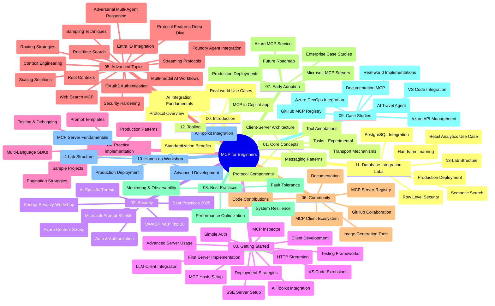

# Modelio konteksto protokolas (MCP) pradedantiesiems – studijų vadovas

Šis studijų vadovas pateikia apžvalgą apie saugyklos struktūrą ir turinį „Modelio konteksto protokolo (MCP) pradedantiesiems“ kursui. Naudokitės šiuo vadovu, kad efektyviai naršytumėte saugykloje ir maksimaliai išnaudotumėte prieinamus išteklius.

## Saugyklos apžvalga

Modelio konteksto protokolas (MCP) yra standartizuota sąveikos tarp DI modelių ir klientų programų sistema. Iš pradžių sukurta Anthropic, MCP dabar prižiūrima platesnės MCP bendruomenės per oficialią GitHub organizaciją. Ši saugykla pateikia išsamų kursą su praktiniais kodo pavyzdžiais C#, Java, JavaScript, Python ir TypeScript kalbomis, skirtą DI kūrėjams, sistemų architektams ir programinės įrangos inžinieriams.

## Vizualus kurso žemėlapis

## Saugyklos struktūra

Saugykla suskirstyta į dvylika pagrindinių sekcijų, kiekviena iš jų skirta skirtingiems MCP aspektams:

1. **Įvadas (00-Introduction/)**
   - Modelio konteksto protokolo apžvalga
   - Kodėl standartizacija svarbi DI procesuose
   - Praktiniai panaudojimo atvejai ir nauda

2. **Pagrindinės sąvokos (01-CoreConcepts/)**
   - Klientų-serverių architektūra
   - Pagrindiniai protokolo komponentai
   - Pranešimų modeliai MCP
   - Dabartinė specifikacija: [Kas pasikeitė MCP: 2026-07-28 specifikacija](./01-CoreConcepts/mcp-2026-07-28.md) — būsenos nepriklausomas protokolo branduolys, plėtinių sistema, ir Roots/Sampling/Logging funkcijų atšaukimas

3. **Saugumas (02-Security/)**
   - Grėsmės MCP pagrįstose sistemose
   - Geriausios saugumo praktikos diegimui
   - Autentifikacijos ir autorizacijos strategijos
   - Praktinis [CIMD ir DCR autorizacijos pavyzdys](./02-Security/samples/cimd-dcr-auth/README.md)
   - **Išsami saugumo dokumentacija**:
     - MCP saugumo geriausios praktikos
     - Azure turinio saugos įgyvendinimo vadovas
     - MCP saugumo kontrolės ir technikos
     - MCP geriausių praktikų greita nuoroda
   - **Pagrindinės saugumo temos**:
     - Promptų įterpimas ir įrankių užnuodijimo atakos
     - Sesijos užgrobtis ir „confused deputy“ problemos
     - Žetonų persiuntimo pažeidžiamumai
     - Pernelyg didelės leidimų teisės ir prieigos valdymas
     - Tiekimo grandinės saugumas DI komponentams
     - Microsoft Prompt Shields integracija

4. **Pradžia (03-GettingStarted/)**
   - Aplinkos paruošimas ir konfigūravimas
   - Pirmųjų MCP serverių ir klientų kūrimas
   - Integracija su esamomis programomis
   - Įtrauktos skiltys:
     - Pirmoji serverio įgyvendinimo versija
     - Klientų kūrimas
     - LLM kliento integracija
     - VS Code integracija
     - Server-Sent Events (SSE) serveris
     - Pažangus serverio naudojimas
     - HTTP srautinis perdavimas
     - DI įrankių komplekto integracija
     - Testavimo strategijos
     - Diegimo gairės

5. **Praktinė įgyvendinimas (04-PracticalImplementation/)**
   - SDK naudojimas skirtingose programavimo kalbose
   - Derinimo, testavimo ir patikros metodikos
   - Pakartotinai naudojamų promptų šablonų ir darbo srautų kūrimas
   - Pavyzdiniai projektai su įgyvendinimo pavyzdžiais

6. **Pažangios temos (05-AdvancedTopics/)**
   - Konteksto inžinerijos technikos
   - Foundry agento integracija
   - Daugi režimo DI darbo srautai
   - OAuth2 autentifikacijos demonstracijos
   - Veiksmingo laiko paieškos galimybės
   - Veiksmingo laiko srautinimas
   - Root kontekstų įgyvendinimas
   - Maršruto atrankos strategijos
   - Imties ėmimo (sampling) metodai
   - Skalavimo metodikos
   - Saugumo aspektai
   - Entra ID saugumo integracija
   - Internetinės paieškos integracija
   - Konkurencinė daugiagentė logika (debatai)

7. **Bendruomenės indėliai (06-CommunityContributions/)**
   - Kaip prisidėti prie kodo ir dokumentacijos
   - Bendradarbiavimas per GitHub
   - Bendruomenės vedamos patobulinimų ir atsiliepimų iniciatyvos
   - Naudojant įvairius MCP klientus (Claude Desktop, Cline, VSCode)
   - Darbas su populiariais MCP serveriais, įskaitant vaizdų generavimą

8. **Pamokos iš ankstyvosios taikymo (07-LessonsfromEarlyAdoption/)**
   - Tikri realizacijos atvejai ir sėkmės istorijos
   - MCP pagrįstų sprendimų kūrimas ir diegimas
   - Tendencijos ir ateities kelrodė žemėlapis
   - **Microsoft MCP serverių vadovas**: Išsamus vadovas 10 gamybai paruoštų Microsoft MCP serverių, įskaitant:
     - Microsoft Learn Docs MCP serveris
     - Azure MCP serveris (15+ specializuotų jungčių)
     - GitHub MCP serveris
     - Azure DevOps MCP serveris
     - MarkItDown MCP serveris
     - SQL Server MCP serveris
     - Playwright MCP serveris
     - Dev Box MCP serveris
     - Microsoft Foundry MCP serveris
     - Microsoft 365 Agents Toolkit MCP serveris

9. **Geriausios praktikos (08-BestPractices/)**
   - Veiklos derinimas ir optimizacija
   - Atsparių gedimams MCP sistemų projektavimas
   - Testavimo ir atsparumo strategijos

10. **Atvejų analizės (09-CaseStudy/)**
    - **Septynios išsamios atvejų analizės**, demonstruojančios MCP universalumą įvairiose situacijose:
    - **Azure AI kelionių agentai**: Daugiagentinė orchestracija su Azure OpenAI ir DI paieška
    - **Azure DevOps integracija**: Darbo eigos procesų automatizavimas su YouTube duomenų atnaujinimais
    - **Veiksmingas laiko dokumentų gavimas**: Python konsolės klientas su HTTP srautinimu
    - **Interaktyvus studijų plano generatorius**: Chainlit žiniatinklio programa su pokalbių DI
    - **Dokumentacija redaktoriuje**: VS Code integracija su GitHub Copilot darbo srautais
    - **Azure API valdymas**: Įmonių API integracija su MCP serverio kūrimu
    - **GitHub MCP registras**: Ekosistemos vystymas ir agentinė integracijos platforma
    - Įgyvendinimo pavyzdžiai apimantys įmonių integraciją, kūrėjų produktyvumą ir ekosistemų plėtrą

11. **Praktinis dirbtuvės kursas (10-StreamliningAIWorkflowsBuildingAnMCPServerWithAIToolkit/)**
    - Išsamus praktinis dirbtuvių kursas derinant MCP su DI įrankių paketu
    - Protingų programų kūrimas, jungiant DI modelius su realaus pasaulio įrankiais
    - Praktiniai moduliai apimantys pagrindus, individualų serverio kūrimą ir gamybos diegimo strategijas
    - **Dirbtuvių struktūra**:
      - Dirbtuvės 1: MCP serverio pagrindai
      - Dirbtuvės 2: Pažangus MCP serverio kūrimas
      - Dirbtuvės 3: DI įrankių komplekto integracija
      - Dirbtuvės 4: Gamybos diegimas ir skalavimas
    - Mokymasis per laboratorinius darbus su žingsnis po žingsnio instrukcijomis

12. **MCP serverių duomenų bazės integracijos laboratorijos (11-MCPServerHandsOnLabs/)**
    - **Išsamus 13 laboratorijų mokymosi kelias** gamybai paruoštų MCP serverių kūrimui su PostgreSQL integracija
    - **Realios mažmeninės prekybos analizės įgyvendinimas** naudojant Zava Retail atvejį
    - **Verslo lygio modeliai**, įskaitant Row Level Security (RLS), semantinę paiešką ir daugiatentinę duomenų prieigą
    - **Pilna laboratorijų struktūra**:
      - **Laboratorijos 00-03: Pagrindai** - Įvadas, architektūra, saugumas, aplinkos paruošimas
      - **Laboratorijos 04-06: MCP serverio kūrimas** - Duomenų bazės dizainas, MCP serverio įgyvendinimas, įrankių kūrimas
      - **Laboratorijos 07-09: Pažangios funkcijos** - Semantinė paieška, testavimas ir derinimas, VS Code integracija
      - **Laboratorijos 10-12: Gamyba ir geriausios praktikos** - Diegimas, stebėsena, optimizavimas
    - **Naudotos technologijos**: FastMCP sistema, PostgreSQL, Azure OpenAI, Azure Container Apps, Application Insights
    - **Mokymosi rezultatai**: Gamybai paruošti MCP serveriai, duomenų bazės integravimo modeliai, DI pagrįsta analizė, įmonių saugumas

13. **Įrankiai (12-tooling/)**
    - Sužinokite, kaip naudoti MCP Copilot programoje ir kituose įrankiuose

## Papildomi ištekliai

Saugykloje yra papildomi ištekliai:

- **Vaizdų aplankas**: Pateikiami diagramos ir iliustracijos, naudojamos viso kurso metu
- **Vertimai**: Daugakalbė palaikymas su automatiniais dokumentacijos vertimais
- **Oficialūs MCP ištekliai**:
  - [MCP dokumentacija](https://modelcontextprotocol.io/)
  - [MCP specifikacija](https://modelcontextprotocol.io/specification/2026-07-28/)
  - [MCP GitHub saugykla](https://github.com/modelcontextprotocol)

## Kaip naudotis šia saugykla

1. **Sekantis mokymasis**: Sekite skyrius tvarka (nuo 00 iki 11) struktūruotam mokymuisi.
2. **Kalbos specifinis fokusas**: Jei domina konkreti programavimo kalba, tyrinėkite pavyzdžių katalogus, skirtus jūsų pageidaujamai kalbai.
3. **Praktinis įgyvendinimas**: Pradėkite nuo „Pradžia“ skyriaus, kad pasiruoštumėte aplinką ir sukurtumėte pirmą MCP serverį ir klientą.
4. **Pažangus tyrinėjimas**: Įvalgius pagrindus, gilinkitės į pažangias temas ir plėskite žinias.
5. **Bendruomenės įsitraukimas**: Įsijunkite į MCP bendruomenę per GitHub diskusijas ir Discord kanalus, kad bendrautumėte su ekspertais ir kolegomis kūrėjais.

## MCP klientai ir įrankiai

Kursas apima įvairius MCP klientus ir įrankius:

1. **Oficialūs klientai**:
   - Visual Studio Code 
   - MCP Visual Studio Code aplinkoje
   - Claude Desktop
   - Claude VSCode aplinkoje
   - Claude API

2. **Bendruomenės klientai**:
   - Cline (terminalinis)
   - Cursor (kodo redaktorius)
   - ChatMCP
   - Windsurf

3. **MCP valdymo įrankiai**:
   - MCP CLI
   - MCP Manager
   - MCP Linker
   - MCP Router

## Populiarūs MCP serveriai

Saugykla pristato įvairius MCP serverius, įskaitant:

1. **Oficialūs Microsoft MCP serveriai**:
   - Microsoft Learn Docs MCP serveris
   - Azure MCP serveris (15+ specializuotų jungčių)
   - GitHub MCP serveris
   - Azure DevOps MCP serveris
   - MarkItDown MCP serveris
   - SQL Server MCP serveris
   - Playwright MCP serveris
   - Dev Box MCP serveris
   - Microsoft Foundry MCP serveris
   - Microsoft 365 Agents Toolkit MCP serveris

2. **Oficialūs atspirties serveriai**:
   - Failų sistema
   - Fetch
   - Atmintis
   - Sekvencinis mąstymas

3. **Vaizdų generavimas**:
   - Azure OpenAI DALL-E 3
   - Stable Diffusion WebUI
   - Replicate

4. **Kūrimo įrankiai**:
   - Git MCP
   - Terminalo valdymas
   - Kodo asistentas

5. **Specializuoti serveriai**:
   - Salesforce
   - Microsoft Teams
   - Jira ir Confluence

## Prisidėjimas

Ši saugykla kviečia bendruomenės indėlį. Žr. Bendruomenės indėlių skyrių, kaip veiksmingai prisidėti prie MCP ekosistemos.

----

*Šis studijų vadovas paskutinį kartą atnaujintas 2026 m. rugsėjo 9 d. Jis atspindi MCP
Specifikaciją `2026-07-28`, dabartinį protokolo atnaujinimą. Kai kurie praktiniai
pavyzdžiai yra aiškiai versijuoti `2025-11-25`, tuo tarpu jų SDK ir įrankiai
naudoja būsenos nepriklausomas protokolo API.*

---

<!-- CO-OP TRANSLATOR DISCLAIMER START -->
**Atsakomybės apribojimas**:
Šis dokumentas buvo išverstas naudojant dirbtinio intelekto vertimo paslaugą [Co-op Translator](https://github.com/Azure/co-op-translator). Nors siekiame tikslumo, prašome atkreipti dėmesį, kad automatiniai vertimai gali turėti klaidų ar netikslumų. Originalus dokumentas jo gimtąja kalba laikomas autoritetingu šaltiniu. Svarbiai informacijai rekomenduojama naudoti profesionalų žmogiškąjį vertimą. Mes neatsakome už jokius nesusipratimus ar neteisingą interpretaciją, kilusią naudojantis šiuo vertimu.
<!-- CO-OP TRANSLATOR DISCLAIMER END -->