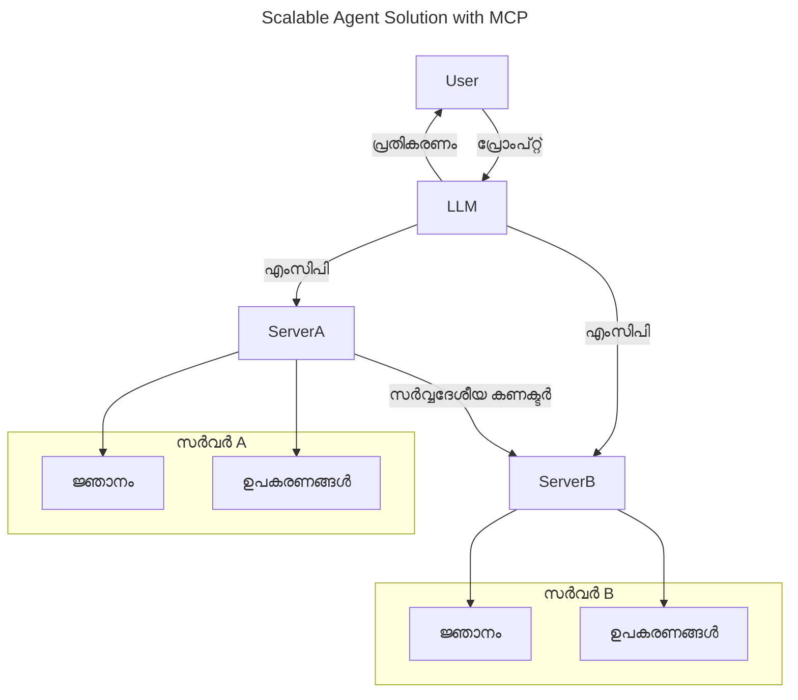
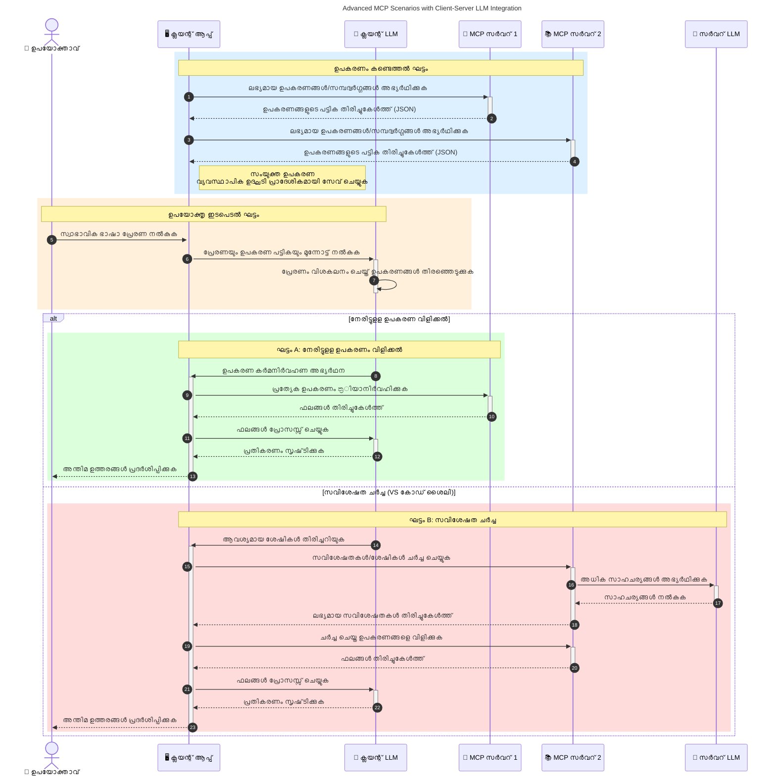

# മോഡൽ കോണ്ടെക്സ്റ്റ് പ്രോട്ടോക്കോൾ (MCP): സ്കെയിലബിൾ എഐ ആപ്ലിക്കേഷനുകൾക്ക് ഇത് എന്തിന് പ്രധാനമാണ്

[](https://youtu.be/agBbdiOPLQA)

_(ഈ പാഠത്തിന്റെ വീഡിയോ കാണാൻ മുകളിൽ കാണുന്ന ചിത്രം ക്ലിക്ക് ചെയ്യുക)_

ജനറേറ്റീവ് എഐ ആപ്ലിക്കേഷനുകൾ വലിയ മുന്നേറ്റമാണ്, കാരണം ഉപയോഗിക്കുന്നവർ സ്വാഭാവിക ഭാഷ പ്രോംപ്റ്റുകൾ വഴി ആപ്പുമായി ഇടപഴകാൻ സാധിക്കുന്നു. എന്നാൽ, ഇത്തരം ആപ്ലിക്കേഷനുകളിൽ കൂടുതൽ സമയം, വിഭവങ്ങൾ നിക്ഷേപിക്കുമ്പോൾ, ഫംഗ്ഷണാലിറ്റികളും വിഭവങ്ങളും എളുപ്പത്തിൽ സംയോജിപ്പിക്കാൻ കഴിയുന്ന വിധം നിർമ്മിക്കണം, ഇത് എളുപ്പത്തിൽ വിപുലീകരിക്കാൻ കഴിയണം, നിങ്ങളുടെ ആപ്പ് പല മോഡലുകളും ഉപയോഗിക്കാൻ കൽപ്പിക്കണം, വിവിധ മോഡൽ സങ്കീർണതകൾ കൈകാര്യം ചെയ്യണം.യുംസംക്ഷേപിച്ച് പറഞ്ഞാൽ, ജനറേറ്റീവ് എഐ ആപ്പുകൾ ആരംഭിക്കാൻ എളുപ്പമാണ്, എന്നാൽ അത് വളരുകയും സങ്കീർണമാകുകയും ചെയ്തപ്പോൾ, ആർക്കിടെക്ചർ നിർവചിക്കാൻ തുടങ്ങണം, ആപ്ലിക്കേഷനുകൾ ഏകീകൃതമായി നിർമ്മിക്കപ്പെടുന്നതിന് ഒരു സ്റ്റാൻഡേർഡ് ആശ്രയിക്കാൻവേണ്ടി വരും. സങ്കേതം ക്രമീകരിക്കുകയും ഒരു മാനദണ്ഡം നൽകുകയും ചെയ്യുന്നതാണ് MCP.

---

## **🔍 മോഡൽ കോണ്ടെക്സ്റ്റ് പ്രോട്ടോക്കോൾ (MCP) എന്താണ്?**

**മോഡൽ കോണ്ടെക്സ്റ്റ് പ്രോട്ടോക്കോൾ (MCP)** എന്നത് വലിയ ഭാഷാ മോഡലുകൾ (LLM-കൾ) പുറംവശത്തെ ഉപകരണങ്ങൾ, ഏപിഐകൾ, ഡാറ്റ സ്രോതസ്സുമായി ലയിച്ചുള്ള സംവാദത്തിന് അനുവദിക്കുന്ന **തുറന്ന, സൂക്ഷ്മമായ നിലവാരം** ആണ്. പരിശീലന ഡാറ്റയെ മറികടന്ന് എഐ മോഡലുകളുടെ പ്രവർത്തന കാര്യക്ഷമത ഉയർത്താൻ സ്ഥിരതയുള്ള ആർക്കിടെക്ചർ നൽകുന്നു, എന്നിവ വെച്ച് മെച്ചപ്പെട്ട, സ്കെയിലബിൾ, റെസ്പോൺസീവ് എഐ സിസ്റ്റങ്ങൾ സാദ്ധ്യമാക്കുന്നു.

---

## **🎯 എഐ-ൽ മാനദണ്ഡീകരണം എന്തിന് പ്രധാനമാണ്**

ജനറേറ്റീവ് എഐ ആപ്ലിക്കേഷനുകൾ കൂടുതൽ സങ്കീർണമാകുമ്പോൾ, **വ്യാപ്തി, വിപുലീകരണം, പരിപാലനം** എന്നിവ ഉറപ്പാക്കുകയും **വിക്രയകന്റെ നിയന്തനം ഒഴിവാക്കുകയും** ചെയ്യുന്ന മാനദണ്ഡങ്ങൾ സ്വീകരിക്കുക അത്യാവശ്യമാണ്. MCP ഈ ആവശ്യങ്ങൾ കൈകാര്യം ചെയ്യുന്നു:

- മോഡൽ-ടൂൾ സംയോജനങ്ങൾ ഏകീകൃതമാക്കുന്നു
- ഉപരിതലമേറിയ ഒരിനക്കം ശീലങ്ങൾ കുറയ്ക്കുന്നു
- വ്യത്യസ്ത വിപണിക്കാർക്കു വേണ്ടി പല മോഡലുകളും ഒരേ പരിസ്ഥിതിയിൽ നിലനിൽക്കാൻ സാധിക്കുന്നു

**നോട്ട്:** MCP ഒരു തുറന്ന മാനദണ്ഡം എന്നാണ് പരസ്യം ചെയ്തിട്ടുള്ളെങ്കിലും, IEEE, IETF, W3C, ISO എന്നിവ പോലെയുള്ള നിലവിലെ മാനദണ്ഡ സംഘടനകളിലൂടെ MCP മാനദണ്ഡമാക്കാനുള്ള പദ്ധതികൾ നിലവിലില്ല.

---

## **📚 പഠന ലക്ഷ്യങ്ങൾ**

ഈ ലേഖനத்தின் അവസാനം, നിങ്ങൾക്ക് താഴെക്കൊടുത്തതുകൾ ചെയ്യാൻ കഴിയും:

- **മോഡൽ കോണ്ടെക്സ്റ്റ് പ്രോട്ടോക്കോൾ (MCP)** എന്താണെന്നും അതിന്റെ ഉപയോ​ഗങ്ങൾ വിശദീകരിക്കുക
- MCP എങ്ങനെ മോഡൽ-ടൂൾ സംവാദം മാനദണ്ഡമാക്കുന്നതാണ് എന്ന് മനസിലാക്കുക
- MCP ആർക്കിടെക്ചർ മുഖ്യ ഘടകങ്ങൾ തിരിച്ചറിയുക
- MCP യുടെ യാഥാർത്ഥ്യ ആപ്ലിക്കേഷനുകൾ എന്റർപ്രൈസിന്റെയും ഡെവലപ്‌മെന്റിന്റെയും രംഗങ്ങളിൽ പരിശോധിക്കുക

---

## **💡 മോഡൽ കോണ്ടെക്സ്റ്റ് പ്രോട്ടോക്കോൾ (MCP) ഗെയിം-ചേഞ്ചർ ആകുന്നത് എങ്ങനെ**

### **🔗 MCP എഐ ഇന്ററാക്ഷനിലെ വിഭജനത്തെ പരിഹരിക്കുന്നു**

MCP വരുന്നതിന് മുമ്പ്, മോഡലുകളെയും ടൂളുകളേയും സംയോജിപ്പിക്കുന്നത് ആവശ്യമായിരുന്നു:

- ഓരോ ടൂൾ-മോഡൽ കൂട്ടായ്മയ്ക്കും വ്യത്യസ്ത കസ്റ്റം കോഡ് ലേഖനം
- ഓരോ വിപണിക്കാരുടെ അനന്യ API- കളും
- അപ്ഡേറ്റുകളിൽ നിന്നുണ്ടാകുന്ന സ്ഥിരമായ ഇടവേളകൾ
- കൂടുതൽ ടൂളുകൾ കൂടുമ്പോൾ അടിസ്ഥാനപരമല്ലാത്ത വ്യാപ്തി

### **✅ MCP മാനദണ്ഡത്തിലെ പ്രയോജനം**

| **നെ​ഗതി**                  | **വിവരണം**                                                                      |
|--------------------------|--------------------------------------------------------------------------------|
| ഇന്റർഓപ്പറബിലിറ്റി           | LLM-കൾ വ്യത്യസ്ത വിപണിക്കാരുടെ ടൂളുകളുമായി സധാരണം പ്രവൃത്തി നടത്തുന്നു           |
| സ്ഥിരത                      | പ്ലാറ്റ്ഫോമുകളും ടൂളുകളും എല്ലാം ഒരേപടി പെരുമാറുന്നു                               |
| പുനരുപയോഗം                | ഒരിക്കൽ നിർമ്മിച്ച ടൂളുകൾ പല പദ്ധതികളിലും സിസ്റ്റങ്ങളിലും ഉപയോഗിക്കാം             |
| വികസന വേഗത വർദ്ധിപ്പിക്കൽ  | മാനദണ്ഡങ്ങൾ പിന്തുടരുന്ന, പ്ലഗ്-അൻഡ്-പ്ലേ ഇന്റർഫേസുകൾ ഉപയോഗിച്ച് ഡെവലപ്‌മെന്റ് സമയം കുറക്കുന്നു |

---

## **🧱 MCP ഉയർന്ന തലത്തിലുള്ള ആർക്കിടെക്ചർ അവലോകനം**

MCP ഒരു **ക്ലയന്റ്-സെർവർ മോഡൽ** പിന്തുടരുന്നു, ഇവിടെ:

- **MCP ഹോസ്റ്റുകൾ** എഐ മോഡലുകൾ ഓടിക്കുന്നു
- **MCP ക്ലയന്റുകൾ** അഭ്യർത്ഥനകൾ ആരംഭിക്കുന്നു
- **MCP സെർവർകൾ** കോണ്ടെക്സ്റ്റ്, ടൂളുകൾ, കഴിവുകൾ സേവനമരുന്നു

### **പ്രധാന ഘടകങ്ങൾ:**

- **വളർത്ത്** – മോഡലുകൾക്കുവേണ്ടി സുഗമവുമാകുന്ന ഡാറ്റ  
- **പ്രോംപ്റ്റുകൾ** – നിർദേശിച്ച പ്രവർത്തനക്രമങ്ങൾ  
- **ടൂളുകൾ** – തിരച്ചിൽ, കണക്കുകൂട്ടൽ പോലുള്ള പ്രവർത്തനങ്ങൾ  
- **സാംപ്ലിംഗ്** – പുനരവധി ഇടപഴകലുകൾ വഴി ഏജൻറിക് പെരുമാറ്റം (MCP `2026-07-28` മുതൽ ഉപേക്ഷിച്ചത്; പുതിയ നടപ്പാക്കലുകൾ നേരിട്ട് LLM പ്രൊവൈഡറിനോടു സംയോജിപ്പിക്കണം)  
    
 
- **എലിസിറ്റേഷൻ** – സെർവർ-ആരംഭിത ഉപയോക്തൃ ഇൻപുട്ട് അഭ്യർത്ഥനകൾ  
- **റൂട്ടുകൾ** – സെർവറുമായി ബന്ധപ്പെട്ട വിവര ഡയറക്‌ടറി സ്ഥിതിചിത്രങ്ങൾ (MCP `2026-07-28` ഉം ഉപേക്ഷിക്കപ്പെട്ടിട്ടുണ്ട്; ടൂൾ പരാമീറ്ററുകൾ, വിഭവ URIs, സെർവർ കോൺഫിഗറേഷൻ എന്നിവ പ്രിതിപാദ്യം)  
    
 

### **പ്രോട്ടോക്കോൾ ആർക്കിടെക്ചർ:**

MCP രണ്ട് പാളിയുള്ള ആർക്കിടെക്ചർ ഉപയോഗിക്കുന്നു:
- **ഡാറ്റാ പാളി**: JSON-RPC 2.0 സന്ദേശങ്ങൾ, അഭ്യർത്ഥനാ മൊഴിഗ്രഹണം, തിരിച്ചറിവ്, പ്രോട്ടോക്കോൾ പ്രാചീനങ്ങൾ  
    
- **ട്രാൻസ്പോർട്ട് പാളി**: പ്രാദേശിക ഉപപ്രക്രിയകൾക്കായി സ്റ്റ്ഡിയോ, ദൂരസെർവർക്ക് സ്റ്റ്രീമിങ്ങ് HTTP. സ്റ്റ്രീമിംഗിനായി SSE ഫ്രെയിമിംഗ് ഉപയോഗിക്കാം, പഴക്കമുള്ള HTTP+SSE ട്രാൻസ്പോർട്ട് ഉപേക്ഷിക്കപ്പെട്ടിരിക്കുന്നു.  
    


    1. ഒരു അഭ്യർത്ഥന ഉപയോക്താവോ അദ്ദേഹത്തിന്റെ പക്കൽ പ്രവർത്തിക്കുന്ന സോഫ്റ്റ്‌വേരോ ആഭ്യന്തരമായി ആരംഭിക്കുന്നു.
    2. **MCP ക്ലയന്റ്** ആശയം ഒരു **MCP ഹോസ്റ്റിലേക്കു** അയയ്ക്കുന്നു, അത് AI മോഡൽ റൺടൈമിനെ നിയന്ത്രിക്കുന്നു.
    3. **എഐ മോഡൽ** ഉപയോക്തൃ പ്രോംപ്​ട്ടിനെ സ്വീകരിക്കുകയും കൂടെ ബാഹ്യ ടൂളുകൾക്ക് അല്ലെങ്കിൽ ഡാറ്റക്ക് ആക്‌സസ് അഭ്യർത്ഥിക്കാൻ ഒന്നിലധികം ടൂൾ കോൾ ചേർക്കുകയും ചെയ്യുന്നു.
    4. **MCP ഹോസ്റ്റ്**, മോഡലല്ലാതെ, സാധാരണ പ്രോട്ടോക്കോൾ ഉപയോഗിച്ച് യോജിച്ച **MCP സെർവർ(കൾക്കു)** ബന്ധപ്പെടുന്നു.
- **MCP ഹോസ്റ്റ് പ്രവർത്തികൾ**:
    - **ടൂൾ രജിസ്റ്ററി**: ലഭ്യമായ ടൂളുകളും അവരുടെ കഴിവുകളും കാറ്റലോഗ് ചെയ്യുന്നു.
    - **പ്രാമാണീകരണം**: ടൂൾ ആക്‌സസ് അനുമതികൾ പരിശോധിക്കുന്നു.
    - **അഭ്യർത്ഥന കൈകാര്യം**: മോഡലിൽ നിന്നുള്ള ടൂൾ അഭ്യർത്ഥനകൾ പ്രോസസ്സ് ചെയ്യുന്നു.
    - **പ്രതികരണം ഫോർമാറ്റർ**: ടൂൾ ഔട്ട്പുട്ട് മോഡൽ ബോധ്യപ്പെടേണ്ട രൂപത്തിലാക്കുന്നു.
- **MCP സെർവർ നിർവ്വഹണം**:
    - **MCP ഹോസ്റ്റ്** ഒറ്റത്തവണ അല്ലെങ്കിൽ ഒന്നിലധികം **MCP സെർവർ(കൾക്ക്)** ടൂൾ കോൾ റൂട്ടു ചെയ്യുന്നു, ഓരോ സെർവർ പ്രത്യേക പ്രവർത്തനങ്ങൾ (ഉദാ: തിരച്ചിൽ, കണക്കുകൂട്ടൽ, ഡാറ്റാബേസ് ക്വെറിയുകൾ) ചെയ്യുന്നു.
    - **MCP സെർവർകൾ** തങ്ങളുടെ പ്രവർത്തനങ്ങൾ നിർവഹിച്ചു ഫലങ്ങൾ സ്ഥിരമായ ഫോർമാറ്റിൽ **MCP ഹോസ്റ്റിന്** തിരികെ നൽകുന്നു.
    - **MCP ഹോസ്റ്റ്** ഫലങ്ങൾ ഫോർമാറ്റ് ചെയ്ത് **എഐ മോഡലിന്** അയയ്ക്കുന്നു.
- **പ്രതികരണം പൂർത്തിയാക്കൽ**:
    - **എഐ മോഡൽ** ടൂൾ ഉൽപ്പന്നങ്ങൾ സ്വീകരിച്ച് അന്തിമ പ്രതികരണം സൃഷ്ടിക്കുന്നു.
    - **MCP ഹോസ്റ്റ്** ഈ പ്രതികരണം **MCP ക്ലയന്റിന്** അയയ്ക്കുകയും അത് ഉപയോക്താവിനോ അഭ്യർത്ഥിച്ച സോഫ്റ്റ്‌വയറിനോ എത്തിക്കുന്നു.
    


```mermaid
---
title: MCP Architecture and Component Interactions
description: A diagram showing the flows of the components in MCP.
---
graph TD
    Client[MCP ക്ലയന്റ്/ആപ്ലിക്കേഷൻ] -->|അഭ്യർത്ഥന അയക്കുന്നു| H[MCP ഹോസ്റ്റ്]
    H -->|വിളിക്കുന്നു| A[AI മോഡൽ]
    A -->|ടൂൾ കോൾ അഭ്യർത്ഥന| H
    H -->|MCP Protocol| T1[MCP Server Tool 01: വെബ് തിരയൽ
    H -->|MCP Protocol| T2[MCP Server Tool 02: കല്കുലേറ്റർ ടൂൾ
    H -->|MCP Protocol| T3[MCP Server Tool 03: ഡാറ്റാബേസ് ആക്‌സസ് ടൂൾ
    H -->|MCP Protocol| T4[MCP Server Tool 04: ഫയൽ സിസ്റ്റം ടൂൾ
    H -->|പ്രതികരണം അയക്കുന്നു| Client

    subgraph "MCP ഹോസ്റ്റ് ഘടകങ്ങൾ"
        H
        G[ടൂൾ രജിസ്ട്രി]
        I[തിരിച്ചറിയൽ]
        J[അഭ്യർത്ഥന കൈകാര്യം ചെയ്യുന്നവന്]
        K[പ്രതികരണം ഫോർമാറ്റർ]
    end

    H <--> G
    H <--> I
    H <--> J
    H <--> K

    style A fill:#f9d5e5,stroke:#333,stroke-width:2px
    style H fill:#eeeeee,stroke:#333,stroke-width:2px
    style Client fill:#d5e8f9,stroke:#333,stroke-width:2px
    style G fill:#fffbe6,stroke:#333,stroke-width:1px
    style I fill:#fffbe6,stroke:#333,stroke-width:1px
    style J fill:#fffbe6,stroke:#333,stroke-width:1px
    style K fill:#fffbe6,stroke:#333,stroke-width:1px
    style T1 fill:#c2f0c2,stroke:#333,stroke-width:1px
    style T2 fill:#c2f0c2,stroke:#333,stroke-width:1px
    style T3 fill:#c2f0c2,stroke:#333,stroke-width:1px
    style T4 fill:#c2f0c2,stroke:#333,stroke-width:1px
```

## 👨‍💻 MCP സെർവർ എങ്ങനെ നിർമ്മിക്കണം (ഉദാഹരണങ്ങളോടുകൂടി)

MCP സെർവർകൾ LLM കഴിവുകൾ വിപുലീകരിക്കാൻ ഡാറ്റയും ഫംഗ്ഷണാലിറ്റിയും നൽകുന്നു.

പരീക്ഷിക്കാൻ തയ്യാറാ? വിവിധ ഭാഷകളും സ്റ്റാക്കുകളും ഉപയോഗിച്ച ലളിതമായ MCP സെർവർ നിർമ്മിക്കുന്ന ഉദാഹരണങ്ങളോടെയുള്ള SDK-കൾ ഇവിടെ ലഭ്യമാണ്:

- **Python SDK**: https://github.com/modelcontextprotocol/python-sdk

- **TypeScript SDK**: https://github.com/modelcontextprotocol/typescript-sdk

- **Java SDK**: https://github.com/modelcontextprotocol/java-sdk

- **C#/.NET SDK**: https://github.com/modelcontextprotocol/csharp-sdk


## 🌍 MCP യുടെ യാഥാർത്ഥ്യ ആപ്ലിക്കേഷനുകൾ

MCP എഐ കഴിവുകൾ വ്യാപിപ്പിക്കുന്ന നിരവധി ആപ്ലിക്കേഷനുകൾക്ക് ശಕ್ತಿ നൽകുന്നു:

| **ആപ്ലിക്കേഷൻ**             | **വിവരണം**                                                                   |
|-----------------------------|-------------------------------------------------------------------------------|
| എൻറപ്രൈസ് ഡാറ്റ ഇന്റഗ്രേഷൻ | LLM-കളെ ഡാറ്റാബേസ്, CRMകൾ, ഉൾകൃത ടൂളുകളുമടങ്ങിയവയുമായി ബന്ധിപ്പിക്കുന്നു      |
| ഏജൻറിക് എഐ സിസ്റ്റങ്ങൾ       | ടൂൾ ആക്‌സസും തീരുമാനമെടുക്കൽ പ്രവർത്തനക്രമങ്ങളും ഉള്ള സ്വതന്ത്ര ഏജന്റുകൾ സാധ്യമാക്കുന്നു |
| മൾട്ടി-മോഡൽ ആപ്ലിക്കേഷനുകൾ | വാചകം, ചിത്രം, ശബ്ദം ഉൾപ്പെട്ട ഒരൊറ്റ ഐക്യ എഐ ആപ്പ് നിർമ്മിക്കുന്നു                 |
| റിയൽ-ടൈം ഡാറ്റ ഇന്റഗ്രേഷൻ  | കൂടുതൽ കൃത്യവും പുതുമയുള്ള ഔട്ട്പുട്ടിനായി എഐ ഇടപഴകലിൽ പുത്തൻ ഡാറ്റ എത്തിക്കുന്നു     |


### 🧠 MCP = എഐ ഇന്ററാക്ഷനുകൾക്കുള്ള സർവത്ര മാനദണ്ഡം

മോഡൽ കോണ്ടെക്സ്റ്റ് പ്രോട്ടോക്കോൾ (MCP) USB-C പോലെ സൗകര്യപ്രദമായ ഒരു സർവത്ര മാനദണ്ഡമായി പ്രവർത്തിക്കുന്നു, എങ്ങനെ USB-C ഉപകരണങ്ങളുടെ ഫിസിക്കൽ കണക്ഷനുകൾ മാനദണ്ഡമാക്കി. എഐ ലോകത്ത് MCP സ്ഥിരതയുള്ള ഒരു ഇന്റർഫേസ് നൽകുന്നു, മോഡലുകൾ (ക്ലയന്റുകൾ) പുറം ഉപകരണങ്ങളുമായി, ഡാറ്റ പ്രൊവൈഡർമാരുമായി (സെർവറുകൾ) ലയിക്കുന്നതിന് സൗകര്യം ഒരുക്കുന്നു. ഓരോ API യ്ക്കും ഡാറ്റ സ്രോതസ്സിനുമുള്ള വ്യത്യസ്ത, കസ്റ്റം പ്രോട്ടോക്കോളുകൾ വേണ്ടില്ല.

MCP അനുകൂലമായ ഒരു ടൂൾ (MCP സെർവർ എന്ന് വിളിക്കുന്നു) ഒരേ മാനദണ്ഡം അനുസരിക്കുന്നു. ഈ സെർവർ ലഭ്യമായ ടൂളുകൾ അല്ലെങ്കിൽ പ്രവർത്തനങ്ങൾ ലിസ്റ്റ് ചെയ്യുകയും, AI ഏജന്റ് അഭ്യർത്ഥന ചെയ്യുന്നപ്പോൾ ആ പ്രവർത്തനങ്ങൾ നിർവഹിക്കുകയും ചെയ്യുന്നു. MCP പിന്തുണയുള്ള AI ഏജന്റ് പ്ലാറ്റ്ഫോം സെർവറുകളിൽ ലഭ്യമായ ടൂളുകൾ കണ്ടെത്താനും ഈ മാനദണ്ഡ പ്രോട്ടോക്കോൾ മുഖാന്തിരം അവ പരിശോധിക്കാനുമാകുന്നു.

### 💡 അറിവിലേക്ക് പ്രവേശനം അനായാസമാക്കുന്നു

ടൂളുകൾ മാത്രമല്ല, MCP അറിവിലേക്ക് പ്രവേശനവും സഹായിക്കുന്നു. വിവിധ ഡാറ്റ സ്രോതസ്സുകളുമായി മോഡലുകളെ ബന്ധിപ്പിച്ച് എൻക്‌ളൂഡ് ചെയ്യുന്നു. ഉദാഹരണത്തിന്, ഒരുപാട് ഡോക്യുമെന്റുകളുള്ള ഒരു കമ്പനിയുടെ റെപ്പോസിറ്ററി MCP സെർവറിന്റെ രൂപത്തിൽ പ്രത്യക്ഷപ്പെടാം, ഏജന്റുകൾ ആവശ്യമായ വിവരങ്ങൾ തള്ളി കൊണ്ടുവരാൻ കഴിയും. മറ്റൊരു സെർവർ ഇമെയിൽ അയക്കലോ രേഖകൾ അപ്ഡേറ്റ് ചെയ്യലോ പോലുള്ള പ്രത്യേക പ്രവർത്തനങ്ങൾ നടത്താം. ഏജന്റിന് ഇവ ടൂളുകളാണ്, ചിലത് ഡാറ്റ നൽകുന്നു (അറിവ്), ചിലത് പ്രവർത്തനങ്ങൾ നിർവഹിക്കുന്നു. MCP ഈ രണ്ട് തൊഴിൽ വിഭാഗങ്ങളും കാര്യക്ഷമമായി കൈകാര്യം ചെയ്യുന്നു.

MCP സെർവറുമായി ബന്ധപ്പെടുന്ന ഏജന്റ് സ്റ്റാൻഡേർഡ് ഫോർമാറ്റിൽ സെർവറിലെ ലഭ്യമായ കഴിവുകളും ഉള്ള ഡാറ്റയും സ്വയം മനസിലാക്കുന്നു. ഈ മാനദണ്ഡം സജീവമായ ടൂൾ ലഭ്യതയ്ക്ക് സാധ്യമാണ്. ഉദാഹരണത്തിന്, ഏജന്റിന്റെ സിസ്റ്റത്തിലേക്ക് പുതിയ MCP സെർവർ ചേർക്കുമ്പോഴേറെ ആ സെർവറിന്റെ പ്രവർത്തനങ്ങൾ ഉടന് ഉപയോഗത്തിന് സജ്ജമാകുന്നു, ഏജന്റിന്റെ നിർദ്ദേശങ്ങൾ പുതുക്കേണ്ട ആവശ്യം ഇല്ലാതെ.

ഈ ഏകോപിത സംയോജനം താഴെ പ്രതിപാദിച്ച ഡയഗ്രാം പ്രതീകമല്ല, സെർവർ ടെങ്ങൾ ടൂളുകളും അറിവും നൽകുന്നു, സിസ്റ്റങ്ങൾക്കിടയിൽ സുതാര്യമായ സഹകരണം ഉറപ്പാക്കുന്നു.

### 👉 ഉദാഹരണം: സ്കെയിലബിൾ ഏജന്റ് പരിഹാരം


 യൂണിവേഴ്സൽ കണക്ടർ MCP സെർവറുകളിൽ പരസ്പരം ആശയവിനിമയം നടത്താനും കഴിവുകൾ പങ്കിടാനും അനുവദിക്കുന്നു, ServerA വരുമെന്നു ServerB ന് കൃത്യമായ ടാസ്‌ക്കുകൾ കൈമാറാനും അതിന്റെ ടൂളുകളെയും അറിവുകളെയും ആക്‌സസ് ചെയ്യാനും ഇത് സഹായിക്കുന്നു. ഇത് സെർവർകളിലുടനീളം ടൂളുകളും ഡാറ്റയും ഫെഡറേറ്റ് ചെയ്യുന്നു, സ്കെയിലബിൾ, മൊഡുലാർ ഏജന്റ് ആർക്കിടെക്ചറുകൾക്ക് പിന്തുണ നൽകുന്നു. MCP ടൂൾ ഉദ്‌ഘാടനം മാനദണ്ഡമാക്കുന്നുവെന്ന് കൊണ്ട്, ഏജന്റുകൾ നിശ്ചിത ചട്ടങ്ങളിലും കോഡുകളിലും ഇല്ലാതെ സജീവമായി ടൂളുകൾ കണ്ടെത്തുകയും സെർവര് തമ്മിൽ അഭ്യർത്ഥനകൾ വഴിയേിയ്ക്കുകയും ചെയ്യുന്നു.


ടൂൾയും അറിവും ഫെഡറേറ്റ് ചെയ്യൽ: സെർവറുകളിലുടെ ടൂളുകളും ഡാറ്റയും ആക്‌സസ് ചെയ്യാൻ കഴിയും, ഇത് സ്കെയിലബിൾ, മൊഡുലാർ ഏജന്റിക് ആർക്കിടെക്ചറുകൾ സാദ്ധ്യമാക്കുന്നു.

### 🔄 ക്ലയന്റ്-സൈഡ് LLM സംയോജനം ഉപയോഗിച്ച് പ്രീക്കൂല MCP സാഹചര്യങ്ങൾ

അടിസ്ഥാന MCP ആർക്കിടെക്ചർ‌ക്കുപുറമേ, ക്ലയന്റിനും സെർവർക്കും LLM കൾ ഉള്ള സങ്കീർണ ഇടപഴകലുകൾ അനുവദിക്കുന്ന മത്സ്യാൻ MCP സാഹചര്യങ്ങൾ ഉണ്ട്. താഴെ ഡയഗ്രാമിൽ, **ക്ലയന്റ് ആപ്പ്** ഒരു IDE ആകാം, ഇവിടെ നിരവധി MCP ടൂളുകൾ LLM ഉപയോഗിക്കാനായി ലഭ്യമാണ്:



## 🔐 MCP-നുള്ള പ്രായോഗിക പ്രയോജനങ്ങൾ

MCP ഉപയോഗിക്കുന്നതിന്റെ പ്രായോഗിക പ്രയോജനങ്ങൾ ഇവിടെ കൊടുത്തിരിക്കുന്നു:

- **പുതുമ**: മోడലുകൾ അവരുടെ പരിശീലന ഡാറ്റയ്ക്ക് പുറമേ അപ്‌ഡേറ്റഡ് വിവരങ്ങൾ ആക്‌സസ് ചെയ്യുന്നു
- **കഴിവ് വിപുലീകരണം**: മോഡലുകൾ പരിശീലനത്തിനില്ലാത്ത കാര്യങ്ങൾക്ക് വിദഗ്ദ്ധ ഉപകരണങ്ങൾ ഉപയോഗിക്കുന്നു
- **ഹല്യുസിനേഷനുകൾ കുറയ്ക്കൽ**: ബാഹ്യ ഡാറ്റ സ്രോതസ്സുകൾ സത്യവിവരങ്ങൾ ഉറപ്പാക്കുന്നു
- **സ്വകാര്യത**: പ്രോംപ്റ്റിൽ ഉൾപ്പെടുത്താതെ സ്വതന്ത്രമായ സുരക്ഷിത അന്തരീക്ഷത്തിൽ സെൻസിറ്റീവ് ഡാറ്റ സൂക്ഷിക്കും

## 📌 പ്രധാന പഠിപ്പുകൾ

MCP ഉപയോഗിക്കുമ്പോൾ എടുക്കേണ്ട പ്രധാന പഠിപ്പുകൾ:

- **MCP** എഐ മോഡലുകളും ഉപകരണങ്ങളും ഡാറ്റയും ഇടപഴകുന്നതിന് മാനദണ്ഡമാക്കുന്നു
- **വിപുലീകരണം, സ്ഥിരത, ഇന്റർഓപ്പറബിലിറ്റി** പ്രോത്സാഹിപ്പിക്കുന്നു
- MCP വികസന സമയം കുറയ്ക്കാനും വിശ്വസനീയത വർദ്ധിപ്പിക്കാനും മോഡൽ കഴിവുകൾ വിപുലീകരിക്കാനും സഹായിക്കുന്നു
- ക്ലയന്റ്-സെർവർ ആർക്കിടെക്ചർ വർക്ക്ഷോപ്പുകൾക്ക് അനുസൃതമായ, വിപുലീകരിക്കാൻ ലോചനവുമുള്ള എഐ ആപ്ലിക്കേഷനുകൾ സാദ്ധ്യമാക്കുന്നു

## 🧠 അഭ്യാസം

നിങ്ങൾ താൽപര്യമുള്ള ഒരു എഐ ആപ്ലിക്കേഷൻ നിർമ്മിക്കാൻ ആലോചിക്കുക.

- അതിന്റെ കഴിവുകൾ മെച്ചപ്പെടുത്താൻ **ഔട്ട്‌സൈഡ് ടൂളുകൾ അല്ലെങ്കിൽ ഡാറ്റ** എന്തെല്ലാം ചേർക്കാമെന്നു കരുതുന്നു?
- MCP ആശയവിനിമയം എളുപ്പവും വിശ്വസനീയവുമാക്കുന്നതെങ്ങനെ ആയിരിക്കും?

## അധിക വിഭവങ്ങൾ

- [MCP GitHub റেপോസിറ്ററി](https://github.com/modelcontextprotocol)


## അടുത്തത്

അടുത്തത്: [അധ്യായം 1: മുഖ്യ ആശയങ്ങൾ](../01-CoreConcepts/README.md)

---

<!-- CO-OP TRANSLATOR DISCLAIMER START -->
**അറിയിപ്പ്**:
ഈ രേഖ AI പരിഭാഷാ സേവനം [Co-op Translator](https://github.com/Azure/co-op-translator) ഉപയോഗിച്ച് പരിഭാഷപ്പെടുത്തിയതാണ്. ഞങ്ങൾ കൃത്യതയ്ക്കായി ശ്രമിക്കുന്നുവെങ്കിലും, ഓട്ടോമേറ്റഡ് പരിഭാഷകളിൽ പിഴവുകൾ അല്ലെങ്കിൽ തെറ്റായ വിവരങ്ങൾ ഉണ്ടാകാൻ സാധ്യതയുണ്ട്. അതിന്റെ സ്വാഭാവിക ഭാഷയിലുള്ള അസൽ രേഖയാണ് പ്രാമാണികമായ ഉറവിടമായി പരിഗണിക്കേണ്ടത്. നിർണായകമായ വിവരങ്ങൾക്ക്, പ്രൊഫഷണൽ മനുഷ്യ പരിഭാഷ ശുപാർശ ചെയ്യുന്നു. ഈ പരിഭാഷ ഉപയോഗിച്ച് ഉണ്ടാകുന്ന തെറ്റിദ്ധാരണകൾ അല്ലെങ്കിൽ തെറ്റായ വ്യാഖ്യാനങ്ങൾക്കായി ഞങ്ങൾ ഉത്തരവാദികളല്ല.
<!-- CO-OP TRANSLATOR DISCLAIMER END -->