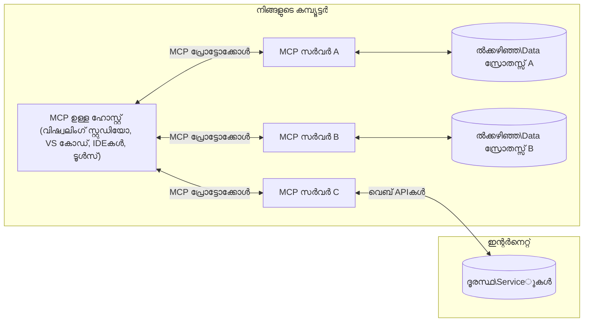

# MCP കോർ ആശയങ്ങൾ: AI സംയോജനത്തിന് മോഡൽ കോൺടെക്സ് പ്രോട്ടോകോൾ കൈകാര്യം ചെയ്യൽ

[](https://youtu.be/earDzWGtE84)

_(ഈ പാഠത്തിന്റെ വീഡിയോ കാണാൻ മുകളിൽ ചിത്രത്തിൽ ക്ലിക്കുചെയ്യുക)_

[Model Context Protocol (MCP)](https://github.com/modelcontextprotocol) എന്നത് വലിയ ഭാഷാ മാതൃകകൾ (LLMs) കൂടാതെ ബാഹ്യ ടൂൾസ്, ആപ്ലിക്കേഷനുകൾ, ഡാറ്റാ സ്രോതസുകൾ എന്നിവയുമായുള്ള സമർത്ഥമായ, സ്റ്റാൻഡേർഡൈസ്ഡ് ഫ്രെയ്‌മ്വർക്ക് ആണ്.  
ഈ ഗൈഡ് MCP ന്റെ കോർ ആശയങ്ങൾ വിശദമാക്കും. നിങ്ങൾ ഇതിന്റെ ക്ലയന്റ്-സർവർ ആര്‍ക്കിടെക്ചർ, അടിസ്ഥാന ഘടകങ്ങൾ, കമ്മ്യൂണിക്കേഷൻ മെക്കാനിസങ്ങൾ, നടപ്പാക്കൽ മികച്ച പ്രാക്ടീസുകൾ എന്നിങ്ങനെ പഠിക്കാം.

- **സ്പഷ്ടമായ ഉപയോക്തൃ സമ്മതം**: എല്ലാ ഡാറ്റ ആക്സസ്, പ്രവർത്തനങ്ങൾ നടപ്പാക്കുന്നതിന് മുൻപ് ഉപയോക്തൃ സമ്മതം ആവശ്യമാണ്. ഉപയോക്താക്കൾക്ക് എത്രയും വിശദമായി ഡാറ്റ ആക്സസ് ചെയ്യപ്പെടുന്നതും നടത്തപ്പെടുന്ന പ്രവർത്തനങ്ങളുമെന്താണെന്ന് വ്യക്തമാകണം, അനുമതികളും അധികാരങ്ങളും കഴിഞ്ഞുള്ള സൂക്ഷ്മ നിയന്ത്രണം ഉണ്ടാകണം.  
- **ഡാറ്റ സ്വകാര്യത സംരക്ഷണം**: ഉപയോക്തൃ ഡാറ്റ പരമാവധി സുരക്ഷിത ആയിരിക്കണം, സ്പഷ്ട സമ്മതം കൂടാതെ പുറത്തുവിടരുത്. ആക്സസ് നിയന്ത്രണങ്ങൾ സംഘട്ടനമില്ലാതെ നടക്കുന്നവ ആയിരിക്കണം, മുഴുവൻ ഇടപെടലും ശക്തമായ സ്വകാര്യതാ പരിധികൾ കൊണ്ടു അണയണം.  
- **ടൂൾ പ്രവർത്തന സുരക്ഷ**: ഓരോ ടൂൾ ഉപയോഗത്തിനും ഉപയോക്തൃ സമ്മതം ആവശ്യമാണ്, ടൂളിന്റെ പ്രവർത്തനം, പരിമിതികൾ, ഫലഫലങ്ങൾ മനസ്സിലാക്കേണ്ടതുണ്ട്. സുരക്ഷിത പരിധികൾ നിയന്ത്രണമില്ലാത്ത, അപകടകരമായ, ദോഷപരമായ പ്രവർത്തനങ്ങൾ തടയണം.  
- **ട്രാൻസ്പോർട്ട് ലെയർ സുരക്ഷ**: എല്ലാ കമ്മ്യൂണിക്കേഷൻ ചാനലുകളും അനുയോജ്യമായ എൻക്രിപ്ഷൻ, ഓത്തന്റിക്കേഷൻ മെക്കാനിസങ്ങൾക്ക് ഉപയോഗിക്കണം. ദൂരെ ബന്ധങ്ങൾ സുരക്ഷിത ട്രാൻസ്പോർട്ട് പ്രോട്ടോകോളുകൾ ഉപയോഗിച്ച് നടപ്പിലാക്കണം; ക്രെഡൻഷ്യൽ മാനേജ്മെന്റ് ശരിയായി നടപ്പിലാക്കണം.

#### നടപ്പാക്കൽ മാർഗ്ഗനിർദ്ദേശങ്ങൾ:

- **അനുമതി മാനേജ്മെന്റ്**: ഉപയോക്താക്കൾക്ക് ഏത് സേർവറുകൾ, ടൂളുകൾ, സ്രോതസുകൾ ആക്‌സസ് ചെയ്യാമെന്നു നിയന്ത്രിക്കാൻ സുഗമമായ സൂക്ഷ്മ അനുവദന സംവിധാനം നടപ്പിലാക്കുക  
- **ഓത്തന്റിക്കേഷൻ &.Authorization**: സുരക്ഷിത ഓത്തന്റിക്കേഷൻ രീതികൾ (OAuth, API കീകൾ) ഉപയോഗിച്ച് ടോക്കൺ മാനേജ്മെന്റ്, കാലഹരണസംവിധാനം വരുത്തുക  
- **ഇൻപുട്ട് സാധുത പരിശോധിക്കൽ**: എല്ലാ പാരാമീറ്ററുകളും ഡാറ്റ എൻട്രികളും നിശ്ചിത സ്കീമകൾ പ്രകാരം പരിശോധിച്ച് ഇൻജക്ഷൻ അറ്റാക്ക് തടയുക  
- **ഓഡിറ്റ് ലോഗിങ്ങ്**: സംരക്ഷണ നിരീക്ഷണത്തിനും അനുകൂലനത്തിനും ഒടുവിൽ എല്ലാ പ്രവർത്തനങ്ങളുടെയും സമഗ്ര ലോഗുകൾ സൂക്ഷിക്കുക

## അവലോകനം

ഈ പാഠത്തിൽ Model Context Protocol (MCP) ഇക്കോസിസ്റ്റത്തിന്റെ അടിസ്ഥാന ആര്‍ക്കിടെക്ചറും ഘടകങ്ങളും പരിശോധിക്കും. MCP ഇടപാടുകൾക്ക് ശക്തി നല്കുന്ന ക്ലയന്റ്-സർവർ ആര്‍ക്കിടെക്ചർ, പ്രധാന ഘടകങ്ങൾ, കമ്മ്യൂണിക്കേഷൻ രീതി എന്നിവയെക്കുറിച്ച് നിങ്ങൾ പഠിക്കും.

## പ്രധാന പഠന ലക്ഷ്യങ്ങൾ

ഈ പാഠം കഴിഞ്ഞപ്പോൾ നിങ്ങൾ:

- MCP ക്ലയന്റ്-സർവർ ആര്‍ക്കിടെക്ചർ മനസിലാക്കും  
- ഹോസ്റുകൾ, ക്ലയന്റുകൾ, സേർവറുകളുടെ വേഷങ്ങളും ഉത്തരവാദിത്വങ്ങളും തിരിച്ചറിയും  
- MCP ലളിതമായ സംയോജനം നടപ്പാക്കുന്ന കോർ സവിശേഷതകൾ വിശകലനം ചെയ്യും  
- MCP ഇക്കോസിസ്റ്റത്തിലൂടെയുള്ള വിവരഗതാഗതം പഠിക്കും  
- .NET, ജാവ, പൈതൺ, ജാവാസ്ക്രിപ്റ്റ് എന്നിവയിൽ കൊടുക്കുന്ന കോഡ് ഉദാഹരണങ്ങൾ വഴി പ്രായോഗിക അറിവ് നേടും

## MCP ആര്‍ക്കിടെക്ചർ: ഒരു ആഴത്തിലുള്ള കാഴ്ച

MCP ഇക്കോസിസ്റ്റം ഒരു ക്ലയന്റ്-സർവർ മോഡൽ അടിസ്ഥാനമാക്കി രൂപകൽപ്പന ചെയ്തതാണ്. ഈ ഘടന AI ആപ്ലിക്കേഷനുകൾ ടൂളുകൾ, ഡാറ്റാബേസുകൾ, APIകൾ, കോൺട്ടെക്സ്ച്വൽ സ്രോതസുകൾ എന്നിവയെ കാര്യക്ഷമമായി ഇടപെടാൻ സഹായിക്കുന്നു. ഈ ആര്‍ക്കിടെക്ചർ മുഖ്യ ഘടകങ്ങളായി വിഭജിക്കാം.

അടിസ്ഥാനത്തിൽ, MCP ഒരു ക്ലയന്റ്-സർവർ ആര്‍ക്കിടെക്ചർ പിന്തുടരുന്നു, სადაც ഒരു ഹോസ്റ്റ് ആപ്ലിക്കേഷൻ നിരവധി സർവറുകളുമായി ബന്ധപ്പെടാം:


- **MCP ഹോസ്റുകൾ**: VSCode, Claude Desktop, IDEകൾ, അല്ലെങ്കിൽ MCP വഴി ഡാറ്റ ആക്സസ് ചെയ്യാൻ ആഗ്രഹിക്കുന്ന AI ടൂളുകൾ പോലുള്ള പ്രോഗ്രാമുകൾ  
- **MCP ക്ലയന്റുകൾ**: ഓരോ സേർവർ ബന്ധത്തിനും ഒരെണ്ണം നിലനിർത്തുന്ന പ്രോട്ടോകോൾ ക്ലയന്റുകൾ  
- **MCP സേർവറുകൾ**: സ്റ്റാൻഡേർഡൈസ്ഡ് Model Context Protocol വഴി പ്രത്യേക കഴിവുകൾ ഉന്നയിക്കുന്ന ലഘു പ്രോഗ്രാമുകൾ  
- **പ്രാദേശിക ഡാറ്റ സ്രോതസുകൾ**: നിങ്ങളുടെ കംപ്യൂട്ടറിലെ ഫയലുകൾ, ഡാറ്റാബേസുകൾ, സേവനങ്ങൾ, MCP സേർവറുകൾ സുരക്ഷിതമായി ആക്‌സസ് ചെയ്യുന്നത്  
- **ദൂരസേവനങ്ങൾ**: ഇന്റർനെറ്റിലൂടെയുള്ള ബാഹ്യ സിസ്റ്റങ്ങൾ, MCP സേർവറുകൾ API കൾ വഴി ബന്ധപ്പെടുന്നത്

MCP പ്രോട്ടോകോൾ ദിവസാന്ത്യ പതിപ്പുകളായ (YYYY-MM-DD ഫോർമാറ്റ്) ഉപയോഗിച്ച് വികസിക്കുന്നു. നിലവിലെ പതിപ്പ് **2025-11-25** ആണ്. [പ്രോട്ടോകോൾ സ്പെസിഫിക്കേഷൻ](https://modelcontextprotocol.io/specification/2025-11-25/) ൽ ഏറ്റവും പുതിയ അപ്ഡേറ്റുകൾ കാണാം.

### 1. ഹോസ്റുകൾ

Model Context Protocol (MCP) ൽ, **ഹോസ്റുകൾ** ഉപയോക്താക്കൾ പ്രോട്ടോക്കോളുമായി പരസ്യമായി ഇടപെടുന്ന മുഖ്യ ഇന്റർഫേസായി പ്രവർത്തിക്കുന്ന AI ആപ്ലിക്കേഷനുകളുടെ പേരാണ്. ഒരേ സമയം ഒരേ ഹോസ്റ്റ് പല MCP സേർവറുകളുമായും ബന്ധപ്പെടാൻ പ്രത്യേക MCP ക്ലയന്റുകൾ സൃഷ്ടിക്കുകയും ഇതെല്ലാം ഏകോപിപ്പിക്കുകയും ചെയ്യും. ഹോസ്റുകളുടെ ഉദാഹരണങ്ങൾ:

- **AI ആപ്ലിക്കേഷനുകൾ**: Claude Desktop, Visual Studio Code, Claude Code  
- **ഡെവലപ്പ്മെന്റ് അന്തരീക്ഷങ്ങൾ**: MCP സംയോജനം ഉള്ള IDEകളും കോഡ് എഡിറ്ററുകളും  
- **പ്രത്യേക ആപ്ലിക്കേഷനുകൾ**: ലക്ഷ്യമിട്ട അഡ്ജൻസിയേറ്റുകളും ടൂളുകളും

**ഹോസ്റുകൾ** AI മോഡൽ ഇടപെടലുകൾ ഏകോപിപ്പിക്കുന്ന ആപ്ലിക്കേഷനുകൾ ആണ്. അവ:

- **AI മോഡലുകളുടെ ഏകോപനം**: LLMs പ്രവർത്തിപ്പിക്കുകയും പ്രതികരണങ്ങൾ സൃഷ്ടിക്കുകയും AI പ്രവൃത്തികൾ ഏകോപിപ്പിക്കുകയും ചെയ്യുന്നു  
- **ക്ലയന്റ് കണക്ഷനുകൾ പരിപാലനം**: MCP സേർവർ ബന്ധങ്ങൾക്ക് 1:1 ക്ലയന്റ് തുടർക്കഥകൾ സൃഷ്ടിച്ച് അളവുക  
- **ഉപയോക്തൃ ഇന്റർഫേസ് നിയന്ത്രണം**: സംഭാഷണ പ്രവാഹം, ഉപയോക്തൃ ഇടപെടൽ, പ്രതികരണങ്ങൾ പ്രദർശനം കൈകാര്യം ചെയ്യൽ  
- **സുരക്ഷ ഉറപ്പ്**: അതോറർഷിപ്പുകൾ, സുരക്ഷ നിയന്ത്രണങ്ങൾ, ഓത്തന്റിക്കേഷൻ നിയന്ത്രണം  
- **ഉപയോക്തൃ സമ്മതം കൈകാര്യം**: ഡാറ്റ പങ്കിടലിനും ടൂൾ പ്രവർത്തനത്തിനും ഉപയോക്തൃ അംഗീകാരം കൈകാര്യം ചെയ്യൽ

### 2. ക്ലയന്റുകൾ

**ക്ലയന്റുകൾ** ഹോസ്റ്റ്-സേർവർ ഇടയിൽ സമർപ്പിത ഒറ്റകണക്ഷനുകൾ നിലനിർത്തുന്ന പ്രധാന ഘടകങ്ങളാണ്. ഓരോ MCP ക്ലയന്റും ഹോസ്റ്റിൽ നിന്നു സൃഷ്ടിക്കപ്പെടുന്നു പ്രത്യേക MCP സേർവറുമായി സംവദിക്കാൻ, സമഗ്രവും സുരക്ഷിതവുമായ കണക്ഷനുകൾ ഉറപ്പാക്കികൊണ്ട്. ഒരേ ഹോസ്റ്റ് പല MCP സേർവറുകളുമായും ബന്ധപ്പെടുന്നതിന് ഇത് പല ക്ലയന്റുകളും ആവശ്യമാണ്.

**ക്ലയന്റുകൾ** ഹോസ്റ്റ് ആപ്ലിക്കേഷനിലുള്ള കണക്റ്റർ ഘടകങ്ങളാണ്. അവ:

- **പ്രോട്ടോക്കോൾ കമ്മ്യൂണിക്കേഷൻ**: JSON-RPC 2.0 അഭ്യർത്ഥനകൾ സേർവറുകളിലേക്ക് പ്രോമ്പ്റ്റുകളും നിർദ്ദേശങ്ങളും കൊണ്ട് അയയ്ക്കൽ  
- **കഴിവ് ചർച്ച**: സേർവറുകളുമായി തുടക്കത്തിൽ പിന്തുണയ്ക്കുന്ന സവിശേഷതകളും പ്രോട്ടോക്കോൾ പതിപ്പുകളും ചർച്ചചെയ്യൽ  
- **ടൂൾ പ്രവർത്തനം**: മോഡലുകളിൽ നിന്നുള്ള ടൂൾ പ്രവർത്തന അഭ്യർത്ഥനകൾ കൈകാര്യം ചെയ്ത് പ്രതികരണങ്ങൾ ശേഖരിക്കൽ  
- **പ്രത്യക്ഷകാല അപ്‌ഡേറ്റുകൾ**: സേർവർ അറിയിപ്പുകളും ലൈവ് അപ്‌ഡേറ്റുകളും കൈകാര്യം ചെയ്യൽ  
- **പ്രതികരണം പ്രോസസ്സിംഗ്**: ഉപയോക്താക്കൾക്ക് പ്രദർശിപ്പിക്കാനുള്ള സേർവർ പ്രതികരണങ്ങൾ ശേഖരിച്ച് ഫോർമാറ്റ് ചെയ്യൽ

### 3. സേർവറുകൾ

**സേർവറുകൾ** MCP ക്ലയന്റുകൾക്കായി കോൺടെക്സ്‌റ്റും ടൂളുകളും കഴിവുകളും നൽകുന്ന പ്രോഗ്രാമുകളാണ്. ഹോസ്റ്റുയും ഒരേ യന്ത്രത്തിലോ (ലൊക്കൽ) ബാഹ്യ പ്ലാറ്റ്ഫോമുകളിലും (റിമോട്ട്) പ്രവർത്തിക്കാം. സേർവർ ക്ലയന്റ് അഭ്യർത്ഥനകൾ കൈകാര്യം ചെയ്തു ഘടകാത്മക പ്രതികരണങ്ങൾ നൽകുന്നു. സേർവർ MCP സ്റ്റാൻഡേർഡ്ഡ് മോഡൽ കോൺടെക്സ് പ്രോട്ടോക്കോൾ വഴി വ്യക്തമായ പ്രവർത്തനങ്ങൾ ഉന്നയിക്കുന്നു.

**സേർവറുകൾ** കോൺടെക്സ്‌റ്റും ശേഷിയും നൽകുന്ന സേവനങ്ങളാണ്. അവ:

- **ഫീച്ചർ രജിസ്ട്രേഷൻ**: ലഭ്യമായ വിഭവങ്ങൾ (റിസോഴ്‌സുകൾ, പ്രോമ്പ്റ്റുകൾ, ടൂളുകൾ) ക്ലയന്റുകൾക്ക് രജിസ്റ്റർ ചെയ്ത് നൽകൽ  
- **അഭ്യർത്ഥന സാധ്യത**: ടൂൾ കോളുകൾ, റിസോഴ്‌സ് അഭ്യർത്ഥനകൾ, പ്രോമ്പ്റ്റ് അഭ്യർത്ഥനകൾ സ്വീകരിച്ച് പ്രവൃത്തനം  
- **കോൺടെക്സ്‌റ്റ് നൽക്കൽ**: മോഡൽ പ്രതികരണങ്ങൾ മെച്ചപ്പെടുത്താനുള്ള സാന്ദർഭവവിവരം, ഡാറ്റ നൽകുക  
- **സ്റ്റേറ്റ് മാനേജ്മെന്റ്**: സെഷൻ സ്റ്റേറ്റ് സൂക്ഷിച്ച് ആവശ്യമായപ്പോൾ സ്റ്റേറ്റ് ഫുൾ ഇടപെടലുകൾ ചെയ്യൽ  
- **പ്രത്യക്ഷകാല അറിയിപ്പുകൾ**: ശേഷി മാറ്റങ്ങളും അപ്ഡേറ്റുകളും സംബന്ധിച്ച് ക്ലയന്റുകൾക്ക് അറിയിപ്പുകൾ അയച്ച് ബന്ധമനവീകരിക്കൽ

മാതൃക കഴിവുകൾ വികസിപ്പിക്കാൻ ആര്‍ക്കും സേർവർ വികസിപ്പിക്കാം, ലൊക്കൽ-റിമോട്ട് വിന്യാസങ്ങൾ ഇരുവരെയും പിന്തുണയ്ക്കും.

### 4. സേർവർ പ്രിമിറ്റിവുകൾ

Model Context Protocol (MCP) സേർവറുകൾ മൂന്നു പ്രാഥമിക **പ്രിമിറ്റിവുകൾ** നൽകുന്നു, അവ MCP ക്ലയന്റുകൾ, ഹോസ്റ്റുകൾ, ഭാഷാ മാതൃകകൾ മദ്ധ്യേ സമൃദ്ധമായ ഇടപെടലുകൾക്കായി അടിസ്ഥാന ഘടകങ്ങൾ നിർവചിക്കുന്നു. ഈ പ്രിമിറ്റിവുകൾ പ്രോട്ടോക്കോളിലൂടെ ലഭ്യമാകുന്ന കോൺടെക്സ്‌റ്റിലെയും പ്രവർത്തനങ്ങളുടെയും തരം വ്യക്തമാക്കുന്നു.

MCP സേർവറുകൾ താഴെ പറയുന്ന മൂന്നു പ്രിമിറ്റിവുകളിൽ ഏതൊരു സംയോജനവും പ്രദാനം ചെയ്യാം:

#### റിസോഴ്‌സുകൾ

**റിസോഴ്‌സുകൾ** എ.ഐ ആപ്ലിക്കേഷനുകൾക്ക് കോൺടെക്‌സ്‌റ്റൽ വിവരങ്ങൾ നൽകുന്ന ഡാറ്റ സ്രോതസ്സുകളാണ്. ഇവ സ്റ്റാറ്റിക് അല്ലെങ്കിൽ ഡൈനാമിക് ഉള്ളടക്കം പ്രതിനിധീകരിക്കുന്നു, മോഡൽ മനസ്സിലാക്കലും தீர്മാനങ്ങളെ മെച്ചപ്പെടുത്തുന്നതും സഹായിക്കുന്നു:

- **കോൺടെക്‌സ്‌റ്റൽ ഡാറ്റ**: എ.ഐ മാതൃക ഉപയോഗത്തിനുള്ള ഘടിത വിവരം, സാന്ദർഭം  
- **ജ്ഞാനബേസുകൾ**: രേഖാസംഗ്രഹങ്ങൾ, ലേഖനങ്ങൾ, മാനുവലുകൾ, ഗവേഷണ പേപ്പറുകൾ  
- **പ്രാദേശിക ഡാറ്റാ സ്രോതസുകൾ**: ഫയലുകൾ, ഡാറ്റാബേസുകൾ, പ്രാദേശിക സിസ്റ്റം വിവരങ്ങൾ  
- **ബാഹ്യ ഡാറ്റ**: API പ്രതികരണങ്ങൾ, വെബ് സേവനങ്ങൾ, ദൂരസ്ഥ സിസ്റ്റം ഡാറ്റ  
- **ഡൈനാമിക് ഉള്ളടക്കം**: ബാഹ്യ അവസ്ഥ അനുസരിച്ച് തത്സമയം അപ്ഡേറ്റ് ചെയ്യുന്ന ഡാറ്റ

റിസോഴ്‌സുകൾ URI വഴി തിരിച്ചറിയപ്പെടുകയും `resources/list` വഴി കണ്ടെത്തുകയും `resources/read` വഴി വായിക്കപ്പെടുകയും ചെയ്യുന്നു:

```text
file://documents/project-spec.md
database://production/users/schema
api://weather/current
```

#### പ്രോമ്പ്റ്റുകൾ

**പ്രോമ്പ്റ്റുകൾ** ആവർത്തിച്ച് ഉപയോഗിക്കാവുന്ന ടെംപ്ലേറ്റുകൾ ആണ്, ഭാഷാ മാതൃകയുമായി ഇടപെടലുകൾ ഘടിപ്പിക്കാൻ സഹായിക്കുന്നു. അവ סטാൻഡേർ‌ഡൈസ്വ ചെയ്തത് ആയ ഇടപെടൽ സാമ്പത്തികങ്ങളുടെയും ടെംപ്ലേറ്റു പ്രവർത്തനങ്ങ‌ളും നൽകുന്നു:

- **ടെംപ്ലേറ്റ് അടിസ്ഥാന ഇടപെടലുകൾ**: മുൻകൂട്ടി ഘടിപ്പിച്ച സന്ദേശങ്ങളും സംഭാഷണ തുടങ്ങാൻ സഹായിക്കുന്ന രീതികളും  
- **വർക്ക്ഫ്ലോ ടെംപ്ലേറ്റുകൾ**: സാധാരണ പ്രവർത്തനങ്ങളുടെയും ഇടപെടലുകളുടെയും സ്റ്റാൻഡേർഡായ കൃത്യക്രമങ്ങൾ  
- **ചില-shot ഉദാഹരണങ്ങൾ**: മാതൃക മാർഗ്ഗനിർദ്ദേശത്തിന് ഉദാഹരണ അടിസ്ഥാന ടെംപ്ലേറ്റുകൾ  
- **സിസ്റ്റം പ്രോമ്പ്റ്റുകൾ**: മാതൃകയുടെ പെരുമാറ്റവും കോൺടെക്സ്‌റ്റ് നിർവചിക്കുന്ന അടിസ്ഥാന പ്രോമ്പ്റ്റുകൾ  
- **ഡൈനാമിക് ടെംപ്ലേറ്റുകൾ**: പ്രത്യേക കോൺടെക്‌സ്‌റ്റിലേക്ക് അനുയോജ്യമായ പാരാമീറ്ററുകൾ ഉള്ള പ്രോമ്പ്റ്റുകൾ

പ്രോമ്പ്റ്റുകൾ വേരിയബിള്‍ ബദലിൽ പിന്തുണക്കുകയും, `prompts/list` വഴി കണ്ടെത്തുകയും, `prompts/get` വഴി വായിക്കപ്പെടുകയും ചെയ്യുന്നു:

```markdown
Generate a {{task_type}} for {{product}} targeting {{audience}} with the following requirements: {{requirements}}
```

#### ടൂളുകൾ

**ടൂളുകൾ** AI മോഡൽകൾ പ്രത്യേക ക്രമീകരണങ്ങൾ ഉപയോഗിച്ച് ആവശ്യമായ പ്രവർത്തനങ്ങൾ നടത്താൻ വിളിക്കാവുന്ന പ്രവർത്തനങ്ങളാണ്. ഇവ MCP ഇക്കോസിസ്റ്റത്തിലെ "ക്രിയാപദങ്ങൾ" കൂടിയാണ്: മോഡലുകൾ ബാഹ്യ സിസ്റ്റങ്ങളുമായി ഇടപെടുന്നത് ഇതിലൂടെ സാധിക്കും.

- **പ്രവർത്തന പധതികൾ**: മോഡലുകൾക്ക് പ്രത്യേക പാരാമീറ്ററുകളോടെ വിളിക്കാവുന്ന പ്രത്യേകം പ്രവർത്തനങ്ങൾ  
- **ബാഹ്യ സിസ്റ്റം സംയോജനം**: API കോളുകൾ, ഡാറ്റാബേസ് ചോദ്യങ്ങൾ, ഫയൽ പ്രവർത്തനങ്ങൾ, കണക്കുകൂട്ടലുകൾ  
- **വ്യത്യസ്തമായ ഐഡന്റിറ്റി**: ഓരോ ടൂളിന്റെയും വ്യത്യസ്തമായ പേര്, വിവരണം, പാരാമീറ്റർ സ്കീമ  
- **ഘടിത I/O**: ടൂളുകൾ പരിശോധന നടത്തപ്പെട്ട പാരാമീറ്ററുകൾ സ്വീകരിക്കുകയും ഘടിത, ടൈപ്പുചെയ്ത പ്രതികരണങ്ങളുമായി തിരിച്ചടിക്കുകയും ചെയ്യുന്നു  
- **പ്രവർത്തന ശേഷി**: മോഡലുകൾക്ക് യാഥാർത്ഥ്യ പ്രവർത്തനങ്ങൾ നടത്താനും ലൈവ് ഡാറ്റ പുനഃപ്രാപിക്കാനും കഴിവുള്ളവ

ടൂൾ പാരാമീറ്റർ പരിശോധനയ്ക്ക് JSON Schema ഉപയോഗിക്കാം, അവ `tools/list` വഴി കണ്ടെത്തുക, `tools/call` വഴി പ്രവർത്തിപ്പിക്കാം. ടൂട്ട്ക് ഐകോൺ പോലുള്ള മാർക്കപ്പും ഉണ്ടാകാം മികച്ച UI പ്രദർശനത്തിന്.

**ടൂൾ അനോട്ടേഷനുകൾ**: ടൂളുകൾ "readOnlyHint", "destructiveHint" പോലുള്ള പ്രവൃത്തിശൈലി അനോട്ടേഷനുകൾ പിന്തുണയ്ക്കുന്നു, ഇത് ടൂൾ വായന മാത്രം എന്നോ പിരിച്ച് ചവിട്ടൽ എന്നോ വിവരിക്കുന്നു, ഉപയോക്താക്കൾ ടൂൾപ്രവർത്തനം സംബന്ധിച്ച് ബുദ്ധിമുട്ടില്ലാതെ തീരുമാനിക്കാനായി.

ടൂൾ നിർവചന ഉദാഹരണം:

```typescript
server.tool(
  "search_products", 
  {
    query: z.string().describe("Search query for products"),
    category: z.string().optional().describe("Product category filter"),
    max_results: z.number().default(10).describe("Maximum results to return")
  }, 
  async (params) => {
    // തിരയൽ ഓടിച്ച് സുസംഘടിത ഫലങ്ങൾ തിരികെ നൽകുക
    return await productService.search(params);
  }
);
```

## ക്ലയന്റ് പ്രിമിറ്റിവുകൾ

Model Context Protocol (MCP) ൽ, **ക്ലയന്റുകൾ** ഹോസ്റ്റ് ആപ്ലിക്കേഷനിൽ നിന്നും സേർവറുകൾക്ക് അധിക ശേഷികൾ അഭ്യർത്ഥിക്കാൻ പ്രിമിറ്റിവുകൾ തുറന്നു നൽകാം. ഈ ക്ലയന്റു-പാർശ്വ പ്രിമിറ്റിവുകൾ കൂടുതൽ സമൃദ്ധമായ, ഇടപെടലുള്ള സേർവർ നടപ്പാക്കലുകൾക്ക് സഹായകമാണ്, ഉപയോക്തൃ ഇന്റർഫേസ്, AI മോഡൽ കഴിവുകൾ എന്നിവ അടങ്ങിയവ ആക്‌സസ് ചെയ്യാൻ കഴിയുന്നു.

### സാമ്പ്ലിങ്

**സാമ്പ്ലിങ്** സേർവറുകൾക്ക് ക്ലയന്റിന്റെ AI ആപ്ലിക്കേഷനിൽ നിന്നും ഭാഷാ മാതൃക പൂർത്തീകരണങ്ങൾ അഭ്യർത്ഥിക്കാൻ അനുവദിക്കുന്നു. ഈ പ്രിമിറ്റിവ് സേർവറുകൾക്ക് സ്വന്തം മോഡൽ ആശ്രയം ഇല്ലാതെ LLM കഴിവുകൾ ഉപയോഗിക്കാനാകും:

- **മോഡൽ സ്വതന്ത്ര ആക്‌സസ്**: സേർവർ LLM SDKകൾ ഉൾപ്പെടുത്തി മോഡൽ ആക്‌സസ് നിയന്ത്രിക്കുന്നതിനു പകരം ക്ലയന്റിൽ നിന്ന് പൂർത്തീകരണങ്ങൾ അഭ്യർത്ഥിക്കുന്നു  
- **സേർവർ-ആരംഭിത AI**: ക്ലയന്റിന്റെ AI മാതൃക ഉപയോഗിച്ച് സൈദ്ധാന്തികമായി ഉള്ളടക്കം നിർമ്മിക്കാമാക്കുന്നു  
- **പുനരാവൃത LLM ഇടപെടലുകൾ**: സേർവർക്ക് AI സഹായം ആവശ്യമായ സങ്കീർണ്ണ സാഹചര്യങ്ങളെ പിന്തുണയ്ക്കുന്നു  
- **ഡൈനാമിക് ഉള്ളടക്കം സൃഷ്ടി**: ഹോസ്റ്റിന്റെ മാതൃക ഉപയോഗിച്ച് കോൺടെക്സ്ച്വൽ പ്രതികരണങ്ങൾ സൃഷ്ടിക്കുന്നു  
- **ടൂൾ കോളിംഗ് പിന്തുണ**: സേർവർ `tools` ഉം `toolChoice` പാരാമീറ്ററുകളും ഉൾപ്പെടുത്തി sampling പ്രക്രിയയിൽ ക്ലയന്റ് മോഡൽ ടൂളുകൾ വിളിക്കാം

സാമ്പ്ലിങ് `sampling/complete` പ്രക്രിയ മുഖാന്തിരം തുടങ്ങിയതാണ്, സേർവർ ക്ലയന്റിലേക്ക് പൂർത്തീകരണ അഭ്യർത്ഥനകൾ അയയ്ക്കുന്നു.

### റൂട്ടുകൾ

**റൂട്ടുകൾ** സേർവർകൾക്ക് ക്ലയന്റ് ഉറപ്പു നൽകുന്ന ഫയൽ സിസ്റ്റം പരിധികൾ സ്റ്റാൻഡേർഡായി തിരഞ്ഞെടുത്തതാണ്, ഇതിലൂടെ സേർവർക്ക് ലഭ്യമാകുന്ന ഡയറക്ടറികളും ഫയർലുകളും മനസിലാക്കാൻ സഹായിക്കുന്നു:

- **ഫയൽ സിസ്റ്റം പരിധികൾ**: സേർവർ പ്രവർത്തിക്കാനുള്ള പരിധികൾ  
- **ആക്സസ് നിയന്ത്രണം**: ഏത് ഡയറക്ടറികൾ, ഫയലുകൾ അവകാശപ്പെടുക എന്നറിയിക്കുന്ന സഹായം  
- **ഡൈനാമിക് അപ്‌ഡേറ്റുകൾ**: റൂട്ടുകളിൽ മാറ്റം വരുമ്പോൾ ക്ലയന്റ് സേർവറിന് അറിയിപ്പ് നൽകും  
- **URI അടിസ്ഥാന തിരിച്ചറിയൽ**: റൂട്ടുകൾ `file://` URIകൾ ഉപയോഗിച്ച് തിരിച്ചറിയുന്നു

റൂട്ടുകൾ `roots/list` വഴി കണ്ടെത്തുകയും, റൂട്ടുകളിൽ മാറ്റം വരുമ്പോൾ `notifications/roots/list_changed` എന്ന അറിയിപ്പ് ക്ലയന്റ് അയയ്ക്കുകയും ചെയ്യും.

### എലിസിറ്റേഷൻ

**എലിസിറ്റേഷൻ** സേർവറുകൾക്ക് ഉപയോക്താക്കളിൽ നിന്നും അധിക വിവരങ്ങൾ അല്ലെങ്കിൽ സ്ഥിരീകരണം ക്ലയന്റ് ഇന്റർഫേസിലൂടെ ചോദിക്കാൻ അനുവദിക്കുന്നു:

- **ഉപയോക്തൃ എൻപുട്ട് അഭ്യർത്ഥനകൾ**: ടൂൾ പ്രവർത്തനത്തിന് ആവശ്യമുള്ള അധിക വിവരങ്ങൾ  
- **സ്ഥിരീകരണ ഡയലോഗുകൾ**: സങ്കീർണ്ണമായ പ്രവർത്തനങ്ങൾക്കായി ഉപയോക്തൃ അംഗീകാരം  
- **ഇന്ററാക്ടീവ് വർക്ക്ഫ്ലോസ്**: സ്റ്റെപ്പു ബൈ സ്റ്റെപ്പു ഉപയോക്തൃ ഇടപെടൽ നിർമിക്കുന്നു  
- **ഡൈനാമിക് പാരാമീറ്റർ ശേഖരണം**: ടൂൾ പ്രവർത്തനത്തിന് വേണ്ടില്ലാത്ത അല്ലെങ്കിൽ അഭാവപ്പെട്ട പാരാമീറ്ററുകൾ ചോദിച്ചു ശേഖരിക്കുന്നത്

`elicitation/request` വഴി എലിസിറ്റേഷൻ അഭ്യർത്ഥനകൾ ക്ലയന്റ് ഇന്റർഫേസിലൂടെ നടത്തുന്നു.

**URL മോഡ് എലിസിറ്റേഷൻ**: സേർവർ ബാഹ്യ വെബ് പേജുകളിലേക്ക് ഉപയോക്താക്കളെ തെളിവ്, സ്ഥിരീകരണം, ഡാറ്റ എൻട്രി എന്നിവയ്ക്കായി URL അടിസ്ഥാന ഇന്ററാക്ഷനുകൾ കൃത്യമായി നിർദേശം നൽകാം.

### ലോഗ്ഗിംഗ്

**ലോഗ്ഗിംഗ്** സേർവറുകൾക്ക് ക്ലയന്റിലേക്ക് ഘടിതമായ ലോഗ് സന്ദേശങ്ങൾ അയച്ചു ഡീബഗ്, നിരീക്ഷണം, ആപ്ലിക്കേഷൻ ദൃശ്യത ഉറപ്പാക്കാൻ സഹായിക്കുന്നു:

- **ഡീബഗിംഗ് പിന്തുണ**: പ്രശ്നപരിഹാരംക്കായി വിശദമായ എക്സിക്യൂഷൻ ലോഗുകൾ നൽകുക  
- **ഓപ്പറേഷൻ നിരീക്ഷണം**: ക്ലയന്റുകളിൽ സ്റ്റാറ്റസ് അപ്ഡേറ്റുകളും പ്രകടനം മെട്രിക്‌സുകളും അയയ്ക്കുക  
- **പിശക് റിപ്പോർട്ടിംഗ്**: വിശദമായ പിശക് പരിസരവിവരം, ഡയഗ്നോസ്റ്റിക് വിവരങ്ങൾ  
- **ഓഡിറ്റ് ട്രെയില്സ്**: സേർവർ പ്രവർത്തനങ്ങളും തീരുമാനങ്ങളും സംഗ്രഹിച്ച് ലോഗുകൾ നിർമ്മിക്കൽ

ലോഗിംഗ് സന്ദേശങ്ങൾ സേർവർ പ്രവർത്തനങ്ങളുടെ മാറ്റങ്ങളും ഡീബഗിംഗും സുതാര്യത ഉറപ്പാക്കാൻ ക്ലയന്റുകൾക്ക് അയയ്ക്കുന്നു.

## MCPയിൽ വിവര ഗതാഗതം

Model Context Protocol (MCP) ഹോസ്റ്റുകൾ, ക്ലയന്റുകൾ, സേർവർകൾ, മാതൃകകൾ എന്നിവയുടേതായി ഘടിതമായ വിവര ഗതാഗതം നിർവചിക്കുന്നു. ഈ പ്രവാഹം മനസിലാക്കുന്നത് ഉപയോക്തൃ അഭ്യർത്ഥനകളെ എങ്ങനെ പ്രോസസ് ചെയ്യുന്നു എന്നതും ബാഹ്യ ടൂളുകളും ഡാറ്റ സ്രോതസ്സുകളും മോഡൽ പ്രതികരണങ്ങളിലേക്ക് എങ്ങനെ ഉൾപ്പെടുത്തുന്നു എന്നതും വ്യക്തമാക്കുന്നു.
- **ഹോസ്റ്റ് കണക്ഷൻ ആരംഭിക്കുന്നു**  
  ഹോസ്റ്റ് അപ്ലിക്കേഷൻ (IDE അല്ലെങ്കിൽ ചാറ്റ് ഇന്റർഫേസ് പോലുള്ളത്) സാധാരണയായി STDIO, WebSocket അല്ലെങ്കിൽ മറ്റേതെങ്കിലും പിന്തുണയും ലഭ്യമായ ട്രാൻസ്പോർട്ട് വഴി MCP സെർവറുമായി കണക്ഷൻ സ്ഥാപിക്കുന്നു.

- **സാധ്യമായ കഴിവുകൾ സംബന്ധിച്ച ധാരണ**  
  ഹോസ്റ്റിൽ ഉൾപ്പെടുത്തിയിരിക്കുന്ന ക്ലയന്റ് და സെർവർ അവരവരുടെ പിന്തുണയുള്ള ഫീച്ചറുകൾ, ടൂൾസ്, റിസോഴ്‌സുകൾ, പ്രോട്ടോകോൾ പതിപ്പുകൾ എന്നിവ സംബന്ധിച്ച് വിവരങ്ങൾ കൈമാറുന്നു. ഇത് സെഷനിൽ ഉപയോഗിക്കാൻ കഴിയുന്ന കഴിവുകൾ രണ്ടുംപോലും മനസ്സിലാക്കുന്നത് ഉറപ്പ് വരുത്തുന്നു.

- **ഉപയോക്തൃ അഭ്യർത്ഥന**  
  ഉപയോക്താവ് ഹോസ്റ്റുമായി ബന്ധപ്പെടുന്നു (ഉദാഹരണത്തിന് ഒരു പ്രോംപ്റ്റ് അല്ലെങ്കിൽ കമാൻഡ് നൽകുന്നു). ഹോസ്റ്റ് ഈ ഇൻപുട്ട് ശേഖരിച്ച് പ്രോസസ്സിംഗിനായി ക്ലയന്റിന് അയയ്ക്കുന്നു.

- **റിസോഴ്‌സ് അല്ലെങ്കിൽ ടൂൾ ഉപയോഗം**  
  - മോഡലിന്റെ മനസ്സിലാക്കലിൽ സമൃദ്ധിയേകാൻ ക്ലയന്റ് സെർവറിൽ നിന്ന് അധിക കോൺടെക്സ്റ്റ് അല്ലെങ്കിൽ റിസോഴ്‌സുകൾ (ഫയലുകൾ, ഡാറ്റാബേസ് എൻറികൾ, നോളജ് ബേസ് ലേഖനങ്ങൾ എന്നിവ) അഭ്യർത്ഥിച്ചേക്കാം.  
  - മോഡലിന് ടൂൾ ആവശ്യമാണ് എന്ന് തിരിച്ചറിഞ്ഞാൽ (ഉദാഹരണത്തിന് ഡാറ്റ എടുക്കുക, കണക്കുകൂട്ടുക, API കോൾ ചെയ്യുക), ക്ലയന്റ് ടൂൾ നാമവും പാരാമീറ്ററുകളും ഉൾപ്പെടുത്തി ടൂൾ കോളിന് സെർവറിന് അഭ്യർത്ഥന അയയ്ക്കുന്നു.

- **സർവർ നിർവഹണം**  
  റിസോഴ്‌സ് അല്ലെങ്കിൽ ടൂൾ അഭ്യർത്ഥന സർവർ സ്വീകരിക്കുന്നു, ആവശ്യമായ ഓപ്പറേഷനുകൾ (ഫംഗ്ഷൻ ഓടിക്കുക, ഡാറ്റാബേസ് ക്വറി ചെയ്യുക, ഫയൽ എടുക്കുക എന്നിവ) നിർവഹിച്ച് ഫലങ്ങൾ ഘടനാപരമായി ക്ലയന്റിന് തിരികെ നൽകുന്നു.

- **പ്രതികരണ നിർമ്മാണം**  
  ക്ലയന്റ്, സെർവറിന്റെ പ്രതികരണങ്ങൾ (റിസോഴ്‌സ് ഡാറ്റ, ടൂൾ ഔട്ട്പുട്ട് തുടങ്ങിയവ) തുടർന്നുള്ള മോഡൽ ഇടപെടലിൽ സംയോജിപ്പിക്കുന്നു. മോഡൽ ഈ വിവരങ്ങൾ ഉപയോഗിച്ച് സമഗ്രവും സാഹചര്യാനുസൃതവുമായ പ്രതികരണം സൃഷ്ടിക്കുന്നു.

- **ഫലപ്രദർശനം**  
  ഹോസ്റ്റ് ക്ലയന്റിന് നിന്നുള്ള അന്തിമ ഔട്ട്പുട്ട് സ്വീകരിച്ച് ഉപയോക്താവിനെ പ്രദർശിപ്പിക്കുന്നു, സാധാരണ തരത്തിൽ മോഡലിന്റെ സൃഷ്ടിച്ച പാഠവും ടൂളുകൾ നിർവഹിച്ച ഫലങ്ങളും ഉൾപ്പെടെ.

ഈ പ്രക്രിയ MCP-നെ മുകളിലെ, ഇടപെടലുള്ള, സാഹചര്യബോധമുള്ള AI അപ്ലിക്കേഷനുകളെ പിന്തുണയ്ക്കുന്നതിന് സഹായിക്കുന്നു, മോഡലുകളെ ബാഹ്യ ടൂളുകളുമായും ഡാറ്റാ സ്രോതസുകളുമായും ഏകോപിപ്പിച്ച് സമർപ്പിക്കുന്നതിലൂടെ.

## പ്രോട്ടോകോൾ ആർക്കിടെക്ചർ & ലെയേഴ്സ്

MCP രണ്ടു വ്യത്യസ്ത ആർക്കിടെക്ചറൽ ലെയേഴ്സിൽ ഘടിപ്പിക്കപ്പെട്ടിരിക്കുന്നു, ഇവ ചേർന്ന് പര്യാപ്തമായ ഒരു കമ്മ്യൂണിക്കേഷൻ ഫ്രെയിംവർക്കിനെ സൃഷ്ടിക്കുന്നു:

### ഡാറ്റ ലെയർ

**ഡാറ്റ ലെയർ** MCP പ്രോട്ടോകോൾ മുഖ്യമായി **JSON-RPC 2.0** ഉപയോഗിച്ച് നടപ്പിലാക്കുന്നു. ഈ ലെയർ സന്ദേശ ഘടന, ധാർമ്മികത, ഇടപെടൽ മാതൃകകൾ നിർവചിക്കുന്നു:

#### കേർ ഘടകങ്ങൾ:

- **JSON-RPC 2.0 പ്രോട്ടോകോൾ**: എല്ലാ ആശയവിനിമയവും സ്റ്റാൻഡേർഡൈസ്ഡ് JSON-RPC 2.0 മെസ്സേജ് ഫോർമാറ്റിൽ നടപ്പിൽ വരുന്നു, മിത്തോഡ് കോൾസ്, പ്രതികരണങ്ങൾ, നോട്ടിഫിക്കേഷനുകൾ ഉൾപ്പെടെ
- **ലൈഫ് സൈക്കിൽ മാനേജ്മെന്റ്**: കണക്ഷൻ ആരംഭിക്കൽ, കഴിവുകൾ തമ്മിലുള്ള ധാരണ, സെഷൻ انتهاء എന്നിവ കൈകാര്യം ചെയ്യുന്നു  
- **സർവർ പ്രിമിറ്റീവ്സ്**: ടൂളുകൾ, റിസോഴ്‌സുകൾ, പ്രോംപ്റ്റുകൾ മുഖേന സെർവറുകൾക്ക് അടിസ്ഥാന പ്രവർത്തനം നൽകാൻ സാധിക്കും  
- **ക്ലയന്റ് പ്രിമിറ്റീവ്സ്**: LLMs-ൽ നിന്ന് സാമ്പ്ലിങ് അഭ്യർത്ഥിക്കൽ, ഉപയോക്താവ് ഇൻപുട്ട് ലഭ്യമാക്കൽ, ലോറ് മെസ്സേജുകൾ അയയ്ക്കൽ തുടങ്ങിയവയ്ക്ക് അനുവദിക്കുന്നു  
- **റിയൽ-ടൈം നോട്ടിഫിക്കേഷനുകൾ**: പോളിംഗിനു പകരം ആസിങ്ക്രണസ് (അസിങ്ക്) അപ്‌ഡേറ്റുകൾക്ക് പിന്തുണ നൽകിയിരിക്കുന്നു

#### പ്രധാന സവിശേഷതകൾ:

- **പ്രോട്ടോകോൾ പതിപ്പ് ധാരണ**: YYYY-MM-DD ഫോർമാറ്റിലുള്ള തീയതിമുതലുള്ള പതിപ്പുകളെ ഉപയോഗിക്കുന്നു  
- **സാധ്യമായ കഴിവുകളുള്ള അറിവ്**: ആരംഭ ഘട്ടത്തിൽ ക്ലയന്റുകളും സെർവറുകളും തമ്മിൽ പരസ്പരം പിന്തുണയ്‌ക്കുന്ന ഫീച്ചറുകൾ പങ്കുവെക്കുന്നു  
- **സ്റ്റേറ്റ്‌ഫുൾ സെഷനുകൾ**: പല ഇടപെടലുകളിലൂടെയുള്ള കണക്ഷൻ നില നിലനിർത്തുന്നു, തുടർച്ചയായ സാഹചര്യക്കായാണ്

### ട്രാൻസ്പോർട്ട് ലെയർ

**ട്രാൻസ്പോർട്ട് ലെയർ** MCP പങ്കാളികളിൽ ആശയവിനിമയ ചാനലുകൾ, മെസേജ് ഫ്രെയിമിംഗ്, അഥന്റിക്കേഷൻ എന്നിവ നിയന്ത്രിക്കുന്നു:

#### പിന്തുണയുള്ള ട്രാൻസ്പോർട്ട് സംവിധാനങ്ങൾ:

1. **STDIO ട്രാൻസ്പോർട്ട്**:  
   - പ്രോസസ് നേരിട്ട് കമ്യൂണിക്കേഷൻക്ക് സ്റ്റാൻഡേർഡ് ഇൻപുട്ട്/ഓട്ട്പുട്ട് സ്ട്രീംസ് ഉപയോഗിക്കുന്നു  
   - ഒരേ മെഷീനിലെ ലോക്കൽ പ്രോസസുകൾക്കായി മികച്ചത്, നെറ്റ്‌വർക്ക് ഓവർഹെഡ് ഇല്ല  
   - ലോക്കൽ MCP സെർവർ നടപ്പിലാക്കലുകൾക്കായി പൊതുവായി ഉപയോഗിക്കുന്നു  

2. **സ്റ്റ്രീമേബിൾ HTTP ട്രാൻസ്പോർട്ട്**:  
   - ക്ലയന്റിൽ നിന്നും സെർവറിലേയ്ക്ക് HTTP POST ഉപയോഗിക്കുന്നു  
   - ഐറണത്തിനായി സെർവർ-സെന്റ് ഇവന്റ്സ് (SSE) ഓപ്ഷണൽ ആയി  
   - നെറ്റ്‌വർക്ക് മാർഗ്ഗം റിമോട്ട് സെർവർ കമ്മ്യൂണിക്കേഷൻ അനുവദിക്കുന്നു  
   - സ്റ്റാൻഡേർഡ് HTTP അഥന്റിക്കേഷൻ പിന്തുണ (ബെയറർ ടോകൺസ്, API കീകൾ, കസ്റ്റം ഹെഡറുകൾ)  
   - സുരക്ഷിത ടോകൺ അടിസ്ഥാനമാക്കിയ അഥന്റിക്കേഷനായി MCP OAuth ശുപാർശ ചെയ്യുന്നു

#### ട്രാൻസ്പോർട്ട് അബ്സ്ട്രാക്ഷൻ:

ട്രാൻസ്പോർട്ട് ലെയർ ഡാറ്റ ലെയറിന്‍റെ ആശയവിനിമയ വിശദാംശങ്ങൾ മറച്ച് വയ്ക്കുന്നു, ഇതു കൊണ്ട് വൈവിധ്യമാർന്ന ട്രാൻസ്പോർട്ടുകൾക്കിടയിൽ ഒന്നിച്ച JSON-RPC 2.0 മെസേജ് ഫോർമാറ്റ് ഉപയോഗം സാധ്യമാണ്. ഈ അബ്സ്ട്രാക്ഷൻ ആപ്ലിക്കേഷനുകൾക്ക് ലോക്കൽ സെർവർ മുതലായവയിൽ നിന്നും റിമോട്ട് സെർവറിലേക്ക് മടക്കാൻ സഹായിക്കുന്നു.

### സുരക്ഷാ പരിഗണനകൾ

MCP നടപ്പിലാക്കലുകൾ എല്ലാ പ്രോട്ടോകോൾ പ്രവർത്തനങ്ങളിലും സുരക്ഷിതമായ, വിശ്വസനീയമായ, സുരക്ഷിതമായ ഇടപെടലുകൾ ഉറപ്പ് വരുത്തുന്നതിന് നിർണായകമാണ്:

- **ഉപയോക്തൃ സമ്മതിയും നിയന്ത്രണവും**: ഡാറ്റയും ഓപ്പറേഷനുകളും നടത്തുന്നതിനു മുൻപ് ഉപയോക്താക്കളുടെ വ്യക്തമായ സമ്മതി ലഭിക്കണം. ഉപയോഗിക്കാവുന്ന വിവരങ്ങളും അനുവാദമുള്ള പ്രവർത്തനങ്ങളും പൊതു കൗമാരത്തോടുകൂടിയ UI-കൾ മുഖാന്തിരം വ്യക്തമാക്കണം.  

- **ഡാറ്റ സ്വകാര്യത**: ഉപയോക്തൃ ഡാറ്റ വിശദമായ സമ്മതത്തോടെ മാത്രമേ പങ്കുവെക്കപ്പെടൂ. അനധികൃത ഡാറ്റ പ്രസ്ഥാനം തടയാൻ അനുയോജ്യമായ പ്രവേശന നിയന്ത്രണങ്ങൾ അവലംബിക്കണം, സ്വകാര്യത എല്ലാ ഇടപെടലുകളിലും നിലനിർത്തണം.  

- **ടൂൾ സുരക്ഷ**: ഏതൊരു ടൂള്‍ ഇടപെടല്‍ നടത്തുന്നതിന് മുൻപ് ഉപയോക്തൃ സമ്മതം അനുവദിക്കുക ആവശ്യമുണ്ട്. ഓരോ ടൂളിന്റെയും പ്രവർത്തനങ്ങൾ ഉപയോക്താവിന് മനസ്സിലാക്കാവുന്നതായിരിക്കണം, അപ്രതീക്ഷിതവും അപകടകരവുമായ ടൂൾ നിർവഹണങ്ങൾ തടയാൻ സങ്കീർണ സെക്യൂരിറ്റി പരിധികൾ എതിർത്തുനിൽക്കണം.

ഈ സുരക്ഷാ അടിസ്ഥാന മാർഗ്ഗനിർദ്ദേശങ്ങൾ പാലിക്കുമ്പോൾ MCP ഉപയോക്തൃ വിശ്വാസം, സ്വകാര്യത, സുരക്ഷ കാത്തുസൂക്ഷിക്കുന്നു, അതേസമയം ശക്തമായ AI സംയോജനങ്ങൾ പ്രോത്സാഹിപ്പിക്കുന്നു.

## കോഡ് ഉദാഹരണങ്ങൾ: പ്രധാന ഘടകങ്ങൾ

താഴെ പല പ്രശസ്ത പ്രോഗ്രാമിങ്ങ് ഭാഷകളിൽ MCP സെർവർ ഘടകങ്ങൾ ടൂൾസും നടപ്പിലാക്കുന്ന ഉദാഹരണങ്ങൾ കാണിക്കുന്നു.

### .NET ഉദാഹരണം: ടൂൾസോടെ എളുപ്പമുള്ള MCP സെർവർ നിർമ്മാണം

ദിവസേന ഉപയോഗിച്ചെടുക്കാവുന്ന .NET കോഡ് ഉദാഹരണം, കസ്റ്റം ടൂൾസ് നിർവചിക്കുകയും രജിസ്റ്റർ ചെയ്യുകയും, അഭ്യർത്ഥന കൈകാര്യം ചെയ്ത്, മോഡൽ കോൺടെക്സ്റ്റ് പ്രോട്ടോകോൾ ഉപയോഗിച്ച് സെർവർ കണക്റ്റ് ചെയ്യുന്നത് കാണിക്കുന്നു.

```csharp
using System;
using System.Threading.Tasks;
using ModelContextProtocol.Server;
using ModelContextProtocol.Server.Transport;
using ModelContextProtocol.Server.Tools;

public class WeatherServer
{
    public static async Task Main(string[] args)
    {
        // Create an MCP server
        var server = new McpServer(
            name: "Weather MCP Server",
            version: "1.0.0"
        );
        
        // Register our custom weather tool
        server.AddTool<string, WeatherData>("weatherTool", 
            description: "Gets current weather for a location",
            execute: async (location) => {
                // Call weather API (simplified)
                var weatherData = await GetWeatherDataAsync(location);
                return weatherData;
            });
        
        // Connect the server using stdio transport
        var transport = new StdioServerTransport();
        await server.ConnectAsync(transport);
        
        Console.WriteLine("Weather MCP Server started");
        
        // Keep the server running until process is terminated
        await Task.Delay(-1);
    }
    
    private static async Task<WeatherData> GetWeatherDataAsync(string location)
    {
        // This would normally call a weather API
        // Simplified for demonstration
        await Task.Delay(100); // Simulate API call
        return new WeatherData { 
            Temperature = 72.5,
            Conditions = "Sunny",
            Location = location
        };
    }
}

public class WeatherData
{
    public double Temperature { get; set; }
    public string Conditions { get; set; }
    public string Location { get; set; }
}
```

### ജാവ ഉദാഹരണം: MCP സെർവർ ഘടകങ്ങൾ

. NET ഉദാഹരണത്തിൽ പ്രതിപാദിച്ച MCP സെർവർ, ടൂൾ രജിസ്റ്റർ ചെയ്യലും ജാവയിൽ നടപ്പിലാക്കപ്പെടുന്നതും ഈ ഉദാഹരണത്തിൽ കാണാം.

```java
import io.modelcontextprotocol.server.McpServer;
import io.modelcontextprotocol.server.McpToolDefinition;
import io.modelcontextprotocol.server.transport.StdioServerTransport;
import io.modelcontextprotocol.server.tool.ToolExecutionContext;
import io.modelcontextprotocol.server.tool.ToolResponse;

public class WeatherMcpServer {
    public static void main(String[] args) throws Exception {
        // ഒരു MCP സർവർ സൃഷ്ടിക്കുക
        McpServer server = McpServer.builder()
            .name("Weather MCP Server")
            .version("1.0.0")
            .build();
            
        // ഒരു കാലാവസ്ഥാ ഉപകരണം രജിസ്റ്റർ ചെയ്യുക
        server.registerTool(McpToolDefinition.builder("weatherTool")
            .description("Gets current weather for a location")
            .parameter("location", String.class)
            .execute((ToolExecutionContext ctx) -> {
                String location = ctx.getParameter("location", String.class);
                
                // കാലാവസ്ഥാ ഡേറ്റ എടുക്കുക (സാഫലീകരിച്ചത്)
                WeatherData data = getWeatherData(location);
                
                // स्वरూపപ്പെടുത്തിയ മറുപടി നൽകുക
                return ToolResponse.content(
                    String.format("Temperature: %.1f°F, Conditions: %s, Location: %s", 
                    data.getTemperature(), 
                    data.getConditions(), 
                    data.getLocation())
                );
            })
            .build());
        
        // stdio ട്രാൻസ്പോർട്ട് ഉപയോഗിച്ച് സർവർ കണക്ട് ചെയ്യുക
        try (StdioServerTransport transport = new StdioServerTransport()) {
            server.connect(transport);
            System.out.println("Weather MCP Server started");
            // പ്രക്രിയ അവസാനിക്കുമ്പോളോളം സർവർ പ്രവർത്തനത്തിൽ ഉണ്ടാകണം
            Thread.currentThread().join();
        }
    }
    
    private static WeatherData getWeatherData(String location) {
        // ഇമ്പ്ലിമെന്റേഷൻ ഒരു കാലാവസ്ഥ API വിളിക്കും
        // ഉദാഹരണത്തിൻറ് ലക്ഷ്യം കൊണ്ട് സിംപിൾ ആക്കിയതാൺ
        return new WeatherData(72.5, "Sunny", location);
    }
}

class WeatherData {
    private double temperature;
    private String conditions;
    private String location;
    
    public WeatherData(double temperature, String conditions, String location) {
        this.temperature = temperature;
        this.conditions = conditions;
        this.location = location;
    }
    
    public double getTemperature() {
        return temperature;
    }
    
    public String getConditions() {
        return conditions;
    }
    
    public String getLocation() {
        return location;
    }
}
```

### പൈത്തൺ ഉദാഹരണം: MCP സെർവർ നിർമ്മാണം

ഈ ഉദാഹരണം fastmcp ഉപയോഗിക്കുന്നു, ആദ്യം അത് ഇൻസ്റ്റാൾ ചെയ്യണമെന്ന് ഞങ്ങൾ നിർദേശിക്കുന്നു:

```python
pip install fastmcp
```
Code Sample:

```python
#!/usr/bin/env python3
import asyncio
from fastmcp import FastMCP
from fastmcp.transports.stdio import serve_stdio

# ഒരു FastMCP സെർവർ സൃഷ്‌ടിക്കുക
mcp = FastMCP(
    name="Weather MCP Server",
    version="1.0.0"
)

@mcp.tool()
def get_weather(location: str) -> dict:
    """Gets current weather for a location."""
    return {
        "temperature": 72.5,
        "conditions": "Sunny",
        "location": location
    }

# ഒരു ക്ലാസ് ഉപയോഗിക്കുന്ന പര്യായ സമീപനം
class WeatherTools:
    @mcp.tool()
    def forecast(self, location: str, days: int = 1) -> dict:
        """Gets weather forecast for a location for the specified number of days."""
        return {
            "location": location,
            "forecast": [
                {"day": i+1, "temperature": 70 + i, "conditions": "Partly Cloudy"}
                for i in range(days)
            ]
        }

# ക്ലാസ് ടൂളുകൾ രജിസ്റ്റർ ചെയ്യുക
weather_tools = WeatherTools()

# സെർവർ ആരംഭിക്കുക
if __name__ == "__main__":
    asyncio.run(serve_stdio(mcp))
```

### ജാവാസ്ക്രിപ്റ്റ് ഉദാഹരണം: MCP സെർവർ സൃഷ്ടിക്കുക

ഈ ഉദാഹരണം ജാവാസ്ക്രിപ്റ്റിൽ MCP സെർവർ സൃഷ്ടിക്കുകയും കാലാവസ്ഥയുമായി ബന്ധപ്പെട്ട രണ്ട് ടൂൾസ് രജിസ്റ്റർ ചെയ്യുകയും ചെയ്യുന്നു.

```javascript
// ഔദ്യോഗിക മോഡൽ കോൺടെകസ്റ്റ് പ്രോട്ടോക്കോൾ SDK ഉപയോഗിക്കുന്നു
import { McpServer } from "@modelcontextprotocol/sdk/server/mcp.js";
import { StdioServerTransport } from "@modelcontextprotocol/sdk/server/stdio.js";
import { z } from "zod"; // പാരാമീറ്റർ പരിശോധനയ്ക്കായി

// ഒരു MCP സെർവർ സൃഷ്ടിക്കുക
const server = new McpServer({
  name: "Weather MCP Server",
  version: "1.0.0"
});

// ഒരു കാലാവസ്ഥ ഉപകരണം നിർവചിക്കുക
server.tool(
  "weatherTool",
  {
    location: z.string().describe("The location to get weather for")
  },
  async ({ location }) => {
    // സാധാരണയായി ഇത് ഒരു കാലാവസ്ഥ API വിളിക്കും
    // പ്രദർശനത്തിനായി ലളിതമാക്കിയിരിക്കുന്നത്
    const weatherData = await getWeatherData(location);
    
    return {
      content: [
        { 
          type: "text", 
          text: `Temperature: ${weatherData.temperature}°F, Conditions: ${weatherData.conditions}, Location: ${weatherData.location}` 
        }
      ]
    };
  }
);

// പ്രൊസ്‌ഫോക്കാസ്റ്റ് ഉപകരണം നിർവചിക്കുക
server.tool(
  "forecastTool",
  {
    location: z.string(),
    days: z.number().default(3).describe("Number of days for forecast")
  },
  async ({ location, days }) => {
    // സാധാരണയായി ഇത് ഒരു കാലാവസ്ഥ API വിളിക്കും
    // പ്രദർശനത്തിനായി ലളിതമാക്കിയിരിക്കുന്നത്
    const forecast = await getForecastData(location, days);
    
    return {
      content: [
        { 
          type: "text", 
          text: `${days}-day forecast for ${location}: ${JSON.stringify(forecast)}` 
        }
      ]
    };
  }
);

// സഹായി ഫംഗ്ഷനുകൾ
async function getWeatherData(location) {
  // API കോളിനെ അനുഭവം നൽകുക
  return {
    temperature: 72.5,
    conditions: "Sunny",
    location: location
  };
}

async function getForecastData(location, days) {
  // API കോളിനെ അനുഭവം നൽകുക
  return Array.from({ length: days }, (_, i) => ({
    day: i + 1,
    temperature: 70 + Math.floor(Math.random() * 10),
    conditions: i % 2 === 0 ? "Sunny" : "Partly Cloudy"
  }));
}

// stdio ട്രാൻസ്പോർട്ട് ഉപയോഗിച്ച് സെർവർ ബന്ധിപ്പിക്കുക
const transport = new StdioServerTransport();
server.connect(transport).catch(console.error);

console.log("Weather MCP Server started");
```

ജാവാസ്ക്രിപ്റ്റ് ഉദാഹരണത്തിൽ stdio transport ഉപയോഗിച്ച് ക്ലയന്റ് അഭ്യർത്ഥനകൾ കൈകാര്യം ചെയ്യുന്നതിനായി കാലാവസ്ഥ ടൂളുകളുള്ള MCP സെർവർ സൃഷ്ടിക്കുന്നത് കാണിക്കുന്നു.

## സുരക്ഷയും അധികാരവും

MCP പ്രോട്ടോകോൾ മുഴുവൻ സുരക്ഷയും അധികാരവും നിയന്ത്രിക്കുന്ന പൊതുവായ ആശയങ്ങളും സംവിധാനങ്ങളും ഉൾക്കൊള്ളുന്നു:

1. **ടൂൾ അനുവാദ നിയന്ത്രണം**:  
   സെഷനിൽ മോഡൽ ഉപയോഗിക്കാൻ അനുവാദമുള്ള ടൂളുകൾ ക്ലയന്റുകൾ നിർദ്ദേശിക്കാം. ഇത് വ്യക്തമായ അംഗീകൃത ടൂൾസ് മാത്രം ഉപയോഗിക്കാൻ അനുവദിക്കുന്നു, അപകടകാരിയും അനധികൃത പ്രവർത്തനങ്ങളും കുറയ്ക്കുന്നു. ഉപയോക്തൃ ഇഷ്ടാനുസൃതം, സംഘടന നയങ്ങൾ, ഇടപെടൽ സാഹചര്യങ്ങൾക്കനുസരിച്ച് അനുവാദങ്ങൾ ഡൈനാമിക് ആയി ക്രമീകരിക്കാം.

2. **അഥന്റിക്കേഷൻ**:  
   ടൂൾകൾക്ക്, റിസോഴ്‌സുകൾക്ക്, സന്നദ്ധ ഓപ്പറേഷനുകൾക്ക് പ്രവേശം നൽകുന്നതിന് സെർവർകൾ മുമ്പിട്ട് അഥന്റിക്കേഷൻ ആവശ്യപ്പെടാം. ഇത് API കീകൾ, OAuth ടോകൺസ്, മറ്റ് ക്രമീകരണ രീതികൾ ഉൾക്കൊള്ളാം. ശരിയായ അഥന്റിക്കേഷൻ മാത്രം വിശ്വാസയോഗ്യമായ ക്ലയന്റുകൾക്കും ഉപയോക്താക്കൾക്കും സെർവർ ശേഷികൾ കോൾ ചെയ്യാൻ അനുവദിക്കുന്നു.

3. **സാധുത പരിശോധന**:  
   എല്ലാ ടൂൾ കോൾസിനും പാരാമീറ്ററുകളുടെ സാധുത പരിശോധിക്കും. ഓരോ ടൂളും അവരുടെ പാരാമീറ്ററുകളിലെ പ്രതീക്ഷിക്കുന്ന ടൈപ്പ്, ഫോർമാറ്റ്, നിയന്ത്രണങ്ങൾ നിർവചിക്കുന്നു, incoming അഭ്യർത്ഥനകൾ അനുസരിച്ച് സെർവർ അവ പരിശോധിക്കുന്നു. ഇത് തകരാറുള്ള അല്ലെങ്കിൽ മാൽസിഫ്സുയസ് ഇൻപുട്ടുകൾ ടൂൾ നടപ്പിലാക്കൽമാർഗ്ഗം എത്തുന്നത് തടയുന്നു, പ്രവർത്തനം ശരിയായി നിലനിർത്തുന്നു.

4. **റേറ്റ് ലിമിറ്റിംഗ്**:  
   അനധികൃത ഉപയോഗം തടയാനും സെർവർ ഉറവിടങ്ങളുടെ ന്യായമായ ഉപയോഗം ഉറപ്പാക്കാനും MCP സെർവർ ടൂളുകൾക്കും റിസോഴ്‌സ് പ്രാപ്യതയ്ക്കും റേറ്റ് ലിമിറ്റിംഗ് നടപ്പിലാക്കി വളരെയധികം ആവശ്യക്കാര്‍ പ്രതികരണമുള്ള ആക്രമണങ്ങൾ തടയും. റേറ്റ് ലിമിറ്റുകൾ ഉപയോക്താവിന്, സെഷനിൽ, ആകെ ആയി തുടങ്ങി പലതരത്തിലുള്ള മാനദണ്ഡങ്ങളിൽ വച്ചായിരിക്കും.

ഈ സംവിധാനം ചേർന്ന് MCP ഭാഷാ മോഡലുകളെ ബാഹ്യ ടൂളുകളുമായി ഡാറ്റാ സ്രോതസുകളുമായി സംയോജിപ്പിക്കുന്നതിന് സുരക്ഷിതമായ അടിസ്ഥാനമുണ്ടാക്കുന്നു, ഉപയോക്താക്കളും ഡെവലപ്പർമാരും വളരെ സൂക്ഷ്മമായ നിയന്ത്രണം നേടുന്നു.

## പ്രോട്ടോകോൾ സന്ദേശങ്ങൾ & ആശയവിനിമയ പ്രവാഹം

MCP ആശയവിനിമയം ഘടനാപരമായ **JSON-RPC 2.0** സന്ദേശങ്ങൾ ഉപയോഗിച്ച് ഹോസ്റ്റ്, ക്ലയന്റ്, സെർവർ എന്നിവയിലൂടെ വ്യക്തവും വിശ്വാസയോഗ്യവുമായ ഇടപെടലുകൾക്ക് സഹായിക്കുന്നു. പ്രോട്ടോകോൾ വ്യത്യസ്ത തരത്തിലുള്ള ഓപ്പറേഷനുകൾക്കായി പ്രത്യേക സന്ദേശ മാതൃകകൾ നിർവചിക്കുന്നു:

### പ്രധാന സന്ദേശ തരങ്ങൾ:

#### **ആരംഭിക്കുന്ന സന്ദേശങ്ങൾ**  
- **`initialize` അഭ്യർത്ഥന**: കണക്ഷൻ സ്ഥാപിച്ചു പ്രോട്ടോകോൾ പതിപ്പും ശേഷിയും ധരിക്കേണ്ടത്  
- **`initialize` പ്രതികരണം**: പിന്തുണയുള്ള ഫീച്ചറുകളും സെർവർ വിവരങ്ങളും സ്ഥിരീകരിക്കൽ  
- **`notifications/initialized`**: ആരംഭം പൂർത്തിയായതും സെഷൻ റെഡിയാണെന്നും അറിയിപ്പ്  

#### **അറിവുവരുത്തൽ സന്ദേശങ്ങൾ**  
- **`tools/list` അഭ്യർത്ഥന**: സെർവറിൽ ലഭ്യമായ ടൂളുകൾ കണ്ടെത്തൽ  
- **`resources/list` അഭ്യർത്ഥന**: ലഭ്യമായ റിസോഴ്‌സുകൾ (ഡാറ്റ സ്രോതസുകൾ) പട്ടിക  
- **`prompts/list` അഭ്യർത്ഥന**: ലഭ്യമായ പ്രോംപ്റ്റ് ടെംപ്ലേറ്റുകൾ തിരയുക  

#### **നിർവഹണ സന്ദേശങ്ങൾ**  
- **`tools/call` അഭ്യർത്ഥന**: നിർധിഷ്ട ടൂൾ ആവശ്യപ്പെട്ട പാരാമീറ്ററുകൾ നൽകി പ്രവർത്തിപ്പിക്കുക  
- **`resources/read` അഭ്യർത്ഥന**: പ്രത്യേക റിസോഴ്‌സിൽ നിന്ന് ഉള്ളടക്കം സംഭരിക്കുക  
- **`prompts/get` അഭ്യർത്ഥന**: ഓപ്ഷണൽ പാരാമീറ്ററുകൾ ഉൾപ്പെടുത്തുന്ന പ്രോംപ്റ്റ് ടെംപ്ലേറ്റ് നേടുക  

#### **ക്ലയന്റ മേഖല സന്ദേശങ്ങൾ**  
- **`sampling/complete` അഭ്യർത്ഥന**: LLM പൂർത്തീകരണം സെർവറുടെ അഭ്യർത്ഥനയ്ക്ക് ക്ലയന്റ് നൽകുന്നു  
- **`elicitation/request`**: സെർവർ ഉപയോക്തൃ ഇൻപുട്ട് ക്ലയന്റിലൂടെ അഭ്യർത്ഥിക്കുന്നു  
- **ലോഗിങ് സന്ദേശങ്ങൾ**: സെർവർ ഘടനാപരമായ ലോക്ക് മെസ്സേജുകൾ ക്ലയന്റിന് അയയ്ക്കുന്നു  

#### **നോട്ടിഫിക്കേഷൻ സന്ദേശങ്ങൾ**  
- **`notifications/tools/list_changed`**: ടൂളുകൾ മാറിയതായി സെർവർ ക്ലയന്റിന് അറിയിപ്പ്  
- **`notifications/resources/list_changed`**: റിസോഴ്‌സ് മാറ്റങ്ങൾ  
- **`notifications/prompts/list_changed`**: പ്രോംപ്റ്റ് മാറ്റങ്ങൾ  

### സന്ദേശ ഘടന:

എല്ലാ MCP സന്ദേശങ്ങളും JSON-RPC 2.0 ഫോർമാറ്റ് പാലിക്കുന്നു:  
- **അഭ്യർത്ഥന സന്ദേശങ്ങൾ**: `id`, `method`, ഓപ്ഷണൽ `params` ഉൾക്കൊള്ളുന്നു  
- **പ്രതികരണ സന്ദേശങ്ങൾ**: `id` ഉള്ളതു കൂടാതെ `result` അല്ലെങ്കിൽ `error` ഉം ഉൾവെക്കുന്നു  
- **നോട്ടിഫിക്കേഷൻ സന്ദേശങ്ങൾ**: `method`, ഓപ്ഷണൽ `params` ഉം, `id` ഇല്ല, പ്രതികരണം പ്രതീക്ഷിക്കുന്നതുമില്ല  

ഈ ഘടിത ആശയവിനിമയം വിശ്വസ്തവും ട്രെസ് ചെയ്യാവുന്നതും വികസനാനുകൂലവുമായ ഇടപെടലുകൾക്ക് സഹായിക്കുന്നു, യഥാർത്ഥ-സമയം അപ്‌ഡേറ്റുകൾ, ടൂൾ ചെയിനിംഗ്, ശക്തമായ പിശക് കൈകാര്യം മുതലായ സങ്കീർണ്ണ സംവിധാനങ്ങളെയും പിന്തുണയ്ക്കുന്നു.

### ടാസ്‌കുകൾ (പരീക്ഷണ ഘടകം)

**ടാസ്‌കുകൾ** എന്നാണ് ഒരു പരീക്ഷണ സവിശേഷതയായി, MCP അഭ്യർത്ഥനകൾക്കായി നിലനിർത്താവുന്ന നിർവഹണ കവർ നിർമിക്കുന്നതും ഫലം ശേഖരിക്കുന്നതും നില കമ്പിവരiculum ചെയ്യുന്നു:

- **നീണ്ടകാല ഓപ്പറേഷനുകൾ**: ചെലവേറിയ കണക്കുകൂട്ടൽ, വർക്ക്‌ഫ്ലോ ഓട്ടോമേഷൻ, ബാച്ച് പ്രോസസ്സിംഗ്  
- **വിലമ്പിത ഫലങ്ങൾ**: ടാസ്‌ക് നില പോൾ ചെയ്ത് ഓപ്പറേഷൻ പൂർത്തിയാകുമ്പോൾ ഫലങ്ങൾ ശേഖരിക്കുക  
- **നില ട്രാക്കിംഗ്**: നിർവ്വചിച്ച ലൈഫ് സൈക്കിള്‍ സ്റ്റേറ്റുകൾ വഴി ടാസ്‌ക് പുരോഗതി നിരീക്ഷിക്കുക  
- **ബഹു-പടി ഓപ്പറേഷനുകൾ**: നിരവധി ഇടപെടലുകൾ ഉൾക്കൊള്ളുന്ന സങ്കീർണ്ണ പ്രവർത്തനങ്ങൾ പിന്തുണക്കുന്നു

ടാസ്‌കുകൾ സാധാരണ MCP അഭ്യർത്ഥനകളെ മൊട്ടി asynchronous ക്കോടീഡ് രീതിയിലാക്കി സ്വയം പ്രവർത്തനക്ഷമമാക്കുന്നു.

## പ്രധാനപ്പെട്ട കാര്യങ്ങൾ

- **ആർക്കിടെക്ചർ**: MCP ഒരു ക്ലയന്റ്-സെർവർ ഘടനയാണ്, ഹോസ്റ്റുകൾ പല ക്ലയന്റ് കണക്ഷനുകൾ സെർവറുകളോടൊപ്പം കൈകാര്യം ചെയ്യുന്നു  
- **പങ്കാളികൾ**: ഇക്കോസിസ്റ്റത്തിൽ ഹോസ്റ്റുകൾ (AI അപ്ലിക്കേഷനുകൾ), ക്ലയന്റുകൾ (പ്രോട്ടോകോൾ കണക്ടറുകൾ), സെർവറുകൾ (കഴിവുകൾ നൽകുന്നവർ) ഉൾപ്പെടുന്നു  
- **ട്രാൻസ്പോർട്ട് സംവിധാനങ്ങൾ**: STDIO (പ്രാദേശിക)യും HTTP പോസ്റ്റും SSE ഓപ്ഷണുമായി (റിമോട്ട്) സഹായിക്കുന്നു  
- **കോർ പ്രിമിറ്റീവ്സ്**: സെർവർ ടൂളുകൾ (ആഗോള്യ ഫംഗ്ഷനുകൾ), റിസോഴ്‌സുകൾ (ഡാറ്റാ സ്രോതസുകൾ), പ്രോംപ്റ്റുകൾ (ടെംപ്ലേറ്റുകൾ) മറയുന്നു  
- **ക്ലയന്റ് പ്രിമിറ്റീവ്സ്**: സെർവർ സാമ്പ്ലിങ് അഭ്യർത്ഥിക്കാം (ടൂൾ കോൾ പിന്തുണയോടെ LLM പൂർത്തീകരണങ്ങൾ), elicitation (ഉപയോക്തൃ ഇൻപുട്ട്, URL മോഡ് ഉൾപ്പെടെ), റൂട്ട് (ഫയൽസിസ്റ്റം പരിധികൾ), ലോഗിംഗ് എന്നിവ  
- **പരീക്ഷണ സവിശേഷതകൾ**: ടാസ്‌കുകൾ ദീർഘകാല ഓപ്പറേഷനുകൾക്കായി നിലനിറുത്താവുന്ന നിർവഹണ കവറുകൾ നൽകുന്നു  
- **പ്രോട്ടോകോൾ അടിസ്ഥാനം**: JSON-RPC 2.0 ഉപരിതലത്തിൽ തീയതി അടിസ്ഥാനത്തിൽ പതിപ്പുകൂട്ടൽ (നിലവിലുള്ളത്: 2025-11-25)  
- **റിയൽ-ടൈം കഴിവുകൾ**: ഡൈനാമിക് അപ്‌ഡേറ്റുകൾക്കും യഥാർത്ഥ-സമയം സമന്വയത്തിനും നോട്ടിഫിക്കേഷനുകൾ പിന്തുണയ്ക്കുന്നു  
- **സുരക്ഷ പ്രഥമം**: വ്യക്തമായ ഉപയോക്തൃ സമ്മതം, ഡാറ്റ സ്വകാര്യത സംരക്ഷണം, സുരക്ഷിത ട്രാൻസ്പോർട്ട് പ്രധാന ആവശ്യകതകൾ  

## അഭ്യാസം

നിങ്ങളുടെ ഡൊമെയ്‌നിൽ പ്രയോജനപ്രദമായ ഒരു ലളിതമായ MCP ടൂൾ രൂപകല്‍പ്പന ചെയ്യുക. നിർവചിക്കുക:  
1. ടൂളിന്റെ പേര്  
2. സ്വീകരിക്കുന്ന പാരാമീറ്ററുകൾ  
3. നൽകുന്ന ഔട്ട്പുട്ട്  
4. ഉപയോക്തൃ പ്രശ്നങ്ങൾ പരിഹരിക്കാൻ മോഡൽ ഈ ടൂൾ എങ്ങനെ ഉപയോഗിക്കും  

---

## അടുത്തത്

അടുത്തതു: [അദ്ധ്യായം 2: സുരക്ഷ](../02-Security/README.md)

---

<!-- CO-OP TRANSLATOR DISCLAIMER START -->
**അസ്വീകരണം**:  
ഈ രേഖ [Co-op Translator](https://github.com/Azure/co-op-translator) എന്ന എഐ തർജ്ജമാ സേവനം ഉപയോഗിച്ച് അനുവദിച്ചിരിക്കുന്നു. ഞങ്ങൾ സത്യസന്ധമായ തർജ്ജമയ്ക്കായി പരിശ്രമിക്കുമ്പോഴും, സ്വയംചാലിത തർജ്ജമയിൽ പിശകുകൾ അല്ലെങ്കിൽ തെറ്റുകൾ ഉണ്ടാകാൻ സാധ്യതയുണ്ടെന്ന് ദയവായിご了承ください. բնഭാഷയിലുള്ള അസൽ രേഖ തന്നെ ജനപ്രിയമായ ഉറവിടമായിരിക്കണം. ഇടിയുള്ള വിവരങ്ങൾക്ക്, പ്രൊഫഷണൽ മാനവ തർജ്ജമ ശിപാർശ ചെയ്യുന്നു. ഈ തർജ്ജമ ഉപയോഗിക്കുന്നതിൽ നിന്ന് ഉളവാകുന്ന quaisquer തെറ്റിദ്ധാരണകൾക്കും ഞങ്ങൾ ഉത്തരവാദികളല്ല.
<!-- CO-OP TRANSLATOR DISCLAIMER END -->