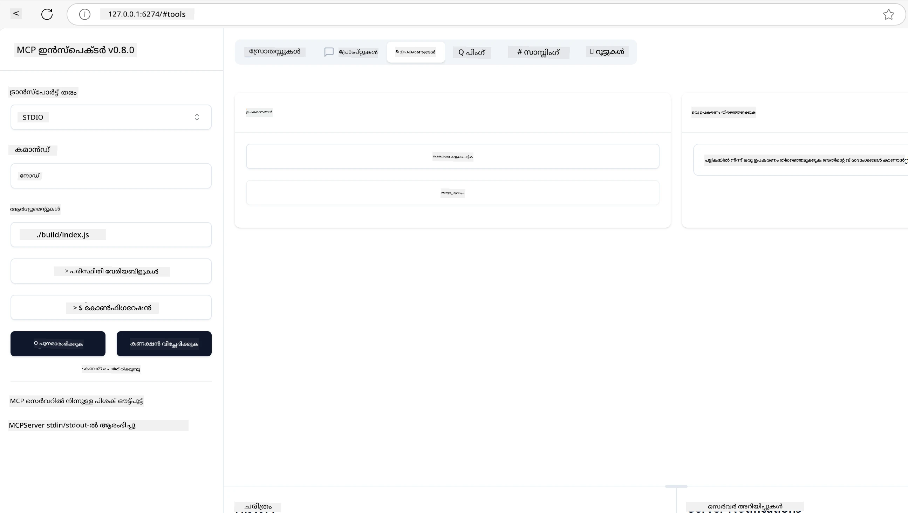
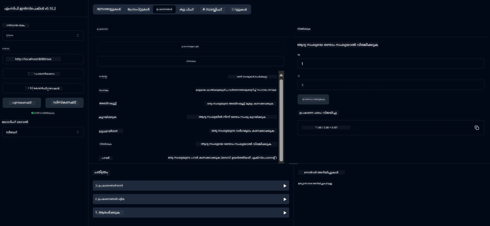
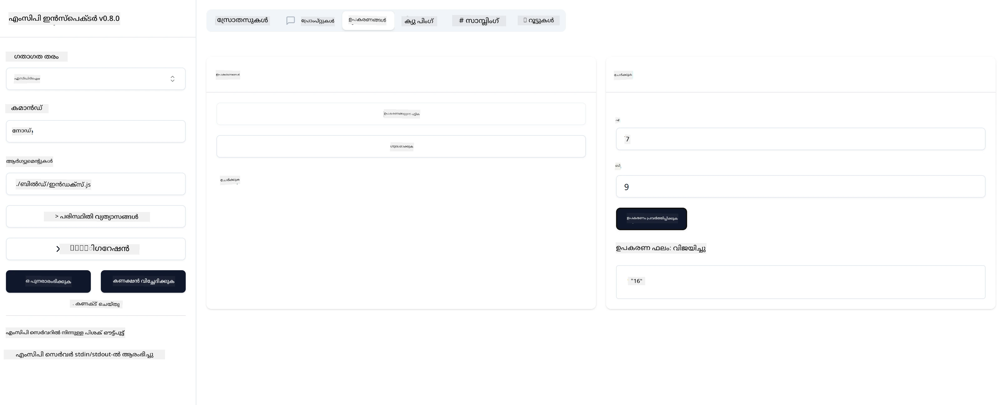

# MCP ഉപയോഗിച്ച് തുടങ്ങുന്നത്

> [!NOTE]
> ഈ പാഠത്തിലെ ജാവ HTTP ഉദാഹരണം പാരമ്പര്യമായ HTTP+SSE ട്രാൻസ്പോർട്ട് ഉപയോഗിക്കുന്നു, MCP `2025-11-25` യുമായി പൊരുത്തപ്പെടുന്ന SDK ലക്ഷ്യമിടുന്നു. പുതിയ റിമോട്ട് സെർവറുകൾക്കായി, `2026-07-28` Streamable HTTP ട്രാൻസ്പോർട്ട് ഉപയോഗിക്കുകയും നിങ്ങളുടെ SDKയിൽ പിന്തുണ പരിശോധിക്കുകയും ചെയ്യുക.


## അവലോകനം

ഈ പാഠം MCP അന്തരീക്ഷങ്ങൾ സജ്ജമാക്കാനുമുടക്ക MCP ആദ്യ ആപ്പുകൾ നിർമ്മിക്കാനുമുള്ള വ്യക്തമാക്കുന്ന മാർഗ്ഗനിർദ്ദേശങ്ങൾ നൽകുന്നു. ആവശ്യമായ ഉപകരണങ്ങളും ഫ്രെയിംവർക്കുകളും സജ്ജമാക്കാൻ, അടിസ്ഥാന MCP സെർവറുകൾ നിർമ്മിക്കാൻ, ഹോസ്റ്റ് ആപ്പുകൾ സൃഷ്ടിക്കാൻ, നിങ്ങളുടെ ആംപ്ലിമെന്റേഷനുകൾ പരിശോധിക്കാനുമുള്ള വിദ്യകൾ നിങ്ങളറിയും.

Model Context Protocol (MCP) ഒരു തുറഞ്ഞ പ്രോട്ടോക്കോൾ ആണ്, ഇത് LLMs (വലിയ ഭാഷാ മോഡലുകൾ) പ്രദീപ്തിയ്ക്കുവാൻ ആപ്ലിക്കേഷനുകൾ എങ്ങനെ കോൺടെക്സ്റ്റ് നൽകുന്നതെങ്ങനെ സ്റ്റാൻഡർഡൈസുചെയ്യുന്നു. MCP നെ AI അപ്ലിക്കേഷനുകൾക്കുള്ള USB-C പോർട്ട് എന്ന് കാണാം - ഇത് AI മോഡലുകൾ വിവിധ ഡേറ്റ ഉറവിടങ്ങൾക്കും ഉപകരണങ്ങൾക്കും ബന്ധിപ്പിക്കാൻ സ്റ്റാൻഡർഡ്ഡ് മാർഗം നൽകുന്നു.

## പഠന ലക്ഷ്യങ്ങൾ

ഈ പാഠം അവസാനിപ്പിക്കുമ്പോൾ, നിങ്ങൾക്ക് സാധിക്കുമെന്ന്:

- C#, ജാവ, പൈത്തൺ, ടൈപ്‌സ്‌ക്രിപ്റ്റ്, റസ്റ്റ് എന്നിവയിൽ MCP വികസന അന്തരീക്ഷങ്ങൾ സജ്ജമാക്കുക
- ഇഷ്ടാനുസൃത പ്രത്യേകതകളോടുകൂടിയ (വനരേഷുകൾ, പ്രോംപ്റ്റുകൾ, ഉപകരണങ്ങൾ) അടിസ്ഥാന MCP സെർവറുകൾ നിർമ്മിച്ച് വിന്യസിക്കുക
- MCP സെർവറുകളുമായി ബന്ധിപ്പിക്കുന്ന ഹോസ്റ്റ് ആപ്പുകൾ സൃഷ്ടിക്കുക
- MCP നടപ്പാക്കലുകൾ പരിശോധിക്കുകയും ഡീബഗ് ചെയ്യുകയും ചെയ്യുക

## നിങ്ങളുടെ MCP അന്തരീക്ഷം സജ്ജമാക്കുന്നു

MCP ഉപയോഗിച്ച് ജോലി തുടങ്ങുന്നതിനുമുമ്പ്, നിങ്ങളുടെ വികസന അന്തരീക്ഷം തയ്യാറാക്കുക, അടിസ്ഥാന വർക്‌ഫ്ലോ മനസ്സിലാക്കുക അത്യന്താപേക്ഷിതമാണ്. MCP സഹജമായ തുടക്കത്തിനായി തുടക്ക സജ്ജീകരണ ഘട്ടങ്ങൾ ഈ വിഭാഗത്തിൽ നിങ്ങളെ സഹായിക്കും.

### മുൻകൂട്ടി തയ്യാറെടുപ്പുകൾ

MCP വികസനത്തിൽ മുക്കാലായി:

- **വികസന അന്തരീക്ഷം**: നിങ്ങളുടെ തെരഞ്ഞെടുക്കപ്പെട്ട ഭാഷ (C#, ജാവ, പൈത്തൺ, ടൈപ്‌സ്‌ക്രിപ്റ്റ്, അല്ലെങ്കിൽ റസ്റ്റ്)
- **IDE/എഡിറ്റർ**: Visual Studio, Visual Studio Code, IntelliJ, Eclipse, PyCharm, അല്ലെങ്കിൽ ഏതെങ്കിലും ആധുനിക കോഡ് എഡിറ്റർ
- **പാക്കേജ് മാനേജർമാർ**: NuGet, Maven/Gradle, pip, npm/yarn, അല്ലെങ്കിൽ Cargo
- **API കീകൾ**: നിങ്ങൾ ഏത് AI സേവനങ്ങൾ നിങ്ങളുടെ ഹോസ്റ്റ് ആപ്പുകളിൽ ഉപയോഗിക്കാനും ആഗ്രഹിക്കുന്നുവോ അതിനായുള്ള

## അടിസ്ഥാന MCP സെർവർ ഘടന

ഒരു MCP സെർവർ സാധാരണയായി ഉൾക്കൊള്ളുന്നത്:

- **സെർവർ കോൺഫിഗറേഷൻ**: പോർട്ട്, ഒത്തിരിപ്പ്, മറ്റ് ക്രമീകരണങ്ങൾ സജ്ജമാക്കൽ
- **വനരേഷുകൾ**: LLMs ഉപയോഗിക്കാൻ ലഭ്യമായ ഡാറ്റയും കോൺടെക്സ്റ്റും
- **ഉപകരണങ്ങൾ**: മോഡലുകൾ വിളിക്കാവുന്ന പ്രവർത്തനങ്ങൾ
- **പ്രോംപ്റ്റുകൾ**: വാചകം സൃഷ്ടിക്കാൻ അല്ലെങ്കിൽ ഘടിതമാക്കാൻ ആകുന്ന ടെംപ്ലേറ്റുകൾ

ടൈപ്‌സ്‌ക്രിപ്റ്റിൽ ലളിതമായ ഒരു ഉദാഹരണം ഇവിടെ:

```typescript
import { McpServer, ResourceTemplate } from "@modelcontextprotocol/sdk/server/mcp.js";
import { StdioServerTransport } from "@modelcontextprotocol/sdk/server/stdio.js";
import { z } from "zod";

// ഒരു MCP സർവർ സൃഷ്ടിക്കുക
const server = new McpServer({
  name: "Demo",
  version: "1.0.0"
});

// ഒരു കൂട്ടിച്ചേർക്കൽ ഉപകരണം ചേർക്കുക
server.tool("add",
  { a: z.number(), b: z.number() },
  async ({ a, b }) => ({
    content: [{ type: "text", text: String(a + b) }]
  })
);

// ഒരു ഡൈനാമിക് അഭിവാദക സ്രോതസ്സ് ചേർക്കുക
server.resource(
  "file",
  // 'list' പാരാമീറ്റർ സ്രോതസ്സ് ലഭ്യമായ ഫയലുകൾ എങ്ങനെ ലിസ്റ്റ് ചെയ്യുമെന്ന് നിയന്ത്രിക്കുന്നു. അതിനെ നിർവചിക്കാത്തതായി (undefined) സജ്ജമാക്കുന്നത് ഈ സ്രോതസ്സിനുള്ള ലിസ്റ്റിംഗ് നിർത്തുന്നു.
  new ResourceTemplate("file://{path}", { list: undefined }),
  async (uri, { path }) => ({
    contents: [{
      uri: uri.href,
      text: `File, ${path}!`
    }]
  })
);

// ഫയൽ ഉള്ളടക്കം വായിക്കുന്ന ഫയൽ സ്രോതസ്സ് ചേർക്കുക
server.resource(
  "file",
  new ResourceTemplate("file://{path}", { list: undefined }),
  async (uri, { path }) => {
    let text;
    try {
      text = await fs.readFile(path, "utf8");
    } catch (err) {
      text = `Error reading file: ${err.message}`;
    }
    return {
      contents: [{
        uri: uri.href,
        text
      }]
    };
  }
);

server.prompt(
  "review-code",
  { code: z.string() },
  ({ code }) => ({
    messages: [{
      role: "user",
      content: {
        type: "text",
        text: `Please review this code:\n\n${code}`
      }
    }]
  })
);

// stdin-ൽ സന്ദേശങ്ങൾ സ്വീകരിക്കുകയും stdout-ൽ സന്ദേശങ്ങൾ അയയ്ക്കുകയും ആരംഭിക്കുക
const transport = new StdioServerTransport();
await server.connect(transport);
```

മുകളിൽ നൽകിയ കോഡിൽ:

- MCP ടൈപ്‌സ്‌ക്രിപ്റ്റ് SDK യിൽ നിന്നുള്ള ആവശ്യ വിവരണങ്ങൾ ഇറക്കുമതി ചെയ്തു.
- പുതിയ MCP സെർവർ ഒരു ഇൻസ്റ്റൻസ് സൃഷ്ടിച്ച് ക്രമീകരിച്ചു.
- ഒരു ഇഷ്ടാനുസൃത ഉപകരണം (`calculator`) ഹാൻഡ്ലർ ഫങ്ഷനായോടെ രജിസ്റ്റർ ചെയ്തു.
- സെർവർ ആരംഭിച്ച് വരവിരക്കുന്ന MCP അഭ്യർത്ഥനകൾ കേൾക്കാൻ തുടങ്ങിയെടുത്തു.

## പരിശോധനയും ഡീബഗും

നിങ്ങളുടെ MCP സെർവർ പരിശോധിക്കാൻ തുടങ്ങുന്നതിനു മുൻപ്, ലഭ്യമായ ഉപകരണങ്ങളും ഡീബഗിനുള്ള മികച്ച മാർഗങ്ങളും മനസ്സിലാക്കുന്നത് പ്രധാനമാണ്. ഫലപ്രദമായ പരിശോധന നിങ്ങളുടെ സെർവർ പ്രതീക്ഷിച്ചതുപോലെ പ്രവർത്തിക്കുന്നുവെന്ന് ഉറപ്പുവരുത്തുകയും പ്രശ്നങ്ങൾ കണ്ടെത്തി പരിഹരിക്കാൻ സഹായിക്കുകയും ചെയ്യും. താഴെ MCP നടപ്പാക്കൽ പരിശോധിക്കുന്നതിന് ശുപാർശചെയ്യുന്ന സമീപനങ്ങൾ വിശദീകരിക്കുന്നു.

MCP നിങ്ങൾക്ക് നിങ്ങളുടെ സെർവറുകൾ പരിശോധിക്കാൻ, ഡീബഗ് ചെയ്യാൻ ഉപകരണങ്ങൾ നൽകുന്നു:

- **ഇൻസ്പക്ടർ ടൂൾ**, ഈ ഗ്രാഫിക്കൽ ഇന്റർഫേസ് നിങ്ങളുടെ സെർവറുമായി ബന്ധിപ്പിച്ച് ഉപകരണങ്ങൾ, പ്രോംപ്റ്റുകൾ, വനരേഷികൾ പരിശോധിക്കാൻ സഹായിക്കുന്നു.
- **കർൾ** (curl), നിങ്ങൾ കമാൻഡ് ലൈനിൽ നിന്നും curl പോലുള്ള ഉപകരണങ്ങൾ അല്ലെങ്കിൽ HTTP കമാൻഡുകൾ സൃഷ്ടിക്കുന്ന മറ്റ് ക്ലയന്റുകളും ഉപയോഗിച്ച് സെർവറുമായി ബന്ധിപ്പിക്കാം.

### MCP ഇൻസ്പക്ടർ ഉപയോഗിച്ച്

[MCP ഇൻസ്പക്ടർ](https://github.com/modelcontextprotocol/inspector) ഒരു ദൃശ്യപരിശോധന ഉപകരണമാണ്, ഇത് നിങ്ങളെ സഹായിക്കുന്നു:

1. **സെർവർ കഴിവുകൾ കണ്ടെത്തുക**: ലഭ്യമായ വനരേഷികൾ, ഉപകരണങ്ങൾ, പ്രോംപ്റ്റുകൾ സ്വയം കണ്ടെത്തുക
2. **ഉപകരണം പ്രവർത്തനം പരിശോധന**: വ്യത്യസ്ത പാർമേട്ടറുകൾ പരീക്ഷിച്ച് നേരിട്ടു പ്രതികരണങ്ങൾ കാണുക
3. **സെർവർ മെറ്റാഡേറ്റ കാണുക**: സെർവർ വിവരങ്ങൾ, സ്കീമാസുകൾ, ക്രമീകരണങ്ങൾ പരിശോധിക്കുക

```bash
# ഉദാഹരണത്തിന് TypeScript, MCP ഇൻസ്പെക്ടറെ ഇൻസ്റ്റാൾ ചെയ്ത് പ്രവർത്തിപ്പിക്കുന്നത്
npx @modelcontextprotocol/inspector node build/index.js
```

മുകളിൽ ചേർത്ത കമാൻഡുകൾ പ്രവർത്തിപ്പിക്കുമ്പോൾ, MCP ഇൻസ്പക്ടർ നിങ്ങളുടെ ബ്രൗസറിൽ ഒരു ലോക്കൽ വെബ് ഇന്റർഫേസ് ആരംഭിക്കും. രജിസ്റ്റർ ചെയ്ത MCP സെർവർ, അവയുടെ ലഭ്യമായ ഉപകരണങ്ങൾ, വനരേഷികൾ, പ്രോംപ്റ്റുകൾ ഡാഷ്ബോർഡിൽ കാണാം. ഈ ഇന്റർഫേസ് ഉപകരണ പരീക്ഷണം, സെർവർ മെറ്റാഡേറ്റ പരിശോധന, യഥാർത്ഥ സമയ പ്രതികരണങ്ങൾ കാണുന്നതിനും സഹായിക്കുന്നു, MCP സെർവർ നടപ്പാക്കലുകൾ സാധുവാക്കാനും ഡീബഗ് ചെയ്യാനും എളുപ്പമാക്കുന്നു.

ഇതു പോലെ ഒരു സ്ക്രീൻഷോട്ട് ഇതാ:



## പതിവ് സജ്ജീകരണ പ്രശ്‌നങ്ങൾക്കും പരിഹാരങ്ങളും

| പ്രശ്നം | സാധ്യതാ പരിഹാരം |
|-------|-------------------|
| കണക്ഷൻ നിഷേധിച്ചു | സെർവർ പ്രവർത്തിക്കുന്നോ പോർട്ട് ശരിയാണോ പരിശോധിക്കുക |
| ഉപകരണ പ്രവർത്തന പിശക് | പാർമേട്ടർ പരിശോധനയും പിശക് കൈകാര്യം ചെയ്യലും പരിശോധിക്കുക |
| ഒത്തിരിപ്പ് പരാജയം | API കീകൾ, അനുമതികൾ സ്ഥിരീകരിക്കുക |
| സ്കീമ പരിശോധന പിശക് | നിർവചിച്ച സ്കീമയുമായി പാർമേട്ടറുകൾ പൊരുത്തപ്പെടുന്നതിൽ ഉറപ്പുവരുത്തുക |
| സെർവർ ആരംഭിക്കുന്നില്ല | പോർട്ട് കൂട്ടിയിടിപ്പുകൾ, ആവശ്യമായ ആശ്രിതങ്ങൾ പരിശോധിക്കുക |
| CORS പിശക് | ക്രോസ്-ഓറിയിൻ അഭ്യർത്ഥനകൾക്കായി ശരിയായ CORS ഹെഡറുകൾ ക്രമീകരിക്കുക |
| ഒത്തിരിപ്പ് പ്രശ്‌നങ്ങൾ | ടോക്കൻ സാധുതയും അനുമതികളും പരിശോധിക്കുക |

## ലോക്കൽ വികസനം

ലോക്കൽ വികസനത്തിനും പരിശോധനക്കുമായി, നിങ്ങൾക്ക് നേരിട്ട് നിങ്ങളുടെ മെഷീനിൽ MCP സെർവറുകൾ പ്രവർത്തിപ്പിക്കാൻ കഴിയും:

1. **സെർവർ പ്രക്രിയ ആരംഭിക്കുക**: നിങ്ങളുടെ MCP സെർവർ ആപ്പ് പ്രവർത്തിപ്പിക്കുക
2. **നെറ്റ്വർക്കിംഗ് ക്രമീകരിക്കുക**: സെർവർ പ്രതീക്ഷിച്ച പോർട്ടിൽ എത്തിക്കാമെന്ന് ഉറപ്പാക്കുക
3. **ക്ലയന്റുകൾ ബന്ധിപ്പിക്കുക**: `http://localhost:3000` പോലുള്ള ലോക്കൽ കണക്ഷൻ URL കളിൽ ക്ലയന്റുകൾ ഉപയോഗിക്കുക

```bash
# ഉദാഹരണം: TypeScript MCP സർവർ ലോക്കലായി പ്രവർത്തിക്കുന്നത്
npm run start
# സർവർ http://localhost:3000 ൽ പ്രവർത്തിച്ചുകൊണ്ടിരിക്കുന്നു
```

## നിങ്ങളുടെ ആദ്യ MCP സെർവർ നിർമ്മിക്കുന്നു

നാം മുമ്പത്തെ പാഠത്തിൽ [കോർ ആശയങ്ങൾ](../../01-CoreConcepts/README.md) മറുപടി ചർച്ച ചെയ്തു, ഇപ്പോൾ ആ അറിവ് ഉപയോഗിക്കാൻ സമയം ആണ്.

### ഒരു സെർവർ എന്ത് ചെയ്യാൻ കഴിയും

കോഡ് എഴുതുന്നത് തുടങ്ങുന്നതിനു മുൻപ്, ഒരു സെർവർ എന്ത് ചെയ്യാൻ കഴിയും എന്ന് ഓർമ്മിപ്പിക്കാം:

ഒരു MCP സെർവർ ഉദാഹരണമായി:

- ലോക്കൽ ഫയലുകൾക്കും ഡേറ്റാബേസുകൾക്കും ആക്‌സസ്
- റിമോട്ട് API കളുമായി ബന്ധപ്പെടുക
- കണക്കുകൂട്ടലുകൾ നിർവ്വഹിക്കുക
- മറ്റ് ഉപകരണങ്ങളുമായും സേവനങ്ങളുമായും സംയോജിപ്പിക്കുക
- ഇന്ററാക്ഷനിനായി ഉപയോക്തൃ ഇന്റർഫേസ് നൽകുക

വളരെ നന്നായി, ഇനി നമ്മൾ സ്വയം എന്തു ചെയ്യാൻ കഴിയും എന്ന് അറിയുമ്പോൾ, കോഡ് എഴുതി തുടങ്ങാം.

## വ്യായാമം: ഒരു സെർവർ സൃഷ്ടിക്കുന്നു

ഒരു സെർവർ സൃഷ്ടിക്കാൻ നിങ്ങൾ വേണ്ട നടപടികൾ ഇതാണ്:

- MCP SDK ഇൻസ്റ്റാൾ ചെയ്യുക.
- ഒരു പ്രോജക്‌ട് സൃഷ്ടിച്ച് പ്രോജക്‌ട് ഘടന സജ്ജമാക്കുക.
- സെർവർ കോഡ് എഴുതുക.
- സെർവർ പരിശോധിക്കുക.

### -1- പ്രോജക്ട് സൃഷ്ടിക്കുക

#### ടൈപ്‌സ്‌ക്രിപ്റ്റ്

```sh
# പ്രോജക്റ്റ് ഡയറക്ടറി സൃഷ്ടിച്ച് npm പ്രോജക്റ്റ് ആരംഭിക്കുക
mkdir calculator-server
cd calculator-server
npm init -y
```

#### പൈത്തൺ

```sh
# പ്രോജക്ട് ഡയറക്ടറി സൃഷ്ടിക്കുക
mkdir calculator-server
cd calculator-server
# ഫോൾഡർ വിസ്വല്‍ സ്റ്റുഡിയോ കോഡിൽ തുറക്കുക - നിങ്ങൾ ഭിന്നമായ ഐ.ഡി.എ. ഉപയോഗിക്കുന്നുവെങ്കിൽ ഇത് ഒഴിവാക്കുക
code .
```

#### .NET

```sh
dotnet new console -n McpCalculatorServer
cd McpCalculatorServer
```

#### ജാവ

ജാവയ്ക്കായി, ഒരു സ്പ്രിംഗ് ബൂട്ട് പ്രോജക്ട് സൃഷ്ടിക്കുക:

```bash
curl https://start.spring.io/starter.zip \
  -d dependencies=web \
  -d javaVersion=21 \
  -d type=maven-project \
  -d groupId=com.example \
  -d artifactId=calculator-server \
  -d name=McpServer \
  -d packageName=com.microsoft.mcp.sample.server \
  -o calculator-server.zip
```


zip ഫയൽ എക്സ്ട്രാക്റ്റ് ചെയ്യുക:

```bash
unzip calculator-server.zip -d calculator-server
cd calculator-server
# ഓപ്ഷണൽ ഉപയോഗിക്കുന്നില്ലാത്ത ടെസ്റ്റ് നീക്കം ചെയ്യുക
rm -rf src/test/java
```

താഴെ കൊടുത്തിരിക്കുന്ന പൂർണ്ണ കോൺഫിഗറേഷൻ നിങ്ങളുടെ *pom.xml* ഫയലിൽ ചേർക്കുക:

```xml
<?xml version="1.0" encoding="UTF-8"?>
<project xmlns="http://maven.apache.org/POM/4.0.0"
    xmlns:xsi="http://www.w3.org/2001/XMLSchema-instance"
    xsi:schemaLocation="http://maven.apache.org/POM/4.0.0 http://maven.apache.org/xsd/maven-4.0.0.xsd">
    <modelVersion>4.0.0</modelVersion>
    
    <!-- Spring Boot parent for dependency management -->
    <parent>
        <groupId>org.springframework.boot</groupId>
        <artifactId>spring-boot-starter-parent</artifactId>
        <version>3.5.0</version>
        <relativePath />
    </parent>

    <!-- Project coordinates -->
    <groupId>com.example</groupId>
    <artifactId>calculator-server</artifactId>
    <version>0.0.1-SNAPSHOT</version>
    <name>Calculator Server</name>
    <description>Basic calculator MCP service for beginners</description>

    <!-- Properties -->
    <properties>
        <java.version>21</java.version>
        <maven.compiler.source>21</maven.compiler.source>
        <maven.compiler.target>21</maven.compiler.target>
    </properties>

    <!-- Spring AI BOM for version management -->
    <dependencyManagement>
        <dependencies>
            <dependency>
                <groupId>org.springframework.ai</groupId>
                <artifactId>spring-ai-bom</artifactId>
                <version>1.0.0-SNAPSHOT</version>
                <type>pom</type>
                <scope>import</scope>
            </dependency>
        </dependencies>
    </dependencyManagement>

    <!-- Dependencies -->
    <dependencies>
        <dependency>
            <groupId>org.springframework.ai</groupId>
            <artifactId>spring-ai-starter-mcp-server-webflux</artifactId>
        </dependency>
        <dependency>
            <groupId>org.springframework.boot</groupId>
            <artifactId>spring-boot-starter-actuator</artifactId>
        </dependency>
        <dependency>
         <groupId>org.springframework.boot</groupId>
         <artifactId>spring-boot-starter-test</artifactId>
         <scope>test</scope>
      </dependency>
    </dependencies>

    <!-- Build configuration -->
    <build>
        <plugins>
            <plugin>
                <groupId>org.springframework.boot</groupId>
                <artifactId>spring-boot-maven-plugin</artifactId>
            </plugin>
            <plugin>
                <groupId>org.apache.maven.plugins</groupId>
                <artifactId>maven-compiler-plugin</artifactId>
                <configuration>
                    <release>21</release>
                </configuration>
            </plugin>
        </plugins>
    </build>

    <!-- Repositories for Spring AI snapshots -->
    <repositories>
        <repository>
            <id>spring-milestones</id>
            <name>Spring Milestones</name>
            <url>https://repo.spring.io/milestone</url>
            <snapshots>
                <enabled>false</enabled>
            </snapshots>
        </repository>
        <repository>
            <id>spring-snapshots</id>
            <name>Spring Snapshots</name>
            <url>https://repo.spring.io/snapshot</url>
            <releases>
                <enabled>false</enabled>
            </releases>
        </repository>
    </repositories>
</project>
```

#### റസ്റ്റ്

```sh
mkdir calculator-server
cd calculator-server
cargo init
```

### -2- ആശ്രിതത്വങ്ങൾ ചേർക്കുക

ഇപ്പോൾ നിങ്ങളുടെ പ്രോജക്ട് സൃഷ്ടിച്ചതിനുശേഷം, അടുത്തതായി ആശ്രിതത്വങ്ങൾ ചേർക്കാം:

#### ടൈപ്പ്‌സ്‌ക്രിപ്റ്റ്

```sh
# ഇതിനകം ഇൻസ്റ്റാൾ ചെയ്തിട്ടില്ലെങ്കിൽ, TypeScript ഗ്ലോബലായി ഇൻസ്റ്റാൾ ചെയ്യുക
npm install typescript -g

# MCP SDKയും സ്‌കീമ പരിശോധനയ്ക്കായി Zod-ഉം ഇൻസ്റ്റാൾ ചെയ്യുക
npm install @modelcontextprotocol/sdk zod
npm install -D @types/node typescript
```

#### പൈതൺ

```sh
# ഒരു വെർച്വൽ എൻവയോൺമെന്റ് സൃഷ്ടിച്ച് അവശ്യങ്ങൾ ഇൻസ്റ്റാൾ ചെയ്യുക
python -m venv venv
venv\Scripts\activate
pip install "mcp[cli]"
```

#### ജാവ

```bash
cd calculator-server
./mvnw clean install -DskipTests
```

#### റസ്റ്റ്

```sh
cargo add rmcp --features server,transport-io
cargo add serde
cargo add tokio --features rt-multi-thread
```

### -3- പ്രോജക്ട് ഫയലുകൾ സൃഷ്ടിക്കുക

#### ടൈപ്പ്‌സ്‌ക്രിപ്റ്റ്

*package.json* ഫയൽ തുറന്ന് താഴെ കൊടുത്തിരിക്കുന്ന ഉള്ളടക്കത്തിലേക്ക് മാറ്റുക, ഇതുവഴി സെർവർ നിർമ്മിച്ച് റൺ ചെയ്യാൻ കഴിയും:

```json
{
  "name": "calculator-server",
  "version": "1.0.0",
  "main": "index.js",
  "type": "module",
  "scripts": {
    "build": "tsc",
    "start": "npm run build && node ./build/index.js",
  },
  "keywords": [],
  "author": "",
  "license": "ISC",
  "description": "A simple calculator server using Model Context Protocol",
  "dependencies": {
    "@modelcontextprotocol/sdk": "^1.16.0",
    "zod": "^3.25.76"
  },
  "devDependencies": {
    "@types/node": "^24.0.14",
    "typescript": "^5.8.3"
  }
}
```

*tsconfig.json* എന്ന ഫയൽ താഴെ കൊടുത്തിരിക്കുന്ന ഉള്ളടക്കത്തോടെ സൃഷ്ടിക്കുക:

```json
{
  "compilerOptions": {
    "target": "ES2022",
    "module": "Node16",
    "moduleResolution": "Node16",
    "outDir": "./build",
    "rootDir": "./src",
    "strict": true,
    "esModuleInterop": true,
    "skipLibCheck": true,
    "forceConsistentCasingInFileNames": true
  },
  "include": ["src/**/*"],
  "exclude": ["node_modules"]
}
```

നിങ്ങളുടെ സോഴ്‌സ് കോഡ്‌ക്കായി ഒരു ഡയറക്റ്ററി സൃഷ്ടിക്കുക:

```sh
mkdir src
touch src/index.ts
```

#### പൈതൺ

*server.py* എന്ന ഫയൽ സൃഷ്ടിക്കുക

```sh
touch server.py
```

#### .NET

ആവശ്യമായ NuGet പാക്കേജുകൾ ഇൻസ്റ്റാൾ ചെയ്യുക:

```sh
dotnet add package ModelContextProtocol --prerelease
dotnet add package Microsoft.Extensions.Hosting
```

#### ജാവ

ജാവ സ്പ്രിംഗ് ബൂട്ട് പ്രോജക്ടുകൾക്കായി, പ്രോജക്ട് സ്ട്രക്ചർ സ്വാഭാവികമായി സൃഷ്ടിക്കപ്പെടും.

#### റസ്റ്റ്

റസ്റ്റിനായി, `cargo init` പ്രവർത്തിപ്പിച്ചപ്പോൾ സ്വതഃസിദ്ധമായി *src/main.rs* ഫയൽ സൃഷ്ടിക്കപ്പെടും. ഫയൽ തുറന്ന് ഡിഫാൽട്ട് കോഡ് നീക്കംചെയ്യുക.

### -4- സെർവർ കോഡ് സൃഷ്ടിക്കുക

#### ടൈപ്പ്‌സ്‌ക്രിപ്റ്റ്

*index.ts* എന്ന ഫയൽ സൃഷ്ടിച്ച് താഴെ കാണിക്കുന്ന കോഡ് ചേര്‍ക്കുക:

```typescript
import { McpServer, ResourceTemplate } from "@modelcontextprotocol/sdk/server/mcp.js";
import { StdioServerTransport } from "@modelcontextprotocol/sdk/server/stdio.js";
import { z } from "zod";
 
// ഒരു MCP സെർവർ സൃഷ്ടിക്കുക
const server = new McpServer({
  name: "Calculator MCP Server",
  version: "1.0.0"
});
```

ഇപ്പോൾ നിങ്ങൾക്ക് ഒരു സെർവർ ഉണ്ടെങ്കിലും അത് വളരെ കാര്യങ്ങൾ ചെയ്യാറില്ല, അത് ശരിയാക്കാം.

#### പൈതൺ

```python
# server.py
from mcp.server.fastmcp import FastMCP

# ഒരു MCP സെർവർ സൃഷ്ടിക്കുക
mcp = FastMCP("Demo")
```

#### .NET

```csharp
using Microsoft.Extensions.DependencyInjection;
using Microsoft.Extensions.Hosting;
using Microsoft.Extensions.Logging;
using ModelContextProtocol.Server;
using System.ComponentModel;

var builder = Host.CreateApplicationBuilder(args);
builder.Logging.AddConsole(consoleLogOptions =>
{
    // Configure all logs to go to stderr
    consoleLogOptions.LogToStandardErrorThreshold = LogLevel.Trace;
});

builder.Services
    .AddMcpServer()
    .WithStdioServerTransport()
    .WithToolsFromAssembly();
await builder.Build().RunAsync();

// add features
```

#### ജാവ

ജാവയിൽ, കോർ സെർവർ ഘടകങ്ങൾ സൃഷ്ടിക്കുക. ആദ്യം, പ്രധാന അപ്ലിക്കേഷൻ ക്ലാസ് മാറ്റുക:

*src/main/java/com/microsoft/mcp/sample/server/McpServerApplication.java*:

```java
package com.microsoft.mcp.sample.server;

import org.springframework.ai.tool.ToolCallbackProvider;
import org.springframework.ai.tool.method.MethodToolCallbackProvider;
import org.springframework.boot.SpringApplication;
import org.springframework.boot.autoconfigure.SpringBootApplication;
import org.springframework.context.annotation.Bean;
import com.microsoft.mcp.sample.server.service.CalculatorService;

@SpringBootApplication
public class McpServerApplication {

    public static void main(String[] args) {
        SpringApplication.run(McpServerApplication.class, args);
    }
    
    @Bean
    public ToolCallbackProvider calculatorTools(CalculatorService calculator) {
        return MethodToolCallbackProvider.builder().toolObjects(calculator).build();
    }
}
```

കാൽക്കുലേറ്റർ സർവീസ് സൃഷ്ടിക്കുക *src/main/java/com/microsoft/mcp/sample/server/service/CalculatorService.java*:

```java
package com.microsoft.mcp.sample.server.service;

import org.springframework.ai.tool.annotation.Tool;
import org.springframework.stereotype.Service;

/**
 * Service for basic calculator operations.
 * This service provides simple calculator functionality through MCP.
 */
@Service
public class CalculatorService {

    /**
     * Add two numbers
     * @param a The first number
     * @param b The second number
     * @return The sum of the two numbers
     */
    @Tool(description = "Add two numbers together")
    public String add(double a, double b) {
        double result = a + b;
        return formatResult(a, "+", b, result);
    }

    /**
     * Subtract one number from another
     * @param a The number to subtract from
     * @param b The number to subtract
     * @return The result of the subtraction
     */
    @Tool(description = "Subtract the second number from the first number")
    public String subtract(double a, double b) {
        double result = a - b;
        return formatResult(a, "-", b, result);
    }

    /**
     * Multiply two numbers
     * @param a The first number
     * @param b The second number
     * @return The product of the two numbers
     */
    @Tool(description = "Multiply two numbers together")
    public String multiply(double a, double b) {
        double result = a * b;
        return formatResult(a, "*", b, result);
    }

    /**
     * Divide one number by another
     * @param a The numerator
     * @param b The denominator
     * @return The result of the division
     */
    @Tool(description = "Divide the first number by the second number")
    public String divide(double a, double b) {
        if (b == 0) {
            return "Error: Cannot divide by zero";
        }
        double result = a / b;
        return formatResult(a, "/", b, result);
    }

    /**
     * Calculate the power of a number
     * @param base The base number
     * @param exponent The exponent
     * @return The result of raising the base to the exponent
     */
    @Tool(description = "Calculate the power of a number (base raised to an exponent)")
    public String power(double base, double exponent) {
        double result = Math.pow(base, exponent);
        return formatResult(base, "^", exponent, result);
    }

    /**
     * Calculate the square root of a number
     * @param number The number to find the square root of
     * @return The square root of the number
     */
    @Tool(description = "Calculate the square root of a number")
    public String squareRoot(double number) {
        if (number < 0) {
            return "Error: Cannot calculate square root of a negative number";
        }
        double result = Math.sqrt(number);
        return String.format("√%.2f = %.2f", number, result);
    }

    /**
     * Calculate the modulus (remainder) of division
     * @param a The dividend
     * @param b The divisor
     * @return The remainder of the division
     */
    @Tool(description = "Calculate the remainder when one number is divided by another")
    public String modulus(double a, double b) {
        if (b == 0) {
            return "Error: Cannot divide by zero";
        }
        double result = a % b;
        return formatResult(a, "%", b, result);
    }

    /**
     * Calculate the absolute value of a number
     * @param number The number to find the absolute value of
     * @return The absolute value of the number
     */
    @Tool(description = "Calculate the absolute value of a number")
    public String absolute(double number) {
        double result = Math.abs(number);
        return String.format("|%.2f| = %.2f", number, result);
    }

    /**
     * Get help about available calculator operations
     * @return Information about available operations
     */
    @Tool(description = "Get help about available calculator operations")
    public String help() {
        return "Basic Calculator MCP Service\n\n" +
               "Available operations:\n" +
               "1. add(a, b) - Adds two numbers\n" +
               "2. subtract(a, b) - Subtracts the second number from the first\n" +
               "3. multiply(a, b) - Multiplies two numbers\n" +
               "4. divide(a, b) - Divides the first number by the second\n" +
               "5. power(base, exponent) - Raises a number to a power\n" +
               "6. squareRoot(number) - Calculates the square root\n" + 
               "7. modulus(a, b) - Calculates the remainder of division\n" +
               "8. absolute(number) - Calculates the absolute value\n\n" +
               "Example usage: add(5, 3) will return 5 + 3 = 8";
    }

    /**
     * Format the result of a calculation
     */
    private String formatResult(double a, String operator, double b, double result) {
        return String.format("%.2f %s %.2f = %.2f", a, operator, b, result);
    }
}
```

**ഉൽപ്പാദനത്തിന് റെഡി സർവീസിനുള്ള ऐच्छിക ഘടകങ്ങൾ:**

സ്റ്റാർടപ്പ് കോൺഫിഗറേഷൻ സൃഷ്ടിക്കുക *src/main/java/com/microsoft/mcp/sample/server/config/StartupConfig.java*:

```java
package com.microsoft.mcp.sample.server.config;

import org.springframework.boot.CommandLineRunner;
import org.springframework.context.annotation.Bean;
import org.springframework.context.annotation.Configuration;

@Configuration
public class StartupConfig {
    
    @Bean
    public CommandLineRunner startupInfo() {
        return args -> {
            System.out.println("\n" + "=".repeat(60));
            System.out.println("Calculator MCP Server is starting...");
            System.out.println("SSE endpoint: http://localhost:8080/sse");
            System.out.println("Health check: http://localhost:8080/actuator/health");
            System.out.println("=".repeat(60) + "\n");
        };
    }
}
```

ഹെൽത്ത് നിയന്ത്രകൻ സൃഷ്ടിക്കുക *src/main/java/com/microsoft/mcp/sample/server/controller/HealthController.java*:

```java
package com.microsoft.mcp.sample.server.controller;

import org.springframework.http.ResponseEntity;
import org.springframework.web.bind.annotation.GetMapping;
import org.springframework.web.bind.annotation.RestController;
import java.time.LocalDateTime;
import java.util.HashMap;
import java.util.Map;

@RestController
public class HealthController {
    
    @GetMapping("/health")
    public ResponseEntity<Map<String, Object>> healthCheck() {
        Map<String, Object> response = new HashMap<>();
        response.put("status", "UP");
        response.put("timestamp", LocalDateTime.now().toString());
        response.put("service", "Calculator MCP Server");
        return ResponseEntity.ok(response);
    }
}
```

ഒരു എക്‌സപ്ഷൻ ഹാൻഡ്ലർ സൃഷ്ടിക്കുക *src/main/java/com/microsoft/mcp/sample/server/exception/GlobalExceptionHandler.java*:

```java
package com.microsoft.mcp.sample.server.exception;

import org.springframework.http.HttpStatus;
import org.springframework.http.ResponseEntity;
import org.springframework.web.bind.annotation.ExceptionHandler;
import org.springframework.web.bind.annotation.RestControllerAdvice;

@RestControllerAdvice
public class GlobalExceptionHandler {

    @ExceptionHandler(IllegalArgumentException.class)
    public ResponseEntity<ErrorResponse> handleIllegalArgumentException(IllegalArgumentException ex) {
        ErrorResponse error = new ErrorResponse(
            "Invalid_Input", 
            "Invalid input parameter: " + ex.getMessage());
        return new ResponseEntity<>(error, HttpStatus.BAD_REQUEST);
    }

    public static class ErrorResponse {
        private String code;
        private String message;

        public ErrorResponse(String code, String message) {
            this.code = code;
            this.message = message;
        }

        // ഗെറ്ററുകൾ
        public String getCode() { return code; }
        public String getMessage() { return message; }
    }
}
```

ഒരു സ്വകാര്യമുള്ള ബാനർ സൃഷ്ടിക്കുക *src/main/resources/banner.txt*:

```text
_____      _            _       _             
 / ____|    | |          | |     | |            
| |     __ _| | ___ _   _| | __ _| |_ ___  _ __ 
| |    / _` | |/ __| | | | |/ _` | __/ _ \| '__|
| |___| (_| | | (__| |_| | | (_| | || (_) | |   
 \_____\__,_|_|\___|\__,_|_|\__,_|\__\___/|_|   
                                                
Calculator MCP Server v1.0
Spring Boot MCP Application
```

</details>

#### റസ്റ്റ്

*src/main.rs* ഫയലിന്റെ മുകളിലേക്ക് താഴെ കാണുന്ന കോഡ് ചേർക്കുക. ഇത് MCP സെർവറിനുള്ള ആവശ്യമായ ലൈബ്രറികളും മോഡ്യൂളുകളും ഇറക്കുമതി ചെയ്യും.

```rust
use rmcp::{
    handler::server::{router::tool::ToolRouter, tool::Parameters},
    model::{ServerCapabilities, ServerInfo},
    schemars, tool, tool_handler, tool_router,
    transport::stdio,
    ServerHandler, ServiceExt,
};
use std::error::Error;
```

കാൽക്കുലേറ്റർ സെർവർ വളരെ ലളിതമായതാണ്, രണ്ട് സംഖ്യകൾ കൂട്ടാൻ കഴിയും. കാൽക്കുലേറ്റർ അഭ്യർത്ഥനയെ പ്രതിനിധീകരിക്കുന്ന ഒരു struct സൃഷ്ടിക്കാം.

```rust
#[derive(Debug, serde::Deserialize, schemars::JsonSchema)]
pub struct CalculatorRequest {
    pub a: f64,
    pub b: f64,
}
```

തുടർന്ന്, കാൽക്കുലേറ്റർ സെർവറെ പ്രതിനിധീകരിക്കുന്ന struct സൃഷ്ടിക്കുക. ഈ struct ടൂൾ റൂട്ടറെ (tools രജിസ്റ്റർ ചെയ്യുന്നതിന്) കൈവശം വെയ്ക്കും.

```rust
#[derive(Debug, Clone)]
pub struct Calculator {
    tool_router: ToolRouter<Self>,
}
```

ഇപ്പോൾ, `Calculator` struct നവीनമാക്കുകയും സെർവർ വിവരങ്ങൾ നൽകുന്ന ഹാൻഡ്ലർ നടപ്പിലാക്കുകയും ചെയ്യാം.

```rust
#[tool_router]
impl Calculator {
    pub fn new() -> Self {
        Self {
            tool_router: Self::tool_router(),
        }
    }
}

#[tool_handler]
impl ServerHandler for Calculator {
    fn get_info(&self) -> ServerInfo {
        ServerInfo {
            instructions: Some("A simple calculator tool".into()),
            capabilities: ServerCapabilities::builder().enable_tools().build(),
            ..Default::default()
        }
    }
}
```

അവസാനം, സെർവർ ആരംഭിക്കാൻ പ്രധാന ഫങ്ഷൻ നടപ്പിലാക്കണം. ഈ ഫങ്ഷൻ `Calculator` struct ന്റെ ഒരു ഇൻസ്റ്റാൻസ് സൃഷ്ടിച്ച് വീതീകരിക്കാൻ സഹായിക്കും.

```rust
#[tokio::main]
async fn main() -> Result<(), Box<dyn Error>> {
    let service = Calculator::new().serve(stdio()).await?;
    service.waiting().await?;
    Ok(())
}
```

സെർവർ ഇപ്പോൾ അതിന്റെ അടിസ്ഥാന വിവരം നൽകാൻ സജ്ജമാണ്. അടുത്തതായി കൂട്ടിച്ചേർക്കൽ പ്രവർത്തനത്തിന് ഒരു ടൂൾ ചേർക്കാം.

### -5- ടൂൾ കൂടാതെ ഒരു റിസോഴ്സ് ചേർക്കൽ

ടൂൾ കൂടാതെ ഒരു റിസോഴ്സ് ചേർക്കാൻ താഴെ കാണിച്ചിരിക്കുന്ന കോഡ് ചേർക്കുക:

#### ടൈപ്പ്‌സ്‌ക്രിപ്റ്റ്

```typescript
server.tool(
  "add",
  { a: z.number(), b: z.number() },
  async ({ a, b }) => ({
    content: [{ type: "text", text: String(a + b) }]
  })
);

server.resource(
  "greeting",
  new ResourceTemplate("greeting://{name}", { list: undefined }),
  async (uri, { name }) => ({
    contents: [{
      uri: uri.href,
      text: `Hello, ${name}!`
    }]
  })
);
```

നിങ്ങളുടെ ടൂൾ പാരാമീറ്ററുകളായ `a`യും `b`യും വാങ്ങുന്നു, ആ ഫംഗ്ഷൻ ഒരു ജവാബ് രൂപത്തിൽ പ്രവർത്തിക്കുന്നു:

```typescript
{
  contents: [{
    type: "text", content: "some content"
  }]
}
```

നിങ്ങളുടെ റിസോഴ്സ് "greeting" എന്ന ഒരു സ്ട്രിങ്ങിലൂടെ ആക്സസ് ചെയ്യുന്നു, `name` എന്ന പാരാമിറ്റർ സ്വീകരിച്ച് ടൂളിനോട് സമാനമായ ഒരു ജവാബ് നിർമ്മിക്കുന്നു:

```typescript
{
  uri: "<href>",
  text: "a text"
}
```

#### പൈതൺ

```python
# ഒരു കൂട്ടിച്ചേർക്കൽ ഉപകരണം ചേർക്കുക
@mcp.tool()
def add(a: int, b: int) -> int:
    """Add two numbers"""
    return a + b


# ഒരു ഡൈനാമിക് വന്ദന വിഭവം ചേർക്കുക
@mcp.resource("greeting://{name}")
def get_greeting(name: str) -> str:
    """Get a personalized greeting"""
    return f"Hello, {name}!"
```

മുമ്പത്തെ കോഡിൽ ഞങ്ങൾ:

- പാരാമീറ്ററുകളായ `a`യും `b`യും ഉപയോഗിക്കുന്ന `add` എന്ന ടൂൾ നിർവ്വചിച്ചു, രണ്ട് ഇന്റിജറുകൾ.
- പാരാമീറ്റർ `name` സ്വീകരിക്കുന്ന `greeting` എന്നൊരു റിസോഴ്സ് സൃഷ്ടിച്ചു.

#### .NET

നിങ്ങളുടെ Program.cs ഫയലിൽ ഇത് ചേർക്കുക:

```csharp
[McpServerToolType]
public static class CalculatorTool
{
    [McpServerTool, Description("Adds two numbers")]
    public static string Add(int a, int b) => $"Sum {a + b}";
}
```

#### ജാവ

ടൂളുകൾ മുമ്പത്തെ ഘട്ടത്തിൽ തന്നെ സൃഷ്ടിച്ചിട്ടുള്ളതാണ്.

#### റസ്റ്റ്

`impl Calculator` ബ്ലോക്കിനുള്ളിൽ പുതിയ ഒരു ടൂൾ ചേർക്കുക:

```rust
#[tool(description = "Adds a and b")]
async fn add(
    &self,
    Parameters(CalculatorRequest { a, b }): Parameters<CalculatorRequest>,
) -> String {
    (a + b).to_string()
}
```

### -6- അന്തിമ കോഡ്

സെർവർ ആരംഭിക്കുവാൻ വേണ്ട അവസാന കോഡ് ചേർക്കാം:

#### ടൈപ്പ്‌സ്‌ക്രിപ്റ്റ്

```typescript
// stdin ൽ നിന്ന് സന്ദേശങ്ങൾ സ്വീകരിക്കുന്നതും stdout ൽ സന്ദേശങ്ങൾ അയയ്ക്കുന്നതും ആരംഭിക്കുക
const transport = new StdioServerTransport();
await server.connect(transport);
```

പൂർണ്ണ കോഡ് ഇപ്രകാരമാണ്:

```typescript
// index.ts
import { McpServer, ResourceTemplate } from "@modelcontextprotocol/sdk/server/mcp.js";
import { StdioServerTransport } from "@modelcontextprotocol/sdk/server/stdio.js";
import { z } from "zod";

// ഒരു MCP സെർവർ സൃഷ്ടിക്കുക
const server = new McpServer({
  name: "Calculator MCP Server",
  version: "1.0.0"
});

// ഒരു ചേർക്കൽ ഉപകരണം ചേർക്കുക
server.tool(
  "add",
  { a: z.number(), b: z.number() },
  async ({ a, b }) => ({
    content: [{ type: "text", text: String(a + b) }]
  })
);

// ഒരു ഗതിമെന്ന അഭിവാദന വിഭവം ചേർക്കുക
server.resource(
  "greeting",
  new ResourceTemplate("greeting://{name}", { list: undefined }),
  async (uri, { name }) => ({
    contents: [{
      uri: uri.href,
      text: `Hello, ${name}!`
    }]
  })
);

// stdin-ൽ സന്ദേശങ്ങൾ സ്വീകരിക്കുകയും stdout-ൽ സന്ദേശങ്ങൾ അയക്കുകയും തുടങ്ങുക
const transport = new StdioServerTransport();
server.connect(transport);
```

#### പൈതൺ

```python
# server.py
from mcp.server.fastmcp import FastMCP

# ഒരു MCP സെർവർ സൃഷ്ടിക്കുക
mcp = FastMCP("Demo")


# ഒരു കൂട്ടിച്ചേരൽ ഉപകരണം ചേർക്കുക
@mcp.tool()
def add(a: int, b: int) -> int:
    """Add two numbers"""
    return a + b


# ഒരു ക്രിയാത്മക അഭിവാദന ഉറവിടം ചേർക്കുക
@mcp.resource("greeting://{name}")
def get_greeting(name: str) -> str:
    """Get a personalized greeting"""
    return f"Hello, {name}!"

# പ്രധാന നിർവഹണ ബ്ലോക്ക് - സെർവർ പ്രവർത്തിപ്പിക്കാൻ ഇത് ആവശ്യമാണ്
if __name__ == "__main__":
    mcp.run()
```

#### .NET

താഴെ കാണുന്ന ഉള്ളടക്കത്തോടെ Program.cs ഫയൽ സൃഷ്ടിക്കുക:

```csharp
using Microsoft.Extensions.DependencyInjection;
using Microsoft.Extensions.Hosting;
using Microsoft.Extensions.Logging;
using ModelContextProtocol.Server;
using System.ComponentModel;

var builder = Host.CreateApplicationBuilder(args);
builder.Logging.AddConsole(consoleLogOptions =>
{
    // Configure all logs to go to stderr
    consoleLogOptions.LogToStandardErrorThreshold = LogLevel.Trace;
});

builder.Services
    .AddMcpServer()
    .WithStdioServerTransport()
    .WithToolsFromAssembly();
await builder.Build().RunAsync();

[McpServerToolType]
public static class CalculatorTool
{
    [McpServerTool, Description("Adds two numbers")]
    public static string Add(int a, int b) => $"Sum {a + b}";
}
```

#### ജാവ

നിങ്ങളുടെ പൂർണ്ണ പ്രധാന അപ്ലിക്കേഷൻ ക്ലാസ് ഇപ്രകാരമാണ്:

```java
// McpServerApplication.java
package com.microsoft.mcp.sample.server;

import org.springframework.ai.tool.ToolCallbackProvider;
import org.springframework.ai.tool.method.MethodToolCallbackProvider;
import org.springframework.boot.SpringApplication;
import org.springframework.boot.autoconfigure.SpringBootApplication;
import org.springframework.context.annotation.Bean;
import com.microsoft.mcp.sample.server.service.CalculatorService;

@SpringBootApplication
public class McpServerApplication {

    public static void main(String[] args) {
        SpringApplication.run(McpServerApplication.class, args);
    }
    
    @Bean
    public ToolCallbackProvider calculatorTools(CalculatorService calculator) {
        return MethodToolCallbackProvider.builder().toolObjects(calculator).build();
    }
}
```

#### റസ്റ്റ്

റസ്റ്റ് സെർവറിന് വേണ്ട അന്തിമ കോഡ് ഇപ്രകാരമാണ്:

```rust
use rmcp::{
    ServerHandler, ServiceExt,
    handler::server::{router::tool::ToolRouter, tool::Parameters},
    model::{ServerCapabilities, ServerInfo},
    schemars, tool, tool_handler, tool_router,
    transport::stdio,
};
use std::error::Error;

#[derive(Debug, serde::Deserialize, schemars::JsonSchema)]
pub struct CalculatorRequest {
    pub a: f64,
    pub b: f64,
}

#[derive(Debug, Clone)]
pub struct Calculator {
    tool_router: ToolRouter<Self>,
}

#[tool_router]
impl Calculator {
    pub fn new() -> Self {
        Self {
            tool_router: Self::tool_router(),
        }
    }
    
    #[tool(description = "Adds a and b")]
    async fn add(
        &self,
        Parameters(CalculatorRequest { a, b }): Parameters<CalculatorRequest>,
    ) -> String {
        (a + b).to_string()
    }
}

#[tool_handler]
impl ServerHandler for Calculator {
    fn get_info(&self) -> ServerInfo {
        ServerInfo {
            instructions: Some("A simple calculator tool".into()),
            capabilities: ServerCapabilities::builder().enable_tools().build(),
            ..Default::default()
        }
    }
}

#[tokio::main]
async fn main() -> Result<(), Box<dyn Error>> {
    let service = Calculator::new().serve(stdio()).await?;
    service.waiting().await?;
    Ok(())
}
```

### -7- സെർവർ പരിശോധന

താഴെ കൊടുത്തിരിക്കുന്ന കമാൻഡ് ഉപയോഗിച്ച് സെർവർ ആരംഭിക്കുക:

#### ടൈപ്പ്‌സ്‌ക്രിപ്റ്റ്

```sh
npm run build
```

#### പൈതൺ

```sh
mcp run server.py
```

> MCP ഇൻസ്പെക്ടർ ഉപയോഗിക്കാൻ, `mcp dev server.py` ഉപയോഗിക്കുക, അത് സ്വതഃസിദ്ധമായി ഇൻസ്പെക്ടർ തുടങ്ങുകയും ആവശ്യമായ പ്രോക്സി സെഷൻ ടോക്കൺ നൽകുകയും ചെയ്യും. `mcp run server.py` ഉപയോഗിച്ചാൽ, ഇൻസ്പെക്ടർ പണിയേറും വിധം അവസരം നൽകുകയും കണക്‌ഷൻ കോൺഫിഗർ ചെയ്യുകയും വേണം.

#### .NET

നിങ്ങളുടെ പ്രോജക്ട് ഡയറക്റ്ററിയിൽ സശ്രദ്ധനാകുക:

```sh
cd McpCalculatorServer
dotnet run
```

#### ജാവ

```bash
./mvnw clean install -DskipTests
java -jar target/calculator-server-0.0.1-SNAPSHOT.jar
```

#### റസ്റ്റ്

സെർവർ ഫോർമാറ്റ് ചെയ്യാനും ഓടിക്കാനും താഴെ കാണുന്ന കമാൻഡുകൾ നടത്തുക:

```sh
cargo fmt
cargo run
```

### -8- ഇൻസ്പെക്ടർ ഉപയോഗിച്ച് പ്രവർത്തിപ്പിക്കൽ

ഇൻസ്പെക്ടർ നിങ്ങളുടെ സെർവർ ആരംഭിക്കാനും അതുമായി ഇടപഴകാനും സഹായിക്കുന്ന ഒരു മനോഹരമായ ടൂൾ ആണ്, അത് എങ്ങനെ പ്രവർത്തിക്കുന്നുവെന്ന് പരിശോദിക്കാൻ സഹായിക്കും. ഇത് തുടങ്ങാം:

> [!NOTE]
> "കമാൻഡ്" വിഭാഗം വ്യത്യസ്തമായി കാണാൻ സാധ്യതയുണ്ട്, കാരണം അത് നിങ്ങളുടെ പ്രത്യേക റൺടൈം ഉപയോഗിച്ചുള്ള സെർവർ തിരക്കാനുള്ള കമാൻഡാണ്.

#### ടൈപ്പ്‌സ്‌ക്രിപ്റ്റ്

```sh
npx @modelcontextprotocol/inspector node build/index.js
```

അല്ലെങ്കിൽ അത് നിങ്ങളുടെ *package.json* ൽ ഇത്തരത്തിൽ ചേർക്കാം: `"inspector": "npx @modelcontextprotocol/inspector node build/index.js"` പിന്നെ `npm run inspector` പ്രവർത്തിപ്പിക്കുക

#### പൈതൺ

പൈതൺ Node.js ടൂൾ ആയി ഇൻസ്പെക്ടർ ഉപയോഗിക്കുന്നു. താഴെ കാണുന്ന വിധത്തിൽ ആ ടൂൾ വിളിക്കാം:

```sh
mcp dev server.py
```


എന്നിരുന്നാലും, ഉപകരണത്തിൽ ലഭ്യമായ എല്ലാ രീതികളും ഇത് നടപ്പിലാക്കുകയില്ല, അതുകൊണ്ട് താഴെയുള്ളവ പോലെ നേരിട്ട് Node.js ടൂൾ ഓടിക്കാൻ നിങ്ങൾക്ക് ശുപാർശ ചെയ്യും:

```sh
npx @modelcontextprotocol/inspector mcp run server.py
```

നിങ്ങൾ സ്ക്രിപ്റ്റുകൾ ഓടിക്കാൻ കമാൻഡുകളും arguments-ഉം കോൺഫിഗർ ചെയ്യാൻ സാധിക്കുന്ന ഒരു ടൂൾ അല്ലെങ്കിൽ IDE ഉപയോഗിക്കുന്നുവെങ്കിൽ,
`Command` ഫീൽഡിൽ `python` സെറ്റ് ചെയ്യാനും `Arguments` ആയി `server.py` സെറ്റ് ചെയ്യാനും ശ്രദ്ധിക്കുക. ഇത് സ്ക്രിപ്റ്റ് ശരിയായി ഓടാൻ ഉറപ്പാക്കും.

#### .NET

നിങ്ങളുടെ പ്രോജക്ട് ഡയറക്ടറിയിലുള്ളത് ഉറപ്പാക്കുക:

```sh
cd McpCalculatorServer
npx @modelcontextprotocol/inspector dotnet run
```

#### ജാവ

നിങ്ങളുടെ കാൽക്കുലേറ്റർ സർവർ ഓട്ടത്തിൽ ഉണ്ടെന്ന് ഉറപ്പാക്കുക
പിന്നീട് ഇൻസ്പക്ടർ ഓടിക്കുക:

```cmd
npx @modelcontextprotocol/inspector
```

ഇൻസ്പക്ടർ വെബ് ഇന്റർഫേസിൽ:

1. ട്രാൻസ്പോർട്ട് ടൈപ്പ് ആയി "SSE" തിരഞ്ഞെടുക്കുക
2. URL `http://localhost:8080/sse` ആയി സെറ്റ് ചെയ്യുക
3. "Connect" ക്ലിക്ക് ചെയ്യുക



**ഇപ്പോൾ നിങ്ങൾ സർവറുമായി ബന്ധിപ്പിച്ചു**
**ജാവ സർവർ ടെസ്റ്റിംഗ് വിഭാഗം ഇപ്പോൾ പൂർത്തിയായിരിക്കുന്നു**

അടുത്ത വിഭാഗം സർവറുമായി ഇടപഴകൽ കുറിച്ചാണ്.

നിങ്ങൾക്ക് താഴെ കാണിച്ചിരിക്കുന്ന ഉപയോക്തൃ ഇന്റർഫേസ് കാണണം:


1. Connect ബട്ടൺ തിരഞ്ഞെടുക്കുക സർവറിന് കണക്റ്റ് ചെയ്യാനായി
  ഒരു മുന്നോട്ട് നിങ്ങൾ സർവറുമായി ബന്ധിപ്പിച്ചാൽ, താഴെ കാണിച്ചിരിക്കുന്നു:

  

1. "Tools" തിരഞ്ഞെടുക്കുക, തുടർന്ന് "listTools", "Add" പ്രദർശിപ്പിച്ചുകൊണ്ട് കാണണം, "Add" തിരഞ്ഞെടുക്കുക, പാരാമീറ്റർ മൂല്യങ്ങൾ പൂരിപ്പിക്കുക.

  നിങ്ങൾക്ക് താഴെ കാണിക്കുന്ന പ്രതികരണം കാണണം, അതായത് "add" ടൂൾ നിന്നുള്ള ഫലം:

  

അഭിനന്ദനങ്ങൾ, നിങ്ങൾ ആദ്യത്തെ സർവർ സൃഷ്ടിച്ചും ഓടിച്ചതും!

#### റസ്റ്റ്

MCP ഇൻസ്പക്ടർ CLI ഉപയോഗിച്ച് റസ്റ്റ് സർവർ ഓടിക്കാൻ, താഴെയുള്ള കമാൻഡ് ഉപയോഗിക്കുക:

```sh
npx @modelcontextprotocol/inspector cargo run --cli --method tools/call --tool-name add --tool-arg a=1 b=2
```

### ഔദ്യോഗിക SDKകൾ

MCP നിരവധി ഭാഷകൾക്ക് ഔദ്യോഗിക SDKകൾ നൽകുന്നു:

- [C# SDK](https://github.com/modelcontextprotocol/csharp-sdk) - മൈക്രോസോഫ്റ്റുമായി സഹകരിച്ചു പരിപാലിക്കുന്നു
- [Java SDK](https://github.com/modelcontextprotocol/java-sdk) - Spring AI-യുമായി സഹകരിച്ചു പരിപാലിക്കുന്നു
- [TypeScript SDK](https://github.com/modelcontextprotocol/typescript-sdk) - ഔദ്യോഗിക ടൈപ്പ്സ്ക്രിപ്റ്റ് നടപ്പിലാക്കൽ
- [Python SDK](https://github.com/modelcontextprotocol/python-sdk) - ഔദ്യോഗിക പൈതൺ നടപ്പിലാക്കൽ
- [Kotlin SDK](https://github.com/modelcontextprotocol/kotlin-sdk) - ഔദ്യോഗിക കോട്ട്ലിൻ നടപ്പിലാക്കൽ
- [Swift SDK](https://github.com/modelcontextprotocol/swift-sdk) - Loopwork AI-യുമായി സഹകരിച്ചു പരിപാലിക്കുന്നു
- [Rust SDK](https://github.com/modelcontextprotocol/rust-sdk) - ഔദ്യോഗിക റസ്റ്റ് നടപ്പിലാക്കൽ

## പ്രധാന ഉൾക്കാഴ്ചകൾ

- ഭാഷാ പ്രത്യേക SDKകളോടെ MCP വികസന പരിസ്ഥിതി സജ്ജീകരിക്കൽ എളുപ്പമാണ്
- MCP സർവർ നിർമ്മാണം സ്പഷ്ടമായ സ്കീമകളുള്ള ടൂളുകൾ സൃഷ്ടിക്കുകയും രജിസ്റ്റർ ചെയ്യുകയും ചെയ്യുന്നത് ഉൾക്കൊള്ളുന്നു
- പരീക്ഷണവും ഡീബഗിങ്ങും വിശ്വസനീയമായ MCP നടപ്പിലാക്കലുകൾക്കായി അത്യാവശ്യമാണ്

## സാമ്പിളുകൾ

- [Java Calculator](../samples/java/calculator/README.md)
- [.NET Calculator](../../../../03-GettingStarted/samples/csharp)
- [JavaScript Calculator](../samples/javascript/README.md)
- [TypeScript Calculator](../samples/typescript/README.md)
- [Python Calculator](../../../../03-GettingStarted/samples/python)
- [Rust Calculator](../../../../03-GettingStarted/samples/rust)

## അസൈൻമെന്റ്

നിങ്ങളുടെ ഇഷ്ടമുള്ള ഒരു ടൂൾ ഉപയോഗിച്ച് ഒരു ലളിതമായ MCP സർവർ സൃഷ്ടിക്കുക:

1. നിങ്ങളുടെ ഇഷ്ടത്തിലുള്ള ഭാഷയിൽ ടൂൾ നടപ്പിലാക്കുക (.NET, ജാവ, പൈതൺ, ടൈപ്പ്സ്ക്രിപ്റ്റ്, അല്ലെങ്കിൽ റസ്റ്റ്).
2. ഇൻപുട്ട് പാരാമീറ്ററുകളും റിട്ടേൺ മൂല്യങ്ങളും നിർവ്വചിക്കുക.
3. സർവർ ശരിയായി പ്രവർത്തിക്കുന്നതായി ഉറപ്പാക്കാൻ ഇൻസ്പക്ടർ ടൂൾ ഓടിക്കുക.
4. വിവിധ ഇൻപുട്ടുകളുമായി ഈ നടപ്പിലാക്കൽ പരീക്ഷിക്കുക.

## പരിഹാരം

[Solution](./solution/README.md)

## അധിക വിഭവങ്ങൾ

- [Azure-ൽ Model Context Protocol ഉപയോഗിച്ച് ഏജന്റുകൾ നിർമ്മിക്കുക](https://learn.microsoft.com/azure/developer/ai/intro-agents-mcp)
- [Azure Container Apps-ഉടൻ Remote MCP (Node.js/TypeScript/JavaScript)](https://learn.microsoft.com/samples/azure-samples/mcp-container-ts/mcp-container-ts/)
- [.NET OpenAI MCP ഏജന്റ്](https://learn.microsoft.com/samples/azure-samples/openai-mcp-agent-dotnet/openai-mcp-agent-dotnet/)

## തുടർന്ന് എന്ത്

Next: [MCP ക്ലയന്റുകളുമായി ആരംഭിക്കുക](../02-client/README.md)

---

<!-- CO-OP TRANSLATOR DISCLAIMER START -->
**അറിയിപ്പ്**:
ഈ രേഖ AI പരിഭാഷാ സേവനം [Co-op Translator](https://github.com/Azure/co-op-translator) ഉപയോഗിച്ച് പരിഭാഷപ്പെടുത്തിയതാണ്. ഞങ്ങൾ കൃത്യതയ്ക്കായി ശ്രമിക്കുന്നുവെങ്കിലും, ഓട്ടോമേറ്റഡ് പരിഭാഷകളിൽ പിഴവുകൾ അല്ലെങ്കിൽ തെറ്റായ വിവരങ്ങൾ ഉണ്ടാകാൻ സാധ്യതയുണ്ട്. അതിന്റെ സ്വാഭാവിക ഭാഷയിലുള്ള അസൽ രേഖയാണ് പ്രാമാണികമായ ഉറവിടമായി പരിഗണിക്കേണ്ടത്. നിർണായകമായ വിവരങ്ങൾക്ക്, പ്രൊഫഷണൽ മനുഷ്യ പരിഭാഷ ശുപാർശ ചെയ്യുന്നു. ഈ പരിഭാഷ ഉപയോഗിച്ച് ഉണ്ടാകുന്ന തെറ്റിദ്ധാരണകൾ അല്ലെങ്കിൽ തെറ്റായ വ്യാഖ്യാനങ്ങൾക്കായി ഞങ്ങൾ ഉത്തരവാദികളല്ല.
<!-- CO-OP TRANSLATOR DISCLAIMER END -->