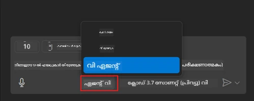
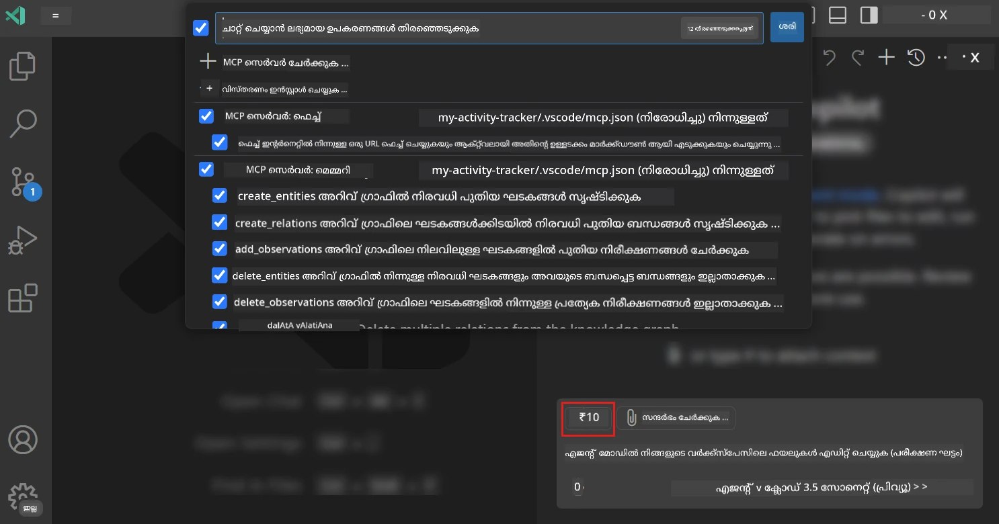
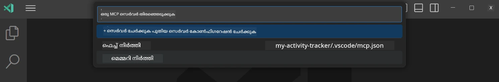
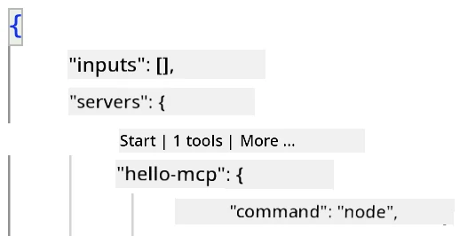
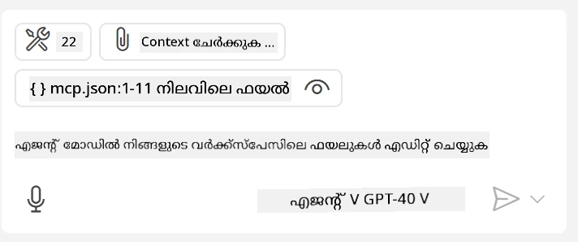
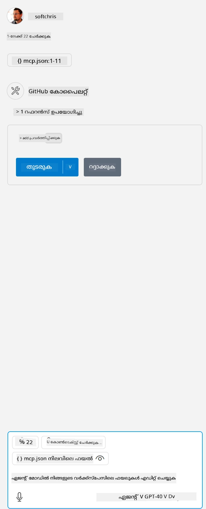

# GitHub Copilot ഏജന്റ് മോഡിൽ നിന്ന് ഒരു സർവർ ഉപയോഗിക്കൽ

Visual Studio Code ഉം GitHub Copilot ഉം ഒരു ക്ലയന്റ് ആയി പ്രവർത്തിച്ച് MCP സർവർ ഉപയോഗിക്കാനാകും. നിങ്ങൾ ചോദിക്കാം, നമുക്ക് അത് എന്തിനാണു വേണ്ടത്? അതായത് MCP സർവറിൽ ഉള്ള ഏതൊരു ഫീച്ചറുകളും ഇപ്പോൾ നിങ്ങളുടെ IDE നകകുള്ളിൽ നിന്ന് ഉപയോഗിക്കാനാകും. ഉദാഹരണമായി GitHub ന്റെ MCP സർവർ ചേർത്തുനോക്കുക, ഇതിലൂടെ ട്രമിനലിൽ പ്രത്യേക കമാൻഡുകൾ ടൈപ്പ് ചെയ്യാതെ പ്രമ്പ്റ്റുകൾ വഴിയാണ് GitHub നിയന്ത്രിക്കുന്നതിന് സാധിക്കും. അല്ലെങ്കിൽ സ്വാഭാവിക ഭാഷ ഉപയോഗിച്ച് നിയന്ത്രിക്കാവുന്ന, ഡെവലപ്പർ അനുഭവം മെച്ചപ്പെടുത്താനാകുന്ന ഏതെങ്കിലും സാധനങ്ങൾ ഉള്ളതായി കരുതുക. ഇപ്പോൾ വിജയം കാണാൻ തുടങ്ങുമെന്ന് മതി, അല്ലേ?

## അവലോകനം

ഈ പാഠം Visual Studio Code ഉം GitHub Copilot ഏജന്റ് മോഡും നിങ്ങളുടെ MCP സർവറിനെ ക്ലയന്റായി എങ്ങനെ ഉപയോഗിക്കാമെന്നുകൂടി പഠിപ്പിക്കുന്നു.

## പഠന ലക്ഷ്യങ്ങൾ

ഈ പാഠം അവസാനിക്കുന്നപ്പോൾ, നിങ്ങൾക്ക് സാധിക്കും:

- Visual Studio Code വഴി MCP Server ഉപയോഗിക്കുക.
- GitHub Copilot വഴി ടൂൾസുകൾ പോലുള്ള കഴിവുകൾ പ്രവർത്തിപ്പിക്കുക.
- MCP Server കണ്ടെത്താനും നിയന്ത്രിക്കാനും Visual Studio Code കൃംംവിധികരിക്കുക.

## ഉപയോഗം

MCP സർവർ നിങ്ങൾക്ക് നിയന്ത്രിക്കാൻ രണ്ട് മാർഗ്ഗങ്ങൾ ഉണ്ട്:

- ഉപയോക്തൃ ഇന്റർഫേസ്, ഇതു പിന്നീട് ഈ അധ്യായത്തിൽ കാണിക്കും.
- ട്രമിനൽ, `code` എക്സിക്യൂട്ടബിൾ ഉപയോഗിച്ച് ട്രമിനലിൽ നിന്നു കാര്യങ്ങൾ നിയന്ത്രിക്കാനാകും:

  നിങ്ങളുടെ ഉപയോക്തൃ പ്രൊഫൈലിൽ MCP സർവർ ചേർക്കാൻ, --add-mcp കമാൻഡ് ലൈൻ ഓപ്ഷൻ ഉപയോഗിക്കുക, കൂടാതെ {\"name\":\"server-name\",\"command\":...} എന്ന JSON സർവർ കോൺഫിഗറേഷൻ നൽകുക.

  ```
  code --add-mcp "{\"name\":\"my-server\",\"command\": \"uvx\",\"args\": [\"mcp-server-fetch\"]}"
  ```

### സ്ക്രീൻഷോട്ടുകൾ





അടുത്ത ഭാഗങ്ങളിൽ നമുക്ക് വളരെ വിശദമായി വിസ്വൽ ഇന്റർഫേസ് ഉപയോഗിക്കുന്നത് കാണാം.

## സമീപനം

ഉയർന്ന നിരയിൽ ഈ രീതിയിൽ സമീപിക്കാം:

- MCP സെർവർ കണ്ടെത്താൻ ഒരു ഫയൽ ക്രമീകരിക്കുക.
- ആ സെർവർ സ്റ്റാർട്ട് ചെയ്ത് അതിന്റെ കഴിവുകൾ ലിസ്റ്റ് ചെയ്യണം.
- GitHub Copilot ചാറ്റ് ഇന്റർഫേസ് വഴി ആ കഴിവുകൾ ഉപയോഗിക്കുക.

സുഖം, പ്രക്രിയ മനസിലാക്കി, ഇപ്പോള് Visual Studio Code വഴി MCP Server ഉപയോഗിച്ച് ഒരു വ്യായാമം ചെയ്യാം.

## വ്യായാമം: ഒരു സെർവർ ഉപയോഗിക്കുക

ഈ വ്യായാമത്തിൽ, GitHub Copilot Chat ഇന്റർഫേസ് വഴി MCP സെർവർ ഉപയോഗിക്കാൻ Visual Studio Code ക്രമീകരിക്കുന്നു.

### -0- മുൻപടി, MCP Server കണ്ടെത്തൽ പ്രാപ്തമാക്കുക

MCP Servers കണ്ടെത്തൽ പ്രാപ്തമാക്കേണ്ടതായി വരാം.

1. Visual Studio Code ൽ `File -> Preferences -> Settings` ലേക്ക് പോകുക.

1. "MCP" തിരയുക, `chat.mcp.discovery.enabled` settings.json ഫയലിൽ പ്രാപ്തമാക്കുക.

### -1- ഡിസൈൻ ഫയൽ സൃഷ്ടിക്കുക

പ്രോജക്ടിന്റെ റൂട്ടിൽ `.vscode` എന്ന ഫോൾഡറിൽ MCP.json എന്ന ഫയൽ സൃഷ്ടിക്കുക. ഇങ്ങനെ കാണണം:

```text
.vscode
|-- mcp.json
```

ഇനി ഒരു സർവർ എൻട്രി എങ്ങനെ ചേർക്കാമെന്ന് നോക്കാം.

### -2- ഒരു സെർവർ ക്രമീകരിക്കുക

*mcp.json* ൽ താഴെയുള്ള ഉള്ളടക്കം ചേർക്കുക:

```json
{
    "inputs": [],
    "servers": {
       "hello-mcp": {
           "command": "node",
           "args": [
               "build/index.js"
           ]
       }
    }
}
```

മുകളിലുള്ള ഉദാഹരണം നോഡ് ജ എസിൽ എഴുതിയ ഒരു സർവർ സ്റ്റാർട്ട് ചെയ്യുന്നതിന് ഉദാഹരണമാണ്, മറ്റ് റൺടൈമുകൾക്ക് ശരിയായ കമാൻഡ് `command` ഉം `args` ഉം ഉപയോഗിച്ച് നിർദ്ദേശിക്കുക.

### -3- സർവർ സ്റ്റാർട്ട് ചെയ്യുക

എൻട്രി ചേർത്തു കഴിഞ്ഞാൽ, സർവർ സ്റ്റാർട്ട് ചെയ്യാം:

1. *mcp.json* ൽ നിങ്ങളുടെ എൻട്രി കണ്ടെത്തുക, "play" ഐക്കൺ കണ്ടെത്തിയിരിക്കണം:

    

1. "play" ഐക്കൺ ക്ലിക്ക് ചെയ്യുക, GitHub Copilot Chat ൽ ടൂൾസ് ഐക്കൺ ലഭ്യമായ ടൂളുകളുടെ എണ്ണം വർദ്ധിക്കുന്നത് കാണും. ടൂൾസ് ഐക്കൺ ക്ലിക്ക് 하면 രജിസ്റ്റർ ചെയ്‌ത ടൂളുകളുടെ ലിസ്റ്റ് കാണാം. GitHub Copilot അവയെ കോൺടെക്സ്റായി ഉപയോഗിക്കണമെങ്കിൽ ടൂളുകൾ ഓരോന്നും പരിശോധിക്കുക/അപ്രതീക്ഷിക്കുക.

  

1. ഒരു ടൂൾ പ്രവർത്തിപ്പിക്കാൻ, നിങ്ങൾക്ക് ടൂൾ വിവരണത്തിനൊപ്പം പൊരുത്തപ്പെടുന്ന പ്രംപ്റ്റ് ടൈപ്പ് ചെയ്യുക, ഉദാഹരണത്തിന് "add 22 to 1" എന്ന പ്രംപ്റ്റ്:

  

  23 എന്ന് പറയുന്ന ഒരു പ്രതികരണം കാണണം.

## അസൈൻമെന്റ്

*mcp.json* ഫയലിൽ ഒരു സെർവർ എൻട്രി ചേർക്കാൻ ശ്രമിച്ച് സർവർ സ്റ്റാർട്ട്/സ്റ്റോപ്പ് ചെയ്യാൻ സാധിക്കുന്നതായിരിക്കണം. GitHub Copilot Chat ഇന്റർഫേസിലൂടെ സർവറിൽ ഉള്ള ടൂളുകളുമായി ആശയവിനിമയം നടത്താൻ കഴിയും എന്ന് ഉറപ്പാക്കുക.

## പരിഹാരം

[പരിഹാരം](./solution/README.md)

## പ്രധാന കാര്യങ്ങൾ

ഈ അധ്യായത്തിൽ നിന്നുള്ള പ്രധാന കാര്യങ്ങൾ:

- Visual Studio Code ഒരു മികച്ച ക്ലയന്റ് ആണ്, ഇത് പല MCP സർവറുകളും അവരുടെ ടൂളുകളും ഉപയോഗിക്കാനാകും.
- GitHub Copilot Chat ഇന്റർഫേസ് സർവറുകളുമായി സംവദിക്കുന്ന രീതിയാണിത്.
- ഉപയോക്താക്കളിൽ നിന്ന് API കീകൾ പോലുള്ള ഇൻപുട്ടുകൾ ചോദിച്ച് *mcp.json* ഫയലിലെ സെർവർ എൻട്രി ക്രമീകരിക്കുമ്പോൾ MCP Server ന് നൽകാനാകും.

## ഉദാഹരണങ്ങൾ

- [ജാവ കാൽക്കുലേറ്റർ](../samples/java/calculator/README.md)
- [.Net കാൽക്കുലേറ്റർ](../../../../03-GettingStarted/samples/csharp)
- [ജാവാസ്‌ക്രിപ്റ്റ് കാൽക്കുലേറ്റർ](../samples/javascript/README.md)
- [ടൈപ്പ്സ്ക്രിപ്റ്റ് കാൽക്കുലേറ്റർ](../samples/typescript/README.md)
- [പൈത്തൺ കാൽക്കുലേറ്റർ](../../../../03-GettingStarted/samples/python)

## കൂടുതൽ വിഭവങ്ങൾ

- [Visual Studio ഡോക്യുമെൻറേഷൻ](https://code.visualstudio.com/docs/copilot/chat/mcp-servers)

## അടുത്തത്

- അടുത്തത്: [stdio Server സൃഷ്ടിക്കൽ](../05-stdio-server/README.md)

---

<!-- CO-OP TRANSLATOR DISCLAIMER START -->
**അറിയിപ്പ്**:
ഈ രേഖ AI പരിഭാഷാ സേവനം [Co-op Translator](https://github.com/Azure/co-op-translator) ഉപയോഗിച്ച് പരിഭാഷപ്പെടുത്തിയതാണ്. ഞങ്ങൾ കൃത്യതയ്ക്കായി ശ്രമിക്കുന്നുവെങ്കിലും, ഓട്ടോമേറ്റഡ് പരിഭാഷകളിൽ പിഴവുകൾ അല്ലെങ്കിൽ തെറ്റായ വിവരങ്ങൾ ഉണ്ടാകാൻ സാധ്യതയുണ്ട്. അതിന്റെ സ്വാഭാവിക ഭാഷയിലുള്ള അസൽ രേഖയാണ് പ്രാമാണികമായ ഉറവിടമായി പരിഗണിക്കേണ്ടത്. നിർണായകമായ വിവരങ്ങൾക്ക്, പ്രൊഫഷണൽ മനുഷ്യ പരിഭാഷ ശുപാർശ ചെയ്യുന്നു. ഈ പരിഭാഷ ഉപയോഗിച്ച് ഉണ്ടാകുന്ന തെറ്റിദ്ധാരണകൾ അല്ലെങ്കിൽ തെറ്റായ വ്യാഖ്യാനങ്ങൾക്കായി ഞങ്ങൾ ഉത്തരവാദികളല്ല.
<!-- CO-OP TRANSLATOR DISCLAIMER END -->