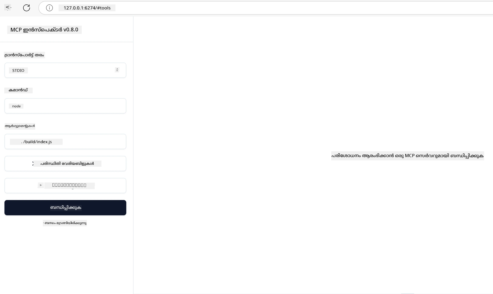

## ടെസ്റ്റിംഗും ഡീബഗിംഗും

നിങ്ങളുടെ MCP സെർവർ ടെസ്റ്റ് ചെയ്യുന്നത് തുടങ്ങുന്നതിനുമുൻപ്, ലഭ്യമായ ഉപകരണങ്ങളും ഡീബഗിംഗിന് ഏറ്റവും നല്ല രീതികളും അറിയുന്നത് പ്രധാനമാണ്. ഫലപ്രദമായ ടെസ്റ്റിംഗ് നിങ്ങളുടെയൊരു സെർവർ പ്രതീക്ഷിച്ച പ്രవర്ത്തനങ്ങളോടെ പ്രവർത്തിക്കുമെന്ന് ഉറപ്പാക്കുകയും പ്രശ്നങ്ങൾ ദ്രുതഗതിയിലാണ് കണ്ടെത്തി പരിഹരിക്കാൻ സഹായിക്കുകയും ചെയ്യുന്നു. താഴെയുള്ള വകുപ്പ് നിങ്ങളുടെ MCP നടപ്പാക്കലിന്റെ സാധുത പരിശോധനയ്ക്ക് ശിപാർസി ചെയ്യുന്ന സമീപനങ്ങളെ വിശദീകരിക്കുന്നു.

## അവലോകനം

ഈ പാഠം ശരിയായ ടെസ്റ്റിംഗ് സമീപനം തിരഞ്ഞെടുക്കലും ഏറ്റവും ഫലപ്രദമായ ടെസ്റ്റിംഗ് ഉപകരണം തിരഞ്ഞെടുക്കലും എങ്ങനെ ചെയ്യാമെന്നു് വിശദീകരിക്കുന്നു.

## പഠന ലക്ഷ്യങ്ങൾ

ഈ പാഠം അവസാനിക്കുന്നအപ്പുറം, നിങ്ങൾക്ക് സാധിക്കും:

- ടെസ്റ്റിംഗിനുള്ള വിവിധ സമീപനങ്ങൾ വിവരണം ചെയ്യുക.
- നിങ്ങളുടെ കോഡ് ഫലപ്രദമായി ടെസ്റ്റ് ചെയ്യാൻ വ്യത്യസ്ത ഉപകരണങ്ങൾ ഉപയോഗിക്കുക.

## MCP സെർവർ ടെസ്റ്റിംഗ്

MCP നിങ്ങളുടെ സെർവറുകൾ ടെസ്റ്റ് ചെയ്യാനും ഡീബഗ് ചെയ്യാനും സഹായിക്കുന്ന ഉപകരണങ്ങൾ നൽകുന്നു:

- **MCP ഇൻസ്പെക്ടർ**: CLI ആയും ദൃശ്യ ഉപകരണമായും പ്രവർത്തിക്കാവുന്ന കമാൻഡ് ലൈനിൽ നിന്നുള്ള ഒരു ഉപകരണം.
- **മാനുവൽ ടെസ്റ്റിംഗ്**: curl പോലുള്ള ഒരു ഉപകരണം ഉപയോഗിച്ച് വെബ് അഭ്യർത്ഥനകൾ നടത്താം, പക്ഷേ HTTP നടത്താൻ കഴിയുന്ന ഏതെങ്കിലും ഉപകരണവും കഴിയും.
- **യുണിറ്റ് ടെസ്റ്റിംഗ്**: നിങ്ങളുടെ ഇഷ്ടമുള്ള ടെസ്റ്റിംഗ് ഫ്രെയിംവർക്ക് ഉപയോഗിച്ച് സെർവർ, ക്ലൈയന്റ് ഫീച്ചറുകൾ ടെസ്റ്റ് ചെയ്യാൻ കഴിയും.

### MCP ഇൻസ്പെക്ടർ ഉപയോഗിക്കൽ

ഈ ഉപകരണത്തിന്റെ ഉപയോഗം മുമ്പത്തെ പാഠങ്ങളിൽ വിശദീകരിച്ചിട്ടുണ്ടെങ്കിലും ഇതിനെ കുറിച്ച് ഒരു പൊതു നിലയിൽ സംസാരിക്കാം. ഇത് Node.js-ൽ നിർമ്മിച്ച ഒരു ഉപകരണമാണ്, നിങ്ങൾക്ക് `npx` നിർവാഹകത്തെ വിളിച്ച് ഉപയോഗിക്കാം, അത് താൽക്കാലികമായി ഉപകരണം ഡൗൺലോഡ് ചെയ്ത് ഇൻസ്റ്റാൾ ചെയ്യും, നിങ്ങളുടെ അഭ്യർത്ഥന പ്രവർത്തിക്കുന്നതിന് ശേഷം ആ ഉപകരണം സ്വയം മായ്ച്ചുകളക്കും.

[MCP ഇന്‍സ്പെക്ടർ](https://github.com/modelcontextprotocol/inspector) നിങ്ങളെ സഹായിക്കുന്നു:

- **സെർവർ ശേഷികളെ കണ്ടെത്തുക**: ലഭ്യമായ വിഭവങ്ങൾ, ഉപകരണങ്ങൾ, പ്രോംപ്റ്റുകൾ സ്വയമേവ കണ്ടെത്തുക
- **ടൂൾ പ്രവർത്തനം പരീക്ഷിക്കുക**: വ്യത്യസ്ത പാരാമീറ്ററുകൾ പരീക്ഷിച്ച് പ്രതികരണങ്ങൾ യഥാർത്ഥസമയത്ത് കാണുക
- **സെർവർ മെറ്റാഡേറ്റ കാണുക**: സെർവർ വിവരങ്ങൾ, സ്കീമകൾ, കോൺഫിഗറേഷനുകൾ പരിശോധിക്കുക

ഒരു സാധാരണ ഉപയോഗം ഇതുപോലെയാണ്:

```bash
npx @modelcontextprotocol/inspector node build/index.js
```

മുകളിൽ കാണിച്ച കമാൻഡ് ഒരു MCP ആരംഭിക്കുകയും അതിന്റെ ദൃശ്യ ഇന്റർഫേസ് ആരംഭിക്കുകയും ചെയ്യുന്നു, നിങ്ങളുടെ ബ്രൗസറിൽ ഒരു ലോക്കൽ വെബ് ഇന്റർഫേസ് തുറക്കുന്നു. ഇതിൽ രജിസ്റ്റർ ചെയ്ത MCP സെർവർ, അവയുടെ ലഭ്യമായ ടൂൾസ്, വിഭവങ്ങൾ, പ്രോംപ്റ്റുകൾ ഡാഷ്ബോർഡിൽ കാണാൻ കഴിയും. ഇന്റർഫേസ് ഉപകരണ പ്രവർത്തനം പരീക്ഷിക്കുന്നത്, സെർവർ മെറ്റാഡേറ്റ പരിശോധിക്കുക, യഥാർത്ഥസമയ പ്രതികരണങ്ങൾ കാണാൻ അനുവദിക്കുന്നതിനാൽ MCP സെർവർ നടപ്പാക്കലുകൾ സാധുതയോടെ പരിശോധിച്ച് ഡീബഗ് ചെയ്യാൻ ഇത് ഉത്തമമാണ്.

ഇങ്ങനെ എന്തുമാകാം: 

നിങ്ങൾക്ക് ഈ ഉപകരണം CLI മോഡിലും ഓടിക്കാം, ആ സാഹചര്യത്തിൽ `--cli` എന്ന അറ്റ്രിബ്യൂട്ട് ചേർക്കണം. "CLI" മോഡിൽ ഉപകരണം ഓടിക്കുമ്പോൾ സെർവറിൽ ഉള്ള എല്ലാ ടൂൾസും പട്ടികയായി കാണാണെന്ന ഉദാഹരണം ഇതാ:

```sh
npx @modelcontextprotocol/inspector --cli node build/index.js --method tools/list
```

### മാനുവൽ ടെസ്റ്റിംഗ്

സെർവർ ശേഷികൾ പരിശോധിക്കാൻ ഇൻസ്പെക്ടർ ഉപകരണം ഓടിക്കുന്നതു കൂടാതെ, മറ്റൊരു സമാന സമീപനം HTTP ഉപയോഗിക്കാൻ കഴിയുന്ന ക്ലയന്റ്, ഉദാഹരണത്തിന് curl, ഓടിക്കുന്നതാണ്.

curl ഉപയോഗിച്ച് MCP സെർവർ നേരിട്ടുള്ള HTTP അഭ്യർത്ഥനകൾ വഴി ടെസ്റ്റ് ചെയ്യാം:

```bash
# ഉദാഹരണം: ടെസ്റ്റ് സർവർ മെടാറ്റാ ഡാറ്റ
curl http://localhost:3000/v1/metadata

# ഉദാഹരണം: ഒരു ടൂൾ പ്രവർത്തിപ്പിക്കുക
curl -X POST http://localhost:3000/v1/tools/execute \
  -H "Content-Type: application/json" \
  -d '{"name": "calculator", "parameters": {"expression": "2+2"}}'
```

മുകളില്‍ കാണുന്ന curl ഉപയോഗാനുസരണം, നിങ്ങൾ POST അഭ്യർത്ഥന ഉപയോഗിച്ച് ഒരു ടൂൾ_NAMEഉം അവയുടെ പാരാമീറ്ററുകളും അടങ്ങിയ പെയ്‌ലോഡ് ഉപയോഗിച്ച് ടൂൾ പ്രവർത്തിപ്പിക്കുന്നു. നിങ്ങൾക്കുതന്നെ ഏറ്റവും അനുയോജ്യമായ രീതിയിലാണ് ഉപയോഗിക്കുക. സാധാരണ CLI ഉപകരണങ്ങൾ വേഗത്തിൽ ഉപയോഗിക്കാൻ കഴിയുകയും അവ സ്ക്രിപ്റ്റെഡ് ആക്കാൻ എളുപ്പമായതിനാൽ CI/CD പരിസ്ഥിതികളിൽ ഇത് ഉപകാരപ്രദമാണ്.

### യൂണിറ്റ് ടെസ്റ്റിംഗ്

നിങ്ങളുടെ ടൂൾസും വിഭവങ്ങളും പ്രതീക്ഷിച്ചപോലെ പ്രവർത്തിക്കുന്നുണ്ടെന്ന് ഉറപ്പാക്കാൻ യൂണിറ്റ് ടെസ്റ്റുകൾ സൃഷ്ടിക്കുക. ചില സാമ്പിൾ ടെസ്റ്റ് കോഡ് ഇവിടെ കാണാം.

```python
import pytest

from mcp.server.fastmcp import FastMCP
from mcp.shared.memory import (
    create_connected_server_and_client_session as create_session,
)

# അസിങ്ക്രൺ ടെസ്റ്റുകൾക്കായി മുഴുവൻ മോഡ്യൂൾ അടയാളപ്പെടുത്തുക
pytestmark = pytest.mark.anyio


async def test_list_tools_cursor_parameter():
    """Test that the cursor parameter is accepted for list_tools.

    Note: FastMCP doesn't currently implement pagination, so this test
    only verifies that the cursor parameter is accepted by the client.
    """

 server = FastMCP("test")

    # ചില ടെസ്റ്റ് ഉപകരണങ്ങൾ സൃഷ്‌ടിക്കുക
    @server.tool(name="test_tool_1")
    async def test_tool_1() -> str:
        """First test tool"""
        return "Result 1"

    @server.tool(name="test_tool_2")
    async def test_tool_2() -> str:
        """Second test tool"""
        return "Result 2"

    async with create_session(server._mcp_server) as client_session:
        # കേഴ്സർ പാരാമീറ്റർ ഇല്ലാതെ പരീക്ഷിക്കുക (വிட்டുക)
        result1 = await client_session.list_tools()
        assert len(result1.tools) == 2

        # cursor=None ഉപയോഗിച്ച് പരീക്ഷിക്കുക
        result2 = await client_session.list_tools(cursor=None)
        assert len(result2.tools) == 2

        # കേഴ്സർ സ്ട്രിംഗ് ആയി പരീക്ഷിക്കുക
        result3 = await client_session.list_tools(cursor="some_cursor_value")
        assert len(result3.tools) == 2

        # ശൂന്യമായ സ്ട്രിംഗ് കേഴ്സർ ഉപയോഗിച്ച് പരീക്ഷിക്കുക
        result4 = await client_session.list_tools(cursor="")
        assert len(result4.tools) == 2
    
```

മുൻപ് കാണിച്ച കോഡ് താഴെപ്പറയുന്നവ ചെയ്യുന്നു:

- ഫംഗ്ഷനുകളായി ടെസ്റ്റുകൾ സൃഷ്ടിച്ച് assert പ്രസ്താവനകൾ ഉപയോഗിക്കാൻ അനുവദിക്കുന്ന pytest ഫ്രെയിംവർക്ക് ഉപയോഗിക്കുന്നു.
- രണ്ട് വ്യത്യസ്ത ടൂൾസുകളുമായി ഒരു MCP സെർവർ സൃഷ്ടിക്കുന്നു.
- ചില നിബന്ധനകൾ പാലിച്ചിട്ടുണ്ടോയെന്ന് പരിശോധിക്കാൻ `assert` പ്രസ്താവന ഉപയോഗിക്കുന്നു.

[ഇവിടെ സമ്പൂർണ ഫയൽ കാണുക](https://github.com/modelcontextprotocol/python-sdk/blob/main/tests/client/test_list_methods_cursor.py)

മുകളിലുള്ള ഫയൽ അടിസ്ഥാനമാക്കി, നിങ്ങളുടെ തന്നെ സെർവർ കഴിവുകൾ ശരിയായി സൃഷ്ടിച്ചിട്ടുണ്ടെന്ന് പരിശോധിക്കാൻ കഴിയും.

പ്രധാന SDKകളിൽ ഒരുപോലെ ടെസ്റ്റിംഗ് സെക്ഷനുകളുണ്ട്, അതിനാൽ നിങ്ങൾ തിരഞ്ഞെടുക്കുന്ന റൺടൈമിനനുസരിച്ച് ഇത് ക്രമീകരിക്കാം.

## സാമ്പിളുകൾ

- [ജावा കാൽക്കുലേറ്റർ](../samples/java/calculator/README.md)
- [.Net കാൽക്കുലേറ്റർ](../../../../03-GettingStarted/samples/csharp)
- [ജാവാസ്ക്രിപ്റ്റ് കാൽക്കുലേറ്റർ](../samples/javascript/README.md)
- [ടൈപ്‌സ്‌ക്രിപ്റ്റ് കാൽക്കുലേറ്റർ](../samples/typescript/README.md)
- [പൈതൺ കാൽക്കുലേറ്റർ](../../../../03-GettingStarted/samples/python)

## അധിക ഉറവിടങ്ങൾ

- [Python SDK](https://github.com/modelcontextprotocol/python-sdk)

## അടുത്തത്

- അടുത്തത്: [പ്രക്ഷേപണം](../09-deployment/README.md)

---

<!-- CO-OP TRANSLATOR DISCLAIMER START -->
**അസാധുവാക്കല്‍**:  
ഈ ഡോക്യുമെന്റ് AI വിവര്‍ത്തന സേവനം [Co-op Translator](https://github.com/Azure/co-op-translator) ഉപയോഗിച്ച് വിവര്‍ത്തനം ചെയ്യപ്പെട്ടതാണ്. ഞങ്ങള്‍ കൃത്യതയ്ക്ക് ശ്രമിച്ചെങ്കിലും, യന്ത്ര വിവര്‍ത്തനങ്ങളില്‍ പിശകുകളോ、不സസമയസോ ഉണ്ടാകാവുന്നതാണ്. സ原始 ഡോക്യുമെന്റ് സ്വന്തം ഭാഷയിലുള്ളത് ആധികാരികമായ ഉറവിടമായി കണക്കാക്കണം. നിര്‍ണായക വിവരങ്ങള്‍ക്കായി പ്രഫഷണല്‍ മനുഷ്യ വിവര്‍ത്തനം ശുപാര്‍ശ ചെയ്യുന്നു. ഈ വിവര്‍ത്തനത്തിന്റെ ഉപയോഗത്തില്‍ നിന്നുണ്ടാകുന്ന ഏതെങ്കിലും തെറ്റ് കാഴ്ചപ്പാടുകള്‍ക്കും വ്യാഖ്യാനങ്ങള്‍ക്കും ഞങ്ങള്‍ ഏറ്റുപറ്റുകയില്ല.
<!-- CO-OP TRANSLATOR DISCLAIMER END -->