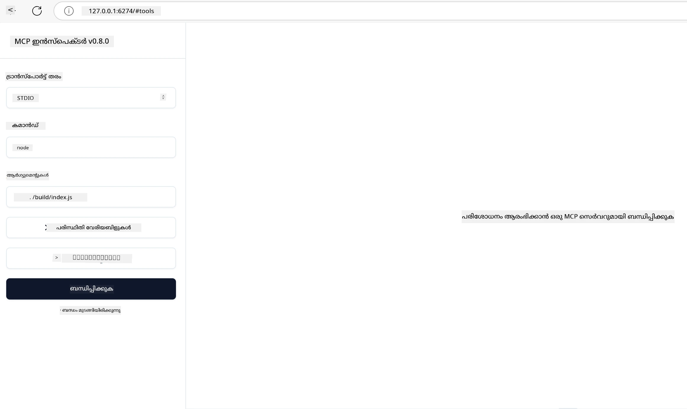

## ടെസ്റ്റിംഗും ഡിബഗ്ഗിംഗും

നിങ്ങളുടെ MCP സെർവർ ടെസ്റ്റ് ചെയ്യ്ച്ചാരം തുടങ്ങുന്നതിന് മുമ്പ്, ലഭ്യമായ ഉപകരണങ്ങളും ഡിബഗ്ഗിങ്ങിനുള്ള മികച്ച പ്രാക്ടീസുകളും മനസിലാക്കുന്നത് പ്രധാനമാണ്. ഫലപ്രദമായ ടെസ്റ്റിംഗ് നിങ്ങളുടെ സെർവർ പ്രതീക്ഷിക്കുന്ന വിധത്തിൽ പ്രവർത്തിക്കുന്നുണ്ടെന്ന് ഉറപ്പാക്കുകയും പ്രശ്നങ്ങൾ കണ്ടെത്തി പരിഹരിക്കുന്നതിൽ സഹായിക്കുകയും ചെയ്യുന്നു. താഴെയുള്ള ഭാഗം നിങ്ങളുടെ MCP നടപ്പാക്കലിനെ ശരിയായ രീതിയിൽ സ്ഥിരീകരിക്കാൻ ശിപാർശ ചെയ്യുന്ന സമീപനങ്ങൾ വിശദീകരിക്കുന്നു.

## അവലോകനം

ഈ പാഠം ശരിയായ ടെസ്റ്റിംഗ് സമീപനം തിരഞ്ഞെടുക്കുകയും ഏറ്റവും ഫലപ്രദമായ ടെസ്റ്റിംഗ് ഉപകരണം തിരഞ്ഞെടുക്കുകയും ചെയ്യുന്നതിന് സഹായിക്കും.

## പഠന ലക്‌ഷ്യങ്ങൾ

ഈ പാഠം അവസാനിപ്പിക്കുമ്പോൾ, നിങ്ങൾക്ക് കഴിയുന്നതാണ്:

- ടെസ്റ്റ് ചെയ്യാനുള്ള വിവിധ സമീപനങ്ങൾ വിവരിക്കുക.
- നിങ്ങളുടെ കോഡ് ഫലപ്രദമായി പരിശോധിക്കാൻ വ്യത്യസ്ത ഉപകരണങ്ങൾ ഉപയോഗിക്കുക.


## MCP സെർവറുകളുടെ ടെസ്റ്റിംഗ്

MCP നിങ്ങളുടെ സെർവറുകൾ ടെസ്റ്റ് ചെയ്യാനും ഡിബഗ് ചെയ്യാനുമുള്ള ഉപകരണങ്ങൾ നൽകുന്നു:

- **MCP ഇൻസ്പെക്ടർ**: CLI ആയി കൂടും ദൃശ്യമയ ടൂളായി കൂടും പ്രവർത്തിപ്പിക്കാവുന്ന കമാൻഡ് ലൈൻ ഉപകരണം.
- **മാനുവൽ ടെസ്റ്റിംഗ്**: curl പോലുള്ള ഒരു ഉപകരണം ഉപയോഗിച്ചുകൊണ്ട് വെബ് അഭ്യർത്ഥനകൾ നടത്താം, എന്നാൽ HTTP പ്രവർത്തിപ്പിക്കാവുന്ന എവിടെ തരം ഉപകരണം ഉപയോഗിക്കാം.
- **യുണിറ്റ് ടെസ്റ്റിംഗ്**: നിങ്ങളുടെ ഇഷ്ടപ്പെട്ട ടെസ്റ്റിംഗ് ഫ്രെയിംവർക്കിൽ സെർവർ, ക്ലയന്റ് സവിശേഷതകൾ രണ്ട് വശവും ടെസ്റ്റ് ചെയ്യാവുന്നതാണ്.

### MCP ഇൻസ്പെക്ടർ ഉപയോഗിക്കുന്നത്

ഈ ഉപകരണത്തിന്റെ ഉപയോഗം മുമ്പത്തെ പാഠങ്ങളിൽ വിശദീകരിച്ചിട്ടുള്ളതാണ്, എന്നാൽ ഇതിന്റെ ഉയർന്ന തലത്തിലുള്ള ഒരു വിവരണം പറയാം. ഇത് Node.js ൽ നിർമ്മിച്ചതാണ്, ഉപകരണം തനിക്കായി താൽക്കാലികമായി ഡൗൺലോഡ് ചെയ്ത് ഇൻസ്റ്റാൾ ചെയ്യുന്നതിനും, നിങ്ങളുടെ അഭ്യർത്ഥനം പൂർത്തിയായ ശേഷം സ്വയം നീക്കം ചെയ്യുന്നതിനുമായി `npx` എക്സിക്യൂട്ടബിൾ വിളിച്ച് നിങ്ങൾക്ക് ഉപയോഗിക്കാം.

[MCP ഇൻസ്പെക്ടർ](https://github.com/modelcontextprotocol/inspector) സഹായിക്കുന്നു:

- **സെർവർ ശേഷികൾ കണ്ടെത്തുക**: ലഭ്യമായ വിഭവങ്ങൾ, ഉപകരണങ്ങൾ, പ്രോംപ്റ്റുകൾ സ്വയം കണ്ടെത്തുക
- **ടൂൾ നിർമ്മലനം പരിശോധിക്കുക**: വ്യത്യസ്ത പാരാമീറ്ററുകൾ പരീക്ഷിച്ച് പ്രതികരണങ്ങൾ യാഥാർത്ഥ്യ സമയത്ത് കാണുക
- **സെർവർ മेटാഡേറ്റ കാണുക**: സെർവർ വിവരങ്ങൾ, സ്കീമകൾ, കോൺഫിഗറേഷനുകൾ പരിശോധിക്കുക

ഉപകരണത്തിന്റെ പ്രത്യേകമായ ഒരു പ്രവർത്തനം ഇങ്ങനെ കാണാം:

```bash
npx @modelcontextprotocol/inspector node build/index.js
```

മുകളിൽ കാണിച്ച കമാൻഡ് MCP നടത്തുന്ന ഒരു ഇൻസ്പെക്ടറും അതിന്റെ ദൃശ്യമയ ഇന്റർഫേസും ആരംഭിക്കുന്നു, ബ്രൗസറിൽ പ്രാദേശിക വെബ് ഇന്റർഫേസ് തുറക്കുന്നു. രജിസ്റ്റർ ചെയ്ത MCP സെർവറുകൾ, അവയുടെ ലഭ്യമായ ഉപകരണങ്ങൾ, വിഭവങ്ങൾ, പ്രോംപ്റ്റുകൾ ഡാഷ്‌ബോർഡിൽ കാണാൻ കഴിയും. ഇന്റർഫേസ് കൗശലപ്പൂർവം ഉപകരണങ്ങളുടെ പ്രവർത്തനം പരീക്ഷിക്കാൻ, സെർവർ മെടാഡേറ്റ പരിശോധിക്കാൻ, യഥാർത്ഥ സമയ പ്രതികരണങ്ങൾ കാണാൻ കഴിവുണ്ട്, ഇത് നിങ്ങളുടെ MCP സെർവർ നടപ്പാക്കലുകൾ ശരിയെന്ന് ഉറപ്പാക്കാനും ഡിബഗ് ചെയ്യാനുമുള്ള സൗകര്യമാക്കുന്നു.

അതെങ്ങിനെയാകും എന്നത് ഇങ്ങനെ: 

ഈ ഉപകരണം CLI മോണിൽ പ്രവർത്തിപ്പിക്കാനായി `--cli` എന്ന ഗുണം ചേർക്കാം. "CLI" മോണിൽ പ്രവർത്തിപ്പിക്കുന്ന ഉദാഹരണമാണ് ഇത്, സെർവറിൽ ഉള്ള എല്ലാ ഉപകരണങ്ങളും പട്ടയമാക്കും:

```sh
npx @modelcontextprotocol/inspector --cli node build/index.js --method tools/list
```

### മാനുവൽ ടെസ്റ്റിംഗ്

ഇൻസ്പെക്ടർ ഉപകരണം പ്രവർത്തിപ്പിച്ചതിനുപുറമേ, http ഉപയോഗിച്ച് പ്രവർത്തിക്കുന്ന ക്ലയന്റ് മറ്റൊരു സമാന സമീപനമാണ്, ഉദാഹരണത്തിന് curl.

MCP സെർവറുകൾ നേരിട്ട് http അഭ്യർത്ഥനകളുപയോഗിച്ച് curl ഉപയോഗിച്ച് ടെസ്റ്റ് ചെയ്യാം:

```bash
# ഉദാഹരണം: ടെസ്റ്റ് സർവർ മെറ്റാഡേറ്റ
curl http://localhost:3000/v1/metadata

# ഉദാഹരണം: ഒരു ഉപകരണം പ്രവർത്തിപ്പിക്കുക
curl -X POST http://localhost:3000/v1/tools/execute \
  -H "Content-Type: application/json" \
  -d '{"name": "calculator", "parameters": {"expression": "2+2"}}'
```

മുകളിൽ curl ഉപയോഗിക്കുന്ന ഉദാഹരണത്തിൽ കാണുന്നത് പോലെ, ഉപകരണം പ്രവർത്തിപ്പിക്കാൻ ടൂൾ നാമംയും പാരാമീറ്ററുകളും അടങ്ങിയ പേലോഡ് ഉപയോഗിച്ച് POST അഭ്യർത്ഥനയയക്കുന്നു. ഏറ്റവും അനുയോജ്യമായ സമീപനം തിരഞ്ഞെടുക്കുക. CLI ഉപകരണങ്ങൾ സാധാരണയായി വേഗത്തിൽ ഉപയോഗിക്കാനാകും, സ്രിപ്റ്റിംഗിനും യോജിക്കുന്നു, ഇത് CI/CD സാഹചര്യങ്ങളിൽ ഉപകാരപ്പെടും.

### യുണിറ്റ് ടെസ്റ്റിംഗ്

നിങ്ങളുടെ ഉപകരണങ്ങൾക്കും വിഭവങ്ങൾക്കും യുണിറ്റ് ടെസ്റ്റുകൾ ഉണ്ടാക്കുക, അവ നിർവചിക്കപ്പെട്ടതുപോലെ പ്രവർത്തിക്കുന്നുണ്ടെന്ന് ഉറപ്പാക്കാൻ. ഇവിടെ ചില ഉദാഹരണ ടെസ്റ്റിംഗ് കോഡുകൾ കാണിച്ചിരിക്കുന്നു.

```python
import pytest

from mcp.server.fastmcp import FastMCP
from mcp.shared.memory import (
    create_connected_server_and_client_session as create_session,
)

# ആസിങ്ക് ടെസ്റ്റുകൾക്കായി മുഴുവൻ മോഡ്യൂളും അടയാളപ്പെടുത്തുക
pytestmark = pytest.mark.anyio


async def test_list_tools_cursor_parameter():
    """Test that the cursor parameter is accepted for list_tools.

    Note: FastMCP doesn't currently implement pagination, so this test
    only verifies that the cursor parameter is accepted by the client.
    """

 server = FastMCP("test")

    # രണ്ട് ടെസ്റ്റ് ടൂളുകൾ സൃഷ്ടിക്കുക
    @server.tool(name="test_tool_1")
    async def test_tool_1() -> str:
        """First test tool"""
        return "Result 1"

    @server.tool(name="test_tool_2")
    async def test_tool_2() -> str:
        """Second test tool"""
        return "Result 2"

    async with create_session(server._mcp_server) as client_session:
        # കർസർ പാരാമീറ്റർ ഇല്ലാതെ പരിശോധന ( ഒഴിവാക്കിയിരിക്കുന്നു )
        result1 = await client_session.list_tools()
        assert len(result1.tools) == 2

        # cursor=None ഉപയോഗിച്ച് പരിശോധന
        result2 = await client_session.list_tools(cursor=None)
        assert len(result2.tools) == 2

        # കർസർ സ്ട്രിങ്ങായി ഉപയോഗിച്ച് പരീക്ഷണം
        result3 = await client_session.list_tools(cursor="some_cursor_value")
        assert len(result3.tools) == 2

        # ശൂന്യമായ സ്ട്രിംഗ് കർസർ ഉപയോഗിച്ച് പരിശോധന
        result4 = await client_session.list_tools(cursor="")
        assert len(result4.tools) == 2
    
```

മുകളിൽ നൽകിയ കോഡ് ചുവടെ പറയുന്ന കാര്യങ്ങൾ ചെയ്യുന്നു:

- pytest ഫ്രെയിംവർക്കിനെ അടിസ്ഥാനമാക്കി, ഇത് ഫംഗ്ഷനുകളായി ടെസ്റ്റുകൾ സൃഷ്ടിച്ച് assert സ്റ്റേറ്റ്‌മെന്റുകൾ ഉപയോഗിക്കാൻ അനുവദിക്കുന്നു.
- രണ്ട് വ്യത്യസ്ത ഉപകരണങ്ങൾ കൊണ്ട് ഒരു MCP സെർവർ സൃഷ്ടിക്കുന്നു.
- ചില നിബന്ധനകൾ പൂർണമായിട്ടുണ്ടെന്ന് പരിശോധിക്കാൻ `assert` സ്റ്റേറ്റ്‌മെന്റ് ഉപയോഗിക്കുന്നു.

[പരിപൂർണ ഫയൽ ഇവിടെ കാണുക](https://github.com/modelcontextprotocol/python-sdk/blob/main/tests/client/test_list_methods_cursor.py)

മുകളിൽ നൽകിയ ഫയൽ അടിസ്ഥാനമാക്കി, നിങ്ങളുടെ സ്വന്തം സെർവർ ടെസ്റ്റ് ചെയ്ത് കഴിവുകൾ ആവശ്യത്തിന് സൃഷ്ടിച്ചിട്ടുണ്ടെന്ന് ഉറപ്പാക്കാം.

എല്ലാ പ്രധാന SDK കളിലും സമാനമായ ടെസ്റ്റിംഗ് വിഭാഗങ്ങൾ ഉണ്ടാകുന്നതിനാൽ, നിങ്ങൾ തിരഞ്ഞെടുത്ത റൺടൈമിലേക്ക് അനുയോജ്യമായി ക്രമീകരിക്കാം.

## സാമ്പിൾസ്

- [ജാവാ കാൽക്കുലേറ്റർ](../samples/java/calculator/README.md)
- [.Net കാൽക്കുലേറ്റർ](../../../../03-GettingStarted/samples/csharp)
- [ജാവാസ്ക്രിപ്റ്റ് കാൽക്കുലേറ്റർ](../samples/javascript/README.md)
- [ടൈപ്പ്‌സ്‌ക്രിപ്റ്റ് കാൽക്കുലേറ്റർ](../samples/typescript/README.md)
- [പൈത്തൺ കാൽക്കുലേറ്റർ](../../../../03-GettingStarted/samples/python) 

## അധിക വിഭവങ്ങൾ

- [Python SDK](https://github.com/modelcontextprotocol/python-sdk)

## തുടർച്ചയിൽ എന്ത്

- അടുത്തത്: [ഡിപ്ലോയ്മെന്റ്](../09-deployment/README.md)

---

<!-- CO-OP TRANSLATOR DISCLAIMER START -->
**അറിയിപ്പ്**:
ഈ രേഖ AI പരിഭാഷാ സേവനം [Co-op Translator](https://github.com/Azure/co-op-translator) ഉപയോഗിച്ച് പരിഭാഷപ്പെടുത്തിയതാണ്. ഞങ്ങൾ കൃത്യതയ്ക്കായി ശ്രമിക്കുന്നുവെങ്കിലും, ഓട്ടോമേറ്റഡ് പരിഭാഷകളിൽ പിഴവുകൾ അല്ലെങ്കിൽ തെറ്റായ വിവരങ്ങൾ ഉണ്ടാകാൻ സാധ്യതയുണ്ട്. അതിന്റെ സ്വാഭാവിക ഭാഷയിലുള്ള അസൽ രേഖയാണ് പ്രാമാണികമായ ഉറവിടമായി പരിഗണിക്കേണ്ടത്. നിർണായകമായ വിവരങ്ങൾക്ക്, പ്രൊഫഷണൽ മനുഷ്യ പരിഭാഷ ശുപാർശ ചെയ്യുന്നു. ഈ പരിഭാഷ ഉപയോഗിച്ച് ഉണ്ടാകുന്ന തെറ്റിദ്ധാരണകൾ അല്ലെങ്കിൽ തെറ്റായ വ്യാഖ്യാനങ്ങൾക്കായി ഞങ്ങൾ ഉത്തരവാദികളല്ല.
<!-- CO-OP TRANSLATOR DISCLAIMER END -->