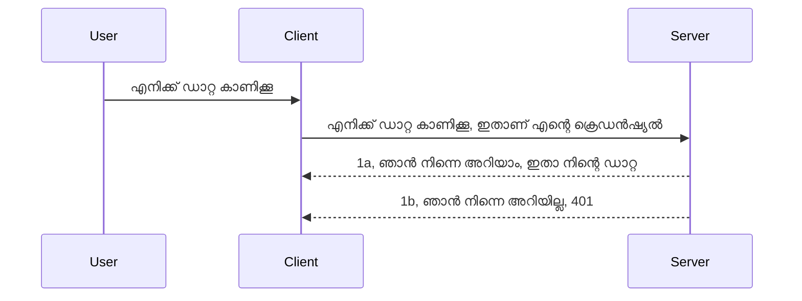

# ലളിതമായ ഓത്ത്

MCP SDKകൾ ഓത്ത് 2.1 ഉപയോഗം പിന്തുണയ്ക്കുന്നു, ഇത് ശരിയായി പറച്ചിൽ ചെയ്താൽ സാങ്കേതികവത്കരണങ്ങൾ ഉൾക്കൊള്ളുന്ന ഒരു പ്രക്രിയയാണ്, അതിൽ ഓത്ത് സെർവർ, റിസോഴ്സ് സെർവർ, ക്രെഡൻഷ്യലുകൾ പോസ്റ്റ് ചെയ്യൽ, ഒരു കോഡ് ലഭിക്കൽ, കോഡ് എക്സ്ചേഞ്ച് ചെയ്ത് ബെയർ ടോക്കൺ നേടൽ എന്നിവ ഉൾപ്പെടുന്നു, ഒടുവിൽ നിങ്ങൾക്കു നിങ്ങളുടെ റിസോഴ്സ് ഡേറ്റ ലഭിക്കാൻ കഴിയും. ഓത്ത് ഉപയോഗിക്കാത്തവർക്ക്, ഇത് നടപ്പിലാക്കുന്നതിനുള്ള മികച്ച ഒരു വഴിയാണ്. മികച്ച സുരക്ഷയ്ക്കായി ആദ്യമായി അടിസ്ഥാന ഓത്ത് തലത്തിൽ ആരംഭിക്കുക നല്ലതാണ്. ഇതുകൊണ്ട് ഈ അധ്യായം ഉള്ളതാണ്, കൂടുതൽ പുരോഗതിയുള്ള ഓത് വരെ നിങ്ങൾക്ക് സഹായിക്കുന്നതിന്.

## ഓത്ത്, ഞങ്ങൾ എന്ത് ഉദ്ദേശിക്കുന്നു?

ഓത്ത് എന്നത് ഓത്തെന്റിക്കേഷനും അതോറൈസേഷനും സംക്ഷിപ്തമാണ്. ഇതിൻ്റെ ആശയം ഞങ്ങൾ രണ്ട് കാര്യങ്ങൾ ചെയ്യേണ്ടതാണ്:

- **ഓത്തെന്റിക്കേഷൻ**, അത് ഒരു വ്യക്തിയെ ഞങ്ങളുടെ വീട്ടിൽ പ്രവേശിക്കാൻ അനുവദിക്കുന്നുണ്ടോ എന്നത് കണ്ടെത്തുന്ന പ്രക്രിയയാണ്, അവർ "ഇവിടെ" ("here") പ്രവേശിക്കാൻ അധികാരം ഉണ്ടായിരിക്കുന്നു എന്ന്, അതായത് ഞങ്ങളുടെ MCP സെർവർ സവിശേഷതകൾ ഉള്ള റിസോഴ്സ് സെർവർ ആക്സസ് ചെയ്യാനുണ്ട് എന്നതു കണ്ടെത്തൽ.
- **അത്തോറൈസേഷൻ**, ഉപയോക്താവ് അഭ്യർത്ഥിക്കുന്ന ഉയർന്നവിശേഷങ്ങളുള്ള റിസോഴ്സുകൾ (ഉദാഹരണമായി ഈ ഓർഡറുകൾ അല്ലെങ്കിൽ ഈ ഉൽപ്പന്നങ്ങൾ) ലഭിക്കാൻ അവനവനു അനുവദിക്കപ്പെട്ടിരിക്കുന്നതാണോ എന്നു കണ്ടെത്തൽ. ഉദാഹരണത്തിന്, വായിക്കുക അനുവദിച്ചിരിക്കുന്നതാണെങ്കിൽ, മിനുക്കിയെടുക്കാൻ അനുവാദമില്ലായിരിക്കാം.

## ക്രെഡൻഷ്യലുകൾ: നമ്മൾ സിസ്റ്റത്തിനോട് നമ്മളെപ്പറ്റി എങ്ങനെ പറയുന്നു

വെബ് ഡെവലപർമാർക്ക് സാധാരണയായി സർവറിന് ഒരു ക്രെഡൻഷ്യൽ പാസ്സ് നൽകേണ്ടതായി കരുതപ്പെടുന്നു, സാധാരണയായി ഒരു രഹസ്യം, ഇത് അവരെ ഇവിടെ അനുവദിച്ചിരിക്കുന്നുവെന്ന് സൂചിപ്പിക്കുന്നു ("ഓത്തെന്റിക്കേഷൻ"). ഈ ക്രെഡൻഷ്യൽ സാധാരണയായി യൂസർനേം, പാസ്സ്‌വേഡിന്റെ ബെസ്64 എൻകോടുചെയ്ത പതിപ്പോ അല്ലെങ്കിൽ ഒരു API കീയോ ആയി ഉണ്ടാകുന്നു, പ്രത്യേക ഉപയോക്താവിനെ വ്യക്തമായി തിരിച്ചറിയുന്നു.

ഇത് "Authorization" എന്ന ഹെഡറിൽ ഇങ്ങനെ അയക്കാറുണ്ട്:

```json
{ "Authorization": "secret123" }
```

ഇത്തരം പദമാണ് ബേസിക് ഓത്തെന്റിക്കേഷൻ എന്നു അറിയപ്പെടുന്നത്. പൂർണ്ണ പ്രക്രിയ എങ്ങനെയാണ് പ്രവർത്തിക്കുന്നത് ഔട്ട് ലൈൻ ചെയ്യുന്നത് താഴെ കൊടുത്തിരിക്കുന്നു:


ഫ്ലോയുടെ കാഴ്ചഭംഗിയിൽ ഇത് എങ്ങനെ പ്രവർത്തിക്കുന്നുണ്ടെന്ന് മനസ്സിലാക്കിയപ്പോൾ, എങ്ങനെ നടപ്പിലാക്കാം? വെബ് സർവറുകളിൽ സാധാരണയായി മിഡിൽവെയർ എന്ന ആശയം ഉണ്ട്, ഇത് റിക്വസ്റ്റ് ഓടുമ്പോൾ പ്രവർത്തിക്കുന്ന ഒരു കോഡ് പീസ് ആണ്, ക്രെഡൻഷ്യലുകൾ പരിശോധിക്കുകയും ശരിയായെങ്കിൽ റിക്വസ്റ്റ് കടത്താൻ അനുവദിക്കുകയും ചെയ്യും. ക്രെഡൻഷ്യൽ സാധുവല്ലെങ്കിൽ ഓത് എറർ ലഭിക്കും. ഇത് എങ്ങനെ നടപ്പിലാക്കാമെന്ന് കാണാം:

**Python**

```python
class AuthMiddleware(BaseHTTPMiddleware):
    async def dispatch(self, request, call_next):

        has_header = request.headers.get("Authorization")
        if not has_header:
            print("-> Missing Authorization header!")
            return Response(status_code=401, content="Unauthorized")

        if not valid_token(has_header):
            print("-> Invalid token!")
            return Response(status_code=403, content="Forbidden")

        print("Valid token, proceeding...")
       
        response = await call_next(request)
        # ഏതെങ്കിലും കസ്റ്റമർ ഹെഡറുകൾ ചേർക്കുക അല്ലെങ്കിൽ പ്രതികരണത്തിൽ ഏതെങ്കിലും മാറ്റം വരുത്തുക
        return response


starlette_app.add_middleware(CustomHeaderMiddleware)
```

ഇവിടെ ഞങ്ങൾ:

- `AuthMiddleware` എന്ന മിഡിൽവെയർ സൃഷ്ടിച്ചു, അതിലെ `dispatch` മെതഡിന് വെബ് സർവറാണ് വിളിക്കുന്നത്.
- മിഡിൽവെയർ വെബ് സർവറിൽ ചേർത്തു:

    ```python
    starlette_app.add_middleware(AuthMiddleware)
    ```

- Authorization ഹെഡർ ഉണ്ടോ എന്ന് പരിശോധിക്കുകയും അയക്കുന്ന രഹസ്യം സാധുവാണോ എന്നും പരിശോധിക്കുന്ന സാധുത പരിശോധന കോഡ് എഴുതിയിട്ടുണ്ട്:

    ```python
    has_header = request.headers.get("Authorization")
    if not has_header:
        print("-> Missing Authorization header!")
        return Response(status_code=401, content="Unauthorized")

    if not valid_token(has_header):
        print("-> Invalid token!")
        return Response(status_code=403, content="Forbidden")
    ```

    രഹസ്യം ഉണ്ടെങ്കിൽ അത് ശരിയാണെന്ന് കണ്ടെത്തിയാൽ `call_next` വിളിച്ച് റിക്വസ്റ്റ് കടത്താൻ അനുവദിക്കുകയും പ്രതികരണം നൽകുകയും ചെയ്യും.

    ```python
    response = await call_next(request)
    # ഒന്നോ അതിലധികമോ ഉപഭോക്തൃ ഹെഡറുകൾ ചേർക്കുക അല്ലെങ്കിൽ പ്രതികരണത്തിൽ എന്തെങ്കിലും തരത്തിൽ മാറ്റം വരുത്തുക
    return response
    ```

കൂടുതൽ പ്രക്രിയ: വെബ് റിക്വസ്റ്റ് സർവറിലേക്ക് വന്നാൽ മിഡിൽവെയർ പ്രവർത്തിക്കും, നിർവഹണം അനുസരിച്ച് റിക്വസ്റ്റ് കടത്താനോ അല്ലെങ്കിൽ ക്ലയന്റ് മുന്നോട്ട് പോകാൻ അനുവാദമില്ലെന്ന് സൂചിപ്പിക്കുന്ന എറർ നൽകാനോ അത് തീരുമാനിക്കും.

**TypeScript**

Express പ്രശസ്ത ഫ്രെയിംവർക്ക് ഉപയോഗിച്ച് ഒരു മിഡിൽവെയർ ക്രിയേറ്റ് ചെയ്ത് MCP സെർവറിൽ എത്തുന്നതിനു മുമ്പെ റിക്വസ്റ്റ് തടയുന്നു. കോഡ് മുമ്പ് കാണിച്ചിട്ടുള്ളതാണ്:

```typescript
function isValid(secret) {
    return secret === "secret123";
}

app.use((req, res, next) => {
    // 1. അനുമതിപട്ടിക ഹെഡർ ഇവണ്ടോ?
    if(!req.headers["Authorization"]) {
        res.status(401).send('Unauthorized');
    }
    
    let token = req.headers["Authorization"];

    // 2. സാധുത പരിശോധിക്കുക.
    if(!isValid(token)) {
        res.status(403).send('Forbidden');
    }

   
    console.log('Middleware executed');
    // 3. അഭ്യർത്ഥന പൈപ്പ്‌ലൈൻ中的 അടുത്ത ഘടകത്തിലേക്ക് അയയ്ക്കുന്നു.
    next();
});
```

ഇത് ചെയ്തിരിക്കുന്നുവെന്നത്:

1. Authorization ഹെഡർ ഉള്ളത് ഇല്ലയെന്ന് ആദ്യം പരിശോധിക്കുന്നു, ഇല്ലെങ്കിൽ 401 എറർ അയയ്ക്കുന്നു.
2. ക്രെഡൻഷ്യൽ/ടോക്കൺ സാധുവാണോയെന്ന് പരിശോദിക്കുന്നു, അല്ലെങ്കിൽ 403 എറർ അയയ്ക്കുന്നു.
3. അവസാനം, റിക്വസ്റ്റ് പൈപ്പ്ലൈനിൽ അടുത്ത് നയിക്കുകയും ആവശ്യപ്പെട്ട റിസോഴ്‌സ് തിരികെ നൽകുകയും ചെയ്യുന്നു.

## അഭ്യാസം: ഓത്തെന്റിക്കേഷൻ നടപ്പിലാക്കുക

നമ്മുടെ അറിവ് ഉപയോഗിച്ച് പരീക്ഷിക്കാം. പദ്ധതി ഇപ്രകാരമാണ്:

സെർവർ

- വെബ് സെർവർ ഒപ്പം MCP ഇൻസ്റ്റൻസ് സൃഷ്ടിക്കുക.
- സെർവറിനായി മിഡിൽവെയർ നടപ്പിലാക്കുക.

ക്ലയന്റ്

- ഹെഡർ വഴി ക്രെഡൻഷ്യൽ അടങ്ങിയ വെബ് രിക്വസ്റ്റ് അയയ്ക്കുക.

### -1- വെബ് സെർവർ ഒപ്പം MCP ഇൻസ്റ്റൻസ് സൃഷ്ടിക്കുക

ആദ്യഘട്ടം നമ്മൾ MCP സെർവർ ഇന്സ്റ്റൻസ് സൃഷ്ടിക്കണം, സ്റ്റാർലെറ്റ് വെബ് ആപ്പ് നിർമ്മിച്ച് uvicorn ഉപയോഗിച്ച് ഹോസ്റ്റ് ചെയ്യണം.

**Python**

```python
# MCP സർവറിനെ സൃഷ്ടിക്കുന്നു

app = FastMCP(
    name="MCP Resource Server",
    instructions="Resource Server that validates tokens via Authorization Server introspection",
    host=settings["host"],
    port=settings["port"],
    debug=True
)

# സ്റ്റാർലെറ്റ് വെബ് ആപ്പ് സൃഷ്ടിക്കുന്നു
starlette_app = app.streamable_http_app()

# uvicorn വഴി ആപ്പ് സേവനം നൽകുന്നു
async def run(starlette_app):
    import uvicorn
    config = uvicorn.Config(
            starlette_app,
            host=app.settings.host,
            port=app.settings.port,
            log_level=app.settings.log_level.lower(),
        )
    server = uvicorn.Server(config)
    await server.serve()

run(starlette_app)
```

ഇവിടെ:

- MCP സെർവർ സൃഷ്ടിക്കുന്നു.
- MCP സെർവറിൽ നിന്നുള്ള സ്റ്റാർലെറ്റ് വെബ് ആപ്പ് നിർമ്മിക്കുന്നു `app.streamable_http_app()`.
- uvicorn ഉപയോഗിച്ചാണ്വെബ് ആപ്പ് ഹോസ്റ്റും സർവവും ചെയ്യുന്നു `server.serve()`.

**TypeScript**

MCP സെർവർ ഇൻസ്റ്റൻസ് സൃഷ്ടിക്കുന്നു.

```typescript
const server = new McpServer({
      name: "example-server",
      version: "1.0.0"
    });

    // ... സെർവ്വർ റിസോഴ്‌സുകൾ, ഉപകരണങ്ങൾ, പ്രാപ്തികൾ സജ്ജീകരിക്കുക ...
```

POST /mcp റൂട്ടിന്റെ ഉള്ളിൽ ഈ MCP സെർവർ സൃഷ്ടിക്കൽ നടക്കണം, അതിനാൽ മുമ്പ് കൊടുത്ത കോഡ് ഇങ്ങനെ മാറ്റിക്കൊള്ളാം:

```typescript
import express from "express";
import { randomUUID } from "node:crypto";
import { McpServer } from "@modelcontextprotocol/sdk/server/mcp.js";
import { StreamableHTTPServerTransport } from "@modelcontextprotocol/sdk/server/streamableHttp.js";
import { isInitializeRequest } from "@modelcontextprotocol/sdk/types.js"

const app = express();
app.use(express.json());

// സെഷൻ ഐഡിയിലൂടെ ഗതാഗതങ്ങൾ സൂക്ഷിക്കുന്ന മാപ്പ്
const transports: { [sessionId: string]: StreamableHTTPServerTransport } = {};

// ക്ലയന്റ്-ടു-സെർവർ ആശയവിനിമയത്തിനായുള്ള POST അഭ്യർത്ഥനകൾ കൈകാര്യം ചെയ്യുക
app.post('/mcp', async (req, res) => {
  // നിലവിലുള്ള സെഷൻ ഐഡി പരിശോധിക്കുക
  const sessionId = req.headers['mcp-session-id'] as string | undefined;
  let transport: StreamableHTTPServerTransport;

  if (sessionId && transports[sessionId]) {
    // നിലവിലുള്ള ഗതാഗതം പുനരുപയോഗിക്കുക
    transport = transports[sessionId];
  } else if (!sessionId && isInitializeRequest(req.body)) {
    // പുതിയ ആരംഭ ആവശ്യാ‌വക
    transport = new StreamableHTTPServerTransport({
      sessionIdGenerator: () => randomUUID(),
      onsessioninitialized: (sessionId) => {
        // സെഷൻ ഐഡിയിലൂടെ ഗതാഗതം സൂക്ഷിക്കുക
        transports[sessionId] = transport;
      },
      // DNS റിബൈൻഡിംഗ് സംരക്ഷണം പിന്‍‌ഗാമിയായ അനുയോജ്യതയ്ക്ക് സാധാരണയായി ആക്‌ടീവ് അല്ല. നിങ്ങൾ ഈ സേർവർ
      // പ്രാദേശികമായി ഓടിക്കുമ്പോൾ ഉറപ്പാക്കുക:
      // enableDnsRebindingProtection: true,
      // allowedHosts: ['127.0.0.1'],
    });

    // അടച്ചപ്പോൾ ഗതാഗതം പ്യൂൺപ്പെറുത്തെടുക്കുക
    transport.onclose = () => {
      if (transport.sessionId) {
        delete transports[transport.sessionId];
      }
    };
    const server = new McpServer({
      name: "example-server",
      version: "1.0.0"
    });

    // ... സേർവർ വിഭവങ്ങൾ, ഉപകരണങ്ങൾ, പ്രോംപ്റ്റുകൾ ക്രമീകരിക്കുക ...

    // MCP സേർവറുമായി ബന്ധിപ്പിക്കുക
    await server.connect(transport);
  } else {
    // അസാധുവായ അഭ്യർത്ഥന
    res.status(400).json({
      jsonrpc: '2.0',
      error: {
        code: -32000,
        message: 'Bad Request: No valid session ID provided',
      },
      id: null,
    });
    return;
  }

  // അഭ്യർത്ഥന കൈകാര്യം ചെയ്യുക
  await transport.handleRequest(req, res, req.body);
});

// GET, DELETE അഭ്യർത്ഥനകൾക്ക് പുനരുപയോഗിക്കാവുന്ന ഹാൻഡിലർ
const handleSessionRequest = async (req: express.Request, res: express.Response) => {
  const sessionId = req.headers['mcp-session-id'] as string | undefined;
  if (!sessionId || !transports[sessionId]) {
    res.status(400).send('Invalid or missing session ID');
    return;
  }
  
  const transport = transports[sessionId];
  await transport.handleRequest(req, res);
};

// SSE വഴി സെർവർ-ടു-ക്ലയന്റ് സന്ദേശങ്ങളുടെ GET അഭ്യർത്ഥനകൾ കൈകാര്യം ചെയ്യുക
app.get('/mcp', handleSessionRequest);

// സെഷൻ അവസാനിപ്പിക്കുന്ന DELETE അഭ്യർത്ഥനകൾ കൈകാര്യം ചെയ്യുക
app.delete('/mcp', handleSessionRequest);

app.listen(3000);
```

ഇപ്പോൾ MCP സെർവർ സൃഷ്ടിക്കൽ `app.post("/mcp")` ഇന്ററ്നൽ ആയി മാറിയിരിക്കുന്നു.

തുടർന്ന് മിഡിൽവെയർ നിർമ്മാണത്തിലേക്ക് കടക്കാം ക്രെഡൻഷ്യൽ വാലിഡേഷൻ‌ക്കായി.

### -2- സെർവറിനായി ഒരു മിഡിൽവെയർ നടപ്പിലാക്കുക

മിഡിൽവെയർ ഭാഗത്തെക്കാണാം. `Authorization` ഹെഡറിൽ ഒരു ക്രെഡൻഷ്യൽ ഉണ്ടോ എന്ന് പരിശോധിച്ച് സാധുത ബോധ്യപ്പെടുത്തി ആവശ്യമായ നടപടികൾ കൈക്കൊള്ളാൻ മിഡിൽവെയർ സൃഷ്ടിക്കും. അംഗീകരിച്ചാൽ, ക്ലയന്റ് ആവശ്യപ്പെട്ട MCP ഫംഗ്ഷനാലിറ്റി (ഉദാ: ടൂൾസ് ലിസ്റ്റ്, റിസോഴ്‌സ് വായന) നടപ്പിലാകും.

**Python**

`BaseHTTPMiddleware` ക്ലാസ് ഇന്ഹെറിറ്റ് ചെയ്ത ഒരു ക്ലാസ് സൃഷ്ടിക്കണം. രണ്ട് പ്രധാന ഘടകങ്ങൾ:

- റിക്വസ്റ്റ് ഓബ്‌ജക്റ്റ് `request`, ഹെഡറുകൾ നിന്നും വിവരങ്ങൾ വായിക്കുന്നു.
- `call_next` എന്ന കോള്ബാക്ക്, ഇത് വിളിക്കണം ക്ലയന്റ് അംഗീകരിച്ച ക്രെഡൻഷ്യൽ അയച്ചിട്ടുണ്ടെങ്കിൽ.

ആദ്യം `Authorization` ഹെഡർ ഇല്ലാതിരിക്കുമ്പോൾ കൈകാര്യം ചെയ്യാം:

```python
has_header = request.headers.get("Authorization")

# തലക്കെട്ട് ഇല്ല, 401ൽ പരാജയപ്പെടുക, അല്ലെങ്കിൽ മുന്നോട്ട് പോകുക.
if not has_header:
    print("-> Missing Authorization header!")
    return Response(status_code=401, content="Unauthorized")
```

ക്ലയന്റ് ഓത്തെന്റിക്കേഷൻ പരാജയപ്പെട്ട് 401 ഇല്ലാതാക്കൽ സന്ദേശം അയക്കുന്നു.

ക്രെഡൻഷ്യൽ നൽകിയ പക്ഷം സാധുസൂചന പരിശോധിക്കുന്നു:

```python
 if not valid_token(has_header):
    print("-> Invalid token!")
    return Response(status_code=403, content="Forbidden")
```

403 നിഷിദ്ധ സന്ദേശം അയയ്ക്കുന്നു. താഴെ മുഴുവൻ മിഡിൽവെയർ നടപ്പിലാക്കി:

```python
class AuthMiddleware(BaseHTTPMiddleware):
    async def dispatch(self, request, call_next):

        has_header = request.headers.get("Authorization")
        if not has_header:
            print("-> Missing Authorization header!")
            return Response(status_code=401, content="Unauthorized")

        if not valid_token(has_header):
            print("-> Invalid token!")
            return Response(status_code=403, content="Forbidden")

        print("Valid token, proceeding...")
        print(f"-> Received {request.method} {request.url}")
        response = await call_next(request)
        response.headers['Custom'] = 'Example'
        return response

```

`valid_token` ഫങ്ക്ഷൻ എന്താണെന്ന് കാണാം:

```python
# ഉല്‌പാദനത്തിൽ ഉപയോഗിക്കരുത് - ഇത് മെച്ചപ്പെടുത്തുക !!
def valid_token(token: str) -> bool:
    # "Bearer " മുൻ‌പേര് നീക്കം ചെയ്യുക
    if token.startswith("Bearer "):
        token = token[7:]
        return token == "secret-token"
    return False
```

ഇത് മെച്ചപ്പെടുത്തേണ്ടതാണ്.

ഗുരുത്വം: ഈ രഹസ്യങ്ങൾ കോഡിൽ സൂക്ഷിക്കുന്നത് വിസർജ്ജിക്കണം. ഡാറ്റ സ്രോതസ്സിൽനിന്നും അല്ലെങ്കിൽ IDP (ഐഡൻറിറ്റി സർവീസ് പ്രൊവൈഡർ) നിന്നോ മൂല്യം എടുത്ത് വാലിഡേഷൻ അവിടെ നടത്തുക നല്ലതാണ്.

**TypeScript**

Express-ൽ ഇത് നടപ്പിലാക്കാൻ `use` മെഥഡ് ഉപയോഗിച്ച് മിഡിൽവെയർ പാസ്സ് ചെയ്യണം.

- `Authorization` പ്രാപ്പർട്ടിയിൽ ക്രെഡൻഷ്യൽ പരിശോധിക്കുക.
- സാധുവാണെങ്കിൽ റിക്വസ്റ്റ് മുന്നോട്ട് പോകാൻ തിരുത്തുക.

Authorization ഹെഡർ ഇല്ലെങ്കിൽ, റിക്വസ്റ്റ് തടയുന്നു:

```typescript
if(!req.headers["authorization"]) {
    res.status(401).send('Unauthorized');
    return;
}
```

ഇനി 401 ലഭിക്കും.

ക്രീഡൻഷ്യൽ അസാധുവാണെങ്കിൽ:

```typescript
if(!isValid(token)) {
    res.status(403).send('Forbidden');
    return;
} 
```

403 എറർ ലഭിക്കും.

പൂർണ്ണ കോഡ്:

```typescript
app.use((req, res, next) => {
    console.log('Request received:', req.method, req.url, req.headers);
    console.log('Headers:', req.headers["authorization"]);
    if(!req.headers["authorization"]) {
        res.status(401).send('Unauthorized');
        return;
    }
    
    let token = req.headers["authorization"];

    if(!isValid(token)) {
        res.status(403).send('Forbidden');
        return;
    }  

    console.log('Middleware executed');
    next();
});
```

വെബ് സെർവർ ക്രെഡൻഷ്യലുകൾ പരിശോധിക്കുന്ന മിഡിൽവെയർ സ്വീകരിക്കാൻ സജ്ജമാണ്. ഇനി ക്ലയന്റിനെക്കുറിച്ചു്.

### -3- ഹെഡർ വഴി ക്രെഡൻഷ്യൽ അടങ്ങിയ വെബ് റിക്വസ്റ്റ് അയയ്ക്കുക

ക്ലയന്റ് ക്രെഡൻഷ്യൽ ഹെഡറിലൂടെ അയക്കുന്നുണ്ടെന്ന് ഉറപ്പാക്കണം. MCP ക്ലയന്റ് ഉപയോഗിക്കും, എങ്ങനെ അയയ്ക്കാമെന്ന് നോക്കാം.

**Python**

ക്ലയന്റിനായി ഹഡറ് ഇപ്രകാരമാണ്:

```python
# മൂല്യം ഹാർഡ്‌കോഡ് ചെയ്യരുത്, നിരന്തരമായി പരിസ്ഥിതി വേരിയബിളിൽ അല്ലെങ്കിൽ കൂടുതൽ സുരക്ഷിത സംഭരണത്തിൽ സൂക്ഷിക്കുക
token = "secret-token"

async with streamablehttp_client(
        url = f"http://localhost:{port}/mcp",
        headers = {"Authorization": f"Bearer {token}"}
    ) as (
        read_stream,
        write_stream,
        session_callback,
    ):
        async with ClientSession(
            read_stream,
            write_stream
        ) as session:
            await session.initialize()
      
            # ചെയ്യേണ്ടതായ കാര്യങ്ങൾ, ഉദാഹരണത്തിന് ടൂൾസ് ലിസ്റ്റ് ചെയ്യുക, ടൂൾസ് വിളിക്കുക തുടങ്ങിയവ.
```

`headers = {"Authorization": f"Bearer {token}"}` ഇങ്ങനെ ഹെഡറുകൾ പാസ്സ് ചെയ്യുന്നു.

**TypeScript**

രണ്ടു ഘട്ടങ്ങളിൽ:

1. ക്രെഡൻഷ്യൽ ഉള്ള ക്രമീകരണ ഓബ്‌ജക്റ്റ് നിർമ്മിക്കുക.
2. അത് ട്രാൻസ്പോർട്ടിലേക്ക് നൽകുക.

```typescript

// ഇവിടെ കാണിച്ചതുപോലെ മൂല്യം കൃത്യമായി കോഡ് ചെയ്യരുത്. കുറഞ്ഞത് അതിനെ ഒരു എൻവൈരൺമെന്റ് വേരിയബിൾ ആക്കുകയും ഡോട്ട്‌എൻവി (ഡെവ് മോഡിൽ) പോലുള്ളവ ഉപയോഗിക്കുകയും ചെയ്യുക.
let token = "secret123"

// ഒരു ക്ലയന്റ് ട്രാൻസ്പോർട്ട് ഓപ്ഷൻ ഒബ്‌ജക്റ്റ് നിർവചിക്കുക
let options: StreamableHTTPClientTransportOptions = {
  sessionId: sessionId,
  requestInit: {
    headers: {
      "Authorization": "secret123"
    }
  }
};

// ഓപ്ഷൻസ് ഒബ്‌ജക്റ്റ് ട്രാൻസ്പോർട്ടിലേക്ക് പാസ്സാക്കുക
async function main() {
   const transport = new StreamableHTTPClientTransport(
      new URL(serverUrl),
      options
   );
```

`options` നിർമിച്ചും, `requestInit` പ്രോളർട്ടിയിൽ ഹെഡറുകൾ സ്ഥാപിച്ചും.

ഗുരുത്വം: ഇതിൽ സുരക്ഷ മെച്ചപ്പെടുത്തേണ്ടതാണ്. ഈ രീതിയിൽ ക്രെഡൻഷ്യൽ അയക്കുന്നത് റിസ्की ആണ് HTTPS ഇല്ലാതെ, കഴിഞ്ഞാൽ ടോക്കൺ കവർച്ചക്ക് സാധ്യതയുണ്ട്. ടോക്കൺ റീവോക്ക് ചെയ്യാൻ സൗകര്യം ഉണ്ടായിരിക്കണം, ലോകമെങ്ങും നിന്നും വരുന്നത് പരിശോധിക്കണം, അനധികൃത ഉപയോഗം തടയേണ്ടതാണ് (ബോട്ട് പോലെ ആവർത്തിൽ തടയൽ) തുടങ്ങിയ നിരവധി പ്രതിരോധങ്ങളുണ്ട്.

എങ്കിലും, വളരെ ലളിതമായ APIകൾക്ക്, യാതൊരു അംഗീകാരം ഇല്ലാതെ API വിളിക്കുന്നുണ്ടെന്ന് തടയാൻ ഇത് നല്ല തുടക്കമാണ്.

ഇപ്പോൾ JSON Web Token (JWT) ആകെയുള്ള സ്റ്റാൻഡേർഡ് ഫോർമാറ്റ് ഉപയോഗിച്ച് സുരക്ഷ കൂടുതൽ ശക്തിപ്പെടുത്താം.

## JSON Web Tokens, JWT

സാദാരണമാര്‍ഗ്ഗ ക്രെഡൻഷ്യലുകളിൽനിന്നും നാം മെച്ചപ്പെടുത്താൻ ശ്രമിക്കുകയാണ്. JWT സ്വീകരിച്ചതിന്ന് ഉടൻ ലഭിക്കുന്ന നേട്ടങ്ങൾ:

- **സുരക്ഷ മെച്ചപ്പെടുത്തൽ**: ബേസിക് ഓത്ത് പാസ്സ്‌വേഡ്/യൂസർനേം ബെസ്64 കോഡിംഗ് അപരിചിതമായി പല തവണ അയക്കുന്നുണ്ട്, ഇത് അപകടം വർദ്ധിപ്പിക്കുന്നു. JWT ഉപയോഗിച്ച് ഒരു ടോക്കൺ എത്തും, കൂടാതെ ടൈം ബൗണ്ട് ആണ്, കാലഹരണപ്പെട്ടു കളയപ്പെടും. ജോലിക്ക് അനുസരിച്ചുള്ള റെൾസ്, സ്കോപ്പുകൾ, അനുയോജ്യത ഉപയോഗിച്ച് ഫൈൻ-ഗ്രെയിൻഡ് ആക്സസ്‌کنട്രോൾ സാധ്യമാക്കുന്നു.
- **സ്റ്റേറ്റ്ലെസ്സ്, സ്കേലബിൾ**: JWT സ്വയം ഉൾക്കൊള്ളുന്നതാണ്, ഉപയോക്തൃ വിവരങ്ങൾ കൊണ്ടിരിക്കുന്നു, സെർവർ-സൈഡ് സെഷൻ സംഭരണം ആവശ്യമായില്ല. ടോക്കൺ ലോക്കൽ ആയി വാലിഡേറ്റു ചെയ്‌യാം.
- **ഇന്റർഓപ്പറേബിലിറ്റി, ഫെഡറേഷൻ**: JWT Open ID Connect-നുള്ള കേന്ദ്രമാണ്, Entra ID, Google Identity, Auth0 പോലുള്ള ഐഡൻറിറ്റി പ്രൊവൈഡറുകളുമായി ഉപയോഗിക്കുന്നു. സിംഗിൾ സൈൻ ഓൺ തുടങ്ങിയവക്ക് സഹായിക്കുന്നു, എന്റർപ്രൈസ്-ഗ്രേഡ് ഉത്ത്.
- **മൊഡുലാരിറ്റി, ഫ്ലക്‌സിബിലിറ്റി**: Azure API Management, NGINX പോലുള്ള API ഗേറ്റ്‌വേസ് ഉപയോഗിക്കാൻ അനുക്കൂലം. ശരSwipe a0ഡെന്റിക്കേഷൻ, സർവർ-ടു-സർവർ കമ്യൂണിക്കേഷൻ, ഇംപേഴ്സണേഷൻ, ഡെലഗേഷൻ ഇത് പിന്തുണയ്ക്കുന്നു.
- **പരിസ്ഥിതി, കാഷിംഗ്**: ഡികോഡിങ് ചെയ്ത ശേഷം കാഷ് ചെയ്യാം, പാഴ്സിംഗ് കുറവ്. ഹൈ-ട്രാഫിക് അപ്ലിക്കേഷൻസിന് throughput മെച്ചവത്കരണം, ലോഡ് കുറവ്.
- **പ്രീമിയം ഫീച്ചറുകൾ**: ഇൻട്രോസപ്ഷൻ (സർവറിൽ വാലിഡേഷൻ പരിശോധന), റിവൊക്കേഷൻ (ടോക്കൺ അസാധുവാക്കൽ) എന്നിവയ്ക്കും പിന്തുണ.

ഈ ഒട്ടുമിക്ക ഗുണഗണങ്ങൾ ഉപയോഗിച്ച് നാം നമ്മുടെ നടപ്പിലാക്കൽ അടുത്ത ഘട്ടത്തിലേക്ക് കൊണ്ടുപോകാം.

## ബേസിക് ഓത്ത് JWT ആക്കുന്നതു്

മൈൽ-ഹൈ ലെവലിൽ ആവശ്യമായ മാറ്റങ്ങൾ:

- **JWT ടോക്കൺ കൺസ്ട്രക്ട് ചെയ്യൽ**, ക്ലയന്റിൽ നിന്നും സർവറിലേക്ക് അയക്കാൻ സജ്ജമാക്കുക.
- **JWT ടോക്കൺ വാലിഡേറ്റു ചെയ്യൽ**, സാധുവാണെങ്കിൽ ക്ലയന്റ് ആക്സസ് അനുവദിക്കുക.
- **സുരക്ഷിത ടോക്കൺ സംഭരണം**.
- **റൂട്ടുകൾ സംരക്ഷിക്കുക**, പ്രത്യേകിച്ച് MCP ഫീച്ചറുകൾക്കുള്ള ആക്സസ് നിയന്ത്രണം.
- **റിഫ്രഷ് ടോക്കൺസ് ചേർക്കുക**, ചെറിയ കാലഹരണ ടോക്കൻസും ദീർഘകാല റിഫ്രഷ് ടോക്കൻസുമുണ്ടാക്കുക, റിഫ്രഷ് എൻഡ്പോയിന്റ്, റൊട്ടേഷൻ തന്ത്രങ്ങൾ നടപ്പിലാക്കുക.

### -1- JWT ടോക്കൺ കൺസ്ട്രക്ട് ചെയ്യുക

ജെഡബ്ല്യുടി ടോക്കണിന് താഴെ ഘടകങ്ങളുണ്ട്:

- **ഹെഡർ**, ഉപയോഗിക്കുന്ന ആൽഗോറിതവും ടോക്കൺ തരം.
- **പേലോഡ്**, ക്ലെയിമുകൾ, ഉദാ: sub (ഉപയോക്താവ് അല്ലെങ്കിൽ ഇന്റിറ്റി, സാധാരണയായി userid), exp (കാലഹരണത്തിന്റെ സമയവും), role (റെൾ).
- **സിഗ്നേച്ചർ**, രഹസ്യയോ പ്രൈവറ്റ് കീ ഉപയോഗിച്ച് ഒപ്പ്.

ഹെഡർ, പലോഡ് നിർമ്മിച്ച് എൻകോടുചെയ്ത ടോക്കൺ ക്രിയേറ്റ് ചെയ്യണം.

**Python**

```python

import jwt
import jwt
from jwt.exceptions import ExpiredSignatureError, InvalidTokenError
import datetime

# JWT സൈൻ ചെയ്യാൻ ഉപയോഗിക്കുന്ന രഹസ്യ കീ
secret_key = 'your-secret-key'

header = {
    "alg": "HS256",
    "typ": "JWT"
}

# ഉപയോക്തൃ വിവരങ്ങളും അതിന്റെ അവകാശങ്ങളും കാലഹരണപ്പെടുന്ന സമയവും
payload = {
    "sub": "1234567890",               # വിഷയം (ഉപയോക്തൃ ഐഡി)
    "name": "User Userson",                # ഇഷ്ടാനുസൃത അവകാശം
    "admin": True,                     # ഇഷ്ടാനുസൃത അവകാശം
    "iat": datetime.datetime.utcnow(),# നൽകിയ തീയതി
    "exp": datetime.datetime.utcnow() + datetime.timedelta(hours=1)  # കാലഹരണപ്പെടുന്ന സമയം
}

# അതിനെ കോഡ് ചെയ്യുക
encoded_jwt = jwt.encode(payload, secret_key, algorithm="HS256", headers=header)
```

ഇവിടെ:

- HS256 ആൽഗോറിതവും JWT ടൈപ്പും ഉള്ള ഹെഡർ നിർവചിച്ചു.
- ഉപയോക്തൃ ഐഡി, ഉപയോക്തൃനാമം, റോളും, ഇറക്കിയ സമയവും കാലഹരണ മണ വേദന്റും ഉള്ള പലോഡ് നിർമ്മിച്ചു.

**TypeScript**

ഒരു ഡെപൻഡൻസി വേണം, JWT ടോക്കൺ നിർമ്മിക്കാൻ സഹായിക്കും.

ഡെപൻഡൻസികൾ

```sh

npm install jsonwebtoken
npm install --save-dev @types/jsonwebtoken
```

ഇപ്പോൾ ഹെഡർ, പലോഡ് നിർമ്മിച്ച് എൻകോടുചെയ്ത ടോക്കൺ സൃഷ്ടിക്കാം.

```typescript
import jwt from 'jsonwebtoken';

const secretKey = 'your-secret-key'; // ഉൽപ്പാദനത്തിൽ env vars ഉപയോഗിക്കുക

// പേലോഡ് നിർവചിക്കുക
const payload = {
  sub: '1234567890',
  name: 'User usersson',
  admin: true,
  iat: Math.floor(Date.now() / 1000), // ഇറക്കിയ തീയതി
  exp: Math.floor(Date.now() / 1000) + 60 * 60 // 1 മണിക്കൂർക്ക് ശേഷം കാലഹരണപ്പെടും
};

// ഹെഡർ നിർവചിക്കുക (ഐച്ഛികം, jsonwebtoken ഡീഫോൾട് സെറ്റ് ചെയ്യുന്നു)
const header = {
  alg: 'HS256',
  typ: 'JWT'
};

// ടോക്കൻ സൃഷ്ടിക്കുക
const token = jwt.sign(payload, secretKey, {
  algorithm: 'HS256',
  header: header
});

console.log('JWT:', token);
```

ടോക്കൺ

HS256 ഉപയോഗിച്ച് ഒപ്പിട്ടതാണ്
1 മണിക്കൂർ കാലാവധി
sub, name, admin, iat, exp ക്ലെയിമുകൾ ഉൾക്കൊള്ളുന്നു.

### -2- ടോക്കൺ വാലിഡേറ്റ് ചെയ്യുക

ടോക്കൺ സർവറിൽ വാലിഡേറ്റു ചെയ്യണം, ഉപയോക്താവിന്റെ ടോക്കൺ ശരിയാണോ എന്ന് ഉറപ്പാക്കാൻ. ഘടനയും സാധുതയും പരിശോധിക്കുക. ഉപയോക്താവ് ഓർത്തിരിക്കുന്നു എന്നും അവന്റെ അവകാശങ്ങൾ ശരിയാണെന്നും പരിശോധിക്കുക.

ടോക്കൺ ഡീകോഡ് ചെയ്ത് വായിച്ച് പരിശോധിക്കുക:

**Python**

```python

# JWT ഡീകോഡ് ചെയ്ത് സ്ഥിരീകരിക്കുക
try:
    decoded = jwt.decode(token, secret_key, algorithms=["HS256"])
    print("✅ Token is valid.")
    print("Decoded claims:")
    for key, value in decoded.items():
        print(f"  {key}: {value}")
except ExpiredSignatureError:
    print("❌ Token has expired.")
except InvalidTokenError as e:
    print(f"❌ Invalid token: {e}")

```

`jwt.decode` ഉപയോഗിച്ച് ടോക്കൺ, രഹസ്യകീ, ആൽഗോറിതം നൽകി വാലിഡേഷൻ നിർവഹിക്കുന്നു. തെറ്റ് വരുന്ന പക്ഷം ട്രൈ-കാച്ച് ഉപയോഗിക്കുന്നു.

**TypeScript**

`jwt.verify` വിളിച്ച് ഡീകോഡുചെയ്യുന്നു. പരാജയപ്പെട്ടാൽ ടോക്കൺ ഘടന തെറ്റായിരിക്കാം അല്ലെങ്കിൽ സജീവമായില്ല. 

```typescript

try {
  const decoded = jwt.verify(token, secretKey);
  console.log('Decoded Payload:', decoded);
} catch (err) {
  console.error('Token verification failed:', err);
}
```

ഗുരുത്വം: ഇവിടെ നിർബന്ധമായും കൂടുതല് പരിശോധനകൾ ചേർക്കുക, ടോക്കൺ ഉപയോക്താവിന്റെ ആരായിപ്പോൾ ശരിയായ അവകാശങ്ങളുണ്ട് എന്ന് ഉറപ്പാക്കുക.

അടുത്തതായി റോളുകളെ അടിസ്ഥാനമാക്കിയുള്ള ആക്സസ് കൺട്രോൾ (RBAC) നോക്കാം.
## റോൾ അടിസ്ഥാനമാക്കിയുള്ള ആക്സസ് കൺട്രോൾ ചേർക്കൽ

വ്യത്യസ്ത റോളുകൾക്ക് വ്യത്യസ്ത അനുമതികൾ ഉണ്ടെന്ന് പ്രകടിപ്പിക്കാൻ നമുക്ക് വേണമെന്ന് ആശയമാണ്. ഉദാഹരണത്തിന്, ഒരു അഡ്മിൻ എല്ലാമും ചെയ്യാൻ കഴിയും എന്ന് കരുതുന്നു, ഒരു സാധാരണ ഉപഭോക്താവിന് വായന/എഴുത്ത് ചെയ്യാൻ കഴിയും, ഗസ്റ്റ് അംഗം മാത്രമേ വായിക്കാൻ കഴിയൂ. അതിനാൽ, ചില ممکنമായ അനുമതി തലങ്ങൾ ഇപ്രകാരമാണ്:

- Admin.Write  
- User.Read  
- Guest.Read  

മിഡിൽവെയർ ഉപയോഗിച്ച് ഇത്തരത്തിലുള്ള നിയന്ത്രണം എങ്ങനെ നടപ്പിലാക്കാമെന്ന് നോക്കാം. മിഡിൽവെയർ ഓരോ പാതയ്ക്കും കൂടാതെ എല്ലാ പാദങ്ങൾക്കും ചേർക്കാം.

**Python**

```python
from starlette.middleware.base import BaseHTTPMiddleware
from starlette.responses import JSONResponse
import jwt

# രഹസ്യം കോഡിൽ ഈ രീതിയിൽ സൂക്ഷിക്കരുത്, ഇത് പ്രദർശനത്തിനായ בלבד. സുരക്ഷിതമായ സ്ഥലം നിന്ന് ഇത് വായിക്കുക.
SECRET_KEY = "your-secret-key" # ഇത് ഒരു environment variable-ൽ ഉൾപ്പെടിക്കുക
REQUIRED_PERMISSION = "User.Read"

class JWTPermissionMiddleware(BaseHTTPMiddleware):
    async def dispatch(self, request, call_next):
        auth_header = request.headers.get("Authorization")
        if not auth_header or not auth_header.startswith("Bearer "):
            return JSONResponse({"error": "Missing or invalid Authorization header"}, status_code=401)

        token = auth_header.split(" ")[1]
        try:
            decoded = jwt.decode(token, SECRET_KEY, algorithms=["HS256"])
        except jwt.ExpiredSignatureError:
            return JSONResponse({"error": "Token expired"}, status_code=401)
        except jwt.InvalidTokenError:
            return JSONResponse({"error": "Invalid token"}, status_code=401)

        permissions = decoded.get("permissions", [])
        if REQUIRED_PERMISSION not in permissions:
            return JSONResponse({"error": "Permission denied"}, status_code=403)

        request.state.user = decoded
        return await call_next(request)


```
  
മിഡിൽവെയർ ചേർക്കാനുള്ള ചില വിവിധ മാർഗ്ഗങ്ങൾ താഴെ കാണിച്ചിരിക്കുന്നു:

```python

# ഓൾട്ട് 1: സ്റ്റാർലെറ്റ് ആപ്പ് നിർമ്മിക്കുന്ന സമയത്ത് മിഡിൽവെയർ ചേർക്കുക
middleware = [
    Middleware(JWTPermissionMiddleware)
]

app = Starlette(routes=routes, middleware=middleware)

# ഓൾട്ട് 2: സ്റ്റാർലെറ്റ് ആപ്പ് ഇതിനകം നിർമ്മിച്ചതിന് ശേഷം മിഡിൽവെയർ ചേർക്കുക
starlette_app.add_middleware(JWTPermissionMiddleware)

# ഓൾട്ട് 3: ഓരോ റൂട്ടിനും ഓരോ മിഡിൽവെയർ ചേർക്കുക
routes = [
    Route(
        "/mcp",
        endpoint=..., # ഹാൻഡ്ലർ
        middleware=[Middleware(JWTPermissionMiddleware)]
    )
]
```
  
**TypeScript**

`app.use` ഉപയോഗിച്ച് എല്ലാ അഭ്യർത്ഥനക്കും പ്രവർത്തിക്കുന്ന ഒരു മിഡിൽവെയർ ഉപയോഗിക്കാം.

```typescript
app.use((req, res, next) => {
    console.log('Request received:', req.method, req.url, req.headers);
    console.log('Headers:', req.headers["authorization"]);

    // 1. ഓത്തറൈസേഷൻ ഹെഡർ അയച്ചിട്ടുണ്ടോ എന്ന് പരിശോധിക്കുക

    if(!req.headers["authorization"]) {
        res.status(401).send('Unauthorized');
        return;
    }
    
    let token = req.headers["authorization"];

    // 2. ടോക്കൺ സത്യവാങ്മൂലമെന്ന് പരിശോധിക്കുക
    if(!isValid(token)) {
        res.status(403).send('Forbidden');
        return;
    }  

    // 3. ടോക്കൺ ഉപയോക്താവ് നമ്മുടെ സിസ്റ്റത്തിൽ നിലവിലുണ്ടോ എന്ന് പരിശോധിക്കുക
    if(!isExistingUser(token)) {
        res.status(403).send('Forbidden');
        console.log("User does not exist");
        return;
    }
    console.log("User exists");

    // 4. ടോക്കണിന് ശരിയായ അനുമതികൾ ഉണ്ടോയെന്ന് സ്ഥിരീകരിക്കുക
    if(!hasScopes(token, ["User.Read"])){
        res.status(403).send('Forbidden - insufficient scopes');
    }

    console.log("User has required scopes");

    console.log('Middleware executed');
    next();
});

```
  
നമ്മുടെ മിഡിൽവെയർ ചെയ്യേണ്ടതും ചെയ്യാൻ കഴിയുന്നതും ചില കാര്യങ്ങൾ ഇതുപോലെ ആണ്:

1. അധികാര പ്രസ്താവന ഹെഡർ ഉള്ളതായി പരിശോധിക്കുക  
2. ടോക്കൺ സാധുവാണെന്ന് പരിശോധിക്കുക, ഞങ്ങൾ എഴുതിയ `isValid` എന്ന രീതിയാണ് ഇത് പരിശോധിക്കുന്നത്, JWT ടോക്കണിന്റെ നിലവാരവും ശരിതോന്നലും പരിശോധിക്കുന്നു.  
3. ഉപയോക്താവ് നമ്മുടെ സിസ്റ്റത്തിലുണ്ടെന്ന് ഉറപ്പാക്കുക, ഇത് പരിശോധിക്കേണ്ടതാണ്.

   ```typescript
    // ഡിബിയിൽ ഉപയോക്താക്കൾ
   const users = [
     "user1",
     "User usersson",
   ]

   function isExistingUser(token) {
     let decodedToken = verifyToken(token);

     // TODO, ഡിബിയിൽ ഉപയോക്താവ് ഉണ്ടോ എന്ന് പരിശോധിക്കുക
     return users.includes(decodedToken?.name || "");
   }
   ```
  
മുകളിൽ, വളരെ ലളിതമായ ഒരു `users` പട്ടിക സൃഷ്ടിച്ചിരുന്നു, അതൊരു ഡാറ്റാബേസിൽ ആയിരിക്കണം വ്യക്തമാകുന്നു.

4. കൂടാതെ, ടോക്കണിന് ശരിയായ അനുമതികൾ ഉണ്ടെന്നും പരിശോധിക്കണം.

   ```typescript
   if(!hasScopes(token, ["User.Read"])){
        res.status(403).send('Forbidden - insufficient scopes');
   }
   ```
  
മിഡിൽവെയറിൽ നിന്നുള്ള മുകളിൽ കാട് കാണിക്കുന്നത് പോലെ, ടോക്കണിൽ User.Read അനുമതി അടങ്ങിയിട്ടില്ലെങ്കിൽ 403 പിശക് അയയ്ക്കുന്നു. താഴെ `hasScopes` എന്ന സഹായക്രമമാണ്.

   ```typescript
   function hasScopes(scope: string, requiredScopes: string[]) {
     let decodedToken = verifyToken(scope);
    return requiredScopes.every(scope => decodedToken?.scopes.includes(scope));
  }  
   ```

Have a think which additional checks you should be doing, but these are the absolute minimum of checks you should be doing.

Using Express as a web framework is a common choice. There are helpers library when you use JWT so you can write less code.

- `express-jwt`, helper library that provides a middleware that helps decode your token.
- `express-jwt-permissions`, this provides a middleware `guard` that helps check if a certain permission is on the token.

Here's what these libraries can look like when used:

```typescript
const express = require('express');
const jwt = require('express-jwt');
const guard = require('express-jwt-permissions')();

const app = express();
const secretKey = 'your-secret-key'; // put this in env variable

// Decode JWT and attach to req.user
app.use(jwt({ secret: secretKey, algorithms: ['HS256'] }));

// Check for User.Read permission
app.use(guard.check('User.Read'));

// multiple permissions
// app.use(guard.check(['User.Read', 'Admin.Access']));

app.get('/protected', (req, res) => {
  res.json({ message: `Welcome ${req.user.name}` });
});

// Error handler
app.use((err, req, res, next) => {
  if (err.code === 'permission_denied') {
    return res.status(403).send('Forbidden');
  }
  next(err);
});

```
  
ഇപ്പോൾ നിങ്ങൾ കാണിച്ചു തുടങ്ങിയ മിഡിൽവെയർ ഒ‍ഥന്റിക്കേഷൻക്കും അധികാര പരിശോധനയ്ക്കും ഉപയോഗിക്കാമെന്ന്, MCP-ൽ അത് എങ്ങനെ ആയിരിക്കും? auth മാറ്റുന്നതുണ്ടോ? അടുത്ത ഭാഗത്തു നോക്കാം.

### -3- MCP-ലേക്ക് RBAC ചേർക്കുക

ഇപ്പോൾ വരെ മിഡിൽവെയർ വഴിയുള്ള RBAC ചേർത്തേ കഴിഞ്ഞു, എന്നാൽ MCP-ക്ക് ഓരോ ഫീച്ചറും RBAC ചേർക്കാൻ സജീവ മാർഗ്ഗമില്ല, എങ്കിൽ എന്ത് ചെയ്യണം? പ്രത്യേക ഒരു ഉപകരണം നിർദ്ദേശിക്കാൻ ഉപഭോക്താവിന് അവകാശം ഉള്ളതായി പരിശോധിക്കുന്ന കോഡ് ഇങ്ങനെ ചേർക്കണം:

ഒരു ഫീച്ചറിനുള്ള RBAC സാധ്യമാക്കാൻ നിങ്ങൾക്ക് ചില തിരഞ്ഞെടുപ്പുകൾ ഉണ്ട്, ചിലത് ഇപ്രകാരമാണ്:

- ഓരോ ഉപകരണം, സ്രോതസ്സ്, പ്രംപ്റ്റ് എന്നിവയ്ക്ക് വേണ്ടി അനുമതിയുടെ നില പരിശോധിക്കാൻ ചെക്ക് ചേർക്കുക.  

   **python**

   ```python
   @tool()
   def delete_product(id: int):
      try:
          check_permissions(role="Admin.Write", request)
      catch:
        pass # ക്ലയന്റ് അധികാരപരിശോധനയിൽ പരാജയപ്പെട്ടു, അധികാരപരിശോധന പിഴവുഉണ്ടാക്കുക
   ```
  
   **typescript**

   ```typescript
   server.registerTool(
    "delete-product",
    {
      title: Delete a product",
      description: "Deletes a product",
      inputSchema: { id: z.number() }
    },
    async ({ id }) => {
      
      try {
        checkPermissions("Admin.Write", request);
        // ചെയ്യേണ്ടത്, ഐഡി productService-ക്കും remote entry-ക്കുമ് അയയ്ക്കുക
      } catch(Exception e) {
        console.log("Authorization error, you're not allowed");  
      }

      return {
        content: [{ type: "text", text: `Deletected product with id ${id}` }]
      };
    }
   );
   ```


- സാങ്കേതികമായി ശക്തമായ സെർവർ സമീപനം ഉപയോഗിച്ച് അഭ്യർത്ഥന കൈകാര്യം ചെയ്യുന്നവരിൽ ചെക്ക് ചെയ്യേണ്ട സ്ഥലം കുറയ്ക്കുക.

   **Python**

   ```python
   
   tool_permission = {
      "create_product": ["User.Write", "Admin.Write"],
      "delete_product": ["Admin.Write"]
   }

   def has_permission(user_permissions, required_permissions) -> bool:
      # user_permissions: ഉപയോക്താവിന് ഉള്ള അനുവാദങ്ങളുടെ പട്ടിക
      # required_permissions: ടൂളിന് ആവശ്യമായ അനുവാദങ്ങളുടെ പട്ടിക
      return any(perm in user_permissions for perm in required_permissions)

   @server.call_tool()
   async def handle_call_tool(
     name: str, arguments: dict[str, str] | None
   ) -> list[types.TextContent]:
    # request.user.permissions ഉപയോക്താവിന് ഉള്ള അനുവാദങ്ങളുടെ പട്ടികയാണെന്ന് കരുതുക
     user_permissions = request.user.permissions
     required_permissions = tool_permission.get(name, [])
     if not has_permission(user_permissions, required_permissions):
        # പിഴവ് ഉയർത്തുക "നിങ്ങൾക്ക് ടൂൾ {name} വിളിക്കാനുള്ള അനുവാദം ഇല്ല"
        raise Exception(f"You don't have permission to call tool {name}")
     # തുടരുമ്് ടൂൾ വിളിക്കുക
     # ...
   ```   
   

   **TypeScript**

   ```typescript
   function hasPermission(userPermissions: string[], requiredPermissions: string[]): boolean {
       if (!Array.isArray(userPermissions) || !Array.isArray(requiredPermissions)) return false;
       // ഉപയോക്താവിന് കുറഞ്ഞത് ഒരു ആവശ്യമായ അനുമതി ഉണ്ടെങ്കിൽ സത്യം മടക്കു
       
       return requiredPermissions.some(perm => userPermissions.includes(perm));
   }
  
   server.setRequestHandler(CallToolRequestSchema, async (request) => {
      const { params: { name } } = request;
  
      let permissions = request.user.permissions;
  
      if (!hasPermission(permissions, toolPermissions[name])) {
         return new Error(`You don't have permission to call ${name}`);
      }
  
      // തുടരുക..
   });
   ```
  
   ശ്രദ്ധിക്കുക, മിഡിൽവെയർ വിശദീകരിച്ച ടോക്കൺ ഡികോഡ് ചെയ്ത ഉപയോക്തൃ ഗുണധര്‍മ്മത്തിൽ നല്കണം, അതുകൊണ്ട് മുകളില്‍ കാണിച്ച കോഡ് ലളിതമാക്കാം.

### ചുരുക്കം

ഇപ്പോൾ നമ്മൾ RBAC സപ്പോർട്ട് എല്ലാ രീതിയിലും, പ്രത്യേകിച്ച് MCP-നും ചേർക്കുന്നത് ചര്‍ച്ച ചെയ്തു, നിങ്ങൾ സ്വയം സുരക്ഷ എങ്ങനെ നടപ്പിലാക്കണം എന്നത് പരീക്ഷിക്കാനുള്ള സമയം გახდა, ഇത് അവതരിപ്പിച്ച ആശയങ്ങൾ നിങ്ങൾ കൃത്യമായി മനസ്സിലാക്കിയെന്ന് ഉറപ്പാക്കാൻ.

## നിയോഗം 1: അടിസ്ഥാന ഒ‍ഥന്റിക്കേഷൻ ഉപയോഗിച്ച് MCP സർവർ, MCP ക്ലയന്റ് നിർമ്മിക്കുക

ഇവിടെ നിങ്ങൾ ഹെഡറുകൾ വഴി ക്രെഡൻഷ്യലുകൾ അയയ്ക്കുന്നതിൽ നിങ്ങളറിയുന്ന കാര്യങ്ങൾ ഉപയോഗിക്കും.

## പരിഹാരം 1

[Solution 1](./code/basic/README.md)

## നിയോഗം 2: നിയോഗം 1-ൽ നിന്ന് പരിഹാരം അപ്‌ഗ്രേഡ് ചെയ്ത് JWT ഉപയോഗിക്കുക

ആദ്യ പരിഹാരമാണ് എടുത്തത്, എന്നാൽ ഇപ്പൊഴേക്കാൾ മെച്ചപ്പെടുത്താം.  

ബേസിക് ഓതിന്റെ പകരം JWT ഉപയോഗിക്കാം.

## പരിഹാരം 2

[Solution 2](./solution/jwt-solution/README.md)

## വെല്ലുവിളി

"Add RBAC to MCP" എന്ന വിഭാഗത്തിൽ വിശദീകരിച്ച ടൂൾ അടിസ്ഥാനമായ RBAC ചേർക്കുക.

## സംഗ്രഹം

ഈ അദ്ധ്യായത്തിൽ നിങ്ങൾ ധാരാളം പഠിച്ചിട്ടുണ്ട്, എവിടെ സുരക്ഷയൊന്നും ഇല്ലാത്തത് മുതൽ ബേസിക് സുരക്ഷ, JWT, MCP-യിൽ അതിനെ എങ്ങനെ ചേർക്കാം എന്നവരെ.

കസ്റ്റം JWT കളെ ഉപയോഗിച്ച് ഒരു ശക്തമായ ആധാരം നിർമ്മിച്ചിട്ടുണ്ട്, എന്നാൽ സ്‌കെയിലിംഗ് വർദ്ധിപ്പിക്കുന്നതോടെ സ്റ്റാൻഡേർഡ് അടിസ്ഥാനത്തിലുള്ള ഐഡന്റിറ്റി മോഡലിലേക്ക് പോകുന്നു. Entra അല്ലെങ്കിൽ Keycloak പോലുള്ള IdP സ്വീകരിക്കുന്നത് ടോക്കൺ പുറപ്പെടുവിക്കൽ, ശരിയാക്കൽ, ലൈഫ്‌സൈക്കിൾ മാനേജ്മെന്റ് വിശ്വാസമുള്ള പ്ലാറ്റ്‌ഫോമിലേക്ക് വിട്ടുവിടാൻ സഹായിക്കുന്നു — ആപ് ലോഗിക്കും ഉപയോക്തൃ അനുഭവത്തിനും ശ്രദ്ധ കേന്ദ്രീകരിക്കാൻ കഴിയുന്നു.

അതിനായി, ഞങ്ങളുടെ കൂടുതൽ [അഡ്വാൻസ്ഡ് അദ്ധ്യായം - Entra](../../05-AdvancedTopics/mcp-security-entra/README.md)

## മുന്നിലെത്

- അടുത്തത്: [MCP ഹോസ്റ്റുകൾ സജ്ജമാക്കൽ](../12-mcp-hosts/README.md)

---

<!-- CO-OP TRANSLATOR DISCLAIMER START -->
**തള്ളി പറയൽ**:  
ഈ രേഖ AI അനുഭവ പരിഭാഷാ സേവനം [Co-op Translator](https://github.com/Azure/co-op-translator) ഉപയോഗിച്ച് പരിഭാഷപ്പെടുത്തിയതാണ്. നമുക്ക് ശരിയായ വിവർത്തനത്തിന് ശ്രമിച്ചാലും, യാന്ത്രിക പരിഭാഷകളിൽ പിശകുകൾ അല്ലെങ്കിൽ തെറ്റായ വിവരങ്ങൾ അടങ്ങുന്നതായി അറിയിക്കുക. സ്വതന്ത്ര ഭാഷയിൽ ഉള്ള അസൽ രേഖ അവകാശവാനായ ഉറവിടമായി കണക്കാക്കണം. പ്രധാന വിവരങ്ങൾക്ക്, പ്രൊഫഷണൽ മനുഷ്യ പരിഭാഷ നിർദ്ദേശിക്കുന്നു. ഈ വിവർത്തനത്തിന്റെ ഉപയോഗത്തിൽ നിന്നുള്ള എല്ലാ തർക്കங்களുടെയും തെറ്റിദ്ധാരണകളും സംബന്ധിച്ചിന്റെ ഉത്തരവാദിത്തം ഞങ്ങൾക്ക് ഇല്ല.
<!-- CO-OP TRANSLATOR DISCLAIMER END -->