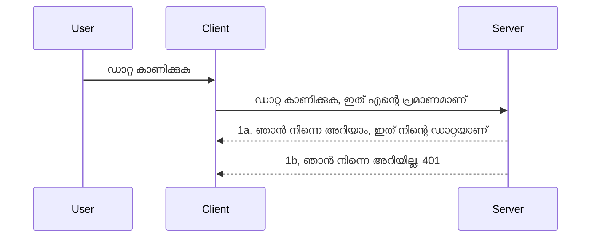

# എളുപ്പത്തിലുള്ള അഥവാ ഓഥ്

MCP SDKകൾ ഓAuth 2.1 ഉപയോഗിക്കുന്നത് പിന്തുണയ്ക്കുന്നു, ഇത് സത്യത്തിൽ ഒരു വ്യാപകമായ പ്രക്രിയയാണ്, അതിൽ ഓAuth സർവർ, റിസോഴ്‌സ് സർവർ, ക്രെഡൻഷ്യലുകൾ പോസ്റ്റ് ചെയ്യൽ, ഒരു കോഡ് ലഭിക്കൽ, കോഡ് എക്സ്ചേഞ്ച് ചെയ്ത് ബിയറർ ടോക്കൺ നേടൽ എന്നിവ ഉൾപ്പെടുന്നു, ഒടുവിൽ നിങ്ങളുടെ റിസോഴ്‌സ് ഡാറ്റ ലഭിക്കുന്നതുവരെ. നിങ്ങൾ ഓAuth-നോട് പരിചയപ്പെട്ടിട്ടില്ലെങ്കിൽ, ഇത് നടപ്പിലാക്കാൻ മനോഹരമായ ഒരു കാര്യമാണ്, ആദ്യം കുറച്ചു അടിസ്ഥാന ഏത് നിർദ്ദേശങ്ങളോടെ ആരംഭിച്ച് സുരക്ഷ മെച്ചപ്പെടുത്താൻ ശ്രമിക്കാൻ നല്ലതാണ്. അതുകൊണ്ട് ഇത് തന്നെ ഈ അധ്യായം ഉണ്ട്, നിങ്ങളെ കൂടുതൽ പ്രഗത്ഭവമായ അഥവിലേക്ക് ഉയർത്താൻ.

## അഥ്വാ, ഞങ്ങൾ എന്താണ് സൂചിപ്പിക്കുന്നത്?

അഥ്വാ എന്നത് authentication (സാധ്യത ഉറപ്പിക്കൽ) , authorization (അനുമതി നൽകൽ) എന്നീ രണ്ടിനൊപ്പം ചുരുക്കിയാണ്. ആശയം നമുക്ക് രണ്ട് കാര്യങ്ങൾ നടത്തേണ്ടതാണ്:

- **Authentication**, അത് ഒരാളെ നമ്മുടെ വീട്ടിലേക്ക് വരാൻ അനുവദിക്കണോ എന്ന് കണ്ടെത്താനുള്ള പ്രക്രിയയാണ്, അവരെ "ഇവിടെ" լինելու അവകാശമുള്ളവളായിരിക്കുന്നോ എന്ന് ഉറപ്പുവരുത്തൽ, അതായത് MCP സർവറിന്റെ ഫീച്ചറുകൾ ലോഗ്ഡൗൺ ചെയ്യുന്ന റിസോഴ്‌സ് സർവറിലെ ആക്സസ്.
- **Authorization**, ഉപയോക്താവ് ഒരു പ്രത്യേക റിസോഴ്‌സിലേക്കുള്ള അഭിലാഷനുസരിച്ച് അവയ്ക്ക് ആക്സസ് നൽകേണ്ടതുണ്ടോ എന്ന് കണ്ടെത്തൽ, ഉദാഹരണത്തിന് ഈ ഓർഡറുകൾ അല്ലെങ്കിൽ ഈ ഉല്പന്നങ്ങൾ, അല്ലെങ്കിൽ ഉള്ളടക്കം വായിക്കാൻ അനുവദിക്കുന്നു പക്ഷേ അടയ്ക്കാൻ അല്ല എന്നുപോലെ.

## ക്രെഡൻഷ്യലുകൾ: ഞങ്ങൾ സിസ്റ്റം അറിയിക്കേണ്ടത് ആരെന്നും

മികച്ച വെബ് ഡെവലപ്പർമാർക്ക് സാധാരണയായി ഒരു ക്രെഡൻഷ്യൽ നൽകുന്നത് എങ്ങനെ എന്നു ചിന്തിക്കാൻ തുടങ്ങും, സാധാരണയായി ഒരു സീക്രട്ട്, അത് അവരെ ഇവിടെ അനുവദിക്കുന്നുണ്ടോ എന്നുള്ളത് കാണിക്കും "Authentication". ഈ ക്രെഡൻഷ്യൽ സാധാരണയായി യൂസർനെയിം-പാസ്വേഡ് ബേസ്64 എൻകോഡുചെയ്ത രൂപമോ API കീ ആണോ, ഏതെങ്കിലും ഒരു വ്യക്തിഗത ഉപയോക്താവിനെ തിരിച്ചറിയുന്നതാണ്.

ഇത് "Authorization" എന്ന ഹെഡറിലൂടെ ഇങ്ങനെ അയച്ചുകൊടുക്കുന്നത് സാധാരണതാണ്:

```json
{ "Authorization": "secret123" }
```

ഇത് സാധാരണയായി അടിസ്ഥാന authentication എന്നറിയപ്പെടുന്നു. ആകെ പ്രവാഹം ഇങ്ങനെ പ്രവർത്തിക്കുന്നു:


```mermaid
sequenceDiagram
   participant User
   participant Client
   participant Server

   User->>Client: ഡാറ്റ കാണിക്കുക
   Client->>Server: ഡാറ്റ കാണിക്കുക, ഇത് എന്റെ പ്രമാണമാണ്
   Server-->>Client: 1a, ഞാൻ നിന്നെ അറിയാം, ഇത് നിന്റെ ഡാറ്റയാണ്
   Server-->>Client: 1b, ഞാൻ നിന്നെ അറിയില്ല, 401 
```

ഇപ്പോൾ പ്രവാഹ കാഴ്ചപ്പാടിൽ എങ്ങനെ പ്രവർത്തിക്കുന്നതെന്ന് മനസ്സിലായപ്പോൾ, ഇത് എങ്ങനെ നടപ്പിലാക്കും? വെബ് സർവറിന് സാധാരണയുള്ള ഒരു കോഡ് ഭാഗമാണുള്ള മിഡിൽവെയർ എന്ന സംജ്ഞയുണ്ട്, ഇത് ഒരു റിക്വസ്റ്റ് ഭാഗമായാണ് പ്രവർത്തിക്കുന്നത്, ക്രെഡൻഷ്യലുകൾ ശരിയായതാണോ എന്ന് പരിശോധിക്കാൻ കഴിയും, സത്യമാണെങ്കിൽ അഭ്യർത്ഥനക്ക് വഴിവിടും. സാധുവായ ക്രെഡൻഷ്യലുകൾ ഇല്ലെങ്കിൽ ഒരു അഥ്വാ പിശക് ലഭിക്കും. ഇതു എങ്ങനെ നടപ്പിലാക്കാമെന്ന് നോക്കാം:

**Python**

```python
class AuthMiddleware(BaseHTTPMiddleware):
    async def dispatch(self, request, call_next):

        has_header = request.headers.get("Authorization")
        if not has_header:
            print("-> Missing Authorization header!")
            return Response(status_code=401, content="Unauthorized")

        if not valid_token(has_header):
            print("-> Invalid token!")
            return Response(status_code=403, content="Forbidden")

        print("Valid token, proceeding...")
       
        response = await call_next(request)
        # ഏതെങ്കിലുംustomer ഹെഡറുകൾ ചേർക്കുക അല്ലെങ്കിൽ പ്രതികരണത്തിൽ ഏതെങ്കിലുമൊരു മാറ്റംفيذ
        return response


starlette_app.add_middleware(CustomHeaderMiddleware)
```

ഇവിടെ ഞങ്ങൾക്ക്:

- `AuthMiddleware` എന്ന മിഡിൽവെയർ സൃഷ്ടിച്ചിരിക്കുന്നു, അതിന്റെ `dispatch` മെത്തഡ് വെബ് സർവർ വിളിക്കുന്നു.
- മിഡിൽവെയർ വെബ് സർവറിലേക്ക് ചേർത്തിട്ടുണ്ട്:

    ```python
    starlette_app.add_middleware(AuthMiddleware)
    ```

- Authorization ഹെഡർ നിലവിലുണ്ടോ എന്നും അയച്ചിരിക്കുന്ന സീക്രട്ട് സമ്മതിയുള്ളതാണോ എന്നും പരിശോധിക്കുന്ന പരിശോധനാരീതി എഴുതിയിട്ടുണ്ട്:

    ```python
    has_header = request.headers.get("Authorization")
    if not has_header:
        print("-> Missing Authorization header!")
        return Response(status_code=401, content="Unauthorized")

    if not valid_token(has_header):
        print("-> Invalid token!")
        return Response(status_code=403, content="Forbidden")
    ```

    സീക്രട്ട് നിലവിലുണ്ടെങ്കിലും സാധുവായിരിക്കുകയാണെങ്കിൽ, അഭ്യർത്ഥനെ `call_next` വിളിച്ച് വഴി നൽകുന്നു, പ്രതികരണം തിരിച്ചു നൽകും.

    ```python
    response = await call_next(request)
    # ഏതെങ്കിലും കസ്റ്റമർ ഹെഡറുകൾ ചേർക്കുക അല്ലെങ്കിൽ പ്രതികരണത്തിൽ ഏതെങ്കിലും വിധത്തിൽ മാറ്റം വരുത്തുക
    return response
    ```

പ്രവൃത്തി രീതി ഇങ്ങനെ: സെർവറിലേക്ക് ഒരു വെബ് അഭ്യർത്ഥന വരുമ്പോൾ മിഡിൽവെയർ പ്രവർത്തിക്കും, നടപ്പിൽ ക്രെഡൻഷ്യലുകൾ ശരിയാണെങ്കിൽ അഭ്യർത്ഥനെ കടന്നുപോകാൻ അനുവദിക്കും അല്ലെങ്കിൽ ഉപയോക്താവിന് പ്രഗത്ഭത്തിലേക്ക് പോകാൻ അനുവദിക്കാത്ത പിശക് തിരികെ നൽകും.

**TypeScript**

ഇവിടെ პოპულർ ഫ്രെയിംവർക്ക് Express ഉപയോഗിച്ച് ഒരു മിഡിൽവെയർ സൃഷ്ടിക്കുന്നു, MCP സർവറിലേക്കുള്ള അഭ്യർത്ഥന മുമ്പായി തടയുന്നു. ഇത് കാണിക്കുന്ന കോഡ്:

```typescript
function isValid(secret) {
    return secret === "secret123";
}

app.use((req, res, next) => {
    // 1. പ്രാമാണീകരണ ഹെഡർ നിലവിലുണ്ടോ?
    if(!req.headers["Authorization"]) {
        res.status(401).send('Unauthorized');
    }
    
    let token = req.headers["Authorization"];

    // 2. വലുത്വം പരിശോധിക്കുക.
    if(!isValid(token)) {
        res.status(403).send('Forbidden');
    }

   
    console.log('Middleware executed');
    // 3. അഭ്യർത്ഥന പൈപ്പ്‌ലൈനിലെ അടുത്ത ഘട്ടത്തിലേക്ക് അയയ്ക്കുക.
    next();
});
```

ഈ കോഡിൽ നമ്മൾ:

1. Authorization ഹെഡർ നിലവിലുണ്ടോ എന്ന് പരിശോധിക്കുന്നു, ഇല്ലെങ്കിൽ 401 പിഴവ് നൽകുന്നു.
2. ക്രെഡൻഷ്യൽ/ടോക്കൺ സാധുവാണോ എന്ന് പരിശോധിക്കുന്നു, ഇല്ലെങ്കിൽ 403 പിശക് നൽകുന്നു.
3. അവസാനം അഭ്യർത്ഥന പൈപ്പ്ലൈനിൽ നേരത്തെ കടത്തുന്നു, ആവശ്യപ്പെട്ട റിസോഴ്‌സ് തിരിച്ചു നൽകുന്നു.

## അഭ്യാസം: authentication നടപ്പിലാക്കുക

നമുക്ക് അറിഞ്ഞതുപോലെ പരീക്ഷിച്ച് നടപ്പിലാക്കാം. പദ്ധതി ഇങ്ങനെ:

സെർവർ

- വെബ് സെർവർ ഒരു MCP ഇൻസ്റ്റൻസ് സൃഷ്ടിക്കുക.
- സെർവറിന് ഒരു മിഡിൽവെയർ നടപ്പിലാക്കുക.

ക്ലയന്റ്

- ഹെഡർ വഴി ‍ക്രെഡൻഷ്യൽ സഹിതം വെബ് അഭ്യർത്ഥന അയക്കുക.

### -1- വെബ് സെർവർ MCP ഇൻസ്റ്റൻസ് സൃഷ്ടിക്കുക

> [!WARNING]
> താഴെ TypeScript ഉദാഹരണം MCP `2025-11-25` ലക്ഷ്യമിടുന്നു. ഇത് ട്രാൻസ്പോർട്ടുകൾ ട്രാക്ക്
> ചെയ്യുന്നത് `mcp-session-id` ഉപയോഗിച്ച് ആണ്, ഇത് നിലവിലെ `2026-07-28` ട്രാൻസ്പോർട്ട് ഉദാഹരണം
> അല്ല. MCP `2026-07-28` റിമൂവ് ചെയ്യുന്നു `initialize` ഹാൻഡ്‌ഷേക്ക് & പ്രോട്ടോക്കോൾ സെഷൻ ഐഡി; പുതിയ
> നടപ്പിലാക്കലുകൾ സ്വതന്ത്ര അഭ്യർത്ഥനകളെ ഉപയോഗിക്കുന്നു. കാണുക
> [What's Changed in MCP: The 2026-07-28 Specification](../../01-CoreConcepts/mcp-2026-07-28.md).

നമ്മുടെ ആദ്യ പടിയിൽ വെബ് സെർവർ ഇൻസ്റ്റൻസ് MCP സെർവർ ഉണ്ടാക്കേണ്ടതുണ്ടു.

**Python**

ഇവിടെ MCP സെർവർ ഇൻസ്റ്റൻസ് സൃഷ്ടിക്കുന്നു, starlette വെബ് ആപ്പ് സൃഷ്ടിച്ച് uvicorn ഉപയോഗിച്ച് ഹോസ്റ്റ് ചെയ്യുന്നു.

```python
# MCP സെർവർ സൃഷ്ടിക്കുന്നു

app = FastMCP(
    name="MCP Resource Server",
    instructions="Resource Server that validates tokens via Authorization Server introspection",
    host=settings["host"],
    port=settings["port"],
    debug=True
)

# സ്റ്റാർലെറ്റ് വെബ് ആപ്പ് സൃഷ്ടിക്കുന്നു
starlette_app = app.streamable_http_app()

# uvicorn മുഖേന ആപ്പ് സേവനം നൽകുന്നു
async def run(starlette_app):
    import uvicorn
    config = uvicorn.Config(
            starlette_app,
            host=app.settings.host,
            port=app.settings.port,
            log_level=app.settings.log_level.lower(),
        )
    server = uvicorn.Server(config)
    await server.serve()

run(starlette_app)
```

ഈ കോഡിൽ:

- MCP സെർവർ സൃഷ്ടിക്കുന്നു.
- MCP സെർവറിലെ starlette വെബ് ആപ്പ് നിർമ്മിക്കുന്നു, `app.streamable_http_app()`.
- uvicorn ഉപയോഗിച്ച് വെബ് ആപ്പ് ഹോസ്റ്റ് ചെയ്ത് സർവ്വ് ചെയ്യുന്നു, `server.serve()`.

**TypeScript**

ഇവിടെ MCP സെർവർ ഇൻസ്റ്റൻസ് സൃഷ്ടിക്കുന്നു.

```typescript
const server = new McpServer({
      name: "example-server",
      version: "1.0.0"
    });

    // ... സെർവർ വിഭവങ്ങൾ, ഉപകരണങ്ങൾ, പ്രോംപ്റ്റുകൾ ക്രമീകരിക്കുന്നു ...
```

ഈ MCP സെർവർ സൃഷ്ടിക്കൽ POST /mcp റൂട്ട് നിർവചനം അയയിൽ നടത്തേണ്ടതിനാൽ മുകളിലത്തെ കോഡ് ഇങ്ങനെ മാറ്റാം:

```typescript
import express from "express";
import { randomUUID } from "node:crypto";
import { McpServer } from "@modelcontextprotocol/sdk/server/mcp.js";
import { StreamableHTTPServerTransport } from "@modelcontextprotocol/sdk/server/streamableHttp.js";
import { isInitializeRequest } from "@modelcontextprotocol/sdk/types.js"

const app = express();
app.use(express.json());

// സെഷന്‍ ഐഡിയനുസരിച്ച് ട്രാന്‍സ്‌പോര്‍ട്ടുകള്‍ സൂക്ഷിക്കുന്ന നക്‌ഷത്രം
const transports: { [sessionId: string]: StreamableHTTPServerTransport } = {};

// ക്ലയന്റ്-ടു-സെര്‍വര്‍ ആശയവിനിമയത്തിനുള്ള POST അഭ്യര്‍ഥനകള്‍ കൈകാര്യം ചെയ്യുക
app.post('/mcp', async (req, res) => {
  // നിലവിലുള്ള സെഷന്‍ ഐഡി പരിശോധിക്കുക
  const sessionId = req.headers['mcp-session-id'] as string | undefined;
  let transport: StreamableHTTPServerTransport;

  if (sessionId && transports[sessionId]) {
    // നിലവിലുള്ള ട്രാന്‍സ്‌പോര്‍ട്ട് വീണ്ടും ഉപയോഗിക്കുക
    transport = transports[sessionId];
  } else if (!sessionId && isInitializeRequest(req.body)) {
    // പുതിയ ആരംഭ അഭ്യര്‍ഥന
    transport = new StreamableHTTPServerTransport({
      sessionIdGenerator: () => randomUUID(),
      onsessioninitialized: (sessionId) => {
        // സെഷന്‍ ഐഡിയനുസരിച്ച് ട്രാന്‍സ്‌പോര്‍ട്ട് സൂക്ഷിക്കുക
        transports[sessionId] = transport;
      },
      // ഡിഎന്‍എസ് റീബൈന്‍റിംഗ് സംരക്ഷണം പിൻവാതിൽ സാങ്കേതികതയ്ക്ക് നിഷ്‌ക്രിയപ്പെടുത്തിയിരിക്കുന്നു. ഈ സെര്‍വര്‍
      // നിങ്ങളുടെ സിസ്റ്റത്തിൽ നടത്തുകയാണെങ്കിൽ, ഉറപ്പാക്കുക:
      // enableDnsRebindingProtection: true,
      // allowedHosts: ['127.0.0.1'],
    });

    // ക്ലോസ് ചെയ്ത ട്രാന്‍സ്‌പോര്‍ട്ട് ശുദ്ധീകരിക്കുക
    transport.onclose = () => {
      if (transport.sessionId) {
        delete transports[transport.sessionId];
      }
    };
    const server = new McpServer({
      name: "example-server",
      version: "1.0.0"
    });

    // ... സെര്‍വര്‍ വിഭവങ്ങള്‍, ഉപകരണങ്ങള്‍ மற்றும் പ്രാപ്തികള്‍ ക്രമീകരിക്കുക ...

    // MCP സെര്‍വറുമായി ബന്ധിപ്പിക്കുക
    await server.connect(transport);
  } else {
    // തെറ്റായ അഭ്യര്‍ഥന
    res.status(400).json({
      jsonrpc: '2.0',
      error: {
        code: -32000,
        message: 'Bad Request: No valid session ID provided',
      },
      id: null,
    });
    return;
  }

  // അഭ്യര്‍ഥന കൈകാര്യം ചെയ്യുക
  await transport.handleRequest(req, res, req.body);
});

// GET ಮತ್ತು DELETE അഭ്യര്‍ഥനകള്‍ക്കുള്ള പുനരുപയോഗയോഗ്യമായ ഹാന്‍ഡ്ലര്‍
const handleSessionRequest = async (req: express.Request, res: express.Response) => {
  const sessionId = req.headers['mcp-session-id'] as string | undefined;
  if (!sessionId || !transports[sessionId]) {
    res.status(400).send('Invalid or missing session ID');
    return;
  }
  
  const transport = transports[sessionId];
  await transport.handleRequest(req, res);
};

// SSE മുഖം ബന്ധപ്പെട്ട് server-to-client നോട്ടിഫിക്കേഷനുകള്‍ക്കുള്ള GET അഭ്യര്‍ഥനകള്‍ കൈകാര്യം ചെയ്യുക
app.get('/mcp', handleSessionRequest);

// സെഷന്‍ അവസാനിപ്പിക്കല്‍ക്കുള്ള DELETE അഭ്യര്‍ഥനകള്‍ കൈകാര്യം ചെയ്യുക
app.delete('/mcp', handleSessionRequest);

app.listen(3000);
```

ഇപ്പോൾ MCP സെർവർ സൃഷ്ടിക്കൽ `app.post("/mcp")` ഉള്ളിൽ നീക്കിയതായി കാണാം.

അടുത്ത പടിയിലേക്ക് കുതിക്കാം, മിഡിൽവെയർ നിർമ്മിച്ച് ഇത് വരുമായുള്ള ക്രെഡൻഷ്യൽ സാധുത പരിശോധിക്കാം.

### -2- സെർവറിനായി മിഡിൽവെയർ നടപ്പിലാക്കുക

ഇനി മിഡിൽവെയർ ഭേദഗതി. ഇവിടെ `Authorization` ഹെഡറിൽ ക്രെഡൻഷ്യൽ നോക്കുകയും പരിശോധിക്കുകയും ചെയ്യാൻ ഒരു മിഡിൽവെയർ സൃഷ്ടിക്കും. അത് അംഗീകൃതമാണെങ്കിൽ അഭ്യർത്ഥന MCP നിലവിലുണ്ടാക്കിയ പ്രവർത്തനം നടത്താൻ മുമ്പേക്ക് പോകും (ഉദാഹരണം, ടൂൾസ് ലിസ്റ്റ്, റിസോഴ്‌സ് വായിക്കുക അല്ലെങ്കിൽ മറ്റെന്തെങ്കിലും MCP പ്രവർത്തനം).

**Python**

മിഡിൽവെയർ സൃഷ്ടിക്കാൻ `BaseHTTPMiddleware` ക്ലാസിൽ നിന്നു‌ ഉത്തരവാദിത്തം ഏറ്റെടുക്കുന്നു. രണ്ട് പ്രധാന ഭാഗങ്ങളുണ്ട്:

- `request` - ഹെഡർ വിവരങ്ങൾ വായിക്കുന്ന അഭ്യർത്ഥി.
- `call_next` - ആഹ്വാനം ചെയ്യേണ്ട കോൾബാക്ക്, ക്ലയന്റ് എടുത്തിരിക്കുന്ന ക്രെഡൻഷ്യലിന് അംഗീകാരം നൽകുമ്പോൾ.

ആദ്യം, `Authorization` ഹെഡർ ഇല്ലെങ്കിൽ അവസ്ഥ കൈകാര്യം ചെയ്യണം:

```python
has_header = request.headers.get("Authorization")

# മുകളിലത്തെ ഹെഡർ ഇല്ല, 401-ൽ പരാജയപ്പെടുക, അല്ലാതെ മുന്നോട്ട് പോവുക.
if not has_header:
    print("-> Missing Authorization header!")
    return Response(status_code=401, content="Unauthorized")
```

ഇവിടെ ക്ലയന്റ് അംഗീകരിച്ചതില്ലാത്തതിനാൽ 401 അനധികൃത സന്ദേശം അയയ്ക്കുന്നു.

തുടർന്ന്, ക്രെഡൻഷ്യൽ നൽകിയെങ്കിൽ, അതിന്റെ സാധുത പരിശോധിക്കുന്നു:

```python
 if not valid_token(has_header):
    print("-> Invalid token!")
    return Response(status_code=403, content="Forbidden")
```

മുകളിൽ 403 നിരോധന സന്ദേശം അയച്ചു. താഴെ മുഴുവൻ മിഡിൽവെയർ കണ്ടു:

```python
class AuthMiddleware(BaseHTTPMiddleware):
    async def dispatch(self, request, call_next):

        has_header = request.headers.get("Authorization")
        if not has_header:
            print("-> Missing Authorization header!")
            return Response(status_code=401, content="Unauthorized")

        if not valid_token(has_header):
            print("-> Invalid token!")
            return Response(status_code=403, content="Forbidden")

        print("Valid token, proceeding...")
        print(f"-> Received {request.method} {request.url}")
        response = await call_next(request)
        response.headers['Custom'] = 'Example'
        return response

```

മികച്ചത്, പക്ഷേ `valid_token` ഫങ്ഷൻ എന്ത്? താഴെ കാണുക:

```python
# പ്രൊഡക്ഷന് വേണ്ടി ഉപയോഗിക്കരുത് - ഇത് മെച്ചപ്പെടുത്തൂ !!
def valid_token(token: str) -> bool:
    # "Bearer " പുനരാരംഭം നീക്കംചെയ്യുക
    if token.startswith("Bearer "):
        token = token[7:]
        return token == "secret-token"
    return False
```

ഇത് നിർവ്വ്യാപകമായി മെച്ചപ്പെടുത്തണം.

പ്രധാനമാണ്: ഈ രഹസ്യങ്ങൾ കോഡിലിരിക്കണം ഒരിക്കലും ഇല്ല. നിർദ്ദേശമുണ്ട് പിന്നിൽ ഈ വില മൂല്യങ്ങൾ ഒരു ഡാറ്റാസോഴ്സ് അല്ലെങ്കിൽ ഐഡി.പി (ഐഡന്റിറ്റി സേവന ദാതാവ്) മാറി, അല്ലെങ്കിൽ മികച്ചത് ആ ഐഡി.പി തന്നെയാണ് സാധുത പരിശോധിക്കുക.

**TypeScript**

Express ഉപയോഗിച്ച് ഇത് നടപ്പിലാക്കാൻ `use` മേധവ് ഉപയോഗിച്ച് മിഡിൽവെയർ ഫംഗ്ഷനുകൾ ചേർക്കണം.

നാം ചെയ്യേണ്ടത്:

- അഭ്യർത്ഥനയുടെ `Authorization` പ്രോപ്പർട്ടി പരിശോധിക്കുക.
- ക്രെഡൻഷ്യൽ പരിശോധിക്കുക, സാധുവാണെങ്കിൽ അഭ്യർത്ഥനം തുടരുവാൻ അനുവദിക്കുക, MCP ആവശ്യാനുസരിച്ച് പ്രവർത്തിക്കാൻ അനുവദിക്കുക.

ഇവിടെ `Authorization` ഹെഡർ ഉള്ളതായി നോക്കുന്നു, ഇല്ലെങ്കിൽ അഭ്യർത്ഥനം തടയുന്നു:

```typescript
if(!req.headers["authorization"]) {
    res.status(401).send('Unauthorized');
    return;
}
```

ഹെഡർ ഇല്ലെങ്കിൽ 401 ലഭിക്കും.

ശേഷിച്ച് ക്രെഡൻഷ്യൽ സാധുവായാണോ എന്ന് പരിശോധിക്കുന്നു, അല്ലെങ്കിൽ 403 പിശകുമായി അഭ്യർത്ഥനം തടയുന്നു:

```typescript
if(!isValid(token)) {
    res.status(403).send('Forbidden');
    return;
} 
```

403 പിശക് അപ്പോഴുണ്ട്.

മുഴുവൻ കോഡ് ഇതാണ്:

```typescript
app.use((req, res, next) => {
    console.log('Request received:', req.method, req.url, req.headers);
    console.log('Headers:', req.headers["authorization"]);
    if(!req.headers["authorization"]) {
        res.status(401).send('Unauthorized');
        return;
    }
    
    let token = req.headers["authorization"];

    if(!isValid(token)) {
        res.status(403).send('Forbidden');
        return;
    }  

    console.log('Middleware executed');
    next();
});
```

വെബ് സെർവർ ക്രെഡൻഷ്യൽ പരിശോധിക്കാൻ മിഡിൽവെയർ സ്വീകരിക്കുന്നു തയാറാക്കി. ക്ലയന്റ് എങ്ങനെ?

### -3- ഹെഡറിൽ ക്രെഡൻഷ്യൽ സഹിതം വെബ് അഭ്യർത്ഥനം അയക്കുക

ക്ലയന്റ് ഹെഡറിൽ ക്രെഡൻഷ്യൽ കൈമാറിയെന്നു ഉറപ്പാക്കണം. MCP ക്ലയന്റ് ഉപയോഗിക്കുമ്പോൾ ഇത് എങ്ങനെ ചെയ്യാമെന്ന് കണ്ടെത്തണം.

**Python**

ക്ലയന്റിന് ക്രെഡൻഷ്യൽ സഹിതം ഹെഡർ അയക്കണം ഈവിധം:

```python
# മൂല്യം ഹാർഡ്‌കോഡ് ചെയ്യരുത്, അതിനെ കുറഞ്ഞത് ഒരു എൻവയിരോൺമെന്റ് വേരിബിൾ അല്ലെങ്കിൽ കൂടുതൽ സുരക്ഷിതമായ സംഭരണത്തിൽ വയ്ക്കുക
token = "secret-token"

async with streamablehttp_client(
        url = f"http://localhost:{port}/mcp",
        headers = {"Authorization": f"Bearer {token}"}
    ) as (
        read_stream,
        write_stream,
        session_callback,
    ):
        async with ClientSession(
            read_stream,
            write_stream
        ) as session:
            await session.initialize()
      
            # TODO, ക്ലയന്റിൽ നിങ്ങൾ ചെയ്യാൻ ആഗ്രഹിക്കുന്നത് എന്താണ്, ഉദാ: ഉപകരണങ്ങൾ പട്ടികവായി കാണിക്കുക, ഉപകരണങ്ങൾ വിളിക്കുക തുടങ്ങിയവ.
```

`headers = {"Authorization": f"Bearer {token}"}` എന്നുപോലെ ഹെഡറുകൾ നമുക്ക് പൂരിപ്പിക്കുന്നു.

**TypeScript**

ഇരട്ടടി പടികൾ ചെയ്യാം:

1. ക്രെഡൻഷ്യൽ ഉപയോ​ഗിച്ച് കോൺഫിഗറേഷൻ ഒബ്‌ജക്ട് പൂരിപ്പിക്കുക.
2. കോൺഫിഗറേഷൻ ഒബ്‌ജക്ട് ട്രാൻസ്പോർട്ടിലേക്ക് നൽകുക.

```typescript

// ഇവിടെ കാണിച്ച പോലെ മൂല്യം ഹാർഡ്‌കോഡ് ചെയ്യരുത്. కనీసം ഇത് എൻവയർമെന്റ് വ്യാരിയബിൾ ആയി വെക്കുക, വികസന മോഡിൽ dotenv പോലുള്ള ഒരു പാക്കേജ് ഉപയോഗിക്കുക.
let token = "secret123"

// ഒരു ക്ലയന്റ് ട്രാൻസ്പോർട്ട് ഓപ്ഷൻ ഒബ്ജക്ട് നിർവ്വചിക്കുക
let options: StreamableHTTPClientTransportOptions = {
  sessionId: sessionId,
  requestInit: {
    headers: {
      "Authorization": "secret123"
    }
  }
};

// ട്രാൻസ്പോർട്ട്‌ ന് ഓപ്ഷൻസ് ഒബ്ജക്ട് പാസ്സ് ചെയ്യുക
async function main() {
   const transport = new StreamableHTTPClientTransport(
      new URL(serverUrl),
      options
   );
```

മുകളിൽ കാണുന്നത് പോലെയാണ് `requestInit` പ്രോപ്പർട്ടി കീഴിൽ ഹെഡറുകൾ സൂക്ഷിച്ചത്.

പ്രധാനമാണ്: ഇങ്ങനെ ക്രെഡൻഷ്യൽ പാസ്സ് ചെയ്യുന്നത് HTTPS ഇല്ലെങ്കിൽ അപകടകാരിയാകാം. ക്രെഡൻഷ്യൽ മോഷ്ടിക്കപ്പെടാമെന്നും പ്രശ്നമുണ്ട്, അതിനാൽ ടോക്കൺ പിന്വലിക്കാനുള്ള സംവിധാനവും കോഴిస్టുകൾ സ്ഥാനം പരിശോധിക്കുന്നഅടക്കമുള്ള കുറെ സുരക്ഷാ പരിശോധനകളും വേണം.

എങ്കിലും വളരെ അടിസ്ഥാന APIകൾക്ക്, അനാഥികർത്തരായിട്ടും യാതൊരു വന്നടങ്ങും ഇല്ലാതെ ആ API വിളിക്കാൻ ആഗ്രഹിക്കുന്നില്ലെങ്കിൽ ഇങ്ങനെ തുടങ്ങുക നല്ലതാണെന്ന് പറയാം.

അതുപോലെ, JSON Web Token (JWT അല്ലെങ്കിൽ "JOT" ടോക്കണുകൾ) പോലൊരു സാധാരണകൃതമായ ഫോർമാറ്റ് ഉപയോഗിച്ച് സുരക്ഷ കർശനമാക്കാൻ ശ്രമിക്കാം.

## JSON Web Tokens, JWT

അതായത്, വളരെ ലളിതമായ ക്രെഡൻഷ്യലുകൾ അയക്കുന്നതിൽ നിന്നു മെച്ചപ്പെടുത്താൻ ശ്രമിക്കുന്നു. JWT ഉപയോഗിക്കുന്നത് ഉടനെ കിട്ടുന്ന മെച്ചങ്ങൾ എന്തെല്ലാം?

- **സുരക്ഷാ മെച്ചപ്പെടുത്തലുകൾ**. അടിസ്ഥാന അഥ്വിൽ, നിങ്ങൾ യൂസർനെയിം-പാസ്വേഡുകൾ ആസ്‌കോഡ് ചെയ്ത് (അഥവാ API കീ ഫീച്ചർ ചെയ്ത്) ഇടയ്ക്കിടെ അയയ്ക്കുന്നു, അത് സുരക്ഷാ അപകടം വർധിപ്പിക്കുന്നു. JWT-യിൽ, നിങ്ങൾ യൂസർനെയിം-പാസ്വേഡുകൾ അയച്ച് ടോക്കൺ ലഭിക്കുന്നു, അത് സമയപരിധിയുള്ളതാണ് എന്നതും. JWT ൽ റോളുകൾ, സ്കോപ്പുകൾ, അനുമതികൾ എന്നിവ ഉപയോഗിച്ചുള്ള സൂക്ഷ്മ ആക്സസ് നിയന്ത്രണം آسانമാണ്.
- **സ്റ്റേറ്റ്‌ലസ്നെസ്, സ്കെയിലബിലിറ്റി**. JWT സ്വയം ഉൾകൊള്ളുന്നവയാണ്, എല്ലാ ഉപയോക്തൃ വിവരങ്ങളും കൈവശം വെച്ചിരിക്കുന്നതിനാൽ സർവർ-സൈഡ് സെഷൻ സ്റ്റോറേജ് ആവശ്യമില്ല. ടോക്കൺ ലോക്കൽ ഉപയോ​ഗിച്ച് സാധുത പരിശോധിക്കാവുന്നതാണ്.
- **ഇന്റർഓപറബി​ലിറ്റി, ഫെഡറേഷൻ**. JWT Open ID Connect-ന്റെ കേന്ദ്ര ഭാഗമാണ്, Entra ID, Google Identity, Auth0 പോലുള്ള പരിചിത ആധാരങ്ങളുമായി ചേർന്ന് പ്രവർത്തിക്കുന്നു. സിംഗ്ൾ സൈൻഓൺ പോലുള്ള പരിപാലനങ്ങളും നിർവഹിക്കാം, എന്റർപ്രൈസ് നിലവാരത്തിലുള്ളതാണ്.
- **മൊഡുലാരിറ്റി, ഫ്ലെക്സിബിലിറ്റി**. JWT, Azure API Management, NGINX പോലുള്ള API ഗേറ്റ്വേസിൽ ഉപയോഗിക്കാം. ഉപയോക്തൃ അനുകൂലമായ പ്രക്രിയകളും സർവർ-ടു-സർവീസ് സംഭാഷണങ്ങളും ഉൾപ്പെടെ (ഇംപിർസണേഷൻ / ഡെലിഗേഷൻ) പിന്തുണയ്ക്കുന്നു.
- **പ്രകടനവും കാഷിംഗും**. ടോക്കൺ ഡികോഡ് ചെയ്ത ശേഷം കാഷ് ചെയ്യാവുന്നതാണ്, അതോടെ പാഴ്‌സിംഗ് ആവശ്യകത കുറയുന്നു. ഇതു പ്രത്യേകിച്ചും ഉയർന്ന ട്രാഫിക് ഉള്ള ആപ്പുകൾക്കു throughput മെച്ചപ്പെടുത്തുകയും ഇൻഫ്രാസ്ട്രകർ ചരിവ് കുറക്കുകയും ചെയ്യുന്നു.
- **വിശകലന സാധ്യതകൾ**. വാലിഡിറ്റി പരിശോധനയും റവൊക്കേഷനും (ടോക്കൺ അസാധുവാക്കൽ) പിന്തുണയ്ക്കുന്നു.

ഈ അഭിമുഖ്യചിന്തകളോടെ, നടപ്പിലാക്കൽ എങ്ങനെ കൂടുതൽ ഉയർത്താം നോക്കാം.

## അടിസ്ഥാന അഥ്വിൽ നിന്ന് JWT ആയി മാറ്റം

ചെറിയ പടികൾ ആയി മാറ്റങ്ങൾ:

- **JWT ടോക്കൺ നിർമ്മാതാക്കുക** , ക്ലയന്റിൽ നിന്ന് സെർവറിലേക്ക് അയയ്ക്കാൻ തയ്യാറാക്കുക.
- **JWT ടോക്കൺ പരിശോധിക്കുക**, സാധുവാണെങ്കിൽ ക്ലയന്റ് റിസോഴ്‌സുകൾ നേടാൻ അനുവദിക്കുക.
- **ടോക്കൺ സുരക്ഷിതമായി സംഭരിക്കൽ**. ടോക്കൺ എങ്ങനെ സൂക്ഷിക്കാം.
- **റൂട്ടുകൾ സംരക്ഷിക്കുക** . MCP ഫീച്ചറുകളും വിശേഷമായ റൂട്ടുകളും സംരക്ഷിക്കണം.
- **റിഫ്രഷ് ടോക്കണുകൾ ചേർക്കുക** . ചെറിയ കാലയളവുള്ള ടോക്കണുകളും, കാലഹരണപ്പെട്ടാൽ പുതുതായി ലഭിക്കാവുന്ന റിഫ്രഷ് ടോക്കണുകളും ഉണ്ടാക്കണം. റിഫ്രഷ് എൻഡ്‌പോയിന്റുകളും റോട്ടേഷൻ തന്ത്രങ്ങളും വേണം.

### -1- JWT ടോക്കൺ നിർമ്മാണം

ആദ്യം, JWT ടോക്കൺ ഇതൊക്കെയാണ്:

- **header** - ആൽഗോറിധം ഉപയോഗിച്ചും ടോക്കൺ തരം.
- **payload** - ക്ലെയിംസ്, sub (ഉപയോക്താവിന്റെ ഐഡി), exp (കാലഹരണപ്പെട്ട സമയം), role (പങ്ക്)
- **signature** - രഹസ്യ അല്ലെങ്കിൽ സ്വകാര്യ കീ ഉപയോഗിച്ചുള്ള സൈൻ ചെയ്യൽ.

ഇതിനു ഹെഡർ, പേച്ച്‌ളോഡ് നിർമ്മിച്ച് എൻകോഡ് ചെയ്‌ത ടോക്കൺ വേണം.

**Python**

```python

import jwt
import jwt
from jwt.exceptions import ExpiredSignatureError, InvalidTokenError
import datetime

# JWT-നെ സൈൻ ചെയ്യാൻ ഉപയോഗിക്കുന്ന രഹസ്യ കീ
secret_key = 'your-secret-key'

header = {
    "alg": "HS256",
    "typ": "JWT"
}

# ഉപയോക്തൃ വിവരം, അതിന്റെ അവകാശങ്ങൾ, കാലഹരണ സമയവും
payload = {
    "sub": "1234567890",               # വിഷയം (ഉപയോക്തൃ ഐഡി)
    "name": "User Userson",                # ഇഷ്ടാനുസൃത അവകാശം
    "admin": True,                     # ഇഷ്ടാനുസൃത അവകാശം
    "iat": datetime.datetime.utcnow(),# നൽകിയ തിയതി
    "exp": datetime.datetime.utcnow() + datetime.timedelta(hours=1)  # കാലഹരണം
}

# കോഡ് ചെയ്യുക
encoded_jwt = jwt.encode(payload, secret_key, algorithm="HS256", headers=header)
```

മുകളിലുള്ള കോഡിൽ:

- HS256 ആൽഗോറിധവും ടോക്കൺ പ്രകാരവും headerിൽ നിർവ്വചിച്ചു.
- സബ്ജക്ട് (ഉപയോക്താവിന്റെ ഐഡി), യൂസർനെയിം, പങ്ക്, പുറത്തിറക്കിയ സമയവും കാലഹരണപ്പെട്ട സമയവുമുള്ള പേച്ച്‌ളോഡ് നിർമ്മിച്ചു.

**TypeScript**

JWT ടോക്കൺ നിർമ്മിക്കുന്നതിനുള്ള കുറച്ച് ഡിപ്പെൻഡൻസി മാത്രം വേണം.

ഡിപ്പെൻഡൻസികൾ

```sh

npm install jsonwebtoken
npm install --save-dev @types/jsonwebtoken
```

ഇതിനുശേഷം ഹെഡർ, പേച്ച്‌ളോഡ് നിർമ്മിച്ച് ടോക്കൺ എങ്കോഡ് ചെയ്യാം.

```typescript
import jwt from 'jsonwebtoken';

const secretKey = 'your-secret-key'; // പ്രൊഡക്ഷൻ ൽ എൻവി വേരിയബിളുകൾ ഉപയോഗിക്കുക

// പേലോഡ് നിർവചിക്കുക
const payload = {
  sub: '1234567890',
  name: 'User usersson',
  admin: true,
  iat: Math.floor(Date.now() / 1000), // പുറത്തിറക്കിയ സമയം
  exp: Math.floor(Date.now() / 1000) + 60 * 60 // 1 മണിക്കൂർ കഴിഞ്ഞു കാലഹരണപ്പെടും
};

// ഹെഡർ നിർവചിക്കുക (ഐച്ഛികം, jsonwebtoken നിഷ്‌ക്രിയമാക്കുന്നു ഡീഫോൾട് സജ്ജീകരണങ്ങൾ)
const header = {
  alg: 'HS256',
  typ: 'JWT'
};

// ടോക്കൺ സൃഷ്ടിക്കുക
const token = jwt.sign(payload, secretKey, {
  algorithm: 'HS256',
  header: header
});

console.log('JWT:', token);
```

ഈ ടോക്കൺ:

HS256 ഉപയോഗിച്ച് ഒപ്പിട്ടത്
1 മണിക്കൂർ സാധുവായിരിക്കും
sub, name, admin, iat, exp തുടങ്ങിയ ക്ലെയിംസ് ഉൾക്കൊള്ളുന്നു.

### -2- ടോക്കൺ പരിശോധിക്കൽ

ടോക്കൺ പരിശോധനയും സെർവറിൽ തന്നെ നടത്തണം, ക്ലയന്റ് അയക്കുന്ന ടോക്കൺ ശരിയാണോ എന്നത് ഉറപ്പുവരുത്തുകയും, ടോക്കണിന്റെ ഘടനയും സാധ്യതയുമുള്ള നിരവധി പരിശോധനകൾ നടത്തണം. ഉപയോക്താവ് സിസ്റ്റത്തിൽ ഒപ്പമുള്ളവയാണോ എന്നടക്കമുള്ള മറ്റു പരിശോധനകളും ചേർക്കാൻ നിർദ്ദേശിക്കുന്നു.

ടോക്കൺ പരിശോധിക്കാൻ, ആദ്യം ഡികോഡ് ചെയ്ത് വായിക്കാം പിന്നെ സാധുത പരിശോധിക്കാം:

**Python**

```python

# JWT ഡികോഡ് ചെയ്ത് സ്ഥിരീകരിക്കുക
try:
    decoded = jwt.decode(token, secret_key, algorithms=["HS256"])
    print("✅ Token is valid.")
    print("Decoded claims:")
    for key, value in decoded.items():
        print(f"  {key}: {value}")
except ExpiredSignatureError:
    print("❌ Token has expired.")
except InvalidTokenError as e:
    print(f"❌ Invalid token: {e}")

```


ഈ കോഡിൽ, നാം ടോക്കൺ, രഹസ്യ കീ, തിരഞ്ഞെടുക്കപ്പെട്ട ആൽഗോറിതം എന്നിവയെ ഇൻപുട്ടായി ഉപയോഗിച്ച് `jwt.decode` വിളിക്കുന്നു. പരാജയപ്പെട്ട പരിശോധന മൂലം ഒരു പിശക് ഉയരുന്നത് ശ്രദ്ധിക്കുക, അതിനാൽ നാം try-catch ഘടന ഉപയോഗിക്കുന്നു.

**TypeScript**

ഇവിടെ നാം ടോക്കണിന്റെ ഡികോഡഡ് വേർഷൻ ലഭിക്കാൻ `jwt.verify` വിളിക്കേണ്ടതുണ്ട്, അതിനെ നാം തുടര്‍ന്ന് വിശകലനം ചെയ്യാൻ കഴിയും. ഈ വിളിപ്പ് പരാജയപ്പെടുകയാണെങ്കിൽ, അത് ടോക്കണിന്റെ ഘടന തെറ്റാണ് എങ്കിൽ അല്ലെങ്കിൽ ടോക്കൺ ഇനി സാധുവല്ല.

```typescript

try {
  const decoded = jwt.verify(token, secretKey);
  console.log('Decoded Payload:', decoded);
} catch (err) {
  console.error('Token verification failed:', err);
}
```

ശ്രദ്ധിക്കുക: മുൻപ് പറഞ്ഞത് പോലെ, ഈ ടോക്കൺ നമ്മുടെ സിസ്റ്റത്തിൽ ഒരു ഉപയോക്താവിനെ സൂചിപ്പിക്കുന്നതായി ഉറപ്പാക്കാനും ഉപയോക്താവിന് അവകാശം ഉണ്ടെന്ന് ഉറപ്പാക്കാനും നാം അധിക പരിശോധനകൾ നടത്തണം.

ഇനി, റോളിന് ആധാരമായ ആക്സസ് നിയന്ത്രണം, ആര്‍ബിഎസി (RBAC) എന്നറിയപ്പെടുന്നതിലേക്ക് നോക്കാം.

## റോളിന് ആധാരമായ ആക്സസ് നിയന്ത്രണം ചേർക്കൽ

സംശയം ഇതാണ്: വ്യത്യസ്ത റോളുകൾക്ക് വ്യത്യസ്ത അനുമതുകൾ ഉണ്ട് എന്ന് പ്രകടിപ്പിക്കാൻ ഞങ്ങൾ ആഗ്രഹിക്കുന്നു. ഉദാഹരണത്തിന്, ഒരു അഡ്മിൻ എല്ലാ കാര്യങ്ങളും ചെയ്യാൻ കഴിയും എന്നും സാധാരണ ഉപയോക്താവ് വായിക്കാനും എഴുതാനും കഴിയും എന്നും അതിഥി വെറും വായിക്കാൻ മാത്രം കഴിയും എന്നും നമുക്ക് ധരിക്കാം. അതിനാൽ, ചില അനുമതി നിലകൾ ഇങ്ങനെ:

- Admin.Write
- User.Read
- Guest.Read

ഇത്തരത്തിലുള്ള നിയന്ത്രണം മിഡിൽവെയർ ഉപയോഗിച്ച് എങ്ങനെ നടപ്പിലാക്കാമെന്ന് നോക്കാം. മിഡിൽവെയറുകൾ ഓരോ റൂട്ടിനും കൂടാതെ എല്ലാ റൂട്ടുകൾക്കും ചേർക്കാം.

**Python**

```python
from starlette.middleware.base import BaseHTTPMiddleware
from starlette.responses import JSONResponse
import jwt

# രഹസ്യം കോഡിൽ ഇങ്ങനെ വെക്കരുത്, ഇത് മുറിപ്പാട് കാണിക്കാൻ മാത്രമാണ്. സുരക്ഷിതമായ സ്ഥലത്ത് നിന്ന് വായിക്കുക.
SECRET_KEY = "your-secret-key" # ഇത് എൻവിയിലേക്ക് വയ്ക്കുക
REQUIRED_PERMISSION = "User.Read"

class JWTPermissionMiddleware(BaseHTTPMiddleware):
    async def dispatch(self, request, call_next):
        auth_header = request.headers.get("Authorization")
        if not auth_header or not auth_header.startswith("Bearer "):
            return JSONResponse({"error": "Missing or invalid Authorization header"}, status_code=401)

        token = auth_header.split(" ")[1]
        try:
            decoded = jwt.decode(token, SECRET_KEY, algorithms=["HS256"])
        except jwt.ExpiredSignatureError:
            return JSONResponse({"error": "Token expired"}, status_code=401)
        except jwt.InvalidTokenError:
            return JSONResponse({"error": "Invalid token"}, status_code=401)

        permissions = decoded.get("permissions", [])
        if REQUIRED_PERMISSION not in permissions:
            return JSONResponse({"error": "Permission denied"}, status_code=403)

        request.state.user = decoded
        return await call_next(request)


```

മിഡിൽവെയർ ചേർക്കാനുള്ള ചില വ്യത്യസ്ത മാർഗ്ഗങ്ങൾ താഴെപ്പറയുന്നവയാണ്:

```python

# Alt 1: starlette ആപ്പ് നിർമ്മിക്കുന്നപ്പോൾ middleware ചേർക്കുക
middleware = [
    Middleware(JWTPermissionMiddleware)
]

app = Starlette(routes=routes, middleware=middleware)

# Alt 2: starlette ആപ്പ് ഇതിനകം നിർമ്മിച്ച ശേഷമാണ് middleware ചേർക്കുക
starlette_app.add_middleware(JWTPermissionMiddleware)

# Alt 3: ഓരോ റൂട്ടിനും middleware ചേർക്കുക
routes = [
    Route(
        "/mcp",
        endpoint=..., # ഹാൻഡ്‌ലർ
        middleware=[Middleware(JWTPermissionMiddleware)]
    )
]
```

**TypeScript**

നാം `app.use` ഉപയോഗിച്ച് എല്ലാ അഭ്യർത്ഥനകൾക്കുമായി പ്രവർത്തിക്കുന്ന മിഡിൽവെയർ ഉപയോഗിക്കാം.

```typescript
app.use((req, res, next) => {
    console.log('Request received:', req.method, req.url, req.headers);
    console.log('Headers:', req.headers["authorization"]);

    // 1. അവകാശപത്രം ഹെഡർ അയച്ചിട്ടുള്ളതാണോ എന്ന് പരിശോധിക്കുക

    if(!req.headers["authorization"]) {
        res.status(401).send('Unauthorized');
        return;
    }
    
    let token = req.headers["authorization"];

    // 2. ടോക്കൺ സാധുവാണോ എന്ന് പരിശോധിക്കുക
    if(!isValid(token)) {
        res.status(403).send('Forbidden');
        return;
    }  

    // 3. ടോക്കൺ ഉപയോഗിക്കുന്നവന് നമ്മുടെ സിസ്റ്റത്തിൽ ഉള്ളവനാണോ എന്ന് പരിശോധിക്കുക
    if(!isExistingUser(token)) {
        res.status(403).send('Forbidden');
        console.log("User does not exist");
        return;
    }
    console.log("User exists");

    // 4. ടോക്കണിന് ശരിയായ അനുമതികൾ ഉള്ളതാണോയെന്ന് സ്ഥിരീകരിക്കുക
    if(!hasScopes(token, ["User.Read"])){
        res.status(403).send('Forbidden - insufficient scopes');
    }

    console.log("User has required scopes");

    console.log('Middleware executed');
    next();
});

```

നമുക്ക് മിഡിൽവെയർ ചെയ്യേണ്ട ചില കാര്യങ്ങളും അതിന്റെ ചെയ്യേണ്ടതും:

1. authorization ഹെഡർ ഉള്ളുണ്ടോ എന്ന് പരിശോധിക്കുക
2. ടോക്കൺ സാധുവോ എന്ന് പരിശോധിക്കുക, `isValid` എന്ന നാം രേഖപ്പെടുത്തിയ ഒരു മെത്തഡ് വിളിച്ച് JWT ടോക്കണിന്റെ സ്വകാര്യതയും സാധുതയും പരിശോധിക്കുന്നു.
3. ഉപയോക്താവ് നമ്മുടെ സിസ്റ്റത്തിൽ ഉണ്ടോ എന്ന് സ്ഥിരീകരിക്കുക, ഇത് പരിശോധിക്കണം.

   ```typescript
    // ഡീറ്റാബേസിലെ ഉപയോക്താക്കൾ
   const users = [
     "user1",
     "User usersson",
   ]

   function isExistingUser(token) {
     let decodedToken = verifyToken(token);

     // ചെയ്യേണ്ടതുണ്ട്, ഉപയോക്താവ് ഡീറ്റാബേസിൽ ഉള്ളുണ്ടോ എന്നത് പരിശോധിക്കുക
     return users.includes(decodedToken?.name || "");
   }
   ```

   മുകളിൽ, നാം വളരെ ലളിതമായ `users` ലിസ്റ്റ് ഉണ്ടാക്കി, ഇത് ബേസായി ഡാറ്റാബേസ് ആയിരിക്കണം.

4. കൂടാതെ, ടോക്കണിന് ശരിയായ അനുമതികൾ ഉണ്ടെന്ന് പരിശോധിക്കണം.

   ```typescript
   if(!hasScopes(token, ["User.Read"])){
        res.status(403).send('Forbidden - insufficient scopes');
   }
   ```

   മിഡിൽവെയറിൽ നിന്നുള്ള മുകളിൽ കാണിച്ചിരിക്കുന്ന ഈ കോഡിൽ, ടോക്കൺ User.Read അനുമതി ഉണ്ടെന്ന് പരിശോധിക്കുന്നു, അതല്ലെങ്കിൽ 403 പിശക് അയയ്ക്കുന്നു. താഴെ `hasScopes` ഹെൽപ്പർ മെത്തഡാണ്.

   ```typescript
   function hasScopes(scope: string, requiredScopes: string[]) {
     let decodedToken = verifyToken(scope);
    return requiredScopes.every(scope => decodedToken?.scopes.includes(scope));
  }
   ```

Have a think which additional checks you should be doing, but these are the absolute minimum of checks you should be doing.

Using Express as a web framework is a common choice. There are helpers library when you use JWT so you can write less code.

- `express-jwt`, helper library that provides a middleware that helps decode your token.
- `express-jwt-permissions`, this provides a middleware `guard` that helps check if a certain permission is on the token.

Here's what these libraries can look like when used:

```typescript
const express = require('express');
const jwt = require('express-jwt');
const guard = require('express-jwt-permissions')();

const app = express();
const secretKey = 'your-secret-key'; // put this in env variable

// Decode JWT and attach to req.user
app.use(jwt({ secret: secretKey, algorithms: ['HS256'] }));

// Check for User.Read permission
app.use(guard.check('User.Read'));

// multiple permissions
// app.use(guard.check(['User.Read', 'Admin.Access']));

app.get('/protected', (req, res) => {
  res.json({ message: `Welcome ${req.user.name}` });
});

// Error handler
app.use((err, req, res, next) => {
  if (err.code === 'permission_denied') {
    return res.status(403).send('Forbidden');
  }
  next(err);
});

```

മിഡിൽവെയർ.authentication, authorization രണ്ടിനും എങ്ങനെ ഉപയോഗിക്കാമെന്ന് നിങ്ങൾ കാണിച്ചുവെന്ന് ഇനി MCP എങ്ങനെ auth നടത്തുന്നു എന്ന് നോക്കാം.

### -3- MCP-യിൽ RBAC ചേർക്കുക

മിഡിൽവെയർ മുഖേന റോളിന്റെ ആധാരമായ ആക്സസ് നിയന്ത്രണം (RBAC) внеഞനുഭവിച്ചതായി കാണിച്ചു, പക്ഷേ MCP ന് ഓരോ MCP ഫീച്ചറിനും RBAC ചേർക്കാൻ സുഗമമായ മാർഗ്ഗം ഇല്ല, എങ്ങനെ ചെയ്യാം? ഒരു പ്രത്യേക ടൂൾ ഉപയോഗിക്കാനുള്ള ഉപഭോക്താവിന് അവകാശമുണ്ടോ എന്നത് പരിശോധിക്കുന്ന കോഡ് ചേർക്കണം:

ഓരോ ഫീച്ചറിനും RBAC അടുത്തുവരാനുള്ള ചില ഓപ്ഷനുകൾ:

- നിങ്ങൾക്ക് അനുമതി നില പരിശോധിക്കേണ്ട ഓരോ ടൂൾ, റിസോഴ്‌സ്, പ്രോപ്റ്റ് എന്നിവയ്‌ക്കായി ഒരു പരിശോധന ചേർക്കുക.

   **python**

   ```python
   @tool()
   def delete_product(id: int):
      try:
          check_permissions(role="Admin.Write", request)
      catch:
        pass # ക്ലയന്റ് അനുവദനത്തിൽ പരാജയപ്പെട്ടു, അനുവാദം പിഴവ് ഉയർത്തുക
   ```

   **typescript**

   ```typescript
   server.registerTool(
    "delete-product",
    {
      title: Delete a product",
      description: "Deletes a product",
      inputSchema: { id: z.number() }
    },
    async ({ id }) => {
      
      try {
        checkPermissions("Admin.Write", request);
        // ചെയ്യേണ്ടത്, ഐഡി productService-ലേയ്ക്കും remote entry-ലേയ്ക്കും അയയ്ക്കുക
      } catch(Exception e) {
        console.log("Authorization error, you're not allowed");  
      }

      return {
        content: [{ type: "text", text: `Deletected product with id ${id}` }]
      };
    }
   );
   ```


- വികസിത സെർവർ സമീപനവും അഭ്യർത്ഥന ഹാൻഡ്ലറുകളും ഉപയോഗിക്കുക, അതിലൂടെ പരിശോധന നടത്തേണ്ട ഇടങ്ങൾ കുറയ്ക്കുക.

   **Python**

   ```python
   
   tool_permission = {
      "create_product": ["User.Write", "Admin.Write"],
      "delete_product": ["Admin.Write"]
   }

   def has_permission(user_permissions, required_permissions) -> bool:
      # user_permissions: ഉപഭോക്താവിന് ഉള്ള അനുമതികളുടെ പട്ടിക
      # required_permissions: ടൂളിന് ആവശ്യമായ അനുമതികളുടെ പട്ടിക
      return any(perm in user_permissions for perm in required_permissions)

   @server.call_tool()
   async def handle_call_tool(
     name: str, arguments: dict[str, str] | None
   ) -> list[types.TextContent]:
    # request.user.permissions ഉപഭോക്താവിന്റെ അനുമതികളുടെ പട്ടിക ആണെന്ന് ധരിക്കുക
     user_permissions = request.user.permissions
     required_permissions = tool_permission.get(name, [])
     if not has_permission(user_permissions, required_permissions):
        # പിഴവ് ഉയർത്തുക "നിങ്ങൾക്ക് ടൂൾ {name} വിളിക്കാൻ അനുമതി ഇല്ല"
        raise Exception(f"You don't have permission to call tool {name}")
     # തുടരുക ಮತ್ತು ടൂൾ വിളിക്കുക
     # ...
   ```   
   

   **TypeScript**

   ```typescript
   function hasPermission(userPermissions: string[], requiredPermissions: string[]): boolean {
       if (!Array.isArray(userPermissions) || !Array.isArray(requiredPermissions)) return false;
       // ഉപയോക്താവിന് ഏറ്റവും കുറഞ്ഞ അപേക്ഷിച്ച അനുവാദം ഉണ്ടായാൽ സത്യമാണ് തിരികെ നൽകുക
       
       return requiredPermissions.some(perm => userPermissions.includes(perm));
   }
  
   server.setRequestHandler(CallToolRequestSchema, async (request) => {
      const { params: { name } } = request;
  
      let permissions = request.user.permissions;
  
      if (!hasPermission(permissions, toolPermissions[name])) {
         return new Error(`You don't have permission to call ${name}`);
      }
  
      // തുടരുക..
   });
   ```

   ശ്രദ്ധിക്കുക, മിഡിൽവെയർ ഡികോഡഡ് ടോക്കൺ അഭ്യർത്ഥനയുടെ user പ്രോപ്പർട്ടിയിലാണ് സെറ്റ് ചെയ്യുന്നത് എന്ന് ഉറപ്പാക്കണം, ഇതുവഴി മുകളിൽ കാണിച്ച കോഡ് ലളിതമാകുന്നു.

### സംഗ്രഹം

ఇప్పుడు പൊതുവായി RBAC പിന്തുണയും MCP-വിശേഷമായി എങ്ങനെ ചേർക്കാമെന്നും ചർച്ചിച്ചതിനുശേഷം, നിങ്ങൾ ഈ ആശയങ്ങൾ മനസ്സിലാക്കിയതായി ഉറപ്പാക്കാൻ സുരക്ഷ നടപ്പിലാക്കാൻ ശ്രമിക്കുക.

## അസൈൻമെന്റ് 1: അടിസ്ഥാന അസാധുവെടല്‍ ഉപയോഗിച്ച് mcp സെർവർ, mcp ക്ലയന്റ് നിർമ്മിക്കുക

ഹെഡറുകൾ വഴികളിലൂടെ ക്രിഡൻഷ്യൽസ് അയക്കുന്നതിൽ നിങ്ങൾ പഠിച്ചിടം ഇവിടെയാണ് ഉപയോഗിക്കുന്നത്.

## പരിഹാര 1

[Solution 1](./code/basic/README.md)

## അസൈൻമെന്റ് 2: അസൈൻമെന്റ് 1-ലെ പരിഹാരം JWT ഉപയോഗിച്ച് അപ്ഗ്രേഡ് ചെയ്യുക

ആദ്യ പരിഹാരം എടുത്ത് ഇപ്പോൾ അതിൽ മെച്ചപ്പെടുത്തൽ നടത്താം.

ബേസിക് അസാധുവെടല്‍ പകരം JWT ഉപയോഗിക്കാം.

## പരിഹാര 2

[Solution 2](./solution/jwt-solution/README.md)

## ചലഞ്ച്

"Add RBAC to MCP" വിഭാഗത്തിൽ വിവരിച്ചിട്ടുള്ള ടൂളിന്‍റെ RBAC ചേർക്കുക.

## സംഗ്രഹം

ഈ അധ്യായത്തിൽ നിങ്ങൾക്ക് చాలా ഒന്നും പഠിച്ചിട്ടുണ്ടാകും, ഒന്നും സുരക്ഷയില്ലാത്തത് മുതൽ അടിസ്ഥാന സുരക്ഷ, JWT, MCP-ൽ ഫിറ്റാക്കുന്നത് വരെ.

നാം കസ്റ്റം JWT-കൾ ഉപയോഗിച്ച് പ്രവർത്തനക്ഷമമായ ഒരു മുറിവ് തയാറാക്കിയിട്ടുണ്ട്, പക്ഷേ വളർച്ചയോടെ സ്റ്റാൻഡേർഡ് അധിഷ്ഠിത ഐഡന്റിറ്റി മോഡൽ toward മാറുകയാണ്. Entra അല്ലെങ്കിൽ Keycloak പോലുള്ള IdP സ്വീകരിച്ച് ടോക്കൺ ഇഷ്യൂ, പരിശോധന, ലൈഫ്ไซിക്കറ്റ് മാനേജ്മെന്റ് വിശ്വസനീയമായ പ്ലാറ്റ്ഫോമിലേക്ക് മാറ്റിയിരിക്കും — നമ്മുടെ ശ്രദ്ധ ആപ്പ് ലജിക്, ഉപയോക്തൃ അനുഭവത്തിലേക്ക് കേന്ദ്രീകരിക്കാൻ.

അതിനായി, നമ്മൾക്കുള്ള കൂടുതൽ [ഉന്നത അദ്ധായം enta](../../05-AdvancedTopics/mcp-security-entra/README.md) ഉണ്ട്

## ഇനി എന്ത്

- അടുത്തത്: [MCP ഹോസ്റ്റുകൾ സജ്ജീകരിക്കൽ](../12-mcp-hosts/README.md)

---

<!-- CO-OP TRANSLATOR DISCLAIMER START -->
**അറിയിപ്പ്**:
ഈ രേഖ AI പരിഭാഷാ സേവനം [Co-op Translator](https://github.com/Azure/co-op-translator) ഉപയോഗിച്ച് പരിഭാഷപ്പെടുത്തിയതാണ്. ഞങ്ങൾ കൃത്യതയ്ക്കായി ശ്രമിക്കുന്നുവെങ്കിലും, ഓട്ടോമേറ്റഡ് പരിഭാഷകളിൽ പിഴവുകൾ അല്ലെങ്കിൽ തെറ്റായ വിവരങ്ങൾ ഉണ്ടാകാൻ സാധ്യതയുണ്ട്. അതിന്റെ സ്വാഭാവിക ഭാഷയിലുള്ള അസൽ രേഖയാണ് പ്രാമാണികമായ ഉറവിടമായി പരിഗണിക്കേണ്ടത്. നിർണായകമായ വിവരങ്ങൾക്ക്, പ്രൊഫഷണൽ മനുഷ്യ പരിഭാഷ ശുപാർശ ചെയ്യുന്നു. ഈ പരിഭാഷ ഉപയോഗിച്ച് ഉണ്ടാകുന്ന തെറ്റിദ്ധാരണകൾ അല്ലെങ്കിൽ തെറ്റായ വ്യാഖ്യാനങ്ങൾക്കായി ഞങ്ങൾ ഉത്തരവാദികളല്ല.
<!-- CO-OP TRANSLATOR DISCLAIMER END -->