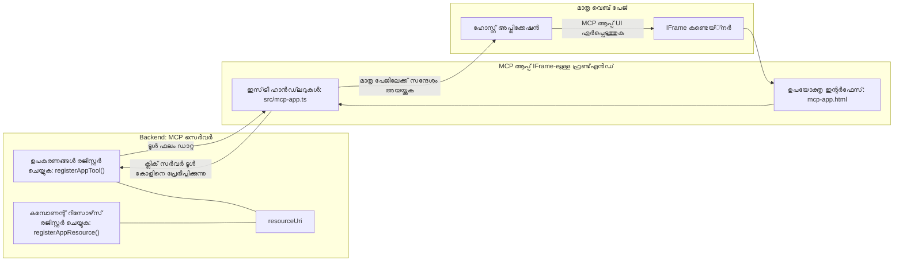
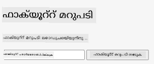
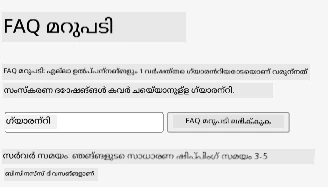
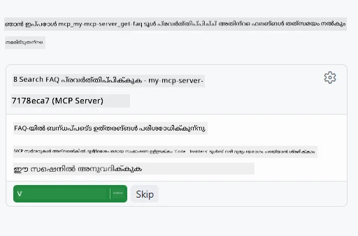

# MCP അപ്ലിക്കേഷനുകൾ

MCP അപ്ലിക്കേഷനുകൾ MCP-യിലെ ഒരു പുതിയ സിദ്ധാന്തമാണ്. ആശയം ഇതാണ്: നിങ്ങൾ ഒരു ടൂൾ കോൾ നിന്നുള്ള ഡാറ്റയും തിരിച്ചുവരുത്തുന്നു മാത്രമല്ല, ഈ വിവരങ്ങളെ എങ്ങനെ ഇടപഴകണമെന്ന് കുറിച്ചുള്ള വിവരവും നൽകുന്നു. അതായത് ടൂൾ ഫലങ്ങൾ ഇനി UI വിവരങ്ങളും അടങ്ങിയിരിക്കും. എന്നാൽ നമ്മൾ അതുകൊണ്ട് എന്ത് ചെയ്യണം? ഇന്ന് നിങ്ങൾ എന്താണ് ചെയ്യുന്നത് എന്നത് പരിഗണിക്കൂ. നിങ്ങൾക്ക് MCP സെർവറിന്റെ ഫലങ്ങൾ ചില ഫ്രണ്ട്എൻഡിന്റെ മുൻപിൽ ഉപയോഗിക്കുന്നത് സാധാരണമാണ്, അതിനുള്ള കോഡ് നിങ്ങൾക്ക് എഴുതാനും പരിപാലിക്കാനും വേണം. ചിലപ്പോൾ ഇത് വേണം എന്നൊക്കെ ആകാം, പക്ഷേ ചിലപ്പോൾ എന്നാൽ ഡാറ്റ മുതൽ യൂസർ ഇന്റർഫേസ് വരെ എല്ലാം ഉൾക്കൊള്ളുന്ന സ്വയംഭരണ വിവരത്തിന്റെ കുറിപ്പിനെ മാത്രം കൊണ്ടുവരാൻ നല്ലതായിരിക്കും.

## അവലോക്കനം

ഈ പാഠം MCP അപ്ലിക്കേഷനുകൾ സംബന്ധിച്ച പ്രായോഗിക മാർഗ്ഗനിർദ്ദേശങ്ങളും, അതുമായി തുടങ്ങുന്നതിനും നിലവിലുള്ള വെബ് അപ്ലിക്കേഷനുകളിൽ എങ്ങനെ സംയോജിപ്പിക്കാമെന്നും നൽകുന്നു. MCP അപ്ലിക്കേഷനുകൾ MCP സ്റ്റാൻഡാർഡിൽ വളരെ പുതിയ ചേർക്കലാണ്.

## പഠന ലക്ഷ്യങ്ങൾ

ഈ പാഠത്തിന്റെ അവസാനം, നിങ്ങൾക്ക് കഴിയുന്നത്:

- MCP അപ്ലിക്കേഷനുകൾ എന്താണെന്ന് വിശദീകരിക്കുക.
- MCP അപ്ലിക്കേഷനുകൾ ഉപയോഗിക്കേണ്ടത് എപ്പോൾ എന്ന് അറിയുക.
- നിങ്ങളുടെ സ്വന്തം MCP അപ്ലിക്കേഷനുകൾ രൂപകൽപ്പനചെയ്യുകയും സംയോജിപ്പിക്കുകയും ചെയ്യുക.

## MCP അപ്ലിക്കേഷനുകൾ - എങ്ങനെ പ്രവർത്തിക്കുന്നു

MCP അപ്ലിക്കേഷനുകളിലെ ആശയം ഒരു ഘടകമായി പിന്തുണയ്ക്കാവുന്ന പ്രതികരണം നൽകലാണ്. ആ ഘടകം വീക്ഷണങ്ങളും ഇന്ററാക്ടിവിറ്റികളും (ഉദാ: ബട്ടൺ ക്ലിക്കുകൾ, ഉപയോക്തൃ ഇന്റർഫേസ്സ് എന്നിവ) ഉണ്ടായിരിക്കാം. സെർവർ പാർശ്വത്ത് തുടങ്ങിയാലോ? MCP സെർവർ. MCP അപ്ലിക്കേഷൻ ഘടകം സൃഷ്ടിക്കാൻ, ടൂൾ കൂടാതെ അപ്ലിക്കേഷൻ റിസോഴ്‌സ് രണ്ടും സൃഷ്ടിക്കണം. ഈ രണ്ട് ഭാഗങ്ങളും resourceUri ഉപയോഗിച്ച് ബന്ധിപ്പിക്കുന്നു.

ഇവിടെ ഒരു ഉദാഹരണമാണ്. ഉൾപ്പെടുന്ന ഘടകങ്ങളും അവ എന്തിങ്ങനെ പ്രവർത്തിക്കുമെന്ന് നമ്മളു് പരിശോധിക്കാം:

```text
server.ts -- responsible for registering tools and the component as a UI component
src/
  mcp-app.ts -- wiring up event handlers
mcp-app.html -- the user interface
```

ഈ ദൃശ്യവും ഘടകവും അതിന്റെ ലജിക് നിർമ്മാണത്തിന്റെ വാസ്തുവിദ്യയെ വിവരിക്കുന്നു.


പിന്നീട് ബാക്ക്എൻഡ്, ഫ്രണ്ട്‌എൻഡ് മേഖലകളിലെ ഉത്തരവാദിത്വങ്ങൾ വിവരിക്കാം.

### ബാക്ക്എൻഡ്

നമുക്ക് ഇവിടെ രണ്ടുപ്രധാന കാര്യങ്ങൾ ചെയ്യേണ്ടവയാണ്:

- ഞങ്ങൾ ഇടപഴകേണ്ട ടൂളുകൾ രജിസ്റ്റർ ചെയ്യുക.
- ഘടകം നിർവചിക്കുക.

**ടൂൾ രജിസ്റ്റർ ചെയ്യൽ**

```typescript
registerAppTool(
    server,
    "get-time",
    {
      title: "Get Time",
      description: "Returns the current server time.",
      inputSchema: {},
      _meta: { ui: { resourceUri } }, // ഈ ഉപകരണം അതിന്റെ UI കണക്കാക്കഴിഞ്ഞവനുമായി ബന്ധിപ്പിക്കുന്നു
    },
    async () => {
      const time = new Date().toISOString();
      return { content: [{ type: "text", text: time }] };
    },
  );

```

മുകളിലെ കോഡ് പ്രവർത്തനം വിവരിക്കുന്നത്, ‘get-time’ എന്ന ടൂളിനെ എക്സ്പോസ് ചെയ്യുന്നു. ഇത് ഇൻപുട്ട് സ്വീകരിക്കുന്നില്ല, പക്ഷേ നിലവിലെ സമയം ഉൽപാദനം ചെയ്യും. ഉപയോക്താവിന്റെ ഇൻപുട്ട് സ്വീകരിക്കേണ്ട ടൂളുകൾക്ക് `inputSchema` നിർവചിക്കാൻ കഴിയും.

**ഘടകം രജിസ്റ്റർ ചെയ്യൽ**

അതേ ഫൈലിൽ, ഘടകവും രജിസ്റ്റർ ചെയ്യണം:

```typescript
const resourceUri = "ui://get-time/mcp-app.html";

// UI-ക്കായി ബന്ദ്‌ലാക്കിയ HTML/ജാവാസ്ക്രിപ്റ്റ് തിരികെ നൽകുന്ന റിസോഴ്‌സ് രജിസ്റ്റർ ചെയ്യുക.
registerAppResource(
  server,
  resourceUri,
  resourceUri,
  { mimeType: RESOURCE_MIME_TYPE },
  async () => {
    const html = await fs.readFile(path.join(DIST_DIR, "mcp-app.html"), "utf-8");

    return {
    contents: [
        { uri: resourceUri, mimeType: RESOURCE_MIME_TYPE, text: html },
    ],
    };
  },
);
```

`resourceUri` ഉപയോഗിച്ച് ഘടകത്തെ ടൂളുകളുമായി ബന്ധിപ്പിക്കുന്ന വിധം ശ്രദ്ധിക്കുക. കൂടാതെ, UI ഫയൽ ലോഡ് ചെയ്‌തു ഘടകം തിരിച്ചടിക്കുന്നത് കൂടാതെ ഒരു കോൾബാക്ക് ഉണ്ട്.

### ഘടകത്തിന്റെ ഫ്രണ്ട്‌എൻഡ്

ബാക്ക്എൻഡിനെപ്പോലെ, ഇവിടെ രണ്ട് ഭാഗങ്ങളുണ്ട്:

- പൂർണമായും HTML-ൽ എഴുതിയ ഫ്രണ്ട്‌എൻഡ്.
- ഇനിപ്പറയുന്നവ കൈകാര്യം ചെയ്യുന്ന കോഡ്: ഇവന്റുകൾ എന്ത് ചെയ്യണം, ഉദാ: ടൂളുകൾ വിളിക്കുന്നത്, പെരന്റ് വിൻഡോയ്ക്ക് മെസ്സേജ് അയയ്ക്കൽ.

**യൂസർ ഇന്റർഫേസ്**

യൂസർ ഇന്റർഫേസ് പരിചിന്തന നടത്താം.

```html
<!-- mcp-app.html -->
<!DOCTYPE html>
<html lang="en">
  <head>
    <meta charset="UTF-8" />
    <title>Get Time App</title>
  </head>
  <body>
    <p>
      <strong>Server Time:</strong> <code id="server-time">Loading...</code>
    </p>
    <button id="get-time-btn">Get Server Time</button>
    <script type="module" src="/src/mcp-app.ts"></script>
  </body>
</html>
```


**ഇവന്റ് വയർഅപ്പ്**

എഡിൽകെക്കുന്ന അവസാന ഭാഗം ഇവന്റ് വയർഅപ്പ് ആണ്. അതായത് UI യിലെ ഏത് ഭാഗത്തിന് ഇവന്റ് ഹാൻഡ്ലറുകൾ വേണമെന്ന് നിശ്ചയിക്കുകയും ഇവന്റ് വരുമ്പോൾ എന്തുള്ളത് ചെയ്യണമെന്ന് നിർവചിക്കുകയും ചെയ്യുന്നു:

```typescript
// mcp-app.ts

import { App } from "@modelcontextprotocol/ext-apps";

// എലമെന്റ് റഫറൻസുകൾ നേടുക
const serverTimeEl = document.getElementById("server-time")!;
const getTimeBtn = document.getElementById("get-time-btn")!;

// ആപ്പ് ഇൻസ്റ്റൻസ് സൃഷ്ടിക്കുക
const app = new App({ name: "Get Time App", version: "1.0.0" });

// സർവറിൽ നിന്ന് ടൂൾ ഫലങ്ങൾ കൈകാര്യം ചെയ്യുക. അന്വയം നഷ്ടമാകുന്നതിന് മുമ്പ് `app.connect()` സെറ്റ് ചെയ്യുക
// തുടക്കത്തിലെ ടൂൾ ഫലം നഷ്ടപ്പെടാതിരിക്കാനായി.
app.ontoolresult = (result) => {
  const time = result.content?.find((c) => c.type === "text")?.text;
  serverTimeEl.textContent = time ?? "[ERROR]";
};

// ബട്ടൺ ക്ലിക്ക് ലോഡ് ചെയ്യുക
getTimeBtn.addEventListener("click", async () => {
  // `app.callServerTool()` UI ന് സർവറിൽ നിന്നുള്ള പുതിയത് അഭ്യർത്ഥിക്കാൻ സാധിക്കും
  const result = await app.callServerTool({ name: "get-time", arguments: {} });
  const time = result.content?.find((c) => c.type === "text")?.text;
  serverTimeEl.textContent = time ?? "[ERROR]";
});

// ഹോസ്റ്റുമായി കണക്ട് ചെയ്യുക
app.connect();
```

ഇവരെ കാണുകയും ചെയ്യുന്നത് DOM മൂലകങ്ങളെ ഇവന്റുകളുമായി ചേർക്കുന്നതിന് സാധാരണ കോഡാണ്. പ്രത്യേകമായി `callServerTool` കോൾ ബാക്ക്എൻഡിലെ ഒരു ടൂൾ വിളിക്കുന്നു.

## ഉപയോക്തൃ ഇൻപുട്ടുമായി ഇടപഴകൽ

ഇതുവരെ നാം കണ്ടത് ഒരു ബട്ടണുള്ള ഘടകമാണ്, ക്ലിക്ക്ചെയ്താൽ ഒരു ടൂൾ വിളിക്കുന്നു. ഇനി കൂടുതൽ UI ഘടകങ്ങൾ, ഉദാ: ഇൻപുട്ട് ഫീൽഡ് ചേർത്തും ടൂളിലേക്ക് ആ_ARGUMENTസ്_SEND ചെയ്യുന്നതിനും നോക്കാം. ഒരു FAQ ഫങ്ഷണാലിറ്റി നടപ്പിലാക്കാം. പ്രവർത്തനം ഇങ്ങനെ ആയിരിക്കണം:

- ഉപയോക്താവ് ഒരു കീവേഡ് ടൈപ്പ് ചെയ്തു തിരയാൻ ഉള്ള ബട്ടണും ഇൻപുട്ടും വേണം, ഉദാ: "Shipping". ഇത് ബാക്ക്എൻഡിൽ FAQ ഡാറ്റയിൽ തിരയുന്ന ടൂൾ വിളിക്കും.
- മുൻകൂട്ടി പറഞ്ഞ യഥാർത്ഥ FAQ തിരയൽ പിന്തുണയുള്ള ടൂൾ.

ആദ്യം ബാക്ക്എൻഡിന് അനിവാര്യമായ പിന്തുണ ചേർക്കാം:

```typescript
const faq: { [key: string]: string } = {
    "shipping": "Our standard shipping time is 3-5 business days.",
    "return policy": "You can return any item within 30 days of purchase.",
    "warranty": "All products come with a 1-year warranty covering manufacturing defects.",
  }

registerAppTool(
    server,
    "get-faq",
    {
      title: "Search FAQ",
      description: "Searches the FAQ for relevant answers.",
      inputSchema: zod.object({
        query: zod.string().default("shipping"),
      }),
      _meta: { ui: { resourceUri: faqResourceUri } }, // ഈ ഉപകരണം അതിന്റെ UI സമ്പത്ത്‌ക്കൊപ്പം ബന്ധിപ്പിക്കുന്നു
    },
    async ({ query }) => {
      const answer: string = faq[query.toLowerCase()] || "Sorry, I don't have an answer for that.";
      return { content: [{ type: "text", text: answer }] };
    },
  );
```

നാം കാണുന്നത് `inputSchema` എങ്ങനെ പൂരിപ്പിക്കുന്നു, അതിന് `zod` സ്കീമ കൊടുക്കുന്നു:

```typescript
inputSchema: zod.object({
  query: zod.string().default("shipping"),
})
```

മുകളിൽ സൂചിപ്പിച്ച സ്കീമയിൽ ഒരു ഇൻപുട്ട് പാരാമീറ്റർ `query` എന്നത് അഭ്യാസം നൽകി, അത് നിർബന്ധമല്ലെന്നും ഡിഫോൾട്ട് മൂല്യം "shipping" ആണെന്നും വ്യക്തമാക്കുന്നു.

ശരി, *mcp-app.html* ലേക്ക് പോകാം, എന്ത് UI സൃഷ്ടിക്കണം എന്ന് കാണാം:

```html
<div class="faq">
    <h1>FAQ response</h1>
    <p>FAQ Response: <code id="faq-response">Loading...</code></p>
    <input type="text" id="faq-query" placeholder="Enter FAQ query" />
    <button id="get-faq-btn">Get FAQ Response</button>
  </div>
```

ഇപ്പോൾ ഇൻപുട്ട് ഘടകവും ബട്ടണും ഉണ്ടായി. പിന്നീട് *mcp-app.ts* ലേക്ക് പോവാം, ഇവന്റുകൾ വയർഡ് അപ്പ് ചെയ്യാം:

```typescript
const getFaqBtn = document.getElementById("get-faq-btn")!;
const faqQueryInput = document.getElementById("faq-query") as HTMLInputElement;

getFaqBtn.addEventListener("click", async () => {
  const query = faqQueryInput.value;
  const result = await app.callServerTool({ name: "get-faq", arguments: { query } });
  const faq = result.content?.find((c) => c.type === "text")?.text;
  faqResponseEl.textContent = faq ?? "[ERROR]";
});
```

മുകളിലെ കോഡിൽ:

- ആകർഷകമായ UI മൂലകങ്ങൾക്കായി റഫറൻസ് സൃഷ്ടിക്കുന്നു.
- ബട്ടൺ ക്ലിക്കിൽ ഇൻപുട്ടിന്റെ മൂല്യം പാഴ്സ് ചെയ്യുന്നു, കൂടാതെ `app.callServerTool()` വിളിക്കുന്നു, `name` ഒപ്പം `arguments` നൽകുന്നു, അതിൽ `query` വാല്യുവായി കടത്തുന്നു.

`callServerTool` വിളിക്കുമ്പോൾ, അത് പെരന്റ് വിൻഡോയ്ക്ക് 메സേജ് അയയ്ക്കുകയും MCP സെർവർ വിളിക്കുകയുമാണ്.

### പരീക്ഷിക്കുക

ഇത് പരീക്ഷിച്ചതിനു ശേഷം കാണാനുള്ളത്:



ഇവിടെ "warranty" പോലുള്ള ഇൻപുട്ടുമായി പരീക്ഷിക്കുക:



ഈ കോഡ് റൺ ചെയ്യാൻ, [Code section](./code/README.md) സന്ദർശിക്കുക

## Visual Studio Code-ൽ ടെസ്റ്റ് ചെയ്യൽ

Visual Studio Code MVP അപ്ലിക്കേഷനുകൾക്ക് മികച്ച പിന്തുണ നല്കുന്നു; MCP അപ്ലിക്കേഷനുകൾ ടെസ്റ്റ് ചെയ്യാനുള്ള ഏറ്റവും എളുപ്പമാർഗങ്ങളിൽ ഒന്നാണ്. Visual Studio Code ഉപയോഗിക്കാനായി *mcp.json*ലേക്ക് ഒരു സെർവർ എൻട്രി ചേർക്കുക:

```json
"my-mcp-server-7178eca7": {
    "url": "http://localhost:3001/mcp",
    "type": "http"
  }
```

അതോടെ സെർവർ സ്റ്റാർട്ട് ചെയ്യുക, GitHub Copilot ഇൻസ്റ്റാൾ ചെയ്തിട്ടുണ്ടെങ്കിൽ, ചാറ്റ് വിൻഡോ വഴി MVP അപ്ലിക്കേഷനുമായി ആശയവിനിമയം സാധിക്കും.

ഉദാഹരണത്തിന് "#get-faq" പ്രോപ്റ്റിലൂടെ ട്രിഗർ ചെയ്യുക:



വെബ് ബ്രൗസറിൽ പ്രവർത്തിപ്പിച്ചപ്പോലെ തന്നെ ഇതും തത്സമയ UI റാൻഡറിംഗ് നിർവഹിക്കുന്നു:


## അസൈൻമെന്റ്

ഒരു റോക്ക് പേപ്പർ സിസ്സർ ഗെയിം നിർമ്മിക്കുക. ഇതിൽ ഉൾപ്പെടേണ്ടത്:

UI:

- ഓപ്ഷൻസ് ഉള്ള ഡ്രോപ്ഡൗൺ ലിസ്റ്റ്
- തിരഞ്ഞെടുപ്പ് സമർപ്പിക്കാൻ ബട്ടൺ
- ആരെന്തു തെരഞ്ഞെടുക്കുകയും ആരെട്ടാണ് വിജയിച്ചതെന്നും കാണിക്കുന്ന ലേബൽ

സർവർ:

- "choice" എന്ന ഇൻപുട്ട് സ്വീകരിക്കുന്ന റോക്ക് പെപ്പർ സിസ്സർ ടൂൾ വേണം. കൂടാതെ കംപ്യൂട്ടറിന്റെ തിരഞ്ഞെടുപ്പ് കാണിക്കുകയും വിജയി നിർണയിക്കുകയും ചെയ്യണം.

## പരിഹാരം

[Solution](./assignment/README.md)

## സംഗ്രഹം

ഈ പുതിയ MCP അപ്ലിക്കേഷൻ സിദ്ധാന്തത്തെക്കുറിച്ചു പഠിച്ചു. MCP സെർവർക്ക് ഡാറ്റ മാത്രമല്ല, ഈ ഡാറ്റ എങ്ങനെ പ്രദർശിപ്പിക്കണമെന്ന് പറഞ്ഞറിയിക്കാനും സാധിക്കുന്ന പുതിയൊരു രീതിയാണ് MCP അപ്ലിക്കേഷനുകൾ.

കൂടാതെ, MCP അപ്ലിക്കേഷനുകൾ IFrame-ലാണു ഹോസ്റ്റ് ചെയ്യുന്നത്, MCP സെർവറുകളുമായി ആശയവിനിമയം നടത്താൻ പെരന്റ് വെബ് അപ്ലിക്കേഷനിലേക്ക് മെസേജുകൾ അയയ്ക്കേണ്ടതുണ്ട്. പ്ലെയിൻ ജാവാസ്ക്രിപ്റ്റിനും Reactക്കും മറ്റ് ലൈബ്രററികളും ഈ ആശയവിനിമയം എളുപ്പമാക്കാൻ ഉപയോഗിക്കാം.

## പ്രധാനപ്പെട്ട കാര്യങ്ങൾ

നിങ്ങൾ പഠിച്ചത്:

- MCP അപ്ലിക്കേഷനുകൾ ഡാറ്റയും UI ഫീച്ചറുകളും ഒരുനേറെ ഷിപ്പ് ചെയ്യേണ്ടപ്പോൾ ഉപയോഗയോഗ്യമായ പുതിയ സ്റ്റാൻഡേർഡ് ആണ്.
- സുരക്ഷാ കാരണത്താൽ ഈ തരത്തിലുള്ള അപ്ലിക്കേഷനുകൾ IFrame-ലാണ് പ്രവർത്തിക്കുന്നത്.

## ഇതിന് ശേഷം

- [Chapter 4](../../04-PracticalImplementation/README.md)

---

<!-- CO-OP TRANSLATOR DISCLAIMER START -->
**അസാധുവാക്കൽ**:  
ഈ രേഖ AI വിവർത്തന സേവനം [Co-op Translator](https://github.com/Azure/co-op-translator) ഉപയോഗിച്ച് പരിഭാഷപ്പെടുത്തിയതാണ്. കൃത്യതയ്ക്ക് ഞങ്ങൾ ശ്രമിക്കുന്നതുമാണ്, എങ്കിലും ഓട്ടോമേറ്റഡ് വിവർത്തനങ്ങളിൽ പിഴവുകൾ അല്ലെങ്കിൽ അസ്ഥിരതകൾ ഉണ്ടാകാൻ സാധ്യതയുണ്ടെന്ന് ദയവായി ശ്രദ്ധിക്കുക. വിദേശഭാഷയിലെ അമൂല്യ രേഖയാണ് സർവ്വോപരി സ്രോതസ്സ് എന്ന നിലയിൽ കരുതേണ്ടത്. നിർണ്ണായക വിവരങ്ങൾക്ക്, പ്രൊഫഷണൽ മനുഷ്യ വിവർത്തനം ശിപാർശ ചെയ്യപ്പെടുന്നു. ഈ വിവർത്തനത്തിന്റെ ഉപയോഗത്തിൽ നിന്നുണ്ടാകുന്ന ഏതെങ്കിലും തെറ്റിദ്ധാരണകൾക്കോ വ്യാഖ്യാന പിശുക്കിലൂടെയും ഞങ്ങൾ ഉത്തരവാദിത്വം ഏറ്റെടുക്കുന്നില്ല.
<!-- CO-OP TRANSLATOR DISCLAIMER END -->