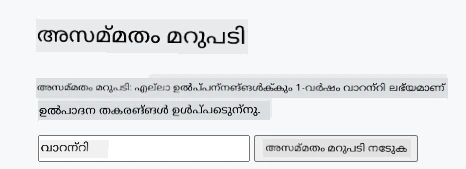
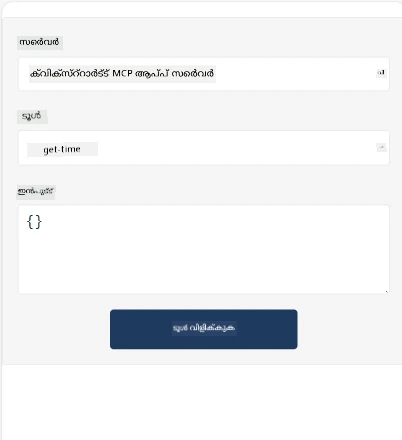
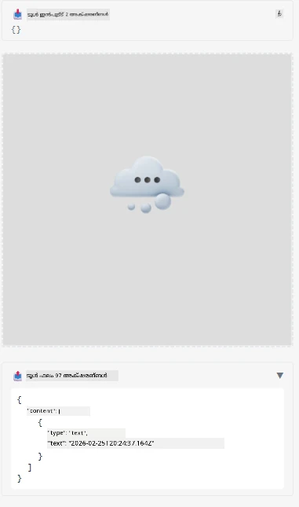

Here's a sample demonstrating MCP App

## ഇൻസ്റ്റാൾ 

1. *mcp-app* ഫോൾഡറിൽ നാവിഗേറ്റ് ചെയ്യുക
1. `npm install` റൺ ചെയ്യുക, ഇത് ഫ്രണ്ട്എൻഡ്, ബാക്ക്എൻഡ് ഡിപ്പൻഡൻസികൾ ഇൻസ്റ്റാൾ ചെയ്യും

ബാക്ക്എൻഡ് കംപൈൽ ആണെന്ന് പരിശോദിക്കാൻ റൺ ചെയ്യുക:

```sh
npx tsc --noEmit
```

എല്ലാം ശരിയാണെങ്കിൽ ഔട്ട്പുട്ട് ഒന്നും ഉണ്ടാകില്ല.

## ബാക്ക്എൻഡ് റൺ ചെയ്യുക

> നിങ്ങൾ വിൻഡോസ് മെഷീൻ ഉപയോഗിക്കുന്ന പക്ഷം ഇത് ചെറുചികിത്സ ആവശ്യമാണ്, കാരണം MCP ആപ്ലിക്കേഷൻസ് സൊല്യൂഷൻ `concurrently` ലൈബ്രറി ഉപയോഗിക്കുന്നു, അതിന് പകരം വേറെൊരു ലൈബ്രറി കണ്ടെത്തേണ്ടതാണ്. MCP ആപ്പിലെ *package.json* ൽ ആ ലൈനാണ് പ്രശ്നം:

    ```json
    "start": "concurrently \"cross-env NODE_ENV=development INPUT=mcp-app.html vite build --watch\" \"tsx watch main.ts\""
    ```

ഈ ആപ്പിന് രണ്ട് ഭാഗങ്ങളുണ്ട്, ഒരു ബാക്ക്എൻഡ് ഭാഗവും ഒരു ഹോസ്റ്റ് ഭാഗവും.

ബാക്ക്എൻഡ് തുടങ്ങിയതിന് ശേഷം:

```sh
npm start
```

ഇത് `http://localhost:3001/mcp` ന് ബാക്ക്എൻഡ് ആരംഭിക്കണം.

> ശ്രദ്ധിക്കുക, നിങ്ങൾ Codespace-ൽ ഉണ്ടെങ്കിൽ, പോർട്ട് റിപ്പോർട്ട് പൊതുജനങ്ങൾക്ക് ലഭ്യമാക്കേണ്ടതുണ്ട്. ബ്രൗസറിൽ https://<Codespace നാമം>.app.github.dev/mcp ലേക്ക് പോയി എന്റ്പോയിന്റ് എത്താമോയെന്ന് പരിശോധിക്കുക.

## മുഖ്യമായ തിരഞ്ഞെടുപ്പ് - 1 Visual Studio Code-ൽ ആപ്പ് ടെസ്റ്റ് ചെയ്യുക

Visual Studio Code-ൽ സൊല്യൂഷൻ ടെസ്റ്റ് ചെയ്യാനായി താഴെ പറയുന്നവ ചെയ്യുക:

- `mcp.json`-ലേക്ക് ഒരു സർവർ എൻട്രി ചേർക്കുക ഇങ്ങനെ:

    ```json
    {
        "servers": {
            "my-mcp-server-7178eca7": {
                "url": "http://localhost:3001/mcp",
                "type": "http"
            }
        },
        "inputs": []
    }
    ```

1. *mcp.json*-ൽ "start" ബട്ടൺ ക്ലിക്ക് ചെയ്യുക
1. ഒരു ചാറ്റ് വിൻഡോ തുറന്നിട്ടുണ്ടെന്ന് ഉറപ്പു വരുത്തുക, `get-faq` ടൈപ്പ് ചെയ്യുക, ഇങ്ങനെ ഒരു ഫലം കാണാൻ സാധിക്കും:

    

## മുഖ്യമായ തിരഞ്ഞെടുപ്പ് - 2- ഹോസ്റ്റ് ഉപയോഗിച്ച് ആപ്പ് ടെസ്റ്റ് ചെയ്യുക

റെപ്പോ <https://github.com/modelcontextprotocol/ext-apps> നിങ്ങളുടെ MVP ആപ്പുകൾ ടെസ്റ്റ് ചെയ്യാൻ പലതരം ഹോസ്റ്റുകൾ ഉൾക്കൊള്ളുന്നു.

ഇവിടെ രണ്ടു തിരക്കുകളാണ് നൽകിയിരിക്കുന്നത്:

### ലോക്കൽ മെഷീൻ

- റെപ്പോ ക്ലോൺ ചെയ്തതിന് ശേഷം *ext-apps* ല് നാവിഗേറ്റ് ചെയ്യുക.

- ഡിപ്പൻഡൻസികൾ ഇൻസ്റ്റാൾ ചെയ്യുക

   ```sh
   npm install
   ```

- വേറെ ടെർമിനൽ വിൻഡോയിൽ, *ext-apps/examples/basic-host* ലേക്ക് നാവിഗേറ്റ് ചെയ്യുക

    > നിങ്ങൾ Codespace-ൽ ആണെങ്കിൽ, serve.ts-ലും ലൈൻ 27-ലും പോയി http://localhost:3001/mcp എന്നത് നിങ്ങളുടെ Codespace URL ബാക്ക്എൻഡിനായി പകരം വരുത്തണം. ഉദാഹരണത്തിന് https://psychic-xylophone-657rpjgvxpc5g64-3001.app.github.dev/mcp

- ഹോസ്റ്റ് റൺ ചെയ്യുക:

    ```sh
    npm start
    ```

    ഇത് ഹോസ്റ്റ് ബാക്ക്എൻഡുമായി കണക്റ്റ് ചെയ്യുകയും ആപ്പ് ഇങ്ങനെ പ്രവർത്തിക്കുകയും ചെയ്യും:

    

### Codespace

Codespace പരിസ്ഥിതി പ്രവര്‍ത്തിക്കാൻ ചെറിയ അധിക പരിശ്രമം വേണം. Codespace മുഖേന ഹോസ്റ്റ് ഉപയോഗിക്കാൻ:

- *ext-apps* ഡയറക്ടറിയിൽ പോയി *examples/basic-host* ലേക്ക് നാവിഗേറ്റ് ചെയ്യുക.
- ഡിപ്പൻഡൻസികൾ ഇൻസ്റ്റാൾ ചെയ്യാൻ `npm install` റൺ ചെയ്യുക
- ഹോസ്റ്റ് ആരംഭിക്കാൻ `npm start` റൺ ചെയ്യുക.

## ആപ്പ് പരീക്ഷിക്കുക

താഴെയുള്ള തരത്തിൽ ആപ്പ് പരീക്ഷിക്കുക:

- "Call Tool" ബട്ടൺ തിരഞ്ഞെടുക്കുക, ഫലം ഇങ്ങനെ കാണാം:

    

നന്നായി, എല്ലാം സജ്ജമാണ്.

---

<!-- CO-OP TRANSLATOR DISCLAIMER START -->
**പരാമർശ കുറിപ്പ്**:  
ഈ രേഖ AI ഭാഷാന്തര സേവനം [Co-op Translator](https://github.com/Azure/co-op-translator) ഉപയോഗിച്ച് പ്രസിദ്ധീകരിച്ചിട്ടുണ്ട്. ഞങ്ങൾ കൃത്യത പാലിക്കാൻ ശ്രമിക്കുന്നുവെങ്കിലും, ഓട്ടോമേറ്റഡ് വിവർത്തനങ്ങളിൽ പിശകുകൾ അല്ലെങ്കിൽ തപ്പുകൾ ഉണ്ടാകാമെന്നും कृപയാ മനസിലാക്കി നിൽക്കുക. യഥാർത്ഥ രേഖ അതിന്റെ മാതൃഭാഷയിൽ സുരക്ഷിതമായ ഉറവിടമായി കണക്കാക്കപ്പെടണം. പ്രധാനപ്പെട്ട വിവരങ്ങൾക്ക്, പ്രൊഫഷണൽ മാനവ ഭാഷാന്തരം ശുപാർശ ചെയ്യപ്പെടുന്നു. ഈ വിവർത്തനം ഉപയോഗിച്ചതിലൂടെ ഉണ്ടാകുന്ന ഉള്ളുപോലുള്ള തെറ്റിദ്ധാരണകൾക്കോ വ്യാഖ്യാനപിശകുകൾക്കോ ഞങ്ങൾ ഉത്തരവാദിത്തം ഏറ്റെടുക്കുന്നില്ല.
<!-- CO-OP TRANSLATOR DISCLAIMER END -->