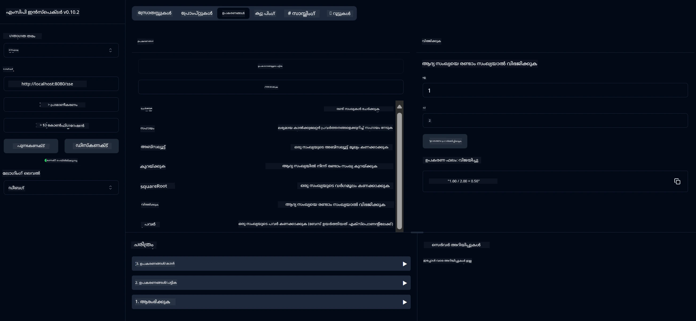

# അടിസ്ഥാന കാൽക്കുലേറ്റർ MCP സേവനം

> [!NOTE]
> ഈ ഉദാഹരണം പാരമ്പരാഗത HTTP+SSE ട്രാൻസ്പോർട്ട് ഉപയോഗിക്കുന്നു, കൂടാതെ MCP `2025-11-25` സംവേദ്യമായ SDK ലക്ഷ്യമിടുന്നു.
> പുതിയ റിമോട്ട് സെർവർകൾ `2026-07-28` Streamable HTTP പിന്തുണ ഉപയോഗിക്കണം.


- SSE (സെർവർ-സെന്റിനഗ്ഗ് ഇവന്റുകൾ) പിന്തുണ
- സ്പ്രിങ് AIയുടെ `@Tool` അനോട്ടേഷൻ ഉപയോഗിച്ചുള്ള സ്വയം ടൂൾ രജിസ്‌ട്രേഷൻ
- അടിസ്ഥാന കാൽക്കുലേറ്റർ ഫംഗ്ഷനുകൾ:
  - കൂട്ടിച്ചേർക്കൽ, വ്യത്യാസം, ഗുണനം, വിഭജനം
  - പവർ കാൽക്കുലേഷൻ, വസ്‌തുവിന്റെ ചതുരശ്രമൂല്യം
  - മോഡുലസ് (ഉളളിലതിന്റെ പരിധി), മൂല്യത്തിന്റെ പരമാവധി
  - പ്രവർത്തന വിവരണങ്ങൾക്കായി സഹായ ഫംഗ്ഷൻ


   - രണ്ടായിരിക്കും കൂട്ടിച്ചേർക്കൽ
   - ആദ്യ സംഖ്യയിൽനിന്ന് രണ്ടാമത്തെ സംഖ്യ കുറയ്ക്കൽ
   - രണ്ടായിരിക്കും ഗുണനം
   - ഒന്നാം സംഖ്യ രണ്ടാം സംഖ്യയാൽ വിഭജിക്കൽ (പൂജ്യം പരിശോധനയോടെ)


   - പവർ കാൽക്കുലേഷൻ (ഒരു അടിസ്ഥാന സംഖ്യയെ ഒരു ഘടകമായി ഉയർത്തുക)
   - ചതുരശ്ര മൂല്യം കാൽക്കുലേഷൻ (നെഗറ്റീവ് സംഖ്യയ്ക്കുള്ള പരിശോധനയോടെ)
   - മോഡുലസ് (ഉളളിലതിന്റെ വ്യത്യാസം) കാൽക്കുലേഷൻ
   - സംഖ്യയുടെ പരമാവധി മൂല്യം കാൽക്കുലേഷൻ


   - ലഭ്യമായ എല്ലാ പ്രവർത്തനങ്ങളും വിശദീകരിക്കുന്ന കെട്ടിയിടുന്ന സഹായ ഫംഗ്ഷൻ


- `subtract(a, b)`: രണ്ടാമത്തെ സംഖ്യ ഒന്നാമതായി നിന്നു കുറയ്ക്കുക
- `multiply(a, b)`: രണ്ട് സംഖ്യകൾ ഗുണിക്കുക
- `divide(a, b)`: ഒന്നാമത്തെ സംഖ്യ രണ്ടാം സംഖ്യയാൽ വകുപ്പിക്കുക (പൂജ്യം പരിശോധിച്ചു)
- `power(base, exponent)`: ഒരു സംഖ്യയുടെ പവർ കാൽക്കുലേറ്റ് ചെയ്യുക
- `squareRoot(number)`: ചതുരശ്ര മൂല്യം കാൽക്കുലേറ്റ് ചെയ്യുക (നെഗറ്റീവ് സംഖ്യ പരിശോധന സഹിതം)
- `modulus(a, b)`: വിഭജിക്കൽ ശേഷമുള്ള ശേഷിപ്പ് കാൽക്കുലേറ്റ് ചെയ്യുക
- `absolute(number)`: സംഖ്യയുടെ പരമാവധി മൂല്യം കാൽക്കുലേറ്റ് ചെയ്യുക
- `help()`: ലഭ്യമായ പ്രവർത്തനങ്ങളേക്കുറിച്ച് വിവരങ്ങൾ നേടുക


   
   GitHub ന്റെ AI മോഡലുകൾ (ഉദാ: phi-4) ഉപയോഗിക്കാൻ, നിങ്ങൾക്ക് GitHub വ്യക്തിഗത ആക്സസ് ടോക്കൺ വേണ്ടിയാണ്:


   
   b. "Generate new token" → "Generate new token (classic)" ക്ലിക്ക് ചെയ്യുക
   
   c. നിങ്ങളുടെ ടോക്കൺ ഒരു വിവരണാത്മകമായ പേര് നൽകുക
   
   d. താഴെ പറയുന്ന സ്കോപ്പുകൾ തിരഞ്ഞെടുക്കുക:
      - `repo` (സ്വകാര്യ റിപ്പോസിറ്ററികളുടെ മുഴുവൻ നിയന്ത്രണം)
      - `read:org` (ഓർഗും ടീം അംഗത്വവും വായിക്കുക, ഓർഗ പ്രോജക്ട്‌സ് വായിക്കുക)
      - `gist` (ഗിസ്റ്റുകൾ സൃഷ്ടിക്കുക)
      - `gist` (ഗിസ്റ്റുകൾ സൃഷ്ടിക്കുക)

      - `user:email` (ഉപയോക്താവിന്റെ ഇമെയിൽ വിലാസങ്ങൾ ആക്സസ് ചെയ്യുക (വായിക്കാൻ മാത്രം))
   
   e. "Generate token" ക്ലിക്കുചെയ്യുക, നിങ്ങളുടെ പുതിയ ടോക്കൺ കോപ്പി ചെയ്യുക
   
   f. ഇത് അന്തരീക്ഷ ചേരുവയായി സെറ്റ് ചെയ്യുക:
      
      Windows-ൽ:
      ```
      set GITHUB_TOKEN=your-github-token
      ```
      
      macOS/Linux-ൽ:
      ```bash
      export GITHUB_TOKEN=your-github-token
      ```

   g. സ്ഥിരതയ്‌ക്കായി, സിസ്റ്റം സെറ്റിംഗുകൾ വഴി ഇത് നിങ്ങളുടെ അന്തരീക്ഷ ചേരുവകളിൽ ചേർക്കുക

2. നിങ്ങളുടെ പ്രൊജക്റ്റിൽ LangChain4j GitHub ആശ്രിതം ചേർക്കുക (pom.xml-ൽ ഇതിനകം ഉൾപ്പെടുത്തിയിട്ടുണ്ട്):
   ```xml
   <dependency>
       <groupId>dev.langchain4j</groupId>
       <artifactId>langchain4j-github</artifactId>
       <version>${langchain4j.version}</version>
   </dependency>
   ```

3. കാൽക്കുലേറ്റർ സർവർ `localhost:8080`-ൽ പ്രവർത്തിക്കുന്നതായി ഉറപ്പ് വരുത്തുക

### LangChain4j ക്ലയന്റ് റൺചെയ്യൽ

ഈ ഉദാഹരണത്തിൽ കാണിക്കുന്നത്:
- SSE ട്രാൻസ്പോർട്ടിലൂടെ കാൽക്കുലേറ്റർ MCP സർവറുമായി കണക്ട് ചെയ്യുന്നു
- കാൽക്കുലേറ്റർ പ്രവർത്തനങ്ങൾ ഉപയോഗിക്കുന്ന ചാറ്റ് ബോട്ട് സൃഷ്ടിക്കാൻ LangChain4j ഉപയോക്തൃപ്പെടുത്തുന്നു
- GitHub AI മോഡലുകളുമായി സംയോജിപ്പിക്കുന്നു (ഇപ്പോൾ phi-4 മോഡൽ ഉപയോഗിക്കുന്നു)

പ്രവർത്തനം കാണിക്കാൻ ക്ലയന്റ് താഴെ കാണുന്ന സാമ്പിൾ ക്വറികൾ അയയ്ക്കുന്നു:
1. രണ്ട് സംഖ്യകളുടെ ആകെ കണക്കുകൂട്ടൽ
2. ഒരു സംഖ്യയുടെ വേര raíz കണ്ടെത്തൽ
3. ലഭ്യമായ കാൽക്കുലേറ്റർ പ്രവർത്തനങ്ങളേക്കുറിച്ച് സഹായ വിവരം ലഭിക്കുന്നത്

ഉദാഹരണം റൺ ചെയ്ത് കൺസോൾ ഔട്ട്പുട്ട് പരിശോധിച്ച് എങ്ങനെ AI മോഡൽ കാൽക്കുലേറ്റർ ടൂളുകൾ ഉപയോഗിച്ച് ക്വറികളോട് പ്രതികരിക്കുന്നു കാണുക.

### GitHub മോഡൽ ക്രമീകരണം

LangChain4j ക്ലയന്റ് GitHub-ന്റെ phi-4 മോഡൽ ഉപയോഗിക്കുന്നതിനായി താഴെ കാണുന്ന ക്രമീകരണങ്ങളോടെ സജ്ജമാക്കിയിരിക്കുന്നു:

```java
ChatLanguageModel model = GitHubChatModel.builder()
    .apiKey(System.getenv("GITHUB_TOKEN"))
    .timeout(Duration.ofSeconds(60))
    .modelName("phi-4")
    .logRequests(true)
    .logResponses(true)
    .build();
```

വ്യത്യസ്ത GitHub മോഡലുകൾ ഉപയോഗിക്കാൻ, `modelName` പരാമീറ്റർ മറ്റൊരു പിന്തുണയുള്ള മോഡലിലേക്ക് (ഉദാ., "claude-3-haiku-20240307", "llama-3-70b-8192" മുതലായവ) മാറ്റുക.

## ആശ്രിതങ്ങൾ

പ്രൊജക്റ്റിന് ആവശ്യമായ പ്രധാന ആശ്രിതങ്ങൾ:

```xml
<!-- For MCP Server -->
<dependency>
    <groupId>org.springframework.ai</groupId>
    <artifactId>spring-ai-starter-mcp-server-webflux</artifactId>
</dependency>

<!-- For LangChain4j integration -->
<dependency>
    <groupId>dev.langchain4j</groupId>
    <artifactId>langchain4j-mcp</artifactId>
    <version>${langchain4j.version}</version>
</dependency>

<!-- For GitHub models support -->
<dependency>
    <groupId>dev.langchain4j</groupId>
    <artifactId>langchain4j-github</artifactId>
    <version>${langchain4j.version}</version>
</dependency>
```

## പ്രൊജക്റ്റ് നിർമ്മാണം

Maven ഉപയോഗിച്ച് പ്രൊജക്റ്റ് നിർമ്മിക്കുക:
```bash
./mvnw clean install -DskipTests
```

## സർവർ റൺചെയ്യൽ

### ജാവ ഉപയോഗിച്ച്

```bash
java -jar target/calculator-server-0.0.1-SNAPSHOT.jar
```

### MCP ഇൻസ്‌പക്ടർ ഉപയോഗിച്ച്

MCP ഇൻസ്‌പക്ടർ MCP സേവനങ്ങളുമായി സംവദിക്കുന്നതിന് സഹായിക്കുന്ന ഉപകരണം ആണ്. ഈ കാൽക്കുലേറ്റർ സർവീസ് ഉപയോഗിക്കാൻ:

1. **MCP ഇൻസ്‌പക്ടർ ഇൻസ്റ്റാൾ ചെയ്ത് റൺ ചെയ്യുക** ഒരു പുതിയ ടെർമിനൽ വിൻഡോയിൽ:
   ```bash
   npx @modelcontextprotocol/inspector
   ```

2. **വെബ് UI-യിലെ ആക്സസ്** ആപ്പ് കാണിക്കുന്ന URL-ലെ ക്ലിക്കുചെയ്യുക (സാധാരണയായി http://localhost:6274)

3. **കണക്ഷൻ ക്രമീകരിക്കുക**:
   - ട്രാൻസ്പോർട്ട് തരം "SSE" ആയി ക്രമീകരിക്കുക
   - നിങ്ങളുടെ പ്രവർത്തിക്കുന്ന സർവറിന്റെ SSE എന്റിംഗ് പോയിൻറ്റ് URL `http://localhost:8080/sse` ആയി സെറ്റ് ചെയ്യുക
   - "Connect" ക്ലിക്കുചെയ്യുക

4. **ടൂളുകൾ ഉപയോഗിക്കുക**:
   - ലഭ്യമായ കാൽക്കുലേറ്റർ പ്രവർത്തനങ്ങൾ കാണാൻ "List Tools" ക്ലിക്കുചെയ്യുക
   - ഒരു ടൂൾ തിരഞ്ഞെടുക്കുക, "Run Tool" ക്ലിക്കുചെയ്യുക പ്രവർത്തനം നിർവഹിക്കാൻ



### Docker ഉപയോഗിച്ച്

പ്രൊജക്റ്റിൽ കണ്ടെയ്‌നറൈസ് ചെയ്തുണ്ടാക്കലിനായി Dockerfile ഉൾപ്പെടുത്തിയിട്ടുണ്ട്:

1. **Docker ഇമേജ് നിർമ്മിക്കുക**:
   ```bash
   docker build -t calculator-mcp-service .
   ```

2. **Docker കണ്ടെയ്‌നർ റൺ ചെയ്യുക**:
   ```bash
   docker run -p 8080:8080 calculator-mcp-service
   ```

ഇത്:
- Maven 3.9.9-ഉം Eclipse Temurin 24 JDK-ഉം ഉപയോഗിച്ച് മൾട്ടി-സ്റ്റേജ് Docker ഇമേജ് നിർമ്മിക്കും
- ഒപ്റ്റിമൈസ്ഡ് കണ്ടെയ്‌നർ ഇമേജ് സൃഷ്ടിക്കും
- സർവീസ് പോർട്ട് 8080-ൽ തുറക്കും
- MCP കാൽക്കുലേറ്റർ സർവീസ് കണ്ടെയ്‌നറിൽ സ്റ്റാർട്ട് ചെയ്യും

കണ്ടെയ്‌നർ പ്രവർത്തിക്കുന്ന പോലെ ആയാൽ, `http://localhost:8080`-ൽ സർവീസിന് ആക്സസ് ചെയ്യാം.

## പ്രശ്‌നപരിഹാരം

### GitHub ടോക്കണുമായി ബന്ധപ്പെട്ട സാധാരണ പ്രശ്‌നങ്ങൾ


1. **ടോക്കൺ അനുമതി പ്രശ്‌നങ്ങൾ**: നിങ്ങൾക്ക് 403 നിഷേധിച്ചുവെന്ന തോന്നൽ ഉണ്ടെങ്കിൽ, പ്രീറിക്വിസിറ്റുകളിൽ നിർദേശിച്ചിരിക്കുന്നതുപോലെ നിങ്ങളുടെ ടോക്കണിന് യഥാർത്ഥ അനുമതികൾ ഉണ്ടോയെന്ന് പരിശോധിക്കുക.

2. **ടോക്കൺ കണ്ടെത്തിയില്ല**: "No API key found" എന്ന പിഴവ് ലഭിച്ചാൽ, GITHUB_TOKEN പരിസ്ഥിതി ചാരകം ശരിയായി സജ്ജമാണോയെന്ന് ഉറപ്പാക്കുക.

3. **റേറ്റ് ലിമിറ്റിങ്**: GitHub API യ്ക്ക് റേറ്റ് ലിമിറ്റുകളുണ്ട്. നിങ്ങൾക്ക് 429 സ്റ്റാറ്റസ് കോഡ് ഉള്ള റേറ്റ് ലിമിറ്റ് പിഴവ് നേരിടുന്നുവെങ്കിൽ, മടങ്ങി ശ്രമിക്കുന്നതിന് മുമ്പ് കുറച്ച് നിമിഷം കാത്തിരിക്കൂ.

4. **ടോക്കൺ കാലഹരണപ്പെടൽ**: GitHub ടോക്കണുകൾ കാലഹരണപ്പെടാം. കുറച്ച് സമയത്തിന് ശേഷം 인증 പിഴവുകൾ ലഭിച്ചാൽ, പുതിയ ടോക്കൺ ഉണ്ടാക്കി നിങ്ങളുടെ പരിസ്ഥിതി ചാരകം അപ്ഡേറ്റ് ചെയ്യുക.

കൂടുതൽ സഹായത്തിനായി, [LangChain4j ഡോക്യുമെന്റേഷൻ](https://github.com/langchain4j/langchain4j) അല്ലെങ്കിൽ [GitHub API ഡോക്യുമെന്റേഷൻ](https://docs.github.com/en/rest) പരിശോധിക്കുക.

---

<!-- CO-OP TRANSLATOR DISCLAIMER START -->
**അറിയിപ്പ്**:
ഈ രേഖ AI പരിഭാഷാ സേവനം [Co-op Translator](https://github.com/Azure/co-op-translator) ഉപയോഗിച്ച് പരിഭാഷപ്പെടുത്തിയതാണ്. ഞങ്ങൾ കൃത്യതയ്ക്കായി ശ്രമിക്കുന്നുവെങ്കിലും, ഓട്ടോമേറ്റഡ് പരിഭാഷകളിൽ പിഴവുകൾ അല്ലെങ്കിൽ തെറ്റായ വിവരങ്ങൾ ഉണ്ടാകാൻ സാധ്യതയുണ്ട്. അതിന്റെ സ്വാഭാവിക ഭാഷയിലുള്ള അസൽ രേഖയാണ് പ്രാമാണികമായ ഉറവിടമായി പരിഗണിക്കേണ്ടത്. നിർണായകമായ വിവരങ്ങൾക്ക്, പ്രൊഫഷണൽ മനുഷ്യ പരിഭാഷ ശുപാർശ ചെയ്യുന്നു. ഈ പരിഭാഷ ഉപയോഗിച്ച് ഉണ്ടാകുന്ന തെറ്റിദ്ധാരണകൾ അല്ലെങ്കിൽ തെറ്റായ വ്യാഖ്യാനങ്ങൾക്കായി ഞങ്ങൾ ഉത്തരവാദികളല്ല.
<!-- CO-OP TRANSLATOR DISCLAIMER END -->