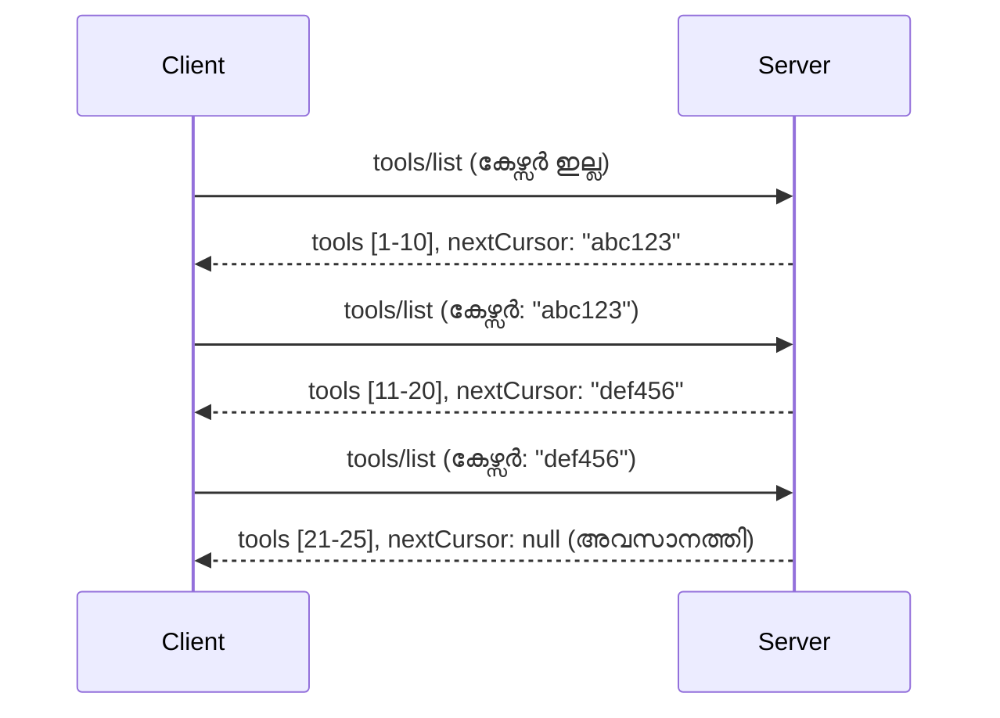

# MCP-ൽ പേജിനേഷൻ மற்றும் വലിയ ഫലം സെറ്റുകൾ

നിങ്ങളുടെ MCP സെർവർ വലുത് ഡാറ്റാസെറ്റുകൾ കൈകാര്യം ചെയ്യുമ്പോൾ - ആയിരക്കണക്കിന് ഫയലുകൾ, ഡാറ്റാബേസ് റെക്കോർഡുകൾ, അല്ലെങ്കിൽ സെർച്ച് ഫലങ്ങൾ ലിസ്റ്റ് ചെയ്യുമ്പോൾ - മെമ്മറി ഏർപ്പാടു കാര്യക്ഷമമായി നടത്താനും പ്രതികരണക്ഷമമായ ഉപയോക്തൃ അനുഭവം പ്രദാനം ചെയ്യാനും നിങ്ങൾക്ക് പേജിനേഷൻ ആവശ്യമാണ്. MCP-യിൽ പേജിനേഷൻ എങ്ങനെ നടപ്പിലാക്കാനും ഉപയോഗിക്കാനും ഈ ഗൈഡ് ഇടപെടുന്നു.

## പേജിനേഷൻ എങ്ങനെ പ്രധാനമാണ്

പേജിനേഷൻ ഇല്ലാതിരുന്നാൽ, വലിയ പ്രതികരണങ്ങൾക്കായി ഇതിനെഴുതാം:

- **മെമ്മറി ക്ഷയം** - ഒരുമിച്ച് ദശലക്ഷങ്ങളോളം റെക്കോർഡുകൾ ലോഡ് ചെയ്യുന്നത്
- **മന്ദമായ പ്രതികരണ സമയം** - എല്ലാ ഡാറ്റയും ലോഡ് ആവുന്നത് വരെ ഉപയോക്താക്കൾ കാത്തിരിക്കുക
- **ടൈംaut് പിശകുകൾ** - അഭ്യർത്ഥനകൾ ടൈംaut് പരിധി കടക്കുന്നു
- **ദുർബലമായ AI പ്രകടനം** - LLMകൾ വൻ പശ്ചാത്തലത്തിൽ ബുദ്ധിമുട്ടുന്നു

MCP ഫല സെറ്റുകൾ വഴി വിശ്വസനീയവും സ്ഥിരവുമായ പേജിംഗ് നല്കാൻ **കേഴ്സർ-അധിഷ്ഠിത പേജിനേഷൻ** ഉപയോഗിക്കുന്നു.

---

## MCP പേജിനേഷൻ എങ്ങനെ പ്രവർത്തിക്കുന്നു

### കേഴ്സർ ആശയം

**കേഴ്സർ** എന്നത് ഫലം സെറ്റിലെ നിങ്ങളുടെ സ്ഥാനം സൂചിപ്പിക്കുന്ന ഒരു അപാരദൃശ്യമായ സ്ട്രിംഗ് ആണ്. ഒരു നീണ്ട പുസ്തകത്തിലെ ബുക്ക്മാർക്കായി ഇതിനെ കാണുക.



### MCP മാർഗങ്ങളിൽ പേജിനേഷൻ

താഴെ പറയുന്ന MCP മാർഗങ്ങൾ പേജിനേഷൻ പിന്തുണയ്ക്കുന്നു:

| മാർഗം | തിരിച്ചുകൊടുക്കുന്നത് | കേഴ്സർ പിന്തുണ |
|--------|---------|----------------|
| `tools/list` | ടൂൾ നിർവചനങ്ങൾ | ✅ |
| `resources/list` | സ്രോതസ്സ് നിർവചനങ്ങൾ | ✅ |
| `prompts/list` | പ്രോമ്പ്റ്റ് നിർവചനങ്ങൾ | ✅ |
| `resources/templates/list` | സ്രോതസ്സ് ടെംപ്ലേറ്റുകൾ | ✅ |

---

## സെർവർ നടപ്പാക്കൽ

### പൈത്തൺ (FastMCP)

```python
from mcp.server import Server
from mcp.types import Tool, ListToolsResult
import math

app = Server("paginated-server")

# സിമുലേറ്റഡ് വലിയ ഡാറ്റാസെറ്റ്
ALL_TOOLS = [
    Tool(name=f"tool_{i}", description=f"Tool number {i}", inputSchema={})
    for i in range(100)
]

PAGE_SIZE = 10

@app.list_tools()
async def list_tools(cursor: str | None = None) -> ListToolsResult:
    """List tools with pagination support."""
    
    # ആരംഭ ഇൻഡക്സ് ലഭിക്കാൻ കേഴ്സർ ഡീകോഡ് ചെയ്യുക
    start_index = 0
    if cursor:
        try:
            start_index = int(cursor)
        except ValueError:
            start_index = 0
    
    # ഫലങ്ങളുടെ പേജ് നേടുക
    end_index = min(start_index + PAGE_SIZE, len(ALL_TOOLS))
    page_tools = ALL_TOOLS[start_index:end_index]
    
    # അടുത്ത കേഴ്സർ കണക്കാക്കുക
    next_cursor = None
    if end_index < len(ALL_TOOLS):
        next_cursor = str(end_index)
    
    return ListToolsResult(
        tools=page_tools,
        nextCursor=next_cursor
    )
```

### ടൈപ്പസ്‌ക്രിപ്റ്റ്

```typescript
import { Server } from "@modelcontextprotocol/sdk/server/index.js";
import { ListToolsResultSchema } from "@modelcontextprotocol/sdk/types.js";

const server = new Server({
  name: "paginated-server",
  version: "1.0.0"
});

// നിഗമനയുള്ള വലിയ ഡാറ്റസെറ്റ്
const ALL_TOOLS = Array.from({ length: 100 }, (_, i) => ({
  name: `tool_${i}`,
  description: `Tool number ${i}`,
  inputSchema: { type: "object", properties: {} }
}));

const PAGE_SIZE = 10;

server.setRequestHandler(ListToolsResultSchema, async (request) => {
  // കാര്‍സര്‍ ഡിസ്ക്കോഡ് ചെയ്യുക
  let startIndex = 0;
  if (request.params?.cursor) {
    startIndex = parseInt(request.params.cursor, 10) || 0;
  }
  
  // ഫലങ്ങളുടെ പേജ് എടുക്കുക
  const endIndex = Math.min(startIndex + PAGE_SIZE, ALL_TOOLS.length);
  const pageTools = ALL_TOOLS.slice(startIndex, endIndex);
  
  // അടുത്ത കാര്‍സര്‍ കണക്കാക്കുക
  const nextCursor = endIndex < ALL_TOOLS.length ? String(endIndex) : undefined;
  
  return {
    tools: pageTools,
    nextCursor
  };
});
```

### ജാവ (Spring MCP)

```java
@Service
public class PaginatedToolService {
    
    private static final int PAGE_SIZE = 10;
    private final List<Tool> allTools;
    
    public PaginatedToolService() {
        // വലിയ ഡാറ്റാസെറ്റ് ആരംഭിക്കുക
        this.allTools = IntStream.range(0, 100)
            .mapToObj(i -> new Tool("tool_" + i, "Tool number " + i, Map.of()))
            .collect(Collectors.toList());
    }
    
    @McpMethod("tools/list")
    public ListToolsResult listTools(@Param("cursor") String cursor) {
        // കേഴ്സർ ഡികോഡ് ചെയ്യുക
        int startIndex = 0;
        if (cursor != null && !cursor.isEmpty()) {
            try {
                startIndex = Integer.parseInt(cursor);
            } catch (NumberFormatException e) {
                startIndex = 0;
            }
        }
        
        // ഫലങ്ങളുടെ പേജ് നേടുക
        int endIndex = Math.min(startIndex + PAGE_SIZE, allTools.size());
        List<Tool> pageTools = allTools.subList(startIndex, endIndex);
        
        // അടുത്ത കേഴ്സർ ഗണിക്കുക
        String nextCursor = endIndex < allTools.size() ? String.valueOf(endIndex) : null;
        
        return new ListToolsResult(pageTools, nextCursor);
    }
}
```

---

## ക്ലയന്റ് നടപ്പാക്കൽ

### പൈത്തൺ ക്ലയന്റ്

```python
from mcp import ClientSession

async def get_all_tools(session: ClientSession) -> list:
    """Fetch all tools using pagination."""
    all_tools = []
    cursor = None
    
    while True:
        result = await session.list_tools(cursor=cursor)
        all_tools.extend(result.tools)
        
        if result.nextCursor is None:
            break
        cursor = result.nextCursor
    
    return all_tools

# ഉപയോഗം
async with client_session as session:
    tools = await get_all_tools(session)
    print(f"Found {len(tools)} tools")
```

### ടൈപ്പ്സ്ക്രിപ്റ്റ് ക്ലയന്റ്

```typescript
import { Client } from "@modelcontextprotocol/sdk/client/index.js";

async function getAllTools(client: Client): Promise<Tool[]> {
  const allTools: Tool[] = [];
  let cursor: string | undefined = undefined;
  
  do {
    const result = await client.listTools({ cursor });
    allTools.push(...result.tools);
    cursor = result.nextCursor;
  } while (cursor);
  
  return allTools;
}

// ഉപയോഗം
const tools = await getAllTools(client);
console.log(`Found ${tools.length} tools`);
```

### ലേസി ലോഡിംഗ് പാറ്റേൺ

വളരെ വലിയ ഡാറ്റാസെറ്റുകൾക്കായി, ആവശ്യാനുസരണം പേജുകൾ ലോഡ് ചെയ്യുക:

```python
class PaginatedToolIterator:
    """Lazily iterate through paginated tools."""
    
    def __init__(self, session: ClientSession):
        self.session = session
        self.cursor = None
        self.buffer = []
        self.exhausted = False
    
    async def __anext__(self):
        # ബഫറിൽ ലഭ്യമായാൽ തിരികെ നൽകുക
        if self.buffer:
            return self.buffer.pop(0)
        
        # എല്ലാ പേജുകളും exhaustion ആയി കഴിഞ്ഞിട്ടുള്ളതോ എന്ന് പരിശോധിക്കുക
        if self.exhausted:
            raise StopAsyncIteration
        
        # അടുത്ത പേജ് എടുക്കുക
        result = await self.session.list_tools(cursor=self.cursor)
        self.buffer = list(result.tools)
        self.cursor = result.nextCursor
        
        if self.cursor is None:
            self.exhausted = True
        
        if not self.buffer:
            raise StopAsyncIteration
        
        return self.buffer.pop(0)
    
    def __aiter__(self):
        return self

# ഉപയോഗം - വലിയ ഡാറ്റാസെറ്റുകൾക്ക് മെമ്മറി കാര്യക്ഷമം
async for tool in PaginatedToolIterator(session):
    process_tool(tool)
```

---

## സ്രോതസ്സ് പേജിനേഷൻ

ഡയറക്ടറികൾക്കോ വലുതായ ഡാറ്റാസെറ്റുകൾക്കോ വാല്ത്തും പേജിനേഷൻ ആവശ്യമാകും:

```python
from mcp.server import Server
from mcp.types import Resource, ListResourcesResult
import os

app = Server("file-server")

@app.list_resources()
async def list_resources(cursor: str | None = None) -> ListResourcesResult:
    """List files in directory with pagination."""
    
    directory = "/data/files"
    all_files = sorted(os.listdir(directory))
    
    # കർസർ ഡികോഡ് ചെയ്യുക (ഫയൽ ഇൻഡക്സ്)
    start_index = int(cursor) if cursor else 0
    page_size = 20
    end_index = min(start_index + page_size, len(all_files))
    
    # ഈ പേജിന് റിസോഴ്‌സ് ലിസ്റ്റ് സൃഷ്ടിക്കുക
    resources = []
    for filename in all_files[start_index:end_index]:
        filepath = os.path.join(directory, filename)
        resources.append(Resource(
            uri=f"file://{filepath}",
            name=filename,
            mimeType="application/octet-stream"
        ))
    
    # അടുത്ത കർസർ കണക്കുകൂട്ടുക
    next_cursor = str(end_index) if end_index < len(all_files) else None
    
    return ListResourcesResult(
        resources=resources,
        nextCursor=next_cursor
    )
```

---

## കേഴ്സർ രൂപകൽപ്പന തന്ത്രങ്ങൾ

### തന്ത്രം 1: ഇൻഡക്സ്-അധിഷ്ഠിതം (സാധാരണ)

```python
# കേഴ്സർ വെറും സൂചികയാണ്
cursor = "50"  # വസ്തു 50-ൽ ആരംഭിക്കുക
```

**നന്മകൾ:** ലളിതവും സ്റ്റേറ്റ്ലസും
**ദോഷങ്ങൾ:** അതിലുള്ളവ ചേർക്കുകയോ ഒഴിവാക്കുകയോ ചെയ്താൽ ഫലങ്ങൾ മാറാം

### തന്ത്രം 2: ഐഡി-അധിഷ്ഠിതം (സ്ഥിരം)

```python
# കേഴ്സർ അവസാനമായി കണ്ട ഐഡി ആണ്
cursor = "item_abc123"  # ഈ آیറ്റത്തിനുശേഷം ആരംഭിക്കുക
```

**നന്മകൾ:** ഐറ്റങ്ങൾ മാറിയാലും സ്ഥിരമായി നിലനിൽക്കും
**ദോഷങ്ങൾ:** ക്രമീകരിച്ച ഐഡികൾ ആവശ്യം

### തന്ത്രം 3: എൻകോഡഡ് സ്റ്റേറ്റ് (സങ്കീർണ്ണം)

```python
import base64
import json

def encode_cursor(state: dict) -> str:
    return base64.b64encode(json.dumps(state).encode()).decode()

def decode_cursor(cursor: str) -> dict:
    return json.loads(base64.b64decode(cursor).decode())

# കർസർ വിവിധ സ്റ്റേറ്റ് ഫീൽഡുകൾ ഉൾക്കൊള്ളുന്നു
cursor = encode_cursor({
    "offset": 50,
    "filter": "active",
    "sort": "name"
})
```

**നന്മകൾ:** സങ്കീർണ്ണ സ്റ്റാറ്റ് എൻകോഡ് ചെയ്യാൻ കഴിയും
**ദോഷങ്ങൾ:** കൂടുതൽ സങ്കീർണ്ണം, വലിയ കേഴ്സർ സ്ട്രിംഗുകൾ

---

## മികച്ച പ്രവർത്തന മാർഗ്ഗങ്ങൾ

### 1. അനുയോജ്യമായ പേജ് വലിപ്പങ്ങൾ തിരഞ്ഞെടുക്കുക

```python
# ഡാറ്റാ സൈസ് പരിഗണിക്കുക
PAGE_SIZE_SMALL_ITEMS = 100   # ലളിതമായ മെറ്റാഡേറ്റാ
PAGE_SIZE_MEDIUM_ITEMS = 20   # സമൃദ്ധമായ ഒബ്ജക്ടുകൾ
PAGE_SIZE_LARGE_ITEMS = 5     # സങ്കീർണ ഉള്ളടക്കം
```

### 2. അസാധുവായ കേഴ്സറുകൾ സൗമ്യതയോടെ കൈകാര്യം ചെയ്യുക

```python
@app.list_tools()
async def list_tools(cursor: str | None = None) -> ListToolsResult:
    try:
        start_index = int(cursor) if cursor else 0
        if start_index < 0 or start_index >= len(ALL_TOOLS):
            start_index = 0  # തുടക്കത്തിലേക്ക് പുനസജ്ജമാക്കുക
    except (ValueError, TypeError):
        start_index = 0  # അസാധുവായ കർശറ, പുതിയതായി ആരംഭിക്കുക
    # ...
```

### 3. മൊത്തം എണ്ണം ഉൾപ്പെടുത്തുക (ഐച്ഛികം)

```python
return ListToolsResult(
    tools=page_tools,
    nextCursor=next_cursor,
    # ചില ഇമ്പ്ലിമെന്റേഷനുകൾ UI പുരോഗതിക്കുള്ള മൊത്തം ഉൾക്കൊള്ളുന്നു
    _meta={"total": len(ALL_TOOLS)}
)
```

### 4. അന്ത്യവശ കേസുകൾ പരീക്ഷിക്കുക

```python
async def test_pagination():
    # ശൂന്യ ഫലം സജ്ജമാക്കിയിട്ടുണ്ട്
    result = await session.list_tools()
    assert result.tools == []
    assert result.nextCursor is None
    
    # ഏക പേജ്
    result = await session.list_tools()
    assert len(result.tools) <= PAGE_SIZE
    
    # അസാധുവായ ക്രസര്‍
    result = await session.list_tools(cursor="invalid")
    assert result.tools  # ആദ്യ പേജ് മടക്കി നല്‍കണം
```

---

## സാധാരണ പിശകുകൾ

### ❌ എല്ലാ ഫലങ്ങളും തിരികെയടിച്ച് ക്ളയന്റ്-സൈഡിൽ പേജിനേഷൻ ചെയ്യുന്നത്

```python
# മോശം: എല്ലാം മെമ്മറിയിലേക്ക് ലോഡ് ചെയ്യുന്നു
@app.list_tools()
async def list_tools() -> ListToolsResult:
    all_tools = load_all_tools()  # 1 മില്യൺ ഉപകരണങ്ങൾ!
    return ListToolsResult(tools=all_tools)
```

### ✅ ഡാറ്റ സ്രോതസിൽ തന്നെ പേജിനേഷൻ ചെയ്യുക

```python
# നല്ലത്: ആവശ്യമായതെല്ലാം മാത്രം ലോഡ് ചെയ്യുന്നു
@app.list_tools()
async def list_tools(cursor: str | None = None) -> ListToolsResult:
    offset = int(cursor) if cursor else 0
    tools = await db.query_tools(offset=offset, limit=PAGE_SIZE)
    return ListToolsResult(tools=tools, nextCursor=...)
```

---

## അടുത്തതായി എന്ത്

- [Module 5.14 - Context Engineering](../../05-AdvancedTopics/mcp-contextengineering/README.md)
- [Module 8 - Best Practices](../../08-BestPractices/README.md)
- [3.8 - Testing Your MCP Server](../../03-GettingStarted/08-testing/README.md)

---

## അധിക സ്രോതസ്സ്

- [MCP Specificiation - Pagination](https://modelcontextprotocol.io/specification/2026-07-28/)
- [Cursor-Based Pagination Explained](https://slack.engineering/evolving-api-pagination-at-slack/)
- [Python SDK pagination tests](https://github.com/modelcontextprotocol/python-sdk/blob/main/tests/client/test_list_methods_cursor.py)

---

<!-- CO-OP TRANSLATOR DISCLAIMER START -->
**അറിയിപ്പ്**:
ഈ രേഖ AI പരിഭാഷാ സേവനം [Co-op Translator](https://github.com/Azure/co-op-translator) ഉപയോഗിച്ച് പരിഭാഷപ്പെടുത്തിയതാണ്. ഞങ്ങൾ കൃത്യതയ്ക്കായി ശ്രമിക്കുന്നുവെങ്കിലും, ഓട്ടോമേറ്റഡ് പരിഭാഷകളിൽ പിഴവുകൾ അല്ലെങ്കിൽ തെറ്റായ വിവരങ്ങൾ ഉണ്ടാകാൻ സാധ്യതയുണ്ട്. അതിന്റെ സ്വാഭാവിക ഭാഷയിലുള്ള അസൽ രേഖയാണ് പ്രാമാണികമായ ഉറവിടമായി പരിഗണിക്കേണ്ടത്. നിർണായകമായ വിവരങ്ങൾക്ക്, പ്രൊഫഷണൽ മനുഷ്യ പരിഭാഷ ശുപാർശ ചെയ്യുന്നു. ഈ പരിഭാഷ ഉപയോഗിച്ച് ഉണ്ടാകുന്ന തെറ്റിദ്ധാരണകൾ അല്ലെങ്കിൽ തെറ്റായ വ്യാഖ്യാനങ്ങൾക്കായി ഞങ്ങൾ ഉത്തരവാദികളല്ല.
<!-- CO-OP TRANSLATOR DISCLAIMER END -->