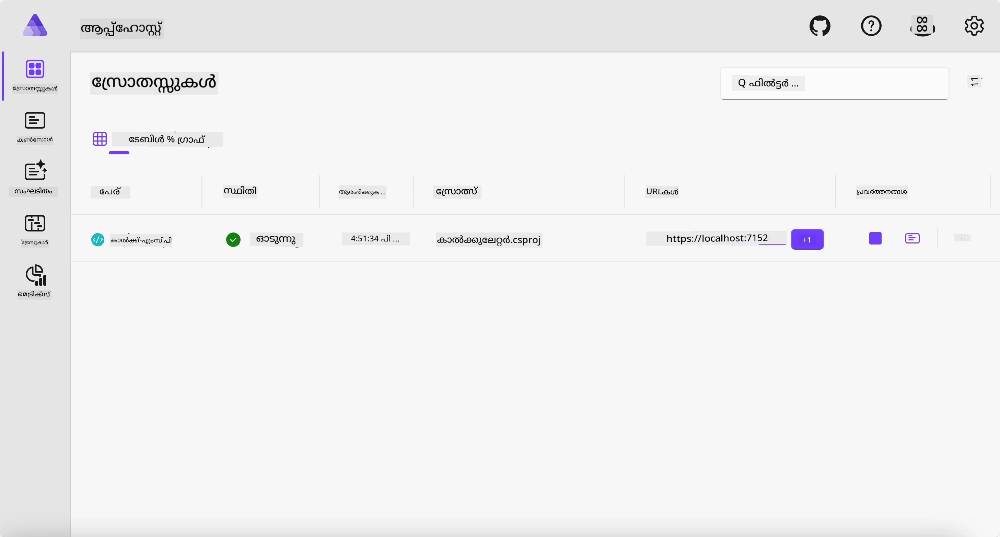
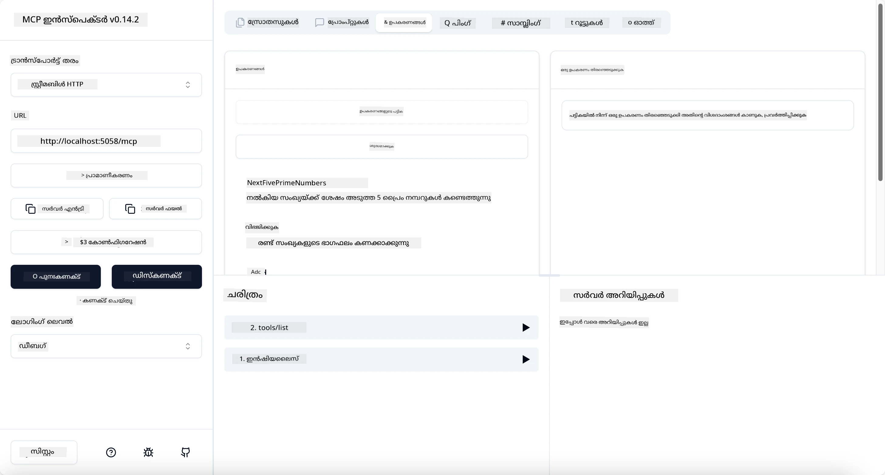
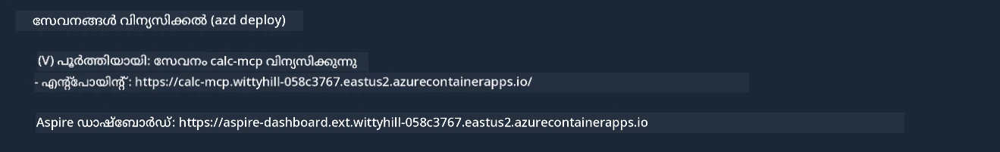

# സാമ്പിൾ

മുൻനിരുപദേശ ഉദാഹരണം `stdio` തരം ഉപയോഗിച്ച് ഒരു ലോക്കൽ .NET പ്രോജക്റ്റ് എങ്ങനെ ഉപയോഗിക്കണമെന്നും, ഒരു കണ്ടെയ്‌നറിൽ സർവർ ലോക്കലായി എങ്ങനെ റൺ ചെയ്യാമെന്നും കാണിക്കുന്നു. ഇത് പല സാഹചര്യങ്ങളിലും നല്ല പരിഹാരമാണ്. എന്നിരുന്നാലും, ക്ലൗഡ് പരിസ്ഥിതിയിൽ പോലുള്ള ഒരു ദൂരസ്ഥ സ്ഥലത്ത് സർവർ പ്രവർത്തിപ്പിക്കുന്നത് ഉപകാരപ്രദമായിരിക്കാം. ഇതാണ് `http` തരം തുടക്കമാക്കുന്നത്.

`04-PracticalImplementation` ഫോൾഡറിലെ പരിഹാരത്തിലേക്ക് നോക്കുമ്പോൾ, മുൻവർഷത്തിന്റെ അപേക്ഷിക്കാമെന്നേക്കാൾ ഇത് വളരെ സങ്കീർണമായി തോന്നാമെങ്കിലും യാഥാർത്ഥ്യത്തിൽ അങ്ങനെ അല്ല. `src/Calculator` പ്രോജക്റ്റ് പുറത്തേക്കാന്നു നോക്കിയാൽ, അത് മുൻനിരുപദേശ ഉദാഹരണത്തിലെ കോഡിനെപ്പോലെ കൂടുതലായിരിക്കും. 唯一 വ്യത്യാസം HTTP അഭ്യർത്ഥനകൾ കൈകാര്യം ചെയ്യാൻ ഒരു വ്യത്യസ്ത ലൈബ്രറി `ModelContextProtocol.AspNetCore` ഉപയോഗിക്കുന്നു എന്നതാണ്. കൂടാതെ, `IsPrime` രീതിയെ സ്വകാര്യമാക്കുന്നു, കോഡിൽ സ്വകാര്യ രീതികൾ ഉണ്ടാകാമെന്ന് കാണിക്കാൻ വേണ്ടി. ബാക്കി കോഡ് മുൻപത്തെ പോലെ തന്നെയാണ്.

മറ്റ് പ്രോജക്റ്റുകൾ [Aspire](https://aspire.dev/get-started/what-is-aspire/) ആണ്. സൊല്യൂഷനിൽ Aspire ഉണ്ട് എന്നത് വികസിപ്പിക്കുമ്പോഴും ടെസ്റ്റുചെയ്യുമ്പോഴും ഡിവലപ്പറുടെ അനുഭവം മെച്ചപ്പെടുത്തുകയും നിരീക്ഷണക്ഷമതയിലും സഹായിക്കുകയും ചെയ്യും. ഇത് സർവർ പ്രവർത്തിപ്പിക്കാൻ ആവശ്യമായതല്ല, പക്ഷെ സൊല്യൂഷനിൽ അത് ഉണ്ടാകുന്നത് നല്ല പ്രവൃത്തി രീതിയാണ്.

## സർവർ ലോക്കലായി ആരംഭിക്കുക

1. VS കോഡ് (C# DevKit എക്സ്റ്റൻഷൻ സഹിതം) ൽ നിന്നു `04-PracticalImplementation/samples/csharp` ഡയറക്റ്ററിയിലേക്ക് പോകുക.
1. സർവർ ആരംഭിക്കാൻ താഴെക്കൊടുത്തിരിക്കുന്ന കമാൻഡ് എക്സിക്യൂട്ട് ചെയ്യുക:

   ```bash
    dotnet watch run --project ./src/AppHost
   ```

1. ഒരു വെബ് ബ്രൗസർ Aspire ഡാഷ്‌ബോർഡ് തുറന്നപ്പോൾ, `http` URL ശ്രദ്ധിക്കുക. ഇത് `http://localhost:5058/` പോലെയായിരിക്കണം.

   

## MCP ഇൻസ്പെക്ടറുമായി Streamable HTTP പരിശോധന

നിങ്ങൾക്കു Node.js 22.7.5 അല്ലെങ്കിൽ അതിനുമുകളിൽ ഉണ്ടെങ്കിൽ, MCP ഇൻസ്പെക്ടർ ഉപയോഗിച്ച് സർവർ പരിശോധിക്കാം.

സർവർ ആരംഭിച്ച് താഴെക്കൊടുത്തിരിക്കുന്ന കമാൻഡ് ടർമിനലിൽ റൺ ചെയ്യുക:

```bash
npx @modelcontextprotocol/inspector http://localhost:5058
```



- ട്രാൻസ്പോർട്ട് തരം ആയി `Streamable HTTP` തിരഞ്ഞെടുക്കുക.
- URL ഫീൽഡിൽ മുമ്പ് ശ്രദ്ധിച്ച സർവറിന്റെ URL നൽകുക, അതിന് പിന്‍വലിച്ച് `/mcp` ചേർക്കുക. `http` (https അല്ല) ആയിരിക്കണം, ഉദാ: `http://localhost:5058/mcp`.
- കണക്റ്റ് ബട്ടൺ തിരഞ്ഞെടുക്കുക.

ഇൻസ്പെക്ടറിന്റെ ഒരു നല്ല പ്രത്യേകത ഇതാണു പറയും - നടക്കുന്നത് എങ്ങനെ എന്നതിന് മികച്ച ദൃശ്യവൽക്കരണം നൽകുന്നു.

- ലഭ്യമായ ടൂളുകൾ ലിസ്റ്റ് ചെയ്യാൻ ശ്രമിക്കുക
- അവയിൽ ചിലവുകൾ പരീക്ഷിക്കുക, മുൻപത്തെ പോലെയാണ് പ്രവർത്തിക്കുക.

## GitHub Copilot ചാറ്റിൽ MCP സർവർ പരീക്ഷിക്കുക VS കോഡിൽ

GitHub Copilot ചാറ്റിൽ Streamable HTTP ട്രാൻസ്പോർട്ട് ഉപയോഗിക്കാൻ, മുൻപ് സൃഷ്ടിച്ച `calc-mcp` സർവറിന്റെ കോൺഫിഗറേഷൻ ഇതുപോലെ മാറ്റുക:

```jsonc
// .vscode/mcp.json
{
  "servers": {
    "calc-mcp": {
      "type": "http",
      "url": "http://localhost:5058/mcp"
    }
  }
}
```

ചില പരിശോധനകൾ നടത്തുക:

- "6780ിനു ശേഷം 3 പ്രധാന സംഖ്യകൾ" ചോദിക്കുക. കോപ്പിലോട്ട് പുതിയ ടൂൾസ് `NextFivePrimeNumbers` ഉപയോഗിച്ച് ആദ്യം 3 പ്രധാന സംഖ്യകൾ മാത്രം നൽകി കാണിക്കും.
- "111ന് ശേഷം 7 പ്രധാന സംഖ്യകൾ" ചോദിക്കുക, എന്ത് നടക്കുമെന്ന് കാണുക.
- "ജോണിന് 24 ലോളികൾ ഉണ്ട്, അവന് മൂന്ന് കുട്ടികൾക്ക് മുഴുവൻ വിതരണം ചെയ്യേണ്ടതാണ്. ഓരോ കുഞ്ഞിനും എത്ര ലോളികളുണ്ട്?" ചോദിച്ച് സംഭവിക്കുമെന്ന് കാണുക.

## സർവർ Azure-ലേക്ക് വിന്യസിക്കുക

കൂടുതൽ പേർക്ക് ഉപയോഗിക്കാൻ സർവർ Azure-ലേക്ക് വിന്യസിക്കാം.

ഒരു ടർമിനലിൽ നിന്ന് `04-PracticalImplementation/samples/csharp` ഫോൾഡറിലേക്ക് പോകുക, പിന്നെ താഴെക്കൊടുത്തിരിക്കുന്ന കമാൻഡ് എക്സിക്യൂട്ട് ചെയ്യുക:

```bash
azd up
```

വിന്യസനം പൂർത്തിയായശേഷം, നിങ്ങൾക്ക് ഇങ്ങനെ ഒരു സന്ദേശം കാണാവുന്നതാണ്:



URL പിടിച്ച് MCP ഇൻസ്പെക്ടറിലും GitHub Copilot ചാറ്റിലുമായി ഉപയോഗിക്കുക.

```jsonc
// .vscode/mcp.json
{
  "servers": {
    "calc-mcp": {
      "type": "http",
      "url": "https://calc-mcp.gentleriver-3977fbcf.australiaeast.azurecontainerapps.io/mcp"
    }
  }
}
```

## അടുത്തത് എന്ത്?

വ്യത്യസ്ത ട്രാൻസ്പോർട്ട് തരങ്ങളും പരിശോധനാ ടൂളുകളും പരീക്ഷിച്ചു. MCP സർവർ Azure-ലേക്ക് വിന്യസിക്കുകയും ചെയ്തു. എന്നാൽ, ഞങ്ങളുടെ സർവർ സ്വകാര്യ സ്രോതസ്സുകളിലേക്ക് ആക്‌സസ് വേണമെങ്കിൽ? ഉദാഹരണത്തിന്, ഒരു ഡാറ്റാബേസ് അല്ലെങ്കിൽ സ്വകാര്യ API? അടുത്ത അധ്യായത്തിൽ, സർവറിന്റെ സുരക്ഷ എങ്ങനെ മെച്ചപ്പെടുത്താമെന്ന് കാണാം.

---

<!-- CO-OP TRANSLATOR DISCLAIMER START -->
**അറിയിപ്പ്**:
ഈ രേഖ AI പരിഭാഷാ സേവനം [Co-op Translator](https://github.com/Azure/co-op-translator) ഉപയോഗിച്ച് പരിഭാഷപ്പെടുത്തിയതാണ്. ഞങ്ങൾ കൃത്യതയ്ക്കായി ശ്രമിക്കുന്നുവെങ്കിലും, ഓട്ടോമേറ്റഡ് പരിഭാഷകളിൽ പിഴവുകൾ അല്ലെങ്കിൽ തെറ്റായ വിവരങ്ങൾ ഉണ്ടാകാൻ സാധ്യതയുണ്ട്. അതിന്റെ സ്വാഭാവിക ഭാഷയിലുള്ള അസൽ രേഖയാണ് പ്രാമാണികമായ ഉറവിടമായി പരിഗണിക്കേണ്ടത്. നിർണായകമായ വിവരങ്ങൾക്ക്, പ്രൊഫഷണൽ മനുഷ്യ പരിഭാഷ ശുപാർശ ചെയ്യുന്നു. ഈ പരിഭാഷ ഉപയോഗിച്ച് ഉണ്ടാകുന്ന തെറ്റിദ്ധാരണകൾ അല്ലെങ്കിൽ തെറ്റായ വ്യാഖ്യാനങ്ങൾക്കായി ഞങ്ങൾ ഉത്തരവാദികളല്ല.
<!-- CO-OP TRANSLATOR DISCLAIMER END -->