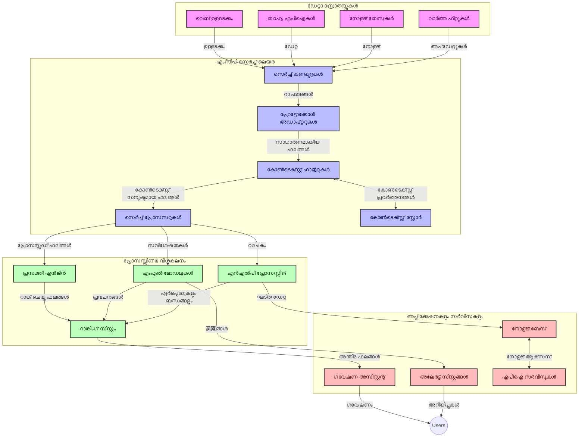
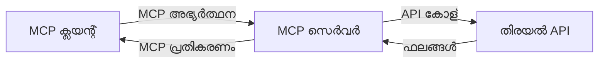
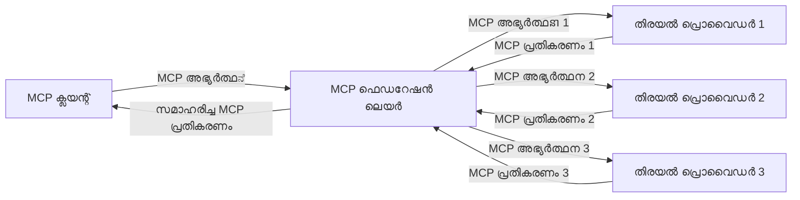
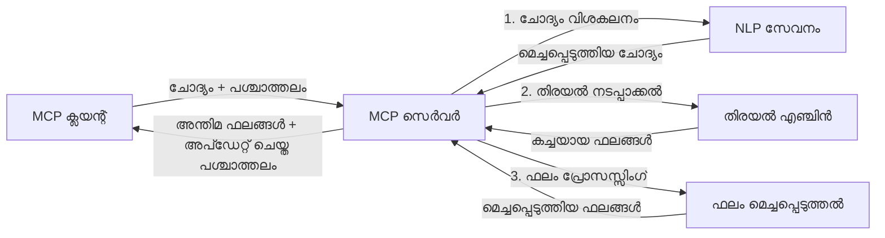

# റിയൽ-ടൈം വെബ് സെർച്ച് కోసం മോഡൽ കോണ്‍ടക്റ്റ് പ്രോട്ടോക്കോള്

## അവലോകനം

ഇന്നത്തെ വിവരപ്രതിരോധിയായ പരിസരത്തിൽ, അപ്ലിക്കേഷനുകൾക്ക് ഇന്റർനെറ്റിൽ നിന്നുള്ള അപ്ഡേറ്റായ വിവരങ്ങളിലേക്കു സമയബന്ധിതവും പ്രസക്തവുമായ പ്രതികരണങ്ങൾ നൽകുന്നതിനായി ഉടൻ ആക്‌സസ് ആവശ്യമായ സാഹചര്യത്തിൽ, റിയൽ-ടൈം വെബ് സെർച്ച് അത്യാവശ്യമായി മാറിയിരിക്കുന്നു. മോഡൽ കണ്ടെക്സ്റ്റ് പ്രോട്ടോക്കോൾ (MCP) ഈ റിയൽ-ടൈം സെർച്ച് പ്രക്രിയകളെ മെച്ചപ്പെടുത്തുന്നതിൽ വലിയ പുരോഗതിയാണ് പ്രതിനിധീകരിക്കുന്നത്, സെർച്ച് കാര്യക്ഷമത വർദ്ധിപ്പിച്ചു, സാന്ദർഭിക ഏകോപനം നിലനിര്‍ത്തി, സമഗ്രമായ സിസ്റ്റം പ്രകടനം മെച്ചപ്പെടുത്തുന്നു.

ഈ മോഡ്യൂൾ MCP യെ എങ്ങനെ എ.ഐ മോഡലുകൾ, സെർച്ച് എഞ്ചിനുകൾ, അപ്ലിക്കേഷനുകൾ എന്നിവിടങ്ങളിലായി സാന്ദർഭിക മാനേജുമെന്റിന് സ്റ്റാൻഡേർഡൈസ്ട് രീതിയൊരുക്കി, റിയൽ-ടൈം വെബ് സെർച്ചിനെ പരിവർത്തനം ചെയ്യുന്നത് വർണ്ണിക്കുന്നു.

### നിങ്ങൾ പഠിക്കുന്നവ

ഈ സമഗ്രമായ ഗൈഡിൽ, നിങ്ങൾ കണ്ടെത്തും:

- MCP എങ്ങനെ എ.ഐ മോഡലുകളുമായും റിയൽ-ടൈം വെബ് സെർച്ച് കഴിവുകളുമായും മഞ്ഞു പോലെ ബന്ധം സൃഷ്ടിക്കുന്നു
- MCP ഉപയോഗിച്ച് കാര്യക്ഷമവും സ്കെയിലബിൾവുമായ സെർച്ച് പരിഹാരങ്ങൾ നടപ്പിലാക്കുന്നതിനുള്ള ആർക്കിടെക്ചറൽ പാറ്റേണുകൾ
- മൾട്ടി ക്വറിയുകൾക്കും ഇടപെടലുകൾക്കും ഇടയിലാകുന്ന സെർച്ച് കോൺടെക്സ്റ്റ് സംരക്ഷിക്കുന്ന സാങ്കേതിക രീതികൾ
- വിവിധ സെർച്ച് സീനാരിയോകൾക്കായി Python, JavaScript എന്നിവയിൽ പ്രായോഗിക കോഡ് നടപ്പിലാക്കലുകൾ
- MCP ചാലിത സെർച്ച് സിസ്റ്റങ്ങൾക്കു പ്രസക്തത, പുതുപ്പിച്ച് ലഭ്യമായ മുന്നേറ്റം, പ്രകടനം എന്നിവ ശരിയാക്കുന്ന മാർഗങ്ങൾ

## റിയൽ-ടൈം വെബ് സെർച്ച് പരിചയം

റിയൽ-ടൈം വെബ് സെർച്ചെന്നത് വെബ്ബടിസ്ഥാനമാക്കിയ വിവരങ്ങൾ പ്രസിദ്ധീകരിക്കുമ്പോൾ അല്ലെങ്കിൽ അപ്ഡേറ്റ് ചെയ്യുമ്പോൾ തുടർച്ചയായി ക്വേരി, പ്രോസസ്സിംഗ്, വിശകലനം നടത്തുന്നതിനുള്ള സാങ്കേതിക സമീപനമാണ്. ഇത് കുറഞ്ഞ വൈകിയോടെ പുതിയ പ്രസക്തമായ വിവരങ്ങൾ നൽകുന്നു. ക്ലാസിക്കൽ സെർച്ച് സിസ്റ്റങ്ങൾ സംഭവങ്ങളിൽ മണിക്കൂറുകൾ അല്ലെങ്കിൽ ദിവസങ്ങൾ പഴക്കം ചെന്ന ഇൻഡെക്സ്ഡ് ഡാറ്റയിൽ പ്രവർത്തിക്കുന്നതിനുള്ള വ്യത്യാസത്തിൽ, റിയൽ-ടൈം സെർച്ച് വെബ്ബിൽ നിന്നുള്ള വൈതിക വിവരങ്ങളുടെ രൂപത്തിലാണ് പ്രവർത്തിക്കുന്നത്, അത് ഓൺലൈൻ ഉള്ളടക്കത്തിന്റെ നിലവിലെ അവസ്ഥ പ്രതിബിംബിക്കുന്നു.

### റിയൽ-ടൈം വെബ് സെർച്ചിന്റെ പ്രധാന ആശയങ്ങൾ:

- **തുടർച്ചയായ ക്വറി പ്രോസസ്സിംഗ്**: സെർച്ച് ക്വറികൾ സ്ഥിരം പുതുക്കുന്ന ഡാറ്റ സ്രോതസ്സുകൾക്കു വേണ്ടിയാണ് പ്രോസസ്സുചെയ്യുന്നത്
- **പുതിയതായ അറിവിന് മുൻഗണന**: സിസ്റ്റങ്ങൾ പുതിയ വിവരങ്ങൾക്ക് മുൻഗണന നൽകുന്നതായി രൂപകല്പന ചെയ്തിരിക്കുന്നു
- **പ്രസക്തതയും പുതുപ്പിച്ച വിവരവും പൊരുത്തപ്പെടുത്തൽ**: പ്രസക്തതയിലെയും പുതുപ്പിച്ച വിവരത്തിലെയും മദ്ധ്യത്തെ ബന്ധം നിലനിര്‍ത്തുന്നു
- **സ്കെയിലബിൾ ആർക്കിടെക്ചർ**: സിസ്റ്റങ്ങൾ വ്യത്യസ്ത ക്വറി ലോഡ്, ഡാറ്റ വാളിയംസ് കൈകാര്യം ചെയ്യണം
- **സാന്ദർഭിക മനസിലാക്കൽ**: പല സെർച്ച് ഘട്ടങ്ങളിലും ഉപഭോക്താവിന്റെ സാന്ദർഭികത നിലനിര്‍ത്തുന്നത് പ്രധാനമാണ്
- **ഡൈനാമിക് ക്വറി പുനരൂപപ്പെടുത്തൽ**: സാന്ദർഭികതയും മുൻ‌ഫലം ആസ്പദമാക്കി ക്വറികൾ അനുകൂലമായി മാറ്റുന്നു
- **മൾട്ടി-സ്രോതസ് സംയോജനം**: വിവിധ സെർച്ച് പ്രൊവൈഡർമാരുടെയും വെബ് സ്രോതസുകളുടെയും ഫലങ്ങൾ സംയോജിപ്പിക്കുന്നു
- **സെമാന്റിക് മനസിലാക്കൽ**: കീ വാക്കുകൾക്കുപകരം അർത്ഥം ആശ്രയിച്ചുള്ള പ്രോസസ്സിംഗ്
- **റിയൽ-ടൈം റാങ്കിംഗ്**: പുതിയ വിവരങ്ങൾ ലഭ്യമാകുന്നതോടെ ഫലം റാങ്ക് തുടർച്ചയായും സജ്ജമാക്കുന്നു

### മോഡൽ കണ്ടെക്സ്റ്റ് പ്രോട്ടോക്കോൾ (MCP) കൂടാതെ റിയൽ-ടൈം വെബ് സെർച്ച്

മോഡൽ കണ്ടെക്സ്റ്റ് പ്രോട്ടോക്കോൾ (MCP) റിയൽ-ടൈം വെബ് സെർച്ച് പരിസരങ്ങളിൽ ചില നിർണായക വെല്ലുവിളികളെ അഭിമുഖീകരിക്കുന്നു:

1. **സെർച്ച് കോൺടെക്സ്റ്റ് സംരക്ഷണം**: MCP സെർച്ച് ഘടകങ്ങൾക്കിടയിലെ സാന്ദർഭികത സ്റ്റാൻഡേർഡ് ചെയ്യും, അതിലൂടെ AI മോഡലുകൾക്കും പ്രോസസ്സിംഗ് നോഡുകൾക്കും പ്രസക്തമായ ക്വറി ചരിത്രം, ഉപയോക്തൃ ഇഷ്ടാനുസൃതികൾ ലഭ്യമാകും.

2. **കാര്യക്ഷമമായ ക്വറി മാനേജ്മെന്റ്**: സാന്ദർഭികത കൈമാറ്റത്തിനുള്ള ഘടനാപരമായ യന്ത്രങ്ങൾ നൽകുന്നതിലൂടെ MCP ഓരോ സെർച്ച് ഘട്ടത്തിലും സാന്ദർഭികത ആവർത്തിക്കുന്ന ഭാരം കുറയ്ക്കും.

3. **ഇന്റർഓപ്പറബിലിറ്റി**: വ്യത്യസ്ത സെർച്ച് സാങ്കേതിക വിദ്യകളിലെയും AI മോഡലുകളിലെയും ഇടയിൽ സാന്ദർഭികത പങ്കിടാനുള്ള പൊതുവായ ഭാഷ MCP സൃഷ്ടിക്കുന്നു, ഫ്ലെക്സിബിൾ, വിപുലീകരിക്കാന്‍ കഴിയുന്ന ആർക്കിടെക്ചറുകൾ സാധ്യമാക്കുന്നു.

4. **സെർച്-ഓപ്റ്റിമൈസ്ഡ് കോൺടെക്സ്റ്റ്**: MCP നടപ്പാക്കലുകൾ എളിയ എഴുത്തുപ്രബന്ധങ്ങൾ എങ്ങനെ സെർച്ചിനു ഏറ്റവും പ്രസക്തമാണോ ആധാരമാക്കുന്ന സാന്ദർഭിക ഘടകങ്ങൾ മുൻഗണന നൽകി പ്രകടനവും ശരിയായതും മെച്ചപ്പെടുത്തുന്നു.

5. **അനുകൂല സെർച്ച് പ്രോസസ്സിംഗ്**: MCP മുഖേന ഉചിതമായ സാന്ദർഭിക മാനേജ്മെന്റോടെ, സെർച്ച് സിസ്റ്റങ്ങൾ ഉപയോക്തൃ ആവശ്യങ്ങളും വിവര ഭൂപടവും അനുസരിച്ച് ഗതിമാർഗ്ഗം അടിസ്ഥാനമാക്കി പ്രോസസ്സിങ്ങ് കാര്യക്ഷമമായി ക്രമീകരിക്കാം.

വാർത്താസംഗ്രഹണത്തിൽ നിന്ന് ഗവേഷണ സഹായികളിലേക്കുള്ള സമകാലീന അപ്ലിക്കേഷനുകളിൽ MCP വെബ് സെർച്ച് സാങ്കേതിക വിദ്യകളുമായി സംയോജിപ്പിക്കുന്നത് കൂടുതൽ ബുദ്ധിമുട്ടുള്ള, സാന്ദർഭിക അവബോധമുള്ള സെർച്ച് സാധ്യമാക്കുന്നു, ഉപയോക്തൃ ഇടപെടലുകൾ തുടരുമ്പോൾ കൂടുതൽ പ്രസക്തവുമായ ഫലങ്ങൾ നൽകുന്നു.

## പഠന ലക്ഷ്യങ്ങൾ

ഈ പാഠം അവസാനിക്കുന്നതോടൊപ്പം, നിങ്ങൾക്ക് സാധ്യമാകും:

- റിയൽ-ടൈം വെബ് സെർച്ച് അടിസ്ഥാനങ്ങൾയും ആധുനിക അപ്ലിക്കേഷനുകളിലെ വെല്ലുവിളികളുമെന്താണെന്ന് മനസ്സിലാക്കുക
- മോഡൽ കണ്ടെക്സ്റ്റ് പ്രോട്ടോക്കോൾ (MCP) റിയൽ-ടൈം വെബ് സെർച്ച് കഴിവുകൾ എങ്ങനെ മെച്ചപ്പെടുത്തുന്നു എന്ന് വിശദീകരിക്കുക
- ജനപ്രിയ ഫ്രെയിംവർക്കുകളും API കളും ഉപയോഗിച്ച് MCP അടിസ്ഥാനമാക്കി സെർച്ച് പരിഹാരങ്ങൾ നടപ്പിലാക്കുക
- MCP ഉപയോഗിച്ച് സ്കെയിലബിൾ, ഉയർന്ന പ്രകടനമുള്ള സെർച്ച് ആർക്കിടെക്ചറുകൾ രൂപകല്‍പ്പന ചെയ്യുകയും വിനിയോഗിപ്പിക്കുകയും ചെയ്യുക
- MCP ആശയങ്ങൾ വിവിധ ഉപയോഗകേസുകളിലേക്കും ഉൾപ്പെടുത്തുക, സെമാന്റിക് സെർച്ച്, ഗവേഷണ സഹായം, AI വർദ്ധിപ്പിച്ച ബ്രൗസിംഗ് എന്നിവ ഉൾപ്പെടെ
- MCP അടിസ്ഥാനമാക്കിയ സെർച്ച് സാങ്കേതികവിദ്യകളിലെ ഉയർന്ന ട്രെൻഡുകളും ഭാവിയിലെ നൂതനത്വങ്ങളും വിലമതിക്കുക
- ഉപയോക്തൃ ഇടപെടലുകളിൽ നിന്നും പഠിക്കുന്ന സാന്ദർഭിക ബോധമുള്ള സെർച്ച് സിസ്റ്റങ്ങൾ വികസിപ്പിക്കുക
- സ്റ്റാൻഡേർഡൈസ്ട് MCP പ്രോട്ടോക്കോളുകൾ ഉപയോഗിച്ച് AI അസിസ്റ്റന്റുകളിൽ വെബ് സെർച്ച് കഴിവുകൾ സംയോജിപ്പിക്കുക
- സാന്ദർഭികതയുടെ അടിസ്ഥാനത്തിൽ ഘട്ടം ഘട്ടമായും ഫലങ്ങൾ ഓഫീസുകളിൽ സങ്കുചിതമായി തിരുത്തുന്ന മൾട്ടി-സ്റ്റെജ്ജ് സെര്‍ച്ച_pipelineകൾ രൂപകല്‍പ്പന ചെയ്യുക
- സമഗ്ര സാന്ദർഭിക ബോധം നിലനിർത്തുമ്പോഴും സെർച്ച് പ്രകടനം മെച്ചപ്പെടുത്തുക

### വ്യാഖ്യാനം மற்றும் പ്രാധാന്യം

റിയൽ-ടൈം വെബ് സെർച്ച് എന്നത് കുറഞ്ഞ വൈകിയോടെ വെബ് അടിസ്ഥാനമാക്കിയ വിവരങ്ങൾ തുടർച്ചയായി ക്വറി ചെയ്‌തും തിരികെ വാങ്ങിയും നൽകിയും സാധ്യമാക്കുന്നതാണ്. പരമ്പരാഗത സെർച്ച് എഞ്ചിനുകൾ വെബ് ക്രോൾ ചെയ്ത് ഇൻഡക്സ് ചെയ്യുന്നതിൽ വ്യത്യസ്തമായി, റിയൽ-ടൈം സെർച്ച് ലഭ്യമായിരിക്കുന്നവനെ എടുക്കുന്ന രീതിയാണ്.

റിയൽ-ടൈം വെബ് സെർച്ചിന്റെ പ്രധാന സവിശേഷതകൾ:

- **പുതുമ**: പുതിയ ഉള്ളടക്കും അപ്ഡേറ്റുകളും മുൻഗണന നൽകൽ
- **തുടർച്ചയായ പ്രോസസ്സിംഗ്**: പുതിയ വിവരങ്ങൾ എല്ലായ്പ്പോഴും നിരീക്ഷണം
- **ക്വറി മാറ്റം**: സാന്ദർഭികതയും പ്രതികരണവും ആശ്രയിച്ച് സെർച്ച് ക്വറികൾ മെച്ചപ്പെടുത്തൽ
- **കെട്ടനിലവാരത്തിൽ ഫലം നൽകൽ**: കുറഞ്ഞ കാലതാമസത്തിൽ ഫലം നൽകൽ
- **സാന്ദർഭികത നിലനിർത്തൽ**: മുമ്പത്തെ ക്വറികൾ അടിസ്ഥാനമാക്കി പ്രസക്തത മെച്ചപ്പെടുത്തൽ

### പരമ്പരാഗത വെബ് സെർച്ചിലെ വെല്ലുവിളികൾ

റിയൽ-ടൈം സാഹചര്യങ്ങളിൽ പരമ്പരാഗത സെർച്ച് രീതികൾക്ക് ചില പരിമിതികൾ നേരിടേണ്ടിവരുന്നു:

1. **കോണ്‍ടെക്സ്റ്റ് വിഭേദനം**: പല ക്വറി ഘട്ടങ്ങളിലും സെർച്ച് കാണിക്കുമ്ബോള്‍ സാന്ദര്‍ഭികത നിലനിർത്താൻ പ്രയാസം
2. **വിവര പുതുമ**: ഏറ്റവും പുതിയ വിവരങ്ങൾ നേടുന്നത്, മുൻഗണന നൽകുന്നത് വെല്ലുവിളികൾ
3. **സംയോജനം സങ്കീർണ്ണത**: സെർച്ച് സിസ്റ്റങ്ങളും അപ്ലിക്കേഷനുകളും തമ്മിലുള്ള ഇന്റർഓപ്പറബിലിറ്റി പ്രയാസങ്ങൾ
4. **വൈകൽപ്പിക പ്രശ്നങ്ങൾ**: വ്യാപകമായ സെർച്ച് കഴിവും കുറഞ്ഞ പ്രതികരണ സമയവും തമ്മിൽ തുല്യനില
5. **പ്രസക്തത ക്രമീകരണം**: പുതുമ മുൻഗണന നൽകുമ്പോൾ ശരിയായതും പ്രസക്തവുമായ ഫലം ഉറപ്പാക്കൽ

## സെർച്ചിനായി മോഡൽ കണ്ടെക്സ്റ്റ് പ്രോട്ടോക്കോൾ (MCP) മനസ്സിലാക്കൽ

### സെർച്ച് കോൺടെക്സ്റ്റുകളിൽ MCP എന്താണ്?

മോഡൽ കണ്ടെക്സ്റ്റ് പ്രോട്ടോക്കോൾ (MCP) ഒരു സ്റ്റാൻഡേർഡൈസ്ഡ് കമ്മ്യൂണിക്കേഷൻ പ്രോട്ടോക്കോളാണ്, AI മോഡലുകളും അപ്ലിക്കേഷനുകളും തമ്മിൽ കാര്യക്ഷമമായ ഇടപെടലിനായി രൂപകൽപ്പന ചെയ്തിരിക്കുന്നത്. റിയൽ-ടൈം വെബ് സെർച്ചിന്റെ സാന്ദർഭത്തിൽ MCP ദീർഘമായ ക്വറി പരമ്പരകളിൽ സെർച്ച് കോൺടെക്സ്റ്റ് സംരക്ഷിക്കുന്നതിനും, സെർച്ച് ക്വറിയുടെ ഫോർമാറ്റ് സ്റ്റാൻഡേർഡൈസ് ചെയ്യുന്നതിനും, സെർച്ച് പാരാമീറ്ററുകളും ഫലങ്ങളും കൈമാറുന്നതിൽ മെച്ചപ്പെടുത്തലുകൾക്കും, മോഡൽ-ടു-സെർച്ച് എഞ്ചിൻ ആശയവിനിമയ മെച്ചപ്പെടുത്തലുകൾക്കുമുള്ള റൂപ്പരേഖ നൽകുന്നു.

- ക്വറി പരമ്പരകളിൽ സെർച്ച് കോൺടെക്സ്റ്റ് നിലനിർത്തൽ
- സെർച്ച് ക്വറി ഫോറ്മാറ്റ്, ഫലം ഫോറ്മാറ്റ് സ്റ്റാൻഡേർഡ് ചെയ്യൽ
- സെർച്ച് പാരാമീറ്ററുകൾക്കും ഫലങ്ങൾക്കും പരിമിതികൾ കുറയ്ക്കൽ
- മോഡലും സെർച്ച് എഞ്ചിനും ഇടയിൽ ശക്തമായ കണക്ഷൻ

### പ്രധാന ഘടകങ്ങളും ആർക്കിടെക്ചറും

റിയൽ-ടൈം വെബ് സെർച്ചിനുള്ള MCP ആർക്കിടെക്ചർ പ്രധാന ഘടകങ്ങൾ:

1. **ക്വറി കോൺടെക്സ്റ്റ് ഹാൻഡ്ലറുകൾ**: മൾട്ടി ക്വറിയുകളുടെ സാന്ദർഭികത നിയന്ത്രിക്കുകയും പരിപാലിക്കുകയും ചെയ്യുന്നു
2. **സെർച്ച് പ്രോസസ്സറുകൾ**: കോൺടെക്സ്റ്റ്-അവബോധിയുള്ള സാങ്കേതികവിദ്യകൾ ഉപയോഗിച്ച് സെർച്ച് അഭ്യർത്ഥനകൾ പ്രോസസ്സ് ചെയ്യുന്നു
3. **പ്രോട്ടോക്കോൾ അഡാപ്റ്റർസ്**: വ്യത്യസ്ത സെർച്ച് APIs ഇടയിൽ കോൺടെക്സ്റ്റ് പരിപാലിച്ചുകൊണ്ട് പരിവർത്തനം ചെയ്യുക
4. **കോണ്ടും സ്റ്റോർ**: സെർച്ച് ചരിത്രം, ഇഷ്ടങ്ങൾ ഫലപ്രദമായി സംഭരിക്കുകയും പ്രാപിക്കുകയും ചെയ്യുന്നു
5. **സെർച്ച് കണക്ടറുകൾ**: വിവിധ സെർച്ച് എഞ്ചിനുകൾക്കും വെബ് APIsക്കും കണക്ട് ചെയ്യുന്നു



### MCP റിയൽ-ടൈം വെബ് സെർച്ചിനെ എങ്ങനെ മെച്ചപ്പെടുത്തുന്നു

MCP പരമ്പരാഗത വെബ് സെർച്ച് വെല്ലുവിളികൾ വഴി പരിഹരിക്കുന്നു:

- **സാന്ദർഭിക തുടർച്ച**: സെർച്ച് സെഷൻ മുഴുവനും ക്വറികൾ തമ്മിലുള്ള ബന്ധം നിലനിർത്തുന്നു
- **പ്രതിരൂപിക്കും തടസ്സമില്ലാത്ത കൈമാറ്റം**: കൃത്യമായി സാന്ദർഭികത മാനേജ്മെന്റിലൂടെ സെർച്ച് പാരാമീറ്റർ ആവർത്തനം കുറയ്ക്കുന്നു
- **സ്റ്റാൻഡേർഡൈസ്ഡ് ഇന്റർഫേസുകൾ**: സെർച്ച് ഘടകങ്ങൾക്കും ഏകീകൃത API നൽകുന്നു
- **കുറഞ്ഞ വൈകൽപ്പികത**: കാര്യക്ഷമമായ കോൺടെക്സ്റ്റ് കൈകാര്യം ചെയ്തുകൊണ്ട് പ്രോസസ്സിംഗ് ഓവർഹെഡ് കുറയ്ക്കുന്നു
- **മെച്ചപ്പെട്ട പ്രസക്തത**: മൾട്ടി ക്വറികളിൽ ഉപഭോക്തൃ ഉദ്ദേശം സംരക്ഷിക്കുന്പോൾ സെർച്ച് പ്രസക്തി മെച്ചപ്പെടുത്തുന്നു

## ഇന്റഗ്രേഷൻ & നടപ്പിലാക്കൽ

റിയൽ-ടൈം വെബ് സെർച്ച് സിസ്റ്റങ്ങൾ പ്രവർത്തനവും സാന്ദർഭിക ഏകോപനവും പരിപാലിക്കാൻ സൂക്ഷ്മമായ ആർക്കിടെക്ചർ രൂപകൽപ്പനയും നടപ്പിലാക്കലും ആവശ്യമാണ്. മോഡൽ കണ്ടെക്സ്റ്റ് പ്രോട്ടോക്കോൾ എഐ മോഡലുകളും സെർച്ച് സാങ്കേതിക വിദ്യകളും ഏകീകൃതമായി ബന്ധിപ്പിക്കുന്നതിനുള്ള സാധാരണ സങ്കേതം നൽകുന്നു, കൂടുതൽ പരിപൂർണ്ണവും സാന്ദർഭിക ബോധമുള്ള സെർച്ച് പൈപ്പ്ലൈനുകൾക്കും അവസരം.

### സെർച്ച് ആർക്കിടെക്ചറുകളിൽ MCP ഇന്റഗ്രേഷന്റെ അവലോകനം

റിയൽ-ടൈം സെർച്ച് പരിസരങ്ങളിൽ MCP നടപ്പിലാക്കുമ്പോൾ കണക്കിലെടുക്കേണ്ട കാര്യങ്ങൾ:

1. **സെർച്ച് കോൺടെക്സ്റ്റ് സീരിയലൈസേഷൻ**: MCP സെർച്ച് അഭ്യർത്ഥനകളിലെ സാന്ദർഭിക വിവരം എൻകോഡ് ചെയ്യുന്നതിനുള്ള കാര്യക്ഷമമായ മാർഗങ്ങൾ നൽകുന്നു, പ്രോസസ്സിംഗ് പൈപ്പ്ലൈനിലുടനീളം പ്രധാന സാന്ദർഭികത ക്വറിയെ പിന്തുടരുന്നു. ഇതിൽ സെർച്ച്-ബന്ധിത മെറ്റാഡാറ്റയ്ക്ക് ഓരോ സ്ഥലത്തും പ്രാപ്തമാക്കപ്പെട്ട സ്റ്റാൻഡേർഡൈസ്ഡ് സീരിയലൈസേഷൻ ഫോംഫാടുകളും ഉൾപ്പെടുന്നു.

2. **സ്റ്റേറ്റ്‌ഫുൾ സെർച്ച് പ്രോസസ്സിംഗ്**: MCP പല ഘട്ടങ്ങളുള്ള സെർച്ച് പൈപ്പ്ലൈനുകളിൽ സാന്ദർഭിക ഭേദഗതികൾ ഫലമാക്കുന്നതിൽ പ്രധാനമായും സാന്ദർഭ പ്രത്യക്ഷീകരണം ഒരുമിച്ച് നിലനിർത്താൻ കഴിയും, കൂടുതൽ ബുദ്ധിമുട്ടുള്ള സ്റ്റേറ്റ്‌ഫുൾ പ്രോസസ്സിംഗ് സാധ്യമാക്കുന്നു.

3. **ക്വറി വിപുലീകരണവും മെച്ചപ്പെടുത്തലും**: MCP നടപ്പാക്കലുകൾ സംഭരിച്ച സാന്ദർഭം ആശ്രയിച്ചുള്ള ക്വറി വിപുലീകരണവും മെച്ചപ്പെടുത്തലും സഹായിക്കുന്നു, സെർച്ച് സെഷൻ പുരോഗമിക്കുന്നതോടെ കൂടുതൽ പ്രസക്ത ഫലങ്ങൾ ലഭ്യമാക്കുന്നു.

4. **ഫലം കാഷിംഗ് & മുൻഗണന**: MCP സാന്ദർഭിക കൈകാര്യം സ്റ്റാൻഡേർഡ് ആക്കുന്നതിലൂടെ, ഫലം കാഷിംഗ് നിർവഹണവും മുൻഗണനയും بہتر ആക്കുന്നു, ഘടകങ്ങൾ പരിണമിക്കുന്ന സെർച്ച് കോൺടെക്സ്റ്റ് അനുസരിച്ച് ക്രമീകരിക്കാം.

5. **സെർച്ച് ഫെഡറേഷൻ & ആഗ്രിഗേഷൻ**: MCP കുത്തകയിൽ വിവിധ ബാക്ക്‌എൻഡുകളിൽ നിന്നുള്ള സെർച്ച് സാന്ദർഭികത ഘടനാപരമായ രൂപത്തിൽ കാട്ടുന്നു, വ്യത്യസ്ത സ്രോതസ്സുകളിൽ നിന്നുള്ള ഫലങ്ങളുടെ ഫലപ്രദമായ ആഗ്രിഗേഷൻ സാധ്യമാക്കുന്നു.

വ്യത്യസ്ത സെർച്ച് സാങ്കേതിക വിദ്യകളിൽ MCP നടപ്പാക്കലുകൾ സാന്ദർഭിക മാനേജ്മെന്റിന്റെ ഐക്യപ്പെടുത്തിയ സമീപനം സൃഷ്ടിക്കുന്നു, ഇളം ഇന്റഗ്രേഷൻ കോഡ് ആവശ്യമില്ലാതെ സെർച്ച് ക്വറികളുടെയുളള പ്രസക്തമായ സാന്ദർഭം നിലനിർത്താനുള്ള സിസ്റ്റത്തിന്റെ കഴിവ് മെച്ചപ്പെടുത്തുന്നു.

### വിവിധ വെബ് സെർച്ച് നടപ്പിലാക്കലുകളിൽ MCP

ഈ ഉദാഹരണങ്ങൾ നിലവിലുള്ള MCP സ്പെസിഫിക്കേഷനോട് അനുയോജ്യമായ JSON-RPC അടിസ്ഥാനത്തിലുള്ള പ്രോട്ടോക്കോളിൽ പ്രവർത്തിക്കുന്നു, വ്യത്യസ്ത ട്രാൻസ്പോർട്ട് മെക്കാനിസങ്ങൾ ഉൾപ്പെടെ. കോഡ് MCP പ്രോട്ടോക്കോളിന് പൂർണ്ണമായ പൊരുത്തം പുലർത്തുമ്പോൾ ഇഷ്ടാനുസൃത സെർച്ച് ഇന്റഗ്രേഷനുകൾ എങ്ങനെ നടപ്പിലാക്കാമെന്ന് കാണിക്കുന്നു.


<details>
<summary>ജനറിക് സെർച്ച് API ഉപയോഗിച്ച് Python നടപ്പിലാക്കൽ</summary>

```python
import asyncio
import json
import aiohttp
from typing import Dict, Any, Optional, List
from contextlib import asynccontextmanager
from collections.abc import AsyncIterator

# സ്റ്റാൻഡേർഡ് MCP ലൈബ്രറികൾ ഇറക്കുമതി ചെയ്യുക
from mcp.client.session import ClientSession
from mcp.client.streamable_http import streamablehttp_client
from mcp.types import TextContent, CreateMessageRequestParams, CreateMessageResult
from mcp.server.fastmcp import FastMCP

# വെബ് തിരച്ചിനായി FastMCP സെർവർ നിർമ്മിക്കുക
search_server = FastMCP("WebSearch")

# വെബ് തിരച്ചിൽ പ്രവർത്തനങ്ങൾ കൈകാര്യം ചെയ്യുന്നതിനുള്ള ക്ലാസ്
class WebSearchHandler:
    def __init__(self, api_endpoint: str, api_key: str):
        self.api_endpoint = api_endpoint
        self.api_key = api_key
        self.session = None
        
    async def initialize(self):
        """Initialize the HTTP session"""
        self.session = aiohttp.ClientSession(
            headers={"Authorization": f"Bearer {self.api_key}"}
        )
    
    async def close(self):
        """Close the HTTP session"""
        if self.session:
            await self.session.close()
            
    async def perform_search(self, query: str, max_results: int = 5, 
                           include_domains: List[str] = None, 
                           exclude_domains: List[str] = None,
                           time_period: str = "any") -> Dict[str, Any]:
        """Perform web search using the search API"""
        # തിരച്ചിൽ പാരാമീറ്ററുകൾ നിർമ്മിക്കുക
        search_params = {
            "q": query,
            "limit": max_results,
            "time": time_period
        }
        
        if include_domains:
            search_params["site"] = ",".join(include_domains)
            
        if exclude_domains:
            search_params["exclude_site"] = ",".join(exclude_domains)
        
        # തിരച്ചിൽ അഭ്യർത്ഥന നടത്തുക
        try:
            async with self.session.get(
                self.api_endpoint,
                params=search_params
            ) as response:
                if response.status != 200:
                    error_text = await response.text()
                    raise Exception(f"Search API error: {response.status} - {error_text}")
                
                search_data = await response.json()
                
                # API-വിശിഷ്ഠ പ്രതികരണം സ്റ്റാൻഡേർഡ് ഫോർമാറ്റിലേക്ക് മാറ്റുക
                results = []
                for item in search_data.get("results", []):
                    results.append({
                        "title": item.get("title", ""),
                        "url": item.get("url", ""),
                        "snippet": item.get("snippet", ""),
                        "date": item.get("published_date", ""),
                        "source": item.get("source", "")
                    })
                
                return {
                    "query": query,
                    "totalResults": len(results),
                    "results": results
                }
        except Exception as e:
            print(f"Search API request error: {e}")
            raise

# തിരച്ചിൽ ഹാൻഡ്ലർ പ്രാരംഭീകരിക്കുക
search_handler = WebSearchHandler(
    api_endpoint="https://api.search-service.example/search",
    api_key="your-api-key-here"
)

# തിരച്ചിൽ ഹാൻഡ്ലർ നിയന്ത്രിക്കാൻ ലൈഫ്സ്പാൻ സെറ്റ് ചെയ്യുക
@asyncio.asynccontextmanager
async def app_lifespan(server: FastMCP):
    """Manage application lifecycle"""
    await search_handler.initialize()
    try:
        yield {"search_handler": search_handler}
    finally:
        await search_handler.close()

# സെർവറിന് ലൈഫ്സ്പാൻ സെറ്റ് ചെയ്യുക
search_server = FastMCP("WebSearch", lifespan=app_lifespan)

# ഒരു വെബ് തിരച്ചിൽ ഉപകരണം രജിസ്റ്റർ ചെയ്യുക
@search_server.tool()
async def web_search(query: str, max_results: int = 5, 
                   include_domains: List[str] = None,
                   exclude_domains: List[str] = None,
                   time_period: str = "any") -> Dict[str, Any]:
    """
    Search the web for information
    
    Args:
        query: The search query
        max_results: Maximum number of results to return (default: 5)
        include_domains: List of domains to include in search results
        exclude_domains: List of domains to exclude from search results
        time_period: Time period for results ("day", "week", "month", "any")
        
    Returns:
        Dictionary containing search results
    """
    ctx = search_server.get_context()
    search_handler = ctx.request_context.lifespan_context["search_handler"]
    
    results = await search_handler.perform_search(
        query=query,
        max_results=max_results,
        include_domains=include_domains,
        exclude_domains=exclude_domains,
        time_period=time_period
    )
    
    return results

# ഉദാഹരണ ക്ലയന്റ് ഉപയോഗം
async def client_example():
    # Streamable HTTP ട്രാൻസ്പോർട്ട് ഉപയോഗിച്ച് തിരച്ചിൽ സെർവറുമായി ബന്ധിപ്പിക്കുക
    async with streamablehttp_client("http://localhost:8000/mcp") as (read, write, _):
        async with ClientSession(read, write) as session:
            # ബന്ധം പ്രാരംഭീകരിക്കുക
            await session.initialize()
            
            # web_search ഉപകരണം വിളിക്കുക
            search_results = await session.call_tool(
                "web_search", 
                {
                    "query": "latest developments in AI and Model Context Protocol",
                    "max_results": 5,
                    "time_period": "day",
                    "include_domains": ["github.com", "microsoft.com"]
                }
            )
            
            print(f"Search results: {search_results}")

# സെർവർ പ്രവർത്തന ഉദാഹരണം
if __name__ == "__main__":
    # Streamable HTTP ട്രാൻസ്പോർട്ടോടെ സെർവർ ഒടുവിൽ നടത്തുക
    search_server.run(transport="streamable-http")
```
</details> 

<details>
<summary>ബ്രൗസർ അധിഷ്ഠിത സെർച്ച് ഉപയോഗിച്ച് JavaScript നടപ്പിലാക്കൽ</summary>


```javascript
// വെബ് സർച്ചിനുള്ള MCP സവേര്‍ നടപ്പാക്കല്‍
import { McpServer, ResourceTemplate } from '@modelcontextprotocol/sdk/server/mcp.js';
import { StreamableHTTPServerTransport } from '@modelcontextprotocol/sdk/server/streamableHttp.js';
import { z } from 'zod';

// വെബ് സർച്ചിന് MCP സവേര്‍ സൃഷ്ടിക്കുക
const searchServer = new McpServer({
    name: "BrowserSearch",
    description: "A server that provides web search capabilities"
});

// സર્ચ് സേവന ക്ലാസ്
class SearchService {
    constructor(searchApiUrl, apiKey) {
        this.searchApiUrl = searchApiUrl;
        this.apiKey = apiKey;
    }

    async performSearch(parameters) {
        const {
            query = '',
            maxResults = 5,
            includeDomains = [],
            excludeDomains = [],
            timePeriod = 'any'
        } = parameters;
        
        // പാരാമീറ്ററുകളോടെ സർച്ചിംഗ് URL നിര്‍മ്മിക്കുക
        const url = new URL(this.searchApiUrl);
        url.searchParams.append('q', query);
        url.searchParams.append('limit', maxResults);
        url.searchParams.append('time', timePeriod);
        
        if (includeDomains.length > 0) {
            url.searchParams.append('site', includeDomains.join(','));
        }
        
        if (excludeDomains.length > 0) {
            url.searchParams.append('exclude_site', excludeDomains.join(','));
        }
        
        try {
            const response = await fetch(url.toString(), {
                method: 'GET',
                headers: {
                    'Authorization': `Bearer ${this.apiKey}`,
                    'Content-Type': 'application/json'
                }
            });
            
            if (!response.ok) {
                const errorText = await response.text();
                throw new Error(`Search API error: ${response.status} - ${errorText}`);
            }
            
            const searchData = await response.json();
            
            // API-നിര്ദ്ദിഷ്ട പ്രതികരണത്തെ ഒരു സ്റ്റാന്‍ഡേര്‍ഡ് ഫോര്‍മാറ്റിലേക്ക് മാറ്റുക
            const results = searchData.results?.map(item => ({
                title: item.title || '',
                url: item.url || '',
                snippet: item.snippet || '',
                date: item.published_date || '',
                source: item.source || ''
            })) || [];
            
            return {
                query,
                totalResults: results.length,
                results
            };
        } catch (error) {
            console.error('Search API request error:', error);
            throw error;
        }
    }
}

// സർച്ചിംഗ് സേവനം ആരംഭിക്കുക
const searchService = new SearchService(
    'https://api.search-service.example/search',
    'your-api-key-here'
);

// സവേര്‍ക്കായി സാന്ദരഭ്യ പ്രദാതാക്കളെ ക്രമീകരിക്കുക
searchServer.setContextProvider(() => {
    return {
        searchService
    };
});

// വെബ് സર્ચ് ടൂൾ രജിസ്റ്റർ ചെയ്യുക
searchServer.tool({
    name: 'web_search',
    description: 'Search the web for information',
    parameters: {
        type: 'object',
        properties: {
            query: {
                type: 'string',
                description: 'The search query'
            },
            maxResults: {
                type: 'integer',
                description: 'Maximum number of results to return',
                default: 5
            },
            includeDomains: {
                type: 'array',
                items: { type: 'string' },
                description: 'List of domains to include in search results'
            },
            excludeDomains: {
                type: 'array',
                items: { type: 'string' },
                description: 'List of domains to exclude from search results'
            },
            timePeriod: {
                type: 'string',
                description: 'Time period for results',
                enum: ['day', 'week', 'month', 'any'],
                default: 'any'
            }
        },
        required: ['query']
    },
    handler: async (params, context) => {
        const { searchService } = context;
        return await searchService.performSearch(params);
    }
});

// സർച്ചിംഗ് സവേര്‍ വഴി കണക്റ്റ് ചെയ്യുന്നതിനുള്ള ഉദാഹരണ ക്ലയന്റ് കോഡ്
import { Client } from '@modelcontextprotocol/sdk/client/index.js';
import { StreamableHTTPClientTransport } from '@modelcontextprotocol/sdk/client/streamableHttp.js';

async function connectToSearchServer() {
    // സർച്ചിംഗ് സർവറുമായി ബന്ധപ്പെടുക
    const transport = new StreamableHTTPClientTransport(
        new URL('http://localhost:8000/mcp')
    );
    
    const client = new Client({
        name: 'search-client',
        version: '1.0.0'
    });
    
    await client.connect(transport);
    
    // സർച്ചിംഗ് ടൂൾ പ്രവർത്തിപ്പിക്കുക
    const searchResults = await client.callTool({
        name: 'web_search',
        arguments: {
            query: 'Model Context Protocol implementation examples',
            maxResults: 10,
            timePeriod: 'week',
            includeDomains: ['github.com', 'docs.microsoft.com']
        }
    });
    
    console.log('Search results:', searchResults);
    
    // ക്ലീൻഅപ്പ്
    await client.disconnect();
}

// സർവർ തുടങ്ങിയിലേക്ക്
const transport = new StreamableHTTPServerTransport();
await searchServer.connect(transport);
console.log('Search server running at http://localhost:8000/mcp');

// വേര്‍പെടുത്തിയ പ്രക്രിയയിലുള്ളോ സർവർ തുടങ്ങിയത് കഴിഞ്ഞോ
// connectToSearchServer().catch(console.error);
```
</details> 


## കോഡ് ഉദാഹരണങ്ങളിലെ പരാമർശം

> **പ്രധാന കുറിപ്പ്**: താഴെയുള്ള കോഡ് ഉദാഹരണങ്ങൾ മോഡൽ കണ്ടെക്സ്റ്റ് പ്രോട്ടോക്കോൾ (MCP) വെബ് സെർച്ച് ഫംഗ്ഷനാലിറ്റിയിൽ എങ്ങനെ ഇന്റഗ്രേറ്റ് ചെയ്യാമെന്ന് കാണിക്കുന്നു. അതിവ്യാപകമായ MCP SDK കളുടെ ഘടനകൾ പിന്തുടരുന്നെങ്കിലും, പഠനാർത്ഥം ലളിതമാക്കപ്പെട്ടതാണ്.
> 
> ഈ ഉദാഹരണങ്ങൾ കാണിക്കുന്നു:
> 
> 1. **Python നടപ്പിലാക്കൽ**: ഫാസ്റ്റ് MCP സെർവർ നിലവിലെ MCP പൈതൺ SDK യുടെ പാറ്റേണുകൾ അനുസരിച്ച് വെബ് സെർച്ച് ടൂൾ ഒരുക്കുകയും ബാഹ്യ സെർച്ച് API യുമായി കണക്ട് ചെയ്യുകയും ചെയ്യുന്നു. ഇത് ആയുർദ്ധാന വ്യവസ്ഥാപനവും, സാന്ദർഭികത കൈകാര്യം ചെയ്യലും, ടൂൾ നടപ്പിലാക്കലും ശരിയായി കാണിക്കുന്നു. പ്രൊഡക്ഷൻ വിനിയോഗത്തിനായി പഴയ SSE ട്രാൻസ്പോർട്ട് മറികടന്നു പ്രയോഗിക്കുന്ന Streamable HTTP ട്രാൻസ്പോർട്ട് പോലുള്ള സൂചിപ്പിച്ച രീതികളെ ഉൾക്കൊള്ളുന്നു.
> 
> 2. **JavaScript നടപ്പിലാക്കൽ**: ഫാസ്റ്റ് MCP പാറ്റേണായി MCP ടൈപ്പ്‌സ്‌ക്രിപ്റ്റ് SDK യുടെ രൂപത്തിൽ, ടൂൾ നിർവചനങ്ങളുമായി കൺട്രപൂൾലായി സെർച്ച് സർവർ സൃഷ്ടിക്കുന്നു. സെഷൻ മാനേജ്മെന്റ്‌ക്കും സാന്ദർഭികത സംരക്ഷണത്തിനും ഏറ്റവും പുതിയ ശിപാർശകൾ പിന്തുടരുന്നു.
> 
> പ്രൊഡക്ഷൻ ഉപയോഗത്തിനായി കൂടുതൽ പിഴവ് കൈകാര്യം, പ്രാമാണീകരണം, പ്രത്യേക API ഇന്റഗ്രേഷൻ കോഡ് ആവശ്യമാകും. കാണിച്ചിരിക്കുന്ന സെർച്ച് API എൻഡ്‌പോയിന്റുകൾ (`https://api.search-service.example/search`) പ്ലേയ്സ്‌ഹോൾഡറുകളാണ്, യഥാർത്ഥ സെർച്ച് സർവീസ് എൻഡ്‌പോയിന്റുകൾക്ക് പകരം മാറ്റേണ്ടതാണ്.
> 
> സമ്പൂർണ്ണ നടപ്പിലാക്കലിനും ഏറ്റവും പുതുപ്പിച്ച സമീപനങ്ങൾക്കുമായി [ഔദ്യോഗിക MCP സ്പെസിഫിക്കേഷൻ](https://spec.modelcontextprotocol.io/)യും SDK ഡോക്യുമെന്റേഷനുമാണ് സൂചിപ്പിക്കേണ്ടത്.

## അടിസ്ഥാന ആശയങ്ങൾ

### മോഡൽ കണ്ടെക്സ്റ്റ് പ്രോട്ടോക്കോൾ (MCP) ഫ್ರെയിംവർക്ക്

അടിസ്ഥാനത്തിൽ, മോഡൽ കണ്ടെക്സ്റ്റ് പ്രോട്ടോക്കോൾ AI മോഡലുകൾ, അപ്ലിക്കേഷനുകൾ, സേവനങ്ങൾ എന്നിവയ്ക്ക് സാന്ദർഭം കൈമാറ്റം ചെയ്യാനുള്ള സ്റ്റാൻഡേർഡ് വഴിയാണ്. റിയൽ-ടൈം വെബ് സെർച്ചിൽ, ഇത് ഏകോപിതമായ മൾട്ടി-ടേൺ സെർച്ച് അനുഭവങ്ങൾ സൃഷ്ടിക്കാൻ നിർണായകമാണ്. പ്രധാന ഘടകങ്ങൾ:

1. **ക്ലയന്റ്-സെർവർ ആർക്കിടെക്ചർ**: MCP സെർച്ച് ക്ലയന്റുകൾ (അഭ്യർത്ഥകരും) സെർച്ച് സർവറുകൾ (ദാതാക്കൾ) എന്നിവ തമ്മിൽ വ്യക്തമായ വേര്‍പാട് സ്ഥാപിക്കുന്നു, ഇത് ഫ്ലെക്സിബിൾ വിനിയോഗ മാതൃകകൾക്ക് വേദി ഒരുക്കുന്നു.

2. **JSON-RPC കമ്മ്യൂണിക്കേഷൻ**: പ്രോട്ടോക്കോൾ മെസേജ് കൈമാറ്റത്തിന് JSON-RPC ഉപയോഗിക്കുന്നു, ഇത് വെബ് സാങ്കേതിക വിദ്യകളുമായി പൊരുത്തപ്പെടുകയും വ്യത്യസ്ത പ്ലാറ്റ്‌ഫോമുകളിൽ നടപ്പിലാക്കാൻ എളുപ്പമായിരിക്കുകയും ചെയ്യുന്നു.

3. **കോൺടെക്സ്റ്റ് മാനേജ്മെന്റ്**: MCP ബഹുഭാഷിക ഇടപെടലുകളിലെ സെർച്ച് സാന്ദർഭം നിലനിർത്താനും പുതുക്കാനും ഉപയോഗിക്കുന്ന ഘടനാപരമായ രീതികൾ നിർവചിക്കുന്നു.

4. **ടൂൾ നിർവചനങ്ങൾ**: സെർച്ച് കഴിവുകൾ നിശ്ചിതമായ പാരാമീറ്ററുകളോടെ, റിട്ടേൺ മൂല്യങ്ങളുമായുള്ള സ്റ്റാൻഡേർഡ് ടൂളുകളായി പുറത്തുവിട്ടിരിക്കുന്നു.

5. **സ്റ്റ്രീമിംഗ് പിന്തുണ**: റിയൽ-ടൈം സെർച് ഫലങ്ങൾ പുരോഗമനപരമായി ലഭിക്കാൻ ആവശ്യമായ സ്റ്റ്രീമിംഗ് പിന്തുണ പ്രോട്ടോക്കോളിൽ ഉണ്ട്.

### വെബ് സെർച്ച് ഇന്റഗ്രേഷൻ പാറ്റേണുകൾ

MCP വെബ് സെർച്ചിൽ സംയോജിപ്പിക്കുമ്പോൾ വിവിധ പാറ്റേണുകൾ രൂപപ്പെടുന്നു:

#### 1. നേരിട്ടുള്ള സെർച്ച് പ്രൊവൈഡർ ഇന്റഗ്രേഷൻ



ഈ പാറ്റേണിൽ, MCP സെർവർ ഒന്നിലധികം സെർച്ച് API കളുമായി നേരിട്ട് ഇടപഴകുകയും MCP അഭ്യർത്ഥനകളെ API-നിർദ്ദിഷ്ട കോൾ ആയി തർജ്ജമ ചെയ്യുകയും ഫലങ്ങൾ MCP പ്രതികരണങ്ങളായി ഫോർമാറ്റ് ചെയ്യുകയും ചെയ്യുന്നു.

#### 2. സാന്ദർഭം സംരക്ഷിക്കുന്ന ഫെഡറേറ്റഡ് സെർച്ച്



ഈ പാറ്റേണിൽ, MCP-ഉപയോഗം സാധ്യമാക്കിയ പല സെർച്ച് പ്രൊവൈഡർമാരിലും സെർച്ച് ക്വറികൾ വിതരണം ചെയ്യപ്പെടുന്നു, ഓരോ ഒരാളും വ്യത്യസ്ത ഉള്ളടക്കം അല്ലെങ്കിൽ സെർച്ച് കഴിവുകളിൽ നിപുണരായിരിക്കാം, എന്നാൽ ഏകീകൃത സാന്ദർഭം നിലനിർത്തുന്നു.

#### 3. സാന്ദർഭം ശക്തിപ്പെടുത്തിയ സെർച്ച് ചെയിൻ



ഈ പാറ്റേണിൽ, സെർച്ച് പ്രക്രിയ മൾട്ടി-ഘട്ടങ്ങളായി വിഭജിച്ച്, ഓരോ ഘട്ടത്തിലും സാന്ദർഭം സമ്പുഷ്ടമാക്കുന്നു, തുടർച്ചയായി കൂടുതൽ പ്രസക്ത ഫലങ്ങൾ ലഭഫലിപ്പിക്കുന്നു.

### സെർച്ച് കോൺടെക്സ്റ്റ് ഘടകങ്ങൾ

MCP അടിസ്ഥാനമാക്കിയുള്ള വെബ് സെർച്ചിൽ, സാന്ദർഭികത സാധാരണയായി ഇതിൽ ഉൾപ്പെടുന്നു:

- **ക്വറി ചരിത്രം**: സെഷനിലെ മുമ്പത്തെ സെർച്ച് ക്വറികൾ
- **ഉപയോക്തൃ ഇഷ്ടങ്ങൾ**: ഭാഷ, പ്രദേശം, സേഫ് സെർച്ച് ക്രമീകരണങ്ങൾ
- **ഇടപെടൽ ചരിത്രം**: ക്ലിക്ചെയ്‌ത ഫലങ്ങളും ഫലങ്ങളിൽ ചെലവഴിച്ച സമയവും
- **സെർച്ച് പാരാമീറ്ററുകൾ**: ഫിൽടറുകൾ, ക്രമീകരണങ്ങൾ, മറ്റ് സെർച്ച് മാറ്റങ്ങൾ
- **ഡൊമെയ്ൻ നോളജ്**: സെർച്ചുമായി ബന്ധപ്പെട്ട വിഷയ സാന്ദർഭങ്ങൾ
- **കാല സാന്ദർഭം**: സമയം ആശ്രിത പ്രസക്തി ഘടകങ്ങൾ
- **സ്രോതസ് ഇഷ്ടങ്ങൾ**: വിശ്വസനീയമായ അല്ലെങ്കിൽ മുൻഗണന നൽകപ്പെട്ട വിവര സ്രോതസുകൾ

## ഉപയോഗകേസുകളും അപ്ലിക്കേഷനും

### ഗവേഷണവും വിവര ശേഖരണവും

MCP ഗവേഷണ പ്രവാഹങ്ങളെ ശക്തിപ്പെടുത്തുന്നു:

- സെർച്ച് സെഷനുകളിലുടനീളം ഗവേഷണ കോൺടെക്സ്റ്റ് പരിപാലനം
- കൂടുതൽ ബുദ്ധിമുട്ടുള്ള, സാന്ദർഭികമായി പ്രസക്തമായ ക്വറികൾക്കായി സാധ്യമാക്കൽ
- മൾട്ടി സ്രോതസ് സെർച്ച് ഫെഡറേഷൻ പിന്തുണ
- സെർച്ച് ഫലങ്ങളിൽ നിന്നുള്ള അറിവ് പ്രത്യക്ഷപ്പെടുത്തൽ

### റിയൽ-ടൈം വാർത്താ, ട്രെൻഡ് നിരീക്ഷണം

MCP അധിഷ്ഠിത സെർച്ച് വാർത്ത നിരീക്ഷണത്തിൽ ഗുണങ്ങൾ ഉണ്ട്:

- അടുത്തടുത്ത real-time ആയി ഉയരുന്ന വാർത്തകൾ കണ്ടെത്തൽ
- പ്രസക്തമായ വിവരങ്ങൾ സാന്ദർഭികമായി ഫിൽട്ടർ ചെയ്യൽ
- മൾട്ടി സ്രോതസുകളിലൂടെ വിഷയവും ഘടകവും ട്രാക്ക് ചെയ്യൽ
- ഉപയോക്തൃ സാന്ദർഭം ആശ്രിത വ്യക്തിഗത വാർത്താ അറിയിപ്പുകൾ

### AI വർദ്ധിപ്പിച്ച ബ്രൗസിംഗ് & ഗവേഷണം

MCP പുതിയ സാധ്യതകൾ സൃഷ്ടിക്കുന്നു AI-വർദ്ധിപ്പിച്ച ബ്രൗസിംഗിന്:

- നിലവിലെ ബ്രൗസർ പ്രവർത്തനത്തിന്റെ അടിസ്ഥാനത്തിൽ സാന്ദർഭിക സെർച്ച് നിർദ്ദേശങ്ങൾ
- LLM-അധികൃതി അസിസ്റ്റന്റുകളുമായി വെബ് സെർച്ച് ഇന്റഗ്രേഷൻ seamless ആയി
- മൾട്ടി-ടേൺ സെർച്ച് മെച്ചപ്പെടുത്തൽ സാന്ദർഭം സംരക്ഷിച്ച്
- മെച്ചപ്പെട്ട ഫാക്റ്റ് ചെക്കിംഗ്, വിവര സാധുത പരിശോധന

## ഭാവി പ്രവണതകളും നവീകരണങ്ങളും

### വെബ് സെർച്ചിൽ MCP യുടെ വളർച്ച

മുൻകൂട്ടി നോക്കുമ്പോൾ, MCP ഈ വിഷയങ്ങളിൽ പരിഷ്ക്കരണഭാഗമായിരിക്കും:


- **മൾട്ടിമോഡൽ സെർച്ച്**: സംരക്ഷിച്ച സന്ദർഭത്തോടെ ടെക്‌സ്‌റ്റ്, ചിത്രം, ഓഡിയോ, വീഡിയോ സേർച്ച് സംയോജിപ്പിക്കൽ
- **വിതരണ സേർച്ച്**: വിതരണം ചെയ്‌തപ്പോൾ ഫെഡറേറ്റഡ് സെർച്ച് പരിസ്ഥിതികളെ പിന്തുണക്കൽ
- **സേർച്ച് പ്രൈവസി**: സന്ദർഭ-അറിയപ്പെടുന്ന സ്വകാര്യത സംരക്ഷണ സേർച്ച് മാർഗ്ഗങ്ങൾ
- **ക്വറി മനസ്സിലാക്കൽ**: സ്വാഭാവിക ഭാഷാ സെർച്ച് ക്വറികളിലെ ഗഹന സെമാന്റിക് പാർസിംഗ്

### സാങ്കേതിക വിദ്യയിലെ സാധ്യതാപരമായ പുരോഗതികൾ

MCP സെർച്ചിന്റെ ഭാവി രൂപപ്പെടുത്താനുള്ള ഉയര്‍ന്ന സാങ്കേതികവിദ്യകൾ:

1. **ന്യൂറൽ സെർച്ച് ആർക്കിടെക്ചേഴ്സ്**: MCPയ്ക്ക് ആനുകൂല്യപ്പെടുത്തപ്പെട്ട എൻബെഡിങ് അടിസ്ഥാനമുള്ള സെർച്ച് സിസ്റ്റങ്ങൾ
2. **വ്യക്തിഗത സെർച്ച് സന്ദർഭം**: വ്യക്തിഗത ഉപയോക്തൃ സെർച്ച് മാതിരികൾ സമയംകൊണ്ട് പഠിക്കൽ
3. **ജ്ഞാന ഗ്രാഫ് ഇൻറഗ്രേഷൻ**: പ്രാദേശിക വിദ്യारൂപത്തിലുള്ള ജ്ഞാന ഗ്രാഫുകൾ മൂലം സംവേദനാത്മക സെർച്ച് മെച്ചപ്പെടുത്തൽ
4. **ക്രോസ്-മോഡൽ സന്ദർഭം**: വ്യത്യസ്ത സെർച്ച് മോഡാലിറ്റികൾക്കിടയിലെ സന്ദർഭം നിലനിർത്തൽ

## പ്രായോഗിക വ്യായാമങ്ങൾ

### വ്യായാമം 1: ഒരു അടിസ്ഥാന MCP സെർച്ച് പൈപ്പ്ലൈൻ സജ്ജമാക്കൽ

ഈ വ്യായാമത്തിൽ, നിങ്ങൾ പഠിക്കുന്നതു:
- ഒരു അടിസ്ഥാന MCP സെർച്ച് പരിസ്ഥിതി настро്ച് ചെയ്യുക
- വെബ് സെർച്ച് സംവേദന കൈകാര്യം ചെയ്യുന്നവയ്ക്കായി കോൺടെക്സ്റ്റ് ഹാൻഡ്ലേഴ്സ് നടപ്പാക്കുക
- സെർച്ച് പുനരാവർത്തനങ്ങളിൽ കോൺടെക്സ്റ്റ് സംരക്ഷണം പരീക്ഷിക്കുകയും പരിശോധന നടത്തുകയും ചെയ്യുക

### വ്യായാമം 2: MCP സെർച്ച് ഉപയോഗിച്ച് റിസർച്ച് അസിസ്റ്റന്റ് നിർമ്മാണം

പൂര്‍ണമായ ഒരു അപ്ലിക്കേഷൻ സൃഷ്‌ടിക്കുക, അത്:
- സ്വാഭാവിക ഭാഷാ ഗവേഷണ ചോദ്യങ്ങളെ പ്രോസസ്സ് ചെയ്യുന്നു
- കോൺടെക്സ്റ്റ്-അറിഞ്ഞ വെബ് സെർച്ചുകൾ നടത്തുന്നു
- ബഹുനിര്മിത സ്രോതസ്സുകളിൽ നിന്നും വിവരങ്ങൾ സംയോജിപ്പിക്കുന്നു
- ആവിഷ്കൃത ഗവേഷണ കണ്ടെത്തലുകൾ അവതരിപ്പിക്കുന്നു

### വ്യായാമം 3: MCP ഉപയോഗിച്ച് മൾട്ടി-സ്രോതസ് സെർച്ച് ഫെഡറേഷൻ നടപ്പാക്കൽ

ഉയർന്ന നിലയിലെ വ്യായാമം ഉൾക്കൊള്ളുന്നു:
- കോൺടെക്സ്റ്റ്-അറിഞ്ഞ ക്വറി വിതരണം ബഹുസംഖ്യ സെർച്ച് എഞ്ചിനുകളിലേക്കുള്ള പരിപാലനം
- ഫലം റാങ്കിങ്ങും സംഗ്രഹകരനും
- സെർച്ച് ഫലങ്ങളുടെ കോൺടെക്സ്റ്റ് അടിസ്ഥാന ഡ്യൂപ്ലിക്കേഷന്‍
- സ്രോതസ്-നിർദ്ദിഷ്ട മെടাডേറ്റ കൈകാര്യം ചെയ്യൽ

## അധിക സ്രോതസുകൾ

- [Model Context Protocol Specification](https://spec.modelcontextprotocol.io/) - ഔദ്യോഗിക MCP സ്പെസിഫിക്കേഷൻ കൂടാതെ വിശദമായ പ്രോട്ടോക്കോൾ ഡോക്യുമെന്റേഷൻ
- [Model Context Protocol Documentation](https://modelcontextprotocol.io/) - വിശദമായutorial കളും നടപ്പാക്കൽ മാർഗ്ഗനിർദ്ദേശങ്ങളും
- [MCP Python SDK](https://github.com/modelcontextprotocol/python-sdk) - MCP പ്രോട്ടോക്കോൾയുടെ ഔദ്യോഗിക Python നടപ്പാക്കൽ
- [MCP TypeScript SDK](https://github.com/modelcontextprotocol/typescript-sdk) - MCP പ്രോട്ടോക്കോൾയുടെ ഔദ്യോഗിക TypeScript നടപ്പാക്കൽ
- [MCP Reference Servers](https://github.com/modelcontextprotocol/servers) - MCP സർവറുകളുടെ റഫറൻസ് നടപ്പാക്കലുകൾ
- [Bing Web Search API Documentation](https://learn.microsoft.com/en-us/bing/search-apis/bing-web-search/overview) - മൈക്രോസോഫ്റ്റിന്റെ വെബ് സെർച്ച് API
- [Google Custom Search JSON API](https://developers.google.com/custom-search/v1/overview) - ഗൂഗിളിന്റെ പ്രോഗ്രാമബിൾ സെർച്ച് എഞ്ചിൻ
- [SerpAPI Documentation](https://serpapi.com/search-api) - സെർച്ച് എഞ്ചിൻ ഫലപേജ് API
- [Meilisearch Documentation](https://www.meilisearch.com/docs) - ഓപ്പൺ സോഴ്‌സ് സെർച്ച് എഞ്ചിൻ
- [Elasticsearch Documentation](https://www.elastic.co/guide/index.html) - വിതരണം ചെയ്‌ത സെർച്ച് ആൻഡ് അനലിറ്റിക്‌സ് എഞ്ചിൻ
- [LangChain Documentation](https://python.langchain.com/docs/get_started/introduction) - LLM ഉപയോഗിച്ച് ആപ്ലിക്കേഷനുകൾ നിർമ്മിക്കൽ

## പഠന ഫലങ്ങൾ

ഈ മഡ്യൂൾ പൂർത്തിയാക്കിയാൽ, നിങ്ങൾക്ക് കഴിയും:

- റിയൽ-ടൈം വെബ് സെർച്ച് അടിസ്ഥാനങ്ങൾ തോന്നാനും അതിന്റെ വെല്ലുവിളികൾ മനസ്സിലാക്കാനും
- Model Context Protocol (MCP) റിയൽ-ടൈം വെബ് സെർച്ച് കഴിവുകൾ എങ്ങനെയാണ് മെച്ചപ്പെടുത്തുന്നത് എന്ന് വിശദീകരിക്കാനും
- പ്രശസ്തമായ ഫ്രെയിംവർക്കുകളും API കളയും ഉപയോഗിച്ച് MCP അടിസ്ഥാനമാക്കി സെർച്ച് പരിഹാരങ്ങൾ നടപ്പിലാക്കുകയും
- MCP ഉപയോഗിച്ച് സ്കെയിലബിൾ, ഉയർന്ന പ്രകടന സെർച്ച് ആർക്കിടെക്ചറുകൾ രൂപകല്‍പ്പന ചെയ്യുകയും വിന്യസിക്കുകയും ചെയ്യാൻ
- സെമാന്റിക് സെർച്ച്, ഗവേഷണ സഹായകത, AI-പുരോഗമന സംഘാടനം ഉൾപ്പെടെ വിവിധ ഉപയോഗ സാഹചര്യങ്ങളിൽ MCP ആശയങ്ങൾ പ്രയോഗിക്കാനും
- MCP അടിസ്ഥാനത്തിലുള്ള സെർച്ച് സാങ്കേതികവിദ്യകളിലെ പ്രവണതകളും ഭാവി നവീകരണങ്ങളും വിലയിരുത്താനും


### വിശ്വാസവും സുരക്ഷയും സംബന്ധിച്ച ആശങ്കകൾ

MCP അടിസ്ഥാനമാക്കിയ വെബ് സെർച്ച് പരിഹാരങ്ങൾ നടപ്പാക്കുമ്പോൾ, MCP സ്പെസിഫിക്കേഷനിൽനിന്നുള്ള ഈ പ്രധാന സിദ്ധാന്തങ്ങൾ ശ്രദ്ധിക്കുക:

1. **ഉപയോക്തൃ സമ്മതവും നിയന്ത്രണവും**: എല്ലാ ഡാറ്റ ആക്‌സസ് പ്രവർത്തനങ്ങളും ഉപയോക്താവ് വ്യക്തമായി സമ്മതിക്കുകയും മനസ്സിലാക്കുകയും വേണം. പ്രത്യേകിച്ച് പുറത്തുവരുന്ന ഡാറ്റാ സ്രോതസ്സുകളിലേയ്ക്ക് ആക്‌സസ് നൽകുന്ന വെബ് സെർച്ച് നടപ്പാക്കലുകൾക്ക് ഇത് അനിവാര്യമാണ്.

2. **ഡാറ്റാ സ്വകാര്യത**: സെർച്ച് ക്വറികളുടെയും ഫലങ്ങളുടെയും അനുയോജ്യമായ കൈകാര്യം ഉറപ്പാക്കുക, പ്രത്യേകിച്ച് അതിൽ സൻസിറ്റീവ് വിവരങ്ങൾ അടങ്ങിയിരിക്കാമെങ്കിൽ. ഉപയോക്തൃ ഡാറ്റ സംരക്ഷിക്കാൻ അനുയോജ്യമായ ആക്‌സസ് നിയന്ത്രണങ്ങൾ നടപ്പിലാക്കുക.

3. **ഉപകരണം സുരക്ഷ**: സെർച്ച് ഉപകരണങ്ങൾക്ക് അനുയോജ്യമായ അധികാരനിർണ്ണയവും പരിശോധനയും നടപ്പാക്കുക, കാരണം അവ അനിയന്ത്രിത കോഡ് എക്സിക്യൂഷൻ വഴി സുരക്ഷാ അപകടങ്ങൾ സൃഷ്ടിക്കാമെന്ന്. ഉപകരണത്തിന്റെ പെരുമാറ്റത്തിന്റെ വിവരണം വിശ്വസിക്കരുത്, അത് ഒരു വിശ്വസ്ത സർവറിൽ നിന്ന് കിട്ടിയിരിക്കില്ലെങ്കിൽ.

4. **വിവരസൂത്രണം തുറന്ന് നൽകൽ**: MCP അടിസ്ഥാനമാക്കിയ സെർച്ച് നടപ്പാക്കലിലെ കഴിവുകൾ, പരിധികളും സുരക്ഷാ ആശങ്കകളും വ്യക്തമാക്കുന്ന വ്യക്തമായ ഡോക്യുമെന്റേഷൻ നൽകുക, MCP സ്പെസിഫിക്കേഷന്റെ നടപ്പാക്കൽ മാർഗ്ഗനിർദ്ദേശങ്ങൾ പിന്തുടർന്ന്.

5. **ശക്തമായ സമ്മത പ്രക്രിയകൾ**: ഓരോ ഉപകരണവും അതിന്റെ ഉപയോഗത്തിന് അനുമതി നൽകുന്നതിനു മുമ്പ്, പ്രത്യേകിച്ച് പുറത്തുള്ള വെബ് വിഭവങ്ങളുമായി ഇടപഴകുന്ന ഉപകരണങ്ങൾക്ക്, അതിന്റെ പ്രവർത്തനം എന്താണെന്ന് വ്യക്തമാക്കുന്ന ശക്തമായ സമ്മതവും അധികാര നിശ്ചയ നടപടികളും നിർമിക്കുക.

MCP സുരക്ഷയും വിശ്വാസകാര്യമായ കാര്യങ്ങളും സംബന്ധിച്ച സമ്പൂർണ്ണ വിശദാംശങ്ങൾക്കായി [ഔദ്യോഗിക ഡോക്യുമെന്റേഷൻ](https://modelcontextprotocol.io/specification/2025-11-25/basic/security_best_practices) സന്ദർശിക്കുക.

## അടുത്തത്

- [5.12 Entra ID Authentication for Model Context Protocol Servers](../mcp-security-entra/README.md)

---

<!-- CO-OP TRANSLATOR DISCLAIMER START -->
**അറിയിപ്പ്**:
ഈ രേഖ AI പരിഭാഷാ സേവനം [Co-op Translator](https://github.com/Azure/co-op-translator) ഉപയോഗിച്ച് പരിഭാഷപ്പെടുത്തിയതാണ്. ഞങ്ങൾ കൃത്യതയ്ക്കായി ശ്രമിക്കുന്നുവെങ്കിലും, ഓട്ടോമേറ്റഡ് പരിഭാഷകളിൽ പിഴവുകൾ അല്ലെങ്കിൽ തെറ്റായ വിവരങ്ങൾ ഉണ്ടാകാൻ സാധ്യതയുണ്ട്. അതിന്റെ സ്വാഭാവിക ഭാഷയിലുള്ള അസൽ രേഖയാണ് പ്രാമാണികമായ ഉറവിടമായി പരിഗണിക്കേണ്ടത്. നിർണായകമായ വിവരങ്ങൾക്ക്, പ്രൊഫഷണൽ മനുഷ്യ പരിഭാഷ ശുപാർശ ചെയ്യുന്നു. ഈ പരിഭാഷ ഉപയോഗിച്ച് ഉണ്ടാകുന്ന തെറ്റിദ്ധാരണകൾ അല്ലെങ്കിൽ തെറ്റായ വ്യാഖ്യാനങ്ങൾക്കായി ഞങ്ങൾ ഉത്തരവാദികളല്ല.
<!-- CO-OP TRANSLATOR DISCLAIMER END -->