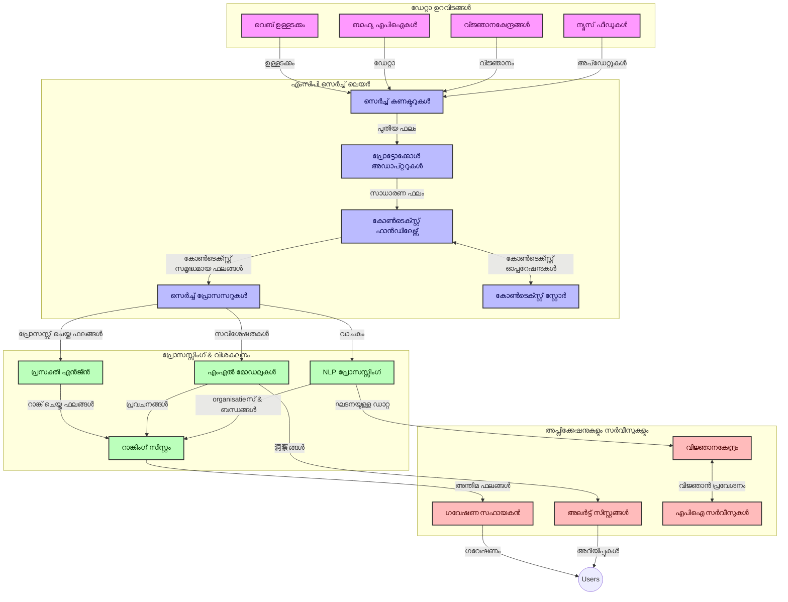
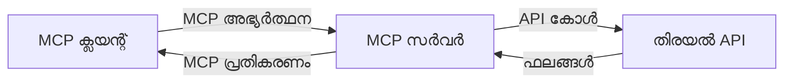
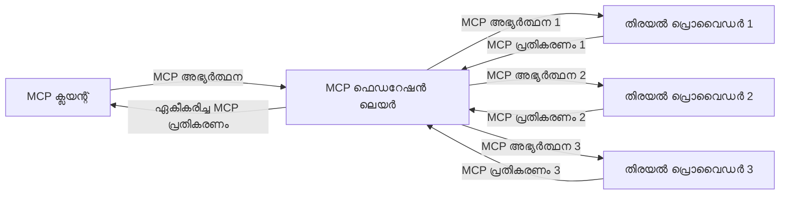
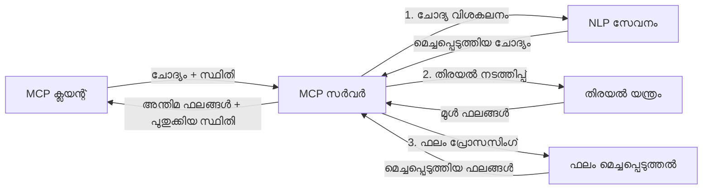

# റിയൽ-ടൈം വെബ് സെർച്ച്‌ക്കായി മോഡൽ കോൺടെക്‌സ്‌റ്റ് പ്രോട്ടോക്കോൾ  

## അവലോകനം  

ഇന്ന് വിവരകേന്ദ്രികകൃതമായ പരിസ്ഥിതിയിൽ റിയൽ-ടൈം വെബ് സെർച്ച് അനിവാര്യമാണ്, ആപ്ലിക്കേഷനുകൾക്ക് ഇന്റർനെറ്റിലെ ഏറ്റവും പുതിയ വിവരങ്ങളിലേക്ക് ഉടൻ ആക്സസ് വേണം, അനുയോജ്യവും സമയോചിതവുമായ പ്രതികരണങ്ങൾ നൽകാൻ. മോഡൽ കോൺടെക്‌സ്‌റ്റ് പ്രോട്ടോക്കോൾ (MCP) ഈ റിയൽ-ടൈം സെർച്ച് പ്രക്രിയകളെ ഏകീകരിക്കാനും, സെർച്ച് കാര്യക്ഷമത മെച്ചപ്പെടുത്താനും, കോൺടെക്‌സ്‌റ്റ് പൂർണ്ണത നിലനിർത്താനും, മുഴുവൻ സിസ്റ്റം പ്രകടനം വർധിപ്പിക്കാനും സഹായിക്കുന്ന ഒരു പ്രധാന പുരോഗതിയാണ്.  

ഈ അഭ്യാസം MCP-യുടെ വഴി എങ്ങനെ റിയൽ-ടൈം വെബ് സെർച്ച് മാറ്റം വരുത്തുന്നു എന്ന് പരിശോധിക്കുന്നു, AI മോഡലുകളും സെർച്ച് എഞ്ചിനുകളും ആപ്ലിക്കേഷനുകളും ഏറെ സുസ്ഥിരമായി കോൺടെക്‌സ്‌റ്റ് മാനേജ്മെന്റിന് ഒരു സ്റ്റാൻഡേർഡൈസ്‌ഡ് സമീപനം നൽകുന്നു.  

### നിങ്ങൾ പഠിക്കുന്നത് എന്ത്  

ഈ സമഗ്രഗൈഡിൽ, നിങ്ങൾ കണ്ടെത്തും:  

- MCP എങ്ങനെ AI മോഡലുകൾക്കും റിയൽ-ടൈം വെബ് സെർച്ച് കഴിവുകൾക്കുമിടയിൽ മൃദുവായ പാലം സൃഷ്ടിക്കുന്നു  
- MCP ഉപയോഗിച്ച് കാര്യക്ഷമവും സ്കെയിലബിളുമായ സെർച്ച് പരിഹാരങ്ങൾ നടപ്പിലാക്കുന്നതിനുള്ള ശില്പശാല രീതി  
- ഒന്നിലധികം ചോദനകളും ഇടപെടലുകളും ഇടയിൽ സെർച്ച് കോൺടെക്‌സ്‌റ്റ് സംരക്ഷിക്കുന്ന സാങ്കേതിക വിദ്യകൾ  
- വിവിധ സെർച്ച് സാഹചര്യങ്ങൾക്ക് പൈഥൺ, ജാവാസ്ക്രിപ്റ്റ് എന്നിവയിൽ പ്രായോഗിക കോഡ് നടപ്പാക്കലുകൾ  
- MCP പ്രവർത്തനക്ഷമ സെർച്ച് സിസ്റ്റങ്ങളിൽ പ്രസക്തി, പുതുതലമാനം, പ്രകടനം തുല്യമാക്കുന്നതിനുള്ള മാർഗങ്ങൾ  

## റിയൽ-ടൈം വെബ് സെർച്ച്‌ക്കുള്ള പരിചയം  

റിയൽ-ടൈം വെബ് സെർച്ച് ഒരു സാങ്കേതിക സമീപനമാണ്, പ്രസിദ്ധീകരിക്കപ്പെട്ടോ അപ്‌ഡേറ്റ് ചെയ്തോ ചെയ്യുന്ന വെബ്-അധിഷ്ഠിത വിവരങ്ങളെ തുടർച്ചയായി അന്വേഷണ, പ്രോസസ്സിംഗ്, വിശകലനം ചെയ്യാൻ ആകുന്നു, സിസ്റ്റങ്ങൾ കുറഞ്ഞ ലേറ്റന്‍സിയോടെ പുതിയതും പ്രസക്തവുമായ വിവരങ്ങൾ നൽകാൻ സഹായിക്കുന്നു. മണിക്കൂറുകളോ ദിവസങ്ങലോ പഴക്കമുള്ള ഇൻഡക്സ് ചെയ്ത ഡേറ്റയിൽ പ്രവർത്തിക്കുന്ന പാരമ്പര്യ സെർച്ച് സിസ്റ്റങ്ങളിൽ നിന്ന് വ്യത്യസ്തമായി, റിയൽ-ടൈം സെർച്ച് വെബ് ലെ രണ്ട്Lives Data പ്രോസസ്സ ചെയ്‌ച്ച്, ഓൺലൈൻ ഉള്ളടക്കത്തിന്റെ നിലവിലെ അവസ്ഥ പ്രതിഫലിപ്പിക്കുന്ന വിവരങ്ങളും洞റുത്തലുകളും നൽകുന്നു.  

### റിയൽ-ടൈം വെബ് സെർച്ചിന്റെ മൂലകങ്ങൾ:  

- **തുടർച്ചയായി ചോദ്യം പ്രോസസ്സിംഗ്**: എല്ലായ്പ്പോഴും പുതുക്കി വരുന്ന ഡാറ്റ സ്രോതസ്സുകളെതിരെ സെർച്ച് ചോദ്യം പ്രോസസ്സ് ചെയ്യുന്നു  
- **പുതുതലമാന മുൻഗണന**: സിസ്റ്റങ്ങൾ പുതിയ വിവരങ്ങൾ മുൻഗണന നൽകാൻ രൂപപ്പെടുത്തിയിരിക്കുന്നു  
- **പ്രസക്തി തുല്യം**: പ്രസക്തിയും പുതുതലമാനവും തമ്മിൽ ഏകോപനം കൈവരിക്കുന്നത്  
- **സ്കെയിലബിള്‍ ശില്പശാല**: മാറ്റവും, ഡാറ്റ വാല്യൂമും കൈകാര്യം ചെയ്യാനുള്ള കഴിവ് സിസ്റ്റങ്ങൾക്കുണ്ട്  
- **കോൺടെക്‌സ്‌റ്റുവൽ മനസ്സിലാക്കൽ**: משמעותമുള്ള ഫലങ്ങൾക്ക് ഉപയോക്തൃ കോൺടെക്‌സ്‌റ്റ് സംരക്ഷിക്കുന്നത് അത്യാവശ്യമാണ്  
- **ഡൈനാമിക് ചോദ്യം പുനഃസംവിധാനം**: കോൺടെക്‌സ്‌റ്റിനും മുൻ ഫലങ്ങൾക്കുമനുസരിച്ച് ചോദ്യം സ്വയം മാറ്റം വരുത്തുന്നു  
- **മൾട്ടി-സോഴ്‌സ് സംയോജനം**: പല സെർച്ച് പ്രൊവൈഡർമാരുടെയും വെബ് സ്രോതസ്സുകളുടെയും ഫലങ്ങൾ സംയോജിപ്പിക്കുന്നു  
- **സെമാന്റിക് മനസ്സിലാക്കൽ**: വെറും കീ-വേഡുകൾക്ക് പകരം അർത്ഥത്തിന് അടിസ്ഥാനമാക്കി ചോദ്യംകളും ഉള്ളടക്കവും പ്രോസസ്സു ചെയ്യുന്നു  
- **റിയൽ-ടൈം റാങ്കിംഗ്**: പുതിയ വിവരങ്ങൾ ലഭിക്കുന്നത് തുടർച്ചയായി ഫലങ്ങളുടെ റാങ്കിങ്ങ് ക്രമീകരിക്കുന്നു  

### മോഡൽ കോൺടെക്‌സ്‌റ്റ് പ്രോട്ടോക്കോൾയും റിയൽ-ടൈം വെബ് സെർച്ചും  

മോഡൽ കോൺടെക്‌സ്‌റ്റ് പ്രോട്ടോക്കോൾ (MCP) റിയൽ-ടൈം വെബ് സെർച്ച് അന്തരീക്ഷങ്ങൾ നേരിടുന്ന ചില പ്രധാന പ്രശ്നങ്ങൾ പരിഹരിക്കുന്നു:  

1. **സെർച്ച് കോൺടെക്‌സ്‌റ്റ് സംരക്ഷണം**: MCP വ്യാപിതമായ സെർച്ച് ഘടകങ്ങളുടെ ഇടയിൽ കോൺടെക്‌സ്‌റ്റ് എങ്ങനെ നിലനിര്‍ത്താമെന്നതിൽ സ്റ്റാൻഡേർഡൈസേഷൻ നടത്തുന്നു, AI മോഡലുകളും പ്രോസസ്സിംഗ് നോട്ടുകളും അനുബന്ധമായ ചോദ്യം ചരിത്രവും ഉപയോക്തൃ ഇഷ്ടങ്ങളും കൈവരുന്നുവെന്ന് ഉറപ്പാക്കുന്നു.  

2. **കാര്യക്ഷമമായ ചോദ്യം മാനേജ്മെന്റ്**: കോൺടെക്‌സ്‌റ്റ് പ്രേക്ഷണംക്കുള്ള ഘടനാപരമായ മെക്കാനിസങ്ങൾ നൽകി MCP ഓരോ സെർച്ച് ഇറ്ററേഷൻഉം കോൺടെക്‌സ്‌റ്റ് ആവർത്തിക്കുന്ന ഭാരം കുറയ്ക്കുന്നു.  

3. **ഇന്റർഓപ്പറബിലിറ്റി**: വ്യത്യസ്ത സെർച്ച് സാങ്കേതിക വിദ്യകളും AI മോഡലുകളും തമ്മിൽ കോൺടെക്‌സ്‌റ്റ് പങ്കിടുന്നതിനുള്ള പൊതു ഭാഷ സൃഷ്ടിച്ച് MCP കൂടുതൽ ലളിതവും വിപുലവുമായ ശില്പശാലകൾക്ക് വഴി തുറക്കുന്നു.  

4. **സെർച്ച്-ഓപ്റ്റിമൈസ്ഡ് കോൺടെക്‌സ്‌റ്റ്**: MCP നടപ്പാക്കലുകൾ കാര്യക്ഷമമായ സെർച്ചിനായി ഏറ്റവും പ്രസക്തമായ കോൺടെക്‌സ്‌റ്റ് ഘടകങ്ങൾ മുൻഗണന നൽകാൻ കഴിയും, പ്രകടനവും കൃത്യതയും മെച്ചപ്പെടുത്തുന്നു.  

5. **അഡാപ്റ്റീവ് സെർച്ച് പ്രോസസ്സിംഗ്**: MCP മുഖാന്തിരം ഉചിതമായ കോൺടെക്‌സ്‌റ്റ് മാനേജ്മെന്റ് കൊണ്ട്, ഉപയോക്തൃ ആവശ്യങ്ങളും വിവരം лാൻഡ്‌സ്‌കേപ്പുകളും വളർച്ചയുടെ അടിസ്ഥാനത്തിൽ പ്രോസസിങ്ങ് ജയിച്ചെടുക്കാം.  

വാർത്ത ശേഖരണത്തിൽ നിന്ന് ഗവേഷണ സഹായി വരെ ആധുനിക ആപ്ലിക്കേഷനുകളിൽ MCP വെബ് സെർച്ച് സാങ്കേതിക വിദ്യകളുമായി സംയോജിപ്പിച്ചാൽ കൂടുതൽ ബുദ്ധിമുട്ടുള്ള,<context-aware> സെർച്ച് നൽകാൻ കഴിയും, ഉപയോക്തൃ ഇടപെടലുകൾ തുടരുന്നതിനൊപ്പം കൂടുതൽ പ്രസക്തമായ ഫലങ്ങൾ ഉൾപ്പെടുത്തുകയും ചെയ്യും.  

## പഠന ലക്ഷ്യങ്ങൾ  

ഈ പാഠത്തിന്റെ അവസാനം, നിങ്ങൾക്ക് സാധിക്കുമെന്നും:  

- ആധുനിക ആപ്ലിക്കേഷനുകളിൽ റിയൽ-ടൈം വെബ് സെർച്ചിന്റെ അടിസ്ഥാനങ്ങളും അതിന്റെ വെല്ലുവിളികളും മനസിലാക്കുക  
- മോഡൽ കോൺടെക്‌സ്‌റ്റ് പ്രോട്ടോക്കോൾ (MCP) റിയൽ-ടൈം വെബ് സെർച്ച് കഴിവുകൾ എങ്ങനെ വളർത്തുന്നുവെന്ന് വിശദീകരിക്കുക  
- പ്രചാരത്തിലുള്ള ഫ്രെയിംവർക്കും API-കൾക്കുമായി MCP ആധാരിത സെർച്ച് പരിഹാരങ്ങൾ നടപ്പിലാക്കുക  
- MCP ഉപയോഗിച്ച് സ്കെയിലബിളും ഉയർന്ന പ്രകടനവും ഉള്ള സെർച്ച് ശില്പശാലകൾ രൂപകൽപ്പന ചെയ്യുകയും വിനിയോഗിക്കയും ചെയ്യുക  
- സെമാന്റിക് സെർച്ച്, ഗവേഷണ സഹായം, AI-പുതുക്കിയ ബ്രൗസിംഗ് ഉൾപ്പെടെ വിവിധ ഉപയോഗകേസുകളിൽ MCP ആശയങ്ങൾ പ്രയോഗിക്കുക  
- MCP ആധാരിത സെർച്ച് സാങ്കേതിക വിദ്യകളിൽ ഉയർന്നുവരുന്ന പ്രവണതകളും ഭാവി പുതുമകളും വിലയിരുത്തുക  
- ഉപയോക്തൃ ഇടപെടലുകളിൽ നിന്ന് പഠിക്കുന്ന context-aware സെർച്ച് സിസ്റ്റങ്ങൾ വികസിപ്പിക്കുക  
- MCP സ്റ്റാൻഡേർഡൈസ്ഡ് പ്രോട്ടോക്കോളുകൾ ഉപയോഗിച്ച് AI സഹായികളിലേക്ക് വെബ് സെർച്ച് കഴിവുകൾ സംയോജിപ്പിക്കുക  
- കോൺടെക്‌സ്‌റ്റിന്റെ അടിസ്ഥാനത്തിൽ ഫലങ്ങൾ ക്രമമായി മെച്ചപ്പെടുത്തുന്ന മൾട്ടി-സ്റ്റേജ് സെർച്ച് പൈപ്പ്‌ലൈൻ സൃഷ്ടിക്കുക  
- മുഴുവൻ കോൺടെക്‌സ്‌റ്റ് ബോധവത്കരണം നിലനിർത്തുമ്പോൾ സെർച്ച് പ്രകടനം മെച്ചപ്പെടുത്തുക  

### നിർവചനം ۽ പ്രാധാന്യം  

റിയൽ-ടൈം വെബ് സെർച്ച് വെബ്-അധിഷ്ഠിത വാർത്ത, വീണ്ടെടുക്കൽ, വേഗത കുറഞ്ഞ ലേറ്റന്‍സിയോടെ എത്തിക്കുന്ന ഒരു തുടർച്ചയായ ചോദ്യം, തിരിച്ചറിയൽ, ഡെലിവറിയും ഉൾക്കൊള്ളുന്നു. പാരമ്പര്യ സെർച്ച് എഞ്ചിനുകൾ പോലെ വെബ് സാങ്കേതികമായി പിരിച്ചെടുക്കുകയും ഇൻഡക്സ് ചെയ്യുകയും പതിവായി ചെയ്യുന്നില്ല; റിയൽ-ടൈം സെർച്ച് ലഭ്യമാകുന്ന വിവരങ്ങളെ ഉടൻ പുറത്ത് കൊണ്ടുവരാൻ ലക്ഷ്യമിടുന്നു, ഏറ്റവും പുതിയ ഉള്ളടക്കത്തിലേക്ക് തൽസമയ ആക്സസ് സാധ്യമാക്കുന്നു.  

റിയൽ-ടൈം വെബ് സെർച്ചിന്റെ പ്രധാന സ്വഭാവഗുണങ്ങൾ:  

- **പുതുതലമാനം**: പുതിയ ഉള്ളടക്കവും അപ്‌ഡേറ്റുകളും മുൻഗണന നൽകുന്നു  
- **തുടർച്ചയായ പ്രോസസ്സിംഗ്**: പുതിയ വിവരങ്ങൾക്കായി തുടർച്ചെ നിരീക്ഷിക്കുന്നു  
- **ചോദ്യം പൊരുത്തപ്പെടുത്തൽ**: കോൺടെക്‌സ്‌റ്റിനും പ്രതികരണത്തിനും അടിസ്ഥാനമായി സെർച്ച് ചോദ്യങ്ങൾ മെച്ചപ്പെടുത്തുന്നു  
- **തൽസമയ ഡെലിവറി**: കുറഞ്ഞ ഇടവേളയിൽ സെർച്ച് ഫലങ്ങൾ നൽകുന്നു  
- **കോൺടെക്‌സ്‌റ്റ് വർധിപ്പിക്കൽ**: മെച്ചപ്പെട്ട പ്രസക്തിക്കായി മുൻ ചോദ്യങ്ങളിൽ നിന്നുമുള്ള സംഗതികൾ സേവിക്കുന്നു  

### പാരമ്പര്യ വെബ് സെർಚ್ സങ്കീര്‍ണ്ണതകൾ  

റിയൽ-ടൈം സാഹചര്യങ്ങളിൽ പാരമ്പര്യ വെബ് സെർച്ച് സമീപനങ്ങൾ പല പരിമിതികളും നേരിടുന്നു:  

1. **കോൺടെക്‌സ്‌റ്റ് തകർച്ച**: ഒന്നിലധികം ചോദനകളിൽ സെർച്ച് കോൺടെക്‌സ്‌റ്റ് നിലനിർത്തുന്നതിൽ ബുദ്ധിമുട്ട്  
2. **വിവര പുതുതലമാനം**: ഏറ്റവും പുതിയ വിവരങ്ങൾക്ക് ആക്സസ്സ് നൽകുന്നതിലും മുൻഗണന നൽകുന്നതിലും പ്രശ്നങ്ങൾ  
3. **സംയോജനം സങ്കീർണ്ണത**: സെർച്ച് സിസ്റ്റങ്ങളും ആപ്ലിക്കേഷനുകളും തമ്മിലുള്ള ഇന്റർഓപ്പറബിലിറ്റിയിൽ പ്രശ്നങ്ങൾ  
4. **ലേറ്റന്‍സി പ്രശ്നങ്ങൾ**: സമ്പൂർണമായ സെർച്ച് പ്രകടനവും പ്രതികരണ സമയ ആവശ്യകതകളും തുല്യപ്പെടുത്തൽ  
5. **പ്രസക്തി ക്രമീകരണം**: പുതുതലമാനത്തെ മുൻഗണന നൽകുമ്പോൾ കൃത്യതയും പ്രസക്തിയുമുറപ്പാക്കൽ  

## സേര്‍ച്ച്‌ക്കായുള്ള മോഡല്‍ കോണ്‍ട്രൈം പ്രോട്ടോക്കോള്‍ (MCP) മനസിലാക്കല്‍  

### സെർച്ച് കോൺടെക്‌സ്‌റ്റുകളിൽ MCP چیست?  

മോഡൽ കോൺടെക്‌സ്‌റ്റ് പ്രോട്ടോക്കോൾ (MCP) AI മോഡലുകളുടെയും ആപ്ലിക്കേഷനുകളുടെയും ഇടയിൽ കാര്യക്ഷമമായ സംവാദം പ്രോത്സാഹിപ്പിക്കാൻ രൂപകല്പന ചെയ്ത ഒരു സ്റ്റാൻഡേർഡൈസ്ഡ് പ്രോട്ടോക്കോളാണ്. റിയൽ-ടൈം വെബ് സെർച്ച്‌ക്കുള്ള കോൺടെക്‌സ്‌റ്റ് നൽകുന്നതിന് MCP ഒരു ഫ്രെയിംവർക്ക് നൽകുന്നു:  

- ചോദ്യങ്ങളുടേയും ഫലങ്ങളുടേയും പരമ്പരയിൽ സെർച്ച് കോൺടെക്‌സ്‌റ്റ് സംരക്ഷിക്കൽ  
- സെർച്ച് ചോദിപ്പും ഫലം ഫോർമാറ്റ്‌കളും സ്റ്റാൻഡേർഡൈസ് ചെയ്യൽ  
- സെർച്ച് പാരാമീറ്ററുകൾക്കും ഫലങ്ങൾക്കും ട്രാൻസ്മിഷൻ മെച്ചപ്പെടുത്തൽ  
- മോഡലിൽ നിന്നുള്ള സെർച്ച് എഞ്ചിനിലേക്ക് മെച്ചപ്പെട്ട കമ്മ്യൂണിക്കേഷൻ  

### മുഖ്യ ഘടകങ്ങളും ആർക്കിടെക്ചറും  

MCP ആർക്കിടെക്ചർ റിയൽ-ടൈം വെബ് സെർച്ചിനായി ഉള്ള മുഖ്യ ഘടകങ്ങൾ ഉൾപ്പെടുന്നു:  

1. **ചോദ്യം കോൺടെക്‌സ്‌റ്റ് ഹാൻഡ്ലറുകൾ**: ഒന്നിലധികം ചോദനകളിൽ സെർച്ച് കോൺടെക്‌സ്‌റ്റ് മാനേജുചെയ്യുന്നു  
2. **സെർച്ച് പ്രോസസറുകൾ**: കോൺടെക്‌സ്‌റ്റ്-ബോധമുള്ള സാങ്കേതിക വിദ്യകൾ ഉപയോഗിച്ച് എത്തുന്ന സെർച്ച് അഭ്യർത്ഥനകൾ പ്രോസസ്സ് ചെയ്യുന്നു  
3. **പ്രോട്ടോക്കോൾ അഡാപ്റ്ററുകൾ**: വ്യത്യസ്‌ത സെർച്ച് API-കളെ MCP-യിൽ മാറ്റി കോൺടെക്‌സ്‌റ്റ് നിലനിർത്തുന്നു  
4. **കോൺടെക്‌സ്‌റ്റ് സ്റ്റോർ**: സെർച്ച് ചരിത്രവും ഇഷ്ടങ്ങളും കാര്യക്ഷമമായി സംഭരിച്ചു വീണ്ടെടുക്കുന്നു  
5. **സെർച്ച് കണക്ടറുകൾ**: വ്യത്യസ്‌ത സെർച്ച് എഞ്ചിനുകളുമായി വെബ് API-കൾക്കൊപ്പം കണക്ട് ചെയ്യുന്നു  


  
### MCP എങ്ങനെ റിയൽ-ടൈം വെബ് സെർച്ച് മെച്ചപ്പെടുത്തുന്നു  

MCP പാരമ്പര്യ വെബ് സെർച്ച് വെല്ലുവിളികൾ ഇങ്ങനെ പരിഹരിക്കുന്നു:  

- **കോൺടെക്‌സ്‌റ്റുവൽ തുടർച്ച**: സെർച്ച് സെഷൻ മുഴുവനായും ചോദനകളിലൂടെയും ബന്ധങ്ങൾ നിലനിർത്തുന്നു  
- **ഒപ്റ്റിമൈസ്ഡ് ട്രാൻസ്മിഷൻ**: ബുദ്ധിമത്തോടെയുള്ള കോൺടെക്‌സ്‌റ്റ് മാനേജ്മെന്റിലൂടെ സെർച്ച് പാരാമീറ്ററുകളിൽ ആവർത്തന കുറയ്ക്കുന്നു  
- **സ്റ്റാൻഡേർഡൈസ്ഡ് ഇന്റർഫേസുകൾ**: സെർച്ച് ഘടകങ്ങൾക്ക് ഒത്തുചേരുന്ന APIകൾ നൽകുന്നു  
- **കുറഞ്ഞ ലേറ്റൻസി**: കാര്യക്ഷമമായ കോൺടെക്‌സ്‌റ്റ് കൈകാര്യം ചെയ്യലിലൂടെ പ്രോസസ്സിംഗ് ഭാരം കുറയുന്നു  
- **മികച്ച പ്രസക്തി**: പല ചോദനകളിലൂടെയും ഉപയോക്തൃ ഉദ്ദേശ്യം സംരക്ഷിച്ച് സെർച്ച് പ്രസക്തി വർധിപ്പിക്കുന്നു  

## സംയോജനം மற்றும் നടപ്പാക്കൽ  

റിയൽ-ടൈം വെബ് സെർച്ച് സിസ്റ്റങ്ങൾ പ്രകടനവും കോൺടെക്‌സ്‌റ്റ് പൂർണ്ണതയും നിലനിർത്താൻ സൂക്ഷ്മമായ അക്കാർക്റ്റെക്ചർ ഡിസൈൻ, നടപ്പാക്കൽ ആവശ്യമാണ്. മോഡൽ കോൺടെക്‌സ്‌റ്റ് പ്രോട്ടോക്കോൾ AI മോഡലുകളും സെർച്ച് സാങ്കേതിക വിദ്യകളും സംയോജിപ്പിക്കാൻ സ്റ്റാൻഡേർഡൈസ്‌ഡ് സമീപനം വാഗ്ദാനം ചെയ്യുന്നു, കൂടുതൽ സങ്കീർണ്ണവും context-aware സെർച്ച് പൈപ്പ്‌ലൈൻസിന് വഴിവക്കുന്നു.  

### സെർച്ച് ആർക്കിടെക്ചറുകളിൽ MCP സംയോജനം അവലോകനം  

റിയൽ-ടൈം വെബ് സെർച്ച് അന്തരീക്ഷങ്ങളിൽ MCP നടപ്പാക്കുമ്പോൾ ചില പ്രധാന പരിഗണനകൾ ഉണ്ടാകുന്നു:  

1. **സെർച്ച് കോൺടെക്‌സ്‌റ്റ് സീരിയലൈസേഷൻ**: MCP സെർച്ച് അഭ്യർത്ഥനകളിൽ കോൺടെക്‌സ്‌റ്റിന്റെ എൻകോഡിങ്ങിനായ് കാര്യക്ഷമമായ പ്രവർത്തനങ്ങൾ നൽകുന്നു, അതിലൂടെ പ്രോസസ്സിംഗ് പൈപ്പ്‌ലൈനിൽ ചോദ്യം മുഴുവനായി അനുസരിച്ച് ആവശ്യമായ കോൺടെക്‌സ്‌റ്റ് ഉണ്ടാകുന്നു. ഇതിൽ സെർച്ച്-ബന്ധപ്പെട്ട മെടാഡേറ്റയ്ക്ക് ഏറ്റവും അനുയോജ്യമായ സ്റ്റാൻഡേർഡൈസ്‌ഡ് സീരിയലൈസേഷൻ ഫോർമാറ്റുകളും ഉൾപ്പെടുന്നു.  

2. **സ്റ്റേറ്റ്‌ഫുൾ സെർച്ച് പ്രോസസ്സിംഗ്**: MCP മൾട്ടി-സ്റ്റേജ് സെർച്ച് പൈപ്പ്‌ലൈൻകളിൽ കോൺടെക്‌സ്‌റ്റ് പ്രതിനിധാനം തുടർച്ചയായി നിലനിർത്തുന്നതിലൂടെ കൂടുതൽ ബുദ്ധിമുട്ടുള്ള സ്റ്റേറ്റ്‌ഫുൾ പ്രോസസ്സിംഗ് സൾവാക്കുന്നു. കോൺടെക്‌സ്‌റ്റ് മെച്ചപ്പെടുത്തൽ ഫലങ്ങൾ മെച്ചപ്പെടുത്തുന്നതിന് മൂല്യവത്താണ്.  

3. **ചോദ്യം വിപുലീകരണവും മെച്ചപ്പെടുത്തലും**: MCP നടപ്പാക്കലുകൾ പൊതുവായി സംഭരിച്ച കോൺടെക്‌സ്‌റ്റിനെ അടിസ്ഥാനമാക്കിയുളള ബുദ്ധിമുട്ടുള്ള ചോദ്യം വിപുലീകരണവും മെച്ചപ്പെടുത്തലും സഹായിക്കുന്നു, സെർച്ച് സെഷൻ പുരോഗമിക്കുന്നതോടൊപ്പം കൂടുതൽ പ്രസക്തമായ ഫലങ്ങൾ നൽകുന്നു.  

4. **ഫലം ക്യാശിംഗ് മറ്റും മുൻഗണനയും**: കോൺടെക്‌സ്‌റ്റ് കൈകാര്യം സ്റ്റാൻഡേർഡൈസ് ചെയ്ത് MCP ഫലം ക്യാശിംഗും മുൻഗണനയും കാര്യക്ഷമമായി നിയന്ത്രിക്കാൻ സഹായിക്കുന്നു, ഘടകങ്ങൾക്ക് വികസിത സെർച്ച് കോൺടെക്‌സ്‌റ്റിനനുസരിച്ച് ക്രമീകരണങ്ങൾ സാധ്യമാകുന്നു.  

5. **സെർച്ച് ഫെഡറേഷൻക്കും കൂട്ടത്തിനും**: MCP ഘടനാപരമായ സെർച്ച് കോൺടെക്‌സ്‌റ്റ് പ്രതിനിധാനങ്ങൾ നൽകിയാൽ ബാക്ക്‌എൻഡുകൾ തമ്മിലുള്ള സമർത്ഥമായ ഫെഡറേഷൻ സാധ്യമാകുന്നു, വ്യത്യസ്‌ത സ്രോതസ്സുകളിൽ നിന്നുള്ള ഫലങ്ങളുടെ ഗൗരവത്തോടെ കൂട്ടിച്ചേർക്കൽ.  

വൈവിധ്യമാർന്ന സെർച്ച് സാങ്കേതിക വിദ്യകളിൽ MCP നടപ്പാക്കൽ ഒരു ഏകോപിത കോൺടെക്‌സ്‌റ്റ് മാനേജ്മെന്റ് സമീപനം സൃഷ്ടിക്കുന്നു, പ്രത്യേക ഇന്റഗ്രേഷൻ കോഡിന്റെ ആവശ്യം കുറയ്ക്കുന്നു, അതേസമയം സെർച്ച് ചോദനകളുടെ വ്യാപനത്തിനനുസരിച്ച് പ്രസക്തമായ കോൺടെക്‌സ്‌റ്റ് നിലനിർത്താനുള്ള കഴിവും വർദ്ധിപ്പിക്കുന്നു.  

### വിവിധ വെബ് സെർച്ച് നടപ്പാക്കലുകളിൽ MCP  

ഈ ഉദാഹരണങ്ങൾ നിലവിലെ MCP പ്രത്യേകത അനുസരിച്ചാണ്, JSON-RPC അടിസ്ഥാനമായ പ്രോട്ടോക്കോളും വ്യത്യസ്ത ട്രാൻസ്പോർട്ട് മെക്കാനിസങ്ങളും ഉപയോഗിക്കുന്നു. കോഡ് MCP പ്രോട്ടോക്കോളിൻ്റെ പൂർണ്ണ സാന്ദ്രത നിലനിർത്തി സ്വകാര്യ സെർച്ച് ഇന്റഗ്രേഷനുകൾ എങ്ങനെ നടപ്പിലാക്കാമെന്ന് കാണിക്കുന്നു.  


<details>  
<summary>ജനറിക് സെർച്ച് API ഉപയോഗിച്ചുള്ള പൈഥൺ നടപ്പാക്കൽ</summary>  

```python
import asyncio
import json
import aiohttp
from typing import Dict, Any, Optional, List
from contextlib import asynccontextmanager
from collections.abc import AsyncIterator

# സ്റ്റാൻഡേർഡ് MCP ലൈബ്രറികൾ ഇറക്കുമതി ചെയ്യുക
from mcp.client.session import ClientSession
from mcp.client.streamable_http import streamablehttp_client
from mcp.types import TextContent, CreateMessageRequestParams, CreateMessageResult
from mcp.server.fastmcp import FastMCP

# വെബ് തിരച്ചിലിനായി FastMCP സർവർ സൃഷ്‌ടിക്കുക
search_server = FastMCP("WebSearch")

# വെബ് തിരച്ചിൽ പ്രവർത്തനങ്ങൾ കൈകാര്യം ചെയ്യുന്ന ക്ലാസ്
class WebSearchHandler:
    def __init__(self, api_endpoint: str, api_key: str):
        self.api_endpoint = api_endpoint
        self.api_key = api_key
        self.session = None
        
    async def initialize(self):
        """Initialize the HTTP session"""
        self.session = aiohttp.ClientSession(
            headers={"Authorization": f"Bearer {self.api_key}"}
        )
    
    async def close(self):
        """Close the HTTP session"""
        if self.session:
            await self.session.close()
            
    async def perform_search(self, query: str, max_results: int = 5, 
                           include_domains: List[str] = None, 
                           exclude_domains: List[str] = None,
                           time_period: str = "any") -> Dict[str, Any]:
        """Perform web search using the search API"""
        # തിരച്ചിൽ പരാമിതികൾ നിർമ്മിക്കുക
        search_params = {
            "q": query,
            "limit": max_results,
            "time": time_period
        }
        
        if include_domains:
            search_params["site"] = ",".join(include_domains)
            
        if exclude_domains:
            search_params["exclude_site"] = ",".join(exclude_domains)
        
        # തിരച്ചിൽ അഭ്യർത്ഥന നിർവഹിക്കുക
        try:
            async with self.session.get(
                self.api_endpoint,
                params=search_params
            ) as response:
                if response.status != 200:
                    error_text = await response.text()
                    raise Exception(f"Search API error: {response.status} - {error_text}")
                
                search_data = await response.json()
                
                # API-നിർദ്ദിഷ്ട പ്രതികരണം സ്റ്റാൻഡേർഡ് ഫോർമാറ്റിലേയ്ക്ക് മാറ്റുക
                results = []
                for item in search_data.get("results", []):
                    results.append({
                        "title": item.get("title", ""),
                        "url": item.get("url", ""),
                        "snippet": item.get("snippet", ""),
                        "date": item.get("published_date", ""),
                        "source": item.get("source", "")
                    })
                
                return {
                    "query": query,
                    "totalResults": len(results),
                    "results": results
                }
        except Exception as e:
            print(f"Search API request error: {e}")
            raise

# തിരച്ചിൽ ഹാൻഡ്ലർ ആരംഭിക്കുക
search_handler = WebSearchHandler(
    api_endpoint="https://api.search-service.example/search",
    api_key="your-api-key-here"
)

# തിരച്ചിൽ ഹാൻഡ്ലർ നിയന്ത്രിക്കാനുള്ള ആയുസ്സ് ക്രമീകരിക്കുക
@asyncio.asynccontextmanager
async def app_lifespan(server: FastMCP):
    """Manage application lifecycle"""
    await search_handler.initialize()
    try:
        yield {"search_handler": search_handler}
    finally:
        await search_handler.close()

# സർവറിനുള്ള ആയുസ്സ് സജ്ജമാക്കുക
search_server = FastMCP("WebSearch", lifespan=app_lifespan)

# വെബ് തിരച്ചിൽ ടൂൾ രേഖപ്പെടുത്തുക
@search_server.tool()
async def web_search(query: str, max_results: int = 5, 
                   include_domains: List[str] = None,
                   exclude_domains: List[str] = None,
                   time_period: str = "any") -> Dict[str, Any]:
    """
    Search the web for information
    
    Args:
        query: The search query
        max_results: Maximum number of results to return (default: 5)
        include_domains: List of domains to include in search results
        exclude_domains: List of domains to exclude from search results
        time_period: Time period for results ("day", "week", "month", "any")
        
    Returns:
        Dictionary containing search results
    """
    ctx = search_server.get_context()
    search_handler = ctx.request_context.lifespan_context["search_handler"]
    
    results = await search_handler.perform_search(
        query=query,
        max_results=max_results,
        include_domains=include_domains,
        exclude_domains=exclude_domains,
        time_period=time_period
    )
    
    return results

# ഉദാഹരണ ക്ലയന്റ് ഉപയോഗം
async def client_example():
    # Streamable HTTP ട്രാൻസ്പോർട്ട് ഉപയോഗിച്ച് തിരച്ചിൽ സർവറുമായി കണക്‌ടുചെയ്യുക
    async with streamablehttp_client("http://localhost:8000/mcp") as (read, write, _):
        async with ClientSession(read, write) as session:
            # കണക്ഷൻ ആരംഭിക്കുക
            await session.initialize()
            
            # web_search ടൂൾ വിളിക്കുക
            search_results = await session.call_tool(
                "web_search", 
                {
                    "query": "latest developments in AI and Model Context Protocol",
                    "max_results": 5,
                    "time_period": "day",
                    "include_domains": ["github.com", "microsoft.com"]
                }
            )
            
            print(f"Search results: {search_results}")

# സർവർ പ്രവർത്തനത്തിന്റെ ഉദാഹരണം
if __name__ == "__main__":
    # Streamable HTTP ട്രാൻസ്പോർട്ട് ഉപയോഗിച്ച് സർവർ പ്രവർത്തിപ്പിക്കുക
    search_server.run(transport="streamable-http")
```
</details>  

<details>  
<summary>ബ്രൗസർ അടിസ്ഥാനമായ സെർച്ച് ഉപയോഗിച്ച് ജാവാസ്ക്രിപ്റ്റ് നടപ്പാക്കൽ</summary>  


```javascript
// വെബ് സെർച്ച്‌ಗಾಗಿ MCP സെർവർ നിർമ്മാണം
import { McpServer, ResourceTemplate } from '@modelcontextprotocol/sdk/server/mcp.js';
import { StreamableHTTPServerTransport } from '@modelcontextprotocol/sdk/server/streamableHttp.js';
import { z } from 'zod';

// വെബ് സെർച്ച്‌ക്കായി MCP സെർവർ സൃഷ്ടിക്കൂ
const searchServer = new McpServer({
    name: "BrowserSearch",
    description: "A server that provides web search capabilities"
});

// സെർച്ച് സർവീസ് ക്ലാസ്
class SearchService {
    constructor(searchApiUrl, apiKey) {
        this.searchApiUrl = searchApiUrl;
        this.apiKey = apiKey;
    }

    async performSearch(parameters) {
        const {
            query = '',
            maxResults = 5,
            includeDomains = [],
            excludeDomains = [],
            timePeriod = 'any'
        } = parameters;
        
        // പാരാമീറ്ററുകളോടെ സെർച്ച് URL നിർമ്മിക്കുക
        const url = new URL(this.searchApiUrl);
        url.searchParams.append('q', query);
        url.searchParams.append('limit', maxResults);
        url.searchParams.append('time', timePeriod);
        
        if (includeDomains.length > 0) {
            url.searchParams.append('site', includeDomains.join(','));
        }
        
        if (excludeDomains.length > 0) {
            url.searchParams.append('exclude_site', excludeDomains.join(','));
        }
        
        try {
            const response = await fetch(url.toString(), {
                method: 'GET',
                headers: {
                    'Authorization': `Bearer ${this.apiKey}`,
                    'Content-Type': 'application/json'
                }
            });
            
            if (!response.ok) {
                const errorText = await response.text();
                throw new Error(`Search API error: ${response.status} - ${errorText}`);
            }
            
            const searchData = await response.json();
            
            // API-നിഷ്ഠമായ პასუხം സ്റ്റാൻഡേർഡ് ഫോർമാറ്റിലേക്ക് മാറ്റുക
            const results = searchData.results?.map(item => ({
                title: item.title || '',
                url: item.url || '',
                snippet: item.snippet || '',
                date: item.published_date || '',
                source: item.source || ''
            })) || [];
            
            return {
                query,
                totalResults: results.length,
                results
            };
        } catch (error) {
            console.error('Search API request error:', error);
            throw error;
        }
    }
}

// സെർച്ച് സർവീസ് ആരംഭിക്കുക
const searchService = new SearchService(
    'https://api.search-service.example/search',
    'your-api-key-here'
);

// സെർവറിനായി കോൺടെക്‌സ്‌റ്റ് പ്രൊവൈഡർ സജ്ജമാക്കുക
searchServer.setContextProvider(() => {
    return {
        searchService
    };
});

// വെബ് സെർച്ച് ടൂൾ രജിസ്റ്റർ ചെയ്യുക
searchServer.tool({
    name: 'web_search',
    description: 'Search the web for information',
    parameters: {
        type: 'object',
        properties: {
            query: {
                type: 'string',
                description: 'The search query'
            },
            maxResults: {
                type: 'integer',
                description: 'Maximum number of results to return',
                default: 5
            },
            includeDomains: {
                type: 'array',
                items: { type: 'string' },
                description: 'List of domains to include in search results'
            },
            excludeDomains: {
                type: 'array',
                items: { type: 'string' },
                description: 'List of domains to exclude from search results'
            },
            timePeriod: {
                type: 'string',
                description: 'Time period for results',
                enum: ['day', 'week', 'month', 'any'],
                default: 'any'
            }
        },
        required: ['query']
    },
    handler: async (params, context) => {
        const { searchService } = context;
        return await searchService.performSearch(params);
    }
});

// സെർച്ച് സെർവറുമായി ബന്ധപ്പെടുന്ന ഉദാഹരണ ക്ലയന്റ് കോഡ്
import { Client } from '@modelcontextprotocol/sdk/client/index.js';
import { StreamableHTTPClientTransport } from '@modelcontextprotocol/sdk/client/streamableHttp.js';

async function connectToSearchServer() {
    // സെർച്ച് സെർവറുമായി ബന്ധപ്പെടുക
    const transport = new StreamableHTTPClientTransport(
        new URL('http://localhost:8000/mcp')
    );
    
    const client = new Client({
        name: 'search-client',
        version: '1.0.0'
    });
    
    await client.connect(transport);
    
    // സെർച്ച് ടൂൾ പ്രവർത്തിപ്പിക്കുക
    const searchResults = await client.callTool({
        name: 'web_search',
        arguments: {
            query: 'Model Context Protocol implementation examples',
            maxResults: 10,
            timePeriod: 'week',
            includeDomains: ['github.com', 'docs.microsoft.com']
        }
    });
    
    console.log('Search results:', searchResults);
    
    // ക്ലീൻഅപ്പ്
    await client.disconnect();
}

// സെർവർ ആരംഭിക്കുക
const transport = new StreamableHTTPServerTransport();
await searchServer.connect(transport);
console.log('Search server running at http://localhost:8000/mcp');

// വേർതിരിച്ച പ്രക്രിയയിൽ അല്ലെങ്കിൽ സെർവർ ആരംഭിച്ചതിന് ശേഷം
// connectToSearchServer().catch(console.error);
```
</details>  


## കോഡ് ഉദാഹരണങ്ങളുടെ വെളിപ്പെടുത്തൽ  

> **പ്രധാന കുറിപ്പ്**: താഴെ കാണുന്ന കോഡ് ഉദാഹരണങ്ങൾ മോഡൽ കോൺടെക്‌സ്‌റ്റ് പ്രോട്ടോക്കോൾ (MCP) വെബ് സെർച്ച് പ്രവർത്തനം സമന്വയിപ്പിക്കുന്നത് പ്രകടിപ്പിക്കുന്നു. അവ ഔദ്യോഗിക MCP SDK-കളുടെ മാതൃകകൾ പിന്തുടരുന്നുവെങ്കിലും വിദ്യാഭ്യാസ ആവശ്യങ്ങൾക്കായി ലളിതമാക്കിയിട്ടുണ്ട്.  
>  
> ഈ ഉദാഹരണങ്ങൾ:  
>  
> 1. **പൈഥൺ നടപ്പാക്കൽ**: FastMCP സെർവർ നടപ്പാക്കൽ, വെബ് സെർച്ച് ടൂളും പുറത്തുള്ള സെർച്ച് API-യുമായി കണക്ടുചെയ്യും. ഈ ഉദാഹരണം അനുയോജ്യമായ ലൈഫ്‌സ്‌പാൻ മാനേജുമെന്റ്, കോൺടെക്‌സ്‌റ്റ് കൈകാര്യം ചെയ്യൽ, [ ഔദ്യോഗിക MCP പൈഥൺ SDK](https://github.com/modelcontextprotocol/python-sdk) മാതൃകകൾ അനുസരിച്ച് ടൂൾ നടപ്പാക്കൽ എന്നിവ കാണിക്കുന്നു. സെർവർ recommande ചെയ്ത Streamable HTTP ട്രാൻസ്പോർട്ട് ഉപയോഗിക്കുന്നു, പഴയ SSE ട്രാൻസ്പോർട്ട് മാറ്റിയതാണ്.  
>  
> 2. **ജാവാസ്ക്രിപ്റ്റ് നടപ്പാക്കൽ**: MCP TypeScript SDK-യിൽ നിന്നുള്ള FastMCP പാറ്റേൺ ഉപയോഗിച്ച്, ടൂൾ നിർവചനങ്ങളും ക്ലയന്റ് കണക്ഷനുകളും ശരിയായി ഉള്ള സെർച്ച് സെർവർ സൃഷ്ടിക്കുന്ന TypeScript / ജാവാസ്ക്രിപ്റ്റ് നടപ്പിൽ. സെഷൻ മാനേജ്മെന്റ്, കോൺടെക്‌സ്‌റ്റ് സംരക്ഷണം എന്നിവയുടെയും ഏറ്റവും പുതിയ പാറ്റേണുകൾ പിന്തുടരുന്നു.  
>  
> ഈ ഉദാഹരണങ്ങൾക്ക് പ്രൊഡക്ഷൻ ഉപയോഗത്തിനായി അധിക പിശക് കൈകാര്യം ചെയ്യലുകളും അംഗീകാരം, പ്രത്യേക API ഇന്റഗ്രേഷൻ കോഡും ആവശ്യമാണ്. കൊടുത്തിരിക്കുന്ന സെർച്ച് API എൻഡ്‌പോയിന്റുകൾ (`https://api.search-service.example/search`) പ്ലേസ്‌ഹോൾഡറുകൾ മാത്രമാണ്, യാഥാർത്ഥ്യ സെർച്ച് സർവീസ് എൻഡ്‌പോയിന്റുകളാൽ പകരേണ്ടതാണ്.  
>  
> പൂർണ്ണ നടപ്പാക്കലും ഏറ്റവും ആധുനിക സമീപനങ്ങളും അറിയാനായി,  
> [ ഔദ്യോഗിക MCP സ്പെസിഫിക്കേഷൻ](https://modelcontextprotocol.io/specification/2026-07-28/)  
> ഒപ്പം SDK ഡോക്യുമെന്റേഷൻ കാണുക.  

## മുഖ്യ ആശയങ്ങൾ  

### മോഡൽ കോൺടെക്‌സ്‌റ്റ് പ്രോട്ടോക്കോൾ (MCP) ഫ്രെയിംവർക്ക്  

അടിസ്ഥാനത്തിൽ, മോഡൽ കോൺടെക്‌സ്‌റ്റ് പ്രോട്ടോക്കോൾ AI മോഡലുകളും ആപ്ലിക്കേഷനുകളും സേവനങ്ങളും കോൺടെക്‌സ്‌റ്റ് കൈമാറാൻ സ്റ്റാൻഡേർഡൈസ് ചെയ്ത മാർഗം നൽകുന്നു. റിയൽ-ടൈം വെബ് സെർച്ചിൽ, ഇത് മൾട്ടി-ടേൺ സെർച്ച് അനുഭവങ്ങൾ സൃഷ്ടിക്കാൻ അവശ്യമാണ്. പ്രധാന ഘടകങ്ങൾ ഉൾപ്പെടുന്നു:  

1. **ക്ലയന്റ്-സെർവർ ആർക്കിടെക്ചർ**: MCP സെർച്ച് ക്ലയന്റുകൾ (അഭ്യർത്ഥകർ) സെർച്ച് സെർവറുകൾ (പ്രൊവൈഡർമാർ) എന്നിവ തമ്മിൽ വ്യക്തമായ വേർതിരിവ് സ്ഥാപിക്കുന്നു, ഫോൾക്ശ് മോഡലുകൾക്ക് അനുകൂലമാണ്.  

2. **JSON-RPC കമ്മ്യൂണിക്കേഷൻ**: പ്രോട്ടോക്കോൾ മെസേജുകൾ കൈമാറാൻ JSON-RPC ഉപയോഗിക്കുകയും, വെബ് സാങ്കേതിക വിദ്യകൾക്കും വിവിധ പ്ലാറ്റ്ഫോമുകൾക്കും എളിമയായ നടപ്പിലാക്കലിനും അനുയോജ്യവുമാണ്.  

3. **കോൺടെക്‌സ്‌റ്റ് മാനേജ്മെന്റ്**: MCP നിരവധി ഇടപെടലുകളിൽ സെർച്ച് കോൺടെക്‌സ്‌റ്റ് നിലനിർത്താനും പുതുക്കാനും പ്രയോജനപ്പെടുത്താനും ഘടനാപരമായ മാർഗങ്ങൾ നിർവചിക്കുന്നു.  

4. **ടൂൾ നിർവചനങ്ങൾ**: സെർച്ച് കഴിവുകൾ നന്നായി നിർവചിച്ച പാരാമീറ്ററുകളും തിരിച്ചറിവും ഉള്ള സ്റ്റാൻഡേർഡൈസ്ഡ് ടൂളുകളായി പുറത്തെടുക്കുന്നു.  

5. **സ്റ്റ്രീമിംഗ് പിന്തുണ**: റിയൽ-ടൈം സെർച്ചിൽ ഫലങ്ങൾ കേന്ദ്രിച്ചുവരുമ്പോൾ പ്രസാവകം തുടർച്ചയായി ഒഴുകി എത്തുന്നതിനുള്ള പിന്തുണ പ്രോട്ടോക്കോൾ നൽകുന്നു.  

### വെബ് സെർച്ച് സംയോജനം പാറ്റേണുകൾ  

MCP വെബ് സെർച്ചുമായി സംയോജിപ്പിക്കുമ്പോൾ നിരവധി പാറ്റേണുകൾ കാണപ്പെടുന്നു:  

#### 1. നേരിട്ട് സെർച്ച് പ്രൊവൈഡർ സംയോജനം  


  
ഈ പാറ്റേണിൽ MCP സെർവർ ഒരോ സെർച്ച് API-മാർക്കും നേരിട്ട് ഇന്റർഫേസ് ചെയ്യുന്നു, MCP അഭ്യർത്ഥന API-വശമായി മാറ്റുകയും ഫലങ്ങൾ MCP പ്രതികരണങ്ങളായി ഫോർമാറ്റ് ചെയ്യുകയും ചെയ്യുന്നു.  

#### 2. കോൺടെക്‌സ്‌റ്റ് സംരക്ഷണത്തോടെ ഫെഡറേറ്റഡ് സെർച്ച്  


  
ഈ പാറ്റേണിൽ MCP-ഐ അനുകൂലിക്കുന്ന ഒന്നിലധികം സെർച്ച് പ്രൊവൈഡർമാരിലേക്കുള്ള സെർച്ച് ചോദനാപകർത്തിയാകുന്നു, ഓരോ പ്രൊവൈഡറുകളും വ്യത്യസ്ത തരം ഉള്ളടക്കങ്ങളിലോ സെർച്ച് കഴിവുകളിലോ മികവുറ്റവരും ആയിരിക്കാം, ഏകീകൃത കോൺടെക്‌സ്‌ട് നിലനിർത്തുകയും ചെയ്യുന്നു.  

#### 3. കോൺടെക്‌സ്‌റ് മെച്ചപ്പെടുത്തിയ സെർച്ച് ചൈന  


  
ഈ പാറ്റേണിൽ സെർച്ച് പ്രക്രിയ വിവിധ ഘട്ടങ്ങളിൽ വേർതിരിച്ചു, ഓരോ ഘട്ടത്തിലും കോൺടെക്‌സ്‌റ്റ് സമ്പുഷ്ടമാക്കി, ക്രമമായി കൂടുതൽ പ്രസക്തമായ ഫലങ്ങൾ നൽകുന്നു.  

### സെർച്ച് കോൺടെക്‌സ്‌റ്റ് ഘടകങ്ങൾ  

MCP-അധിഷ്ഠിത വെബ് സെർച്ചിൽ കോൺടെക്‌സ്‌റ്റിൽ സാധാരണയായി ഉൾപ്പെടുന്നത്:  

- **ചോദ്യം ചരിത്രം**: സെഷനിലുള്ള മുൻ സെർച്ച് ചോദ്യങ്ങൾ  
- **ഉപയോക്തൃ ഇഷ്ടങ്ങൾ**: ഭാഷ, പ്രദേശം, സുരക്ഷിത സെർച്ച് ക്രമീകരണങ്ങൾ  
- **ഇടപെടൽ ചരിത്രം**: ക്ലിക്ക് ചെയ്‌ത ഫലങ്ങൾ, ഫലങ്ങളിൽ ചെലവഴിച്ച സമയം  
- **സെർച്ച് പാരാമീറ്ററുകൾ**: ഫിൽട്ടറുകൾ, ക്രമീകരണങ്ങൾ, മറ്റ് സെർച്ച് മോണിഫയേഴ്‌സ്  
- **ഡൊമൈൻ ജ്ഞാനം**: സെർച്ചുമായി ബന്ധപ്പെട്ട വിഷയ-നിർദ്ദേശ കോൺടെക്‌സ്‌റ്റ്  
- **കാലബന്ധിത കോൺടെക്‌സ്‌റ്റ്**: സമയത്തെ ആശ്രയിച്ച പ്രസക്തി ഘടകങ്ങൾ  
- **സ്രോതസ്സ് ഇഷ്ടങ്ങൾ**: വിശ്വസനീയമോ ഇഷ്ടപ്പെട്ടവയോ ആയ വിവര സ്രോതസ്സുകൾ  

## ഉപയോഗ കേസുകളും ആപ്ലിക്കേഷനുകളും  

### ഗവേഷണവും വിവര ശേഖരണവും  

MCP ഗവേഷണ പ്രവണതകൾ മെച്ചപ്പെടുത്തുന്നു:  

- ഗവേഷണ സെഷനുകളിൽ കോൺടെക്‌സ്‌റ്റ് സംരക്ഷണം  
- കൂടുതൽ സങ്കീർണ്ണവും കോൺടെക്‌സ്‌റ്റുമായി അനുയോജ്യവുമായ ചോദനകൾ സാധ്യമാക്കൽ  
- മൾട്ടി-സോഴ്‌സ് സെർച്ച് ഫെഡറേഷൻ പിന്തുണയ്ക്കൽ  
- സെർച്ച് ഫലങ്ങളിൽ നിന്നും അറിവ് മുറിഞ്ഞെടുക്കൽ പ്രോത്സാഹിപ്പിക്കൽ  

### റിയൽ-ടൈം വാർത്തയും ട്രെൻഡ് നിരീക്ഷണവും  

MCP അധിഷ്ഠിത സെർച്ച് വാർത്ത നിരീക്ഷണത്തിനുള്ള ഗുണങ്ങൾ:  

- വളരുന്ന സംഭവ വാർത്തകളുടെ സമീപ ലാബില കണക്കാക്കൽ  
- പ്രസക്തമായ വിവരങ്ങളുടെ കോൺടെക്‌സ്‌റ്റ് അടിസ്ഥാന ഫിൽട്ടറിംഗ്  
- പല സ്രോതസ്സുകളിലൂടെയുള്ള വിഷയം, എന്റിറ്റി ട്രാക്കിംഗ്  
- ഉപയോക്തൃ കോൺടെക്‌സ്‌റ്റിന് അനുസരിച്ചുള്ള വ്യക്തിഗത വാർത്താലർട്ടുകൾ  

### AI-പുതുക്കിയ ബ്രൗസിങ് ആൻഡ് ഗവേഷണം  

MCP AI-പുതുക്കിയ ബ്രൗസിങ്ങിന് പുതിയ സാധ്യതകൾ സൃഷ്ടിക്കുന്നു:  

- നിലവിലെ ബ്രൗസർ പ്രവർത്തനത്തിന്റെ അടിസ്ഥാനത്തിൽ കോൺടെക്‌സ്‌റ്റ് ആധാരിത സെർച്ച് നിർദ്ദേശനങ്ങൾ  
- LLM-പവരുടെ സഹായികളുമായി വെബ് സെർച്ച് എളുപ്പത്തിൽ സംയോജിപ്പിക്കൽ  
- ഇൻറെസ്റ്റിങ്ങുള്ള കോൺടെക്‌സ്‌റ്റ് നിലനിർത്തുന്ന മൾട്ടി-ടേൺ സെർച്ച് മെച്ചപ്പെടുത്തൽ  
- വാസ്തവം പരിശോധിക്കൽ, വിവര സർവേക്ഷണ മെച്ചപ്പെടുത്തൽ  

## ഭാവി പ്രവണതകളും പുതുമകളും  

### വെബ് സെർച്ചിൽ MCPയുടെ വളർച്ച  

മുമ്പോട്ടു നോക്കി, MCP നാം പരിഹരിക്കേണ്ടതായി പ്രതീക്ഷിക്കുന്ന കാര്യങ്ങൾ:  


- **മൾട്ടിമോഡൽ സെർച്ച്**: ടെക്‌സ്‌റ്റ്, ചിത്രങ്ങൾ, ഓഡിയോ, വീഡിയോ സെർച്ച് സംയോജിപ്പിച്ച് കോൺക്റ്റക്റ്റ് സംരക്ഷണം
- **ഡീസെൻട്രലൈസ്ഡ് സെർച്ച്**: വിഭജിതവും ഫെഡറേറ്റഡ് സെർച്ച് പരിതസ്ഥിതികൾക്കും പിന്തുണ നൽകുന്നു
- **സെർച്ച് പ്രൈവസി**: കോൺക്റ്റെക്സ്റ്റ്-അവേർ പ്രൈവസി സംരക്ഷിക്കുന്ന സെർച്ച് ശൈലികൾ
- **ക്വറി അണ്ടെർസ്റ്റാൻഡിംഗ്**: നാചുറൽ ലാംഗ്വേജ് സെർച്ച് ക്വറികളുടെ ദീർഘ സ്മെന്റിക് വിശകലനം

### സാങ്കേതികവിദ്യയിൽ സാധ്യതയുള്ള പുരോഗതികൾ

MCP സെർച്ചിന്റെ ഭാവി രൂപപ്പെടുത്തുന്ന ഉദയാസ്പദമായ സാങ്കേതികവിദ്യകൾ:

1. **ന്യൂറൽ സെർച്ച് ആർക്കിടെക്‌ചറുകൾ**: MCP ന് അനുയോജ്യമായ എമ്പെഡ്ഡ്-അധികൃത സെർച്ച് സിസ്റ്റങ്ങൾ
2. **വ്യക്തിഗത സെർച്ച് കോൺടെക്സ്റ്റ്**: വ്യക്തിഗത ഉപഭോക്തൃ സെർച്ച് പാറ്റേണുകൾ കാലക്രമം പഠിക്കുക
3. **നോളജ് ഗ്രാഫ് സംയോജനം**: ഡൊമെയിൻ-സ്പെസിഫിക് നോളജ് ഗ്രാഫുകൾ ഉപയോഗിച്ച് കോൺടെക്സ്റ്റ് വർദ്ധിപ്പിച്ച സെർച്ച്
4. **ക്രോസ്-മോഡൽ കോൺടെക്സ്റ്റ്**: വ്യത്യസ്ത സെർച്ച് വിഭാഗങ്ങൾക്കിടയിലെ കോൺടെക്സ്റ്റ് നിലനിർത്തൽ

## ഹാൻഡ്‌സ്-ഓൺ വ്യായാമങ്ങൾ

### വ്യായാമം 1: ഒരു അടിസ്ഥാന MCP സെർച്ച് പൈപ്പ്ലൈൻ സജ്ജമാക്കൽ

ഈ വ്യായാമത്തിൽ നിങ്ങൾ പഠിക്കും:
- ഒരു അടിസ്ഥാന MCP സെർച്ച് പരിസ്ഥിതി ക്രമീകരിക്കുക
- വെബ് സെർച്ചിനുള്ള കോൺടെക്സ്റ്റ് ഹാൻഡ്ലറുകൾ നടപ്പാക്കുക
- സെർച്ച് ആവർത്തനങ്ങളിലൂടെ കോൺടെക്സ്റ്റ് സംരക്ഷണം പരീക്ഷിച്ചു സാധൂകരിക്കുക

### വ്യായാമം 2: MCP സെർച്ച് ഉപയോഗിച്ച് ഒരു റിസർച്ച് അസിസ്റ്റന്റ് നിർമ്മിക്കൽ

ഒരു സമ്പൂർണ ആപ്ലിക്കേഷൻ സൃഷ്ടിക്കുക:
- നാചുറൽ ലാംഗ്വേജ് ഗവേഷണ ചോദ്യങ്ങൾ പ്രോസസ് ചെയ്യുന്നു
- കോൺടെക്സ്റ്റ്-അവേർ വെബ് സെർച്ച് നടത്തുന്നു
- നിരവധി ഉറവിടങ്ങളിലെ വിവരങ്ങൾ സംയോജിപ്പിക്കുന്നു
- ക്രമീകരിച്ച ഗവേഷണ കണ്ടെത്തലുകൾ പ്രദർശിപ്പിക്കുന്നു

### വ്യായാമം 3: MCP ഉപയോഗിച്ച് മൾട്ടി-സോഴ്‌സ് സെർച്ച് ഫെഡറേഷൻ നടപ്പാക്കൽ

പ്രഗത്ഭ വ്യായാമം ഉൾക്കൊള്ളുന്നു:
- പല സെർച്ച് എഞ്ചിനുകളിലേക്ക് കോൺടെക്സ്റ്റ്-അവേർ ക്വറി വിതരണം
- ഫല റാങ്കിംഗ്, ആഗ്രിഗേഷൻ
- സെർച്ച് ഫലങ്ങളിലെ കോൺടെക്സ്റ്റ് അടിസ്ഥാനമുള്ള ഡ്യൂപ്ലിക്കേഷൻ ഒഴിവാക്കൽ
- സോഴ്‌സ്-പ്രത്യേക മെടാഡേറ്റ കൈകാര്യം ചെയ്യൽ

## അധിക സ്രോതസുകൾ

- [Model Context Protocol Specification](https://modelcontextprotocol.io/specification/2026-07-28/) - ഔദ്യോഗിക MCP നിർദ്ദേശങ്ങളും വിശദമായ പ്രോട്ടോക്കോൾ ഡോക്യുമെന്റേഷൻ
- [Model Context Protocol Documentation](https://modelcontextprotocol.io/) - വിശദമായ ട്യൂട്ടോറിയലുകളും നടപ്പാക്കൽ മാർഗ്ഗညർദേശങ്ങളും
- [MCP Python SDK](https://github.com/modelcontextprotocol/python-sdk) - MCP പ്രോട്ടോക്കോൾക്ക് ഔദ്യോഗിക പൈത്തൺ നടപ്പാക്കൽ
- [MCP TypeScript SDK](https://github.com/modelcontextprotocol/typescript-sdk) - MCP പ്രോട്ടോക്കോൾക്ക് ഔദ്യോഗിക ടൈപ്പ്സ്ക്രിപ്റ്റ് നടപ്പാക്കൽ
- [MCP Reference Servers](https://github.com/modelcontextprotocol/servers) - MCP സർവറുകളുടെ റഫറൻസ് നടപ്പാക്കലുകൾ
- [Bing Web Search API Documentation](https://learn.microsoft.com/en-us/bing/search-apis/bing-web-search/overview) - മൈക്രോസോഫ്‌റ്റിന്റെ വെബ് സെർച്ച് API
- [Google Custom Search JSON API](https://developers.google.com/custom-search/v1/overview) - ഗൂഗിളിന്റെ പ്രോഗ്രാമബിള് സെർച്ച് എഞ്ചിൻ
- [SerpAPI Documentation](https://serpapi.com/search-api) - സെർച്ച് എഞ്ചിൻ റിസൾട്ട് പേജ് API
- [Meilisearch Documentation](https://www.meilisearch.com/docs) - ഓപ്പൺ-സോഴ്സ് സെർച്ച് എഞ്ചിൻ
- [Elasticsearch Documentation](https://www.elastic.co/guide/index.html) - വിഭജിത സെർച്ച്, വിശകലന എഞ്ചിൻ
- [LangChain Documentation](https://python.langchain.com/docs/get_started/introduction) - LLMs ഉപയോഗിച്ച് ആപ്ലിക്കേഷനുകൾ മലയാളത്തിലാക്കൽ

## പഠന ഫലങ്ങൾ

ഈ മോഡ്യൂൾ പൂർത്തിയാക്കിയാൽ നിങ്ങളെ സാധ്യമായിരിക്കും:

- യഥാർത്ഥകാല വെബ് സെർച്ചിന്റെ അടിസ്ഥാനങ്ങൾ അതിന്റെ വെല്ലുവിളികൾ മനസിലാക്കുക
- Model Context Protocol (MCP) യഥാർത്ഥകാല വെബ് സെർചിനെ എങ്ങനെ ശേഷിപ്പിക്കുന്നു എന്ന് വിശദീകരിക്കുക
- പൊതുവായി ഉപയോഗിക്കുന്ന ഫ്രെയിംവർക്കുകളും API-കളും ഉപയോഗിച്ച് MCP അധിഷ്ഠിത സെർച്ച് പരിഹാരങ്ങൾ നടപ്പാക്കുക
- MCP ഉപയോഗിച്ച് സ്കേബിളും ഉയർന്ന പ്രകടന ശേഷിയുള്ള സെർച്ച് ആർക്കിടെക്ചറുകൾ രൂപകൽപ്പന ചെയ്ത് വിന്യസിക്കുക
- MCP ആശയങ്ങൾ സെമാന്റിക് സെർച്ച്, റിസർച്ച് അസിസ്റ്റൻസ്, AI-ഓഗ്‌മെന്റഡ് ബ്രൗസിംഗ് തുടങ്ങിയ വിവിധ ഉപയോഗ കേസുകളിൽ പ്രയോഗിക്കുക
- MCP അധിഷ്ഠിത സെർച്ച് സാങ്കേതികവിദ്യകളിലെ പുതിയ പ്രവണതകളും ഭാവിയിലുണ്ടാകാവുന്ന നവീകരണങ്ങളും വിലയിരുത്തുക


### വിശ്വാസവും സുരക്ഷയും സംബന്ധിച്ച വീക്ഷണങ്ങൾ

MCP അധിഷ്ഠിത വെബ് സെർച്ച് പരിഹാരങ്ങൾ നടപ്പാക്കുമ്പോൾ, MCP നിർദ്ദേശത്തിൽ നിന്നും ഈ പ്രധാന സിദ്ധാന്തങ്ങൾ നിങ്ങളുടെ മനസ്സിലുണ്ടാകണം:

1. **ഉപയോക്തൃ സമ്മതി സർക്കാർ നിയന്ത്രണം**: ഉപയോക്താക്കൾ എല്ലാ ഡേറ്റാകൾ ആക്സസ് ചെയ്യുന്നതിലും ഓപ്പറേഷനുകളിലും വ്യക്തമായി സമ്മതിക്കുകയും മനസിലാക്കുകയും വേണം. ഇത് പ്രത്യേകിച്ച് ബാഹ്യ ഡേറ്റാ സ്രോതസ്സുകൾ ആക്സസ്സ് ചെയ്യുന്ന വെബ് സെർച്ച് നടപ്പാക്കലുകൾക്ക് വളരെ പ്രധാനമാണ്.

2. **ഡാറ്റ പ്രൈവസി**: സെർച്ച് ക്വറികളും ഫലങ്ങളുമുള്ള അനുയോജ്യമായ കൈകാര്യം ഉറപ്പാക്കുക, പ്രത്യേകിച്ച് അവയിൽ സൂക്ഷ്മമായ വിവരങ്ങൾ ഉണ്ടായിരിക്കുമ്പോൾ. ഉപയോക്തൃ ഡാറ്റ സംരക്ഷിക്കുന്നതിനായി അനുയോജ്യമായ ആക്സസ് നിയന്ത്രണങ്ങൾ നടപ്പാക്കുക.

3. **ടൂൾ സുരക്ഷ**: സെർച്ച് ടൂളുകൾക്ക് ശരിയായ അഥോറൈസേഷൻക്കും വെരിഫിക്കേഷനും നടപ്പാക്കുക, കാരണം അവ അനിയന്ത്രിത കോഡ് പ്രവർത്തനത്തിലൂടെ സുരക്ഷാ അപകടങ്ങളാകാം. ടൂൾ പെരുമാറ്റ സ്ക്രിപ്റ്റുകൾ ഒരു വിശ്വസ്ത സർവറിൽ നിന്ന് ലഭിച്ചിട്ടില്ലെങ്കിൽ അവ വിശ്വസിക്കരുത്.

4. **സ്വച്ഛമായ ഡോക്യുമെന്റേഷൻ**: നിങ്ങളുടെ MCP-അധിഷ്ഠിത സെർച്ച് നടപ്പാക്കലിന്റെ ശേഷികളും പരിമിതികളും സുരക്ഷാ ആശങ്കകളും സംബന്ധിച്ചു MCP നിർദ്ദേശത്തിലെ നിർദേശങ്ങൾ പാലിച്ച് വ്യക്തമായ ഡോക്യുമെന്റേഷൻ നൽകുക.

5. **ദൃഢമായ സമ്മതി പ്രവാഹങ്ങൾ**: ഓരോ ടൂളും ഉപയോഗിക്കുന്നതിന് മുമ്പായി എന്താണ് ചെയ്യുന്നത് എന്ന കാര്യങ്ങൾ വ്യക്തമായി വ്യക്തമാക്കുന്ന സമ്മതി, അനുവാദം പ്രവാഹങ്ങൾ രൂപപ്പെടുത്തുക, ബാഹ്യ വെബ് റിസോഴ്‌സുകളുമായി ഇടപடும் ടൂളുകൾക്ക് പ്രത്യേകിച്ച് ശ്രദ്ധ പുലർത്തുക.

MCP സുരക്ഷയും വിശ്വാസാവബോധവും സംബന്ധിച്ച സമഗ്ര വിവരങ്ങൾക്ക്
[ഓദ്യോഗിക ഡോക്യുമെന്റേഷൻ](https://modelcontextprotocol.io/specification/2026-07-28/basic/security_best_practices) കാണുക.

## അടുത്തത് എന്താണ്

- [5.12 Entra ID Authentication for Model Context Protocol Servers](../mcp-security-entra/README.md)

---

<!-- CO-OP TRANSLATOR DISCLAIMER START -->
**അറിയിപ്പ്**:
ഈ രേഖ AI പരിഭാഷാ സേവനം [Co-op Translator](https://github.com/Azure/co-op-translator) ഉപയോഗിച്ച് പരിഭാഷപ്പെടുത്തിയതാണ്. ഞങ്ങൾ കൃത്യതയ്ക്കായി ശ്രമിക്കുന്നുവെങ്കിലും, ഓട്ടോമേറ്റഡ് പരിഭാഷകളിൽ പിഴവുകൾ അല്ലെങ്കിൽ തെറ്റായ വിവരങ്ങൾ ഉണ്ടാകാൻ സാധ്യതയുണ്ട്. അതിന്റെ സ്വാഭാവിക ഭാഷയിലുള്ള അസൽ രേഖയാണ് പ്രാമാണികമായ ഉറവിടമായി പരിഗണിക്കേണ്ടത്. നിർണായകമായ വിവരങ്ങൾക്ക്, പ്രൊഫഷണൽ മനുഷ്യ പരിഭാഷ ശുപാർശ ചെയ്യുന്നു. ഈ പരിഭാഷ ഉപയോഗിച്ച് ഉണ്ടാകുന്ന തെറ്റിദ്ധാരണകൾ അല്ലെങ്കിൽ തെറ്റായ വ്യാഖ്യാനങ്ങൾക്കായി ഞങ്ങൾ ഉത്തരവാദികളല്ല.
<!-- CO-OP TRANSLATOR DISCLAIMER END -->