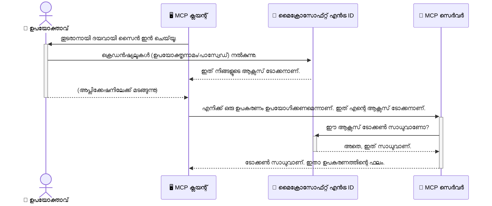

# എഐ പ്രവাহങ്ങൾ സുരക്ഷിതമാക്കൽ: മോഡൽ കോൺടекстു പ്രോട്ടോകോൾ സർവർസിനായി Entra ID സ്ഥിരീകരണം

> [!NOTE]
> ഈ പാഠത്തിലെ റിമോട്ട് സർവർ കോഡ് പാരമ്പര്യ `/sse`യും `/message` 
> എൻഡ്പോയിന്റുകളും സംരക്ഷിക്കുന്നു, MCP `2025-11-25` നു ലക്ഷ്യമിട്ട്. അതിന്റെ ഐഡന്റിറ്റി 
> കൂടാതെ ടോക്കൺ-സത്യീകരണ രീതികൾ നിലനിർത്തുക, എന്നാൽ പുതിയ 
> നിലവിലാക്കലുകൾക്കായി `2026-07-28`-യോജിച്ച Streamable HTTP ഗതാഗതം ഉപയോഗിക്കുക.

## പരിചയം
നിങ്ങളുടെ മോഡൽ കോൺടекстു പ്രോട്ടോകോൾ (MCP) സർവർ സുരക്ഷിതമാക്കുന്നത് നിങ്ങളുടെ വീടിന്റെ മുന്നണിയിലെ വാതിൽ തട്ടുന്നത് പോലെ അത്യന്തം പ്രധാനമാണ്. നിങ്ങളുടെ MCP സർവർ തുറന്നിരിക്കുകയാണെങ്കിൽ അനധികൃത ആക്സസ് വഴി നിങ്ങളുടെ ഉപകരണങ്ങൾക്കും ഡാറ്റയ്ക്കും സുരക്ഷാ ലംഘനങ്ങളിലേക്ക് വഴിവയ്ക്കാൻ സാധ്യതയുണ്ട്. Microsoft Entra ID ഒരു ശക്തമായ ക്ലൗഡ്-മൂലമുള്ള ഐഡന്റിറ്റി ആന്റ് ആക്‌സസ് മാനേജ്‌മെന്റ് പരിഹാരമാണ്, നിങ്ങൾക്ക് നിങ്ങളുടെ MCP സർവറുമായി സുക്ഷിച്ച ഉപയോക്താക്കളും ആപ്ലിക്കേഷനുകളും മാത്രമേ ഇടപെടാൻ കഴിയൂ എന്നത് ഉറപ്പുവരുത്തുന്നതിന് സഹായിക്കുന്നു. ഈ വിഭാഗത്തിൽ, നിങ്ങൾ Entra ID സ്ഥിരീകരണം ഉപയോഗിച്ച് എഐ പ്രവാഹങ്ങൾ എങ്ങനെ സംരക്ഷിക്കാമെന്ന് പഠിക്കും.

## പഠന ലക്ഷ്യങ്ങൾ
ഈ വിഭാഗം അവസാനം, നിങ്ങൾക്ക് സാധിക്കുമെന്ന്:

- MCP സർവറുകൾ സുരക്ഷിതമാക്കുന്നതിനുള്ള പ്രാധാന്യം മനസിലാക്കുക.
- Microsoft Entra ID യും OAuth 2.0 സ്ഥിരീകരണത്തിന്റെ അടിസ്ഥാനങ്ങൾ വിശദീകരിക്കുക.
- പൊതു ക്ലയന്റും രഹസ്യ ക്ലയന്റും തമ്മിലുള്ള വ്യത്യാസം തിരിച്ചറിയുക.
- പ്രാദേശികമായ (പൊതു ക്ലയന്റ്) കൂടാതെ റിമോട്ട് (രഹസ്യ ക്ലയന്റ്) MCP ലഭ്യമായ സർവർ സാഹചര്യങ്ങളിൽ Entra ID സ്ഥിരീകരണം നടപ്പാക്കുക.
- എഐ പ്രവാഹങ്ങൾ വികസിപ്പിക്കുമ്പോൾ സുരക്ഷാ മികച്ച രീതികൾ പ്രയോഗിക്കുക.

## സുരക്ഷയും MCP യും

നിങ്ങൾ നിങ്ങളുടെ വീട് തുറന്ന വാതിൽവഴി നില്ക്കാൻ കൊള്ളില്ല എന്നപോലെ, MCP സർവർക്കു അനധികൃത ആക്‌സസ് അനുവദിക്കാൻ ഒഴിവാക്കണം. നിങ്ങളുടെ എഐ പ്രവാഹങ്ങളെ സുരക്ഷിതമാക്കുന്നത് കാര്യക്ഷമവും വിശ്വസനീയവുമായ, സുരക്ഷയുള്ള ആപ്ലിക്കേഷനുകൾ നിർമ്മിക്കുന്നതിന് അത്യാവശ്യമാനമാണ്. ഈ അധ്യായം Microsoft Entra ID ഉപയോഗിച്ച് MCP സർവറുകൾ എങ്ങനെ സുരക്ഷിതമാക്കാമെന്ന് പരിചയപ്പെടുത്തുന്നു, അത് ഉപകരണങ്ങളും ഡാറ്റയും ഉപയോഗിക്കുന്ന authorized users and apps മാത്രമേ ഇടപെടാൻ കഴിയൂ എന്ന് ഉറപ്പാക്കുന്നു.

## MCP സർവറുകൾക്കുള്ള സുരക്ഷയുടെ പ്രാധാന്യം

നിങ്ങൾ ഒരു MCP സർവർക്കു ഒരു ഇമെയിൽ അയയ്ക്കാനുള്ള ഉപകരണം അല്ലെങ്കിൽ ഒരു കസ്റ്റമർ ഡാറ്റാബേസ് ആക്സസ് ചെയ്യാനുള്ള ടൂൾ ഉണ്ടെന്ന് ఊഹിക്കൂ. ഒരു സുരക്ഷിതമല്ലാത്ത സർവർ ഏതായാലും ആ ഉപകരണം ഉപയോഗിച്ച് അനധികൃതമായ ഡാറ്റ ആക്സസ് ചെയ്യപ്പെടും, സ്പാം അയയ്ക്കും, അല്ലെങ്കിൽ മറ്റേതെങ്കിലും ദുഷ്പ്രവർത്തനങ്ങൾ ഉണ്ടാകാം.

നിങ്ങളുടെ MCP സർവറിലേക്ക് വരുന്ന ഓരോ അഭ്യർത്ഥനയും ഉപയോഗിക്കുന്ന ഉപയോക്താവിന്റെ അല്ലെങ്കിൽ ആപ്ലിക്കേഷന്റെ ഐഡന്റിറ്റി സ്ഥിരീകരിക്കുന്നതിന് authentication നടപ്പാക്കുന്നത് അവശ്യം ആണ്. ഇത് നിങ്ങളുടെ എഐ പ്രവാഹങ്ങളെ സുരക്ഷിതമാക്കുന്നതിനുള്ള ആദ്യവും ഏറ്റവും നിർണായകവുമായ ഘടകമാണ്.

## Microsoft Entra ID പരിചയം

[**Microsoft Entra ID**](https://adoption.microsoft.com/microsoft-security/entra/) ഒരു ക്ലൗഡ് അടിസ്ഥാനമാക്കിയുള്ള ഐഡന്റിറ്റി ആൻഡ് ആക്സസ് മാനേജ്‌മെന്റ് സേവനമാണ്. നിങ്ങളുടെ ആപ്ലിക്കേഷനുകൾക്കായി ഒരു സർവത്ര സുരക്ഷാ ഗാർഡിനെ പോലെ ഇതിനെ കരുതുക. ഇത് ഉപയോക്തൃ ഐഡന്റിറ്റികൾ സ്ഥിരീകരിക്കുന്നതും (authentication), അവർക്കു ചെയ്യാൻ അനുവാദമുള്ള കാര്യങ്ങൾ നിർണ്ണയിക്കുന്നതും (authorization) ഉള്ള സങ്കീർണ്ണ പ്രക്രിയകൾ കൈകാര്യം ചെയ്യുന്നു.

Entra ID ഉപയോഗിച്ച്, നിങ്ങൾക്ക്:

- ഉപയോക്താക്കൾക്ക് സുരക്ഷിതമായ സൈൻ-ഇൻ സജ്ജമാക്കാം.
- API കളെയും സെർവീസുകളും സംരക്ഷിക്കാം.
- ആക്‌സസ് നയങ്ങൾ കേന്ദ്രിയമായി മാനേജ് ചെയ്യാം.

MCP സർവറുകൾക്കായി, Entra ID നിങ്ങളുടെ സർവറിന്റെ കഴിവുകൾ ആക്സസ് ചെയ്യാൻ ആരാകും എന്നത് നിയന്ത്രിക്കുന്നയ്ക്ക് ഒരു ശക്തമായ, വിശ്വസനീയ പരിഹാരമാണ്.

---

## മാജിക് മനസിലാക്കൽ: Entra ID സ്ഥിരീകരണം എങ്ങനെ പ്രവർത്തിക്കുകയാണ്

Entra ID ഓപ്പൺ സ്റ്റാൻഡേർഡായ **OAuth 2.0** പോലുള്ള രീതികൾ ഉപയോഗിച്ച് authentication കൈകാര്യം ചെയ്യുന്നു. വിശദാംശങ്ങൾ സങ്കീർണ്ണമായാലും കോർ സങ്കൽപ്പം ലളിതമാണ്, ഒരു ഉദാഹരണമായി മനസ്സിലാക്കാവുന്നതാണ്.

### OAuth 2.0-ന് ഒരു സുലഭ പരിചയം: വാലറ്റ് കീ

OAuth 2.0-നെ നിങ്ങളുടെ കാർ ഓടിച്ചുകൊണ്ടുള്ള വാലറ്റ് സർവീസായി ചിന്തിക്കുക. ഒരു റസ്റ്റോറന്റിൽ എത്തുമ്പോൾ, നിങ്ങൾ വാലറ്റിന് നിങ്ങളുടെ മാസ്റ്റർ കീ കൊടുക്കുന്നില്ല. പരിമിത അനുവാദമുള്ള ഒരു **വാലറ്റ് കീ** നൽകുന്നു — അത് കാറിന്റെ ഇന്ധനമെടുക്കാനും വാതിലുകൾ ലാക്ക് ചെയ്യാനുമാകും, പക്ഷേ ട്രങ്ക് അല്ലെങ്കിൽ ഗ്ലോവ് കോൺപാർട്ട്‌മെന്റ് തുറക്കാൻ സാധിക്കില്ല.

ഈ ഉപമയിൽ:

- **നീങ്ങൾ** ആണ് **ഉപയോക്താവ്**.
- **നിൻറെ കാർ** ആണ് **MCP സർവർ** അതിന്റെ വിലപ്പെട്ട ഉപകരണങ്ങളും ഡാറ്റയും കൊണ്ടു.
- **വാലറ്റ്** ആണ് **Microsoft Entra ID**.
- **പാർക്കിംഗ് അറ്റൻഡന്റ്** ആണ് **MCP ക്ലയന്റ്** (സർവറിലേക്ക് ആക്സസ് ചെയ്യാൻ ശ്രമിക്കുന്ന ആപ്ലിക്കേഷൻ).
- **വാലറ്റ് കീ** ആണ് **ആക്‌സസ് ടോക്കൺ**.

ആക്‌സസ് ടോക്കൺ Entra IDയിൽ നിന്ന് MCP ക്ലയന്റ് SIGN-IN ചെയ്തതിന് ശേഷം ലഭിക്കുന്ന സുരക്ഷിത എഴുത്താണ്. ക്ലയന്റ് ഇത് MCP സർവറിന്റെ മുന്നിൽ ഓരോ അഭ്യർത്ഥനയിലും അവതരിപ്പിക്കുന്നു. സർവർ ടോക്കൺ പരിശോധിച്ച് അഭ്യർത്ഥന ശരിയാണോ എന്നും ആവശ്യമായ അനുവാദങ്ങൾ ക്ലയന്റിന് ഉണ്ടോ എന്നും ഉറപ്പാക്കുന്നു, പാസ്‌വേഡ് പോലുള്ള നിങ്ങളുടെ യഥാർത്ഥ വാരികൾ കൈകാര്യം ചെയ്യേണ്ടതില്ലാതെ.

### സ്ഥിരീകരണ പ്രവാഹം

പ്രായോഗികമായി പ്രക്രിയ ഇങ്ങനെയാണ്:



### Microsoft Authentication Library (MSAL) പരിചയം

കോഡിലേക്ക് കടക്കുന്നതിനുമുമ്പ്, ഉദാഹരണങ്ങളിൽ കാണുന്ന ഒരു പ്രധാന ഘടകമായ **Microsoft Authentication Library (MSAL)** പരിചയപ്പെടുക.

MSAL മൈക്രോസോഫ്റ്റ് വികസിപ്പിച്ച ലൈബ്രറിയാണ്, ഇത് ഡെവലപ്പർമാർക്ക് authentication കൈകാര്യം ചെയ്യുന്നതിൽ ലളിതമാക്കുന്നു. സുരക്ഷ ടോക്കൺ കൈകാര്യം ചെയ്യൽ, സൈൻ-ഇൻ മാനേജ്‌മെന്റ്, സെഷൻ പുതുക്കൽ തുടങ്ങിയ പ്രക്രിയകൾ നിർവഹിക്കാൻ നിങ്ങൾക്ക് കോഡ് എഴുതേണ്ടതില്ല, MSAL ഈ ജോലികൾ കൈകാര്യം ചെയ്യുന്നു.

MSAL പോലുള്ള ലൈബ്രറി ഉപയോഗിക്കുന്നത് ശുപാർശ ചെയ്യുന്നു കാരണം:

- **സുരക്ഷിതമാണ്:** വ്യവസായ നിലവാരത്തിലെ പ്രോട്ടോകോളുകളും മികച്ച സുരക്ഷ പ്രവൃത്തികളും നടപ്പിലാക്കുന്നു, നിങ്ങളുടെ കോഡിൽ തിരശില കുറയ്ക്കുന്നു.
- **വികസനം എളുപ്പമാക്കുന്നു:** OAuth 2.0, OpenID Connect പ്രോട്ടോകോളുകളുടെ സങ്കീർണ്ണത മറച്ചുവെച്ച്, വളരെ കുറച്ച് കോഡോടെ ശക്തമായ authentication ചേർക്കാൻ ഇടയ്ക്കും.
- **പരിപാലനത്തിലാണ്:** പുതിയ സുരക്ഷ ഭീഷണികൾക്കും പ്ലാറ്റ്ഫോം മാറ്റങ്ങൾക്കും MSAL ക്രമമായി അപ്‌ഡേറ്റ് ചെയ്യപ്പെടുന്നു.

MSAL .NET, JavaScript/TypeScript, Python, Java, Go, iOS, ആൻഡ്രോയ്ഡ് പോലുള്ള പലയിടങ്ങളിലും പിന്തുണയ്ക്കുന്നു. അതുകൊണ്ട് നിങ്ങളുടെ ഉൾച്ചേരുന്ന സാങ്കേതിക ഘടനയിൽ ഒറ്റപോലെ authentication മാതൃക്കൾ നടപ്പിലാക്കാം.

MSAL കുറിച്ച് കൂടുതൽ അറിയാൻ, ഔദ്യോഗിക [MSAL അവലോകന ഡോക്യുമെന്റേഷൻ](https://learn.microsoft.com/entra/identity-platform/msal-overview) നോക്കുക.

---

## Entra ID ഉപയോഗിച്ച് നിങ്ങളുടെ MCP സർവർ സുരക്ഷിതമാക്കൽ: ഘട്ടം ഘട്ടമായ മാർഗ്ഗനിർദേശം

ഇപ്പോൾ, Entra ID ഉപയോഗിച്ച് പ്രാദേശിക MCP സർവർ (stdio വഴി സംവദിക്കുന്നത്) സുരക്ഷിതമാക്കുന്നത് എങ്ങനെ എന്നത് നോക്കാം. ഈ ഉദാഹരണം **പൊതു ക്ലയന്റ്** ഉപയോഗിക്കുന്നു, ഇത് ഒരു ഉപയോക്തൃ യന്ത്രത്തിൽ ഓടുന്ന ആപ്ലിക്കേഷനുകൾക്ക് (ഡെസ്‌ക്ടോപ്പ് ആപ്പ് അല്ലെങ്കിൽ പ്രാദേശിക വികസന സർവർ) അനുയോജ്യമാണ്.

### സന്നിവേശം 1: പ്രാദേശിക MCP സർവർ (പൊതു ക്ലയന്റ് ഉപയോഗിച്ച്) സുരക്ഷിതമാക്കൽ

ഈ സാഹചര്യത്തിൽ, പ്രാദേശികമായി പ്രവർത്തിക്കുന്ന, stdio വഴി സംവദിക്കുന്ന MCP സർവർ കാണാം, ഇത് ഉപയോക്താവിനെ പ്രവേശിപ്പിക്കുന്നതിന് മുൻപ് Entra ID ഉപയോഗിച്ച് തിരിച്ചറിയുന്നു. സർവറിൽ ഒരു ടൂൾ മാത്രം ഉണ്ടാകും, ഇത് Microsoft Graph API-യിൽ നിന്ന് ഉപയോക്താവിന്റെ പ്രൊഫൈൽ വിവരങ്ങൾ ലഭിക്കും.

#### 1. Entra ID-യിൽ ആപ്പ് സജ്ജമാക്കൽ

ഏതെങ്കിലും കോഡ് എഴുതുന്നതിനു മുൻപ്, നിങ്ങളുടെ ആപ്പ് Microsoft Entra ID-യിൽ രജിസ്റ്റർ ചെയ്യണം. ഇത് Entra ID-നെ നിങ്ങളുടെ ആപ്പിന്റെ വിവരം അറിയിക്കുകയും authentication സേവനം ഉപയോഗിക്കുന്നതിന് അവകാശം നൽകുകയും ചെയ്യുന്നു.

1. **[Microsoft Entra പോർട്ടൽ](https://entra.microsoft.com/)** ൽ പോകുക.
2. **App registrations**-ൽ **New registration** ക്ലിക്ക് ചെയ്യുക.
3. നിങ്ങളുടെ ആപ്പിന് പേര് കൊടുക്കുക (ഉദാ: "എന്റെ പ്രാദേശിക MCP സർവർ").
4. **Supported account types**-ലായി **Accounts in this organizational directory only** തിരഞ്ഞെടുക്കുക.
5. ഈ ഉദാഹരണത്തിനായി **Redirect URI** ഒഴികെയിടാം.
6. **Register** ൽ ക്ലിക്ക് ചെയ്യുക.

രജിസ്റ്റർ ചെയ്ത ശേഷം, **Application (client) ID** ഉം **Directory (tenant) ID** ഉം നിങ്ങൾക്കു വേണം, അതിനാൽ ശ്രദ്ധിക്കുക.

#### 2. കോഡ് വിശദീകരണം

authentication കൈകാര്യം ചെയ്യുന്ന കോഡിന്റെ പ്രധാന ഭാഗങ്ങൾ നോക്കാം. ഈ ഉദാഹരണത്തിന്റെ പൂർണ്ണ കോഡ് [Entra ID - Local - WAM](https://github.com/Azure-Samples/mcp-auth-servers/tree/main/src/entra-id-local-wam) ഫോൾഡറിൽ ലഭ്യമാണ്. ഇത് [mcp-auth-servers GitHub റിപ്പോസിറ്ററിയിലും](https://github.com/Azure-Samples/mcp-auth-servers) കണ്ടെത്താം.

**`AuthenticationService.cs`**

Entra ID-യുമായി ഇടപഴകുന്നതു കൈകാര്യം ചെയ്യുന്ന ക്ലാസ് ഇത്.

- **`CreateAsync`**: MSAL-ൽ നിന്നുള്ള `PublicClientApplication` പ്രാഥമികമായി തുടക്കം കുറിക്കുന്നു. ഇത് നിങ്ങളുടെ ആപ്പിന്റെ `clientId`യും `tenantId`ഉം ഉപയോഗിക്കുന്നു.
- **`WithBroker`**: വിൻഡോസ് വെബ് അക്കൗണ്ട് മാനേജറായ ബ്രോക്കർ ഉപയോഗിക്കാനുള്ള സൗകര്യം പകരുന്നു, സുരക്ഷിതമായ ഒറ്റ-സൈൻ-ഓൺ അനുഭവം.
- **`AcquireTokenAsync`**: ഇതാണ് പ്രധാന മെത്തഡ്. ആദ്യം സൈലെന്റായി ടോക്കൺ ലഭ്യമാണെന്ന് നോക്കുന്നു (ഉപയോക്താവിന് വീണ്ടും സൈൻ ഇൻ ചെയ്യേണ്ടതില്ല). ലഭ്യമല്ലെങ്കിൽ, സജീവമായി സൈൻ-ഇൻ ചെയ്യാനായി പ്രേരിപ്പിക്കുന്നു.

```csharp
// Simplified for clarity
public static async Task<AuthenticationService> CreateAsync(ILogger<AuthenticationService> logger)
{
    var msalClient = PublicClientApplicationBuilder
        .Create(_clientId) // Your Application (client) ID
        .WithAuthority(AadAuthorityAudience.AzureAdMyOrg)
        .WithTenantId(_tenantId) // Your Directory (tenant) ID
        .WithBroker(new BrokerOptions(BrokerOptions.OperatingSystems.Windows))
        .Build();

    // ... cache registration ...

    return new AuthenticationService(logger, msalClient);
}

public async Task<string> AcquireTokenAsync()
{
    try
    {
        // Try silent authentication first
        var accounts = await _msalClient.GetAccountsAsync();
        var account = accounts.FirstOrDefault();

        AuthenticationResult? result = null;

        if (account != null)
        {
            result = await _msalClient.AcquireTokenSilent(_scopes, account).ExecuteAsync();
        }
        else
        {
            // If no account, or silent fails, go interactive
            result = await _msalClient.AcquireTokenInteractive(_scopes).ExecuteAsync();
        }

        return result.AccessToken;
    }
    catch (Exception ex)
    {
        _logger.LogError(ex, "An error occurred while acquiring the token.");
        throw; // Optionally rethrow the exception for higher-level handling
    }
}
```

**`Program.cs`**

ഇവിടെയാണ് MCP സർവർ സജ്ജീകരിക്കപ്പെടുന്നത്, കൂടാതെ authentication സേവനം ഉൾക്കൊള്ളുന്നു.

- **`AddSingleton<AuthenticationService>`**: `AuthenticationService` DEPENDENCY Injection കന്റൈനറിൽ രജിസ്റ്റർചെയ്യുന്നു, അതിനാൽ ആപ്ലിക്കേഷൻ ഇനത്തിൽ ഉപയോഗിക്കാം (ഉദാ: ടൂൾ).
- **`GetUserDetailsFromGraph` ടൂൾ**: ഈ ടൂൾക്ക് `AuthenticationService` ഒരു ഉദാഹരണം ആവശ്യമുണ്ട്. ആദ്യം `authService.AcquireTokenAsync()` വിളിച്ച് സാധുവായ ആക്‌സസ് ടോക്കൺ കിട്ടും. വിജയിച്ചാൽ, Microsoft Graph API-യിലേക്ക് വിളിച്ച് ഉപയോക്താവിന്റെ വിശദാംശങ്ങൾ വാങ്ങും.

```csharp
// Simplified for clarity
[McpServerTool(Name = "GetUserDetailsFromGraph")]
public static async Task<string> GetUserDetailsFromGraph(
    AuthenticationService authService)
{
    try
    {
        // This will trigger the authentication flow
        var accessToken = await authService.AcquireTokenAsync();

        // Use the token to create a GraphServiceClient
        var graphClient = new GraphServiceClient(
            new BaseBearerTokenAuthenticationProvider(new TokenProvider(authService)));

        var user = await graphClient.Me.GetAsync();

        return System.Text.Json.JsonSerializer.Serialize(user);
    }
    catch (Exception ex)
    {
        return $"Error: {ex.Message}";
    }
}
```

#### 3. ആകേണ്ട കണക്ക് എങ്ങിനെ പ്രവർത്തിക്കുന്നു

1. MCP ക്ലയന്റ് `GetUserDetailsFromGraph` ടൂൾ ഉപയോഗിക്കാൻ ശ്രമിക്കുമ്പോൾ, ടൂൾ ആദ്യം `AcquireTokenAsync` വിളിക്കുന്നു.
2. `AcquireTokenAsync` MSAL ലൈബ്രറി വഴി സാധുവായ ടോക്കൺ ഉണ്ടോ എന്ന് പരിശോധിക്കുന്നു.
3. ടോക്കൺ ഇല്ലെങ്കിൽ, MSAL ബ്രോക്കർ വഴി ഉപയോക്താവിനെ Entra ID അക്കൗണ്ട് ഉപയോഗിച്ച് സൈൻ-ഇൻ ചെയ്യാൻ പ്രേരിപ്പിക്കുന്നു.
4. സൈൻ-ഇൻ കഴിഞ്ഞാൽ, Entra ID ആക്‌സസ് ടോക്കൺ നൽകുന്നു.
5. ടൂൾ ടോക്കൺ സ്വീകരിച്ച് Microsoft Graph API-യിൽ സുരക്ഷിതമായ വിളി നടത്തുന്നു.
6. ഉപയോക്താവിന്റെ വിവരങ്ങൾ MCP ക്ലയന്റിലേക്ക് തിരികെ ലഭിക്കുന്നു.

ഈ പ്രക്രിയ വഴി സത്യസന്ധമായ ഉപയോക്താക്കൾക്ക് മാത്രം ടൂൾ ഉപയോഗിക്കാൻ കഴിയും, നിങ്ങളുടെ പ്രാദേശിക MCP സർവർ ഫലപ്രദമായി സുരക്ഷിതമാക്കുന്നു.

### സന്നിവേശം 2: റിമോട്ട് MCP സർവർ (രഹസ്യ ക്ലയന്റ് ഉപയോഗിച്ച്) സുരക്ഷിതമാക്കൽ

നിങ്ങളുടെ MCP സർവർ ക്ലൗഡ് പോലുള്ള റിമോട്ട് യന്ത്രത്തിൽ പ്രവർത്തിക്കുമ്പോഴും, HTTP Streaming പോലുള്ള പ്രോട്ടോകോൾ ഉപയോഗിച്ച് സംവദിക്കുമ്പോഴും, സുരക്ഷ ആവശ്യക്കാർ വ്യത്യസ്തമാണ്. ഈ സാഹചര്യത്തിൽ, **രഹസ്യ ക്ലയന്റ്**യും **Authorization Code Flow** ഉം ഉപയോഗിക്കണം. ഇത് കൂടുതൽ സുരക്ഷിതമാണ്, കാരണം ആപ്ലിക്കേഷന്റെ രഹസ്യങ്ങൾ ബ്രൗസറിൽ പുറത്തോ വെളിപ്പെടുത്തുകയുമില്ല.

ഈ ഉദാഹരണം Express.js ഉപയോഗിച്ച് HTTP ആവശ്യങ്ങൾ കൈകാര്യം ചെയ്യുന്ന TypeScript ആധാരിത MCP സർവർ ആണ്.

#### 1. Entra ID-യിൽ ആപ്പ് സജ്ജീകരണം

Entra ID-യിൽ സജ്ജീകരണം പൊതു ക്ലയന്റുമായി സാമ്യമുണ്ട്, പക്ഷേ ഒരു പ്രധാന വ്യത്യാസം ഉണ്ട്: **client secret** സൃഷ്ടിക്കേണ്ടതാണ്.

1. **[Microsoft Entra പോർട്ടൽ](https://entra.microsoft.com/)** ൽ പോകുക.
2. നിങ്ങളുടെ ആപ്പ് രജിസ്ട്രേഷനിൽ **Certificates & secrets** വിഭാഗത്തിലേക്ക് പോകുക.
3. **New client secret**-് ക്ലിക്ക് ചെയ്യുക, വിവരണം നൽകുക, പിന്നീട് **Add** ക്ലിക്ക് ചെയ്യുക.
4. **പ്രധാനമായ കാര്യമാണ്:** സീക്രട്ട് മൂല്യം ഉടൻ പകർത്തണം. വീണ്ടും കാണാൻ സാധിക്കില്ല.
5. **Redirect URI**-യും കോൺഫിഗർ ചെയ്യേണ്ടതാണ്. **Authentication** ടാബിൽ **Add a platform** ക്ലിക്ക് ചെയ്ത് **Web** തെരഞ്ഞെടുത്ത് നിങ്ങളുടെ ആപ്പിനുള്ള റീഡിറക്ട് URI നൽകുക (ഉദാ: `http://localhost:3001/auth/callback`).

> **⚠️ ശ്രദ്ധിക്കേണ്ട സുരക്ഷാ കുറിപ്പ്:** ഉൽപ്പാദന ആപ്ലിക്കേഷനുകളിൽ, Microsoft ക്ളയന്റ് സീക്രറ്റുകൾക്ക് പകരം **Secretless authentication** എങ്ങനെ നടപ്പിലാക്കാമെന്നും **Managed Identity** അല്ലെങ്കിൽ **Workload Identity Federation** പോലുള്ള മാർഗങ്ങൾ ഉപയോഗിക്കാനുമാണ് ശക്തമായി ശുപാർശ. ക്ളയന്റ് സീക്രറ്റുകൾ സുരക്ഷാ ഭീഷണി ഉളവാക്കാം, കാരണം ഇവ പുറ്റുകാട്ടുകയോ കവർച്ചയിലാവുകയോ ചെയ്യാം. മാനേജുചെയ്യുന്ന ഐഡന്റിറ്റികൾ നിങ്ങളുടെ കോഡിലും കോൺഫിഗേഷനിലും ക്രെഡൻഷ്യലുകൾ സൂക്ഷിക്കുന്നത് ഒഴിവാക്കുകയും കൂടുതൽ സുരക്ഷിത മാർഗങ്ങൾ നൽകുകയും ചെയ്യുന്നു.
>
> കൂടുതൽ വിവരങ്ങൾക്ക്, [Managed identities for Azure resources overview](https://learn.microsoft.com/entra/identity/managed-identities-azure-resources/overview) വായിക്കുക.

#### 2. കോഡ് വിശദീകരണം

ഈ ഉദാഹരണം സെഷൻ അടിസ്ഥാനമാക്കിയുള്ള സമീപനം ആണ്. ഉപയോക്താവ് authentication കഴിഞ്ഞു, സർവർ ആക്‌സസ് ടോക്കൺ, റിഫ്രഷ് ടോക്കൺ സെഷനിൽ സൂക്ഷിക്കുന്നു, ഉപയോക്താവിന് സെഷൻ ടോക്കൺ നൽകുന്നു. ഇതുപോലെ പിന്നീട് വരുന്ന അഭ്യർത്ഥനകൾക്കും സെഷൻ ടോക്കൺ ഉപയോഗിക്കാം. ഈ പൂർണ്ണ കോഡ് [Entra ID - Confidential client](https://github.com/Azure-Samples/mcp-auth-servers/tree/main/src/entra-id-cca-session) ഫോൾഡറിൽ ലഭ്യമാണ് [mcp-auth-servers GitHub റിപ്പോസിറ്ററിയിലും](https://github.com/Azure-Samples/mcp-auth-servers).

**`Server.ts`**

Express സർവർ സജ്ജീകരിക്കുകയും MCP ഗതാഗത പാളി സജ്ജീകരിക്കുകയും ചെയ്യുന്ന ഫയൽ.

- **`requireBearerAuth`**: `/sse`യും `/message`യും എൻഡ്പോയിന്റുകൾ സംരക്ഷിക്കുന്ന മിഡിൽവെയർ. അപേക്ഷയുടെ `Authorization` ഹെഡറിൽ സാധുവായ ബിയറർ ടോക്കൺ കാണുന്നു.
- **`EntraIdServerAuthProvider`**: `McpServerAuthorizationProvider` ഇന്റർഫേസ് നടപ്പാക്കുന്ന കസ്റ്റം ക്ലാസ്. OAuth 2.0 പ്രക്രിയ കൈകാര്യം ചെയ്യുന്നു.
- **`/auth/callback`**: ഉപയോക്താവ് authentication കഴിഞ്ഞ് Entra ID നും മടങ്ങിവന്നപ്പോൾ റീഡിറക്ട് കൈകാര്യം ചെയ്യുന്ന എൻഡ്പോയിന്റ്. അത Authorization Code ആക്‌സസ് ടോക്കണിലും റിഫ്രഷ് ടോക്കണിലുമാക്കിയെടുക്കുന്നു.

```typescript
// വ്യക്തതയ്‍ക്കായി ലളിതമാക്കി
const app = express();
const { server } = createServer();
const provider = new EntraIdServerAuthProvider();

// SSE എന്റ്പോയിന്റ് സംരക്ഷിക്കുക
app.get("/sse", requireBearerAuth({
  provider,
  requiredScopes: ["User.Read"]
}), async (req, res) => {
  // ... ട്രാൻസ്പോർട്ട്‌ എന്നിലേക്ക് കണക്ട് ചെയ്യുക ...
});

// സന്ദേശ എന്റ്പോയിന്റ് സംരക്ഷിക്കുക
app.post("/message", requireBearerAuth({
  provider,
  requiredScopes: ["User.Read"]
}), async (req, res) => {
  // ... സന്ദേശം കൈകാര്യം ചെയ്യുക ...
});

// OAuth 2.0_CALLBACK കൈകാര്യം ചെയ്യുക
app.get("/auth/callback", (req, res) => {
  provider.handleCallback(req.query.code, req.query.state)
    .then(result => {
      // ... വിജയമോ പരാജയത്തോ കൈകാര്യം ചെയ്യുക ...
    });
});
```

**`Tools.ts`**

MCP സർവർ നൽകുന്ന ഉപകരണങ്ങൾ നിർവചിക്കുന്ന ഫയൽ. `getUserDetails` ടൂൾ മുമ്പത്തെ ഉദാഹരണത്തോട് സാദൃശ്യമുള്ളതാണ്, പക്ഷേ ഇത് സെഷനിൽ നിന്നു ടോക്കൺ എടുക്കുന്നു.

```typescript
// വ്യക്തതക്കായി ലളിതമാക്കി
server.setRequestHandler(CallToolRequestSchema, async (request) => {
  const { name } = request.params;
  const context = request.params?.context as { token?: string } | undefined;
  const sessionToken = context?.token;

  if (name === ToolName.GET_USER_DETAILS) {
    if (!sessionToken) {
      throw new AuthenticationError("Authentication token is missing or invalid. Ensure the token is provided in the request context.");
    }

    // സെഷൻ സ്റ്റോറിൽ നിന്നുള്ള എൻട്ര ഐഡി ടോക്കൺ നേടുക
    const tokenData = tokenStore.getToken(sessionToken);
    const entraIdToken = tokenData.accessToken;

    const graphClient = Client.init({
      authProvider: (done) => {
        done(null, entraIdToken);
      }
    });

    const user = await graphClient.api('/me').get();

    // ... ഉപയോക്തൃ വിശദാംശങ്ങൾ തിരിച്ചgive ...
  }
});
```

**`auth/EntraIdServerAuthProvider.ts`**

ഈ ക്ലാസ് കൈകാര്യം ചെയ്യുന്നത്:

- ഉപയോക്താക്കളെ Entra ID സൈൻ-ഇൻ പേജിലേക്ക് റീഡയറക്ട് ചെയ്യൽ.
- Authorization code ആക്‌സസ് ടോക്കണിലാക്കി മാറ്റൽ.
- ടോക്കണുകൾ `tokenStore`-ൽ സൂക്ഷിക്കൽ.
- ആക്‌സസ് ടോക്കൺ കാലഹരണപ്പെട്ടാൽ പുതുക്കൽ.


#### 3. എല്ലാം എങ്ങനെ ചേർന്ന് പ്രവർത്തിക്കുന്നു

1. ഒരു ഉപഭോക്താവ് ആദ്യം MCP സർവറുമായി കണക്റ്റ് ചെയ്യാൻ ശ്രമിക്കുമ്പോൾ, `requireBearerAuth` മിഡിൽവെയർ അവർക്കു സാധുവായ സെഷൻ ഇല്ലെന്ന് കണ്ട് അവരെ Entra ID സൈൻ ഇൻ പേജ്ിലേക്ക് റിഡയരക്ട് ചെയ്യും.
2. ഉപഭോക്താവ് അവരുടെ Entra ID അക്കൗണ്ടിലൂടേയും സൈൻ ഇൻ ചെയ്യും.
3. Entra ID ഉപഭോക്താവിനെ ഒരു ഓതോറൈസേഷൻ കോഡുമായി `/auth/callback` എൻഡ്പോയിന്റിലേക്ക് തിരികെ റിഡയരക്ട് ചെയ്യുന്നു.
4. സർവർ കോഡ് ഒരു ആക്സസ് ടോക്കനും ഒരു റിഫ്രെഷ് ടോക്കനും രൂപത്തിൽ എക്സ്ചേഞ്ച് ചെയ്ത്, അവ സംഭരിച്ച്, ക്ലയന്റ്‌ക്ക് അയയ്ക്കുന്ന സെഷൻ ടോക്കൻ സൃഷ്ടിക്കുന്നു.
5. ക്ലയന്റ് ഇനി ഈ സെഷൻ ടോക്കൻ `Authorization` ഹെഡറിൽ ഉപയോഗിച്ച് MCP സർവറിലേക്ക് എല്ലാ ഭാവി അഭ്യർത്ഥനകൾക്കും ഉപയോഗിക്കാം.
6. `getUserDetails` ടൂൾ കോള്ചെയ്യുമ്പോൾ, അത് സെഷൻ ടോക്കൻ ഉപയോഗിച്ച് Entra ID ആക്സസ് ടോക്കൻ കണ്ടെത്തി Microsoft Graph API വിളിക്കുന്നു.

ഈ ഫ്ലോ പൊതു ക്ലയന്റ് ഫ്ലോയേക്കാൾ കൂടുതൽ സങ്കീർണ്ണമാണ്, പക്ഷേ ഇന്റർനെറ്റ്-മുഖമായ എൻഡ്പോയിന്റുകൾക്കായി ഇത് ആവശ്യമാണ്. റിമോട്ട് MCP സർവർകൾ പൊതുഇന്റർനെറ്റിൽ ആക്സസിബിൾ ആയതിനാൽ അനധികൃത ആക്സസ്‌ പ്രതിരোধിക്കാൻ കൂടുതൽ ശക്തമായ സുരക്ഷാ നടപടികൾ ആവശ്യമാണ്.


## സുരക്ഷാ മികച്ച അനുഭവങ്ങൾ

- **എപ്പോഴും HTTPS ഉപയോഗിക്കുക**: ടോക്കനുകൾ ഇടപെടലിൽനിന്ന് സുരക്ഷിതമാക്കാൻ ക്ലയന്റ്‌ക്കും സർവറിനും ഇടയിലുള്ള ആശയവിനിമയം എൻക്രിപ്റ്റ് ചെയ്യുക.
- **റോൾ-ബേസ്‌ഡ് ആക്സസ് കൺട്രോൾ (RBAC) നടപ്പാക്കുക**: ഒരു ഉപയോക്താവ് സാക്ഷ്യപ്പെടുത്തിയിട്ടുണ്ടോ എന്ന് മാത്രം പരിശോധിക്കാതെ അവർക്ക് എന്ത് അധികാരമുണ്ട് എന്നും പരിശോധിക്കുക. Entra IDയിൽ റോളുകൾ നിർവചിച്ച് MCP സർവറിൽ അവ പരിശോധിക്കാം.
- **മോണിറ്റർ ചെയ്യുകയും ഓഡിറ്റ് ചെയ്യുകയും ചെയ്യുക**: എല്ലാ സാക്ഷ്യപ്പെടുത്തൽ ഇവന്റുകളും ലോഗ് ചെയ്ത് സംശയജനകമായ പ്രവർത്തനങ്ങൾ കണ്ടെത്തി പ്രതികരിക്കാം.
- **റേറ്റ് ലിമിറ്റിംഗ്, ത്രോട്ട്ലിംഗ് കൈകാര്യം ചെയ്യുക**: Microsoft Graph ഉൾപ്പെടെ പല APIകൾക്കുമുണ്ട് മിശ്രിത ഉപയോഗം തടയാൻ റേറ്റ് ലിമിറ്റിംഗ്. MCP സർവറിൽ എക്സ്പോനെൻഷ്യൽ ബാക്കോഫ് അടക്കമുള്ള റിട്രൈ ലോഗിക്ക് നടപ്പാക്കുക HTTP 429(Too Many Requests) പ്രതികരണങ്ങൾ നചരിക്കാൻ. API കോളുകൾ കുറയ്ക്കാൻ പലയിടത്തും ഉപയോഗിക്കുന്ന ഡാറ്റ കാഷിങ്ങും പരിഗണിക്കുക.
- **സുരക്ഷിതമായ ടോക്കൻ സ്റ്റൊറേജ്**: ആക്സസ് ടോക്കനുകളും റിഫ്രെഷ് ടോക്കനും സുരക്ഷിതമായി സ്റ്റോർ ചെയ്യുക. ലോക്കൽ ആപ്ലിക്കേഷനുകൾക്ക് സിസ്റ്റത്തിന്റെ സുരക്ഷിത സംഭരണ സംവിധാനങ്ങൾ ഉപയോഗിക്കുക. സർവർ ആപ്ലിക്കേഷനുകൾക്ക് എങ്കിൽ എൻക്രിപ്റ്റഡ് സ്റ്റോറേജ് അല്ലെങ്കിൽ Azure Key Vault പോലുള്ള സുരക്ഷിത കീ മാനേജ്മെന്റ് സേവനങ്ങൾ പരിഗണിക്കുക.
- **ടോക്കൻ കാലഹരണ കൈകാര്യം ചെയ്യൽ**: ആക്സസ് ടോക്കനുകൾക്ക് പരിമിത ആയുസ്സ് ഉണ്ട്. പുന:സാക്ഷ്യപ്പെടുത്തൽ കൂടാതെ തുടർച്ചയായ ഉപയോക്തൃ അനുഭവത്തിന് റിഫ്രെഷ് ടോക്കനുകൾ ഉപയോഗിച്ച് ഓട്ടോമാറ്റിക് ടോക്കൻ പുതുക്കൽ നടപ്പാക്കുക.
- **Azure API Management ഉപയോഗിക്കുക പരിഗണിക്കുക**: MCP സർവറിൽ നേരിട്ട് സുരക്ഷ നടപ്പാക്കുന്നത് മെച്ചപ്പെട്ട നിയന്ത്രണം നൽകുന്നതിനാൽ, API ഗേറ്റ്വേകൾ പോലുള്ള Azure API Management ഈ സുരക്ഷാപ്പരമായ പല കാര്യങ്ങളും സ്വയം കൈകാര്യം ചെയ്യുന്നു, അതിൽ സാക്ഷ്യപ്പെടുത്തൽ, അധികാരം, റേറ്റ് ലിമിറ്റിംഗ്, മോണിറ്ററിംഗ് എന്നിവ ഉൾപ്പെടുന്നു. ഇത് ക്ലയന്റുകളും MCP സർവർകളും തമ്മിലുള്ള കേന്ദ്രകൃത უსაფრთხത പാളിയായി പ്രവർത്തിക്കുന്നു. MCPയുമായി API ഗേറ്റ്വേകൾ ഉപയോഗിക്കുന്നതിന്റെ കൂടുതൽ വിവരങ്ങൾക്ക് ഞങ്ങളുടെ [Azure API Management Your Auth Gateway For MCP Servers](https://techcommunity.microsoft.com/blog/integrationsonazureblog/azure-api-management-your-auth-gateway-for-mcp-servers/4402690) കാണുക.


## പ്രധാനപ്പെട്ട കാര്യങ്ങൾ

- നിങ്ങളുടെ MCP സർവർ സുരക്ഷിതമാക്കുന്നത് നിങ്ങളുടെ ഡേറ്റയ്ക്കും ഉപകരണങ്ങൾക്കും സംരക്ഷണമാണ്.
- Microsoft Entra ID സാക്ഷ്യപ്പെടുത്തലിനും ഓതറൈസേഷനും ശക്തവും സ്കേലബിളുമായ പരിഹാരമാണ്.
- **പൊതുഗ്രാഹകൻ(public client)** ലോക്കൽ ആപ്ലിക്കേഷനുകൾക്കായി, **രഹസ്യഗ്രാഹകൻ(confidential client)** റിമോട്ട് സർവറുകൾക്കായി ഉപയോഗിക്കുക.
- **ഓതറൈസേഷൻ കോഡ് ഫ്ലോ** വെബ് ആപ്ലിക്കേഷനുകൾക്കുള്ള ഏറ്റവും സുരക്ഷിതമായ ഓപ്ഷനാണ്.


## അഭ്യാസം

1. നിങ്ങൾ നിർമ്മിക്കാൻ പോകുന്ന MCP സർവർ ഏതായിരിക്കും എന്ന് ചിന്തിക്കുക. അത് ലോക്കൽ സർവറായിരിക്കുമോ റിമോട്ട് സർവറായിരിക്കുമോ?
2. നിങ്ങളുടെ ഉത്തരം അനുസരിച്ചു, നിങ്ങൾ പൊതു ക്ലയന്റോ രഹസ്യ ക്ലയന്റോ ഉപയോഗിക്കും?
3. Microsoft Graph ന് എതിരെ പ്രവർത്തനങ്ങൾ നടത്തുന്നതിനായി നിങ്ങളുടെ MCP സർവർക്ക് എങ്ങനെ അനുമതി ആവശ്യപ്പെടുകയാണ്?


## ഹാൻഡ്‌സ്-ഓൺ അഭ്യാസങ്ങൾ

### അഭ്യാസം 1: Entra IDയിൽ ഒരു ആപ്ലിക്കേഷൻ രജിസ്റ്റർ ചെയ്യുക
Microsoft Entra പോർട്ടലിലേക്ക് പോകുക.
നിങ്ങളുടെ MCP സർവറിനായി പുതിയ ഒരു ആപ്ലിക്കേഷൻ രജിസ്റ്റർ ചെയ്യുക.
ആപ്ലിക്കേഷൻ (ക്ലയന്റ്) ഐഡി, ഡയറക്ടറി (ടെനന്റ്) ഐഡി കുറിക്കുക.

### അഭ്യാസം 2: ഒരു ലോക്കൽ MCP സർവർ സുരക്ഷിതമാക്കുക (പൊതു ക്ലയന്റ്)
- ഉപയോക്തൃ സാക്ഷ്യപ്പെടുത്തലിനായി MSAL (Microsoft Authentication Library) ഇന്റഗ്രേറ്റ് ചെയ്യാൻ കോഡ് ഉദാഹരണം പിന്തുടരുക.
- Microsoft Graph ല് നിന്നും ഉപയോക്തൃ വിശദാംശങ്ങൾ പിന്‍വലിക്കുന്ന MCP ടൂൾ വിളിച്ച് സാക്ഷ്യപ്പെടുത്തൽ ഫ്ലോ പരീക്ഷിക്കുക.

### അഭ്യാസം 3: ഒരു റിമോട്ട് MCP സർവർ സുരക്ഷിതമാക്കുക (രഹസ്യ ക്ലയന്റ്)
- Entra IDയിൽ രഹസ്യ ക്ലയന്റ് രജിസ്റ്റർ ചെയ്ത് ക്ലയന്റ് സീക്രട്ട് സൃഷ്ടിക്കുക.
- നിങ്ങളുടെ Express.js MCP സർവറിൽ ഓതറൈസേഷൻ കോഡ് ഫ്ലോ കോൺഫിഗർ ചെയ്യുക.
- സംരക്ഷിത എൻഡ്പോയിന്റുകൾ പരിശോധിച്ച് ടോക്കൻ അടിസ്ഥാനമായ ആക്സസ് സ്ഥിരീകരിക്കുക.

### അഭ്യാസം 4: സുരക്ഷാ മികച്ച അനുഭവങ്ങൾ പ്രയോഗിക്കുക
- നിങ്ങളുടെ ലോക്കൽ അല്ലെങ്കിൽ റിമോട്ട് സർവറിനായി HTTPS പ്രാബല്യമാക്കുക.
- റോള്ബേസ്‌ഡ് ആക്സസ് കൺട്രോൾ (RBAC) നിങ്ങളുടെ സർവർ ലോഗിക്-ൽ നടപ്പാക്കുക.
- ടോക്കൻ കാലഹരണ കൈകാര്യം ചെയ്യലും സുരക്ഷിത ടോക്കൻ സംഭരണവും കൂട്ടിച്ചേർക്കുക.

## സ്രോതസുകൾ

1. **MSAL അവലോകന പ്രമാണം**  
   വിവിധ പ്ലാറ്റ്ഫോമുകളിൽ ടോക്കൻ സുരക്ഷിതമായി ലഭ്യമാക്കുന്നതിന് Microsoft Authentication Library (MSAL) എങ്ങനെ സഹായിക്കുന്നുവെന്ന് അറിയുക:  
   [MSAL Overview on Microsoft Learn](https://learn.microsoft.com/en-gb/entra/msal/overview)

2. **Azure-Samples/mcp-auth-servers GitHub സംഭരണം**  
   സാക്ഷ്യപത്ര ഫ്ലോകൾ പ്രദർശിപ്പിക്കുന്ന MCP സർവർ നിർവചനങ്ങൾ:  
   [Azure-Samples/mcp-auth-servers on GitHub](https://github.com/Azure-Samples/mcp-auth-servers)

3. **Azure റിസോഴ്‌സുകൾക്കായുള്ള മാനേജ്ഡ് ഐഡന്റിറ്റീസ് അവലോകനം**  
   സിസ്റ്റം അല്ലെങ്കിൽ ഉപയോക്താവ് നിയോഗിച്ച മാനേജ്ഡ് ഐഡന്റിറ്റികൾ ഉപയോഗിച്ച് സീക്രെട്ടുകൾ ഒഴിവാക്കുന്നത് മനസിലാക്കുക:  
   [Managed Identities Overview on Microsoft Learn](https://learn.microsoft.com/en-us/entra/identity/managed-identities-azure-resources/)

4. **Azure API Management: MCP സർവറുകളായുള്ള നിങ്ങളുടെ ഓത് ഗേറ്റ്വേ**  
   MCP സർവറുകൾക്കായുള്ള സുരക്ഷിത OAuth2 ഗേറ്റ്വേയായി APIM ഉപയോഗിക്കുന്നതിന്റെ ആഴത്തിലുള്ള അവലോകനം:  
   [Azure API Management Your Auth Gateway For MCP Servers](https://techcommunity.microsoft.com/blog/integrationsonazureblog/azure-api-management-your-auth-gateway-for-mcp-servers/4402690)

5. **Microsoft Graph Permissions Reference**  
   Microsoft Graph ന്റെയും ഡെലഗേറ്റഡ്, ആപ്ലിക്കേഷൻ അനുമതികൾ വಿಸ್ತൃതമായ പട്ടിക:  
   [Microsoft Graph Permissions Reference](https://learn.microsoft.com/zh-tw/graph/permissions-reference)


## പഠന ഫലം
ഈ ഭാഗം പൂർത്തിയാക്കിയ ശേഷം, നിങ്ങൾക്ക് സാമർത്ഥ്യമാകും:

- MCP സർവർകൾക്കും AI വർക്ക്ഫ്ലോകൾക്കും സാക്ഷ്യപ്പെടുത്തൽ എന്തുകൊണ്ട് അത്യാവശ്യമാണെന്ന് വ്യക്തതയോടെ വിശദീകരിക്കുക.
- Entra ID സാക്ഷ്യപ്പെടുത്തൽ ലോക്ക് ആയും റിമോട്ട് MCP സർവർ കേസുകളിലും ക്രമീകരിക്കുന്നതും സജ്ജമാക്കുന്നതും.
- നിങ്ങളുടെ സർവറിന്റെ വിന്യാസം അനുസരിച്ച് അനുയോജ്യമായ ക്ലയന്റ് വിഭാഗം (പൊതു അല്ലെങ്കിൽ രഹസ്യ) തിരഞ്ഞെടുക്കുക.
- സുരക്ഷിതമായ കോഡിംഗ് അനുഭവങ്ങൾ നടപ്പാക്കുക, ടോക്കൻ സംഭരണവും റോള്ബേസ്‌ഡ് ഓതറൈസേഷനും ഉൾപ്പെടെ.
- അനധികൃത ആക്സസിൽ നിന്ന് നിങ്ങളുടെ MCP സർവർക്കും ഉപകരണങ്ങൾക്കും ആത്മവിശ്വാസത്തോടെ പരിരക്ഷ നൽകുക.

## ഇനി എന്ത്

- [5.13 മോഡൽ കോൺടെക്സ്റ്റ് പ്രോട്ടോക്കോൾ (MCP) മൈക്രോസോഫ്റ്റ് ഫൗണ്ടറിയുമായി ഇന്റഗ്രേഷൻ](../mcp-foundry-agent-integration/README.md)

---

<!-- CO-OP TRANSLATOR DISCLAIMER START -->
**അറിയിപ്പ്**:
ഈ രേഖ AI പരിഭാഷാ സേവനം [Co-op Translator](https://github.com/Azure/co-op-translator) ഉപയോഗിച്ച് പരിഭാഷപ്പെടുത്തിയതാണ്. ഞങ്ങൾ കൃത്യതയ്ക്കായി ശ്രമിക്കുന്നുവെങ്കിലും, ഓട്ടോമേറ്റഡ് പരിഭാഷകളിൽ പിഴവുകൾ അല്ലെങ്കിൽ തെറ്റായ വിവരങ്ങൾ ഉണ്ടാകാൻ സാധ്യതയുണ്ട്. അതിന്റെ സ്വാഭാവിക ഭാഷയിലുള്ള അസൽ രേഖയാണ് പ്രാമാണികമായ ഉറവിടമായി പരിഗണിക്കേണ്ടത്. നിർണായകമായ വിവരങ്ങൾക്ക്, പ്രൊഫഷണൽ മനുഷ്യ പരിഭാഷ ശുപാർശ ചെയ്യുന്നു. ഈ പരിഭാഷ ഉപയോഗിച്ച് ഉണ്ടാകുന്ന തെറ്റിദ്ധാരണകൾ അല്ലെങ്കിൽ തെറ്റായ വ്യാഖ്യാനങ്ങൾക്കായി ഞങ്ങൾ ഉത്തരവാദികളല്ല.
<!-- CO-OP TRANSLATOR DISCLAIMER END -->