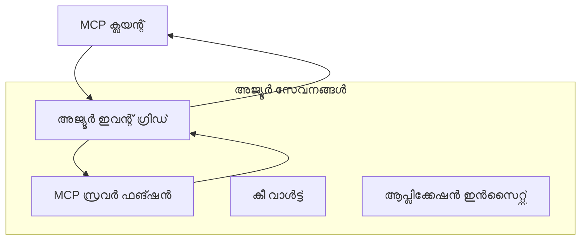
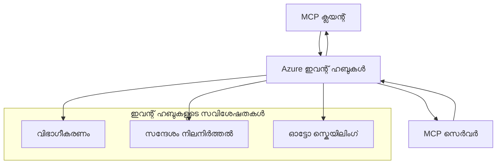

# MCP കസ്റ്റം ട്രാൻസ്പോർട്ടുകൾ - പുരോഗമനമുള്ള നടപ്പാക്കൽ ഗൈഡ്

മോഡൽ കോൺടക്‌സ്റ്റ് പ്രോട്ടോക്കോൾ (MCP) വിദഗ്ധ പരിസരങ്ങൾക്കായി കസ്റ്റം ട്രാൻസ്പോർട്ട് നടപ്പാക്കലുകൾ അനുവദിക്കുന്നു.
ഈ പുരോഗമനഗൈഡ് ആഴുറേ ഇവന്റ് ഗ്രിഡ്, ആഴുറേ ഇവന്റ് ഹബ്സ് എന്നിവയെ ആർക്കിടെക്ചർ പാറ്റേണുകളായി പരിശോധിക്കുന്നു.
ഇവ സാധാരണ MCP ട്രാൻസ്പോർട്ടുകൾ അല്ല
കൂടാതെ കസ്റ്റം മാപ്പിങിൽ രണ്ട് ഒടുക്കങ്ങളിൽ ഒരുമിച്ച് അംഗീകരണം ആവശ്യമുണ്ട്.

> **MCP `2026-07-28` പരിധി:** നിലവിലുള്ള പ്രോട്ടോക്കോൾ നിലവാരത്തിലുള്ള
> സെഷനുകൾ ഇല്ല, അതിനാൽ കസ്റ്റം ട്രാൻസ്പോർട്ടുകൾ സെഷൻ അഫിനിറ്റി അല്ലെങ്കിൽ
> പ്രതിസെഷൻ ക്രമീകരണത്തിൽ ആശ്രയിക്കരുത്. `Mcp-Method` ഒപ്പം നിബന്ധനയുള്ള `Mcp-Name` ഹെഡറുകൾ
> സാധാരണ സ്റ്റ്രീമബിൾ HTTP ട്രാൻസ്പോർട്ടിന്റെ ആവശ്യകതകൾ ആണ്; HTTP അല്ലാത്ത ട്രാൻസ്പോർട്ടിന്
> തുല്യമായ, വ്യക്തമായ അംഗീകരിച്ച മാപ്പിങ് വേണം, ഇന്റർമീഡിയറികൾ JSON-RPC ബോഡി ഡീകോഡ് ചെയ്യാതെ
> മറയിടാൻ വേണ്ടിയാണ്. കൂടെ കാണുക
> [MCP ൽ എന്താണ് മാറിയത്: 2026-07-28 സ്പെസിഫിക്കേഷൻ](../../01-CoreConcepts/mcp-2026-07-28.md).

## പരിചയം

MCP-യുടെ സാധാരണ ട്രാൻസ്പോർട്ടുകൾ stdio ഒപ്പം Streamable HTTP ആണ്. ചില എന്റർപ്രൈസ്
പരിസരങ്ങൾ നിലവിലെ മെസേജിംഗ് സൗകര്യങ്ങളുമായി സംയോജിപ്പിക്കാൻ കസ്റ്റം മാപ്പിംഗ് ഉപയോഗിക്കുന്നു,
പക്ഷേ അതുകൊണ്ട് MCP ഹോസ്റ്റുകളുമായി
ഒപ്പം മാത്രമേ സാധാരണ ട്രാൻസ്പോർട്ടുകൾ നടപ്പാക്കുന്ന SDK-കളുമായി നേരിയ ഇടപെടൽ കുറയാം.

ഈ പാഠം MCP സ്പെസിഫിക്കേഷൻ `2026-07-28` ന്റെ സ്റ്റേറ്റ്‌ലെസ് ആവശ്യകതകൾ
ആഴുറേ മെസേജിംഗ് സേവനങ്ങൾക്കും സ്ഥാപിത എന്റർപ്രൈസ് സംയോജിപ്പിക്കൽ
പാറ്റേണുകൾക്കും പ്രയോഗിക്കുന്നു.

### **MCP ട്രാൻസ്പോർട്ട് ആർക്കിടെക്ചർ**

**MCP സ്പെസിഫിക്കേഷൻ `2026-07-28` ൽ നിന്ന്:**

- **സ്റ്റാൻഡേർഡ് ട്രാൻസ്പോർട്ടുകൾ**: stdio, Streamable HTTP
- **കസ്റ്റം ട്രാൻസ്പോർട്ടുകൾ**: ঐച്ഛികം, നടപ്പാക്കലിനനുസരിച്ച്
    രണ്ട് ഒടുക്കവും അംഗീകരിച്ച മാപ്പിങ്ങുകൾ
- **മെസേജ് ഫോർമാറ്റ്**: JSON-RPC 2.0 MCP-സവിശേഷമായ വിപുലീകരണങ്ങളുമായി
- **സ്വയംപൂർണ്ണ അഭ്യർത്ഥനകൾ**: സ്റ്റേറ്റ് കൈകാര്യം ചെയ്യാൻ പ്രോട്ടോക്കോൾ സെഷൻ അല്ലെങ്കിൽ ഹാൻഡ്‌ഷേക്ക് ഇല്ല
    അഭ്യർത്ഥനകളിൽ ഇടക്കാലം സ്റ്റേറ്റ് കൈകാര്യം ചെയ്യേണ്ടതില്ല

## പഠന ലക്ഷ്യങ്ങൾ

ഈ പുരോഗമന പാഠം അവസാനിക്കുന്നതുവരെ, നിങ്ങൾക്ക് കഴിയുന്നതാണ്:

- **കസ്റ്റം ട്രാൻസ്പോർട്ട് ആവശ്യകതകൾ മനസിലാക്കുക**: MCP പ്രോട്ടോക്കോൾ ഏത് ട്രാൻസ്പോർട്ട് ലെയറിലും നടപ്പാക്കാം പതിവിന് അണിയിച്ചുകൂടി തുടരുക
- **ആഴുറേ ഇവന്റ് ഗ്രിഡ് ട്രാൻസ്പോർട്ട് നിർമ്മിക്കുക**: സർവർലെസ് സ്കെയിലിബിലിറ്റിക്കായി ആഴുറേ ഇവന്റ് ഗ്രിഡ് ഉപയോഗിച്ച് ഇവന്റ്ത്തൽ MCP സർവർ നിർമ്മിക്കുക
- **ആഴുറേ ഇവന്റ് ഹബ്സ് ട്രാൻസ്പോർട്ട് നടപ്പാക്കുക**: റിയൽ ടൈം സ്റ്റ്രീമിംഗിനായി ആഴുറേ ഇവന്റ് ഹബ്സ് ഉപയോഗിച്ചു ഉയർന്ന തരം MCP പരിഹാരങ്ങൾ രൂപകൽപ്പന ചെയ്യുക
- **എന്റർപ്രൈസ് പാറ്റേണുകൾ പ്രയോഗിക്കുക**: നിലവിലുള്ള ആഴുറേ അടിസ്ഥാനസൗകര്യങ്ങളുമായി കസ്റ്റം ട്രാൻസ്പോർട്ടുകൾ സംയോജിപ്പിക്കുക സുരക്ഷാ മാതൃകകൾ ഉൾപ്പെടെ
- **ട്രാൻസ്പോർട്ട് വിശ്വാസ്യത കൈകാര്യംചെയ്യുക**: മെസേജ് ദൃഢത, ക്രമീകരണം, പിഴവുകൾ കൈകാര്യം ചെയ്‌തുകൊണ്ട് എന്റർപ്രൈസ് കേസുകൾക്കായി നടപ്പാക്കുക
- **പ്രകടന പരമാവധി ഉപയോഗപ്പെടുത്തുക**: സ്കെയിൽ, വൈകല്യം, തരം ആവശ്യകതകൾക്കനുസരിച്ച് ട്രാൻസ്പോർട്ട് പരിഹാരങ്ങൾ രൂപകൽപ്പന ചെയ്യുക

## **ട്രാൻസ്പോർട്ട് ആവശ്യകതകൾ**

### **MCP `2026-07-28` ന്റെ കോർ ആവശ്യകതകൾ**

```yaml
Message Protocol:
  format: "JSON-RPC 2.0 with MCP extensions"
    correlation: "Match responses to requests by JSON-RPC id"
    state: "Each request must be self-contained"
  
Transport Layer:
  reliability: "Transport MUST handle connection failures gracefully"
  security: "Transport MUST support secure communication"
    identification: "Carry protocol version, capabilities, and identity per request"
  
Custom Transport:
    compliance: "Map the selected MCP revision without adding session assumptions"
  extensibility: "MAY add transport-specific features"
    interoperability: "Both endpoints MUST agree on the custom mapping"
```

## **ആഴുറേ ഇവന്റ് ഗ്രിഡ് ട്രാൻസ്പോർട്ട് നടപ്പാക്കൽ**

ആഴുറേ ഇവന്റ് ഗ്രിഡ് സർവറില്ലാത്ത ഇവന്റ് റൂട്ടിംഗ് സേവനമാണ്, ഇവന്റ്-ചാലിത MCP ആർക്കിടെക്ചറുകൾക്കായുള്ളത്. ഈ നടപ്പാക്കൽ സ്കെയിലബിൾ, കുറച്ചായി ബന്ധിപ്പിച്ച MCP സിസ്റ്റങ്ങൾ നിർമ്മിക്കുന്നത് കാണിക്കുന്നു.

### **ആർക്കിടെക്ചർ അവലോകനം**



### **C# നടപ്പാക്കൽ - ഇവന്റ് ഗ്രിഡ് ട്രാൻസ്പോർട്ട്**

```csharp
using Azure.Messaging.EventGrid;
using Microsoft.Extensions.Azure;
using System.Text.Json;

public class EventGridMcpTransport : IMcpTransport
{
    private readonly EventGridPublisherClient _publisher;
    private readonly string _topicEndpoint;
    private readonly string _clientId;
    
    public EventGridMcpTransport(string topicEndpoint, string accessKey, string clientId)
    {
        _publisher = new EventGridPublisherClient(
            new Uri(topicEndpoint), 
            new AzureKeyCredential(accessKey));
        _topicEndpoint = topicEndpoint;
        _clientId = clientId;
    }
    
    public async Task SendMessageAsync(McpMessage message)
    {
        var eventGridEvent = new EventGridEvent(
            subject: $"mcp/{_clientId}",
            eventType: "MCP.MessageReceived",
            dataVersion: "1.0",
            data: JsonSerializer.Serialize(message))
        {
            Id = Guid.NewGuid().ToString(),
            EventTime = DateTimeOffset.UtcNow
        };
        
        await _publisher.SendEventAsync(eventGridEvent);
    }
    
    public async Task<McpMessage> ReceiveMessageAsync(CancellationToken cancellationToken)
    {
        // Event Grid is push-based, so implement webhook receiver
        // This would typically be handled by Azure Functions trigger
        throw new NotImplementedException("Use EventGridTrigger in Azure Functions");
    }
}

// Azure Function for receiving Event Grid events
[FunctionName("McpEventGridReceiver")]
public async Task<IActionResult> HandleEventGridMessage(
    [EventGridTrigger] EventGridEvent eventGridEvent,
    ILogger log)
{
    try
    {
        var mcpMessage = JsonSerializer.Deserialize<McpMessage>(
            eventGridEvent.Data.ToString());
        
        // Process MCP message
        var response = await _mcpServer.ProcessMessageAsync(mcpMessage);
        
        // Send response back via Event Grid
        await _transport.SendMessageAsync(response);
        
        return new OkResult();
    }
    catch (Exception ex)
    {
        log.LogError(ex, "Error processing Event Grid MCP message");
        return new BadRequestResult();
    }
}
```

### **ടൈപ്പ്‌സ്‌ക്രിപ്റ്റ് നടപ്പാക്കൽ - ഇവന്റ് ഗ്രിഡ് ട്രാൻസ്പോർട്ട്**

```typescript
import { EventGridPublisherClient, AzureKeyCredential } from "@azure/eventgrid";
import { McpTransport, McpMessage } from "./mcp-types";

export class EventGridMcpTransport implements McpTransport {
    private publisher: EventGridPublisherClient;
    private clientId: string;
    
    constructor(
        private topicEndpoint: string,
        private accessKey: string,
        clientId: string
    ) {
        this.publisher = new EventGridPublisherClient(
            topicEndpoint,
            new AzureKeyCredential(accessKey)
        );
        this.clientId = clientId;
    }
    
    async sendMessage(message: McpMessage): Promise<void> {
        const event = {
            id: crypto.randomUUID(),
            source: `mcp-client-${this.clientId}`,
            type: "MCP.MessageReceived",
            time: new Date(),
            data: message
        };
        
        await this.publisher.sendEvents([event]);
    }
    
    // ഈവൻറ് ഡ്രിവൺ സ്വീകരണം ആയാസൂർ ഫംഗ്ഷനുകൾ മുഖേന
    onMessage(handler: (message: McpMessage) => Promise<void>): void {
        // നടപ്പാക്കൽ ആയാസൂർ ഫംഗ്ഷനുകളുടെ ഈവൻറ് ഗ്രിഡ് ട്രിഗ്ഗർ ഉപയോഗിക്കും
        // ഇത് വെബ്‌ഹുക്ക് സ്വീകരണത്തിനുള്ള ആശയപരമായ ഇൻ്റർഫെയ്സ് ആണ്
    }
}

// ആയാസൂർ ഫംഗ്ഷൻസ് നടപ്പാക്കൽ
import { app, InvocationContext, EventGridEvent } from "@azure/functions";

app.eventGrid("mcpEventGridHandler", {
    handler: async (event: EventGridEvent, context: InvocationContext) => {
        try {
            const mcpMessage = event.data as McpMessage;
            
            // MCP സന്ദേശം പ്രോസസ് ചെയ്യുക
            const response = await mcpServer.processMessage(mcpMessage);
            
            // ഇൂവൻറ് ഗ്രിഡ് വഴി പ്രതികരണം അയയ്ക്കുക
            await transport.sendMessage(response);
            
        } catch (error) {
            context.error("Error processing MCP message:", error);
            throw error;
        }
    }
});
```

### **പൈത്തൺ നടപ്പാക്കൽ - ഇവന്റ് ഗ്രിഡ് ട്രാൻസ്പോർട്ട്**

```python
from azure.eventgrid import EventGridPublisherClient, EventGridEvent
from azure.core.credentials import AzureKeyCredential
import asyncio
import json
from typing import Callable, Optional
import uuid
from datetime import datetime

class EventGridMcpTransport:
    def __init__(self, topic_endpoint: str, access_key: str, client_id: str):
        self.client = EventGridPublisherClient(
            topic_endpoint, 
            AzureKeyCredential(access_key)
        )
        self.client_id = client_id
        self.message_handler: Optional[Callable] = None
    
    async def send_message(self, message: dict) -> None:
        """Send MCP message via Event Grid"""
        event = EventGridEvent(
            data=message,
            subject=f"mcp/{self.client_id}",
            event_type="MCP.MessageReceived",
            data_version="1.0"
        )
        
        await self.client.send(event)
    
    def on_message(self, handler: Callable[[dict], None]) -> None:
        """Register message handler for incoming events"""
        self.message_handler = handler

# Azure Functions ആണ് രചന
import azure.functions as func
import logging

def main(event: func.EventGridEvent) -> None:
    """Azure Functions Event Grid trigger for MCP messages"""
    try:
        # Event Grid ഇവന്റിൽ നിന്നും MCP സന്ദേശം പരിശോധിക്കുക
        mcp_message = json.loads(event.get_body().decode('utf-8'))
        
        # MCP സന്ദേശം പ്രോസസ് ചെയ്യുക
        response = process_mcp_message(mcp_message)
        
        # Event Grid മുഖേന പ്രതികരണം അയയ്ക്കുക
        # (രചന ന്യൂ ഇവന്റ് ഗ്രിഡ് ക്ലയന്റ് സൃഷ്ടിക്കും)
        
    except Exception as e:
        logging.error(f"Error processing MCP Event Grid message: {e}")
        raise
```

## **ആഴുറേ ഇവന്റ് ഹബ്സ് ട്രാൻസ്പോർട്ട് നടപ്പാക്കൽ**

ആഴുറേ ഇവന്റ് ഹബ്സ് ഉയർന്ന തരം, റിയൽ ടൈം സ്റ്റ്രീമിംഗ് കഴിവുകൾ MCP കേസുകൾക്കായി നൽകുന്നു, വളരെ ചെറുതായ നിലവാരമായി കുറച്ച് വൈകല്യമുള്ള mesaage വോല്യവും ആവശ്യമാണ്.

### **ആർക്കിടെക്ചർ അവലോകനം**




### **C# ഇംപ്ലിമെന്റേഷൻ - ഇവന്റ് ഹബ്സ് ട്രാൻസ്‌പോർട്ട്**

```csharp
using Azure.Messaging.EventHubs;
using Azure.Messaging.EventHubs.Producer;
using Azure.Messaging.EventHubs.Consumer;
using System.Text;

public class EventHubsMcpTransport : IMcpTransport, IDisposable
{
    private readonly EventHubProducerClient _producer;
    private readonly EventHubConsumerClient _consumer;
    private readonly string _consumerGroup;
    private readonly CancellationTokenSource _cancellationTokenSource;
    
    public EventHubsMcpTransport(
        string connectionString, 
        string eventHubName,
        string consumerGroup = "$Default")
    {
        _producer = new EventHubProducerClient(connectionString, eventHubName);
        _consumer = new EventHubConsumerClient(
            consumerGroup, 
            connectionString, 
            eventHubName);
        _consumerGroup = consumerGroup;
        _cancellationTokenSource = new CancellationTokenSource();
    }
    
    public async Task SendMessageAsync(McpMessage message)
    {
        var messageBody = JsonSerializer.Serialize(message);
        var eventData = new EventData(Encoding.UTF8.GetBytes(messageBody));
        
        // Add MCP-specific properties
        eventData.Properties.Add("MessageType", message.Method ?? "response");
        eventData.Properties.Add("MessageId", message.Id);
        eventData.Properties.Add("Timestamp", DateTimeOffset.UtcNow);
        
        await _producer.SendAsync(new[] { eventData });
    }
    
    public async Task StartReceivingAsync(
        Func<McpMessage, Task> messageHandler)
    {
        await foreach (PartitionEvent partitionEvent in _consumer.ReadEventsAsync(
            _cancellationTokenSource.Token))
        {
            try
            {
                var messageBody = Encoding.UTF8.GetString(
                    partitionEvent.Data.EventBody.ToArray());
                var mcpMessage = JsonSerializer.Deserialize<McpMessage>(messageBody);
                
                await messageHandler(mcpMessage);
            }
            catch (Exception ex)
            {
                // Handle deserialization or processing errors
                Console.WriteLine($"Error processing message: {ex.Message}");
            }
        }
    }
    
    public void Dispose()
    {
        _cancellationTokenSource?.Cancel();
        _producer?.DisposeAsync().AsTask().Wait();
        _consumer?.DisposeAsync().AsTask().Wait();
        _cancellationTokenSource?.Dispose();
    }
}
```

### **TypeScript ഇംപ്ലിമെന്റേഷൻ - ഇവന്റ് ഹബ്സ് ട്രാൻസ്‌പോർട്ട്**

```typescript
import { 
    EventHubProducerClient, 
    EventHubConsumerClient, 
    EventData 
} from "@azure/event-hubs";

export class EventHubsMcpTransport implements McpTransport {
    private producer: EventHubProducerClient;
    private consumer: EventHubConsumerClient;
    private isReceiving = false;
    
    constructor(
        private connectionString: string,
        private eventHubName: string,
        private consumerGroup: string = "$Default"
    ) {
        this.producer = new EventHubProducerClient(
            connectionString, 
            eventHubName
        );
        this.consumer = new EventHubConsumerClient(
            consumerGroup,
            connectionString,
            eventHubName
        );
    }
    
    async sendMessage(message: McpMessage): Promise<void> {
        const eventData: EventData = {
            body: JSON.stringify(message),
            properties: {
                messageType: message.method || "response",
                messageId: message.id,
                timestamp: new Date().toISOString()
            }
        };
        
        await this.producer.sendBatch([eventData]);
    }
    
    async startReceiving(
        messageHandler: (message: McpMessage) => Promise<void>
    ): Promise<void> {
        if (this.isReceiving) return;
        
        this.isReceiving = true;
        
        const subscription = this.consumer.subscribe({
            processEvents: async (events, context) => {
                for (const event of events) {
                    try {
                        const messageBody = event.body as string;
                        const mcpMessage: McpMessage = JSON.parse(messageBody);
                        
                        await messageHandler(mcpMessage);
                        
                        // കുറഞ്ഞത് ഒരിക്കല്‍ ഡെലിവരിക്ക് ചെക്‌പോയിന്റ് അപ്‌ഡേറ്റ് ചെയ്യുക
                        await context.updateCheckpoint(event);
                    } catch (error) {
                        console.error("Error processing Event Hubs message:", error);
                    }
                }
            },
            processError: async (err, context) => {
                console.error("Event Hubs error:", err);
            }
        });
    }
    
    async close(): Promise<void> {
        this.isReceiving = false;
        await this.producer.close();
        await this.consumer.close();
    }
}
```

### **Python ഇംപ്ലിമെന്റേഷൻ - ഇവന്റ് ഹബ്സ് ട്രാൻസ്‌പോർട്ട്**

```python
from azure.eventhub import EventHubProducerClient, EventHubConsumerClient
from azure.eventhub import EventData
import json
import asyncio
from typing import Callable, Dict, Any
import logging

class EventHubsMcpTransport:
    def __init__(
        self, 
        connection_string: str, 
        eventhub_name: str,
        consumer_group: str = "$Default"
    ):
        self.producer = EventHubProducerClient.from_connection_string(
            connection_string, 
            eventhub_name=eventhub_name
        )
        self.consumer = EventHubConsumerClient.from_connection_string(
            connection_string,
            consumer_group=consumer_group,
            eventhub_name=eventhub_name
        )
        self.is_receiving = False
    
    async def send_message(self, message: Dict[str, Any]) -> None:
        """Send MCP message via Event Hubs"""
        event_data = EventData(json.dumps(message))
        
        # MCP-സ്വഭാവമുള്ള ഗുണഗുണങ്ങൾ ചേർക്കുക
        event_data.properties = {
            "messageType": message.get("method", "response"),
            "messageId": message.get("id"),
            "timestamp": "2025-01-14T10:30:00Z"  # യഥാർത്ഥ ടൈംസ്റ്റാമ്പ് ഉപയോഗിക്കുക
        }
        
        async with self.producer:
            event_data_batch = await self.producer.create_batch()
            event_data_batch.add(event_data)
            await self.producer.send_batch(event_data_batch)
    
    async def start_receiving(
        self, 
        message_handler: Callable[[Dict[str, Any]], None]
    ) -> None:
        """Start receiving MCP messages from Event Hubs"""
        if self.is_receiving:
            return
        
        self.is_receiving = True
        
        async with self.consumer:
            await self.consumer.receive(
                on_event=self._on_event_received(message_handler),
                starting_position="-1"  # തുടക്കം മുതൽ ആരംഭിക്കുക
            )
    
    def _on_event_received(self, handler: Callable):
        """Internal event handler wrapper"""
        async def handle_event(partition_context, event):
            try:
                # ഇവന്റ് ഹബ്സിലെ ഇവന്റിൽ നിന്ന് MCP സന്ദേശം പാഴ്‌സ് ചെയ്യുക
                message_body = event.body_as_str(encoding='UTF-8')
                mcp_message = json.loads(message_body)
                
                # MCP സന്ദേശം പ്രോസസ്സ് ചെയ്യുക
                await handler(mcp_message)
                
                # കുറഞ്ഞത് ഒരിക്കൽ വിതരണം ഉറപ്പാക്കാൻ ചെക്‌പോയിന്റ് അപ്ഡേറ്റ് ചെയ്യുക
                await partition_context.update_checkpoint(event)
                
            except Exception as e:
                logging.error(f"Error processing Event Hubs message: {e}")
        
        return handle_event
    
    async def close(self) -> None:
        """Clean up transport resources"""
        self.is_receiving = False
        await self.producer.close()
        await self.consumer.close()
```

## **അഡ്വാൻസ്ഡ് ട്രാൻസ്‌പോർട്ട് പാറ്റേൺസ്**

### **സന്ദേശം ദൃഢതയും വിശ്വസനീയതയും**

```csharp
// Implementing message durability with retry logic
public class ReliableTransportWrapper : IMcpTransport
{
    private readonly IMcpTransport _innerTransport;
    private readonly RetryPolicy _retryPolicy;
    
    public async Task SendMessageAsync(McpMessage message)
    {
        await _retryPolicy.ExecuteAsync(async () =>
        {
            try
            {
                await _innerTransport.SendMessageAsync(message);
            }
            catch (TransportException ex) when (ex.IsRetryable)
            {
                // Log and retry
                throw;
            }
        });
    }
}
```

### **ട്രാൻസ്പോർട്ട് സുർക്ഷിത സംയോജനം**

```csharp
// Integrating Azure Key Vault for transport security
public class SecureTransportFactory
{
    private readonly SecretClient _keyVaultClient;
    
    public async Task<IMcpTransport> CreateEventGridTransportAsync()
    {
        var accessKey = await _keyVaultClient.GetSecretAsync("EventGridAccessKey");
        var topicEndpoint = await _keyVaultClient.GetSecretAsync("EventGridTopic");
        
        return new EventGridMcpTransport(
            topicEndpoint.Value.Value,
            accessKey.Value.Value,
            Environment.MachineName
        );
    }
}
```

### **ട്രാൻസ്പോർട്ട് നിരീക്ഷണവും ദൃശ്യമാക്കലും**

```csharp
// Adding telemetry to custom transports
public class ObservableTransport : IMcpTransport
{
    private readonly IMcpTransport _transport;
    private readonly ILogger _logger;
    private readonly TelemetryClient _telemetryClient;
    
    public async Task SendMessageAsync(McpMessage message)
    {
        using var activity = Activity.StartActivity("MCP.Transport.Send");
        activity?.SetTag("transport.type", "EventGrid");
        activity?.SetTag("message.method", message.Method);
        
        var stopwatch = Stopwatch.StartNew();
        
        try
        {
            await _transport.SendMessageAsync(message);
            
            _telemetryClient.TrackDependency(
                "EventGrid",
                "SendMessage",
                DateTime.UtcNow.Subtract(stopwatch.Elapsed),
                stopwatch.Elapsed,
                true
            );
        }
        catch (Exception ex)
        {
            _telemetryClient.TrackException(ex);
            throw;
        }
    }
}
```

## **എന്റർപ്രൈസ് ഇന്റഗ്രേഷൻ സിനാരിയോകൾ**

### **സിനാരി 1: വിതരിച്ച MCP പ്രോസസിംഗ്**

MCP അഭ്യർത്ഥനകളെ പല പ്രോസസ്സ് നോട്ടുകളിലായി വിതരണം ചെയ്യുന്നതിന് Azure Event Grid ഉപയോഗിക്കുന്നു:

```yaml
Architecture:
  - MCP Client sends requests to Event Grid topic
  - Multiple Azure Functions subscribe to process different tool types
  - Results aggregated and returned via separate response topic
  
Benefits:
  - Horizontal scaling based on message volume
  - Fault tolerance through redundant processors
  - Cost optimization with serverless compute
```

### **സിനാരി 2: റിയൽ-ടൈം MCP സ്ട്രീമിംഗ്**

ഉയർന്ന തീവ്രതയുള്ള MCP ഇടപെടലുകൾക്കായി Azure Event Hubs ഉപയോഗിക്കുന്നു:

```yaml
Architecture:
  - MCP Client streams continuous requests via Event Hubs
  - Stream Analytics processes and routes messages
  - Multiple consumers handle different aspect of processing
  
Benefits:
  - Low latency for real-time scenarios
  - High throughput for batch processing
  - Built-in partitioning for parallel processing
```

### **സിനാരി 3: ഹൈബ്രിഡ് ട്രാൻസ്പോർട്ട് ആർക്കിടെക്ചർ**

വ്യത്യസ്ത ഉപയോഗത്തിനായി പല ട്രാൻസ്പോർട്ടുകളും സംയോജിപ്പിക്കുന്നു:

```csharp
public class HybridMcpTransport : IMcpTransport
{
    private readonly IMcpTransport _realtimeTransport; // Event Hubs
    private readonly IMcpTransport _batchTransport;    // Event Grid
    private readonly IMcpTransport _fallbackTransport; // HTTP Streaming
    
    public async Task SendMessageAsync(McpMessage message)
    {
        // Route based on message characteristics
        var transport = message.Method switch
        {
            "tools/call" when IsRealtime(message) => _realtimeTransport,
            "resources/read" when IsBatch(message) => _batchTransport,
            _ => _fallbackTransport
        };
        
        await transport.SendMessageAsync(message);
    }
}
```

## **പ്രദ്യോോഗികക്ഷമത മെച്ചപ്പെടുത്തൽ**

### **ഇവന്റ് ഗ്രിഡ് സന്ദേശ ബാച്ചിംഗ്**

```csharp
public class BatchingEventGridTransport : IMcpTransport
{
    private readonly List<McpMessage> _messageBuffer = new();
    private readonly Timer _flushTimer;
    private const int MaxBatchSize = 100;
    
    public async Task SendMessageAsync(McpMessage message)
    {
        lock (_messageBuffer)
        {
            _messageBuffer.Add(message);
            
            if (_messageBuffer.Count >= MaxBatchSize)
            {
                _ = Task.Run(FlushMessages);
            }
        }
    }
    
    private async Task FlushMessages()
    {
        List<McpMessage> toSend;
        lock (_messageBuffer)
        {
            toSend = new List<McpMessage>(_messageBuffer);
            _messageBuffer.Clear();
        }
        
        if (toSend.Any())
        {
            var events = toSend.Select(CreateEventGridEvent);
            await _publisher.SendEventsAsync(events);
        }
    }
}
```

### **ഇവന്റ് ഹബ്സ് പാർട്ടീഷനിംഗ് സംവിധാനം**

```csharp
public class PartitionedEventHubsTransport : IMcpTransport
{
    public async Task SendMessageAsync(McpMessage message)
    {
        // Partition by client ID for session affinity
        var partitionKey = ExtractClientId(message);
        
        var eventData = new EventData(JsonSerializer.SerializeToUtf8Bytes(message))
        {
            PartitionKey = partitionKey
        };
        
        await _producer.SendAsync(new[] { eventData });
    }
}
```

## **കസ്റ്റം ട്രാൻസ്പോർട്ടുകൾ ടെസ്റ്റിംഗ്എ**

### **ടെസ്റ്റ് ഡബിൾസുമായി യൂണിറ്റ് ടെസ്റ്റിംഗ്**

```csharp
[Test]
public async Task EventGridTransport_SendMessage_PublishesCorrectEvent()
{
    // Arrange
    var mockPublisher = new Mock<EventGridPublisherClient>();
    var transport = new EventGridMcpTransport(mockPublisher.Object);
    var message = new McpMessage { Method = "tools/list", Id = "test-123" };
    
    // Act
    await transport.SendMessageAsync(message);
    
    // Assert
    mockPublisher.Verify(
        x => x.SendEventAsync(
            It.Is<EventGridEvent>(e => 
                e.EventType == "MCP.MessageReceived" &&
                e.Subject == "mcp/test-client"
            )
        ),
        Times.Once
    );
}
```

### **Azure ടെസ്റ്റ് കണ്ടെയ്‌നറുകളുമായി ഇന്റഗ്രേഷൻ ടെസ്റ്റിംഗ്**

```csharp
[Test]
public async Task EventHubsTransport_IntegrationTest()
{
    // Using Testcontainers for integration testing
    var eventHubsContainer = new EventHubsContainer()
        .WithEventHub("test-hub");
    
    await eventHubsContainer.StartAsync();
    
    var transport = new EventHubsMcpTransport(
        eventHubsContainer.GetConnectionString(),
        "test-hub"
    );
    
    // Test message round-trip
    var sentMessage = new McpMessage { Method = "test", Id = "123" };
    McpMessage receivedMessage = null;
    
    await transport.StartReceivingAsync(msg => {
        receivedMessage = msg;
        return Task.CompletedTask;
    });
    
    await transport.SendMessageAsync(sentMessage);
    await Task.Delay(1000); // Allow for message processing
    
    Assert.That(receivedMessage?.Id, Is.EqualTo("123"));
}
```

## **മികച്ച പ്രവർത്തന രീതികളും മാർഗ്ഗനിർദ്ദേശങ്ങളും**

### **ട്രാൻസ്പോർട്ട് ഡിസൈൻ സിദ്ധാന്തങ്ങൾ**

1. **ഇഡെംപോട്ടൻസി**: പുനരാവൃതികൾ കൈകാര്യം ചെയ്യാൻ സന്ദേശ പ്രോസസ്സിംഗ് ഇഡെംപോട്ടൻ്റാക്കുക
2. **പിശക് കൈകാര്യംചെയ്യൽ**: സമഗ്രമായ പിശക് കൈകാര്യംചെയ്യലും ഡെഡ് ലെറ്റർ ക്യൂസും നിറവേറ്റുക
3. **നിരീക്ഷണം**: വിശദമായ ടെലിമെട്രിയും ഹെൽത്ത് ചെക്കുകളും ചേർക്കുക
4. **സുരക്ഷ**: മാനേജ്ഡ് ഐഡന്റിറ്റികളെയും ലിസ്റ്റ് പ്രിവിലേജ് ആക്സസും ഉപയോഗിക്കുക
5. **പ്രകടനക്ഷമത**: നിങ്ങളുടെ നിർദ്ദിഷ്ട ലേറ്റൻസി, ത്രൂപുട്ട് ആവശ്യങ്ങൾക്കായി രൂപകൽപ്പന ചെയ്‌തുക

### **Azure-വിശിഷ്ട ശുപാർശകൾ**

1. **മാനേജ്ഡ് ഐഡന്റിറ്റി ഉപയോഗിക്കുക**: പ്രൊഡക്ഷനിൽ കണക്ഷൻ സ്ട്രിങുകൾ ഒഴിവാക്കുക
2. **സര്‍ക്ക്യൂട്ട് ബ്രേക്കറുകൾ നടപ്പിലാക്കുക**: Azure സേവന തകരാറുകളിൽ നിന്നും സംരക്ഷണം
3. **ച്ചെലവുകൾ നിരീക്ഷിക്കുക**: സന്ദേശ വോളിയവും പ്രോസസ്സിംഗ് ചെലവുകളും ട്രാക്ക് ചെയ്യുക
4. **സ്കെയിലിനായി പദ്ധതിയിടുക**: തുടക്കത്തിൽ പാർട്ടീഷനിംഗ്, സ്കെയിൽ ഉൽപ്പാദന തന്ത്രങ്ങൾ രൂപകൽപ്പന ചെയ്യുക
5. **പരിശോധനകൾ ജാഗ്രതയോടെ നടത്തുക**: അതീവ സമഗ്രമായ ടെസ്റ്റിംഗിനായി Azure DevTest Labs ഉപയോഗിക്കുക

## **തീരുമാനം**

കസ്റ്റം MCP ട്രാൻസ്പോർട്ടുകൾ Azure-യുടെ സന്ദേശ സേവനങ്ങൾ ഉപയോഗിച്ച് ശക്തമായ എന്റർപ്രൈസ് സിനാരിയോകൾക്ക് കഴിവുനൽകുന്നു. ഇവന്റ് ഗ്രിഡ് അല്ലെങ്കിൽ ഇവന്റ് ഹബ്സ് ട്രാൻസ്പോർട്ടുകൾ നടപ്പിലാക്കി നിങ്ങൾ സ്കെയിലബിൾ, വിശ്വസനീയ MCP പരിഹാരങ്ങൾ കമ്പിയാകും, നിലവിലുള്ള Azure സദുഷ്ട്രക്ചറിനോടൊപ്പം സ്മൂത്ത് ഇൻറഗ്രേറ്റു ചെയ്യുകയും ചെയ്യും.

നൽകിയ ഉദാഹരണങ്ങൾ MCP പ്രോട്ടോകോൾ അനുസരണവും Azure മികച്ച പ്രവർത്തനരീതികളും പാലിക്കുകയും ചെയ്യുന്ന പ്രൊഡക്ഷൻ-റെഡിയായി കസ്റ്റം ട്രാൻസ്പോർട്ടുകൾ നടപ്പിലാക്കാനുള്ള പാറ്റേണുകൾ പ്രദർശിപ്പിക്കുന്നു.

## **കൂടുതൽ വിഭവങ്ങൾ**

- [MCP Specification 2026-07-28](https://modelcontextprotocol.io/specification/2026-07-28/)
- [Azure Event Grid Documentation](https://docs.microsoft.com/azure/event-grid/)
- [Azure Event Hubs Documentation](https://docs.microsoft.com/azure/event-hubs/)
- [Azure Functions Event Grid Trigger](https://docs.microsoft.com/azure/azure-functions/functions-bindings-event-grid)
- [Azure SDK for .NET](https://github.com/Azure/azure-sdk-for-net)
- [Azure SDK for TypeScript](https://github.com/Azure/azure-sdk-for-js)
- [Azure SDK for Python](https://github.com/Azure/azure-sdk-for-python)

---

> *ഈ ഗൈഡ് കസ്റ്റം ആർക്കിടെക്ചർ പാറ്റേണുകളിലെ ശ്രദ്ധ കേന്ദ്രീകരിക്കുന്നു. പ്രോട്ടോകോൾ സാധൂകരിക്കുക

> [MCP Specification 2026-07-28](https://modelcontextprotocol.io/specification/2026-07-28/) ന്റെ വിരുദ്ധമായ പെരുമാറ്റം,
> നിങ്ങളുടെ ആവശ്യങ്ങള്‍ക്കും സേവനപരിധികള്‍ക്കും എതിരായി ആസ്യൂര് ഉപയോഗം ശരിയാണോ എന്ന് സ്ഥിരീകരിക്കുക.*


## അടുത്തത് എന്താണ്
- [6. കമ്മ്യൂണിറ്റി സംഭാവനകൾ](../../06-CommunityContributions/README.md)

---

<!-- CO-OP TRANSLATOR DISCLAIMER START -->
**അറിയിപ്പ്**:
ഈ രേഖ AI പരിഭാഷാ സേവനം [Co-op Translator](https://github.com/Azure/co-op-translator) ഉപയോഗിച്ച് പരിഭാഷപ്പെടുത്തിയതാണ്. ഞങ്ങൾ കൃത്യതയ്ക്കായി ശ്രമിക്കുന്നുവെങ്കിലും, ഓട്ടോമേറ്റഡ് പരിഭാഷകളിൽ പിഴവുകൾ അല്ലെങ്കിൽ തെറ്റായ വിവരങ്ങൾ ഉണ്ടാകാൻ സാധ്യതയുണ്ട്. അതിന്റെ സ്വാഭാവിക ഭാഷയിലുള്ള അസൽ രേഖയാണ് പ്രാമാണികമായ ഉറവിടമായി പരിഗണിക്കേണ്ടത്. നിർണായകമായ വിവരങ്ങൾക്ക്, പ്രൊഫഷണൽ മനുഷ്യ പരിഭാഷ ശുപാർശ ചെയ്യുന്നു. ഈ പരിഭാഷ ഉപയോഗിച്ച് ഉണ്ടാകുന്ന തെറ്റിദ്ധാരണകൾ അല്ലെങ്കിൽ തെറ്റായ വ്യാഖ്യാനങ്ങൾക്കായി ഞങ്ങൾ ഉത്തരവാദികളല്ല.
<!-- CO-OP TRANSLATOR DISCLAIMER END -->