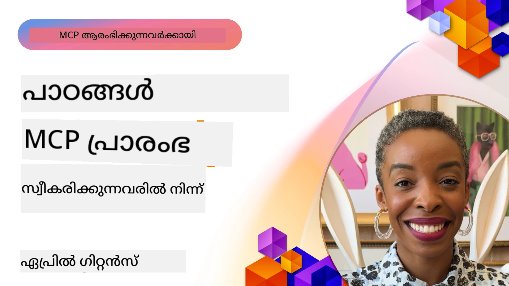

# 🌟 ആദ്യ സ്വീകരകരിൽ നിന്ന് പാഠങ്ങൾ

[](https://youtu.be/jds7dSmNptE)

_(ഈ പാഠത്തിന്റെ വീഡിയോ കാണാൻ മുകളിലുള്ള ചിത്രം ക്ലിക്ക് ചെയ്യുക)_

## 🎯 ഈ മോഡ്യൂൾ എന്ത് ഉൾക്കൊള്ളുന്നു

ഈ മോഡ്യൂൾ പ്രത്യക്ഷ സ്ഥാപനങ്ങളും ഡെവലപ്പർമാരും മോഡൽ കോൺടെക്സ്റ്റ് പ്രോട്ടോക്കോൾ (MCP) ഉപയോഗിച്ച് യഥാർത്ഥ പ്രശ്‌നങ്ങളെ എങ്ങനെ പരിഹരിച്ചും നവീകരണം എങ്ങനെ പുരോഗമിപ്പിച്ചും എന്നതിനെ കുറിച്ച് അന്വേഷിക്കുന്നു. വിശദമായ കേസ്സ് സ്റ്റഡികൾ, പ്രായോഗിക പദ്ധതികൾ, പ്രായോഗിക ഉദാഹരണങ്ങൾ എന്നിവയിലൂടെ MCP വലിയ ഭാഷാ മോഡലുകൾ, ഉപകരണങ്ങൾ, കോർപ്പറേറ്റ് ഡാറ്റ എന്നിവ സംയോജിപ്പിക്കുന്ന സുരക്ഷിതവും മാപനയോഗ്യവുമായ AI സംയോജനത്തിന് സഹായിക്കുന്നതെങ്ങനെ എന്ന് കണ്ടെത്തും.

### 📚 MCP പ്രവർത്തനത്തിൽ കാണുക

ഈ സിദ്ധാന്തങ്ങൾ ഉൽപ്പന്ന-സജ്ജമായ ഉപകരണങ്ങളിൽ കാണാനാണോ ആഗ്രഹം? ഇന്ന് ഉപയോഗിക്കാൻ കഴിയുന്ന യഥാർത്ഥ മൈക്രോസോഫ്റ്റ് MCP സർവറുകൾ കാണിച്ച് തരുന്ന ഞങ്ങളുടെ [**10 Microsoft MCP Servers That Are Transforming Developer Productivity**](microsoft-mcp-servers.md) പരിശോധിക്കുക.

## അവലോകനം

ഈ പാഠം ആദ്യ സ്വീകരകർ മോഡൽ കോൺടെക്സ്റ്റ് പ്രോട്ടോക്കോൾ (MCP) എങ്ങനെ വ്യാവസായിക വെല്ലുവിളികൾ പരിഹരിക്കുകയും വ്യവസായങ്ങളിലെ നവീകരണത്തെ പ്രോത്സാഹിപ്പിക്കുകയും ചെയ്തുവെന്നത് അന്വേഷിക്കുന്നു. വിശദമായ കേസ് സ്റ്റഡികളും പ്രായോഗിക പദ്ധതികളും വഴി MCP എങ്ങനെ ഏകരൂപ, സുരക്ഷിത, മാപനയോഗ്യ AI സംയോജനത്തിന് അനുമതിയുണ്ടാക്കുന്നു — വലിയ ഭാഷാ മോഡലുകൾ, ഉപകരണങ്ങൾ, കോർപ്പറേറ്റ് ഡാറ്റ എന്നിവ ഏകോപിപ്പിക്കുന്ന സംയുക്ത ഫ്രെയിമ്വർക്കിൽ. MCP അടിസ്ഥാനമാക്കി സങ്കേതങ്ങൾ രൂപകൽപ്പന ചെയ്ത് നിർമിക്കുന്നതിൽ പ്രായോഗിക പരിചയം നേടും, തെളിവുള്ള നടപ്പാക്കൽ മാതൃകകളിൽ നിന്ന് പഠിക്കും, MCP ഉൽപ്പന്ന പരിസരങ്ങളിൽ വിന്യസിപ്പിക്കുന്നതിന് മികച്ച നടപടികൾ കണ്ടെത്തും. MCP സാങ്കേതികവിദ്യയുടെ വളർച്ചയിലും വികസന രംഗത്തും ഉന്മു്ഥുവരുന്ന പ്രവണതകളും, ഭാവി ദിശകളും, തുറന്ന സ്രോതസ്സ് വിഭവങ്ങളും ഈ പാഠം പ്രതിപാദിക്കുന്നു.

## പഠന ലക്ഷ്യങ്ങൾ

- വ്യത്യസ്ത വ്യവസായങ്ങളിലെ യഥാർത്ഥ MCP നടപ്പാക്കലുകൾ വിശകലനം ചെയ്യുക
- MCP അടിസ്ഥാനമാക്കിയുള്ള പൂര്‍ണമായ ആപ്ലിക്കേഷനുകൾ രൂപകൽപ്പന ചെയ്ത് നിർമ്മിക്കുക
- MCP സാങ്കേതികവിദ്യയിലെ പുതിയ പ്രവണതകളും ഭാവി ദിശകളും പരിശോധിക്കുക
- യഥാർത്ഥ വികസന സാഹചര്യങ്ങളിൽ മികച്ച രീതികൾ പ്രയോഗിക്കുക

## യഥാർത്ഥ MCP നടപ്പാക്കലുകൾ

### കേസ് സ്റ്റഡി 1: എന്റർപ്രൈസ് കസ്റ്റമർ സപ്പോർട്ട് ഓട്ടോമേഷൻ

ഒരു ബഹുരാഷ്ട്ര సంస్థ MCP അടിസ്ഥാനമാക്കിയുള്ള പരിഹാരമുപയോഗിച്ച് അവരുടെ കസ്റ്റമർ സപ്പോർട്ട് സംവിധാനങ്ങളിലെ AI ഇടപെടലുകൾ ഏകരൂപമാക്കി. ഇങ്ങനെ അവർക്ക് സാധിച്ചു:

- നിരവധി LLM പ്രൊവൈഡർമാർക്ക് ഏകീകൃത ഇന്റർഫേസ് സൃഷ്‌ടിക്കുക
- വകുപ്പുകൾക്ക് ഇടയിലുള്ള സമാന പ്രോംപ്റ്റ് മാനേജ്‌മെന്റ് പാലിക്കുക
- ശക്തമായ സുരക്ഷാ, അനുയോജ്യത നിയന്ത്രണങ്ങൾ നടപ്പിലാക്കുക
- പ്രത്യേക ആവശ്യങ്ങൾക്കനുസരിച്ച് വ്യത്യസ്ത AI മോഡലുകൾ എളുപ്പത്തിൽ മാറുക

**സാങ്കേതിക നടപ്പാക്കൽ:**

```python
# ഉപഭോക്തൃ സഹായത്തിനുള്ള Python MCP സർവർ പ്രവർത്തനക്ഷമമാക്കൽ
import logging
import asyncio
from modelcontextprotocol import create_server, ServerConfig
from modelcontextprotocol.server import MCPServer
from modelcontextprotocol.transports import create_http_transport
from modelcontextprotocol.resources import ResourceDefinition
from modelcontextprotocol.prompts import PromptDefinition
from modelcontextprotocol.tool import ToolDefinition

# ലോഗിംഗ് ക്രമീകരിക്കുക
logging.basicConfig(level=logging.INFO)

async def main():
    # സർവർ കോൺഫിഗറേഷൻ സൃഷ്ടിക്കുക
    config = ServerConfig(
        name="Enterprise Customer Support Server",
        version="1.0.0",
        description="MCP server for handling customer support inquiries"
    )
    
    # MCP സർവർ ഇൻഷ്യലൈസ് ചെയ്യുക
    server = create_server(config)
    
    # വിജ്ഞാനശേഖര സ്രോതസ്സുകൾ രജിസ്റ്റർ ചെയ്യുക
    server.resources.register(
        ResourceDefinition(
            name="customer_kb",
            description="Customer knowledge base documentation"
        ),
        lambda params: get_customer_documentation(params)
    )
    
    # പ്രോമ്പ്റ്റ് ടെംപ്ലേറ്റുകൾ രജിസ്റ്റർ ചെയ്യുക
    server.prompts.register(
        PromptDefinition(
            name="support_template",
            description="Templates for customer support responses"
        ),
        lambda params: get_support_templates(params)
    )
    
    # പിന്തുണാ ഉപകരണങ്ങൾ രജിസ്റ്റർ ചെയ്യുക
    server.tools.register(
        ToolDefinition(
            name="ticketing",
            description="Create and update support tickets"
        ),
        handle_ticketing_operations
    )
    
    # HTTP ട്രാൻസ്‌പോർട്ടുമായി സർവർ ആരംഭിക്കുക
    transport = create_http_transport(port=8080)
    await server.run(transport)

if __name__ == "__main__":
    asyncio.run(main())
```

**ഫലങ്ങൾ:** മോഡൽ ചെലവുകളിൽ 30% കുറവ്, പ്രതികരണ സ്ഥിരതയിൽ 45% മെച്ചപ്പെടുത്തൽ, ആഗോൾ ഓപ്പറേഷനുകളിൽ ഉയർന്ന അനുയോജ്യത.

### കേസ് സ്റ്റഡി 2: ഹെൽത്ത്‌കെർ ഡയഗ്നോസ്റ്റിക്ക് അസിസ്റ്റന്റ്

ഒരു ഹെൽത്ത്‌കെയർ പ്രൊവൈഡർ ഒറ്റ MCP ഇൻഫ്രാസ്ട്രക്ചർ വികസിപ്പിച്ച് നിരവധി പ്രത്യേക വൈദ്യ AI മോഡലുകളെ സംയോജിപ്പിക്കുകയും രോഗികളുടെ കൂടുതൽ പ്രൈവസിയുള്ള ഡാറ്റ സംരക്ഷിക്കുകയും ചെയ്തു:

- ജനറലിസ്റ്റും സ്പെഷ്യലിസ്റ്റും ആയ മെഡിക്കൽ മോഡലുകൾക്ക് ലളിതമായ മാറൽ
- കർശന പ്രൈവസി നിയന്ത്രണങ്ങളും ഓഡിറ്റ് ട്രെയിലുകളും
- നിലവിലെ ഇലക്ട്രോണിക് ഹെൽത്ത് റെക്കോർഡ് (EHR) സംവിധാനങ്ങളുമായി സംയോജനം
- മെഡിക്കൽ ടെർമിനോളജിക്ക് ഏകസാധാരണ പ്രോംപ്റ്റ് എഞ്ചിനീയറിംഗ്

**സാങ്കേതിക നടപ്പാക്കൽ:**

```csharp
// C# MCP host application implementation in healthcare application
using Microsoft.Extensions.DependencyInjection;
using ModelContextProtocol.SDK.Client;
using ModelContextProtocol.SDK.Security;
using ModelContextProtocol.SDK.Resources;

public class DiagnosticAssistant
{
    private readonly MCPHostClient _mcpClient;
    private readonly PatientContext _patientContext;
    
    public DiagnosticAssistant(PatientContext patientContext)
    {
        _patientContext = patientContext;
        
        // Configure MCP client with healthcare-specific settings
        var clientOptions = new ClientOptions
        {
            Name = "Healthcare Diagnostic Assistant",
            Version = "1.0.0",
            Security = new SecurityOptions
            {
                Encryption = EncryptionLevel.Medical,
                AuditEnabled = true
            }
        };
        
        _mcpClient = new MCPHostClientBuilder()
            .WithOptions(clientOptions)
            .WithTransport(new HttpTransport("https://healthcare-mcp.example.org"))
            .WithAuthentication(new HIPAACompliantAuthProvider())
            .Build();
    }
    
    public async Task<DiagnosticSuggestion> GetDiagnosticAssistance(
        string symptoms, string patientHistory)
    {
        // Create request with appropriate resources and tool access
        var resourceRequest = new ResourceRequest
        {
            Name = "patient_records",
            Parameters = new Dictionary<string, object>
            {
                ["patientId"] = _patientContext.PatientId,
                ["requestingProvider"] = _patientContext.ProviderId
            }
        };
        
        // Request diagnostic assistance using appropriate prompt
        var response = await _mcpClient.SendPromptRequestAsync(
            promptName: "diagnostic_assistance",
            parameters: new Dictionary<string, object>
            {
                ["symptoms"] = symptoms,
                patientHistory = patientHistory,
                relevantGuidelines = _patientContext.GetRelevantGuidelines()
            });
            
        return DiagnosticSuggestion.FromMCPResponse(response);
    }
}
```

**ഫലങ്ങൾ:** ഡയഗ്നോസ്റ്റിക്ക് നിർദ്ദേശങ്ങൾ മെച്ചപ്പെടുത്തുകയും HIPAA അനുസരിച്ച് പൂർണ്ണമായ സുരക്ഷ ഉറപ്പാക്കുകയും വഴികൾ മടക്കി മാറൽ വളരെ കുറക്കുകയും ചെയ്തു.

### കേസ് സ്റ്റഡി 3: സാമ്പത്തിക സേവനങ്ങൾ - റിസ്ക് വിശകലനം

ഒരു സാമ്പത്തിക സ്ഥാപനം MCP ഉപയോഗിച്ച് വിവിധ വകുപ്പുകളിൽ അവരുടെ റിസ്ക് വിശകലന പ്രക്രിയകൾ ഏകരൂപമാക്കി:

- ക്രെഡിറ്റ് റിസ്ക്, തട്ടിപ്പു കണ്ടെത്തല്‍, നിക്ഷേപ റിസ്ക് മോഡലുകൾക്കായി ഏകീകൃത ഇന്റർഫേസ് സൃഷ്ടിച്ചു
- കടുത്ത ആക്‌സസ് നിയന്ത്രണങ്ങളും മോഡൽ പതിപ്പു മാനേജുമെന്റും നടപ്പിലാക്കി
- എല്ലാ AI ശಿಖരണങ്ങൾക്കും ഓഡിറ്റബിലിറ്റി ഉറപ്പു ചെയ്തു
- വ്യത്യസ്ത സംവിധാനങ്ങളിൽ സ്ഥിരതയുള്ള ഡാറ്റ ഫോർമാറ്റ് പരിപാലിച്ചു

**സാങ്കേതിക നടപ്പാക്കൽ:**

```java
// സാമ്പത്തിക അപകടം വിലയിരുത്തലിനുള്ള ജാവ MCP സെർവർ
import org.mcp.server.*;
import org.mcp.security.*;

public class FinancialRiskMCPServer {
    public static void main(String[] args) {
        // സാമ്പത്തിക പാലന ഫീച്ചറുകളോടെ MCP സെർവർ സൃഷ്ടിക്കുക
        MCPServer server = new MCPServerBuilder()
            .withModelProviders(
                new ModelProvider("risk-assessment-primary", new AzureOpenAIProvider()),
                new ModelProvider("risk-assessment-audit", new LocalLlamaProvider())
            )
            .withPromptTemplateDirectory("./compliance/templates")
            .withAccessControls(new SOCCompliantAccessControl())
            .withDataEncryption(EncryptionStandard.FINANCIAL_GRADE)
            .withVersionControl(true)
            .withAuditLogging(new DatabaseAuditLogger())
            .build();
            
        server.addRequestValidator(new FinancialDataValidator());
        server.addResponseFilter(new PII_RedactionFilter());
        
        server.start(9000);
        
        System.out.println("Financial Risk MCP Server running on port 9000");
    }
}
```

**ഫലങ്ങൾ:** നിയന്ത്രണാനുസൃതമായ മേൽനോട്ടം മെച്ചപ്പെട്ടത്, മോഡൽ വിന്യസന ചക്രങ്ങൾ 40% വേഗത്തിലാക്കി, വകുപ്പുകൾക്ക് ഇടയിലുള്ള റിസ്ക് വിലയിരുത്തലിന്റെ സ്ഥിരത വികസിപ്പിച്ചു.

### കേസ് സ്റ്റഡി 4: Microsoft Playwright MCP Server ബ്രൗസർ ഓട്ടോമേഷനായി

Microsoft മോഡൽ കോൺടെക്സ്റ്റ് പ്രോട്ടോക്കോൾ വഴി സുരക്ഷിതവും ഏകീകൃതവുമായ ബ്രൗസർ ഓട്ടോമേഷനിനായി [Playwright MCP സെർവർ](https://github.com/microsoft/playwright-mcp) വികസിപ്പിച്ചു. ഈ ഉൽപ്പന്ന-സജ്ജ സെർവർ AI ഏജന്റുകൾക്കും LLM-ക്കും വെബ് ബ്രൗസറുകളുമായി നിയന്ത്രിതവും ഓഡിറ്റബിളുമായ രീതിയിൽ ഇടപഴകാൻ അനുവദിക്കുന്നു — സ്വയം ക്രിയാപരിശോധന, ഡാറ്റ എക്സ്ട്രാക്ഷൻ, അവസാനം വരെ പ്രവൃത്തി എന്നിവ പോലുള്ള പ്രയോഗങ്ങൾ സാദ്ധ്യമാക്കുന്നു.

> **🎯 ഉൽപ്പന്ന-സജ്ജ ഉപകരണം**
> 
> ഈ കേസ് സ്റ്റഡി ഇന്ന് തന്നെ ഉപയോഗിക്കാനാകുന്ന യഥാർത്ഥ MCP സർവർ കാണിക്കുന്നു! Playwright MCP സെർവർമറ്റും 9 മറ്റും ഉൾപ്പെടുന്ന പ്രൊഡക്ഷൻ-റെഡിയായി പ്രവർത്തിക്കുന്ന Microsoft MCP സെർവര്‍മാരെക്കുറിച്ച് കൂടുതല് വായിക്കുക ഞങ്ങളുടെ [**Microsoft MCP Servers Guide**](microsoft-mcp-servers.md#8--playwright-mcp-server) ൽ.

**പ്രധാന സവിശേഷതകൾ:**
- MCP ഉപകരണങ്ങൾ ആയി ബ്രൗസർ ഓട്ടോമേഷൻ കഴിവുകൾ (നാവിഗേഷൻ, ഫോർം പൂര்த்தി, സ്ക്രീൻഷോട്ട് പിടിക്കൽ തുടങ്ങിയവ) പ്രകാശിപ്പിക്കുന്നു
- അനധികൃത പ്രവർത്തനങ്ങൾ തടയാൻ കർശനമായ ആക്‌സസ് നിയന്ത്രണങ്ങളും സാൻഡ്‌ബോക്സിംഗും നടപ്പിലാക്കി
- ബ്രൗസർ ഇടപെടലുകൾക്ക് വിശദമായ ഓഡിറ്റ് ലോഗുകൾ നൽകുന്നു
- ഏജന്റ്-ഓടിക്കപ്പെട്ട ഓട്ടോമേഷനു വേണ്ടി Azure OpenAI മറ്റ് LLM പ്രൊവൈഡർമാരുമായി സംയോജനം പിന്തുണയ്ക്കുന്നു
- GitHub Copilot-ന്റെ കോഡിങ് ഏജന്റിനായി വെബ് ബ്രൗസിംഗ് കഴിവ് നൽകുന്നു

**സാങ്കേതിക നടപ്പാക്കൽ:**

```typescript
// ടൈപ്പ്സ്ക്രിപ്റ്റ്: MCP സെർവറിൽ പ്ലേറൈറ്റ് ബ്രൗസർ ഓട്ടോമേഷൻ ടൂൾസ് രജിസ്റ്റർ ചെയ്യുന്നു
import { createServer, ToolDefinition } from 'modelcontextprotocol';
import { launch } from 'playwright';

const server = createServer({
  name: 'Playwright MCP Server',
  version: '1.0.0',
  description: 'MCP server for browser automation using Playwright'
});

// ഒരു URL-ക്ക് നാവിഗേറ്റ് ചെയ്യാനും സ്ക്ക്രീൻഷോട്ട് എടുക്കാനുമായി ഒരു ടൂൾ രജിസ്റ്റർ ചെയ്യുക
server.tools.register(
  new ToolDefinition({
    name: 'navigate_and_screenshot',
    description: 'Navigate to a URL and capture a screenshot',
    parameters: {
      url: { type: 'string', description: 'The URL to visit' }
    }
  }),
  async ({ url }) => {
    const browser = await launch();
    const page = await browser.newPage();
    await page.goto(url);
    const screenshot = await page.screenshot();
    await browser.close();
    return { screenshot };
  }
);

// MCP സെർവർ ആരംഭിക്കുക
server.listen(8080);
```

**ഫലങ്ങൾ:**

- AI ഏജന്റുകൾക്കും LLM-കൾക്കും സുരക്ഷിത, പ്രോഗ്രാമാറ്റിക് ബ്രൗസർ ഓട്ടോമേഷൻ അനുവദിച്ചു
- മാനുവൽ ടെസ്റ്റിംഗ് ശ്രമം കുറച്ചു വെബ് ആപ്ലിക്കേഷനുകളുടെ ടെസ്റ്റ് കവർേജ് മെച്ചപ്പെട്ടു
- എന്റർപ്രൈസ് പരിസരങ്ങളിൽ ബ്രൗസർ അധിഷ്ഠിത ഉപകരണം സംയോജനത്തിന് പുനരുപയോഗയോഗ്യവും വിപുലീകരണയോഗ്യവുമായ ഫ്രെയിമ്വർക്ക് നൽകി
- GitHub Copilot-ന്റെ വെബ് ബ്രൗസിംഗ് കഴിവുകൾ ശക്തിപ്പെടുത്തുന്നു

**റഫറൻസുകൾ:**

- [Playwright MCP Server GitHub Repository](https://github.com/microsoft/playwright-mcp)
- [Microsoft AI and Automation Solutions](https://azure.microsoft.com/en-us/products/ai-services/)

### കേസ് സ്റ്റഡി 5: Azure MCP – എന്റർപ്രൈസ്-ഗ്രേഡ് മോഡൽ കോൺടെക്സ്റ്റ് പ്രോട്ടോക്കോൾ സേവനമായി

Azure MCP Server ([https://aka.ms/azmcp](https://aka.ms/azmcp)) മോഡൽ കോൺടെക്സ്റ്റ് പ്രോട്ടോക്കോൾയുടെ മൈക്രോസോഫ്റ്റിന്റെ മാനേജ് ചെയ്ത എന്റർപ്രൈസ്-ഗ്രേഡ് നടപ്പാക്കലാണ്, ക്ളൗഡ് സർവീസായി മാപനയോഗ്യവും സുരക്ഷിതവുമുള്ള MCP സർവർ കഴിവുകൾ നൽകാനായി രൂപകൽപ്പന ചെയ്തത്. Azure MCP സ്ഥാപനങ്ങൾക്ക് MCP സെർവറുകൾ Azure AI, ഡാറ്റ, സുരക്ഷാ സേവനങ്ങളുമായി വേഗത്തിൽ വിന്യസിപ്പിക്കാനുറവാക്കുന്നു, പ്രവർത്തന ചുമതല കുറയ്ക്കുകയും AI സ്വീകരണം വേഗത്തിലാക്കുകയും ചെയ്യുന്നു.

> **🎯 ഉൽപ്പന്ന-സജ്ജ ഉപകരണം**
> 
> ഇന്ന് തന്നെ ഉപയോഗിക്കാവുന്ന യഥാർത്ഥ MCP സർവർ! Microsoft Foundry MCP Server-നെക്കുറിച്ച് കൂടുതൽ അറിയാൻ ഞങ്ങളുടെ [**Microsoft MCP Servers Guide**](microsoft-mcp-servers.md) പരിശോധിക്കുക.


- എൻ്റെഗ്രേറ്റഡ് സ്കെയിലിംഗ്, മേൽനോട്ടം, സുരക്ഷയോടുകൂടിയ പൂർത്തിയായ MCP സെർവർ ഹോസ്റ്റിംഗ്
- Azure OpenAI, Azure AI Search, മറ്റ് Azure സേവനങ്ങളുമായി നാടിവ് സംയോജനം
- മൈക്രോസോഫ്റ്റ് എൻട്ര ID വഴി സംരംഭ തിരിച്ചറിയലും അനുമതിയും
- പ്രവർത്തലിനെ പുറത്തെ ഉപകരണങ്ങൾ, പ്രോംപ്റ്റ് ടെംപ്ലേറ്റുകൾ, വിഭവ കണക്റ്ററുകൾക്ക് പിന്തുണ
- സംരംഭ സുരക്ഷ, നിയന്ത്രണ ആവശ്യകതകൾ പാലിക്കൽ

**സാങ്കേതിക നടപ്പാക്കൽ:**

```yaml
# Example: Azure MCP server deployment configuration (YAML)
apiVersion: mcp.microsoft.com/v1
kind: McpServer
metadata:
  name: enterprise-mcp-server
spec:
  modelProviders:
    - name: azure-openai
      type: AzureOpenAI
      endpoint: https://<your-openai-resource>.openai.azure.com/
      apiKeySecret: <your-azure-keyvault-secret>
  tools:
    - name: document_search
      type: AzureAISearch
      endpoint: https://<your-search-resource>.search.windows.net/
      apiKeySecret: <your-azure-keyvault-secret>
  authentication:
    type: EntraID
    tenantId: <your-tenant-id>
  monitoring:
    enabled: true
    logAnalyticsWorkspace: <your-log-analytics-id>
```

**ഫലങ്ങൾ:**  
- എന്റർപ്രൈസ് AI പ്രോജക്റ്റുകൾക്ക് വേഗമായ മൂല്യനോട്ടം MCP സർവർ പ്ലാറ്റ്ഫോം നൽകി
- LLM-കളും ഉപകരണങ്ങളും കോർപ്പറേറ്റ് ഡാറ്റ സ്രോതസ്സുകളും ലളിതമായി സംയോജിപ്പിച്ചു
- MCP വർക്ക്‌ലോഡുകളുടെ സുരക്ഷ, നിരീക്ഷണം, പ്രവർത്തന ചാരിത്യം മെച്ചപ്പെടുത്തി
- Azure SDK മികച്ച രീതികളും നിലവിലെ തിരിച്ചറിയൽ മാതൃകകളും ഉപയോഗിച്ച് കോഡ് ഗുണമേന്മ വർധിപ്പിച്ചു

**റഫറൻസുകൾ:**  
- [Azure MCP ഡോക്യുമെന്റേഷൻ](https://aka.ms/azmcp)
- [Azure MCP Server GitHub Repository](https://github.com/Azure/azure-mcp)
- [Azure AI സേവനങ്ങൾ](https://azure.microsoft.com/en-us/products/ai-services/)
- [Microsoft MCP Center](https://mcp.azure.com)

## കേസ് സ്റ്റഡി 6: NLWeb 
MCP (മോഡൽ കോൺടെക്സ്റ്റ് പ്രോട്ടോക്കോൾ) ടൂൾസുമായി ചാറ്റ്‌ബോട്ടുകൾക്കും AI അസിസ്റ്റന്റുകൾക്കും ഇടപഴകാനൊരു പുതിയ പ്രോട്ടോക്കോൾ ആണ്. ഓരോ NLWeb ഇൻസ്റ്റൻസ് ഒട്ടും MCP സർവർ ആണ്, അതിൽ ഒന്നാം പ്രാഥമികമായ 'ask' എന്ന മൊത്തുകലം ആണ്, ഇത് വെബ്സൈറ്റ് ഒരു ക്വഷൻ നാചുറൽ ലാംഗ്വേജിൽ ചോദിക്കാൻ ഉപയോഗിക്കുന്നു. മറുപടി schema.org ഉപയോഗിക്കുന്നു, വെബ് ഡാറ്റ വിവരണം ചെയ്യാൻ വ്യാപകമായി ഉപയോഗിക്കുന്ന വാക്ക്‌കോശം. പറച്ചിൽ പറഞ്ഞാൽ, MCP Http-യുടെ HTML പോലെ NLWeb ആണ്. NLWeb പ്രോട്ടോക്കോളുകൾ, Schema.org ഫോർമാറ്റുകൾ, സാമ്പിൾ കോഡ് എന്നിവ സംയോജിപ്പിച്ച് സൈറ്റുകൾക്ക് ഇവനെ എളുപ്പത്തിൽ നിർമാണം ചെയ്യാൻ സഹായിക്കുന്നു, മനുഷ്യർക്കും യന്ത്രങ്ങൾക്ക് സംഭാഷണാത്മക ഇന്റർഫേസുകൾ വഴി ഉള്ള ഗുണം നൽകുന്നു.

NLWeb-ന് രണ്ട് വ്യക്തമായ ഘടകങ്ങളുണ്ട്.
- വെബ്സൈറ്റുമായി നാചുറൽ ലാംഗ്വേജ് മുഖേന സംവദിക്കാൻ വളരെ ലളിതമായ ഒരു പ്രോട്ടോക്കോൾ, മറുപടിക്കായി JSON, schema.org ഫോർമാറ്റുകൾ ഉപയോഗിക്കുന്നു. REST API ഡോക്യുമെന്റേഷൻ കൂടുതൽ വിശദാംശങ്ങൾക്കും.
- (1)ന്റെ ലളിതമായ നടപ്പാക്കൽ, നിലവിലുള്ള മാർക്കപ്പ് ഉപയോഗിച്ച്, പട്ടികകൾ ആയി സൂചിപ്പിക്കാവുന്ന സൈറ്റുകൾക്ക് (ഉത്പനങ്ങൾ, റെസിപ്പികൾ, ആകർഷണങ്ങൾ, റിവ്യുകൾ തുടങ്ങിയവ). UI വിഡ്ജറ്റുകളുടെ കൂട്ടത്തോടെ സൈറ്റുകൾക്ക് അവരുടെ ഉള്ളടക്കത്തിനു ബഹുഭാഷാ സംഭാഷണ ഇന്റർഫേസുകൾ എളുപ്പത്തിൽ നൽകാം. ഇവ പ്രവർത്തിക്കുന്ന രീതി Life of a chat query ഡോക്യുമെന്റേഷനിൽ വിശദമായി കാണാവുന്നതാണ്.
 
**റഫറൻസുകൾ:**  
- [Azure MCP ഡോക്യുമെന്റേഷൻ](https://aka.ms/azmcp)
- [NLWeb](https://github.com/microsoft/NlWeb)

### കേസ് സ്റ്റഡി 7: Microsoft Foundry MCP Server – എന്റർപ്രൈസ് AI ഏജന്റ് സംയോജനം

Microsoft Foundry MCP സർവറുകൾ എന്റർപ്രൈസ് പരിസരങ്ങളിൽ AI ഏജന്റുകളും വർക്ക്‌ഫ്ലോകളും MCP ഉപയോഗിച്ച് ഓർക്കസ്ട്രേറ്റ് മുതലായവ നടത്താനാകുന്ന രീതികൾ കാണിക്കുന്നു. MCP-യെ Microsoft Foundry-യുമായി സംയോജിപ്പിച്ച്, സംഘടനകൾ ഏജന്റ് ഇടപെടലുകൾ ഏകീകൃതമാക്കുകയും Foundry-യുടെ വർക്ക്‌ഫ്ലോ മാനേജുമെന്റ് ഉപയോഗിക്കുകയും സുരക്ഷിതവും മാപ്പുകാരിയായ വിന്യാസങ്ങൾ ഉറപ്പാക്കുകയും ചെയ്യുന്നു.

> **🎯 ഉൽപ്പന്ന-സജ്ജ ഉപകരണം**
> 
> ഇന്ന് തന്നെ ഉപയോഗിക്കാവുന്ന യഥാർത്ഥ MCP സർവർ! Microsoft Foundry MCP Server-നെക്കുറിച്ച് കൂടുതൽ അറിയാൻ ഞങ്ങളുടെ [**Microsoft MCP Servers Guide**](microsoft-mcp-servers.md#9--microsoft-foundry-mcp-server) പരിശോധിക്കുക.

**പ്രധാന സവിശേഷതകൾ:**
- മോഡൽ കാറ്റലോഗുകളും വിന്യാസ മേൽനോട്ടവും ഉള്‍പ്പെടെ Azureന്റെ AI ഏക്കോസിസ്റ്റത്തിന് സമഗ്ര ആക്‌സസ്
- RAG പ്രയോഗങ്ങൾക്കായുള്ള Azure AI Search ഉപയോഗിക്കുന്ന വിജ്ഞാന സൂചിക
- AI മോഡൽ പ്രകടനവും ഗുണനിലവാര ഉറപ്പും പരിശോധിക്കുന്ന ഉപകരണങ്ങൾ
- പുതുമയുള്ള ഗവേഷണ മോഡലുകൾക്ക് Microsoft Foundry Catalog, Labs സംയോജനം
- പ്രൊഡക്ഷൻ സാഹചര്യങ്ങളിൽ ഏജന്റ് മാനേജുമെന്റ്, വിലയിരുത്തൽ കഴിവുകൾ

**ഫലങ്ങൾ:**
- AI ഏജന്റ് വർക്ക്‌ഫ്ലോകളുടെ വേഗം കൂടിയ മാതൃകസൃഷ്ടി, ശക്തമായ മേൽനോട്ടം
- സഞ്ചി Azure AI സേവനങ്ങളിലേക്കുള്ള ലളിത സംയോജനം
- ഏജന്റ് പൈപ്പ്ലൈനുകൾ നിർമ്മിക്കുന്നതിനും വിന്യസിക്കുന്നതിനും മേൽനോട്ടം നൽകുന്നതിനും ഏകീകൃത ഇന്റർഫേസ്
- സംരംഭങ്ങളിലേക്കുള്ള ഉയർന്ന സുരക്ഷ, അനുയോജ്യത, പ്രവർത്തന മികവ്
- സങ്കീർണമായ ഏജന്റ്-ഓടിച്ച പ്രവർത്തനങ്ങൾക്ക് നിയന്ത്രണം പാലിച്ചു AI സ്വീകരണം വേഗം വർധിപ്പിച്ചു

**റഫറൻസുകൾ:**
- [Microsoft Foundry MCP Server GitHub Repository](https://github.com/azure-ai-foundry/mcp-foundry)
- [Integrating Azure AI Agents with MCP (Microsoft Foundry Blog)](https://devblogs.microsoft.com/foundry/integrating-azure-ai-agents-mcp/)

### കേസ്സ് സ്റ്റഡി 8: Foundry MCP Playground – പരീക്ഷണവും മാതൃകസൃഷ്ടിയും

Foundry MCP പ്ലേഗ്രൗണ്ട് MCP സർവറുകളും Microsoft Foundry സംയോജനങ്ങളും ഉപയോഗിച്ച് പരീക്ഷണങ്ങൾ നടത്താനും മാതൃക സൃഷ്ടിക്കാനും പൂർണ സജ്ജമായ അന്തരീക്ഷം നൽകുന്നു. ഡെവലപ്പർമാർ Microsoft Foundry Catalog, Labs നുള്ള വിഭവങ്ങൾ ഉപയോഗിച്ച് AI മോഡലുകൾ, ഏജന്റ് വർക്ക്‌ഫ്ലോകൾ വേഗത്തിൽ ടെസ്റ്റ് ചെയ്യാനും മുള്ള വിശകലനം നടത്താനും കഴിയും. പ്ലേഗ്രൗണ്ട് ക്രമീകരണവും സാമ്പിൾ പ്രോജക്റ്റുകളും സഹകരീക വികസനവും ആണ്; പ്രായോഗിക സമീപനങ്ങളും പുതിയ അവസ്ഥകളും കുറഞ്ഞ തടസ്സത്തിലൂടെ പരിശോധിക്കാൻ ഇത് സഹായിക്കുന്നു. ബുദ്ധിമുട്ടില്ലാതെ ആശയ വിശകലനം, പരീക്ഷണം, പഠനം വേഗത്തിലാക്കാൻ ടീംകളിൽ ഇത് പ്രത്യേകിച്ച് പ്രയോജനകരമാണ്.

**റഫറൻസുകൾ:**

- [Foundry MCP Playground GitHub Repository](https://github.com/azure-ai-foundry/foundry-mcp-playground)

### കേസ് സ്റ്റഡി 9: Microsoft Learn Docs MCP Server – AI ചാലിതമായ ഡോക്യുമെന്റേഷൻ ആക്‌സസ്

Microsoft Learn Docs MCP Server ഹെബ്രൗദ് ഹോസ്റ്റുചെയ്ത സേവനം ആണിത്, ഔദ്യോഗിക മൈക്രോസോഫ്റ്റ് ഡോക്യുമെന്റേഷനുമായി AI അസിസ്റ്റന്റുകൾക്ക് റിയൽ-ടൈം ആക്‌സസ് നൽകുന്നു മോഡൽ കോൺടെക്സ്റ്റ് പ്രോട്ടോക്കോൾ വഴി. ഉൽപ്പന്ന-സജ്ജം ഈ സെർവർ സമഗ്രമായ Microsoft Learn പരിസരത്തേയും ബന്ധിപ്പിച്ചിട്ടുള്ളതാണ്, എല്ലാ ഔദ്യോഗിക Microsoft സ്രോതസ്സുകളിലെയും സെമാന്റിക് തിരച്ചിൽ അനുവദിക്കുന്നു.

> **🎯 ഉൽപ്പന്ന-സജ്ജ ഉപകരണം**
> 
> ഇന്ന് തന്നെ ഉപയോഗിക്കാവുന്ന യഥാർത്ഥ MCP സർവർ! Microsoft Learn Docs MCP Server-നെക്കുറിച്ച് കൂടുതൽ അറിയാൻ ഞങ്ങളുടെ [**Microsoft MCP Servers Guide**](microsoft-mcp-servers.md#1--microsoft-learn-docs-mcp-server) പരിശോധിക്കുക.

**പ്രധാന സവിശേഷതകൾ:**
- Microsoft ഔദ്യോഗിക ഡോക്യുമെന്റേഷനും Azure ഡോക്സും Microsoft 365 ഡോക്സും റിയൽ-ടൈം ആക്‌സസ്
- സാഹചര്യവും ഉദ്ദേശ്യവും മനസ്സിലാക്കുന്ന പ്രഗത്ഭമായ സെമാന്റിക് തിരച്ചിൽ കഴിവ്
- Microsoft Learn ഉള്ളടക്കം പ്രസിദ്ധീകരിക്കുമ്പോൾ എപ്പോഴും അപ-ടു-ഡേറ്റ് വിവരങ്ങൾ
- Microsoft Learn, Azure ഡോക്യുമെന്റേഷൻ, Microsoft 365 സ്രോതസ്സുകൾ ഉൾപ്പെടുന്ന സമഗ്ര പരിപാലനം
- ലേഖന തലക്കങ്ങൾ, URL-കൾসহ 10 മികച്ച ഉള്ളടക്കഘടകങ്ങൾ തിരിച്ചു നൽകുന്നു

**എന്തുകൊണ്ട് ഇത് വളരെ പ്രധാനമാണ്:**
- Microsoft സാങ്കേതികവിദ്യകളിലെ "പഴയപ്പെട്ട AI അറിവ്" പ്രശ്നം പരിഹരിക്കുന്നു
- AI അസിസ്റ്റന്റുകൾക്ക് ഏറ്റവും പുതിയ .NET, C#, Azure, Microsoft 365 ഫീച്ചറുകൾ ലഭ്യമാക്കുന്നു
- കൃത്യമായ കോഡ് തയാറാക്കലിന് അധികാരമുള്ള പ്രഥമ-പാർട്ടി വിവരങ്ങൾ നൽകുന്നു
- വേഗത്തിൽ വികസിക്കുന്ന Microsoft സാങ്കേതികവിദ്യകളോടുള്ള ഡെവലപ്പർമാർക്ക് അനിവാര്യമാണ്

**ഫലങ്ങൾ:**
- Microsoft സാങ്കേതികവിദ്യകളിലേക്കുള്ള AI-ജനിത കോഡിന്റെ കൃത്യത വൻപരിമാണത്തിൽ മെച്ചപ്പെട്ടു
- നിലവിലെ ഡോക്യുമെന്റേഷൻ, മികച്ച രീതികൾ കണ്ടെത്താൻ ചെലവഴിക്കുന്ന സമയം കുറച്ചു
- സാഹചര്യ ബോധമുള്ള ഡോക്യുമെന്റേഷൻ ഏറ്റുവരവോടെ ഡെവലപ്പർ ഉൽപ്പാദനക്ഷമത വർധിച്ചു
- IDE ഉപേക്ഷിക്കാതെ ഡെവലപ്പ്മെന്റ് വർക്ക്‌ഫ്ലോകളിൽ ലളിതമായ സംയോജനം

**റഫറൻസുകൾ:**
- [Microsoft Learn Docs MCP Server GitHub Repository](https://github.com/MicrosoftDocs/mcp)
- [Microsoft Learn Documentation](https://learn.microsoft.com/)

## പ്രായോഗിക Projects

### പദ്ധതി 1: ചുരുങ്ങിയ MCP സർവർ നിർമ്മിക്കുക

**ലക്ഷ്യം:** പ്രത്യേക മാനദണ്ഡങ്ങൾ അടിസ്ഥാനമാക്കി വിവിധ AI മോഡൽ നൽകുന്നവർക്കായി അഭ്യർത്ഥനകൾ റൂട്ട് ചെയ്യാൻ കഴിയുന്ന ഒരു MCP സർവർ സൃഷ്ടിക്കുക.

**ആവശ്യങ്ങൾ:**

- കുറഞ്ഞത് മൂന്ന് വ്യത്യസ്ത മോഡൽ നൽകുന്നവർക്കു പിന്തുണ (ഉദാഹരണം: OpenAI, Anthropic, ലൊക്കൽ മോഡലുകൾ)
- അഭ്യർത്ഥനയുടെ മെറ്റാഡേറ്റ പരി​ചാലനയ്ക്കായി റൂട്ടിംഗ് മെക്കാനിസം നടപ്പിലാക്കുക
- നൽകുന്നവരുടെ ക്രെഡൻഷ്യലുകൾ നിയന്ത്രിക്കാൻ കോൺഫിഗറേഷൻ സംവിധാനം സൃഷ്ടിക്കുക
- പ്രകടനം, ചെലവ് മെച്ചപ്പെടുത്താൻ കാഷിംഗ് ചേർക്കുക
- ഉപയോഗം നിരീക്ഷിക്കാൻ ലളിതമായ ഡാഷ്‌ബോർഡ് നിർമ്മിക്കുക

**നടപടികൾ:**

1. അടിസ്ഥാന MCP സർവർ ഇന്‍ഫ്രാസ്ട്രക്ചർ ഒരുക്കുക
2. ഓരോ AI മോഡൽ സർവീസിനും പ്രൊവൈഡർ അഡാപ്റ്ററുകൾ നടപ്പിലാക്കുക
3. അഭ്യർത്ഥനാ ഗണനാ അറ്റ്‌ട്രിബ്യൂട്ടുകൾ അടിസ്ഥാനമാക്കി റൂട്ടിംഗ് ലജിക്ക് സൃഷ്‌ടിക്കുക
4. ആവർത്തന അഭ്യർത്ഥനകൾക്കും കാഷിംഗ് മെക്കാനിസങ്ങൾ ചേർക്കുക
5. നിരീക്ഷണ ഡാഷ്‌ബോർഡ് വികസിപ്പിക്കുക
6. വിവിധ അഭ്യർത്ഥനാ പ്രതിരൂപങ്ങളോടെ പരീക്ഷിക്കുക

**സാങ്കേതികവിദ്യകൾ:** Python (.NET/Java/Python നിങ്ങളുടെ ഇഷ്ടാനുസരണം), കാഷിംഗ്‌ക്ക് Redis, ഡാഷ്‌ബോർഡിനായി ലളിതമായ വെബ് ഫ്രെയിംവർക്ക് തിരഞ്ഞെടുക്കുക.

### പദ്ധതി 2: എന്റർപ്രൈസ് പ്രോംപ്റ്റ് മാനേജ്‌മെന്റ് സിസ്റ്റം

**ലക്ഷ്യം:** ഒരു MCP അടിസ്ഥാനമാക്കിയുള്ള സിസ്റ്റം വികസിപ്പിക്കുക, ഇത് പ്രോംപ്റ്റ് ടെംപ്ലേറ്റുകൾ ഒരു സംഘടനയിൽ സംരക്ഷിച്ച് പതിപ്പിച്ച് വിന്യസിക്കാൻ സഹായിക്കും.

**ആവശ്യങ്ങൾ:**


- പ്രോംപ്റ്റ് ടെംപ്ലേറ്റുകൾക്കായി കേന്ദ്രകൃതമായ ഒരു റിപോസിറ്ററി സൃഷ്ടിക്കുക
- വേർഷനിംഗ്, അംഗീകാര പ്രവാഹങ്ങൾ നടപ്പിലാക്കുക
- സാമ്പിൾ ഇൻപുട്ടുകളോടെയുള്ള ടെംപ്ലേറ്റ് ടെസ്റ്റിംഗ് ശേഷികൾ നിർമ്മിക്കുക
- റോളുപരമായ ആക്‌സസ് കണ്ട്രോളുകൾ വികസിപ്പിക്കുക
- ടെംപ്ലേറ്റ് തിരിച്ചെടുക്കലും വിനിയോഗവുമുള്ള ഒരു API സൃഷ്ടിക്കുക

**നടപ്പിലാക്കൽ ഘട്ടങ്ങൾ:**

1. ടെംപ്ലേറ്റ് സംഭരണത്തിനുള്ള ഡാറ്റാബേസ് സ്കീമ രൂപകൽപ്പന ചെയ്യുക
2. ടെംപ്ലേറ്റ് CRUD പ്രവർത്തനങ്ങൾക്ക് കോർ API സൃഷ്ടിക്കുക
3. വേർഷനിംഗ് സിസ്റ്റം നടപ്പിലാക്കുക
4. അംഗീകാരം പ്രവാഹം നിർമ്മിക്കുക
5. ടെസ്റ്റിംഗ് ഫ്രെയിംവർക്ക് വികസിപ്പിക്കുക
6. മാനേജ്മെന്റിനുള്ള ഈസി വെബ് ഇന്റർഫേസ് സൃഷ്ടിക്കുക
7. MCP സെർവറുമായി ഇന്റഗ്രേറ്റ് ചെയ്യുക

**സാങ്കേതികവിദ്യകൾ:** ബാക്ക്എൻഡ് ഫ്രെയിംവർക്ക്, SQL അല്ലെങ്കിൽ NoSQL ഡാറ്റാബേസ്, മാനേജ്മെന്റ് ഇന്റർഫേസ് සඳහා ഫ്രണ്ട്‌എൻഡ് ഫ്രെയിംവർക്ക് എന്നിവയിൽ നിങ്ങളുടെ തിരഞ്ഞെടുപ്പ്.

### പ്രോജക്റ്റ് 3: MCP അധിഷ്ഠിത ഉള്ളടക്കം സൃഷ്‌ടിക്കൽ പ്ലാറ്റ്‌ഫോം

**ഉദ്ദേശ്യം:** MCP പ്രയോജനപ്പെടുത്തി വ്യത്യസ്ത ഉള്ളടക്കം തരം കൾക്കിടയിൽ സദൃഢമായ ഫലങ്ങൾ നൽകുന്ന ഉള്ളടക്കം സൃഷ്ടിക്കൽ പ്ലാറ്റ്‌ഫോം നിർമ്മിക്കുക.

**ആവശ്യങ്ങൾ:**

- നിരവധി ഉള്ളടക്കം ഫോർമാറ്റുകൾ പിന്തുണയ്ക്കുക (ബ്ലോഗ് ポസ്റ്റുകൾ, സോഷ്യൽ മീഡിയ, മാർക്കറ്റിംഗ് കോപ്പി)
- ഇഷ്ടാനുസൃത оп്ഷനുകളോടുകൂടിയ ടെംപ്ലേറ്റ് അടിസ്ഥാനമാക്കി സൃഷ്ടി ഭവിപ്പിക്കുക
- ഉള്ളടക്കം അവലോകനവും പ്രതികരണ സംവിധാനവും സൃഷ്‌ടിക്കുക
- ഉള്ളടക്ക പ്രകടന സൂചകങ്ങൾ പിന്തുടരുക
- ഉള്ളടക്കം വേർഷനിംഗ്, ഇറ്ററേഷൻ പിന്തുണയ്ക്കുക

**നടപ്പിലാക്കൽ ഘട്ടങ്ങൾ:**

1. MCP ക്ലയന്റ് ഘടന ക്രമീകരിക്കുക
2. വ്യത്യസ്ത ഉള്ളടക്കം തരം കൾക്കായി ടെംപ്ലേറ്റുകൾ സൃഷ്ടിക്കുക
3. ഉള്ളടക്കം സൃഷ്ടി പൈപ്പ്‌ലൈൻ നിർമ്മിക്കാൻ
4. അവലോകന സംവിധാന നടപ്പിലാക്കുക
5. പ്രകടന സൂചകങ്ങളുടെ ട്രാക്കിംഗ് സിസ്റ്റം വികസിപ്പിക്കുക
6. ടെംപ്ലേറ്റ് മാനേജ്മെന്റ്, ഉള്ളടക്കം സൃഷ്ടിക്കൽ എന്നിവയ്ക്ക് ഉപയോക്തൃ ഇന്ററ്ഫേസ് സൃഷ്ടിക്കുക

**സാങ്കേതികവിദ്യകൾ:** നിങ്ങളുടെ പ്രിയപ്പെട്ട പ്രോഗ്രാമിംഗ് ഭാഷ, വെബ് ഫ്രെയിംവർക്ക്, ഡാറ്റാബേസ് സിസ്റ്റം എന്നിവ.

## MCP സാങ്കേതികവിദ്യയ്ക്കായുള്ള ഭാവി ദിശകൾ

### ഉദയിക്കുന്ന പ്രവണതകൾ

1. **മൾട്ടി-മോഡൽ MCP**
   - ചിത്രങ്ങൾ, ഓഡിയോ, വീഡിയോ മോഡലുകളുമായി MCP ഇടപെടലുകൾ സാധാരണമാക്കുന്നതിനുള്ള വിപുലീകരണം
   - ക്രോസ്-മോഡൽ വിശദീകരണ ശേഷികൾ വികസിപ്പിക്കുക
   - വ്യത്യസ്ത മോഡാലിറ്റികൾക്കുള്ള സാധാരണ പ്രോംപ്റ്റ് ഫോർമാറ്റുകൾ

2. **കേരള MCP ഘടന**
   - സന്നദ്ധാവശ്യങ്ങൾക്ക് മധ്യേ വിഭജിച്ച MCP നെറ്റ്വർക്കുകൾ
   - സുരക്ഷിത മോഡൽ പങ്കിടൽക്കുള്ള സാധാരണ പ്രോട്ടോകോളുകൾ
   - സ്വകാര്യത പരിരക്ഷിക്കുന്ന കംപ്യൂട്ടേഷൻ സാങ്കേതികങ്ങൾ

3. **MCP മാർക്കറ്റ്‌പ്ലേസുകൾ**
   - MCP ടെംപ്ലേറ്റുകളും പ്ലഗിൻകളും പങ്കിടാനും പണമായി മാറ്റാനും ഉള്ള ഇക്കോസിസ്റ്റങ്ങൾ
   - നിലവാരം ഉറപ്പ് നൽകൽ, സർട്ടിഫിക്കേഷൻ പ്രക്രിയകൾ
   - മോഡൽ മാർക്കറ്റ്‌പ്ലേസുകളുമായി ഇൻറഗ്രേഷൻ

4. **എഡ്ജ് കംപ്യൂട്ടിങ്ങിനുള്ള MCP**
   - സ്രോതസ്സുകൾ കുറവുള്ള എഡ്ജ് ഡിവൈസുകളിലേക്കുള്ള MCP മാനദണ്ഡങ്ങൾ രൂപീകരിക്കൽ
   - കുറവ് ബാൻഡ്‌വിത്തുള്ള പരിസ്ഥിതികൾക്കായുള്ള ആപ്റ്റിമൈസ്ഡ് പ്രോട്ടോകോളുകൾ
   - ഐഒടി ഇക്കോസിസ്റ്റങ്ങൾക്കായുള്ള പ്രത്യേക MCP നടപ്പാക്കലുകൾ

5. **നിയന്ത്രണ ഘടനകൾ**
   - നിയന്ത്രണ അനുസരണത്തിനുള്ള MCP വിപുലീകരണങ്ങൾ വികസിപ്പിക്കൽ
   - സാധാരണ ഓഡിറ്റ് ട്രയലുകൾ, വിശദീകരണ ഇന്റർഫേസുകൾ
   - ഉദയിക്കുന്ന AI ഗവർണൻസ് ഘടനകളുമായി ഇന്റഗ്രേഷൻ

### മൈക്രോസോഫ്റ്റിൽ നിന്നുള്ള MCP പരിഹാരങ്ങൾ

മൈക്രോസോഫ്റ്റും അയ്യൂറും വിവിധ സാഹചര്യങ്ങളിൽ MCP നടപ്പാക്കാൻ ഡെവലപ്പർമാർക്ക് സഹായം നൽകാൻ നിരവധി ഓപ്പൺ-സോഴ്സ് റിപോസിറ്ററികൾ വികസിപ്പിച്ചിട്ടുണ്ട്:

#### മൈക്രോസോഫ്റ്റ് ഓർഗനൈഷൻ

1. [playwright-mcp](https://github.com/microsoft/playwright-mcp) - ബ്രൗസർ ഓട്ടോമേഷനും ടെസ്റ്റിംഗിനുമുള്ള Playwright MCP സെർവർ
2. [files-mcp-server](https://github.com/microsoft/files-mcp-server) - ലൊക്കൽ ടെസ്റ്റിംഗിനും കമ്മ്യൂണിറ്റി സംഭാവനക്കും OneDrive MCP സെർവർ നടപ്പാക്കൽ
3. [NLWeb](https://github.com/microsoft/NlWeb) - NLWeb ഒരു ഓപ്പൺ പ്രോട്ടോകോളുകളുടെ ശേഖരവും അനുബന്ധ ഓപ്പൺ സോഴ്സ് ടൂളുകളും ആണ്. ഇത് AI വെബിനു വേണ്ടി അടിസ്ഥാനമാക്കിയ മാസ്‌താര ലെയർ സ്ഥാപിക്കുക എന്നതിലാണ് മുഖ്യ നടപടി

#### Azure-Samples ഓർഗനൈഷൻ

1. [mcp](https://github.com/Azure-Samples/mcp) - Azure-യിൽ MCP സെർവറുകൾ നിർമ്മിക്കുകയും സംയോജിപ്പിക്കുകയും ചെയ്യുന്നതിനുള്ള സാമ്പിൾ കൾ, ടൂളുകൾ, റിസോഴ്സുകൾ
2. [mcp-auth-servers](https://github.com/Azure-Samples/mcp-auth-servers) - Model Context Protocol സ്പെസിഫിക്കേഷൻ ഉപയോഗിച്ച് authentication കാണിക്കുന്ന റഫറൻസ് MCP സെർവറുകൾ
3. [remote-mcp-functions](https://github.com/Azure-Samples/remote-mcp-functions) - Azure Functions-ൽ റിമോട്ട് MCP സെർവർ നടപ്പാക്കലുകൾക്കായുള്ള ലാൻഡിങ് പേജ്, പ്രത്യേക ഭാഷാ റിപോസിറ്ററികൾ ലിങ്കുകളോടെ
4. [remote-mcp-functions-python](https://github.com/Azure-Samples/remote-mcp-functions-python) - Python ഉപയോഗിച്ച് Azure Functions ഉപയോഗിച്ച് റിമോട്ട് MCP സെർവർ നിർമ്മിക്കുകയും വിന്യസിക്കുകയും ചെയ്യുന്നതിനുള്ള ക്വിക്‌സ്റ്റാർട്ട് ടെംപ്ലേറ്റ്
5. [remote-mcp-functions-dotnet](https://github.com/Azure-Samples/remote-mcp-functions-dotnet) - .NET/C# ഉപയോഗിച്ച് Azure Functions ഉപയോഗിച്ച് റിമോട്ട് MCP സെർവർ നിർമ്മിക്കുകയും വിന്യസിക്കുകയും ചെയ്യുന്നതിനുള്ള ക്വിക്‌സ്റ്റാർട്ട് ടെംപ്ലേറ്റ്
6. [remote-mcp-functions-typescript](https://github.com/Azure-Samples/remote-mcp-functions-typescript) - TypeScript ഉപയോഗിച്ച് Azure Functions ഉപയോഗിച്ച് റിമോട്ട് MCP സെർവർ നിർമ്മിക്കുകയും വിന്യസിക്കുകയും ചെയ്യുന്നതിനുള്ള ക്വിക്‌സ്റ്റാർട്ട് ടെംപ്ലേറ്റ്
7. [remote-mcp-apim-functions-python](https://github.com/Azure-Samples/remote-mcp-apim-functions-python) - Python ഉപയോഗിച്ച് റിമോട്ട് MCP സെർവർസ് ക്കായി Azure API മാനേജ്മെന്റ് AI ഗേറ്റ്‌വേയെന്ന നിലയിൽ
8. [AI-Gateway](https://github.com/Azure-Samples/AI-Gateway) - MCP കഴിവുകൾ ഉൾപ്പെടെയുള്ള APIM ❤️ AI പരീക്ഷണങ്ങൾ, Azure OpenAI, AI Foundry എന്നിവയുമായി ഇന്റഗ്രേറ്റ് ചെയ്യുന്നു

ഈ റിപോസിറ്ററികൾ വിവിധ പ്രോഗ്രാമിംഗ് ഭാഷകളും Azure സേവനങ്ങളും ഉൾക്കൊള്ളുന്ന Model Context Protocol-നുമായി പ്രവർത്തിക്കുന്നിടത്തേക്ക് വിവിധ നടപ്പാക്കലുകൾ, ടെംപ്ലേറ്റുകൾ, റിസോഴ്സുകൾ നൽകുന്നു. ഇവ അടിസ്ഥാന സെർവർ നടപ്പാക്കലിൽ നിന്നു(authentication, ക്ളൗഡ് വിന്യസനം, എന്റർപ്രൈസ് ഇന്റഗ്രേഷൻ എന്നിവയെപ്പോലെ) വ്യാപകമായ ഉപയോഗപ്രവൃത്തി സാഹചര്യങ്ങൾ ഉൾക്കൊള്ളുന്നു.

#### MCP റിസോഴ്സ് ഡയറക്ടറി

ഔദ്യോഗിക മൈക്രോസോഫ്റ്റ് MCP റിപോസിറ്ററിയിലുള്ള [MCP Resources directory](https://github.com/microsoft/mcp/tree/main/Resources) മോഡൽ കോൺടെക്സ്റ്റ് പ്രോട്ടോക്കോൾ സെർവറുകളുമായി ഉപയോഗിക്കാൻ സാമ്പിൾ റിസോഴ്സ്, പ്രോംപ്റ്റ് ടെംപ്ലേറ്റുകൾ, ടൂൾ നിർവചനങ്ങൾ എന്നിവയുടെ തിരഞ്ഞെടുക്കപ്പെട്ട ശേഖരമാണ്. MCP-യുമായി വേഗത്തിൽ ആരംഭിക്കാൻ ഡെവലപ്പർമാർക്ക് സഹായിക്കുന്ന നിർമ്മാണ ബ്ലോക്കുകളും മികച്ച പ്രാക്ടീസ് ഉദാഹരണങ്ങളുമാണ് ഇതിൽ ഉള്ളത്:

- **പ്രോംപ്റ്റ് ടെംപ്ലേറ്റുകൾ:** സാധാരണ AI ജോലികൾക്കും സാഹചര്യങ്ങൾക്കുമായി തയ്യാറാക്കിയ പ്രോംപ്റ്റ് ടെംപ്ലേറ്റുകൾ, നിങ്ങളുടെ MCP സെർവർ നടപ്പാക്കലുകൾക്കായി ക്രമീകരിക്കാവുന്നതാണ്.
- **ടൂൾ നിർവചനങ്ങൾ:** വ്യത്യസ്ത MCP സെർവർകളിൽ ടൂൾ സംയോജനം, വിളിക്കൽ എന്നിവ സാധാരണമാക്കുന്നതിനായി ടൂൾ സ്‌കീമകളും മെറ്റാഡാറ്റയും
- **റിസോഴ്സ് സാമ്പിൾസ്:** MCP ഫ്രെയിംവർക് ഉൾക്കൊള്ളുന്ന ഡേറ്റാ സ്രോതസ്സുകൾ, API കളും ബാഹ്യ സേവനങ്ങളും കണക്റ്റുചെയ്യുന്നതിനുള്ള ഉദാഹരണ റിസോഴ്സ് നിർവചനങ്ങൾ
- **റഫറൻസ് നടപ്പാക്കലുകൾ:** യഥാർത്ഥ MCP പ്രോജക്റ്റുകളിൽ റിസോഴ്സ്, പ്രോംപ്റ്റുകൾ, ടൂളുകൾ എങ്ങനെ ഘടിപ്പിക്കാമെന്ന് കാണിക്കുന്ന പ്രായോഗിക സാമ്പിൾസ്

ഈ വസ്തുക്കൾ വികസനം വേഗത്തിലും സ്റ്റാൻഡേ ഉർഡിനേറേഷനിലുമുള്ള സഹായവും MCP അടിസ്ഥാന പരിഹാരങ്ങൾ നിർമ്മിക്കുമ്പോൾ മികച്ച പ്രാക്ടീസുകൾ ഉറപ്പാക്കുന്നതിലും സഹായിക്കുന്നു.

#### MCP റിസോഴ്സ് ഡയറക്ടറി

- [MCP Resources (Sample Prompts, Tools, and Resource Definitions)](https://github.com/microsoft/mcp/tree/main/Resources)

### ഗവേഷണ അവസരങ്ങൾ

- MCP ഫ്രെയിംവർക്കുകളിൽ ഫലപ്രദമായ പ്രോംപ്റ്റ് ഓപ്റ്റിമൈസേഷൻ സാങ്കേതികങ്ങൾ
- മൾട്ടി-ടെനന്റ് MCP വിന്യാസങ്ങളിലെ സുരക്ഷ മോഡലുകൾ
- വ്യത്യസ്ത MCP നടപ്പാക്കലുകൾക്കും പ്രവർത്തനക്ഷമത ബഞ്ച്മാർക്കിംഗ്
- MCP സെർവറുകളുടെ ഔപചാരിക സ്ഥിരീകരണ രീതികൾ

## നിഗമനം

Model Context Protocol (MCP) വ്യവസായങ്ങൾക്കിടയിലെ എഐ ഇന്റഗ്രേഷനെ സ്റ്റാൻഡേർഡൈസ്ഡ്, സുരക്ഷിതം, ഇന്ററോപ്പറബിൾ ആക്കുന്നത് വേഗത്തിൽ രൂപപ്പെടുത്തുകയാണ്. ഈ പാഠത്തിലെ കേസ് സ്റ്റഡികളും ഹാൻഡ്‌സ്-ഓൺ പ്രോജക്റ്റുകളും വഴി നിങ്ങൾ കണ്ടത് പോലെയാണ് പ്രാരംഭ ദത്തെടുക്കുന്നവർ ഉൾപ്പെടെ, മൈക്രോസോഫ്റ്റും അയ്യൂറും, MCP പ്രയോജനപ്പെടുത്തി യാഥാർത്ഥ്യ ലോക വെല്ലുവിളികൾ പരിഹരിക്കുകയും, എഐ സ്വീകരണം വേഗവൽക്കരിക്കുകയും, അനുസരണയും സുരക്ഷയും സ്കേലബിലിറ്റിയും ഉറപ്പാക്കുകയും ചെയ്യുന്നു. MCP-യുടെ മുഖ്യ ഘടകവർഗ്ഗ സമീപനം സംഘടനകൾക്ക് വലിയ ഭാഷാ മോഡലുകൾ, ടൂളുകൾ, എന്റർപ്രൈസ് ഡാറ്റ് ഒരോദ്ധികമായി ബന്ധിപ്പിക്കുന്നതിനും ഓഡിറ്റ്ബിള്‍ ഫ്രെയിംവർക്കിൽ സംയോജിപ്പിക്കുന്നതിനും അനുവദിക്കുന്നു. MCP തുടർവികസിക്കുന്നതോടെ, സമൂഹത്തോടൊപ്പം ചേർന്ന് ഇമ്പ്രൂവ് ഉൾപ്പെടുത്തുകയും തുറന്ന സ്രോതസ്സു വിഭവങ്ങൾ അന്വേഷിക്കുകയും മികച്ച രീതികൾ പ്രയോഗിക്കുകയും ചെയ്യുന്നത് ദൃഢമായ ഭാവിയുള്ള എഐ പരിഹാരങ്ങൾ നിർമ്മിക്കുന്നതിന് നിർണ്ണായകം ആയിരിക്കും.

## അധിക വിഭവങ്ങൾ

- [MCP Foundry GitHub Repository](https://github.com/azure-ai-foundry/mcp-foundry)
- [Foundry MCP Playground](https://github.com/azure-ai-foundry/foundry-mcp-playground)
- [Integrating Azure AI Agents with MCP (Microsoft Foundry Blog)](https://devblogs.microsoft.com/foundry/integrating-azure-ai-agents-mcp/)
- [MCP GitHub Repository (Microsoft)](https://github.com/microsoft/mcp)
- [MCP Resources Directory (Sample Prompts, Tools, and Resource Definitions)](https://github.com/microsoft/mcp/tree/main/Resources)
- [MCP Community & Documentation](https://modelcontextprotocol.io/introduction)
- [MCP Specification (2026-07-28)](https://modelcontextprotocol.io/specification/2026-07-28/)
- [Azure MCP Documentation](https://aka.ms/azmcp)
- [OWASP MCP Top 10](https://microsoft.github.io/mcp-azure-security-guide/mcp/) - സുരക്ഷ മികച്ച പ്രാക്ടീസുകൾ
- [Playwright MCP Server GitHub Repository](https://github.com/microsoft/playwright-mcp)
- [Files MCP Server (OneDrive)](https://github.com/microsoft/files-mcp-server)
- [Azure-Samples MCP](https://github.com/Azure-Samples/mcp)
- [MCP Auth Servers (Azure-Samples)](https://github.com/Azure-Samples/mcp-auth-servers)
- [Remote MCP Functions (Azure-Samples)](https://github.com/Azure-Samples/remote-mcp-functions)
- [Remote MCP Functions Python (Azure-Samples)](https://github.com/Azure-Samples/remote-mcp-functions-python)
- [Remote MCP Functions .NET (Azure-Samples)](https://github.com/Azure-Samples/remote-mcp-functions-dotnet)
- [Remote MCP Functions TypeScript (Azure-Samples)](https://github.com/Azure-Samples/remote-mcp-functions-typescript)
- [Remote MCP APIM Functions Python (Azure-Samples)](https://github.com/Azure-Samples/remote-mcp-apim-functions-python)
- [AI-Gateway (Azure-Samples)](https://github.com/Azure-Samples/AI-Gateway)
- [Microsoft AI and Automation Solutions](https://azure.microsoft.com/en-us/products/ai-services/)

## അഭ്യാസങ്ങൾ

1. ഒരു കേസ് സ്റ്റഡി വിശകലനം ചെയ്ത് മറ്റൊരു നടപ്പാക്കലിന്റെ സമീപനം നിർദ്ദേശിക്കുക.
2. ഒരു പ്രോജക്റ്റ് ആശയം തിരഞ്ഞെടുക്കുകയും വിശദമായ സാങ്കേതിക നിർവചനം സൃഷ്ടിക്കുകയും ചെയ്യുക.
3. കേസ് സ്റ്റഡികളിൽ ഉൾപ്പെടാത്ത ഒരു വ്യവസായം ഗവേഷിക്കുകയും MCP അതിന്റെ പ്രത്യേക വെല്ലുവിളികളെ എങ്ങനെ കൈകാര്യം ചെയ്യുമെന്ന് രേഖപ്പെടുത്തുകയും ചെയ്യുക.
4. ഭാവിയിലെ ഒരു ദിശയെ പരിശോധിച്ച് അതിനെ പിന്തുണയ്ക്കുന്നതിന് ഒരു പുതിയ MCP വിപുലീകരണത്തിന്റെ ആശയം സൃഷ്ടിക്കുക.

## പിന്നാലെ എന്താണ്

കൂടുതൽ അന്വേഷിക്കുക: [Microsoft MCP Servers](./microsoft-mcp-servers.md)

തുടർച്ചയിൽ: [Module 8: Best Practices](../08-BestPractices/README.md)

---

<!-- CO-OP TRANSLATOR DISCLAIMER START -->
**അറിയിപ്പ്**:
ഈ രേഖ AI പരിഭാഷാ സേവനം [Co-op Translator](https://github.com/Azure/co-op-translator) ഉപയോഗിച്ച് പരിഭാഷപ്പെടുത്തിയതാണ്. ഞങ്ങൾ കൃത്യതയ്ക്കായി ശ്രമിക്കുന്നുവെങ്കിലും, ഓട്ടോമേറ്റഡ് പരിഭാഷകളിൽ പിഴവുകൾ അല്ലെങ്കിൽ തെറ്റായ വിവരങ്ങൾ ഉണ്ടാകാൻ സാധ്യതയുണ്ട്. അതിന്റെ സ്വാഭാവിക ഭാഷയിലുള്ള അസൽ രേഖയാണ് പ്രാമാണികമായ ഉറവിടമായി പരിഗണിക്കേണ്ടത്. നിർണായകമായ വിവരങ്ങൾക്ക്, പ്രൊഫഷണൽ മനുഷ്യ പരിഭാഷ ശുപാർശ ചെയ്യുന്നു. ഈ പരിഭാഷ ഉപയോഗിച്ച് ഉണ്ടാകുന്ന തെറ്റിദ്ധാരണകൾ അല്ലെങ്കിൽ തെറ്റായ വ്യാഖ്യാനങ്ങൾക്കായി ഞങ്ങൾ ഉത്തരവാദികളല്ല.
<!-- CO-OP TRANSLATOR DISCLAIMER END -->