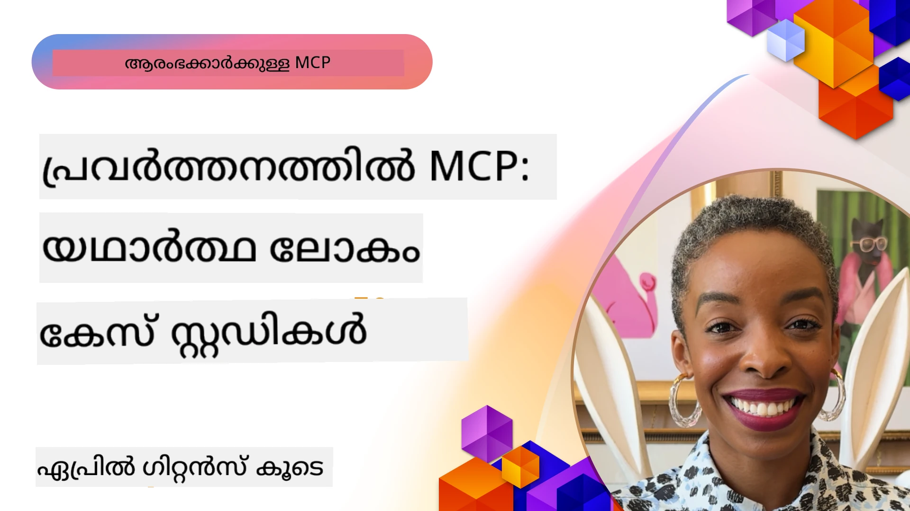

# MCP പ്രവർത്തനത്തിൽ: യാഥാർഥ്യകഥാനകجمات പഠനങ്ങൾ

_(ഈ പാഠത്തിന്റെ വീഡിയോ കാണാൻ മുകളിൽ ചിത്രത്തെ ക്ലിക്ക് ചെയ്യുക)_

മോഡൽ കോൺടെക്‌സ് പ്രോട്ടോക്കോൾ (MCP) എഐ ആപ്ലിക്കേഷനുകൾ ഡാറ്റ, ഉപകരണങ്ങൾ, സേവനങ്ങൾ എന്നിവയുമായി എങ്ങനെ ബന്ധപ്പെടുന്നു എന്നതിൽ വിപ്ലവകരമായ മാറ്റം വരുത്തുകയാണ്. ഈ വിഭാഗം വിവിധ സംരംഭങ്ങളുടെ സാഹചര്യങ്ങളിൽ MCP യുടെ പ്രായോഗിക ഉപയോഗങ്ങൾ തെള്യമിക്കുന്ന യാഥാർഥ്യകഥാനകجمات പഠനങ്ങൾ അവതരിപ്പിക്കുന്നു.

## അവലോകനം

ഈ വിഭാഗം MCP ന്റെ നടപ്പാക്കലുകളുടെ സുസ്ഥിര ഉദാഹരണങ്ങൾ പ്രദർശിപ്പിക്കുന്നു, സംഘടനകൾ എങ്ങനെ ഈ പ്രോട്ടോക്കോൾ ഉപയോഗിച്ച് സങ്കീർണമായ വ്യാപാര പ്രശ്നങ്ങൾ പരിഹരിക്കുന്നുവെന്ന് വ്യക്തമായി കാണിക്കുന്നു. ഈ പഠനങ്ങൾ പരിശോധിക്കുമ്പോൾ, യാഥാർഥ്യ സാഹചര്യങ്ങളിലെ MCP യുടെ വ്യത്യാസീകത, തോര്ന്നിരുത്താനാവുന്ന ശേഷി, പ്രായോഗിക ഗുണങ്ങൾ എന്നിവ നിങ്ങൾക്ക് അറിയാൻ സാധിക്കും.

## പ്രധാന പഠന ലക്ഷ്യങ്ങൾ

ഈ പഠനങ്ങൾ പരിഗണിക്കുമ്പോൾ, നിങ്ങൾ നേടാൻ പോകുന്നത്:

- MCP നെ വ്യവസായ പ്രശ്നങ്ങൾ പരിഹരിക്കാൻ എങ്ങനെ ഉപയോഗിക്കാമെന്നു മനസിലാക്കുക
- വ്യത്യസ്ത ഇന്റഗ്രേഷൻ മാതൃകകളും സാങ്കേതിക സമീപനങ്ങളും പഠിക്കുക
- സംരംഭ പരിസരങ്ങളിൽ MCP നടപ്പാക്കുന്നതിന്റെ മികച്ച ആചാരങ്ങൾ തിരിച്ചറിയുക
- യാഥാർഥ്യ നടപ്പാക്കലുകളിൽ നേരിടുന്ന വെല്ലുവിളികളും പരിഹാരങ്ങളും മനസിലാക്കുക
- നിങ്ങളുടെ സ്വന്തം പദ്ധതികളിൽ സമാന മാതൃകകൾ പ്രയോഗിക്കാനുള്ള അവസരങ്ങൾ തിരിച്ചറിയുക

## പ്രമുഖ പഠനങ്ങൾ

### 1. [Azure AI ട്രാവൽ ഏജന്റുകൾ – റഫറൻസ് നടപ്പാക്കൽ](./travelagentsample.md)

ഈ പഠനം MCP, Azure OpenAI, Azure AI Search എന്നിവ ഉപയോഗിച്ച് ബഹുമുഖ-ഏജന്റ്, എഐ-യുടെ ശക്തമായ യാത്രാ പദ്ധതിവയപ്പെടുത്തി സൃഷ്ടിക്കുന്ന Microsoft's സമഗ്ര റഫറൻസ് പരിഹാരം പരിശോധിക്കുന്നു. ഈ പദ്ധതി കാണിക്കുന്നു:

- MCP മധ്യസ്ഥಮುಖേന ബഹുമുഖ ഏജന്റ് ഓർക്കസ്ട്രേഷൻ
- Azure AI Search ഉപയോഗിച്ചുള്ള സംരംഭ ഡാറ്റ ഇന്റഗ്രേഷൻ
- Azure സേവനങ്ങൾ ഉപയോഗിച്ച് സുരക്ഷിതവും തോര്ന്നുതീർക്കാവുന്നതുമായ ഘടന
- പുനരുപയോഗയോഗ്യമായ MCP ഘടകങ്ങളിലൂടെ വിപുലീകരിക്കാൻ കഴിയുന്ന ടൂളിംഗ്
- Azure OpenAI നാൽ ശക്തിപെടുത്തിയ സംഭാഷണാത്മക ഉപയോക്തൃ അനുഭവം

ഘടനയും നടപ്പാക്കലും MCP കോമ്പിനേഷൻ ലെയറായി ഉപയോഗിച്ച് സങ്കീർണ ബഹുമുഖ ഏജന്റ് സിസ്റ്റങ്ങൾ നിർമ്മിക്കുന്നതിൽ വിലപ്പെട്ട അറിവുകൾ നൽകുന്നു.

### 2. [YouTube ഡാറ്റയിൽ നിന്ന് Azure DevOps ഇനങ്ങൾ അപ്‌ഡേറ്റ് ചെയ്യുന്നു](./UpdateADOItemsFromYT.md)

MCP ഉപയോഗിച്ച് വർക്ക്ഫ്ലോ പ്രക്രിയകൾ ഓട്ടോമേറ്റ് ചെയ്യുന്നതിന്റെ പ്രായോഗിക ഉപയോഗം ഈ പഠനം കാണിക്കുന്നു. ഇത് MCP ഉപകരണങ്ങൾ ഉപയോഗിച്ച് കഴിഞ്ഞേക്കാവുന്നതാണ്:

- ഓൺലൈൻ പ്ലാറ്റ്‌ഫോമുകളിൽ നിന്നുള്ള ഡാറ്റ എടുക്കുക (YouTube)
- Azure DevOps സിസ്റ്റങ്ങളിൽ വർക്ക്ഐറ്റങ്ങൾ അപ്‌ഡേറ്റ് ചെയ്യുക
- ആവർത്തിക്കാവുന്ന ഓട്ടോമേഷൻ വർക്ക്ഫ്ലോകൾ സൃഷ്ടിക്കുക
- വ്യത്യസ്ത സിസ്റ്റങ്ങൾക്കിടയിൽ ഡാറ്റ ഇന്റഗ്രേറ്റ് ചെയ്യുക

ഈ ഉദാഹരണം MCP നടപ്പാക്കലുകൾ എളുപ്പമുള്ളതായാലും റൂട്ടീൻ ജോലികൾ ഓട്ടോമേറ്റ് ചെയ്ത് സിസ്റ്റങ്ങൾ തമ്മിലുള്ള ഡാറ്റ പൊരുത്തം മെച്ചപ്പെടുത്തുന്നതിലൂടെ വലിയ കാര്യക്ഷമത നേടാൻ സഹായിക്കുന്നതിന് പിന്തുണ നൽകുന്നു.

### 3. [MCP ഉപയോഗിച്ച് റിയൽ-ടൈം ഡോക്യുമെന്റേഷൻ വീണ്ടെടുക്കൽ](./docs-mcp/README.md)

ഈ പഠനം Python കോൺസോൾ ക്ലയന്റ് ഉപയോഗിച്ച് ഒരു MCP സർവറായി ബന്ധിപ്പിച്ച് Microsoft ഡോക്യുമെന്റേഷൻ റിയൽ-ടൈം, കോൺടെക്‌സ്-ജ്ഞാനമുള്ള രീതിയിൽ വീണ്ടെടുക്കൽ നടത്താൻ നിങ്ങളെ നയിക്കുന്നു. നിങ്ങൾ പഠിക്കുന്നതെന്തെന്നാൽ:

- MCP SDK ഉപയോഗിച്ച് Python ക്ലയന്റ് MCP സർവറുമായി ബന്ധിപ്പിക്കുക
- ഫലപ്രദമായ റിയൽ-ടൈം ഡാറ്റ വീണ്ടെടുക്കലിനായി സ്റ്റ്രീമിംഗ് HTTP ക്ലയന്റുകൾ ഉപയോഗിക്കുക
- സർവറിൽ ഡോക്യുമെന്റേഷൻ ടൂളുകൾ വിളിച്ച് ഫലങ്ങൾ നേരിട്ട് കോൺസോളിൽ ലോഗ് ചെയ്യുക
- ടെർമിനൽ വിടാതെ നിങ്ങളുടെ പ്രവർത്തനമേഖലയിലേക്ക് അപ്‌ഡേറ്റ് ചെയ്ത Microsoft ഡോക്യുമെന്റേഷൻ ഉൾപ്പെടുത്തുക

ഈ ഭാഗം ഒരു ഹാൻഡ്‌സ്-ഓൺ അസൈൻമെന്റ്, കുറഞ്ഞ കോഡ് സാമ്പിൾ, കൂടുതൽ പഠന വിഭവങ്ങളിലേക്ക് കണ്ണികൾ ഉൾക്കൊള്ളുന്നു. MCP എങ്ങനെ ഡോക്യുമെന്റേഷൻ ആക്‌സസ്, ഡെവലപ്പർ ഉൽപാദനക്ഷമത എന്നിവ കോൺസോൾ അടിസ്ഥാനത്തിലുള്ള പരിസരങ്ങളിൽ മാറ്റാൻ സഹായിക്കുന്നുവെന്ന് മനസ്സിലാക്കാൻ പൂർണ്ണ മാർഗ്ഗനിർദ്ദേശവും കോഡും ലിങ്കുചെയ്ത ഘട്ടത്തിൽ കാണാം.

### 4. [MCP ഉപയോഗിച്ചുള്ള സംവാദാത്മക പഠന പദ്ധതി സൃഷ്ടിക്കാരൻ വെബ് ആപ്പ്](./docs-mcp/README.md)

ഈ പഠനം Chainlit, മോഡൽ കോൺടെക്സ് പ്രോട്ടോക്കോൾ (MCP) എന്നിവ ഉപയോഗിച്ച് ഏതെങ്കിലും വിഷയം (ഉദാഹരണത്തിന് "AI-900 സർട്ടിഫിക്കേഷൻ") ഉപയോക്തൃ ദ്വാര നിർണ്ണയിക്കാവുന്ന പഠന കാലയളവ് (ഉദൃഹണത്തിന് 8 ആഴ്ച) എന്നിവ അടിസ്ഥാനമാക്കി വ്യക്തിഗത പഠന പദ്ധതികൾ സൃഷ്ടിക്കുന്ന സംവാദാത്മക വെബ് ആപ്പ് എങ്ങനെ നിർമ്മിക്കാമെന്ന് കാണിക്കുന്നു. Chainlit സംഭാഷണാത്മക ചാറ്റ് ഇന്റർഫേസിനെ പ്രോത്സാഹിപ്പിക്കുന്നു, അനുഭവം ഇന്ററാക്ടീവ്, രൂപവത്കരിച്ചശേഷമാക്കുന്ന തരത്തിലുള്ളതാക്കുന്നു.

- Chainlit നാൽ ശക്തിയുള്ള സംഭാഷണ വെബ് ആപ്പ്
- വിഷയം, കാലാവധി എന്നിവയ്‌ക്കായി ഉപയോക്തൃ-നിർദ്ദേശങ്ങൾ
- MCP ഉപയോഗിച്ച് ആഴ്ചയ്ക്കനുസരിച്ചുള്ള ഉപദേശം
- ചാറ്റ് ഇന്റർഫേസിൽ റിയൽ-ടൈം, രൂപവത്കൃത പ്രതികരണങ്ങൾ

ഈ പദ്ധതി എങ്ങനെ സംവാദാത്മക എഐയും MCPയും ഒന്നിച്ച് ആധുനിക വെബ് പരിസരങ്ങളിൽ ഉപയോക്തൃ-നിർദ്ദേശിത വിദ്യാഭ്യാസ ഉപകരണങ്ങൾ സൃഷ്ടിക്കാൻ സഹായിക്കുന്നുവെന്ന് വ്യക്തമാക്കുന്നു.

### 5. [VS Code ലെ MCP സർവറുമായി എഡിറ്ററിനുള്ളിൽ ഡോക്സ്](./docs-mcp/README.md)

MCP സർവർ ഉപയോഗിച്ച് Microsoft Learn ഡോക്സുകൾ VS Code പരിസരത്തേക്ക് നേരിട്ട് കൊണ്ടുവരാൻ ഈ പഠനം കാണിക്കുന്നു—ബ്രൗസർ ടാബ് മാറ്റാതെ! നിങ്ങൾ കാണാൻ പോകുന്നത്:

- MCP പാനൽ അല്ലെങ്കിൽ കമാൻഡ് പാൽകറ്റ് ഉപയോഗിച്ച് VS Code-ലുള്ള ഡോക്സ് തൽക്ഷണമായി തിരയുകയും വായിക്കുക
- റഫറൻസ് ഡോക്സ് കാണിക്കുകയും README അല്ലെങ്കിൽ കോഴ്സ് മാർക്ക്ഡൗൺ ഫയലുകളിൽ നേരിട്ട് ലിങ്കുകൾ ചേർക്കുക
- GitHub Copilot നെ MCP നോടൊപ്പം ഉപയോഗിച്ച് സ്മൂത്ത് എഐ-ഓറിയന്റഡ് ഡോക്-കോഡ് പ്രവർത്തനങ്ങൾ
- തൽസമയം ഫീഡ്ബാക്കും Microsoft ഉറപ്പുള്ള കൃത്യതയും ഉപയോഗിച്ച് ഡോകു മെൻറേഷൻ സാധൂകരിക്കുക, മെച്ചപ്പെടുത്തുക
- MCP GitHub വർക്ക്ഫ്ലോകളുമായി സംയോജിപ്പിച്ച് തുടർച്ചയായ ഡോകുമെന്റ് സാധൂകരണം നടത്തുക

നടപ്പാക്കലുകൾ:

- എളുപ്പമുള്ള ക്രമീകരണത്തിനുള്ള `.vscode/mcp.json` ഉദാഹരണം
- എഡിറ്ററിലെ അനുഭവത്തെ ചിത്രങ്ങളോടെ വിശദീകരിച്ച മാർഗ്ഗനിർദ്ദേശങ്ങൾ
- പരമാവധി ഉൽപാദകത്വത്തിനായി Copilot, MCP ഐക്യത്തിലാക്കാനുള്ള ടിപ്‌സ്

കോഴ്സ് ലേഖകർ, ഡോക്സ് എഴുത്തുകാർ, ഡോക്സ്, Copilot, സാധൂകരണ ഉപകരണങ്ങൾ എന്നിവയുടെ ഉപയോഗവേളയിൽ എഡിറ്ററിൽ ശ്രദ്ധ കേന്ദ്രീകരിക്കുന്ന ഡെവലപ്പർമാർക്ക് ഈ സാഹചര്യവും ഏറ്റവും അനുയോജ്യമാണ്.

### 6. [APIM MCP സർവർ സൃഷ്ടിക്കൽ](./apimsample.md)

Azure API Management (APIM) ഉപയോഗിച്ച് MCP സർവർ സൃഷ്ടിക്കാനുള്ള ഘട്ടം-ഘട്ടമായ മാർഗ്ഗനിർദ്ദേശം ഈ പഠനം നൽകുന്നു. ഇതിൽ ഉൾപ്പെടുന്നത്:

- Azure API Management-ൽ MCP സർവർ സജ്ജീകരിക്കൽ
- API പ്രവർത്തനങ്ങൾ MCP ഉപകരണങ്ങൾ ആയി പുറത്തുവിടൽ
- നിരക്ക് നിയന്ത്രണവും സുരക്ഷയും ഉറപ്പാക്കാനുള്ള നയം ക്രമീകരിക്കൽ
- Visual Studio Code, GitHub Copilot എന്നിവ ഉപയോഗിച്ച് MCP സർവർ പരിശോധന

വിവിധ ആപ്ലിക്കേഷനുകളിൽ ഉപയോഗിക്കാൻ കഴിയുന്ന, എഐ സിസ്റ്റങ്ങൾ സംരംഭ APIകൾക്ക് മെച്ചപ്പെട്ട ഇന്റഗ്രേഷൻ നൽകുന്ന ശക്തമായ MCP സർവർ സൃഷ്ടിക്കുന്നതിനായി Azure യുടെ കഴിവുകൾ എങ്ങനെ ഉപയോഗിക്കാമെന്ന് ഈ ഉദാഹരണം വ്യക്തമാക്കുന്നു.

### 7. [GitHub MCP രജിസ്ട്രി — ഏജന്റിക് ഇന്റഗ്രേഷൻ വേഗത്തിലാക്കുന്നു](https://github.com/mcp)

സെപ്റ്റംബർ 2025-ൽ ആരംഭിച്ച GitHub-യുടെ MCP രജിസ്ട്രി എഐ പരിസ്ഥിതിയിലെ ഒരു പ്രധാന പ്രശ്നം പരിഹരിക്കുന്നു: മോഡൽ കോൺടെക്‌സ് പ്രോട്ടോക്കോൾ (MCP) സർവറുകളുടെ വിഭജിതമായ അന്വേഷവും വിന്യാസവും.

#### അവലോകനം
**MCP രജിസ്ട്രി** വിവിധ രിപോസിറ്ററികളും രജിസ്ട്രികളും പൊതിഞ്ഞ MCP സർവറുകളുടെ പ്രശ്നം ജാലകം ചെയ്യുന്നു; ഇതു മുൻപ് ഇന്റഗ്രേഷൻസു ബുദ്ധിമുട്ടുകൊണ്ടും പിഴവുകളും ഉണ്ടാക്കിയിരുന്നു. ഈ സർവറുകൾ എഐ ഏജന്റുകൾക്ക് APIകൾ, ഡാറ്റാബേസുകൾ, ഡോക്യുമെന്റേഷൻ ഉറവിടങ്ങൾ തുടങ്ങിയ പുറമേ സിസ്റ്റങ്ങളുമായി ഇടപഴകാൻ സഹായിക്കുന്നു.

#### പ്രശ്ന പ്രഖ്യാപനം
ഏജന്റിക് വർക്ഫ്ലോകൾ നിർമ്മിക്കുന്ന ഡെവലപ്പർമാർ നേരിട്ട വെല്ലുവിളികൾ:
- വിവിധ പ്ലാറ്റ്‌ഫോമുകളിൽ MCP സർവറുകളുടെ **ദുര്‍വിനിയോഗം കുറവും കണ്ടെത്തൽ പ്രയാസം**
- ഫോറങ്ങളും ഡോക്യുമെന്റേഷനിലും **വിവർത്തനായും ആവർത്തിച്ചും ഉന്മേഷിക്കുന്ന ക്രമീകരണ ചോദ്യങ്ങൾ**
- **നിരീക്ഷിക്കപ്പെടാത്ത, അവിശ്വാസം ഉള്ള ഉറവിടങ്ങളിൽ നിന്നുള്ള സുരക്ഷാ വെല്ലുവിളികൾ**
- സർവർ ഗുണനിലവാരത്തിലും പൊരുത്തത്തിലും **സ്റ്റാൻഡേർഡിസേഷന്റെ അഭാവം**

#### പരിഹാര ഘടന
GitHub MCP രജിസ്ട്രി വിശ്വസനീയമായ MCP സർവറുകൾ(sent) കേന്ദ്രീകരിച്ച് താഴെ പറഞ്ഞ സവിശേഷതകളോടെ പ്രവർത്തിക്കുന്നു:
- ക്രമീകരണ സൌകര്യം വർധിപ്പിക്കുന്നതിനായി VS Code മുഖാന്തിരം **ഒരു ക്ലിക്ക് ഇൻസ്റ്റാൾ**
- താരങ്ങളുടെ എണ്ണം, പ്രവർത്തനങ്ങൾ, കമ്മ്യൂണിറ്റി സ്ഥിരീകരണം എന്നിവയുടെ **ശബ്‌ദത്തിൽ നിന്നുള്ള സിഗ്നൽ-ഓവർ-നോയിസ് ക്രമീകരണം**
- GitHub Copilot പിന്നിലെ മറ്റ് MCP-സാമർത്ഥ്യമുള്ള ഉപകരണങ്ങളുമായുള്ള **നേരിട്ടുള്ള ഇന്റഗ്രേഷൻ**
- കമ്മ്യൂണിറ്റിയും സംരംഭ പങ്കാളികളുമായി **സ്വതന്ത്ര സംഭാവനാ മോഡൽ**

#### ബിസിനസ് സ്വാധീനം
രജിസ്ട്രി പ്രമാണിച്ച ചില ഫലപ്രാപ്തികളും:
- Microsoft Learn MCP സർവർ പോലുള്ള ഉപകരണങ്ങൾ ഉപയോഗിക്കുന്ന ഡെവലപ്പർമാർക്ക് **വേഗത്തിലുള്ള ഓൺബോർഡിംഗ്**
- സ്വാഭാവിക ഭാഷയിലുള്ള GitHub ഓട്ടോമേഷൻ (PR സൃഷ്ടി, CI പുനരാരംഭം, കോഡ് സ്കാനിംഗ്) സാധ്യമാക്കുന്ന `github-mcp-server` പോലുള്ള പ്രത്യേക സർവറുകൾ വഴി **പ്രവർത്തനക്ഷമത മെച്ചപ്പെടുത്തൽ**
- ക്രമീകരണ സ്റ്റാൻഡേർഡുകൾ പരദർശനവും ക്യൂറേറ്റ് ചെയ്ത ലിസ്റ്റിങ്ങുകളും വഴി **കൂട്ടായ്മയുടെ വിശ്വാസം വർദ്ധിപ്പിക്കൽ**

#### തന്ത്രപരമായ മൂല്യം
ഏജന്റ് ലൈഫ്‌സൈക്കിൾ മാനേജുമെന്റ്, പുനഃസൃഷ്ടിയേക്കാവുന്ന വർക്ഫ്ലോ എന്നിവയിൽ വൈദഗ്ദ്ധ്യമുള്ള പ്രായോക്താക്കൾക്ക് MCP രജിസ്ട്രി നൽകുന്നത്:
- **സ്റ്റാൻഡേർഡ് ഘടകങ്ങളോടെയുള്ള മോഡുലാർ ഏജന്റ് വിന്യാസശേഷി**
- **സ്ഥിരതയുള്ള പരിശോധനയ്ക്കും സാധൂകരണത്തിനും രജിസ്ട്രി പിന്തുണയുള്ള മൂല്യനിർണയ പൈപ്പ്ലൈനുകൾ**
- **വിവിധ എഐ പ്ലാറ്റ്‌ഫോമുകൾക്കിടയിലെ എളുപ്പം ഇന്റഗ്രേറ്റ് ചെയ്യാനുള്ള ക്രോസ്-ടൂൾ ഇന്ററോപ്പറബിലിറ്റി**

ഈ പഠനം വിശദീകരിക്കുന്നത് MCP രജിസ്ട്രി ഒരു ഡയറക്റ്ററിയിൽ പരിമിതമല്ല; അതൊരു അടിസ്ഥാനപരമായ, തോര്ന്നുതീർക്കാവുന്ന മോഡൽ ഇന്റഗ്രേഷൻക്കും ഏജന്റിക് സിസ്റ്റം വിന്യസനത്തിനും വേണ്ട പ്ളാറ്റ്‌ഫോമാണ്.

### 8. [ഏജന്റിൽ നിന്ന് സോഷ്യൽ നെറ്റ്‌വർക്കുകളിലേക്ക് പ്രസിദ്ധീകരിക്കൽ](./publora-social-publishing.md)

“**വ്രൈറ്റ്-കപ്പബിള്‍**” റിമോട്ട് MCP സർവർ — ഉപയോക്താവിന്റെ വശത്ത് നിന്ന് തിരസ്കരിക്കാനാകാത്ത പ്രവർത്തനങ്ങൾ ചെയ്യുന്ന ഉപകരണങ്ങൾ ഉള്ള — സാമൂഹ്യ പ്രസിദ്ധീകരണം ഉദാഹരണമായി എടുത്ത് പഠനം നടത്തുന്നു. ഒരു ഏജന്റ് ഒരു പോസ്റ്റ് തയ്യാറാക്കുന്നു, മനുഷ്യൻ അത് അംഗീകരിക്കുന്നു, സേവർ അത് നെറ്റ്‌വർക്കുകൾക്ക് ക്രമീകരിക്കുന്നു.

പ്രസിദ്ധീകരണത്തിന് ബാധകമായ രൂപകൽപ്പന പരിധികൾ പ്രത്യേകിച്ചും ശ്രദ്ധേയമാണ്, ഇത് വാചകം മാത്രമല്ല വായനയല്ലാതെ എഴുതുന്ന ഏത് സർവർക്കും ബാധകമാണ്:

- **ഓപ്പൺ ഹൈർarchy, അംഗീകൃത പ്രവർത്തനം** — 'tools/list' യ്ക്ക് ക്രെഡൻഷ്യൽസ് ഇല്ലാതെ മറുപടി കൊടുക്കാൻ സാധിക്കണം, അതിനാൽ രജിസ്ട്രറുകളും ക്ലയന്റുകളും അവലോകനം ചെയ്യാൻ കഴിയും; എന്നാൽ എല്ലാ ‘tools/call’കൾക്കും ടോക്കൺ വേണം അല്ലെങ്കിൽ ‘401’ ഉം ‘WWW-Authenticate’ ഹെഡർ ഉം മടക്കി നൽകണം
- **ഓത്ത് രജിസ്ട്രേഷൻ ഔട്ട്-ഒഫ്-ബാൻഡ് നടപടിയില്ലാതെ** — ഇന്ന് ഡൈനാമിക് ക്ലയന്റ് രജിസ്ട്രേഷൻ, Client ID മെറ്റാഡേറ്റ ഡോക്യുമെന്റുകൾ മാർഗ്ഗനിർദ്ദേശം നൽകുന്നു, ഇത് 2026-07-28 സ്പെസിഫിക്കേഷനിൽ സൂചിപ്പിക്കും
- **ടൂൾ സൂചനകൾ** (`readOnlyHint`, `destructiveHint`, `idempotentHint`) ഉപയോഗിച്ച് ക്ലയന്റുകൾ സ്ഥിരീകരണം തീരുമാനിക്കുന്നു — നിർബന്ധം അല്ല, എന്നാൽ അവലോകനത്തിന് കണക്ടർ ഡയറക്ടറികൾ പ്രതീക്ഷിക്കുന്നു
- **അസാധ്യമായ ഐഡന്റിഫയർകൾ** — തെറ്റായ മൂല്യം സൃഷ്ടിക്കുന്നത് ശബ്ദത്തോടെ പരാജയപ്പെടും, പ്രാവാസാ തോന്നുന്ന ഒരു മൂല്യത്തിൽ പ്രവർത്തിക്കുന്നത് കൂടാതെ
- **പോസ്റ്റ് സൃഷ്ടിക്കുന്ന ടൂളുകളിൽ ഐഡംപോട്ടൻസി കീകൾ** — ഏജന്റ് റൺടൈം റീട്രൈ ഡുപ്ലിക്കേറ്റ് പ്രസിദ്ധീകരണമായി മാറുന്നതിൽ നിന്ന് തടയുന്നു
- **ടൂൾ സ്കീമയിൽ ഇതിനുള്ള പ്രവർത്തനമില്ലാത്ത ലക്ഷ്യം** — പൂർണ്ണ വ്രൈറ്റ് പാതയുടെ പരീക്ഷണത്തിന്, റിവ്യൂവർക്കും CI-ക്കും ഒന്നും പ്രസിദ്ധീകരിക്കാതെ

അധ്യായം തീരുമ്പോൾ നിങ്ങൾ നിർമിക്കുന്ന സർവറിലേക്ക് പ്രയോഗിക്കാവുന്ന ചെറിയ ഒരു ഓർമ്മപ്പട്ടിക ഉൾപ്പെടുത്തിയിട്ടുണ്ട്.

## സമാപനം

മോഡൽ കോൺടെക്‌സ് പ്രോട്ടോക്കോൾ വ്യത്യസ്ത യാഥാർഥ്യ സാഹചര്യങ്ങളിലെ അതുല്യ വ്യത്യാസസമർത്ഥ്യവും പ്രായോഗിക ഉപയോഗങ്ങളുമാണ് ഈ എട്ട് സമഗ്ര കേസുകൾ തെളിയിക്കുന്നത്. സങ്കീർണമായ ബഹുമുഖ-ഏജന്റ് യാത്രാ പദ്ധതിവയ്പ്പ് കണ്ടുപിടിക്കൽ വ്യവസായ API മാനേജുമെന്റ് മുതൽ ലളിതമായ ഡോകുമെന്റേഷൻ വർക്ഫ്ലോകളും വിപ്ലവകരമായ GitHub MCP രജിസ്ട്രിയുമെത്തി, MCP എഐ സിസ്റ്റങ്ങൾ ആവശ്യപ്പെടുന്ന ടൂളുകൾ, ഡാറ്റ, സേവനങ്ങൾ എന്നിവയ്‌ക്കൊപ്പം വിദഗ്ധമായ മൂല്യം നൽകാൻ ഒരു സ്റ്റാൻഡേർഡൈസ്ഡ്, തോര്ന്നുതീർക്കാവുന്ന മാർഗം എന്ന നിലയിലാണ് പ്രവർത്തിക്കുന്നത്.

പഠനങ്ങൾ MCP നടപ്പാക്കലിന്റെ പല മേഖലകളിലും വ്യാപിക്കുന്നു:
- **സംരംഭ ഇന്റഗ്രേഷൻ**: Azure API മാനേജുമെന്റ്, Azure DevOps ഓട്ടോമേഷൻ
- **മൾട്ടി-ഏജന്റ് ഓർക്കസ്ട്രേഷൻ**: ഏകോപിപ്പിച്ച എഐ ഏജന്റുകൾ ഉപയോഗിച്ചുള്ള യാത്രാ പദ്ധതി
- **ഡെവലപ്പർ ഉൽപാദനക്ഷമത**: VS Code ഇന്റഗ്രേഷൻ, റിയൽ-ടൈം ഡോക്യുമെന്റേഷൻ ആക്‌സസ്
- **പരിസ്ഥിതിവികസനം**: GitHub MCP രജിസ്ട്രി അടിസ്ഥാന പ്ലാറ്റ്ഫോമായി
- **വിദ്യാഭ്യാസ അപേക്ഷകൾ**: സംവാദാത്മക പഠന പദ്ധതി സൃഷ്ടിക്കാരന്മാരും സംഭാഷണ ഇൻറർഫേസുകളും

ഈ നടപ്പാക്കലുകൾ പഠിച്ചുകൊണ്ട് നിങ്ങൾക്ക് ലഭിക്കുന്നത്:
- **വ്യത്യസ്ത തോതിലും ഉപയോഗ പാടങ്ങളിലും പ്രയോഗിക്കുന്ന ഘടനാ മാതൃകകൾ**
- **പ്രാപ്‌ത്യവും പരിപാലനബന്ധിതവുമായ നടപ്പാക്കൽ തന്ത്രങ്ങൾ**
- **ഉല്‍പാദന വിന്യസനങ്ങൾക്ക് സുരക്ഷിതത്വവും തോര്ന്നുതീർക്കലും**
- **MCP സർവർ വികസനത്തിനും ക്ലയന്റ് ഇന്റഗ്രേഷനും മികച്ച ആചാരങ്ങൾ**
- **എഐ-സാധ്യമായ പരസ്പരബന്ധിത പരിഹാരങ്ങൾ സൃഷ്ടിക്കുന്ന പാരിസ്ഥിതിക ചിന്താഗതികൾ**

ഈ ഉദാഹരണങ്ങളിൽ കാണിക്കുന്നത് MCP ഒരു സിദ്ധാന്ത രീതിയോ നിർവ്വചിച്ച-മാത്രമല്ല, സങ്കീർണ വ്യവസായ വെല്ലുവിളികൾക്ക് പ്രായോഗിക പരിഹാരങ്ങൾ നൽകുന്ന ഒരു പ്രായോഗിക, പ്രോഡക്ഷൻ-സജ്ജ പ്രോട്ടോക്കോൾ ആണ്. ലളിതമായ ഓട്ടോമേഷന്‍ ഉപകരണമോ സങ്കീർണമായ ബഹുമുഖ-ഏജന്റ് സിസ്റ്റങ്ങളോ നിർമിക്കുമ്പോഴും, ഇതിൽ കാണിച്ച മാതൃകകളും സമീപനങ്ങളും നിങ്ങളുടെ MCP പദ്ധതികൾക്ക് ശക്തമായ അടിസ്ഥാനമാകും.

## അധിക വിഭവങ്ങൾ

- [Azure AI Travel Agents GitHub Repository](https://github.com/Azure-Samples/azure-ai-travel-agents)
- [Azure DevOps MCP Tool](https://github.com/microsoft/azure-devops-mcp)
- [Playwright MCP Tool](https://github.com/microsoft/playwright-mcp)
- [Microsoft Docs MCP Server](https://github.com/MicrosoftDocs/mcp)
- [GitHub MCP Registry — Accelerating Agentic Integration](https://github.com/mcp)
- [MCP Community Examples](https://github.com/microsoft/mcp)

## അടുത്തതായി

- മുമ്പ്: [Module 8: Best Practices](../08-BestPractices/README.md)
- അടുത്തത്: [Module 10: Streamlining AI Workflows: Building an MCP Server with AI Toolkit](../10-StreamliningAIWorkflowsBuildingAnMCPServerWithAIToolkit/README.md)

---

<!-- CO-OP TRANSLATOR DISCLAIMER START -->
**അറിയിപ്പ്**:
ഈ രേഖ AI പരിഭാഷാ സേവനം [Co-op Translator](https://github.com/Azure/co-op-translator) ഉപയോഗിച്ച് പരിഭാഷപ്പെടുത്തിയതാണ്. ഞങ്ങൾ കൃത്യതയ്ക്കായി ശ്രമിക്കുന്നുവെങ്കിലും, ഓട്ടോമേറ്റഡ് പരിഭാഷകളിൽ പിഴവുകൾ അല്ലെങ്കിൽ തെറ്റായ വിവരങ്ങൾ ഉണ്ടാകാൻ സാധ്യതയുണ്ട്. അതിന്റെ സ്വാഭാവിക ഭാഷയിലുള്ള അസൽ രേഖയാണ് പ്രാമാണികമായ ഉറവിടമായി പരിഗണിക്കേണ്ടത്. നിർണായകമായ വിവരങ്ങൾക്ക്, പ്രൊഫഷണൽ മനുഷ്യ പരിഭാഷ ശുപാർശ ചെയ്യുന്നു. ഈ പരിഭാഷ ഉപയോഗിച്ച് ഉണ്ടാകുന്ന തെറ്റിദ്ധാരണകൾ അല്ലെങ്കിൽ തെറ്റായ വ്യാഖ്യാനങ്ങൾക്കായി ഞങ്ങൾ ഉത്തരവാദികളല്ല.
<!-- CO-OP TRANSLATOR DISCLAIMER END -->