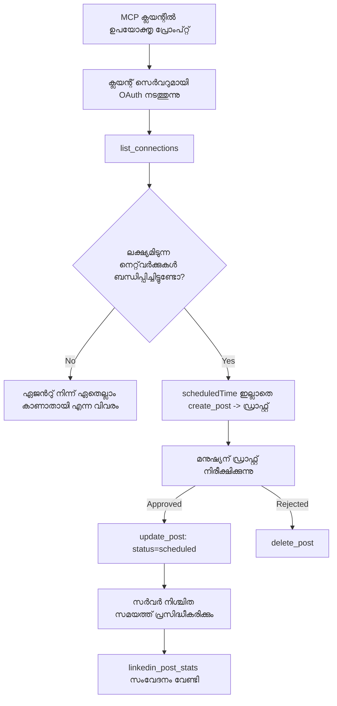

# കേസ്സ് സ്റ്റഡി: റിമോട്ട് MCP സർവറുമായി ഒരു ഏജന്റിൽ നിന്ന് സോഷ്യൽ നെറ്റ്വർക്ക്‌ുകളിൽ പ്രസിദ്ധീകരിക്കൽ

> **ജുമിളിപ്പ്:** നിരവധി സേവനങ്ങളും ഓപ്പൺ-സോഴ്‌സ് പ്രോജക്റ്റുകളും സോഷ്യൽ നെറ്റ്വർക്കിലേക്ക് പ്രസിദ്ധീകരിക്കാൻ കഴിയും, കൂടാതെ ഒരു ടീം ഓരോ നെറ്റ്വർക്കിന്റെയും API നേരിട്ട് സംയോജിപ്പിക്കാനുമാകും. താഴെ കൊടുത്തിരിക്കുന്ന സാഹചര്യമാണ് ഒരു **എഴുതാൻ കഴിവുള്ള റിമോട്ട് MCP സർവർ** എങ്ങനെ രൂപകൽപ്പന ചെയ്യുകയും ഉപയോഗിച്ചുകൊള്ളുകയും ചെയ്യാമെന്ന് worked ഉദാഹരണമായി. Publora ഒരു കൊമേഴ്ഷ്യൽ സർവീസുമായി ഒരു ഫ്രീ ടിയർ ഉണ്ട്; ഇവിടെ വിശദീകരിച്ച മാതൃകകൾ ഉപയോക്താവിന്റെ ഭാഗത്തു നിന്ന് പിന്‍വലിക്കാനാകാത്ത പ്രവർത്തനങ്ങൾ നടത്തുന്ന ഏത് MCP സേർവറിനും ബാധകമാണ്.

## അവലോകനം

ഏജന്റുകൾ ഉള്ളടക്കം തയ്യാറാക്കുന്നതിൽ നല്ലതായിരിക്കും, എന്നാൽ അത് വിതരണം ചെയ്യുന്നതിൽ പാടുപെടുന്നു. ഒരു മോഡൽ മിനുട്ടുകൾക്കുള്ളിൽ റിലീസ് പ്രഖ്യാപനം എഴുതാമെങ്കിലും, പിന്നീട് പ്രവൃത്തി നിർത്തുന്നു: പ്രസിദ്ധീകരണം എന്നത് ഓരോ നെറ്റ്വർക്കിനുള്ള ഒരു API, ഓരോ നെറ്റ്വർക്കിനുള്ള ഒരു OAuth ആപ്പ്, ഓരോതുറയും വ്യത്യസ്തമായ മീഡിയ നിയമങ്ങൾ എന്നിവയെ പ്രതിനിധീകരിക്കുന്നു. ഭൂരിഭാഗം ടീമുകൾ ഇതിനെ കൈ കൊണ്ട് ബ്രൗസറിൽ പകർത്തുന്നതിലൂടെ പരിഹരിക്കുന്നു.

ഈ കേസ്സ് സ്റ്റഡി ഈ അവസാന ഘട്ടം എങ്ങനെ ഒറ്റ റിമോട്ട് MCP സർവറുകൊണ്ട് പൂർത്തിയാക്കാമെന്നു കാണിക്കുന്നു, കൂടാതെ — ഒരാൾ MCP സർവർ നിർമ്മിക്കുമ്പോൾ — ഒരു **എഴുതാൻ കഴിവുള്ള** സർവർ ശരിയായി ചെയ്യേണ്ട രൂപകൽപ്പന തീരുമാനങ്ങളെക്കുറിച്ച് കൂടുതൽ ഉപയോഗപ്രദമായി. ഡാറ്റ വായിക്കൽ ക്ഷമികമാണ്. പ്രസിദ്ധീകരണം അല്ല: തെറ്റായ ടൂൾ കോൾ പ്രേക്ഷകർക്ക് ദൃഷ്ട്യാമാകുകയും പിന്‍വലിക്കാനാവാത്തതുമാണ്.

## സാഹചര്യം

ചെറിയ ഒരു ഡവലപ്പർ-റിലേഷൻസ് ടീം ഒരു ഏജന്റിനുള്ളിൽ പോസ്റ്റുകൾ തയ്യാറാക്കുന്നു (Claude, VS Code, Cursor - ക്ലയന്റിന് താത്പര്യമില്ല). അവർ ഏജന്റിൽ നിന്ന് ആഗ്രഹിക്കുന്നു:

- ടീം ഏത് സോഷ്യൽ അക്കൗണ്ടുകൾ ബന്ധിപ്പിച്ചിരിക്കുന്നുവെന്ന് കാണാൻ,
- ഒരു പോസ്റ്റ് ഡ്രാഫ്റ്റ് ചെയ്യുകയും മനുഷ്യൻ അംഗീകരിക്കാൻ ഡ്രാഫ്റ്റ് ആയി വെക്കുകയും ചെയ്യാൻ,
- ഒരു ചിത്രം അറ്റാച്ച് ചെയ്യാൻ,
- തെരഞ്ഞെടുത്ത സമയത്ത് നിരവധി നെറ്റ്വർക്കുകളിൽ ഷെഡ്യൂൾ ചെയ്യാൻ,
- പിന്നീട് അത് എങ്ങനെ പ്രവർത്തിച്ചു എന്ന് റിപ്പോർട്ട് ചെയ്യാൻ.

പ്രധാനമായും, അവർ പരീക്ഷണം തുടരുമ്പോൾ ഏജന്റ് തെറ്റായ പ്രസിദ്ധീകരണം നടത്താൻ കഴിയാതിരിക്കണമെന്ന് ആഗ്രഹിക്കുന്നു.

## ഉപയോഗിച്ച യന്ത്രങ്ങൾ

- [Publora MCP Server](https://github.com/publora/mcp-server) — പ്രസിദ്ധീകരണം, ഷെഡ്യൂളിംഗ്, മീഡിയ, LinkedIn അനലിറ്റിക്സ് ടൂളുകൾകൊണ്ട് ഒരു റിമോട്ട് MCP സർവർ (`streamable-http`). ഔദ്യോഗിക MCP രജിസ്റ്ററിൽ `com.publora/mcp-server` എന്ന പേരിൽ രജിസ്റ്റർ ചെയ്തിരിക്കുന്നു.

## ഘട്ടം-ഘട്ടമായി പ്രവൃത്തി പ്രവാഹം

1. **സർവറെ കണക്റ്റ് ചെയ്യുക.** OAuth സംസാരിക്കുന്ന ക്ലയന്റുകൾ സർവറിന്റെ സ്വന്തം സമ്മത സ്ക്രീനോട് PKCE അഥോറൈസേഷൻ-കോഡ് ഫ്‌ളോ പൂർത്തിയാക്കുന്നു; ഹെഡ്‌ലെസ് CLI പോലെയുള്ള ക്ലയന്റുകൾ ഹെഡറിൽ Publora API കീ ഉപയോഗിക്കുന്നു. രണ്ട് വഴികളും പിന്തുണയ്ക്കുന്നു, നിങ്ങൾക്ക് ഏത് ലഭിക്കും എന്നത് ക്ലയന്റിൽ ആശ്രയിച്ചിരിക്കുന്നു, സർവറിൽ അല്ല.
2. **കണക്ഷനുകൾ പട്ടികവത്കരിക്കുക.** ഏജന്റ് `list_connections` കോൾ ചെയ്യുന്നു, തിരിച്ചറിയലുകളോടുകൂടിയ ബന്ധിപ്പിച്ച അക്കൗണ്ടുകൾ സ്വീകരിക്കുന്നു.
3. **ഡ്രാഫ്റ്റ്.** ഏജന്റ് ഷെഡ്യൂൾ ചെയ്ത സമയമില്ലാതെ `create_post` കോൾ ചെയ്യുന്നു. പോസ്റ്റ് ഡ്രാഫ്റ്റായി സൂക്ഷിക്കുന്നു — ഒന്നും പ്രസിദ്ധീകരിക്കപ്പെടുന്നില്ല.
4. **മീഡിയ അറ്റാച്ച് ചെയ്യുക.** പബ്ലിക്ക് ഇമേജ് URL-കൾ ഒരേ കോൾ ഓടെ പാസാക്കുന്നു; സർവർ അത് ഡൗൺലോഡ് ചെയ്ത് പരിശോധിക്കുന്നു.
5. **ഷെഡ്യൂൾ.** മനുഷ്യൻ അംഗീകാരം നൽകുന്നതിന് ശേഷം `update_post` സ്ഥിതിവിവരക്കുറിപ്പിൽ ISO 8601 സമയത്തോടെ ഷെഡ്യൂൾ ചെയ്തതായി സജ്ജമാക്കുന്നു.
6. **അളക്കുക.** LinkedIn-ൽ, `linkedin_post_stats` പോസ്റ്റ് ലൈവായി എത്തിയപ്പോൾ ഏംഗേജ്‌മെന്റ് നൽകുന്നു.

## ഉദാഹരണ പ്രോംപ്റ്റ്

```text
Which social accounts do I have connected?
Draft a post announcing our new changelog page, attach the screenshot at
https://example.com/changelog.png, and keep it as a draft — do not publish it.
Once I approve, schedule it to LinkedIn and Bluesky for tomorrow at 09:00 UTC.
```

## Mermaid ഫ്ലോചാർട്ട്



## സാങ്കേതിക നടപ്പാക്കൽ

താഴെ കൊടുത്ത പാഠങ്ങൾ ഈ കേസ്സ് സ്റ്റഡിയുടെ മാറ്റിസ്ഥാപിക്കാവുന്ന ഭാഗമാണ്.

### തുറന്ന പര്യവേഷണം, സാധുവായ വിജ്ഞാപനം

`tools/list` ക്രെഡൻഷ്യലുകൾ ഇല്ലാതെ സേർവ് ചെയ്യുന്നു; എല്ലാ `tools/call` ടോക്കൺ ആവശ്യമാണ്
കൂടാതെ അല്ലാത്തപക്ഷം `401` നൽകുകയും `WWW-Authenticate` ഹെഡറിൽ 

സംരക്ഷിതമായ വിഭവങ്ങളുടെ മെറ്റാഡേറ്റ. ഗതകാല സെർവർ എൻഡ്‌പോയിന്റ് കൂടാതെ പ്രോട്ടോക്കോൾ പതിപ്പുകൾ `2026-07-28`-മുന്നിലുള്ള ക്ലയന്റുകൾക്കായി അംഗീകൃതമല്ലാത്ത `initialize`-നെ മറുപടി നൽകുന്നു; നിലവിലെ ക്ലയന്റുകൾ ആ ഹാൻഡ്‌ഷെയ്ക്ക് ഉപയോഗിക്കുന്നില്ല.
unauthenticated `initialize` for clients on protocol versions before
`2026-07-28`; current clients do not use that handshake.

ഈ സെർവർ-നിർദിഷ്ട വിഭജനം രജിസ്റ്റ്രികൾ, കറട്ടലോക്കുകൾ, ക്ലയന്റുകൾക്ക് രഹസ്യമില്ലാതെ ഉപകരണങ്ങളുടെ പേരുകൾ, സ്കീമകൾ, കുറിപ്പുകൾ പരിശോധിക്കാൻ അനുവധിക്കുന്നു, എന്നാൽ അനാമകമായ പ്രവർത്തനം തടയുന്നു. തുറന്ന കണ്ടെത്തൽ ഒരു വിന്യാസ തിരഞ്ഞെടുപ്പാണ്, MCP ആവശ്യകതയല്ല; ഒരു സംരക്ഷിത വിന്യാസം `tools/list`-ന് അദ്ധികാര പ്രമാണം ആവശ്യപ്പെടുമെന്നതും കഴിഞ്ഞില്ല.
names, schemas, and annotations without a secret while preventing anonymous
execution. Open discovery is a deployment choice, not an MCP requirement; a
protected deployment may also require authorization for `tools/list`.

### രജിസ്ട്രേഷൻ: ഡൈനാമിക് ക്ലയന്റ് രജിസ്ട്രേഷൻ, കൂടാതെ അതിന്റെ ഇടം പൂരിപ്പിക്കുന്നത്

സെർവർ `/.well-known/oauth-protected-resource` ഉം `/.well-known/oauth-authorization-server` ഉം പ്രചരിപ്പിക്കുന്നു, കൂടാതെ PKCE (`S256`), റിഫ്രെഷ് ടോകണുകൾ, **ഡൈനാമിക് ക്ലയന്റ് രജിസ്ട്രേഷൻ** എന്നിവയോടുള്ള.authorization-code ഫ്‌ളോയെ പിന്തുണയ്ക്കുന്നു.

ഡൈനാമിക് രജിസ്ട്രേഷൻ ഗതകാല ക്ലയന്റുകൾക്കുള്ള മാനുവൽ ഘടകം നീക്കംചെയ്‌തു: അതില്ലെങ്കിൽ, ഓരോ ക്ലയന്റിനും വENDORനിൽ നിന്നുള്ള പ്രീ-ഇഷ്യു ചെയ്ത `client_id` ആവശ്യമായിരുന്നു.
each client needed a pre-issued `client_id` from the vendor.

ഇതിനെ ഒരു സമർപ്പിത പരിപാഠമായി പരിഗണിക്കുക, കോപ്പിയടിക്കാൻ ഉള്ള ഡിസൈനായി അല്ല. 2026-07-28 SPECIFICATION നവീകരണം ഡൈനാമിക് ക്ലയന്റ് രജിസ്ട്രേഷൻ ഒഴിവാക്കി Client ID Metadata Documents നെ പ്രാധാന്യം നൽകുന്നു, ഇതിൽ ക്ലയന്റ് ഒരു മെറ്റാഡേറ്റ ഡോക്യുമെന്റ് സ്ഥിരമായ HTTPS URL-ൽ ഹോസ്റ്റ് ചെയ്യുന്നു, ആ URL തന്നെയാണ് `client_id`. DCR ഇപ്പോഴും പ്രവർത്തിക്കുന്നു, എന്നാൽ ഇന്ന് നിർമ്മിക്കുന്ന സെർവർ CIMD-നു ആസൂത്രണം ചെയ്യേണ്ടതാണ്, പഴയ ക്ലയന്റുകളിൽ മാത്രമേ DCR ഉപയോഗിക്കൂ.

### ഉപകരണ കുറിപ്പുകൾ അലങ്കാരമല്ല

ഓരോ ഉപകരണത്തിനും ഒരു `title` ഉം അനുയോജ്യമായ സൂചനകൾ ഉണ്ട്: `readOnlyHint`, `destructiveHint`, `idempotentHint`, `openWorldHint`.

ഇരുട്ടു കാരണങ്ങളുണ്ട് അത് നിക്ഷേപിക്കാൻ. ആദ്യം, ക്ലയന്റുകൾ അവയെ ഉപയോഗിച്ച് ഉപയോക്താവിനോടുള്ള സ്ഥിരീകരണങ്ങൾ തീരുമാനിക്കുന്നു — ഒരു ക്ലയന്റ് വായന മാത്രം നടത്തുന്ന ലുക്ക് അപ് ഓട്ടോമാറ്റിക്കായി നടത്തുകയും ഡിലീറ്റ് ചെയ്യുന്ന മുൻപ് അംഗീകാരം തേടുകയും ചെയ്യാം. സ്പെസിഫിക്കേഷൻ വ്യക്തമാക്കുന്നു കുറിപ്പുകൾ വിശ്വസനീയമല്ലാത്ത സൂചനകളാണ്, നിയന്ത്രണ സംവിധാനം അല്ല: അത് ഒരു ക്ലയന്റ് എന്ത് ചെയ്യാൻ സേവനം നൽകണമെന്ന് രൂപപ്പെടുത്തുന്നു, സെർവറിൽ എന്തും തടയുന്നില്ല, സെർവർ സ്വയം നിയമങ്ങൾ നടപ്പിലാക്കണം. രണ്ടാമതായി, പ്രധാന കണക്ടർ ഡയറക്റ്ററികൾ അവ നിരീക്ഷണത്തിനായി *ആവശ്യപ്പെടുന്നു*; ഒരു സെർവർ യന്ത്രങ്ങൾക്ക് തലക്കെട്ടും സൂചനകളും ഇല്ലെങ്കിൽ എങ്കിലും അത് എങ്ങനെ പ്രവർത്തിച്ചാലും തള്ളി വിടും.

### തിരിച്ചറിയൽ നിർവചനങ്ങൾ കണ്ടുപിടിക്കാത്തവിധം ഉണ്ടാക്കുക

പ്ലാറ്റ്‌ഫോം തിരിച്ചറിയലുകൾ `list_connections` വഴി ലഭിക്കുന്ന പാരദർശനമല്ലാത്ത സ്ട്രിങ്ങുകളാണ്, സ്കീമ വിവരണം വ്യക്തമായി പറയുന്നു അവ വാചകശുദ്ധമായി പകർന്നു ഉപയോഗിക്കണം, ഒരിക്കലും കണക്കുകൂട്ടരുത്. കൂടാതെ സെർവർ മറ്റെന്തെങ്കിലും നിരാകരിക്കുന്നു.

മോഡലുകൾ ഫ്‌ളൂയന്റ് ഗസ്സേഴ്സ് ആണ്. ഏതൊരു എഴുതാനാകുന്ന സെർവർ പോലും ഒരു തിരിച്ചറിയൽ അറിയാതെ ഇദ്ദേഹം നേരിടുമെന്നും ഓർക്കണം, അത് പിന്നീട് സ്വരം ഉയർത്തി പിശക് കാണിച്ച് പരാജയപ്പെടുത്തണം, സാധുവായി തോന്നുന്ന മൂല്യത്തിൽ പ്രവർത്തിക്കരുത്.

### പ്രസിദ്ധീകരിക്കുന്നതിന് മുമ്പ് പരാജയപ്പെടുക, പ്രയോഗയോഗ്യമായ സന്ദേശത്തോടെ

ചില നെറ്റ്‌വർക്കുകൾ വാചകമാത്ര പോസ്റ്റുകൾ നിരസിക്കുന്നു, ചിത്രം അല്ലെങ്കിൽ വീഡിയോ ആവശ്യമാണ്. ഇത് പോസ്റ്റ് ഷെഡ്യൂൾ ചെയ്യുന്ന സമയം സാധൂകരിക്കുന്നു, പിശക് പ്ലാറ്റ്‌ഫോംയും അഭാവം ആവശ്യകതയും പറയുന്നു.

ഒരു ഏജന്റ് "Instagram requires media — attach an image or video" എന്ന നിരീക്ഷണത്തിൽ നിന്ന് മറ്റൊരു റൗണ്ട് ട്രിപ്പ് കൂടാതെ വീണ്ടെടുക്കാൻ കഴിയും. ഒരു പൊതുവായ `400`-ൽ നിന്ന് ആക്രമിച്ചെടുക്കാൻ കഴിയില്ല.

### റിട്രൈകൾ സുരക്ഷിതമാക്കുക

ഉള്ളടക്കം സൃഷ്ടിക്കുന്ന രണ്ട് ഉപകരണങ്ങൾ, `create_post` ഉം `update_post` ഉം ഒരു ഐഡംപോട്ടൻസി കീ സ്വീകരിക്കുന്നു: അതേ ഒരു അഭ്യർത്ഥന ഉപയോഗിച്ച് അതേ കീ വീണ്ടും ഉപയോഗിക്കുന്നത് ആദ്യ പ്രതികരണത്തെ ആവർത്തിക്കുന്നു, രണ്ടാമത്തെ പോസ്റ്റു സൃഷ്ടിക്കുന്നില്ല. ഏജന്റ് റൺടൈം ടൈംഔട്ട് സമയങ്ങളിൽ റിട്രൈ ചെയ്യുന്നു; ഐഡംപോട്ടൻസി ഇല്ലെങ്കിൽ, സ്ലോ പ്രതികരണം ന്കം നേരത്തേ പ്രസിദ്ധീകരണം ആവർത്തിക്കുന്നു. മറ്റ് എഴുതുന്ന ഉപകരണങ്ങൾ - ഡിലീഷനുകൾ, മീഡിയ സ്റ്റെപ്പുകൾ, ലിങ്ക്ഡ് ഇൻ പ്രതികരണങ്ങളും അഭിപ്രായങ്ങളും - അതു സ്വീകരിക്കില്ല, അതിനാൽ അവിടെ റിട്രൈ സ്വയം സുരക്ഷിതമല്ല. നിങ്ങളുടെ തന്നെ ചേരുവകൾക്ക് ഏതാണ് സംരക്ഷിതവും ഏതാണ് അല്ല എന്നറിയുന്നത് മൂല്യമുള്ളതാണ്.


### ഒന്നും പ്രസിദ്ധീകരിക്കാത്തതു പരിശോധിക്കാനുള്ള ഒരു മാർഗം നൽകുക


സെർവർ ഒരു രജിസ്റ്റർ ചെയ്ത ലക്‌ഷ്യം `publora-playground` സ്വീകരിക്കുന്നു, അത് ഒരു യഥാർത്ഥ ഗമ്യസ്ഥാനം പോലെ പരിശോധിച്ച് സ്ഥിരീകരിച്ച ശേഷം ഉപേക്ഷിക്കുന്നു — യാതൊരു ലെെവ് അക്കൗണ്ടിലേക്കും ഒന്നും പോകുന്നില്ല. ഇത് ടൂൾ സ്കീമയിൽ തന്നെ വിവരിച്ചിരിക്കുന്നു, കൂടാതെ ഏത് ക്ലയന്റും ക്രെഡൻഷ്യലുകൾ ഇല്ലാതെ വായിക്കാവുന്നതാണ്: `create_post`-ന്റെ `platforms` ഫീൽഡിൽ ഇത് "യഥാർത്ഥ കണക്ഷൻ ആവശ്യമില്ലാത്ത ഒരു കണക്ഷൻ-ടെസ്റ്റ് ടാർഗെറ്റ് - പോസ്റ്റ് അംഗീകരിക്കുകയും ഉപേക്ഷിക്കുകയും ചെയ്യുന്നു, ഒന്നും പ്രസിദ്ധീകരിക്കുന്നില്ല" എന്ന് രേഖപ്പെടുത്തിയിരിക്കുന്നു. ഇത് ഏകദേശം ഒരു എൻട്രിയായി നൽകുക: `platforms: ["publora-playground"]`.

ഇതാണ് മുഴുവൻ ഉപരിതലത്തിലെ ഏറ്റവും ഉപകാരപ്രദമായ تفصيلات मध्ये ഒന്ന്. കണക്ടർ ഡയറക്ടറി അവലോകനങ്ങൾ, സംഭാവനക്കാർ, CI എന്നിവ യഥാർത്ഥ പ്രേക്ഷകരിന് എത്രയും അപകടമില്ലാതെ എഴുത്ത് വഴിത്തടം മുഴുവൻ പരീക്ഷിക്കാൻ സാധിക്കും. തിരികെമാറ്റം സാധിക്കാത്ത പ്രവർത്തനങ്ങളുള്ള ഏതെങ്കിലും MCP സെർവർ ഒരു രേഖപ്പെടുത്തിയ നോ-ഓപ്പ് ടാർഗെറ്റിൽ നിന്ന് ലാഭം നേടുന്നു.

## ഫലങ്ങളും බලവും

- പ്രസിദ്ധീകരണ ഘടി ബ്രൗസറിൽ നിന്നു ഉള്ളടക്കം എഴുതുന്ന അതേ സംഭാഷണത്തിലേക്ക് മാറ്റി, ഒരു ഡ്രാഫ്റ്റ്-ആദ്യം ശൈലി മനുഷ്യനെയും പങ്കാളിയാക്കുന്നു. അത് എന്തെന്ന് കൃത്യമായി അർത്ഥമാക്കുക: ഒരു ഡ്രാഫ്റ്റ് ഒരു പരമ്പരാഗത മാനദണ്ഡമാണ്, അതിന്റെ അതിരല്ല. അതേ ക്രെഡൻഷ്യൽ ഷെഡ്യൂൾ ചെയ്യാനും പ്രസിദ്ധീകരിക്കാനുമുള്ള കഴിവ് ഉണ്ട്, അതിനാൽ യഥാർത്ഥ അനുമതി ഗേറ്റ് ആവശ്യമായ ആൾ ടൂൾ ഉപരിതലത്തിന് പുറത്തെയുള്ള പ്രയോഗത്തിന് നിർബന്ധമുണ്ട് — വേർതിരിച്ച ക്രെഡൻഷ്യലുകൾ, അല്ലെങ്കിൽ സെർവറിന്റെ മുൻപിലുള്ള നയം നില.
- നെറ്റ്‌വർക്കിൽ വ്യത്യാസങ്ങൾ — മീഡിയ ആവശ്യകതകൾ, ത്രെഡിങ്ങ്, മറുപടി നിയന്ത്രണങ്ങൾ — ചെറുതായി സെർവറിൽ കൈകാര്യം ചെയ്യുന്നു, ഓരോ ഏജന്റിലും അല്ല.
- അതേ സെർവർ മുമ്പ് ജാരി ചെയ്ത ക്രെഡൻഷ്യലുകളില്ലാതെ നിരവധി MCP ക്ലയന്റുകൾക്ക് പിന്തുണ നൽകുന്നു.
    നിലവിലെ ക്ലയന്റുകൾ ക്ലയന്റ് ഐഡി മെറ്റാഡേറ്റ ഡോക്യുമെന്റുകൾ ഉപയോഗിക്കാം; പഴയ ക്ലയന്റുകൾക്കായി DCR പിന്തുണ തുടരും
    .
- മുകളിലുള്ള രൂപകൽപ്പന പരിധികൾ കണക്ടർ ഡയറക്ടറി അവലോകനങ്ങൾ, ഉപയോക്താക്കൾ എന്നിവയുടെ ആവശ്യകതകൾ പ്രകാരം രൂപപ്പെട്ടു: അനോട്ടേഷനുകൾ, OAuth, സുരക്ഷിത ടെസ്റ്റ് ടാർഗെറ്റ് എന്നിവ അരുതാത്തവയിൽ രണ്ടോ മൂന്നോ ആവശ്യമായിരുന്നത്.

## റഫറൻസുകൾ

- [Publora MCP Server (ഉറവിടം)](https://github.com/publora/mcp-server)
- [Publora APIയും MCP ഡോക്യുമെന്റേഷനും](https://docs.publora.com)
- [MCP രജിസ്ട്രി എൻട്രി: `com.publora/mcp-server`](https://registry.modelcontextprotocol.io/v0/servers?search=com.publora/mcp-server)
- [MCP സ്‌പെസിഫിക്കേഷൻ — അനുവാദം](https://modelcontextprotocol.io/specification/2026-07-28/basic/authorization)
- [MCP സ്‌പെസിഫിക്കേഷൻ — ടൂൾ അനോട്ടേഷനുകൾ](https://modelcontextprotocol.io/docs/concepts/tools)

## തുടർച്ചയായി

- നിങ്ങൾ ആസൂത്രണം ചെയ്യുന്ന MCP സെർവർ എടുത്ത് ഇവിടെ മൂന്നു എളുപ്പത്തിൽ നേടാവുന്ന വിജയം പരിശോധിക്കുക: ഓരോ ടൂളിലും അനോട്ടേഷൻസ്, ഓരോ എഴുത്തിലും ഐഡംപോട നാനെന്നി കീ, ഒരു രേഖപ്പെടുത്തി നോ-ഓപ്പ് ടാർഗെറ്റ്.
- തുറന്ന കണ്ടെത്തല് വിഭജന ശ്രമിക്കുക: ക്രെഡൻഷ്യലുകളില്ലാത്ത ഒരു പൊതു റിമോട്ട് സെർവറിനെതിരെ `tools/list` വിളിക്കുക, പിന്നെ ഒരു ടൂൾ വിളിച്ചുകഴിഞ്ഞ് `401` ചാലഞ്ച് പരിശോധിക്കുക.
- നിങ്ങൾ പ്രവർത്തനത്തിനുള്ള "അൺഡു" എന്താണെന്ന് പരിഗണിക്കുക. പ്രസിദ്ധീകരണത്തിന് ഡ്രാഫ്റ്റുകളും ഡിലീഷനും ഉണ്ട്; നിങ്ങളുടെ പ്രവർത്തനങ്ങൾക്ക് സമാനമായ ഒന്നുമില്ലെങ്കിൽ, സ്ഥിരീകരണം ടൂൾ രൂപകൽപ്പനയിൽ വരേണ്ടതാണ്, പ്രാമ്പ്റ്റിൽ അല്ല.

---

<!-- CO-OP TRANSLATOR DISCLAIMER START -->
**അറിയിപ്പ്**:
ഈ രേഖ AI പരിഭാഷാ സേവനം [Co-op Translator](https://github.com/Azure/co-op-translator) ഉപയോഗിച്ച് പരിഭാഷപ്പെടുത്തിയതാണ്. ഞങ്ങൾ കൃത്യതയ്ക്കായി ശ്രമിക്കുന്നുവെങ്കിലും, ഓട്ടോമേറ്റഡ് പരിഭാഷകളിൽ പിഴവുകൾ അല്ലെങ്കിൽ തെറ്റായ വിവരങ്ങൾ ഉണ്ടാകാൻ സാധ്യതയുണ്ട്. അതിന്റെ സ്വാഭാവിക ഭാഷയിലുള്ള അസൽ രേഖയാണ് പ്രാമാണികമായ ഉറവിടമായി പരിഗണിക്കേണ്ടത്. നിർണായകമായ വിവരങ്ങൾക്ക്, പ്രൊഫഷണൽ മനുഷ്യ പരിഭാഷ ശുപാർശ ചെയ്യുന്നു. ഈ പരിഭാഷ ഉപയോഗിച്ച് ഉണ്ടാകുന്ന തെറ്റിദ്ധാരണകൾ അല്ലെങ്കിൽ തെറ്റായ വ്യാഖ്യാനങ്ങൾക്കായി ഞങ്ങൾ ഉത്തരവാദികളല്ല.
<!-- CO-OP TRANSLATOR DISCLAIMER END -->