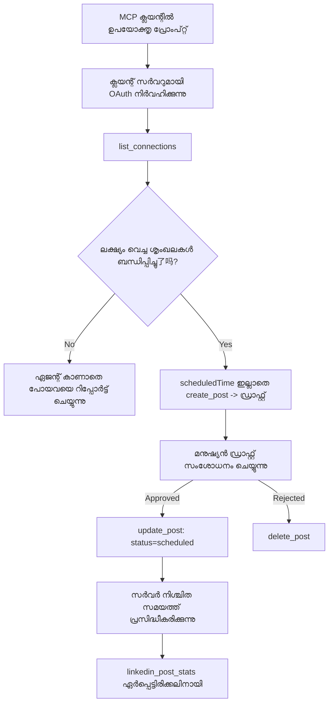

# കേസ് സ്റ്റഡി: ഒരു ഏജന്റ് ഉപയോഗിച്ച് റിമോട്ട് MCP സർവറിൽ നിന്നുള്ള സോഷ്യൽ നെറ്റ്വർക്കുകളിൽ പ്രസിദ്ധീകരണം

> **അസ്വീകാരം:** कई സേവനങ്ങൾ, ഓപ്പൺ-സോഴ്സ് പ്രോജക്ടുകൾ സോഷ്യൽ നെറ്റ്വർക്കുകളിൽ പ്രസിദ്ധീകരിക്കാൻ കഴിയും, ഒരു ടീം ഓരോ നെറ്റ്വർക്കിന്റെ API നേരിട്ട് ഇന്റഗ്രേറ്റ് ചെയ്യാം. താഴെ കാണിക്കുന്ന രംഗം ഒരു **എഴുത്ത് ചെയ്യാൻ കഴിയുന്ന റിമോട്ട് MCP സർവർ** എങ്ങനെ രൂപകൽപ്പനചെയ്യുകയും ഉപയോഗിക്കുകയും ചെയ്യാം എന്നൊന്നുമാത്രം പ്രവർത്തിച്ച ഉദാഹരണമായി കൊടുക്കുന്നു. Publora ഒരു വ്യാപാര സേവനമാണ്, എന്നാൽ ഫ്രീ ടിയർ ഉണ്ട്; ഇവിടെ വിവരിച്ച പാറ്റേണുകൾ ഉപയോക്താവിന്റെ നിർവൈറ്റ ക്രിയകൾ നടത്തുന്ന ഏതൊരു MCP സർവർ-ലും ബാധകമാണ്.

## അവലോകനം

ഏജന്റുകൾ ഉള്ളടക്കം ക്രാഫ്റ്റ് ചെയ്യുന്നതിൽ നന്നാണ്, ഡെലിവറി ചെയ്യുന്നതിൽ ബുദ്ധിമുട്ട് അനുഭവപ്പെടുന്നു. ഒരു മോഡൽ സെക്കൻഡുകൾക്കുള്ളിൽ ഒരു പ്രഖ്യാപന വാർത്ത എഴുതാം, പിന്നെ പണി ഇനി നിർത്തും: പ്രസിദ്ധീകരിക്കുന്നത് ഓരോ നെറ്റ്വർക്കിനും API വേണം, ഓരോ നെറ്റ്വർക്കിനും OAuth ആപ്പ് വേണം, കൂടാതെ ഓരോന്നിനും വ്യത്യസ്ത മീഡിയ നിയമങ്ങൾ വേണം. കൂടുതലായി ടീംതലങ്ങൾ ഈ പ്രശ്നം കൈകാര്യം ചെയ്യുന്നത് ടെക്‌സ്‌റ്റ് ബ്രൗസറിലേക്ക് കൈകൊണ്ടു കോപ്പി ചെയ്യുന്നതാണ്.

ഈ കേസ് സ്റ്റഡി അവസാനഘട്ടം ഒരൊറ്റ റിമോട്ട MCP സർവറിലൂടെ എങ്ങനെ പൂർത്തിയാക്കാമെന്ന് പരിശോധിക്കുന്നു, കൂടാതെ — ഒരാൾക്ക് ഒരു **എഴുത്ത്-ശേഷിയുള്ള** MCP സർവർ നിർമ്മിക്കാൻ ഉപയോഗപ്രദമായ — രൂപകൽപ്പനാ തീരുമാനങ്ങൾ എന്തെല്ലാം ശരിയാക്കണം എന്ന് വിലയിരുത്തുന്നു. ഡാറ്റ വായിക്കുക ക്ഷമയുള്ളതാണ്. പ്രസിദ്ധീകരണം അല്ല: തെറ്റായ ടൂൾ കോൾ പ്രേക്ഷകരെ മുന്നിൽ കാണാം, പിന്നെ തിരുത്താനാകില്ല.

## രംഗം

ഒരു ചെറിയ ഡെവലപ്പർ-സംബന്ധമായ ടീം ഒരു ഏജന്റിനുള്ളിൽ (Claude, VS Code, Cursor — ക്ലയന്റ് എന്തെന്ന് കാര്യമില്ല) പോസ്റ്റുകൾ തയ്യാറാക്കുന്നു. അവർ ഏജന്റെ ആഗ്രഹിക്കുന്നത്:

- ടീം കണക്റ്റ് ചെയ്തിരിക്കുന്ന സോഷ്യൽ അക്കൗണ്ടുകൾ കാണുക,
- ഒരു പോസ്റ്റ് ഡ്രാഫ്റ്റ് ആക്കികൊണ്ട് അത് മനുഷ്യൻ അംഗീകരിക്കാൻ ഡ്രാഫ്റ്റായി സൂക്ഷിക്കുക,
- ഒരു ചിത്രം ചേർക്കുക,
- നിശ്ചിത സമയത്ത് പല നെറ്റ്വർക്കിലും ഷെഡ്യൂൾ ചെയ്യുക,
- പിന്നീടെ ഇത് എങ്ങനെ നടന്നു എന്ന് റിപ്പോർട്ട് നൽകുക.

നിർണ്ണായകമായി, അവർ ആഗ്രഹിക്കുന്നത് ഏജന്റ് പരീക്ഷണാധീനമായിരിക്കുമ്പോൾ അവിടെ ദ്രുതഗതിയിൽ പ്രസിദ്ധീകരണം *അനാവശ്യമാണ്*.

## ഉപകരണങ്ങൾ

- [Publora MCP Server](https://github.com/publora/mcp-server) — പ്രസിദ്ധീകരണം, ഷെഡ്യൂളിംഗ്, മീഡിയ, LinkedIn അനലിറ്റിക്സ് ഉപകരണങ്ങൾ നിർവഹിക്കുന്ന ഒരു റിമോട്ട MCP സർവർ (`streamable-http`). ഔദ്യോഗിക MCP രജിസ്ട്രിയിൽ `com.publora/mcp-server` എന്ന പേരിൽ രജിസ്റ്റർ ചെയ്യപ്പെട്ടിരിക്കുന്നു.

## ഘട്ടം-സ്ഥലം പ്രവാഹം

1. **സർവർ കണക്റ്റ് ചെയ്യുക.** OAuth പ്രോട്ടോക്കോളുപയോഗിക്കുന്ന ക്ലയന്റുകൾ, പകർപ്പിന് PKCE ഉൾപ്പെടെയുള്ള authorization-code ഫ്‌ളോ പൂര്‍ത്തിയാക്കുന്നു; ഹെഡ്ലെസ് CLI പോലുള്ള ക്ലയന്റുകൾ, അല്ലെങ്കിൽ ഓഫർമുള്ളവർ, ഹെഡറിൽ ഒരു Publora API കീ ഉപയോഗിക്കുന്നു. രണ്ട് സംവിധാനങ്ങളും പിന്തുണയ്ക്കപ്പെടുന്നു, ഏത് വഴി ലഭിക്കുന്നത് ക്ലയന്റിനും സര്‍വറിനുമില്ലെന്ന് ആശ്രയിക്കുന്നു.
2. **കണക്ഷനുകൾ പട്ടികപ്പെടുത്തുക.** ഏജന്റ് `list_connections` വിളിച്ച് ഐഡന്റിഫയർസും ചേർന്നു കണക്ട് ചെയ്ത അക്കൗണ്ടുകളും ലഭിക്കുന്നു.
3. **ഡ്രാഫ്റ്റ് ചെയ്യുക.** ഏജന്റ് `create_post` വിളിച്ച് ഷെഡ്യൂൾ ചെയ്ത സമയം ഇല്ലാതെ പോസ്റ്റ് നിർമ്മിക്കുന്നു. പോസ്റ്റ് ഒരു ഡ്രാഫ്റ്റായി സൂക്ഷിക്കുന്നു — പ്രസിദ്ധീകരിക്കില്ല.
4. **മീഡിയ ചേർക്കുക.** പബ്ലിക് ഇമേജ് URL-കൾ ഒരേ കോളിൽ കൈമാറുന്നത്; സർവർ അവ ഡൗൺലോഡ് ചെയ്ത് വാലിഡേറ്റ് ചെയ്യും.
5. **ഷെഡ്യൂൾ ചെയ്യുക.** ഒരു മനുഷ്യൻ അംഗീകരിച്ച ശേഷം, `update_post` സ്റ്റാറ്റസ്സ് ഷെഡ്യൂൾ ചെയ്തതായി ISO 8601 സമയത്തോടെ സജ്ജമാക്കുന്നു.
6. **അളക്കുക.** LinkedIn-നായി, `linkedin_post_stats` പോസ്റ്റ് ലൈവ് ആകുമ്പോൾ ഏംഗേജ്‌മെന്റ് തിരികെ നൽകുന്നു.

## ഉദാഹരണ പ്രോമ്പ്റ്റ്

```text
Which social accounts do I have connected?
Draft a post announcing our new changelog page, attach the screenshot at
https://example.com/changelog.png, and keep it as a draft — do not publish it.
Once I approve, schedule it to LinkedIn and Bluesky for tomorrow at 09:00 UTC.
```

## മർമെയ്‍ഡ് ഫ്ലോചാർട്ട്



## സാങ്കേതിക നടപ്പാക്കലുകൾ

താഴെ കൊടുത്ത പാഠങ്ങൾ ഈ കേസ് സ്റ്റഡിയുടെ കൈമാറ്റം പാടുള്ള ഭാഗമാണ്.

### തുറന്ന അവലോകനം, ഓതന്റിക്കേറ്റഡ് നിർവഹണം

`tools/list` ക്രെഡൻഷ്യലുകൾ ഇല്ലാതെ സർവ്വ്വനു उपलब्धമാണ്; എല്ലാ `tools/call` കൾക്കും ടോക്കൺ ആവശ്യമാണ്, അല്ലെങ്കിൽ `401` `WWW-Authenticate` ഹെഡർ സൂചിപ്പിച്ച് തിരികെ നൽകും. (സർവർ ഒരു ഓതന്റിക്കേഷൻ ഇല്ലാത്ത `initialize` യും സപ്പോർട്ട് ചെയ്യുന്നു, അത് `2026-07-28` മുൻപ് പ്രകോൾ പതിപ്പുകൾക്കായാണ് പ്രധാനപ്പെട്ടത്; ആ അപ്ഡേറ്റ് ഹാൻഡ്‌ഷേക്ക് പൂർണമായും നീക്കിയിട്ടുണ്ട്.)

ഈ വിഭജനം പ്രയോജനം വഹിക്കുന്നു. രജിസ്ട്രികൾ, കാറ്റലോഗുകൾ, ക്ലയന്റുകൾ ടൂൾ സരഫേസ് വിശകലനം ചെയ്യാം — പേരുകൾ, സ്കീമകൾ, അനോട്ടേഷനുകൾ — രഹസ്യം പിൻഭാഗം വാങ്ങാതെ; അതേ സമയം ഒന്നും *നിർവ്വഹിക്കാനാകില്ല* അനോണാമസായി. `initialize` ടോക്കൺ ആവശ്യപ്പെടുന്ന ഒരു സർവർ ടൂളിംഗിനും മറയാകും; അനോണിമസ് `tools/call` അനുവദിക്കുന്ന സർവർ അപകടകാരിയാണ്.

### രജിസ്ട്രേഷൻ: ഡൈനാമിക് ക്ലയന്റ് രജിസ്ട്രേഷൻ, അതും എന്താണ് പകരംകൂടിയിരിക്കുന്നത്

സർവർ `/.well-known/oauth-protected-resource` ਅਤੇ `/.well-known/oauth-authorization-server` പ്രചരിപ്പിച്ച് PKCE (`S256`), റിഫ്രെഷ് ടോക്കൺസുകൾ, കൂടാതെ **ഡൈനാമിക് ക്ലയന്റ് രജിസ്ട്രേഷൻ** പിന്തുണയ്ക്കുന്നു.

ഡൈനാമിക് രജിസ്ട്രേഷൻ മാനുവൽ ഘട്ടം ഒഴിവാക്കുന്നു: ഇല്ലെങ്കിൽ ഓരോ ക്ലയന്റിനും മുൻകൂർ നൽകിയ `client_id` വേണം, അതിന് ഓരോ പുതിയ ക്ലയന്റിനും വിൽപ്പനക്കാരനോട് ഔട്ട്-ഓഫ്-ബാൻഡ് അഭ്യർത്ഥന വേണം.

ഇതിനെ പകർപ്പിന്റെ രൂപകൽപ്പനയല്ല, സ്ഥിരത കൊണ്ടുള്ള പെരുമാറ്റമായി കാണുക. `2026-07-28` വ്യവസ്ഥാപനത്തിന്റെ പരിഷ്കരണം ഡൈനാമിക് രജിസ്ട്രേഷൻ ഒഴിവാക്കി Client ID Metadata Documents (CIMD) ഉം, ഇവിടെ ക്ലയന്റ് ഒരു സ്ഥിരമായ HTTPS URL-ൽ മെറ്റഡാറ്റ ഡോക്യൂമെന്റ് ഹോസ്റ്റ് ചെയ്തു അത് തന്നെ `client_id` ആകുന്നു. DCR ഇപ്പോൾ പ്രവർത്തിക്കുന്നു, എന്നാൽ ഇന്നത്തെ നിർമാണം CIMD-ക്ക് സജ്ജമാവുകയും DCR പഴയ ക്ലയന്റുകൾക്കായി മാത്രം നിലനിർത്തുകയും വേണം.

### ടൂൾ അനോട്ടേഷനുകൾ അലങ്കാരമല്ല

എല്ലാ ടൂൾസിനും `title` ഉം അനുയോജ്യമായ സൂചനകൾ: `readOnlyHint`, `destructiveHint`, `idempotentHint`, `openWorldHint` ഉം ഉണ്ട്.

അവയിൽ നിക്ഷേപിക്കാൻ രണ്ട് കാരണങ്ങൾ ഉണ്ട്. ആദ്യമായി, ക്ലയന്റുകൾ ഈ സൂചനകളുപയോഗിച്ച് ഉപയോക്താവിനോട് എന്ത് സ്ഥിരീകരിക്കണം എന്ന് തീരുമാനിക്കുന്നു — ക്ലയന്റ് വായന മാത്രം ചെയ്യുന്ന ലുക്കപ്പ് ഓട്ടോമാറ്റിക്കായി നടത്തുകയും നീക്കം ചെയ്യുമ്ബോൾ അംഗീകാരം തേടുക. നിർദ്ദേശം അനുമതി സംവിധാനം അല്ല, അവ അങ്ങേയറ്റം വിശ്വാസയോഗ്യമല്ല: അവ ക്ലയന്റ് നൽകുന്ന പ്രവർത്തനരൂപം നന്നാക്കുന്നു, സർവർ ഇല്ലാതെ തടയുന്നില്ല, സർവർ സ്വന്തം നിയമങ്ങൾ പാലിക്കണം. രണ്ടാമതായി, പ്രധാന കണക്റ്റർ ഡയറക്ടറികൾ അവ അവരഹിതമായി പരിശോധിക്കാൻ ആവശ്യപ്പെടുന്നു; ടൂളുകൾക്ക് തലക്കെട്ടുകളോ സൂചനകളോ ഇല്ലാത്ത സർവർ ഫലപ്രദമായി പ്രവർത്തിച്ചാലും തിരിച്ചയയ്ക്കപ്പെടും.

### ഐഡന്റിഫയർസുകൾ കണ്ടുകിടക്കാൻ പാടില്ല

പ്ലാറ്റ്ഫോം ഐഡന്റിഫയർസുകൾ 'list_connections' വഴി ലഭിക്കാനാകുന്ന പരധമായ സ്ട്രിങുകളാണ്, സ്കീമ വിശദീകരണം വ്യക്തമായി പറയുന്നത് അവ കോപ്പി ചെയ്ത് സൂക്ഷിക്കണം, ഒരിക്കലും കരുതലായി കണ്ടുപിടിക്കാൻ കഴിയില്ല എന്ന് പറയുന്നു. സർവർ മറ്റെന്തെങ്കിലും തള്ളുന്നു.

മോഡലുകൾ ഭാഷാശൈലി ഉപയോഗിച്ച് കാര്യങ്ങൾ ഒറ്റക്കെട്ടായി പൊറുതിയാക്കും. എഴുത്ത് കഴിവുള്ള ഓരോ MCP സർവർഉം ഐഡന്റിഫയർ eventually ഹല്യൂസിനേറ്റ് ചെയ്യും എന്ന് കരുതി ഈ വഴിയിൽ വേഗം പരാജയപ്പെടണം, പകരം പ്ര്യോജനം ഒരു സാധാരണ മൂല്യം ഉപയോഗിച്ച് പ്രവർത്തിക്കരുത്.

### പ്രസിദ്ധീകരിക്കുമ്പോൾ പരാജയപ്പെട്ടു, പ്രവർത്തന സൂചനയോടെ

ചില ശൃംഖലകൾ ടെക്‌സ്‌റ്റ് മാത്രം പോസ്റ്റുകൾ ഒഴിവാക്കുകയും ഒരു ചിത്രം അല്ലെങ്കിൽ വീഡിയോ ആവശ്യപ്പെടുകയും ചെയ്യുന്നു. അത് പോസ്റ്റ് ഷെഡ്യൂൾ ചെയ്യുമ്പോൾ പരിശോധിക്കപ്പെടുന്നു, ഏത് പ്ലാറ്റ്ഫോം ആണ് പ്രശ്നം, പോസ്റ്റ് ചെയ്യാനുള്ള ആവശ്യംെന്നും പിഴവ് പേരുകേട്ടിരിക്കുന്നു.

ഏജന്റ് "Instagram മീഡിയ ആവശ്യമാണ് — ഒരു ചിത്രം അല്ലെങ്കിൽ വീഡിയോ ചേർക്കുക" എന്ന പിഴവിൽ നിന്നും ഒരു കൂടി ചുറ്റിലും രക്ഷപെടാം. ജനറിക് `400` പിഴവിൽ നിന്ന് ദുരിതം ഒഴിവാക്കാനാകില്ല.

### പുനഃസംരംഭങ്ങൾ സുരക്ഷിതമാക്കുക

സൃഷ്ടിക്കുന്ന രണ്ട് ടൂളുകൾ, `create_post` ഉം `update_post` ഉം idempotency കീ സ്വീകരിക്കുന്നു: അതേകീ വേറെ അപേക്ഷകളുമായി ഉപയോഗിക്കുമ്പോൾ ആദ്യ പ്രതികരണത്തോടെ തിരിച്ചുകേൾവീൽ വീണ്ടും പോസ്റ്റ് തീരുമെന്നില്ല. ഏജന്റ് റൺടൈം ടൈംഔട്ടിൽ വീണ്ടും ശ്രമിക്കുന്നു; idempotency ഇല്ലാതെ, മന്ദഗാമിയായ പ്രതികരണം ഡ്യൂപ്ലിക്കറ്റ് പ്രസിദ്ധീകരണമാകും. മറ്റ് എഴുത്ത് ഉപകരണങ്ങൾ — ഡിലീഷനുകൾ, മീഡിയ ഘട്ടങ്ങൾ, LinkedIn പ്രതികരണങ്ങളും കമന്റുകളും — കീ സ്വീകരിക്കുന്നില്ല, ആകെയർ-പുനഃസംരംഭം സ്വയം സുരക്ഷിതമല്ല. നിങ്ങളുടെ സംവരണം സംരക്ഷിക്കപ്പെട്ടതും ആരും അല്ലാത്തതും അറിയുക പ്രധാനമാണ്.

### ഒന്നും പ്രസിദ്ധീകരിക്കാത്ത രീതിയിൽ പരീക്ഷിക്കാൻ വഴി നൽകുക

സർവർ `publora-playground` എന്ന സംരക്ഷിത ലക്ഷ്യം അംഗീകരിക്കുന്നു, ഇത് ശരിയായ ഗമ്യസ്ഥാനമോ പോലെ പരിശോധിച്ച് അംഗീകരിക്കുകയും പിന്നീട് ഉപേക്ഷിക്കുകയും ചെയ്യും — ഒന്നും ലൈവ് അക്കൗണ്ടിൽ എത്തില്ല. ഇത് ടൂൾ സ്കീമയിലും വിശദീകരിച്ചിരിക്കുന്നു, യഥാർത്ഥ കണക്ഷൻ ആവശ്യമില്ലാത്ത ഒരു കണക്ഷൻ-ടെസ്റ്റ് ലക്ഷ്യമെന്നാണ് വിശദീകരണം: പോസ്റ്റ് അംഗീകരിക്കപ്പെടുകയും ഉപേക്ഷിക്കപ്പെടുകയും ചെയ്യുന്നു, ഒന്നും പ്രസിദ്ധീകരിക്കില്ല. ഇതിന് മാത്രം `platforms: ["publora-playground"]` എന്ന എന്റ്രി നൽകുക.

ഇതാണ് മുഴുവൻ ടൂളുകളുടെ ഉപരിതലത്തിൽ ഏറ്റവും പ്രയോജനപ്പെട്ട ഒരു വിശദാംശമായി മാറിയത്. കണക്റ്റർ ഡയറക്ടറി റിവ്യൂവുകൾ, സംഭാവകര്‍, CI യുമായി ബന്ധപ്പെട്ടവർ വിനിയോഗ പ്രവർത്തനങ്ങൾ എത്ര ദോഷമില്ലാതെ പരമാവധി ചെയ്യാമെന്നു ഉറപ്പാക്കുന്നു. MCP സർവർ തിരിച്ചറിയാനിടയായുള്ള നടപടികൾക്ക് രേഖപ്പെടുത്തിയ ഒരു നോ-ഓപ്പ് ലക്ഷ്യം ഉപകരിക്കും.

## ഫലംകളും പ്രഭാവവും

- പ്രസിദ്ധീകരണ ഘട്ടം ബ്രൗസറിൽ നിന്ന് ഉള്ളടക്കം എഴുതുന്ന അതേ സംഭാഷണത്തിലേക്ക് മാറ്റപ്പെട്ടു, ഡ്രাফ്റ്റ്-പ്രഥമ പ്രാക്ടീസ് മനുഷ്യനെ ലൂപ്പിൽ സൂക്ഷിക്കുന്നു. അത് നിശ്ചിതമായി മനസ്സിലാക്കുക: ഡ്രാഫ്റ്റ് ഒരു ഉടമ്പടിയാണ്, അതൊരു പരിധി അല്ല. ഒരേ ക്രെഡൻഷ്യൽ ഷെഡ്യൂൾ ചെയ്യാൻ അല്ലെങ്കിൽ പ്രസിദ്ധീകരിക്കാൻ കഴിയും, അതിനാൽ യഥാർത്ഥ അംഗീകാരം വേണമെങ്കിൽ ഉപകരണം ഉപരിതലത്തിനപ്പുറം പ്രയോഗിക്കണം — വ്യത്യസ്ത ക്രെഡൻഷ്യലുകൾ, അല്ലെങ്കിൽ സർവറിന്റെ മുൻപിൽ ഒരു നയം വീതി.
- ഓരോ നെറ്റ്വർക്കിന്റെയും വ്യത്യാസങ്ങൾ — മീഡിയ ആവശ്യം, ത്രെഡിങ്ങ്, മറുപടി നിയന്ത്രണങ്ങൾ — സർവറിൽ ഒറ്റത്തവണ കൈകാര്യം ചെയ്യുന്നു, ഓരോ ഏജന്റിലും അല്ല.
- ഒരേ സർവർ നിരവധി MCP ക്ലയന്റിനെ പിന്തുണയ്ക്കുന്നു, ഓരോ ക്ലയന്റിനും പ്രത്യേകം പ്രവർത്തന വേണമില്ല, കാരണം അവലോകനം തുറന്നും രജിസ്ട്രേഷൻ ഡൈനാമിക്കും ആണ്.
- മുകളിൽ പറയുന്ന രൂപകൽപ്പന നിയന്ത്രണങ്ങളെ ഉപയോക്താക്കളാൽ മാത്രമല്ല, കണക്റ്റർ ഡയറക്ടറി റിവ്യൂവുകളും രൂപപ്പെടുത്തുന്നു: അനോട്ടേഷനുകൾ, OAuth, സുരക്ഷിത പരിശോധന ലക്ഷ്യം ഇവയിൽ ഓരോതും ആവശ്യമായിരുന്നു.

## റഫറൻസുകൾ

- [Publora MCP Server (സ്രോതസ്സ്)](https://github.com/publora/mcp-server)
- [Publora API and MCP ഡോക്യൂമെന്റേഷൻ](https://docs.publora.com)
- [MCP രജിസ്ട്രി എൻട്രി: `com.publora/mcp-server`](https://registry.modelcontextprotocol.io/v0/servers?search=com.publora/mcp-server)
- [MCP നിർദ്ദിഷ്ടം — അനുമതി](https://modelcontextprotocol.io/specification/draft/basic/authorization)
- [MCP നിർദ്ദിഷ്ടം — ടൂൾ അനോട്ടേഷൻസുകൾ](https://modelcontextprotocol.io/docs/concepts/tools)

## അടുത്തത്

- നിങ്ങൾ നിർമ്മിക്കുന്ന MCP സർവർ എടുത്ത് ഇവിടെ പറയുന്ന മൂന്ന് ലഘുവായ വിജയങ്ങൾ പരിശോധിക്കുക: എല്ലാ ടൂളുകൾക്കും അനോട്ടേഷനുകൾ, എല്ലാ എഴുത്തുകൾക്കും idempotency കീ, രേഖപ്പെടുത്തിയ നോ-ഓപ്പ് ലക്ഷ്യം.
- തുറന്ന അവലോകന വിഭജനം ശ്രമിക്കുക: ഹെഡർ ഇല്ലാതെ ഒരു പബ്ലിക് റിമോട്ട സർവറിന് `tools/list` വിളിക്കുക, അപ്പോൾ ടൂൾ വിളിച്ച് `401` ചാലഞ്ച് പരിശോധിക്കുക.
- നിങ്ങളുടെ മേഖലയിൽ "അൺഡു" എന്താകും എന്നു പരിഗണിക്കുക. പ്രസിദ്ധീകരണത്തിന് ഡ്രാഫ്റ്റുകളും ഡിലീഷനും ഉണ്ട്; നിങ്ങളുടെ പ്രവർത്തനങ്ങൾക്ക് തുല്യമായ ഒന്നില്ലെങ്കിൽ, സ്ഥിരീകരണം ടൂൾ രൂപകൽപ്പനയിലാകണം, പ്രോമ്പ്റ്റിൽ അല്ല.

---

<!-- CO-OP TRANSLATOR DISCLAIMER START -->
**അറിയിപ്പ്**:
ഈ രേഖ AI പരിഭാഷാ സേവനം [Co-op Translator](https://github.com/Azure/co-op-translator) ഉപയോഗിച്ച് പരിഭാഷപ്പെടുത്തിയതാണ്. ഞങ്ങൾ കൃത്യതയ്ക്കായി ശ്രമിക്കുന്നുവെങ്കിലും, ഓട്ടോമേറ്റഡ് പരിഭാഷകളിൽ പിഴവുകൾ അല്ലെങ്കിൽ തെറ്റായ വിവരങ്ങൾ ഉണ്ടാകാൻ സാധ്യതയുണ്ട്. അതിന്റെ സ്വാഭാവിക ഭാഷയിലുള്ള അസൽ രേഖയാണ് പ്രാമാണികമായ ഉറവിടമായി പരിഗണിക്കേണ്ടത്. നിർണായകമായ വിവരങ്ങൾക്ക്, പ്രൊഫഷണൽ മനുഷ്യ പരിഭാഷ ശുപാർശ ചെയ്യുന്നു. ഈ പരിഭാഷ ഉപയോഗിച്ച് ഉണ്ടാകുന്ന തെറ്റിദ്ധാരണകൾ അല്ലെങ്കിൽ തെറ്റായ വ്യാഖ്യാനങ്ങൾക്കായി ഞങ്ങൾ ഉത്തരവാദികളല്ല.
<!-- CO-OP TRANSLATOR DISCLAIMER END -->