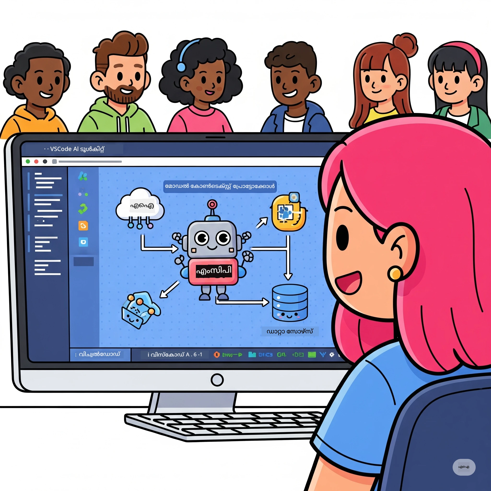

# എഐ പ്രവൃത്തി പ്രവാഹങ്ങൾ ലളിതമാക്കൽ: മൈക്രോസോഫ്റ്റ് ഫൗണ്ട്രി ടൂൾകിറ്റ് ഉപയോഗിച്ച് MCP സർവർ നിർമ്മാണം

## 🎯 അവലോകനം

_(ഈ പാഠത്തിന്റെ വീഡിയോകൾ കാണാൻ മുകളിലുള്ള ചിത്രം ക്ലിക്കുചെയ്യുക)_

**മോഡൽ കോൺടെക്സ്റ്റ് പ്രോട്ടോക്കോൾ (MCP) വർക്ക്‌ഷോപ്പിലേക്ക് സ്വാഗതം!** ഈ സമഗ്രമായ ഫോളോ-ആൻഡ്-ലേണിംഗ് വർക്ക്‌ഷോപ്പ് എഐ ആപ്ലിക്കേഷൻ വികസനത്തെ വിപ്ലവകരമാക്കുന്നതിനായി രണ്ട് മുൻനിര സാങ്കേതികവിദ്യകൾ സംയോജിപ്പിക്കുന്നു:

> **സമരസ്യ നോട്ടീസ്:** വർക്ക്‌ഷോപ്പ് കോഡ് MCP
> `2025-11-25` ഉപയോഗിച്ച് നിർമ്മിക്കുകയും പരിശോധിക്കുകയും ചെയ്തിരിക്കുന്നു,
> മുകളിൽ കാണിക്കുന്ന ബാഡ്ജ് പ്രകാരം. പുതിയ പ്രോട്ടോക്കോൾ നടപ്പിലാക്കലുകൾക്കായി
> [നിലവിലെ `2026-07-28` സവിശേഷത](https://modelcontextprotocol.io/specification/2026-07-28/)
> ഉപയോഗിക്കുക, ലാബുകൾ മാറ്റിവയ്ക്കുന്നതിനു മുൻപ് SDK റിലീസ് കുറിപ്പുകൾ പരിശോധിക്കുക.

- **🔗 മോഡൽ കോൺടെക്സ്റ്റ് പ്രോട്ടോക്കോൾ (MCP)**: എഐ ടൂൾസുമായി ആവശ്യമായ ഇന്റഗ്രേഷനുകൾ എളുപ്പമാക്കുന്ന തുറന്ന നിലവാരത്തിലുള്ള പ്രോട്ടോക്കോൾ
- **🛠️ മൈക്രോസോഫ്റ്റ് ഫൗണ്ട്രി ടൂൾകിറ്റ് എക്സ്റ്റൻഷൻ ഫോർ VS കോഡ്**: മൈക്രോസോഫ്റ്റിന്റെ ശക്തമായ എഐ വികസന എക്സ്റ്റൻഷൻ

### 🎓 നിങ്ങൾ പഠിക്കുന്നതെന്താണ്

ഈ വർക്ക്‌ഷോപ്പിന്റെ അവസാനം, എഐ മോഡലുകൾ യഥാർത്ഥ ലോക ഉപകരണങ്ങളുമായി ബന്ധിപ്പിക്കുന്ന ബുദ്ധിമുട്ടുള്ള ആപ്പ്ലിക്കേഷനുകൾ നിർമ്മിക്കുന്നതിൽ നിങ്ങൾ മികവുറ്റവരാകും. ഓട്ടോമേറ്റഡ് ടെസ്റ്റിംഗിൽ നിന്നും കസ്റ്റം API ഇന്റഗ്രേഷനുകൾവരെ വൈദഗ്ധ്യം നേടുക.

## 🏗️ സാങ്കേതിക സ്റ്റാക്ക്

### 🔌 മോഡൽ കോൺടെക്സ്റ്റ് പ്രോട്ടോക്കോൾ (MCP)

MCP ആണ് **"എഐക്കുള്ള USB-C"** - എഐ മോഡലുകൾക്ക് ബാഹ്യ ഉപകരണങ്ങളുമായി ബന്ധത്തിനുള്ള സർവജനീനം സ്റ്റാൻഡേർഡ്.

**✨ പ്രധാന പ്രത്യേകതകൾ:**

- 🔄 **സ്റ്റാൻഡാർഡ് ഇന്റഗ്രേഷൻ**: എഐ-ടൂൾ കണക്ഷനുകൾക്കുള്ള സർവജനീന ഇന്റർഫേസ്
- 🏛️ **ഫ്ലെക്സിബിൾ ആർക്കിടെക്ചർ**: ലോക്കൽ & ദൂരത്തിലുള്ള സർവറുകൾ stdio/SSE ട്രാൻസ്പോർട്ടിലൂടെ
- 🧰 **സമ്പന്നമായ ഇക്കോസിസ്റ്റം**: ടൂളുകൾ, പ്രോംപ്ടുകൾ, ഉറവിടങ്ങൾ എന്നിവ ഒരു പ്രോട്ടോക്കോളിൽ
- 🔒 **എന്റർപ്രൈസ്- റെഡി**: ഇൻ-ബിൽറ്റ് സുരക്ഷയും വിശ്വാസ്യതയും

**🎯 MCP എന്തുകൊണ്ട് പ്രധാനമാണ്:**
USB-C കേബിൾ പാളിച്ചകളെ മാറ്റിയപോലെ, MCP എഐ ഇന്റഗ്രേഷനുകളുടെ സങ്കീർണത നീക്കംചെയ്യുന്നു. ഒരു പ്രോട്ടോക്കോൾ, അനന്ത സാധ്യതകൾ.

### 🤖 മൈക്രോസോഫ്റ്റ് ഫൗണ്ട്രി ടൂൾകിറ്റ് എക്സ്റ്റൻഷൻ ഫോർ VS കോഡ്

മൈക്രോസോഫ്റ്റിന്റെ പ്രധാന എഐ വികസന എക്സ്റ്റൻഷൻ, VS കോഡ് അറങ്ങിനെ എഐ ശക്തി കേന്ദ്രമാക്കുന്നു.

**🚀 പ്രധാന കഴിവുകൾ:**

- 📦 **മോഡൽ കാറ്റലോഗ്**: Azure AI, GitHub, Hugging Face, Ollama എന്നിവയിൽ നിന്നുള്ള മോഡലുകൾ ആക്സസ് ചെയ്യുക
- ⚡ **ലോകൽ ഇൻഫറൻസ്**: ONNX-ഓപ്റ്റിമൈസ്ഡ് CPU/GPU/NPU എക്സിക്യൂഷൻ
- 🏗️ **എജന്റ് ബിൽഡർ**: MCP ഇന്റഗ്രേഷനോടുകൂടുന്ന വീഡിയൽ എഐ ഏജന്റ് വികസനം
- 🎭 **മൾട്ടി-മോഡൽ**: ടെക്സ്റ്റ്, വീക്ഷണം, ഘടനാമേഘല ഔട്ട്‌പുട്ട് പിന്തുണ

**💡 വികസനത്തിന് ഗുണങ്ങൾ:**

- സീറോ കോൺഫിഗ് മോഡൽ ഡിപ്പ്ലോയ്മെന്റ്
- വീジュൽ പ്രോംപ്റ്റ് എഞ്ചിനീയറിംഗ്
- റിയൽ-ടൈം ടെസ്റ്റിംഗ് പ്ലേഗ്രൗണ്ട്
- സിമ്ലസ്സ് MCP സർവർ ഇന്റഗ്രേഷൻ

## 📚 പഠന യാത്ര

### [🚀 മോഡ്യൂൾ 1: മൈക്രോസോഫ്റ്റ് ഫൗണ്ട്രി ടൂൾകിറ്റ് അടിസ്ഥാനങ്ങൾ](./lab1/README.md)

**ദൈർഘ്യം**: 15 മിനിറ്റ്

- 🛠️ മൈക്രോസോഫ്റ്റ് ഫൗണ്ട്രി ടൂൾകിറ്റ് ഇൻസ്റ്റാൾ ചെയ്ത് കോൺഫിഗർ ചെയ്യുക
- 🗂️ മോഡൽ കാറ്റലോഗ് (GitHub, ONNX, OpenAI, Anthropic, Google എന്നിവയിൽ നിന്നുള്ള 100+ മോഡലുകൾ) പരിശോധിക്കുക
- 🎮 റിയൽ-ടൈം മോഡൽ ടെസ്റ്റിംഗിനുള്ള ഇന്ററാക്ടീവ് പ്ലേഗ്രൗണ്ട് സൈത്യം നേടുക
- 🤖 ആദ്യം നിങ്ങളുടെ എഐ ഏജന്റ് Agent Builder ഉപയോഗിച്ചു നിർമിക്കുക
- 📊 ഇൻ-ബിൽറ്റ് മീറ്റ്രിക്സുകളാൽ മോഡൽ പ്രകടനം അളക്കുക (F1, പ്രസക്തത, സമാനത, സാദൃശ്യം)
- ⚡ ബാച്ച് പ്രോസസ്സിംഗ്, മൾട്ടി-മോഡൽ പിന്തുണ കഴിവുകൾ അറിയുക

**🎯 പഠന ഫലം**: മൈക്രോസോഫ്റ്റ് ഫൗണ്ട്രി ടൂൾകിറ്റ് കഴിവുകൾ പൂർണമായി മനസ്സിലാക്കി പ്രവർത്തനക്ഷമമായ എഐ ഏജന്റ് സൃഷ്‌ടിക്കുക

### [🌐 മോഡ്യൂൾ 2: MCP മൈക്രോസോഫ്റ്റ് ഫൗണ്ട്രി ടൂൾകിറ്റ് അടിസ്ഥാനങ്ങൾ](./lab2/README.md)

**ദൈർഘ്യം**: 20 മിനിറ്റ്

- 🧠 മോഡൽ കോൺടെക്സ്റ്റ് പ്രോട്ടോക്കോൾ (MCP) ആർക്കിടെക്ചറും ആശയങ്ങളും കൈകാര്യം ചെയ്യുക
- 🌐 മൈക്രോസോഫ്റ്റിന്റെ MCP സർവർ ഇക്കോസിസ്റ്റം പര്യവേക്ഷണം ചെയ്യുക
- 🤖 Playwright MCP സർവർ ഉപയോഗിച്ച് ബ്രൗസർ ഓട്ടോമേഷൻ ഏജന്റ് നിർമ്മിക്കുക
- 🔧 MCP സർവറുകൾ മൈക്രോസോഫ്റ്റ് ഫൗണ്ട്രി ടൂൾകിറ്റ് Agent Builder-ഇനൊപ്പം സംയോജിപ്പിക്കുക
- 📊 നിങ്ങളുടെ ഏജന്റുകളിൽ MCP ടൂളുകൾ കോൺഫിഗർ ചെയ്ത് പരീക്ഷിക്കുക
- 🚀 MCP-ശക്തിയുള്ള ഏജന്റുകൾ പ്രൊഡക്ഷൻ ഉപയോഗത്തിനായി എക്സ്പോർട്ട് ചെയ്ത് വിനിയോഗിക്കുക

**🎯 പഠന ഫലം**: MCP വഴി ബാഹ്യ ഉപകരണങ്ങളാൽ ശക്തിപ്പെടുത്തിയ എഐ ഏജന്റ് വിനിയോഗിക്കുക

### [🔧 മോഡ്യൂൾ 3: മൈക്രോസോഫ്റ്റ് ഫൗണ്ട്രി ടൂൾകിറ്റ് ഉപയോഗിച്ചുള്ള ഉന്നത MCP വികസനം](./lab3/README.md)

**ദൈർഘ്യം**: 20 മിനിത്

- 💻 മൈക്രോസോഫ്റ്റ് ഫൗണ്ട്രി ടൂൾകിറ്റ് ഉപയോഗിച്ച് കസ്റ്റം MCP സർവറുകൾ സൃഷ്‌ടിക്കുക
- 🐍 ഏറ്റവും പുതിയ MCP പൈഥൺ SDK (v1.9.3) കോൺഫിഗർ ചെയ്ത് ഉപയോഗിക്കുക
- 🔍 ഡീബഗിംഗിനായി MCP ഇന്‌സ്പെക്ടർ സജ്ജമാക്കുക, ഉപയോഗിക്കുക
- 🛠️ പ്രൊഫഷണൽ ഡീബഗിംഗുള്ള ഒരു വെതർ MCP സർവർ നിർമ്മിക്കുക
- 🧪 Agent Builder-ഉം ഇന്‍സ്പെക്ടറും ഉൾപ്പെടെയുള്ള പരിസ്ഥിതികളിൽ MCP സർവറുകൾ ഡീബഗ് ചെയ്യുക

**🎯 പഠന ഫലം**: ആധുനിക ടൂളിങ്ങിന്റെ സഹായത്തോടെ കസ്റ്റം MCP സർവറുകൾ വികസിപ്പിക്കുകയും ഡീബഗ് ചെയ്യുകയുമാണ്

### [🐙 മോഡ്യൂൾ 4: പ്രായോഗിക MCP വികസനം - കസ്റ്റം GitHub ക്ലോൺ സർവർ](./lab4/README.md)

**ദൈർഘ്യം**: 30 മിനിറ്റ്

- 🏗️ വികസന പ്രവൃത്തി പ്രവാഹങ്ങൾക്കായി യഥാർത്ഥ ലോക GitHub ക്ലോൺ MCP സർവർ നിർമ്മിക്കുക
- 🔄 സ്ഥിരീകരണവും പിശക് കൈകാര്യം ചെയ്യലും സജ്ജമാക്കിയ ബുദ്ധിമുട്ടില്ലാത്ത റിപോസിറ്ററി ക്ലോണിംഗ് നടപ്പിലാക്കുക
- 📁 ബുദ്ധിമുട്ടില്ലാതെ ഡയറക്ടറി മാനേജ്മെന്റ് സൃഷ്ടിക്കുകയും VS കോഡ് ഇന്റഗ്രേറ്റ് ചെയ്യുകയും ചെയ്യുക
- 🤖 GitHub Copilot ഏജന്റ് മോഡ് സജ്ജീകരിച്ച് കസ്റ്റം MCP ടൂളുകൾ ഉപയോഗിക്കുക
- 🛡️ പ്രൊഡക്ഷൻ- റെഡി വിശ്വാസ്യതയും ക്രോസ്-പ്ലാറ്റ്ഫോം സംരക്ഷണവും പ്രയോഗിക്കുക

**🎯 പഠന ഫലം**: യഥാർത്ഥ വികസന പ്രവൃത്തി പ്രവാഹങ്ങളെ ലളിതമാക്കുന്ന പ്രൊഡക്ഷൻ- റെഡി MCP സർവർ വിനിയോഗിക്കുക

## 💡 യഥാർത്ഥ ലോക പ്രയോഗങ്ങളും പാഠവും

### 🏢 എന്റർപ്രൈസ് ഉപയോഗ കേസുകൾ

#### 🔄 ഡെവ്ഓപ്സ് ഓട്ടോമേഷൻ

ബുദ്ധിമുട്ടില്ലാത്ത ഓട്ടോമേഷൻ ഉപയോഗിച്ച് നിങ്ങളുടെ വികസന പ്രവൃത്തി പ്രവാഹം പരിഷ്കരിക്കുക:

- **സ്മാർട്ട് റിപോസിറ്ററി മാനേജ്‌മെന്റ്**: എഐ നിർബന്ധിത കോഡ് റിവ്യൂയും മർജ് തീരുമാനങ്ങളും
- **ബുദ്ധിമുട്ടില്ലാത്ത CI/CD**: കോഡ് മാറ്റങ്ങൾ അടിസ്ഥാനമാക്കി ഓട്ടോമേറ്റഡ് പൈപ്പ്‌ലൈൻ മെച്ചപ്പെടുത്തൽ
- **ഇഷ്യൂ ട്രൈയേജ്**: ഓട്ടോമാറ്റിക് പിഴവി വർഗീകരണവും നിയോഗവും

#### 🧪 ഗുണനിലവാര ഉറപ്പ് വിപ്ലവം

എഐ അടിസ്ഥാനമാക്കിയ ഓട്ടോമേഷനിലൂടെ ടെസ്റ്റിംഗ് ഉയർത്തുക:

- **ബുദ്ധിമുട്ടില്ലാത്ത ടെസ്റ്റ് ജനറേഷൻ**: സമഗ്രമായ ടെസ്റ്റ് സൂട്ടുകൾ ഓട്ടോമാറ്റിക്കായി സൃഷ്ടിക്കുക
- **ദൃശ്യ റിപ്പ്രോഗ്രഷൻ ടെസ്റ്റിംഗ്**: എഐ സധിഷ്ടം UI മാറ്റം കണ്ടെത്തൽ
- **പ്രകടന നിരീക്ഷണം**: മുൻകൂട്ടി പ്രശ്നങ്ങൾ കണ്ടെത്തൽ, പരിഹാരം

#### 📊 ഡാറ്റ പൈപ്പ്ലൈൻ ബുദ്ധിമുട്ടില്ലാത്തതും ബുദ്ധിമുട്ടുള്ളതുമായ വിജ്ഞാനം

കൂടുതൽ മനസിലായ ഡേറ്റ പ്രോസസിംഗ് വർക്ഫ്ലോകൾ നിർമ്മിക്കൂ:

- **അഡാപ്റ്റീവ് ETL പ്രക്രിയകൾ**: സ്വയം-ഓപ്റ്റിമൈസേഷൻ ഡേറ്റ ട്രാൻസ്ഫർമേഷനുകൾ
- **അനോമലി ഡിറ്റക്ഷൻ**: റിയൽ ടൈം ഡേറ്റ ക്വാളിറ്റി മോണിറ്ററിംഗ്
- **ഇന്റലിജന്റ് റൂട്ടിംഗ്**: സ്മാർട്ട് ഡേറ്റ ഫ്ലോ മാനേജ്മെന്റ്

#### 🎧 ഉപഭോക്തൃ അനുഭവം മെച്ചപ്പെടുത്തൽ

മികവുറ്റ ഉപഭോക്തൃ ഇടപെടലുകൾ സൃഷ്ടിക്കുക:

- **സന്ദർഭ-ബോധമുള്ള പിന്തുണ**: ഉപഭോക്തൃ ചരിത്രത്തിലെ പ്രവേശനത്തോടെ AI ഏജന്റുകൾ
- **പ്രത്യക്ഷപ്രദമായ പ്രശ്ന പരിഹാരം**: പ്രവചനപരമായ ഉപഭോക്തൃ സേവനം
- **മൾട്ടി-ചാനൽ ഇന്റഗ്രേഷൻ**: വിവിധ പ്ലാറ്റ്‌ഫോമുകളിൽ ഐക്യപ്പെടുത്തിയ AI അനുഭവം

## 🛠️ മുൻപരിചയവും സജ്ജീകരണവും

### 💻 സിസ്റ്റം ആവശ്യങ്ങൾ

| ഘടകം | ആവശ്യം | കുറിപ്പുകൾ |
|-----------|-------------|-------|
| **ഓപ്പറേറ്റിംഗ് സിസ്റ്റം** | Windows 10+, macOS 10.15+, Linux | ഏതെന്തെങ്കിലും ആധുനിക ഓ.എസ് |
| **വിഷ്വൽ സ്റ്റുഡിയോ കോഡ്** | ഏറ്റവും പുതിയ സ്ഥിരമായ പതിപ്പ് | Microsoft Foundry Toolkit-നായി ആവശ്യമാണ് |
| **Node.js** | v18.0+ and npm | MCP സെർവർ ഡവലപ്പ്മെന്റിനായി |
| **Python** | 3.10+ | Python MCP സെർവറുകൾക്കായി നിർബന്ധമല്ല |
| **മെമ്മറി** | കുറഞ്ഞത് 8GB RAM | 16GB ലോക്കൽ മോഡലുകൾക്കായി ശുപാർശ ചെയ്‌തു |

### 🔧 വികസന പരിസരം

#### ശുപാർശ ചെയ്ത VS കോഡ് എക്സ്ടൻഷനുകൾ

- **Microsoft Foundry Toolkit** (ms-windows-ai-studio.windows-ai-studio)
- **Python** (ms-python.python)
- **Python Debugger** (ms-python.debugpy)
- **GitHub Copilot** (GitHub.copilot) - നിർബന്ധമല്ലെങ്കിലും സഹായകരം

#### നിർബന്ധമല്ലാത്ത ഉപകരണങ്ങൾ

- **uv**: ആധുനിക Python പാക്കേജ് മാനേജർ
- **MCP ഇൻസ്പെക്ടർ**: MCP സെർവറുകൾക്കായി ദൃശ്യ ഡിബഗ്ഗിങ് ഉപകരണം
- **Playwright**: വെബ് ഓട്ടോമേഷൻ ഉദാഹരണങ്ങൾക്കായി

## 🎖️ പഠനഫലങ്ങളും സർട്ടിഫിക്കേഷൻ മാർഗവും

### 🏆 കഴിവു സമ്പാദന ടെസ്റ്റ്ബോർഡ്

ഈ വർക്‌ഷോപ്പ് പൂർത്തീകരിച്ചാൽ, നിങ്ങൾ താഴെ ഉള്ള മേഖലകളിൽ പ്രാവീണ്യം നേടും:

#### 🎯 പ്രധാന കഴിവുകൾ

- [ ] **MCP പ്രോട്ടോക്കോൾ പ്രാവീണ്യം**: ശില്പവത്കരണവും നടപ്പാക്കലും നിഷ്‌പക്ഷമായ ബോധം
- [ ] **Microsoft Foundry Toolkit പ്രാവീണ്യം**: ദ്രുത വികസനത്തിന് Microsoft Foundry Toolkit-ന്റെ വിദഗ്ദ്ധ ഉപയോഗം
- [ ] **സവിശേഷ സെർവർ ഡവലപ്പ്മെന്റ്**: ഉത്പാദനം MCP സെർവറുകൾ നിർമ്മിക്കൽ, വിനിയോഗിക്കൽ, പരിപാലനം
- [ ] **ഉപകരണം സമന്വയം കഴിവ്**: നിലവിലുള്ള വികസന പ്രവൃത്തികളെ AI മനസ്സിലാക്കൽ ആശയവിനിമയത്തോടെ ബന്ധിപ്പിക്കൽ
- [ ] **പ്രശ്നപരിഹാര പ്രയോഗം**: പഠിച്ച കഴിവുകൾ യഥാർത്ഥ ബിസിനസ് പ്രശ്നങ്ങൾക്ക് പ്രയോഗിക്കുക

#### 🔧 സാങ്കേതിക കഴിവുകൾ

- [ ] VS കോഡിൽ Microsoft Foundry Toolkit സജ്ജീകരിക്കുക
- [ ] സവിശേഷ MCP സെർവറുകൾ രൂപകൽപ്പന ചെയ്ത് നടപ്പാക്കുക
- [ ] GitHub മോഡലുകൾ MCP ശിൽപ്പവത്കരണത്തിൽ സംയോജിപ്പിക്കുക
- [ ] Playwright ഉപയോഗിച്ച് ഓട്ടോമേറ്റഡ് ടെസ്റ്റിംഗ് പ്രവൃത്തികൾ നിർമ്മിക്കുക
- [ ] ഉത്പാദന ഉപയോഗത്തിനായി AI ഏജന്റുകൾ വിനിയോഗിക്കുക
- [ ] MCP സെർവർ പ്രകടനത്തിന് ഡിബഗ് ചെയ്ത് മെച്ചപ്പെടുത്തുക

#### 🚀 ഉയർന്ന നിലവാര കാഴ്ചപ്പാടുകൾ

- [ ] സംരംഭ-തലത്തിലുള്ള AI ഇന്റഗ്രേഷനുകൾ രൂപകൽപ്പന ചെയ്യുക
- [ ] AI ആപ്ലിക്കേഷനുകളുടെ സുരക്ഷയ്ക്കുള്ള മികച്ച രീതികൾ നടപ്പിലാക്കുക
- [ ] MCP സെർവർ ശിൽപ്പവത്കാരങ്ങൾ സ്കെയിൽ ചെയ്യാനായി രൂപകൽപ്പന ചെയ്യുക
- [ ] പ്രത്യേക മേഖലകൾക്കായി കസ്റ്റം ഉപകരണം ചേഇൻ നിർമ്മിക്കുക
- [ ] AI- വസിത വികസനത്തിൽ മറ്റുള്ളവരെ സഹായിക്കുക

## 📖 അധിക വിഭവങ്ങൾ

- [MCP വിശദീകരണം (2026-07-28)](https://modelcontextprotocol.io/specification/2026-07-28/)
- [Microsoft Foundry Toolkit GitHub സംഭരണം](https://github.com/microsoft/vscode-ai-toolkit)
- [സാമ്പിൾ MCP സെർവറുകളുടെ ശേഖരം](https://github.com/modelcontextprotocol/servers)
- [മികച്ച രീതികൾ ഗൈഡ്](https://modelcontextprotocol.io/docs/best-practices)
- [OWASP MCP ടോപ്പ് 10](https://microsoft.github.io/mcp-azure-security-guide/mcp/) - സുരക്ഷയ്ക്കുള്ള മികച്ച രീതികൾ

---

**🚀 നിങ്ങളുടെ AI വികസന പ്രവൃത്തിശൈലി വിപ്ലവകരമാക്കാൻ ഒരുങ്ങിയോ?**

MCP-ഉം Microsoft Foundry Toolkit-ഉം ചേർന്ന് പുത്തൻ ബുദ്ധിമുട്ടുള്ള ആപ്ലിക്കേഷനുകളുടെ ഭാവി നാളെത്താം!

## അടുത്തത് എന്താണ്

തുടരുക: [Module 11: MCP Server Hands-On Labs](../11-MCPServerHandsOnLabs/README.md)

---

<!-- CO-OP TRANSLATOR DISCLAIMER START -->
**അറിയിപ്പ്**:
ഈ രേഖ AI പരിഭാഷാ സേവനം [Co-op Translator](https://github.com/Azure/co-op-translator) ഉപയോഗിച്ച് പരിഭാഷപ്പെടുത്തിയതാണ്. ഞങ്ങൾ കൃത്യതയ്ക്കായി ശ്രമിക്കുന്നുവെങ്കിലും, ഓട്ടോമേറ്റഡ് പരിഭാഷകളിൽ പിഴവുകൾ അല്ലെങ്കിൽ തെറ്റായ വിവരങ്ങൾ ഉണ്ടാകാൻ സാധ്യതയുണ്ട്. അതിന്റെ സ്വാഭാവിക ഭാഷയിലുള്ള അസൽ രേഖയാണ് പ്രാമാണികമായ ഉറവിടമായി പരിഗണിക്കേണ്ടത്. നിർണായകമായ വിവരങ്ങൾക്ക്, പ്രൊഫഷണൽ മനുഷ്യ പരിഭാഷ ശുപാർശ ചെയ്യുന്നു. ഈ പരിഭാഷ ഉപയോഗിച്ച് ഉണ്ടാകുന്ന തെറ്റിദ്ധാരണകൾ അല്ലെങ്കിൽ തെറ്റായ വ്യാഖ്യാനങ്ങൾക്കായി ഞങ്ങൾ ഉത്തരവാദികളല്ല.
<!-- CO-OP TRANSLATOR DISCLAIMER END -->