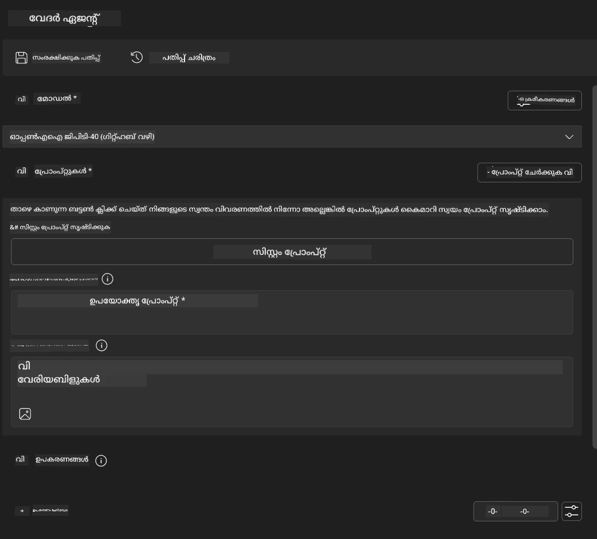
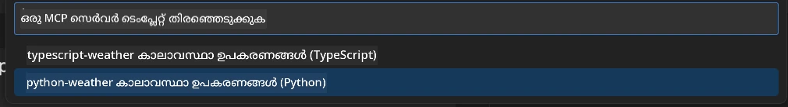
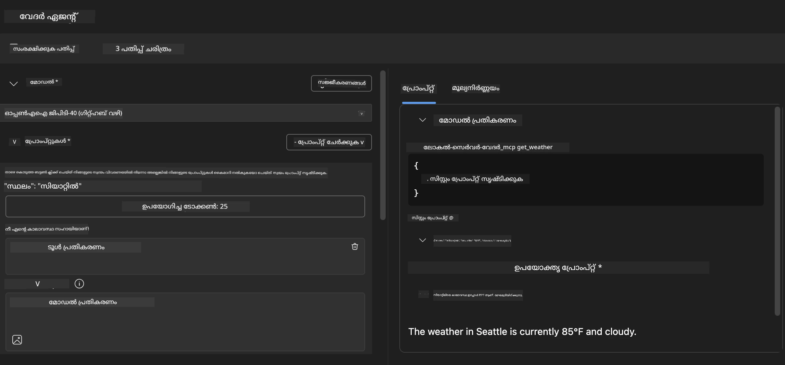
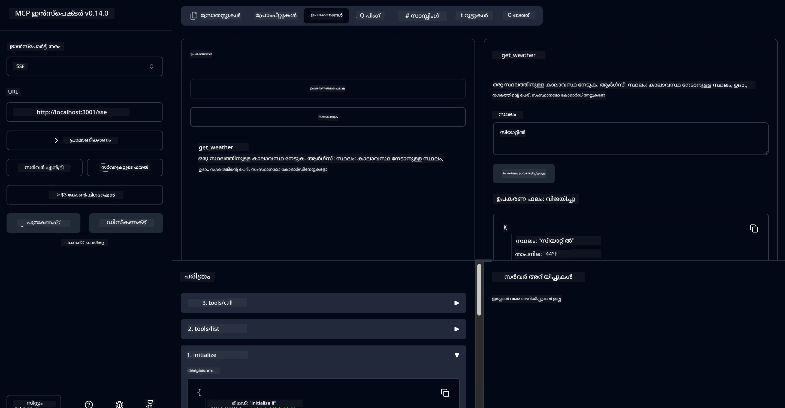

# 🔧 മോഡ്യൂൾ 3: Microsoft Foundry Toolkit ഉപയോഗിച്ച് ആഡ്വാൻസ്ഡ് MCP വികസനം

> [!NOTE]
> ഈ ലാബിലെ ഇൻസ്പെക്ടർ URLകൾ പാരമ്പര്യമായ `/sse` എന്റ്പോയിന്റ് ഉപയോഗിക്കുന്നു, കൂടാതെ pinned MCP SDK `1.9.3` ഉം Inspector `0.14.0` ഉം ആശ്രയങ്ങളെയാണ് ലക്ഷ്യമിടുന്നത്. ഇവ പുതിയ `2026-07-28` Streamable HTTP ഉദാഹരണങ്ങൾ അല്ല.


## 🎯 പഠന ലക്ഷ്യങ്ങൾ

ഈ ലാബ് முடിക്കുന്നപ്പോൾ, നിങ്ങൾക്ക് കഴിയും:

- ✅ Microsoft Foundry Toolkit ഉപയോഗിച്ച് കസ്റ്റം MCP സെർവർ സൃഷ്ടിക്കുക
- ✅ ഏറ്റവും പുതിയ MCP Python SDK (v1.9.3) കോൺഫിഗർ ചെയ്ത് ഉപയോഗിക്കുക
- ✅ ഡീബഗ്ഗിംഗിനായി MCP Inspector സജ്ജമാക്കുകയും ഉപയോഗിക്കുകയും ചെയ്യുക
- ✅ Agent Builder ഉം Inspector പരിസരങ്ങളിലും MCP സെർവറുകൾ ഡീബഗ് ചെയ്യുക
- ✅ ആഡ്വാൻസ്ഡ് MCP സെർവർ വികസന വർക്ക്‌ഫ്ലോകൾ മനസ്സിലാക്കുക

## 📋 മുൻകൂട്ടി വേണ്ട കഴിവുകൾ

- ലാബ് 2 (MCP അടിസ്ഥാനങ്ങൾ) പൂർത്തിയാക്കിയிருக்கണം
- Microsoft Foundry Toolkit എക്സ്റ്റൻഷൻ ഇൻസ്റ്റാൾ ചെയ്‌ത VS Code
- Python 3.10+ പരിസ്ഥിതി
- Inspector സജ്ജീകരണത്തിന് വേണ്ടി Node.jsയും npmഉം

## 🏗️ നിങ്ങൾ നിർമ്മിക്കാനുള്ളത്

ഈ ലാബിൽ, നിങ്ങൾ ഒരു **വേദർ MCP സെർവർ** സൃഷ്ടിക്കും, അത് കാണിക്കുന്നതാണ്:
- കസ്റ്റം MCP സെർവർ നടപ്പാക്കൽ
- Microsoft Foundry Toolkit Agent Builder-സഹിത സംയോജനം
- പ്രൊഫഷണൽ ഡീബഗ്ഗിംഗ് വർക്ക്‌ഫ്ലോകൾ
- ആധുനിക MCP SDK ഉപയോഗ 패ാറ്റേണുകൾ

---

## 🔧 പ്രധാന ഘടകങ്ങൾ അവലോകനം

### 🐍 MCP Python SDK
മോഡൽ കോൺടക്‌സ്‌റ്റ് പ്രോട്ടോക്കോൾ Python SDK കസ്റ്റം MCP സെർവറുകൾ നിർമ്മിക്കുന്നതിന് അടിസ്ഥാനമാകുന്നു. നിങ്ങൾ 1.9.3 പതിപ്പ് ഉപയോഗിക്കും കൂടാതെ വർദ്ധിച്ചു കഴിഞ്ഞ ഡീബഗ്ഗിംഗ് കഴിവുകൾ ഉണ്ട്.

### 🔍 MCP Inspector
ശക്തമായ ഡീബഗ്ഗിംഗ് ഉപകരണം, ഇതിൽ ഉൾപ്പെടുന്നു:
- റിയൽ-ടൈം സെർവർ നിരീക്ഷണം
- ടൂൾ പ്രവർത്തനം ദൃശ്യീകരണം
- നെറ്റ്‌വർക്കിൽ അഭ്യർത്ഥന/പ്രതികരണം പരിശോധിക്കൽ
- ഇന്ററാക്ടീവ് ടെസ്റ്റിംഗ് പരിസരം

---

## 📖 ഘട്ടംനിരത്തി നടപ്പാക്കൽ

### ഘട്ടം 1: Agent Builder-ൽ ഒരു WeatherAgent സൃഷ്ടിക്കുക

1. **VS Code-ൽ Microsoft Foundry Toolkit എക്സ്റ്റൻഷൻ വഴി Agent Builder ആരംഭിക്കുക**
2. **പുതിയ ഏജന്റ് സൃഷ്ടിക്കുക, പാരാമീറ്ററുകൾ:**
   - ഏജന്റ് നാമം: `WeatherAgent`



### ഘട്ടം 2: MCP സെർവർ പ്രോജക്ട് ആരംഭിക്കുക

1. **Agent Builder-ൽ Tools → Add Tool-എ പോയി**
2. **ലഭ്യമായ ഓപ്ഷനുകളിൽ നിന്ന് "MCP Server" തിരഞ്ഞെടുക്കുക**
3. **"Create A new MCP Server" തിരഞ്ഞെടുക്കുക**
4. **`python-weather` ടെംപ്ലേറ്റ് തിരഞ്ഞെടുക്കുക**
5. **സെർവറിന് പേര് നൽകുക:** `weather_mcp`



### ഘട്ടം 3: പ്രോജക്ട് തുറന്ന് വിലയിരുത്തുക

1. **സൃഷ്ടിച്ച പ്രോജക്ട് VS Code-ൽ തുറക്കുക**
2. **പ്രോജക്ട് ഘടന പരിശോധിക്കുക:**
   ```
   weather_mcp/
   ├── src/
   │   ├── __init__.py
   │   └── server.py
   ├── inspector/
   │   ├── package.json
   │   └── package-lock.json
   ├── .vscode/
   │   ├── launch.json
   │   └── tasks.json
   ├── pyproject.toml
   └── README.md
   ```

### ഘട്ടം 4: MCP SDK-യുടെ ഏറ്റവും പുതിയ പതിപ്പിലേക്ക് അപ്‌ഗ്രേഡ് ചെയ്യുക

> **🔍 എന്തുകൊണ്ട് അപ്‌ഗ്രേഡ് ചെയ്യണം?** വർദ്ധിച്ച ഫീച്ചറുകളും മികച്ച ഡീബഗ്ഗിംഗ് കഴിവുകളും ലഭിക്കുന്നതിനായി ഏറ്റവും പുതിയ MCP SDK (v1.9.3) ഉം Inspector സേവനം (0.14.0) ഉം ഉപയോഗിക്കണം.

#### 4a. Python ആശ്രയങ്ങൾ അപ്‌ഡേറ്റ് ചെയ്യുക

**`pyproject.toml` എഡിറ്റ് ചെയ്യുക:** [./code/weather_mcp/pyproject.toml](../../../../10-StreamliningAIWorkflowsBuildingAnMCPServerWithAIToolkit/lab3/code/weather_mcp/pyproject.toml) അപ്‌ഡേറ്റ് ചെയ്യുക


#### 4b. Inspector കോൺഫിഗറേഷൻ അപ്‌ഡേറ്റ് ചെയ്യുക

**`inspector/package.json` എഡിറ്റ് ചെയ്യുക:** [./code/weather_mcp/inspector/package.json](../../../../10-StreamliningAIWorkflowsBuildingAnMCPServerWithAIToolkit/lab3/code/weather_mcp/inspector/package.json) അപ്‌ഡേറ്റ് ചെയ്യുക

#### 4c. Inspector ആശ്രയങ്ങൾ അപ്‌ഡേറ്റ് ചെയ്യുക

**`inspector/package-lock.json` എഡിറ്റ് ചെയ്യുക:** [./code/weather_mcp/inspector/package-lock.json](../../../../10-StreamliningAIWorkflowsBuildingAnMCPServerWithAIToolkit/lab3/code/weather_mcp/inspector/package-lock.json) അപ്‌ഡേറ്റ് ചെയ്യുക

> **📝 കുറിപ്പ്:** ഈ ഫയൽ വ്യാപകമായ ആശ്രയ നിർണ്ണയങ്ങൾ ഉൾക്കൊള്ളുന്നു. താഴെ പ്രധാന ഘടനയാണ് - മുഴുവൻ ഉള്ളടക്കം ആശ്രയം ശരിയായി പരിഹരിക്കുന്നതിന് അത്യാവശ്യമാണ്.


> **⚡ പൂർണ്ണ പാക്കേജ് ലോക്ക്:** പൂർണ്ണ package-lock.json ~3000 ലൈനുകളുള്ള ആശ്രയ നിർവ്വചനം ഉൾക്കൊള്ളുന്നു. മുകളിൽ കാണിക്കുന്നത് പ്രധാന ഘടന മാത്രമാണ് - പൂർണ്ണ ആശ്രയം പരിഹരിക്കാൻ നൽകിയ ഫയൽ ഉപയോഗിക്കുക.

### ഘട്ടം 5: VS Code ഡീബഗ്ഗിംഗ് കോൺഫിഗറേഷൻ

*കുറിപ്പ്: നിർദ്ദിഷ്ട പാതയിലെ ഫയൽ കോപ്പി ചെയ്ത് സാമൂഹ്യ പ്രാദേശിക ഫയൽ മാറ്റിസ്ഥാപിക്കുക*

#### 5a. ലോഞ്ച് കോൺഫിഗറേഷൻ അപ്‌ഡേറ്റ് ചെയ്യുക

**`.vscode/launch.json` എഡിറ്റ് ചെയ്യുക:**

```json
{
  "version": "0.2.0",
  "configurations": [
    {
      "name": "Attach to Local MCP",
      "type": "debugpy",
      "request": "attach",
      "connect": {
        "host": "localhost",
        "port": 5678
      },
      "presentation": {
        "hidden": true
      },
      "internalConsoleOptions": "neverOpen",
      "postDebugTask": "Terminate All Tasks"
    },
    {
      "name": "Launch Inspector (Edge)",
      "type": "msedge",
      "request": "launch",
      "url": "http://localhost:6274?timeout=60000&serverUrl=http://localhost:3001/sse#tools",
      "cascadeTerminateToConfigurations": [
        "Attach to Local MCP"
      ],
      "presentation": {
        "hidden": true
      },
      "internalConsoleOptions": "neverOpen"
    },
    {
      "name": "Launch Inspector (Chrome)",
      "type": "chrome",
      "request": "launch",
      "url": "http://localhost:6274?timeout=60000&serverUrl=http://localhost:3001/sse#tools",
      "cascadeTerminateToConfigurations": [
        "Attach to Local MCP"
      ],
      "presentation": {
        "hidden": true
      },
      "internalConsoleOptions": "neverOpen"
    }
  ],
  "compounds": [
    {
      "name": "Debug in Agent Builder",
      "configurations": [
        "Attach to Local MCP"
      ],
      "preLaunchTask": "Open Agent Builder",
    },
    {
      "name": "Debug in Inspector (Edge)",
      "configurations": [
        "Launch Inspector (Edge)",
        "Attach to Local MCP"
      ],
      "preLaunchTask": "Start MCP Inspector",
      "stopAll": true
    },
    {
      "name": "Debug in Inspector (Chrome)",
      "configurations": [
        "Launch Inspector (Chrome)",
        "Attach to Local MCP"
      ],
      "preLaunchTask": "Start MCP Inspector",
      "stopAll": true
    }
  ]
}
```

**`.vscode/tasks.json` എഡിറ്റ് ചെയ്യുക:**

```
{
  "version": "2.0.0",
  "tasks": [
    {
      "label": "Start MCP Server",
      "type": "shell",
      "command": "python -m debugpy --listen 127.0.0.1:5678 src/__init__.py sse",
      "isBackground": true,
      "options": {
        "cwd": "${workspaceFolder}",
        "env": {
          "PORT": "3001"
        }
      },
      "problemMatcher": {
        "pattern": [
          {
            "regexp": "^.*$",
            "file": 0,
            "location": 1,
            "message": 2
          }
        ],
        "background": {
          "activeOnStart": true,
          "beginsPattern": ".*",
          "endsPattern": "Application startup complete|running"
        }
      }
    },
    {
      "label": "Start MCP Inspector",
      "type": "shell",
      "command": "npm run dev:inspector",
      "isBackground": true,
      "options": {
        "cwd": "${workspaceFolder}/inspector",
        "env": {
          "CLIENT_PORT": "6274",
          "SERVER_PORT": "6277",
        }
      },
      "problemMatcher": {
        "pattern": [
          {
            "regexp": "^.*$",
            "file": 0,
            "location": 1,
            "message": 2
          }
        ],
        "background": {
          "activeOnStart": true,
          "beginsPattern": "Starting MCP inspector",
          "endsPattern": "Proxy server listening on port"
        }
      },
      "dependsOn": [
        "Start MCP Server"
      ]
    },
    {
      "label": "Open Agent Builder",
      "type": "shell",
      "command": "echo ${input:openAgentBuilder}",
      "presentation": {
        "reveal": "never"
      },
      "dependsOn": [
        "Start MCP Server"
      ],
    },
    {
      "label": "Terminate All Tasks",
      "command": "echo ${input:terminate}",
      "type": "shell",
      "problemMatcher": []
    }
  ],
  "inputs": [
    {
      "id": "openAgentBuilder",
      "type": "command",
      "command": "ai-mlstudio.agentBuilder",
      "args": {
        "initialMCPs": [ "local-server-weather_mcp" ],
        "triggeredFrom": "vsc-tasks"
      }
    },
    {
      "id": "terminate",
      "type": "command",
      "command": "workbench.action.tasks.terminate",
      "args": "terminateAll"
    }
  ]
}
```


---

## 🚀 നിങ്ങളുടെ MCP സെർവർ പ്രവർത്തിപ്പിക്കുകയും പരിശോധനയും ചെയ്യുക

### ഘട്ടം 6: ആശ്രയങ്ങൾ ഇൻസ്റ്റാൾ ചെയ്യുക

കോൺഫിഗറേഷൻ മാറ്റങ്ങൾ ചെയ്തതിന് ശേഷം, താഴെയുള്ള കമാൻഡുകൾ işlzettiക്കൂ:

**Python ആശ്രയങ്ങൾ ഇൻസ്റ്റാൾ ചെയ്യുക:**
```bash
uv sync
```

**Inspector ആശ്രയങ്ങൾ ഇൻസ്റ്റാൾ ചെയ്യുക:**
```bash
cd inspector
npm install
```

### ഘട്ടം 7: Agent Builder-ൽ ഡീബഗ് ചെയ്യുക

1. **F5 അമർത്തുക** അല്ലെങ്കിൽ **"Debug in Agent Builder"** കോൺഫിഗറേഷൻ ഉപയോഗിക്കുക
2. ഡീബഗ് പാനലിൽ നിന്ന് സംയുക്ത കോൺഫിഗറേഷൻ തിരഞ്ഞെടുക്കുക
3. സെർവർ തുടങ്ങാനായി കാത്തിരിക്കുക, പിന്നീടെ Agent Builder തുറക്കും
4. നാചുറൽ ലാംഗ്വേജ് ക്വെറികളിൽ നിങ്ങളുടെ വേദർ MCP സെർവർ പരിശോധിക്കുക

ഇങ്ങനെ പ്രോംപ്‌റ്റ് നൽകുക

SYSTEM_PROMPT

```
You are my weather assistant
```

USER_PROMPT

```
How's the weather like in Seattle
```



### ഘട്ടം 8: MCP Inspector ഉപയോഗിച്ച് ഡീബഗ് ചെയ്യുക

1. **"Debug in Inspector"** കോൺഫിഗറേഷൻ (Edge അല്ലെങ്കിൽ Chrome) ഉപയോഗിക്കുക
2. `http://localhost:6274`-ൽ ഇൻസ്പെക്ടർ ഇന്റർഫേസ് തുറക്കുക
3. ഇന്ററാക്ടീവ് ടെസ്റ്റിംഗ് പരിസരം പരിശോധിക്കുക:
   - ലഭ്യമായ ടൂളുകൾ കാണുക
   - ടൂൾ പ്രവർത്തനം പരിശോധിക്കുക
   - നെറ്റ്‌വർക്കിലെ അഭ്യർത്ഥനകൾ നിരീക്ഷിക്കുക
   - സെർവർ പ്രതികരണങ്ങൾ ഡീബഗ് ചെയ്യുക



---

## 🎯 പ്രധാന പഠനഫലം

ഈ ലാബ് പൂർത്തിയാക്കിയതിലൂടെ, നിങ്ങൾ:

- [x] **Microsoft Foundry Toolkit ടെംപ്ലേറ്റുകൾ ഉപയോഗിച്ച് കസ്റ്റം MCP സെർവർ സൃഷ്ടിച്ചു**
- [x] **വർദ്ധിപ്പിച്ച ഫങ്ഷണാലിറ്റിക്കായി ഏറ്റവും പുതിയ MCP SDK (v1.9.3) നു അപ്‌ഗ്രേഡ് ചെയ്തു**
- [x] **Agent Builder ഉം Inspector-ഉം ഉൾപ്പെടുന്ന പ്രൊഫഷണൽ ഡീബഗ്ഗിംഗ് വർക്ക്‌ഫ്ലോകൾ ക്രമീകരിച്ചു**
- [x] **ഇന്ററാക്ടീവ് സെർവർ ടെസ്റ്റിങ്ങിനായി MCP Inspector സജ്ജം ചെയ്തു**
- [x] **MCP വികസനത്തിനായി VS Code ഡീബഗ്ഗിംഗ് കോൺഫിഗറേഷനുകൾ നിഷ്ണാതനായി കൈകാര്യം ചെയ്തു**

## 🔧 ആഡ്വാൻസ്ഡ് ഫീച്ചറുകൾ വിശദീകരണം

| ഫീച്ചർ | വിവരണം | ഉപയോഗക്കേസ് |
|---------|-------------|----------|
| **MCP Python SDK v1.9.3** | ഏറ്റവും പുതിയ പ്രോട്ടോക്കോൾ നടപ്പാക്കൽ | ആധുനിക സെർവർ വികസനം |
| **MCP Inspector 0.14.0** | ഇന്ററാക്ടീവ് ഡീബഗ്ഗിംഗ് ടൂൾ | റിയൽ-ടൈം സെർവർ ടെസ്റ്റിംഗ് |
| **VS Code ഡീബഗ്ഗിംഗ്** | സംയുക്ത വികസന പരിസരം | പ്രൊഫഷണൽ ഡീബഗ്ഗിംഗ് വർക്ക്‌ഫ്ലോ |
| **Agent Builder സംയോജനം** | Microsoft Foundry Toolkit-നോട് നേരിട്ടുള്ള ബന്ധം | End-to-end ഏജന്റ് ടെസ്റ്റിംഗ് |

## 📚 അധിക വിഭവങ്ങൾ

- [MCP Python SDK ഡോക്യുമെന്റേഷൻ](https://modelcontextprotocol.io/docs/sdk/python)
- [Microsoft Foundry Toolkit എക്സ്റ്റൻഷൻ ഗൈഡ്](https://code.visualstudio.com/docs/ai/ai-toolkit)
- [VS Code ഡീബഗ്ഗിംഗ് ഡോക്യുമെന്റേഷൻ](https://code.visualstudio.com/docs/editor/debugging)
- [Model Context Protocol സ്പെസിഫിക്കേഷൻ](https://modelcontextprotocol.io/docs/concepts/architecture)

---

**🎉 അഭിനന്ദനങ്ങൾ!** നിങ്ങൾ വിജയകരമായി ലാബ് 3 പൂർത്തിയാക്കി, പ്രൊഫഷണൽ ഡെവലപ്പ്മെന്റ് വർക്ക്‌ഫ്ലോകൾ ഉപയോഗിച്ചുള്ള കസ്റ്റം MCP സെർവറുകൾ സൃഷ്ടിക്കുകയും ഡീബഗ് ചെയ്യുകയും വിന്യസിക്കുകയും ചെയ്യാൻ തയ്യാറായി.

### 🔜 അടുത്ത മോഡ്യൂളിലേക്ക് മുന്നോട്ട് പോവുക

നിങ്ങളുടെ MCP കഴിവുകൾ യഥാർത്ഥ വികസനവർക്ക് ഉപയോഗിക്കാൻ തയ്യാറാണോ? **[മോഡ്യൂൾ 4: പ്രായോഗിക MCP വികസനം - കസ്റ്റം GitHub ക്ലോൺ സെർവർ](../lab4/README.md)** ൽ തുടരുക, ഇവിടെ നിങ്ങൾ:
- GitHub റിപ്പോസിറ്ററി പ്രവർത്തനങ്ങൾ ഓട്ടോമേറ്റുചെയ്യുന്ന പ്രൊഡക്ഷൻ റെഡി MCP സെർവർ നിർമ്മിക്കും
- MCP വഴി GitHub റിപ്പോസിറ്ററി ക്ലോണിംഗ് ഫംഗ്ഷണാലിറ്റി നടപ്പിലാക്കും
- VS Code ഉം GitHub Copilot Agent Mode ഉം ഉൾപ്പെടുന്ന കസ്റ്റം MCP സെർവറുകൾ സംയോജിപ്പിക്കും
- പ്രൊഡക്ഷൻ പരിസരങ്ങളിൽ കസ്റ്റം MCP സെർവറുകൾ പരീക്ഷിച്ച് വിന്യസിക്കും
- ഡെവലപ്പർമാരെക്ക് പ്രായോഗിക വർക്ക്‌ഫ്ലോ ഓട്ടോമേഷൻ പഠിപ്പിക്കും

---

<!-- CO-OP TRANSLATOR DISCLAIMER START -->
**അറിയിപ്പ്**:
ഈ രേഖ AI പരിഭാഷാ സേവനം [Co-op Translator](https://github.com/Azure/co-op-translator) ഉപയോഗിച്ച് പരിഭാഷപ്പെടുത്തിയതാണ്. ഞങ്ങൾ കൃത്യതയ്ക്കായി ശ്രമിക്കുന്നുവെങ്കിലും, ഓട്ടോമേറ്റഡ് പരിഭാഷകളിൽ പിഴവുകൾ അല്ലെങ്കിൽ തെറ്റായ വിവരങ്ങൾ ഉണ്ടാകാൻ സാധ്യതയുണ്ട്. അതിന്റെ സ്വാഭാവിക ഭാഷയിലുള്ള അസൽ രേഖയാണ് പ്രാമാണികമായ ഉറവിടമായി പരിഗണിക്കേണ്ടത്. നിർണായകമായ വിവരങ്ങൾക്ക്, പ്രൊഫഷണൽ മനുഷ്യ പരിഭാഷ ശുപാർശ ചെയ്യുന്നു. ഈ പരിഭാഷ ഉപയോഗിച്ച് ഉണ്ടാകുന്ന തെറ്റിദ്ധാരണകൾ അല്ലെങ്കിൽ തെറ്റായ വ്യാഖ്യാനങ്ങൾക്കായി ഞങ്ങൾ ഉത്തരവാദികളല്ല.
<!-- CO-OP TRANSLATOR DISCLAIMER END -->