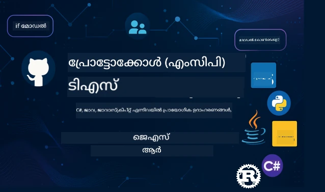

 

[](https://GitHub.com/microsoft/mcp-for-beginners/graphs/contributors)
[](https://GitHub.com/microsoft/mcp-for-beginners/issues)
[](https://GitHub.com/microsoft/mcp-for-beginners/pulls)
[](http://makeapullrequest.com)

[](https://GitHub.com/microsoft/mcp-for-beginners/watchers)
[](https://GitHub.com/microsoft/mcp-for-beginners/fork)
[](https://GitHub.com/microsoft/mcp-for-beginners/stargazers)


[](https://discord.gg/nTYy5BXMWG)

ഈ വിഭവങ്ങൾ ഉപയോഗിച്ച് ആരംഭിക്കാൻ ഈ ഘട്ടങ്ങൾ പിന്തുടരുക:
1. **റിപ്പോസിറ്ററി ഫോർക്ക് ചെയ്യുക**: ക്ലിക്ക് ചെയ്യുക [](https://GitHub.com/microsoft/mcp-for-beginners/fork)
2. **റിപ്പോസിറ്ററി ക്ലോൺ ചെയ്യുക**: `git clone https://github.com/microsoft/mcp-for-beginners.git`
3. **ചേരുക** [](https://discord.gg/nTYy5BXMWG)


### 🌐 ബഹുഭാഷാ പിന്തുണ

#### GitHub Action വഴി പിന്തുണ (സ്വയം പരിഷ്‌ക്കരിക്കുക & എല്ലായ്പ്പോഴും അപ്‌ടേറ്റ്)

<!-- CO-OP TRANSLATOR LANGUAGES TABLE START -->
[Arabic](../ar/README.md) | [Bengali](../bn/README.md) | [Bulgarian](../bg/README.md) | [Burmese (Myanmar)](../my/README.md) | [Chinese (Simplified)](../zh-CN/README.md) | [Chinese (Traditional, Hong Kong)](../zh-HK/README.md) | [Chinese (Traditional, Macau)](../zh-MO/README.md) | [Chinese (Traditional, Taiwan)](../zh-TW/README.md) | [Croatian](../hr/README.md) | [Czech](../cs/README.md) | [Danish](../da/README.md) | [Dutch](../nl/README.md) | [Estonian](../et/README.md) | [Finnish](../fi/README.md) | [French](../fr/README.md) | [German](../de/README.md) | [Greek](../el/README.md) | [Hebrew](../he/README.md) | [Hindi](../hi/README.md) | [Hungarian](../hu/README.md) | [Indonesian](../id/README.md) | [Italian](../it/README.md) | [Japanese](../ja/README.md) | [Kannada](../kn/README.md) | [Korean](../ko/README.md) | [Lithuanian](../lt/README.md) | [Malay](../ms/README.md) | [Malayalam](./README.md) | [Marathi](../mr/README.md) | [Nepali](../ne/README.md) | [Nigerian Pidgin](../pcm/README.md) | [Norwegian](../no/README.md) | [Persian (Farsi)](../fa/README.md) | [Polish](../pl/README.md) | [Portuguese (Brazil)](../pt-BR/README.md) | [Portuguese (Portugal)](../pt-PT/README.md) | [Punjabi (Gurmukhi)](../pa/README.md) | [Romanian](../ro/README.md) | [Russian](../ru/README.md) | [Serbian (Cyrillic)](../sr/README.md) | [Slovak](../sk/README.md) | [Slovenian](../sl/README.md) | [Spanish](../es/README.md) | [Swahili](../sw/README.md) | [Swedish](../sv/README.md) | [Tagalog (Filipino)](../tl/README.md) | [Tamil](../ta/README.md) | [Telugu](../te/README.md) | [Thai](../th/README.md) | [Turkish](../tr/README.md) | [Ukrainian](../uk/README.md) | [Urdu](../ur/README.md) | [Vietnamese](../vi/README.md)

> **പ്രാദേശികമായി ക്ലോൺ ചെയ്യാൻ ആഗ്രഹിക്കുന്നു?**

> ഈ റിപ്പോസിറ്ററിയിൽ 50-ലധികം ഭാഷാ പരിഭാഷകൾ ഉൾപ്പെടുത്തിയിട്ടുണ്ട്, ഇത് ഡൗൺ‌ലോഡ് വലിപ്പം ശ്രദ്ധനീയമായി വർദ്ധിപ്പിക്കുന്നു. പരിഭാഷകൾ ഇല്ലാതെ ക്ലോൺ ചെയ്യാൻ sparse checkout ഉപയോഗിക്കുക:
> ```bash
> git clone --filter=blob:none --sparse https://github.com/microsoft/mcp-for-beginners.git
> cd mcp-for-beginners
> git sparse-checkout set --no-cone '/*' '!translations' '!translated_images'
> ```
> ഇത് നിങ്ങൾക്ക് കോഴ്‌സ് പൂർത്തിയാക്കാൻ ആവശ്യമായവ എല്ലാം വളരെ വേഗത്തിൽ ഡൗൺലോഡ് ചെയ്യാൻ സഹായിക്കുന്നു.
<!-- CO-OP TRANSLATOR LANGUAGES TABLE END -->

# 🚀 മോഡൽ കോൺടെക്സ്റ്റ് പ്രോട്ടോക്കോൾ (MCP) ആരെങ്കിലും പഠിക്കാനുള്ള പാഠ്യപദ്ധതി

## **C#, Java, JavaScript, Rust, Python, TypeScript-ലുള്ള കൈകാര്യം ചെയ്യുന്ന കോഡ് ഉദാഹരണങ്ങളോടെ MCP പഠിക്കൂ**

## 🧠 മോഡൽ കോൺടെക്സ്റ്റ് പ്രോട്ടോക്കോൾ പാഠ്യപദ്ധതിയുടെ അവലോകനം
മോഡൽ കോൺടെക്സ്റ്റ് പ്രോട്ടോക്കോളിലേക്ക് നിങ്ങളുടെ യാത്രയ്ക്ക് സ്വാഗതം! എഐ ആപ്ലിക്കേഷനുകൾ ਵ.registered અંગങ്ങൾ സംസാരിക്കുന്ന വിധം നിങ്ങൾക്കറിയാമോ? ഡെവലപ്പർമാർ ഇന്നത്തെ ബുദ്ധിമുട്ടുള്ള സങ്കീര്‍ണമായ സിസ്റ്റങ്ങൾ നിർമ്മിക്കുന്നത് മാറ്റിവെക്കുന്ന എളുപ്പമാർന്ന പരിഹാരം നിങ്ങൾക്കായി തെളിയിക്കുകയാണ്.

MCP ഒരു ആഗോള വിവർത്തകൻ പോലെയാണ് എഐ ആപ്ലിക്കേഷനുകൾക്കായി - USB പോർട്ടുകൾ എങ്ങനെ കമ്പ്യൂട്ടറുമായി ഏതെങ്കിലും ഉപകരണം ബന്ധിപ്പിക്കാൻ അനുവദിക്കുന്നുവോ, MCP എങ്ങനെ എഐ മോഡലുകൾ ഏതെങ്കിലും ടൂൾ അല്ലെങ്കിൽ സർവീസ്‌ സ്റ്റാൻഡേർഡൈസ്ഡ് രീതിയിൽ ബന്ധിപ്പിക്കാൻ അനുവദിക്കുന്നുവോ അതുപോലെ. നിങ്ങൾ ആദ്യം ചാറ്റ്ബോട്ട് നിർമ്മിച്ചാലും സങ്കീർണമായ എഐ വർക്ക്‌ഫ്ലോകളിൽ പ്രവർത്തിച്ചാലും, MCP മനസ്സിലാക്കുന്നതിലൂടെ നിങ്ങൾക്ക് കൂടുതൽ കഴിവുള്ള ഒരു ലോചനം നിർമ്മിക്കാൻ കഴിയും.

ഈ പാഠ്യപദ്ധതി ക്ഷമയോടെയും ശ്രദ്ധയോടെയും നിങ്ങളുടെ പഠനയാത്രക്ക് രൂപകൽപ്പന ചെയ്തിരിക്കുന്നു. നിങ്ങൾക്കിടയിൽ ആശയമുണ്ട് എളുപ്പം മനസ്സിലാകുന്ന സങ്കൽപ്പങ്ങൾകൊണ്ട് തുടക്കം ചെയ്യും, തുടർന്ന് നിങ്ങളുടെ ഇഷ്ടപ്പെട്ട പ്രോഗ്രാമിങ് ഭാഷയിൽ കൈകാര്യം ചെയ്യുന്ന പ്രായോഗിക പരിശീലനങ്ങളിലൂടെ കഴിവുകൾ ഉയർത്തും. ഓരോ ഘട്ടവും വ്യക്തമായ വിശദീകരണം, പ്രായോഗിക ഉദാഹരണങ്ങൾ, കൂടാതെ നിറഞ്ഞ പിന്തുണകൾ അടങ്ങിയതാണ്.

ഈ യാത്ര പൂർത്തിയാക്കുമ്പോൾ, നിങ്ങൾക്ക് സ്വന്തം MCP സെർവറുകൾ നിർമ്മിക്കാൻ, അവയെ ജനപ്രിയ AI പ്ലാറ്റ്ഫോമുകളുമായി സംയോജിപ്പിക്കാൻ, ഈ സാങ്കേതിക വിദഗ്‌ദ്ധത എങ്ങനെ AI വികസനത്തിന്റെ ഭാവിയെ മാറ്റുന്നു എന്ന് അറിയാൻ ആത്മവിശ്വാസം ഉണ്ടാകും. ഈ അതിഗംഭീരം യാത്ര നമുക്കൊത്ത് തുടങ്ങാം!

### ഔദ്യോഗിക ഡോക്യുമെന്റേഷൻ വും കൃത്യനിർവചനം

ഈ വിഭവങ്ങൾ നിങ്ങളുടെ മനസിലാക്കിയതോടെ കൂടുതൽ വിലപ്പെട്ടതാകും, പക്ഷേ ഉടൻ എല്ലാം വായിക്കാൻ ഉത്സാഹം തോന്നരുത്. നിങ്ങൾക്ക് ഏറ്റവും രസമുള്ള മേഖലകളിൽ നിന്ന് തുടങ്ങുക!
- 📘 [MCP ഡോക്യുമെന്റേഷൻ](https://modelcontextprotocol.io/) – ഘട്ടനിർദേശങ്ങളോടുകൂടിയിട്ടാണ് ഈ ഉപകരണം. തുടക്കക്കാർക്ക് അനുയോജ്യമായ, നളിവുള്ള ഉദാഹരണങ്ങളോടു കൂടി ഈ ഡോക്യുമെന്റേഷൻ എഴുതിയിരിക്കുന്നു, അതുപോലെ സ്വയം പഠിക്കാൻ ഇതുപയോഗിക്കാം.
- 📜 [MCP കൃത്യനിർവചനം](https://modelcontextprotocol.io/docs/) – ഇതിനെ നിങ്ങൾ ഒരു സമഗ്രമായ റഫറൻസ് മാനുവലായി കാണാം. പാഠ്യപദ്ധതിയിൽ പ്രവർത്തിക്കുമ്പോൾ പ്രത്യേകം വിവരങ്ങൾ അന്വേഷിക്കാൻ നിങ്ങൾക്ക് ഇവിടെ തിരിച്ചുവരേണ്ടിവരും, കൂടാതെ ഉയർന്ന നിലവാരമുള്ള സവിശേഷതകൾ ഇവിടെയാണ്.
- 📜 [അസൽ MCP കൃത്യനിർവചനം](https://modelcontextprotocol.io/specification/versioning) – ഇതിൽ ഉയർന്ന നിലവാരത്തിലുള്ള സാങ്കേതിക വിശദാംശങ്ങൾ ഉൾപ്പെടുത്തിയിട്ടുണ്ട്. വേണമെന്ന് തോന്നുമ്പോൾ ഇതുണ്ടാകും, തുടങ്ങിയ നേരത്ത് വിഷമിക്കേണ്ട.
- 🧑‍💻 [MCP GitHub റിപ്പോസിറ്ററി](https://github.com/modelcontextprotocol) – SDKകൾ, ഉപകരണങ്ങൾ, ഒന്നലും പ്രോഗ്രാമിങ് ഭാഷകളിലുള്ള കോഡ് മാദൃകങ്ങൾ എന്നിവ ഇവിടെ ലഭ്യമാണ്. പ്രായോഗിക ഉദാഹരണങ്ങൾക്കും ഉപയോഗയോഗ്യമായ ഘടകങ്ങൾക്കും ഇത് ധനസമൃദ്ധി പോലെയാണ്.
- 🌐 [MCP സമൂഹം](https://github.com/orgs/modelcontextprotocol/discussions) – MCP-യെക്കുറിച്ച് മറ്റ് പഠനാർത്ഥികളും പരിചയസമ്പന്നരും ചർച്ച ചെയ്യുന്നതിൽ പങ്കാളികളാകൂ. സംശയങ്ങൾ സ്വാഗതം ചെയ്യപ്പെടുന്ന ഒരു പിന്തുണയുള്ള സമൂഹമാണ് ഇത്, അകലം പോലും പകർന്നമുന്നോട്ട് പയറ്റുന്നു.
  
## പഠന ലക്ഷ്യങ്ങൾ

ഈ പാഠ്യപദ്ധതി പൂർത്തിയാക്കുമ്പോൾ നിങ്ങൾക്ക് പുതിയ കഴിവുകൾക്ക് ആത്മവിശ്വാസവും ആവേശവുമുണ്ടാവും. ഇവിടെ നിങ്ങൾ നേടുന്നുവെന്ന് പറയാം:

• **MCP അടിസ്ഥാനങ്ങൾ മനസിലാക്കുക**: മോഡൽ കോൺടെക്സ്റ് പ്രോട്ടോക്കോൾ എന്താണെന്നും എങ്ങനെ എഐ ആപ്ലിക്കേഷനുകൾ തമ്മിൽ ചേർന്ന് പ്രവർത്തിക്കുന്ന രൂപം മാറ്റം വരുത്തുന്നതുമായ കാര്യങ്ങളും, സാന്ദർഭിക ഉദാഹരണങ്ങളിലൂടെ നിങ്ങൾക്കും മനസ്സിലാകും.

• **നിങ്ങളുടെ ആദ്യ MCP സെർവർ നിർമ്മിക്കുക**: നിങ്ങളുടെ ഇഷ്ടപ്പെട്ട പ്രോഗ്രാമിങ് ഭാഷയിൽ പണിയാറുള്ള ഒരു MCP സെർവർ സൃഷ്ടിക്കും, ലളിതമായ ഉദാഹരണങ്ങൾ കൊണ്ടും പടി പടി കഴിവുകൾ ഉയർത്തിയും.

• **എഐ മോഡലുകളെ യഥാർത്ഥ ഉപകരണങ്ങളുമായി ബന്ധിപ്പിക്കുക**: എഐ മോഡലുകളും യഥാർത്ഥ സേവനങ്ങളും തമ്മിലുള്ള ഇടവേള മറികടക്കാൻ നിങ്ങൾ പഠിക്കും, നിങ്ങളുടെ ആപ്ലിക്കേഷനുകൾക്ക് ശക്തമായ പുതിയ ശേഷികൾ നൽകും.

• **സുരക്ഷാ മികച്ച പരിശീലനങ്ങൾ നടപ്പിലാക്കുക**: നിങ്ങളുടെ MCP ഡെവലപ്പ്മെന്റുകൾ സുരക്ഷിതമാക്കാൻ കഴിയുന്നതെങ്ങനെ എന്ന് മനസ്സിലാക്കുകയും, നിങ്ങളുടെ ആപ്ലിക്കേഷനുകളും ഉപയോക്താക്കളും സംരക്ഷിക്കാനും പഠിക്കും.

• **വിശ്വാസത്തോടെ വിനിയോഗിക്കുക**: വികസനത്തിൽ നിന്നു ഉത്പാദനത്തിലേക്കുള്ള MCP പദ്ധതികളെ എങ്ങനെ കൊണ്ടുപോകണം എന്ന് അറിഞ്ഞു, യാഥാർത്ഥ്യ ലോകത്തിൽ ഫലപ്രദമായ വിനിയോഗ തന്ത്രങ്ങൾ ഉപയോഗിക്കാം.

• **MCP സമൂഹത്തിലേക്ക് ചേരുക**: നിങ്ങളുടെ പങ്കാളിത്തത്തോടെ വളരുന്ന എഐ ആപ്ലിക്കേഷൻ വികസനത്തിന്റെ ഭാവിനെ രൂപപ്പെടുത്തുന്ന ഡെവലപ്പർമാരുടെ കൂട്ടത്തിൽ നിന്ന് ഒരാളാകൂ.

## ആവശ്യമുള്ള പൂർവാധാരം

MCP സവിശേഷാംശങ്ങളിലേക്ക് പ്രവേശിക്കുമ്ബോൾ, പടവുകൾ താഴെ പറയുന്ന അടിസ്ഥാന സങ്കൽപ്പങ്ങൾക്കൊപ്പം നിങ്ങൾ സുഖമായി മനസിലാക്കണമെന്ന് ഉറപ്പാക്കാം. ഈ മേഖലകളിൽ നിങ്ങൾ വിദഗ്ധരല്ലാത്ത പക്ഷവും ആശങ്കപ്പെടേണ്ട, നാം എല്ലാം തുടർച്ചയായി വിശദീകരിക്കും!

### പ്രോട്ടോക്കോളുകൾ മനസ്സിലാക്കുക (അടിസ്ഥാന ഘടകം)

പൊതുവായി സംവാദത്തിനുള്ള നിയമങ്ങളെപ്പോലെയാണ് ഒരു പ്രോട്ടോക്കോൾ കരുതുന്നത്. ഒരു സുഹൃത്തിനെ വിളിക്കുമ്പോൾ “ഹലോ” എന്ന് പറയുന്നതും, വട്ടംവത്ക്കരിക്കながുമെന്നറിയുന്നതും, “ഗുഡ്‌ബൈ” എന്ന് പറയുന്നതും നിയമങ്ങളാണ്. കമ്പ്യൂട്ടർ പ്രോഗ്രാമുകൾക്കു ഇതുപോലുള്ള നിയമങ്ങൾ വേണം, അത് നല്ല സമ്പ്രേഷണത്തിന് സഹായിക്കുന്നു.

MCP ഒരു പ്രോട്ടോക്കോൾ ആണ് - AI മോഡലുകളും ആപ്ലിക്കേഷനുകളും “സംസാരം” ചെയ്യാൻ സഹായിക്കുന്ന സമ്മതിച്ച നിയമങ്ങളുടെ ഒരു സമാഹാരം. മനുഷ്യരുടെ സംവാദങ്ങളിൽ നിയമമുണ്ടായാൽ ആശയവിനിമയം സുഗമമാകുന്നതുപോലെ, MCP ഉണ്ടാകുമ്പോൾ AI ആപ്ലിക്കേഷൻ ആശയവിനിമയം വളരെ വിശ്വസനീയവും ശക്തവുമായിരിക്കും.

### ക്ലയന്റ്-സർവർ ബന്ധം (പ്രോഗ്രാമുകൾ തമ്മിൽ സഹകരിക്കുന്നത്)

നിങ്ങൾ ദിവസവും ക്ലയന്റ്-സർവർ ബന്ധം ഉപയോഗിച്ചുകൊണ്ടിരിക്കുകയാണ്! വെബ് ബ്രൗസർ (ക്ലയന്റ്) ഉപയോഗിച്ച് ഒരു വെബ്‌സൈറ്റ് സന്ദർശിക്കുമ്പോൾ, ആ പേജ് ഉള്ളടക്കം അയക്കുന്ന ഒരു വെബ് സെർവറുമായി ബന്ധിപ്പിക്കുന്നു. ബ്രൗസർ വിവരങ്ങൾ അഭ്യർത്ഥിക്കാൻ അറിയുകയും, സർവർ മറുപടി നൽകാൻ അറിയുകയും ചെയ്യുന്നു.

MCP-ൽ സമാനമായ ബന്ധം ഉണ്ട്: എഐ മോഡലുകൾ ക്ലയന്റുകളാണ്, അവ അഭ്യർത്ഥനകൾ നടത്തുന്നു; MCP സർവറുകൾ ആ കഴിവുകൾ നൽകുന്നു. എഐയ്ക്ക് നൽകിയ ഒരു സഹായകനൊന്നുപോലെ السيرവർ പ്രത്യേക പ്രവർത്തനങ്ങൾ നടത്താൻ ചോദിക്കാനാകും.

### സ്റ്റാൻഡേർഡൈസേഷൻ എങ്ങനെ പ്രധാനപ്പെട്ടതാണെന്ന് (അനേകർ ചേർന്ന് പ്രവർത്തിക്കാൻ)

എല്ലാ കാറിന്റെ വാതിൽ നിറുത്തുന്ന കണക്ഷൻ വ്യത്യസ്ത ആണെങ്കിൽ, ഓരോ കാറിനും വ്യത്യസ്ത അഡാപ്പ്റ്റർ വേണമെന്നതുപോലെ, വിവിധ സംവിധാനങ്ങൾ ചേർന്ന് പ്രവർത്തിക്കാൻ സാധിക്കില്ല! സ്റ്റാൻഡേർഡൈസേഷൻ സാധാരണ നിയമങ്ങളോ രീതികളോ സമ്മതിച്ചു കൊണ്ട് അനേകർ ചേർന്ന് ജോലി ചെയ്യാൻ സഹായിക്കുന്നു.

AI ആപ്ലിക്കേഷനുകൾക്കായി MCP ഇത് സാധ്യമാക്കുന്നു. എല്ലാ AI മോഡലുകൾക്കും പ്രത്യേക കോഡ് എഴുതേണ്ടതാണ് പറയും വിധം MCP ഇല്ല. MCP ഇതിലെ എല്ലാ വഴികളുടെയും സാധാരണ വഴിയായി പ്രവർത്തിക്കുന്നു. ഡെവലപ്പർമാർ ഒരിക്കൽ ടൂളുകൾ നിർമ്മിച്ച് അത് വിവിധ AI സിസ്റ്റങ്ങൾക്കൊപ്പം ഉപയോഗിക്കാവുന്നതാക്കുന്നു.

## 🧭 നിങ്ങളുടെ പഠനപാത സംക്ഷിപ്തം

നിങ്ങളുടെ MCP പഠനയാത്ര ആത്മവിശ്വാസവും കഴിവും ക്രമാനുസൃതമായി ഉയർത്താൻ സുതാര്യമായ രീതിയിൽ ക്രമീകരിച്ചിരിക്കുന്നു. ഓരോ ഘട്ടവും പുതിയ ആശയങ്ങൾ പരിചയപ്പെടുത്തുകയും മുമ്പ് പഠിച്ചവ പുനഃസംസ്‌ക്കരിക്കുകയും ചെയ്യും.

### 🌱 അടിസ്ഥാന ഘട്ടം: അടിസ്ഥാനങ്ങൾ മനസ്സിലാക്കൽ (മൊഡ്യൂളുകൾ 0-2)

ഇവിടെ നിന്നാണ് നിങ്ങളുടെ അഭ്യസനം ആരംഭിക്കുന്നത്! MCP ആശയങ്ങളെ പരിചയപ്പെടുത്തുന്നതിന് പരിചിതമായ ഉദാഹരണങ്ങളും ലളിതമായ മാതൃകകളും ഉപയോഗിക്കും. MCP എന്താണെന്ന്, അത് എങ്ങനെ നിലവിലുള്ള AI വികസന ലോകത്ത് സ്ഥാനം നേടിരിക്കുകയാണെന്നും മനസിലാക്കും.

• **മൊഡ്യൂൾ 0 - MCP പരിചയം**: MCP എന്താണെന്ന്, ആധുനിക AI ആപ്ലിക്കേഷനുകൾക്കായി ഇതിന്റെ പ്രാധാന്യം എന്താണ് എന്നു ഞങ്ങൾ പഠിപ്പിക്കും. MCP വാസ്തവത്തിൽ എങ്ങനെ പ്രവർത്തിക്കുന്നു എന്നും കണ്ടു മനസിലാക്കും.

• **മൊഡ്യൂൾ 1 - പ്രധാന ആശയങ്ങളെ വിശദീകരിക്കൽ**: MCP-യുടെ മുഖ്യ ഘടകങ്ങൾ നിങ്ങൾ പഠിക്കും. അനേകം ഉപമകളും കാഴ്ചപ്പാടുകളുമായി ഈ ആശയങ്ങൾ പ്രകൃതസിദ്ധവുമായും മനസ്സിലാവുന്ന തരിലും സമ്മാനിക്കും.

• **മൊഡ്യൂൾ 2 - MCP-ൽ സുരക്ഷ**: സുരക്ഷ ഭീതിപ്രദമായ ഒന്നാണെന്നു തോന്നാം, പക്ഷേ MCP-യിൽ ഉൾകൊള്ളുന്ന സുരക്ഷാ സംവിധാനം പരിചയപ്പെടുത്തി തുടക്കം മുതൽ നിങ്ങളുടെ ആപ്ലിക്കേഷനുകളെ സംരക്ഷിക്കുന്ന മികച്ച രീതികൾ പഠിപ്പിക്കും.

### 🔨 നിർമ്മാണ ഘട്ടം: നിങ്ങളുടെ ആദ്യ അന്തർപ്രവർത്തനങ്ങൾ സൃഷ്ടിക്കൽ (മൊഡ്യൂൾ 3)

ഇപ്പോൾ യഥാർത്ഥ രസകരമായ ദിശ ആരംഭിക്കുന്നു! പ്രായോഗത്തിൽ MCP സെർവർ-ക്ലയന്റ് നിർമ്മാണം കൈകാര്യം ചെയ്യാനുള്ള അവസരമാണ് ഇത്. ഭയം തീർക്കേണ്ട, ലളിതമായ ഉദാഹരണങ്ങളുമായി തുടക്കം ചെയ്ത് എല്ലാ ഘട്ടങ്ങളിലും സഹായിക്കും.

ഈ ഘടകം നിങ്ങൾക്കു ഇഷ്ടപ്പെടുന്ന പ്രോഗ്രാമിങ് ഭാഷയിൽ പരിശീലനം നൽകുന്ന ഒന്നിലധികം കൈകാര്യം ചെയ്യുന്ന ഗൈഡുകൾ ഉൾപ്പെടുത്തിയിട്ടുണ്ട്. ആദ്യ സെർവർ തയാറാക്കുകയും, അതുമായി ബന്ധിപ്പിക്കുന്ന ഒരു ക്ലയന്റ് നിർമ്മിക്കുകയും, VS Code പോലുള്ള ജനപ്രിയ വികസന ഉപകരണങ്ങളുമായും സംയോജിപ്പിക്കുകയും ചെയ്യും.
ഓരോ ഗൈഡും സമ്പൂർണ്ണ കോഡ് ഉദാഹരണങ്ങളും, പ്രശ്നപരിഹാര മാർഗങ്ങളും, ഞങ്ങൾ പ്രത്യേക രൂപകൽപ്പന തിരഞ്ഞെടുക്കലുകൾ എന്തുകൊണ്ട് ചെയ്യുന്നുവെന്ന് വിശദീകരണങ്ങളും ഉൾക്കൊള്ളുന്നു. ഈ ഘട്ടത്തിന്റെ അവസാനത്തിൽ, നിങ്ങൾക്ക് അഭിമാനം തോന്നിക്കുന്ന പ്രവർത്തനക്ഷമമായ MCP നടപ്പാക്കലുകൾ ഉണ്ടാകും!

### 🚀 വളർച്ചാ ഘട്ടം: ഉയർന്ന മുറയുള്ള ആശയങ്ങൾയും യഥാർത്ഥ ലോകപ്രയോഗങ്ങളും (മൊഡ്യൂളുകൾ 4-5)

മൂലഭൂത കാര്യങ്ങൾ കൈവശമാക്കിയതോടെ, നിങ്ങൾക്ക് കൂടുതൽ വിപുലമായ MCP സവിശേഷതകൾ അന്വേഷിക്കാൻ തയ്യാറാണ്. പ്രായോഗിക നടപ്പാക്കൽ തന്ത്രങ്ങളും, ഡീബഗ്ഗിംഗ് സാങ്കേതികങ്ങളും, മൾട്ടി-മോഡൽ AI സംയോജനം പോലുള്ള ഉയർന്ന തല വിഷയങ്ങളും ഞങ്ങൾ ഉൾക്കൊള്ളിക്കുന്നു.

നിങ്ങൾക്ക് MCP നടപ്പാക്കലുകൾ ഉൽപ്പാദന ഉപയോഗത്തിന് സ്കെയിൽ ചെയ്യാനും, Azure പോലുള്ള ക്ലൗഡ് പ്ലാറ്റ്ഫോമുകളുമായി സംയോജിപ്പിക്കാനും പഠിച്ചെടുക്കാം. ഈ മൊഡ്യൂളുകൾ യഥാർത്ഥ ലോകം ആവശ്യങ്ങൾ കൈകാര്യം ചെയ്യാൻ കഴിവുള്ള MCP പരിഹാരങ്ങൾ നിർമ്മിക്കാൻ നിങ്ങളെ ഒരുക്കുന്നു.

### 🌟 മാസ്റ്ററി ഘട്ടം: സമൂഹവും വിദഗ്‌ധതയും (മൊഡ്യൂളുകൾ 6-11)

അവസാന ഘട്ടം MCP സമൂഹത്തിൽ ചേരാനും, നിങ്ങളുടെ ഏറ്റവും ഇഷ്ടപ്പെട്ട മേഖലകളിൽ വിദഗ്‌ധത നേടാനും കേന്ദ്രീകരിക്കുന്നു. നിങ്ങൾക്ക് ഓപ്പൺ-സോഴ്‌സ് MCP പ്രോജക്ടുകളിൽ സംഭാവന നൽകുന്നത്, ഉയർന്ന തലത്തിലെ അധികാരപരിശോധന മാതൃകകൾ നടപ്പാക്കുക, വിപുലമായ ഡാറ്റാബേസ് സംയോജിത പരിഹാരങ്ങൾ നിർമ്മിക്കുക എന്നിവയും പഠിക്കാം.

മൊഡ്യൂൾ 11 പ്രത്യേകമായി പരാമർശിക്കേണ്ടതാണ് - ഇത് 13-ലെബുകളടങ്ങിയ സമ്പൂർണ്ണ കൈയിൽ പഠിക്കുന്ന പാതയാണ്, പോസ്റ്റ്‌ഗ്രെSQL സംയോജനം ഉപയോഗിച്ച് ഉൽപ്പാദനത്തിന് തയാറായ MCP സർവറുകൾ നിർമ്മിക്കുന്നത് പഠിപ്പിക്കുന്നു. നിങ്ങൾ പഠിച്ച എല്ലാവയും ഒന്നിച്ച് കൊണ്ടുവരുന്ന ഒരു ക്യാപ്സ്റ്റോൺ പ്രോജക്ട് പോലെയാണ്!

### 📚 സമ്പൂർണ്ണ പാഠ്യപദ്ധതി ഘടന

| മൊഡ്യൂൾ | വിഷയം | വിവരണം | ലിങ്ക് |
|--------|-------|-------------|------|
| **Module 1-3: Fundamentals** | | | |
| 00 | MCP അടിസ്ഥാനം | മോഡൽ കോൺടെക്സ്റ്റ് പ്രോട്ടോക്കോളിന്റെ അവലോകനം, AI പൈപ്പ്ലൈനുകളിൽ അതിന്റെ പ്രാധാന്യം | [കൂടുതൽ വായിക്കുക](./00-Introduction/README.md) |
| 01 | മുഖ്യ ആശയങ്ങൾ വിശദീകരിച്ചു | MCP മുഖ്യ ആശയങ്ങളുടെ ആഴത്തിലുള്ള പഠനം | [കൂടുതൽ വായിക്കുക](./01-CoreConcepts/README.md) |
| 02 | MCP-യിലെ സുരക്ഷ | സുരക്ഷാ ഭീഷണികളും മികച്ച പ്രാക്ടീസുകളും | [കൂടുതൽ വായിക്കുക](./02-Security/README.md) |
| 03 | MCP ആരംഭിക്കുന്നത് | പരിസ്ഥിതി ക്രമീകരണം, അടിസ്ഥാന സർവർ/ക്ലയർന്റ്, സംയോജനം | [കൂടുതൽ വായിക്കുക](./03-GettingStarted/README.md) |
| **Module 3: ആദ്യ സർവർ & ക്ലയർന്റ് നിർമ്മാണം** | | | |
| 3.1 | ആദ്യ സർവർ | നിങ്ങളുടെ ആദ്യ MCP സർവർ സൃഷ്ടിക്കുക | [ഗൈഡ്](./03-GettingStarted/01-first-server/README.md) |
| 3.2 | ആദ്യ ക്ലയർന്റ് | അടിസ്ഥാന MCP ക്ലയർന്റ് വികസിപ്പിക്കുക | [ഗൈഡ്](./03-GettingStarted/02-client/README.md) |
| 3.3 | LLM ഉപയോഗിച്ച് ക്ലയർന്റ് | വലിയ ഭാഷാ മോഡലുകൾ സംയോജിപ്പിക്കുക | [ഗൈഡ്](./03-GettingStarted/03-llm-client/README.md) |
| 3.4 | VS കോഡ് സംയോജനം | MCP സർവറുകൾ VS കോഡിൽ ഉപയോഗിക്കുക | [ഗൈഡ്](./03-GettingStarted/04-vscode/README.md) |
| 3.5 | stdio സർവർ | stdio ട്രാൻസ്പോർട്ട് ഉപയോഗിച്ച് സർവറുകൾ നിർമ്മിക്കുക | [ഗൈഡ്](./03-GettingStarted/05-stdio-server/README.md) |
| 3.6 | HTTP സ്റ്റ്രീമിംഗ് | MCP-യിൽ HTTP സ്റ്റ്രീമിംഗ് നടപ്പാക്കുക | [ഗൈഡ്](./03-GettingStarted/06-http-streaming/README.md) |
| 3.7 | AI ടൂൾകിറ്റ് | MCP-യുമായി AI ടൂൾകിറ്റ് ഉപയോഗിക്കുക | [ഗൈഡ്](./03-GettingStarted/07-aitk/README.md) |
| 3.8 | ടെസ്റ്റിംഗ് | MCP സർവർ നടപ്പാക്കൽ പരിശോധന നടത്തുക | [ഗൈഡ്](./03-GettingStarted/08-testing/README.md) |
| 3.9 | വിന്യാസം | MCP സർവറുകൾ ഉൽപ്പാദനത്തിലേക്ക് വിന്യസിക്കുക | [ഗൈഡ്](./03-GettingStarted/09-deployment/README.md) |
| 3.10 | മെച്ചപ്പെട്ട സർവർ ഉപയോഗം | മെച്ചപ്പെട്ട സവിശേഷതകളും പുരോഗമന معم്മറിയും ഉള്ള servidores ഉപയോഗിക്കുക | [ഗൈഡ്](./03-GettingStarted/10-advanced/README.md) |
| 3.11 | ലളിതമായ പ്രാമാണീകরণ | ആദ്യദിനം മുതൽ auth, RBAC വിശദീകരിക്കുന്ന ഒരു അധ്യായം | [ഗൈഡ്](./03-GettingStarted/11-simple-auth/README.md) |
| **Module 4-5: പ്രായോഗികവും അത്യാധുനികവും** | | | |
| 04 | പ്രായോഗിക നടപ്പാക്കൽ | SDKകൾ, ഡീബഗ്ഗിംഗ്, ടെസ്റ്റിംഗ്, വീണ്ടും ഉപയോഗിക്കാവുന്ന പ്രോംപ്‌ട് താളികകൾ | [കൂടുതൽ വായിക്കുക](./04-PracticalImplementation/README.md) |
| 05 | MCP-യിലെ ഉയർന്ന തല വിഷയങ്ങൾ | മൾട്ടി-മോഡൽ AI, സ്കെയ്ലിംഗ്, എന്റർപ്രൈസ് ഉപയോഗം | [കൂടുതൽ വായിക്കുക](./05-AdvancedTopics/README.md) |
| 5.1 | അസ്യൂർ സംയോജനം | MCP-ന്റെ അസ്യൂർ സംയോജനം | [ഗൈഡ്](./05-AdvancedTopics/mcp-integration/README.md) |
| 5.2 | മൾട്ടി-മോഡാലിറ്റി | ബഹുമുഖ രീതികൾ കൈകാര്യം ചെയ്യുന്നു | [ഗൈഡ്](./05-AdvancedTopics/mcp-multi-modality/README.md) |
| 5.3 | OAuth2 ഡെമോ | OAuth2 പ്രാമാണീകരണം നടപ്പാക്കുക | [ഗൈഡ്](./05-AdvancedTopics/mcp-oauth2-demo/README.md) |
| 5.4 | റൂട്ട്കോണ്ടекстുകൾ | റൂട്ട്കോണ്ടекстുകൾ മനസ്സിലാക്കി നടപ്പാക്കുക | [ഗൈഡ്](./05-AdvancedTopics/mcp-root-contexts/README.md) |
| 5.5 | റൂട്ടിങ് | MCP റൂട്ടിങ് തന്ത്രങ്ങൾ | [ഗൈഡ്](./05-AdvancedTopics/mcp-routing/README.md) |
| 5.6 | സാമ്പ്ലിങ് | MCP-ൽ സാമ്പ്ലിങ് സാങ്കേതികതകൾ | [ഗൈഡ്](./05-AdvancedTopics/mcp-sampling/README.md) |
| 5.7 | സ്കെയ്ലിംഗ് | MCP നടപ്പാക്കലുകൾ സ്കെയിൽ ചെയ്യുക | [ഗൈഡ്](./05-AdvancedTopics/mcp-scaling/README.md) |
| 5.8 | സുരക്ഷ | ഉയർന്ന തല സുരക്ഷാ പരിഗണനകൾ | [ഗൈഡ്](./05-AdvancedTopics/mcp-security/README.md) |
| 5.9 | വെബ് തിരയൽ | വെബ് തിരയൽ സവിശേഷതകൾ നടപ്പാക്കുക | [ഗൈഡ്](./05-AdvancedTopics/web-search-mcp/README.md) |
| 5.10 | റിയൽടൈം സ്റ്റ്രീമിംഗ് | റിയൽടൈം സ്റ്റ്രീമിംഗ് പ്രവർത്തനം നിർമിക്കുക | [ഗൈഡ്](./05-AdvancedTopics/mcp-realtimestreaming/README.md) |
| 5.11 | റിയൽടൈം തിരയൽ | റിയൽടൈം തിരയൽ നടപ്പാക്കുക | [ഗൈഡ്](./05-AdvancedTopics/mcp-realtimesearch/README.md) |
| 5.12 | എൻട്രാ ഐഡി ഓത്ത് | Microsoft Entra ID ഉപയോഗിച്ച് ഓത്ത് | [ഗൈഡ്](./05-AdvancedTopics/mcp-security-entra/README.md) |
| 5.13 | ഫൗണ്ട്രി സംയോജനം | അസ്യൂർ AI ഫൗണ്ട്രി ഉപയോഗിച്ച് സംയോജിപ്പിക്കുക | [ഗൈഡ്](./05-AdvancedTopics/mcp-foundry-agent-integration/README.md) |
| 5.14 | കോൺടെക്സ്റ്റ് ഇഞ്ചിനീയറിംഗ് | ഫലപ്രദമായ കോൺടെക്സ്റ്റ് എഞ്ചിനീയറിംഗ് സാങ്കേതികതകൾ | [ഗൈഡ്](./05-AdvancedTopics/mcp-contextengineering/README.md) |
| 5.15 | MCP കസ്റ്റം ട്രാൻസ്പോർട്ട് | കസ്റ്റം ട്രാൻസ്പോർട്ട് നടപ്പാക്കലുകൾ | [ഗൈഡ്](./05-AdvancedTopics/mcp-transport/README.md) |
| **Module 6-10: സമൂഹവും മികച്ച പ്രാക്ടീസുകളും** | | | |
| 06 | സമൂഹ സംഭാവനകൾ | MCP പരിസരത്ത് സംഭാവന നൽകുന്ന വഴി | [ഗൈഡ്](./06-CommunityContributions/README.md) |
| 07 | കാണാമലിന്റെ അനുഭവങ്ങൾ | യഥാർത്ഥ ലോക നടപ്പാക്കലുകളുടെ കഥകൾ | [ഗൈഡ്](./07-LessonsFromEarlyAdoption/README.md) |
| 08 | MCP-ക്കുള്ള മികച്ച പ്രാക്ടീസുകൾ | പെർഫോർമൻസ്, വീഴ്ച-താമസം, പ്രതിരോധം | [ഗൈഡ്](./08-BestPractices/README.md) |
| 09 | MCP കേസുകൾ | പ്രായോഗിക നടപ്പാക്കൽ ഉദാഹരണങ്ങൾ | [ഗൈഡ്](./09-CaseStudy/README.md) |
| 10 | കൈയിൽ വർക്ക്‌ഷോപ്പ് | AI ടൂൾകിറ്റ് ഉപയോഗിച്ച് MCP സർവർ നിർമ്മാണം | [ലാബ്](./10-StreamliningAIWorkflowsBuildingAnMCPServerWithAIToolkit/README.md) |
| **Module 11: MCP സർവർ കൈയിൽ ലാബ്** | | | |
| 11 | MCP സർവർ ഡാറ്റാബേസ് സംയോജനം | പോസ്റ്റ്‌ഗ്രെSQL സംയോജനം ഉൾക്കൊള്ളുന്ന സമഗ്ര 13-ലെബ് കൈയിൽ പഠന പാത | [ലാബുകൾ](./11-MCPServerHandsOnLabs/README.md) |
| 11.1 | പരിചയം | ഡാറ്റാബേസ് സംയോജനമോടു കൂടിയ MCP അവലോകനം, റീเทൽ അനലിറ്റിക്സ് ഉപയോഗമായ കേസ്സ് | [ലാബ് 00](./11-MCPServerHandsOnLabs/00-Introduction/README.md) |
| 11.2 | പ്രധാന معم്മറി | MCP സർവർ معم്മറി, ഡാറ്റാബേസ് ലയർസ്, സുരക്ഷ മാതൃകകൾ മനസ്സിലാക്കൽ | [ലാബ് 01](./11-MCPServerHandsOnLabs/01-Architecture/README.md) |
| 11.3 | സുരക്ഷ & മൾട്ടി-ടെനാന്സി | നിര തലം സുരക്ഷ, പ്രാമാണീകരണം, മൾട്ടി-ടെനന്റ് ഡാറ്റ ആക്സസ് | [ലാബ് 02](./11-MCPServerHandsOnLabs/02-Security/README.md) |
| 11.4 | പരിസ്ഥിതി ക്രമീകരണം | ഡെവലപ്പ്മെന്റ് പരിസ്ഥിതി ക്രമീകരണം, ഡോക്കർ, അസ്യൂർ വിഭവങ്ങൾ | [ലാബ് 03](./11-MCPServerHandsOnLabs/03-Setup/README.md) |
| 11.5 | ഡാറ്റാബേസ് രൂപകൽപ്പന | പോസ്റ്റ്‌ഗ്രെSQL ക്രമീകരണം, റീറ്റെയിൽ സ്കീമ രൂപകൽപ്പന, സാമ്പിൾ ഡാറ്റ | [ലാബ് 04](./11-MCPServerHandsOnLabs/04-Database/README.md) |
| 11.6 | MCP സർവർ നടപ്പാക്കൽ | ഡാറ്റാബേസ് സംയോജനം ഉള്ള ഫാസ്റ്റ് MCP സർവർ നിർമ്മാണം | [ലാബ് 05](./11-MCPServerHandsOnLabs/05-MCP-Server/README.md) |
| 11.7 | ടൂൾ വികസനം | ഡാറ്റാബേസ് ക്വറി ടൂളുകളും സ്കീമ ഇൻട്രോസ്പെക്ഷനുമുണ്ടാക്കൽ | [ലാബ് 06](./11-MCPServerHandsOnLabs/06-Tools/README.md) |
| 11.8 | സെമാന്റിക് തിരയൽ | അസ്യൂർ ഓപ്പൺAIയും pgvectorയും ഉപയോഗിച്ച് വെക്ടർ പ്രമുഖപ്പെടുത്തൽ നടപ്പാക്കൽ | [ലാബ് 07](./11-MCPServerHandsOnLabs/07-Semantic-Search/README.md) |
| 11.9 | ടെസ്റ്റിംഗ് & ഡീബഗ്ഗിംഗ് | ടെസ്റ്റിംഗ് തന്ത്രങ്ങൾ, ഡീബഗ്ഗിംഗ് ഉപകരണങ്ങൾ, വാലിഡേഷൻ സമീപനങ്ങൾ | [ലാബ് 08](./11-MCPServerHandsOnLabs/08-Testing/README.md) |
| 11.10 | VS കോഡ് സംയോജനം | VS കോഡ് MCP സംയോജനം ക്രമീകരണവും AI ചാറ്റ് ഉപയോഗവും | [ലാബ് 09](./11-MCPServerHandsOnLabs/09-VS-Code/README.md) |
| 11.11 | വിന്യാസ തന്ത്രങ്ങൾ | ഡോക്കർ വിന്യാസം, അസ്യൂർ കണ്ടെയ്‌നർ ആപ്പുകൾ, സ്കെയ്ലിംഗ് പരിഗണനകൾ | [ലാബ് 10](./11-MCPServerHandsOnLabs/10-Deployment/README.md) |
| 11.12 | നിരീക്ഷണം | ആപ്ലിക്കേഷൻ ഇൻസൈറ്റ്സ്, ലോക്ക് ചെയ്യൽ, പെർഫോമൻസ് നിരീക്ഷണം | [ലാബ് 11](./11-MCPServerHandsOnLabs/11-Monitoring/README.md) |
| 11.13 | മികച്ച പ്രാക്ടീസുകൾ | പെർഫോർമൻസ് മേന്മപ്പെടുത്തിയതു,, സുരക്ഷ ശക്തിപ്പെടുത്തൽ, ഉൽപ്പാദന ടിപ്പുകൾ | [ലാബ് 12](./11-MCPServerHandsOnLabs/12-Best-Practices/README.md) |

### 💻 സാമ്പിൾ കോഡ് പ്രോജക്റ്റുകൾ

MCP പഠനത്തിലെ അത്യന്തം രസകരമായ ഭാഗം, നിങ്ങളുടെ കോഡ് കഴിവുകൾ ക്രമാതീതമായി വികസിക്കുന്നതാണെന്ന് കാണുന്നത് ആണ്. ഞങ്ങൾ നമ്മുടെ കോഡ് ഉദാഹരണങ്ങൾ ലളിതമായി ആരംഭിച്ച് ആഴത്തിൽ കൃത്യമായി MCP സിദ്ധാന്തങ്ങൾ പ്രദർശിപ്പിക്കുന്ന വിധത്തിൽ രൂപകൽപ്പന ചെയ്തിരിക്കുന്നു. നിങ്ങൾക്ക് ഈ കോഡ് എന്തുകൊണ്ട് ഈ രീതിയിൽ ക്രമീകരിച്ചിരിക്കുകയാണ് എന്നതും, MCP ആപ്ലിക്കേഷനുകളിൽ എങ്ങനെ ഫിറ്റ് ചെയ്യുന്നു എന്നതും മനസ്സിലാകും.

#### അടിസ്ഥാന MCP കാൽകുലേറ്റർ സാമ്പിൾസ്

| ഭാഷ | വിവരണം | ലിങ്ക് |
|----------|-------------|------|
| C# | MCP സർവർ ഉദാഹരണം | [കോഡ് കാണുക](./03-GettingStarted/samples/csharp/README.md) |
| ജാവ | MCP കാൽകുലേറ്റർ | [കോഡ് കാണുക](./03-GettingStarted/samples/java/calculator/README.md) |
| ജാവാസ്ക്രിപ്റ്റ് | MCP ഡെമോ | [കോഡ് കാണുക](./03-GettingStarted/samples/javascript/README.md) |
| പൈതൺ | MCP സർവർ | [കോഡ് കാണുക](../../03-GettingStarted/samples/python/mcp_calculator_server.py) |
| ടൈപ്പ്സ്ക്രിപ്റ്റ് | MCP ഉദാഹരണം | [കോഡ് കാണുക](./03-GettingStarted/samples/typescript/README.md) |
| റസ്റ്റ് | MCP ഉദാഹരണം | [കോഡ് കാണുക](./03-GettingStarted/samples/rust/README.md) |

#### ഉയർന്ന MCP നടപ്പാക്കലുകൾ

| ഭാഷ | വിവരണം | ലിങ്ക് |
|----------|-------------|------|
| C# | ഉയർന്ന ഉദാഹരണം | [കോഡ് കാണുക](./04-PracticalImplementation/samples/csharp/README.md) |
| സ്പ്രിംഗ് ഉപയോഗിച്ച ജാവ | കണ്ടെയ്‌നർ ആപ്പ് ഉദാഹരണം | [കോഡ് കാണുക](./04-PracticalImplementation/samples/java/containerapp/README.md) |
| ജാവാസ്ക്രിപ്റ്റ് | ഉയർന്ന ഉദാഹരണം | [കോഡ് കാണുക](./04-PracticalImplementation/samples/javascript/README.md) |
| പൈതൺ | സങ്കീർണ നടപ്പാക്കൽ | [കോഡ് കാണുക](../../04-PracticalImplementation/samples/python/READMEmd) |
| ടൈപ്പ്സ്ക്രിപ്റ്റ് | കണ്ടെയ്ൻ സാംപിൽ | [കോഡ് കാണുക](./04-PracticalImplementation/samples/typescript/README.md) |


## 🎯 MCP പഠനത്തിനുള്ള മുൻതിരിച്ചറിവുകൾ

ഈ പാഠ്യപദ്ധതിയിൽ നിന്നു മെച്ചപ്പെട്ട വിധം അനുഭവിക്കാൻ, നിങ്ങൾക്കു വേണ്ടത്:

- താഴെപ്പറയുന്ന ഭാഷകളിൽ അന്യമായതെങ്കിലും ഒരു പ്രോഗ്രാമിംഗ് അടിസ്ഥാന ജ്ഞാനം: C#, Java, ജാവാസ്ക്രിപ്റ്റ്, പൈതൺ, ടൈപ്പ്സ്ക്രിപ്റ്റ്
- ക്ലയർന്റ്-സർവർ മോഡൽ, API-കൾ മനസ്സിലാക്കൽ
- REST, HTTP ആശയങ്ങൾ പരിചയം
- (ഐച്ഛികം) AI/ML ആശയങ്ങളിൽ പശ്ചാത്തലം

- സഹായത്തിനായി നമ്മുടെ സമൂഹ ചർച്ചകളിൽ പങ്കെടുക്കൽ

## 📚 പഠന മാർഗ്ഗനിർദ്ദേശവും വിഭവങ്ങളും

ഈ റിപ്പോസിറ്ററിയിൽ നിങ്ങൾക്കായി വിവിധവിഭവങ്ങൾ ഉൾക്കൊള്ളുന്നു, അവയുടെ സഹായത്തോടെ നിങ്ങൾ ഫലപ്രദമായി പഠിക്കാം:

### പഠന മാർഗ്ഗനിർദ്ദേശം

ഒരു സമഗ്രമായ [പഠന മാർഗ്ഗനിർദ്ദേശം](./study_guide.md) ഈ റിപ്പോസിറ്ററിയിൽ ഫലപ്രദമായി നയിക്കാൻ ലഭ്യമാണ്. ഈ ദൃശ്യ പാഠ്യപദ്ധതി മാപ്പ് എല്ലാ വിഷയങ്ങളും തമ്മിലുള്ള ബന്ധം കാണിക്കുകയും സാമ്പിൾ പ്രോജക്ടുകൾ ഫലപ്രദമായി ഉപയോഗിക്കുന്നത് എങ്ങനെ എന്നതിൽ മാർഗ്ഗനിർദ്ദേശം നൽകുകയും ചെയ്യുന്നു. മികവുറ്റ ദൃശ്യമര്യാദയുള്ള പഠനാർത്ഥികൾക്ക് ഇത് പ്രത്യേകമായി സഹായകമാണ്.

മാർഗ്ഗനിർദ്ദേശം ഉൾക്കൊള്ളുന്നത്:
- ഇതിലെ എല്ലാ വിഷയങ്ങൾ കാണിക്കുന്ന ദൃശ്യ പാഠ്യപദ്ധതി മാപ്പ്
- ഓരോ റിപ്പോസിറ്ററി വിഭാഗത്തിന്റെ വിശദമായ വിഭജനം
- സാമ്പിൾ പ്രോജക്ടുകൾ എങ്ങനെ ഉപയോഗിക്കാമെന്ന് മാർഗ്ഗനിർദ്ദേശം
- വിവിധ കഴിവ് തലങ്ങളിലേക്കുള്ള ശുപാർശ ചെയ്യുന്ന പഠന വഴികൾ
- നിങ്ങളുടെ പഠന യാത്രയ്ക്ക് അനുയോജ്യമായ അധിക വിഭവങ്ങൾ

### മാറ്റങ്ങൾക്ക് രേഖപ്പെടുത്തൽ

പാഠ്യപദ്ധതിയുടെ പ്രധാന മാറ്റങ്ങൾ, വിപുലീകരണങ്ങൾ എന്നിവ ട്രാക്ക് ചെയ്യാൻ ഒരു വിശദമായ [മാറ്റംലിസ്റ്റ്](./changelog.md) തൽസമയമായി നിലനിർത്തുന്നു.
- പുതിയ ഉള്ളടക്കങ്ങൾ ചേർക്കൽ
- ഘടനാപരമായ മാറ്റങ്ങൾ
- സവിശേഷത മെച്ചപ്പെടുത്തലുകൾ
- ഡോക്യുമെന്റേഷൻ അപ്‌ഡേറ്റുകൾ

## 🛠️ ഈ പാഠ്യപദ്ധതി ഫലപ്രദമായി ഉപയോഗിക്കുന്നവിധം

ഈ ഗൈഡിലെ ഓരോ പാഠത്തിലും ഉൾപ്പെടുന്നതും:
1. MCP ആശയങ്ങളുടെ വ്യക്തമാക്കിയ വിശദീകരണങ്ങൾ  
2. വിവിധ ഭാഷകളിൽ ലൈവ് കോഡ് ഉദാഹരണങ്ങൾ  
3. യഥാർത്ഥ MCP അപ്ലിക്കേഷനുകൾ നിർമ്മിക്കാൻ വ്യായാമങ്ങൾ  
4. പ്രഗതിഭാസ പഠിതാക്കൾക്കായി അധിക വിഭവങ്ങൾ

## ഓൺ ഡിമാൻഡ് ഉള്ളടക്കം

### [MCP ഡെവ് ഡെയ്‌സ് ജൂലൈ 2025](https://developer.microsoft.com/en-us/reactor/series/S-1563/)
#### [➡️ഓൺ ഡിമാൻഡ് കാണുക - MCP ഡെവ് ഡെയ്‌സ്](https://developer.microsoft.com/en-us/reactor/series/S-1563/)
MCP ഡെവ് ഡെയ്‌സിൽ രണ്ട് ദിവസത്തെ ആഴത്തിലുള്ള സാങ്കേതിക洞察ം, കമ്മ്യൂണിറ്റി ബന്ധം, ഹാൻഡ്‌സ്-ഓൺ പഠനം എന്നിവയ്ക്കായി തയ്യാറെടുക്കുക, മോഡൽ കോൺടെക്സ്റ്റ് പ്രോട്ടോക്കോൾ (MCP) എന്ന പ്രമുഖ സ്റ്റാൻഡാർഡിന് സമർപ്പിച്ച ഒരു വെർച്വൽ ഇവന്റ് — എഐ മോഡലുകളും അവ ആശ്രയിക്കുന്ന ഉപകരണങ്ങളും തമ്മിൽ ബന്ധിപ്പിക്കുന്ന emerging സ്റ്റാൻഡാർഡ്.  
നിങ്ങൾക്ക് MCP ഡെവ് ഡെയ്‌സ് നമ്മുടെ ഇവന്റ് പേജിൽ റജിസ്റ്റർ ചെയ്ത് കാണാം: https://aka.ms/mcpdevdays.

#### [ദിവസം 1: MCP ഉൽപാദകത്വം, ഡെവ്ടൂൾസ്, & കമ്മ്യൂണിറ്റി:](https://developer.microsoft.com/en-us/reactor/series/S-1563/)

ഡെവലപ്പർമാരെ അവരുടെ ഡെവലപ്പർ പ്രവൃത്തി നടപടിയിൽ MCP ഉപയോഗിക്കാൻ ശക്തിപ്പെടുത്തുകയാണ് ഇത്, കൂടാതെ അതിവിശിഷ്ടമായ MCP കമ്മ്യൂണിറ്റി ആഘോഷിക്കുന്നത്. Microsoft-ഉം വളരെ തുറന്നും വിപുലീകരിക്കാവുന്നതുമായ MCP പരിസ്ഥിതിക_SYSPATH__MCP ecosystem രൂപപ്പെടുത്തുന്നതിന് കൂട്ടായ്മ നടത്തുന്ന കമ്മ്യൂണിറ്റി അംഗങ്ങളും പങ്കാളികളും Arcade, Block, Okta, Neon തുടങ്ങിയവരും ചേരുന്നു. VS കോഡ്, വിസ്വൽ സ്റ്റുഡിയോ, GitHub Copilot, ജനപ്രിയ കമ്മ്യൂണിറ്റി ടൂളുകൾ എന്നിവയിലൂടെയുള്ള യഥാർത്ഥ ലേഖനങ്ങൾ  
പ്രായോഗിക, കോൺടെക്സ്റ്റ്-ചാലിത ഡെവ് പ്രവൃത്തികൾ  
കമ്മ്യൂണിറ്റി നയിച്ച സെഷനുകൾക്കും洞察ങ്ങൾക്കുമായി  
നിങ്ങൾ MCP-യിൽ ഇപ്പോൾ തുടക്കത്തിലാണ് എങ്കിൽ അല്ലെങ്കിൽ ഇതിനകം MCP-ഉം സൃഷ്ടിച്ചുകൊണ്ടിരിക്കുകയാണെങ്കിൽ, ദിവസം 1 പ്രചോദനവും പ്രയോഗകരമായ കാര്യങ്ങളും കൊണ്ട് മുറുക്കും.

#### [ദിവസം 2: ആത്മവിശ്വാസത്തോടെ MCP സർവറുകൾ നിർമ്മിക്കുക](https://developer.microsoft.com/en-us/reactor/series/S-1563/)

MCP നിർമ്മാതാക്കൾക്കുള്ളതാണ് ഇത്. MCP സർവറുകൾ സൃഷ്ടിക്കാനും MCP-നെ നിങ്ങളുടെ എഐ പ്രവൃത്തി പ്രക്രിയകളിലേക്ക് സംയോജിപ്പിക്കാനും നടപ്പിലാക്കൽ തന്ത്രങ്ങളും മികച്ച രീതികളും ഞങ്ങൾ വിശദീകരിക്കും.

#### വിഷയങ്ങൾ:

- MCP സർവറുകൾ നിർമ്മിക്കൽ, അവയെ ഏജന്റ് അനുഭവങ്ങളുമായി സംയോജിപ്പിക്കൽ  
- പ്രോമ്പ്റ്റ്-ചാലിത വികസനം  
- സുരക്ഷാ മികച്ച പ്രദർശനങ്ങൾ  
- ഫംഗ്ഷനുകൾ, ACA, API മാനേജുമെന്റ് പോലുള്ള നിർമ്മാണ ഘടകങ്ങൾ ഉപയോഗിക്കൽ  
- രജിസ്ട്രി അലൈൻമെന്റ്, ടൂൾസ് (1P + 3P)

നീங்கள் ഡെവലപ്പർ, ഉപകരണം നിർമ്മാതാവ്, അല്ലെങ്കിൽ എഐ ഉൽപ്പന്ന തന്ത്രജ്ഞൻ ആണെങ്കിൽ, ഈ ദിവസം മനം തിരിച്ച് MCP പരിഹാരങ്ങൾ പദ്ധതിയിടാനും നിർമ്മിക്കാനും ആവശ്യമായ洞察ങ്ങൾ നിറഞ്ഞതാണ്.

### MCP ബൂട്ട് ക്യാമ്പ് ഓഗസ്റ്റ് 2025  
MCP സർവറുകൾ സൃഷ്ടിക്കാൻ, VS കോഡുമായി സംയോജിപ്പിക്കാൻ, ആശാളായി അസ്യൂറിലെ പ്രൊഫഷണൽ ഡിപ്ലോയ്മെന്റ് നടത്താൻ പഠിക്കാൻ ഈ കർശന വീഡിയോ സെഷനുകളിൽ പങ്കെടുക്കൂ. MCP for Beginners പാഠ്യപദ്ധതിയിൽ നിന്നുള്ള ഉള്ളടക്കത്തിൽ അധിഷ്ഠിതമാണ്. വലിയ കമ്പനികൾ ഇതിനകം ഉപയോഗിക്കുന്ന സാങ്കേതികവിദ്യയിൽ പ്രായോഗിക കഴിവുകൾ നേടുക.

#### [➡️ഓൺ ഡിമാൻഡ് MCP ബൂട്ട് ക്യാമ്പ് | ഇംഗ്ലീഷ്](https://developer.microsoft.com/en-us/reactor/series/s-1568/)
#### [➡️ഓൺ ഡിമാൻഡ് MCP ബൂട്ട് ക്യാമ്പ് | ബ്രസീൽ](https://developer.microsoft.com/en-us/reactor/series/S-1566/)
#### [➡️ഓൺ ഡിമാൻഡ് MCP ബൂട്ട് ക്യാമ്പ് | സ്പാനിഷ്](https://developer.microsoft.com/en-us/reactor/series/S-1567/)

### നാം MCP C# ഉപയോഗിച്ച് പഠിക്കാം - ട്യൂട്ടോറിയൽ പരമ്പര  
AI മോഡലുകളും ക്ലയന്റ് അപ്ലിക്കേഷനുകളും തമ്മിലുള്ള സംവാദങ്ങൾ മാനദണ്ഡമിടുന്നതിനായി രൂപകൽപ്പന ചെയ്ത പുതിയതും പുരോഗമനവുമായ മോഡൽ കോൺടെക്സ്റ്റ് പ്രോട്ടോക്കോൾ (MCP) പഠിക്കാമെന്ന് നാം തുടങ്ങാം. ഈ ആദ്യ MCP സർവർ സൃഷ്ടിക്കുന്നതിന് നിങ്ങൾക്ക് ഞങ്ങൾ അദ്ധ്യായം മാര്ക് ചെയ്യുന്നു.  
#### C#: [https://aka.ms/letslearnmcp-csharp](https://aka.ms/letslearnmcp-csharp)  
#### ജാവ: [https://aka.ms/letslearnmcp-java](https://aka.ms/letslearnmcp-java)  
#### ജാവാസ്ക്രിപ്റ്റ്: [https://aka.ms/letslearnmcp-javascript](https://aka.ms/letslearnmcp-javascript)  
#### പൈതൺ: [https://aka.ms/letslearnmcp-python](https://aka.ms/letslearnmcp-python)

## 🎓 നിങ്ങളുടെ MCP യാത്ര തുടങ്ങിയിരിക്കുന്നു

അഭിനന്ദനങ്ങൾ! നിങ്ങൾ ഒരു രസകരമായയാത്രയുടെ ആദ്യപടി എടുത്തുവെന്ന്, ഇത് നിങ്ങളുടെ പ്രോഗ്രാമിംഗ് കഴിവുകൾ വർദ്ധിപ്പിക്കുകയും AI വികസനത്തിന്റെ മുന്നോട്ടുള്ള അതിരുകളുമായി ബന്ധിപ്പിക്കുകയും ചെയ്യും.

### നിങ്ങൾ ഇതിനകം ചെയ്തവ

ഈ പരിചയപ്പകർച്ച വായിച്ചുകൊണ്ട്, നിങ്ങൾ MCP知识 അടിസ്ഥാനമുറുക്കാൻ തുടങ്ങിയിട്ടുണ്ട്. MCP എന്നാൽ എന്താണെന്ന്, എന്തുകൊണ്ട് അതു പ്രധാനമാണെന്ന്, ഈ പാഠ്യപദ്ധതി നിങ്ങളുടെ പഠന യാത്രയെ എങ്ങനെ പിന്തുണയ്ക്കുമെന്ന് നിങ്ങൾ മനസ്സിലാക്കിയിട്ടുണ്ട്. ഇത് ശ്രദ്ധേയമായ നേട്ടമാണ്, ഈ പ്രധാന സാങ്കേതികവിദ്യയിൽ നിങ്ങളുടെ വൈദഗ്ധതയുടെ തുടക്കം ആവും.

### മുന്നിൽ ഉള്ള സാഹസം

മൊഡ്യൂളുകൾ കടന്ന് പോകുമ്പോൾ, എല്ലാവരും തുടക്കക്കാരാകുമ്പോൾ മാത്രമേ വിദഗ്‌ധരായി മാറൂ എന്നു ഓർമ്മിക്കുക. ഇപ്പോൾ സങ്കീർണ്ണമെന്ന് തോന്നുന്നതും පුണ്യതയോടെ പ്രയോഗിച്ചതും കാലക്രമേണ സ്വാഭാവികമാകും. ഓരോ ചെറിയ പടിയും ശക്തമായ കഴിവുകൾ നിർമ്മിക്കുകയും നിങ്ങളുടെ വികസന ജീവിതകാലത്ത് സേവനമനുകൂലപ്പെടുത്തുകയും ചെയ്യും.

### നിങ്ങളുടെ പിന്തുണാ ശൃംഖല

MCP-നെ ആഗ്രഹിക്കുന്ന വിദ്യാർത്ഥികളുടെയും വിദഗ്ധരുടെയും സമുദായത്തിൽ നിങ്ങൾ ചേരുന്നു, മറ്റുള്ളവർ വിജയിക്കാന്‍ സഹായിക്കാൻ അവരെ ഉത്സാഹിപ്പിക്കുന്നു. കോഡിങ്ങ് വെല്ലുവിളിയിൽ കുടുങ്ങിയാലോ, കണ്ടുപിടുത്തം പങ്കുവെക്കാനുറപ്പുള്ളവനോ ആയാലോ, കമ്മ്യൂണിറ്റി നിങ്ങളുടെ യാത്രയെ പിന്തുണയ്ക്കാൻ ഇവിടെ ഉണ്ടാകുന്നു.

എഐ ആപ്ലിക്കേഷനുകൾ നിർമ്മിക്കുന്നതിനോടൊപ്പം നിങ്ങൾക്ക് ചോദിക്കാൻ എന്തെങ്കിലും ഉണ്ടെങ്കിൽ. MCPയെക്കുറിച്ചുള്ള ചർച്ചകളിൽ പങ്കുചേർത്ത് അനുഭവ സമ്പന്നരായ ഡെവലപ്പർമാരുടെയും പഠിതാക്കളുടെയും കൂട്ടത്തിൽ ചേരുക. ഉദാരമായ, ചോദ്യങ്ങൾക്ക് സ്വാഗതം പറയുന്ന, അറിവ് സ്വതന്ത്രമായി പങ്കുവെക്കുന്ന ഒരു സമൂഹമാണ് ഇത്.

[](https://discord.gg/nTYy5BXMWG)

നിങ്ങൾക്ക് ഉൽപ്പന്ന ഫീഡ്ബാക്കോ വികസനക്കിടയിലുള്ള പിശകുകളോ ഉണ്ടെങ്കിൽ സന്ദർശിക്കുക

[](https://aka.ms/foundry/forum)

### തുടങ്ങാൻ തയ്യാറാണോ?

നിങ്ങളുടെ MCP സാഹസം ഇപ്പൊഴുമുതൽ ആരംഭിക്കുന്നു! Module 0-ഇല്‍ തുടങ്ങി ആദ്യ MCP അനുഭവങ്ങൾ ആഴത്തിൽ മനസ്സിലാക്കുകയോ, സാമ്പിൾ പ്രോജക്ടുകൾ പരിശോധിച്ച് നിങ്ങൾ നിർമ്മിക്കാൻ പോകുന്നത് കണ്ടറിയുകയോ ചെയ്യുക. ഓർമിക്കുക — എല്ലാ വിദഗ്‌ധരും നിങ്ങളുടെ സ്ഥിതിയിലാണ് തുടക്കമാക്കിയിരിക്കുന്നത്, സഹനവും അഭ്യാസവും കൊണ്ടാണ് നിങ്ങൾ കടന്നു പോകാവുന്നത്.

മോഡൽ കോൺടെക്സ്റ്റ് പ്രോട്ടോക്കോൾ വികസന ലോകത്തിലേക്ക് സ്വാഗതം. നാം ഒന്നിച്ച് അത്ഭുതകരമായ ഒരു പ്രോജക്ട് നിർമ്മിക്കാം!

## 🤝 പഠന സമൂഹത്തിലേക്ക് സംഭാവന

ഈ പാഠ്യപദ്ധതി നിങ്ങൾ പോലുള്ള പഠിതാക്കളുടെ സംഭാവനകളാൽ കടുപ്പപ്പെടുന്നു! ഒരു ടൈപോ തിരുത്തുക, കൂടുതൽ വ്യക്തമാക്കിയ വിവരണം നിർദ്ദേശിക്കുക, അല്ലെങ്കിൽ പുതിയ ഒരു ഉദാഹരണം ചേർക്കുക വരെയെന്ത് ചെയ്യുകയും ചെയ്താലും, നിങ്ങളുടെ സംഭാവനകൾ മറ്റുള്ള തുടക്കക്കാരെ വിജയിപ്പിക്കാൻ സഹായിക്കുന്നു.

Microsoft മൂല്യനിർണ്ണയ പ്രൊഫഷണൽ [Shivam Goyal](https://www.linkedin.com/in/shivam2003/)യുടെ കോഡ് സാമ്പിളുകൾക്ക് നന്ദി.

സംഭാവനാ പ്രക്രിയ സ്വാഗതംപൂർവകവും പിന്തുണയോടെ രൂപകൽപ്പന ചെയ്തതാണ്. പലയിടത്തും സംഭാവനകൾക്ക് Contributor License Agreement (CLA)ആവശ്യമാണ്, എന്നാൽ ഓട്ടോമേറ്റഡ് ടൂളുകൾ നിങ്ങൾക്ക് പ്രക്രിയ സ്തുത്യർഹമായി നടത്താൻ സഹായിക്കും.

## 📜 ഓപ്പൺ സോഴ്‌സ് പഠനം

മൂല്യനിർണ്ണയ MIT [LICENSE](../../LICENSE) പ്രകാരമാണ് ഈ പാഠ്യപദ്ധതിയുടെ എല്ലാവിധവും ലഭ്യമായിരിക്കുന്നത്, അതിലൂടെ നിങ്ങൾക്ക് സ്വതന്ത്രമായി ഉപയോഗിക്കാൻ, മാറ്റി രൂപപ്പെടുത്താനും പങ്കുവെക്കാനും സാധിക്കും. ഇത് MCP അറിവ് എല്ലാ ഡെവലപ്പർമാരും ലഭ്യമാക്കാനുള്ള ഞങ്ങളുടെ ദൗത്യം പിന്തുണയ്ക്കുന്നു.

## 🤝 സംഭാവനാ മാർഗ്ഗനിർദ്ദേശങ്ങൾ

ഈ പ്രോജക്ട് സംഭാവനകൾക്കും നിർദ്ദേശങ്ങൾക്കും സ്വാഗതം പറയുന്നു. കൂടുതലായുള്ള സംഭാവനകൾ Contributor License Agreement (CLA) യുടെ തീരുമാനം ആവശ്യപ്പെടും, അതിലൂടെ നിങ്ങൾക്ക് സംഭാവന നടത്താനുള്ള അവകാശം ഉണ്ടായിരിക്കുന്നു എന്നുള്ളതും യാഥാർത്ഥ്യവും ഞങ്ങള്ക്ക് നൽകേണ്ടതുണ്ട്. കൂടുതൽ വിശദാംശങ്ങൾക്ക് <https://cla.opensource.microsoft.com> സന്ദർശിക്കൂ.

പുൾ അഭ്യർത്ഥന സമർപ്പിക്കുമ്പോൾ, CLA ബോട്ട് സ്വയമേവ നിങ്ങൾക്ക് CLA ആവശ്യമുണ്ടോ എന്ന് പരിശോധിച്ച് PR യോ അല്ലെങ്കിൽ അതുമായി ബന്ധപ്പെട്ട നില പരിശോധയുടെ കമന്റുകൾ ഉൾപ്പെടെ, വൃത്തിയാക്കും. ബോട്ടിന്റെ നിർദ്ദേശങ്ങൾ അനുസരിക്കുക. എല്ലാ റിപോസിറ്ററികളിലും ഈ പ്രക്രിയ നിങ്ങൾക്കൊരു നേരം മാത്രം നിർവ്വഹിക്കേണ്ടതുണ്ട്.

ഈ പ്രോജക്ട് [Microsoft Open Source Code of Conduct](https://opensource.microsoft.com/codeofconduct/) സ്വീകരിച്ചിരിക്കുന്നു. കൂടുതൽ വിവരങ്ങൾക്ക് [Code of Conduct FAQ](https://opensource.microsoft.com/codeofconduct/faq/) കാണുക അല്ലെങ്കിൽ [opencode@microsoft.com](mailto:opencode@microsoft.com) എന്നിൽ നിങ്ങൾക്ക് ഏതെങ്കിലും ചോദ്യങ്ങൾ അല്ലെങ്കിൽ അഭിപ്രായങ്ങൾ ഉണ്ടെങ്കില്‍ ബന്ധപ്പെടുക.

---

*നിങ്ങളുടെ MCP യാത്ര ആരംഭിക്കാൻ തയാറാണോ? [Module 00 - MCP പരിചയം](./00-Introduction/README.md) ൽ തുടങ്ങിയുകൊണ്ട് മോഡൽ കോൺടെക്സ്റ്റ് പ്രോട്ടോക്കോൾ വികസന ലോകത്തിലേക്ക് ആദ്യപടി എടുക്കൂ!*

## 🎒 മറ്റു കോഴ്സുകൾ  
ഞങ്ങളുടെ ടീം മറ്റ് കോഴ്സുകൾ ഒരുക്കുന്നു! കാണുക:

<!-- CO-OP TRANSLATOR OTHER COURSES START -->
### LangChain  
[](https://aka.ms/langchain4j-for-beginners)  
[](https://aka.ms/langchainjs-for-beginners?WT.mc_id=m365-94501-dwahlin)

---

### Azure / Edge / MCP / ഏജന്റുകൾ  
[](https://github.com/microsoft/AZD-for-beginners?WT.mc_id=academic-105485-koreyst)  
[](https://github.com/microsoft/edgeai-for-beginners?WT.mc_id=academic-105485-koreyst)  
[](https://github.com/microsoft/mcp-for-beginners?WT.mc_id=academic-105485-koreyst)  
[](https://github.com/microsoft/ai-agents-for-beginners?WT.mc_id=academic-105485-koreyst)

---

### ജനറേറ്റീവ് AI പരമ്പര  
[](https://github.com/microsoft/generative-ai-for-beginners?WT.mc_id=academic-105485-koreyst)  
[-9333EA?style=for-the-badge&labelColor=E5E7EB&color=9333EA)](https://github.com/microsoft/Generative-AI-for-beginners-dotnet?WT.mc_id=academic-105485-koreyst)  
[-C084FC?style=for-the-badge&labelColor=E5E7EB&color=C084FC)](https://github.com/microsoft/generative-ai-for-beginners-java?WT.mc_id=academic-105485-koreyst)  
[-E879F9?style=for-the-badge&labelColor=E5E7EB&color=E879F9)](https://github.com/microsoft/generative-ai-with-javascript?WT.mc_id=academic-105485-koreyst)

---

### കോർ പഠനം  
[](https://aka.ms/ml-beginners?WT.mc_id=academic-105485-koreyst)  
[](https://aka.ms/datascience-beginners?WT.mc_id=academic-105485-koreyst)  
[](https://aka.ms/ai-beginners?WT.mc_id=academic-105485-koreyst)  
[](https://github.com/microsoft/Security-101?WT.mc_id=academic-96948-sayoung)
[](https://aka.ms/webdev-beginners?WT.mc_id=academic-105485-koreyst)
[](https://aka.ms/iot-beginners?WT.mc_id=academic-105485-koreyst)
[](https://github.com/microsoft/xr-development-for-beginners?WT.mc_id=academic-105485-koreyst)

---
 
### കോപൈലറ്റ് സീറിൻ
[](https://aka.ms/GitHubCopilotAI?WT.mc_id=academic-105485-koreyst)
[](https://github.com/microsoft/mastering-github-copilot-for-dotnet-csharp-developers?WT.mc_id=academic-105485-koreyst)
[](https://github.com/microsoft/CopilotAdventures?WT.mc_id=academic-105485-koreyst)
<!-- CO-OP TRANSLATOR OTHER COURSES END -->

---

<!-- CO-OP TRANSLATOR DISCLAIMER START -->
**നിരൂപണം**:  
ഈ ഡൊക്യുമെന്റ് [Co-op Translator](https://github.com/Azure/co-op-translator) എന്ന എഐ പരിഭാഷാ സേവനം ഉപയോഗിച്ച് പരിഭാഷപ്പെടുത്തിയതാണ്. ഞങ്ങൾ കൃത്യതക്ക് ശ്രമിക്കുമ്പോഴും, ഓട്ടോമേറ്റഡ് പരിഭാഷകളിൽ പിശകുകൾ അല്ലെങ്കിൽ തെറ്റുകൾ ഉണ്ടാകാനുള്ള സാധ്യത ഉണ്ടെന്ന് ദയവായി ശ്രദ്ധിക്കുക. ഈ ഡൊക്യുമെന്റിന്റെ യഥാർത്ഥ ഭാഷയിലുള്ള മുഖ്യ പകർപ്പ് അടിർത്ത സ്രോതസ്സായി പരിഗണിക്കേണ്ടതാണ്. പ്രധാന വിവരങ്ങൾക്ക്, പ്രൊഫഷണൽ മാനവ പരിഭാഷ നിർദ്ദേശിക്കപ്പെടുന്നു. ഈ പരിഭാഷ ഉപയോഗിക്കുന്നതിനാൽ ഉണ്ടാകുന്ന തെറ്റിദ്ധാരണകൾക്കോ വിവക്ഷകൾക്കോ ഞങ്ങൾ ബാധ്യതയില്ല.
<!-- CO-OP TRANSLATOR DISCLAIMER END -->