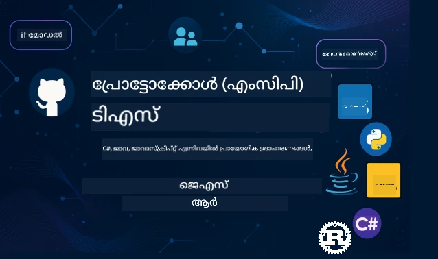

 

[](https://GitHub.com/microsoft/mcp-for-beginners/graphs/contributors)
[](https://GitHub.com/microsoft/mcp-for-beginners/issues)
[](https://GitHub.com/microsoft/mcp-for-beginners/pulls)
[](http://makeapullrequest.com)

[](https://GitHub.com/microsoft/mcp-for-beginners/watchers)
[](https://GitHub.com/microsoft/mcp-for-beginners/fork)
[](https://GitHub.com/microsoft/mcp-for-beginners/stargazers)


[](https://discord.gg/nTYy5BXMWG)

ഈ വിഭവങ്ങൾ ഉപയോഗിക്കാൻ തുടങ്ങാൻ ഈ ചുവടുവയ്പ്പ് പിന്തുടരുക:
1. **റിപ്പോസിറ്ററി ഫോര്‍ക്ക് ചെയ്യുക**: ക്ലിക്ക് ചെയ്യുക [](https://GitHub.com/microsoft/mcp-for-beginners/fork)
2. **റിപ്പോസിറ്ററി ക്ലോണ്‍ ചെയ്യുക**:   `git clone https://github.com/microsoft/mcp-for-beginners.git`
3. **കൂട്ടാളികളാക്കുക** [](https://discord.gg/nTYy5BXMWG)


### 🌐 പലഭാഷ പിന്തുണ

#### GitHub ആക്ഷന് വഴി പിന്തുണയ്ക്കുന്നു (സ്വയംകൃതമാക്കി എല്ലായ്പ്പോഴും പുതുക്കുന്നു)

<!-- CO-OP TRANSLATOR LANGUAGES TABLE START -->
[Arabic](../ar/README.md) | [Bengali](../bn/README.md) | [Bulgarian](../bg/README.md) | [Burmese (Myanmar)](../my/README.md) | [Chinese (Simplified)](../zh-CN/README.md) | [Chinese (Traditional, Hong Kong)](../zh-HK/README.md) | [Chinese (Traditional, Macau)](../zh-MO/README.md) | [Chinese (Traditional, Taiwan)](../zh-TW/README.md) | [Croatian](../hr/README.md) | [Czech](../cs/README.md) | [Danish](../da/README.md) | [Dutch](../nl/README.md) | [Estonian](../et/README.md) | [Finnish](../fi/README.md) | [French](../fr/README.md) | [German](../de/README.md) | [Greek](../el/README.md) | [Hebrew](../he/README.md) | [Hindi](../hi/README.md) | [Hungarian](../hu/README.md) | [Indonesian](../id/README.md) | [Italian](../it/README.md) | [Japanese](../ja/README.md) | [Kannada](../kn/README.md) | [Korean](../ko/README.md) | [Lithuanian](../lt/README.md) | [Malay](../ms/README.md) | [Malayalam](./README.md) | [Marathi](../mr/README.md) | [Nepali](../ne/README.md) | [Nigerian Pidgin](../pcm/README.md) | [Norwegian](../no/README.md) | [Persian (Farsi)](../fa/README.md) | [Polish](../pl/README.md) | [Portuguese (Brazil)](../pt-BR/README.md) | [Portuguese (Portugal)](../pt-PT/README.md) | [Punjabi (Gurmukhi)](../pa/README.md) | [Romanian](../ro/README.md) | [Russian](../ru/README.md) | [Serbian (Cyrillic)](../sr/README.md) | [Slovak](../sk/README.md) | [Slovenian](../sl/README.md) | [Spanish](../es/README.md) | [Swahili](../sw/README.md) | [Swedish](../sv/README.md) | [Tagalog (Filipino)](../tl/README.md) | [Tamil](../ta/README.md) | [Telugu](../te/README.md) | [Thai](../th/README.md) | [Turkish](../tr/README.md) | [Ukrainian](../uk/README.md) | [Urdu](../ur/README.md) | [Vietnamese](../vi/README.md)

> **സ്ഥലസ്ഥതിയില്‍ ക്ലോണ്‍ ചെയ്യാന്‍ ആഗ്രഹിക്കുകയാണോ?**
>
> ഈ റിപ്പോസിറ്ററിയിൽ 50-ലധികം ഭാഷാ വിവർത്തനങ്ങൾ ഉൾപ്പെടുത്തിയതിനാൽ ഡൗൺലോഡ് വലുപ്പം ഏറെ വർദ്ധിച്ചു. വിവർത്തനങ്ങൾ ഇല്ലാതെ ക്ലോൺ ചെയ്യാൻ, സ്പാർസ് ചെക്ക്ഔട്ട് ഉപയോഗിക്കുക:
>
> **Bash / macOS / Linux:**
> ```bash
> git clone --filter=blob:none --sparse https://github.com/microsoft/mcp-for-beginners.git
> cd mcp-for-beginners
> git sparse-checkout set --no-cone '/*' '!translations' '!translated_images'
> ```
>
> **CMD (Windows):**
> ```cmd
> git clone --filter=blob:none --sparse https://github.com/microsoft/mcp-for-beginners.git
> cd mcp-for-beginners
> git sparse-checkout set --no-cone "/*" "!translations" "!translated_images"
> ```
>
> ഇത് നിങ്ങളുടെ കോഴ്‌സ് പൂർത്തിയാക്കാനുള്ള എല്ലാ ആവശ്യക്കാരിയുമായി വളരെ വേഗത്തിലുള്ള ഡൗൺലോഡ് നൽകും.
<!-- CO-OP TRANSLATOR LANGUAGES TABLE END -->

# 🚀 മോഡല്‍ കോണ്‍ടെക്സ്റ്റ് പ്രോട്ടോക്കോള്‍ (MCP) പഠനപദ്ധതി ആരംഭക്കാർക്ക്

## **C#, Java, JavaScript, Rust, Python, TypeScript എന്നിവയിൽ ഹാൻഡ്‌സ്-ഓൺ കോഡ് ഉദാഹരണങ്ങളോടെ MCP പഠിക്കുക**

## 🧠 മോഡല്‍ കോണ്‍ടെക്സ്റ്റ് പ്രോട്ടോക്കോള്‍ പഠനപദ്ധതി അവലോകനം
മോഡല്‍ കോണ്‍ടെക്സ്റ്റ് പ്രോട്ടോക്കോള്‍ (MCP) യുടെ പരിസരത്തിലേക്കുള്ള നിങ്ങളുടെ യാത്രയിൽ സ്വാഗതം! എഐ ആപ്ലിക്കേഷനുകൾ വിവിധ ടൂളുകളുമായി സേവനങ്ങളുമായി എങ്ങനെ സംവദിക്കുന്നുവെന്ന് നിങ്ങൾ ഒരിക്കലും ആഗ്രഹിച്ചു കണ്ടിട്ടുണ്ടെങ്കിൽ, ഡെവലപ്പർമാർ ബുദ്ധിമാനായ സംവിധാനങ്ങൾ നിർമ്മിക്കുന്നവിധം മാറ്റം വരുത്തുന്ന ശോഭനമായ പരിഹാരം നിങ്ങൾ കണ്ടെത്താനുണ്ട്.

MCP യെ ഒരു സർവത്ര വിവർത്തകൻ WhatsApp പോലെ കരുതുക - USB പോർട്ടുകൾ എങ്ങനെ നിങ്ങളുടെ കമ്പ്യൂട്ടറിലേക്ക് ഏത് ഉപകരണമേയും കണക്റ്റ് ചെയ്യാൻ അനുവദിക്കുന്നുവെന്ന് പോലെ, MCP എഐ മോഡലുകൾക്ക് ഏത് ടൂളിനും സേവനത്തോടും സ്റ്റാൻഡേർഡ് രീതി വഴി കണക്റ്റ് ചെയ്യാൻ അനുവദിക്കുന്നു. നിങ്ങൾ നിങ്ങളുടെ ആദ്യ ചാറ്റ്ബോട്ട് നിർമ്മിക്കുന്നുണ്ടോ അല്ലെങ്കിൽ സങ്കീർണ്ണ എഐ വർക്ക്‌ഫ്ലോകളിൽ ജോലി ചെയ്യുന്നതോ എങ്കിൽ MCP മനസ്സിലാക്കുന്നത് കൂടുതൽ കഴിവുള്ള, കൂടുതൽ സൗകര്യമുള്ള ആപ്ലിക്കേഷനുകൾ സൃഷ്ടിക്കാൻ നിങ്ങൾക്ക് അധിക ശേഷി നൽകും.

ഈ പഠനപദ്ധതി നിങ്ങളുടെ പഠനയാത്രയ്ക്ക് സമവായത്തോടും കരുതലോടും രൂപകൽപ്പന ചെയ്‌തിരിക്കുന്നു. നിങ്ങൾക്ക് ഇതിനകം അറിയാവുന്ന ലളിതമായ ആശയങ്ങളിൽ നിന്ന് തുടങ്ങുകയും, നിങ്ങളുടെ ഇഷ്ടപ്പെട്ട പ്രോഗ്രാമിംഗ് ഭാഷയിൽ പ്രവർത്തനപരമായ പരിശീലനത്തിലൂടെ ക്ഷമയോടെ നിങ്ങളുടെ പ്രാവീണ്യം വർധിപ്പിക്കുകയും ചെയ്യും. ഓരോ സമയം സുതാര്യമായ വ്യാഖ്യാനങ്ങൾ, പ്രായോഗിക ഉദാഹരണങ്ങൾ, ബലമായി പ്രോത്സാഹനം എന്നിവ ഉൾക്കൊള്ളുന്നു.

ഈ യാത്ര പൂർത്തിയാക്കിയപ്പോൾ, നിങ്ങൾക്ക് നിങ്ങളുടെ സ്വന്തം MCP സರ್ವറുകൾ നിർമ്മിക്കാൻ, അവയെ പ്രചാരത്തിലുള്ള എഐ പ്ലാറ്റ്ഫോമുകളുമായി സംയോജിപ്പിക്കാൻ, ഈ സാങ്കേതികവിദ്യ എഐ വികസനത്തിന്റെ ഭാവി എങ്ങനെ രൂപകല്പന ചെയ്യുന്നു എന്ന് മനസ്സിലാക്കാൻ ആത്മവിശ്വാസം ഉണ്ടാകും. ഈ രസകരമായ സാഹസികതയെ നമുക്ക് ഒത്തുകൂടി തുടങ്ങാം!

### ഔദ്യോഗിക രേഖകളും സ്പെസിഫിക്കേഷനുകളും

ഈ പഠനപദ്ധതി **MCP സ്പെസിഫിക്കേഷൻ 2025-11-25** (സമീപകാല സ്ഥിരതയുള്ള റിലീസ്) നു പൊരുത്തപ്പെട്ടതാണ്. MCP സ്പെസിഫിക്കേഷൻ തീയതിഭേദ്യ വേർഷൻ ഉപയോഗിക്കുന്നു (YYYY-MM-DD ഫോർമാറ്റ്) പ്രകാരം വ്യക്തമായ പ്രോട്ടോക്കോൾ വേർഷൻ ട്രാക്കിംഗ് ഉറപ്പാക്കാനായി.

നിങ്ങളുടെ മനസ്സിലാക്കലുകൾ വികസിക്കുന്നു; ഈ വിഭവങ്ങളുടെ പ്രാധാന്യം ഉയരും, പക്ഷേ എല്ലാം അത് വായിക്കാൻ ഉടൻ സമ്മർദ്ദം അനുഭവിക്കേണ്ടതില്ല. നിങ്ങൾക്ക് ഏറ്റവും ഇഷ്ടപ്പെട്ട മേഖലയുമായി തുടങ്ങുക!
- 📘 [MCP ഡോക്യുമെന്റേഷൻ](https://modelcontextprotocol.io/) – ഘട്ടം ഘട്ടമായി ട്യുട്ടോറിയലുകളും ഉപയോക്തൃ മാർഗ്ഗനിർദ്ദേശങ്ങളും ഉൾക്കൊള്ളുന്ന നിങ്ങളുടെ പ്രധാന വിഭവം. ഈ ഡോക്യുമെന്റേഷൻ ആരംഭക്കാർക്ക് അനുസരിച്ചും ലളിതമായ ഉദാഹരണങ്ങളോടെയാണ് രചിച്ചിരിക്കുന്നത്, നിങ്ങൾ നിങ്ങളുടെ മറുപടിയോടെ എടുക്കാവുന്നുവെന്ന്.
- 📜 [MCP സ്പെസിഫിക്കേഷൻ](https://modelcontextprotocol.io/specification/2025-11-25) – ഇത് നിങ്ങളുടെ സമഗ്ര റഫറൻസ് മാനുവലാണ്. പഠനപദ്ധതി parcourt വ്യാപരി specific details കാണാൻ ഇവിടെ നാമെത്തി വളരെക്കാലം തിരിച്ച് വരാം.
- 📜 [MCP സ്പെസിഫിക്കേഷൻ വേർഷനിംഗ്](https://modelcontextprotocol.io/specification/versioning) – പ്രോട്ടോക്കോൾ വേർഷൻ ചരിത്രവും MCP യുടെ തീയതിബഹുല വേർഷൻ പാതവുമാണ് ഈ പേജിൽ.
- 🧑‍💻 [MCP GitHub റിപോസിറ്ററി](https://github.com/modelcontextprotocol) – ഇവിടെ നിങ്ങൾക്ക് SDKകൾ, ടൂൾസ്, വിവിധ പ്രോഗ്രാമിംഗ് ഭാഷകളിൽ കോഡ് സാമ്പിളുകൾ ലഭ്യമാണ്. പ്രായോഗിക ഉദാഹരണങ്ങൾക്കും ഉപയോഗിക്കാൻ തയ്യാറായ ഘടകങ്ങൾക്കും സമൃദ്ധമായ ഒരു സമാഹാരം പോലെയാണ് ഇത്.
- 🌐 [MCP കമ്മ്യൂണിറ്റി](https://github.com/orgs/modelcontextprotocol/discussions) – MCPയെക്കുറിച്ചുള്ള ചർച്ചകളിൽ സഹപാഠികളും പരിചയസമ്പന്നരായ ഡെവലപ്പർമാരും പങ്കാളികളാകൂ. അവിടെ സംശയങ്ങൾ സ്വാഗതപ്പെടും, അറിവ് വികസിപ്പിക്കും സൗഹൃദമായൊരു സമൂഹമാണ്.

## പഠന ലക്ഷ്യങ്ങൾ

ഈ പഠനപദ്ധതി പൂര്‍ത്തിയാക്കിയപ്പോഴേക്കും, നിങ്ങൾ നിങ്ങളുടെ പുതിയ കഴിവുകൾക്ക് ആത്മവിശ്വാസത്തോടെയും ഉത്സാഹത്തോടെയും കൂടിയിരിക്കുമെന്നാണ് പ്രതീക്ഷ. നിങ്ങൾ നേടുന്നതു:

• **MCP അടിസ്ഥാനങ്ങൾ മനസ്സിലാക്കുക**: മോഡല്‍ കോണ്‍ടെക്സ്റ്റ് പ്രോട്ടോക്കോള്‍ എന്താണെന്നും എങ്ങനെ എഐ ആപ്ലിക്കേഷനുകൾ തമ്മിൽ ചേർന്ന് പ്രവര്‍ത്തിക്കുന്നു എന്നതിന്റെ വിപുലമായ വ്യാഖ്യാനം അനൊഴിഞ്ഞു, ഉത്തമ ഉദാഹരണങ്ങളിലൂടെ മനസ്സിലാക്കുക.

• **നിങ്ങളുടെ ആദ്യ MCP സർവർ നിർമ്മിക്കുക**: നിങ്ങളുടെ ഇഷ്ടപ്പെട്ട പ്രോഗ്രാമിംഗ് ഭാഷയിൽ ലളിതമായ ഉദാഹരണങ്ങളിൽ നിന്ന başlayിച്ചു, കെട്ടിടം നയിക്കുന്ന ധാറ്റിര് ചില MCP സർവർ റിച്ചവ് ചെയ്യുക.

• **എഐ മോഡലുകൾക്ക് യഥാർത്ഥ ടൂളുകൾക്ക് കണക്റ്റ് ചെയ്യുക**: എഐ മോഡലുകളും യഥാർത്ഥ സേവനങ്ങളും തമ്മിലുള്ള കഴിഞ്ഞകൂടികൂടിയത് മനസിലാക്കുക, നിങ്ങളുടെ ആപ്ലിക്കേഷനുകൾക്ക് നവീന ശേഷികൾ നൽകുക.

• **സുരക്ഷാ മികച്ച പ്രാക്ടിസുകൾ നടപ്പിലാക്കുക**: നിങ്ങളുടെ MCP നടപ്പിലാക്കലുകൾ എങ്ങനെ സുരക്ഷിതമാക്കാം എന്ന് മനസ്സിലാക്കുക, നിങ്ങളുടെ ആപ്ലിക്കേഷനുകളും ഉപയോക്താക്കളും സംരക്ഷിക്കുക.

• **ആത്മവിശ്വാസത്തോടെയുള്ള വിന്യാസം**: വികസനത്തിൽ നിന്നുള്ള MCP പ്രോജക്ടുകൾ ഉത്പാദനത്തിലേക്ക് എങ്ങനെ കൊണ്ടുപോകാമെന്ന് അറിഞ്ഞിരിക്കണം, നിലവിലുള്ള പ്രായോഗിക വിന്യാസ തന്ത്രങ്ങള്‍ ഉപയോഗിച്ച്.

• **MCP സമൂഹത്തിൽ ചേരുക**: AI ആപ്ലിക്കേഷൻ ഡെവലപ്പ്മെന്റ് ഭാവി രൂപം കൊടുക്കുന്ന വളരുന്ന ഡെവലപ്പർമാരുടെ കൂട്ടത്തിൽ നിങ്ങൾ ചേരുക.

## ആവശ്യമുള്ള പശ്ചാത്തലം

MCP-യുടെ പ്രത്യേകതകളിലേക്ക് നാം കടക്കുന്നതിനു മുന്‍പ് അടിസ്ഥാന ആശയങ്ങളിൽ നിങ്ങൾക്ക് സൗകര്യമുണ്ടെന്ന് ഉറപ്പാക്കാം. ഈ മേഖലകളിൽ വിദഗ്ധനല്ലെങ്കിൽ വിഷമിക്കേണ്ട; നമുക്ക് വരും വഴി ആവശ്യമായ എല്ലാ കാര്യങ്ങളും വിശദീകരിക്കും!

### പ്രോട്ടോക്കോളുകൾ മനസ്സിലാക്കുക (അടിസ്ഥാനമായത്)

ഒരു പ്രോട്ടോക്കോൾ ഒരു സംഭാഷണത്തിന്റെ നിബന്ധനകളെപ്പോലെ കരുതുക. നിങ്ങൾ ഒരു സുഹൃത്തെ വിളിക്കുമ്പോൾ രണ്ടുപേരും ‘ഹലോ’ എന്നു പറഞ്ഞ് ബന്ധം തുടങ്ങും, മറുപടി പറയുകയും പിരിയുമ്പോൾ ‘വിട’ പറയും. കമ്പ്യൂട്ടർ പ്രോഗ്രാമുകൾക്കും ഉറപ്പുള്ള നിയമങ്ങൾ വേണം സമാധാനപരമായ ആശയവിനിമയത്തിന്.

MCP ഒരു പ്രോട്ടോക്കോൾ ആണ് - എഐ മോഡലുകളും ആപ്ലിക്കേഷനുകളും ടൂളുകളുമായി സേവനങ്ങളുമായി ഫലപ്രദമായ ‘സംഭാഷണം’ നടത്താൻ സഹായിക്കുന്ന സമ്മതിക്കപ്പെട്ട നിയമങ്ങളുടെ സമാഹാരം. മനുഷ്യസംവാദത്തിൽനിന്നും ഉണ്ടായ നിയമപാലനം എങ്ങനെ ആശയവിനിമയം സുഗമമാക്കുന്നു, MCP അതുപോലെ എഐ ആപ്ലിക്കേഷൻ ആത്മവിശ്വാസം കൊണ്ട് ആശയവിനിമയം നടത്താൻ സഹായിക്കുന്നു.

### ക്ലയന്റ്-സെർവർ ബന്ധങ്ങൾ (പ്രോഗ്രാമുകൾ ചേർന്ന് പ്രവർത്തിക്കുന്നത്)

നീங்கள் എല്ലാവരും ദിവസേന ക്ലയന്റ്-സെർവർ ബന്ധങ്ങൾ ഉപയോഗിക്കുന്നു! ഒരു വെബ് ബ്രൗസർ (ക്ലയന്റ്) ഉപയോഗിച്ച് വെബ്‌സൈറ്റ് സന്ദർശിക്കുമ്പോൾ, നിങ്ങൾ വെബ് സേർവറുമായി കണക്റ്റ് ചെയ്യുന്നു. ബ്രൗസറെ ആവശ്യത്തിന് വിവരങ്ങൾ ചോദിക്കാൻ അറിയും, സെർവർ മറുപടി പറയാൻ.

MCP ൽ സമാന ബന്ധം ഉണ്ട്; എഐ മോഡലുകൾ ക്ലയന്റുകളാണ്, അവര്‍ക്ക് വിവരങ്ങളോ പ്രവർത്തനങ്ങളോ അഭ്യർത്ഥിക്കാൻ കഴിയും, MCP സർവർ ജവಾಬ് നൽകുന്നു. ഇതു സഹായക അസിസ്റ്റന്റുപോലെയാണ് (സർവർ) എഐക്ക് പ്രത്യേകം ടാസ്കുകൾ ചെയ്യാനാകും.

### സ്റ്റാൻഡേർഡൈസേഷൻ പ്രധാനപ്പെട്ടത് എന്തിന് (എല്ലാം ചേർന്ന് പ്രവര്‍ത്തിക്കാൻ)

എല്ലാ കാർ നിർമ്മാതാക്കളും വ്യത്യസ്ത ആകൃതി വലയുള്ള ഇന്ധന പമ്പുകൾ ഉപയോഗിക്കുകയായിരുന്നെങ്കിൽ എതിർക്കു ഓരോ കാറിനും വ്യത്യസ്ത അഡാപ്പ്റ്റർ വേണം! സ്റ്റാൻഡേർഡൈസേഷൻ പൊതു രീതി ഒപ്പുവെക്കുകയാണെങ്കിൽ സാധനങ്ങൾ ചേർന്ന് പ്രശ്നമില്ലാതെ പ്രവർത്തിക്കും.

MCP ഇത് എഐ ആപ്ലിക്കേഷൻകൾക്കായുള്ള സ്റ്റാൻഡേർഡൈസേഷൻ നൽകുന്നു. ഓരോ എഐ മോഡലിനും ഓരോ ടൂൾവുമൊത്ത് പ്രവർത്തിക്കാൻ വ്യത്യസ്ത കോഡ് എഴുതേണ്ടതില്ല; MCP അവക്ക് തമ്മിൽ ആശയവിനിമയം നടത്താനുള്ള സർവത്രമായ മാർഗ്ഗം സൃഷ്ടിക്കുന്നു. അതിലൂടെ ഡെവലപ്പർമാർ ഒരിക്കൽ ടൂൾ നിർമ്മിച്ച് അനേകം എഐ സംവിധാനങ്ങളുമായി അതു പ്രവർത്തിക്കയും ചെയ്യും.

## 🧭 നിങ്ങളുടെ പഠനപാത അവലോകനം

നിങ്ങളുടെ MCPയുടെ യാത്ര ശ്രദ്ധാപൂർവം തയാറാക്കപ്പെട്ടിരിക്കുന്നു, ആത്മവിശ്വാസവും കഴിവും തുടർച്ചയായി വളരാൻ. ഓരോ ഘട്ടവും പുതിയ ആശയങ്ങൾ ഉൾക്കൊള്ളുകയും മുമ്പ് പഠിച്ചവക്കായി പുനഃപഠനം നടത്തുകയും ചെയ്യും.

### 🌱 അടിസ്ഥാന ഘട്ടം: അടിസ്ഥാനങ്ങൾ മനസ്സിലാക്കൽ (മോഡ്യൂളുകൾ 0-2)

ഇവിടെ നിങ്ങളുടെ സാഹസികത തുടങ്ങും! പരിചിതമായ ഉപമകളും ലളിതമായ ഉദാഹരണങ്ങളുമായ MCP ആശയങ്ങളെ പരിചയപ്പെടുത്തും. MCP എന്താണെന്നും, അത് എന്തിന് ഉണ്ട് എന്നും, എഐ വികസന ലോകത്ത് അതിന്റെ സ്ഥാനം എന്നുമെല്ലാം മനസിലാക്കും.

• **മോഡ്യൂൾ 0 - MCP പരിചയം**: MCP എന്താണെന്ന്, ആധുനിക എഐ ആപ്ലിക്കേഷനുകൾക്കായുള്ള അതിന്റെ പ്രാധാന്യം എങ്ങനെ ആയിരിക്കുന്നുവെന്ന് നോക്കാം.വാസ്തവ ലോകത്ത് MCP നടപ്പിലാക്കലുകളുടെ ഉദാഹരണങ്ങൾ കാണും, ഡെവലപ്പർമാർ നേരിടുന്ന സാധാരണ പ്രശ്നങ്ങൾ MCP എങ്ങനെ പരിഹരിക്കുന്നു എന്ന് മനസ്സിലാക്കും.

• **മോഡ്യൂൾ 1 - പ്രധാന ആശയങ്ങൾ വിശദീകരണം**: MCP യുടെ പ്രധാന ഘടകങ്ങൾ ഇവിടെ വിശദീകരിക്കും. ബഹു ഉപമകളും ദൃശ്യ ഉദാഹരണങ്ങളും ഉപയോഗിച്ച് ഈ ആശയങ്ങൾ സ്വാഭാവികവും മനസ്സിലാക്കാവുന്നതുമാക്കും.

• **മോഡ്യൂൾ 2 - MCP ൽ സുരക്ഷ**: സുരക്ഷ ഭയപ്പെടേണ്ട ഒന്നല്ല, MCP ഉൾകൊള്ളിക്കുന്ന സുരക്ഷാ സവിശേഷതകളും മികച്ച പ്രാക്ടീസുകളും പഠിപ്പിക്കും, നിങ്ങളുടെ ആപ്ലിക്കേഷനുകൾ തുടക്കത്തിലട്ടു സംരക്ഷിക്കുന്നതിന്.

### 🔨 നിർമ്മാണ ഘട്ടം: നിങ്ങളുടെ ആദ്യ നടപ്പാക്കിയതുകൾ സൃഷ്ടിക്കൽ (മോഡ്യൂൾ 3)

ഇപ്പൊഴാണ് യഥാർത്ഥ രസരം ആരംഭിക്കുന്നത്! നിങ്ങൾക്ക് കൈയ്യിൽ കൊണ്ട് MCP സേർവറുകളുടെയും ക്ലയന്റുകളുടെയും പ്രവർത്തനം നിർമാണം നൽകും. ഭയപ്പെടേണ്ട, ലളിതമായാണ് തുടങ്ങുന്നത്, ഓരോ ഘട്ടത്തിലൂടെയും നാം ഗൈഡ് ചെയ്യും.
ഈ മോഡ്യൂളിൽ നിങ്ങളുടെ ഇഷ്ടപ്പെട്ട പ്രോഗ്രാമിങ് ഭാഷയിൽ പ്രാവർത്തികമാകാനുള്ള നിരവധി ഗൈഡുകൾ शामिल ആണ്. നിങ്ങൾ നിങ്ങളുടെ ആദ്യ സെർവർ സൃഷ്ടിക്കും, അതുമായി കണക്ട് ചെയ്യുന്ന ക്ലയന്റ് നിർമ്മിക്കും, പക്ഷേപ്പ് ജനപ്രിയ ഡെവലപ്പ്മെന്റ് ടൂളുകൾ പോലുള്ള VS കോഡ് പോലുള്ളവയിൽ സംയോജിപ്പിക്കും.

ഓരോ ഗൈഡിനും പൂര്‍ണമായ കോഡ് ഉദാഹരണങ്ങൾ, പ്രശ്നപരിഹാര ടിപ്പ്‌സുകൾ, ഏതുകൊണ്ടാണ് നാം പ്രത്യേക ഡിസൈൻ തിരഞ്ഞെടുപ്പുകൾ ചെയ്യുന്നത് എന്നതിന്റെ വിശദീകരണങ്ങളുമുണ്ട്. ഈ ഘട്ടത്തിന്റെ അവസാനത്തോടെ, നിങ്ങൾക്ക് അഭിമാനിക്കാവുന്ന പ്രവർത്തനക്ഷമമായ MCP നടപ്പാക്കലുകൾ ഉണ്ടായിരിക്കും!

### 🚀 വളർച്ച ഘട്ടം: ഉയർന്ന വിശകലനങ്ങളും യാഥാർഥപ്രയോഗവും (മോഡ്യൂളുകൾ 4-5)

അടിസ്ഥാനങ്ങൾ കൈമാറിയതിനു ശേഷം, നിങ്ങൾ MCP-ന്റെ കൂടുതൽ സങ്കീർണ്ണമായ സവിശേഷതകൾ അന്വേഷിക്കാൻ തയ്യാറാണ്. പ്രായോഗിക നടപ്പാക്കൽ തന്ത്രങ്ങൾ, ഡീബഗ്ഗിംഗ് സാങ്കേതികവിദ്യകൾ, മൾട്ടി-മോഡൽ AI സംയോജനം പോലുള്ള ഉന്നത വിഷയങ്ങൾ കൈമാറും.

അതിനൊപ്പം, MCP-ന്റെ നടപ്പാക്കലുകൾ പ്രോഡക്ഷൻ ഉപയോഗത്തിനായി സ്കെയിൽ ചെയ്യാനും Azure പോലെയുള്ള ക്ലൗഡ് പ്ലാറ്റ്ഫോമുകളുമായി സംയോജിപ്പിക്കാനും നിങ്ങൾ പഠിക്കുമെന്ന് ഞങ്ങൾ പ്രതീക്ഷിക്കുന്നു. ഈ മോഡ്യൂളുകൾ യാഥാർത്ഥ ലോക ആവശ്യങ്ങളെ കൈകാര്യം ചെയ്യാനുള്ള MCP പരിഹാരങ്ങൾ നിർമ്മിക്കാൻ നിങ്ങളെ തയ്യാറാക്കും.

### 🌟 മാവേലി ഘട്ടം: സമൂഹവും സ്പെഷ്യലൈസേഷനും (മോഡ്യൂളുകൾ 6-11)

അവസാന ഘട്ടം MCP സമൂഹത്തിൽ ചേരാനും നിങ്ങളുടെ ഏറ്റവും കൂടുതൽ താല്പര്യമുളള മേഖലകളിൽ വിദഗ്ധരാകാനും മനസ്സുനൽകുന്നു. നിങ്ങൾ ഓപ്പൺ-സോഴ്‌സ് MCP പ്രോജക്റ്റുകളിൽ സംഭാവന നൽകുന്നത്, ഉയർന്ന സുരക്ഷാ വൈസ് സാഹചര്യങ്ങൾ നടപ്പിലാക്കുന്നത്, സമഗ്രമായ ഡാറ്റാബേസ് സംയോജിത പരിഹാരങ്ങൾ നിർമ്മിക്കുന്നത് പഠിക്കും.

മോഡ്യൂൾ 11-ന് പ്രത്യേക പരാമർശം വേണം - ഇത് പൊസ്റ്റെഗ്രെഎസ്‌ക്യു.എൽ (PostgreSQL) സംയോജനം ഉള്ള പ്രോഡക്ഷൻ-റെഡി MCP സെർവറുകൾ നിർമ്മിക്കാൻ പഠിപ്പിക്കുന്ന 13-ലാബ് സമ്പൂർണ പ്രാവർത്തിക പഠന പാതയാണ്. ഇത് നിങ്ങൾ പഠിച്ചതെല്ലാം ഒന്നിച്ച് കൂട്ടിയ ഒരു കാപ്സ്റ്റോൺ പ്രോജക്ട് പോലെ ആണ്!

### 📚 പൂര്‍ണ പാഠ്യ ക്രമരൂപം

| മോഡ്യൂൾ | വിഷയം | വിവരണം | ലിങ്ക് |
|--------|-------|-------------|------|
| **മോഡ്യൂൾ 0-3: അടിസ്ഥാനങ്ങൾ** | | | |
| 00 | MCP പരിചയം | മോഡൽ കോൺടക്സ്റ്റ് പ്രോട്ടോക്കോൾ (MCP) ന്റെ അവലോകനം, AI പൈപ്പ് ലൈൻ ലെ പ്രസക്തി | [കൂടുതൽ വായിക്കുക](./00-Introduction/README.md) |
| 01 | പ്രധാന ആശയങ്ങളുടെ വിശദീകരണം | MCP മുഖ്യ ആശയങ്ങളുടെ ആഴത്തിലുള്ള പരിശോധനം | [കൂടുതൽ വായിക്കുക](./01-CoreConcepts/README.md) |
| 02 | MCP-യിലെ സുരക്ഷ | സുരക്ഷാ ഭീഷണികളും മികച്ച പ്രായോഗിക മാർഗങ്ങളും | [കൂടുതൽ വായിക്കുക](./02-Security/README.md) |
| 03 | MCP പ്രാരംഭം | പരിസ്ഥിതി ക്രമീകരണം, അടിസ്ഥാന സെർവർ-ക്ലയന്റ്, സംയോജനം | [കൂടുതൽ വായിക്കുക](./03-GettingStarted/README.md) |
| **മോഡ്യൂൾ 3: നിങ്ങളുടെ ആദ്യ സെർവർ & ക്ലയന്റ് നിർമ്മാണം** | | | |
| 3.1 | ആദ്യ സെർവർ | നിങ്ങളുടെ ആദ്യ MCP സെർവർ സൃഷ്ടിക്കുക | [ഗൈഡ്](./03-GettingStarted/01-first-server/README.md) |
| 3.2 | ആദ്യ ക്ലയന്റ് | ഒരു അടിസ്ഥാന MCP ക്ലയന്റ് വികസിപ്പിക്കുക | [ഗൈഡ്](./03-GettingStarted/02-client/README.md) |
| 3.3 | LLM ക്ലയന്റ് | വലിയ ഭാഷാ മോഡലുകൾ സംയോജിപ്പിക്കുക | [ഗൈഡ്](./03-GettingStarted/03-llm-client/README.md) |
| 3.4 | VS കോഡ് സംയോജനം | VS കോഡിൽ MCP സെർവർ ഉപയോഗിക്കുക | [ഗൈഡ്](./03-GettingStarted/04-vscode/README.md) |
| 3.5 | stdio സെർവർ | stdio ട്രാൻസ്പോർട്ട് ഉപയോഗിച്ച് സെർവർ നിർമ്മിക്കുക | [ഗൈഡ്](./03-GettingStarted/05-stdio-server/README.md) |
| 3.6 | HTTP സ്ട്രീമിംഗ് | MCP-യിൽ HTTP സ്ട്രീമിംഗ് നടപ്പാക്കുക | [ഗൈഡ്](./03-GettingStarted/06-http-streaming/README.md) |
| 3.7 | AI ടൂള്കിറ്റ് | MCP-യിൽ AI ടൂള്കിറ്റ് ഉപയോഗിക്കുക | [ഗൈഡ്](./03-GettingStarted/07-aitk/README.md) |
| 3.8 | ടെസ്റ്റിംഗ് | MCP സെർവർ നടപ്പിലാക്കൽ പരീക്ഷിക്കുക | [ഗൈഡ്](./03-GettingStarted/08-testing/README.md) |
| 3.9 | വിന്യാസം | MCP സെർവർ പ്രൊഡക്ഷനിലേക്ക് വിന്യസിക്കുക | [ഗൈഡ്](./03-GettingStarted/09-deployment/README.md) |
| 3.10 | ആഡ്‌വാൻസ്ഡ് സെർവർ ഉപയോഗം | ഉയർന്ന സവിശേഷതകളും മെച്ചപ്പെട്ട ഘടനകളും ഉപയോഗിച്ച് ആഡ്‌വാൻസ്ഡ് സെർവർ ഉപയോഗിക്കുക | [ഗൈഡ്](./03-GettingStarted/10-advanced/README.md) |
| 3.11 | ലളിതം അഥോർ | ആരംഭത്തിൽ നിന്നുള്ള അഥോരന്റിക്കേഷൻ RBAC ഉൾപ്പെടെ | [ഗൈഡ്](./03-GettingStarted/11-simple-auth/README.md) |
| 3.12 | MCP ഹോസ്റ്റുകൾ | Claude Desktop, Cursor, Cline, മറ്റ് MCP ഹോസ്റ്റുകൾ ക്രമീകരിക്കുക | [ഗൈഡ്](./03-GettingStarted/12-mcp-hosts/README.md) |
| 3.13 | MCP ഇൻസ്പെക്ടർ | ഇൻസ്പെക്ടർ ടൂൾ ഉപയോഗിച്ച് MCP സെർവർ ഡീബഗ് ചെയ്യുക, പരീക്ഷിക്കുക | [ഗൈഡ്](./03-GettingStarted/13-mcp-inspector/README.md) |
| 3.14 | സാമ്പ്ലിംഗ് | ക്ലയന്റുമായി സഹകരിക്കാൻ സാമ്പ്ലിംഗ് ഉപയോഗിക്കുക | [ഗൈഡ്](./03-GettingStarted/14-sampling/README.md) |
| 3.15 | MCP ആപ്പുകൾ | MCP ആപ്പുകൾ നിർമ്മിക്കുക | [ഗൈഡ്](./03-GettingStarted/15-mcp-apps/README.md) |

| **മോഡ്യൂൾ 4-5: പ്രായോഗികവും ഉന്നതവുമായവ** | | | |
| 04 | പ്രായോഗിക നടപ്പാക്കൽ | SDKകൾ, ഡീബഗ്ഗിംഗ്, ടെസ്റ്റിംഗ്, പുനരുപയോഗയോഗ്യമായ പ്രോംപ്റ്റ് ടെംപ്ലേറ്റുകൾ | [കൂടുതൽ വായിക്കുക](./04-PracticalImplementation/README.md) |
| 4.1 | പേജിനേഷൻ | കൂടുതൽ ഫലം സജ്ജീകരണങ്ങൾ കർസർ ആധാരിത പേജിനേഷൻ ഉപയോഗിച്ച് കൈകാര്യം ചെയ്യുക | [ഗൈഡ്](./04-PracticalImplementation/pagination/README.md) |
| 05 | MCPയിലെ ആവിർഭാവങ്ങൾ | മൾട്ടി-മോഡൽ AI, സ്കെയിലിംഗ്, എന്റർപ്രൈസ് ഉപയോഗം | [കൂടുതൽ വായിക്കുക](./05-AdvancedTopics/README.md) |
| 5.1 | Azure സംയോജനം | Azure-യുമായുള്ള MCP സംയോജനം | [ഗൈഡ്](./05-AdvancedTopics/mcp-integration/README.md) |
| 5.2 | മൾട്ടി-മോഡാലിറ്റിയുടെ പ്രവർത്തനം | ബഹുമുഖ ഉപയോഗങ്ങൾ | [ഗൈഡ്](./05-AdvancedTopics/mcp-multi-modality/README.md) |
| 5.3 | OAuth2 ഡെമോ | OAuth2 അഥോരന്റിക്കേഷൻ നടപ്പാക്കുക | [ഗൈഡ്](./05-AdvancedTopics/mcp-oauth2-demo/README.md) |
| 5.4 | റൂട്ട് കോൺടെക്സ്റ്റുകൾ | റൂട്ട് കോൺടെക്സ്റ്റുകൾ മനസ്സിലാക്കുക, നടപ്പാക്കുക | [ഗൈഡ്](./05-AdvancedTopics/mcp-root-contexts/README.md) |
| 5.5 | റൂട്ടിംഗ് | MCP റൂട്ടിംഗ് തന്ത്രങ്ങൾ | [ഗൈഡ്](./05-AdvancedTopics/mcp-routing/README.md) |
| 5.6 | സാമ്പ്ലിംഗ് | MCP-യിലെ സാമ്പ്ലിംഗ് സാങ്കേതിക വിദ്യകൾ | [ഗൈഡ്](./05-AdvancedTopics/mcp-sampling/README.md) |
| 5.7 | സ്കെയിലിംഗ് | MCP നടപ്പാക്കലുകൾ സ്കെയിൽ ചെയ്യുക | [ഗൈഡ്](./05-AdvancedTopics/mcp-scaling/README.md) |
| 5.8 | സുരക്ഷ | ഉയർന്ന സുരക്ഷാ ആശയങ്ങൾ | [ഗൈഡ്](./05-AdvancedTopics/mcp-security/README.md) |
| 5.9 | വെബ് സെർച്ച് | വെബ് സെർച്ച് ശേഷികൾ നടപ്പാക്കുക | [ഗൈഡ്](./05-AdvancedTopics/web-search-mcp/README.md) |
| 5.10 | റിയൽടൈം സ്ട്രീമിംഗ് | റിയൽടൈം സ്ട്രീമിംഗ് പ്രവർത്തന ക്ഷമത നിർമ്മിക്കുക | [ഗൈഡ്](./05-AdvancedTopics/mcp-realtimestreaming/README.md) |
| 5.11 | റിയൽടൈം സെർച്ച് | റിയൽടൈം സെർച്ച് നടപ്പാക്കുക | [ഗൈഡ്](./05-AdvancedTopics/mcp-realtimesearch/README.md) |
| 5.12 | Entra ID അഥോരൻ | Microsoft Entra ID ഉപയോഗിച്ചുള്ള അഥോരന്റിക്കേഷൻ | [ഗൈഡ്](./05-AdvancedTopics/mcp-security-entra/README.md) |
| 5.13 | ഫൗൻഡ്രി സംയോജനം | Azure AI Foundry-യുമായി സംയോജിപ്പിക്കുക | [ഗൈഡ്](./05-AdvancedTopics/mcp-foundry-agent-integration/README.md) |
| 5.14 | കോൺടെക്സ്റ്റ് എഞ്ചിനീയറിംഗ് | ഫലപ്രദമായ കോൺടെക്സ്റ്റ് എഞ്ചിനീയറിംഗ് സാങ്കേതിക വിദ്യകൾ | [ഗൈഡ്](./05-AdvancedTopics/mcp-contextengineering/README.md) |
| 5.15 | MCP കസ്റ്റം ട്രാൻസ്പോർട്ട് | കസ്റ്റം ട്രാൻസ്പോർട്ട് നടപ്പാക്കലുകൾ | [ഗൈഡ്](./05-AdvancedTopics/mcp-transport/README.md) |
| 5.16 | പ്രോട്ടോക്കോൾ സവിശേഷതകൾ | പുരോഗതി അറിയിപ്പുകൾ, റദ്ദാക്കൽ, റീസോഴ്‌സ് ടെംപ്ലേറ്റുകൾ | [ഗൈഡ്](./05-AdvancedTopics/mcp-protocol-features/README.md) |
| **മോഡ്യൂൾ 6-10: സമൂഹവും മികച്ച പ്രായോഗിക ഉപാധികളും** | | | |
| 06 | സമൂഹ സംഭാവനകൾ | MCP സാഹചര്യത്തിൽ സംഭാവന ചെയ്യുന്നത് എങ്ങനെ | [ഗൈഡ്](./06-CommunityContributions/README.md) |
| 07 | പ്രാരംഭ ദർശനങ്ങളിൽ നിന്ന് പാഠങ്ങൾ | യാഥാർത്ഥ പ്രവർത്തന കഥകൾ | [ഗൈഡ്](./07-LessonsfromEarlyAdoption/README.md) |
| 08 | MCP-ന് മികച്ച പ്രായോഗികങ്ങൾ | പ്രകടനം, തകരാറു പ്രതിരോധം, സാന്ദ്രത | [ഗൈഡ്](./08-BestPractices/README.md) |
| 09 | MCP കേസ് സ്റ്റഡികൾ | പ്രായോഗിക നടപ്പിലാക്കൽ ഉദാഹരണങ്ങൾ | [ഗൈഡ്](./09-CaseStudy/README.md) |
| 10 | പ്രാവർത്തിക പ്രവർത്തനശാല | AI ടൂള്കിറ്റ് ഉപയോഗിച്ച് MCP സെർവർ നിർമ്മാണം | [ലാബ്](./10-StreamliningAIWorkflowsBuildingAnMCPServerWithAIToolkit/README.md) |
| **മോഡ്യൂൾ 11: MCP സെർവർ ഹാൻഡ്‌സ് ഓൺ ലാബ്** | | | |
| 11 | MCP സെർവർ ഡാറ്റാബേസ് സംയോജനം | പൊസ്ത്ഗ്രേഎസ്‌ക്യു.എൽ (PostgreSQL) സംയോജനം ഉള്ള സമഗ്രം 13-ലാബ് ഹാൻഡ്‌സ് ഓൺ പഠന പാത | [ലാബുകൾ](./11-MCPServerHandsOnLabs/README.md) |
| 11.1 | പരിചയം | ഡാറ്റാബേസ് സംയോജനം ഉൾപ്പെടെയുള്ള MCP അവലോകനവും റീട്ടെയിൽ അനലിറ്റിക്‌സ് ഉപയോഗപ്പാടും | [ലാബ് 00](./11-MCPServerHandsOnLabs/00-Introduction/README.md) |
| 11.2 | കോർ ആർക്കിടെക്ചർ | MCP സെർവർ ഘടന, ഡാറ്റാബേസ് ലെയറുകൾ, സുരക്ഷാ വ്യൂഹങ്ങൾ | [ലാബ് 01](./11-MCPServerHandsOnLabs/01-Architecture/README.md) |
| 11.3 | സുരക്ഷ & മൾട്ടി-ടിനൻസി | റോ ലെവൽ സെക്യുരിറ്റി, അഥോരൻ, മൾട്ടി-ടിനന്റ് ഡാറ്റാ ആക്‌സസ് | [ലാബ് 02](./11-MCPServerHandsOnLabs/02-Security/README.md) |
| 11.4 | പരിസ്ഥിതി ക്രമീകരണം | ഡെവലപ്പ്മെന്റ് പരിസ്ഥിതി ക്രമീകരിക്കൽ, ഡോക്കർ, Azure വിഭവങ്ങൾ | [ലാബ് 03](./11-MCPServerHandsOnLabs/03-Setup/README.md) |
| 11.5 | ഡാറ്റാബേസ് ഡിസൈൻ | പൊസ്ത്ഗ്രേഎസ്‌ക്യു.എൽ സജ്ജീകരണം, റീട്ടെയിൽ സ്‌കീമ ഡിസൈൻ, സാമ്പിൾ ഡാറ്റ | [ലാബ് 04](./11-MCPServerHandsOnLabs/04-Database/README.md) |
| 11.6 | MCP സെർവർ നടപ്പാക്കൽ | ഡാറ്റാബേസ് സംയോജിത ഫാസ്റ്റ് MCP സെർവർ നിർമ്മാണം | [ലാബ് 05](./11-MCPServerHandsOnLabs/05-MCP-Server/README.md) |
| 11.7 | ടൂൾ വികസനം | ഡാറ്റാബേസ് ക്വറി ടൂൾസും സ്‌കീമ ഇൻട്രോസ്പെക്ഷനും നിർമ്മിക്കൽ | [ലാബ് 06](./11-MCPServerHandsOnLabs/06-Tools/README.md) |
| 11.8 | സെമാന്റിക് സെർച്ച് | Azure OpenAI, pgvector ഉപയോഗിച്ച് വെക്ടർ എംബെഡ്ഡിങ്സ് നടപ്പാക്കൽ | [ലാബ് 07](./11-MCPServerHandsOnLabs/07-Semantic-Search/README.md) |
| 11.9 | ടെസ്റ്റിംഗ് & ഡീബഗ്ഗിംഗ് | ടെസ്റ്റിംഗ് തന്ത്രങ്ങൾ, ഡീബഗ് ടൂൾസ്, സാധൂകരിക്കൽ സമീപനങ്ങൾ | [ലാബ് 08](./11-MCPServerHandsOnLabs/08-Testing/README.md) |
| 11.10 | VS കോഡ് സംയോജനം | VS കോഡ് MCP സംയോജനം, AI ചാറ്റ് ഉപയോഗം ക്രമീകരിക്കൽ | [ലാബ് 09](./11-MCPServerHandsOnLabs/09-VS-Code/README.md) |
| 11.11 | വിന്യാസ തന്ത്രങ്ങൾ | ഡോക്കർ വിന്യാസം, Azure കോണ്ടൈനർ ആപ്പുകൾ, സ്കെയിലിംഗ് പരിഗണനകൾ | [ലാബ് 10](./11-MCPServerHandsOnLabs/10-Deployment/README.md) |
| 11.12 | നിരീക്ഷണം | അപ്ലിക്കേഷൻ ഇൻസൈറ്റ്സ്, ലോക്കിംഗ്, പെർഫോമൻസ് നിരീക്ഷണം | [ലാബ് 11](./11-MCPServerHandsOnLabs/11-Monitoring/README.md) |
| 11.13 | മികച്ച പ്രായോഗികങ്ങൾ | പ്രകടന മെച്ചപ്പെടുത്തലുകൾ, സുരക്ഷ കർശനവൽക്കരണം, പ്രോഡക്ഷൻ ടിപ്സ് | [ലാബ് 12](./11-MCPServerHandsOnLabs/12-Best-Practices/README.md) |

### 💻 സാമ്പിൾ കോഡ് പ്രോജക്റ്റുകൾ

MCP പഠനത്തിൻറെ ഏറ്റവും രസകരമായ ഭാഗങ്ങളിൽ ഒന്നാണ് നിങ്ങളുടെ കോഡ് കഴിവുകൾ പ്രോഗ്രസീവായി വളരുന്നത് കാണുക. ഞങ്ങൾ നമ്മുടെ കോഡ് ഉദാഹരണങ്ങൾ ലളിതമായി ആരംഭിക്കും, നിങ്ങൾക്ക് കൂടുതൽ ആഴത്തിൽ മനസ്സിലാകുമ്പോൾ കൂടുതൽ സങ്കീർണ്ണതകളിലേക്ക് വളരുകയും ചെയ്യും. ഇവിടെ ആശയങ്ങൾ അവതരിപ്പിക്കുന്ന വിധം - എളുപ്പത്തിൽ മനസ്സിലാക്കാവുന്ന പക്ഷേ യഥാർത്ഥ MCP സിദ്ധാന്തങ്ങൾ പ്രകടിപ്പിക്കുന്ന കോഡ്, ഇത് നോക്കുമ്പോൾ നിങ്ങൾക്ക് ഈ കോഡ് എന്ത് ചെയ്യുന്നുവെന്ന് മാത്രമല്ല, എന്തുകൊണ്ടാണ് ഇത് ഈ രീതിയിലുള്ള ഘടനയുള്ളത് എന്നും, ഇത് വലിയ MCP ആപ്ലിക്കേഷനുകളിൽ എങ്ങനെ ചേരുന്നു എന്നും നിങ്ങൾ മനസ്സിലാക്കും.

#### അടിസ്ഥാന MCP കാൽക്കുലേറ്റർ സാമ്പിളുകൾ

| ഭാഷ | വിവരണം | ലിങ്ക് |
|----------|-------------|------|
| C# | MCP സെർവർ ഉദാഹരണം | [കോൾ കാണുക](./03-GettingStarted/samples/csharp/README.md) |
| ജാവ | MCP കാൽക്കുലേറ്റർ | [കോൾ കാണുക](./03-GettingStarted/samples/java/calculator/README.md) |
| ജാവാസ്‌ക്രിപ്റ്റ് | MCP ഡെമോ | [കോൾ കാണുക](./03-GettingStarted/samples/javascript/README.md) |
| പൈതൺ | MCP സെർവർ | [കോൾ കാണുക](../../03-GettingStarted/samples/python/mcp_calculator_server.py) |
| ടൈപ്പ്സ്ക്രിപ്റ്റ് | MCP ഉദാഹരണം | [കോൾ കാണുക](./03-GettingStarted/samples/typescript/README.md) |
| റസ്റ്റ് | MCP ഉദാഹരണം | [കോൾ കാണുക](./03-GettingStarted/samples/rust/README.md) |

#### ഉയര്‍ന്ന MCP നടപ്പാക്കലുകൾ

| ഭാഷ | വിവരണം | ലിങ്ക് |
|----------|-------------|------|
| C# | ഉയര്‍ന്ന സാമ്പിൾ | [കോൾ കാണുക](./04-PracticalImplementation/samples/csharp/README.md) |
| സ്പ്രിംഗ് ഉള്ള ജാവ | കോൺടൈനർ ആപ്പ് ഉദാഹരണം | [കോൾ കാണുക](./04-PracticalImplementation/samples/java/containerapp/README.md) |
| ജാവാസ്‌ക്രിപ്റ്റ് | ഉയര്‍ന്ന സാമ്പിൾ | [കോൾ കാണുക](./04-PracticalImplementation/samples/javascript/README.md) |
| പൈതൺ | സങ്കീർണ്ണ നടപ്പാക്കൽ | [കോൾ കാണുക](./04-PracticalImplementation/samples/python/README.md) |
| ടൈപ്പ്സ്ക്രിപ്റ്റ് | കോൺടൈനർ സാമ്പിൾ | [കോൾ കാണുക](./04-PracticalImplementation/samples/typescript/README.md) |


## 🎯 MCP പഠനത്തിന് ആവശ്യമായ മുൻപരിചയങ്ങൾ

ഈ പാഠ്യക്രമത്തിൽ നിന്നും കൂടുതൽ പ്രയോജനം ലഭിക്കാൻ, നിങ്ങൾക്ക് ഉണ്ടായിരിക്കേണ്ടത്:
- താഴെപ്പറയുന്ന ഭാഷകളിൽ കുറഞ്ഞത് ഒരിലേതെങ്കിലും C#, Java, JavaScript, Python, അല്ലെങ്കിൽ TypeScript പ്രോഗ്രാമിംഗ് അടിസ്ഥാന അറിവ്
- ക്ലയന്റ്-സെർവർ മാതൃകയും APIs-ഉം മനസിലാക്കലും
- REST ഉം HTTP അധിഷ്ഠിത ആശയങ്ങൾക്കുള്ള പരിചയം
- (ഐച്ഛികം) AI/ML ആശയങ്ങളിൽ പശ്ചാത്തലം

- പിന്തുണയ്ക്കായി നമ്മുടെ സമൂഹ ചർച്ചകളിൽ പങ്കെടുക്കൽ

## 📚 പഠന മാര്‍ഗ്ഗനിര്‍ദ്ദേശവും സ്രോതസുകളും

ഈ റീപോസിറ്ററിയിൽ നിങ്ങളെ സഹായിക്കാൻ നിരവധി സ്രോതസുകൾ ഉൾപ്പെടുത്തിയിട്ടുണ്ട്:

### പഠന മാര്‍ഗ്ഗനിര്‍ദ്ദേശം

ഒരു സമഗ്രമായ [പഠന മാര്‍ഗ്ഗനിര്‍ദ്ദേശം](./study_guide.md) ലഭ്യമാണ്, ഇത് ഈ റീപോസിറ്ററി ഫലപ്രദമായി വിനിയോഗിക്കാൻ സഹായിക്കും. ഈ ദൃശ്യകാര്യക്രമം എല്ലാ വിഷയങ്ങളും എങ്ങനെ ബന്ധപ്പെടുന്നുവെന്ന് കാണിച്ച് സാമ്പിൾ പ്രോജക്ടുകൾ ഫലപ്രദമായി ഉപയോഗിക്കാൻ മാർഗനിർദ്ദേശം നൽകുന്നു. വലിയ ചിത്രം കാണാൻ ഇഷ്ടപ്പെടുന്ന ദൃശ്യ പഠനാർത്ഥികൾക്ക് ഇത് പ്രത്യേക സഹായമാണ്.

ഗൈഡ് অন্তর্ভুক্তമാണ്:  
- ഉൾപ്പെടുത്തിയ എല്ലാ വിഷയങ്ങളും കാണിക്കുന്ന ദൃശ്യകാര്യക്രമം  
- ഓരോ റീപോസിറ്ററി വിഭാഗത്തിന്റെ വിശദമായ വിശദീകരണം  
- സാമ്പിൾ പ്രോജക്ടുകൾ എങ്ങനെ ഉപയോഗിക്കാമെന്നുള്ള മാർഗനിർദ്ദേശം  
- വ്യത്യസ്ത দক্ষതാകാര്യങ്ങൾക്കുള്ള ശുപാർശ ചെയ്ത പഠന പാതകൾ  
- നിങ്ങളുടെ പഠന യാത്രയ്ക്ക് അനുയോജ്യമായ അധിക സ്രോതസുകൾ  

### മാറ്റ<|vq_image_11540|><|vq_image_9683|><|vq_image_5504|><|vq_image_11882|><|image_border_144|><|vq_image_11433|><|vq_image_14617|><|vq_image_13762|><|vq_image_3038|><|vq_image_2783|><|vq_image_16039|><|vq_image_12872|><|vq_image_2018|><|vq_image_1172|><|vq_image_10555|><|vq_image_4692|><|vq_image_6693|><|vq_image_12537|><|vq_image_14194|><|vq_image_2274|><|vq_image_10006|><|vq_image_15017|><|vq_image_8847|><|vq_image_1987|><|vq_image_3019|><|vq_image_9534|><|vq_image_13594|><|vq_image_4848|><|vq_image_2378|><|vq_image_14803|><|vq_image_1383|><|vq_image_12177|><|vq_image_9823|><|vq_image_808|><|vq_image_12613|><|vq_image_14215|><|vq_image_10017|><|image_border_145|><|vq_image_1319|><|vq_image_12941|><|vq_image_1023|><|vq_image_15747|><|vq_image_14188|><|vq_image_3972|><|vq_image_9716|><|vq_image_14886|><|vq_image_8771|><|vq_image_8866|><|vq_image_3797|><|vq_image_5356|><|vq_image_11315|><|vq_image_15192|><|vq_image_5885|><|vq_image_8898|><|vq_image_10032|><|vq_image_2894|><|vq_image_3937|><|vq_image_11101|><|vq_image_16342|><|vq_image_12187|><|vq_image_4080|><|vq_image_3599|><|vq_image_14367|><|vq_image_11732|><|vq_image_6472|><|vq_image_6024|><|vq_image_14546|><|vq_image_7190|><|vq_image_3103|><|vq_image_9460|><|image_border_146|><|vq_image_10516|><|vq_image_1790|><|vq_image_536|><|vq_image_4170|><|vq_image_12285|><|vq_image_11671|><|vq_image_10927|><|vq_image_10979|><|vq_image_9676|><|vq_image_15043|><|vq_image_102|><|vq_image_14132|><|vq_image_12712|><|vq_image_14102|><|vq_image_16358|><|vq_image_14863|><|vq_image_6332|><|vq_image_805|><|vq_image_10358|><|vq_image_15126|><|vq_image_15171|><|vq_image_9889|><|vq_image_12240|><|vq_image_6397|><|vq_image_4160|><|vq_image_6610|><|vq_image_15057|><|vq_image_9747|><|vq_image_1643|><|vq_image_2917|><|vq_image_9460|><|vq_image_6006|><|image_border_147|><|vq_image_14881|><|vq_image_1411|><|vq_image_2405|><|vq_image_14564|><|vq_image_8165|><|vq_image_13181|><|vq_image_1500|><|vq_image_13061|><|vq_image_2459|><|vq_image_8749|><|vq_image_4249|><|vq_image_8167|><|vq_image_1117|><|vq_image_6110|><|vq_image_4785|><|vq_image_4078|><|vq_image_1663|><|vq_image_2136|><|vq_image_10414|><|vq_image_963|><|vq_image_12926|><|vq_image_7900|><|vq_image_5929|><|vq_image_14349|><|vq_image_3494|><|vq_image_7879|><|vq_image_11838|><|vq_image_4310|><|vq_image_8427|><|vq_image_14637|><|vq_image_12935|><|vq_image_5454|><|image_border_148|><|vq_image_12656|><|vq_image_14249|><|vq_image_7044|><|vq_image_10423|><|vq_image_7706|><|vq_image_3867|><|vq_image_12523|><|vq_image_10942|><|vq_image_14366|><|vq_image_12547|><|vq_image_10572|><|vq_image_13101|><|vq_image_13248|><|vq_image_11152|><|vq_image_11830|><|vq_image_9880|><|vq_image_15107|><|vq_image_12747|><|vq_image_3427|><|vq_image_13803|><|vq_image_740|><|vq_image_1106|><|vq_image_15666|><|vq_image_5565|><|vq_image_750|><|vq_image_5899|><|vq_image_9479|><|vq_image_11768|><|vq_image_9610|><|vq_image_13746|><|vq_image_2342|><|vq_image_5949|><|image_border_149|><|vq_image_6525|><|vq_image_11154|><|vq_image_3621|><|vq_image_3033|><|vq_image_2537|><|vq_image_6042|><|vq_image_9840|><|vq_image_6825|><|vq_image_6553|><|vq_image_5313|><|vq_image_16276|><|vq_image_14249|><|vq_image_2778|><|vq_image_5488|><|vq_image_12984|><|vq_image_6747|><|vq_image_12729|><|vq_image_5437|><|vq_image_3354|><|vq_image_9600|><|vq_image_3300|><|vq_image_13892|><|vq_image_5946|><|vq_image_9035|><|vq_image_13307|><|vq_image_7922|><|vq_image_7215|><|vq_image_3629|><|vq_image_11402|><|vq_image_9225|><|vq_image_621|><|vq_image_8733|><|image_border_150|><|vq_image_14189|><|vq_image_3450|><|vq_image_15671|><|vq_image_14343|><|vq_image_1805|><|vq_image_723|><|vq_image_13497|><|vq_image_12572|><|vq_image_6561|><|vq_image_2580|><|vq_image_11101|><|vq_image_14365|><|vq_image_11029|><|vq_image_11747|><|vq_image_8676|><|vq_image_5445|><|vq_image_8185|><|vq_image_7457|><|vq_image_15265|><|vq_image_11448|><|vq_image_6702|><|vq_image_15572|><|vq_image_14296|><|vq_image_3297|><|vq_image_1761|><|vq_image_2620|><|vq_image_1706|><|vq_image_4815|><|vq_image_9996|><|vq_image_5766|><|vq_image_11176|><|vq_image_14132|><|image_border_151|><|vq_image_3693|><|vq_image_9612|><|vq_image_11935|><|vq_image_6106|><|vq_image_7658|><|vq_image_0|><|vq_image_669|><|vq_image_13286|><|vq_image_12060|><|vq_image_11712|><|vq_image_3478|><|vq_image_13604|><|vq_image_10979|><|vq_image_11012|><|vq_image_1811|><|vq_image_15340|><|vq_image_8064|><|vq_image_14502|><|vq_image_9076|><|vq_image_14756|><|vq_image_2628|><|vq_image_8930|><|vq_image_12921|><|vq_image_4289|><|vq_image_7435|><|vq_image_1300|><|vq_image_16074|><|vq_image_16184|><|vq_image_695|><|vq_image_2137|><|vq_image_16326|><|vq_image_2506|><|image_border_152|><|vq_image_6525|><|vq_image_9612|><|vq_image_15864|><|vq_image_10862|><|vq_image_10004|><|vq_image_8642|><|vq_image_2547|><|vq_image_3852|><|vq_image_129|><|vq_image_9229|><|vq_image_15873|><|vq_image_1464|><|vq_image_11801|><|vq_image_3754|><|vq_image_11924|><|vq_image_10804|><|vq_image_2569|><|vq_image_9935|><|vq_image_5417|><|vq_image_13256|><|vq_image_6147|><|vq_image_1820|><|vq_image_15676|><|vq_image_14554|><|vq_image_6612|><|vq_image_3214|><|vq_image_5304|><|vq_image_8000|><|vq_image_3324|><|vq_image_2691|><|vq_image_15484|><|vq_image_147|><|image_border_153|><|vq_image_3693|><|vq_image_9612|><|vq_image_14408|><|vq_image_4796|><|vq_image_14460|><|vq_image_239|><|vq_image_5595|><|vq_image_3589|><|vq_image_5128|><|vq_image_10210|><|vq_image_15438|><|vq_image_10215|><|vq_image_11571|><|vq_image_13542|><|vq_image_15924|><|vq_image_8208|><|vq_image_6208|><|vq_image_6470|><|vq_image_6186|><|vq_image_7201|><|vq_image_12816|><|vq_image_1972|><|vq_image_14276|><|vq_image_1139|><|vq_image_1197|><|vq_image_12760|><|vq_image_13014|><|vq_image_10050|><|vq_image_14081|><|vq_image_13756|><|vq_image_15010|><|vq_image_12612|><|image_border_154|><|vq_image_12941|><|vq_image_1377|><|vq_image_14774|><|vq_image_9988|><|vq_image_1006|><|vq_image_9187|><|vq_image_4756|><|vq_image_6246|><|vq_image_6316|><|vq_image_15480|><|vq_image_6881|><|vq_image_2938|><|vq_image_4756|><|vq_image_4118|><|vq_image_11683|><|vq_image_5483|><|vq_image_5935|><|vq_image_15162|><|vq_image_12952|><|vq_image_14849|><|vq_image_9195|><|vq_image_15744|><|vq_image_3799|><|vq_image_3737|><|vq_image_7299|><|vq_image_13131|><|vq_image_13404|><|vq_image_12084|><|vq_image_964|><|vq_image_8238|><|vq_image_11316|><|vq_image_12612|><|image_border_155|><|vq_image_11178|><|vq_image_10080|><|vq_image_48|><|vq_image_14548|><|vq_image_2208|><|vq_image_3922|><|vq_image_11403|><|vq_image_369|><|vq_image_4346|><|vq_image_3081|><|vq_image_15774|><|vq_image_10318|><|vq_image_14232|><|vq_image_6842|><|vq_image_15285|><|vq_image_9149|><|vq_image_12727|><|vq_image_1766|><|vq_image_3133|><|vq_image_15026|><|vq_image_10179|><|vq_image_12122|><|vq_image_6180|><|vq_image_4129|><|vq_image_3871|><|vq_image_15789|><|vq_image_2658|><|vq_image_5289|><|vq_image_7037|><|vq_image_5213|><|vq_image_2615|><|vq_image_7832|><|image_border_156|><|vq_image_5410|><|vq_image_4383|><|vq_image_4814|><|vq_image_4785|><|vq_image_14623|><|vq_image_10303|><|vq_image_10320|><|vq_image_5745|><|vq_image_3480|><|vq_image_1669|><|vq_image_8494|><|vq_image_14091|><|vq_image_12328|><|vq_image_11744|><|vq_image_3613|><|vq_image_3613|><|vq_image_3613|><|vq_image_11290|><|vq_image_10089|><|vq_image_12847|><|vq_image_16009|><|vq_image_3480|><|vq_image_13986|><|vq_image_7162|><|vq_image_5803|><|vq_image_880|><|vq_image_7344|><|vq_image_4363|><|vq_image_8814|><|vq_image_9943|><|vq_image_10311|><|vq_image_735|><|image_border_157|><|vq_image_10819|><|vq_image_7681|><|vq_image_10819|><|vq_image_11152|><|vq_image_12433|><|vq_image_14160|><|vq_image_11945|><|vq_image_3815|><|vq_image_3091|><|vq_image_12713|><|vq_image_8554|><|vq_image_9768|><|vq_image_6801|><|vq_image_910|><|vq_image_6466|><|vq_image_5094|><|vq_image_2567|><|vq_image_6137|><|vq_image_6882|><|vq_image_14920|><|vq_image_11743|><|vq_image_8557|><|vq_image_9617|><|vq_image_3144|><|vq_image_1973|><|vq_image_1355|><|vq_image_431|><|vq_image_1854|><|vq_image_8184|><|vq_image_3806|><|vq_image_11915|><|vq_image_8740|><|image_border_158|><|vq_image_13062|><|vq_image_10476|><|vq_image_11152|><|vq_image_11126|><|vq_image_5062|><|vq_image_4210|><|vq_image_14953|><|vq_image_13129|><|vq_image_596|><|vq_image_13923|><|vq_image_13908|><|vq_image_13708|><|vq_image_14715|><|vq_image_11984|><|vq_image_8563|><|vq_image_3212|><|vq_image_1305|><|vq_image_4081|><|vq_image_3545|><|vq_image_7709|><|vq_image_5872|><|vq_image_8375|><|vq_image_10632|><|vq_image_16345|><|vq_image_6501|><|vq_image_14294|><|vq_image_4746|><|vq_image_14583|><|vq_image_9543|><|vq_image_9373|><|vq_image_9373|><|vq_image_16370|><|image_border_159|><|vq_image_5322|><|vq_image_4938|><|vq_image_12999|><|vq_image_9196|><|vq_image_105|><|vq_image_16307|><|vq_image_12745|><|vq_image_15189|><|vq_image_13984|><|vq_image_9373|><|vq_image_13899|><|vq_image_12743|><|vq_image_15306|><|vq_image_10405|><|vq_image_8728|><|vq_image_15015|><|vq_image_8683|><|vq_image_15611|><|vq_image_7764|><|vq_image_141|><|vq_image_12204|><|vq_image_6477|><|vq_image_7893|><|vq_image_5577|><|vq_image_10517|><|vq_image_11615|><|vq_image_1101|><|vq_image_6975|><|vq_image_263|><|vq_image_8431|><|vq_image_9373|><|vq_image_13977|>  
### മാറ്റക്കുറിപ്പ്

നാം [മാറ്റക്കുറിപ്പ്](./changelog.md) സൂക്ഷ്മമായി പാളിളച്ച് നടത്തുന്നു, ഇത് പാഠ്യപദ്ധതി സാമഗ്രികളിലെ എല്ലാ പ്രധാന അപ്ഡേറ്റുകളും പിന്തുടരാൻ സഹായിക്കുന്നു. അതിനാൽ പുതിയ മെച്ചപ്പെടുത്തലുകളുടെയും ചേർക്കലുകളുടെയും വിവരങ്ങളോട് അപ്ഡേറ്റ് ആയിരിക്കുക:  
- പുതിയ ഉള്ളടക്ക ചേർക്കലുകൾ  
- ഘടനയിൽ മാറ്റങ്ങൾ  
- ഫീച്ചർ മെച്ചപ്പെടുത്തലുകൾ  
- ഡോക്യുമെന്റേഷൻ അപ്ഡേറ്റുകൾ  

## 🛠️ ഈ പാഠ്യപദ്ധതി ഫലപ്രദമായി എങ്ങനെ ഉപയോഗിക്കാം

ഈ ഗൈഡിലെ ഓരോ പാഠവും ഉൾക്കൊള്ളുന്നു:

1. MCP ആശയങ്ങളുടെ സുതാര്യമായ വിശദീകരണങ്ങൾ  
2. പല ഭാഷകളിലുമായുള്ള ലൈവ് കോഡ് ഉദാഹരണങ്ങൾ  
3. യഥാർത്ഥ MCP ആപ്ലിക്കേഷനുകൾ നിർമ്മിക്കാൻ വ്യായാമങ്ങൾ  
4. മുൻനിര പഠനാർത്ഥികൾക്കുള്ള അധിക സ്രോതസുകൾ  

### C# ഉപയോഗിച്ച് MCP പഠിയ്ക്കാം - ട്യൂട്ടോറിയൽ സീരീസ്  
മോഡൽ കോൺടെക്സ്റ്റ് പ്രോട്ടോക്കോൾ (MCP) എന്ന, AI മോഡലുകളും ക്ലയന്റ് ആപ്ലിക്കേഷനുകളും തമ്മിലുള്ള ഇടപാട് ഏകീകൃതമാക്കുവാനുള്ള ആധുനികമായ ഫ്രെയിംവർക്ക് പരിചയപ്പെടാം. ഈ പ്രാരംഭകക്ഷി സെഷനിലൂടെ MCP-യെക്കുറിച്ച് അഭിമുഖപ്പെടുകയും നിങ്ങളുടെ ആദ്യ MCP സെർവർ നിർമ്മിക്കാൻ സഹായിക്കുകയും ചെയ്യും.  
#### C#: [https://aka.ms/letslearnmcp-csharp](https://aka.ms/letslearnmcp-csharp)  
#### Java: [https://aka.ms/letslearnmcp-java](https://aka.ms/letslearnmcp-java)  
#### JavaScript: [https://aka.ms/letslearnmcp-javascript](https://aka.ms/letslearnmcp-javascript)  
#### Python: [https://aka.ms/letslearnmcp-python](https://aka.ms/letslearnmcp-python)  

## 🎓 നിങ്ങളുടെ MCP യാത്ര തുടങ്ങുന്നു

ശുഭാശംസകൾ! പ്രോഗ്രാമിംഗ് കഴിവുകൾ വിപുലീകരിക്കുന്നതും AI ഡെവലപ്മെൻറിെ നൂതനതലവുമായി ബന്ധിപ്പിക്കുന്നതുമായ ഒരുദ്ഘാടനം നിങ്ങൾ ഇപ്പോഴാണ് എടുത്തത്.

### നിങ്ങൾ ഇതിനകം നേടിയെടുത്തത്

ഈ പരിചയപ്പെടുത്തൽ വായിച്ച്, നിങ്ങൾ ഇതിനകം MCP ന്റെ അറിവിന്റെ അടിസ്ഥാനങ്ങൾ രൂപപ്പെടുത്താൻ തുടങ്ങി. MCP എന്താണെന്നും അതിന് എന്തിനെന്ന് മനസ്സിലാക്കി, ഈ പാഠ്യപദ്ധതി നിങ്ങളുടെ പഠന യാത്രയെ എങ്ങനെ പിന്തുണയ്ക്കുമെന്ന് അറിയിക്കുന്നു. ഇത് ഒരു വലിയ നേട്ടമാണ്, ഈ പ്രധാന സാങ്കേതികവിദ്യയിൽ നിങ്ങളുടെ വിദഗ്ധതയുടെ തുടക്കമാണ്.

### മുന്നിലുള്ള സാഹസികം

മൊഡ്യൂളുകൾ ക്രമംവെച്ച് പഠിക്കുമ്പോൾ, ഓരോ വിദഗ്ധനും ഒരിക്കൽ ആരംഭക്കാർ ആയതായി ഓർമ്മിക്കുക. ഇപ്പോൾ സങ്കീർണ്ണമായതുപോലെയുള്ള ആശയങ്ങൾ പ്രായോഗികമായി ഉപയോഗിക്കുമ്പോൾ സ്വാഭാവികമാകും. ഓരോ ചെറു പടി ശക്തമായ കഴിവുകളിലേക്ക് നയിക്കുന്നു, ഇത് നിങ്ങളുടെ വികസന കരിയറിൽ ഉയർന്നൊരു സേവനം നൽകും.

### നിങ്ങളുടെ പിന്തുണാ ജാലകം

MCP-യിൽ ആഗ്രഹമുള്ള പഠയാർത്ഥികളുടെയും വിദഗ്ധരുടെയും സമൂഹത്തിൽ നിങ്ങൾ ചേരുന്നു, അല്ലെങ്കിൽ കോഡിംഗ് പ്രശ്നത്തിൽ പാടുപെടുമ്പോഴും breakthroughs പങ്കുവയ്ക്കുമ്പോഴും, ഈ സമൂഹം നിങ്ങളുടെ യാത്രയെ പിന്തുണയ്ക്കുന്നു.

നിങ്ങൾ ഗതികൊള്ളുകയോ AI ആപ്പുകൾ നിർമ്മിക്കുകയോ ചെയ്യുമ്പോൾ സംശയങ്ങൾ ഉണ്ടെങ്കിൽ, MCP-യെക്കുറിച്ചുള്ള ചർച്ചകളിൽ അനുഭവസंपന്നരായ വികസകരും മറ്റു പഠനാർത്ഥികളും കൂടെയുണ്ട്. ചിലവ് നൽകാതെ അറിവ് പങ്കുവയ്ക്കുന്ന ഈ പിന്തുണാ സമൂഹത്തിലാണ് നിങ്ങൾ.

[](https://discord.gg/nTYy5BXMWG)

ഉൽപ്പന്നം സംബന്ധിച്ച പ്രതികരണങ്ങൾക്കോ പ്രശ്നങ്ങളിലോ സന്ദർശിക്കുക:  

[](https://aka.ms/foundry/forum)  

### തുടങ്ങാൻ തയ്യാറാണോ?

നിങ്ങളുടെ MCP യാത്ര ഇപ്പോള്‍ തുടങ്ങും! Module 0-ൽ നിന്ന് തുടങ്ങുക അല്ലെങ്കിൽ നിർമിക്കാൻ പോകുന്ന സാമ്പിൾ പ്രോജക്ടുകൾ പരിശോധിക്കുക. ഓരോ വിദഗ്ധനും ഇപ്പോൾ നിങ്ങളുള്ള പൂജ്യം മുതൽ തുടങ്ങി. ക്ഷമയും പ്രയത്‌നവും കൊണ്ട് അനിശ്ചിതമായ കാര്യങ്ങൾ നിങ്ങളെ ആനന്ദിപ്പിക്കും.

Model Context Protocol വികസന ലോകത്തേക്ക് സ്വാഗതം. നാം ഒന്നിച്ച് അത്ഭുതങ്ങൾ സൃഷ്ടിക്കാം!

## 🤝 പഠന സമൂഹത്തിലേക്ക് പങ്കുവെക്കൽ

ഈ പാഠ്യപദ്ധതിക്ക് നിങ്ങൾ പോലുള്ള പഠനാർത്ഥികളുടെ സംഭാവനകൾ കാരണം ശക്തിയും ഉയർച്ചയും വരുന്നു! ടൈപ്പൊ തിരുത്തുന്നതിനോ, കൂടുതൽ വ്യക്തമായ വിശദീകരണം നിർദ്ദേശിക്കാനോ, പുതിയ ഉദാഹരണങ്ങൾ ചേർക്കാനോ നിങ്ങളുടെ സംഭാവനകൾ മറ്റു ആരംഭകർക്ക് വിജയിക്കാൻ സഹായിക്കും.

കോടുകൾ സംഭാവന ചെയ്തതിനായി Microsoft Valued Professional [Shivam Goyal](https://www.linkedin.com/in/shivam2003/) നു നന്ദി.

സംഭാവനാ പ്രക്രിയ ക്ഷണാർത്ഥമായും സഹായകരമായും രൂപകൽപ്പന ചെയ്തിരിക്കുന്നു. സാദാരണമായി, ഭൂരിഭാഗം സംഭാവനകൾക്ക് Contributor License Agreement (CLA) ആവശ്യമാണ്, എന്നാൽ ഓട്ടോമേറ്റഡ് ടൂളുകൾ പ്രക്രിയ സുഖകരമായി നടത്താൻ സഹായിക്കും.

## 📜 ഓപ്പൺ സോഴ്‌സ് പഠനം

ഈ പാഠ്യപദ്ധതി മുഴുവനും MIT [LICENSE](../../LICENSE) പ്രകാരം ലഭ്യമാണ്, അതായത് നിങ്ങൾക്ക് ഇത് സ്വതന്ത്രമായി ഉപയോഗിക്കാനും, മാറ്റം വരുത്താനും, പങ്കിടാനും സാധിക്കും. MCP അറിവ് എല്ലാ ഡെവലപ്പർമാർക്കും ലഭ്യമാക്കുക എന്ന നമ്മുടെ ലക്ഷ്യത്തെ ഇത് പിന്തുണയ്ക്കുന്നു.  
## 🤝 സംഭാവന മാർഗനിർദ്ദേശങ്ങൾ

ഈ പ്രോജക്റ്റ് സംഭാവനകൾക്കും നിർദ്ദേശങ്ങൾക്കും തുറന്നു നോക്കുന്നു. ഭൂരിഭാഗം സംഭാവനകൾ Contributor License Agreement (CLA) അംഗീകരണം ആവശ്യപ്പെടും, ഇത് നിങ്ങളുടെ സംഭാവന ഞങ്ങൾക്ക് ഉപയോഗിക്കാനുള്ള അവകാശം നിങ്ങളെ അനുവദിക്കുന്നതാണ്. കൂടുതൽ വിവരങ്ങൾക്ക് <https://cla.opensource.microsoft.com> സന്ദർശിക്കുക.

നിങ്ങൾ ഒരു പുൾ റിക്വസ്റ്റ് സമർപ്പിക്കുമ്പോൾ CLA ബോട്ട് സ്വയം ഒരു CLA ആവശ്യമാണ് എന്നും അതിനു അനുയോജ്യമായ നിലവാരം (പദവി പരിശോധന, കുറിപ്പ് തുടങ്ങിയവ) PR-ക്ക് നൽകും. ബോട്ടിന്റെ നിർദ്ദേശങ്ങൾ പാലിക്കുക. എല്ലാ റീപോസിറ്ററികളും ഞങ്ങളുടെ CLA ഉപയോഗിക്കുന്നതിനാൽ ഇത് നിങ്ങള്‍ക്ക് ഒരുദിവസം മാത്രം ചെയ്യണം.

ഈ പ്രോജക്റ്റ് [Microsoft Open Source Code of Conduct](https://opensource.microsoft.com/codeofconduct/) സ്വീകരിച്ചിട്ടുണ്ട്. കൂടുതൽ വിവരങ്ങൾക്ക് [Code of Conduct FAQ](https://opensource.microsoft.com/codeofconduct/faq/) കാണുക അല്ലെങ്കിൽ [opencode@microsoft.com](mailto:opencode@microsoft.com) എന്ന വിലാസത്തിൽ ബന്ധപ്പെടുക.

---

*നിങ്ങളുടെ MCP യാത്ര ആരംഭിക്കാൻ തയാറാണോ? [Module 00 - Introduction to MCP](./00-Introduction/README.md) എന്നത് നിങ്ങൾക്കുള്ള ആദ്യഘട്ടം*


## 🎒 മറ്റ് കോഴ്സുകൾ  
നമ്മുടെ ടീം മറ്റും കോഴ്സുകൾ നിർമ്മിക്കുന്നു! പരിശോധിക്കുക:

<!-- CO-OP TRANSLATOR OTHER COURSES START -->
### LangChain
[](https://aka.ms/langchain4j-for-beginners)
[](https://aka.ms/langchainjs-for-beginners?WT.mc_id=m365-94501-dwahlin)
[](https://github.com/microsoft/langchain-for-beginners?WT.mc_id=m365-94501-dwahlin)
---

### Azure / Edge / MCP / ഏജന്റുമാർ
[](https://github.com/microsoft/AZD-for-beginners?WT.mc_id=academic-105485-koreyst)
[](https://github.com/microsoft/edgeai-for-beginners?WT.mc_id=academic-105485-koreyst)
[](https://github.com/microsoft/mcp-for-beginners?WT.mc_id=academic-105485-koreyst)
[](https://github.com/microsoft/ai-agents-for-beginners?WT.mc_id=academic-105485-koreyst)

---

### ജനറേറ്റീവ് AI സീരീസ്
[](https://github.com/microsoft/generative-ai-for-beginners?WT.mc_id=academic-105485-koreyst)
[-9333EA?style=for-the-badge&labelColor=E5E7EB&color=9333EA)](https://github.com/microsoft/Generative-AI-for-beginners-dotnet?WT.mc_id=academic-105485-koreyst)
[-C084FC?style=for-the-badge&labelColor=E5E7EB&color=C084FC)](https://github.com/microsoft/generative-ai-for-beginners-java?WT.mc_id=academic-105485-koreyst)
[-E879F9?style=for-the-badge&labelColor=E5E7EB&color=E879F9)](https://github.com/microsoft/generative-ai-with-javascript?WT.mc_id=academic-105485-koreyst)

---

### മുഖ്യ പഠനം
[](https://aka.ms/ml-beginners?WT.mc_id=academic-105485-koreyst)
[](https://aka.ms/datascience-beginners?WT.mc_id=academic-105485-koreyst)
[](https://aka.ms/ai-beginners?WT.mc_id=academic-105485-koreyst)
[](https://github.com/microsoft/Security-101?WT.mc_id=academic-96948-sayoung)
[](https://aka.ms/webdev-beginners?WT.mc_id=academic-105485-koreyst)
[](https://aka.ms/iot-beginners?WT.mc_id=academic-105485-koreyst)
[](https://github.com/microsoft/xr-development-for-beginners?WT.mc_id=academic-105485-koreyst)

---

### കോപൈലറ്റ് സീരീസ്
[](https://aka.ms/GitHubCopilotAI?WT.mc_id=academic-105485-koreyst)
[](https://github.com/microsoft/mastering-github-copilot-for-dotnet-csharp-developers?WT.mc_id=academic-105485-koreyst)
[](https://github.com/microsoft/CopilotAdventures?WT.mc_id=academic-105485-koreyst)
<!-- CO-OP TRANSLATOR OTHER COURSES END -->

---

<!-- CO-OP TRANSLATOR DISCLAIMER START -->
**വിവരം**:  
ഈ രേഖ AI വിവർത്തന സേവനം [Co-op Translator](https://github.com/Azure/co-op-translator) ഉപയോഗിച്ച് വിവർത്തനം ചെയ്തു. ഞങ്ങൾ സാധ്യമത്രസൂക്ഷ്മതയ്ക്ക് ശ്രമിച്ചെങ്കിലും, സ്വയമേവ നടത്തുന്ന വിവർത്തനങ്ങളിൽ പിശകുകൾ അല്ലെങ്കിൽ തെറ്റുകൾ ഉണ്ടായിരിക്കാമെന്ന点 ശ്രദ്ധിക്കുക. പ്രാദേശിക ഭാഷയിലുള്ള യഥാർത്ഥ രേഖ അധികാരമുള്ള ഉറവിടമായി കാണണം. നിർണ്ണായക വിവരങ്ങൾക്ക് പ്രൊഫഷണൽ മനുഷ്യ വിവർത്തനം ശുപാർശ ചെയ്യപ്പെടുന്നു. ഈ വിവർത്തനം ഉപയോഗിച്ചതിലൂടെ ഉണ്ടാകുന്ന യാതൊരു തെറ്റിദ്ധാരണയ്ക്കും ഞങ്ങൾ ഉത്തരവാദിത്വം സ്വീകരിക്കുന്നില്ല.
<!-- CO-OP TRANSLATOR DISCLAIMER END -->