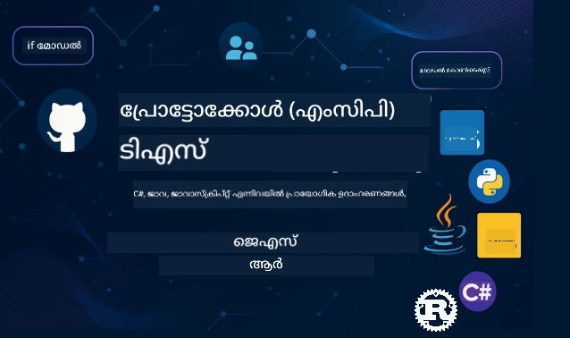

 

[](https://GitHub.com/microsoft/mcp-for-beginners/graphs/contributors)
[](https://GitHub.com/microsoft/mcp-for-beginners/issues)
[](https://GitHub.com/microsoft/mcp-for-beginners/pulls)
[](http://makeapullrequest.com)
[](https://mcptoplist.com/server/mcp.so%2Fmcp-for-beginners%2Fmicrosoft)

[](https://GitHub.com/microsoft/mcp-for-beginners/watchers)
[](https://GitHub.com/microsoft/mcp-for-beginners/fork)
[](https://GitHub.com/microsoft/mcp-for-beginners/stargazers)


[](https://discord.gg/nTYy5BXMWG)

ഈ വിഭവങ്ങൾ ഉപയോഗിച്ച് തുടങ്ങാൻ ഈ ഘട്ടങ്ങൾ പിന്തുടരുക:
1. **റിപ്പോസിറ്ററി ഫോর্ক് ചെയ്യുക**: ക്ലിക്ക് ചെയ്യുക [](https://GitHub.com/microsoft/mcp-for-beginners/fork)
2. **റിപ്പോസിറ്ററി ക്ലോൺ ചെയ്യുക**: `git clone https://github.com/microsoft/mcp-for-beginners.git`
3. **ചേരുക** [](https://discord.gg/nTYy5BXMWG)


### 🌐 ബഹു-ഭാഷാ പിന്തുണ

#### GitHub Action മുഖാന്തിരം പിന്തുണ (സ്വയം ക്രമീകരിച്ചു, എല്ലായ്‌പ്പോഴും പുതുക്കപ്പെട്ടത്)

<!-- CO-OP TRANSLATOR LANGUAGES TABLE START -->
[Arabic](../ar/README.md) | [Bengali](../bn/README.md) | [Bulgarian](../bg/README.md) | [Burmese (Myanmar)](../my/README.md) | [Chinese (Simplified)](../zh-CN/README.md) | [Chinese (Traditional, Hong Kong)](../zh-HK/README.md) | [Chinese (Traditional, Macau)](../zh-MO/README.md) | [Chinese (Traditional, Taiwan)](../zh-TW/README.md) | [Croatian](../hr/README.md) | [Czech](../cs/README.md) | [Danish](../da/README.md) | [Dutch](../nl/README.md) | [Estonian](../et/README.md) | [Finnish](../fi/README.md) | [French](../fr/README.md) | [German](../de/README.md) | [Greek](../el/README.md) | [Hebrew](../he/README.md) | [Hindi](../hi/README.md) | [Hungarian](../hu/README.md) | [Indonesian](../id/README.md) | [Italian](../it/README.md) | [Japanese](../ja/README.md) | [Kannada](../kn/README.md) | [Khmer](../km/README.md) | [Korean](../ko/README.md) | [Lithuanian](../lt/README.md) | [Malay](../ms/README.md) | [Malayalam](./README.md) | [Marathi](../mr/README.md) | [Nepali](../ne/README.md) | [Nigerian Pidgin](../pcm/README.md) | [Norwegian](../no/README.md) | [Persian (Farsi)](../fa/README.md) | [Polish](../pl/README.md) | [Portuguese (Brazil)](../pt-BR/README.md) | [Portuguese (Portugal)](../pt-PT/README.md) | [Punjabi (Gurmukhi)](../pa/README.md) | [Romanian](../ro/README.md) | [Russian](../ru/README.md) | [Serbian (Cyrillic)](../sr/README.md) | [Slovak](../sk/README.md) | [Slovenian](../sl/README.md) | [Spanish](../es/README.md) | [Swahili](../sw/README.md) | [Swedish](../sv/README.md) | [Tagalog (Filipino)](../tl/README.md) | [Tamil](../ta/README.md) | [Telugu](../te/README.md) | [Thai](../th/README.md) | [Turkish](../tr/README.md) | [Ukrainian](../uk/README.md) | [Urdu](../ur/README.md) | [Vietnamese](../vi/README.md)

> **ലോക്കലായി ക്ലോൺ ചെയ്യാൻ ആഗ്രഹിക്കുന്നുവോ?**
>
> ഈ റിപ്പോസിറ്ററിയിൽ 50+ ഭാഷാ വിവർത്തനങ്ങൾ ഉൾക്കൊള്ളുന്നു, അതിനാൽ ഡൗൺലോഡ് വലുതാണ്. വിവർത്തനങ്ങൾ കൂടാതെ ക്ലോൺ ചെയ്യാൻ, സ്പാർസ് ചെക്ക്ഔട്ട് ഉപയോഗിക്കുക:
>
> **Bash / macOS / Linux:**
> ```bash
> git clone --filter=blob:none --sparse https://github.com/microsoft/mcp-for-beginners.git
> cd mcp-for-beginners
> git sparse-checkout set --no-cone '/*' '!translations' '!translated_images'
> ```
>
> **CMD (Windows):**
> ```cmd
> git clone --filter=blob:none --sparse https://github.com/microsoft/mcp-for-beginners.git
> cd mcp-for-beginners
> git sparse-checkout set --no-cone "/*" "!translations" "!translated_images"
> ```
>
> ഇത് നിങ്ങൾക്ക് കോഴ്സ് പൂർത്തിയാക്കാൻ വേണ്ടിവന്ന എല്ലാ കാര്യങ്ങളും വേഗത്തിൽ ഡൗൺലോഡ് ചെയ്യാൻ സഹായിക്കും.
<!-- CO-OP TRANSLATOR LANGUAGES TABLE END -->

# 🚀 മോഡൽ കോൺടെക്സ്റ്റ് പ്രോട്ടോകോൾ (MCP) തുടക്കക്കാർക്കുള്ള പാഠ്യപദ്ധതി

## **C#, Java, JavaScript, Rust, Python, TypeScript എന്നീ ഭാഷകളിൽ MCP കൈകൾ കൊണ്ട് കോഡ് ഉദാഹരണങ്ങൾ പഠിക്കുക**

## 🧠 മോഡൽ കോൺടെക്സ്റ്റ് പ്രോട്ടോകോൾ പാഠ്യപദ്ധതിയുടെ അവലോകനം
മോഡൽ കോൺടെക്സ്റ്റ് പ്രോട്ടോകോളിലേക്കുള്ള നിങ്ങളുടെ യാത്രയ്ക്ക് സ്വാഗതം! എഐ ആപ്ലിക്കേഷനുകൾ എങ്ങനെ വിവിധ ടൂളുകളും സേവനങ്ങളും തമ്മിൽ ആശയവിനിമയം നടത്തുന്നുവെന്ന് നിങ്ങൾ ഒരിക്കൽ പോലും ആഗ്രഹിച്ചിട്ടുണ്ടെങ്കിൽ, അവളുടെ ദക്ഷമുള്ള പരിഹാരത്തെ നിങ്ങൾ കണ്ടെത്താൻ പോകുകയാണ്, ഇത് എങ്ങനെ ഡെവലപ്പർമാർ ബുദ്ധിമുട്ടുള്ള സിസ്റ്റങ്ങൾ നിർമ്മിക്കുന്നുവെന്ന് മാറ്റുകയാണ്.

MCP-നെ നിങ്ങൾ ഒരു സർവതോലമായ വിവർത്തകമായി കരുതുക - USB പോർട്ടുകൾ ഏത് ഉപകരണം കമ്പ്യൂട്ടറുമായി കണക്ടുചെയ്യാമെന്നതുപോലെ MCP എഐ മോഡലുകൾക്ക് ഏത് ടൂൾ അല്ലെങ്കിൽ സേവനത്തോടും സ്റ്റാൻഡേർഡായ മാർഗത്തിൽ കണക്റ്റ് ചെയ്യാൻ കഴിയും. നിങ്ങൾ ആദ്യ ചാറ്റ്ബോട്ട് നിർമ്മിക്കുകയോ സങ്കീർണ്ണ AI വർക്ക്‌ഫ്ലോകളിൽ ജോലി ചെയ്യുകയോ ചെയ്യുകയാണെങ്കിൽ, MCP മനസ്സിലാക്കുന്നത് കൂടുതൽ ശേഷിയുള്ള, അനുകൂലഅനുഭവമുള്ള ആപ്ലിക്കേഷനുകൾ സൃഷ്ടിക്കാനുള്ള കരുത്ത് നൽകും.

ഈ പാഠ്യപദ്ധതി നിങ്ങളുടെ പഠനയാത്രയ്‌ക്ക് ക്ഷമയും যত্নവും കൂടിയതാണ്. നിങ്ങൾ നേരത്തെ മനസ്സിലാക്കിയ ലളിതമായ ആശയങ്ങളിൽ നിന്നാരംഭിച്ച്, നിങ്ങളുടെ പ്രിയപ്പെട്ട പ്രോഗ്രാമിംഗ് ഭാഷയിൽ പ്രായോഗിക പരിശീലനത്തിലൂടെ നിങ്ങളുടെ দক্ষത വികസിപ്പിക്കും. ഓരോ ഘട്ടവും വ്യക്തമായ വിശദീകരണങ്ങൾ, പ്രായോഗിക ഉദാഹരണങ്ങൾ, കൂടുതൽ പ്രോത്സാഹനം എന്നിവ അടങ്ങിയിരിക്കും.

ഈ യാത്ര പൂർത്തിയാക്കുമ്പോൾ, നിങ്ങൾ സ്വന്തം MCP സർവറുകൾ നിർമ്മിക്കാനും ജനപ്രിയ AI പ്ലാറ്റ്‌ഫോമുകളുമായി സംയോജിപ്പിക്കാനും ഈ സാങ്കേതികവിദ്യ എങ്ങിനെയാണ് AI വികസനത്തിന്റെ ഭാവി മാറ്റുന്നത് മനസ്സിലാക്കാനും ആത്മവിശ്വാസമുള്ളതാകും. ഈ മനോഹരമായ സാഹസികതാ യാത്ര ആരംഭിക്കാം!

### ഔദ്യോഗിക ഡോക്യുമെന്റേഷൻ, സ്പെസിഫിക്കേഷനുകൾ

ഈ പാഠ്യപദ്ധതി **MCP സ്പെസിഫിക്കേഷൻ 2025-11-25** (ഇടത്തരം സ്ഥിരമായ റിലീസ്) അനുസരിച്ച് രൂപകൽപ്പന ചെയ്‌തതാണ്. MCP സ്പെസിഫിക്കേഷൻ തീയതി അടിസ്ഥാനമാക്കിയുള്ള വേർഷൻ ഫോർമാറ്റ് (YYYY-MM-DD ഫോർമാറ്റ്) ഉപയോഗിക്കുന്നു, ഇത് പ്രോട്ടോക്കോൾ വേർഷൻ ട്രാക്കിംഗ് വ്യക്തമാക്കുന്നു.

> **അടുത്തത് നോക്കുമ്പോൾ:** ಮುಂದೆ വരുന്ന സ്പെസിഫിക്കേഷൻ വേർഷൻ **2026-07-28** ലേക്ക് റിലീസ് കാനഡിഡറ്റായി, 2026 ജൂലൈ 28-ന് പുറത്തിറങ്ങും. ഇത് ട്രാൻസ്പോർട്ട് ലെയറിൽ പ്രോട്ടോക്കോൾ സ്റ്റേറ്റ്‌ലെസാക്കുകയും, എക്സ്റ്റൻഷൻസ് ഫ്രെയിംവർക്ക് (MCP അപ്ലിക്കേഷനുകൾ, ടാസ്കുകൾ) ഔദ്യോഗികമാക്കുകയും, അദ്ധികാരം ശക്തമാക്കുകയും, റൂട്ടുകൾ, സാമ്പ്ലിംഗ്, ലോക്കും പ്രതിസന്ധിപ്പെടുത്തുകയും ചെയ്യും. [MCP-ലെ മാറ്റങ്ങൾ: 2026-07-28 റിലീസ് കാനഡിഡറ്റ്](./01-CoreConcepts/mcp-2026-07-28-release-candidate.md) ആർക്കും വിശദമായി കാണുക.

ഈ വിഭവങ്ങൾ നിങ്ങളുടെ سمجھ മെച്ചപ്പെട്ടുകൊണ്ടിരിക്കുമ്പോൾ കൂടുതൽ മൂല്യമുള്ളതാകും, പക്ഷേ എല്ലാം ഉടനെ വായിക്കണമെന്നാണ് സമ്മർദ്ദം തോന്നേണ്ട. നിങ്ങളുടെ ഏറ്റവും ഇഷ്ടമുള്ള മേഖലകളിൽ ആരംഭിക്കുക!
- 📘 [MCP ഡോക്യുമെന്റേഷൻ](https://modelcontextprotocol.io/) – ചുവടുപിടിക്കാവുന്ന ട്യൂട്ടോറിയലുകളും ഉപയോക്തൃ ഗൈഡുകളും ഉള്ള പ്രധാന വിഭവം. ഡോക്യുമെന്റേഷൻ തുടങ്ങിയവർക്കായി എഴുതപ്പെട്ടതാണ്, നിങ്ങൾക്ക് ജാഗ്രതയോടെ അനുസരിക്കാവുന്ന വ്യക്തമായ ഉദാഹരണങ്ങൾ നൽകുന്നു.
- 📜 [MCP സ്പെസിഫിക്കേഷൻ](https://modelcontextprotocol.io/specification/2025-11-25) – ഇത് നിങ്ങളുടെ സമഗ്രമായ നിർദ്ദേശക പുസ്തകമായിരിക്കുന്നതായി കരുതുക. പാഠ്യപദ്ധതി വഴി പഠിക്കുമ്പോൾ, നിങ്ങൾ പ്രത്യേക വിശദാംശങ്ങൾ തിരയാനും ഉയർന്ന തലത്തിലുള്ള ഫീച്ചറുകൾ പരിശോധിക്കാനും വീണ്ടും ഇവിടെ വരും.
- 📜 [MCP സ്പെസിഫിക്കേഷൻ വേർഷനിംഗ്](https://modelcontextprotocol.io/specification/versioning) – പ്രോട്ടോക്കോൾ വേർഷൻ ചരിത്രവും MCP-യെങ്ങിനെയാണ് തീയതി അടിസ്ഥാനമാക്കിയുള്ള വേർഷൻ ഉപയോഗിക്കുന്നത് (YYYY-MM-DD ഫോർമാറ്റ്) എന്നതും ഉൾക്കൊള്ളുന്ന വിവരങ്ങൾ.
- 🧑‍💻 [MCP GitHub Repository](https://github.com/modelcontextprotocol) – ഇതിൽ SDK-കൾ, ഉപകരണങ്ങൾ, നിരവധി പ്രോഗ്രാമിംഗ് ഭാഷകളിലെ കോഡ് ഉദാഹരണങ്ങൾ ലഭ്യമാണ്. പ്രായോഗിക ഉദാഹരണങ്ങളും ഉപയോഗിക്കാൻ തയ്യാറായ ഘടകങ്ങളും കിട്ടുന്നൊരു നിധി.
- 🌐 [MCP Community](https://github.com/orgs/modelcontextprotocol/discussions) – MCPനെക്കുറിച്ച് fellow learners ഉം പരിചയസമ്പത്തുള്ള ഡെവലപ്പർമാരും ചർച്ച ചെയ്യുന്നത്. സംശയങ്ങൾക്ക് വരവേൽക്കുന്ന, അറിവ് സ്വതന്ത്രമായി പങ്കുവെക്കുന്ന ഒരു പിന്തുണാ സമൂഹം.
  
## പഠന ലക്ഷ്യങ്ങൾ

ഈ പാഠ്യപദ്ധതി അവസാനിച്ചപ്പോൾ, നിങ്ങൾ പുതിയ കഴിവുകൾ കൈവരിച്ചതിന്റെ ആത്മവിശ്വാസവും ആവേശവും അനുഭവിക്കും. ഇങ്ങനെ നിങ്ങൾ നേടുന്നത്:

• **MCP അടിസ്ഥാനങ്ങൾ മനസ്സിലാക്കുക**: മോഡൽ കോൺടെക്സ്റ്റ് പ്രോട്ടോകോൾ എന്തെന്ന്, എങ്ങനെ ഇത് എഐ ആപ്ലിക്കേഷനുകൾ തമ്മിൽ ചേർന്ന് പ്രവർത്തിക്കുന്നത് വിപ്ലവകരമാക്കുന്നു എന്ന് നന്ദിയും ഉദാഹരണങ്ങളും ഉപയോഗിച്ച് മനസ്സിലാകും.

• **നിങ്ങളുടെ ആദ്യ MCP സർവർ നിർമ്മിക്കുക**: നിങ്ങൾക്ക് ഇഷ്ടമുള്ള പ്രോഗ്രാമിംഗ് ഭാഷയിൽ പ്രവർത്തനക്ഷമമായ MCP സർവർ സൃഷ്ടിച്ച്, ലളിതമായ ഉദാഹരണങ്ങളിൽ നിന്നാരംഭിച്ച് നിശ്ചിത പടികൾക്ക് കൊണ്ട് നിങ്ങളുടെ കഴിവുകൾ വികസിപ്പിക്കും.

• **AI മോഡലുകൾ യഥാർത്ഥ ടൂളുകളുമായ് ബന്ധിപ്പിക്കുക**: AI മോഡലുകളും യഥാർത്ഥ സേവനങ്ങളും തമ്മിൽ പാലം സ്ഥാപിക്കാൻ നിങ്ങൾ പഠിക്കും, ഇത് നിങ്ങളുടെ ആപ്ലിക്കേഷനുകൾക്ക് ശക്തമായ പുതിയ കഴിവുകൾ നൽകും.

• **സുരക്ഷ പ്രായോഗിക മാർഗങ്ങൾ നടപ്പിലാക്കുക**: നിങ്ങളുടെ MCP നടപ്പാക്കലുകൾ സുരക്ഷിതമാക്കാനും, ആപ്ലിക്കേഷനുകളെയും ഉപയോക്താക്കളെയും സംരക്ഷിക്കാനും നിങ്ങൾ പഠിക്കും.

• **ആത്മവിശ്വാസത്തോടെ വിനിയോഗിക്കുക**: വികസനത്തിൽനിന്ന് ഉൽപ്പാദനത്തിലേക്ക് നിങ്ങളുടെ MCP പ്രോജക്റ്റുകൾ എടുക്കുന്നതിനുള്ള പ്രായോഗിക വിനിയോഗ തന്ത്രങ്ങൾ വിശുദ്ധമായ അറിവ് ലഭിക്കും.

• **MCP സമൂഹത്തിൽ ചേരുക**: എഐ ആപ്ലിക്കേഷൻ വികസനത്തിന്റെ ഭാവി രൂപപ്പെടുത്തുന്ന ഡെവലപ്പർമാരുടെ വളരുന്ന കൂട്ടത്തിൽ നിങ്ങൾ പങ്കുവഹിക്കും.

## അത്യാവശ്യം പശ്ചാത്തലം

MCP പ്രത്യേകതകളിലേക്ക് കടക്കുന്നതിന് മുമ്പ്, ചില അടിസ്ഥാന ആശയങ്ങളിൽ നിങ്ങൾ സുഗമമായി തോന്നണോ എന്ന് ഉറപ്പാക്കാം. ഈ മേഖലകളിൽ വിദഗ്ദ്ധനല്ലെങ്കിൽ കയമ്പിലാക്കേണ്ട, നമ്മൾ ആവശ്യമായ എല്ലാം വിശദീകരിച്ച് മുന്നോട്ട് പോക്കാം!

### പ്രോട്ടോക്കോളുകൾ മനസ്സിലാക്കൽ (അടിത്തറ)

ഒരു പ്രോട്ടോക്കോൾ സംസാരത്തിനുള്ള ചട്ടങ്ങളെപ്പോലെ ആയാണ് കരുതുക. നിങ്ങൾൊരു സുഹൃത്തിനെ വിളിക്കുമ്പോൾ, നിങ്ങൾക്ക് സംസാരിക്കുക "ഹലോ" എന്നു പറഞ്ഞ് തുടങ്ങണം, പരസ്പരം തിരുവിളികളിൽ സംസാരിക്കുക, അവസാനം "വിട"എന്നു പറയണം. കമ്പ്യൂട്ടർ പ്രോഗ്രാമുകൾക്ക് സമാനമായ ചട്ടങ്ങൾ ആശയവിനിമയം നടത്താൻ ആവശ്യമാണ്.

MCP ഒരു പ്രോട്ടോക്കോൾ ആണ് - എഐ മോഡലുകൾക്കും ആപ്ലിക്കേഷനുകൾക്കുമിടയിൽ ഫലപ്രദമായ "സന്പ്രേഷണം" നടത്താൻ സഹായിക്കുന്ന സമ്മതികളായ ചട്ടസമൂഹം. മനുഷ്യരുടെ ആശയവിനിമയത്തിന് ചട്ടങ്ങൾ അത്രമാത്രം സഹായിക്കുന്നതുപോലെ, MCP-ഉം എഐ ആപ്ലിക്കേഷൻ ആശയവിനിമയം കൂടുതൽ വിശ്വാസയോഗ്യവും ശക്തവുമാക്കുന്നു.

### ക്ലയന്റ്-സർവർ ബന്ധം (പროგ്രാമുകൾ എങ്ങനെയാണ് ചേർന്ന് പ്രവർത്തിക്കുന്നത്)

നിങ്ങൾ ദിവസേനAlready use client-server ബന്ധങ്ങൾ! നിങ്ങൾ വെബ് ബ്രൗസർ (ക്ലയന്റ്) ഉപയോഗിച്ച് ഒരു വെബ്സൈറ്റ് സന്ദർശിക്കുമ്പോൾ, വെബ് സർവർ ആ പേജ് ഉള്ളടക്കം അയക്കുന്നിടത്തേക്ക് കണക്റ്റ് ചെയ്യുകയാണ്. ബ്രൗസർ വിവരങ്ങൾ അഭ്യർഥിക്കാനും, സർവർ അതിനെ പ്രതികരിക്കാനും അറിയാം.

MCP-ൽ സമാനമായ ബന്ധമുണ്ട്: എഐ മോഡലുകൾ ക്ലയന്റുകളായി പ്രവർത്തിച്ച് വിവരങ്ങൾ അല്ലെങ്കിൽ നടപടികൾ അഭ്യർഥിക്കുകയും, MCP സെർവർകൾ ആ ശേഷികൾ നൽകുകയും ചെയ്യുന്നു. എഐക്ക് വിശിഷ്ടമായ ടാസ്കുകൾ ചെയ്യാൻ ചോദിക്കാവുന്ന സഹായിയായ അസി്‌സ്റ്റന്റ് (സർവർ) പോലെയാണ് ഇത്.

### സ്റ്റാൻഡേർഡൈസേഷൻ എന്തുകൊണ്ട് പ്രധാനമാണ് (വിഷയങ്ങൾ ചേർന്ന് പ്രവർത്തിക്കാൻ)

ഓരോ കാർ നിർമ്മാതാവും വ്യത്യസ്ത രൂപത്തിലുള്ള ക്രൂഡ് പമ്പുകൾ ഉപയോഗിച്ചിരുന്നെങ്കിൽ കാണുക - ഓരോയ്ക്കും വേറെ അഡാപ്റ്റർ വേണം! സ്റ്റാൻഡേർഡൈസേഷൻ എന്നാൽ സാധാരണ മാർഗങ്ങൾ പരിചയപ്പെടുക, അതിലൂടെ കാര്യങ്ങൾ പരിഷ്കൃതമായി ചലിക്കും.

MCP AI ആപ്ലിക്കേഷനുകൾക്കായി ഈ സ്റ്റാൻഡേർഡൈസേഷൻ നൽകുന്നു. ഓരോ AI മോഡലും ഓരോ ടൂൾ പാട്രണേടിങ്ങ് കോഡ് ആവശ്യമുള്ള പകരം, MCP സർവതോലമായി ആശയവിനിമയം നടത്താനുള്ള മാർഗം സൃഷ്ടിക്കുന്നു. ഡെവലപ്പർമാർ ടൂളുകൾ ഒന്നുമാത്രം നിർമ്മിച്ച്, നിരവധി വ്യത്യസ്ത AI സിസ്റ്റങ്ങളുമായി അവ പ്രവർത്തിക്കുന്നതായി ഉറപ്പുവരുത്താം.

## 🧭 നിങ്ങളുടെ പഠനപഥം അവലോകനം

നിങ്ങളുടെ MCP യാത്ര ശ്രദ്ധാപൂർവ്വം രേഖപ്പെടുത്തിയിട്ടുണ്ട് ആകെയുള്ള കരുത്തുകളും കഴിവുകളും ഘട്ടംഘട്ടമായി വളർത്തുന്നതിനു. ഓരോ ഘട്ടവും പുതിയ ആശയങ്ങൾ പരിചയപ്പെടുത്തി, നിങ്ങൾ പഠിച്ച കാര്യങ്ങളെ സ്ഥിരപ്പെടുത്തും.

### 🌱 അടിസ്ഥാനഘട്ടം: അടിസ്ഥാനങ്ങൾ അവഗണിക്കുക (മോഡ്യൂളുകൾ 0-2)

നിങ്ങളുടെ സാഹസികതയിയുടെ തുടക്കം ഇവിടെ! പരിചിതമായ ഉദാഹരണങ്ങളും ലളിതമായ വിഷയങ്ങളുമായ MCP ആശയങ്ങൾ പരിചയപ്പെടുത്തും. MCP എന്താണെന്ന്, അത് എന്തിനായാണ് ഉണ്ടാകുന്നത്, എങ്ങനെ AI വികസനത്തിന്റെ വിപുല ലോകത്തോട് യോജിക്കുന്നുവെന്ന് നിങ്ങൾ മനസ്സിലാക്കും.


• **മൊഡ്യൂള്‍ 0 - MCP-യിലേക്ക് പരിചയം**: MCP എന്താണെന്ന്, ഇത് ആധുനിക AI ആപ്ലിക്കേഷനുകള്‍ക്കു എന്തുകൊണ്ട് അത്യന്താപേക്ഷിതമാണെന്ന് നാം പരിശോധിച്ച് തുടങ്ങും. MCP പ്രവർത്തിക്കുന്ന യഥാർത്ഥ ഉദാഹരണങ്ങൾ നിങ്ങൾക്ക് കാണാം, ഡെവലപ്പർമാർ നേരിടുന്ന സാധാരണ പ്രശ്‌നങ്ങൾ MCP എങ്ങനെ പരിഹരിക്കാറുണ്ടെന്ന് നിങ്ങൾക്ക് മനസിലാകും.

• **മൊഡ്യൂള്‍ 1 - അടിസ്ഥാന ആശയങ്ങൾ വിശദീകരിച്ചു**: ഇവിടെ നിങ്ങൾ MCP യുടെ മുറ്റുപാടുകൾ പഠിക്കും. ഈ ആശയങ്ങൾ സ്വാഭാവികവും മനസ്സിലാക്കാൻ എളുപ്പവും ആകാൻ നിരവധി ഉപമകളും ദൃശ്യ ഉദാഹരണങ്ങളും ഉപയോഗിക്കും.

• **മൊഡ്യൂള്‍ 2 - MCP-യിലെ സുരക്ഷ**: സുരക്ഷ ഭീതിയുണ്ടാക്കുമെന്നു തോന്നാമെങ്കിലും, MCP-യിൽ ഉൾപ്പെടുത്തിയിരിക്കുന്ന സുരക്ഷാ സവിശേഷതകളും നിങ്ങളുടെ ആപ്ലിക്കേഷനുകളെ ആരംഭത്തിൽ തന്നെ സംരക്ഷിക്കുന്ന മികച്ച പ്രാക്ടീസുകളും ഞങ്ങൾ നിങ്ങളെ പഠിപ്പിക്കും.

### 🔨 നിർമ്മാണ ഘട്ടം: നിങ്ങളുടെ ആദ്യഇമ്പ്ലിമെന്റേഷനുകൾ സൃഷ്ടിക്കുക (മൊഡ്യൂള്‍ 3)

ഇപ്പോൾ യഥാർത്ഥ രസകരമായ ഘട്ടം തുടങ്ങുന്നു! നിങ്ങൾക്ക് MCP സർവറുകളും ക്ലയന്റുകളും യാഥാർത്ഥ്യമായി നിർമ്മിക്കാനുള്ള പ്രായോഗിക പരിചയം ലഭിക്കും. ആശങ്കപ്പെടേണ്ട, നാം സാദഗതമായ രീതിയിൽ തുടങ്ങുകയും ഓരോ ഘട്ടത്തിലൂടെയും നിങ്ങളെ നയിക്കുകയും ചെയ്യും.

ഈ മൊഡ്യൂളിൽ നിങ്ങൾക്ക് ഇഷ്ടപ്പെട്ട പ്രോഗ്രാമിങ് ഭാഷയിൽ പരിശീലനം നേടാൻHands-on ഗൈഡുകൾ ഉള്ളതാണ്. നിങ്ങളുടെ ആദ്യ MCP സർവർ സൃഷ്ടിച്ച്, അതുമായി ബന്ധപ്പെടുന്ന ഒരു ക്ലയന്റ് നിർമ്മിക്കുകയും പ്രശസ്തമായ ഡെവലപ്പ്മെൻറ് ഉപകരണങ്ങളായ VS കോഡ് പോലുള്ളവയുമായി ഇന്റഗ്രേറ്റ് ചെയ്യാനും കഴിയുന്നു.

ഓരോ ഗൈഡും സമ്പൂർണ്ണമായ കോഡ് ഉദാഹരണങ്ങളും പ്രശ്‌നം പരിഹാര സൂചനകളും, നാം പ്രത്യേക ഡിസൈൻ തിരഞ്ഞെടുപ്പുകൾ ചെയ്യുന്ന കാരണവിവരണങ്ങളും ഉൾക്കൊള്ളുന്നു. ഈ ഘട്ടം കഴിഞ്ഞപ്പോള്‍ നിങ്ങൾക്ക് അഭിമാനിക്കാവുന്ന MCP പ്രവർത്തനങ്ങൾ ഉണ്ടാകും!

### 🚀 വളർച്ച ഘട്ടം: പുരോഗമിച്ച ആശയങ്ങൾ और യഥാർത്ഥ ലോക അപ്ലിക്കേഷനുകൾ (മൊഡ്യൂൾസ് 4-5)

അടിസ്ഥാനങ്ങൾ കൈവശം വെച്ച ശേഷം, നിങ്ങൾ പ്രഗത്ഭമായ MCP സവിശേഷതകൾ അന്വേഷിക്കാൻ തയ്യാറാണ്. പ്രായോഗിക ഇംപ്ലിമെന്റേഷൻ തന്ത്രങ്ങൾ, ഡീബഗിംഗ് സാങ്കേതികങ്ങളും, മൾട്ടി-മോഡൽ AI ഇന്റഗ്രേഷനും പോലുള്ള ഉയർന്ന തല വിഷയങ്ങളും ഞങ്ങൾ ചേർത്ത് പഠിപ്പിക്കും.

നിങ്ങൾക്ക് MCP ഇംപ്ലിമെന്റേഷനുകൾ പ്രൊഡക്ഷൻ ഉപയോ​ഗത്തിന് വളർത്തുകയും, Azure പോലുള്ള ക്ലൗഡ് പ്ലാറ്റ്ഫോമുകളുമായി സംയോജിപ്പിക്കുകയും പഠിക്കാം. ഈ മോഡ്യൂളുകൾ യഥാർത്ഥ ലോക ആവശ്യങ്ങൾ കൈകാര്യം ചെയ്യാൻ MCP പരിഹാരങ്ങൾ നിർമ്മിക്കാൻ നിങ്ങളെ സജ്ജമാക്കും.

### 🌟 പ്രാവീണ്യ ഘട്ടം: കമ്മ്യൂണിറ്റി & പ്രത്യേക താല്പര്യങ്ങൾ (മൊഡ്യൂൾസ് 6-11)

അവസാന ഘട്ടം MCP കമ്മ്യൂണിറ്റിയിൽ ചേർന്ന് നിങ്ങളുടെ താൽപ്പര്യം ഉള്ള മേഖലകളിൽ വിദഗ്ധത കൈവരിക്കാൻ കേന്ദ്രീകരിക്കുന്നു. നിങ്ങൾക്ക് MCP ഓപ്പൺ-സോഴ്‌സ് പ്രോജക്ടുകളിൽ സംഭാവന ചെയ്യാനും, പ്രഗത്ഭമായ ഏതാണ്ട് പരിശ്രമങ്ങൾ നടപ്പിലാക്കാനും, സമ്പൂർണ്ണ ഡാറ്റാബേസ് സംയോജിത പരിഹാരങ്ങൾ നിർമ്മിക്കാനുമുള്ള കഴിവ് നേടാം.

മൊഡ്യൂൾ 11 പ്രത്യേക ശ്രദ്ധാ അർഹിക്കുന്നു - ഇത് 13 ലാബുകൾ അടങ്ങിയ സമ്പൂർണ്ണ പ്രായോഗിക പഠന പാതയാണ്, PostgreSQL സംയോജനത്തോടെ പ്രൊഡക്ഷൻ-ശേഷ MCP സർവർ നിർമ്മിക്കാനുള്ള വിദ്യ നിങ്ങളെ പഠിപ്പിക്കുക. നിങ്ങൾ പഠിച്ച എല്ലാ അറിവുകളും ഐക്യപ്പെടുത്തുന്ന ഒരു കാപ്സ്റ്റോൺ പ്രോജക്ട് പോലെയാണ് ഇത്!

### 📚 പൂർണ്ണ പാഠ്യക്രമ ഘടന

| മൊഡ്യൂള്‍ | വിഷയം | വിവരണം | ലിങ്ക് |
|--------|-------|-------------|------|
| **മൊഡ്യൂള്‍ 0-3: അടിസ്ഥാനങ്ങൾ** | | | |
| 00 | MCP-യിലേക്ക് പരിചയം | മോഡൽ കോൺടെക്സ് പ്രോട്ടോക്കോൾ (MCP) സംഗ്രഹവും AI പൈപ്പ്ലൈനുകളിലുള്ള പ്രാധാന്യവും | [കൂടുതൽ വായിക്കുക](./00-Introduction/README.md) |
| 01 | അടിസ്ഥാന ആശയങ്ങൾ വിശദീകരിച്ചു | MCP യുടെ പ്രധാന ആശയങ്ങളുടെ ഗہرമായ പഠനം | [കൂടുതൽ വായിക്കുക](./01-CoreConcepts/README.md) |
| 1.1 | MCP-യിലുള്ള മാറ്റങ്ങൾ (2026-07-28 RC) | സ്റ്റേറ്റ്‌ലസ്സ് പ്രോട്ടോക്കോൾ, എക്സ്റ്റൻഷൻ ഫ്രെയിംവർക്ക്, അടുത്ത സ്പെക്കിന്റെ ഫെച്ചർ ഒഴിവാക്കലുകൾ | [ഗൈഡ്](./01-CoreConcepts/mcp-2026-07-28-release-candidate.md) |
| 02 | MCP-യിലെ സുരക്ഷ | സുരക്ഷാ ഭീഷണികളും മികച്ച പ്രാക്ടീസുകളും | [കൂടുതൽ വായിക്കുക](./02-Security/README.md) |
| 03 | MCP ആരംഭപ്രവർത്തനങ്ങൾ | പരിതസ്ഥിതി സജ്ജീകരണവും അടിസ്ഥാന സർവറുകളും ക്ലയന്റുകളും, സം‌യോജനം | [കൂടുതൽ വായിക്കുക](./03-GettingStarted/README.md) |
| **മൊഡ്യൂള്‍ 3: നിങ്ങളുടെ ആദ്യ MCP സർവർ & ക്ലയന്റ് നിർമ്മിക്കുകയും** | | | |
| 3.1 | ആദ്യ MCP സർവർ | നിങ്ങളുടെ ആദ്യ MCP സർവർ സൃഷ്ടിക്കുക | [ഗൈഡ്](./03-GettingStarted/01-first-server/README.md) |
| 3.2 | ആദ്യ MCP ക്ലയന്റ് | ഒരു അടിസ്ഥാന MCP ക്ലയന്റ് വികസിപ്പിക്കുക | [ഗൈഡ്](./03-GettingStarted/02-client/README.md) |
| 3.3 | LLM ഉപയോഗിച്ച് ക്ലയന്റ് | വലിയ ഭാഷാ മോഡലുകൾ സംയോജിപ്പിക്കുക | [ഗൈഡ്](./03-GettingStarted/03-llm-client/README.md) |
| 3.4 | VS കോഡ് സംയോജനം | VS കോഡിൽ MCP സർവർ ഉപയോഗിക്കുക | [ഗൈഡ്](./03-GettingStarted/04-vscode/README.md) |
| 3.5 | stdio സർവർ | stdio ട്രാൻസ്പോർട്ട് ഉപയോഗിച്ച് സർവർസുകൾ സൃഷ്ടിക്കുക | [ഗൈഡ്](./03-GettingStarted/05-stdio-server/README.md) |
| 3.6 | HTTP സ്ട്രീമിംഗ് | MCP-യിൽ HTTP സ്ട്രീമിംഗ് നടപ്പാക്കുക | [ഗൈഡ്](./03-GettingStarted/06-http-streaming/README.md) |
| 3.7 | Microsoft Foundry ടൂള്കിറ്റ് | MCP-യോടൊപ്പം Microsoft Foundry ടൂള്കിറ്റ് ഉപയോഗിക്കുക | [ഗൈഡ്](./03-GettingStarted/07-aitk/README.md) |
| 3.8 | പരിശോധന | നിങ്ങളുടെ MCP സർവർ ഇംപ്ലിമെന്റേഷൻ പരിശോധന നടത്തുക | [ഗൈഡ്](./03-GettingStarted/08-testing/README.md) |
| 3.9 | റിലീസ് | MCP സർവറുകൾ പ്രൊഡക്ഷൻ-ലേക്ക് വിന്യസിക്കുക | [ഗൈഡ്](./03-GettingStarted/09-deployment/README.md) |
| 3.10 | പുരോഗമിത സർവർ ഉപയോഗം | പുരോഗമിത സവിശേഷതകൾക്കായി സർവർ ഉപയോഗം മെച്ചപ്പെടുത്തുകയും മെച്ചപ്പെട്ട ആർക്കിടെക്ചർ | [ഗൈഡ്](./03-GettingStarted/10-advanced/README.md) |
| 3.11 | ലളിതമായ നിർദ്ദേശാവലി | ആരംഭത്തിൽ തന്നെ അതോറിസേഷൻ & RBAC | [ഗൈഡ്](./03-GettingStarted/11-simple-auth/README.md) |
| 3.12 | MCP ഹോസ്റ്റുകൾ | Claude Desktop, Cursor, Cline, മറ്റ് MCP ഹോസ്റ്റുകൾ കോൺഫിഗർ ചെയ്യുക | [ഗൈഡ്](./03-GettingStarted/12-mcp-hosts/README.md) |
| 3.13 | MCP ഇൻസ്പെക്റ്റർ | ഇൻസ്പെക്റ്റർ ടൂൾ ഉപയോഗിച്ച് MCP സർവർ ഡീബഗും പരിശോധനയും | [ഗൈഡ്](./03-GettingStarted/13-mcp-inspector/README.md) |
| 3.14 | സാമ്പിളിംഗ് | ക്ലയന്റുമായി സഹകരിക്കാൻ സാമ്പിളിംഗ് ഉപയോഗിക്കുക | [ഗൈഡ്](./03-GettingStarted/14-sampling/README.md) |
| 3.15 | MCP ആപ്ലിക്കേഷനുകൾ | MCP ആപ്ലിക്കേഷനുകൾ നിർമ്മിക്കുക | [ഗൈഡ്](./03-GettingStarted/15-mcp-apps/README.md) |
| **മൊഡ്യൂള്‍ 4-5: പ്രായോഗിക & പുരോഗമിച്ച** | | | |
| 04 | പ്രായോഗിക ഇംപ്ലിമെന്റേഷൻ | SDKകൾ, ഡീബഗിംഗ്, പരിശോധന, പുനരുപയോഗയോഗ്യ പ്രോപം ടെംപ്ലേറ്റുകൾ | [കൂടുതൽ വായിക്കുക](./04-PracticalImplementation/README.md) |
| 4.1 | പേജിനേഷൻ | കർസർ അധിഷ്ഠിത പേജിനേഷനിൽ വലിയ ഫലം സെറ്റ് കൈകാര്യം ചെയ്യുക | [ഗൈഡ്](./04-PracticalImplementation/pagination/README.md) |
| 05 | MCP-യിലെ പുരോഗമിച്ച വിഷങ്ങൾ | മൾട്ടിമോഡൽ AI, സ്കെയ്ലിംഗ്, എന്റര്‍പ്രൈസ് ഉപയോഗം | [കൂടുതൽ വായിക്കുക](./05-AdvancedTopics/README.md) |
| 5.1 | Azure ഇന്റഗ്രേഷൻ | MCP Azure-യോടൊപ്പം ഇന്റഗ്രേറ്റ് ചെയ്യുക | [ഗൈഡ്](./05-AdvancedTopics/mcp-integration/README.md) |
| 5.2 | മൾട്ടി-മോഡാലിറ്റി | പല മോഡാലിറ്റികളുമായി പ്രവർത്തിക്കുന്നതു | [ഗൈഡ്](./05-AdvancedTopics/mcp-multi-modality/README.md) |
| 5.3 | OAuth2 ഡെമോ | OAuth2 അംഗീകാരം നടപ്പിലാക്കുക | [ഗൈഡ്](./05-AdvancedTopics/mcp-oauth2-demo/README.md) |
| 5.4 | റൂട്ട് കോൺടെക്സ്റ്റുകൾ | റൂട്ട് കോൺടെക്സ്റ്റുകൾ മനസ്സിലാക്കുകയും നടപ്പാക്കുകയും ചെയ്യുക | [ഗൈഡ്](./05-AdvancedTopics/mcp-root-contexts/README.md) |
| 5.5 | റൂട്ടിംഗ് | MCP റൂട്ടിംഗ് തന്ത്രങ്ങൾ | [ഗൈഡ്](./05-AdvancedTopics/mcp-routing/README.md) |
| 5.6 | സാമ്പിളിംഗ് | MCP-യിലെ സാമ്പിളിംഗ് സാങ്കേതികങ്ങൾ | [ഗൈഡ്](./05-AdvancedTopics/mcp-sampling/README.md) |
| 5.7 | സ്കെയിലിംഗ് | MCP ഇംപ്ലിമെന്റേഷനുകൾ സ്കെയിൽ ചെയ്യുക | [ഗൈഡ്](./05-AdvancedTopics/mcp-scaling/README.md) |
| 5.8 | സുരക്ഷ | പുരോഗമിച്ച സുരക്ഷാ പരിഗണനകൾ | [ഗൈഡ്](./05-AdvancedTopics/mcp-security/README.md) |
| 5.9 | വെബ് സെർച്ച് | വെബ് സെർച്ച് ടൂളുകൾ നടപ്പിലാക്കുക | [ഗൈഡ്](./05-AdvancedTopics/web-search-mcp/README.md) |
| 5.10 | റിയൽടൈം സ്ട്രീമിംഗ് | റിയൽടൈം സ്ട്രീമിംഗ് സവിശേഷത നിർമ്മിക്കുക | [ഗൈഡ്](./05-AdvancedTopics/mcp-realtimestreaming/README.md) |
| 5.11 | റിയൽടൈം സെർച്ച് | റിയൽടൈം സെർച്ച് നടപ്പിലാക്കുക | [ഗൈഡ്](./05-AdvancedTopics/mcp-realtimesearch/README.md) |
| 5.12 | Entra ID അംഗീകാരം | Microsoft Entra ID-യുമായി അംഗീകാരം | [ഗൈഡ്](./05-AdvancedTopics/mcp-security-entra/README.md) |
| 5.13 | ഫൗണ്ട്രി ഇന്റഗ്രേഷൻ | Microsoft Foundry-യുമായി സംയോജിപ്പിക്കുക | [ഗൈഡ്](./05-AdvancedTopics/mcp-foundry-agent-integration/README.md) |
| 5.14 | കോണ്‍ടെക്സ്റ്റ് എഞ്ചിനീയറിംഗ് | ഫലപ്രദമായ കോൺടെക്സ്റ്റ് എഞ്ചിനീയറിങ്ങിന് സാങ്കേതികതകൾ | [ഗൈഡ്](./05-AdvancedTopics/mcp-contextengineering/README.md) |
| 5.15 | MCP കസ്റ്റം ട്രാൻസ്പോർട്ട് | കസ്റ്റം ട്രാൻസ്പോർട്ട് ഇംപ്ലിമെന്റേഷനുകൾ | [ഗൈഡ്](./05-AdvancedTopics/mcp-transport/README.md) |
| 5.16 | പ്രോട്ടോക്കോൾ സവിശേഷതകൾ | പുരോഗതി അറിയിപ്പുകൾ, റദ്ദാക്കൽ, റിസോഴ്‌സ് ടെംപ്ലേറ്റുകൾ | [ഗൈഡ്](./05-AdvancedTopics/mcp-protocol-features/README.md) |
| 5.17 | എഡ്വേഴ്സറിയൽ മൾട്ടി-ഏജന്റ് റെസണിംഗ് | രണ്ട് ഏജന്റുകൾ MCP ഉപകരണങ്ങൾ പങ്കുവെച്ച് വിപരീത വാദം , ജഡ്ജ് ഏജന്റ് വിലയിരുത്തുന്നു | [ഗൈഡ്](./05-AdvancedTopics/mcp-adversarial-agents/README.md) |
| **മൊഡ്യൂള്‍ 6-10: കമ്മ്യൂണിറ്റി & മികച്ച പ്രാക്ടീസുകൾ** | | | |
| 06 | കമ്മ്യൂണിറ്റി സംഭാവനകൾ | MCP പരിസ്ഥിതിയിൽ സംഭാവന ചെയ്യുന്നത് എങ്ങനെ | [ഗൈഡ്](./06-CommunityContributions/README.md) |
| 07 | ആദിമ ദിശാനിർദ്ദേശങ്ങൾ | യഥാർത്ഥ ലോക പ്രവർത്തനകഥകൾ | [ഗൈഡ്](./07-LessonsfromEarlyAdoption/README.md) |
| 08 | MCP-യ്ക്കുള്ള മികച്ച പ്രാക്ടീസുകൾ | പ്രകടനം, പിഴവു-സഹിഷ്ണുത, പ്രതിരോധശേഷി | [ഗൈഡ്](./08-BestPractices/README.md) |
| 09 | MCP കേസ്സ് സ്റ്റഡീസ് | പ്രായോഗിക നടപ്പാക്കൽ ഉദാഹരണങ്ങൾ | [ഗൈഡ്](./09-CaseStudy/README.md) |
| 10 | പ്രായോഗിക വേർക്‌ഷോപ്പ് | Microsoft Foundry ടൂള്കിറ്റോടെ MCP സർവർ നിർമ്മിക്കൽ | [ലാബ്](./10-StreamliningAIWorkflowsBuildingAnMCPServerWithAIToolkit/README.md) |
| **മൊഡ്യൂള്‍ 11: MCP സർവർ ഹാൻഡ്‌സ് ഓൺ ലാബ്** | | | |
| 11 | MCP സർവർ ഡാറ്റാബേസ് ഇന്റഗ്രേഷൻ | PostgreSQL ഇന്റഗ്രേഷനുള്ള സമ്പൂർണ 13 ലാബ് ഹാൻഡ്‌സ് ഓൺ പഠന മാർഗ്ഗം | [ലാബുകൾ](./11-MCPServerHandsOnLabs/README.md) |
| 11.1 | പരിചയം | ഡാറ്റാബേസ് ഇന്റഗ്രേഷൻയും റീട്ടെയിൽ വിശകലന ഉപയോഗ കേസും അടങ്ങിയ MCP അവലോകനം | [ലാബ് 00](./11-MCPServerHandsOnLabs/00-Introduction/README.md) |
| 11.2 | പ്രധാന ആർക്കിടെക്ചർ | MCP സർവർ ആർക്കിടെക്ചർ, ഡാറ്റാബേസ് പാളികൾ, സുരക്ഷ മാതൃകകൾ മനസ്സിലാക്കുക | [ലാബ് 01](./11-MCPServerHandsOnLabs/01-Architecture/README.md) |
| 11.3 | സുരക്ഷ & മൾട്ടി-ടെനൻസി | റോ ലെവൽ സുരക്ഷ, അംഗീകാരം, മൾട്ടി-ടെനന്റ് ഡാറ്റാ ആക്‌സസ് | [ലാബ് 02](./11-MCPServerHandsOnLabs/02-Security/README.md) |
| 11.4 | പരിതസ്ഥിതി സജ്ജീകരണം | ഡെവലപ്പ്മെന്റ് പരിതസ്ഥിതി സജ്ജമാക്കലുകൾ, ഡോക്കർ, Azure വിഭവങ്ങൾ | [ലാബ് 03](./11-MCPServerHandsOnLabs/03-Setup/README.md) |
| 11.5 | ഡാറ്റാബേസ് ഡിസൈൻ | PostgreSQL ക്രമീകരണം, റീട്ടെയിൽ സ്കീമ ഡിസൈൻ, സാമ്പിൾ ഡാറ്റ | [ലാബ് 04](./11-MCPServerHandsOnLabs/04-Database/README.md) |
| 11.6 | MCP സർവർ ഇംപ്ലിമെന്റേഷൻ | ഡാറ്റാബേസ് ഇന്റഗ്രേഷൻ ഉൾക്കൊള്ളിച്ച FastMCP സർവർ നിർമ്മാണം | [ലാബ് 05](./11-MCPServerHandsOnLabs/05-MCP-Server/README.md) |
| 11.7 | ഉപകരണ വികസനം | ഡാറ്റാബേസ് ക്വറി ടൂളുകളും സ്കീമ ഇൻട്രോസ്പെക്ഷനും സൃഷ്ടിക്കുക | [ലാബ് 06](./11-MCPServerHandsOnLabs/06-Tools/README.md) |
| 11.8 | സെമാന്റിക് സെർച്ച് | Azure OpenAI, pgvector ഉപയോഗിച്ച് വെക്ടർ എम्बെഡിംഗ్స్ നടപ്പിലാക്കുക | [ലാബ് 07](./11-MCPServerHandsOnLabs/07-Semantic-Search/README.md) |
| 11.9 | പരിശോധന & ഡീബഗിംഗ് | പരിശോധന തന്ത്രങ്ങളും ഡീബഗിംഗ് ഉപകരണങ്ങളും സാധുതാപരിശോധന സമീപനങ്ങൾ | [ലാബ് 08](./11-MCPServerHandsOnLabs/08-Testing/README.md) |
| 11.10 | VS കോഡ് സംയോജനം | VS കോഡ് MCP സംയോജനവും AI ചാറ്റ് ഉപയോഗവും കോൺഫിഗർ ചെയ്യുകയും ചെയ്യുക | [ലാബ് 09](./11-MCPServerHandsOnLabs/09-VS-Code/README.md) |
| 11.11 | വിന്യാസ തന്ത്രങ്ങൾ | ഡോക്കർ വിന്യാസം, Azure കണ്ടെയ്‌നർ ആപ്ലിക്കേഷനുകൾ, സ്കെയിലിംഗ് പരിഗണനകൾ | [ലാബ് 10](./11-MCPServerHandsOnLabs/10-Deployment/README.md) |
| 11.12 | മേൽനോട്ടം | ആപ്ലിക്കേഷൻ ഇൻസൈറ്റുകൾ, ലോഗിംഗ്, പ്രകടന മേൽനോട്ടം | [ലാബ് 11](./11-MCPServerHandsOnLabs/11-Monitoring/README.md) |
| 11.13 | മികച്ച പ്രാക്ടീസുകൾ | പ്രകടനം മെച്ചപ്പെടുത്തൽ, സുരക്ഷ ശക്തിപ്പെടുത്തൽ, പ്രൊഡക്ഷൻ ടിപ്പുകൾ | [ലാബ് 12](./11-MCPServerHandsOnLabs/12-Best-Practices/README.md) |
| **മൊഡ്യൂള്‍ 12: MCP ടൂളിംഗ്** | | | |
| 12.1 | ടൂളിംഗ് | കോപൈലറ്റ് ആപ്ലിക്കേഷനിൽ MCP ഉപയോഗം | [ ഗൈഡ് ](./12-tooling/README.md) |

### 💻 സാമ്പിൾ കോഡ് പ്രോജക്റ്റുകൾ

MCP പഠനത്തിലെ ഏറ്റവും രസകരമായ ഭാഗം നിങ്ങളുടെ കോഡ് കഴിവുകള്‍ ക്രമമായി വർദ്ധിക്കുക എന്നതാണ്. നാം കോഡ് ഉദാഹരണങ്ങൾ ലളിതമായി ആരംഭിക്കുകയും നിങ്ങളുടെ അറിവ് വളരുമ്പോൾ അവ കൂടുതൽ സങ്കീര്ണ്ണമാക്കുകയും ചെയ്യുന്ന രീതിയിൽ രൂപകൽപ്പന ചെയ്തിട്ടുണ്ട്. ഒറ്റനോട്ടത്തിൽ ഉപകരിക്കുന്നതും MCP-യുടെ യാഥാർത്ഥ്യ സിദ്ധാന്തങ്ങൾ കാണിക്കുന്നതുമായ കോഡ് ആണ് ഇതിൽ നൽകിയിരിക്കുന്നത്; ഇത് നിങ്ങളെ എങ്ങനെ പഠിപ്പിക്കുന്നു എന്ന് മാത്രമല്ല, ഈ കോഡ് എന്തുകൊണ്ടും സുസ്ഥിരമായി രൂപികരിച്ചവയാണെന്ന് നിങ്ങൾ മനസ്സിലാക്കും, അതും MCP ആപ്ലിക്കേഷനുകളുടെ വലുതായി പൊരുത്തപ്പെടുന്നതാണ്.

#### അടിസ്ഥാന MCP കാൽക്കുലേറ്റർ സാമ്പിളുകൾ

| ഭാഷ | വിവരണം | ലിങ്ക് |
|----------|-------------|------|

| C# | MCP സെർവർ ഉദാഹരണം | [View Code](./03-GettingStarted/samples/csharp/README.md) |
| ജാവ | MCP കാൽക്കുലേറ്റർ | [View Code](./03-GettingStarted/samples/java/calculator/README.md) |
| ജാവാസ്ക്രിപ്റ്റ് | MCP ഡെമോ | [View Code](./03-GettingStarted/samples/javascript/README.md) |
| പൈത്തൺ | MCP സെർവർ | [View Code](../../03-GettingStarted/samples/python/mcp_calculator_server.py) |
| ടൈപ്പ്സ്ക്രിപ്റ്റ് | MCP ഉദാഹരണം | [View Code](./03-GettingStarted/samples/typescript/README.md) |
| റസ്റ്റ് | MCP ഉദാഹരണം | [View Code](./03-GettingStarted/samples/rust/README.md) |

#### നിലവിലധികമുള്ള MCP നടപ്പാക്കലുകൾ

| ഭാഷ | വിവരണം | കണ്ണി |
|----------|-------------|------|
| C# | ഉയർന്ന നിലവാരത്തിലുള്ള സാമ്പിൾ | [View Code](./04-PracticalImplementation/samples/csharp/README.md) |
| സ്പ്രിംഗ് ഉപയോഗിച്ച ജാവ | കണ്ടെയ്‌നർ ആപ്പ് ഉദാഹരണം | [View Code](./04-PracticalImplementation/samples/java/containerapp/README.md) |
| ജാവാസ്ക്രിപ്റ്റ് | ഉയർന്ന നിലവാരത്തിലുള്ള സാമ്പിൾ | [View Code](./04-PracticalImplementation/samples/javascript/README.md) |
| പൈത്തൺ | സങ്കീർണ്ണമായ നടപ്പാക്കൽ | [View Code](./04-PracticalImplementation/samples/python/README.md) |
| ടൈപ്പ്സ്ക്രിപ്റ്റ് | കണ്ടെയ്‌നർ സാമ്പിൾ | [View Code](./04-PracticalImplementation/samples/typescript/README.md) |


## 🎯 MCP പഠനത്തിനായുള്ള മുൻകൂട്ടിയുള്ള അറിവുകൾ

ഈ പാഠക്കുറിപ്പിൽ നിന്നു കൂടുതൽ പ്രയോജനം നേടാൻ, നിങ്ങൾക്കു ഉണ്ടായിരിക്കേണ്ടത്:

- താഴെ കൊടുത്തിരിക്കുന്ന ഭാഷകളിൽ ഏതെങ്കിലും ഒന്നിൽ അടിസ്ഥാന പ്രോഗ്രാമിംഗ് അറിവ്: C#, ജാവ, ജാവാസ്ക്രിപ്റ്റ്, പൈത്തൺ, അല്ലെങ്കിൽ ടൈപ്പ്സ്ക്രിപ്റ്റ്
- ക്ലയന്റ്-സെർവർ മാതൃകയും API-യും മനസ്സിലാക്കുക
- REST, HTTP ആശയങ്ങളെ പരിചയപ്പെടുത്തൽ
- (ഐച്ഛികം) കൃത്രിമബുദ്ധി/മെഷീൻ ലേണിംഗ് ആശയങ്ങളിൽ പാശ്ചാത്തലം

- പിന്തുണയ്ക്കുള്ള ഞങ്ങളുടെ സമൂഹ ചർച്ചകളിൽ പങ്കാളിത്തം

## 📚 പഠന മാര്‍ഗ്ഗനിര്‍ദ്ദേശവും വ.nbsp;സൂത്രങ്ങളും

ഈ റിപ്പോസിറ്ററിയിൽ എഫക്ടിവായി പഠിക്കാനും വഴികാട്ടാൻ സഹായിക്കുന്ന നിരവധി വിഭവങ്ങൾ ഉൾപ്പെടുത്തിയിരിക്കുന്നു:

### പഠന മാര്‍ഗ്ഗനിര്‍ദ്ദേശം

ഈ റിപ്പോസിറ്ററിയിൽ എഫക്ടിവായി സഞ്ചരിക്കാൻ സഹായിക്കുന്ന സമഗ്രമായ ഒരു [പഠന മാര്‍ഗ്ഗനിര്‍ദ്ദേശം](./study_guide.md) ലഭ്യമാണ്. ഈ ദൃശ്യ പാഠക്കുറിപ്പ്, എല്ലാ വിഷങ്ങൾ എങ്ങനെ ബന്ധപ്പെട്ടിരിക്കുന്നു എന്ന് കാഴ്ചവെക്കുകയും സാമ്പിൾ പ്രൊജക്റ്റുകൾ എഫക്ടിവായി ഉപയോഗിക്കാൻ മാർഗ്ഗനിർദ്ദേശം നൽകുകയും ചെയ്യുന്നു. വലുതായ ചിത്രം കണ്ടുപിടിക്കാൻ ഇഷ്ടപ്പെടുന്ന ദൃശ്യ പഠനക്കാരന് ഇത് പ്രത്യേകമായി സഹായിക്കട്ടെ.

മാർഗ്ഗനിർദ്ദേശം ഉൾക്കൊള്ളുന്നതെന്തെന്നാൽ:
- മുഴുവൻ വിഷയങ്ങളും കാണിക്കുന്ന ദൃശ്യ പാഠക്കുറിപ്പ്
- ഓരോ റിപ്പോസിറ്ററി വിഭാഗത്തിന്റെ വിശദമായ വിഭജനം
- സാമ്പിൾ പ്രൊജക്റ്റുകൾ എങ്ങനെ ഉപയോഗിക്കാമെന്ന് മാർഗ്ഗനിർദ്ദേശം
- വ്യത്യസ്ത കഴിവ് നിലവാരങ്ങൾക്ക് അനുയോജ്യമായ പഠന മാർഗ്ഗങ്ങൾ
- നിങ്ങളുടെ പഠനയാത്രക്കായി അധിക വിഭവങ്ങൾ

### മാറ്റ ചരിത്രം

ഈ പാഠക്കുറിപ്പിലെ പ്രധാന സംവരണങ്ങൾ ട്രാക്ക് ചെയ്യുന്ന വിശദമായ [മാറ്റചരിത്രം](./changelog.md) ഞങ്ങൾ പരിരക്ഷിക്കുന്നു, അതിലൂടെ നിങ്ങൾ പുതിയ വികാസങ്ങളും കൂട്ടിച്ചേർക്കലുകളും മനസ്സിലാക്കാൻ കഴിയും.
- പുതിയ ഉള്ളടക്ക കൂട്ടിച്ചേർക്കലുകൾ
- ഘടനാത്മക മാറ്റങ്ങൾ
- ഫീച്ചർ മെച്ചപ്പെടുത്തലുകൾ
- ഡോക്ക്യുമെന്റേഷൻ അപ്‌ഡേറ്റുകൾ

## 🛠️ ഈ പാഠക്കുറിപ്പ് എഫക്ടിവായി എങ്ങനെ ഉപയോഗിക്കാമെന്ന്

ഈ ഗൈഡിൽ ഓരോ പാഠത്തിലും ഉൾപ്പെടുന്നു:

1. MCP ആശയങ്ങളുടെ വ്യക്തമായ وضاحتകൾ  
2. പല ഭാഷകളില്‍ സജീവ കോഡ് ഉദാഹരണങ്ങൾ  
3. യഥാർത്ഥ MCP ആപ്ലിക്കേഷനുകൾ നിർമ്മിക്കാൻ വ്യായാമങ്ങൾ  
4. മുന്നോട്ടുള്ള പഠനാർത്ഥികൾക്കുള്ള അധിക വിഭവങ്ങൾ

### C# ഉപയോഗിച്ച് MCP പഠിക്കാം - ട്യൂറോറിയൽ പരമ്പര
മോഡൽ കോൺടക്സ് പ്രോട്ടോക്കോളായ MCP പരിചയപ്പെടാം, AI മോഡലുകളും ക്ലയന്റ് ആപ്ലിക്കേഷനുകളും തമ്മിലുള്ള ഇടപഴകൽ സാധാരണമാക്കുന്നതിനായി രൂപകൽപ്പന ചെയ്ത ഒരു ആധുനിക ഫ്രെയിംവർക്ക്. ഈ തുടക്കക്കാർക്ക് അനുയോജ്യമായ സെഷനിൽ, MCP പരിചയപ്പെടുത്തി പ്രഥമ MCP സെർവർ നിർമ്മാണത്തിലേക്ക് നയിക്കും.
#### C#: [https://aka.ms/letslearnmcp-csharp](https://aka.ms/letslearnmcp-csharp)
#### ജാവ: [https://aka.ms/letslearnmcp-java](https://aka.ms/letslearnmcp-java)
#### ജാവാസ്ക്രിപ്റ്റ്: [https://aka.ms/letslearnmcp-javascript](https://aka.ms/letslearnmcp-javascript)
#### പൈത്തൺ: [https://aka.ms/letslearnmcp-python](https://aka.ms/letslearnmcp-python)

## 🎓 നിങ്ങളുടെ MCP യാത്ര ആരംഭിക്കുന്നു

അഭിനന്ദനങ്ങൾ! ഈ രസകരമായ യാത്രയിലെ ആദ്യപടി നിങ്ങൾ എടുത്തിരിക്കുന്നു, ഇത് നിങ്ങളുടെ പ്രോഗ്രാമിങ് കഴിവുകൾ വികസിപ്പിക്കുകയും AI വികസനത്തിന്റെ മുർദ്ദത്തില്‍ നിങ്ങളെ ബന്ധിപ്പിക്കുകയും ചെയ്യും.

### നിങ്ങൾ ഇതിനകം നേടിയത്

ഈ പരിചയം വായിച്ച് MCP അറിവിന്റെ അടിത്തറ നിങ്ങൾ നിർമ്മിക്കട്ടെ. MCP എന്താണെന്ന്, അത് എങ്ങനെ പ്രധാനം, ഈ പാഠക്കുറിപ്പ് നിങ്ങൾക്ക് എങ്ങനെ സഹായകമാകുമെന്ന് നിങ്ങൾ മനസ്സിലാക്കിയിരിക്കുന്നു. അതൊരു വലിയ സിദ്ധിയാണ്, ഈ പ്രധാന സാങ്കേതികതയിൽ നിങ്ങളുടെ വിദഗ്ധതയുടെ തുടക്കമാണ്.

### മുന്നിലുള്ള സാഹസം

മഡ്യൂളുകൾ കടന്നുപോകുമ്പോൾ, ഓരോ വിദഗ്ധനും ഒരു കാലത്ത് ആരംഭകനാണെന്ന് ഓർക്കുക. ഇപ്പൊഴുള്ള ആശയങ്ങൾ സങ്കീർണ്ണമായി തോന്നുന്നുവെങ്കിലും, പ്രാക്ടീസ് നടത്തി അവ ഉപയോഗിക്കുമ്പോൾ അത് എളുപ്പമായി മാറും. ഓരോ ചെറിയ പടിയും ശക്തമായ കഴിവുകളിലേക്കുള്ള വഴി നിർമ്മിക്കും, അത് നിങ്ങളുടെ ഡെവലപ്‌മെന്റ് കരിയറിനെ കൊണ്ട് സേവനം നൽകും.

### നിങ്ങളുടെ പിന്തുണാ നെറ്റ്‌വർക്കു്

MCP-നെക്കുറിച്ച് ഉത്സാഹമേറിയും മറ്റുള്ളവരെ വിജയിപ്പിക്കാൻ താത്പര്യമുള്ള പഠനാർഥികളുടെയും വിദഗ്ധരുടെയും സമൂഹത്തിലേക്ക് നിങ്ങൾ ചേരുന്നു. നിങ്ങൾ കോഡിങ് വെല്ലുവിളിയിൽ കുടുങ്ങുകയാണോ breakthroughs പങ്കിടാൻ ആകാംക്ഷയുള്ളവനോ, സമൂഹം നിങ്ങളുടെ യാത്ര പിന്തുണയ്ക്കാൻ ഇവിടെ ആണ്.

AI ആപ്ലിക്കേഷനുകൾ നിർമ്മിക്കുന്നതിൽ നിങ്ങൾ കുടുങ്ങുകയാണെങ്കിൽ അല്ലെങ്കിൽ ഏതെങ്കിലും ചോദ്യം ഉണ്ടെങ്കിൽ, MCP പ്രമേയത്തിൽ fellow learners-ഉം പരിചയസമ്പന്നരായ ഡെവലപ്പർമാരുമായുള്ള ചർച്ചകളിൽ പങ്കാളികളാകൂ. ഇത് ഒരു സഹായകരമായ സമൂഹമാണ്, ചോദ്യങ്ങൾക്ക് സ്വാഗതം എന്നു് ജ്ഞാനവും സ്വതന്ത്രമായി പങ്കുവെക്കുന്നു.

[](https://discord.gg/nTYy5BXMWG)

നിങ്ങൾക്ക് ഉൽപ്പന്ന ഫീഡ്ബാക്കോ പിഴവുകളോ ഉണ്ടെങ്കിൽ സന്ദർശിക്കുക:

[](https://aka.ms/foundry/forum)

### തുടങ്ങാൻ തയ്യാറാണോ?

നിങ്ങളുടെ MCP സാഹസം ഇപ്പൊടു് ആരംഭിക്കുന്നു! നിങ്ങളുടെ ആദ്യ MCP പ്രായോഗികാനുഭവങ്ങൾക്ക് Module 0-ൽ തുടക്കം വയ്ക്കൂ, അല്ലെങ്കിൽ നിങ്ങൾ നിർമ്മിക്കുന്നതെന്തെന്നു കാണാൻ സാമ്പിൾ പ്രൊജക്റ്റുകൾ പരിശോധിക്കൂ. ഓർക്കുക - ഓരോ വിദഗ്ധനും ഇവിടെ നിന്നുതന്നെയാണ് തുടങ്ങിയതു്, സഹനവും പ്രാക്ടീസും കൊണ്ട് നിങ്ങൾ എങ്ങനെ അതിശയകരമായി കൈവരിക്കാമെന്നു കാണും.

മോഡൽ കോൺടക്സ് പ്രോട്ടോക്കോൾ വികസന ലോകത്തിലേക്ക് സ്വാഗതം. നമുക്ക് ഒന്നുകിൽ വിസ്മയകരമായ ഒന്നിനായി നിർമ്മിക്കാം!

## 🤝 പഠന സമൂഹത്തിൽ സംഭാവനകൾ

ഈ പാഠക്കുറിപ്പ് പഠനാർഥികൾ പോലുള്ള നിങ്ങളുടെ സംഭാവനകളാൽ കൂടുതൽ ശക്തമാവുന്നു! നിങ്ങൾ തെറ്റായ വാക്കുകൾ തിരുത്തുകയോ, കൂടുതൽ തികഞ്ഞ وضاحت നിർദേശിക്കുകയോ, പുതിയ ഉദാഹരണം ചേർക്കുകയോ ചെയ്യുന്നുവെങ്കിൽ, നിങ്ങളുടെ സംഭാവനകൾ മറ്റ് തുടക്കക്കാർക്ക് വിജയിക്കാനായും സഹായിക്കുന്നു.

മൈക്രോസോഫ്റ്റ് വിലയേറിയ പ്രൊഫഷണൽ [ശിവം ഗോയൽ](https://www.linkedin.com/in/shivam2003/) കോഡ് സാമ്പിളുകൾ സംഭാവന ചെയ്യുന്നതിന് നന്ദി.

സംഭാവന പ്രക്രിയ സ്വാഗതം ചെയ്യുന്നതും പിന്തുണകൂട്ടുന്നതുമായ രീതിയിൽ രൂപകൽപ്പന ചെയ്തിരിക്കുന്നു. ഏറ്റവും സംഭാവനകൾ Contributor License Agreement (CLA) ആവശ്യമാണ്, എന്നാൽ ഓട്ടോമേറ്റഡ് ഉപകരണങ്ങൾ പ്രക്രിയ സുഗമമായി നടത്താൻ നിങ്ങളെ നയിക്കും.

## 📜 ഓപ്പൺ സോഴ്‌സ് പഠനം

ഈ മുഴുവൻ പാഠക്കുറിപ്പ് MIT [LICENSE](../../LICENSE) നെ അടിവസ്ത്രംവച്ച് ലഭ്യമാണ്, അതായത് നിങ്ങൾക്ക് അത് ഉപയോഗിക്കാനും, പരിഷ്‌ക്കരിക്കാനും, പങ്കുവെക്കാനും സ്വതന്ത്രമാകുന്നു. ഇത് MCP അറിവ് പകർന്നു നൽകുക എന്ന ഞങ്ങളുടെ ദൗത്യമേയും പിന്തുണയ്ക്കുന്നു.
## 🤝 സംഭാവന മാർഗ്ഗനിർദ്ദേശങ്ങൾ

ഈ പ്രോജക്ടിൽ സംഭാവനകളും സൂചനകളും സ്വാഗതം ചെയ്യുന്നു.  വളരെ സംഭാവനകൾക്കും നിങ്ങൾ Contributor License Agreement (CLA) എന്നതിന് അംഗീകാരമുണ്ടാകണം,
നിങ്ങളുടേതായ സംവരണങ്ങളെ ഉപയോഗിക്കാനും ഞങ്ങളോടു അവ നൽകുന്നതിൽ നിങ്ങൾക്ക് അവകാശമുണ്ടെന്ന് ഉറപ്പുവരുത്തുക. വിവരങ്ങൾക്കായി സന്ദർശിക്കുക <https://cla.opensource.microsoft.com>.


ഈ പ്രോജക്ട് [Microsoft Open Source Code of Conduct](https://opensource.microsoft.com/codeofconduct/) സ്വീകരിച്ചിട്ടുണ്ട്.
കൂടുതൽ വിവരങ്ങൾക്ക് [Code of Conduct FAQ](https://opensource.microsoft.com/codeofconduct/faq/) കാണുക അല്ലെങ്കിൽ


---

*MCP യാത്ര തുടങ്ങാൻ തയ്യാറാണോ? [Module 00 - MCPയുടെ പരിചയം](./00-Introduction/README.md) ഉപയോഗിച്ച് തുടക്കം വയ്ക്കുക, മോഡൽ കോൺടക്സ് പ്രോട്ടോക്കോൾ വികസന ലോകത്തിലേക്ക് ആദ്യപടികൾ സ്വീകരിക്കൂ!*


## 🎒 മറ്റ് കോഴ്സുകൾ
ഞങ്ങളുടെ ടീം മറ്റ് കോഴ്സുകളും നിർമ്മിക്കുന്നു! ശ്രദ്ധിക്കുക:

<!-- CO-OP TRANSLATOR OTHER COURSES START -->
### LangChain
[](https://aka.ms/langchain4j-for-beginners)
[](https://aka.ms/langchainjs-for-beginners?WT.mc_id=m365-94501-dwahlin)
[](https://github.com/microsoft/langchain-for-beginners?WT.mc_id=m365-94501-dwahlin)
---

### Azure / എഡ്ജ് / MCP / ഏജന്റുകൾ
[](https://github.com/microsoft/AZD-for-beginners?WT.mc_id=academic-105485-koreyst)
[](https://github.com/microsoft/edgeai-for-beginners?WT.mc_id=academic-105485-koreyst)
[](https://github.com/microsoft/mcp-for-beginners?WT.mc_id=academic-105485-koreyst)
[](https://github.com/microsoft/ai-agents-for-beginners?WT.mc_id=academic-105485-koreyst)

---
 
### ജനറേറ്റീവ് AI പരമ്പര
[](https://github.com/microsoft/generative-ai-for-beginners?WT.mc_id=academic-105485-koreyst)
[-9333EA?style=for-the-badge&labelColor=E5E7EB&color=9333EA)](https://github.com/microsoft/Generative-AI-for-beginners-dotnet?WT.mc_id=academic-105485-koreyst)
[-C084FC?style=for-the-badge&labelColor=E5E7EB&color=C084FC)](https://github.com/microsoft/generative-ai-for-beginners-java?WT.mc_id=academic-105485-koreyst)
[-E879F9?style=for-the-badge&labelColor=E5E7EB&color=E879F9)](https://github.com/microsoft/generative-ai-with-javascript?WT.mc_id=academic-105485-koreyst)

---
 
### മുൽ പഠനം
[](https://aka.ms/ml-beginners?WT.mc_id=academic-105485-koreyst)
[](https://aka.ms/datascience-beginners?WT.mc_id=academic-105485-koreyst)
[](https://aka.ms/ai-beginners?WT.mc_id=academic-105485-koreyst)

[](https://github.com/microsoft/Security-101?WT.mc_id=academic-96948-sayoung)
[](https://aka.ms/webdev-beginners?WT.mc_id=academic-105485-koreyst)
[](https://aka.ms/iot-beginners?WT.mc_id=academic-105485-koreyst)
[](https://github.com/microsoft/xr-development-for-beginners?WT.mc_id=academic-105485-koreyst)

---
 
### കോപ്പൈലറ്റ് പരമ്പര
[](https://aka.ms/GitHubCopilotAI?WT.mc_id=academic-105485-koreyst)
[](https://github.com/microsoft/mastering-github-copilot-for-dotnet-csharp-developers?WT.mc_id=academic-105485-koreyst)
[](https://github.com/microsoft/CopilotAdventures?WT.mc_id=academic-105485-koreyst)
<!-- CO-OP TRANSLATOR OTHER COURSES END -->

---

<!-- CO-OP TRANSLATOR DISCLAIMER START -->
**അറിയിപ്പ്**:
ഈ രേഖ AI പരിഭാഷാ സേവനം [Co-op Translator](https://github.com/Azure/co-op-translator) ഉപയോഗിച്ച് പരിഭാഷപ്പെടുത്തിയതാണ്. ഞങ്ങൾ കൃത്യതയ്ക്കായി ശ്രമിക്കുന്നുവെങ്കിലും, ഓട്ടോമേറ്റഡ് പരിഭാഷകളിൽ പിഴവുകൾ അല്ലെങ്കിൽ തെറ്റായ വിവരങ്ങൾ ഉണ്ടാകാൻ സാധ്യതയുണ്ട്. അതിന്റെ സ്വാഭാവിക ഭാഷയിലുള്ള അസൽ രേഖയാണ് പ്രാമാണികമായ ഉറവിടമായി പരിഗണിക്കേണ്ടത്. നിർണായകമായ വിവരങ്ങൾക്ക്, പ്രൊഫഷണൽ മനുഷ്യ പരിഭാഷ ശുപാർശ ചെയ്യുന്നു. ഈ പരിഭാഷ ഉപയോഗിച്ച് ഉണ്ടാകുന്ന തെറ്റിദ്ധാരണകൾ അല്ലെങ്കിൽ തെറ്റായ വ്യാഖ്യാനങ്ങൾക്കായി ഞങ്ങൾ ഉത്തരവാദികളല്ല.
<!-- CO-OP TRANSLATOR DISCLAIMER END -->