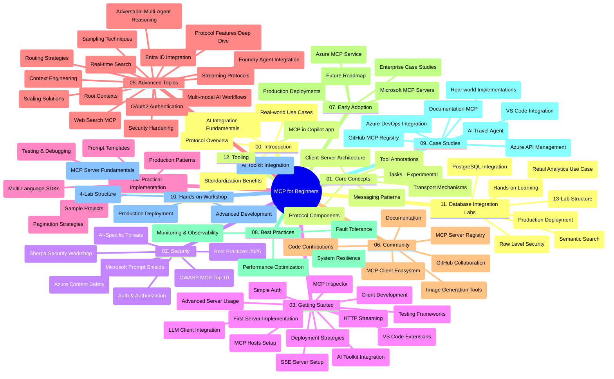

# തുടങ്ങി പ്രയോജനത്തിനുള്ള മോഡൽ കോൺടെക്സ്റ്റ് പ്രോട്ടോക്കോൾ (MCP) - പഠന ഗൈഡ്

ഈ പഠന ഗൈഡ് "തുടരുന്നവർക്കുള്ള മോഡൽ കോൺടെക്സ്റ്റ് പ്രോട്ടോക്കോൾ (MCP)" പാഠ്യപദ്ധതിയ്ക്കുള്ള റീപോസിറ്ററി ഘടനയും ഉള്ളടക്കവും അവലോകനം ചെയ്യുന്നു. ഈ ഗൈഡ് ഉപയോഗിച്ച് റീപോസിറ്ററി ഫലപ്രദമായി ആസ്വദിക്കുകയും ലഭ്യമായ വിഭവങ്ങൾ പരമാവധി ഉപയോഗപ്പെടുത്തുകയും ചെയ്യുക.

## റീപോസിറ്ററി അവലോകനം

മോഡൽ കോൺടെക്സ്റ്റ് പ്രോട്ടോക്കോൾ (MCP) എഐ മോഡലുകളും ക്ലയന്റ് ആപ്പ്ലിക്കേഷനുകളും തമ്മിലുള്ള ഇടപെടലിനായുള്ള ഒരു സ്റ്റാൻഡേർഡൈസ്ഡ് ഫ്രെയിംവർക്ക് ആണ്. ആൻത്രോപ്പിക് ആരംഭിച്ചത്, ഇപ്പോൾ MCP കമ്മ്യൂണിറ്റി ഔദ്യോഗിക GitHub സംഘടന വഴി പരിപാലിക്കുന്നു. ഈ റീപോസിറ്ററി C#, Java, JavaScript, Python, TypeScript ഭാഷകളിൽ ഹാൻഡ്‌സ്-ഓൺ കോഡ് ഉദാഹരണങ്ങൾ ഉൾക്കൊണ്ട് എഐ ഡെവലപ്പർമാർക്കും സിസ്റ്റം ആർക്കിടെക്റ്റുകൾക്കും സോഫ്റ്റ്‌വെയർ എഞ്ചിനീയർമാർക്കും ലക്ഷ്യമിട്ട പൂർണ്ണമായും പഠനപാഠം നൽകി.

## ദൃശ്യപാഠ്യപദ്ധതി മാപ്പ്

## റീപോസിറ്ററി ഘടന

MCP യുടെ വിവിധ ഭാഗങ്ങളെ കേന്ദ്രീകരിച്ച് പന്ത്രണ്ട് പ്രധാന വിഭാഗങ്ങളായി റീപോസിറ്ററി വിന്യസിച്ചിരിക്കുന്നു:

1. **പരിചയം (00-Introduction/)**
   - മോഡൽ കോൺടെക്സ്റ്റ് പ്രോട്ടോക്കോൾ അവലോകനം
   - എഐ പൈപ്പ്ലൈനിൽ സ്റ്റാൻഡേർഡൈസേഷന്റെ പ്രാധാന്യം
   - പ്രായോഗിക ഉപയോഗശീരങ്ങൾയും ലാഭങ്ങളും

2. **പ്രധാന ആശയങ്ങൾ (01-CoreConcepts/)**
   - ക്ലയന്റ്-സെർവർ ആർക്കിടെക്ചർ
   - പ്രധാന പ്രോട്ടോക്കോൾ ഘടകങ്ങൾ
   - MCP-യിലെ മെസ്സേജിംഗ് പാറ്റേണുകൾ
   - നിലവിലുള്ള സ്പെസിഫിക്കേഷൻ: [MCP-യിൽ എന്തെന്താണ് മാറിയത്: 2026-07-28 സ്പെസിഫിക്കേഷൻ](./01-CoreConcepts/mcp-2026-07-28.md) — സ്റ്റേറ്റ്‌ലസ് പ്രോട്ടോക്കോൾ കോർ, എക്സ്റ്റൻഷൻസ് ഫ്രെയിംവർക്ക്, Roots/Sampling/Logging ഉപേക്ഷണങ്ങൾ

3. **സുരക്ഷ (02-Security/)**
   - MCP അടിസ്ഥാനമാക്കിയ സിസ്റ്റങ്ങളിലെ സുരക്ഷാ ഭീഷണികൾ
   - സുരക്ഷ ഉറപ്പാക്കാനുള്ള മികച്ച സಿದ್ಧാന്തങ്ങൾ
   - ഓഥന്റിക്കേഷൻ, ഓത്തറൈസേഷൻ തന്ത്രങ്ങൾ
   - പ്രായോഗികമായി [CIMD, DCR ഓത്തറൈസേഷൻ സാമ്പിൾ](./02-Security/samples/cimd-dcr-auth/README.md)
   - **സുരക്ഷാ സമഗ്രരേഖാമൂലം**:
     - MCP സുരക്ഷാ മികച്ച നടപടിക്രമങ്ങൾ
     - അസ്യൂർ കണ്ടന്റ് സേഫ്റ്റി നടപ്പാക്കൽ ഗൈഡ്
     - MCP സുരക്ഷാ നിയന്ത്രണങ്ങളും സാങ്കേതിക വിദ്യകളും
     - MCP മികച്ച പ്രയോഗങ്ങൾ ക്വിക്ക് റഫറൻസ്
   - **പ്രധാന സുരക്ഷാ വിഷയം**:
     - പ്രോംപ്റ്റ് ഇൻജക്ഷനും ടൂൾ പോയ്‌സണിങ് ആക്രമണങ്ങളും
     - സെഷൻ ഹാജാക്കിംഗ്, കുഴപ്പം വന്ന ഡെപ്യുട്ടി പ്രശ്നങ്ങൾ
     - ടോക്കൻ പാസ്സ്ഠ്രൂ ദുര്‍ബലതകൾ
     - അത്യധികാരങ്ങൾ, ആക്‌സസ് നിയന്ത്രണം
     - എഐ ഘടകങ്ങളുടെ സപ്ലൈ ചെയിൻ സുരക്ഷ
     - മൈക്രോസോഫ്‌റ്റ് പ്രോംപ്റ്റ് ഷീൽഡുകളുടെ സംയോജനം

4. **ആരംഭിക്കുന്നത് (03-GettingStarted/)**
   - പരിസ്ഥിതി സജ്ജീകരണം, കോൺഫിഗറേഷൻ
   - അടിസ്ഥാന MCP സെർവർ, ക്ലയന്റ് സൃഷ്ടി
   - നിലവിലുള്ള ആപ്പ്ലിക്കേഷനുകളുമായി സംയോജനം
   - ഉൾപ്പെടുന്ന വിഭാഗങ്ങൾ:
     - ആദ്യ സെർവർ നടപ്പാക്കൽ
     - ക്ലയന്റ് വികസനം
     - LLM ക്ലയന്റ് സംയോജനം
     - VS Code സംയോജനം
     - സെർവർ-സെന്റ് ഇവന്റ്സ് (SSE) സെർവർ
     - മുൻനിര സെർവർ ഉപയോഗം
     - HTTP സ്ട്രീമിംഗ്
     - AI ടൂൾകിറ്റ് സംയോജനം
     - പരിശോധന തന്ത്രങ്ങൾ
     - വിന്യാസ മാർഗ്ഗനിർദ്ദേശങ്ങൾ

5. **പ്രായോഗിക നടപ്പാക്കൽ (04-PracticalImplementation/)**
   - വ്യത്യസ്ത പ്രോഗ്രാമിങ് ഭാഷകളിൽ SDKs ഉപയോഗം
   - ഡീബഗിംഗ്, ടെസ്റ്റിംഗ്, വാലിഡേഷൻ സാങ്കേതിക വിദ്യകൾ
   - പുനരുപയോഗ പ്രോംപ്റ്റ് ടെംപ്ലേറ്റ്, വർക്ക്‌ഫ്ലോ നിർമ്മാണം
   - നടപ്പാക്കൽ ഉദാഹരണങ്ങളുള്ള സാമ്പിൾ പ്രോജക്റ്റുകൾ

6. **മുൻനിര വിഷയം (05-AdvancedTopics/)**
   - കോൺടെക്സ്റ്റ് എൻജിനീയറിങ്ങ് സാങ്കേതിക വിദ്യകൾ
   - ഫൗണ്ടറി ഏജന്റ് സംയോജനം
   - മൾട്ടി-മോഡൽ എഐ വർക്‌ഫ്ലോകൾ 
   - OAuth2 ഓഥന്റിക്കേഷൻ ഡെമോകൾ
   - റിയൽ-ടൈം സെർച്ച് കഴിവുകൾ
   - റിയൽ-ടൈം സ്ട്രീമിംഗ്
   - റൂട്ട് കോൺടെക്സ്റ്റുകൾ നടപ്പാക്കൽ
   - റൂട്ടിംഗ് തന്ത്രങ്ങൾ
   - സാമ്പ്ലിംഗ് സാങ്കേതികവിദ്യകൾ
   - സ്കെയ്ലിങ് സമീപനങ്ങൾ
   - സുരക്ഷാ പരിഗണനകൾ
   - Entra ID സുരക്ഷ സംയോജനം
   - വെബ് സെർച്ച് സംയോജനം
   - എതിരാളി മൾട്ടി-ഏജന്റ് റീസണിംഗ് (പ്രതിവാദ പാറ്റേണുകൾ)

7. **സമൂഹ സംഭാവനകൾ (06-CommunityContributions/)**
   - കോഡ്, ഡോക്യുമെന്റേഷൻ സംഭാവന ചെയ്യുന്നത് എങ്ങനെ
   - GitHub വഴി സഹകരണം
   - സമൂഹം നയിക്കുന്ന മെച്ചപ്പെടുത്തലുകളും ഫീഡ്ബാക്കുകളും
   - വിവിധ MCP ക്ലയന്റുകൾ ഉപയോഗിക്കൽ (Claude ഡെസ്ക്ടോപ്പ്, Cline, VSCode)
   - വാണിജ്യ MCP സെർവറുകളുമായി പ്രവർത്തിക്കൽ, ചിത്ര സൃഷ്ടി ഉൾപ്പെടെ

8. **ആരംഭകാധ്യായങ്ങളിൽ നിന്നും പാഠങ്ങൾ (07-LessonsfromEarlyAdoption/)**
   - യാഥാർത്ഥ്യ നടപ്പാക്കലുകളും വിജയകഥകളും
   - MCP അടിസ്ഥാനപരമായി സൊലൂഷൻ നിർമ്മാണം, വിന്യാസം
   - ട്രെൻഡും ഭാവി റോഡ്‌മാപും
   - **Microsoft MCP സെർവറുകൾ ഗൈഡ്**: 10 പ്രൊഡക്ഷൻ റെഡി Microsoft MCP സെർവറുകളുടെ സമഗ്രം:
     - Microsoft Learn Docs MCP സെർവർ
     - Azure MCP സെർവർ (15+ സ്പെഷ്യലൈസ്ഡ് കണക്ടറുകൾ)
     - GitHub MCP സെർവർ
     - Azure DevOps MCP സെർവർ
     - MarkItDown MCP സെർവർ
     - SQL Server MCP സെർവർ
     - Playwright MCP സെർവർ
     - Dev Box MCP സെർവർ
     - Microsoft Foundry MCP സെർവർ
     - Microsoft 365 Agents Toolkit MCP സെർവർ

9. **മികച്ച പ്രയോഗങ്ങൾ (08-BestPractices/)**
   - പ്രകടന ട്യൂണിംഗ്, ഓപ്റ്റിമൈസേഷൻ
   - ഫാൾട്ട്-ടോളറന്റ് MCP സിസ്റ്റങ്ങൾ രൂപ രചന
   - ടെസ്റ്റിംഗ്, ദൃഢത തന്ത്രങ്ങൾ

10. **കേസ് സ്റ്റഡീസ് (09-CaseStudy/)**
    - **ഏഴു സമഗ്രമായ കേസ് സ്റ്റഡികൾ** MCP വൈവിധ്യമാർന്ന സാഹചര്യങ്ങളിൽ സാധുവാക്കുന്നവ:
    - **Azure AI ട്രാവൽ ഏജന്റ്സ്**: മൾട്ടി-ഏജന്റ് ഓർക്കസ്ട്രേഷൻ Azure OpenAI, AI Search ഉപയോഗിച്ച്
    - **Azure DevOps ഇന്റഗ്രേഷൻ**: YouTube ഡാറ്റ അപ്‌ഡേറ്റുകൾ ഉൾപ്പെടുള്ള വർക്‌ഫ്ലോ ഓട്ടോമേഷൻ
    - **റിയൽ-ടൈം ഡോക്യുമെന്റേഷൻ റിട്രീവൽ**: സ്ട്രീമിംഗ് HTTP-ഉം ഉൾക്കൊള്ളുന്ന Python കൺസോൾ ക്ലയന്റ്
    - **ഇന്ററാക്ടീവ് സ്റ്റഡി പ്ലാൻ ജനറേറ്റർ**: Chainlit വെബ്ബ് ആപ്പ്, സംഭാഷണ എഐ ഉപയോഗിച്ച്
    - **ഇൻ-എഡിറ്റർ ഡോക്യുമെന്റേഷൻ**: GitHub Copilot വർക്ക്‌ഫ്ലോകളുടെ VS Code സംയോജനം
    - **Azure API മാനേജ്മെന്റ്**: MCP സെർവർ സൃഷ്ടിക്കപ്പെടുന്ന എന്റർപ്രൈസ് API സംയോജനം
    - **GitHub MCP രജിസ്ട്രി**: ഇക്കോസിസ്റ്റം വികസനം, ഏജന്റിക് സംയോജനം പ്ലാറ്റ്ഫോം
    - സംയോജനം, ഡെവലപ്പർ ഉത്പാദനക്ഷമത, ഇക്കോസിസ്റ്റം വികസനം ഉൾപ്പെടുന്ന നടപ്പാക്കലുകൾ

11. **ഹാൻഡ്സ്-ഓൺ വർക്ക്ഷോപ്പ് (10-StreamliningAIWorkflowsBuildingAnMCPServerWithAIToolkit/)**
    - MCP, AI ടൂൾകിറ്റ് സംയോജിപ്പിച്ച് സമഗ്ര ഹാൻഡ്സ്-ഓൺ വർക്ക്ഷോപ്പ്
    - എഐ മോഡലുകളെയും യഥാർത്ഥ ലോക ഉപകരണങ്ങളെയും ബന്ധിപ്പിക്കുന്ന ബുദ്ധിമുട്ടുള്ള ആപ്ലിക്കേഷനുകൾ നിർമ്മാണം
    - അടിസ്ഥാനങ്ങൾ മുതൽ കസ്റ്റം സെർവർ വികസനവും പ്രൊഡക്ഷൻ വിന്യാസ തന്ത്രങ്ങളും ഉൾപ്പെടുന്ന പ്രായോഗിക ഘടകങ്ങൾ
    - **ലാബ് ഘടന**:
      - ലാബ് 1: MCP സെർവർ അടിസ്ഥാനങ്ങൾ
      - ലാബ് 2: മുൻനിര MCP സെർവർ വികസനം
      - ലാബ് 3: AI ടൂൾകിറ്റ് സംയോജനം
      - ലാബ് 4: പ്രൊഡക്ഷൻ വിന്യാസവും സ്കെയ്ലിംഗും
    - ലാബ്-അധിഷ്ഠിത പഠന രീതിയും ക്രമ ചികില്‍സിച്ച സജ്ജീകരണ സംവിധാനവും

12. **MCP സെർവർ ഡാറ്റാബേസ് സംയോജനം ലാബുകൾ (11-MCPServerHandsOnLabs/)**
    - പ്രൊഡക്ഷൻ- റെഡി MCP സെർവർ നിർമാണത്തിനായുള്ള സമഗ്ര 13-ലാബ് പഠനമാർഗ്ഗം, PostgreSQL സംയോജനം ഉൾപ്പെടുത്തുന്നു
    - **യഥാർത്ഥ റീട്ടെയിൽ അനാലിറ്റിക്സ് നടപ്പാക്കൽ** - Zava Retail ഉപയോഗിച്ചു
    - **എന്റർപ്രൈസ്-ഗ്രേഡ് പാറ്റേണുകൾ** - റോ ലെവൽ സെക്യൂരിറ്റി (RLS), സെമാന്റിക് സെർച്ച്, മൾട്ടി-ടെനന്റ് ഡാറ്റ ആക്‌സസ്
    - **പൂർണ്ണ ലാബ് ഘടന**:
      - **ലാബുകൾ 00-03: അടിസ്ഥാനം** - പരിചയം, ആർക്കിടെക്ചർ, സുരക്ഷ, പരിസ്ഥിതി സജ്ജീകരണം
      - **ലാബുകൾ 04-06: MCP സെർവർ നിർമ്മാണം** - ഡാറ്റാബേസ് ഡിസൈൻ, MCP സെർവർ നടപ്പാക്കൽ, ടൂൾ വികസനം
      - **ലാബുകൾ 07-09: മുൻനിര സവിശേഷതകൾ** - സെമാന്റിക് സെർച്ച്, ടെസ്റ്റിംഗ് & ഡീബഗിംഗ്, VS Code സംയോജനം
      - **ലാബുകൾ 10-12: പ്രൊഡക്ഷൻ & മികച്ച പ്രയോഗങ്ങൾ** - വിന്യാസം, മേൽനോട്ടം, ഓപ്റ്റിമൈസേഷൻ
    - **തന്ത്രശാസ്ത്രങ്ങൾ**: FastMCP ഫ്രെയിംവർക്ക്, PostgreSQL, Azure OpenAI, Azure Container Apps, ആപ്ലിക്കേഷൻ ഇൻസൈറ്റ്സ്
    - **പഠനഫലം**: പ്രൊഡക്ഷൻ- റെഡി MCP സെർവർകൾ, ഡാറ്റാബേസ് സംയോജനം പാറ്റേണുകൾ, എഐ-നിര്ഥ്യമായ അനാലിറ്റിക്സ്, എന്റർപ്രൈസ് സecurറിറ്റി

13. **ടൂളിംഗ് (12-tooling/)**
    - MCP Copilot ആപ്പിലും മറ്റ് ടൂളുകളിലും എങ്ങനെ ഉപയോഗിക്കാൻ പഠിക്കുക

## അധിക വിഭവങ്ങൾ

റീപോസിറ്ററിയിൽ ചേരുന്ന സഹായ ശേഷികൾ:

- **ഇമേജസ്സ് ഫോൾഡർ**: പാഠ്യപദ്ധതിയിൽ ഉപയോഗിക്കുന്ന ചിത്രരേഖകളും ദൃശ്യവിവരണങ്ങളും
- **ഭാഷാനുവാദം**: ഡോക്യുമെന്റേഷന്റെ സ്വയംമാറ്റം വഴി ബഹുഭാഷ പിന്തുണ
- **ഓദ്യോഗിക MCP വിഭവങ്ങൾ**:
  - [MCP ഡോക്യൂമെന്റേഷൻ](https://modelcontextprotocol.io/)
  - [MCP സ്പെസിഫിക്കേഷൻ](https://modelcontextprotocol.io/specification/2026-07-28/)
  - [MCP GitHub റീപോസിറ്ററി](https://github.com/modelcontextprotocol)

## ഈ റീപോസിറ്ററി എങ്ങനെ ഉപയോഗിക്കും

1. **ക്രമാനുയായിയായ പഠനം**: 00 മുതൽ 11 വരെയുള്ള അധ്യായങ്ങൾ ക്രമം പാലിച്ച് പഠിക്കേണ്ടതാണ്.
2. **ഭാഷ-നിഷ്പക്ഷ ശ്രദ്ധ**: പ്രത്യേക പ്രോഗ്രാമിങ് ഭാഷയിൽ താൽപര്യമുണ്ടെങ്കിൽ, നിങ്ങൾക്കിഷ്ടമുള്ള ഭാഷയിൽ ഉള്ള നടപ്പാക്കലുകൾ ഉദാഹരണങ്ങൾ കാണാനായി സാമ്പിൾ ഡയറക്ടറികൾ പരിശോധിക്കുക.
3. **പ്രായോഗിക നടപ്പാക്കൽ**: പരിസ്ഥിതി സജ്ജീകരിച്ച് ആദ്യ MCP സെർവർ, ക്ലയന്റ് സൃഷ്ടിക്കുന്നതിനായി "ആരംഭിക്കൽ" വിഭാഗത്തിൽ നിന്നും ആരംഭിക്കുക.
4. **മുൻനിര പഠനം**: അടിസ്ഥാനങ്ങളിൽ സുഖമായി കൈകാര്യം കഴിഞ്ഞാൽ മുൻനിര വിഷയങ്ങളിൽ കടക്കുക.
5. **സമൂഹ സജീവം**: MCP സമൂഹത്തിൽ GitHub ചർച്ചകളിലും Discord ചാനലുകളിലും ചേർന്നു വിദഗ്ധരും മറ്റ് ഡെവലപ്പർമാരുമായും ബന്ധപ്പെടുക.

## MCP ക്ലയന്റുകളും ടൂളുകളും

പാഠ്യപദ്ധതിയിൽ വിവിധ MCP ക്ലയന്റും ടൂളുകളും ഉൾപ്പെടുത്തിയിരിക്കുന്നു:

1. **ഓദ്യോഗിക ക്ലയന്റുകൾ**:
   - Visual Studio Code 
   - Visual Studio Code-ലുള്ള MCP
   - Claude ഡെസ്ക്ടോപ്പ്
   - VSCode-ലുള്ള Claude
   - Claude API

2. **സമൂഹ ക്ലയന്റുകൾ**:
   - Cline (ടർമിനൽ-അധിഷ്ഠിതം)
   - Cursor (കോഡ് എഡിറ്റർ)
   - ChatMCP
   - Windsurf

3. **MCP മാനേജ്മെന്റ് ടൂളുകൾ**:
   - MCP CLI
   - MCP മാനേജർ
   - MCP ലിങ്കർ
   - MCP റൂട്ടർ

## പ്രശസ്ത MCP സെർവറുകൾ

റീപോസിറ്ററിയിൽ പരിചയപ്പെടുത്തുന്നു വിവിധ MCP സെർവറുകൾ, ഉൾപ്പെടെ:

1. **ഓദ്യോഗിക മൈക്രോസോഫ്‌റ്റ് MCP സെർവറുകൾ**:
   - Microsoft Learn Docs MCP സെർവർ
   - Azure MCP സെർവർ (15+ പ്രത്യേക കണക്ടറുകൾ)
   - GitHub MCP സെർവർ
   - Azure DevOps MCP സെർവർ
   - MarkItDown MCP സെർവർ
   - SQL Server MCP സെർവർ
   - Playwright MCP സെർവർ
   - Dev Box MCP സെർവർ
   - Microsoft Foundry MCP സെർവർ
   - Microsoft 365 Agents Toolkit MCP സെർവർ

2. **ഓദ്യോഗിക റിഫറൻസ് സെർവറുകൾ**:
   - ഫയൽസിസ്റ്റം
   - ഫെച്ച്
   - മെമ്മറി
   - സീക്വൻഷ്യൽ തിങ്കിംഗ്

3. **ചിത്ര നിർമ്മാണം**:
   - അസ്യൂർ ഓപ്പൺഎഐ DALL-E 3
   - സ്റ്റേബിൾ ഡിഫ്യൂഷൻ വെബ്‌യു‌ഐ
   - റിപ്പ്ലിക്കേറ്റ്

4. **ഡെവലപ്മെന്റ് ടൂളുകൾ**:
   - Git MCP
   - ടെർമിനൽ നിയന്ത്രണം
   - കോഡ് അസിസ്റ്റൻറ്

5. **പ്രത്യേക സെർവറുകൾ**:
   - സെൽസ്ഫോഴ്‌സ്
   - മൈക്രോസോഫ്റ്റ് Teams
   - Jira & Confluence

## സംഭാവന

ഈ റീപോസിറ്ററി സമൂഹത്തിന്റെ സംഭാവനകൾ സ്വാഗതം ചെയ്യുന്നു. MCP ഇക്കോസിസ്റ്റത്തിന് ഫലപ്രദമായി സംഭാവന നൽകുന്നതിന് മുൻകൂർ കാണുക സമൂഹ സംഭാവനകൾ സെക്ഷൻ.

----

*ഈ പഠന ഗൈഡ് അവസാനമായി അപ്‌ഡേറ്റ് ചെയ്തത് 2026 സെപ്റ്റംബർ 9-നാണ്. ഇത് MCP
സ്പെസിഫിക്കേഷൻ `2026-07-28`, നിലവിലുള്ള പ്രോട്ടോക്കോൾ പരിഷ്കാരം പ്രതിബिंബിക്കുന്നു. ചില ഹാൻഡ്‌സ്-ഓൺ
ഉദാഹരണങ്ങൾ നേരത്തെ `2025-11-25` ആനുകാലിക പതിപ്പിൽ തന്നെയാണ്, എന്നാൽ അവയുടെ SDKകളും ടൂളുകളും
സ്റ്റേറ്റ്‌ലസ് പ്രോട്ടോക്കോൾ APIകൾ സ്വീകരിക്കുന്നു.*

---

<!-- CO-OP TRANSLATOR DISCLAIMER START -->
**അറിയിപ്പ്**:
ഈ രേഖ AI പരിഭാഷാ സേവനം [Co-op Translator](https://github.com/Azure/co-op-translator) ഉപയോഗിച്ച് പരിഭാഷപ്പെടുത്തിയതാണ്. ഞങ്ങൾ കൃത്യതയ്ക്കായി ശ്രമിക്കുന്നുവെങ്കിലും, ഓട്ടോമേറ്റഡ് പരിഭാഷകളിൽ പിഴവുകൾ അല്ലെങ്കിൽ തെറ്റായ വിവരങ്ങൾ ഉണ്ടാകാൻ സാധ്യതയുണ്ട്. അതിന്റെ സ്വാഭാവിക ഭാഷയിലുള്ള അസൽ രേഖയാണ് പ്രാമാണികമായ ഉറവിടമായി പരിഗണിക്കേണ്ടത്. നിർണായകമായ വിവരങ്ങൾക്ക്, പ്രൊഫഷണൽ മനുഷ്യ പരിഭാഷ ശുപാർശ ചെയ്യുന്നു. ഈ പരിഭാഷ ഉപയോഗിച്ച് ഉണ്ടാകുന്ന തെറ്റിദ്ധാരണകൾ അല്ലെങ്കിൽ തെറ്റായ വ്യാഖ്യാനങ്ങൾക്കായി ഞങ്ങൾ ഉത്തരവാദികളല്ല.
<!-- CO-OP TRANSLATOR DISCLAIMER END -->