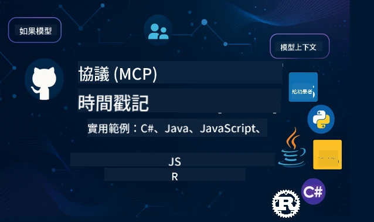

<!--
CO_OP_TRANSLATOR_METADATA:
{
  "original_hash": "35240f904db8c08d6198f6f15767d218",
  "translation_date": "2026-01-14T15:19:47+00:00",
  "source_file": "README.md",
  "language_code": "mo"
}
-->
 

[](https://GitHub.com/microsoft/mcp-for-beginners/graphs/contributors)
[](https://GitHub.com/microsoft/mcp-for-beginners/issues)
[](https://GitHub.com/microsoft/mcp-for-beginners/pulls)
[](http://makeapullrequest.com)

[](https://GitHub.com/microsoft/mcp-for-beginners/watchers)
[](https://GitHub.com/microsoft/mcp-for-beginners/fork)
[](https://GitHub.com/microsoft/mcp-for-beginners/stargazers)


[](https://discord.gg/nTYy5BXMWG)

跟隨以下步驟開始使用這些資源：
1. **Fork 儲存庫**：點擊 [](https://GitHub.com/microsoft/mcp-for-beginners/fork)
2. **Clone 儲存庫**：   `git clone https://github.com/microsoft/mcp-for-beginners.git`
3. **加入** [](https://discord.gg/nTYy5BXMWG)


### 🌐 多語言支援

#### 透過 GitHub Action 支援（自動且隨時更新）

<!-- CO-OP TRANSLATOR LANGUAGES TABLE START -->
[Arabic](../ar/README.md) | [Bengali](../bn/README.md) | [Bulgarian](../bg/README.md) | [Burmese (Myanmar)](../my/README.md) | [Chinese (Simplified)](../zh/README.md) | [Chinese (Traditional, Hong Kong)](../hk/README.md) | [Chinese (Traditional, Macau)](./README.md) | [Chinese (Traditional, Taiwan)](../tw/README.md) | [Croatian](../hr/README.md) | [Czech](../cs/README.md) | [Danish](../da/README.md) | [Dutch](../nl/README.md) | [Estonian](../et/README.md) | [Finnish](../fi/README.md) | [French](../fr/README.md) | [German](../de/README.md) | [Greek](../el/README.md) | [Hebrew](../he/README.md) | [Hindi](../hi/README.md) | [Hungarian](../hu/README.md) | [Indonesian](../id/README.md) | [Italian](../it/README.md) | [Japanese](../ja/README.md) | [Kannada](../kn/README.md) | [Korean](../ko/README.md) | [Lithuanian](../lt/README.md) | [Malay](../ms/README.md) | [Malayalam](../ml/README.md) | [Marathi](../mr/README.md) | [Nepali](../ne/README.md) | [Nigerian Pidgin](../pcm/README.md) | [Norwegian](../no/README.md) | [Persian (Farsi)](../fa/README.md) | [Polish](../pl/README.md) | [Portuguese (Brazil)](../br/README.md) | [Portuguese (Portugal)](../pt/README.md) | [Punjabi (Gurmukhi)](../pa/README.md) | [Romanian](../ro/README.md) | [Russian](../ru/README.md) | [Serbian (Cyrillic)](../sr/README.md) | [Slovak](../sk/README.md) | [Slovenian](../sl/README.md) | [Spanish](../es/README.md) | [Swahili](../sw/README.md) | [Swedish](../sv/README.md) | [Tagalog (Filipino)](../tl/README.md) | [Tamil](../ta/README.md) | [Telugu](../te/README.md) | [Thai](../th/README.md) | [Turkish](../tr/README.md) | [Ukrainian](../uk/README.md) | [Urdu](../ur/README.md) | [Vietnamese](../vi/README.md)

> **偏好本地 Clone？**

> 本儲存庫包含 50 多種語言翻譯，會大幅增加下載大小。若要不連翻譯檔一起下載，請使用稀疏檢出：
> ```bash
> git clone --filter=blob:none --sparse https://github.com/microsoft/mcp-for-beginners.git
> cd mcp-for-beginners
> git sparse-checkout set --no-cone '/*' '!translations' '!translated_images'
> ```
> 這樣你可以快速取得完成課程所需的所有內容。
<!-- CO-OP TRANSLATOR LANGUAGES TABLE END -->

# 🚀 Model Context Protocol (MCP) 初學者課程

## **透過 C#, Java, JavaScript, Rust, Python 及 TypeScript 實作程式碼學習 MCP**

## 🧠 Model Context Protocol 課程概覽
歡迎踏上 Model Context Protocol 的旅程！如果你曾想知道 AI 應用程式如何與不同工具和服務溝通，你即將發現一個優雅的解決方案，它正在改變開發者打造智能系統的方式。

想像 MCP 就像 AI 應用程式的萬用翻譯器——就像 USB 埠允許你將任何裝置連接到電腦一樣，MCP 讓 AI 模型能以標準化方式連接任意工具或服務。無論你是打造第一個聊天機器人，還是開發複雜的 AI 工作流程，了解 MCP 將讓你擁有建構更強大、更靈活應用程式的能力。

這套課程用心設計，照顧你的學習曲線。我們將從你已熟悉的簡單概念開始，逐步透過你喜愛的程式語言，以實作練習培養專業技能。每個步驟都包括清楚解釋、實用範例以及充分的鼓勵。

當你完成這趟旅程時，你將有信心自行建置 MCP 伺服器，將它們整合到流行的 AI 平台上，並理解這項技術如何重塑 AI 開發的未來。讓我們一起開始這刺激的冒險吧！

### 官方文件與規範

這些資源會隨著你理解的加深而越來越有價值，但不需要馬上全部閱讀。從你最感興趣的部分開始吧！
- 📘 [MCP 文件](https://modelcontextprotocol.io/) – 這是你的主要資源，帶有逐步教學與使用指南。文件以初學者為對象，提供清晰範例供你隨時學習參考。
- 📜 [MCP 規範](https://modelcontextprotocol.io/docs/) – 可看作是完整的參考手冊。隨著課程進展，你會經常回來此處查詢具體細節與探索進階功能。
- 📜 [原始 MCP 規範](https://modelcontextprotocol.io/specification/versioning) – 包含額外的技術細節，對進階實作有幫助。初學時不用太擔心。
- 🧑‍💻 [MCP GitHub 儲存庫](https://github.com/modelcontextprotocol) – 這裡可找到多種程式語言的 SDK、工具及範例程式碼。就像實用範例及即用元件的寶庫。
- 🌐 [MCP 社群](https://github.com/orgs/modelcontextprotocol/discussions) – 加入其他學習者與經驗豐富的開發者討論 MCP 相關議題。這裡是歡迎提問與自由分享知識的支持社群。
  
## 學習目標

完成此課程後，你將感到自信且興奮。你將達成：

• **理解 MCP 基礎**：你會掌握 Model Context Protocol 是什麼，以及為何它革命性地改變 AI 應用如何共事，使用通俗易懂的類比與範例。

• **打造你的第一個 MCP 伺服器**：你會在喜歡的程式語言中，從簡單示範開始，一步步建立可運作的 MCP 伺服器。

• **將 AI 模型連結真實工具**：你將學會如何架起 AI 模型與實際服務的橋樑，賦予應用強大新能力。

• **實作安全最佳實務**：你會理解如何確保你的 MCP 實作安全無虞，保護應用與使用者。

• **自信地部署**：你會知道如何將 MCP 專案從開發帶入生產環境，並掌握實務部署策略。

• **加入 MCP 社群**：你將成為日益壯大的開發者社群一員，共同塑造 AI 應用開發的未來。 

## 必要背景知識

在深入 MCP 細節前，先確保你對基礎概念感到舒適。如非專家也無妨，我們會一路講解必須了解的內容！

### 理解協議（基礎基石）

協議就像是對話規則。當你打電話給朋友，雙方都知道接聽時說「哈囉」、交替說話、結束時說「再見」。電腦程式也需要類似規則才能有效溝通。

MCP 是一種協議——一套商定規則，幫助 AI 模型與應用程式與工具及服務「對話」。就像有對話規則讓人類交流更順暢，有了 MCP，AI 應用之間的溝通也更可靠強大。

### 客戶端與伺服器關係（程式如何合作）

你每天都在使用客戶端與伺服器！當你用瀏覽器（客戶端）瀏覽網站，就是連接至網頁伺服器來取得頁面內容。瀏覽器知道如何索取資訊，伺服器則知道如何回應。

MCP 中也有類似關係：AI 模型當做客戶端請求資訊或操作，MCP 伺服器則提供相關能力。就像有位協助者（伺服器）聽從 AI 指示執行特定任務。

### 標準化的重要性（讓東西能合作）

想像如果每間車廠油箱接頭形狀都不一樣——你每台車都得有不同轉接器！標準化就是達成共識，讓東西無縫合作。

MCP 提供 AI 應用的標準化。AI 模型不用各自撰寫專屬程式碼來配合每項工具，MCP 建立統一溝通方式。讓開發者能一次打造工具，並在多種 AI 系統間運作。

## 🧭 你的學習路徑概覽

你的 MCP 旅程被精心設計，幫助你逐步建立信心與技能。每階段引入新概念，同時複習鞏固既有知識。

### 🌱 基礎階段：了解基本概念（模組 0-2）

冒險從這裡啟程！我們會用熟悉的類比與簡單範例介紹 MCP 概念。你會了解 MCP 是什麼、為何存在，以及它如何融入 AI 開發大環境。

• **模組 0 - MCP 簡介**：先探索 MCP 是什麼，以及為現代 AI 應用有多重要。你會看到 MCP 真實世界運作範例，理解它如何解決常見開發挑戰。

• **模組 1 - 核心概念解說**：這裡會學到 MCP 的基礎構成。透過大量類比與視覺範例，確保這些概念自然且易懂。

• **模組 2 - MCP 的安全性**：安全聽起來嚇人，但我們會說明 MCP 包含的內建安全機制，並教你從一開始就實作最佳保護方法。

### 🔨 建構階段：打造你的第一個實作（模組 3）

現在真正的樂趣開始了！你會動手打造 MCP 伺服器與客戶端。不用擔心，我們會從簡單開始，逐步帶你走每一步。

本模組包含多個實作指南，讓你以喜愛的程式語言練習。你會建立第一個伺服器、打造連線的客戶端，甚至整合流行的開發工具如 VS Code。

每份指南附有完整程式碼範例、排錯技巧，以及設計選擇的說明。完成此階段後，你將擁有能運作的 MCP 實作，值得驕傲！
### 🚀 成長階段：進階概念與實務應用（模組 4-5）

掌握基礎後，您將準備探索更複雜的 MCP 功能。我們將涵蓋實務實作策略、除錯技巧，以及多模態 AI 整合等進階主題。

您還將學習如何將 MCP 實作擴展到生產環境，並整合像是 Azure 等雲端平台，這些模組幫助您構建能應付現實需求的 MCP 解決方案。

### 🌟 精通階段：社群與專精（模組 6-11）

最後階段聚焦於加入 MCP 社群與專精感興趣的領域。您將學會如何為開源 MCP 專案做出貢獻、實作進階認證模式，以及建立包含資料庫整合的完整解決方案。

模組 11 更值得特別提及——它是一個包含 13 個實驗的完整實作路徑，教您建立結合 PostgreSQL 的生產等級 MCP 伺服器，猶如一個總結專案，整合了您所學的一切！

### 📚 完整課程結構

| 模組 | 主題 | 描述 | 連結 |
|--------|-------|-------------|------|
| **模組 1-3：基礎** | | | |
| 00 | MCP 簡介 | Model Context Protocol 概述及其在 AI 流程中重要性 | [閱讀更多](./00-Introduction/README.md) |
| 01 | 核心概念說明 | 深入探討 MCP 核心概念 | [閱讀更多](./01-CoreConcepts/README.md) |
| 02 | MCP 安全性 | 安全威脅與最佳實務 | [閱讀更多](./02-Security/README.md) |
| 03 | MCP 入門 | 環境設定、基礎伺服器/用戶端、整合 | [閱讀更多](./03-GettingStarted/README.md) |
| **模組 3：打造您的第一個伺服器與用戶端** | | | |
| 3.1 | 第一個伺服器 | 建立您的第一個 MCP 伺服器 | [指南](./03-GettingStarted/01-first-server/README.md) |
| 3.2 | 第一個用戶端 | 開發基礎 MCP 用戶端 | [指南](./03-GettingStarted/02-client/README.md) |
| 3.3 | 帶有大型語言模型的用戶端 | 整合大型語言模型 | [指南](./03-GettingStarted/03-llm-client/README.md) |
| 3.4 | VS Code 整合 | 在 VS Code 中使用 MCP 伺服器 | [指南](./03-GettingStarted/04-vscode/README.md) |
| 3.5 | stdio 伺服器 | 使用 stdio 傳輸建立伺服器 | [指南](./03-GettingStarted/05-stdio-server/README.md) |
| 3.6 | HTTP 串流 | MCP 中實作 HTTP 串流 | [指南](./03-GettingStarted/06-http-streaming/README.md) |
| 3.7 | AI 工具組 | 搭配 MCP 使用 AI 工具組 | [指南](./03-GettingStarted/07-aitk/README.md) |
| 3.8 | 測試 | 測試您的 MCP 伺服器實作 | [指南](./03-GettingStarted/08-testing/README.md) |
| 3.9 | 部署 | 將 MCP 伺服器部署到生產環境 | [指南](./03-GettingStarted/09-deployment/README.md) |
| 3.10 | 進階伺服器使用 | 使用進階伺服器實現進階功能與改良架構 | [指南](./03-GettingStarted/10-advanced/README.md) |
| 3.11 | 簡易認證 | 從頭介紹認證與 RBAC | [指南](./03-GettingStarted/11-simple-auth/README.md) |
| **模組 4-5：實務與進階** | | | |
| 04 | 實作 | SDK、除錯、測試、可重用提示範本 | [閱讀更多](./04-PracticalImplementation/README.md) |
| 05 | MCP 進階主題 | 多模態 AI、擴展、企業應用 | [閱讀更多](./05-AdvancedTopics/README.md) |
| 5.1 | Azure 整合 | MCP 與 Azure 的整合 | [指南](./05-AdvancedTopics/mcp-integration/README.md) |
| 5.2 | 多模態 | 處理多種模態資料 | [指南](./05-AdvancedTopics/mcp-multi-modality/README.md) |
| 5.3 | OAuth2 示範 | 實作 OAuth2 認證 | [指南](./05-AdvancedTopics/mcp-oauth2-demo/README.md) |
| 5.4 | 根上下文 | 理解與實作根上下文 | [指南](./05-AdvancedTopics/mcp-root-contexts/README.md) |
| 5.5 | 路由 | MCP 路由策略 | [指南](./05-AdvancedTopics/mcp-routing/README.md) |
| 5.6 | 採樣 | MCP 中的採樣技術 | [指南](./05-AdvancedTopics/mcp-sampling/README.md) |
| 5.7 | 擴展 | MCP 實作擴展方法 | [指南](./05-AdvancedTopics/mcp-scaling/README.md) |
| 5.8 | 安全性 | 進階安全考量 | [指南](./05-AdvancedTopics/mcp-security/README.md) |
| 5.9 | 網路搜尋 | 實作網路搜尋功能 | [指南](./05-AdvancedTopics/web-search-mcp/README.md) |
| 5.10 | 即時串流 | 建立即時串流功能 | [指南](./05-AdvancedTopics/mcp-realtimestreaming/README.md) |
| 5.11 | 即時搜尋 | 實作即時搜尋 | [指南](./05-AdvancedTopics/mcp-realtimesearch/README.md) |
| 5.12 | Entra ID 認證 | 使用 Microsoft Entra ID 認證 | [指南](./05-AdvancedTopics/mcp-security-entra/README.md) |
| 5.13 | Foundry 整合 | 整合 Azure AI Foundry | [指南](./05-AdvancedTopics/mcp-foundry-agent-integration/README.md) |
| 5.14 | 上下文工程 | 有效的上下文工程技術 | [指南](./05-AdvancedTopics/mcp-contextengineering/README.md) |
| 5.15 | MCP 自訂傳輸 | 自訂傳輸實作 | [指南](./05-AdvancedTopics/mcp-transport/README.md) |
| **模組 6-10：社群與最佳實踐** | | | |
| 06 | 社群貢獻 | 如何貢獻 MCP 生態系統 | [指南](./06-CommunityContributions/README.md) |
| 07 | 早期採用啟示 | 實際應用故事 | [指南](./07-LessonsFromEarlyAdoption/README.md) |
| 08 | MCP 最佳實踐 | 效能、容錯、韌性 | [指南](./08-BestPractices/README.md) |
| 09 | MCP 案例研究 | 實務應用範例 | [指南](./09-CaseStudy/README.md) |
| 10 | 實作工作坊 | 使用 AI 工具組建立 MCP 伺服器 | [實驗](./10-StreamliningAIWorkflowsBuildingAnMCPServerWithAIToolkit/README.md) |
| **模組 11：MCP 伺服器實作實驗** | | | |
| 11 | MCP 伺服器資料庫整合 | 13 個實驗組成的 PostgreSQL 整合完整路徑 | [實驗](./11-MCPServerHandsOnLabs/README.md) |
| 11.1 | 簡介 | MCP 與資料庫整合概述及零售分析案例 | [實驗 00](./11-MCPServerHandsOnLabs/00-Introduction/README.md) |
| 11.2 | 核心架構 | 理解 MCP 伺服器架構、資料庫層與安全模式 | [實驗 01](./11-MCPServerHandsOnLabs/01-Architecture/README.md) |
| 11.3 | 安全與多租戶 | 行級安全、認證與多租戶資料存取 | [實驗 02](./11-MCPServerHandsOnLabs/02-Security/README.md) |
| 11.4 | 環境設定 | 開發環境、Docker、Azure 資源部署 | [實驗 03](./11-MCPServerHandsOnLabs/03-Setup/README.md) |
| 11.5 | 資料庫設計 | PostgreSQL 設定、零售架構設計與範例資料 | [實驗 04](./11-MCPServerHandsOnLabs/04-Database/README.md) |
| 11.6 | MCP 伺服器實作 | 建立結合資料庫的 FastMCP 伺服器 | [實驗 05](./11-MCPServerHandsOnLabs/05-MCP-Server/README.md) |
| 11.7 | 工具開發 | 創建資料庫查詢工具與架構檢視 | [實驗 06](./11-MCPServerHandsOnLabs/06-Tools/README.md) |
| 11.8 | 語意搜尋 | 使用 Azure OpenAI 與 pgvector 實作向量嵌入 | [實驗 07](./11-MCPServerHandsOnLabs/07-Semantic-Search/README.md) |
| 11.9 | 測試與除錯 | 測試策略、除錯工具與驗證方法 | [實驗 08](./11-MCPServerHandsOnLabs/08-Testing/README.md) |
| 11.10 | VS Code 整合 | 設定 VS Code MCP 整合與 AI 聊天使用 | [實驗 09](./11-MCPServerHandsOnLabs/09-VS-Code/README.md) |
| 11.11 | 部署策略 | Docker 部署、Azure Container Apps 及擴展考量 | [實驗 10](./11-MCPServerHandsOnLabs/10-Deployment/README.md) |
| 11.12 | 監控 | 應用程式洞察、日誌記錄、效能監控 | [實驗 11](./11-MCPServerHandsOnLabs/11-Monitoring/README.md) |
| 11.13 | 最佳實踐 | 效能優化、安全強化與生產建議 | [實驗 12](./11-MCPServerHandsOnLabs/12-Best-Practices/README.md) |

### 💻 範例程式專案

學習 MCP 最令人興奮的部分之一，是看到您的程式技能逐步成長。我們設計的範例程式從簡單入門開始，隨著理解加深逐步變得更精細。以下介紹的程式碼範例易於理解，同時展示了真實 MCP 原則，讓您不僅了解程式如何運作，還明白為何這樣結構化以及整合於更大 MCP 應用中。

#### 基本 MCP 計算機範例

| 語言 | 描述 | 連結 |
|----------|-------------|------|
| C# | MCP 伺服器範例 | [檢視程式](./03-GettingStarted/samples/csharp/README.md) |
| Java | MCP 計算機 | [檢視程式](./03-GettingStarted/samples/java/calculator/README.md) |
| JavaScript | MCP 示範 | [檢視程式](./03-GettingStarted/samples/javascript/README.md) |
| Python | MCP 伺服器 | [檢視程式](../../03-GettingStarted/samples/python/mcp_calculator_server.py) |
| TypeScript | MCP 範例 | [檢視程式](./03-GettingStarted/samples/typescript/README.md) |
| Rust | MCP 範例 | [檢視程式](./03-GettingStarted/samples/rust/README.md) |

#### 進階 MCP 實作

| 語言 | 描述 | 連結 |
|----------|-------------|------|
| C# | 進階範例 | [檢視程式](./04-PracticalImplementation/samples/csharp/README.md) |
| Java with Spring | 容器應用範例 | [檢視程式](./04-PracticalImplementation/samples/java/containerapp/README.md) |
| JavaScript | 進階範例 | [檢視程式](./04-PracticalImplementation/samples/javascript/README.md) |
| Python | 複雜實作 | [檢視程式](../../04-PracticalImplementation/samples/python/READMEmd) |
| TypeScript | 容器範例 | [檢視程式](./04-PracticalImplementation/samples/typescript/README.md) |


## 🎯 學習 MCP 的先備條件

為最大化課程效益，您應具備：

- 至少熟悉以下語言之一的程式基礎：C#、Java、JavaScript、Python 或 TypeScript  
- 了解客戶端-伺服器模型與 API  
- 熟悉 REST 與 HTTP 概念  
- （選擇性）具備 AI/ML 概念背景  

- 參與我們的社群討論以獲得支援  

## 📚 學習指南與資源

本資源庫包含多項資源，幫助您有效導航和學習：

### 學習指南

提供一份完整的 [學習指南](./study_guide.md) 幫助您有效利用本資源庫。這份視覺化課程地圖展示所有主題連結，並指導如何有效使用範例專案。特別適合喜歡從全局觀點學習的視覺型學習者。

指南包含：
- 顯示全部主題的視覺課程地圖  
- 詳細拆解各資源庫區段  
- 範例專案使用指導  
- 適合不同技能層級的推薦學習路徑  
- 輔助學習的額外資源  

### 更新記錄

我們維護一份詳細的 [更新記錄](./changelog.md)，追蹤課程內容重大更新，讓您掌握最新的改進與補充。
- 新增內容  
- 結構調整  
- 功能優化  
- 文件更新  

## 🛠️ 如何有效使用本課程

本指南每課內容包含：

1. 清晰的 MCP 概念說明  
2. 多種語言的即時程式範例  
3. 建立真實 MCP 應用的練習  
4. 針對進階學習者的額外資源  
## 按需內容

### [MCP 開發者日 2025 年 7 月](https://developer.microsoft.com/en-us/reactor/series/S-1563/)
#### [➡️按需觀看 - MCP 開發者日](https://developer.microsoft.com/en-us/reactor/series/S-1563/)
準備好迎接為期兩天的深度技術洞察、社群連結及實作學習，MCP 開發者日是一場專注於模型上下文協定（MCP）的虛擬活動 — MCP 是一個新興標準，連結 AI 模型和它們所依賴的工具。
您可以在我們的活動頁面註冊觀看 MCP 開發者日：https://aka.ms/mcpdevdays。

#### [第 1 天：MCP 生產力、開發工具與社群：](https://developer.microsoft.com/en-us/reactor/series/S-1563/)

專注於賦能開發者在其開發工作流程中使用 MCP 並慶祝出色的 MCP 社群。我們將邀請社群成員及合作夥伴，如 Arcade、Block、Okta 和 Neon，看看他們如何與微軟合作，共同塑造一個開放且可擴充的 MCP 生態系統。實境示範涵蓋 VS Code、Visual Studio、GitHub Copilot 及流行社群工具
實用、情境導向的開發工作流程
社群主導的課程與見解
無論您是剛開始接觸 MCP 或已經在使用，第一天將以啟發靈感及可行的收穫打下基礎。

#### [第 2 天：自信打造 MCP 伺服器](https://developer.microsoft.com/en-us/reactor/series/S-1563/)

專為 MCP 建構者設計。我們將深入探討建立 MCP 伺服器的實作策略與最佳實踐，以及如何將 MCP 整合到您的 AI 工作流程中。

#### 議題包括：

- 建立 MCP 伺服器並將其整合到代理體驗中
- 提示驅動的開發
- 安全最佳實務
- 使用如 Functions、ACA 和 API 管理等建構模組
- 登錄對齊與工具 (1P + 3P)

如果您是開發者、工具建置者或 AI 產品策士，這一天充滿了您需要的見解，助您打造可擴充、安全且面向未來的 MCP 解決方案。

### MCP 新手訓練營 2025 年 8 月
透過密集的影片課程學習如何創建 MCP 伺服器、與 VS Code 整合並在 Azure 上專業部署，課程內容依據 MCP 初學者課程設計。讓您掌握主流企業正在使用的實務技能。

#### [➡️按需觀看 MCP 新手訓練營 | 英文](https://developer.microsoft.com/en-us/reactor/series/s-1568/)
#### [➡️按需觀看 MCP 新手訓練營 | 巴西](https://developer.microsoft.com/en-us/reactor/series/S-1566/)
#### [➡️按需觀看 MCP 新手訓練營 | 西班牙文](https://developer.microsoft.com/en-us/reactor/series/S-1567/)

### 與 C# 一起學 MCP - 教學系列
讓我們一起了解模型上下文協定（MCP），這是一個前沿框架，旨在標準化 AI 模型和客戶端應用的互動。透過這個適合初學者的課堂，我們將介紹 MCP 並指導您建立第一個 MCP 伺服器。
#### C#: [https://aka.ms/letslearnmcp-csharp](https://aka.ms/letslearnmcp-csharp)
#### Java: [https://aka.ms/letslearnmcp-java](https://aka.ms/letslearnmcp-java)
#### JavaScript: [https://aka.ms/letslearnmcp-javascript](https://aka.ms/letslearnmcp-javascript)
#### Python: [https://aka.ms/letslearnmcp-python](https://aka.ms/letslearnmcp-python)

## 🎓 您的 MCP 旅程開始了

恭喜！您剛踏出令人興奮的第一步，這將擴展您的程式設計能力，並讓您連結在 AI 開發的最前線。

### 您已經完成的事項

透過閱讀本介紹，您已開始建立 MCP 知識基礎。您了解什麼是 MCP、為什麼它重要，以及這套課程將如何支持您的學習之旅。這是一項重要的成就，也是您在這項重要技術上累積專長的開始。

### 未來的冒險

隨著您進入各模組，請記得每位專家最初都曾是新手。現在看似複雜的概念，隨著練習與應用將變成第二天性。每一小步都築構出強大能力，將在您的開發生涯中受用無窮。

### 您的支援網絡

您加入了一個熱衷 MCP 的學習者與專家社群，他們熱心協助他人成功。不論您遇到程式挑戰或想分享新發現，社群都會支持您的旅程。

若您卡住或對 AI 應用開發有任何問題，歡迎與其他學員及有經驗的開發者一起討論 MCP。這是一個支援性強，歡迎提問且自由分享知識的社群。

[](https://discord.gg/nTYy5BXMWG)

如果您在構建過程中有產品反饋或遇到錯誤，請造訪：

[](https://aka.ms/foundry/forum)

### 準備好開始了嗎？

您的 MCP 冒險從現在開始！從模組 0 開始，投入您的第一堂 MCP 實作課程，或探索範例專案看看您將建置什麼。請記住 — 每位專家都是從您現在所在的地方開始，只要有耐心與練習，您將驚艷於自己能達成的成就。

歡迎來到模型上下文協定開發的世界。讓我們一起打造精彩作品！

## 🤝 為學習社群貢獻

這套課程因為像您一樣的學習者貢獻而更強大！無論是修正錯字、建議更清晰解釋，或新增範例，您的貢獻幫助其他初學者成功。

感謝微軟傑出專業人士 [Shivam Goyal](https://www.linkedin.com/in/shivam2003/) 提供程式碼範例。

貢獻流程設計十分友善且具有支持性。多數貢獻需要簽署貢獻者授權協議（CLA），但自動化工具會引導您順利完成流程。

## 📜 開源學習

整套課程在 MIT [LICENSE](../../LICENSE) 授權下公開，意味著您可以自由使用、修改及分享。我們致力於讓 MCP 知識觸及全球開發者。

## 🤝 貢獻指南

本專案歡迎貢獻與建議。多數貢獻須您同意 貢獻者授權協議（CLA），聲明您有權且實際授權我們使用您的貢獻。詳情請見 <https://cla.opensource.microsoft.com>。

當您提交拉取請求時，CLA 機器人會自動判斷是否需要您提供 CLA 並適當標記拉取請求（如狀態檢查、留言）。請依機器人指示操作，您在所有使用此 CLA 的倉庫中只需完成一次。

本專案採用 [Microsoft 開源行為準則](https://opensource.microsoft.com/codeofconduct/)。
更多資訊請參閱 [行為準則 FAQ](https://opensource.microsoft.com/codeofconduct/faq/) 或聯絡 [opencode@microsoft.com](mailto:opencode@microsoft.com)。

---

*準備開始您的 MCP 旅程嗎？從 [模組 00 - MCP 介紹](./00-Introduction/README.md) 開始，踏入模型上下文協定開發世界！*

## 🎒 其他課程
我們團隊還製作了其他課程！請查看：

<!-- CO-OP TRANSLATOR OTHER COURSES START -->
### LangChain
[](https://aka.ms/langchain4j-for-beginners)
[](https://aka.ms/langchainjs-for-beginners?WT.mc_id=m365-94501-dwahlin)

---

### Azure / Edge / MCP / 代理
[](https://github.com/microsoft/AZD-for-beginners?WT.mc_id=academic-105485-koreyst)
[](https://github.com/microsoft/edgeai-for-beginners?WT.mc_id=academic-105485-koreyst)
[](https://github.com/microsoft/mcp-for-beginners?WT.mc_id=academic-105485-koreyst)
[](https://github.com/microsoft/ai-agents-for-beginners?WT.mc_id=academic-105485-koreyst)

---

### 生成式 AI 系列
[](https://github.com/microsoft/generative-ai-for-beginners?WT.mc_id=academic-105485-koreyst)
[-9333EA?style=for-the-badge&labelColor=E5E7EB&color=9333EA)](https://github.com/microsoft/Generative-AI-for-beginners-dotnet?WT.mc_id=academic-105485-koreyst)
[-C084FC?style=for-the-badge&labelColor=E5E7EB&color=C084FC)](https://github.com/microsoft/generative-ai-for-beginners-java?WT.mc_id=academic-105485-koreyst)
[-E879F9?style=for-the-badge&labelColor=E5E7EB&color=E879F9)](https://github.com/microsoft/generative-ai-with-javascript?WT.mc_id=academic-105485-koreyst)

---

### 核心學習
[](https://aka.ms/ml-beginners?WT.mc_id=academic-105485-koreyst)
[](https://aka.ms/datascience-beginners?WT.mc_id=academic-105485-koreyst)
[](https://aka.ms/ai-beginners?WT.mc_id=academic-105485-koreyst)
[](https://github.com/microsoft/Security-101?WT.mc_id=academic-96948-sayoung)
[](https://aka.ms/webdev-beginners?WT.mc_id=academic-105485-koreyst)
[](https://aka.ms/iot-beginners?WT.mc_id=academic-105485-koreyst)
[](https://github.com/microsoft/xr-development-for-beginners?WT.mc_id=academic-105485-koreyst)

---
 
### Copilot 系列
[](https://aka.ms/GitHubCopilotAI?WT.mc_id=academic-105485-koreyst)
[](https://github.com/microsoft/mastering-github-copilot-for-dotnet-csharp-developers?WT.mc_id=academic-105485-koreyst)
[](https://github.com/microsoft/CopilotAdventures?WT.mc_id=academic-105485-koreyst)
<!-- CO-OP TRANSLATOR OTHER COURSES END -->

---

<!-- CO-OP TRANSLATOR DISCLAIMER START -->
**免責聲明**：
本文件係使用人工智能翻譯服務 [Co-op Translator](https://github.com/Azure/co-op-translator) 進行翻譯。雖然我哋致力確保準確性，但請注意，自動翻譯可能包含錯誤或不準確之處。原始文件嘅母語版本應被視為權威來源。如涉及重要資訊，建議採用專業人工翻譯。對於因使用本翻譯而產生嘅任何誤解或誤釋，我哋不承擔任何責任。
<!-- CO-OP TRANSLATOR DISCLAIMER END -->