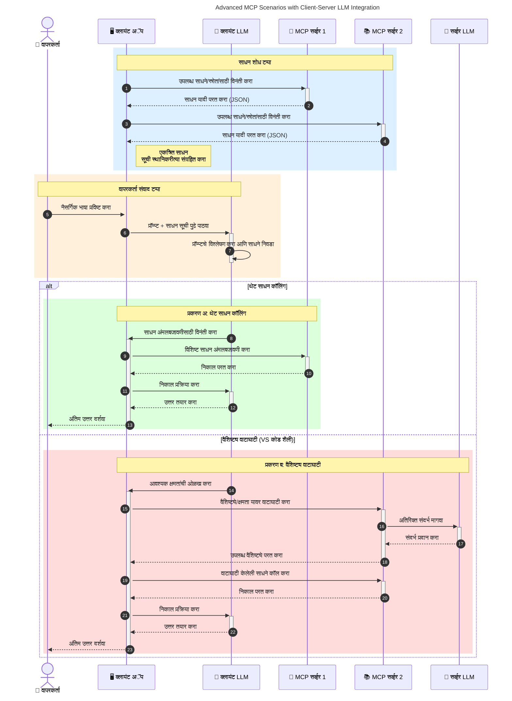

# मॉडेल कॉन्टेक्स्ट प्रोटोकॉल (MCP) परिचय: स्केलेबल AI अनुप्रयोगांसाठी याचा महत्त्व का आहे

[](https://youtu.be/agBbdiOPLQA)

_(या धड्याचा व्हिडिओ पाहण्यासाठी वरील प्रतिमा क्लिक करा)_

जनरेटिव AI अनुप्रयोग ही एक मोठी प्रगती आहे कारण ते वापरकर्त्याला नैसर्गिक भाषा इनपुट्स वापरून अनुप्रयोगाशी संवाद साधण्यास अनुमती देतात. तथापि, जेव्हा अशा अनुप्रयोगांमध्ये अधिक वेळ आणि संसाधने गुंतवली जातात, तेव्हा आपल्याला खात्री करायची असते की आपण कार्यक्षमतेने अशी वैशिष्ट्ये आणि संसाधने समाकलित करू शकता ज्यामुळे अनुप्रयोग वाढविणे सोपे होते, ज्यामुळे एकापेक्षा जास्त मॉडेल वापरता येतात, आणि विविध मॉडेलच्या गुंतागुंतांना हाताळता येतो. साध्या शब्दांत सांगायचे तर, जनरेटिव AI अनुप्रयोग तयार करणे सुरुवातीला सोपे असते, परंतु जेव्हा ते वाढतात आणि अधिक जटिल होतात, तेव्हा आपल्याला एक आर्किटेक्चर निश्चित करणे आवश्यक आहे आणि बहुधा आपल्या अनुप्रयोगांना सुसंगत पद्धतीने तयार करण्यासाठी एक मानकावर अवलंबून राहावे लागेल. इथेच MCP येते जे गोष्टी आयोजित करते आणि एक मानक पुरवते.

---

## **🔍 मॉडेल कॉन्टेक्स्ट प्रोटोकॉल (MCP) म्हणजे काय?**

**मॉडेल कॉन्टेक्स्ट प्रोटोकॉल (MCP)** हा एक **खुला, मानकीकृत इंटरफेस** आहे जो मोठ्या भाषा मॉडेल्स (LLMs) ना बाह्य टूल्स, API आणि डेटा स्रोतांसोबत सहज संवाद साधण्यास सक्षम करतो. तो प्रशिक्षण डेटाच्या पलीकडे AI मॉडेलच्या कार्यक्षमतेस प्रोत्साहन देण्यासाठी एक सुसंगत आर्किटेक्चर प्रदान करतो, ज्यामुळे अधिक शहाण्या, स्केलेबल आणि प्रतिसादक्षम AI सिस्टम्स शक्य होतात.

---

## **🎯 AI मध्ये मानकीकरण का महत्त्वाचे आहे**

जनरेटिव AI अनुप्रयोग जसं अधिक जटिल होतात, तसं **स्केलेबिलिटी, विस्तारक्षमता, देखभालयोग्यतेची,** आणि **वेंडर लॉक-इन टाळण्याची** खात्री करण्यासाठी मानक स्वीकारणे आवश्यक आहे. MCP या गरजा पूर्ण करतो:

- मॉडेल-टूल एकत्रीकरणांना एकसंध करणे
- तुटक, एकदाच वापरल्या जाणार्‍या सानुकूल उपाय कमी करणे
- वेगवेगळ्या विक्रेत्यांचे अनेक मॉडेल एका परिसंस्थेत coexist करण्याची परवानगी देणे

**टीप:** MCP स्वतःला एक खुला मानक म्हणून मांडतो, तरीही IEEE, IETF, W3C, ISO किंवा कोणत्याही इतर मानक संस्थेद्वारे MCP मानकीकृत करण्याचा कोणताही हेतू नाही.

---

## **📚 शिक्षण उद्दिष्टे**

या लेखाच्या शेवटी, आपण खालील गोष्टी करू शकाल:

- **मॉडेल कॉन्टेक्स्ट प्रोटोकॉल (MCP)** आणि त्याचे उपयोगसमजून घेणे
- MCP कसा मॉडेल-टूल संवाद मानकीकृत करतो हे समजून घेणे
- MCP आर्किटेक्चरच्या मुख्य घटकांची ओळख करणे
- एंटरप्राइझ आणि विकास संदर्भांमध्ये MCP चे प्रत्यक्ष अनुप्रयोग तपासणे

---

## **💡 मॉडेल कॉन्टेक्स्ट प्रोटोकॉल (MCP) का एक क्रांतिकारी बदल आहे**

### **🔗 MCP AI संवादांमधील तुटलेपणा दूर करतो**

MCP च्या आधी, मॉडेल्सना टूल्ससोबत जोडणे आवश्यक होते:

- टूल-मॉडेल प्रत्येक जोडसाठी सानुकूल कोड
- प्रत्येक विक्रेत्यासाठी गैर-मानकीकृत API
- अद्यतने झाल्याने वारंवार तुटणे
- अधिक टूल्स वाढविल्यास खराब स्केलेबिलिटी

### **✅ MCP मानकीकरणाचे फायदे**

| **फायदा**              | **वर्णन**                                                              |
|--------------------------|------------------------------------------------------------------------|
| अंतर्संचलनक्षमता        | LLMs विविध विक्रेत्यांच्या टूल्ससह सहज कार्य करतात                    |
| सातत्य                     | प्लॅटफॉर्म आणि टूल्समध्ये एकसारखे वर्तन                              |
| पुनर्वापरयोग्यता           | एकदा तयार केलेले टूल्स प्रकल्पांमध्ये आणि प्रणालींमध्ये वापरता येतात |
| विकास वेग वाढवणे          | मानकीकृत, प्लग-अँड-प्ले इंटरफेस वापरून विकास वेळ कमी करा              |

---

## **🧱 उच्च-स्तरीय MCP आर्किटेक्चर अभिप्रेती**

MCP एक **क्लायंट-सर्व्हर मॉडेल** वापरतो, जिथे:

- **MCP Hosts** AI मॉडेल्स चालवतात
- **MCP Clients** विनंत्या सुरू करतात
- **MCP Servers** संदर्भ, टूल्स, आणि क्षमता सेवा करतात

### **मुख्य घटक:**

- **संसाधने** – मॉडेलसाठी स्थिर किंवा डायनॅमिक डेटा  
- **प्रॉम्प्ट्स** – मार्गदर्शित जनरेशनसाठी पूर्वनिर्धारित कार्यप्रवाह  
- **टूल्स** – शोध, गणना यांसारखे कार्यान्वित फंक्शन्स  
- **नमुणाकरण** – पुनरावृत्ती संवादाद्वारे एजंटिक वर्तन (MCP `2026-07-28` मध्ये निष्प्रभावी; नवीन अंमलबजावणी थेट LLM पुरवठादारासोबत समाकलित कराव्यात)  
    

- **उत्तेजन** – वापरकर्त्याच्या इनपुटसाठी सर्व्हर-प्रचालित विनंत्या
- **रूट्स** – सर्व्हरसाठी संबंधित माहितीपर फाइलसिस्टम स्थान
    (MCP `2026-07-28` मध्ये निष्प्रभावी; टूल पॅरामीटर्स, संसाधन URI किंवा सर्व्हर कॉन्फिगरेशन प्राधान्य द्या)


### **प्रोटोकॉल आर्किटेक्चर:**

MCP दोन स्तरांचे आर्किटेक्चर वापरतो:
- **डेटा लेयर**: JSON-RPC 2.0 संदेश, प्रति-विनंती मेटाडेटा, शोध, आणि प्रोटोकॉल प्राथमिकतत्त्वे
- **ट्रान्सपोर्ट लेयर**: स्थानिक उपप्रक्रियांसाठी stdio आणि दूरस्थ सर्व्हरसाठी Streamable HTTP. Streamable HTTP स्ट्रीम केलेल्या प्रतिसादांसाठी SSE फ्रेमिंग वापरू शकतो, पण जुना HTTP+SSE ट्रान्सपोर्ट निष्प्रभावी झाला आहे.
    


    1. विनंती अंतिम वापरकर्ता किंवा त्यांच्या वतीने सॉफ्टवेअरने सुरू केली जाते.
    2. **MCP क्लायंट** ही विनंती एका **MCP होस्ट** कडे पाठवतो, जो AI मॉडेल रनटाइम व्यवस्थापित करतो.
    3. **AI मॉडेल** वापरकर्ता प्रॉम्प्ट प्राप्त करतो आणि एक किंवा अधिक टूल कॉल्सद्वारे बाह्य टूल्स किंवा डेटावर प्रवेश मागू शकतो.
    4. **MCP होस्ट**, मॉडेल स्वतः नाही, मानकीकृत प्रोटोकॉलचा वापर करून योग्य **MCP सर्व्हर(स)** सोबत संवाद साधतो.
- **MCP होस्ट कार्यक्षमता**:
    - **टूल रजिस्ट्री**: उपलब्ध टूल्स आणि त्यांच्या क्षमतांची सूची देखरेख करतो.
    - **प्रमाणीकरण**: टूल प्रवेशासाठी परवानग्या तपासतो.
    - **विनंती हॅंडलर**: मॉडेलकडून येणाऱ्या टूल विनंत्यांवर प्रक्रिया करतो.
    - **प्रतिसाद स्वरूपक**: मॉडेल समजेल अशा स्वरूपात टूल आउटपुट्सचे रचना करतो.
- **MCP सर्व्हर अंमलबजावणी**:
    - **MCP होस्ट** टूल कॉल्स एक किंवा अधिक **MCP सर्व्हर** कडे आणतो, जे विशेष कार्ये एक्सपोज करतात (उदा., शोध, गणना, डेटाबेस क्वेरीज).
    - **MCP सर्व्हर** आपले संबंधित ऑपरेशन करतात आणि निकाल एकसंध स्वरूपात **MCP होस्ट** कडे परत पाठवतात.
    - **MCP होस्ट** हे निकाल स्वरूपित करून **AI मॉडेल** कडे पाठवतो.
- **प्रतिसाद पूर्णता**:
    - **AI मॉडेल** टूल आउटपुट समाविष्ट करून अंतिम प्रतिसाद तयार करतो.
    - **MCP होस्ट** हा प्रतिसाद पुन्हा **MCP क्लायंट** कडे पाठवतो, जो तो अंतिम वापरकर्ता किंवा कॉल करणाऱ्या सॉफ्टवेअरला देतो.
    


```mermaid
---
title: MCP Architecture and Component Interactions
description: A diagram showing the flows of the components in MCP.
---
graph TD
    Client[MCP क्लायंट/अॅप्लिकेशन] -->|विनंती पाठवते| H[MCP होस्ट]
    H -->|कॉल करते| A[AI मॉडेल]
    A -->|टूल कॉल विनंती| H
    H -->|MCP Protocol| T1[MCP Server Tool 01: वेब शोध
    H -->|MCP Protocol| T2[MCP Server Tool 02: कॅलक्युलेटर टूल
    H -->|MCP Protocol| T3[MCP Server Tool 03: डेटाबेस प्रवेश टूल
    H -->|MCP Protocol| T4[MCP Server Tool 04: फाइल सिस्टम टूल
    H -->|प्रतिसाद पाठवते| Client

    subgraph "MCP होस्ट कंपोनेंट्स"
        H
        G[टूल नोंदणी]
        I[प्रमाणीकरण]
        J[विनंती हाताळणी]
        K[प्रतिसाद स्वरूपित करणे]
    end

    H <--> G
    H <--> I
    H <--> J
    H <--> K

    style A fill:#f9d5e5,stroke:#333,stroke-width:2px
    style H fill:#eeeeee,stroke:#333,stroke-width:2px
    style Client fill:#d5e8f9,stroke:#333,stroke-width:2px
    style G fill:#fffbe6,stroke:#333,stroke-width:1px
    style I fill:#fffbe6,stroke:#333,stroke-width:1px
    style J fill:#fffbe6,stroke:#333,stroke-width:1px
    style K fill:#fffbe6,stroke:#333,stroke-width:1px
    style T1 fill:#c2f0c2,stroke:#333,stroke-width:1px
    style T2 fill:#c2f0c2,stroke:#333,stroke-width:1px
    style T3 fill:#c2f0c2,stroke:#333,stroke-width:1px
    style T4 fill:#c2f0c2,stroke:#333,stroke-width:1px
```

## 👨‍💻 MCP सर्व्हर कसा बनवायचा (उदाहरणांसह)

MCP सर्व्हर आपल्याला LLM क्षमतांचा विस्तार प्रदान करतो, डेटा आणि कार्यक्षमता पुरवून.

प्रयत्न करण्यास तयार आहात? येथे विविध भाषा/स्टॅकसाठी सुलभ MCP सर्व्हर तयार करण्यासाठी SDKs आणि उदाहरणे आहेत:

- **Python SDK**: https://github.com/modelcontextprotocol/python-sdk

- **TypeScript SDK**: https://github.com/modelcontextprotocol/typescript-sdk

- **Java SDK**: https://github.com/modelcontextprotocol/java-sdk


- **C#/.NET SDK**: https://github.com/modelcontextprotocol/csharp-sdk


## 🌍 MCP साठी प्रत्यक्ष उपयोग प्रकरणे

MCP AI क्षमतांचा विस्तार करून विविध प्रकारच्या अर्जांना सक्षम करते:

| **अर्ज**                     | **वर्णन**                                                                        |
|------------------------------|---------------------------------------------------------------------------------|
| एंटरप्राइझ डेटा एकीकरण       | LLMs ला डेटाबेस, CRM, किंवा अंतर्गत साधनांसोबत कनेक्ट करा                      |
| एजेंटिक AI प्रणाली           | टूल ऍक्सेस आणि निर्णय-घेण्याच्या कार्यप्रवाहांसह स्वायत्त एजंट सक्षम करा          |
| मल्टी-मोडल अर्ज               | एकाच संयुक्त AI अॅपमध्ये मजकूर, प्रतिमा, आणि ऑडिओ टूल्स एकत्र करा                |
| वास्तविक वेळ डेटा एकीकरण    | अधिक अचूक, चालू आउटपुटसाठी AI संवादांमध्ये लाईव्ह डेटा आणा                      |


### 🧠 MCP = AI संवादांसाठी सार्वत्रिक मानक

मॉडेल कॉन्टेक्स्ट प्रोटोकॉल (MCP) AI संवादांसाठी एक सार्वत्रिक मानक म्हणून कार्य करते, जसे USB-C ने उपकरणांसाठी भौतिक कनेक्शन्सचे मानकीकरण केले आहे. AI च्या जगात, MCP एकसारखा इंटरफेस प्रदान करतो, ज्यामुळे मॉडेल्स (क्लायंट्स) सहजपणे बाह्य टूल्स आणि डेटा प्रदात्यांशी (सरव्हर्स) एकत्र होऊ शकतात. यामुळे प्रत्येक API किंवा डेटा स्रोतासाठी विविध, सानुकूल प्रोटोकॉलची गरज नाहीशी होते.

MCP अंतर्गत, MCP-सुसंगत साधन (MCP सर्व्हर म्हणून संबोधित) एकसारख्या मानकांचे पालन करते. हे सर्व्हर्स त्यांच्या साधनांची किंवा क्रियांची यादी देऊ शकतात आणि AI एजंटच्या विनंतीनुसार त्या क्रिया पार पाडू शकतात. MCP ला समर्थन करणाऱ्या AI एजंट प्लॅटफॉर्मना सर्व्हर्सकडून उपलब्ध साधन शोधण्याची आणि त्या या मानक प्रोटोकॉलद्वारे कॉल करण्याची क्षमता आहे.

### 💡 ज्ञान प्रवेश सुलभ करते

टूल्स ऑफर करण्याबरोबरच MCP ज्ञानाला प्रवेश सुलभ करते. हे अ‍ॅप्लिकेशन्सना मोठ्या भाषिक मॉडेल्स (LLMs) साठी संदर्भ प्रदान करण्यास सक्षम बनवते ज्याद्वारे ते विविध डेटा स्रोतांशी जोडले जातात. उदाहरणार्थ, एक MCP सर्व्हर कंपनीच्या दस्तऐवजांच्या संग्रहाचे प्रतिनिधित्व करू शकतो, ज्यामुळे एजंट्स आवश्यक तेव्हा संबंधित माहिती प्राप्त करू शकतात. आणखी एक सर्व्हर विशिष्ट क्रिया हाताळू शकतो जसे की ईमेल पाठवणे किंवा नोंदी अद्यतनित करणे. एजंटच्या दृष्टीने, हे फक्त साधन आहेत – काही साधने डेटा (ज्ञान संदर्भ) परत करतात, तर काही क्रिया पार पाडतात. MCP दोन्हींचे कार्यक्षम व्यवस्थापन करते.

एका एजंटने एका MCP सर्व्हरशी जोडल्यावर त्या सर्व्हरच्या उपलब्ध क्षमतांची आणि प्रवेशयोग्य डेटाची माहिती एकसारख्या स्वरूपात आपोआप शिकते. हे मानकीकरण डायनॅमिक टूल उपलब्धतेला सक्षम करते. उदाहरणार्थ, एका नवीन MCP सर्व्हरला एजंटच्या प्रणालीमध्ये जोडल्यावर त्याचे कार्य तत्काळ वापरता येतात, एजंटच्या सूचना बदलण्याची गरज न पडता.

ही सुलभ समाकलन पुढील आकृतीत दर्शविल्याप्रमाणे आहे, जिथे सर्व्हर्स साधने आणि ज्ञान दोन्ही पुरवतात, जाहिर प्रणालींमध्ये अखंड सहकार्य सुनिश्चित करते. 

### 👉 उदाहरण: स्केल करण्यायोग्य एजंट सोल्युशन

```mermaid
---
title: Scalable Agent Solution with MCP
description: A diagram illustrating how a user interacts with an LLM that connects to multiple MCP servers, with each server providing both knowledge and tools, creating a scalable AI system architecture
---
graph TD
    User -->|प्रॉम्प्ट| LLM
    LLM -->|प्रतिसाद| User
    LLM -->|एमसीपी| ServerA
    LLM -->|एमसीपी| ServerB
    ServerA -->|सर्वसाधारण कनेक्टर| ServerB
    ServerA --> KnowledgeA
    ServerA --> ToolsA
    ServerB --> KnowledgeB
    ServerB --> ToolsB

    subgraph सर्व्हर A
        KnowledgeA[ज्ञान]
        ToolsA[उपकरणे]
    end

    subgraph सर्व्हर B
        KnowledgeB[ज्ञान]
        ToolsB[उपकरणे]
    end
```
यूनिव्हर्सल कनेक्टर MCP सर्व्हर्सना एकमेकांशी संवाद साधण्याची आणि क्षमतांची देवाणघेवाण करण्याची परवानगी देते, ज्यामुळे ServerA, ServerB कडे कार्ये सुपूर्द करू शकतो किंवा त्याचे टूल्स आणि ज्ञान वापरू शकतो. हे साधने आणि डेटा सर्व्हर्समध्ये वितरित करतात, ज्यामुळे स्केल करण्यायोग्य आणि मॉड्यूलर एजंट आर्किटेक्चर्स शक्य होतात. MCP ने टूल एक्सपोजर मानकीकृत केल्यामुळे, एजंट्स सर्व्हर्समधील विनंत्या डायनॅमिकली शोधू आणि राउट करू शकतात, यासाठी हार्डकोडेड समाकलने आवश्यक नाहीत.


टूल आणि ज्ञान फेडरेशन: साधने आणि डेटाचा प्रवेश सर्व्हर्समध्ये होऊ शकतो, ज्यामुळे अधिक स्केलेबल आणि मॉड्यूलर एजंटिक आर्किटेक्चर्स शक्य होतात.

### 🔄 क्लायंट-साइड LLM समाकलनसह प्रगत MCP परिस्थिती

मूलभूत MCP आर्किटेक्चर पलीकडे, अशा प्रगत परिस्थिती आहेत जिथे क्लायंट आणि सर्व्हर दोघांकडे LLMs असतात, ज्यामुळे अधिक सूक्ष्म संवाद शक्य होतात. पुढील आकृतीमध्ये, **क्लायंट अॅप** हे एक IDE असू शकते ज्यात LLM द्वारे वापरासाठी अनेक MCP साधने उपलब्ध असतील:



## 🔐 MCP चे व्यावहारिक फायदे

येथे MCP वापरण्याचे व्यावहारिक फायदे दिले आहेत:

- **ताजेपणा**: मॉडेल्सना त्यांच्या प्रशिक्षण डेटेपलीकडे अद्ययावत माहिती मिळू शकते
- **क्षमता विस्तार**: मॉडेल्स अनुत्पादित कामांसाठी विशेष टूल्स वापरू शकतात
- **हॅलुसिनेशन कमी**: बाह्य डेटा स्रोत वास्तवगत आधार पुरवतात
- **गोपनीयता**: संवेदनशील डेटा प्रॉम्प्ट्समध्ये एम्बेड न करता सुरक्षित वातावरणात राहू शकतो

## 📌 मुख्य मुद्दे

MCP वापरण्याचे मुख्य मुद्दे:

- **MCP** AI मॉडेल्सना टूल्स आणि डेटाशी संवाद साधण्याचा मानकीकृत मार्ग प्रदान करते
- **विस्तारयोग्यता, सातत्य आणि आंतरसंवादिता** वाढवते
- MCP विकास वेळ कमी करायला, विश्वसनीयता सुधारायला, आणि मॉडेल क्षमतांचा विस्तार करायला मदत करते
- क्लायंट-सर्व्हर आर्किटेक्चर **लवचिक, विस्तृत AI अॅप्लिकेशन्सची अनुमती देते**

## 🧠 व्यायाम

तुम्ही तयार करणार्या AI अॅप्लिकेशनबद्दल विचार करा.

- कोणती **बाह्य साधने किंवा डेटा** त्याच्या क्षमतांना वाढवू शकतात?
- MCP कसे समाकलन **सोपं आणि अधिक विश्वासार्ह** करू शकतो?

## अतिरिक्त संसाधने

- [MCP GitHub Repository](https://github.com/modelcontextprotocol)


## पुढील काय

पुढे: [Chapter 1: Core Concepts](../01-CoreConcepts/README.md)

---

<!-- CO-OP TRANSLATOR DISCLAIMER START -->
**अस्वीकरण**:
हा दस्तऐवज AI भाषांतर सेवा [Co-op Translator](https://github.com/Azure/co-op-translator) चा वापर करून अनुवादित केला आहे. जरी आम्ही अचूकतेसाठी प्रयत्न करतो, तरी कृपया लक्षात घ्या की स्वयंचलित भाषांतरांमध्ये त्रुटी किंवा अचूकतेची कमतरता असू शकते. मूळ दस्तऐवज त्याच्या मूळ भाषेत अधिकृत स्रोत मानला पाहिजे. महत्त्वाची माहिती असल्यास, व्यावसायिक मानवी भाषांतराची शिफारस केली जाते. या भाषांतराच्या वापरामुळे उद्भवणाऱ्या कोणत्याही गैरसमज किंवा चुकीच्या अर्थलावणीसाठी आम्ही जबाबदार नाही.
<!-- CO-OP TRANSLATOR DISCLAIMER END -->