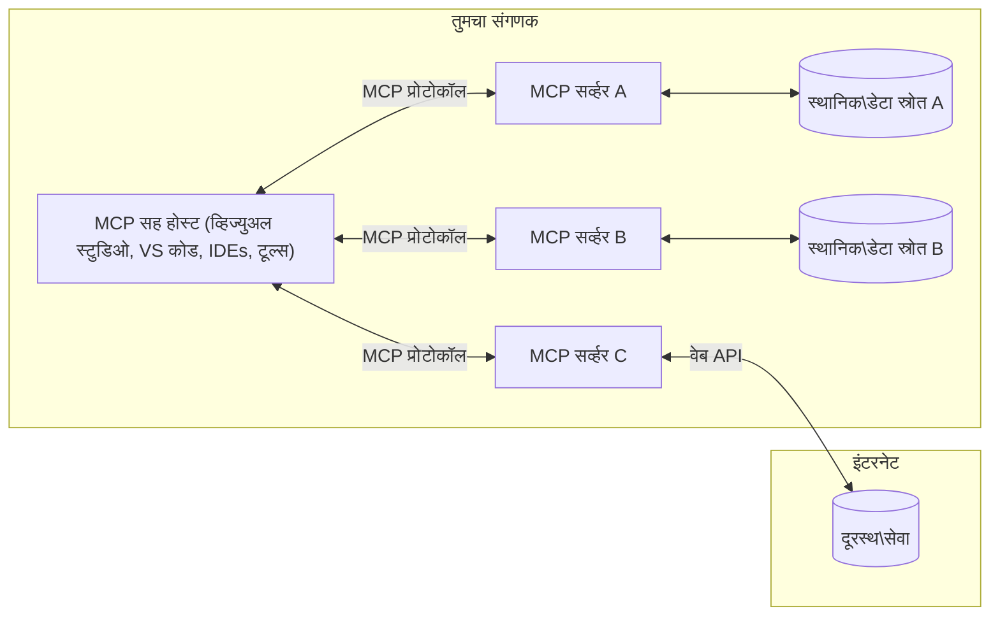

# MCP कोर संकल्पना: AI एकत्रीकरणासाठी मॉडेल संदर्भ प्रोटोकॉलमध्ये पारंगत होणे

[](https://youtu.be/earDzWGtE84)

_(या धड्याचा व्हिडिओ पाहण्यासाठी वरील प्रतिमा क्लिक करा)_

[Model Context Protocol (MCP)](https://github.com/modelcontextprotocol) हा एक शक्तिशाली, मानकीकृत फ्रेमवर्क आहे जो मोठ्या भाषा मॉडेल्स (LLMs) आणि बाह्य साधने, अनुप्रयोग, आणि डेटा स्रोत यांच्यातील संवाद ऑप्टिमाइझ करतो.  
हा मार्गदर्शक तुम्हाला MCP च्या कोर संकल्पनांमधून घेऊन जाईल. तुम्हाला त्याच्या क्लायंट-सर्व्हर आर्किटेक्चर, आवश्यक घटक, संवाद यंत्रणा, आणि अंमलबजावणीच्या सर्वोत्तम पद्धतींबद्दल शिकायला मिळेल.

- **स्पष्ट वापरकर्ता संमती**: सर्व डेटा प्रवेश आणि ऑपरेशन्ससाठी अंमलबजावणीपूर्वी स्पष्ट वापरकर्ता मंजुरी आवश्यक आहे. वापरकर्त्यांनी स्पष्टपणे समजून घ्यावे की कोणता डेटा प्रवेश केला जाईल आणि कोणती क्रिया केली जाईल, तसेच परवानग्या आणि अधिकृतता यावर सूक्ष्म नियंत्रण असावे.

- **डेटा गोपनीयता संरक्षण**: वापरकर्त्याचा डेटा फक्त स्पष्ट संमतीनेच उघड केला जातो आणि संपूर्ण संवाद कालावधीत मजबूत प्रवेश नियंत्रणांनी संरक्षित केला पाहिजे. अंमलबजावणीने अनधिकृत डेटा प्रसारण टाळले पाहिजे आणि कडक गोपनीयता सीमा राखल्या पाहिजेत.

- **साधन अंमलबजावणी सुरक्षितता**: प्रत्येक साधन कॉलसाठी स्पष्ट वापरकर्ता संमती आवश्यक आहे ज्यात साधनाची कार्यक्षमता, पॅरामीटर्स, आणि संभाव्य परिणाम यांची स्पष्ट समज असावी. मजबूत सुरक्षा सीमा अनपेक्षित, असुरक्षित, किंवा दुष्ट साधन अंमलबजावणी टाळतात.

- **ट्रान्सपोर्ट लेयर सुरक्षा**: सर्व संवाद चॅनेल योग्य एन्क्रिप्शन आणि प्रमाणीकरण यंत्रणा वापराव्यात. रिमोट कनेक्शन्ससाठी सुरक्षित ट्रान्सपोर्ट प्रोटोकॉल आणि योग्य क्रेडेन्शियल व्यवस्थापन लागू करावे.

#### अंमलबजावणी मार्गदर्शक तत्त्वे:

- **परवानगी व्यवस्थापन**: वापरकर्त्यांना कोणते सर्व्हर, साधने, आणि संसाधने प्रवेशयोग्य आहेत हे नियंत्रित करण्यासाठी सूक्ष्म परवानगी प्रणाली लागू करा  
- **प्रमाणीकरण आणि अधिकृतता**: सुरक्षित प्रमाणीकरण पद्धती (OAuth, API कीज) वापरा, योग्य टोकन व्यवस्थापन आणि कालबाह्यता सह  
- **इनपुट पडताळणी**: सर्व पॅरामीटर्स आणि डेटा इनपुट्स परिभाषित स्कीमांनुसार पडताळा, इंजेक्शन हल्ले टाळण्यासाठी  
- **ऑडिट लॉगिंग**: सुरक्षा निरीक्षण आणि अनुपालनासाठी सर्व ऑपरेशन्सचे सविस्तर लॉग ठेवा

## आढावा

हा धडा Model Context Protocol (MCP) पर्यावरणातील मूलभूत आर्किटेक्चर आणि घटकांचा अभ्यास करतो. तुम्हाला क्लायंट-सर्व्हर आर्किटेक्चर, मुख्य घटक, आणि संवाद यंत्रणा याबद्दल शिकायला मिळेल ज्यामुळे MCP संवाद शक्य होतात.

## मुख्य शिक्षण उद्दिष्टे

या धड्याच्या शेवटी, तुम्ही:

- MCP क्लायंट-सर्व्हर आर्किटेक्चर समजून घ्याल.  
- Hosts, Clients, आणि Servers यांच्या भूमिका आणि जबाबदाऱ्या ओळखाल.  
- MCP ला लवचिक एकत्रीकरण स्तर बनवणाऱ्या मुख्य वैशिष्ट्यांचे विश्लेषण कराल.  
- MCP पर्यावरणातील माहिती कशी वाहते हे शिकाल.  
- .NET, Java, Python, आणि JavaScript मधील कोड उदाहरणांद्वारे व्यावहारिक अंतर्दृष्टी मिळवाल.

## MCP आर्किटेक्चर: सखोल पाहणी

MCP पर्यावरण क्लायंट-सर्व्हर मॉडेलवर आधारित आहे. हा मॉड्युलर स्ट्रक्चर AI अनुप्रयोगांना साधने, डेटाबेस, API, आणि संदर्भ संसाधनांसह कार्यक्षमपणे संवाद साधण्याची परवानगी देतो. चला या आर्किटेक्चरचे मुख्य घटक पाहूया.

MCP चा मूळ भाग क्लायंट-सर्व्हर आर्किटेक्चर आहे जिथे होस्ट अनुप्रयोग अनेक सर्व्हरशी कनेक्ट होऊ शकतो:


- **MCP Hosts**: VSCode, Claude Desktop, IDEs, किंवा AI साधने जी MCP द्वारे डेटा प्रवेश करू इच्छितात  
- **MCP Clients**: प्रोटोकॉल क्लायंट जे सर्व्हरशी 1:1 कनेक्शन राखतात  
- **MCP Servers**: हलक्या वजनाचे प्रोग्राम जे प्रत्येकाने मानकीकृत Model Context Protocol द्वारे विशिष्ट क्षमता उघड करतात  
- **स्थानिक डेटा स्रोत**: तुमच्या संगणकातील फाइल्स, डेटाबेस, आणि सेवा ज्या MCP सर्व्हर सुरक्षितपणे प्रवेश करू शकतात  
- **रिमोट सेवा**: इंटरनेटवर उपलब्ध बाह्य प्रणाली ज्या MCP सर्व्हर API द्वारे कनेक्ट होऊ शकतात.

MCP प्रोटोकॉल हा एक विकसित होणारा मानक आहे जो दिनांक-आधारित आवृत्तीकरण (YYYY-MM-DD फॉरमॅट) वापरतो. सध्याची प्रोटोकॉल आवृत्ती **2025-11-25** आहे. तुम्ही [प्रोटोकॉल तपशील](https://modelcontextprotocol.io/specification/2025-11-25/) मधील नवीनतम अद्यतने पाहू शकता.

### 1. Hosts

Model Context Protocol (MCP) मध्ये, **Hosts** हे AI अनुप्रयोग आहेत जे वापरकर्त्यांना प्रोटोकॉलशी संवाद साधण्यासाठी प्राथमिक इंटरफेस म्हणून काम करतात. Hosts अनेक MCP सर्व्हरशी कनेक्शन व्यवस्थापित करतात आणि प्रत्येक सर्व्हर कनेक्शनसाठी समर्पित MCP क्लायंट तयार करतात. Hosts चे उदाहरणे:

- **AI अनुप्रयोग**: Claude Desktop, Visual Studio Code, Claude Code  
- **विकास पर्यावरण**: IDEs आणि कोड एडिटर्स ज्यात MCP एकत्रीकरण आहे  
- **सानुकूल अनुप्रयोग**: उद्दिष्ट-निर्मित AI एजंट्स आणि साधने

**Hosts** हे AI मॉडेल संवादांचे समन्वयक अनुप्रयोग आहेत. ते:

- **AI मॉडेल्सचे समन्वय करतात**: LLMs चालवतात किंवा संवाद साधतात, प्रतिसाद तयार करतात आणि AI वर्कफ्लो समन्वयित करतात  
- **क्लायंट कनेक्शन्स व्यवस्थापित करतात**: प्रत्येक MCP सर्व्हर कनेक्शनसाठी एक MCP क्लायंट तयार आणि राखतात  
- **वापरकर्ता इंटरफेस नियंत्रित करतात**: संभाषण प्रवाह, वापरकर्ता संवाद, आणि प्रतिसाद सादरीकरण हाताळतात  
- **सुरक्षा अंमलबजावणी करतात**: परवानग्या, सुरक्षा निर्बंध, आणि प्रमाणीकरण नियंत्रित करतात  
- **वापरकर्ता संमती हाताळतात**: डेटा शेअरिंग आणि साधन अंमलबजावणीसाठी वापरकर्ता मंजुरी व्यवस्थापित करतात

### 2. Clients

**Clients** हे आवश्यक घटक आहेत जे Hosts आणि MCP सर्व्हर यांच्यात समर्पित एक-ते-एक कनेक्शन राखतात. प्रत्येक MCP क्लायंट Host द्वारे विशिष्ट MCP सर्व्हरशी कनेक्ट होण्यासाठी तयार केला जातो, ज्यामुळे संघटित आणि सुरक्षित संवाद चॅनेल सुनिश्चित होतात. अनेक क्लायंट्स Hosts ला एकाच वेळी अनेक सर्व्हरशी कनेक्ट होण्याची परवानगी देतात.

**Clients** हे होस्ट अनुप्रयोगातील कनेक्टर घटक आहेत. ते:

- **प्रोटोकॉल संवाद**: JSON-RPC 2.0 विनंत्या सर्व्हरकडे पाठवतात ज्यात प्रॉम्प्ट्स आणि सूचना असतात  
- **क्षमता वाटाघाटी**: प्रारंभिक टप्प्यात सर्व्हरशी समर्थित वैशिष्ट्ये आणि प्रोटोकॉल आवृत्त्यांवर वाटाघाटी करतात  
- **साधन अंमलबजावणी**: मॉडेल्सकडून साधन अंमलबजावणी विनंत्या व्यवस्थापित करतात आणि प्रतिसाद प्रक्रिया करतात  
- **रिअल-टाइम अपडेट्स**: सर्व्हरकडून सूचना आणि रिअल-टाइम अपडेट्स हाताळतात  
- **प्रतिसाद प्रक्रिया**: वापरकर्त्यांसाठी सादर करण्यासाठी सर्व्हर प्रतिसाद प्रक्रिया आणि स्वरूपित करतात

### 3. Servers

**Servers** हे प्रोग्राम आहेत जे MCP क्लायंट्सना संदर्भ, साधने, आणि क्षमता पुरवतात. ते स्थानिक (होस्टसारख्या मशीनवर) किंवा रिमोट (बाह्य प्लॅटफॉर्मवर) चालू शकतात, आणि क्लायंट विनंत्या हाताळण्याची आणि संरचित प्रतिसाद देण्याची जबाबदारी घेतात. सर्व्हर मानकीकृत Model Context Protocol द्वारे विशिष्ट कार्यक्षमता उघड करतात.

**Servers** हे सेवा आहेत जे संदर्भ आणि क्षमता पुरवतात. ते:

- **वैशिष्ट्य नोंदणी**: क्लायंट्ससाठी उपलब्ध प्रिमिटिव्ह (संसाधने, प्रॉम्प्ट्स, साधने) नोंदणी करतात आणि उघड करतात  
- **विनंती प्रक्रिया**: क्लायंट्सकडून साधन कॉल, संसाधन विनंत्या, आणि प्रॉम्प्ट विनंत्या प्राप्त करतात आणि अंमलबजावणी करतात  
- **संदर्भ पुरवठा**: मॉडेल प्रतिसाद सुधारण्यासाठी संदर्भात्मक माहिती आणि डेटा पुरवतात  
- **स्थिती व्यवस्थापन**: सत्र स्थिती राखतात आणि आवश्यकतेनुसार स्थितीपूर्ण संवाद हाताळतात  
- **रिअल-टाइम सूचना**: क्षमता बदल आणि अद्यतने याबाबत कनेक्टेड क्लायंट्सना सूचना पाठवतात

सर्व्हर कोणत्याही व्यक्तीने विकसित करू शकतात जे मॉडेल क्षमतांना विशेष कार्यक्षमता देण्यासाठी विस्तारतात, आणि ते स्थानिक तसेच रिमोट तैनाती परिस्थितींसाठी समर्थन करतात.

### 4. Server Primitives

Model Context Protocol (MCP) मधील सर्व्हर तीन मुख्य **प्रिमिटिव्ह** पुरवतात जे क्लायंट्स, होस्ट्स, आणि भाषा मॉडेल्स यांच्यातील समृद्ध संवादासाठी मूलभूत बांधकाम ब्लॉक्स परिभाषित करतात. हे प्रिमिटिव्ह प्रोटोकॉलद्वारे उपलब्ध संदर्भात्मक माहिती आणि क्रिया प्रकार निर्दिष्ट करतात.

MCP सर्व्हर खालील तीन मुख्य प्रिमिटिव्ह कोणत्याही संयोजनात उघड करू शकतात:

#### Resources 

**Resources** म्हणजे डेटा स्रोत जे AI अनुप्रयोगांना संदर्भात्मक माहिती पुरवतात. ते स्थिर किंवा गतिशील सामग्रीचे प्रतिनिधित्व करतात जी मॉडेल समज आणि निर्णय घेण्यास सुधारणा करतात:

- **संदर्भात्मक डेटा**: AI मॉडेल वापरासाठी संरचित माहिती आणि संदर्भ  
- **ज्ञान भांडार**: दस्तऐवज संच, लेख, मॅन्युअल्स, आणि संशोधन पेपर्स  
- **स्थानिक डेटा स्रोत**: फाइल्स, डेटाबेस, आणि स्थानिक प्रणाली माहिती  
- **बाह्य डेटा**: API प्रतिसाद, वेब सेवा, आणि रिमोट प्रणाली डेटा  
- **गतिशील सामग्री**: बाह्य परिस्थितीनुसार अद्ययावत होणारा रिअल-टाइम डेटा

Resources URI द्वारे ओळखले जातात आणि `resources/list` द्वारे शोधले जाऊ शकतात तसेच `resources/read` पद्धतीने प्राप्त केले जाऊ शकतात:

```text
file://documents/project-spec.md
database://production/users/schema
api://weather/current
```

#### Prompts

**Prompts** हे पुनर्वापरयोग्य टेम्प्लेट्स आहेत जे भाषा मॉडेल्सशी संवाद रचनेत मदत करतात. ते मानकीकृत संवाद नमुने आणि टेम्प्लेटेड वर्कफ्लो पुरवतात:

- **टेम्प्लेट-आधारित संवाद**: पूर्वरचित संदेश आणि संभाषण प्रारंभ  
- **वर्कफ्लो टेम्प्लेट्स**: सामान्य कार्ये आणि संवादांसाठी मानकीकृत अनुक्रम  
- **फ्यू-शॉट उदाहरणे**: मॉडेल सूचनेसाठी उदाहरण-आधारित टेम्प्लेट्स  
- **सिस्टम प्रॉम्प्ट्स**: मॉडेल वर्तन आणि संदर्भ परिभाषित करणारे मूलभूत प्रॉम्प्ट्स  
- **गतिशील टेम्प्लेट्स**: विशिष्ट संदर्भानुसार अनुकूलित पॅरामीटरयुक्त प्रॉम्प्ट्स

Prompts व्हेरिएबल सबस्टिट्यूशनला समर्थन देतात आणि `prompts/list` द्वारे शोधले जाऊ शकतात तसेच `prompts/get` द्वारे प्राप्त केले जाऊ शकतात:

```markdown
Generate a {{task_type}} for {{product}} targeting {{audience}} with the following requirements: {{requirements}}
```

#### Tools

**Tools** म्हणजे अंमलबजावणीयोग्य फंक्शन्स जे AI मॉडेल्स विशिष्ट क्रिया करण्यासाठी कॉल करू शकतात. ते MCP पर्यावरणातील "क्रियापद" आहेत, जे मॉडेल्सना बाह्य प्रणालींसह संवाद साधण्यास सक्षम करतात:

- **अंमलबजावणीयोग्य फंक्शन्स**: विशिष्ट पॅरामीटर्ससह मॉडेल्स कॉल करू शकणाऱ्या स्वतंत्र ऑपरेशन्स  
- **बाह्य प्रणाली एकत्रीकरण**: API कॉल्स, डेटाबेस क्वेरीज, फाइल ऑपरेशन्स, गणना  
- **अद्वितीय ओळख**: प्रत्येक साधनाचे वेगळे नाव, वर्णन, आणि पॅरामीटर स्कीमा असते  
- **संरचित I/O**: साधने पडताळलेले पॅरामीटर्स स्वीकारतात आणि संरचित, टाइप केलेले प्रतिसाद परत करतात  
- **क्रिया क्षमता**: मॉडेल्सना वास्तविक जगातील क्रिया करण्यास आणि थेट डेटा मिळवण्यास सक्षम करतात

Tools JSON Schema सह पॅरामीटर पडताळणीसाठी परिभाषित केले जातात आणि `tools/list` द्वारे शोधले जातात तसेच `tools/call` द्वारे अंमलात आणले जातात:

```typescript
server.tool(
  "search_products", 
  {
    query: z.string().describe("Search query for products"),
    category: z.string().optional().describe("Product category filter"),
    max_results: z.number().default(10).describe("Maximum results to return")
  }, 
  async (params) => {
    // शोध कार्यान्वित करा आणि संरचित निकाल परत करा
    return await productService.search(params);
  }
);
```

## Client Primitives

Model Context Protocol (MCP) मध्ये, **clients** असे प्रिमिटिव्ह उघड करू शकतात जे सर्व्हरना होस्ट अनुप्रयोगाकडून अतिरिक्त क्षमता विनंती करण्यास परवानगी देतात. हे क्लायंट-साइड प्रिमिटिव्ह अधिक समृद्ध, संवादात्मक सर्व्हर अंमलबजावणीसाठी परवानगी देतात जे AI मॉडेल क्षमता आणि वापरकर्ता संवादांपर्यंत प्रवेश करू शकतात.

### Sampling

**Sampling** सर्व्हरना क्लायंटच्या AI अनुप्रयोगाकडून भाषा मॉडेल पूर्णता विनंती करण्याची परवानगी देते. हे प्रिमिटिव्ह सर्व्हरना स्वतःचे मॉडेल अवलंबित्व न ठेवता LLM क्षमता वापरण्याची परवानगी देते:

- **मॉडेल-स्वतंत्र प्रवेश**: सर्व्हर LLM SDK समाविष्ट न करता पूर्णता विनंती करू शकतात  
- **सर्व्हर-प्रेरित AI**: सर्व्हरना क्लायंटच्या AI मॉडेलचा वापर करून स्वायत्तपणे सामग्री तयार करण्याची परवानगी देते  
- **पुनरावृत्ती LLM संवाद**: जटिल परिस्थितींसाठी समर्थन जेथे सर्व्हरना AI मदत आवश्यक आहे  
- **गतिशील सामग्री निर्मिती**: होस्टच्या मॉडेलचा वापर करून संदर्भात्मक प्रतिसाद तयार करण्याची परवानगी देते

Sampling `sampling/complete` पद्धतीद्वारे सुरू होते, जिथे सर्व्हर क्लायंटला पूर्णता विनंत्या पाठवतात.

### Elicitation  

**Elicitation** सर्व्हरना क्लायंट इंटरफेसद्वारे वापरकर्त्यांकडून अतिरिक्त माहिती किंवा पुष्टी मागण्याची परवानगी देते:

- **वापरकर्ता इनपुट विनंत्या**: साधन अंमलबजावणीसाठी आवश्यक अतिरिक्त माहिती मागणे  
- **पुष्टी संवाद**: संवेदनशील किंवा परिणामकारक ऑपरेशन्ससाठी वापरकर्ता मंजुरी मागणे  
- **संवादात्मक वर्कफ्लो**: टप्प्याटप्प्याने वापरकर्ता संवाद तयार करण्यास सक्षम करणे  
- **गतिशील पॅरामीटर संकलन**: साधन अंमलबजावणी दरम्यान गहाळ किंवा ऐच्छिक पॅरामीटर्स गोळा करणे

Elicitation विनंत्या `elicitation/request` पद्धतीने क्लायंटच्या इंटरफेसद्वारे वापरकर्ता इनपुट गोळा करण्यासाठी केल्या जातात.

### Logging

**Logging** सर्व्हरना क्लायंटला संरचित लॉग संदेश पाठवण्याची परवानगी देते जे डिबगिंग, निरीक्षण, आणि ऑपरेशनल दृश्यमानतेसाठी उपयुक्त आहेत:

- **डिबगिंग समर्थन**: समस्या सोडवण्यासाठी तपशीलवार अंमलबजावणी लॉग पुरवणे  
- **ऑपरेशनल निरीक्षण**: क्लायंटला स्थिती अद्यतने आणि कार्यक्षमता मेट्रिक्स पाठवणे  
- **त्रुटी अहवाल**: तपशीलवार त्रुटी संदर्भ आणि निदान माहिती पुरवणे  
- **ऑडिट ट्रेल्स**: सर्व्हर ऑपरेशन्स आणि निर्णयांचे सविस्तर लॉग तयार करणे

Logging संदेश सर्व्हर ऑपरेशन्समध्ये पारदर्शकता आणि डिबगिंग सुलभ करण्यासाठी क्लायंटला पाठवले जातात.

## MCP मधील माहिती प्रवाह

Model Context Protocol (MCP) होस्ट्स, क्लायंट्स, सर्व्हर्स, आणि मॉडेल्स यांच्यातील माहितीचा संरचित प्रवाह परिभाषित करतो. हा प्रवाह समजून घेणे वापरकर्ता विनंत्या कशा प्रक्रिया केल्या जातात आणि बाह्य साधने व डेटा स्रोत कसे मॉडेल प्रतिसादांमध्ये समाकलित होतात हे स्पष्ट करते.

- **होस्ट कनेक्शन सुरू करतो**  
  होस्ट अनुप्रयोग (जसे IDE किंवा चॅट इंटरफेस) सामान्यतः STDIO, WebSocket, किंवा इतर समर्थित ट्रान्सपोर्टद्वारे MCP सर्व्हरशी कनेक्शन स्थापन करतो.

- **क्षमता वाटाघाटी**  
  क्लायंट (होस्टमध्ये एम्बेड केलेले) आणि सर्व्हर त्यांच्या समर्थित वैशिष्ट्ये, साधने, संसाधने, आणि प्रोटोकॉल आवृत्त्यांबाबत माहिती देवाणघेवाण करतात. यामुळे दोन्ही बाजूंना सत्रासाठी उपलब्ध क्षमता समजतात.

- **वापरकर्ता विनंती**  
  वापरकर्ता होस्टशी संवाद साधतो (उदा. प्रॉम्प्ट किंवा कमांड टाकतो). होस्ट हा इनपुट गोळा करून क्लायंटकडे प्रक्रिया करण्यासाठी पाठवतो.

- **संसाधन किंवा साधन वापर**  
  - क्लायंट सर्व्हरकडून अतिरिक्त संदर्भ किंवा संसाधने (जसे फाइल्स, डेटाबेस नोंदी, किंवा ज्ञान भांडार लेख) मागू शकतो जेणेकरून मॉडेलची समज सुधारेल.  
  - जर मॉडेलने ठरवले की साधन आवश्यक आहे (उदा. डेटा मिळवण्यासाठी, गणना करण्यासाठी, किंवा API कॉल करण्यासाठी), क्लायंट साधन कॉल विनंती सर्व्हरकडे पाठवतो, ज्यात साधनाचे नाव आणि पॅरामीटर्स असतात.

- **सर्व्हर अंमलबजावणी**  
  सर्व्हर संसाधन किंवा साधन विनंती प्राप्त करतो, आवश्यक ऑपरेशन्स (उदा. फंक्शन चालवणे, डेटाबेस क्वेरी करणे, फाइल मिळवणे) अंमलात आणतो, आणि संरचित स्वरूपात निकाल क्लायंटकडे परत पाठवतो.

- **प्रतिसाद निर्मिती**  
  क्लायंट सर्व्हरचे प्रतिसाद (संसाधन डेटा, साधन आउटपुट इ.) चालू मॉडेल संवादात समाकलित करतो. मॉडेल या माहितीचा वापर करून व्यापक आणि संदर्भानुसार सुसंगत प्रतिसाद तयार करतो.

- **निकाल सादरीकरण**  
  होस्ट क्लायंटकडून अंतिम आउटपुट प्राप्त करतो आणि वापरकर्त्यास सादर करतो, ज्यामध्ये सहसा मॉडेलने तयार केलेला मजकूर आणि साधन अंमलबजावणी किंवा संसाधन शोध यांचे निकाल असतात.

हा प्रवाह MCP ला प्रगत, संवादात्मक, आणि संदर्भ-जाणणाऱ्या AI अनुप्रयोगांना समर्थन देण्यास सक्षम करतो ज्यामुळे मॉडेल्स सहजपणे बाह्य साधने आणि डेटा स्रोतांशी जोडले जातात.

## प्रोटोकॉल आर्किटेक्चर आणि स्तर

MCP दोन वेगळ्या आर्किटेक्चरल स्तरांपासून बनलेला आहे जे एकत्र काम करून संपूर्ण संवाद फ्रेमवर्क पुरवतो:

### डेटा स्तर

**डेटा स्तर** मुख्य MCP प्रोटोकॉल अंमलात आणतो ज्यासाठी **JSON-RPC 2.0** हे त्याचे मूलभूत तत्त्व आहे. हा स्तर संदेश संरचना, अर्थशास्त्र, आणि संवाद नमुने परिभाषित करतो:

#### मुख्य घटक:

- **JSON-RPC 2.0 प्रोटोकॉल**: सर्व संवाद पद्धत कॉल, प्रतिसाद, आणि सूचनांसाठी मानकीकृत JSON-RPC 2.0 संदेश स्वरूप वापरतो
- **जीवनचक्र व्यवस्थापन**: क्लायंट आणि सर्व्हर दरम्यान कनेक्शन प्रारंभ, क्षमता वाटाघाटी, आणि सत्र समाप्ती हाताळते
- **सर्व्हर प्रिमिटिव्ह्स**: सर्व्हरना साधने, संसाधने, आणि प्रॉम्प्ट्सद्वारे मुख्य कार्यक्षमता प्रदान करण्यास सक्षम करते
- **क्लायंट प्रिमिटिव्ह्स**: सर्व्हरना LLM कडून सॅम्पलिंगची विनंती करण्यास, वापरकर्त्याचा इनपुट मिळविण्यास, आणि लॉग संदेश पाठविण्यास सक्षम करते
- **रिअल-टाइम सूचना**: पोलिंगशिवाय डायनॅमिक अपडेटसाठी असिंक्रोनस सूचना समर्थन करते

#### मुख्य वैशिष्ट्ये:

- **प्रोटोकॉल आवृत्ती वाटाघाटी**: सुसंगतता सुनिश्चित करण्यासाठी दिनांक-आधारित आवृत्ती (YYYY-MM-DD) वापरते
- **क्षमता शोध**: प्रारंभिक टप्प्यात क्लायंट आणि सर्व्हर समर्थित वैशिष्ट्यांची माहिती देवाणघेवाण करतात
- **स्थितीपूर्ण सत्रे**: संदर्भ सातत्यासाठी अनेक संवादांमध्ये कनेक्शन स्थिती राखते

### ट्रान्सपोर्ट लेयर

**ट्रान्सपोर्ट लेयर** MCP सहभागी दरम्यान संवाद चॅनेल, संदेश फ्रेमिंग, आणि प्रमाणीकरण व्यवस्थापित करते:

#### समर्थित ट्रान्सपोर्ट यंत्रणा:

1. **STDIO ट्रान्सपोर्ट**:
   - थेट प्रक्रिया संवादासाठी मानक इनपुट/आउटपुट स्ट्रीम वापरतो
   - कोणत्याही नेटवर्क ओव्हरहेडशिवाय त्याच मशीनवरील स्थानिक प्रक्रियांसाठी आदर्श
   - स्थानिक MCP सर्व्हर अंमलबजावणीसाठी सामान्यतः वापरले जाते

2. **स्ट्रीम करण्यायोग्य HTTP ट्रान्सपोर्ट**:
   - क्लायंट-टू-सर्व्हर संदेशांसाठी HTTP POST वापरतो  
   - सर्व्हर-टू-क्लायंट स्ट्रीमिंगसाठी ऐच्छिक सर्व्हर-सेंट इव्हेंट्स (SSE)
   - नेटवर्क्सवरून दूरस्थ सर्व्हर संवाद सक्षम करतो
   - मानक HTTP प्रमाणीकरण (बिअरर टोकन्स, API कीज, कस्टम हेडर्स) समर्थन करतो
   - सुरक्षित टोकन-आधारित प्रमाणीकरणासाठी MCP OAuth शिफारस करतो

#### ट्रान्सपोर्ट सारांश:

ट्रान्सपोर्ट लेयर डेटा लेयरपासून संवाद तपशील abstract करतो, ज्यामुळे सर्व ट्रान्सपोर्ट यंत्रणांमध्ये एकसारखा JSON-RPC 2.0 संदेश फॉरमॅट वापरता येतो. ही abstraction अनुप्रयोगांना स्थानिक आणि दूरस्थ सर्व्हर दरम्यान सहजपणे स्विच करण्याची परवानगी देते.

### सुरक्षा विचार

MCP अंमलबजावण्या सुरक्षित, विश्वासार्ह, आणि सुरक्षित संवाद सुनिश्चित करण्यासाठी अनेक महत्त्वाच्या सुरक्षा तत्त्वांचे पालन करणे आवश्यक आहे:

- **वापरकर्ता संमती आणि नियंत्रण**: कोणतीही डेटा ऍक्सेस किंवा ऑपरेशन्स करण्यापूर्वी वापरकर्त्यांनी स्पष्ट संमती द्यावी. त्यांना कोणता डेटा शेअर करायचा आहे आणि कोणती क्रिया अधिकृत आहे यावर स्पष्ट नियंत्रण असावे, तसेच क्रियाकलाप पुनरावलोकन आणि मंजुरीसाठी सहज वापरकर्ता इंटरफेस असावा.

- **डेटा गोपनीयता**: वापरकर्त्याचा डेटा फक्त स्पष्ट संमतीनेच उघड केला जावा आणि योग्य प्रवेश नियंत्रणांनी संरक्षित केला जावा. MCP अंमलबजावण्या अनधिकृत डेटा प्रसारणापासून संरक्षण कराव्यात आणि सर्व संवादांमध्ये गोपनीयता राखावी.

- **साधन सुरक्षा**: कोणतीही साधन वापरण्यापूर्वी स्पष्ट वापरकर्ता संमती आवश्यक आहे. वापरकर्त्यांना प्रत्येक साधनाच्या कार्यक्षमतेची स्पष्ट समज असावी, आणि अनपेक्षित किंवा असुरक्षित साधन कार्यान्वयन टाळण्यासाठी मजबूत सुरक्षा मर्यादा लागू कराव्यात.

या सुरक्षा तत्त्वांचे पालन करून, MCP सर्व प्रोटोकॉल संवादांमध्ये वापरकर्त्यांचा विश्वास, गोपनीयता, आणि सुरक्षा राखतो, तसेच सामर्थ्यशाली AI एकत्रीकरण सक्षम करतो.

## कोड उदाहरणे: मुख्य घटक

खाली काही लोकप्रिय प्रोग्रामिंग भाषांमध्ये MCP सर्व्हरचे मुख्य घटक आणि साधने कशी अंमलात आणायची याचे कोड उदाहरणे दिली आहेत.

### .NET उदाहरण: साधे MCP सर्व्हर साधने तयार करणे

येथे एक व्यावहारिक .NET कोड उदाहरण आहे जे कस्टम साधने वापरून साधा MCP सर्व्हर कसा तयार करायचा हे दाखवते. हे उदाहरण साधने कशी परिभाषित आणि नोंदणी करायची, विनंत्या कशा हाताळायच्या, आणि Model Context Protocol वापरून सर्व्हरशी कनेक्ट कसा करायचा हे दर्शवते.

```csharp
using System;
using System.Threading.Tasks;
using ModelContextProtocol.Server;
using ModelContextProtocol.Server.Transport;
using ModelContextProtocol.Server.Tools;

public class WeatherServer
{
    public static async Task Main(string[] args)
    {
        // Create an MCP server
        var server = new McpServer(
            name: "Weather MCP Server",
            version: "1.0.0"
        );
        
        // Register our custom weather tool
        server.AddTool<string, WeatherData>("weatherTool", 
            description: "Gets current weather for a location",
            execute: async (location) => {
                // Call weather API (simplified)
                var weatherData = await GetWeatherDataAsync(location);
                return weatherData;
            });
        
        // Connect the server using stdio transport
        var transport = new StdioServerTransport();
        await server.ConnectAsync(transport);
        
        Console.WriteLine("Weather MCP Server started");
        
        // Keep the server running until process is terminated
        await Task.Delay(-1);
    }
    
    private static async Task<WeatherData> GetWeatherDataAsync(string location)
    {
        // This would normally call a weather API
        // Simplified for demonstration
        await Task.Delay(100); // Simulate API call
        return new WeatherData { 
            Temperature = 72.5,
            Conditions = "Sunny",
            Location = location
        };
    }
}

public class WeatherData
{
    public double Temperature { get; set; }
    public string Conditions { get; set; }
    public string Location { get; set; }
}
```

### Java उदाहरण: MCP सर्व्हर घटक

हे उदाहरण वरील .NET उदाहरणासारखेच MCP सर्व्हर आणि साधन नोंदणी दाखवते, पण Java मध्ये अंमलात आणलेले आहे.

```java
import io.modelcontextprotocol.server.McpServer;
import io.modelcontextprotocol.server.McpToolDefinition;
import io.modelcontextprotocol.server.transport.StdioServerTransport;
import io.modelcontextprotocol.server.tool.ToolExecutionContext;
import io.modelcontextprotocol.server.tool.ToolResponse;

public class WeatherMcpServer {
    public static void main(String[] args) throws Exception {
        // एक MCP सर्व्हर तयार करा
        McpServer server = McpServer.builder()
            .name("Weather MCP Server")
            .version("1.0.0")
            .build();
            
        // हवामान साधन नोंदणी करा
        server.registerTool(McpToolDefinition.builder("weatherTool")
            .description("Gets current weather for a location")
            .parameter("location", String.class)
            .execute((ToolExecutionContext ctx) -> {
                String location = ctx.getParameter("location", String.class);
                
                // हवामान डेटा मिळवा (सोपे केलेले)
                WeatherData data = getWeatherData(location);
                
                // स्वरूपित प्रतिसाद परत करा
                return ToolResponse.content(
                    String.format("Temperature: %.1f°F, Conditions: %s, Location: %s", 
                    data.getTemperature(), 
                    data.getConditions(), 
                    data.getLocation())
                );
            })
            .build());
        
        // stdio ट्रान्सपोर्ट वापरून सर्व्हर कनेक्ट करा
        try (StdioServerTransport transport = new StdioServerTransport()) {
            server.connect(transport);
            System.out.println("Weather MCP Server started");
            // प्रक्रिया समाप्त होईपर्यंत सर्व्हर चालू ठेवा
            Thread.currentThread().join();
        }
    }
    
    private static WeatherData getWeatherData(String location) {
        // अंमलबजावणी हवामान API कॉल करेल
        // उदाहरणासाठी सोपे केलेले
        return new WeatherData(72.5, "Sunny", location);
    }
}

class WeatherData {
    private double temperature;
    private String conditions;
    private String location;
    
    public WeatherData(double temperature, String conditions, String location) {
        this.temperature = temperature;
        this.conditions = conditions;
        this.location = location;
    }
    
    public double getTemperature() {
        return temperature;
    }
    
    public String getConditions() {
        return conditions;
    }
    
    public String getLocation() {
        return location;
    }
}
```

### Python उदाहरण: MCP सर्व्हर तयार करणे

हे उदाहरण fastmcp वापरते, कृपया प्रथम ते इन्स्टॉल करा:

```python
pip install fastmcp
```
कोड नमुना:

```python
#!/usr/bin/env python3
import asyncio
from fastmcp import FastMCP
from fastmcp.transports.stdio import serve_stdio

# FastMCP सर्व्हर तयार करा
mcp = FastMCP(
    name="Weather MCP Server",
    version="1.0.0"
)

@mcp.tool()
def get_weather(location: str) -> dict:
    """Gets current weather for a location."""
    return {
        "temperature": 72.5,
        "conditions": "Sunny",
        "location": location
    }

# वर्ग वापरून पर्यायी पद्धत
class WeatherTools:
    @mcp.tool()
    def forecast(self, location: str, days: int = 1) -> dict:
        """Gets weather forecast for a location for the specified number of days."""
        return {
            "location": location,
            "forecast": [
                {"day": i+1, "temperature": 70 + i, "conditions": "Partly Cloudy"}
                for i in range(days)
            ]
        }

# वर्ग साधने नोंदणी करा
weather_tools = WeatherTools()

# सर्व्हर सुरू करा
if __name__ == "__main__":
    asyncio.run(serve_stdio(mcp))
```

### JavaScript उदाहरण: MCP सर्व्हर तयार करणे

हे उदाहरण JavaScript मध्ये MCP सर्व्हर तयार करण्याचे आणि दोन हवामान-संबंधित साधने नोंदणी करण्याचे दाखवते.

```javascript
// अधिकृत मॉडेल कॉन्टेक्स्ट प्रोटोकॉल SDK वापरून
import { McpServer } from "@modelcontextprotocol/sdk/server/mcp.js";
import { StdioServerTransport } from "@modelcontextprotocol/sdk/server/stdio.js";
import { z } from "zod"; // पॅरामीटर पडताळणीसाठी

// एक MCP सर्व्हर तयार करा
const server = new McpServer({
  name: "Weather MCP Server",
  version: "1.0.0"
});

// हवामान साधन परिभाषित करा
server.tool(
  "weatherTool",
  {
    location: z.string().describe("The location to get weather for")
  },
  async ({ location }) => {
    // हे सामान्यतः हवामान API कॉल करेल
    // प्रदर्शनासाठी सुलभ केलेले
    const weatherData = await getWeatherData(location);
    
    return {
      content: [
        { 
          type: "text", 
          text: `Temperature: ${weatherData.temperature}°F, Conditions: ${weatherData.conditions}, Location: ${weatherData.location}` 
        }
      ]
    };
  }
);

// एक अंदाज साधन परिभाषित करा
server.tool(
  "forecastTool",
  {
    location: z.string(),
    days: z.number().default(3).describe("Number of days for forecast")
  },
  async ({ location, days }) => {
    // हे सामान्यतः हवामान API कॉल करेल
    // प्रदर्शनासाठी सुलभ केलेले
    const forecast = await getForecastData(location, days);
    
    return {
      content: [
        { 
          type: "text", 
          text: `${days}-day forecast for ${location}: ${JSON.stringify(forecast)}` 
        }
      ]
    };
  }
);

// सहाय्यक फंक्शन्स
async function getWeatherData(location) {
  // API कॉलचे अनुकरण करा
  return {
    temperature: 72.5,
    conditions: "Sunny",
    location: location
  };
}

async function getForecastData(location, days) {
  // API कॉलचे अनुकरण करा
  return Array.from({ length: days }, (_, i) => ({
    day: i + 1,
    temperature: 70 + Math.floor(Math.random() * 10),
    conditions: i % 2 === 0 ? "Sunny" : "Partly Cloudy"
  }));
}

// stdio ट्रान्सपोर्ट वापरून सर्व्हर कनेक्ट करा
const transport = new StdioServerTransport();
server.connect(transport).catch(console.error);

console.log("Weather MCP Server started");
```

हे JavaScript उदाहरण दाखवते की कसे MCP क्लायंट तयार करायचा जो सर्व्हरशी कनेक्ट होतो, प्रॉम्प्ट पाठवतो, आणि प्रतिसाद प्रक्रिया करतो ज्यात केलेल्या कोणत्याही साधन कॉल्सचा समावेश आहे.

## सुरक्षा आणि अधिकृतता

MCP मध्ये प्रोटोकॉलभर सुरक्षा आणि अधिकृतता व्यवस्थापित करण्यासाठी अनेक अंगभूत संकल्पना आणि यंत्रणा आहेत:

1. **साधन परवानगी नियंत्रण**:  
  क्लायंट सत्रादरम्यान कोणती साधने मॉडेल वापरू शकते हे निर्दिष्ट करू शकतात. यामुळे फक्त स्पष्टपणे अधिकृत साधनांनाच प्रवेश मिळतो, ज्यामुळे अनपेक्षित किंवा असुरक्षित ऑपरेशन्सचा धोका कमी होतो. परवानग्या वापरकर्त्याच्या पसंती, संस्थात्मक धोरणे, किंवा संवादाच्या संदर्भानुसार गतिशीलपणे कॉन्फिगर केल्या जाऊ शकतात.

2. **प्रमाणीकरण**:  
  सर्व्हर साधने, संसाधने, किंवा संवेदनशील ऑपरेशन्ससाठी प्रवेश देण्यापूर्वी प्रमाणीकरणाची मागणी करू शकतात. यात API कीज, OAuth टोकन्स, किंवा इतर प्रमाणीकरण योजना असू शकतात. योग्य प्रमाणीकरण केवळ विश्वासार्ह क्लायंट आणि वापरकर्त्यांना सर्व्हर-साइड क्षमता वापरण्याची परवानगी देते.

3. **वैधता तपासणी**:  
  सर्व साधन कॉलसाठी पॅरामीटर वैधता तपासली जाते. प्रत्येक साधन त्याच्या पॅरामीटर्ससाठी अपेक्षित प्रकार, स्वरूप, आणि बंधने परिभाषित करते, आणि सर्व्हर येणाऱ्या विनंत्यांची त्यानुसार तपासणी करतो. यामुळे चुकीचा किंवा हानिकारक इनपुट साधन अंमलबजावणीपर्यंत पोहोचू नये आणि ऑपरेशन्सची अखंडता राखली जाईल.

4. **दर मर्यादा**:  
  दुरुपयोग टाळण्यासाठी आणि सर्व्हर संसाधनांचा न्याय्य वापर सुनिश्चित करण्यासाठी, MCP सर्व्हर साधन कॉल्स आणि संसाधन प्रवेशासाठी दर मर्यादा लागू करू शकतात. दर मर्यादा वापरकर्त्याप्रमाणे, सत्रानुसार, किंवा जागतिक पातळीवर लागू केल्या जाऊ शकतात, ज्यामुळे डिनायल-ऑफ-सर्व्हिस हल्ले किंवा अत्यधिक संसाधन वापर टाळता येतो.

या यंत्रणांचा एकत्रित वापर करून, MCP भाषा मॉडेल्सना बाह्य साधने आणि डेटा स्रोतांसह सुरक्षितपणे एकत्रित करण्यासाठी मजबूत पाया पुरवतो, तर वापरकर्ते आणि विकसकांना प्रवेश आणि वापरावर सूक्ष्म नियंत्रणही देतो.

## प्रोटोकॉल संदेश आणि संवाद प्रवाह

MCP संवाद स्पष्ट आणि विश्वासार्ह संवादासाठी संरचित **JSON-RPC 2.0** संदेश वापरतो. प्रोटोकॉल वेगवेगळ्या प्रकारच्या ऑपरेशन्ससाठी विशिष्ट संदेश नमुने परिभाषित करतो:

### मुख्य संदेश प्रकार:

#### **प्रारंभिक संदेश**
- **`initialize` विनंती**: कनेक्शन स्थापन करते आणि प्रोटोकॉल आवृत्ती व क्षमता वाटाघाटी करते
- **`initialize` प्रतिसाद**: समर्थित वैशिष्ट्ये आणि सर्व्हर माहिती पुष्टी करतो  
- **`notifications/initialized`**: प्रारंभ पूर्ण झाल्याचे आणि सत्र तयार असल्याचे सूचित करतो

#### **शोध संदेश**
- **`tools/list` विनंती**: सर्व्हरकडून उपलब्ध साधने शोधते
- **`resources/list` विनंती**: उपलब्ध संसाधने (डेटा स्रोत) यादीबद्ध करते
- **`prompts/list` विनंती**: उपलब्ध प्रॉम्प्ट टेम्पलेट्स प्राप्त करते

#### **अंमलबजावणी संदेश**  
- **`tools/call` विनंती**: दिलेल्या पॅरामीटर्ससह विशिष्ट साधन चालवते
- **`resources/read` विनंती**: विशिष्ट संसाधनाचा मजकूर प्राप्त करते
- **`prompts/get` विनंती**: ऐच्छिक पॅरामीटर्ससह प्रॉम्प्ट टेम्पलेट मिळवते

#### **क्लायंट-साइड संदेश**
- **`sampling/complete` विनंती**: सर्व्हर क्लायंटकडून LLM पूर्णता मागतो
- **`elicitation/request`**: सर्व्हर क्लायंट इंटरफेसद्वारे वापरकर्त्याचा इनपुट मागतो
- **लॉगिंग संदेश**: सर्व्हर क्लायंटकडे संरचित लॉग संदेश पाठवतो

#### **सूचना संदेश**
- **`notifications/tools/list_changed`**: साधन बदलांची सूचना क्लायंटला देते
- **`notifications/resources/list_changed`**: संसाधन बदलांची सूचना क्लायंटला देते  
- **`notifications/prompts/list_changed`**: प्रॉम्प्ट बदलांची सूचना क्लायंटला देते

### संदेश संरचना:

सर्व MCP संदेश JSON-RPC 2.0 फॉरमॅटचे पालन करतात:
- **विनंती संदेश**: `id`, `method`, आणि ऐच्छिक `params` समाविष्ट करतात
- **प्रतिसाद संदेश**: `id` आणि `result` किंवा `error` समाविष्ट करतात  
- **सूचना संदेश**: `method` आणि ऐच्छिक `params` असतात (कोणताही `id` किंवा प्रतिसाद अपेक्षित नाही)

ही संरचित संवाद पद्धत विश्वासार्ह, ट्रेस करण्यायोग्य, आणि विस्तारयोग्य संवाद सुनिश्चित करते, ज्यामुळे रिअल-टाइम अपडेट्स, साधन साखळी, आणि मजबूत त्रुटी हाताळणीसारख्या प्रगत परिस्थितींचा आधार मिळतो.

## मुख्य मुद्दे

- **आर्किटेक्चर**: MCP क्लायंट-सर्व्हर आर्किटेक्चर वापरतो जिथे होस्ट्स अनेक क्लायंट कनेक्शन्स सर्व्हरकडे व्यवस्थापित करतात
- **सहभागी**: परिसंस्थेत होस्ट्स (AI अनुप्रयोग), क्लायंट्स (प्रोटोकॉल कनेक्टर्स), आणि सर्व्हर (क्षमता प्रदाते) यांचा समावेश आहे
- **ट्रान्सपोर्ट यंत्रणा**: संवाद STDIO (स्थानिक) आणि स्ट्रीम करण्यायोग्य HTTP सह ऐच्छिक SSE (दूरस्थ) समर्थन करतो
- **मुख्य प्रिमिटिव्ह्स**: सर्व्हर साधने (कार्यकारी फंक्शन्स), संसाधने (डेटा स्रोत), आणि प्रॉम्प्ट्स (टेम्पलेट्स) उघड करतो
- **क्लायंट प्रिमिटिव्ह्स**: सर्व्हर सॅम्पलिंग (LLM पूर्णता), एलिसिटेशन (वापरकर्ता इनपुट), आणि लॉगिंग क्लायंटकडून मागू शकतो
- **प्रोटोकॉल पाया**: JSON-RPC 2.0 वर आधारित, दिनांक-आधारित आवृत्ती (सध्याची: 2025-11-25)
- **रिअल-टाइम क्षमता**: डायनॅमिक अपडेट्स आणि रिअल-टाइम सिंक्रोनायझेशनसाठी सूचना समर्थन
- **सुरक्षा प्रथम**: स्पष्ट वापरकर्ता संमती, डेटा गोपनीयता संरक्षण, आणि सुरक्षित ट्रान्सपोर्ट हे मुख्य गरजा

## सराव

आपल्या क्षेत्रात उपयुक्त असलेले एक साधे MCP साधन डिझाइन करा. परिभाषित करा:
1. साधनाचे नाव काय असेल
2. कोणते पॅरामीटर्स ते स्वीकारेल
3. कोणता आउटपुट ते परत करेल
4. वापरकर्ता समस्या सोडवण्यासाठी मॉडेल कसे हे साधन वापरू शकते

---

## पुढे काय

पुढे: [अध्याय 2: सुरक्षा](../02-Security/README.md)

---

<!-- CO-OP TRANSLATOR DISCLAIMER START -->
**अस्वीकरण**:
हा दस्तऐवज AI अनुवाद सेवा [Co-op Translator](https://github.com/Azure/co-op-translator) वापरून अनुवादित केला आहे. आम्ही अचूकतेसाठी प्रयत्नशील असलो तरी, कृपया लक्षात घ्या की स्वयंचलित अनुवादांमध्ये चुका किंवा अचूकतेच्या त्रुटी असू शकतात. मूळ दस्तऐवज त्याच्या स्थानिक भाषेत अधिकृत स्रोत मानला जावा. महत्त्वाच्या माहितीसाठी व्यावसायिक मानवी अनुवाद शिफारसीय आहे. या अनुवादाच्या वापरामुळे उद्भवलेल्या कोणत्याही गैरसमजुती किंवा चुकीच्या अर्थलागी आम्ही जबाबदार नाही.
<!-- CO-OP TRANSLATOR DISCLAIMER END -->