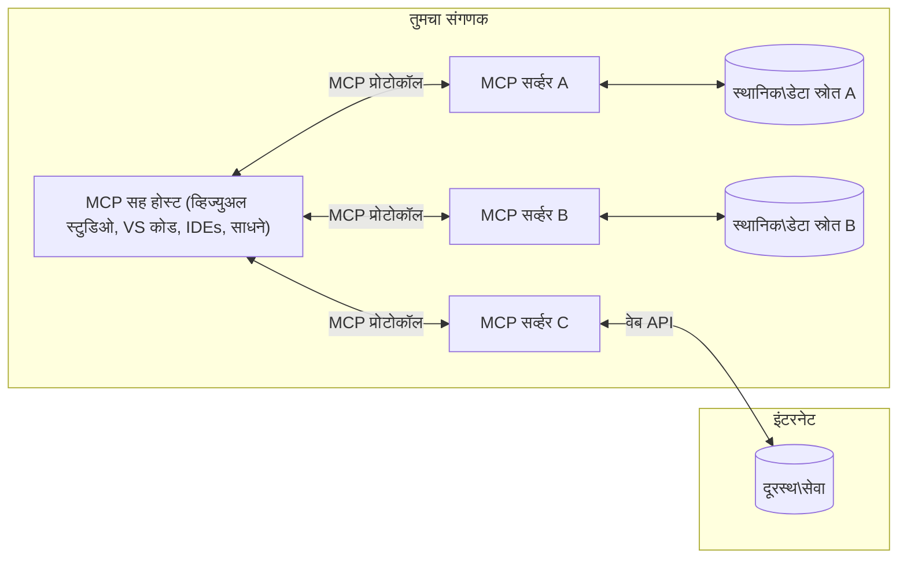

# MCP कोर संकल्पना: AI एकत्रिकरणासाठी मॉडेल संदर्भ प्रोटोकॉलमध्ये प्रावीण्य प्राप्त करणे

[](https://youtu.be/earDzWGtE84)

_(या धड्याचा व्हिडिओ पाहण्यासाठी वरील प्रतिमा क्लिक करा)_

[मॉडेल संदर्भ प्रोटोकॉल (MCP)](https://github.com/modelcontextprotocol) हा एक शक्तिशाली, मानकीकृत फ्रेमवर्क आहे जो मोठ्या भाषा मॉडेल्स (LLMs) आणि बाह्य उपकरणे, अनुप्रयोग आणि डेटा स्रोत यांच्यामधील संप्रेषण सुधारतो.
हा मार्गदर्शक तुम्हाला MCP च्या कोर संकल्पना समजावून सांगेल. तुम्ही त्याच्या क्लायंट-सर्व्हर आर्किटेक्चर, आवश्यक घटक, संवाद यंत्रणा आणि अंमलबजावणीच्या सर्वोत्तम पद्धतींबद्दल शिकाल.

- **स्पष्ट वापरकर्ता संमती**: सर्व डेटा प्रवेश आणि ऑपरेशन्ससाठी अंमलबजावणीपूर्वी वापरकर्त्याची स्पष्ट मान्यता आवश्यक आहे. वापरकर्त्यांना कोणता डेटा ऍक्सेस केला जाईल आणि कोणती क्रिया केली जाईल हे स्पष्टपणे समजले पाहिजे, तसेच परवानग्या आणि अधिकृतता यांच्यावर सूक्ष्म नियंत्रण आवश्यक आहे.

- **डेटा गोपनीयता संरक्षण**: वापरकर्ता डेटा फक्त स्पष्ट संमतीने उघड केला जातो आणि संपूर्ण संवादावधीमध्ये कठोर प्रवेश नियंत्रणाने संरक्षित केला पाहिजे. अंमलबजावणी अनधिकृत डेटा प्रसारण टाळावे आणि कडक गोपनीयता मर्यादा राखाव्यात.

- **साधन अंमलबजावणी सुरक्षितता**: प्रत्येक साधन कॉलसाठी स्पष्ट वापरकर्ता संमती आवश्यक असून, त्या साधनाच्या कार्यक्षमतेची, पॅरामीटर्सची आणि संभाव्य परिणामांची स्पष्ट समज आवश्यक आहे. कठोर सुरक्षा सीमा अनपेक्षित, असुरक्षित किंवा हानिकारक साधन अंमलबजावणी टाळतील.

- **ट्रान्सपोर्ट लेयर सुरक्षा**: सर्व संवाद चॅनेल योग्य एन्क्रिप्शन आणि प्रमाणीकरण यंत्रणा वापराव्यात. रिमोट कनेक्शन्ससाठी सुरक्षित ट्रान्सपोर्ट प्रोटोकॉल आणि योग्य क्रेडेन्शियल व्यवस्थापन केले जावे.

#### अंमलबजावणी दिशानिर्देश:

- **परवानगी व्यवस्थापन**: वापरकर्त्यांना कोणते सर्व्हर, साधने आणि संसाधने उपलब्ध आहेत हे नियंत्रित करण्यासाठी सूक्ष्म परवानगी प्रणाली अंमलात आणा  
- **प्रमाणीकरण आणि अधिकृतता**: सुरक्षित प्रमाणीकरण पद्धती (OAuth, API कीज) वापरा, योग्य टोकन व्यवस्थापन आणि मुदत समाप्ती सह  
- **इनपुट वैधता तपासणी**: सर्व पॅरामीटर्स आणि डेटा इनपुट्सची परिभाषित योजनांनुसार चाचणी करा, इंजेक्शन हल्ल्यांपासून प्रतिबंध करण्यासाठी  
- **ऑडिट लॉगिंग**: सुरक्षा देखरेख आणि अनुपालनासाठी सर्व ऑपरेशन्सची सखोल नोंद ठेवा

## आढावा

हा धडा मॉडेल संदर्भ प्रोटोकॉल (MCP) परिसंस्थेची मूलभूत रचना आणि घटक तपासतो. तुम्ही क्लायंट-सर्व्हर आर्किटेक्चर, मुख्य घटक, आणि MCP संवाद यंत्रणा यांचे ज्ञान मिळवाल.

## मुख्य शिकण्याच्या उद्दिष्टे

हा धडा पूर्ण केल्यावर, तुम्ही:

- MCP क्लायंट-सर्व्हर आर्किटेक्चर समजून घेणार  
- Hosts, Clients, आणि Servers यांचे भूमिका आणि जबाबदाऱ्या ओळखणार  
- MCP ला लवचिक एकत्रीकरण थर बनवणाऱ्या मुख्य वैशिष्ट्यांचा तपास करणार  
- MCP परिसंस्थेमधील माहिती कशी प्रवाहित होते हे शिकल  
- .NET, Java, Python, आणि JavaScript मधील कोड उदाहरणांमधून व्यावहारिक अंतर्दृष्टी मिळवाल

## MCP आर्किटेक्चर: सखोल विश्लेषण

MCP परिसंस्था क्लायंट-सर्व्हर मॉडेलवर आधारित आहे. ही मॉड्युलर रचना AI अनुप्रयोगांना साधने, डेटाबेस, API, आणि संदर्भभूत संसाधनांशी कार्यक्षमतेने संवाद साधण्याची परवानगी देते. चला या आर्किटेक्चरचे मुख्य घटक तपासूया.

त्याच्या मूळ स्वरूपात, MCP क्लायंट-सर्व्हर आर्किटेक्चर अनुसरतो जिथे होस्ट अ‍ॅप्लिकेशन अनेक सर्व्हर्सशी कनेक्ट होऊ शकते:


```mermaid
flowchart LR
    subgraph "तुमचा संगणक"
        Host["MCP सह होस्ट (व्हिज्युअल स्टुडिओ, VS कोड, IDEs, साधने)"]
        S1["MCP सर्व्हर A"]
        S2["MCP सर्व्हर B"]
        S3["MCP सर्व्हर C"]
        Host <-->|"MCP प्रोटोकॉल"| S1
        Host <-->|"MCP प्रोटोकॉल"| S2
        Host <-->|"MCP प्रोटोकॉल"| S3
        S1 <--> D1[("स्थानिक\डेटा स्रोत A")]
        S2 <--> D2[("स्थानिक\डेटा स्रोत B")]
    end
    subgraph "इंटरनेट"
        S3 <-->|"वेब API"| D3[("दूरस्थ\सेवा")]
    end
```
- **MCP Hosts**: VSCode, Claude Desktop, IDEs, किंवा AI साधने जी MCP द्वारे डेटा ऍक्सेस करू इच्छितात  
- **MCP Clients**: प्रोटोकॉल क्लायंट्स जे सर्व्हर्सशी 1:1 कनेक्शन्स कायम ठेवतात  
- **MCP Servers**: लहान प्रोग्रॅम्स जे प्रत्येकाने मानकीकृत मॉडेल संदर्भ प्रोटोकॉलद्वारे विशिष्ट कार्यक्षमता उघड करतात  
- **स्थानिक डेटा स्रोत**: तुमच्या संगणकातील फाईल्स, डेटाबेस, आणि सेवा ज्या MCP सर्व्हर्स सुरक्षितपणे ऍक्सेस करू शकतात  
- **रिमोट सेवा**: इंटरनेटवर उपलब्ध बाह्य सिस्टम्स ज्या MCP सर्व्हर्स API द्वारे कनेक्ट होऊ शकतात

MCP प्रोटोकॉल हे एक प्रगत होत जाणारे मानक आहे जे तारीख आधारित आवृत्तीकरण (YYYY-MM-DD स्वरूप) वापरते. सध्याची प्रोटोकॉल आवृत्ती आहे **2025-11-25**. तुम्ही नवीनतम अद्यतने [प्रोटोकॉल तपशील](https://modelcontextprotocol.io/specification/2025-11-25/) येथे पाहू शकता.

### 1. Hosts

मॉडेल संदर्भ प्रोटोकॉल (MCP) मध्ये, **Hosts** हे AI अनुप्रयोग आहेत जे वापरकर्त्यांसाठी प्रोटोकॉलशी संवादाचा प्राथमिक इंटरफेस म्हणून कार्य करतात. Hosts अनेक MCP सर्व्हर्सशी कनेक्शन समन्वयित करतात आणि प्रत्येक सर्व्हर कनेक्शनसाठी समर्पित MCP क्लायंट तयार करतात. Hosts चे काही उदाहरणे:

- **AI अनुप्रयोग**: Claude Desktop, Visual Studio Code, Claude Code  
- **विकसन पर्यावरण**: IDEs आणि कोड संपादक ज्यात MCP एकत्रीकरण आहे  
- **सानुकूल अनुप्रयोग**: उद्दिष्ट आधारित AI एजंट्स आणि साधने

**Hosts** हे AI मॉडेल संवादांचे समन्वयक आहेत. ते:

- **AI मॉडेल समन्वयित करतात**: Marcus किंवा LLMs सुरु करणे/व्यवहार करणे, प्रतिसाद तयार करणे, AI वर्कफ्लो समन्वयित करणे  
- **क्लायंट कनेक्शन्स व्यवस्थापित करतात**: प्रत्येक MCP सर्व्हर कनेक्शनसाठी एक MCP क्लायंट तयार व राखतात  
- **वापरकर्ता इंटरफेस नियंत्रित करतात**: संभाषण प्रवाह, वापरकर्ता संवाद, आणि प्रतिसाद सादरीकरण हाताळतात  
- **सुरक्षा अंमलात आणतात**: परवानग्या, सुरक्षा अटी, आणि प्रमाणीकरण नियंत्रित करतात  
- **वापरकर्ता संमती हाताळतात**: डेटा शेअरिंग आणि साधन अंमलबजावणीसाठी वापरकर्ता स्वीकृती व्यवस्थापित करतात

### 2. Clients

**Clients** हे आवश्यक घटक आहेत जे Hosts आणि MCP सर्व्हर्स दरम्यान समर्पित एक-ते-एक कनेक्शन राखतात. प्रत्येक MCP क्लायंट विशिष्ट MCP सर्व्हरशी Host द्वारे वापरकर्ता कनेक्शनासाठी सुरु केला जातो, ज्यामुळे संघटित आणि सुरक्षित संवाद चॅनेल तयार होतात. एकाधिक क्लायंट्स Hosts ना अनेक सर्व्हर्सशी एकाच वेळी कनेक्ट होण्याची परवानगी देतात.

**Clients** हे होस्ट अ‍ॅप्लिकेशनमध्ये कनेक्टर घटक आहेत. ते:

- **प्रोटोकॉल संवाद करतात**: JSON-RPC 2.0 विनंत्या सर्व्हरकडे पाठवतात ज्यात प्रॉम्प्ट आणि सूचना असतात  
- **क्षमता वाटाघाटी करतात**: प्रारंभिक काळात सर्व्हरशी समर्थ फिचर्स आणि प्रोटोकॉल आवृत्त्यांवर वाटाघाटी करतात  
- **साधन अंमलबजावणी**: मॉडेलकडून साधन कार्यांसाठी विनंत्या व्यवस्थापित करतात आणि प्रतिसाद प्रक्रिया करतात  
- **रेअल-टाइम अद्यतने हाताळतात**: सर्व्हरकडून सूचना आणि प्रत्यक्ष वेळ अद्यतने हाताळतात  
- **प्रतिक्रिया प्रक्रिया करतात**: वापरकर्त्यांसाठी प्रदर्शनासाठी सर्व्हर प्रतिसाद प्रक्रिया आणि स्वरूपित करतात

### 3. Servers

**Servers** हे प्रोग्रॅम्स आहेत जे MCP क्लायंट्सना संदर्भ, साधने, आणि कार्यक्षमता पुरवतात. ते स्थानिक (होस्टच्या संगणकावर) किंवा रिमोट (बाह्य प्लॅटफॉर्मवर) चालू शकतात आणि क्लायंट विनंत्या हाताळतात व संरचित प्रतिसाद पुरवतात. सर्व्हर्स मानकीकृत मॉडेल संदर्भ प्रोटोकॉलद्वारे विशिष्ट कार्यक्षमता ओपन करतात.

**Servers** म्हणजे संदर्भ आणि कार्यक्षमतेची सेवा पुरवणारे घटक. ते:

- **वैशिष्ट्ये नोंदणी करतात**: क्लायंट्ससाठी उपलब्ध मूळ साधने (संसाधने, प्रॉम्प्ट, साधने) नोंदवून उघड करतात  
- **विनंती प्रक्रिया करतात**: साधन कॉल, संसाधन विनंती, आणि प्रॉम्प्ट विनंत्या प्राप्त करतात व कार्यान्वित करतात  
- **संदर्भ पुरवतात**: मॉडेल प्रतिसाद वाढविण्यासाठी संदर्भमय माहिती आणि डेटा प्रदान करतात  
- **स्थिती व्यवस्थापन करतात**: सत्र स्थिती राखतात आणि आवश्यकतेनुसार स्थितीपूर्ण संवाद हाताळतात  
- **प्रतिक्रिया द्यायच्या सूचना देतात**: कार्यक्षमतेतील बदल आणि अद्यतने संबंधित नोटिफिकेशन्स क्लायंट्सना पाठवतात

कोणीही सविस्तर कार्यक्षमता जोडण्यासाठी सर्व्हर्स विकसित करू शकतात आणि ते स्थानिक तसेच रिमोट दोन्ही प्रकारे तैनात होऊ शकतात.

### 4. Server Primitives

मॉडेल संदर्भ प्रोटोकॉल (MCP) मध्ये सर्व्हर्स तीन मुख्य **प्रिमिटिव्हस** पुरवतात ज्यामुळे क्लायंट्स, होस्ट्स, आणि भाषा मॉडेल्स दरम्यान समृद्ध संवाद शक्य होतो. या प्रिमिटिव्हस हे संदर्भ माहिती आणि क्रियांची मूलभूत संरचना ठरवतात.

MCP सर्व्हर्स खालील तीन मुख्य प्रिमिटिव्हस कोणत्याही संयोजनात उघड करू शकतात:

#### Resources

**Resources** म्हणजे डेटा स्रोत जे AI अनुप्रयोगांना संदर्भ माहिती प्रदान करतात. ते स्थिर किंवा गतिशील सामग्री दर्शवतात जी मॉडेल समज आणि निर्णय क्षमतेला वाढवते:

- **संदर्भात्मक डेटा**: AI मॉडेल सेवनासाठी संरचित माहिती व संदर्भ  
- **ज्ञान आधार**: दस्तऐवज संच, लेख, मॅन्युअल, व संशोधन पेपर्स  
- **स्थानिक डेटा स्रोत**: फाईल्स, डेटाबेस, आणि स्थानिक प्रणाली माहिती  
- **बाह्य डेटा**: API प्रतिसाद, वेब सेवा, आणि दूरस्थ सिस्टम डेटा  
- **गतिशील सामग्री**: बाह्य परिस्थितीनुसार अपडेट होणारा प्रत्यक्ष वेळेचा डेटा

Resources यांना URI द्वारे ओळखले जाते, आणि ते `resources/list` द्वारे शोधले जातात व `resources/read` द्वारे प्राप्त केले जातात:

```text
file://documents/project-spec.md
database://production/users/schema
api://weather/current
```

#### Prompts

**Prompts** हे पुनर्वापर करता येणारे साचा आहेत जे भाषा मॉडेल्ससोबत संवाद सुलभ करतात. ते मानकीकृत संवाद नमुने आणि साच्याकार वर्कफ्लोज पुरवतात:

- **साच्याभूत संवाद**: पूर्वरचलेल्या संदेश आणि संभाषण प्रारंभक  
- **वर्कफ्लो साचे**: सामान्य कार्यांची मानकीकृत अनुक्रमे  
- **थोडक्याच उदाहरणांची नमुने**: मॉडेल सूचना देण्यासाठी उदाहरण-आधारित साचे  
- **सिस्टम प्रॉम्प्ट**: आधारभूत प्रॉम्प्ट जे मॉडेल वर्तन आणि संदर्भ निश्चित करतात  
- **गतिशील साचे**: पॅरामीटराइज्ड प्रॉम्प्ट जे विशिष्ट संदर्भानुसार अनुरूप होतात

प्रॉम्प्ट्स व्हेरिएबल बदल स्वीकारतात आणि `prompts/list` द्वारे शोधले जातात व `prompts/get` द्वारे प्राप्त होतात:

```markdown
Generate a {{task_type}} for {{product}} targeting {{audience}} with the following requirements: {{requirements}}
```

#### Tools

**Tools** या अमलात आणण्याजोग्या कार्यप्रणाली आहेत ज्यांना AI मॉडेल वापरून विशिष्ट क्रियांसाठी कॉल करता येतो. हे MCP परिसंस्थेतील "क्रियापद" आहेत, जे मॉडेल्सना बाह्य प्रणालींशी संवाद साधण्यास मदत करतात:

- **अमलात आणण्याजोगे कार्य**: मॉडेल्स विशिष्ट पॅरामीटर्ससह कॉल करू शकणाऱ्या सूक्ष्म ऑपरेशन्स  
- **बाह्य प्रणाली एकत्रीकरण**: API कॉल्स, डेटाबेस क्वेरीज, फाईल ऑपरेशन्स, गणना  
- **अद्वितीय ओळख**: प्रत्येक साधनाचे वेगळे नाव, वर्णन, व पॅरामीटर योजना असते  
- **संरचित I/O**: साधने वैध केलेले पॅरामीटर्स स्वीकारतात व संरचित, प्रकारित प्रतिसाद देतात  
- **क्रिया क्षमता**: मॉडेल्सना प्रत्यक्ष जगातील क्रियांसाठी व लाईव्ह डेटा मिळविण्यास सक्षम बनवतात

साधने JSON स्कीमा द्वारे पॅरामीटर वैधतेसाठी परिभाषित केली जातात आणि `tools/list` द्वारे शोधल्या जातात, `tools/call` द्वारे अंमलात आणल्या जातात. UI सादरीकरणासाठी साधनांमध्ये **आयकॉन्स** देखील समाविष्ट होऊ शकतात.

**साधन टिप्पण्या**: Tools वर्तनात्मक टिप्पण्या (उदा., `readOnlyHint`, `destructiveHint`) समर्थन करतात, ज्यामुळे क्लायंट्सना साधनाच्या वर्तनाविषयी सूचित निर्णय घेता येतात.

उदाहरणार्थ साधन परिभाषा:

```typescript
server.tool(
  "search_products", 
  {
    query: z.string().describe("Search query for products"),
    category: z.string().optional().describe("Product category filter"),
    max_results: z.number().default(10).describe("Maximum results to return")
  }, 
  async (params) => {
    // शोध कार्यान्वित करा आणि संरचित निकाल परत करा
    return await productService.search(params);
  }
);
```

## Client Primitives

मॉडेल संदर्भ प्रोटोकॉल (MCP) मध्ये, **clients** अशी प्रिमिटिव्हस उघड करू शकतात ज्यामुळे सर्व्हरना होस्ट अ‍ॅप्लिकेशनकडून अतिरिक्त क्षमता विनंती करता येतात. ही क्लायंट-साइड प्रिमिटिव्हस अधिक समृद्ध, संवादात्मक सर्व्हर अंमलबजावण्या सक्षम करतात ज्यांना AI मॉडेल क्षमतांशी आणि वापरकर्ता संवादाशी प्रवेश असतो.

### Sampling

**Sampling** सर्व्हरना क्लायंटच्या AI अनुप्रयोगाकडून भाषा मॉडेल पूर्णता विनंती करण्याची परवानगी देते. ही प्रिमिटिव्ह सर्व्हरला त्यांचा स्वतःचा मॉडेल अवलंबित्व न ठेवता LLM क्षमता वापरण्यास सक्षम करते:

- **मॉडेल-स्वतंत्र प्रवेश**: सर्व्हर LLM SDK समाविष्ट न करता पूर्णता विनंती करू शकतात किंवा मॉडेल प्रवेश कमी व्यवस्थापित करू शकतात  
- **सर्व्हर-प्रेरित AI**: सर्व्हर स्वतःहून क्लायंटच्या AI मॉडेल वापरून सामग्री तयार करू शकतात  
- **पुनरावृत्ती LLM संवाद**: जटिल प्रसंग जिथे सर्व्हरला AI सहाय्याची गरज असते, त्यासाठी समर्थन  
- **गतिशील सामग्री निर्मिती**: होस्टच्या मॉडेलचा उपयोग करीत संदर्भवस्तू तयार करणे  
- **साधन कॉलिंग समर्थन**: सर्व्हर्स `tools` व `toolChoice` पॅरामीटर्स देऊन sampling दरम्यान क्लायंटच्या मॉडेलला साधने कॉल करण्यास सक्षम करतात

Sampling `sampling/complete` पद्धतीने सुरू होते, जिथे सर्व्हर क्लायंटकडे पूर्णता विनंती पाठवतात.

### Roots

**Roots** हे क्लायंट्सना सर्व्हरला फाईल सिस्टीम मर्यादा उघड करण्याचा मानकीकृत मार्ग पुरवतात, ज्यामुळे सर्व्हर कोणत्या डिरेक्टरी आणि फाईल्सना प्रवेश करू शकतात हे समजते:

- **फाईल सिस्टीम मर्यादा**: सर्व्हरची फाइल सिस्टममध्ये ऑपरेशनची सीमा निश्चित करणे  
- **प्रवेश नियंत्रण**: सर्व्हरला कोणत्या डिरेक्टरीज आणि फाइल्सना परवानगी आहे हे समजणे  
- **गतिशील अद्यतने**: क्लायंट्सला roots यादी बदलल्यावर सर्व्हरला सूचित करता येते  
- **URI आधारित ओळख**: `file://` URI द्वारे प्रवेशयोग्य डिरेक्टरीज आणि फाइल्सची ओळख

Roots `roots/list` द्वारे शोधल्या जातात, क्लायंट्स `notifications/roots/list_changed` पाठवतात जेव्हा roots बदलतात.

### Elicitation

**Elicitation** सर्व्हरला वापरकर्त्यांकडून अतिरिक्त माहिती किंवा पुष्टी मागण्याची परवानगी देते, क्लायंट इंटरफेसद्वारे:

- **वापरकर्ता इनपुट विनंत्या**: साधन अंमलबजावणीसाठी आवश्यक असलेल्या अतिरिक्त माहितीचा मागणी  
- **पुष्टी संवाद**: संवेदनशील किंवा प्रभावशाली ऑपरेशन्ससाठी वापरकर्ता मंजुरीची विनंती  
- **परस्परसंवादी वर्कफ्लोज**: टप्प्याटप्प्याने वापरकर्ता संवाद निर्माण करणे  
- **गतिशील पॅरामीटर संकलन**: साधन अंमलबजावणी दरम्यान हरवलेल्या किंवा ऐच्छिक पॅरामीटर्स गोळा करणे

Elicitation विनंत्या `elicitation/request` पद्धतीने वापरकर्त्यांद्वारे इनपुट मिळवण्यासाठी केल्या जातात.

**URL मोड Elicitation**: सर्व्हर URL आधारित वापरकर्ता संवाद देखील मागू शकतात, ज्यामुळे वापरकर्त्यांना प्रमाणीकरण, पुष्टी किंवा डेटा प्रविष्टीसाठी बाह्य वेब पानांकडे वळवता येते.

### Logging

**Logging** सर्व्हरला क्लायंटकडे संरचित लॉग संदेश पाठवण्याची परवानगी देते ज्यामुळे डिबगिंग, मॉनिटरिंग आणि ऑपरेशनल पारदर्शकता प्राप्त होते:

- **डिबगिंग समर्थन**: समस्या सोडवण्यासाठी तपशीलवार अंमलबजावणी लॉग पुरवणे  
- **ऑपरेशनल मॉनिटरिंग**: क्लायंटकडे स्थिती अपडेट्स आणि कार्यक्षमता आकडेवारी पाठवणे  
- **त्रुटी अहवाल**: तपशीलवार त्रुटी संदर्भ आणि निदान माहिती प्रदान करणे  
- **ऑडिट ट्रेल्स**: सर्व्हर ऑपरेशन्स आणि निर्णयांची सखोल नोंद तयार करणे

लॉगिंग संदेश सर्व्हर ऑपरेशन्समध्ये पारदर्शकता प्रदान करण्यासाठी आणि डिबगिंग सुलभ करण्यासाठी क्लायंटना पाठवले जातात.

## MCP मधील माहिती प्रवाह

मॉडेल संदर्भ प्रोटोकॉल (MCP) होस्ट्स, क्लायंट्स, सर्व्हर्स आणि मॉडेल्स दरम्यान सूचना प्रवाहाची संरचित रचना परिभाषित करतो. या प्रवाहाचे आकलन वापरकर्ता विनंत्या कशा प्रक्रियेत येतात आणि बाह्य साधने व डेटा मॉडेल प्रतिसादांमध्ये कसे समाकलित होतात हे स्पष्ट करण्यात मदत करते.
- **होस्ट कनेक्शन सुरु करतो**  
  होस्ट अनुप्रयोग (जसे की IDE किंवा चॅट इंटरफेस) सामान्यतः STDIO, WebSocket किंवा अन्य समर्थित ट्रान्सपोर्टद्वारे MCP सर्व्हरशी कनेक्शन स्थापित करतो.

- **क्षमता चर्चा**  
  क्लायंट (होस्टमध्ये एम्बेड केलेले) आणि सर्व्हर त्यांचा समर्थित वैशिष्ट्ये, साधने, संसाधने आणि प्रोटोकॉल आवृत्त्यांबाबत माहिती देवाणघेवाण करतात. यामुळे दोन्ही बाजूंना सत्रासाठी उपलब्ध क्षमतांचा समज होतो.

- **वापरकर्त्याची विनंती**  
  वापरकर्ता होस्टशी संवाद साधतो (उदा. प्रॉम्प्ट किंवा कमांड टाइप करतो). होस्ट हा इनपुट गोळा करतो आणि प्रक्रिया करण्यासाठी क्लायंटकडे पाठवतो.

- **संसाधन किंवा साधन वापर**  
  - क्लायंट सर्व्हरकडून अतिरिक्त संदर्भ किंवा संसाधने (उदा. फायली, डेटाबेस नोंदी, ज्ञानाधार लेख) मागू शकतो ज्यामुळे मॉडेलच्या समजण्याला समृद्धी होते.  
  - जर मॉडेलला एखादे साधन आवश्यक असल्याचे ठरले (उदा. डेटा आणण्यासाठी, गणना करण्यासाठी, API कॉल करण्यासाठी), तर क्लायंट सर्व्हरकडे साधन कॉल करण्याची विनंती पाठवतो ज्यात साधनाचे नाव आणि पॅरामीटर्स दिलेले असतात.

- **सर्व्हर अंमलबजावणी**  
  सर्व्हरला संसाधन किंवा साधन विनंती प्राप्त होते, ते आवश्यक ऑपरेशन्स (उदा. फंक्शन चालवणे, डेटाबेस क्वेरी करणे, फाईल मिळवणे) पार पाडतो, आणि क्लायंटसाठी संरचीत स्वरुपात निकाल परत करतो.

- **प्रतिक्रिया निर्मिती**  
  क्लायंट सर्व्हरच्या प्रतिक्रिया (संसाधन डेटा, साधन उत्पादन इ.) चालू मॉडेल संवादात समाविष्ट करतो. मॉडेल या माहितीद्वारे व्यापक आणि संदर्भाभिमुख प्रतिक्रिया तयार करते.

- **परिणाम सादरीकरण**  
  होस्ट क्लायंटकडून अंतिम आउटपुट मिळवतो आणि ते वापरकर्त्यास सादर करतो, बहुधा यामध्ये मॉडेलद्वारे निर्मित मजकूर आणि साधन अंमलबजावणी किंवा संसाधन शोधांचे निकाल दोन्ही असतात.

हा प्रवाह MCP ला प्रगत, संवादात्मक आणि संदर्भाभिमुख AI अनुप्रयोगांना बाह्य साधने व डेटास्रोतांशी संयोजित करण्यास सक्षम करतो.

## प्रोटोकॉल आर्किटेक्चर आणि स्तर

MCP दोन विशिष्ट आर्किटेक्चरल स्तरांमध्ये विभागलेले आहे जे एकत्र काम करून संपूर्ण संवाद फ्रेमवर्क पुरवतात:

### डेटा स्तर

**डेटा स्तर** MCP प्रोटोकॉलचे मुख्य भाग JSON-RPC 2.0 वापरून राबवतो. हा स्तर संदेश संरचना, अर्थशास्त्र आणि संवाद नमुने परिभाषित करतो:

#### मुख्य घटक:

- **JSON-RPC 2.0 प्रोटोकॉल**: सर्व संवाद कॉल, प्रतिसाद, आणि नोटिफिकेशन्ससाठी मानकीकृत JSON-RPC 2.0 संदेश स्वरूप वापरतो
- **लाइफसायकल व्यवस्थापन**: क्लायंट आणि सर्व्हरमधील कनेक्शन सुरूवात, क्षमता चर्चा व सत्र समाप्ती हाताळतो
- **सर्व्हर मूळ घटक**: सर्व्हरना टूल्स, संसाधने आणि प्रॉम्प्टद्वारे मुख्य कार्यक्षमता प्रदान करण्यास सक्षम करतो
- **क्लायंट मूळ घटक**: सर्व्हरला LLM सॅम्पलिंग, वापरकर्ता इनपुट मागणे, आणि लॉग संदेश पाठवणे शक्य करतो
- **रिअल-टाइम नोटिफिकेशन्स**: पॉलिंग न करता डायनॅमिक अपडेटसाठी अप्रत्यक्ष सूचना समर्थन करतो

#### मुख्य वैशिष्ट्ये:

- **प्रोटोकॉल आवृत्ती चर्चा**: तारीख-आधारित आवृत्ती व्यवस्थापन (YYYY-MM-DD) वापरून सुसंगतता सुनिश्चित करतो
- **क्षमता शोध**: क्लायंट आणि सर्व्हर सुरूवातीस त्यांच्या समर्थित वैशिष्ट्यांची देवाणघेवाण करतात
- **स्थितिमान सत्रे**: अनेक संवादांमध्ये संदर्भ सलगता राखण्यासाठी कनेक्शन स्थिती व्यवस्थापित करतो

### ट्रान्सपोर्ट स्तर

**ट्रान्सपोर्ट स्तर** MCP सहभागींच्या संवाद चॅनेल्स, संदेश फ्रेमिंग, आणि प्रमाणीकरण व्यवस्थापित करतो:

#### समर्थित ट्रान्सपोर्ट मेकॅनिझम:

1. **STDIO ट्रान्सपोर्ट**:
   - डायरेक्ट प्रोसेस संवादासाठी स्टँडर्ड इनपुट/आउटपुट प्रवाह वापरतो  
   - सारखे मशीनवरील स्थानिक प्रक्रियांसाठी आदर्श, नेटवर्क ओव्हरहेड न देता  
   - स्थानिक MCP सर्व्हर अंमलबजावणीसाठी सामान्य वापर

2. **स्ट्रीम करण्याजोगा HTTP ट्रान्सपोर्ट**:
   - क्लायंट ते सर्व्हर संदेशांसाठी HTTP POST वापरतो
   - सर्व्हर ते क्लायंट स्ट्रीमिंगसाठी ऐच्छिक Server-Sent Events (SSE) वापरतो
   - नेटवर्कद्वारे रिमोट सर्व्हर संवाद सक्षम करतो
   - मानक HTTP प्रमाणीकरण (Bearer टोकन्स, API कीज, कस्टम हेडर्स) समर्थन करतो
   - MCP सुरक्षित टोकन-आधारित प्रमाणीकरणासाठी OAuth वापरण्याचा सल्ला देतो

#### ट्रान्सपोर्ट सारांश:

ट्रान्सपोर्ट स्तर संवाद तपशीलांकडून डेटा स्तराला वेगळे करतो, त्यामुळे सर्व ट्रान्सपोर्ट मेकॅनिझमवर समान JSON-RPC 2.0 संदेश स्वरूप वापरता येतो. या सारांशामुळे अनुप्रयोग स्थानिक व रिमोट सर्व्हरमध्ये सहज बदल करू शकतात.

### सुरक्षा विचार

सर्व प्रोटोकॉल क्रियांमध्ये सुरक्षित, विश्वासार्ह आणि सुरक्षित संवादासाठी MCP अंमलबजावणी खालील महत्त्वाच्या सुरक्षा तत्त्वांचे पालन करायला हवे:

- **वापरकर्ता संमती आणि नियंत्रण**: कोणतीही माहिती वापरण्यापूर्वी वापरकर्त्याची स्पष्ट संमती आवश्यक आहे. त्यांना काय डेटा शेअर होतो आणि कोणते क्रियाकलाप मंजूर आहेत हे स्पष्टपणे नियंत्रित करता यायला हवे, ग्राह्य वापरकर्ता संवादांसह जे पुनरावलोकन व मान्यता देतात.

- **डेटा गोपनीयता**: वापरकर्त्यांच्या डेटाचा खुलासा फक्त स्पष्ट संमतीवरच केला जावा आणि योग्य प्रवेश नियंत्रणांनी संरक्षित केला जावा. MCP अंमलबजावणी अनधिकृत डेटाच्या प्रसारापासून संरक्षण करायला हवे आणि संवादामध्ये गोपनीयता राखली पाहिजे.

- **साधन सुरक्षा**: कोणतेही साधन वापरण्यापूर्वी वापरकर्त्याची स्पष्ट संमती असावी. वापरकर्त्यांना प्रत्येक साधनाची कार्यपद्धती जागरूक असावी आणि मजबूत सुरक्षा सीमा घालून अनपेक्षित किंवा असुरक्षित साधन वापर रोखले जावे.

या सुरक्षा तत्त्वांचे पालन केल्याने MCP वापरकर्त्यांचा विश्वास, गोपनीयता आणि सुरक्षितता कायम ठेवतो, त्याचवेळी सक्षम AI एकत्रीकरणांना अनुमती देतो.

## कोड उदाहरणे: मुख्य घटक

खाली काही प्रसिद्ध प्रोग्रामिंग भाषांमध्ये MCP सर्व्हर घटक आणि साधने कशी अंमलबजावणी करावी याची उदाहरणे दिली आहेत.

### .NET उदाहरण: साधा MCP सर्व्हर साधनांसह तयार करणे

ही व्यावहारिक .NET कोड उदाहरण दर्शवते की कस्टम साधने कशी परिभाषित आणि नोंदणी करायची, विनंत्या कशा हाताळायच्या, आणि Model Context Protocol वापरून सर्व्हरशी कनेक्ट कसे व्हावे.

```csharp
using System;
using System.Threading.Tasks;
using ModelContextProtocol.Server;
using ModelContextProtocol.Server.Transport;
using ModelContextProtocol.Server.Tools;

public class WeatherServer
{
    public static async Task Main(string[] args)
    {
        // Create an MCP server
        var server = new McpServer(
            name: "Weather MCP Server",
            version: "1.0.0"
        );
        
        // Register our custom weather tool
        server.AddTool<string, WeatherData>("weatherTool", 
            description: "Gets current weather for a location",
            execute: async (location) => {
                // Call weather API (simplified)
                var weatherData = await GetWeatherDataAsync(location);
                return weatherData;
            });
        
        // Connect the server using stdio transport
        var transport = new StdioServerTransport();
        await server.ConnectAsync(transport);
        
        Console.WriteLine("Weather MCP Server started");
        
        // Keep the server running until process is terminated
        await Task.Delay(-1);
    }
    
    private static async Task<WeatherData> GetWeatherDataAsync(string location)
    {
        // This would normally call a weather API
        // Simplified for demonstration
        await Task.Delay(100); // Simulate API call
        return new WeatherData { 
            Temperature = 72.5,
            Conditions = "Sunny",
            Location = location
        };
    }
}

public class WeatherData
{
    public double Temperature { get; set; }
    public string Conditions { get; set; }
    public string Location { get; set; }
}
```


### Java उदाहरण: MCP सर्व्हर घटक

.NET उदाहरणासारखे MCP सर्व्हर आणि साधन नोंदणी येथे Java मध्ये कशी केली जाते हे दाखवले आहे.

```java
import io.modelcontextprotocol.server.McpServer;
import io.modelcontextprotocol.server.McpToolDefinition;
import io.modelcontextprotocol.server.transport.StdioServerTransport;
import io.modelcontextprotocol.server.tool.ToolExecutionContext;
import io.modelcontextprotocol.server.tool.ToolResponse;

public class WeatherMcpServer {
    public static void main(String[] args) throws Exception {
        // एक MCP सर्व्हर तयार करा
        McpServer server = McpServer.builder()
            .name("Weather MCP Server")
            .version("1.0.0")
            .build();
            
        // हवामान साधन नोंदणी करा
        server.registerTool(McpToolDefinition.builder("weatherTool")
            .description("Gets current weather for a location")
            .parameter("location", String.class)
            .execute((ToolExecutionContext ctx) -> {
                String location = ctx.getParameter("location", String.class);
                
                // हवामान डेटा मिळवा (सरलीकृत)
                WeatherData data = getWeatherData(location);
                
                // स्वरूपित प्रतिसाद परत करा
                return ToolResponse.content(
                    String.format("Temperature: %.1f°F, Conditions: %s, Location: %s", 
                    data.getTemperature(), 
                    data.getConditions(), 
                    data.getLocation())
                );
            })
            .build());
        
        // stdio ट्रांसपोर्ट वापरून सर्व्हर कनेक्ट करा
        try (StdioServerTransport transport = new StdioServerTransport()) {
            server.connect(transport);
            System.out.println("Weather MCP Server started");
            // प्रक्रिया थांबविले जाण्यापर्यंत सर्व्हर चालू ठेवा
            Thread.currentThread().join();
        }
    }
    
    private static WeatherData getWeatherData(String location) {
        // अंमलबजावणी एका हवामान API ला कॉल करेल
        // उदाहरणासाठी सरलीकृत केलेले आहे
        return new WeatherData(72.5, "Sunny", location);
    }
}

class WeatherData {
    private double temperature;
    private String conditions;
    private String location;
    
    public WeatherData(double temperature, String conditions, String location) {
        this.temperature = temperature;
        this.conditions = conditions;
        this.location = location;
    }
    
    public double getTemperature() {
        return temperature;
    }
    
    public String getConditions() {
        return conditions;
    }
    
    public String getLocation() {
        return location;
    }
}
```


### Python उदाहरण: MCP सर्व्हर तयार करणे

हे उदाहरण fastmcp वापरते, कृपया आधी ते इन्स्टॉल करा:

```python
pip install fastmcp
```
 कोड नमुना:

```python
#!/usr/bin/env python3
import asyncio
from fastmcp import FastMCP
from fastmcp.transports.stdio import serve_stdio

# एक FastMCP सर्व्हर तयार करा
mcp = FastMCP(
    name="Weather MCP Server",
    version="1.0.0"
)

@mcp.tool()
def get_weather(location: str) -> dict:
    """Gets current weather for a location."""
    return {
        "temperature": 72.5,
        "conditions": "Sunny",
        "location": location
    }

# वर्ग वापरून पर्यायी पद्धत
class WeatherTools:
    @mcp.tool()
    def forecast(self, location: str, days: int = 1) -> dict:
        """Gets weather forecast for a location for the specified number of days."""
        return {
            "location": location,
            "forecast": [
                {"day": i+1, "temperature": 70 + i, "conditions": "Partly Cloudy"}
                for i in range(days)
            ]
        }

# वर्ग साधने नोंदणी करा
weather_tools = WeatherTools()

# सर्व्हर सुरु करा
if __name__ == "__main__":
    asyncio.run(serve_stdio(mcp))
```


### JavaScript उदाहरण: MCP सर्व्हर तयार करणे

हे उदाहरण JavaScript मध्ये MCP सर्व्हर कसा तयार करायचा आणि हवामान संबंधित दोन साधने कशी नोंदवायची हे दर्शवते.

```javascript
// अधिकृत मॉडल संदर्भ प्रोटोकॉल SDK वापरून
import { McpServer } from "@modelcontextprotocol/sdk/server/mcp.js";
import { StdioServerTransport } from "@modelcontextprotocol/sdk/server/stdio.js";
import { z } from "zod"; // पॅरामीटर सत्यापनासाठी

// MCP सर्व्हर तयार करा
const server = new McpServer({
  name: "Weather MCP Server",
  version: "1.0.0"
});

// हवामान साधन परिभाषित करा
server.tool(
  "weatherTool",
  {
    location: z.string().describe("The location to get weather for")
  },
  async ({ location }) => {
    // हे सामान्यतः हवामान API कॉल करेल
    // प्रदर्शनासाठी सुलभ केलेले
    const weatherData = await getWeatherData(location);
    
    return {
      content: [
        { 
          type: "text", 
          text: `Temperature: ${weatherData.temperature}°F, Conditions: ${weatherData.conditions}, Location: ${weatherData.location}` 
        }
      ]
    };
  }
);

// अंदाज साधन परिभाषित करा
server.tool(
  "forecastTool",
  {
    location: z.string(),
    days: z.number().default(3).describe("Number of days for forecast")
  },
  async ({ location, days }) => {
    // हे सामान्यतः हवामान API कॉल करेल
    // प्रदर्शनासाठी सुलभ केलेले
    const forecast = await getForecastData(location, days);
    
    return {
      content: [
        { 
          type: "text", 
          text: `${days}-day forecast for ${location}: ${JSON.stringify(forecast)}` 
        }
      ]
    };
  }
);

// सहाय्यक फंक्शन्स
async function getWeatherData(location) {
  // API कॉलचे अनुकरण करा
  return {
    temperature: 72.5,
    conditions: "Sunny",
    location: location
  };
}

async function getForecastData(location, days) {
  // API कॉलचे अनुकरण करा
  return Array.from({ length: days }, (_, i) => ({
    day: i + 1,
    temperature: 70 + Math.floor(Math.random() * 10),
    conditions: i % 2 === 0 ? "Sunny" : "Partly Cloudy"
  }));
}

// stdio ट्रान्सपोर्ट वापरून सर्व्हर कनेक्ट करा
const transport = new StdioServerTransport();
server.connect(transport).catch(console.error);

console.log("Weather MCP Server started");
```


हा JavaScript उदाहरण दर्शवतो कसे MCP सर्व्हर तयार करायचा जो हवामान साधने नोंदवतो आणि stdio ट्रान्सपोर्ट वापरून क्लायंटच्या अनुरोधांवर प्रक्रिया करतो.

## सुरक्षा आणि परवानगी

MCP मध्ये संपूर्ण प्रोटोकॉलमध्ये सुरक्षा आणि परवानगी व्यवस्थापनासाठी अनेक अंतर्गत संकल्पना आणि यंत्रणा आहेत:

1. **साधन परवानगी नियंत्रण**:  
   क्लायंट सत्रादरम्यान कोणती साधने वापरली जाऊ शकतात हे ठरवू शकतात. त्यामुळे फक्त स्पष्टपणे अधिकृत साधनेच वापरता येतात, ज्यामुळे अनपेक्षित किंवा असुरक्षित क्रियाकलापांचा धोका कमी होतो. परवानग्या वापरकर्ता पसंती, संस्थात्मक धोरणे किंवा संवादाच्या संदर्भानुसार गतिशीलरित्या नियोजित केल्या जाऊ शकतात.

2. **प्रमाणीकरण**:  
   साधन, संसाधन किंवा संवेदनशील क्रियांसाठी सर्व्हर प्रमाणीकरण लागू करू शकतो. यात API कीज, OAuth टोकन्स, किंवा अन्य प्रमाणीकरण योजनांचा समावेश असू शकतो. योग्य प्रमाणीकरणमुळे फक्त विश्वासार्ह क्लायंट आणि वापरकर्तेच सर्व्हरच्या कार्यक्षमतेस कॉल करू शकतात.

3. **वैधता तपासणी**:  
   सर्व साधन कॉलसाठी पॅरामीटरची वैधता तपासली जाते. प्रत्येक साधन त्याच्या पॅरामीटर्ससाठी अपेक्षित प्रकार, स्वरूप आणि बंधने निश्चित करते आणि सर्व्हर इनपुटचं योग्य तपासणी करतो. यामुळे चुकीचा किंवा हानिकारक इनपुट कंट्रोल केला जातो आणि कार्यांची अखंडता राखली जाते.

4. **रेट लिमिटिंग**:  
   गैरवापर टाळण्यासाठी आणि सर्व्हर संसाधनांचा न्याय्य वापर सुनिश्चित करण्यासाठी, MCP सर्व्हर्स साधन कॉल व संसाधन प्रवेशासाठी रेट लिमिट लागू करू शकतात. हे वापरकर्ता, सत्र किंवा संपूर्ण स्तरावर लागु करता येते आणि डिनायल-ऑफ-सर्व्हिस हल्ले किंवा जास्त संसाधन वापर प्रतिबंधित करते.

या यंत्रणांमुळे MCP भाषिक मॉडेल्सना बाह्य साधने व डेटा स्रोतांसह एकत्र करण्यासाठी सुरक्षित पाया प्रदान करतो, तर वापरकर्ते व विकासकांना प्रवेश व वापर यावर सूक्ष्म नियंत्रण दिले जाते.

## प्रोटोकॉल संदेश व संवाद प्रवाह

MCP संवादासाठी संरचित **JSON-RPC 2.0** संदेश वापरतो जे होस्ट, क्लायंट आणि सर्व्हर यांच्यात स्पष्ट आणि विश्वासार्ह संवाद सक्षम करतात. प्रोटोकॉल विविध क्रियांकरिता विशिष्ट संदेश नमुने परिभाषित करतो:

### मुख्य संदेश प्रकार:

#### **इनिशियलायझेशन संदेश**
- **`initialize` विनंती**: कनेक्शन स्थापित करतो आणि प्रोटोकॉल आवृत्ती व क्षमता चर्चा करतो
- **`initialize` प्रतिसाद**: समर्थित वैशिष्ट्ये आणि सर्व्हर माहिती पुष्टी करतो  
- **`notifications/initialized`**: सूचित करतो की इनिशियलायझेशन पूर्ण आहे आणि सत्र तयार आहे

#### **शोध संदेश**
- **`tools/list` विनंती**: सर्व्हरवर उपलब्ध साधने शोधतो
- **`resources/list` विनंती**: उपलब्ध संसाधने (डेटा स्रोत) यादी करतो
- **`prompts/list` विनंती**: उपलब्ध प्रॉम्प्ट टेम्पलेट्स मिळवतो

#### **अंतर्गत क्रिया संदेश**  
- **`tools/call` विनंती**: दिलेल्या पॅरामीटर्ससह विशिष्ट साधन चालवतो
- **`resources/read` विनंती**: विशिष्ट संसाधनाचा मजकूर मिळवतो
- **`prompts/get` विनंती**: ऐच्छिक पॅरामीटर्ससह प्रॉम्प्ट टेम्पलेट आणतो

#### **क्लायंट-साइड संदेश**
- **`sampling/complete` विनंती**: सर्व्हर क्लायंटकडून LLM पूर्णता मागतो
- **`elicitation/request`**: सर्व्हर क्लायंट इंटरफेसद्वारे वापरकर्ता इनपुट मागतो
- **लॉगिंग संदेश**: सर्व्हर क्लायंटकडे संरचीत लॉग संदेश पाठवतो

#### **सूचना संदेश**
- **`notifications/tools/list_changed`**: सर्व्हर क्लायंटला साधनात बदल असल्याची सूचना देतो
- **`notifications/resources/list_changed`**: सर्व्हर क्लायंटला संसाधनात बदल असल्याची सूचना देतो  
- **`notifications/prompts/list_changed`**: सर्व्हर क्लायंटला प्रॉम्प्टमध्ये बदल असल्याची सूचना देतो

### संदेश संरचना:

सर्व MCP संदेश JSON-RPC 2.0 स्वरूप वापरतात:
- **विनंती संदेश**: `id`, `method`, आणि ऐच्छिक `params` यांचा समावेश
- **प्रतिसाद संदेश**: `id` आणि `result` किंवा `error`
- **सूचना संदेश**: `method` आणि ऐच्छिक `params` (id नसतो, प्रतिसाद अपेक्षित नाही)

ही संरचित संवाद पद्धत विश्वासार्ह, ट्रॅसेबल आणि विस्तारण्याजोग्या संवादासाठी अनुरूप आहे, ज्यात रिअल-टाइम अपडेट्स, साधन श्रृंखला, आणि त्रुटी व्यवस्थापनास समर्थन आहे.

### टास्क (प्रायोगिक)

**टास्क** हे एक प्रायोगिक वैशिष्ट्य आहे जे दीर्घकालीन ऑपरेशन्ससाठी टिकाऊ कार्य निष्पादन व नाविन्यपूर्ण स्थिती ट्रॅकिंग सुलभ करतात:

- **दीर्घकालीन कामे**: महागडे गणित, वर्कफ्लो स्वयंचलितीकरण, आणि बॅच प्रक्रिया ट्रॅक करा
- **मदत मागणे निकाल**: ऑपरेशन्स पूर्ण झाल्यावर स्थिती तपासा आणि निकाल मिळवा
- **स्थिती ट्रॅकिंग**: परिभाषित लाइफसायकल अवस्थांद्वारे प्रगती पाहा
- **बहु-चरण ऑपरेशन्स**: अनेक संवादांची पूर्तता करणारे गुंतागुंतीचे वर्कफ्लोज समर्थित करा

टास्क मानक MCP विनंत्यांना वाळवून टाकतो ज्यामुळे तात्काळ पूर्ण होऊ न शकणाऱ्या क्रियांना अप्रत्यक्ष रितीने चालू ठेवणे शक्य होते.

## मुख्य मुद्दे

- **आर्किटेक्चर**: MCP क्लायंट-सर्व्हर आर्किटेक्चर वापरतो जिथे होस्ट अनेक क्लायंट कनेक्शन्सचे व्यवस्थापन करतात
- **सहभागी**: इकोसिस्टममध्ये होस्ट्स (AI अनुप्रयोग), क्लायंट्स (प्रोटोकॉल कनेक्टर्स) आणि सर्व्हर (क्षमता प्रदाते) असतात
- **ट्रान्सपोर्ट मेकॅनिझम**: संवादासाठी STDIO (स्थानिक) आणि स्ट्रीम करण्याजोगा HTTP सह ऐच्छिक SSE (रिमोट) आहेत
- **मुख्य मूळ घटक**: सर्व्हर्स टूल्स (कार्यरत फंक्शन्स), संसाधने (डेटा स्त्रोत), आणि प्रॉम्प्ट्स (टेम्पलेट्स) उघडतात
- **क्लायंट मूळ घटक**: सर्व्हर LLM पूर्णता (साधन कॉल समर्थन), वापरकर्ता इनपुट (URL मोड समाविष्ट), फाइल सिस्टम सीमा, व लॉगिंग क्लायंटकडून मागू शकतो
- **प्रायोगिक वैशिष्ट्ये**: टास्क दीर्घकालीन ऑपरेशनसाठी टिकाऊ कार्य आवरणे पुरवतात
- **प्रोटोकॉल पाया**: JSON-RPC 2.0 आधारित, तारीख-आधारित आवृत्ती (सद्य: 2025-11-25)
- **रिअल-टाइम क्षमता**: डायनॅमिक अपडेट्ससाठी नोटिफिकेशन्स आणि समकालीन सिंक्रोनायझेशन
- **सुरक्षा प्रथम**: स्पष्ट वापरकर्ता संमती, डेटा गोपनीयता संरक्षण आणि सुरक्षित ट्रान्सपोर्ट हे मुख्य आवश्यकतांमध्ये आहेत

## व्यायाम

आपल्या क्षेत्रात उपयुक्त ठरू शकणारे एक साधे MCP साधन डिझाइन करा. परिभाषित करा:
1. साधनाचे नाव काय असेल
2. कोणते पॅरामीटर्स स्वीकारेल
3. काय आउटपुट परत करेल
4. वापरकर्ता समस्या सोडवण्यासाठी मॉडेल कसे हे साधन वापरू शकते

---

## पुढे काय

पुढे: [अध्याय 2: सुरक्षा](../02-Security/README.md)

---

<!-- CO-OP TRANSLATOR DISCLAIMER START -->
**अस्वीकरण**:
हा दस्तऐवज AI अनुवाद सेवेचा वापर करून अनुवादित केला आहे [Co-op Translator](https://github.com/Azure/co-op-translator). आम्ही अचूकतेसाठी प्रयत्नशील असलो तरी, कृपया लक्षात घ्या की स्वयंचलित अनुवादांमध्ये चुका किंवा अचूकतेच्या कमतरता असू शकतात. मूळ दस्तऐवज त्याच्या मूलभूत भाषेत अधिकृत स्रोत मानला जातो. महत्त्वाच्या माहितीकरिता व्यावसायिक मानवी अनुवाद करण्याची शिफारस केली जाते. या अनुवादाच्या वापरामुळे उद्भवलेल्या कोणत्याही गैरसमजुती किंवा चुकीच्या अर्थनिर्देशांसाठी आम्ही जबाबदार नाही.
<!-- CO-OP TRANSLATOR DISCLAIMER END -->