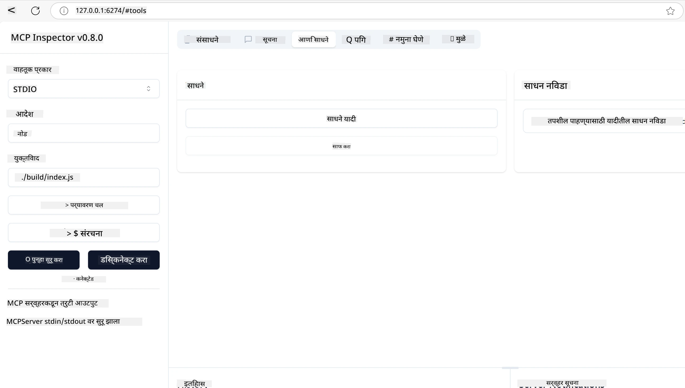
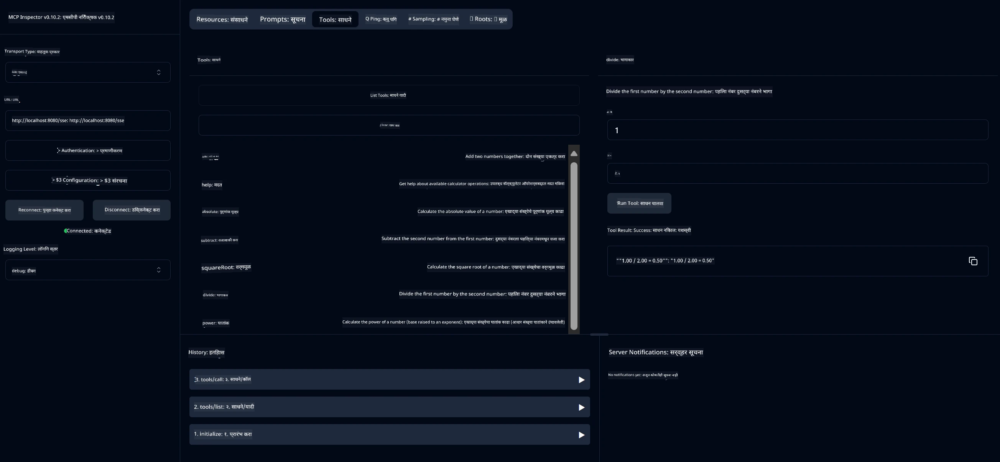
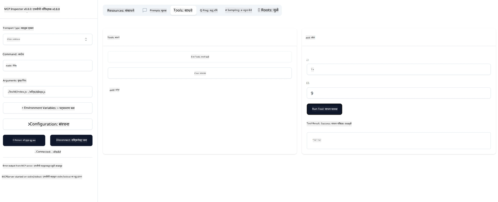

# MCP सह सुरू करणे

> [!NOTE]
> या धड्यातील जावा HTTP उदाहरण जुना HTTP+SSE ट्रांसपोर्ट वापरते आणि MCP `2025-11-25` शी सुसंगत SDK साठी उद्दिष्टित आहे. नवीन रिमोट सर्व्हरसाठी, `2026-07-28` स्ट्रीम करण्यायोग्य HTTP ट्रांसपोर्ट वापरा आणि आपल्या SDK मध्ये समर्थन तपासा.
> 
> 


## अवलोकन

हा धडा MCP वातावरण सेट करण्याबाबत आणि आपले पहिले MCP अनुप्रयोग तयार करण्याबाबत प्रात्यक्षिक मार्गदर्शन प्रदान करतो. आपण आवश्यक साधने आणि फ्रेमवर्क सेट करणे, मूलभूत MCP सर्व्हर तयार करणे, होस्ट अनुप्रयोग तयार करणे आणि आपल्या अंमलबजावणीची चाचणी घेणे याबद्दल शिकाल.

Model Context Protocol (MCP) हा एक खुला प्रोटोकॉल आहे जो कसे अनुप्रयोग LLMs ला संदर्भ पुरवतात याची मानकीकरण करतो. MCP हा AI अनुप्रयोगांसाठी USB-C पोर्टसारखा आहे - तो AI मॉडेल्सना वेगवेगळ्या डेटा स्रोतांशी आणि साधनांशी जोडण्यासाठी मानक मार्ग पुरवतो.

## अध्ययन उद्दिष्टे

या धड्याच्या शेवटी, आपण हे करू शकाल:

- C#, Java, Python, TypeScript, आणि Rust मध्ये MCP साठी विकास वातावरण स्थापित करणे
- सानुकूल वैशिष्ट्यांसह (संसाधने, प्रांप्ट्स, आणि साधने) मूलभूत MCP सर्व्हर तयार करणे आणि तैनात करणे
- MCP सर्व्हरशी कनेक्ट करणारे होस्ट अनुप्रयोग तयार करणे
- MCP अंमलबजावणीची चाचणी आणि डीबग करणे

## आपल्या MCP वातावरणाची स्थापना

MCP सह काम करण्यापूर्वी, आपले विकास वातावरण तयार करणे आणि मूलभूत कार्यप्रवाह समजून घेणे महत्त्वाचे आहे. हा विभाग सुरुवातीच्या सेटअप चरणांतून आपल्याला मार्गदर्शन करेल जेणेकरून MCP सह सुरळीत सुरुवात होईल.

### आवश्यक पूर्वस्थिती

MCP विकासात उतरायच्या आधी, खात्री करा की आपल्याकडे आहे:

- **विकास वातावरण**: आपल्या निवडलेल्या भाषेसाठी (C#, Java, Python, TypeScript, किंवा Rust)
- **IDE/एडिटर**: Visual Studio, Visual Studio Code, IntelliJ, Eclipse, PyCharm, किंवा कोणताही आधुनिक कोड संपादक
- **पॅकेज व्यवस्थापक**: NuGet, Maven/Gradle, pip, npm/yarn, किंवा Cargo
- **API Keys**: आपल्या होस्ट अनुप्रयोगांत वापरण्यासाठी कोणत्याही AI सेवेची कीज

## मूलभूत MCP सर्व्हर संरचना

एका MCP सर्व्हरमध्ये सामान्यतः समाविष्ट असते:

- **सर्व्हर कॉन्फिगरेशन**: पोर्ट, प्रमाणीकरण आणि इतर सेटिंग्ज सेट करणे
- **संसाधने**: LLMs ला उपलब्ध असलेला डेटा आणि संदर्भ
- **साधने**: कार्यक्षमता जी मॉडेल्स कॉल करू शकतात
- **प्रांप्ट्स**: मजकूर तयार करण्यासाठी किंवा रचनेचे साचा

येथे TypeScript मध्ये एक साधे उदाहरण आहे:

```typescript
import { McpServer, ResourceTemplate } from "@modelcontextprotocol/sdk/server/mcp.js";
import { StdioServerTransport } from "@modelcontextprotocol/sdk/server/stdio.js";
import { z } from "zod";

// MCP सर्व्हर तयार करा
const server = new McpServer({
  name: "Demo",
  version: "1.0.0"
});

// एक अधिक साधन जोडा
server.tool("add",
  { a: z.number(), b: z.number() },
  async ({ a, b }) => ({
    content: [{ type: "text", text: String(a + b) }]
  })
);

// एक गतिशील अभिवादन स्रोत जोडा
server.resource(
  "file",
  // 'list' पॅरामीटर संसाधन कसे उपलब्ध फायलींची यादी करते हे नियंत्रित करते. याला undefined वर सेट केल्यास या संसाधनासाठी यादीकरण अक्षम होतो.
  new ResourceTemplate("file://{path}", { list: undefined }),
  async (uri, { path }) => ({
    contents: [{
      uri: uri.href,
      text: `File, ${path}!`
    }]
  })
);

// एक फाईल स्रोत जोडा जो फाईलचे मजकूर वाचतो
server.resource(
  "file",
  new ResourceTemplate("file://{path}", { list: undefined }),
  async (uri, { path }) => {
    let text;
    try {
      text = await fs.readFile(path, "utf8");
    } catch (err) {
      text = `Error reading file: ${err.message}`;
    }
    return {
      contents: [{
        uri: uri.href,
        text
      }]
    };
  }
);

server.prompt(
  "review-code",
  { code: z.string() },
  ({ code }) => ({
    messages: [{
      role: "user",
      content: {
        type: "text",
        text: `Please review this code:\n\n${code}`
      }
    }]
  })
);

// stdin वरून संदेश प्राप्त करणे आणि stdout वर संदेश पाठवणे सुरू करा
const transport = new StdioServerTransport();
await server.connect(transport);
```

मागील कोडमध्ये आपण:

- MCP TypeScript SDK मधून आवश्यक वर्ग आयात केले.
- नवीन MCP सर्व्हर उदाहरण तयार केले आणि कॉन्फिगर केले.
- एक सानुकूल साधन (`calculator`) नोंदणीकृत केले ज्याचा हँडलर फंक्शन आहे.
- MCP विनंत्यांसाठी ऐकण्यास सर्व्हर सुरू केले.

## चाचणी व डीबगिंग

आपला MCP सर्व्हर तपासण्यापूर्वी, उपलब्ध साधने आणि डीबगिंगसाठी सर्वोत्तम पद्धती समजून घेणे आवश्यक आहे. प्रभावी चाचणी सुनिश्चित करते की आपला सर्व्हर अपेक्षेवाने वागत आहे आणि लवकर समस्यांचे निदान व निराकरण करण्यास मदत करते. पुढील विभागात आपल्याला MCP अंमलबजावणी वैधतेसाठी शिफारस केलेल्या पद्धती सांगितल्या आहेत.

MCP आपल्याला सर्व्हर तपासणी आणि डीबगिंगसाठी साधने प्रदान करते:

- **Inspector साधन**, हा ग्राफिकल इंटरफेस आपल्याला सर्व्हरशी कनेक्ट करून आपल्या साधने, प्रांप्ट्स आणि संसाधनांची चाचणी करण्यास अनुमती देतो.
- **curl**, आपण curl सारखे कमांड लाइन साधन किंवा अन्य क्लायंट वापरून आपल्या सर्व्हरशी कनेक्ट करू शकता जे HTTP आदेश तयार आणि चालवू शकतात.

### MCP Inspector वापरणे

[MCP Inspector](https://github.com/modelcontextprotocol/inspector) एक दृष्य चाचणी साधन आहे जे आपल्याला मदत करते:

1. **सर्व्हर क्षमता शोधा**: उपलब्ध संसाधने, साधने, आणि प्रांप्ट्स स्वयंचलितपणे शोधा
2. **साधन कार्यान्वयनाची चाचणी करा**: विविध पॅरामीटर्स वापरून रिअल-टाइम प्रतिसाद पहा
3. **सर्व्हर मेटाडेटा पहा**: सर्व्हर माहिती, स्कीमा आणि कॉन्फिगरेशन तपासा

```bash
# ex TypeScript, MCP Inspector स्थापित करणे आणि चालवणे
npx @modelcontextprotocol/inspector node build/index.js
```

वरील आदेश चालवल्यानंतर, MCP Inspector आपला वेब ब्राउझरमध्ये स्थानिक वेब इंटरफेस उघडेल. आपण आपल्या नोंदणीकृत MCP सर्व्हर, त्यांची उपलब्ध साधने, संसाधने, आणि प्रांप्ट्स दर्शवणारा डॅशबोर्ड पाहू शकता. इंटरफेस आपल्याला इंटरएक्टिव्हली साधन कार्यान्वयनाची चाचणी करण्यास, सर्व्हर मेटाडेटा तपासण्यास, आणि रिअल-टाइम प्रतिसाद पाहण्यास अनुमती देते, ज्यामुळे आपल्या MCP सर्व्हर अंमलबजावणीची वैधता आणि डीबगिंग सोपी होते.

त्याचे स्क्रीनशॉट असा दिसू शकतो:



## सामान्य सेटअप समस्या आणि निराकरणे

| समस्या | शक्य निराकरणे |
|-------|-------------------|
| कनेक्शन नाकारले गेले | तपासा की सर्व्हर चालू आहे आणि पोर्ट बरोबर आहे |
| साधन कार्यान्वयन त्रुटी | पॅरामीटर पडताळणी आणि त्रुटी हाताळणी पुनरावलोकन करा |
| प्रमाणीकरण अयशस्वी | API कीज आणि परवानग्या तपासा |
| स्कीमा पडताळणी त्रुटी | पॅरामीटर्स परिभाषित स्कीमाशी जुळतात याची खात्री करा |
| सर्व्हर सुरू होत नाही | पोर्ट संघर्ष किंवा हरवलेल्या अवलंबनांवर लक्ष द्या |
| CORS त्रुटी | क्रॉस-ओरिजिन विनंत्यांसाठी योग्य CORS हेडर्स कॉन्फिगर करा |
| प्रमाणीकरण समस्या | टोकन वैधता आणि परवानग्या तपासा |

## स्थानिक विकास

स्थानिक विकास आणि चाचणीसाठी, आपण आपल्या मशीनवर थेट MCP सर्व्हर चालवू शकता:

1. **सर्व्हर प्रक्रिया सुरू करा**: आपला MCP सर्व्हर अनुप्रयोग चालवा
2. **नेटवर्किंग कॉन्फिगर करा**: खात्री करा की सर्व्हर अपेक्षित पोर्टवर उपलब्ध आहे
3. **क्लायंट कनेक्ट करा**: `http://localhost:3000` सारखे स्थानिक कनेक्शन URL वापरा

```bash
# उदाहरण: स्थानिकरित्या TypeScript MCP सर्व्हर चालू करणे
npm run start
# सर्व्हर http://localhost:3000 येथे चालू आहे
```

## आपला पहिला MCP सर्व्हर तयार करणे

आपण पूर्वीच्या धड्यात [कोर संकल्पना](../../01-CoreConcepts/README.md) पाहिल्या, आता ती ज्ञान वापरायची वेळ आली आहे.

### एक सर्व्हर काय करू शकतो

कोड लिहिण्यापूर्वी, आपण लक्षात ठेवूया की सर्व्हर काय करू शकतो:

एक MCP सर्व्हर खालीलप्रमाणे करू शकतो:

- स्थानिक फाइल्स आणि डेटाबेसमध्ये प्रवेश करणे
- रिमोट API शी कनेक्ट करणे
- गणना करणे
- इतर साधने आणि सेवा एकत्रित करणे
- संवादासाठी वापरकर्ता इंटरफेस पुरवणे

छान, आता आपण काय करू शकतो ते समजले, तर कोडींग सुरू करूया.

## सराव: एक सर्व्हर तयार करणे

एक सर्व्हर तयार करण्यासाठी, खालील टप्पे पाळा:

- MCP SDK इन्स्टॉल करा.
- एक प्रोजेक्ट तयार करा आणि प्रोजेक्ट संरचना सेट करा.
- सर्व्हर कोड लिहा.
- सर्व्हरची चाचणी करा.

### -1- प्रोजेक्ट तयार करा

#### TypeScript

```sh
# प्रकल्प निर्देशिका तयार करा आणि npm प्रकल्प सुरू करा
mkdir calculator-server
cd calculator-server
npm init -y
```

#### Python

```sh
# प्रोजेक्ट डिरेक्टरी तयार करा
mkdir calculator-server
cd calculator-server
# Visual Studio Code मध्ये फोल्डर उघडा - जर तुम्ही वेगळे IDE वापरत असाल तर हे वगळा
code .
```

#### .NET

```sh
dotnet new console -n McpCalculatorServer
cd McpCalculatorServer
```

#### Java

जावासाठी, Spring Boot प्रोजेक्ट तयार करा:

```bash
curl https://start.spring.io/starter.zip \
  -d dependencies=web \
  -d javaVersion=21 \
  -d type=maven-project \
  -d groupId=com.example \
  -d artifactId=calculator-server \
  -d name=McpServer \
  -d packageName=com.microsoft.mcp.sample.server \
  -o calculator-server.zip
```

झिप फाइल एक्सट्रॅक्ट करा:

```bash
unzip calculator-server.zip -d calculator-server
cd calculator-server
# ऐच्छिक वापरात न असलेला चाचणी काढा
rm -rf src/test/java
```

आपल्या *pom.xml* फाईलमध्ये खालील संपूर्ण कॉन्फिगरेशन जोडा:

```xml
<?xml version="1.0" encoding="UTF-8"?>
<project xmlns="http://maven.apache.org/POM/4.0.0"
    xmlns:xsi="http://www.w3.org/2001/XMLSchema-instance"
    xsi:schemaLocation="http://maven.apache.org/POM/4.0.0 http://maven.apache.org/xsd/maven-4.0.0.xsd">
    <modelVersion>4.0.0</modelVersion>
    
    <!-- Spring Boot parent for dependency management -->
    <parent>
        <groupId>org.springframework.boot</groupId>
        <artifactId>spring-boot-starter-parent</artifactId>
        <version>3.5.0</version>
        <relativePath />
    </parent>

    <!-- Project coordinates -->
    <groupId>com.example</groupId>
    <artifactId>calculator-server</artifactId>
    <version>0.0.1-SNAPSHOT</version>
    <name>Calculator Server</name>
    <description>Basic calculator MCP service for beginners</description>

    <!-- Properties -->
    <properties>
        <java.version>21</java.version>
        <maven.compiler.source>21</maven.compiler.source>
        <maven.compiler.target>21</maven.compiler.target>
    </properties>

    <!-- Spring AI BOM for version management -->
    <dependencyManagement>
        <dependencies>
            <dependency>
                <groupId>org.springframework.ai</groupId>
                <artifactId>spring-ai-bom</artifactId>
                <version>1.0.0-SNAPSHOT</version>
                <type>pom</type>
                <scope>import</scope>
            </dependency>
        </dependencies>
    </dependencyManagement>

    <!-- Dependencies -->
    <dependencies>
        <dependency>
            <groupId>org.springframework.ai</groupId>
            <artifactId>spring-ai-starter-mcp-server-webflux</artifactId>
        </dependency>
        <dependency>
            <groupId>org.springframework.boot</groupId>
            <artifactId>spring-boot-starter-actuator</artifactId>
        </dependency>
        <dependency>
         <groupId>org.springframework.boot</groupId>
         <artifactId>spring-boot-starter-test</artifactId>
         <scope>test</scope>
      </dependency>
    </dependencies>

    <!-- Build configuration -->
    <build>
        <plugins>
            <plugin>
                <groupId>org.springframework.boot</groupId>
                <artifactId>spring-boot-maven-plugin</artifactId>
            </plugin>
            <plugin>
                <groupId>org.apache.maven.plugins</groupId>
                <artifactId>maven-compiler-plugin</artifactId>
                <configuration>
                    <release>21</release>
                </configuration>
            </plugin>
        </plugins>
    </build>

    <!-- Repositories for Spring AI snapshots -->
    <repositories>
        <repository>
            <id>spring-milestones</id>
            <name>Spring Milestones</name>
            <url>https://repo.spring.io/milestone</url>
            <snapshots>
                <enabled>false</enabled>
            </snapshots>
        </repository>
        <repository>
            <id>spring-snapshots</id>
            <name>Spring Snapshots</name>
            <url>https://repo.spring.io/snapshot</url>
            <releases>
                <enabled>false</enabled>
            </releases>
        </repository>
    </repositories>
</project>
```

#### Rust

```sh
mkdir calculator-server
cd calculator-server
cargo init
```

### -2- डिपेंडन्सीज जोडा

आता की आपण प्रोजेक्ट तयार केला आहे, पुढे dependencies जोडा:

#### TypeScript

```sh
# जर आधीपासून स्थापित नसेल, तर टाइपस्क्रिप्ट ग्लोबली स्थापित करा
npm install typescript -g

# स्कीमा सत्यापनासाठी MCP SDK आणि Zod स्थापित करा
npm install @modelcontextprotocol/sdk zod
npm install -D @types/node typescript
```

#### Python

```sh
# एक आभासी वातावरण तयार करा आणि अवलंबित्वे स्थापित करा
python -m venv venv
venv\Scripts\activate
pip install "mcp[cli]"
```

#### Java

```bash
cd calculator-server
./mvnw clean install -DskipTests
```

#### Rust

```sh
cargo add rmcp --features server,transport-io
cargo add serde
cargo add tokio --features rt-multi-thread
```

### -3- प्रोजेक्ट फायली तयार करा

#### TypeScript

*package.json* फाईल उघडा आणि खालील सामग्रीने बदला, जेणेकरून आपण सर्व्हर बनवू आणि चालवू शकाल:

```json
{
  "name": "calculator-server",
  "version": "1.0.0",
  "main": "index.js",
  "type": "module",
  "scripts": {
    "build": "tsc",
    "start": "npm run build && node ./build/index.js",
  },
  "keywords": [],
  "author": "",
  "license": "ISC",
  "description": "A simple calculator server using Model Context Protocol",
  "dependencies": {
    "@modelcontextprotocol/sdk": "^1.16.0",
    "zod": "^3.25.76"
  },
  "devDependencies": {
    "@types/node": "^24.0.14",
    "typescript": "^5.8.3"
  }
}
```

खालील सामग्रीसह *tsconfig.json* तयार करा:

```json
{
  "compilerOptions": {
    "target": "ES2022",
    "module": "Node16",
    "moduleResolution": "Node16",
    "outDir": "./build",
    "rootDir": "./src",
    "strict": true,
    "esModuleInterop": true,
    "skipLibCheck": true,
    "forceConsistentCasingInFileNames": true
  },
  "include": ["src/**/*"],
  "exclude": ["node_modules"]
}
```

आपला स्रोत कोडसाठी एक निर्देशिका तयार करा:

```sh
mkdir src
touch src/index.ts
```

#### Python

*server.py* नावाची एक फाईल तयार करा

```sh
touch server.py
```

#### .NET

आवश्यक NuGet पॅकेजेस इन्स्टॉल करा:

```sh
dotnet add package ModelContextProtocol --prerelease
dotnet add package Microsoft.Extensions.Hosting
```

#### Java

Java Spring Boot प्रोजेक्टसाठी, प्रोजेक्ट संरचना आपोआप तयार होते.

#### Rust

Rust साठी, `cargo init` रन केल्यावर *src/main.rs* फाईल आपोआप तयार होते. ती फाईल उघडा आणि डीफॉल्ट कोड हटवा.

### -4- सर्व्हर कोड तयार करा

#### TypeScript

*index.ts* नावाची एक फाईल तयार करा आणि खालील कोड जोडा:

```typescript
import { McpServer, ResourceTemplate } from "@modelcontextprotocol/sdk/server/mcp.js";
import { StdioServerTransport } from "@modelcontextprotocol/sdk/server/stdio.js";
import { z } from "zod";
 
// एक MCP सर्व्हर तयार करा
const server = new McpServer({
  name: "Calculator MCP Server",
  version: "1.0.0"
});
```

आता आपल्याकडे एक सर्व्हर आहे, पण तो फारसा काही करत नाही, ते दुरुस्त करूया.

#### Python

```python
# server.py
from mcp.server.fastmcp import FastMCP

# एक MCP सर्व्हर तयार करा
mcp = FastMCP("Demo")
```

#### .NET

```csharp
using Microsoft.Extensions.DependencyInjection;
using Microsoft.Extensions.Hosting;
using Microsoft.Extensions.Logging;
using ModelContextProtocol.Server;
using System.ComponentModel;

var builder = Host.CreateApplicationBuilder(args);
builder.Logging.AddConsole(consoleLogOptions =>
{
    // Configure all logs to go to stderr
    consoleLogOptions.LogToStandardErrorThreshold = LogLevel.Trace;
});

builder.Services
    .AddMcpServer()
    .WithStdioServerTransport()
    .WithToolsFromAssembly();
await builder.Build().RunAsync();

// add features
```

#### Java

जावासाठी, मुख्य सर्व्हर घटक तयार करा. प्रथम मुख्य अनुप्रयोग वर्ग सुधारित करा:

*src/main/java/com/microsoft/mcp/sample/server/McpServerApplication.java*:

```java
package com.microsoft.mcp.sample.server;

import org.springframework.ai.tool.ToolCallbackProvider;
import org.springframework.ai.tool.method.MethodToolCallbackProvider;
import org.springframework.boot.SpringApplication;
import org.springframework.boot.autoconfigure.SpringBootApplication;
import org.springframework.context.annotation.Bean;
import com.microsoft.mcp.sample.server.service.CalculatorService;

@SpringBootApplication
public class McpServerApplication {

    public static void main(String[] args) {
        SpringApplication.run(McpServerApplication.class, args);
    }
    
    @Bean
    public ToolCallbackProvider calculatorTools(CalculatorService calculator) {
        return MethodToolCallbackProvider.builder().toolObjects(calculator).build();
    }
}
```

कॅल्क्युलेटर सेवा तयार करा *src/main/java/com/microsoft/mcp/sample/server/service/CalculatorService.java*:

```java
package com.microsoft.mcp.sample.server.service;

import org.springframework.ai.tool.annotation.Tool;
import org.springframework.stereotype.Service;

/**
 * Service for basic calculator operations.
 * This service provides simple calculator functionality through MCP.
 */
@Service
public class CalculatorService {

    /**
     * Add two numbers
     * @param a The first number
     * @param b The second number
     * @return The sum of the two numbers
     */
    @Tool(description = "Add two numbers together")
    public String add(double a, double b) {
        double result = a + b;
        return formatResult(a, "+", b, result);
    }

    /**
     * Subtract one number from another
     * @param a The number to subtract from
     * @param b The number to subtract
     * @return The result of the subtraction
     */
    @Tool(description = "Subtract the second number from the first number")
    public String subtract(double a, double b) {
        double result = a - b;
        return formatResult(a, "-", b, result);
    }

    /**
     * Multiply two numbers
     * @param a The first number
     * @param b The second number
     * @return The product of the two numbers
     */
    @Tool(description = "Multiply two numbers together")
    public String multiply(double a, double b) {
        double result = a * b;
        return formatResult(a, "*", b, result);
    }

    /**
     * Divide one number by another
     * @param a The numerator
     * @param b The denominator
     * @return The result of the division
     */
    @Tool(description = "Divide the first number by the second number")
    public String divide(double a, double b) {
        if (b == 0) {
            return "Error: Cannot divide by zero";
        }
        double result = a / b;
        return formatResult(a, "/", b, result);
    }

    /**
     * Calculate the power of a number
     * @param base The base number
     * @param exponent The exponent
     * @return The result of raising the base to the exponent
     */
    @Tool(description = "Calculate the power of a number (base raised to an exponent)")
    public String power(double base, double exponent) {
        double result = Math.pow(base, exponent);
        return formatResult(base, "^", exponent, result);
    }

    /**
     * Calculate the square root of a number
     * @param number The number to find the square root of
     * @return The square root of the number
     */
    @Tool(description = "Calculate the square root of a number")
    public String squareRoot(double number) {
        if (number < 0) {
            return "Error: Cannot calculate square root of a negative number";
        }
        double result = Math.sqrt(number);
        return String.format("√%.2f = %.2f", number, result);
    }

    /**
     * Calculate the modulus (remainder) of division
     * @param a The dividend
     * @param b The divisor
     * @return The remainder of the division
     */
    @Tool(description = "Calculate the remainder when one number is divided by another")
    public String modulus(double a, double b) {
        if (b == 0) {
            return "Error: Cannot divide by zero";
        }
        double result = a % b;
        return formatResult(a, "%", b, result);
    }

    /**
     * Calculate the absolute value of a number
     * @param number The number to find the absolute value of
     * @return The absolute value of the number
     */
    @Tool(description = "Calculate the absolute value of a number")
    public String absolute(double number) {
        double result = Math.abs(number);
        return String.format("|%.2f| = %.2f", number, result);
    }

    /**
     * Get help about available calculator operations
     * @return Information about available operations
     */
    @Tool(description = "Get help about available calculator operations")
    public String help() {
        return "Basic Calculator MCP Service\n\n" +
               "Available operations:\n" +
               "1. add(a, b) - Adds two numbers\n" +
               "2. subtract(a, b) - Subtracts the second number from the first\n" +
               "3. multiply(a, b) - Multiplies two numbers\n" +
               "4. divide(a, b) - Divides the first number by the second\n" +
               "5. power(base, exponent) - Raises a number to a power\n" +
               "6. squareRoot(number) - Calculates the square root\n" + 
               "7. modulus(a, b) - Calculates the remainder of division\n" +
               "8. absolute(number) - Calculates the absolute value\n\n" +
               "Example usage: add(5, 3) will return 5 + 3 = 8";
    }

    /**
     * Format the result of a calculation
     */
    private String formatResult(double a, String operator, double b, double result) {
        return String.format("%.2f %s %.2f = %.2f", a, operator, b, result);
    }
}
```

**उत्पादन-तयार सेवेसाठी ऐच्छिक घटक:**

स्टार्टअप कॉन्फिगरेशन तयार करा *src/main/java/com/microsoft/mcp/sample/server/config/StartupConfig.java*:

```java
package com.microsoft.mcp.sample.server.config;

import org.springframework.boot.CommandLineRunner;
import org.springframework.context.annotation.Bean;
import org.springframework.context.annotation.Configuration;

@Configuration
public class StartupConfig {
    
    @Bean
    public CommandLineRunner startupInfo() {
        return args -> {
            System.out.println("\n" + "=".repeat(60));
            System.out.println("Calculator MCP Server is starting...");
            System.out.println("SSE endpoint: http://localhost:8080/sse");
            System.out.println("Health check: http://localhost:8080/actuator/health");
            System.out.println("=".repeat(60) + "\n");
        };
    }
}
```

हेल्थ कंट्रोलर तयार करा *src/main/java/com/microsoft/mcp/sample/server/controller/HealthController.java*:

```java
package com.microsoft.mcp.sample.server.controller;

import org.springframework.http.ResponseEntity;
import org.springframework.web.bind.annotation.GetMapping;
import org.springframework.web.bind.annotation.RestController;
import java.time.LocalDateTime;
import java.util.HashMap;
import java.util.Map;

@RestController
public class HealthController {
    
    @GetMapping("/health")
    public ResponseEntity<Map<String, Object>> healthCheck() {
        Map<String, Object> response = new HashMap<>();
        response.put("status", "UP");
        response.put("timestamp", LocalDateTime.now().toString());
        response.put("service", "Calculator MCP Server");
        return ResponseEntity.ok(response);
    }
}
```

अपवाद हँडलर तयार करा *src/main/java/com/microsoft/mcp/sample/server/exception/GlobalExceptionHandler.java*:

```java
package com.microsoft.mcp.sample.server.exception;

import org.springframework.http.HttpStatus;
import org.springframework.http.ResponseEntity;
import org.springframework.web.bind.annotation.ExceptionHandler;
import org.springframework.web.bind.annotation.RestControllerAdvice;

@RestControllerAdvice
public class GlobalExceptionHandler {

    @ExceptionHandler(IllegalArgumentException.class)
    public ResponseEntity<ErrorResponse> handleIllegalArgumentException(IllegalArgumentException ex) {
        ErrorResponse error = new ErrorResponse(
            "Invalid_Input", 
            "Invalid input parameter: " + ex.getMessage());
        return new ResponseEntity<>(error, HttpStatus.BAD_REQUEST);
    }

    public static class ErrorResponse {
        private String code;
        private String message;

        public ErrorResponse(String code, String message) {
            this.code = code;
            this.message = message;
        }

        // गेटर्स
        public String getCode() { return code; }
        public String getMessage() { return message; }
    }
}
```

सानुकूल बॅनर तयार करा *src/main/resources/banner.txt*:

```text
_____      _            _       _             
 / ____|    | |          | |     | |            
| |     __ _| | ___ _   _| | __ _| |_ ___  _ __ 
| |    / _` | |/ __| | | | |/ _` | __/ _ \| '__|
| |___| (_| | | (__| |_| | | (_| | || (_) | |   
 \_____\__,_|_|\___|\__,_|_|\__,_|\__\___/|_|   
                                                
Calculator MCP Server v1.0
Spring Boot MCP Application
```

</details>

#### Rust

पुढील कोड *src/main.rs* फाईलच्या सुरुवातीला जोडा. हे आपल्याला आवश्यक ग्रंथालये आणि मॉड्यूल आयात करेल आपल्या MCP सर्व्हरसाठी.

```rust
use rmcp::{
    handler::server::{router::tool::ToolRouter, tool::Parameters},
    model::{ServerCapabilities, ServerInfo},
    schemars, tool, tool_handler, tool_router,
    transport::stdio,
    ServerHandler, ServiceExt,
};
use std::error::Error;
```

कॅल्क्युलेटर सर्व्हर एक सोपा असेल ज्याने दोन संख्यांची बेरीज करू शकते. आपण कॅल्क्युलेटर विनंतीसाठी एक struct तयार करूया.

```rust
#[derive(Debug, serde::Deserialize, schemars::JsonSchema)]
pub struct CalculatorRequest {
    pub a: f64,
    pub b: f64,
}
```

पुढे, कॅल्क्युलेटर सर्व्हरसाठी एक struct तयार करा. हा struct टूल राउटर धारित करेल, ज्याचा उपयोग साधने नोंदवण्यासाठी होतो.

```rust
#[derive(Debug, Clone)]
pub struct Calculator {
    tool_router: ToolRouter<Self>,
}
```

आता आपण `Calculator` struct अंमलबजावणी करू शकतो नवीन सर्व्हरचे उदाहरण तयार करण्यासाठी आणि सर्व्हर हँडलर तयार करण्यासाठी जे सर्व्हरची माहिती पुरवतो.

```rust
#[tool_router]
impl Calculator {
    pub fn new() -> Self {
        Self {
            tool_router: Self::tool_router(),
        }
    }
}

#[tool_handler]
impl ServerHandler for Calculator {
    fn get_info(&self) -> ServerInfo {
        ServerInfo {
            instructions: Some("A simple calculator tool".into()),
            capabilities: ServerCapabilities::builder().enable_tools().build(),
            ..Default::default()
        }
    }
}
```

शेवटी, आपल्याला मुख्य फंक्शन अंमलबजावणी करावी लागेल सर्व्हर सुरू करण्यासाठी. हे फंक्शन `Calculator` struct चे उदाहरण तयार करेल आणि मानक इनपुट/आउटपुटद्वारे सेवा देईल.

```rust
#[tokio::main]
async fn main() -> Result<(), Box<dyn Error>> {
    let service = Calculator::new().serve(stdio()).await?;
    service.waiting().await?;
    Ok(())
}
```

सर्व्हर आता स्वतःबद्दल मूलभूत माहिती प्रदान करण्यासाठी तयार आहे. पुढे, आपण बेरीज करण्यासाठी एक साधन जोडा.

### -5- साधन आणि संसाधन जोडणे

खालील कोड जोडून एक साधन आणि संसाधन जोडा:

#### TypeScript

```typescript
server.tool(
  "add",
  { a: z.number(), b: z.number() },
  async ({ a, b }) => ({
    content: [{ type: "text", text: String(a + b) }]
  })
);

server.resource(
  "greeting",
  new ResourceTemplate("greeting://{name}", { list: undefined }),
  async (uri, { name }) => ({
    contents: [{
      uri: uri.href,
      text: `Hello, ${name}!`
    }]
  })
);
```

आपल्या साधनाला `a` आणि `b` हे पॅरामीटर्स लागतात आणि ते खालील स्वरूपात प्रतिसाद तयार करणारे कार्य चालवते:

```typescript
{
  contents: [{
    type: "text", content: "some content"
  }]
}
```

आपला संसाधन "greeting" स्ट्रिंगद्वारे प्रवेशयोग्य आहे आणि `name` पॅरामीटर घेतो, तसेच साधनासारखा प्रतिसाद तयार करतो:

```typescript
{
  uri: "<href>",
  text: "a text"
}
```

#### Python

```python
# एक बेरीज साधन जोडा
@mcp.tool()
def add(a: int, b: int) -> int:
    """Add two numbers"""
    return a + b


# एक गतिशील अभिवादन स्त्रोत जोडा
@mcp.resource("greeting://{name}")
def get_greeting(name: str) -> str:
    """Get a personalized greeting"""
    return f"Hello, {name}!"
```

मागील कोडमध्ये आपण:

- एक `add` साधन परिभाषित केले ज्याने `a` व `b` नावाचे दोन पूर्णांक पॅरामीटर्स घेतले.
- `greeting` नावाचा एक संसाधन तयार केला जो `name` पॅरामीटर घेतो.

#### .NET

हा कोड आपल्या Program.cs फाईलमध्ये जोडा:

```csharp
[McpServerToolType]
public static class CalculatorTool
{
    [McpServerTool, Description("Adds two numbers")]
    public static string Add(int a, int b) => $"Sum {a + b}";
}
```

#### Java

साधने आधीच मागील टप्प्यात तयार झाली आहेत.

#### Rust

`impl Calculator` ब्लॉकमध्ये एक नवीन साधन जोडा:

```rust
#[tool(description = "Adds a and b")]
async fn add(
    &self,
    Parameters(CalculatorRequest { a, b }): Parameters<CalculatorRequest>,
) -> String {
    (a + b).to_string()
}
```

### -6- अंतिम कोड

आपण सर्व्हर सुरू करण्यासाठी आवश्यक शेवटचा कोड जोडा:

#### TypeScript

```typescript
// stdin वर संदेश प्राप्त करणे सुरू करा आणि stdout वर संदेश पाठवणे सुरू करा
const transport = new StdioServerTransport();
await server.connect(transport);
```

येथे पूर्ण कोड आहे:

```typescript
// index.ts
import { McpServer, ResourceTemplate } from "@modelcontextprotocol/sdk/server/mcp.js";
import { StdioServerTransport } from "@modelcontextprotocol/sdk/server/stdio.js";
import { z } from "zod";

// एक MCP सर्व्हर तयार करा
const server = new McpServer({
  name: "Calculator MCP Server",
  version: "1.0.0"
});

// एक बेरीज साधन जोडा
server.tool(
  "add",
  { a: z.number(), b: z.number() },
  async ({ a, b }) => ({
    content: [{ type: "text", text: String(a + b) }]
  })
);

// एक गतिशील अभिवादन संसाधन जोडा
server.resource(
  "greeting",
  new ResourceTemplate("greeting://{name}", { list: undefined }),
  async (uri, { name }) => ({
    contents: [{
      uri: uri.href,
      text: `Hello, ${name}!`
    }]
  })
);

// stdin वर संदेश प्राप्त करणे आणि stdout वर संदेश पाठवणे सुरू करा
const transport = new StdioServerTransport();
server.connect(transport);
```

#### Python

```python
# server.py
from mcp.server.fastmcp import FastMCP

# एक MCP सर्व्हर तयार करा
mcp = FastMCP("Demo")


# एक बेरीज साधन जोडा
@mcp.tool()
def add(a: int, b: int) -> int:
    """Add two numbers"""
    return a + b


# एक डायनॅमिक अभिवादन स्त्रोत जोडा
@mcp.resource("greeting://{name}")
def get_greeting(name: str) -> str:
    """Get a personalized greeting"""
    return f"Hello, {name}!"

# मुख्य अंमलबजावणी ब्लॉक - सर्व्हर चालवण्यासाठी हे आवश्यक आहे
if __name__ == "__main__":
    mcp.run()
```

#### .NET

खालील सामग्रीसह Program.cs फाईल तयार करा:

```csharp
using Microsoft.Extensions.DependencyInjection;
using Microsoft.Extensions.Hosting;
using Microsoft.Extensions.Logging;
using ModelContextProtocol.Server;
using System.ComponentModel;

var builder = Host.CreateApplicationBuilder(args);
builder.Logging.AddConsole(consoleLogOptions =>
{
    // Configure all logs to go to stderr
    consoleLogOptions.LogToStandardErrorThreshold = LogLevel.Trace;
});

builder.Services
    .AddMcpServer()
    .WithStdioServerTransport()
    .WithToolsFromAssembly();
await builder.Build().RunAsync();

[McpServerToolType]
public static class CalculatorTool
{
    [McpServerTool, Description("Adds two numbers")]
    public static string Add(int a, int b) => $"Sum {a + b}";
}
```

#### Java

आपली पूर्ण मुख्य अनुप्रयोग वर्ग अशी दिसेल:

```java
// McpServerApplication.java
package com.microsoft.mcp.sample.server;

import org.springframework.ai.tool.ToolCallbackProvider;
import org.springframework.ai.tool.method.MethodToolCallbackProvider;
import org.springframework.boot.SpringApplication;
import org.springframework.boot.autoconfigure.SpringBootApplication;
import org.springframework.context.annotation.Bean;
import com.microsoft.mcp.sample.server.service.CalculatorService;

@SpringBootApplication
public class McpServerApplication {

    public static void main(String[] args) {
        SpringApplication.run(McpServerApplication.class, args);
    }
    
    @Bean
    public ToolCallbackProvider calculatorTools(CalculatorService calculator) {
        return MethodToolCallbackProvider.builder().toolObjects(calculator).build();
    }
}
```

#### Rust

Rust सर्व्हरसाठी अंतिम कोड अशी दिसेल:

```rust
use rmcp::{
    ServerHandler, ServiceExt,
    handler::server::{router::tool::ToolRouter, tool::Parameters},
    model::{ServerCapabilities, ServerInfo},
    schemars, tool, tool_handler, tool_router,
    transport::stdio,
};
use std::error::Error;

#[derive(Debug, serde::Deserialize, schemars::JsonSchema)]
pub struct CalculatorRequest {
    pub a: f64,
    pub b: f64,
}

#[derive(Debug, Clone)]
pub struct Calculator {
    tool_router: ToolRouter<Self>,
}

#[tool_router]
impl Calculator {
    pub fn new() -> Self {
        Self {
            tool_router: Self::tool_router(),
        }
    }
    
    #[tool(description = "Adds a and b")]
    async fn add(
        &self,
        Parameters(CalculatorRequest { a, b }): Parameters<CalculatorRequest>,
    ) -> String {
        (a + b).to_string()
    }
}

#[tool_handler]
impl ServerHandler for Calculator {
    fn get_info(&self) -> ServerInfo {
        ServerInfo {
            instructions: Some("A simple calculator tool".into()),
            capabilities: ServerCapabilities::builder().enable_tools().build(),
            ..Default::default()
        }
    }
}

#[tokio::main]
async fn main() -> Result<(), Box<dyn Error>> {
    let service = Calculator::new().serve(stdio()).await?;
    service.waiting().await?;
    Ok(())
}
```

### -7- सर्व्हरची चाचणी करा

खालील आदेशाने सर्व्हर सुरू करा:

#### TypeScript

```sh
npm run build
```

#### Python

```sh
mcp run server.py
```

> MCP Inspector वापरण्यासाठी, `mcp dev server.py` वापरा ज्याने आपोआप Inspector सुरू होईल आणि आवश्यक प्रॉक्सी सत्र टोकन प्रदान करेल. `mcp run server.py` वापरत असाल तर, आपल्याला मॅन्युअली Inspector सुरू करावा लागेल आणि कनेक्शन कॉन्फिगर करावे लागेल.

#### .NET

खात्री करा की आपण आपल्या प्रोजेक्ट निर्देशिकेत आहात:

```sh
cd McpCalculatorServer
dotnet run
```

#### Java

```bash
./mvnw clean install -DskipTests
java -jar target/calculator-server-0.0.1-SNAPSHOT.jar
```

#### Rust

सर्व्हर फॉरमॅट आणि चालवण्यासाठी खालील आदेश चालवा:

```sh
cargo fmt
cargo run
```

### -8- Inspector वापरून चालवा

Inspector एक छान साधन आहे जे आपला सर्व्हर सुरू करू शकते आणि आपण त्याच्याशी संवाद करून त्याची कार्यक्षमता तपासू शकता. चला तो सुरू करूया:

> [!NOTE]
> "command" फील्डमध्ये हा वेगळा दिसू शकतो कारण तो आपल्या विशिष्ट रनटाइमसाठी सर्व्हर चालवण्याचा आदेश असू शकतो.

#### TypeScript

```sh
npx @modelcontextprotocol/inspector node build/index.js
```

किंवा आपली *package.json* मध्ये `"inspector": "npx @modelcontextprotocol/inspector node build/index.js"` असा एंट्री करा आणि मग `npm run inspector` चालवा

#### Python

Python मध्ये Node.js साधन inspector वापरले गेले आहे. हे साधन असे कॉल करता येते:

```sh
mcp dev server.py
```


तथापि, हे टूलवरील सर्व पद्धती अंमलात आणत नाही, त्यामुळे तुम्हाला खालीलप्रमाणे देणारी Node.js टूल थेट चालवण्याचा सल्ला दिला जातो:

```sh
npx @modelcontextprotocol/inspector mcp run server.py
```

जर तुम्ही स्क्रिप्ट चालवण्यासाठी आदेश आणि आर्ग्युमेंट्स कॉन्फिगर करू शकणारे टूल किंवा IDE वापरत असाल, तर
`Command` फील्डमध्ये `python` आणि `Arguments` मध्ये `server.py` सेट करणे सुनिश्चित करा. यामुळे स्क्रिप्ट बरोबर कार्य करते.

#### .NET

खात्री करा की तुम्ही तुमच्या प्रोजेक्ट डायरेक्टरीमध्ये आहात:

```sh
cd McpCalculatorServer
npx @modelcontextprotocol/inspector dotnet run
```

#### Java

खात्री करा की तुमचा कॅल्क्युलेटर सर्व्हर चालू आहे
नंतर इन्स्पेक्टर चालवा:

```cmd
npx @modelcontextprotocol/inspector
```

इन्स्पेक्टर वेब इंटरफेसमध्ये:

1. ट्रान्सपोर्ट प्रकार म्हणून "SSE" निवडा
2. URL सेट करा: `http://localhost:8080/sse`
3. "Connect" क्लिक करा



**तुम्ही आता सर्व्हरशी कनेक्ट प्रकारले आहात**
**Java सर्व्हर चाचणी विभाग आता पूर्ण झाला आहे**

पुढील विभाग म्हणजे सर्व्हरशी संवाद साधणे.

तुम्हाला पुढील युजर इंटरफेस दिसेल:


1. Connect बटण निवडून सर्व्हरशी कनेक्ट करा
   एकदा सर्व्हरशी कनेक्ट केल्यानंतर, तुम्हाला पुढील दिसेल:

   

1. "Tools" आणि "listTools" निवडा, "Add" दिसेल, "Add" निवडा आणि पॅरामीटर किमती भरा.

   तुम्हाला पुढील प्रतिसाद दिसेल, म्हणजे "add" टूलचा परिणाम:

   

अभिनंदन, तुम्ही तुमचा पहिला सर्व्हर तयार करून चालविला आहे!

#### Rust

MCP Inspector CLI सह Rust सर्व्हर चालविण्यासाठी, खालील कमांड वापरा:

```sh
npx @modelcontextprotocol/inspector cargo run --cli --method tools/call --tool-name add --tool-arg a=1 b=2
```

### अधिकृत SDKs

MCP अनेक भाषांसाठी अधिकृत SDKs प्रदान करते:

- [C# SDK](https://github.com/modelcontextprotocol/csharp-sdk) - Microsoft सोबत संयुक्तपणे देखभाल केली जाते
- [Java SDK](https://github.com/modelcontextprotocol/java-sdk) - Spring AI सोबत संयुक्तपणे देखभाल केली जाते
- [TypeScript SDK](https://github.com/modelcontextprotocol/typescript-sdk) - अधिकृत TypeScript अंमलबजावणी
- [Python SDK](https://github.com/modelcontextprotocol/python-sdk) - अधिकृत Python अंमलबजावणी
- [Kotlin SDK](https://github.com/modelcontextprotocol/kotlin-sdk) - अधिकृत Kotlin अंमलबजावणी
- [Swift SDK](https://github.com/modelcontextprotocol/swift-sdk) - Loopwork AI सोबत संयुक्तपणे देखभाल केली जाते
- [Rust SDK](https://github.com/modelcontextprotocol/rust-sdk) - अधिकृत Rust अंमलबजावणी

## मुख्य मुद्दे

- MCP विकास वातावरण सेट करणे भाषा-विशिष्ट SDKs सोबत सोपे आहे
- MCP सर्व्हर्स तयार करणे म्हणजे स्पष्ट स्कीमासह टूल तयार करणे आणि नोंदणी करणे
- विश्वसनीय MCP अंमलबजावणीसाठी चाचणी आणि डिबगिंग आवश्यक आहे

## नमुने

- [Java Calculator](../samples/java/calculator/README.md)
- [.NET Calculator](../../../../03-GettingStarted/samples/csharp)
- [JavaScript Calculator](../samples/javascript/README.md)
- [TypeScript Calculator](../samples/typescript/README.md)
- [Python Calculator](../../../../03-GettingStarted/samples/python)
- [Rust Calculator](../../../../03-GettingStarted/samples/rust)

## कार्यनिवृत्ती

तुम्ही निवडलेल्या टूलसह एक साधा MCP सर्व्हर तयार करा:

1. तुमच्या पसंतीच्या भाषेत टूल अंमलात आणा (.NET, Java, Python, TypeScript, किंवा Rust).
2. इनपुट पॅरामीटर्स आणि रिटर्न मूल्ये परिभाषित करा.
3. सर्व्हर योग्य प्रकारे काम करत असल्याची खात्री करण्यासाठी इन्स्पेक्टर टूल चालवा.
4. विविध इनपुटसह अंमलबजावणीची चाचणी करा.

## सोडवणूक

[Solution](./solution/README.md)

## अतिरिक्त स्त्रोत

- [Model Context Protocol वापरून Azure वर एजंट तयार करा](https://learn.microsoft.com/azure/developer/ai/intro-agents-mcp)
- [Azure Container Apps सह Remote MCP (Node.js/TypeScript/JavaScript)](https://learn.microsoft.com/samples/azure-samples/mcp-container-ts/mcp-container-ts/)
- [.NET OpenAI MCP Agent](https://learn.microsoft.com/samples/azure-samples/openai-mcp-agent-dotnet/openai-mcp-agent-dotnet/)

## पुढे काय

पुढे: [MCP क्लायंट्ससह प्रारंभ करणे](../02-client/README.md)

---

<!-- CO-OP TRANSLATOR DISCLAIMER START -->
**अस्वीकरण**:
हा दस्तऐवज AI भाषांतर सेवा [Co-op Translator](https://github.com/Azure/co-op-translator) चा वापर करून अनुवादित केला आहे. जरी आम्ही अचूकतेसाठी प्रयत्न करतो, तरी कृपया लक्षात घ्या की स्वयंचलित भाषांतरांमध्ये त्रुटी किंवा अचूकतेची कमतरता असू शकते. मूळ दस्तऐवज त्याच्या मूळ भाषेत अधिकृत स्रोत मानला पाहिजे. महत्त्वाची माहिती असल्यास, व्यावसायिक मानवी भाषांतराची शिफारस केली जाते. या भाषांतराच्या वापरामुळे उद्भवणाऱ्या कोणत्याही गैरसमज किंवा चुकीच्या अर्थलावणीसाठी आम्ही जबाबदार नाही.
<!-- CO-OP TRANSLATOR DISCLAIMER END -->