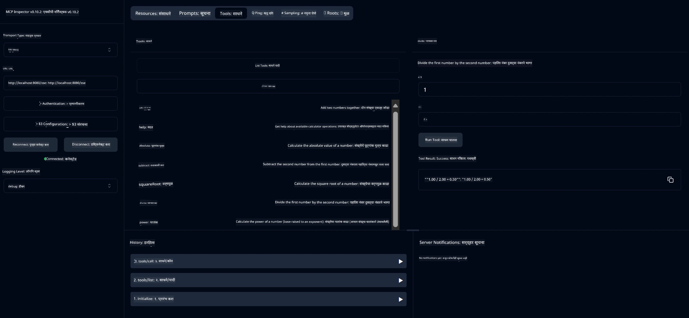

# बेसिक कॅल्क्युलेटर MCP सेवा

> [!NOTE]
> हा Java सोल्यूशन लेगसी HTTP+SSE ट्रान्सपोर्ट वापरतो आणि MCP `2025-11-25` शी सुसंगत SDK साठी आहे.
> हा कोर्स कोडशी जुळवून ठेवण्यासाठी राखीव आहे;
> नवीन रिमोट सर्व्हर्सनी `2026-07-28` स्ट्रीमबल HTTP सपोर्ट वापरावा.

ही सेवा Model Context Protocol (MCP) वापरून Spring Boot सह WebFlux ट्रान्सपोर्टद्वारे बेसिक कॅल्क्युलेटर ऑपरेशन्स प्रदान करते. हे MCP अंमलबजावणी शिकणाऱ्या नवशिक्यांसाठी एक सोपा उदाहरण म्हणून डिझाइन केले आहे.

अधिक माहितीसाठी [MCP सर्व्हर बूट स्टार्टर](https://docs.spring.io/spring-ai/reference/api/mcp/mcp-server-boot-starter-docs.html) संदर्भ दस्तऐवज पहा.


## सेवा वापरणे

सेवा खालील API एंडपॉइंटेस MCP प्रोटोकॉलद्वारे उघडते:

- `add(a, b)`: दोन संख्या एकत्र जोडणे
- `subtract(a, b)`: दुसऱ्या संख्येतून पहिली संख्या वजा करणे
- `multiply(a, b)`: दोन संख्या गुणाकार करणे
- `divide(a, b)`: पहिल्या संख्येचे दुसऱ्या संख्येने विभाजन (शून्य तपासणीसह)
- `power(base, exponent)`: एखाद्या संख्येची घातांक काढणे
- `squareRoot(number)`: संख्या चा वर्गमूळ काढणे (नकारात्मक संख्या तपासणीसह)
- `modulus(a, b)`: भागाकाराचे उरलेले भाग काढणे
- `absolute(number)`: मुळ्याचे अपूर्णांक मूल्य काढणे

## अवलंबित्वे

प्रकल्पासाठी खालील मुख्य अवलंबित्व आवश्यक आहेत:

```xml
<dependency>
    <groupId>org.springframework.ai</groupId>
    <artifactId>spring-ai-starter-mcp-server-webflux</artifactId>
</dependency>
```

## प्रकल्प बांधणी

Maven वापरून प्रकल्प तयार करा:
```bash
./mvnw clean install -DskipTests
```

## सर्व्हर चालविणे

### Java वापरणे

```bash
java -jar target/calculator-server-0.0.1-SNAPSHOT.jar
```

### MCP Inspector वापरणे

MCP Inspector हे MCP सेवा वापरण्यास उपयुक्त साधन आहे. या कॅल्क्युलेटर सेवेसह ते वापरण्यासाठी:

1. **MCP Inspector इन्स्टॉल आणि चालवा** नवीन टर्मिनल विंडोमध्ये:
   ```bash
   npx @modelcontextprotocol/inspector
   ```

2. **वेब UI मध्ये प्रवेश करा** अ‍ॅपद्वारे दाखवलेला URL क्लिक करून (साधारणपणे http://localhost:6274)

3. **कनेक्शन सेट करा**:
   - ट्रान्सपोर्ट प्रकार "SSE" सेट करा
   - चालू सर्व्हरच्या SSE एंडपॉइंटचा URL सेट करा: `http://localhost:8080/sse`
   - "Connect" वर क्लिक करा

4. **साधने वापरा**:
   - "List Tools" क्लिक करून उपलब्ध कॅल्क्युलेटर ऑपरेशन्स पहा
   - एखादे साधन निवडा आणि "Run Tool" क्लिक करून ऑपरेशन सुरु करा



---

<!-- CO-OP TRANSLATOR DISCLAIMER START -->
**अस्वीकरण**:
हा दस्तऐवज AI भाषांतर सेवा [Co-op Translator](https://github.com/Azure/co-op-translator) चा वापर करून अनुवादित केला आहे. जरी आम्ही अचूकतेसाठी प्रयत्न करतो, तरी कृपया लक्षात घ्या की स्वयंचलित भाषांतरांमध्ये त्रुटी किंवा अचूकतेची कमतरता असू शकते. मूळ दस्तऐवज त्याच्या मूळ भाषेत अधिकृत स्रोत मानला पाहिजे. महत्त्वाची माहिती असल्यास, व्यावसायिक मानवी भाषांतराची शिफारस केली जाते. या भाषांतराच्या वापरामुळे उद्भवणाऱ्या कोणत्याही गैरसमज किंवा चुकीच्या अर्थलावणीसाठी आम्ही जबाबदार नाही.
<!-- CO-OP TRANSLATOR DISCLAIMER END -->