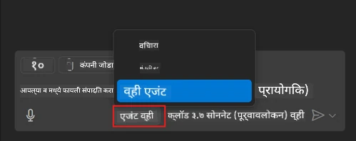
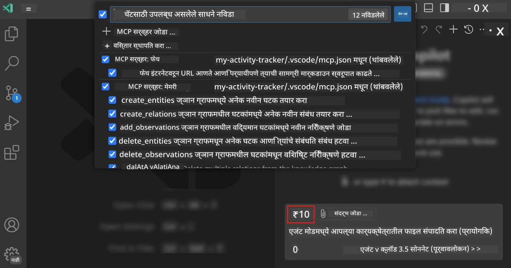
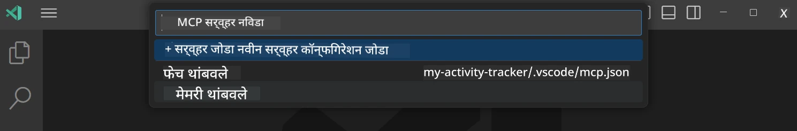
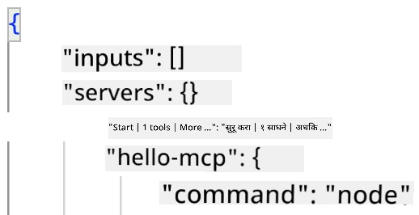
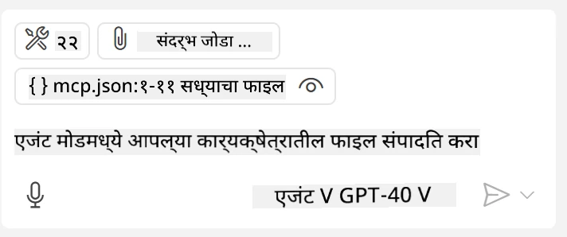
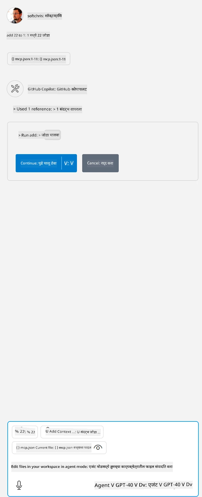

# GitHub Copilot एजंट मोडमधून सर्व्हर वापरणे

Visual Studio Code आणि GitHub Copilot क्लायंट म्हणून काम करू शकतात आणि MCP सर्व्हर वापरू शकतात. तुम्हाला विचार करता येईल की आपण असे का करू इच्छितो? याचा अर्थ असा आहे की जे काही MCP सर्व्हरच्या वैशिष्ट्यांमध्ये आहे ते आता तुमच्या IDE मधून वापरले जाऊ शकते. उदाहरणार्थ, तुम्ही GitHub चा MCP सर्व्हर जोडल्यास, तुम्हाला टर्मिनलमध्ये विशिष्ट कमांड टाइप करण्याऐवजी प्रॉम्प्टवरून GitHub नियंत्रित करता येईल. किंवा तुमच्या विकसक अनुभवात सुधारणा करणारे कोणतेही काही नैसर्गिक भाषेद्वारे नियंत्रित केले जाऊ शकते असा विचार करा. आता तुम्हाला फायदा दिसत आहे का?

## आढावा

हा धडा Visual Studio Code आणि GitHub Copilot चा एजंट मोड कसा क्लायंट म्हणून तुमच्या MCP सर्व्हरसाठी वापरायचा हे शिकवतो.

## शिकण्याची उद्दिष्टे

या धड्याच्या शेवटी, तुम्ही सक्षम असाल:

- Visual Studio Code मार्फत MCP सर्व्हर वापरणे.
- GitHub Copilot द्वारे टूल्ससारख्या क्षमते चालवणे.
- Visual Studio Code ला तुमचा MCP सर्व्हर सापडण्यासाठी आणि व्यवस्थापन करण्यासाठी कॉन्फिगर करणे.

## वापर

तुम्ही दोन वेगवेगळ्या पद्धतींनी तुमच्या MCP सर्व्हरचे नियंत्रण करू शकता:

- यूजर इंटरफेस, हे आपण या अध्यायात पुढे पाहणार आहोत.
- टर्मिनल, टर्मिनलमधून `code` कार्यकारी वापरून गोष्टी नियंत्रित करणे शक्य आहे:

  तुमच्या वापरकर्ता प्रोफाइलमध्ये MCP सर्व्हर जोडण्यासाठी, --add-mcp कमांड लाइन पर्याय वापरा आणि JSON सर्व्हर कॉन्फिगरेशन असा द्या {\"name\":\"server-name\",\"command\":...}.

  ```
  code --add-mcp "{\"name\":\"my-server\",\"command\": \"uvx\",\"args\": [\"mcp-server-fetch\"]}"
  ```

### स्क्रीनशॉट्स





चला पुढील विभागांमध्ये आपण दृश्यमाध्यम वापरण्याबद्दल अधिक चर्चा करूया.

## दृष्टिकोन

उच्चस्तरीय पातळीवर आपल्याला खालीलप्रमाणे कार्य करावे लागेल:

- आपल्या MCP सर्व्हर सापडण्यासाठी एक फाईल कॉन्फिगर करा.
- त्या सर्व्हरशी सुरूवात/जोडा करा ज्यामुळे त्याच्या क्षमता सूचीबद्ध होतील.
- GitHub Copilot Chat इंटरफेस वापरून त्या क्षमतांचा वापर करा.

छान, आता की आपण प्रवाह समजला, चला एक MCP सर्व्हर Visual Studio Code मधून वापरून पाहूया एक व्यायामाद्वारे.

## व्यायाम: सर्व्हर वापरणे

या व्यायामात, आपण Visual Studio Code ला तुमचा MCP सर्व्हर कसा सापडेल यासाठी कॉन्फिगर करू ज्यामुळे तो GitHub Copilot Chat इंटरफेसमधून वापरता येईल.

### -0- पूर्वपायरी, MCP सर्व्हर शोध सक्षम करा

तुम्हाला MCP सर्व्हर शोध सक्षम करावा लागू शकतो.

1. Visual Studio Code मध्ये `File -> Preferences -> Settings` येथे जा.

1. "MCP" शोधा आणि settings.json मध्ये `chat.mcp.discovery.enabled` सक्षम करा.

### -1- कॉन्फिग फाईल तयार करा

तुमच्या प्रोजेक्टच्या मूळ फोल्डरमध्ये एक कॉन्फिग फाईल तयार करा, ज्याला MCP.json म्हणतात, आणि ती .vscode नावाच्या फोल्डरमध्ये ठेवा. ती अशी दिसायला हवी:

```text
.vscode
|-- mcp.json
```

पुढे, आपण सर्व्हर एन्ट्री कशी जोडू शकतो ते पाहूया.

### -2- सर्व्हर कॉन्फिगर करा

*mcp.json* मध्ये खालील सामग्री जोडा:

```json
{
    "inputs": [],
    "servers": {
       "hello-mcp": {
           "command": "node",
           "args": [
               "build/index.js"
           ]
       }
    }
}
```

वरील सोपा उदाहरण Node.js मध्ये लिहिलेल्या सर्व्हर कसा सुरू करायचा हे दर्शवते, इतर रनटाइमसाठी `command` आणि `args` वापरून योग्य कमांड निर्दिष्ट करा.

### -3- सर्व्हर सुरू करा

आता तुम्ही एन्ट्री जोडली आहे, चला सर्व्हर सुरू करूया:

1. *mcp.json* मध्ये तुमची एन्ट्री शोधा आणि "play" आयकॉन दिसत आहे याची खात्री करा:

    

1. "play" आयकॉनवर क्लिक करा, तुम्हाला GitHub Copilot Chat मध्ये टूल्स आयकॉनमध्ये उपलब्ध टूल्सची संख्या वाढते दिसेल. जर तुम्ही त्या टूल्स आयकॉनवर क्लिक केला तर तुम्हाला नोंदणीकृत टूल्सची यादी दिसेल. तुम्ही प्रत्येक टूल GitHub Copilot वापर_CONTEXT_ म्हणून वापरू इच्छित असल्यास त्यास तपासू किंवा न तपासू शकता:

  

1. टूल चालवण्यासाठी, असा प्रॉम्प्ट टाइप करा ज्याला तुम्हाला माहित आहे की तो तुमच्या टूल्सपैकी एखाद्या वर्णनाशी जुळेल, उदाहरणार्थ प्रॉम्प्ट असे "add 22 to 1":

  

  तुम्हाला 23 असे उत्तर दिसले पाहिजे.

## असाइनमेंट

तुमच्या *mcp.json* फाईलमध्ये एक सर्व्हर एन्ट्री जोडा आणि खात्री करा की तुम्ही सर्व्हर सुरू/थांबवू शकता. तसेच खात्री करा की तुम्ही GitHub Copilot Chat इंटरफेस वापरून तुमच्या सर्व्हरवरील टूल्सशी संवाद साधू शकता.

## समाधान

[समाधान](./solution/README.md)

## मुख्य मुद्दे

या अध्यायाचे मुख्य मुद्दे पुढीलप्रमाणे आहेत:

- Visual Studio Code हा एक उत्कृष्ट क्लायंट आहे जो तुम्हाला अनेक MCP सर्व्हर आणि त्यांच्या टूल्सचा वापर करू देते.
- GitHub Copilot Chat इंटरफेस वापरून तुम्ही सर्व्हरसह संवाद साधता.
- तुम्ही वापरकर्त्याकडून API कीजसारख्या इनपुटसाठी विचारू शकता, जे *mcp.json* फाईलमध्ये सर्व्हर एन्ट्री कॉन्फिगर करताना MCP सर्व्हरला पास केली जाऊ शकतात.

## नमुने

- [Java Calculator](../samples/java/calculator/README.md)
- [.Net Calculator](../../../../03-GettingStarted/samples/csharp)
- [JavaScript Calculator](../samples/javascript/README.md)
- [TypeScript Calculator](../samples/typescript/README.md)
- [Python Calculator](../../../../03-GettingStarted/samples/python)

## अतिरिक्त स्रोत

- [Visual Studio डॉक्स](https://code.visualstudio.com/docs/copilot/chat/mcp-servers)

## पुढे काय

- पुढे: [stdio सर्व्हर तयार करणे](../05-stdio-server/README.md)

---

<!-- CO-OP TRANSLATOR DISCLAIMER START -->
**अस्वीकरण**:
हा दस्तऐवज AI भाषांतर सेवा [Co-op Translator](https://github.com/Azure/co-op-translator) चा वापर करून अनुवादित केला आहे. जरी आम्ही अचूकतेसाठी प्रयत्न करतो, तरी कृपया लक्षात घ्या की स्वयंचलित भाषांतरांमध्ये त्रुटी किंवा अचूकतेची कमतरता असू शकते. मूळ दस्तऐवज त्याच्या मूळ भाषेत अधिकृत स्रोत मानला पाहिजे. महत्त्वाची माहिती असल्यास, व्यावसायिक मानवी भाषांतराची शिफारस केली जाते. या भाषांतराच्या वापरामुळे उद्भवणाऱ्या कोणत्याही गैरसमज किंवा चुकीच्या अर्थलावणीसाठी आम्ही जबाबदार नाही.
<!-- CO-OP TRANSLATOR DISCLAIMER END -->