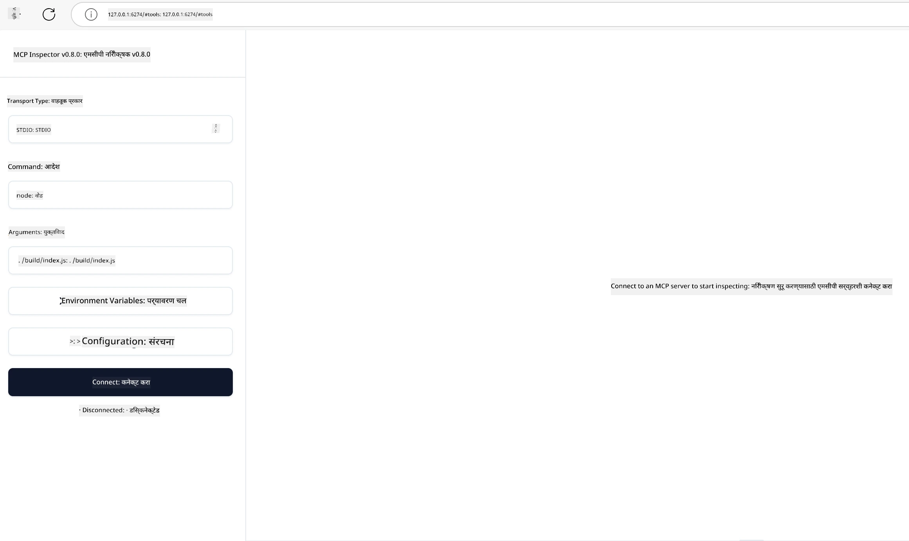

## चाचणी आणि डीबगिंग

आपल्या MCP सर्व्हरची चाचणी करण्यापूर्वी, उपलब्ध साधने आणि डीबगिंगसाठी सर्वोत्तम पद्धती समजून घेणे महत्त्वाचे आहे. प्रभावी चाचणी आपल्या सर्व्हरच्या अपेक्षित वर्तनाचे सुनिश्चित करते आणि आपल्याला समस्या त्वरीत ओळखण्यासाठी आणि सोडवण्यासाठी मदत करते. पुढील विभागातील शिफारस केलेल्या दृष्टिकोनांची माहिती आपल्या MCP अंमलबजावणीचे प्रमाणीकरण करण्यासाठी दिलेली आहे.

## आढावा

हा धडा योग्य चाचणी दृष्टिकोन कसा निवडायचा आणि सर्वाधिक प्रभावी चाचणी साधन कोणते यावर आधारित आहे.

## शिकण्याचे उद्दिष्टे

या धड्याच्या शेवटी, आपण पुढील कार्य करू शकाल:

- चाचणीसाठी विविध दृष्टिकोनांचे वर्णन करा.
- आपल्या कोडची प्रभावी चाचणी करण्यासाठी वेगवेगळ्या साधनांचा वापर करा.


## MCP सर्व्हरची चाचणी करणे

MCP आपल्याला आपल्या सर्व्हरची चाचणी आणि डीबग करण्यासाठी साधने पुरवते:

- **MCP Inspector**: एक कमांड लाइन टूल जे CLI साधन म्हणून तसेच व्हिज्युअल साधन म्हणून चालवू शकता.
- **मॅन्युअल चाचणी**: आपण curl सारखा टूल वापरू शकता ज्याद्वारे वेब विनंत्या चालवता येतील, परंतु कोणतेही उपकरण जे HTTP चालवू शकते ते चालेल.
- **युनिट चाचणी**: आपण आपल्या आवडत्या चाचणी फ्रेमवर्क वापरुन सर्व्हर आणि क्लायंटचे वैशिष्ट्ये चाचणी करू शकता.

### MCP Inspector चा वापर

आपण या टूलचा वापर मागील धड्यांमध्ये कसा करावा हे वर्णन केले आहे पण चला याबद्दल थोडक्यात बोलूया. हे Node.js मध्ये तयार केलेले टूल आहे आणि आपण याला `npx` अंमलबजावणी कॉल करून वापरू शकता ज्यामुळे टूल तात्पुरते डाउनलोड व इन्स्टॉल होते आणि आपली विनंती पूर्ण झाल्यावर स्वयंचलितपणे स्वच्छ केले जाते.

[MCP Inspector](https://github.com/modelcontextprotocol/inspector) आपल्याला मदत करतो:

- **सर्व्हर क्षमता शोधा**: उपलब्ध संसाधने, साधने, आणि प्रॉम्प्ट आपोआप शोधा
- **टूलची अंमलबजावणी तपासा**: वेगवेगळे पॅरामीटर्स वापरून त्वरित प्रतिसाद पाहा
- **सर्व्हर मेटाडेटा बघा**: सर्व्हर माहिती, स्कीमा, आणि कॉन्फिगरेशन तपासा

टूलची एक सरासरी रन असा दिसू शकते:

```bash
npx @modelcontextprotocol/inspector node build/index.js
```

वर दिलेली कमांड MCP आणि त्याचा व्हिज्युअल इंटरफेस सुरू करते व आपण आपल्या वेब ब्राउझरमध्ये स्थानिक वेब इंटरफेस पाहू शकता. आपण एक डॅशबोर्ड पाहू शकता ज्यामध्ये आपल्या नोंदणीकृत MCP सर्व्हर, त्यांची उपलब्ध साधने, संसाधने, आणि प्रॉम्प्ट दाखवले जातात. इंटरफेसमुळे आपण टूलची interactive चाचणी करू शकता, सर्व्हर मेटाडेटा तपासू शकता, आणि प्रत्यक्ष प्रतिसाद पाहू शकता जे आपल्या MCP सर्व्हर अंमलबजावणीचे प्रमाणीकरण आणि डीबगिंग सुलभ करते.

हे असं दिसू शकतं: 

आपण हे टूल CLI मोडमध्ये देखील चालवू शकता ज्यासाठी `--cli` अट जोडावी लागते. येथे "CLI" मोडमध्ये टूल चालवण्याचे उदाहरण आहे जे सर्व्हरवरील सर्व टूल्सची यादी देते:

```sh
npx @modelcontextprotocol/inspector --cli node build/index.js --method tools/list
```

### मॅन्युअल चाचणी

सर्व्हर क्षमता तपासण्यासाठी inspector टूल चालवण्याशिवाय, HTTP वापरू शकणारा क्लायंट चालवण्याचा आणखी एक उपाय आहे, उदाहरणार्थ curl.

curl चा वापर करून आपण MCP सर्व्हर थेट HTTP विनंत्या वापरून चाचणी करू शकता:

```bash
# उदाहरणः चाचणी सर्व्हर मेटाडेटा
curl http://localhost:3000/v1/metadata

# उदाहरणः उपकरण चालवा
curl -X POST http://localhost:3000/v1/tools/execute \
  -H "Content-Type: application/json" \
  -d '{"name": "calculator", "parameters": {"expression": "2+2"}}'
```

वर curl चा वापर कसा करायचा दिले आहे त्याप्रमाणे, आपण POST विनंती वापरून टूलचे नाव आणि त्याचे पॅरामीटर्स असलेली पेलोड वापरून टूल चालवता. आपल्याला सगळ्यात योग्य वाटणारा दृष्टिकोन वापरा. CLI साधने सामान्यतः जलद वापरता येतात आणि त्यासाठी स्क्रिप्टच्या सहाय्याने वापरता येते जे CI/CD वातावरणात उपयुक्त ठरू शकते.

### युनिट चाचणी

आपल्या साधने आणि संसाधनांसाठी युनिट चाचणी तयार करा जेणेकरून ती अपेक्षितरित्या कार्य करतात याची खात्री होईल. येथे युनिट चाचणी कोडचे काही उदाहरण आहे.

```python
import pytest

from mcp.server.fastmcp import FastMCP
from mcp.shared.memory import (
    create_connected_server_and_client_session as create_session,
)

# संपूर्ण मोड्यूल असिंक टेस्टसाठी मार्क करा
pytestmark = pytest.mark.anyio


async def test_list_tools_cursor_parameter():
    """Test that the cursor parameter is accepted for list_tools.

    Note: FastMCP doesn't currently implement pagination, so this test
    only verifies that the cursor parameter is accepted by the client.
    """

 server = FastMCP("test")

    # काही टेस्ट साधने तयार करा
    @server.tool(name="test_tool_1")
    async def test_tool_1() -> str:
        """First test tool"""
        return "Result 1"

    @server.tool(name="test_tool_2")
    async def test_tool_2() -> str:
        """Second test tool"""
        return "Result 2"

    async with create_session(server._mcp_server) as client_session:
        # कर्सर पॅरामीटरशिवाय टेस्ट करा (वगळलेले)
        result1 = await client_session.list_tools()
        assert len(result1.tools) == 2

        # कर्सर=None सह टेस्ट करा
        result2 = await client_session.list_tools(cursor=None)
        assert len(result2.tools) == 2

        # स्ट्रिंग म्हणून कर्सरसह टेस्ट करा
        result3 = await client_session.list_tools(cursor="some_cursor_value")
        assert len(result3.tools) == 2

        # रिक्त स्ट्रिंग कर्सरसह टेस्ट करा
        result4 = await client_session.list_tools(cursor="")
        assert len(result4.tools) == 2
    
```

वरील कोड खालीलप्रमाणे कार्य करतो:

- pytest फ्रेमवर्कचा वापर करतो जो आपण फंक्शन्स स्वरूपात चाचणी तयार करू शकता आणि assert स्टेटमेंट वापरू शकता.
- दोन वेगवेगळ्या साधनांसह MCP सर्व्हर तयार करतो.
- `assert` स्टेटमेंट वापरून विशिष्ट अटी पूर्ण आहेत की नाहीत हे तपासतो.

[पूर्ण फाईल येथे पाहा](https://github.com/modelcontextprotocol/python-sdk/blob/main/tests/client/test_list_methods_cursor.py)

वरील फाईल असल्याने, आपण आपल्या स्वतःच्या सर्व्हरची चाचणी करू शकता जेणेकरून क्षमता आवश्यकतेनुसार तयार झाल्या आहेत याची खात्री होईल.

सर्व प्रमुख SDKs मध्ये अशाच चाचणी विभाग असतात त्यामुळे आपण आपल्या निवडलेल्या रनटाइमनुसार समायोजित करू शकता.

## नमुने 

- [Java Calculator](../samples/java/calculator/README.md)
- [.Net Calculator](../../../../03-GettingStarted/samples/csharp)
- [JavaScript Calculator](../samples/javascript/README.md)
- [TypeScript Calculator](../samples/typescript/README.md)
- [Python Calculator](../../../../03-GettingStarted/samples/python) 

## अतिरिक्त संसाधने

- [Python SDK](https://github.com/modelcontextprotocol/python-sdk)

## पुढे काय

- पुढे: [तैनात करणे](../09-deployment/README.md)

---

<!-- CO-OP TRANSLATOR DISCLAIMER START -->
**अस्वीकरण**:
हा दस्तऐवज AI भाषांतर सेवा [Co-op Translator](https://github.com/Azure/co-op-translator) चा वापर करून अनुवादित केला आहे. जरी आम्ही अचूकतेसाठी प्रयत्न करतो, तरी कृपया लक्षात घ्या की स्वयंचलित भाषांतरांमध्ये त्रुटी किंवा अचूकतेची कमतरता असू शकते. मूळ दस्तऐवज त्याच्या मूळ भाषेत अधिकृत स्रोत मानला पाहिजे. महत्त्वाची माहिती असल्यास, व्यावसायिक मानवी भाषांतराची शिफारस केली जाते. या भाषांतराच्या वापरामुळे उद्भवणाऱ्या कोणत्याही गैरसमज किंवा चुकीच्या अर्थलावणीसाठी आम्ही जबाबदार नाही.
<!-- CO-OP TRANSLATOR DISCLAIMER END -->