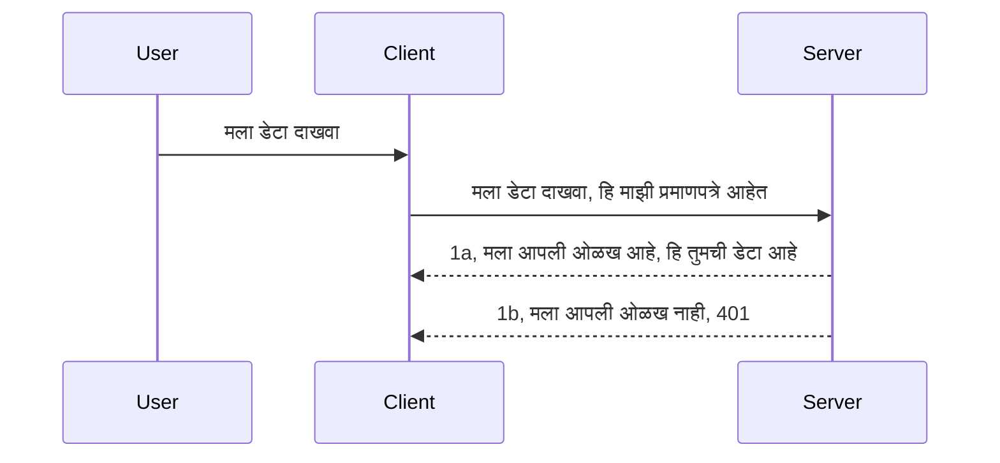

# सोपं प्रमाणीकरण

MCP SDKs OAuth 2.1 चा वापर समर्थन करतात, जो खरं तर एक गुंतागुंतीची प्रक्रिया आहे ज्यामध्ये प्रमाणीकरण सर्व्हर, संसाधन सर्व्हर, क्रेडेन्शियल्स पोस्ट करणे, कोड मिळवणे, कोडची देवाणघेवाण करून बेअरर टोकन प्राप्त करणे यासारख्या संकल्पना आहेत जोपर्यंत तुम्हाला अखेरीस तुमचा संसाधन डेटा मिळत नाही. जर तुम्हाला OAuth वापरायला सवय नसेल जे अंमलात आणण्यासाठी छान गोष्ट आहे, तर काही मूलभूत स्तराच्या प्रमाणीकरणापासून सुरूवात करणे आणि हळूहळू अधिक सुरक्षिततेकडे जाणे चांगले. म्हणूनच हे प्रकरण आहे, तुम्हाला अधिक प्रगत प्रमाणीकरणाकडे नेण्यासाठी.

## प्रमाणीकरण म्हणजे काय?

प्रमाणीकरण आणि अधिकृतता या शब्दांचा लघुरूप म्हणजे Auth. विचार असा आहे की आपल्याला दोन गोष्टी करायच्या आहेत:

- **प्रमाणीकरण** म्हणजे एखाद्या व्यक्तीला आपल्या घरात येण्याची परवानगी आहे का हे समजून घेण्याची प्रक्रिया, की त्यांच्याकडे "येण्याचा" अधिकार आहे का म्हणजे आपल्या संसाधन सर्व्हरमध्ये प्रवेश करण्याचा अधिकार आहे जिथे MCP सर्व्हरच्या वैशिष्ट्ये आहेत.
- **अधिकृतता** म्हणजे एखाद्या वापरकर्त्याला त्याने मागितलेले विशिष्ट संसाधन मिळावे का, उदाहरणार्थ हे आदेश किंवा उत्पादने किंवा त्यांना फक्त वाचण्याची मुभा आहे पण हटवण्याची नाही अशी दुसरी उदाहरणे.

## क्रेडेन्शियल्स: आपण सिस्टमला आपल्याबद्दल कसे सांगतो

बरेच वेब विकसक सहसा सर्व्हरला एक क्रेडेन्शियल द्यायचा विचार करतात, सहसा एक गुप्त माहिती जी सांगते की ते "येथे" असू शकतात की नाही "प्रमाणीकरण". हा क्रेडेन्शियल सहसा वापरकर्तानाव आणि संकेतशब्दाचा बेस64 एन्कोडेड आवृत्ती किंवा API की जी विशिष्ट वापरकर्त्याला अद्वितीय ओळख देते.

हे खालीलप्रमाणे "Authorization" हेडरद्वारे पाठवले जाते:

```json
{ "Authorization": "secret123" }
```

ही सहसा बेसिक प्रमाणीकरण म्हणून ओळखली जाते. एकूण फ्लो पुढीलप्रमाणे काम करते:


आता जेव्हा आपण फ्लोच्या दृष्टीने कसे काम करते ते समजल्या, तेव्हा आपण ते कसे राबवू? बरेच वेब सर्व्हर्समध्ये एक मध्यवर्ती संकल्पना असते ज्याला middleware म्हणतात, म्हणजेवे विनंतीचा भाग म्हणून चालणारा एक कोडचा तुकडा जो क्रेडेन्शियल्स तपासू शकतो आणि जर ते वैध असतील तर विनंतीस पुढे जाऊ देतो. जर विनंतीमध्ये वैध क्रेडेन्शियल्स नसतील तर प्रमाणीकरण त्रुटी येते. हे कसे राबवले जाऊ शकते ते पाहूयात:

**Python**

```python
class AuthMiddleware(BaseHTTPMiddleware):
    async def dispatch(self, request, call_next):

        has_header = request.headers.get("Authorization")
        if not has_header:
            print("-> Missing Authorization header!")
            return Response(status_code=401, content="Unauthorized")

        if not valid_token(has_header):
            print("-> Invalid token!")
            return Response(status_code=403, content="Forbidden")

        print("Valid token, proceeding...")
       
        response = await call_next(request)
        # कोणत्याही ग्राहक हेडर जोडा किंवा प्रतिसादात काही बदल करा
        return response


starlette_app.add_middleware(CustomHeaderMiddleware)
```

इथे आपल्याकडे:

- `AuthMiddleware` नावाची मध्यवर्ती सॉफ्टवेअर तयार केले आहे जिथे त्याचा `dispatch` मेथड वेब सर्व्हरने कॉल केला जातो.
- वेब सर्व्हरमध्ये middleware जोडले:

    ```python
    starlette_app.add_middleware(AuthMiddleware)
    ```

- लेखन केलेल्या प्रमाणीकरण लॉजिकमध्ये तपासले आहे की Authorization हेडर आहे का आणि दिलेला गुप्त माहिती वैध आहे का:

    ```python
    has_header = request.headers.get("Authorization")
    if not has_header:
        print("-> Missing Authorization header!")
        return Response(status_code=401, content="Unauthorized")

    if not valid_token(has_header):
        print("-> Invalid token!")
        return Response(status_code=403, content="Forbidden")
    ```

जर गुप्त माहिती उपस्थित आणि वैध असेल तर आपण `call_next` कॉल करून विनंती पुढे जाऊ देतो आणि प्रतिसाद परत करतो.

    ```python
    response = await call_next(request)
    # कोणतेही ग्राहक हेडर जोडा किंवा प्रतिसादात काहीतरी बदल करा
    return response
    ```

कसे काम करते म्हणजे जर वेब विनंती सर्व्हरकडे केली गेली तर middleware कॉल होईल आणि त्याच्या अंमलबजावणीवरून तो विनंती पुढे जाऊ देतो किंवा क्लायंटसाठी त्रुटी परत करतो की तो पुढे जाऊ शकत नाही.

**TypeScript**

येथे आपण Express या लोकप्रिय फ्रेमवर्कसह middleware तयार करतो आणि ती विनंती MCP सर्व्हरपर्यंत पोहोचण्याआधी intercept करतो. हा याचा कोड:

```typescript
function isValid(secret) {
    return secret === "secret123";
}

app.use((req, res, next) => {
    // 1. अधिकृतता हेडर उपलब्ध आहे का?
    if(!req.headers["Authorization"]) {
        res.status(401).send('Unauthorized');
    }
    
    let token = req.headers["Authorization"];

    // 2. वैधता तपासा.
    if(!isValid(token)) {
        res.status(403).send('Forbidden');
    }

   
    console.log('Middleware executed');
    // 3. विनंती पाईपलाइनमधील पुढील टप्प्याकडे विनंती पाठवा.
    next();
});
```

या कोडमध्ये आपण:

1. प्रथम तपासतो की Authorization हेडर आहे का, नाही तर 401 त्रुटी पाठवतो.
2. क्रेडेन्शियल/टोकन वैध आहे का हे तपासतो, नाही तर 403 त्रुटी पाठवतो.
3. शेवटी विनंती पुढे पाठवतो आणि मागितलेले संसाधन परत देतो.

## सराव: प्रमाणीकरण राबवा

चला आपले ज्ञान वापरून राबवण्याचा प्रयत्न करूया. योजनाः

सर्व्हर

- वेब सर्व्हर आणि MCP उदाहरण तयार करा.
- सर्व्हरसाठी middleware राबवा.

क्लायंट

- हेडरद्वारे क्रेडेन्शियलसह वेब विनंती पाठवा.

### -1- वेब सर्व्हर आणि MCP उदाहरण तयार करा

प्रथम टप्प्यात, आपल्याला वेब सर्व्हर आणि MCP सर्व्हर तयार करायचा आहे.

**Python**

येथे आम्ही MCP सर्व्हर उदाहरण तयार करतो, starlette वेब ऍप तयार करतो आणि uvicorn सह होस्ट करतो.

```python
# MCP सर्व्हर तयार करीत आहे

app = FastMCP(
    name="MCP Resource Server",
    instructions="Resource Server that validates tokens via Authorization Server introspection",
    host=settings["host"],
    port=settings["port"],
    debug=True
)

# starlette वेब अॅप तयार करीत आहे
starlette_app = app.streamable_http_app()

# uvicorn द्वारे अॅप सेवा देत आहे
async def run(starlette_app):
    import uvicorn
    config = uvicorn.Config(
            starlette_app,
            host=app.settings.host,
            port=app.settings.port,
            log_level=app.settings.log_level.lower(),
        )
    server = uvicorn.Server(config)
    await server.serve()

run(starlette_app)
```

या कोडमध्ये आपण:

- MCP सर्व्हर तयार केला.
- MCP सर्व्हरमधून starlette वेब ऍप बनवला, `app.streamable_http_app()`.
- uvicorn वापरून वेब ऍप होस्ट व सर्व्हर केला `server.serve()`.

**TypeScript**

येथे आपण MCP सर्व्हर उदाहरण तयार करतो.

```typescript
const server = new McpServer({
      name: "example-server",
      version: "1.0.0"
    });

    // ... सर्व्हर संसाधने, साधने, आणि प्रॉम्प्ट सेट करा ...
```

हा MCP सर्व्हर तयार करणे POST /mcp रूटच्या व्याख्येमध्ये करणे आवश्यक आहे, म्हणून वरचे कोड घेतले आणि अशा प्रकारे हलवले:

```typescript
import express from "express";
import { randomUUID } from "node:crypto";
import { McpServer } from "@modelcontextprotocol/sdk/server/mcp.js";
import { StreamableHTTPServerTransport } from "@modelcontextprotocol/sdk/server/streamableHttp.js";
import { isInitializeRequest } from "@modelcontextprotocol/sdk/types.js"

const app = express();
app.use(express.json());

// सत्र आयडीद्वारे ट्रान्सपोर्ट्स साठविण्यासाठी नकाशा
const transports: { [sessionId: string]: StreamableHTTPServerTransport } = {};

// क्लायंट-टू-सर्व्हर संवादासाठी POST विनंत्या हाताळा
app.post('/mcp', async (req, res) => {
  // विद्यमान सत्र आयडी तपासा
  const sessionId = req.headers['mcp-session-id'] as string | undefined;
  let transport: StreamableHTTPServerTransport;

  if (sessionId && transports[sessionId]) {
    // विद्यमान ट्रान्सपोर्ट पुनः वापरा
    transport = transports[sessionId];
  } else if (!sessionId && isInitializeRequest(req.body)) {
    // नवीन प्रारंभिक विनंती
    transport = new StreamableHTTPServerTransport({
      sessionIdGenerator: () => randomUUID(),
      onsessioninitialized: (sessionId) => {
        // सत्र आयडीद्वारे ट्रान्सपोर्ट साठवा
        transports[sessionId] = transport;
      },
      // मागील सुसंगततेसाठी डीएनएस रीबाइंडिंग संरक्षण डीफॉल्टने अक्षम आहे. आपण हा सर्व्हर चालवत असाल
      // स्थानिकरित्या, नक्की करा की खालील सेट केले आहे:
      // enableDnsRebindingProtection: true,
      // allowedHosts: ['127.0.0.1'],
    });

    // ट्रान्सपोर्ट बंद करताना साफसफाई करा
    transport.onclose = () => {
      if (transport.sessionId) {
        delete transports[transport.sessionId];
      }
    };
    const server = new McpServer({
      name: "example-server",
      version: "1.0.0"
    });

    // ... सर्व्हर संसाधने, साधने आणि सूचना स्थापित करा ...

    // MCP सर्व्हरशी कनेक्ट करा
    await server.connect(transport);
  } else {
    // अवैध विनंती
    res.status(400).json({
      jsonrpc: '2.0',
      error: {
        code: -32000,
        message: 'Bad Request: No valid session ID provided',
      },
      id: null,
    });
    return;
  }

  // विनंती हाताळा
  await transport.handleRequest(req, res, req.body);
});

// GET आणि DELETE विनंत्यांसाठी पुनर्वापरयोग्य हँडलर
const handleSessionRequest = async (req: express.Request, res: express.Response) => {
  const sessionId = req.headers['mcp-session-id'] as string | undefined;
  if (!sessionId || !transports[sessionId]) {
    res.status(400).send('Invalid or missing session ID');
    return;
  }
  
  const transport = transports[sessionId];
  await transport.handleRequest(req, res);
};

// SSE द्वारे सर्व्हर-टू-क्लायंट सूचना साठी GET विनंत्या हाताळा
app.get('/mcp', handleSessionRequest);

// सत्र समाप्तीसाठी DELETE विनंत्या हाताळा
app.delete('/mcp', handleSessionRequest);

app.listen(3000);
```

आता तुम्हाला दिसतं की MCP सर्व्हर तयार करणे `app.post("/mcp")` मध्ये हलवले आहे.

पुढील टप्प्यात middleware तयार करूया जे येणाऱ्या क्रेडेन्शियलस तपासेल.

### -2- सर्व्हरसाठी middleware राबवा

म्हणून मीiddleware भागाकडे येऊया. येथे आपण अशी middleware तयार करू जी `Authorization` हेडरमधील क्रेडेन्शियल शोधेल आणि त्याची वैधता तपासेल. जर ते स्वीकारार्ह असेल तर विनंती पुढे जाईल तसेच ते जे करायचे आहे ते करेल (उदा. साधने सूचीबद्ध करणे, संसाधन वाचणे किंवा MCP चे जे काही क्लायंटने मागितले आहे).

**Python**

मiddleware तयार करण्यासाठी, आपल्याला `BaseHTTPMiddleware` पासून वारसा घेतलेली एक वर्ग तयार करावी लागेल. दोन महत्वाच्या गोष्टी आहेत:

- विनंती `request` , ज्यातून आपण हेडर माहिती वाचतो.
- `call_next` ही कॉलबॅक जी आपण कॉल करतो जर क्लायंटने क्रेडेन्शियल आणले आणि आम्ही स्वीकारले.

सर्वप्रथम, जर `Authorization` हेडर गहाळ असेल तर त्याचा प्रकार हाताळणे:

```python
has_header = request.headers.get("Authorization")

# कोणताही हेडर उपस्थित नाही, 401 सह अपयशी करा, अन्यथा पुढे जा.
if not has_header:
    print("-> Missing Authorization header!")
    return Response(status_code=401, content="Unauthorized")
```

येथे आम्ही क्लायंट प्रमाणीकरणात अपयशी ठरल्याने 401 unauthorized संदेश पाठवतो.

पुढे, जर क्रेडेन्शियल पाठवले गेले असेल, तर त्याची वैधता तपासा:

```python
 if not valid_token(has_header):
    print("-> Invalid token!")
    return Response(status_code=403, content="Forbidden")
```

वरीलप्रमाणे 403 forbidden संदेश पाठवताना पहा. पूर्ण middleware खाली आहे जी वरील सर्व काही अंमलात आणते:

```python
class AuthMiddleware(BaseHTTPMiddleware):
    async def dispatch(self, request, call_next):

        has_header = request.headers.get("Authorization")
        if not has_header:
            print("-> Missing Authorization header!")
            return Response(status_code=401, content="Unauthorized")

        if not valid_token(has_header):
            print("-> Invalid token!")
            return Response(status_code=403, content="Forbidden")

        print("Valid token, proceeding...")
        print(f"-> Received {request.method} {request.url}")
        response = await call_next(request)
        response.headers['Custom'] = 'Example'
        return response

```

छान, पण `valid_token` फंक्शन काय? ते खाली आहे:
:

```python
# उत्पादनासाठी वापरू नका - ते सुधारित करा !!
def valid_token(token: str) -> bool:
    # "Bearer " हा उपसर्ग काढा
    if token.startswith("Bearer "):
        token = token[7:]
        return token == "secret-token"
    return False
```

हे नक्कीच सुधारावे लागेल.

महत्त्वाचे: तुम्हाला कोडमध्ये या प्रकारचे गुपित कधीच ठेवू नये. आदर्शतः, मूल्यासाठी तुलना करायची असल्यास ते डेटास्रोत किंवा IDP (ओळख सेवा प्रदाता) कडून मिळावे किंवा सर्वोत्तम म्हणजे, IDP ने स्वतः प्रमाणीकरण करणे.

**TypeScript**

Express सह हे राबवण्यासाठी, आपल्याला `use` मेथड कॉल करणे आवश्यक आहे जी middleware फंक्शन्स घेते.

आपल्याला:

- विनंती व्हेरीएबलशी संवाद करावा लागेल आणि `Authorization` प्रॉपर्टीमधील क्रेडेन्शियल तपासावा लागेल.
- क्रेडेन्शियलची वैधता तपासा आणि जर ते वा शन असेल तर विनंती पुढे जाऊ द्या आणि क्लायंटची MCP विनंती हवी ती पाळू द्या (उदा. साधने सूचीबद्ध करणे, संसाधन वाचणे किंवा इतर MCP संबंधित).

येथे आपण तपासत आहोत की `Authorization` हेडर आहे का आणि जर नाही तर विनंती थांबवत आहोत:

```typescript
if(!req.headers["authorization"]) {
    res.status(401).send('Unauthorized');
    return;
}
```

जर हेडर नसेल तर 401 मिळेल.

पुढे, क्रेडेन्शियल वैध आहे का तपासतो, नाही तर विनंती पुन्हा थांबवतो पण इतर संदेशासह:

```typescript
if(!isValid(token)) {
    res.status(403).send('Forbidden');
    return;
} 
```

म्हणून आता तुम्हाला 403 त्रुटी मिळेल.

पूर्ण कोड येथे आहे:

```typescript
app.use((req, res, next) => {
    console.log('Request received:', req.method, req.url, req.headers);
    console.log('Headers:', req.headers["authorization"]);
    if(!req.headers["authorization"]) {
        res.status(401).send('Unauthorized');
        return;
    }
    
    let token = req.headers["authorization"];

    if(!isValid(token)) {
        res.status(403).send('Forbidden');
        return;
    }  

    console.log('Middleware executed');
    next();
});
```

आम्ही वेब सर्व्हर सेट केला आहे की क्लायंट कदाचित पाठवण्याचा क्रेडेन्शियल तपासण्यासाठी middleware स्वीकारतो. तर क्लायंटच्या बाबतीत काय?

### -3- हेडरद्वारे क्रेडेन्शियलसह वेब विनंती पाठवा

आपल्याला खात्री करावी लागेल की क्लायंट हेडरमधून क्रेडेन्शियल पास करत आहे. आपण MCP क्लायंट वापरणार आहोत म्हणून ते कसे करायचे ते पाहू.

**Python**

क्लायंटसाठी, आपण असा एक हेडर पास करतो:

```python
# मूल्य हार्डकोड करू नका, ते किमान एन्व्हायर्नमेंट व्हेरिएबलमध्ये किंवा अधिक सुरक्षित संचयात ठेवा
token = "secret-token"

async with streamablehttp_client(
        url = f"http://localhost:{port}/mcp",
        headers = {"Authorization": f"Bearer {token}"}
    ) as (
        read_stream,
        write_stream,
        session_callback,
    ):
        async with ClientSession(
            read_stream,
            write_stream
        ) as session:
            await session.initialize()
      
            # TODO, क्लायंटमध्ये काय करायचं आहे ते, उदा. टूल्सची यादी करा, टूल्स कॉल करा इत्यादी.
```

तर आपण कसे `headers` प्रॉपर्टी अशी भरतो ` headers = {"Authorization": f"Bearer {token}"}`.

**TypeScript**

हे दोन टप्प्यात सोडवू शकतो:

1. आमच्या क्रेडेन्शियलसह कॉन्फिगरेशन ऑब्जेक्ट भरावे.
2. कॉन्फिगरेशन ऑब्जेक्ट ट्रान्सपोर्टला पास करावे.

```typescript

// येथे दाखवल्याप्रमाणे मूल्य हार्डकोड करू नका. किमान ते एक पर्यावरणीय चलन म्हणून ठेवा आणि डॉटएनव्ह (डेव्ह मोडमध्ये) सारखे काही वापरा.
let token = "secret123"

// क्लायंट ट्रान्सपोर्ट पर्याय ऑब्जेक्ट定义 करा
let options: StreamableHTTPClientTransportOptions = {
  sessionId: sessionId,
  requestInit: {
    headers: {
      "Authorization": "secret123"
    }
  }
};

// ट्रान्सपोर्टसाठी पर्याय ऑब्जेक्ट पाठवा
async function main() {
   const transport = new StreamableHTTPClientTransport(
      new URL(serverUrl),
      options
   );
```

वरीलप्रमाणे आपण `options` ऑब्जेक्ट तयार केला आणि `requestInit` मध्ये हेडर्स ठेवले.

महत्त्वाचे: परंतु त्यानंतर आपण हे कसे सुधारू? सध्याच्या अंमलबजावणीत काही समस्या आहेत. प्रथम म्हणजे क्रेडेन्शियल अशाप्रकारे पास करणे जोखमीचे आहे जोपर्यंत तुम्हाला किमान HTTPS नाही. तरीही क्रेडेन्शियल चोरीला जाऊ शकतो म्हणून तुम्हाला अशी प्रणाली हवी जिथे तुम्ही टोकन रद्द करू शकता आणि स्थान, विनंती जास्त होत आहे का यासारखे अतिरिक्त तपासणी करू शकता, म्हणजे बॉट सारखे वर्तन, थोडक्यात अनेक काळजी असतात.

म्हणजे, खूप सोप्या API साठी जिथे तुम्हाला कोणीही तुमचा API कॉल करण्याची परवानगी नको असलेली आणि जे आपण येथे केले ते सुरुवातीसाठी चांगले आहे.

म्हणूनच, सुरक्षा आणखी कशी मजबूत करू शकतो तर तो म्हणजे JSON Web Token वापरणे ज्याला JWT किंवा "JOT" टोकन म्हणूनही ओळखले जाते.

## JSON वेब टोकन्स, JWT

म्हणून आपण अतिशय सोप्या क्रेडेन्शियलपासून सुधारणा करत आहोत. JWT स्वीकारल्यामुळे लगेच काय सुधारणा मिळतात?

- **सुरक्षा सुधारणा**. बेसिक ऑथ मध्ये तुम्ही वापरकर्तानाव आणि पासवर्ड बेस64 एन्कोडेड टोकन (किंवा API की) म्हणून वारंवार पाठवता जे जोखीम वाढवते. JWT मध्ये तुम्ही वापरकर्तानाव व पासवर्ड पाठवता व त्याऐवजी तुम्हाला टोकन मिळते आणि ते वेळेवर बांधलेले असते म्हणजे ते कालबाह्य होईल. JWT तुम्हाला रोल्स, स्कोप्स व परवानग्यांसाठी सूक्ष्म प्रवेश नियंत्रण लागू करणे सोपे करते.
- **स्टेटलेसनेस आणि स्केलेबिलिटी**. JWT स्वयंपूर्ण असतात, ते सर्व वापरकर्ता माहिती घेऊन नेतात आणि सर्व्हर सत्र स्टोरेजची गरज नष्ट करतात. टोकन स्थानिकपणे देखील वैधता तपासली जाऊ शकते.
- **परस्परसंवाद आणि फेडरेशन**. JWT OpenID Connect चा मुख्य भाग आहे आणि Entra ID, Google Identity व Auth0 सारख्या ओळखीच्या प्रदात्यांसह वापरले जाते. ते सिंगल साइन-ऑन व बरेच काही शक्य करून एंटरप्राइझ-ग्रेड बनवतात.
- **मॉड्युलरिटी आणि लवचिकता**. JWT API गेटवे सारख्या Azure API Management, NGINX इत्यादींसह देखील वापरले जाऊ शकतात. ते वापरकर्त्याच्या प्रमाणीकरण परिस्थिती आणि सर्व्हर-टू-सर्व्हिस संप्रेषणात समाविष्ट आहेत ज्यात impersonation आणि delegation पर्याय आहेत.
- **कार्यक्षमता व कॅशिंग**. JWT डिकोड केल्यानंतर कॅश केली जाऊ शकतात ज्यामुळे पार्सिंग गरज कमी होते. हे विशेषतः उच्च-वाहतूक ऍप्ससाठी उपयुक्त आहे कारण ते थ्रूपुट सुधारते आणि निवडलेल्या इन्फ्रास्ट्रक्चरवरील लोड कमी करते.
- **प्रगत वैशिष्ट्ये**. JWT मध्ये introspection (सर्व्हरवर वैधता तपासणे) आणि revocation (टोकन अवैध करणे) देखील आहेत.

हे सर्व फायदे लक्षात घेता, आपल्या अंमलबजावणीला पुढील टप्प्यावर कसे घेऊन जाऊ शकतो ते पाहूया.

## बेसिक ऑथ पासून JWT मध्ये रूपांतरण

तर, उच्च स्तरावर आपल्याला करायच्या बदलांमध्ये:

- **JWT टोकन तयार करणे** आणि ते क्लायंटपासून सर्व्हरपर्यंत पाठवायला तयार करणे.
- **JWT टोकन वैध करणे**, आणि जर ते वैध असेल तर क्लायंटला संसाधन मिळावं.
- **टोकनचे सुरक्षित साठवण**. आपण हा टोकन कसा साठवू.
- **मार्गांचे संरक्षण**. आपल्याला मार्ग आणि विशिष्ट MCP वैशिष्ट्ये संरक्षित करायची आहेत.
- **रिफ्रेश टोकन्स जोडणे**. लहान कालावधीचे टोकन तयार करणे पण रिफ्रेश टोकन्स जे दीर्घकाल टिकतात जे नवीन टोकन्स मिळवण्यासाठी वापरता येतील. तसेच रिफ्रेश एंडपॉइंट व रोटेशन धोरण तयार करणे.

### -1- JWT टोकन तयार करा

सर्वप्रथम, JWT टोकनमध्ये खालील भाग असतात:

- **हेडर**, वापरलेला अल्गोरिदम आणि टोकन प्रकार.
- **पेलोड**, दावे, जसे sub (टोकन दर्शवित असलेला वापरकर्ता किंवा घटक जो सहसा auth मध्ये userid असतो), exp (कधी कालबाह्य होईल) role (भूमिका)
- **सिग्नेचर**, गुपित किंवा खाजगी कीने सही केलेले.

यासाठी आपल्याला हेडर, पेलोड तयार करावे लागतील आणि त्यातून एन्कोड केलेले टोकन बनवावे लागेल.

**Python**

```python

import jwt
import jwt
from jwt.exceptions import ExpiredSignatureError, InvalidTokenError
import datetime

# JWT स्वाक्षरीसाठी वापरलेली गुप्त की
secret_key = 'your-secret-key'

header = {
    "alg": "HS256",
    "typ": "JWT"
}

# वापरकर्त्याची माहिती आणि त्याचे दावे आणि कालबाह्यता वेळ
payload = {
    "sub": "1234567890",               # विषय (वापरकर्ता आयडी)
    "name": "User Userson",                # सानुकूल दावा
    "admin": True,                     # सानुकूल दावा
    "iat": datetime.datetime.utcnow(),# जारी केलेले वेळ
    "exp": datetime.datetime.utcnow() + datetime.timedelta(hours=1)  # कालबाह्यता
}

# त्याला एन्कोड करा
encoded_jwt = jwt.encode(payload, secret_key, algorithm="HS256", headers=header)
```

वरील कोडमध्ये आपण:

- HS256 अल्गोरिदम वापरून आणि टोकन प्रकार JWT म्हणून एक हेडर परिभाषित केला.
- एक पेलोड तयार केला ज्यामध्ये विषय किंवा वापरकर्ता आयडी, वापरकर्तानाव, भूमिका, त्याची जारी तारीख आणि कधी कालबाह्य होणार याचा समावेश आहे, ज्यामुळे आधी उल्लेख केलेली वेळेवर आधारलेली बाब अंमलात आली.

**TypeScript**

इथे आपल्याला काही अवलंबित्वे लागतील जी JWT टोकन तयार करण्यात मदत करतील.

अवलंबित्वे

```sh

npm install jsonwebtoken
npm install --save-dev @types/jsonwebtoken
```

आता जेव्हा ते सर्व सेट करतो, तर हेडर, पेलोड तयार करूया आणि त्या द्वारे एन्कोड केलेले टोकन तयार करूया.

```typescript
import jwt from 'jsonwebtoken';

const secretKey = 'your-secret-key'; // उत्पादनात env vars वापरा

// पेलोड परिभाषित करा
const payload = {
  sub: '1234567890',
  name: 'User usersson',
  admin: true,
  iat: Math.floor(Date.now() / 1000), // जारी केलेले
  exp: Math.floor(Date.now() / 1000) + 60 * 60 // 1 तासात कालबाह्य होईल
};

// हेडर परिभाषित करा (ऐच्छिक, jsonwebtoken डीफॉल्ट सेट करतो)
const header = {
  alg: 'HS256',
  typ: 'JWT'
};

// टोकन तयार करा
const token = jwt.sign(payload, secretKey, {
  algorithm: 'HS256',
  header: header
});

console.log('JWT:', token);
```

हा टोकन:

HS256 वर सही केला आहे  
1 तासासाठी वैध आहे  
sub, name, admin, iat, आणि exp असे दावे समाविष्ट करतो.

### -2- टोकनची वैधता तपासा

आपल्याला टोकन वैध करणे आवश्यक आहे, हे सर्व्हरवर करणे गरजेचे आहे जेणेकरून जे क्लायंट आम्हाला पाठवत आहे ते खरीच वैध आहे. अनेक तपासण्या कराव्या लागतात जसे त्याची रचना तपासणे व त्याची वैधता. तुम्हाला हे देखील सुचवले जाते की तुम्ही इतर तपासणी करा जसे वापरकर्ता तुमच्या प्रणालीमध्ये आहे का आणि त्याचा वापरकर्ता अधिकार बघा.

टोकन सत्यापित करण्यासाठी, आपल्याला ते डीकोड करावे लागेल जेणेकरून आपण वाचू शकू आणि नंतर त्याची वैधता तपासू शकू:

**Python**

```python

# JWT डीकोड करा आणि पडताळणी करा
try:
    decoded = jwt.decode(token, secret_key, algorithms=["HS256"])
    print("✅ Token is valid.")
    print("Decoded claims:")
    for key, value in decoded.items():
        print(f"  {key}: {value}")
except ExpiredSignatureError:
    print("❌ Token has expired.")
except InvalidTokenError as e:
    print(f"❌ Invalid token: {e}")

```
  
या कोडमध्ये, आपण `jwt.decode` कॉल करतो टोकन, गुपित की व निवडलेला अल्गोरिदम इनपुट म्हणून दिला जातो. इकडे आपण try-catch वापरतो कारण चुकीची वैधता तपासणी त्रुटी निर्माण करते.

**TypeScript**

इथे आपल्याला `jwt.verify` कॉल करावी लागेल जेणेकरून टोकन डीकोड केला जाईल ज्याचा आपण पुढील तपास करू शकतो. जर कॉल अयशस्वी झाला तर टोकनची रचना चुकीची आहे किंवा ते आणखी वैध नाही.

```typescript

try {
  const decoded = jwt.verify(token, secretKey);
  console.log('Decoded Payload:', decoded);
} catch (err) {
  console.error('Token verification failed:', err);
}
```
  
टीप: पूर्वी नमूद केल्याप्रमाणे, आपण अतिरिक्त तपासणी करावी कि हे टोकन आपल्या प्रणालीतील वापरकर्ताकडे निर्देशित करते आणि वापरकर्त्याकडे दावे केलेले अधिकार आहेत का.

पुढे पाहूया भूमिका आधारित प्रवेश नियंत्रण, ज्याला RBAC म्हणूनही ओळखले जाते.
## भूमिका-आधारित प्रवेश नियंत्रण जोडणे

आयडिया असा आहे की वेगवेगळ्या भूमिकांकडे वेगवेगळ्या परवानग्या असतील अशी व्यक्त करण्याची इच्छा आहे. उदाहरणार्थ, आपण समजतो की एक अ‍ॅडमिन सर्वकाही करू शकतो आणि सामान्य वापरकर्ते वाचणे/लिखाणे करू शकतात आणि एक पाहुणा फक्त वाचू शकतो. म्हणून, येथे काही संभाव्य परवानगी पातळ्या आहेत:

- Admin.Write  
- User.Read  
- Guest.Read  

चला पाहूया की आपण अशा नियंत्रणाला मिडलवेरसह कसे अंमलात आणू शकतो. मिडलवेअर्सचा समावेश प्रत्येक रूटसाठी तसेच सर्व रूटसाठीही केला जाऊ शकतो.

**Python**

```python
from starlette.middleware.base import BaseHTTPMiddleware
from starlette.responses import JSONResponse
import jwt

# गुपित कोडमध्ये ठेवू नका, हे फक्त प्रदर्शनासाठी आहे. ते सुरक्षित ठिकाणाहून वाचा.
SECRET_KEY = "your-secret-key" # हे env व्हेरिएबलमध्ये ठेवा
REQUIRED_PERMISSION = "User.Read"

class JWTPermissionMiddleware(BaseHTTPMiddleware):
    async def dispatch(self, request, call_next):
        auth_header = request.headers.get("Authorization")
        if not auth_header or not auth_header.startswith("Bearer "):
            return JSONResponse({"error": "Missing or invalid Authorization header"}, status_code=401)

        token = auth_header.split(" ")[1]
        try:
            decoded = jwt.decode(token, SECRET_KEY, algorithms=["HS256"])
        except jwt.ExpiredSignatureError:
            return JSONResponse({"error": "Token expired"}, status_code=401)
        except jwt.InvalidTokenError:
            return JSONResponse({"error": "Invalid token"}, status_code=401)

        permissions = decoded.get("permissions", [])
        if REQUIRED_PERMISSION not in permissions:
            return JSONResponse({"error": "Permission denied"}, status_code=403)

        request.state.user = decoded
        return await call_next(request)


```
  
खालीलप्रमाणे मिडलवेअर जोडण्याचे काही वेगवेगळे मार्ग आहेत:

```python

# पर्याय 1: स्टारलेट अॅप तयार करताना मिडलवेअर जोडा
middleware = [
    Middleware(JWTPermissionMiddleware)
]

app = Starlette(routes=routes, middleware=middleware)

# पर्याय 2: स्टारलेट अॅप आधीच तयार झाल्यानंतर मिडलवेअर जोडा
starlette_app.add_middleware(JWTPermissionMiddleware)

# पर्याय 3: प्रति मार्ग मिडलवेअर जोडा
routes = [
    Route(
        "/mcp",
        endpoint=..., # हाताळणारा
        middleware=[Middleware(JWTPermissionMiddleware)]
    )
]
```
  
**TypeScript**

`app.use` आणि सर्व विनंत्यांसाठी चालणारे मिडलवेअर वापरू शकतो.

```typescript
app.use((req, res, next) => {
    console.log('Request received:', req.method, req.url, req.headers);
    console.log('Headers:', req.headers["authorization"]);

    // 1. तपासा की अधिकृतता हेडर पाठविण्यात आला आहे का

    if(!req.headers["authorization"]) {
        res.status(401).send('Unauthorized');
        return;
    }
    
    let token = req.headers["authorization"];

    // 2. तपासा की टोकन वैध आहे का
    if(!isValid(token)) {
        res.status(403).send('Forbidden');
        return;
    }  

    // 3. तपासा की टोकन वापरकर्ता आपल्या प्रणालीमध्ये अस्तित्वात आहे का
    if(!isExistingUser(token)) {
        res.status(403).send('Forbidden');
        console.log("User does not exist");
        return;
    }
    console.log("User exists");

    // 4. तपासा की टोकन योग्य परवानग्या आहे का
    if(!hasScopes(token, ["User.Read"])){
        res.status(403).send('Forbidden - insufficient scopes');
    }

    console.log("User has required scopes");

    console.log('Middleware executed');
    next();
});

```
  
आपल्या मिडलवेअरने खालील गोष्टी करण्याची परवानगी देऊ शकतो आणि आपल्या मिडलवेअरने नक्कीच या गोष्टी कराव्यात:

1. अधिकृतता हेडर आहे का ते तपासा  
2. टोकन वैध आहे का ते तपासा, आम्ही `isValid` नावाची पद्धत कॉल करतो जी आम्ही लिहिली आहे, जे JWT टोकनची अखंडता आणि वैधता तपासते.  
3. वापरकर्ता आपल्या प्रणालीमध्ये अस्तित्वात आहे का ते पडताळा, हे तपासणे आवश्यक आहे.  

   ```typescript
    // DB मधील वापरकर्ते
   const users = [
     "user1",
     "User usersson",
   ]

   function isExistingUser(token) {
     let decodedToken = verifyToken(token);

     // TODO, वापरकर्ता DB मध्ये आहे की नाही ते तपासा
     return users.includes(decodedToken?.name || "");
   }
   ```
  
वरील उदाहरणात, आपण एक अतिशय सोपी `users` यादी तयार केली आहे, जी तत्त्वानुसार डेटाबेसमध्ये असावी.

4. याप्रमाणे, आपल्या टोकनमध्ये योग्य परवानग्या आहेत का हे देखील तपासले पाहिजे.

   ```typescript
   if(!hasScopes(token, ["User.Read"])){
        res.status(403).send('Forbidden - insufficient scopes');
   }
   ```
  
वरील मिडलवेअर कोडमध्ये, आम्ही तपासत आहोत की टोकनमध्ये User.Read परवानगी आहे का, नसेल तर 403 त्रुटी पाठवतो. खाली `hasScopes` मदतनीस पद्धत आहे.

   ```typescript
   function hasScopes(scope: string, requiredScopes: string[]) {
     let decodedToken = verifyToken(scope);
    return requiredScopes.every(scope => decodedToken?.scopes.includes(scope));
  }  
   ```

Have a think which additional checks you should be doing, but these are the absolute minimum of checks you should be doing.

Using Express as a web framework is a common choice. There are helpers library when you use JWT so you can write less code.

- `express-jwt`, helper library that provides a middleware that helps decode your token.
- `express-jwt-permissions`, this provides a middleware `guard` that helps check if a certain permission is on the token.

Here's what these libraries can look like when used:

```typescript
const express = require('express');
const jwt = require('express-jwt');
const guard = require('express-jwt-permissions')();

const app = express();
const secretKey = 'your-secret-key'; // put this in env variable

// Decode JWT and attach to req.user
app.use(jwt({ secret: secretKey, algorithms: ['HS256'] }));

// Check for User.Read permission
app.use(guard.check('User.Read'));

// multiple permissions
// app.use(guard.check(['User.Read', 'Admin.Access']));

app.get('/protected', (req, res) => {
  res.json({ message: `Welcome ${req.user.name}` });
});

// Error handler
app.use((err, req, res, next) => {
  if (err.code === 'permission_denied') {
    return res.status(403).send('Forbidden');
  }
  next(err);
});

```
  
आता तुम्ही पाहिले की मिडलवेअर कसे प्रमाणीकरण आणि अधिकृतता यासाठी वापरले जाऊ शकते, तर MCP साठी काय, हे प्रमाणीकरण बदलते का? पुढील विभागात आपण शोधूया.

### -3- MCP मध्ये RBAC जोडा

आपण आत्तापर्यंत पाहिले आहे की तुम्ही मिडलवेअरद्वारे RBAC कसे जोडू शकता, पण MCP साठी प्रत्येक MCP सुविधेसाठी RBAC जोडण्याचा सोपा मार्ग नाही, तर आपण काय करतो? तर, आपण अशा प्रकारे कोड जोडावा लागेल जो तपासतो की या केसमध्ये क्लायंटला विशिष्ट टूल कॉल करण्याचा अधिकार आहे की नाही:

प्रत्येक सुविधा RBAC साध्य करण्यासाठी काही वेगवेगळे पर्याय आहेत, येथे काही:

- परवानगी पातळी तपासण्यासाठी तुम्हाला जिथे जिथे आवश्यक आहे तिथे प्रत्येक टूल, संसाधन, प्रॉम्प्टसाठी तपासणी जोडा.

   **python**

   ```python
   @tool()
   def delete_product(id: int):
      try:
          check_permissions(role="Admin.Write", request)
      catch:
        pass # क्लायंटने अधिकृतता अयशस्वी केली, अधिकृतता त्रुटी उचला
   ```
  
   **typescript**

   ```typescript
   server.registerTool(
    "delete-product",
    {
      title: Delete a product",
      description: "Deletes a product",
      inputSchema: { id: z.number() }
    },
    async ({ id }) => {
      
      try {
        checkPermissions("Admin.Write", request);
        // करायचे आहे, id productService आणि remote entry कडे पाठवा
      } catch(Exception e) {
        console.log("Authorization error, you're not allowed");  
      }

      return {
        content: [{ type: "text", text: `Deletected product with id ${id}` }]
      };
    }
   );
   ```
  

- प्रगत सर्व्हर दृष्टिकोन आणि विनंती हँडलर्स वापरा जेणेकरून तुम्हाला तपास करण्यासाठी लागणाऱ्या जागा कमी करता येतील.

   **Python**

   ```python
   
   tool_permission = {
      "create_product": ["User.Write", "Admin.Write"],
      "delete_product": ["Admin.Write"]
   }

   def has_permission(user_permissions, required_permissions) -> bool:
      # user_permissions: वापरकर्त्याकडून असलेल्या परवानग्यांची यादी
      # required_permissions: साधनासाठी आवश्यक परवानग्यांची यादी
      return any(perm in user_permissions for perm in required_permissions)

   @server.call_tool()
   async def handle_call_tool(
     name: str, arguments: dict[str, str] | None
   ) -> list[types.TextContent]:
    # गृहित धरा की request.user.permissions हे वापरकर्त्याच्या परवानग्यांची यादी आहे
     user_permissions = request.user.permissions
     required_permissions = tool_permission.get(name, [])
     if not has_permission(user_permissions, required_permissions):
        # त्रुटी दाखवा "तुमच्याकडे साधन {name} कॉल करण्याची परवानगी नाही"
        raise Exception(f"You don't have permission to call tool {name}")
     # पुढे जा आणि साधन कॉल करा
     # ...
   ```   
   

   **TypeScript**

   ```typescript
   function hasPermission(userPermissions: string[], requiredPermissions: string[]): boolean {
       if (!Array.isArray(userPermissions) || !Array.isArray(requiredPermissions)) return false;
       // वापरकर्त्याकडे कमीतकमी एक आवश्यक परवानगी असल्यास खरे परत करा
       
       return requiredPermissions.some(perm => userPermissions.includes(perm));
   }
  
   server.setRequestHandler(CallToolRequestSchema, async (request) => {
      const { params: { name } } = request;
  
      let permissions = request.user.permissions;
  
      if (!hasPermission(permissions, toolPermissions[name])) {
         return new Error(`You don't have permission to call ${name}`);
      }
  
      // सुरू ठेवा..
   });
   ```
  
   लक्षात ठेवा, आपल्याला खात्री करणे आवश्यक आहे की आपले मिडलवेअर तपासलेल्या टोकनला विनंतीच्या user प्रॉपर्टीशी असाइन करते जेणेकरून वरील कोड सोपा होईल.

### सारांश

आता आपण सामान्यतः आणि विशेषतः MCP साठी RBAC कसे जोडायचे यावर चर्चा केली आहे, तुमच्याकडून सुरक्षा अंमलात आणून तुम्ही दिलेले संकल्पना समजल्या आहेत याची खात्री करा.

## कार्य 1: बेसिक प्रमाणीकरण वापरून mcp सर्व्हर आणि mcp क्लायंट तयार करा

येथे आपण हेडर्सद्वारे प्रमाणपत्र पाठवण्याच्या बाबतीत जे काही शिकले ते वापराल.

## सोल्यूशन 1

[Solution 1](./code/basic/README.md)

## कार्य 2: कार्य 1 मधील सोल्यूशनला JWT वापरण्यासाठी सुधारित करा

पहिले सोल्यूशन घ्या, पण यावेळी त्याचा सुधारणा करा.

Basic Auth वापरण्याऐवजी, आता JWT वापरूया.

## सोल्यूशन 2

[Solution 2](./solution/jwt-solution/README.md)

## आव्हान

"Add RBAC to MCP" विभागात वर्णन केल्याप्रमाणे प्रति टूल RBAC जोडा.

## सारांश

तुम्ही या प्रकरणात खूप काही शिकलात अशी आशा आहे, सुरुवातीपासून कोणतीही सुरक्षा नसायून, बेसिक सुरक्षा, JWT आणि ते MCP मध्ये कसे जोडता येते यापर्यंत.

आम्ही सानुकूल JWT सह मजबूत पाया तयार केला आहे, पण आपण ज्याप्रमाणे वाढत आहोत, तसतसे मानकाधारित ओळख मॉडेलकडे जात आहोत. Entra किंवा Keycloak सारख्या IdP ला स्वीकारल्याने आम्ही टोकन जारी करणे, वैधता आणि जीवनचक्र व्यवस्थापन विश्वसनीय व्यासपीठाला सोपवू शकतो — ज्यामुळे आम्ही अ‍ॅप लॉजिक आणि वापरकर्ता अनुभवावर लक्ष केंद्रित करू शकतो.

त्यासाठी आमच्याकडे अधिक [प्रगत प्रकरण Entra वर](../../05-AdvancedTopics/mcp-security-entra/README.md) आहे

## पुढे काय

- पुढे: [MCP होस्ट्स सेट करणे](../12-mcp-hosts/README.md)

---

<!-- CO-OP TRANSLATOR DISCLAIMER START -->
**सूचना**:
हा दस्तऐवज AI अनुवाद सेवा [Co-op Translator](https://github.com/Azure/co-op-translator) वापरून अनुवादित केला आहे. आम्ही अचूकतेसाठी प्रयत्न करतो, परंतु कृपया लक्षात ठेवा की स्वयंचलित अनुवादांमध्ये त्रुटी किंवा अचूकतेचा अभाव असू शकतो. मूळ दस्तऐवज त्याच्या मूळ भाषेत अधिकृत स्रोत मानला जावा. महत्त्वाच्या माहितीसाठी व्यावसायिक मानवी अनुवाद शिफारसीय आहे. या अनुवादाच्या वापरामुळे उद्भवलेल्या कोणत्याही गैरसमजुती किंवा चुकांसाठी आम्ही जबाबदार नाही.
<!-- CO-OP TRANSLATOR DISCLAIMER END -->