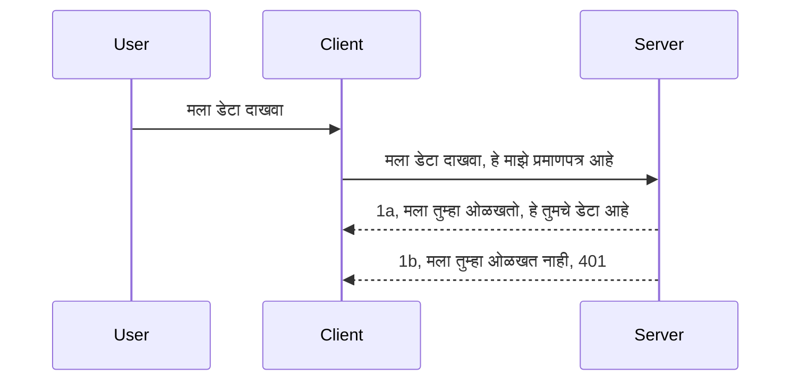

# सोपी प्रमाणीकरण

MCP SDKs OAuth 2.1 वापरण्यास समर्थन देतात जे प्रामुख्याने एक गुंतागुंतीची प्रक्रिया आहे ज्यात auth server, resource server, credentials पाठवणे, कोड मिळवणे, त्या कोडसाठी bearer token बदलणे, आणि शेवटी तुम्हाला तुमचे resource data मिळणे इत्यादी संकल्पना आहेत. जर तुम्हाला OAuth वापरण्याची सवय नसेल जी अंमलबजावणीसाठी एक उत्कृष्ट गोष्ट आहे, तर सुरुवातीला काही मूलभूत स्तराचे प्रमाणीकरण सुरू करणे आणि नंतर अधिक चांगली सुरक्षा मिळवणे चांगले आहे. म्हणूनच हा प्रकरण अस्तित्वात आहे, तुम्हाला अधिक प्रगत प्रमाणीकरणाकडे वाढवण्यासाठी.

## प्रमाणीकरण, आपला अर्थ काय आहे?

प्रमाणीकरण हा authentication आणि authorization चा संक्षिप्त रूप आहे. याचा अर्थ आपल्याला दोन गोष्टी कराव्या लागतात:

- **प्रमाणीकरण**, म्हणजे आपण एखाद्या व्यक्तीला आपल्या घरात प्रवेश देतो का हे शोधण्याची प्रक्रिया, म्हणजे त्यांना "इथे" असण्याचा अधिकार आहे का, म्हणजे आमच्या resource server वर प्रवेश आहे जिथे आमच्या MCP Server वैशिष्ट्ये असतात.
- **अधिकृतता**, म्हणजे वापरकर्त्याला त्यांनी मागितलेल्या विशिष्ट संसाधनांवर प्रवेश असावा का हे तपासण्याची प्रक्रिया, उदाहरणार्थ या ऑर्डर किंवा उत्पादने किंवा त्यांना फक्त कंटेंट वाचण्याची परवानगी आहे पण हटवण्याची नाही अशी परवानी मंजूर करणे.

## क्रेडेन्शियल्स: आपण सिस्टमला आपण कोण आहोत हे कसे सांगतो

बरं, बहुतेक वेब विकसक सामान्यपणे सर्व्हरला क्रेडेन्शियल प्रदान करण्याच्या संदर्भात विचार करतात, सामान्यतः एक गुपित जे सांगते की त्यांना येथे प्रवेश मिळावा "प्रमाणीकरण". हा क्रेडेन्शियल प्रामुख्याने username आणि password चा base64 encoded आवृत्ती किंवा एखादा API key असतो जो विशिष्ट वापरकर्त्याची ओळख करतो.

हे "Authorization" नावाच्या हेडरद्वारे पाठवले जाते असे:

```json
{ "Authorization": "secret123" }
```

याला सामान्यतः बेसिक प्रमाणीकरण म्हणतात. तर नंतर संपूर्ण प्रवाह खालीलप्रमाणे चालतो:


```mermaid
sequenceDiagram
   participant User
   participant Client
   participant Server

   User->>Client: मला डेटा दाखवा
   Client->>Server: मला डेटा दाखवा, हे माझे प्रमाणपत्र आहे
   Server-->>Client: 1a, मला तुम्हा ओळखतो, हे तुमचे डेटा आहे
   Server-->>Client: 1b, मला तुम्हा ओळखत नाही, 401 
```

आता की आम्ही प्रवाहाच्या दृष्टिकोनातून हे कसे काम करते ते समजले, तर आम्ही हे कसे अंमलात आणू? बहुतेक वेब सर्व्हरमध्ये middleware नावाची संकल्पना असते, ही एक कोडची तुकडी आहे जी विनंतीचा भाग म्हणून चालते, जी क्रेडेन्शियल तपासू शकते, आणि जर क्रेडेन्शियल वैध असेल तर विनंती पार पडू देते. जर विनंतीमध्ये वैध क्रेडेन्शियल नसतील तर प्रमाणीकरण त्रुटी येते. चला पहा हे कसे लागू करता येते:

**Python**

```python
class AuthMiddleware(BaseHTTPMiddleware):
    async def dispatch(self, request, call_next):

        has_header = request.headers.get("Authorization")
        if not has_header:
            print("-> Missing Authorization header!")
            return Response(status_code=401, content="Unauthorized")

        if not valid_token(has_header):
            print("-> Invalid token!")
            return Response(status_code=403, content="Forbidden")

        print("Valid token, proceeding...")
       
        response = await call_next(request)
        # कोणतेही ग्राहक हेडर्स जोडा किंवा प्रतिसादात काहीतरी बदल करा
        return response


starlette_app.add_middleware(CustomHeaderMiddleware)
```

येथे आपल्याला आहे:

- `AuthMiddleware` नावाचा middleware तयार केला आहे जिथे त्याचा `dispatch` मेथड वेब सर्व्हरद्वारे कॉल केला जात आहे.
- वेब सर्व्हरमध्ये middleware जोडला आहे:

    ```python
    starlette_app.add_middleware(AuthMiddleware)
    ```

- वॅलिडेशन लॉजिक लिहिली आहे जी तपासते की Authorization हेडर आहे का आणि पाठवलेले गुपित वैध आहे का:

    ```python
    has_header = request.headers.get("Authorization")
    if not has_header:
        print("-> Missing Authorization header!")
        return Response(status_code=401, content="Unauthorized")

    if not valid_token(has_header):
        print("-> Invalid token!")
        return Response(status_code=403, content="Forbidden")
    ```

    जर गुपित उपस्थित आणि वैध असेल तर आम्ही `call_next` कॉल करून विनंती पार पडू देतो आणि प्रतिसाद परत करतो.

    ```python
    response = await call_next(request)
    # कोणतेही ग्राहक हेडर जोडा किंवा प्रतिसादात कोणत्याही प्रकारे बदल करा
    return response
    ```

हे कसे काम करते तर जर वेब विनंती सर्व्हरकडे केली गेली तर middleware कॉल होईल आणि त्याच्या अंमलबजावणीनुसार ती विनंती पार पडू देते किंवा क्लायंटला अनुमती नाही असा त्रुटी संदेश परत करते.

**TypeScript**

येथे आपण लोकप्रिय फ्रेमवर्क Express सह middleware तयार करतो आणि MCP Server पर्यंत विनंती पोहचण्यापूर्वी त्याचा अवरोध करतो. हा कोड असा आहे:

```typescript
function isValid(secret) {
    return secret === "secret123";
}

app.use((req, res, next) => {
    // 1. अधिकृतता शीर्षलेख उपलब्ध आहे का?
    if(!req.headers["Authorization"]) {
        res.status(401).send('Unauthorized');
    }
    
    let token = req.headers["Authorization"];

    // 2. वैधता तपासा.
    if(!isValid(token)) {
        res.status(403).send('Forbidden');
    }

   
    console.log('Middleware executed');
    // 3. विनंती पाईपलाइनमधील पुढील टप्प्यावर विनंती पाठवा.
    next();
});
```

या कोडमध्ये आपण:

1. तपासतो की Authorization हेडर आहे का, नाही तर 401 त्रुटी पाठवतो.
2. क्रेडेन्शियल/टोकन वैध आहे का याची खात्री करतो, नाही तर 403 त्रुटी पाठवतो.
3. शेवटी विनंती मागील पाईपलाइनमध्ये पाठवतो व विनंती केलेला संसाधन परत करतो.

## व्यायाम: प्रमाणीकरण अंमलात आणा

चला आपण आपले ज्ञान घेऊ आणि प्रमाणीकरण अंमलात आणण्याचा प्रयत्न करू. योजना अशी आहे:

सर्व्हर

- वेब सर्व्हर आणि MCP इंस्टन्स तयार करा.
- सर्व्हरसाठी middleware अंमलात आणा.

क्लायंट

- क्रेडेन्शियलसह, हेडरद्वारे वेब विनंती पाठवा.

### -1- वेब सर्व्हर आणि MCP इंस्टन्स तयार करा

> [!WARNING]
> खालील TypeScript उदाहरण MCP `2025-11-25` साठी आहे. ते ट्रान्सपोर्टसचे ट्रॅक करते
> `mcp-session-id` द्वारे आणि ही सध्याची `2026-07-28` ट्रान्सपोर्ट उदाहरण नाही. MCP
> `2026-07-28` मध्ये `initialize` handshake आणि protocol session ID काढले गेले आहेत; नवीन
> अंमलबजावण्या स्वयंपूर्ण विनंत्या वापरतात. पहा
> [MCP मध्ये काय बदलले आहे: 2026-07-28 विशिष्टता](../../01-CoreConcepts/mcp-2026-07-28.md).

आपल्या पहिल्या टप्प्यात, आपण वेब सर्व्हर इंस्टन्स आणि MCP सर्व्हर तयार करावे लागेल.

**Python**

येथे आपण MCP सर्व्हर इंस्टन्स तयार करतो, एक starlette वेब अॅप तयार करतो आणि uvicorn सह होस्ट करतो.

```python
# MCP सर्व्हर तयार करत आहे

app = FastMCP(
    name="MCP Resource Server",
    instructions="Resource Server that validates tokens via Authorization Server introspection",
    host=settings["host"],
    port=settings["port"],
    debug=True
)

# स्टारलेट वेब अॅप तयार करत आहे
starlette_app = app.streamable_http_app()

# uvicorn द्वारे अॅप सेवा देत आहे
async def run(starlette_app):
    import uvicorn
    config = uvicorn.Config(
            starlette_app,
            host=app.settings.host,
            port=app.settings.port,
            log_level=app.settings.log_level.lower(),
        )
    server = uvicorn.Server(config)
    await server.serve()

run(starlette_app)
```

या कोडमध्ये आपण:

- MCP Server तयार केला.
- MCP Server मधून starlette वेब अॅप तयार केला `app.streamable_http_app()`.
- वेब अॅप uvicorn द्वारे होस्ट आणि सर्व्ह केला `server.serve()`.

**TypeScript**

येथे आपण MCP Server इंस्टन्स तयार करतो.

```typescript
const server = new McpServer({
      name: "example-server",
      version: "1.0.0"
    });

    // ... सर्व्हर संसाधने, साधने, आणि प्रॉम्प्ट्स सेट करा ...
```

ही MCP Server निर्मिती आपल्याला POST /mcp मार्ग विरहित करण्यासाठी करावी लागेल, त्यामुळे आपण वरचा कोड घेऊन असे करतो:

```typescript
import express from "express";
import { randomUUID } from "node:crypto";
import { McpServer } from "@modelcontextprotocol/sdk/server/mcp.js";
import { StreamableHTTPServerTransport } from "@modelcontextprotocol/sdk/server/streamableHttp.js";
import { isInitializeRequest } from "@modelcontextprotocol/sdk/types.js"

const app = express();
app.use(express.json());

// सत्र आयडीद्वारे ट्रान्सपोर्ट्स साठविण्यासाठी नकाशा
const transports: { [sessionId: string]: StreamableHTTPServerTransport } = {};

// क्लायंट-टू-सर्व्हर संवादासाठी POST विनंत्या हाताळा
app.post('/mcp', async (req, res) => {
  // विद्यमान सत्र आयडी तपासा
  const sessionId = req.headers['mcp-session-id'] as string | undefined;
  let transport: StreamableHTTPServerTransport;

  if (sessionId && transports[sessionId]) {
    // विद्यमान ट्रान्सपोर्ट पुनर्वापर करा
    transport = transports[sessionId];
  } else if (!sessionId && isInitializeRequest(req.body)) {
    // नवीन प्रारंभिक विनंती
    transport = new StreamableHTTPServerTransport({
      sessionIdGenerator: () => randomUUID(),
      onsessioninitialized: (sessionId) => {
        // सत्र आयडीद्वारे ट्रान्सपोर्ट साठवा
        transports[sessionId] = transport;
      },
      // मागील संगततेसाठी DNS पुनर्बिनधण संरक्षण डीफॉल्टने अक्षम आहे. जर आपण हा सर्व्हर
      // स्थानिकपणे चालवत असाल, तर खालीलप्रमाणे सेट करावे:
      // enableDnsRebindingProtection: true,
      // allowedHosts: ['127.0.0.1'],
    });

    // ट्रान्सपोर्ट बंद केल्यावर साफसफाई करा
    transport.onclose = () => {
      if (transport.sessionId) {
        delete transports[transport.sessionId];
      }
    };
    const server = new McpServer({
      name: "example-server",
      version: "1.0.0"
    });

    // ... सर्व्हर संसाधने, साधने, आणि संकेत सेट करा ...

    // MCP सर्व्हरशी कनेक्ट करा
    await server.connect(transport);
  } else {
    // अवैध विनंती
    res.status(400).json({
      jsonrpc: '2.0',
      error: {
        code: -32000,
        message: 'Bad Request: No valid session ID provided',
      },
      id: null,
    });
    return;
  }

  // विनंती हाताळा
  await transport.handleRequest(req, res, req.body);
});

// GET आणि DELETE विनंत्यांसाठी पुनर्वापरयोग्य हँडलर
const handleSessionRequest = async (req: express.Request, res: express.Response) => {
  const sessionId = req.headers['mcp-session-id'] as string | undefined;
  if (!sessionId || !transports[sessionId]) {
    res.status(400).send('Invalid or missing session ID');
    return;
  }
  
  const transport = transports[sessionId];
  await transport.handleRequest(req, res);
};

// SSE द्वारे सर्व्हर-टू-क्लायंट सूचनांसाठी GET विनंत्या हाताळा
app.get('/mcp', handleSessionRequest);

// सत्र समाप्तीसाठी DELETE विनंत्या हाताळा
app.delete('/mcp', handleSessionRequest);

app.listen(3000);
```

आता तुम्हाला दिसते की MCP Server निर्मिती `app.post("/mcp")` मध्ये हलवली गेली आहे.

चला पुढील टप्प्याकडे जातो म्हणजे middleware तयार करणे ज्यामुळे आपण येणारे क्रेडेन्शियल वैध आहे की नाही ते तपासू शकू.

### -2- सर्व्हरसाठी middleware अंमलात आणा

चला मदरवेअरचा भाग पाहूया. येथे आपण असा middleware तयार करू ज्याने `Authorization` हेडरमध्ये क्रेडेन्शियल पाहिले आणि त्याची तपासणी केली. जर ते स्वीकारण्याजोगे असेल तर विनंती पुढे जाईल आणि आवश्यक गोष्टी करील (उदा. टूल्सची यादी दाखवणे, संसाधन वाचणे किंवा क्लायंट मागणी केलेल्या MCP फंक्शनलिटीची पूर्तता करणे).

**Python**

middleware तयार करण्यासाठी, आपल्याला `BaseHTTPMiddleware` पासून वारसापत्र मिळवणारी वर्ग तयार करावी लागेल. दोन महत्त्वाचे भाग आहेत:

- विनंती `request` , ज्यातून आपण हेडर माहिती वाचतो.
- `call_next` हा callback जो आपण कॉल करतो जर क्लायंटने क्रेडेन्शियल सादर केला ज्याला आम्ही मान्यता दिली.

प्रथम, आपल्याला हाताळावे लागेल जर `Authorization` हेडर गहाळ असेल तर:

```python
has_header = request.headers.get("Authorization")

# कोणताही हेडर नाही, 401 ने अपयशी ठरा, अन्यथा पुढे जा.
if not has_header:
    print("-> Missing Authorization header!")
    return Response(status_code=401, content="Unauthorized")
```

येथे आपण 401 unauthorized संदेश पाठवतो कारण क्लायंट प्रमाणीकरणात अपयशी ठरला आहे.

मग, जर क्रेडेन्शियल सादर केला गेला असेल तर त्याची वैधता तपासा असे खाली दिले आहे:

```python
 if not valid_token(has_header):
    print("-> Invalid token!")
    return Response(status_code=403, content="Forbidden")
```

वर आपण पाहिले की 403 forbidden संदेश पाठवला जातो. चला पूर्ण middleware पाहूयात जे वर सांगितलेले सगळे लागू करते:

```python
class AuthMiddleware(BaseHTTPMiddleware):
    async def dispatch(self, request, call_next):

        has_header = request.headers.get("Authorization")
        if not has_header:
            print("-> Missing Authorization header!")
            return Response(status_code=401, content="Unauthorized")

        if not valid_token(has_header):
            print("-> Invalid token!")
            return Response(status_code=403, content="Forbidden")

        print("Valid token, proceeding...")
        print(f"-> Received {request.method} {request.url}")
        response = await call_next(request)
        response.headers['Custom'] = 'Example'
        return response

```

छान, पण `valid_token` फंक्शन काय? ते खाली आहे:

```python
# उत्पादनासाठी वापरू नका - त्यात सुधारणा करा !!
def valid_token(token: str) -> bool:
    # "Bearer " हा पुढील भाग काढा
    if token.startswith("Bearer "):
        token = token[7:]
        return token == "secret-token"
    return False
```

हे नक्कीच सुधारण्यास हवे.

महत्त्वाचे: तुम्हाला असे गुपित कधीही कोडमध्ये ठेवू नये. तुम्ही आदर्शरित्या तुलना करण्यासाठी मूल्य डेटा स्रोत पासून किंवा IDP (आयडेंटिटी सेवा प्रदाता) कडून घ्यावे किंवा बरेच चांगले म्हणजे, IDP कडे प्रमाणीकरणाची खात्री सोपवू द्यावी.

**TypeScript**

Express सह हे अंमलात आणण्यासाठी, आपल्याला `use` मेथड कॉल करावे लागेल जो middleware फंक्शन्स घेतो.

आपल्याला:

- विनंती व्हेरीएबलशी संवाद साधून `Authorization` प्रॉपर्टीतील क्रेडेन्शियल तपासायचे आहे.
- क्रेडेन्शियल वैध आहे का याची खात्री करायची आहे, आणि जर तसे असेल तर विनंती पुढे जावू द्यायची आणि क्लायंटच्या MCP विनंतीच्या बरोबर ती कार्ये पार पडावीत (उदा. टूल्सची यादी, स्रोत वाचन किंवा काहीही MCP संबंधित).

येथे आपण तपासत आहोत की `Authorization` हेडर आहे का आणि नसेल तर विनंती पुढे जाण्यास थांबवतो:

```typescript
if(!req.headers["authorization"]) {
    res.status(401).send('Unauthorized');
    return;
}
```

जर हेडर आधीच पाठवलेला नसेल तर तुम्हाला 401 मिळतो.

मग आपण तपासतो की क्रेडेन्शियल वैध आहे का, नाही तर आपण विनंती थांबवतो पण या वेळी थोडासा वेगळा संदेश पाठवतो:

```typescript
if(!isValid(token)) {
    res.status(403).send('Forbidden');
    return;
} 
```

आता तुम्हाला 403 त्रुटी कशी येते ते लक्षात येते.

येथे पूर्ण कोड आहे:

```typescript
app.use((req, res, next) => {
    console.log('Request received:', req.method, req.url, req.headers);
    console.log('Headers:', req.headers["authorization"]);
    if(!req.headers["authorization"]) {
        res.status(401).send('Unauthorized');
        return;
    }
    
    let token = req.headers["authorization"];

    if(!isValid(token)) {
        res.status(403).send('Forbidden');
        return;
    }  

    console.log('Middleware executed');
    next();
});
```

आपण वेब सर्व्हर तयार केला आहे जो middleware स्वीकरतो आणि तपासतो की क्लायंट कदाचित क्रेडेन्शियल पाठवत आहे. तर क्लायंटबद्दल आणखी काय?

### -3- हेडरद्वारे क्रेडेन्शियलसहित वेब विनंती पाठवा

आपल्याला खात्री करावी लागेल की क्लायंट क्रेडेन्शियल हेडरद्वारे पाठवत आहे. जेव्हा आपण MCP क्लायंट वापरणार आहोत, तेव्हा हे कसे करावे ते पाहूया.

**Python**

क्लायंटसाठी, आपल्याला खालीलप्रमाणे हेडरसह क्रेडेन्शियल पाठवावे लागेल:

```python
# मूल्य हार्डकोड करू नका, तो किमान पर्यावरणीय चल किंवा अधिक सुरक्षित संग्रहणात ठेवा
token = "secret-token"

async with streamablehttp_client(
        url = f"http://localhost:{port}/mcp",
        headers = {"Authorization": f"Bearer {token}"}
    ) as (
        read_stream,
        write_stream,
        session_callback,
    ):
        async with ClientSession(
            read_stream,
            write_stream
        ) as session:
            await session.initialize()
      
            # TODO, तुम्हाला क्लायंटमध्ये काय करायचे आहे, उदा. साधने यादी करा, साधने कॉल करा इ.
```

आपण कसे `headers` प्रॉपर्टी भरणार ते बघा जसे ` headers = {"Authorization": f"Bearer {token}"}`.

**TypeScript**

आपण हे दोन टप्प्यांत सोडवू शकतो:

1. आपल्या क्रेडेन्शियलसह एक configuration ऑब्जेक्ट तयार करा.
2. configuration ऑब्जेक्ट ट्रान्सपोर्टमध्ये पास करा.

```typescript

// येथे दाखविल्याप्रमाणे मूल्य हार्डकोड करू नका. किमान ते एक एन्व्ह व्हेरेबल म्हणून ठेवा आणि विकास मोडमध्ये dotenv सारखे काहीतरी वापरा.
let token = "secret123"

// क्लायंट ट्रान्सपोर्ट पर्याय ऑब्जेक्ट परिभाषित करा
let options: StreamableHTTPClientTransportOptions = {
  sessionId: sessionId,
  requestInit: {
    headers: {
      "Authorization": "secret123"
    }
  }
};

// ट्रान्सपोर्टसाठी पर्याय ऑब्जेक्ट पास करा
async function main() {
   const transport = new StreamableHTTPClientTransport(
      new URL(serverUrl),
      options
   );
```

येथे तुम्हाला वर कसे `options` ऑब्जेक्ट तयार केला म्हणजे तुमचे हेडर `requestInit` प्रॉपर्टीखाली ठेवले ते दिसते.

महत्त्वाचे: आपण येथे कसे सुधारणा करू? सध्याची अंमलबजावणी काही समस्‍या आहे. प्रथम, अशा प्रकारे क्रेडेन्शियल पास करणे जोखमीचे आहे जोपर्यंत तुम्हाला किमान HTTPS नाही. अर्थात, क्रेडेन्शियल चोरी होऊ शकते म्हणून तुम्हाला असा सिस्टम हवा आहे जिथे तुम्ही टोकन सहज रद्द करू शकता आणि अतिरिक्त तपासण्या करू शकता जसे की तो जगात कुठून येतो, विनंती खूप वारंवार होते का (बॉट सारखे वर्तन), थोडक्यात अनेक चिंता आहेत.

तरीही, खूप सोप्या API साठी जिथे तुम्हाला कोणतीही व्यक्ति तुमचा API बोलावू नये ज्यामध्ये प्रमाणीकरण नाही, तेथे आपल्यासाठी आधीपासूनच ही चांगली सुरुवात आहे.

तसेच, सुरक्षा अधिक मजबूत करण्यासाठी आपल्याला JSON Web Token वापरायला पाहिजे ज्याला JWT किंवा "JOT" टोकन्स म्हणतात.

## JSON Web टोकन्स, JWT

तर, आपण सोप्या क्रेडेन्शियलपासून सुधारणा करत आहोत. JWT स्वीकारल्यास लागोपाठ काय सुधारणा होतात?

- **सुरक्षा सुधारणा**. बेसिक auth मध्ये, तुम्ही username आणि password base64 encoded टोकन (किंवा API की) सतत पाठवता ज्यामुळे धोका वाढतो. JWT मध्ये तुम्ही username आणि password पाठवता आणि एक टोकन मिळवता जो वेळेवर बंधनकारक असतो म्हणजे ते कालबाह्य होते. JWT चा वापर roles, scopes आणि permissions वापरून सखोल प्रवेश नियंत्रणासाठी करू शकतो.
- **स्टेटलेसनेस आणि स्केलेबिलिटी**. JWT स्वयंपूर्ण आहेत, ते सर्व वापरकर्ता माहिती स्वतःमध्ये ठेवतात आणि सर्व्हर-साइड सत्र संग्रहणाची गरज कमी करतात. टोकन लोकल पद्धतीनेही पडताळणी केली जाऊ शकते.
- **परस्परसंवाद आणि संघटन**. JWT Open ID Connect चा केंद्रबिंदू आहे आणि Entra ID, Google Identity आणि Auth0 सारख्या ओळखीच्या प्रदात्यांबरोबर वापरले जाते. हे सिंगल साइन-ऑन आणि खूप अधिक गोष्टी सहज शक्य करतात ज्यामुळे ते उद्योजकीय दर्जाचा होते.
- **मॉड्युलरिटी आणि लवचिकता**. JWT API Gateways जसे Azure API Management, NGINX इत्यादींना वापरता येतात. तसेच प्रमाणीकरण आणि सेवा-ते-सेवा संवादासाठी देखील समर्थन आहे ज्यात impersonation आणि delegation सीनारियोस आहेत.
- **कार्यक्षमता आणि कॅशिंग**. JWT डिकोड केल्यावर कॅश करता येऊ शकतात जे पार्सिंगची गरज कमी करतात. हे विशेषतः जास्त ट्रॅफिक असलेल्या अॅप्ससाठी मदत करत throughput सुधारते आणि तुमच्या निवडलेल्या इन्फ्रास्ट्रक्चरवरील भार कमी करते.
- **प्रगत वैशिष्ट्ये**. हे introspection (सर्व्हरवर वैधता तपासणे) आणि revocation (टोकन अमान्य करणे) देखील समर्थन करते.

या फायद्यांसह, आपण पाहूया कसे आपले अंमलबजावणी पुढील पातळीवर नेऊ शकतो.

## बेसिक प्रमाणीकरणाला JWT मध्ये रूपांतर करा

तर, आपण वरच्या पातळीवर बदल करण्याची गरज आहे:

- **JWT टोकन तयार करायला शिका** आणि ते क्लायंटकडून सर्व्हरकडे पाठवण्यासाठी तयार करा.
- **JWT टोकनचे प्रमाणीकरण करा**, आणि जर योग्य असल्यास, क्लायंटला संसाधने मिळू द्या.
- **सुरक्षित टोकन संचयन**. आपण टोकन कसे संचयित करतो.
- **मार्ग संरक्षित करा**. आपल्याला मार्ग आणि विशिष्ट MCP कार्ये संरक्षित करायची आहेत.
- **रिफ्रेश टोकन्स जोडा**. लहान जीवनकाळ असलेले टोकन्स तयार करा पण लांब काळ टिकणारे रिफ्रेश टोकन्स ज्यांनी कालबाह्य झाल्यावर नवीन टोकन मिळवता येतील. तसेच रिफ्रेश एंडपॉइंट आणि रोटेशन धोरण असले पाहिजे.

### -1- JWT टोकन तयार करा

सर्वप्रथम, JWT टोकनमध्ये खालील भाग असतात:

- **हेडर**, अल्गोरिदम आणि टोकन प्रकार वापरला जातो.
- **पेलोड**, क्लेम्स, जसे sub (वापरकर्ता किंवा टोकन दर्शवणारी एकक. प्रमाणीकरणासाठी हे सामान्यतः userid असते), exp (कालबाह्य वेळ), role (भूमिका)
- **स्वाक्षरी**, गुपित किंवा खाजगी किल्लीने स्वाक्षरी केली जाते.

यासाठी, आपल्याला हेडर, पेलोड आणि एनकोड केलेला टोकन तयार करावा लागेल.

**Python**

```python

import jwt
import jwt
from jwt.exceptions import ExpiredSignatureError, InvalidTokenError
import datetime

# JWT साइन करण्यासाठी वापरलेले गुप्त की
secret_key = 'your-secret-key'

header = {
    "alg": "HS256",
    "typ": "JWT"
}

# वापरकर्ता माहिती आणि त्याचे दावे व समाप्ती वेळ
payload = {
    "sub": "1234567890",               # विषय (वापरकर्ता आयडी)
    "name": "User Userson",                # सानुकूल दावा
    "admin": True,                     # सानुकूल दावा
    "iat": datetime.datetime.utcnow(),# जारी केलेले वेळ
    "exp": datetime.datetime.utcnow() + datetime.timedelta(hours=1)  # समाप्ती
}

# एन्कोड करा
encoded_jwt = jwt.encode(payload, secret_key, algorithm="HS256", headers=header)
```

वरच्या कोडमध्ये आपण:

- HS256 अल्गोरिदम आणि टोकन प्रकार म्हणून JWT वापरून हेडर परिभाषित केला.
- पेलोड तयार केला ज्यात विषय किंवा वापरकर्ता आयडी, वापरकर्त्याचे नाव, भूमिका, जारी करण्याचा वेळ आणि कालबाह्य होणारा वेळ आहे ज्याने आपण पूर्वी उल्लेख केलेल्या वेळेचा बंधनकारक भाग अंमलात आणला.

**TypeScript**

येथे आपल्याला काही निर्भरता हव्या आहेत ज्या JWT टोकन तयार करण्यात मदत करतील.

निर्भरताः

```sh

npm install jsonwebtoken
npm install --save-dev @types/jsonwebtoken
```

आता जेव्हा ठीक आहे, चला हेडर, पेलोड तयार करूया आणि एनकोडेड टोकन तयार करूया.

```typescript
import jwt from 'jsonwebtoken';

const secretKey = 'your-secret-key'; // उत्पादनात env vars वापरा

// पेलोड परिभाषित करा
const payload = {
  sub: '1234567890',
  name: 'User usersson',
  admin: true,
  iat: Math.floor(Date.now() / 1000), // जारी केलेले वेळ
  exp: Math.floor(Date.now() / 1000) + 60 * 60 // 1 तासात समाप्त होईल
};

// हेडर परिभाषित करा (ऐच्छिक, jsonwebtoken डिफॉल्ट सेट करतो)
const header = {
  alg: 'HS256',
  typ: 'JWT'
};

// टोकन तयार करा
const token = jwt.sign(payload, secretKey, {
  algorithm: 'HS256',
  header: header
});

console.log('JWT:', token);
```

हा टोकन आहे:

HS256 वापरून स्वाक्षरी केलेला
1 तासासाठी वैध
sub, name, admin, iat, आणि exp सारखे क्लेम्स समाविष्ट

### -2- टोकनचे प्रमाणीकरण करा

आपल्याला टोकनचे प्रमाणीकरण देखील करावे लागेल, हे त्या सर्व्हरवर करणे आवश्यक आहे जेणेकरून क्लायंटकडून जे आपणाला पाठवले आहे ते खरंच वैध आहे याची खात्री करता येईल. अनेक तपासण्यां कराव्यात जसे त्याची रचना आणि वैधता तपासणे. तुम्हाला अजून तपासण्या जोडण्यास प्रोत्साहित केले जाते जसे की वापरकर्ता तुमच्या सिस्टममध्ये आहे का इ.

टोकन प्रमाणीकरणाकरिता, आम्हाला ते डिकोड करावे लागेल जेणेकरून आपण वाचू आणि त्याची वैधता तपासू शकू:

**Python**

```python

# JWT डीकोड करा आणि सत्यापित करा
try:
    decoded = jwt.decode(token, secret_key, algorithms=["HS256"])
    print("✅ Token is valid.")
    print("Decoded claims:")
    for key, value in decoded.items():
        print(f"  {key}: {value}")
except ExpiredSignatureError:
    print("❌ Token has expired.")
except InvalidTokenError as e:
    print(f"❌ Invalid token: {e}")

```


या कोड मध्ये, आपण टोकन, गुप्त कळ आणि निवडलेल्या अल्गोरिदमचा वापर करून `jwt.decode` कॉल करतो. लक्षात घ्या की आपण try-catch संरचना का वापरतो कारण अयशस्वी पडताळणी केल्यास त्रुटी उद्भवते.

**TypeScript**

येथे आपल्याला `jwt.verify` कॉल करणे आवश्यक आहे जेणेकरून आपण टोकनचा डीकोड केलेला आवृत्ती मिळवू शकू आणि त्याचे अधिक विश्लेषण करू शकू. जर हा कॉल अयशस्वी झाला, तर याचा अर्थ टोकनची संरचना चुकीची आहे किंवा ते आता वैध नाही.

```typescript

try {
  const decoded = jwt.verify(token, secretKey);
  console.log('Decoded Payload:', decoded);
} catch (err) {
  console.error('Token verification failed:', err);
}
```

नोंद: आधी नमूद केल्याप्रमाणे, आपल्याला अधिक तपासणी करणे आवश्यक आहे जेणेकरून हा टोकन आमच्या सिस्टीममधील एखाद्या वापरकर्त्याकडे निर्देशित करतो आणि वापरकर्त्याकडे तो दावा केलेल्या अधिकार आहेत याची खात्री करा.

नंतर, चला भूमिका आधारित प्रवेश नियंत्रणाकडे पाहूयात, ज्याला RBAC देखील म्हणतात.

## भूमिका आधारित प्रवेश नियंत्रण जोडणे

कल्पना अशी आहे की आपण व्यक्त करू इच्छितो की वेगवेगळ्या भूमिकांना वेगवेगळे परवानग्या आहेत. उदाहरणार्थ, आपण गृहित धरतो की प्रशासक (admin) सर्व काही करू शकतो आणि सामान्य वापरकर्ता वाचन/लेखन करू शकतो आणि पाहुणा (guest) केवळ वाचू शकतो. त्यामुळे, येथे काही शक्य परवानगी स्तर आहेत:

- Admin.Write 
- User.Read
- Guest.Read

चला पाहूया की अशा नियंत्रणाची मध्यवर्ती मध्यमस्थ (middleware) द्वारे कशी अंमलबजावणी करता येते. मध्यवर्ती घटक प्रत्येक मार्गासाठी तसेच सर्व मार्गांसाठी जोडले जाऊ शकतात.

**Python**

```python
from starlette.middleware.base import BaseHTTPMiddleware
from starlette.responses import JSONResponse
import jwt

# रहस्य कोडमध्ये ठेऊ नका, हे फक्त प्रदर्शनासाठी आहे. ते सुरक्षित ठिकाणावरून वाचा.
SECRET_KEY = "your-secret-key" # हे env चल변्यात ठेवा
REQUIRED_PERMISSION = "User.Read"

class JWTPermissionMiddleware(BaseHTTPMiddleware):
    async def dispatch(self, request, call_next):
        auth_header = request.headers.get("Authorization")
        if not auth_header or not auth_header.startswith("Bearer "):
            return JSONResponse({"error": "Missing or invalid Authorization header"}, status_code=401)

        token = auth_header.split(" ")[1]
        try:
            decoded = jwt.decode(token, SECRET_KEY, algorithms=["HS256"])
        except jwt.ExpiredSignatureError:
            return JSONResponse({"error": "Token expired"}, status_code=401)
        except jwt.InvalidTokenError:
            return JSONResponse({"error": "Invalid token"}, status_code=401)

        permissions = decoded.get("permissions", [])
        if REQUIRED_PERMISSION not in permissions:
            return JSONResponse({"error": "Permission denied"}, status_code=403)

        request.state.user = decoded
        return await call_next(request)


```

मध्यवर्ती घटक जोडण्याचे खालीलप्रमाणे काही विविध मार्ग आहेत:

```python

# पर्याय 1: स्टारलेट अ‍ॅप तयार करताना मीडलवेअर जोडा
middleware = [
    Middleware(JWTPermissionMiddleware)
]

app = Starlette(routes=routes, middleware=middleware)

# पर्याय 2: स्टारलेट अ‍ॅप आधीच तयार झाल्यानंतर मीडलवेअर जोडा
starlette_app.add_middleware(JWTPermissionMiddleware)

# पर्याय 3: प्रत्येक रूटसाठी मीडलवेअर जोडा
routes = [
    Route(
        "/mcp",
        endpoint=..., # हँडलर
        middleware=[Middleware(JWTPermissionMiddleware)]
    )
]
```

**TypeScript**

आपण `app.use` आणि एक middleware वापरू शकतो जो सर्व विनंत्यांसाठी चालेल.

```typescript
app.use((req, res, next) => {
    console.log('Request received:', req.method, req.url, req.headers);
    console.log('Headers:', req.headers["authorization"]);

    // 1. तपासा की ऑथोरायझेशन हेडर पाठवला गेला आहे का

    if(!req.headers["authorization"]) {
        res.status(401).send('Unauthorized');
        return;
    }
    
    let token = req.headers["authorization"];

    // 2. तपासा की टोकन वैध आहे का
    if(!isValid(token)) {
        res.status(403).send('Forbidden');
        return;
    }  

    // 3. तपासा की टोकन वापरकर्ता आपल्या प्रणालीमध्ये अस्तित्वात आहे का
    if(!isExistingUser(token)) {
        res.status(403).send('Forbidden');
        console.log("User does not exist");
        return;
    }
    console.log("User exists");

    // 4. तपासा की टोकनला योग्य परवानग्या आहेत का
    if(!hasScopes(token, ["User.Read"])){
        res.status(403).send('Forbidden - insufficient scopes');
    }

    console.log("User has required scopes");

    console.log('Middleware executed');
    next();
});

```

काही गोष्टी आहेत ज्या आपण आपल्या middleware ला करायला द्यू शकतो आणि ज्या गोष्टी middleware नक्कीच करायला हव्यात, म्हणजे:

1. तपासा की authorization हेडर उपस्थित आहे का
2. तपासा की टोकन वैध आहे का, आपण `isValid` कॉल करतो जो आपण लिहिलेला एक पद्धत आहे, जी JWT टोकनची अखंडता आणि वैधता तपासते.
3. वापरकर्ता आपल्या सिस्टीममध्ये अस्तित्वात आहे का हे पडताळा, आपल्याला ते तपासावे लागेल.

   ```typescript
    // डेटाबेसमधील वापरकर्ते
   const users = [
     "user1",
     "User usersson",
   ]

   function isExistingUser(token) {
     let decodedToken = verifyToken(token);

     // करण्याचे आहे, वापरकर्ता डेटाबेसमध्ये अस्तित्वात आहे का तपासा
     return users.includes(decodedToken?.name || "");
   }
   ```

   वर, आपण एक अतिशय सोपी `users` यादी तयार केली आहे, जी अर्थातच डेटाबेसमध्ये असायला हवी.

4. आणखी, आपल्याला टोकनमध्ये योग्य परवानग्या आहेत का हे तपासावे लागेल.

   ```typescript
   if(!hasScopes(token, ["User.Read"])){
        res.status(403).send('Forbidden - insufficient scopes');
   }
   ```

   ह्या वरच्या middleware मधील कोडमध्ये, आपण तपासतो की टोकनमध्ये User.Read परवानगी आहे का, नाही तर 403 त्रुटी पाठवतो. खालील `hasScopes` सहायक पद्धत आहे.

   ```typescript
   function hasScopes(scope: string, requiredScopes: string[]) {
     let decodedToken = verifyToken(scope);
    return requiredScopes.every(scope => decodedToken?.scopes.includes(scope));
  }
   ```

Have a think which additional checks you should be doing, but these are the absolute minimum of checks you should be doing.

Using Express as a web framework is a common choice. There are helpers library when you use JWT so you can write less code.

- `express-jwt`, helper library that provides a middleware that helps decode your token.
- `express-jwt-permissions`, this provides a middleware `guard` that helps check if a certain permission is on the token.

Here's what these libraries can look like when used:

```typescript
const express = require('express');
const jwt = require('express-jwt');
const guard = require('express-jwt-permissions')();

const app = express();
const secretKey = 'your-secret-key'; // put this in env variable

// Decode JWT and attach to req.user
app.use(jwt({ secret: secretKey, algorithms: ['HS256'] }));

// Check for User.Read permission
app.use(guard.check('User.Read'));

// multiple permissions
// app.use(guard.check(['User.Read', 'Admin.Access']));

app.get('/protected', (req, res) => {
  res.json({ message: `Welcome ${req.user.name}` });
});

// Error handler
app.use((err, req, res, next) => {
  if (err.code === 'permission_denied') {
    return res.status(403).send('Forbidden');
  }
  next(err);
});

```

आता तुम्ही पाहिले की middleware प्रमाणितीकरण आणि अधिकृततेसाठी कशी वापरली जाऊ शकते, तर MCP बाबत काय, ते प्रमाणितीकरण करण्याचा आपला पद्धत बदलतो का? पुढील भागात आपण ते पाहूया.

### -3- MCP मध्ये RBAC जोडा

तुम्ही आतापर्यंत पाहिले आहे की RBAC middleware च्या माध्यमातून कसे जोडता येते, तथापि MCP साठी per MCP फिचर RBAC जोडणे सोपा मार्ग नाही, तर आपण काय करतो? तर, आम्हाला अशा कोडची गरज आहे जी या प्रकरणात तपासते की क्लायंटला विशिष्ट टूल कॉल करण्याचा अधिकार आहे की नाही:

per feature RBAC कसे साध्य करायचे यावरील काही वेगवेगळे पर्याय आहेत, काही खालीलप्रमाणे:

- प्रत्येक टूल, स्त्रोत, प्रोम्प्ट साठी चाचणी करा जिथे तुम्हाला परवानगी स्तर तपासावा लागेल.

   **python**

   ```python
   @tool()
   def delete_product(id: int):
      try:
          check_permissions(role="Admin.Write", request)
      catch:
        pass # क्लायंटने अधिकृतता अयशस्वी केली, अधिकृतता त्रुटी उंचवा
   ```

   **typescript**

   ```typescript
   server.registerTool(
    "delete-product",
    {
      title: Delete a product",
      description: "Deletes a product",
      inputSchema: { id: z.number() }
    },
    async ({ id }) => {
      
      try {
        checkPermissions("Admin.Write", request);
        // करायचे आहे, id productService आणि remote entry कडे पाठवा
      } catch(Exception e) {
        console.log("Authorization error, you're not allowed");  
      }

      return {
        content: [{ type: "text", text: `Deletected product with id ${id}` }]
      };
    }
   );
   ```


- प्रगत सर्व्हर पध्दती वापरा आणि विनंती हाताळणारे वापरा जेणेकरून तुम्हाला तपासणी करायची जागा कमी करावी लागेल.

   **Python**

   ```python
   
   tool_permission = {
      "create_product": ["User.Write", "Admin.Write"],
      "delete_product": ["Admin.Write"]
   }

   def has_permission(user_permissions, required_permissions) -> bool:
      # user_permissions: वापरकर्त्याला असलेल्या परवानग्यांची यादी
      # required_permissions: साधनासाठी आवश्यक परवानग्यांची यादी
      return any(perm in user_permissions for perm in required_permissions)

   @server.call_tool()
   async def handle_call_tool(
     name: str, arguments: dict[str, str] | None
   ) -> list[types.TextContent]:
    # गृहीत धरा request.user.permissions ही वापरकर्त्यासाठी परवानग्यांची यादी आहे
     user_permissions = request.user.permissions
     required_permissions = tool_permission.get(name, [])
     if not has_permission(user_permissions, required_permissions):
        # "तुमच्याकडे साधन {name} कॉल करण्याची परवानगी नाही" असा त्रुटी संदेश दाखवा
        raise Exception(f"You don't have permission to call tool {name}")
     # पुढे जा आणि साधन कॉल करा
     # ...
   ```   
   

   **TypeScript**

   ```typescript
   function hasPermission(userPermissions: string[], requiredPermissions: string[]): boolean {
       if (!Array.isArray(userPermissions) || !Array.isArray(requiredPermissions)) return false;
       // वापरकर्त्याकडे किमान एक आवश्यक परवानगी असल्यास खरे परत करा
       
       return requiredPermissions.some(perm => userPermissions.includes(perm));
   }
  
   server.setRequestHandler(CallToolRequestSchema, async (request) => {
      const { params: { name } } = request;
  
      let permissions = request.user.permissions;
  
      if (!hasPermission(permissions, toolPermissions[name])) {
         return new Error(`You don't have permission to call ${name}`);
      }
  
      // पुढे चला..
   });
   ```

   नोंद घ्या, तुम्हाला खात्री करावी लागेल की तुमचा middleware अर्जाच्या user प्रॉपर्टीसाठी डीकोड केलेला टोकन नियुक्त करतो जेणेकरून वरचे कोड साधे होते.

### सारांश

आता आपण सामान्यतः RBAC कसे जोडायचे आणि विशेषतः MCP साठी कसे जोडायचे यावर चर्चा केली आहे, त्यामुळे आता सुरक्षा स्वतः अंमलात आणण्याचा प्रयत्न करा ज्याने आपण आपल्याला प्रस्तुत केलेल्या संकल्पना समजलात.

## कार्य 1: बेसिक ऑथेंटिकेशन वापरून mcp सर्व्हर आणि mcp क्लायंट तयार करा

येथे आपण हेडर्सद्वारे क्रेडेन्शियल्स पाठवण्याबद्दल जे शिकलात ते वापरणार आहात.

## उत्तर 1

[उत्तर 1](./code/basic/README.md)

## कार्य 2: कार्य 1 मधील सोल्यूशन अपडेट करा आणि JWT वापरा

पहिले उत्तर घ्या पण यावेळी, त्यामध्ये सुधारणा करूया.

बेसिक ऑथ वापरण्याऐवजी, आपण JWT वापरूया.

## उत्तर 2

[उत्तर 2](./solution/jwt-solution/README.md)

## आव्हान

"MCP मध्ये RBAC जोडा" विभागात वर्णन केलेला प्रति टूल RBAC जोडा.

## सारांश

तुम्ही या प्रकरणात बरेच काही शिकलात, सुरुवातीपासून सुरक्षेविना, मूलभूत सुरक्षा, JWT आणि तो कसा MCP मध्ये जोडला जाऊ शकतो हे.

आम्ही कस्टम JWT सह एक मजबूत पाया तयार केला आहे, पण जसे आम्ही विस्तार करतो, तशी आपण मानक-आधारित ओळख मॉडेलकडे जात आहोत. Entra किंवा Keycloak सारखा IdP स्वीकारल्यामुळे आम्ही टोकन जारी करणे, पडताळणी आणि जीवनचक्र व्यवस्थापन एका विश्वासार्ह प्लॅटफॉर्मवर सोपवू शकतो – ज्यामुळे आम्ही अ‍ॅप लॉजिक आणि वापरकर्ता अनुभवावर लक्ष केंद्रित करू शकतो.

त्यासाठी, आमच्याकडे अधिक [प्रगत प्रकरण Entra वर](../../05-AdvancedTopics/mcp-security-entra/README.md) आहे

## पुढे काय

- पुढे: [MCP होस्ट्स सेट अप करणे](../12-mcp-hosts/README.md)

---

<!-- CO-OP TRANSLATOR DISCLAIMER START -->
**अस्वीकरण**:
हा दस्तऐवज AI भाषांतर सेवा [Co-op Translator](https://github.com/Azure/co-op-translator) चा वापर करून अनुवादित केला आहे. जरी आम्ही अचूकतेसाठी प्रयत्न करतो, तरी कृपया लक्षात घ्या की स्वयंचलित भाषांतरांमध्ये त्रुटी किंवा अचूकतेची कमतरता असू शकते. मूळ दस्तऐवज त्याच्या मूळ भाषेत अधिकृत स्रोत मानला पाहिजे. महत्त्वाची माहिती असल्यास, व्यावसायिक मानवी भाषांतराची शिफारस केली जाते. या भाषांतराच्या वापरामुळे उद्भवणाऱ्या कोणत्याही गैरसमज किंवा चुकीच्या अर्थलावणीसाठी आम्ही जबाबदार नाही.
<!-- CO-OP TRANSLATOR DISCLAIMER END -->