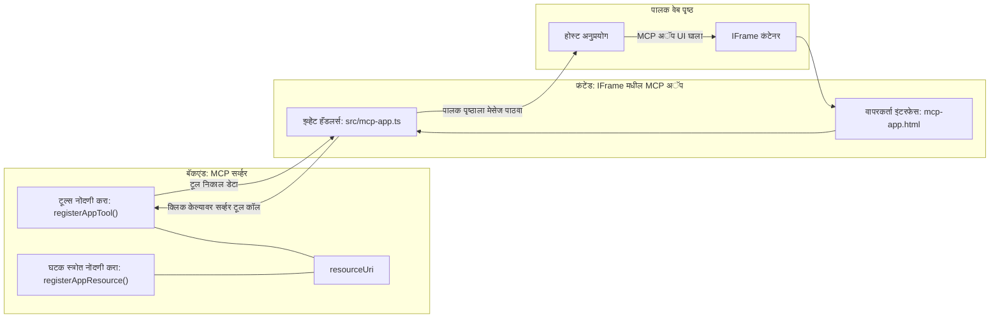
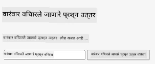
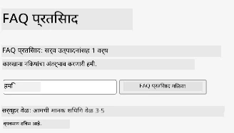
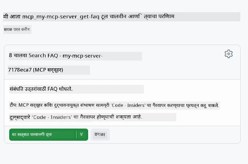
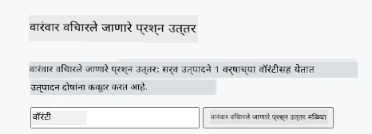

# MCP ऍप्स

MCP ऍप्स हे MCP मधील एक नवीन पॅराडाइम आहे. संकल्पना अशी आहे की तुम्ही फक्त टूल कॉलमधून डेटा परत देत नाही, तर तुम्ही या माहितीशी कशी संवाद साधायची यावर माहिती देखील पुरवता. याचा अर्थ असा की टूल परिणामांमध्ये आता UI माहिती असू शकते. पण आपण ते का करायचे? बरं, विचार करा तुम्ही आज कसे काम करता. तुम्ही बहुधा MCP सर्व्हरच्या परिणामांचा वापर करून त्याआधारे काही प्रकारचे फ्रंटेंड सेट करता, ते कोड तुम्हाला लिहावे आणि देखभाल करावी लागते. कधी कधी तेच हवं असतं, पण कधी कधी जर तुम्हाला स्वतंत्रपणे एक थोडकासा माहितीचा तुकडा आणता आला ज्यात डेटा पासून युजर इंटरफेसपर्यंत सर्वकाही असेल तर ते छान ठरेल.

## आढावा

हा धडा MCP ऍप्सवर व्यावहारिक मार्गदर्शन पुरवतो, त्यास कसे सुरू करायचे आणि आपल्या विद्यमान वेब ऍप्समध्ये कसे एकत्रित करायचे याबद्दल माहिती देतो. MCP ऍप्स हे MCP स्टँडर्डमध्ये एक नवीन भर आहे.

## शिकण्याचे उद्दिष्टे

या धड्याच्या शेवटी, तुम्ही करू शकाल:

- MCP ऍप्स काय आहेत हे समजावून सांगणे.
- कधी MCP ऍप्स वापरायचे आहे ते जाणून घेणे.
- तुमचे स्वतःचे MCP ऍप्स तयार करणे आणि समाकलित करणे.

## MCP ऍप्स - हे कसे कार्य करते

MCP ऍप्सची संकल्पना अशी आहे की प्रतिसाद म्हणजे मुख्यत्वे एक घटक (component) असतो जो रेंडर होतो. असा घटक दोन्ही व्हिज्युअल आणि इंटरएक्टिविटी ठेवू शकतो, उदा. बटण क्लिक, वापरकर्त्याचा इनपुट आणि बरेच काही. चला सर्व्हर बाजूने आणि आपले MCP सर्व्हर कडून सुरू करू. MCP ऍप कॉम्पोनंट तयार करण्यासाठी तुम्हाला टूल तयार करावा लागेल आणि अ‍ॅप्लिकेशन रिसोर्स देखील. हे दोन भाग resourceUri ने जोडलेले असतात.

एक उदाहरण येथे आहे. चला काय involved आहे आणि कोणता भाग काय करतो ते पाहूयात:

```text
server.ts -- responsible for registering tools and the component as a UI component
src/
  mcp-app.ts -- wiring up event handlers
mcp-app.html -- the user interface
```

हा व्हिज्युअल घटक तयार करण्याचा आर्किटेक्चर आणि त्याची लॉजिक दर्शवतो.


चला पुढे बॅकएंड आणि फ्रंटएंडच्या जबाबदाऱ्या स्पष्ट करूया.

### बॅकएंड

आपल्याला येथे दोन गोष्टी साध्य करायच्या आहेत:

- जे टूल्स वापरायच्या आहेत त्यांना नोंदणी करणे.
- घटक परिभाषित करणे.

**टूल नोंदणी**

```typescript
registerAppTool(
    server,
    "get-time",
    {
      title: "Get Time",
      description: "Returns the current server time.",
      inputSchema: {},
      _meta: { ui: { resourceUri } }, // या साधनाला त्याच्या UI संसाधनाशी लिंक करते
    },
    async () => {
      const time = new Date().toISOString();
      return { content: [{ type: "text", text: time }] };
    },
  );

```

वरील कोडमध्ये फक्त एक `get-time` नावाचा टूल तयार केलेला आहे. त्याला कोणताही इनपुट नाही पण तो सध्याचा वेळ उत्पादन करतो. आपल्याला इनपुट स्वीकारायची गरज असल्यास `inputSchema` देखील टूलसाठी परिभाषित करता येते.

**घटक नोंदणी**

त्याच फाईलमध्ये, आपण घटक नोंदणी देखील करतो:

```typescript
const resourceUri = "ui://get-time/mcp-app.html";

// संसाधन नोंदणी करा, जे UI साठी जोडलेले HTML/JavaScript परत करते.
registerAppResource(
  server,
  resourceUri,
  resourceUri,
  { mimeType: RESOURCE_MIME_TYPE },
  async () => {
    const html = await fs.readFile(path.join(DIST_DIR, "mcp-app.html"), "utf-8");

    return {
    contents: [
        { uri: resourceUri, mimeType: RESOURCE_MIME_TYPE, text: html },
    ],
    };
  },
);
```

कसे `resourceUri` द्वारे घटक आणि त्याच्या टूल्सना जोडले आहे ते लक्ष द्या. المक्ष आहे कॉलबॅक जो UI फाईल लोड करून घटक परत करतो.

### घटक फ्रंटएंड

बॅकएंडप्रमाणेच, येथेही दोन भाग आहेत:

- शुद्ध HTML मध्ये लिहिलेले फ्रंटएंड.
- इव्हेंट्स हाताळणारा आणि काय करायचे हे ठरवणारा कोड, उदा. टूल कॉल करणे किंवा पॅरेंट विंडोला संदेश पाठवणे.

**युजर इंटरफेस**

युजर इंटरफेस पाहूया:

```html
<!-- mcp-app.html -->
<!DOCTYPE html>
<html lang="en">
  <head>
    <meta charset="UTF-8" />
    <title>Get Time App</title>
  </head>
  <body>
    <p>
      <strong>Server Time:</strong> <code id="server-time">Loading...</code>
    </p>
    <button id="get-time-btn">Get Server Time</button>
    <script type="module" src="/src/mcp-app.ts"></script>
  </body>
</html>
```

**इव्हेंट वायअरअप**

शेवटचा भाग म्हणजे इव्हेंट वायअरअप. म्हणजे आपल्या UI मध्ये कोठल्या भागाला इव्हेंट हँडलर्स हवेत आणि इव्हेंट्स वर काय करायचे ते ठरवणे:

```typescript
// mcp-app.ts

import { App } from "@modelcontextprotocol/ext-apps";

// घटक संदर्भ मिळवा
const serverTimeEl = document.getElementById("server-time")!;
const getTimeBtn = document.getElementById("get-time-btn")!;

// अॅप उदाहरण तयार करा
const app = new App({ name: "Get Time App", version: "1.0.0" });

// सर्व्हरकडून साधन परिणाम हाताळा. प्रारंभी `app.connect()` च्या आधी सेट करा जेणेकरून
// प्रारंभिक साधन परिणाम गहाळ होणार नाही.
app.ontoolresult = (result) => {
  const time = result.content?.find((c) => c.type === "text")?.text;
  serverTimeEl.textContent = time ?? "[ERROR]";
};

// बटण क्लिकना जोडणे
getTimeBtn.addEventListener("click", async () => {
  // `app.callServerTool()` UI ला सर्व्हरकडून ताजे डेटा मागणी करण्याची परवानगी देते
  const result = await app.callServerTool({ name: "get-time", arguments: {} });
  const time = result.content?.find((c) => c.type === "text")?.text;
  serverTimeEl.textContent = time ?? "[ERROR]";
});

// होस्टशी कनेक्ट करा
app.connect();
```

वरील नमुन्यातून तुम्ही पाहू शकता की हे DOM घटकांना इव्हेंट्सशी जोडण्यासाठी सामान्य कोड आहे. विशेष म्हणजे `callServerTool` कॉल जे बॅकएंडवर टूल कॉल करते.

## वापरकर्त्याच्या इनपुटशी कसे वागायचे

आत्तापर्यंत आपण एक घटक पाहिला ज्यात बटण आहे आणि ते क्लिक केल्यावर टूल कॉल होते. आता पाहूया की आपण आणखी UI घटक जोडू शकतो का जसे इनपुट फील्ड आणि स्क्रीनवरून टूलला आर्ग्युमेंट्स पाठवू शकतो का. चला FAQ फंक्शनॅलिटी राबवूया. ते कसे काम करेल:

- एक बटण आणि इनपुट घटक असेल जिथे वापरकर्ता "Shipping" सारखा कीवर्ड टाइप करून शोधेल. हे बॅकएंडवर टूल कॉल करेल जे FAQ डेटामध्ये शोधेल.
- एक टूल जो या FAQ शोधांना समर्थन देतो.

प्रथम बॅकएंडसाठी आवश्यक असलेली मदत जोडा:

```typescript
const faq: { [key: string]: string } = {
    "shipping": "Our standard shipping time is 3-5 business days.",
    "return policy": "You can return any item within 30 days of purchase.",
    "warranty": "All products come with a 1-year warranty covering manufacturing defects.",
  }

registerAppTool(
    server,
    "get-faq",
    {
      title: "Search FAQ",
      description: "Searches the FAQ for relevant answers.",
      inputSchema: zod.object({
        query: zod.string().default("shipping"),
      }),
      _meta: { ui: { resourceUri: faqResourceUri } }, // या साधनाला त्याच्या UI संसाधनाशी लिंक करा
    },
    async ({ query }) => {
      const answer: string = faq[query.toLowerCase()] || "Sorry, I don't have an answer for that.";
      return { content: [{ type: "text", text: answer }] };
    },
  );
```

इथे आपण पाहतो की कसे `inputSchema` भरले जाते आणि त्याला `zod` स्कीमा दिली जाते:

```typescript
inputSchema: zod.object({
  query: zod.string().default("shipping"),
})
```

वरील स्कीमामध्ये आपण `query` नावाचा इनपुट पॅरामीटर दिला आहे जो ऐच्छिक आहे आणि ज्याची डीफॉल्ट व्हॅल्यू "shipping" आहे.

चला पुढे *mcp-app.html* मध्ये पाहूया आम्हाला काय UI तयार करायचं आहे:

```html
<div class="faq">
    <h1>FAQ response</h1>
    <p>FAQ Response: <code id="faq-response">Loading...</code></p>
    <input type="text" id="faq-query" placeholder="Enter FAQ query" />
    <button id="get-faq-btn">Get FAQ Response</button>
  </div>
```

छान, आता इनपुट घटक आणि बटण आहे. पुढे *mcp-app.ts* मध्ये जाऊया आणि या इव्हेंट्सना वायअर करूया:

```typescript
const getFaqBtn = document.getElementById("get-faq-btn")!;
const faqQueryInput = document.getElementById("faq-query") as HTMLInputElement;

getFaqBtn.addEventListener("click", async () => {
  const query = faqQueryInput.value;
  const result = await app.callServerTool({ name: "get-faq", arguments: { query } });
  const faq = result.content?.find((c) => c.type === "text")?.text;
  faqResponseEl.textContent = faq ?? "[ERROR]";
});
```

वरील कोडमध्ये आपण:

- स्वारस्य असलेल्या UI घटकांचे संदर्भ तयार केले.
- बटण क्लिक हाताळले ज्यातून इनपुटचा मूल्य मिळवले आणि `app.callServerTool()` कॉल केला, ज्यात `name` आणि `arguments` पास केला गेले, जिथे `arguments` मध्ये `query` व्हॅल्यू देण्यात आली.

प्रत्यक्षात जे होते ते म्हणजे `callServerTool` एक संदेश पॅरेंट विंडोत पाठवते आणि ती विंडो MCP सर्व्हरला कॉल करते.

### प्रयत्न करा

हे प्रयत्न करून आपल्याला खालील दिसेल:



आणि येथे इनपुटसह "warranty" वापरून प्रयत्न करत आहोत:



हा कोड चालवण्यासाठी [Code section](./code/README.md) येथे जा.

## Visual Studio Code मध्ये टेस्टिंग

Visual Studio Code मध्ये MVP ऍप्ससाठी उत्कृष्ट समर्थन आहे आणि हे तुमचे MCP ऍप्स तपासण्याचा सर्वात सोपा मार्ग असू शकतो. Visual Studio Code वापरण्यासाठी, *mcp.json* मध्ये असा सर्व्हर एन्ट्री जोडा:

```json
"my-mcp-server-7178eca7": {
    "url": "http://localhost:3001/mcp",
    "type": "http"
  }
```

नंतर सर्व्हर सुरू करा, तुम्ही Chat Window द्वारे तुमच्या MCP ऍपशी संवाद साधू शकाल जर तुमच्याकडे GitHub Copilot इन्स्टॉल असेल.

प्रॉम्प्टने चालू करतात, उदाहरणार्थ "#get-faq":



आणि वेब ब्राउझर मध्ये चालवल्याप्रमाणे ते असेच रेंडर होते:



## असाइनमेंट

एक रॉक पेपर सिसर गेम तयार करा. त्यात खालील असाव्यात:

UI:

- पर्यायांसह ड्रॉप डाउन यादी
- निवड सादर करण्यासाठी बटण
- जो कोणता निवडला आणि कोण जिंकला ते दाखवणारा लेबल

सर्व्हर:

- "choice" हा इनपुट घेणारा रॉक पेपर सिसर टूल
- एक संगणकाची निवड रेंडर करेल आणि विजेता ठरवेल

## सोल्युशन

[Solution](./assignment/README.md)

## सारांश

आपण MCP ऍप्सच्या या नवीन पॅराडाइमबद्दल शिकून घेतले. हे एक नवीन पॅराडाइम आहे जे MCP सर्व्हरना केवळ डेटा नव्हे तर तो डेटा कसा सादर करायचा यावरही मत द्यावे देते.

याशिवाय, आम्ही शिकले की हे MCP ऍप्स IFrame मध्ये होस्ट केले जातात आणि MCP सर्व्हरशी संवाद साधण्यासाठी ते पालक वेब ऍपला संदेश पाठवतात. या संवादासाठी plain JavaScript, React आणि इतर अनेक लायब्ररी उपलब्ध आहेत ज्यामुळे हे संवाद सुलभ होतो.

## प्रमुख गोष्टी

तुम्हाला काय शिकायला मिळालं:

- MCP ऍप्स हा एक नवीन स्टँडर्ड आहे जो डेटा आणि UI वैशिष्ट्ये दोन्ही पाठवण्यास उपयुक्त आहे.
- सुरक्षा कारणांनी हे ऍप्स IFrame मध्ये चालतात.

## पुढे काय

- [अध्याय 4](../../04-PracticalImplementation/README.md)

---

<!-- CO-OP TRANSLATOR DISCLAIMER START -->
**अस्वीकरण**:  
हे दस्तऐवज AI अनुवाद सेव्हिस [Co-op Translator](https://github.com/Azure/co-op-translator) वापरून अनुवादित केलेले आहे. आम्ही अचूकतेसाठी प्रयत्नशील आहोत, तरी कृपया लक्षात घ्या की स्वयंचलित अनुवादांमध्ये चुका किंवा अपूर्णता असू शकते. मूळ दस्तऐवज त्याच्या स्थानिक भाषेत अधिकृत स्रोत मानला जावा. महत्त्वाच्या माहितीसाठी व्यावसायिक मानवी अनुवाद सुचविला जातो. या अनुवादाच्या वापरामुळे होणाऱ्या कोणत्याही गैरसमजुतीसाठी किंवा चुकीच्या अर्थलागीसाठी आम्ही जबाबदार नाही.
<!-- CO-OP TRANSLATOR DISCLAIMER END -->