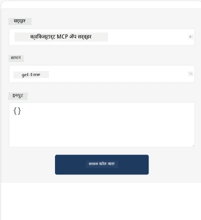
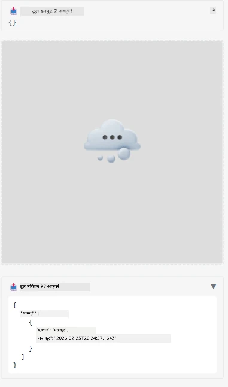

म्हणून हे MCP अ‍ॅप दाखवणारे एक नमुना आहे

## इन्स्टॉल करा

1. *mcp-app* फोल्डरमध्ये जा
1. `npm install` चालवा, यामुळे फ्रंटेंड आणि बॅकएंड डिपेंडन्सी इन्स्टॉल होतील

खालीलप्रमाणे बॅकएंड कम्पाईल होते का तपासा:

```sh
npx tsc --noEmit
```

सर्व काही ठीक असल्यास कोणताही आउटपुट नसावा.

## बॅकएंड चालवा

> तुम्ही Windows मशीनवर असल्यास यामध्ये थोडा अधिक प्रयत्न लागतो कारण MCP अ‍ॅप्स सोल्यूशन `concurrently` लायब्ररी वापरते, ज्यासाठी तुम्हाला पर्यायी पर्याय शोधावा लागेल. MCP अ‍ॅपमधील *package.json* मधील त्रुटी करणारी ओळ:

    ```json
    "start": "concurrently \"cross-env NODE_ENV=development INPUT=mcp-app.html vite build --watch\" \"tsx watch main.ts\""
    ```

या अ‍ॅपच्या दोन भाग आहेत, एक बॅकएंड भाग आणि एक होस्ट भाग.

खालीलप्रमाणे बॅकएंड सुरू करा:

```sh
npm start
```

हे `http://localhost:3001/mcp` वर बॅकएंड सुरू करेल.

> लक्षात ठेवा, तुम्ही Codespace मध्ये असाल तर पोर्ट दृश्य सार्वजनिक सेट करावे लागेल. तुम्ही ब्राउझरमध्ये या URL द्वारे एण्डपॉइंटपर्यंत पोहोचू शकता https://<name of Codespace>.app.github.dev/mcp

## पर्याय -1 Visual Studio Code मध्ये अ‍ॅप टेस्ट करा

Visual Studio Code मध्ये सोल्यूशन तपासण्यासाठी, खालीलप्रमाणे करा:

- `mcp.json` मध्ये खालीलप्रमाणे एक सर्व्हर एन्ट्री जोडा:

    ```json
    {
        "servers": {
            "my-mcp-server-7178eca7": {
                "url": "http://localhost:3001/mcp",
                "type": "http"
            }
        },
        "inputs": []
    }
    ```

1. *mcp.json* मधील "start" बटणावर क्लिक करा
1. एक चॅट विंडो उघडा आणि `get-faq` लिहा, तुम्हाला खालीलप्रमाणे निकाल दिसेल:

    

## पर्याय -2- होस्ट वापरून अ‍ॅप टेस्ट करा

रीपो <https://github.com/modelcontextprotocol/ext-apps> मध्ये अनेक वेगवेगळे होस्ट आहेत जे तुम्ही तुमचे MVP अ‍ॅप्स तपासण्यासाठी वापरू शकता.

इथे आम्ही तुम्हाला दोन वेगळे पर्याय देत आहोत:

### स्थानिक मशीन

- रीपो क्लोन केल्यावर *ext-apps* मध्ये जा.

- डिपेंडन्सी इन्स्टॉल करा

   ```sh
   npm install
   ```

- वेगळ्या टर्मिनल विंडोमध्ये, *ext-apps/examples/basic-host* मध्ये जा

    > जर तुम्ही Codespace वापरत असाल, तर serve.ts मध्ये ओळ 27 येथील http://localhost:3001/mcp हा URL तुमच्या Codespace बॅकएंड URL ने बदला, उदाहरणार्थ https://psychic-xylophone-657rpjgvxpc5g64-3001.app.github.dev/mcp

- होस्ट चालवा:

    ```sh
    npm start
    ```

    यामुळे होस्ट बॅकएंडशी कनेक्ट होईल आणि तुम्हाला खालीलप्रमाणे अ‍ॅप सुरू झालेले दिसेल:

    

### Codespace

Codespace पर्यावरण कार्यान्वित करण्यासाठी काही अतिरिक्त प्रयत्न लागतो. Codespace द्वारे होस्ट वापरण्यासाठी:

- *ext-apps* डिरेक्टरीमध्ये जा आणि *examples/basic-host* मध्ये नेव्हिगेट करा.
- डिपेंडन्सी इन्स्टॉल करण्यासाठी `npm install` चालवा
- होस्ट सुरू करण्यासाठी `npm start` चालवा.

## अ‍ॅप तपासा

खालीलप्रमाणे अ‍ॅप वापरून पाहा:

- "Call Tool" बटण निवडा आणि खालीलप्रमाणे निकाल दिसतील:

    

छान, सर्व काही सुरळीत आहे.

---

<!-- CO-OP TRANSLATOR DISCLAIMER START -->
**सूचना**:
हे दस्तऐवज AI अनुवाद सेवा [Co-op Translator](https://github.com/Azure/co-op-translator) वापरून अनुवादित करण्यात आले आहे. आम्ही अचूकतेसाठी प्रयत्न करतो, तरी कृपया जाणून घ्या की स्वयंचलित अनुवादांमध्ये त्रुटी किंवा अचूकतेच्या दोष असू शकतात. मूळ दस्तऐवज त्याच्या मूळ भाषेत हा प्राधान्य स्रोत मानावा. महत्वाची माहिती साठी व्यावसायिक मानवी अनुवादाची शिफारस केली जाते. या अनुवादाच्या वापरामुळे उद्भवणाऱ्या कोणत्याही गैरसमज किंवा चुकीच्या अर्थनिर्देशांसाठी आम्ही जबाबदार नाही.
<!-- CO-OP TRANSLATOR DISCLAIMER END -->