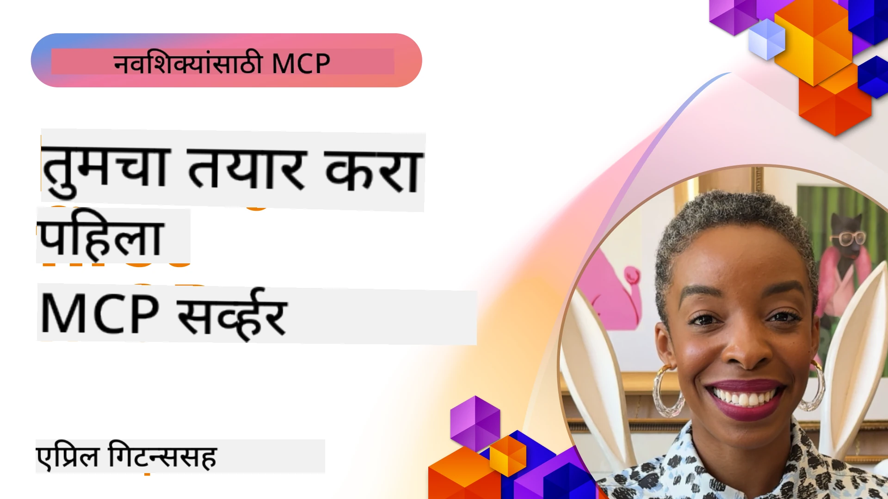

## प्रारंभ करणे  

_(या धड्याचा व्हिडिओ पाहण्यासाठी वर दिलेल्या प्रतिमेवर क्लिक करा)_

हा विभाग अनेक धडे यांचा समावेश करतो:

- **1 तुमचा पहिला सर्व्हर**, या पहिल्या धड्यात, तुम्हाला तुमचा पहिला सर्व्हर कसा तयार करायचा आणि निरीक्षक साधनाद्वारे त्याचे परीक्षण कसे करायचे ते शिकवले जाईल, हा तुमच्या सर्व्हरचा तपासणी आणि डिबगिंग करण्याचा एक मौल्यवान मार्ग आहे, [धड्यासाठी](01-first-server/README.md)

- **2 ग्राहक**, या धड्यात, तुम्ही तुमच्या सर्व्हरशी कनेक्ट होणारा ग्राहक कसा लिहायचा ते शिकाल, [धड्यासाठी](02-client/README.md)

- **3 LLM सह ग्राहक**, ग्राहक लिहिण्याचा आणखी एक चांगला मार्ग म्हणजे त्यात LLM जोडणे जेणेकरून तो तुमच्या सर्व्हरशी "वाटाघाटी" करू शकेल की काय करायचे, [धड्यासाठी](03-llm-client/README.md)

- **4 Visual Studio Code मध्ये GitHub Copilot एजंट मोड वापरून सर्व्हर वापरणे**. येथे आपण Visual Studio Code मधून आमचा MCP सर्व्हर चालवत आहोत, [धड्यासाठी](04-vscode/README.md)

- **5 stdio ट्रान्स्पोर्ट सर्व्हर** stdio ट्रान्स्पोर्ट ही स्थानिक MCP सर्व्हर-ग्राहक संवादासाठी शिफारस केलेली मानक पद्धत आहे, जी अंगभूत प्रक्रिया पृथक्करणासह सुरक्षित उपप्रक्रिया-आधारित संवाद प्रदान करते [धड्यासाठी](05-stdio-server/README.md)

- **6 MCP सह HTTP स्ट्रीमिंग (Streamable HTTP)**. आधुनिक HTTP स्ट्रीमिंग ट्रान्स्पोर्ट (दूरचा MCP सर्व्हरसाठी शिफारस केलेला दृष्टिकोन [MCP Specification 2025-11-25](https://spec.modelcontextprotocol.io/specification/2025-11-25/basic/transports/#streamable-http)) बद्दल शिका, प्रगती सूचनांसह, आणि कसे स्केलेबल, रिअल-टाइम MCP सर्व्हर आणि ग्राहक Streamable HTTP वापरून तयार करायचे. [धड्यासाठी](06-http-streaming/README.md)

- **7 VSCode साठी AI टूलकिटचा उपयोग** करून तुमचे MCP ग्राहक आणि सर्व्हर वापरणे आणि चाचणी घेणे [धड्यासाठी](07-aitk/README.md)

- **8 चाचणी**. येथे आपण विशेषतः वेगवेगळ्या पद्धतीने तुमच्या सर्व्हर व ग्राहकाची चाचणी कशी करायची ते पहाणार आहोत, [धड्यासाठी](08-testing/README.md)

- **9 वितरण**. हा प्रकरण तुमच्या MCP उपाययोजनांचा वेगवेगळ्या पद्धतीने वितरण पाहील, [धड्यासाठी](09-deployment/README.md)

- **10 प्रगत सर्व्हर वापर**. हा प्रकरण प्रगत सर्व्हर वापराचा समावेश करतो, [धड्यासाठी](./10-advanced/README.md)

- **11 प्रमाणीकरण**. हे प्रकरण सोपे प्रमाणीकरण कसे जोडायचे यावर लक्ष देते, बेसिक ऑथपासून JWT आणि RBAC वापरण्यापर्यंत. तुम्हाला येथे सुरूवात करण्याचे प्रोत्साहन दिले जाते आणि नंतर प्रकरण 5 मधील प्रगत विषय पहा आणि प्रकरण 2 मधील शिफारशींच्या माध्यमातून अतिरिक्त सुरक्षा कशी वाढवायची ते करा, [धड्यासाठी](./11-simple-auth/README.md)

- **12 MCP होस्ट्स**. क्लॉड डेस्कटॉप, कर्सर, क्लाइन आणि विंडसर्फ यांसह लोकप्रिय MCP होस्ट ग्राहक कसे संरचीत आणि वापरायचे ते शिका. ट्रान्स्पोर्ट प्रकार आणि समस्या निवारण समजून घ्या, [धड्यासाठी](./12-mcp-hosts/README.md)

- **13 MCP निरीक्षक**. MCP निरीक्षक साधन वापरून तुमचे MCP सर्व्हर इंटरॅक्टिव रूपात डिबग आणि चाचणी करा. साधने, संसाधने आणि प्रोटोकॉल संदेशांचे समस्या निवारण करा, [धड्यासाठी](./13-mcp-inspector/README.md)

- **14 नमुना घेणे**. LLM संबंधित कार्यांवर MCP ग्राहकांसह सहकार्य करणारे MCP सर्व्हर तयार करा. [धड्यासाठी](./14-sampling/README.md)

- **15 MCP अॅप्स**. UI सूचना सुद्धा परत देणारे MCP सर्व्हर तयार करा, [धड्यासाठी](./15-mcp-apps/README.md)

Model Context Protocol (MCP) हा एक खुला प्रोटोकॉल आहे जो LLMs ला संदर्भ देण्याचा मानकीकृत मार्ग प्रदान करतो. MCP ला AI अनुप्रयोगांसाठी USB-C पोर्ट म्हणून विचार करा - तो AI मॉडेल्सना वेगवेगळ्या डेटा स्रोतांशी आणि साधनांशी कनेक्ट करण्यासाठी एक मानकीकृत मार्ग पुरवतो.

## शिकण्याच्या उद्दिष्टे

या धडा पूर्ण झाल्यावर, तुम्ही सक्षम असाल:

- C#, Java, Python, TypeScript, आणि JavaScript मध्ये MCP साठी विकासात्मक वातावरण सेटअप करणे
- कस्टम वैशिष्ट्यांसह (संसाधने, प्रॉम्प्ट्स, आणि साधने) मूलभूत MCP सर्व्हर तयार करणे आणि तैनात करणे
- MCP सर्व्हरशी कनेक्ट होणारी होस्ट अॅप्लिकेशन्स तयार करणे
- MCP अंमलबजावणीची चाचणी आणि डिबगिंग करणे
- सामान्य सेटअप आव्हाने आणि त्यांची सोडवणूक समजून घेणे
- लोकप्रिय LLM सेवा यांच्याशी तुमच्या MCP अंमलबजावणींना कनेक्ट करणे

## तुमचे MCP वातावरण सेट करणे

MCP सोबत काम करण्याआधी, तुमचे विकास वातावरण तयार करणे आणि मूलभूत कार्यप्रवाह समजून घेणे महत्त्वाचे आहे. हा विभाग तुम्हाला सुरेखपणे सुरुवात करण्यासाठी सुरवातीच्या सेटअप पावलांमध्ये मार्गदर्शन करेल.

### पूर्व-आवश्यकता

MCP विकास सुरू करण्याआधी, खात्री करा की तुमच्याकडे आहे:

- **विकास वातावरण**: तुमच्या निवडलेल्या भाषेसाठी (C#, Java, Python, TypeScript, किंवा JavaScript)
- **IDE/एडिटर**: Visual Studio, Visual Studio Code, IntelliJ, Eclipse, PyCharm, किंवा कोणताही आधुनिक कोड एडिटर
- **पॅकेज मॅनेजर्स**: NuGet, Maven/Gradle, pip, किंवा npm/yarn
- **API कीज़**: ग्राहक अॅप्लिकेशन्समध्ये वापरण्यासाठी कोणत्याही AI सेवा वापरण्याची योजना असल्यास

### अधिकृत SDKs

पुढील प्रकरणांमध्ये तुम्ही Python, TypeScript, Java आणि .NET वापरून तयार केलेल्या उपाययोजना पाहाल. येथे सर्व अधिकृतपणे समर्थित SDKs दिले आहेत.

MCP विविध भाषांसाठी अधिकृत SDKs प्रदान करते (जो [MCP Specification 2025-11-25](https://spec.modelcontextprotocol.io/specification/2025-11-25/) शी सांगडलेले आहे):
- [C# SDK](https://github.com/modelcontextprotocol/csharp-sdk) - Microsoft सह सहकार्याने व्यवस्थापित
- [Java SDK](https://github.com/modelcontextprotocol/java-sdk) - Spring AI सह सहकार्याने व्यवस्थापित
- [TypeScript SDK](https://github.com/modelcontextprotocol/typescript-sdk) - अधिकृत TypeScript अंमलबजावणी
- [Python SDK](https://github.com/modelcontextprotocol/python-sdk) - अधिकृत Python अंमलबजावणी (FastMCP)
- [Kotlin SDK](https://github.com/modelcontextprotocol/kotlin-sdk) - अधिकृत Kotlin अंमलबजावणी
- [Swift SDK](https://github.com/modelcontextprotocol/swift-sdk) - Loopwork AI सह सहकार्याने व्यवस्थापित
- [Rust SDK](https://github.com/modelcontextprotocol/rust-sdk) - अधिकृत Rust अंमलबजावणी
- [Go SDK](https://github.com/modelcontextprotocol/go-sdk) - अधिकृत Go अंमलबजावणी

## मुख्य मुद्दे

- MCP विकास वातावरण सेट करणे भाषानुसार SDKs सोबत सोपे आहे
- MCP सर्व्हर्स तयार करणे म्हणजे स्पष्ट योजनेने साधने तयार करणे आणि नोंदणी करणे होय
- MCP ग्राहक सर्व्हर्स आणि मॉडेल्सशी कनेक्ट होतात जेणेकरून विस्तारित क्षमता वापरता येते
- चाचणी आणि डिबगिंग विश्वासार्ह MCP अंमलबजावणीसाठी आवश्यक आहे
- वितरणाच्या पर्यायांमध्ये स्थानिक विकासापासून ते क्लाउड-आधारित उपाययोजना समाविष्ट आहेत

## सराव करणे

आमच्याकडे काही नमुने आहेत जे या विभागातील सर्व प्रकरणांतील सरावासाठी योग्य आहेत. याव्यतिरिक्त प्रत्येक प्रकरणाचे स्वतःचे सराव आणि असाईनमेंट्स आहेत

- [Java कॅल्क्युलेटर](./samples/java/calculator/README.md)
- [.Net कॅल्क्युलेटर](../../../03-GettingStarted/samples/csharp)
- [JavaScript कॅल्क्युलेटर](./samples/javascript/README.md)
- [TypeScript कॅल्क्युलेटर](./samples/typescript/README.md)
- [Python कॅल्क्युलेटर](../../../03-GettingStarted/samples/python)

## अतिरिक्त संसाधने

- [Azure वरील Model Context Protocol वापरून एजंट तयार करणे](https://learn.microsoft.com/azure/developer/ai/intro-agents-mcp)
- [Azure कंटेनर अॅप्ससह रिमोट MCP (Node.js/TypeScript/JavaScript)](https://learn.microsoft.com/samples/azure-samples/mcp-container-ts/mcp-container-ts/)
- [.NET OpenAI MCP एजंट](https://learn.microsoft.com/samples/azure-samples/openai-mcp-agent-dotnet/openai-mcp-agent-dotnet/)

## पुढे काय

पहिल्या धड्यापासून सुरू करा: [तुमचा पहिला MCP सर्व्हर तयार करणे](01-first-server/README.md)

हा मॉड्यूल पूर्ण केल्यावर पुढे जा: [मॉड्यूल 4: व्यावहारिक अंमलबजावणी](../04-PracticalImplementation/README.md)

---

<!-- CO-OP TRANSLATOR DISCLAIMER START -->
**अस्वीकरण**:
हा दस्तऐवज AI अनुवाद सेवेद्वारे [Co-op Translator](https://github.com/Azure/co-op-translator) वापरून भाषांतरित केला आहे. आम्ही अचूकतेसाठी प्रयत्न करतो, तरी कृपया लक्षात घ्या की स्वयंचलित भाषांतरांमध्ये चुका किंवा अपूर्णता असू शकतात. मूळ दस्तऐवज त्याच्या स्थानिक भाषेत अधिकृत स्रोत मानला जाणे आवश्यक आहे. महत्त्वपूर्ण माहितीकरिता व्यावसायिक मानवी भाषांतराचे सल्ला दिला जातो. या भाषांतराच्या वापरामुळे उद्भवलेल्या कुठल्याही गैरसमज किंवा चुकीच्या अर्थांसाठी आम्ही जबाबदार नाही.
<!-- CO-OP TRANSLATOR DISCLAIMER END -->