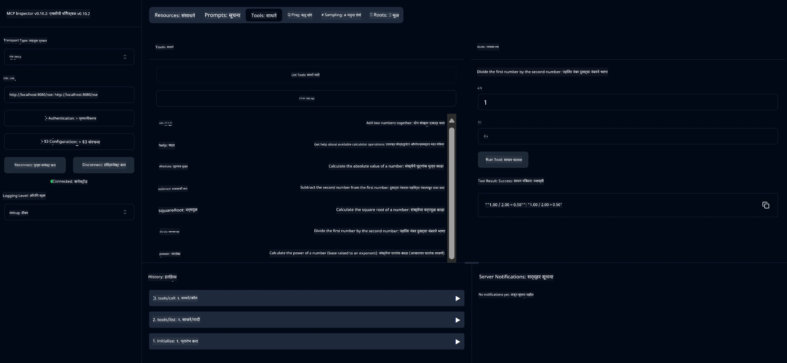

# बेसिक कॅलक्युलेटर MCP सेवा

> [!NOTE]
> हा नमुना वारसा HTTP+SSE ट्रान्सपोर्ट वापरतो आणि MCP `2025-11-25` शी सुसंगत SDK ला लक्ष्य करतो.
> नवीन रिमोट सर्व्हर्सला `2026-07-28` स्ट्रीम करण्यायोग्य HTTP समर्थन वापरावे.


- SSE (सर्व्हर-सेंड इव्हेंट) साठी समर्थन
- स्प्रिंग AI च्या `@Tool` चिन्हाचा वापर करून स्वयंचलित टूल नोंदणी
- बेसिक कॅलक्युलेटर कार्ये:
  - बेरीज, वजाबाकी, गुणाकार, भागाकार
  - शक्ती गणना आणि वर्गमुळ
  - शेषफल (मोड्युलस) आणि पूर्णांक मूल्य
  - ऑपरेशन वर्णनेसाठी मदत कार्य


   - दोन संख्यांची बेरीज
   - एका संख्येपासून दुसरी वजाबाकी
   - दोन संख्यांचा गुणाकार
   - एका संख्येचा दुसरीने भागाकार (शून्य विभाजन तपासणीसह)


   - शक्ती गणना (एखाद्या आधारावर घातांक लावणे)
   - वर्गमुळ गणना (नकारात्मक संख्या तपासणीसह)
   - शेषफल (मोड्युलस) गणना
   - पूर्णांक मूल्य गणना


   - उपलब्ध ऑपरेशन्सचे स्पष्टीकरण देणारे अंगभूत मदत कार्य


- `subtract(a, b)`: दुसरी संख्या पहिल्यापासून वजा करा
- `multiply(a, b)`: दोन संख्यांचा गुणाकार करा
- `divide(a, b)`: पहिल्या संख्येचे दुसऱ्या संख्या द्वारे भागाकार करा (शून्य तपासणीसह)
- `power(base, exponent)`: संख्येची शक्ती गणना करा
- `squareRoot(number)`: वर्गमुळ गणना करा (नकारात्मक संख्या तपासणीसह)
- `modulus(a, b)`: भागाकार केल्यावर उरलेले शेषफळ गणना करा
- `absolute(number)`: पूर्णांक मूल्य गणना करा
- `help()`: उपलब्ध ऑपरेशन्सबद्दल माहिती मिळवा


   
   GitHub चे AI मॉडेल्स (उदा. phi-4) वापरण्यासाठी आपल्याला GitHub वैयक्तिक प्रवेश टोकन आवश्यक आहे:


   
   b. "Generate new token" → "Generate new token (classic)" वर क्लिक करा
   
   c. आपल्या टोकनला अर्थपूर्ण नाव द्या
   
   d. खालील स्कोप निवडा:
      - `repo` (खाजगी रिपॉझिटरीजचे पूर्ण नियंत्रण)
      - `read:org` (संस्था आणि संघ सदस्यत्व वाचन, संस्था प्रकल्प वाचन)
      - `gist` (गिस्ट तयार करा)
      - `gist` (गिस्ट तयार करा)

      - `user:email` (वापरकर्त्याच्या ईमेल पत्त्यांवर प्रवेश (फक्त वाचन))
   
   e. "Generate token" क्लिक करा आणि आपल्या नवीन टोकनची कॉपी करा
   
   f. ते एक पर्यावरण चल म्हणून सेट करा:
      
      विंडोजवर:
      ```
      set GITHUB_TOKEN=your-github-token
      ```
      
      मॅकओएस/लिनक्सवर:
      ```bash
      export GITHUB_TOKEN=your-github-token
      ```

   g. कायमस्वरूपी सेटअपसाठी, ते सिस्टम सेटिंग्जमधून आपल्या पर्यावरण चलात जोडा

2. आपल्या प्रकल्पात LangChain4j GitHub अवलंबित्व जोडा (आधीच pom.xml मध्ये समाविष्ट आहे):
   ```xml
   <dependency>
       <groupId>dev.langchain4j</groupId>
       <artifactId>langchain4j-github</artifactId>
       <version>${langchain4j.version}</version>
   </dependency>
   ```

3. निश्चित करा की कॅल्क्युलेटर सर्व्हर `localhost:8080` वर चालू आहे

### LangChain4j क्लायंट चालविणे

हा उदाहरण दर्शवितो:
- SSE ट्रान्सपोर्टद्वारे कॅल्क्युलेटर MCP सर्व्हरशी कनेक्ट करणे
- कॅल्क्युलेटर ऑपरेशन्सचा लाभ घेणारा चॅट बोट तयार करण्यासाठी LangChain4j वापरणे
- GitHub AI मॉडेल्ससह एकत्रीकरण (आता phi-4 मॉडेल वापरत आहे)

क्लायंट पुढील नमुना क्वेरीज पाठवतो मार्गदर्शनासाठी:
1. दोन संख्यांचा बेरीज काढणे
2. एका संख्येचा वर्गमूल काढणे
3. उपलब्ध कॅल्क्युलेटर ऑपरेशन्स बद्दल मदत माहिती मिळवणे

उदाहरण चालवा आणि कन्सोल आउटपुट तपासा यासाठी की AI मॉडेल कसे कॅल्क्युलेटर साधने वापरून क्वेरीजना प्रतिसाद देते.

### GitHub मॉडेल कॉन्फिगरेशन

LangChain4j क्लायंट GitHub च्या phi-4 मॉडेलसह खालील सेटिंग्ज वापरून कॉन्फिगर केले गेले आहे:

```java
ChatLanguageModel model = GitHubChatModel.builder()
    .apiKey(System.getenv("GITHUB_TOKEN"))
    .timeout(Duration.ofSeconds(60))
    .modelName("phi-4")
    .logRequests(true)
    .logResponses(true)
    .build();
```

वेगळे GitHub मॉडेल वापरण्यासाठी, `modelName` पॅरामीटर एका इतर समर्थित मॉडेलवर बदला (उदा., "claude-3-haiku-20240307", "llama-3-70b-8192", इत्यादी).

## अवलंबित्वे

प्रकल्पाला खालील मुख्य अवलंबित्वे आवश्यक आहेत:

```xml
<!-- For MCP Server -->
<dependency>
    <groupId>org.springframework.ai</groupId>
    <artifactId>spring-ai-starter-mcp-server-webflux</artifactId>
</dependency>

<!-- For LangChain4j integration -->
<dependency>
    <groupId>dev.langchain4j</groupId>
    <artifactId>langchain4j-mcp</artifactId>
    <version>${langchain4j.version}</version>
</dependency>

<!-- For GitHub models support -->
<dependency>
    <groupId>dev.langchain4j</groupId>
    <artifactId>langchain4j-github</artifactId>
    <version>${langchain4j.version}</version>
</dependency>
```

## प्रकल्प तयार करणे

Maven वापरून प्रकल्प तयार करा:
```bash
./mvnw clean install -DskipTests
```

## सर्व्हर चालविणे

### Java वापरून

```bash
java -jar target/calculator-server-0.0.1-SNAPSHOT.jar
```

### MCP Inspector वापरून

MCP Inspector हा MCP सेवा संवाद साधण्यासाठी उपयुक्त साधन आहे. या कॅल्क्युलेटर सेवेसाठी ते वापरण्यासाठी:

1. **नवीन टर्मिनल विंडोमध्ये MCP Inspector स्थापित करा आणि चालवा**:
   ```bash
   npx @modelcontextprotocol/inspector
   ```

2. **वेब UI वर प्रवेश करा** अ‍ॅपद्वारे दर्शविलेल्या URL क्लिक करून (सामान्यपणे http://localhost:6274)

3. **कनेक्शन कॉन्फिगर करा**:
   - ट्रान्सपोर्ट प्रकार "SSE" सेट करा
   - URL सेट करा तुमच्या चालू सर्व्हरच्या SSE एंडपॉइंटला: `http://localhost:8080/sse`
   - "Connect" क्लिक करा

4. **साधने वापरा**:
   - उपलब्ध कॅल्क्युलेटर ऑपरेशन्स पाहण्यासाठी "List Tools" क्लिक करा
   - एखादी साधन निवडा आणि ऑपरेशन चालविण्यासाठी "Run Tool" क्लिक करा



### Docker वापरून

प्रकल्पात कंटेनरायझेशनसाठी Dockerfile समाविष्ट आहे:

1. **Docker प्रतिमा तयार करा**:
   ```bash
   docker build -t calculator-mcp-service .
   ```

2. **Docker कंटेनर चालवा**:
   ```bash
   docker run -p 8080:8080 calculator-mcp-service
   ```

यामुळे:
- Maven 3.9.9 आणि Eclipse Temurin 24 JDK सह मल्टि-स्टेज Docker प्रतिमा तयार करेल
- एक ऑप्टिमाइझ केलेली कंटेनर प्रतिमा तयार करेल
- सेवा पोर्ट 8080 वर एक्सपोज करेल
- कंटेनरच्या आत MCP कॅल्क्युलेटर सेवा सुरू करेल

कंटेनर चालू झाल्यानंतर तुम्ही `http://localhost:8080` वर सेवा वापरू शकता.

## समस्या निवारण

### GitHub टोकन संबंधित सामान्य समस्या


1. **टोकन परवानगी समस्याः** जर तुम्हाला 403 फॉरबिडन त्रुटी येत असेल, तर तपासा की तुमच्या टोकनमध्ये पूर्वसूचीत केलेल्या पूर्वअटांप्रमाणे योग्य परवानग्या आहेत का.

2. **टोकन सापडले नाही:** जर तुम्हाला "No API key found" ही त्रुटी येत असेल, तर GITHUB_TOKEN पर्यावरण चालू सेव योग्य पद्धतीने सेट केले आहे का ते सुनिश्चित करा.

3. **दर मर्यादा:** GitHub API कडे दर मर्यादा आहेत. जर तुम्हाला दर मर्यादा त्रुटी (स्टेटस कोड 429) आली, तर पुन्हा प्रयत्न करण्यापूर्वी काही मिनिटे थांबा.

4. **टोकन कालबाह्यता:** GitHub टोकन्स कालबाह्य होऊ शकतात. काही वेळानंतर प्रमाणपत्र त्रुटी आल्यास, नवीन टोकन तयार करा आणि तुमचे पर्यावरण चालू सेवा अद्यावत करा.

अधिक मदतीसाठी, [LangChain4j दस्तऐवज](https://github.com/langchain4j/langchain4j) किंवा [GitHub API दस्तऐवज](https://docs.github.com/en/rest) पहा.

---

<!-- CO-OP TRANSLATOR DISCLAIMER START -->
**अस्वीकरण**:
हा दस्तऐवज AI भाषांतर सेवा [Co-op Translator](https://github.com/Azure/co-op-translator) चा वापर करून अनुवादित केला आहे. जरी आम्ही अचूकतेसाठी प्रयत्न करतो, तरी कृपया लक्षात घ्या की स्वयंचलित भाषांतरांमध्ये त्रुटी किंवा अचूकतेची कमतरता असू शकते. मूळ दस्तऐवज त्याच्या मूळ भाषेत अधिकृत स्रोत मानला पाहिजे. महत्त्वाची माहिती असल्यास, व्यावसायिक मानवी भाषांतराची शिफारस केली जाते. या भाषांतराच्या वापरामुळे उद्भवणाऱ्या कोणत्याही गैरसमज किंवा चुकीच्या अर्थलावणीसाठी आम्ही जबाबदार नाही.
<!-- CO-OP TRANSLATOR DISCLAIMER END -->